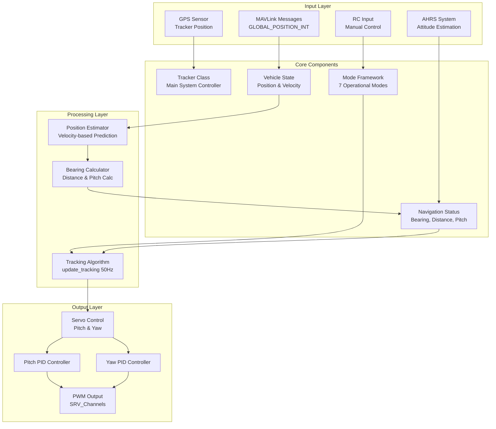
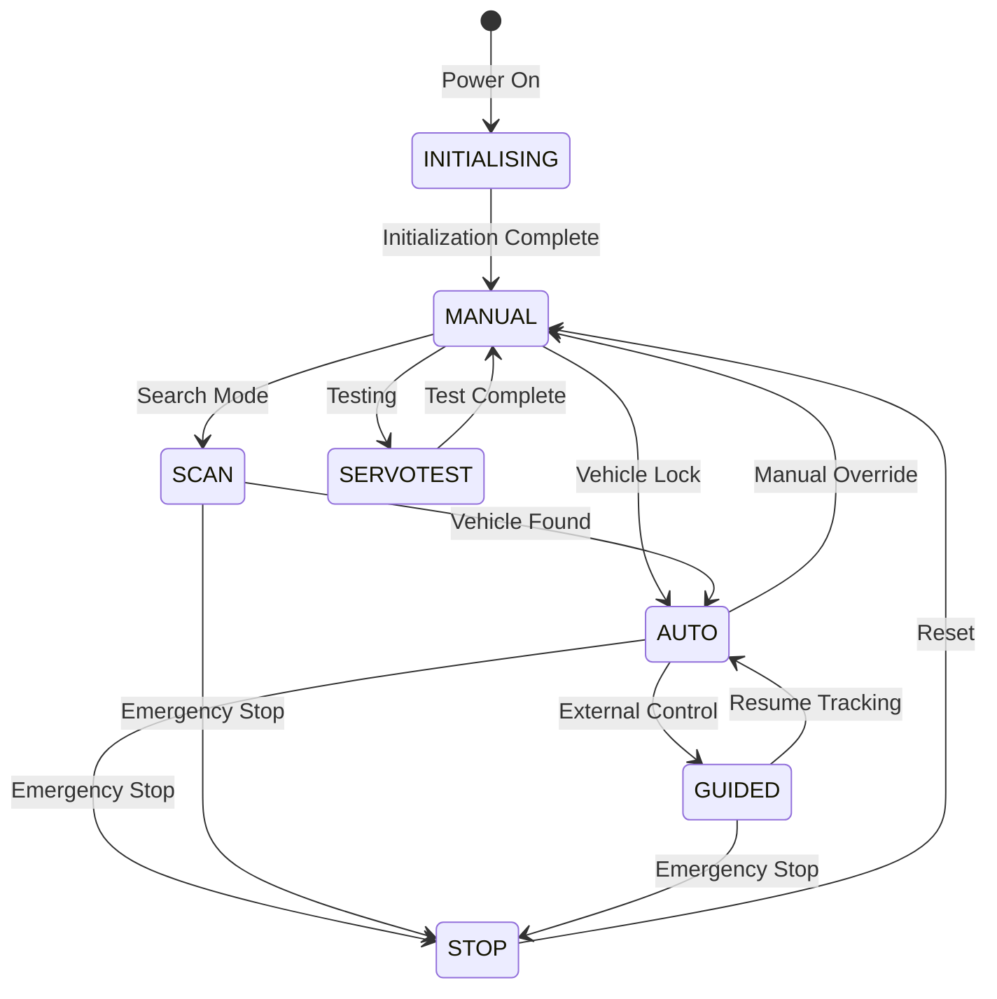

# AntennaTracker


## Table of Contents
- [Overview](#overview)
- [System Architecture](#system-architecture)
- [Tracking Algorithms](#tracking-algorithms)
- [Servo Control Systems](#servo-control-systems)
- [Operational Modes](#operational-modes)
- [MAVLink Integration](#mavlink-integration)
- [Hardware Integration](#hardware-integration)
- [Safety Systems](#safety-systems)
- [Configuration Parameters](#configuration-parameters)
- [Development Workflow](#development-workflow)
- [Testing](#testing)
- [Contributing](#contributing)

## Overview

The ArduPilot AntennaTracker is an advanced antenna tracking system designed to continuously point a directional antenna or camera towards a moving vehicle (aerial, ground, or marine). The system receives position updates via MAVLink telemetry and calculates the required servo movements to maintain accurate tracking of the target vehicle.

**Key Features**:
- Real-time vehicle position tracking with velocity-based prediction
- Support for multiple servo types (position, continuous rotation, on/off)
- Intelligent tracking algorithms with altitude source selection (GPS/Barometer)
- Six operational modes for different tracking scenarios
- MAVLink telemetry integration for position updates
- PID-based servo control with configurable tuning parameters
- Hardware abstraction for various autopilot boards
- Safety features including arming checks and failsafe mechanisms

**Source Files**: `/AntennaTracker/`

**Lead Developers**: Matthew Ridley and Andrew Tridgell

## System Architecture

The AntennaTracker system is built on the ArduPilot framework and utilizes a modular architecture with clear separation between tracking logic, servo control, and mode management.



### Main Loop Structure

The AntennaTracker operates on a scheduled task system defined in `Tracker.cpp:scheduler_tasks[]`:

| Task | Rate (Hz) | Max Time (μs) | Priority | Description |
|------|-----------|---------------|----------|-------------|
| update_ahrs | 50 | 1000 | 5 | Update attitude and heading reference system |
| read_radio | 50 | 200 | 10 | Read RC input for manual control |
| update_tracking | 50 | 1000 | 15 | **Main tracking loop** - vehicle position, servo control |
| update_GPS | 10 | 4000 | 20 | Update GPS position of tracker |
| update_compass | 10 | 1500 | 25 | Update compass readings |
| battery.read | 10 | 1500 | 35 | Monitor battery voltage and current |
| barometer.update | 10 | 1500 | 40 | Update barometric altitude |
| gcs.update_receive | 50 | 1700 | 45 | Receive MAVLink messages |
| gcs.update_send | 50 | 3000 | 50 | Send MAVLink telemetry |
| ten_hz_logging_loop | 10 | 300 | 60 | Log IMU, attitude, RC data |
| one_second_loop | 1 | 3900 | 80 | Periodic 1Hz tasks, home setting |

**Source**: `AntennaTracker/Tracker.cpp:50-67`

### Tracker Class Structure

The `Tracker` class (defined in `Tracker.h:58-229`) inherits from `AP_Vehicle` and serves as the central coordinator for all tracking operations.

**Key Members**:

```cpp
// Vehicle state tracking
struct {
    bool location_valid;           // true if we have valid vehicle position
    Location location;             // vehicle lat, long (degrees * 10^7), alt (meters * 100)
    Location location_estimate;    // position estimate with velocity prediction
    uint32_t last_update_us;       // timestamp of last position update (microseconds)
    Vector3f vel;                  // vehicle velocity in m/s (North, East, Down)
    int32_t relative_alt;          // vehicle relative altitude in meters * 100
} vehicle;

// Navigation and tracking state
struct NavStatus {
    float bearing;                 // bearing to vehicle in centi-degrees
    float distance;                // distance to vehicle in meters
    float pitch;                   // pitch angle to vehicle in degrees
    float angle_error_pitch;       // pitch error in centi-degrees (positive = target above)
    float angle_error_yaw;         // yaw error in centi-degrees (positive = target right)
    float alt_difference_baro;     // altitude difference via barometer (meters)
    float alt_difference_gps;      // altitude difference via GPS (meters)
    float altitude_offset;         // calibration offset for barometric altitude
    bool manual_control_yaw;       // true if manual yaw control active
    bool manual_control_pitch;     // true if manual pitch control active
    bool need_altitude_calibration;// true if baro calibration needed
    bool scan_reverse_pitch;       // scan mode pitch direction flag
    bool scan_reverse_yaw;         // scan mode yaw direction flag
} nav_status;
```

**Source**: `AntennaTracker/Tracker.h:109-134`

## Tracking Algorithms

The tracking system implements sophisticated algorithms for position estimation, bearing calculation, and pitch computation. All tracking operations run at 50Hz to ensure smooth and accurate antenna movement.

### Position Estimation with Velocity Prediction

The tracker maintains an estimated vehicle position that accounts for telemetry delays and lost packets by extrapolating using the vehicle's velocity vector.

**Algorithm** (`tracking.cpp:7-26`):

```cpp
void Tracker::update_vehicle_pos_estimate()
{
    // Calculate time since last actual position update
    float dt = (AP_HAL::micros() - vehicle.last_update_us) * 1.0e-6f;
    
    // If less than 5 seconds since last update, estimate the position
    if (dt < TRACKING_TIMEOUT_SEC) {
        // Project vehicle position using velocity
        vehicle.location_estimate = vehicle.location;
        float north_offset = vehicle.vel.x * dt;
        float east_offset = vehicle.vel.y * dt;
        vehicle.location_estimate.offset(north_offset, east_offset);
        vehicle.location_estimate.alt += vehicle.vel.z * 100.0f * dt;
        vehicle.location_valid = true;
    } else {
        // Vehicle lost - set invalid flag after 5 second timeout
        vehicle.location_valid = false;
    }
}
```

**Key Points**:
- Uses velocity-based dead reckoning to compensate for telemetry latency
- Timeout of 5 seconds (`TRACKING_TIMEOUT_SEC`) before marking vehicle as lost
- Maintains horizontal position using North and East velocity components
- Vertical position scaled by 100 to match ArduPilot altitude format (cm)
- Position marked invalid when timeout exceeded

### Bearing and Distance Calculation

The bearing and distance to the target vehicle are computed using geodetic calculations on the WGS84 ellipsoid.

**Algorithm** (`tracking.cpp:47-80`):

```cpp
void Tracker::update_bearing_and_distance()
{
    // Exit immediately if no valid vehicle position
    if (!vehicle.location_valid) {
        return;
    }
    
    // Calculate bearing to vehicle (skip in SCAN mode or manual yaw)
    if (mode != &mode_scan && !nav_status.manual_control_yaw) {
        nav_status.bearing = current_loc.get_bearing_to(vehicle.location_estimate) * 0.01f;
    }
    
    // Calculate distance to vehicle
    nav_status.distance = current_loc.get_distance(vehicle.location_estimate);
    
    // Calculate altitude difference using selected source
    if (g.alt_source == ALT_SOURCE_GPS) {
        nav_status.alt_difference_gps = (vehicle.location_estimate.alt - current_loc.alt) * 0.01f;
    } else {
        // ALT_SOURCE_GPS_VEH_ONLY: use vehicle's relative altitude
        nav_status.alt_difference_gps = vehicle.relative_alt * 0.01f;
    }
    
    // Calculate pitch angle to vehicle (skip in SCAN mode or manual pitch)
    if (mode->number() != Mode::Number::SCAN && !nav_status.manual_control_pitch) {
        if (g.alt_source == ALT_SOURCE_BARO) {
            nav_status.pitch = degrees(atan2f(nav_status.alt_difference_baro, nav_status.distance));
        } else {
            nav_status.pitch = degrees(atan2f(nav_status.alt_difference_gps, nav_status.distance));
        }
    }
}
```

**Bearing Calculation**:
- Uses `Location::get_bearing_to()` for geodetic bearing calculation
- Returns bearing in centi-degrees (0-36000 representing 0-360°)
- Skipped in SCAN mode or when manual yaw control is active

**Distance Calculation**:
- Uses `Location::get_distance()` for great-circle distance
- Returns distance in meters
- Always calculated when vehicle position is valid

**Pitch Calculation**:
- Computed as `atan2(altitude_difference, horizontal_distance)`
- Altitude source configurable: GPS or Barometer
- Positive pitch means vehicle is above tracker
- Negative pitch means vehicle is below tracker

### Altitude Source Selection

The tracker supports three altitude sources (`alt_source` parameter):

1. **ALT_SOURCE_GPS**: Use both tracker and vehicle GPS altitudes
   - Calculates difference: `vehicle_gps_alt - tracker_gps_alt`
   - Best for absolute altitude tracking

2. **ALT_SOURCE_GPS_VEH_ONLY**: Use vehicle's relative altitude
   - Uses vehicle's altitude relative to its home position
   - Ignores tracker GPS altitude
   - Useful when tracker doesn't have GPS

3. **ALT_SOURCE_BARO**: Use barometric altitude difference
   - Both tracker and vehicle must send pressure data
   - Includes automatic calibration offset
   - Best for relative altitude in areas with poor GPS

### Barometric Altitude Calibration

When using barometric altitude, the system automatically calibrates the altitude offset on first pressure update:

**Algorithm** (`tracking.cpp:158-181`):

```cpp
void Tracker::tracking_update_pressure(const mavlink_scaled_pressure_t &msg)
{
    float local_pressure = barometer.get_pressure();
    float aircraft_pressure = msg.press_abs * 100.0f;  // Convert to Pascals
    
    // Calculate altitude difference from pressure difference
    float alt_diff = barometer.get_altitude_difference(local_pressure, aircraft_pressure);
    
    if (!isnan(alt_diff) && !isinf(alt_diff)) {
        nav_status.alt_difference_baro = alt_diff + nav_status.altitude_offset;
        
        // First calibration - zero the altitude difference
        if (nav_status.need_altitude_calibration) {
            nav_status.altitude_offset = -alt_diff;
            nav_status.alt_difference_baro = 0;
            nav_status.need_altitude_calibration = false;
        }
    }
}
```

### Coordinate Frame Transformations

The tracking system performs coordinate transformations between earth frame (EF) and body frame (BF) to account for the tracker's attitude.

**Earth Frame to Body Frame** (`mode.cpp:104-110`):

```cpp
void Mode::convert_ef_to_bf(float pitch, float yaw, float& bf_pitch, float& bf_yaw)
{
    const AP_AHRS &ahrs = AP::ahrs();
    bf_pitch = ahrs.cos_roll() * pitch + ahrs.sin_roll() * ahrs.cos_pitch() * yaw;
    bf_yaw = -ahrs.sin_roll() * pitch + ahrs.cos_pitch() * ahrs.cos_roll() * yaw;
}
```

**Body Frame to Earth Frame** (`mode.cpp:112-123`):

```cpp
bool Mode::convert_bf_to_ef(float pitch, float yaw, float& ef_pitch, float& ef_yaw)
{
    const AP_AHRS &ahrs = AP::ahrs();
    // Avoid divide by zero
    if (is_zero(ahrs.cos_pitch())) {
        return false;
    }
    ef_pitch = ahrs.cos_roll() * pitch - ahrs.sin_roll() * yaw;
    ef_yaw = (ahrs.sin_roll() / ahrs.cos_pitch()) * pitch + 
             (ahrs.cos_roll() / ahrs.cos_pitch()) * yaw;
    return true;
}
```

**Purpose**: These transformations ensure accurate tracking even when the tracker platform itself is tilted or moving (e.g., mounted on a vehicle).

### Main Tracking Loop

The central tracking loop integrates all tracking algorithms and servo control:

**Algorithm** (`tracking.cpp:85-127`):

```cpp
void Tracker::update_tracking(void)
{
    // 1. Update vehicle position estimate with velocity prediction
    update_vehicle_pos_estimate();
    
    // 2. Update tracker's own position from GPS
    update_tracker_position();
    
    // 3. Calculate bearing, distance, and pitch to vehicle
    update_bearing_and_distance();
    
    // 4. Respect startup delay (allow servos to initialize)
    if (g.startup_delay > 0 && 
        AP_HAL::millis() - start_time_ms < g.startup_delay * 1000) {
        return;
    }
    
    // 5. Check safety switch state
    if (hal.util->safety_switch_state() == AP_HAL::Util::SAFETY_DISARMED) {
        return;
    }
    
    // 6. Handle armed/disarmed state
    if (!hal.util->get_soft_armed()) {
        // Disarmed: set servos to trim or zero based on DISARM_PWM parameter
        switch ((PWMDisarmed)g.disarm_pwm.get()) {
        case PWMDisarmed::TRIM:
            SRV_Channels::set_output_scaled(SRV_Channel::k_tracker_yaw, 0);
            SRV_Channels::set_output_scaled(SRV_Channel::k_tracker_pitch, 0);
            break;
        case PWMDisarmed::ZERO:
            SRV_Channels::set_output_pwm(SRV_Channel::k_tracker_yaw, 0);
            SRV_Channels::set_output_pwm(SRV_Channel::k_tracker_pitch, 0);
            break;
        }
    } else {
        // Armed: call mode-specific update function
        mode->update();
    }
    
    // 7. Convert servo_out to PWM and output to servos
    SRV_Channels::calc_pwm();
    SRV_Channels::output_ch_all();
}
```

**Execution Flow**:
1. Position estimation (with velocity prediction)
2. Tracker position update (from GPS)
3. Bearing and distance calculation
4. Startup delay check (configurable wait period)
5. Safety switch validation
6. Armed state handling and mode-specific control
7. PWM conversion and servo output

**Source**: `AntennaTracker/tracking.cpp:85-127`

## Servo Control Systems

The AntennaTracker supports three different servo types for both pitch and yaw axes, allowing compatibility with various antenna mount configurations.

### Servo Types

1. **Position Servos (SERVO_TYPE_POSITION)**: Standard hobby servos with limited rotation range
2. **Continuous Rotation Servos (SERVO_TYPE_CR)**: Modified servos that rotate continuously
3. **On/Off Servos (SERVO_TYPE_ONOFF)**: Bang-bang control for motorized mounts

Each axis (pitch and yaw) can independently use any of these servo types, configured via `SERVO_PITCH_TYPE` and `SERVO_YAW_TYPE` parameters.

### Servo Initialization

Servos are initialized during system startup with appropriate angle ranges and filter settings:

**Source** (`servos.cpp:8-27`):

```cpp
void Tracker::init_servos()
{
    // Enable auxiliary servo outputs
    AP::srv().enable_aux_servos();
    
    // Map tracker functions to servo channels
    SRV_Channels::set_default_function(CH_YAW, SRV_Channel::k_tracker_yaw);
    SRV_Channels::set_default_function(CH_PITCH, SRV_Channel::k_tracker_pitch);
    
    // Set yaw range: +/- (YAW_RANGE/2) in centi-degrees
    SRV_Channels::set_angle(SRV_Channel::k_tracker_yaw, g.yaw_range * 100/2);
    
    // Set pitch range: +/- ((PITCH_MAX - PITCH_MIN)/2) in centi-degrees
    SRV_Channels::set_angle(SRV_Channel::k_tracker_pitch, 
                            (-g.pitch_min + g.pitch_max) * 100/2);
    
    // Initialize PWM output
    SRV_Channels::calc_pwm();
    SRV_Channels::output_ch_all();
    
    // Initialize low-pass filters for servo output (cutoff: SERVO_OUT_FILT_HZ)
    yaw_servo_out_filt.set_cutoff_frequency(SERVO_OUT_FILT_HZ);
    pitch_servo_out_filt.set_cutoff_frequency(SERVO_OUT_FILT_HZ);
}
```

### Pitch Servo Control

#### Position Servo Mode (Default)

Uses PID control to drive the tracker's pitch to match the target pitch angle.

**Algorithm** (`servos.cpp:55-97`):

```cpp
void Tracker::update_pitch_position_servo()
{
    int32_t pitch_min_cd = g.pitch_min * 100;  // Convert degrees to centi-degrees
    int32_t pitch_max_cd = g.pitch_max * 100;
    
    // Calculate servo adjustment using PID controller
    // Inputs: angle_error_pitch (centi-degrees), G_Dt (time step)
    float new_servo_out = SRV_Channels::get_output_scaled(SRV_Channel::k_tracker_pitch) + 
                          g.pidPitch2Srv.update_error(nav_status.angle_error_pitch, G_Dt);
    
    // Apply position limits and reset integrator if saturated
    if (new_servo_out <= pitch_min_cd) {
        new_servo_out = pitch_min_cd;
        g.pidPitch2Srv.reset_I();  // Prevent integrator windup
    }
    if (new_servo_out >= pitch_max_cd) {
        new_servo_out = pitch_max_cd;
        g.pidPitch2Srv.reset_I();
    }
    
    // Output to servo channel
    SRV_Channels::set_output_scaled(SRV_Channel::k_tracker_pitch, new_servo_out);
    
    // Apply low-pass filter to smooth output
    if (pitch_servo_out_filt_init) {
        pitch_servo_out_filt.apply(new_servo_out, G_Dt);
    } else {
        pitch_servo_out_filt.reset(new_servo_out);
        pitch_servo_out_filt_init = true;
    }
}
```

**Configuration Example**:
```
# Pitch servo setup for HS-645MG servo with 180° mechanical range
RC2_MIN 640       # Minimum PWM (μs)
RC2_MAX 2540      # Maximum PWM (μs)
RC2_REV -1        # Reverse direction (if increasing PWM lowers elevation)
PITCH_MIN -90     # Minimum pitch angle (degrees)
PITCH_MAX 90      # Maximum pitch angle (degrees)

# PID tuning parameters
PITCH2SRV_P 0.100000   # Proportional gain
PITCH2SRV_I 0.020000   # Integral gain
PITCH2SRV_D 0.000000   # Derivative gain
PITCH2SRV_IMAX 4000.0  # Integrator limit (centi-degrees)
```

**Source**: `AntennaTracker/servos.cpp:55-97`

#### On/Off Servo Mode

Bang-bang control for motorized mounts with limit switches.

**Algorithm** (`servos.cpp:104-121`):

```cpp
void Tracker::update_pitch_onoff_servo(float pitch) const
{
    int32_t pitch_min_cd = g.pitch_min * 100;
    int32_t pitch_max_cd = g.pitch_max * 100;
    
    // Calculate acceptable error based on slew rate and minimum time
    float acceptable_error = g.onoff_pitch_rate * g.onoff_pitch_mintime;
    
    if (fabsf(nav_status.angle_error_pitch) < acceptable_error) {
        // Within acceptable error - stop motor
        SRV_Channels::set_output_scaled(SRV_Channel::k_tracker_pitch, 0);
    } else if ((nav_status.angle_error_pitch > 0) && (pitch*100 > pitch_min_cd)) {
        // Pointing too low - move up (negative servo output)
        SRV_Channels::set_output_scaled(SRV_Channel::k_tracker_pitch, -9000);
    } else if (pitch*100 < pitch_max_cd) {
        // Pointing too high - move down (positive servo output)
        SRV_Channels::set_output_scaled(SRV_Channel::k_tracker_pitch, 9000);
    }
}
```

**Parameters**:
- `ONOFF_PITCH_RATE`: Motor slew rate (degrees/second)
- `ONOFF_PITCH_MINTIME`: Minimum motor run time (seconds)
- Acceptable error = rate × mintime (prevents rapid on/off cycling)

#### Continuous Rotation Mode

For modified servos that rotate continuously based on PWM input.

**Algorithm** (`servos.cpp:126-130`):

```cpp
void Tracker::update_pitch_cr_servo(float pitch)
{
    // PID output directly controls rotation speed
    const float pitch_out = constrain_float(
        g.pidPitch2Srv.update_error(nav_status.angle_error_pitch, G_Dt),
        -(-g.pitch_min + g.pitch_max) * 100/2,
        (-g.pitch_min + g.pitch_max) * 100/2
    );
    SRV_Channels::set_output_scaled(SRV_Channel::k_tracker_pitch, pitch_out);
}
```

### Yaw Servo Control

#### Position Servo Mode (Default)

Handles the "ballerina" problem where the antenna must slew to the opposite side when servo limits are reached.

**Algorithm** (`servos.cpp:158-212`):

```cpp
void Tracker::update_yaw_position_servo()
{
    int32_t yaw_limit_cd = g.yaw_range * 100/2;  // Servo range limit
    
    // Calculate servo change using PID
    // Positive error = need clockwise rotation
    // Negative error = need counter-clockwise rotation
    float servo_change = g.pidYaw2Srv.update_error(nav_status.angle_error_yaw, G_Dt);
    servo_change = constrain_float(servo_change, -18000, 18000);
    
    float new_servo_out = constrain_float(
        SRV_Channels::get_output_scaled(SRV_Channel::k_tracker_yaw) + servo_change,
        -18000, 18000
    );
    
    // Apply position limits and handle integrator windup
    if (new_servo_out <= -yaw_limit_cd) {
        new_servo_out = -yaw_limit_cd;
        g.pidYaw2Srv.reset_I();
    }
    if (new_servo_out >= yaw_limit_cd) {
        new_servo_out = yaw_limit_cd;
        g.pidYaw2Srv.reset_I();
    }
    
    SRV_Channels::set_output_scaled(SRV_Channel::k_tracker_yaw, new_servo_out);
    
    // Apply low-pass filter
    if (yaw_servo_out_filt_init) {
        yaw_servo_out_filt.apply(new_servo_out, G_Dt);
    } else {
        yaw_servo_out_filt.reset(new_servo_out);
        yaw_servo_out_filt_init = true;
    }
}
```

**Configuration Example**:
```
# Yaw servo setup for 360° antenna rotation with 180° servo
RC1_MIN 680       # Minimum PWM (μs)
RC1_MAX 2380      # Maximum PWM (μs)
RC1_REV -1        # Reverse if large PWM moves antenna counter-clockwise
YAW_RANGE 360     # Total antenna rotation range (degrees)

# PID tuning
YAW2SRV_P 0.100000
YAW2SRV_I 0.020000
YAW2SRV_D 0.000000
YAW2SRV_IMAX 4000.0
```

**Direction Reversal Logic**: The system intelligently determines when to reverse direction to reach the target faster. This is computed in `Mode::get_ef_yaw_direction()` (`mode.cpp:126-176`) which analyzes whether taking the "long way" around is more efficient based on current servo position and limits.

#### On/Off Yaw Mode

Bang-bang control for yaw axis (`servos.cpp:220-234`):

```cpp
void Tracker::update_yaw_onoff_servo(float yaw) const
{
    float acceptable_error = g.onoff_yaw_rate * g.onoff_yaw_mintime;
    
    if (fabsf(nav_status.angle_error_yaw * 0.01f) < acceptable_error) {
        // Within tolerance - stop
        SRV_Channels::set_output_scaled(SRV_Channel::k_tracker_yaw, 0);
    } else if (nav_status.angle_error_yaw * 0.01f > 0) {
        // Counter-clockwise of target - move clockwise
        SRV_Channels::set_output_scaled(SRV_Channel::k_tracker_yaw, 18000);
    } else {
        // Clockwise of target - move counter-clockwise
        SRV_Channels::set_output_scaled(SRV_Channel::k_tracker_yaw, -18000);
    }
}
```

#### Continuous Rotation Yaw Mode

For continuously rotating yaw servos (`servos.cpp:239-243`):

```cpp
void Tracker::update_yaw_cr_servo(float yaw)
{
    const float yaw_out = constrain_float(
        -g.pidYaw2Srv.update_error(nav_status.angle_error_yaw, G_Dt),
        -g.yaw_range * 100/2,
        g.yaw_range * 100/2
    );
    SRV_Channels::set_output_scaled(SRV_Channel::k_tracker_yaw, yaw_out);
}
```

## Operational Modes

The AntennaTracker supports seven operational modes, each designed for specific tracking scenarios. Mode transitions can be triggered via RC input, MAVLink commands, or parameter settings.



### Mode Definitions

**Source**: `AntennaTracker/mode.h:8-17`

```cpp
enum class Number {
    MANUAL = 0,       // Manual control via RC input
    STOP = 1,         // All servo movement stopped
    SCAN = 2,         // Automatic horizon scanning
    SERVOTEST = 3,    // Individual servo testing
    GUIDED = 4,       // External attitude command control
    AUTO = 10,        // Automatic vehicle tracking
    INITIALISING = 16 // System startup mode
};
```

### Mode 0: MANUAL

Manual control mode allows direct pilot control of pitch and yaw via RC inputs.

**Characteristics**:
- Requires armed servos
- RC stick inputs directly command antenna position
- Overrides automatic tracking
- Useful for manual alignment and testing

**Update Method** (`mode.cpp` - ModeManual implementation):
```cpp
void ModeManual::update() override
{
    // Read RC inputs and directly control servos
    // Respects configured trim and range limits
    update_auto();  // Uses auto update but with manual nav_status values
}
```

### Mode 1: STOP

Emergency stop mode that halts all servo movement.

**Characteristics**:
- Does not require armed servos
- All servo outputs frozen
- Safety mode for troubleshooting
- Can be triggered remotely via MAVLink

**Update Method**:
```cpp
void ModeStop::update() override {}  // No operation
```

### Mode 2: SCAN

Automatic scanning mode for searching for a vehicle when position is unknown.

**Characteristics**:
- Requires armed servos
- Sweeps antenna across configured yaw and pitch ranges
- Automatically reverses direction at limits
- Useful for re-acquiring lost vehicles

**Algorithm** (`mode.cpp:29-64`):

```cpp
void Mode::update_scan(void)
{
    // Yaw scanning (azimuth sweep)
    if (!nav_status.manual_control_yaw) {
        float yaw_delta = g.scan_speed_yaw * 0.02f;  // Degrees per 50Hz update
        nav_status.bearing += yaw_delta * (nav_status.scan_reverse_yaw ? -1 : 1);
        
        // Reverse at limits (0° and 360°)
        if (nav_status.bearing < 0 && nav_status.scan_reverse_yaw) {
            nav_status.scan_reverse_yaw = false;
        }
        if (nav_status.bearing > 360 && !nav_status.scan_reverse_yaw) {
            nav_status.scan_reverse_yaw = true;
        }
        nav_status.bearing = constrain_float(nav_status.bearing, 0, 360);
    }
    
    // Pitch scanning (elevation sweep)
    if (!nav_status.manual_control_pitch) {
        const float pitch_delta = g.scan_speed_pitch * 0.02f;
        if (nav_status.scan_reverse_pitch) {
            nav_status.pitch -= pitch_delta;
            if (nav_status.pitch < g.pitch_min) {
                nav_status.scan_reverse_pitch = false;
            }
        } else {
            nav_status.pitch += pitch_delta;
            if (nav_status.pitch > g.pitch_max) {
                nav_status.scan_reverse_pitch = true;
            }
        }
        nav_status.pitch = constrain_float(nav_status.pitch, g.pitch_min, g.pitch_max);
    }
    
    // Execute servo movements using auto update
    update_auto();
}
```

**Parameters**:
- `SCAN_SPEED_YAW`: Yaw scan rate (degrees/second)
- `SCAN_SPEED_PITCH`: Pitch scan rate (degrees/second)

### Mode 3: SERVOTEST

Individual servo testing mode for configuration and calibration.

**Characteristics**:
- Requires armed servos
- Allows setting specific PWM values to individual servos
- Controlled via MAVLink `COMMAND_LONG` with `MAV_CMD_DO_SET_SERVO`
- Useful for verifying servo direction and range

**Method**:
```cpp
bool ModeServoTest::set_servo(uint8_t servo_num, uint16_t pwm)
{
    // Set specific servo to specific PWM value
    // Returns true if successful
}
```

### Mode 4: GUIDED

External control mode for attitude commands via MAVLink.

**Characteristics**:
- Requires armed servos
- Accepts `SET_ATTITUDE_TARGET` MAVLink messages
- Allows GCS or companion computer to directly command tracker attitude
- Supports yaw rate control

**Update Method** (`mode.cpp` - ModeGuided implementation):
```cpp
void ModeGuided::update() override
{
    // Process quaternion attitude target
    // Optionally use yaw rate command
    // Converts attitude to pitch/yaw angles
    update_auto();  // Execute servo control
}
```

**MAVLink Handler** (`GCS_MAVLink_Tracker.cpp:82-100`):
```cpp
void GCS_MAVLINK_Tracker::handle_set_attitude_target(const mavlink_message_t &msg)
{
    mavlink_set_attitude_target_t packet;
    mavlink_msg_set_attitude_target_decode(&msg, &packet);
    
    // Only accept commands in GUIDED mode
    if (tracker.mode != &tracker.mode_guided) {
        return;
    }
    
    // Sanity checks: no roll rate, proper type mask
    if (!is_zero(packet.body_roll_rate)) {
        return;
    }
    if (!(packet.type_mask & (1<<0))) {
        return;
    }
    
    // Set target attitude and yaw rate
    tracker.mode_guided.set_angle(
        Quaternion(packet.q),
        packet.type_mask & (1<<2),  // use_yaw_rate flag
        packet.body_yaw_rate
    );
}
```

### Mode 10: AUTO

Primary tracking mode that automatically points antenna at the target vehicle.

**Characteristics**:
- Requires armed servos
- Uses vehicle position from MAVLink `GLOBAL_POSITION_INT` messages
- Applies velocity-based position prediction
- Respects minimum distance threshold
- Compensates for tracker attitude (if mounted on moving platform)

**Algorithm** (`mode.cpp:5-27`):

```cpp
void Mode::update_auto(void)
{
    // Calculate target yaw with trim offset
    float yaw = wrap_180_cd((nav_status.bearing + g.yaw_trim) * 100);  // centi-degrees
    
    // Calculate target pitch with trim offset and limits
    float pitch = constrain_float(nav_status.pitch + g.pitch_trim, 
                                   g.pitch_min, g.pitch_max) * 100;  // centi-degrees
    
    // Determine if reverse direction is more efficient (for limited-range servos)
    bool direction_reversed = get_ef_yaw_direction();
    
    // Calculate angle errors (earth frame)
    calc_angle_error(pitch, yaw, direction_reversed);
    
    // Convert earth frame to body frame (accounts for tracker attitude)
    float bf_pitch, bf_yaw;
    convert_ef_to_bf(pitch, yaw, bf_pitch, bf_yaw);
    
    // Only move servos if target is beyond minimum distance (or no valid position)
    if ((g.distance_min <= 0) || (nav_status.distance >= g.distance_min) || 
        !tracker.vehicle.location_valid) {
        tracker.update_pitch_servo(bf_pitch);
        tracker.update_yaw_servo(bf_yaw);
    }
}
```

**Angle Error Calculation** (`mode.cpp:66-102`):

The system calculates both earth-frame and body-frame angle errors:

```cpp
void Mode::calc_angle_error(float pitch, float yaw, bool direction_reversed)
{
    const AP_AHRS &ahrs = AP::ahrs();
    
    // Pitch error (positive = target above current pitch)
    float ahrs_pitch = ahrs.pitch_sensor;  // Current pitch in centi-degrees
    int32_t ef_pitch_angle_error = pitch - ahrs_pitch;
    
    // Yaw error (positive = target right of current yaw)
    int32_t ahrs_yaw_cd = wrap_180_cd(ahrs.yaw_sensor);
    int32_t ef_yaw_angle_error = wrap_180_cd(yaw - ahrs_yaw_cd);
    
    // Handle direction reversal (take long way to target)
    if (direction_reversed) {
        if (ef_yaw_angle_error > 0) {
            ef_yaw_angle_error = (yaw - ahrs_yaw_cd) - 36000;
        } else {
            ef_yaw_angle_error = 36000 + (yaw - ahrs_yaw_cd);
        }
    }
    
    // Convert to body frame
    float bf_pitch_err, bf_yaw_err;
    convert_ef_to_bf(ef_pitch_angle_error, ef_yaw_angle_error, bf_pitch_err, bf_yaw_err);
    
    // Store in navigation status
    nav_status.angle_error_pitch = bf_pitch_err;
    nav_status.angle_error_yaw = bf_yaw_err;
    
    // Update PID controllers for logging
    g.pidPitch2Srv.set_target_rate(pitch * 0.01);
    g.pidPitch2Srv.set_actual_rate(ahrs_pitch * 0.01);
    g.pidYaw2Srv.set_target_rate(yaw * 0.01);
    g.pidYaw2Srv.set_actual_rate(ahrs_yaw_cd * 0.01);
}
```

### Mode 16: INITIALISING

Startup mode during system initialization.

**Characteristics**:
- Does not require armed servos
- Active during `init_ardupilot()` execution
- Automatically transitions to configured `INITIAL_MODE` after initialization
- No servo movement permitted

**Update Method**:
```cpp
void ModeInitialising::update() override {}  // No operation during initialization
```

### Mode Transitions

Mode changes are managed through the `set_mode()` function:

**Source** (`system.cpp` - function declarations in `Tracker.h:202-204`):

```cpp
void Tracker::set_mode(Mode &newmode, ModeReason reason)
{
    // Perform mode transition
    // Log mode change
    // Send MAVLink mode change notification
    mode = &newmode;
}

bool Tracker::set_mode(uint8_t new_mode, ModeReason reason)
{
    Mode *newmode = mode_from_mode_num((Mode::Number)new_mode);
    if (newmode == nullptr) {
        return false;  // Invalid mode number
    }
    set_mode(*newmode, reason);
    return true;
}
```

**Mode Reasons** (from AP_Vehicle):
- `STARTUP`: Initial mode set during boot
- `PILOT_INPUT`: RC or manual mode change
- `GCS_COMMAND`: MAVLink mode change request
- `FAILSAFE`: Triggered by safety failsafe
- `SERIALCONTROL`: Serial API mode change

## MAVLink Integration

The AntennaTracker uses MAVLink protocol for bidirectional communication with ground control stations (GCS) and target vehicles.

### Message Handling

The tracker processes several MAVLink messages for position updates and control commands.

#### GLOBAL_POSITION_INT (Message ID 33)

Primary message for vehicle position updates.

**Handler** (`tracking.cpp:132-152`):

```cpp
void Tracker::tracking_update_position(const mavlink_global_position_int_t &msg)
{
    // Reject invalid (0,0) coordinates
    if (!msg.lat && !msg.lon) {
        return;
    }
    
    // Update vehicle position (lat/lon in degrees * 1e7, alt in mm)
    vehicle.location.lat = msg.lat;
    vehicle.location.lng = msg.lon;
    vehicle.location.alt = msg.alt / 10;  // Convert mm to cm
    vehicle.relative_alt = msg.relative_alt / 10;  // Convert mm to cm
    
    // Update velocity (vx, vy, vz in cm/s)
    vehicle.vel = Vector3f(msg.vx * 0.01f, msg.vy * 0.01f, msg.vz * 0.01f);  // Convert to m/s
    
    // Update timestamps
    vehicle.last_update_us = AP_HAL::micros();
    vehicle.last_update_ms = AP_HAL::millis();
    
    // Log position update
    if (should_log(MASK_LOG_GPS)) {
        Log_Write_Vehicle_Pos(vehicle.location.lat, vehicle.location.lng, 
                              vehicle.location.alt, vehicle.vel);
    }
}
```

**Message Fields Used**:
- `lat`, `lon`: Position in degrees × 10^7
- `alt`: Absolute altitude in millimeters (AMSL)
- `relative_alt`: Altitude relative to home in millimeters
- `vx`, `vy`, `vz`: Velocity in cm/s (North, East, Down)

#### SCALED_PRESSURE (Message ID 29)

Provides barometric altitude data for relative altitude tracking.

**Handler** (`tracking.cpp:158-181`):

```cpp
void Tracker::tracking_update_pressure(const mavlink_scaled_pressure_t &msg)
{
    float local_pressure = barometer.get_pressure();       // Tracker barometer (Pa)
    float aircraft_pressure = msg.press_abs * 100.0f;      // Vehicle barometer (hPa → Pa)
    
    // Calculate altitude difference from pressure difference
    float alt_diff = barometer.get_altitude_difference(local_pressure, aircraft_pressure);
    
    if (!isnan(alt_diff) && !isinf(alt_diff)) {
        nav_status.alt_difference_baro = alt_diff + nav_status.altitude_offset;
        
        // Automatic calibration on first valid reading
        if (nav_status.need_altitude_calibration) {
            nav_status.altitude_offset = -alt_diff;
            nav_status.alt_difference_baro = 0;
            nav_status.need_altitude_calibration = false;
        }
    }
    
    // Log barometric data
    Log_Write_Vehicle_Baro(aircraft_pressure, alt_diff);
}
```

#### MANUAL_CONTROL (Message ID 69)

Allows direct antenna position control via MAVLink.

**Handler** (`tracking.cpp:186-194`):

```cpp
void Tracker::tracking_manual_control(const mavlink_manual_control_t &msg)
{
    // x axis: bearing/yaw command
    // y axis: pitch/elevation command
    nav_status.bearing = msg.x;
    nav_status.pitch   = msg.y;
    nav_status.distance = 0.0;
    
    // Check if manual control is active (0x7FFF = no command)
    nav_status.manual_control_yaw   = (msg.x != 0x7FFF);
    nav_status.manual_control_pitch = (msg.y != 0x7FFF);
    
    // z, r, and buttons fields are not used
}
```

#### SET_ATTITUDE_TARGET (Message ID 82)

Commands tracker attitude in GUIDED mode.

**Handler** (`GCS_MAVLink_Tracker.cpp:82-100`):

```cpp
void GCS_MAVLINK_Tracker::handle_set_attitude_target(const mavlink_message_t &msg)
{
    mavlink_set_attitude_target_t packet;
    mavlink_msg_set_attitude_target_decode(&msg, &packet);
    
    // Only process in GUIDED mode
    if (tracker.mode != &tracker.mode_guided) {
        return;
    }
    
    // Validate packet (no roll rate, proper type mask)
    if (!is_zero(packet.body_roll_rate)) {
        return;
    }
    if (!(packet.type_mask & (1<<0))) {
        return;
    }
    
    // Extract quaternion and yaw rate command
    tracker.mode_guided.set_angle(
        Quaternion(packet.q),
        packet.type_mask & (1<<2),  // use_yaw_rate flag (bit 2)
        packet.body_yaw_rate         // rad/s
    );
}
```

### Telemetry Streaming

The tracker sends status information back to the GCS.

#### NAV_CONTROLLER_OUTPUT (Message ID 62)

Reports tracking status to GCS.

**Sender** (`GCS_MAVLink_Tracker.cpp:66-80`):

```cpp
void GCS_MAVLINK_Tracker::send_nav_controller_output() const
{
    // Select altitude source (barometer or GPS)
    float alt_diff = (tracker.g.alt_source == ALT_SOURCE_BARO) ? 
                     tracker.nav_status.alt_difference_baro : 
                     tracker.nav_status.alt_difference_gps;
    
    mavlink_msg_nav_controller_output_send(
        chan,
        0,                              // nav_roll (not used)
        tracker.nav_status.pitch,       // nav_pitch (degrees)
        tracker.nav_status.bearing,     // nav_bearing (degrees)
        tracker.nav_status.bearing,     // target_bearing (degrees)
        MIN(tracker.nav_status.distance, UINT16_MAX),  // wp_dist (meters, capped)
        alt_diff,                       // alt_error (meters)
        0,                              // aspd_error (not used)
        0                               // xtrack_error (not used)
    );
}
```

This message is typically streamed at 2-10 Hz and provides real-time tracking status to the ground station.

### System Identification

The tracker identifies itself as `MAV_TYPE_ANTENNA_TRACKER` in the MAVLink `HEARTBEAT` message:

**Source** (`GCS_MAVLink_Tracker.cpp:4-7`):

```cpp
MAV_TYPE GCS_Tracker::frame_type() const
{
    return MAV_TYPE_ANTENNA_TRACKER;
}
```

### Base Mode Reporting

The tracker reports its operational state via the `HEARTBEAT` base_mode field:

**Source** (`GCS_MAVLink_Tracker.cpp:9-51`):

```cpp
uint8_t GCS_MAVLINK_Tracker::base_mode() const
{
    uint8_t _base_mode = MAV_MODE_FLAG_CUSTOM_MODE_ENABLED;
    
    switch (tracker.mode->number()) {
    case Mode::Number::MANUAL:
        _base_mode |= MAV_MODE_FLAG_MANUAL_INPUT_ENABLED;
        break;
    case Mode::Number::SCAN:
    case Mode::Number::SERVOTEST:
    case Mode::Number::AUTO:
    case Mode::Number::GUIDED:
        _base_mode |= MAV_MODE_FLAG_GUIDED_ENABLED | MAV_MODE_FLAG_STABILIZE_ENABLED;
        break;
    case Mode::Number::STOP:
    case Mode::Number::INITIALISING:
        break;
    }
    
    // Armed flag: safety switch enabled AND not initializing AND software armed
    if (hal.util->safety_switch_state() != AP_HAL::Util::SAFETY_DISARMED &&
        tracker.mode != &tracker.mode_initialising &&
        hal.util->get_soft_armed()) {
        _base_mode |= MAV_MODE_FLAG_SAFETY_ARMED;
    }
    
    return _base_mode;
}
```

### Custom Mode Reporting

The tracker mode number is directly reported as the custom_mode:

```cpp
uint32_t GCS_Tracker::custom_mode() const
{
    return (uint32_t)tracker.mode->number();
}
```

## Hardware Integration

The AntennaTracker is compatible with a wide range of ArduPilot-supported autopilot boards.

### Supported Autopilot Boards

The tracker inherits hardware support from the ArduPilot HAL (Hardware Abstraction Layer), providing compatibility with:

**ChibiOS-based Boards** (most common):
- Pixhawk series (Pixhawk 1/2/4/5/6)
- Cube series (CubeBlack, CubeOrange, CubePilot)
- Holybro Kakute and Durandal series
- mRo controllers
- Many F4/F7/H7-based flight controllers

**Linux-based Boards**:
- Raspberry Pi with Navio2
- BeagleBone Blue
- Intel Edison

**SITL (Software In The Loop)**:
- Desktop simulation for testing

Full board list: See `/libraries/AP_HAL_ChibiOS/hwdef/` directory

### Minimum Hardware Requirements

**Required Components**:
- Autopilot board with at least 2 PWM outputs
- GPS module (optional but recommended for mobile trackers)
- Telemetry radio (433 MHz, 915 MHz, or WiFi)
- 2 servos for pitch and yaw axes
- Power supply (5V for servos, 4.8-5.5V for autopilot)

**Optional Components**:
- Compass/magnetometer (for moving platforms)
- Barometer (for relative altitude tracking)
- RC receiver (for manual control)
- Buzzer and LED indicators
- Safety switch

### Servo Connections

The tracker uses two servo outputs:

| Servo Channel | Function | Default Pin | SRV_Channel Function |
|---------------|----------|-------------|----------------------|
| CH_YAW (typically SERVO1) | Yaw/Azimuth | Main Out 1 | k_tracker_yaw |
| CH_PITCH (typically SERVO2) | Pitch/Elevation | Main Out 2 | k_tracker_pitch |

**Configuration**:
```
SERVO1_FUNCTION 6  # Tracker Yaw
SERVO2_FUNCTION 7  # Tracker Pitch
```

**Source**: `AntennaTracker/servos.cpp:13-14`

### GPS Configuration

For mobile tracker platforms (e.g., mounted on a vehicle), GPS provides the tracker's position:

**Initialization** (`system.cpp:32-33`):
```cpp
gps.set_log_gps_bit(MASK_LOG_GPS);
gps.init();
```

If no GPS is available, the tracker uses the `START_LATITUDE` and `START_LONGITUDE` parameters as a fixed position.

### Compass/Magnetometer

For trackers mounted on moving platforms, a compass provides heading information:

**Initialization** (`system.cpp:28-29`):
```cpp
AP::compass().set_log_bit(MASK_LOG_COMPASS);
AP::compass().init();
```

### Barometer

Used for barometric altitude tracking (`ALT_SOURCE = 2`):

**Initialization** (`system.cpp:17-18`):
```cpp
barometer.set_log_baro_bit(MASK_LOG_IMU);
barometer.init();
```

### Telemetry Radio Configuration

Telemetry radios provide the MAVLink link between tracker and target vehicle.

**Typical Setup**:
- Serial port: SERIAL1 or SERIAL2
- Baud rate: 57600 (default) or 115200
- Protocol: MAVLink2
- System ID: 1-255 (must be unique on network)
- Target system ID: Configured via `SYSID_TARGET` parameter

**GCS Setup** (`system.cpp:21-25`):
```cpp
gcs().setup_uarts();  // Initialize all configured serial ports
gcs().update_send();  // Prime the telemetry streams
```

### Power Requirements

**Typical Power Consumption**:
- Autopilot board: 100-300 mA @ 5V
- GPS: 30-50 mA @ 5V
- Telemetry radio: 100-500 mA @ 5V (transmission dependent)
- Servos: 200-1000 mA @ 5V each (load dependent)

**Total estimated**: 1-2A @ 5V under normal operation

**Power Supply Recommendations**:
- Use regulated 5V power supply rated for at least 3A
- Separate power for servos and autopilot (with common ground)
- Voltage monitoring via battery monitor (optional)

### Hardware Initialization Sequence

**Source** (`system.cpp:6-83`):

```cpp
void Tracker::init_ardupilot()
{
    // 1. Initialize notification system (LEDs, buzzer)
    notify.init();
    AP_Notify::flags.pre_arm_check = true;
    AP_Notify::flags.pre_arm_gps_check = true;
    
    // 2. Initialize battery monitor
    battery.init();
    
    // 3. Initialize barometer
    barometer.set_log_baro_bit(MASK_LOG_IMU);
    barometer.init();
    
    // 4. Setup telemetry ports
    gcs().setup_uarts();
    gcs().update_send();
    
    // 5. Initialize compass
    AP::compass().set_log_bit(MASK_LOG_COMPASS);
    AP::compass().init();
    
    // 6. Initialize GPS
    gps.set_log_gps_bit(MASK_LOG_GPS);
    gps.init();
    
    // 7. Initialize AHRS (attitude estimation)
    ahrs.init();
    ahrs.set_fly_forward(false);  // Tracker doesn't "fly forward"
    
    // 8. Initialize IMU
    ins.init(scheduler.get_loop_rate_hz());
    ahrs.reset();
    
    // 9. Calibrate barometer
    barometer.calibrate();
    
    // 10. Initialize data logger
    logger.setVehicle_Startup_Writer(...);
    
    // 11. Initialize RC input
    rc().convert_options(...);
    rc().init();
    
    // 12. Initialize servos
    init_servos();
    
    // 13. Set initial position (from parameters or EEPROM)
    if (fabsf(g.start_latitude) <= 90.0f && fabsf(g.start_longitude) <= 180.0f) {
        current_loc.lat = g.start_latitude * 1.0e7f;
        current_loc.lng = g.start_longitude * 1.0e7f;
    }
    
    // 14. Set initial mode
    Mode *newmode = mode_from_mode_num((Mode::Number)g.initial_mode.get());
    if (newmode == nullptr) {
        newmode = &mode_manual;
    }
    set_mode(*newmode, ModeReason::STARTUP);
    
    // 15. Prepare servos (move to trim if startup_delay configured)
    if (g.startup_delay > 0) {
        prepare_servos();
    }
}
```

## Safety Systems

The AntennaTracker implements several safety mechanisms to prevent equipment damage and ensure safe operation.

### Arming and Disarming

The tracker uses an arming system similar to other ArduPilot vehicles, controlled by the `AP_Arming_Tracker` class.

**Arming Requirements**:
- All pre-arm checks must pass
- Safety switch (if present) must be enabled
- No critical failsafes active

**Servo Behavior When Disarmed** (`tracking.cpp:107-119`):

```cpp
if (!hal.util->get_soft_armed()) {
    // Disarmed state - configure servo output based on DISARM_PWM parameter
    switch ((PWMDisarmed)g.disarm_pwm.get()) {
    case PWMDisarmed::TRIM:
        // Set servos to trim position (neutral, typically 1500 μs)
        SRV_Channels::set_output_scaled(SRV_Channel::k_tracker_yaw, 0);
        SRV_Channels::set_output_scaled(SRV_Channel::k_tracker_pitch, 0);
        break;
    case PWMDisarmed::ZERO:
        // Set servos to zero PWM (no output)
        SRV_Channels::set_output_pwm(SRV_Channel::k_tracker_yaw, 0);
        SRV_Channels::set_output_pwm(SRV_Channel::k_tracker_pitch, 0);
        break;
    }
}
```

**Arming Methods**:
1. **RC Arming**: Yaw right + throttle down for 1 second (if configured)
2. **MAVLink Arming**: `COMMAND_LONG` with `MAV_CMD_COMPONENT_ARM_DISARM`
3. **GCS Button**: Ground station arming button

**Source**: `AntennaTracker/Tracker.h:67-68` (arm_servos/disarm_servos methods)

### Safety Switch

Hardware safety switch support (red button on many Pixhawk boards):

**Implementation** (`tracking.cpp:102-105`):

```cpp
// Do not move servos if safety switch is disarmed
if (hal.util->safety_switch_state() == AP_HAL::Util::SAFETY_DISARMED) {
    return;  // Skip all servo updates
}
```

When the safety switch is disarmed:
- All servo movement is inhibited
- Tracking calculations continue (but outputs are not applied)
- System remains responsive to commands
- LED indicator shows disarmed state

### Startup Delay

Configurable delay before servo movement begins, allowing servos to initialize and system to stabilize.

**Implementation** (`tracking.cpp:97-100`):

```cpp
// Respect startup delay parameter
if (g.startup_delay > 0 && 
    AP_HAL::millis() - start_time_ms < g.startup_delay * 1000) {
    return;  // Do not move servos yet
}
```

**Parameter**: `STARTUP_DELAY` (seconds, 0-60)

**During startup delay**:
- Servos may be positioned at trim values
- Tracking calculations are performed
- Vehicle position updates are received
- MAVLink telemetry is active

**Purpose**: Prevents sudden movements on power-up that could damage equipment or cause servo strain.

### Servo Position Limits

Hard limits prevent servos from being commanded beyond their mechanical or configured range.

**Pitch Limits** (`servos.cpp:57-58`, `80-87`):

```cpp
int32_t pitch_min_cd = g.pitch_min * 100;  // e.g., -90° = -9000 centi-degrees
int32_t pitch_max_cd = g.pitch_max * 100;  // e.g., +90° = +9000 centi-degrees

// Apply limits and prevent integrator windup
if (new_servo_out <= pitch_min_cd) {
    new_servo_out = pitch_min_cd;
    g.pidPitch2Srv.reset_I();  // Reset PID integrator
}
if (new_servo_out >= pitch_max_cd) {
    new_servo_out = pitch_max_cd;
    g.pidPitch2Srv.reset_I();
}
```

**Yaw Limits** (`servos.cpp:160`, `195-202`):

```cpp
int32_t yaw_limit_cd = g.yaw_range * 100/2;  // e.g., 360° range = ±180° = ±18000 cd

// Apply position limits
if (new_servo_out <= -yaw_limit_cd) {
    new_servo_out = -yaw_limit_cd;
    g.pidYaw2Srv.reset_I();
}
if (new_servo_out >= yaw_limit_cd) {
    new_servo_out = yaw_limit_cd;
    g.pidYaw2Srv.reset_I();
}
```

**Parameters**:
- `PITCH_MIN`: Minimum pitch angle (degrees, typically -90)
- `PITCH_MAX`: Maximum pitch angle (degrees, typically +90)
- `YAW_RANGE`: Total yaw range (degrees, typically 360)

### Minimum Tracking Distance

Prevents servo movement when target is too close, avoiding rapid oscillations at close range.

**Implementation** (`mode.cpp:22-26`):

```cpp
// Only move servos if target is beyond minimum distance
if ((g.distance_min <= 0) || 
    (nav_status.distance >= g.distance_min) || 
    !tracker.vehicle.location_valid) {
    tracker.update_pitch_servo(bf_pitch);
    tracker.update_yaw_servo(bf_yaw);
}
```

**Parameter**: `DISTANCE_MIN` (meters, 0-100)
- Set to 0 to disable minimum distance check
- Typical value: 5-10 meters

**Behavior when below minimum distance**:
- Servos hold last commanded position
- Tracking calculations continue
- Distance is still reported to GCS

### Vehicle Timeout and LED Indication

Visual feedback of vehicle tracking status via armed LED.

**Implementation** (`tracking.cpp:199-206`):

```cpp
void Tracker::update_armed_disarmed() const
{
    // Set armed LED if we've received position update within last 5 seconds
    if (vehicle.last_update_ms != 0 && 
        (AP_HAL::millis() - vehicle.last_update_ms) < TRACKING_TIMEOUT_MS) {
        AP_Notify::flags.armed = true;   // LED on (green)
    } else {
        AP_Notify::flags.armed = false;  // LED off/red
    }
}
```

**Constants**:
- `TRACKING_TIMEOUT_MS`: 5000 ms (5 seconds)
- `TRACKING_TIMEOUT_SEC`: 5.0 seconds

**LED States**:
- **Green/On**: Vehicle position recently received, tracking active
- **Red/Off**: Vehicle position lost or stale, tracking may be inaccurate

### Battery Failsafe

Battery monitoring with failsafe action support.

**Initialization** (`Tracker.h:91-93`):

```cpp
AP_BattMonitor battery{MASK_LOG_CURRENT,
                       FUNCTOR_BIND_MEMBER(&Tracker::handle_battery_failsafe, 
                                           void, const char*, const int8_t),
                       nullptr};
```

**Failsafe Handler** (`Tracker.h:182`):

```cpp
void handle_battery_failsafe(const char* type_str, const int8_t action);
```

**Typical Actions**:
- GCS notification via MAVLink
- Audio/visual warning
- Optional mode change (configurable)
- Logging of failsafe event

### PID Integrator Windup Prevention

Prevents PID integrator accumulation when servos are at limits.

**Implementation** (shown in servo limit sections above):

```cpp
if (new_servo_out <= limit) {
    new_servo_out = limit;
    g.pidPitch2Srv.reset_I();  // Reset integrator to prevent windup
}
```

**Purpose**: Without integrator reset, the PID controller would continue accumulating error even though the servo cannot move further, causing overshoot when the servo eventually moves back into range.

### Coordinate Validity Checks

Reject invalid GPS coordinates to prevent erratic behavior.

**Implementation** (`tracking.cpp:134-137`):

```cpp
void Tracker::tracking_update_position(const mavlink_global_position_int_t &msg)
{
    // Reject (0,0) coordinates - clearly invalid
    if (!msg.lat && !msg.lon) {
        return;
    }
    // ... continue with valid position update
}
```

### NaN/Inf Protection

Barometric altitude calculations protected against invalid floating-point values.

**Implementation** (`tracking.cpp:165-175`):

```cpp
float alt_diff = barometer.get_altitude_difference(local_pressure, aircraft_pressure);
if (!isnan(alt_diff) && !isinf(alt_diff)) {
    // Safe to use alt_diff
    nav_status.alt_difference_baro = alt_diff + nav_status.altitude_offset;
    // ... continue processing
}
// If NaN or Inf, silently skip update and retain previous value
```

## Configuration Parameters

The AntennaTracker behavior is controlled by numerous parameters stored in EEPROM. Parameters can be modified via ground station software or MAVLink commands.

### Servo Configuration Parameters

| Parameter | Type | Default | Range | Units | Description |
|-----------|------|---------|-------|-------|-------------|
| `SERVO_PITCH_TYPE` | Int8 | 0 | 0-2 | - | Pitch servo type: 0=Position, 1=OnOff, 2=CR |
| `SERVO_YAW_TYPE` | Int8 | 0 | 0-2 | - | Yaw servo type: 0=Position, 1=OnOff, 2=CR |
| `YAW_RANGE` | Int16 | 360 | 0-360 | deg | Total yaw movement range |
| `PITCH_MIN` | Int16 | -90 | -180-0 | deg | Minimum pitch angle (downward limit) |
| `PITCH_MAX` | Int16 | 90 | 0-180 | deg | Maximum pitch angle (upward limit) |
| `YAW_TRIM` | Float | 0 | -180-180 | deg | Yaw trim offset for antenna alignment |
| `PITCH_TRIM` | Float | 0 | -180-180 | deg | Pitch trim offset for antenna alignment |

**Source**: `AntennaTracker/Parameters.h:155-168`

### PID Tuning Parameters

Both pitch and yaw axes have independent PID controllers.

**Pitch PID** (pidPitch2Srv):

| Parameter | Default | Range | Description |
|-----------|---------|-------|-------------|
| `PITCH2SRV_P` | 0.2 | 0-10 | Proportional gain |
| `PITCH2SRV_I` | 0.0 | 0-10 | Integral gain |
| `PITCH2SRV_D` | 0.05 | 0-10 | Derivative gain |
| `PITCH2SRV_FF` | 0.02 | 0-10 | Feed-forward gain |
| `PITCH2SRV_IMAX` | 4000 | 0-18000 | Integrator limit (centi-degrees) |
| `PITCH2SRV_FILT` | 0.1 | 0-100 | Derivative filter frequency (Hz) |

**Yaw PID** (pidYaw2Srv):

| Parameter | Default | Range | Description |
|-----------|---------|-------|-------------|
| `YAW2SRV_P` | 0.2 | 0-10 | Proportional gain |
| `YAW2SRV_I` | 0.0 | 0-10 | Integral gain |
| `YAW2SRV_D` | 0.05 | 0-10 | Derivative gain |
| `YAW2SRV_FF` | 0.02 | 0-10 | Feed-forward gain |
| `YAW2SRV_IMAX` | 4000 | 0-18000 | Integrator limit (centi-degrees) |
| `YAW2SRV_FILT` | 0.1 | 0-100 | Derivative filter frequency (Hz) |

**Source**: `AntennaTracker/Parameters.h:181-186` (AC_PID initialization)

**Tuning Procedure**:
1. Start with P=0.1, I=0, D=0
2. Increase P until tracker follows target with minimal lag
3. Add I (typically 0.01-0.05) to eliminate steady-state error
4. Add D (typically 0.01-0.1) to reduce oscillations
5. Adjust IMAX to prevent integrator windup (typically P gain × 1000-4000)

### On/Off Servo Parameters

Used when `SERVO_*_TYPE = 1`:

| Parameter | Type | Default | Range | Units | Description |
|-----------|------|---------|-------|-------|-------------|
| `ONOFF_YAW_RATE` | Float | 9.0 | 0-180 | deg/s | Yaw motor slew rate |
| `ONOFF_YAW_MINTIME` | Float | 1.0 | 0-10 | s | Minimum yaw motor runtime |
| `ONOFF_PITCH_RATE` | Float | 9.0 | 0-180 | deg/s | Pitch motor slew rate |
| `ONOFF_PITCH_MINTIME` | Float | 1.0 | 0-10 | s | Minimum pitch motor runtime |

**Source**: `AntennaTracker/Parameters.h:159-162`

**Acceptable Error**: `rate × mintime` (prevents rapid on/off cycling)
- Example: 9 deg/s × 1.0 s = 9° deadband

### Tracking Behavior Parameters

| Parameter | Type | Default | Range | Units | Description |
|-----------|------|---------|-------|-------|-------------|
| `ALT_SOURCE` | Int8 | 0 | 0-2 | - | Altitude source: 0=GPS, 1=GPS_VEH_ONLY, 2=BARO |
| `DISTANCE_MIN` | Int16 | 5 | 0-100 | m | Minimum distance to track (prevents close-range oscillations) |
| `STARTUP_DELAY` | Float | 0 | 0-60 | s | Delay before enabling servo movement |
| `SYSID_TARGET` | Int16 | 0 | 0-255 | - | MAVLink system ID of target vehicle (0=any) |

**Source**: `AntennaTracker/Parameters.h:143-172`

### Scan Mode Parameters

| Parameter | Type | Default | Range | Units | Description |
|-----------|------|---------|-------|-------|-------------|
| `SCAN_SPEED_YAW` | Int16 | 10 | 0-180 | deg/s | Yaw scan rate in SCAN mode |
| `SCAN_SPEED_PITCH` | Int16 | 10 | 0-180 | deg/s | Pitch scan rate in SCAN mode |

**Source**: `AntennaTracker/Parameters.h:148-149`

### Startup and Mode Parameters

| Parameter | Type | Default | Range | Units | Description |
|-----------|------|---------|-------|-------|-------------|
| `INITIAL_MODE` | Int8 | 0 | 0-16 | - | Mode to enter after initialization (0=MANUAL) |
| `DISARM_PWM` | Int8 | 0 | 0-1 | - | Servo output when disarmed: 0=TRIM, 1=ZERO |
| `AUTO_OPTS` | Int8 | 0 | bitmask | - | Auto mode options (reserved for future use) |

**Source**: `AntennaTracker/Parameters.h:170-172`

### Position Parameters

For stationary trackers without GPS:

| Parameter | Type | Default | Range | Units | Description |
|-----------|------|---------|-------|-------|-------------|
| `START_LATITUDE` | Float | 0.0 | -90 to 90 | deg | Tracker latitude if no GPS |
| `START_LONGITUDE` | Float | 0.0 | -180 to 180 | deg | Tracker longitude if no GPS |

**Source**: `AntennaTracker/Parameters.h:151-152`

**Usage** (`system.cpp:58-63`):
```cpp
// Sanity check and apply start position
if (fabsf(g.start_latitude) <= 90.0f && fabsf(g.start_longitude) <= 180.0f) {
    current_loc.lat = g.start_latitude * 1.0e7f;
    current_loc.lng = g.start_longitude * 1.0e7f;
}
```

### Logging Parameters

| Parameter | Type | Default | Range | Units | Description |
|-----------|------|---------|-------|-------|-------------|
| `LOG_BITMASK` | Int32 | 0 | bitmask | - | Logging subsystems to enable |

**Source**: `AntennaTracker/Parameters.h:178`

**Log Bitmask Values**:
- `MASK_LOG_ATTITUDE` (1<<0): Attitude (pitch, roll, yaw)
- `MASK_LOG_GPS` (1<<1): GPS position
- `MASK_LOG_RCIN` (1<<2): RC input channels
- `MASK_LOG_RCOUT` (1<<3): Servo outputs
- `MASK_LOG_IMU` (1<<4): IMU raw data
- `MASK_LOG_COMPASS` (1<<5): Compass data
- `MASK_LOG_CURRENT` (1<<6): Battery current

### MAVLink Parameters

| Parameter | Type | Default | Range | Units | Description |
|-----------|------|---------|-------|-------|-------------|
| `MAVLINK_UPDATE_RATE` | Int8 | 2 | 1-100 | Hz | MAVLink stream rate (deprecated, use SR* params) |
| `GCS_PID_MASK` | Int16 | 0 | bitmask | - | PID data to stream to GCS |

**Source**: `AntennaTracker/Parameters.h:158, 169`

### RC Channel Configuration

While AntennaTracker primarily operates via MAVLink, RC channels can be configured for manual control:

```
RC1_OPTION 0      # Aux function for channel 1
RC2_OPTION 0      # Aux function for channel 2
```

### Servo Channel Functions

Servo outputs are mapped to tracker functions:

```
SERVO1_FUNCTION 6   # Tracker Yaw
SERVO2_FUNCTION 7   # Tracker Pitch
SERVO1_MIN 1000     # Minimum PWM (μs)
SERVO1_MAX 2000     # Maximum PWM (μs)
SERVO1_TRIM 1500    # Trim/center PWM (μs)
SERVO1_REV 1        # Servo direction: 1=normal, -1=reverse
```

### Parameter Access Methods

**Ground Station (Mission Planner, QGroundControl, etc.)**:
- Full parameter list view
- Parameter search and documentation
- Real-time parameter modification
- Parameter file save/load

**MAVLink**:
- `PARAM_REQUEST_LIST`: Request all parameters
- `PARAM_REQUEST_READ`: Request specific parameter
- `PARAM_SET`: Modify parameter value
- `PARAM_VALUE`: Parameter value message

**CLI (if enabled)**:
- `param show`: List all parameters
- `param set <name> <value>`: Modify parameter
- `param save`: Save to EEPROM

### Parameter Persistence

Parameters are stored in EEPROM and persist across reboots.

**Parameter System** (`Tracker.h:137`):
```cpp
AP_Param param_loader{var_info};
```

**Parameter Table**: Full parameter definitions in `AntennaTracker/Parameters.cpp:var_info[]`

### Example Parameter Configurations

**Configuration 1: Basic Position Servos**
```
SERVO_PITCH_TYPE 0
SERVO_YAW_TYPE 0
YAW_RANGE 360
PITCH_MIN -90
PITCH_MAX 90
PITCH2SRV_P 0.1
YAW2SRV_P 0.1
DISTANCE_MIN 5
ALT_SOURCE 0
```

**Configuration 2: Continuous Rotation Servos**
```
SERVO_PITCH_TYPE 2
SERVO_YAW_TYPE 2
YAW_RANGE 360
PITCH_MIN -90
PITCH_MAX 90
PITCH2SRV_P 0.05
YAW2SRV_P 0.05
```

**Configuration 3: Motorized Mount with Limit Switches**
```
SERVO_PITCH_TYPE 1
SERVO_YAW_TYPE 1
ONOFF_YAW_RATE 15.0
ONOFF_YAW_MINTIME 0.5
ONOFF_PITCH_RATE 10.0
ONOFF_PITCH_MINTIME 0.5
```

## Development Workflow

### Building AntennaTracker

ArduPilot uses the Waf build system. Building AntennaTracker follows the standard ArduPilot build procedure.

#### Prerequisites

**Linux (Ubuntu/Debian)**:
```bash
sudo apt-get update
sudo apt-get install git python3-dev python3-pip
sudo pip3 install empy pyserial future lxml
```

**macOS**:
```bash
brew install python3
pip3 install empy pyserial future lxml
```

**Windows**:
- Use WSL (Windows Subsystem for Linux) and follow Linux instructions
- Or use Cygwin with appropriate packages

#### Clone Repository

```bash
git clone https://github.com/ArduPilot/ardupilot.git
cd ardupilot
git submodule update --init --recursive
```

#### Configure Build

```bash
# Configure for a specific board (examples):
./waf configure --board Pixhawk1         # Pixhawk 2.4.6
./waf configure --board CubeBlack        # Pixhawk 2.1 / Cube Black
./waf configure --board Pixhawk4         # Pixhawk 4
./waf configure --board MatekH743        # Matek H743 board
./waf configure --board linux            # Linux target
./waf configure --board sitl             # Software-in-the-loop simulation
```

Full board list: `./waf list_boards`

#### Build AntennaTracker

```bash
./waf tracker
```

**Build Output**:
- Firmware: `build/<boardname>/bin/antennatracker.apj`
- ELF file: `build/<boardname>/bin/antennatracker.elf`
- Upload script: `build/<boardname>/bin/antennatracker_with_bl.hex`

#### Upload Firmware

**Via USB**:
```bash
./waf --targets bin/antennatracker --upload
```

**Via Ground Station**:
- Mission Planner: Setup → Install Firmware → Load custom firmware
- QGroundControl: Vehicle Setup → Firmware → Custom firmware file

### SITL (Software-in-the-Loop) Testing

SITL allows testing without hardware.

#### Start SITL Tracker

```bash
cd ArduPilot/Tools/autotest
./sim_vehicle.py -v Tracker --console --map
```

**Options**:
- `--console`: Start MAVProxy console
- `--map`: Show map display
- `--out=<address>`: Additional MAVLink output (for GCS connection)
- `-w`: Wipe parameters (fresh start)

#### SITL with External Vehicle

Test tracking a simulated vehicle:

**Terminal 1 - Start Tracker**:
```bash
./sim_vehicle.py -v Tracker --console --map -I0
```

**Terminal 2 - Start Vehicle (e.g., Copter)**:
```bash
./sim_vehicle.py -v ArduCopter --console --map -I1 --out=127.0.0.1:14550
```

The tracker (instance 0) will receive position updates from the copter (instance 1).

### Code Structure Overview

```
AntennaTracker/
├── AntennaTracker.cpp          # Main entry point (HAL_MAIN_CALLBACKS)
├── Tracker.h                   # Main Tracker class declaration
├── Tracker.cpp                 # Scheduler tasks, main loop
├── tracking.cpp                # Tracking algorithms
├── servos.cpp                  # Servo control implementation
├── mode.h                      # Mode base class and mode declarations
├── mode.cpp                    # Mode implementations (auto, scan)
├── mode_*.cpp                  # Individual mode implementations
├── system.cpp                  # System initialization
├── Parameters.h                # Parameter definitions
├── Parameters.cpp              # Parameter table (var_info)
├── GCS_Tracker.h               # GCS class declaration
├── GCS_MAVLink_Tracker.cpp     # MAVLink message handling
├── AP_Arming_Tracker.h/.cpp    # Arming checks
├── RC_Channel_Tracker.h/.cpp   # RC channel handling
├── config.h                    # Build configuration
├── defines.h                   # Constants and enums
├── Log.cpp                     # Logging implementation
└── wscript                     # Build script
```

### Adding a New Servo Type

To add a new servo control type (e.g., stepper motor):

**1. Update defines.h**:
```cpp
enum ServoType {
    SERVO_TYPE_POSITION = 0,
    SERVO_TYPE_ONOFF = 1,
    SERVO_TYPE_CR = 2,
    SERVO_TYPE_STEPPER = 3  // New type
};
```

**2. Add parameter range** (`Parameters.h`):
```cpp
AP_Int8 servo_pitch_type;  // Update comment: 0-3
AP_Int8 servo_yaw_type;    // Update comment: 0-3
```

**3. Implement control functions** (`servos.cpp`):
```cpp
void Tracker::update_pitch_stepper_servo(float pitch)
{
    // Stepper motor control implementation
    // Convert pitch angle to step count
    // Command stepper driver via GPIO or serial
}

void Tracker::update_yaw_stepper_servo(float yaw)
{
    // Stepper motor yaw control
}
```

**4. Update servo dispatch** (`servos.cpp`):
```cpp
void Tracker::update_pitch_servo(float pitch)
{
    switch ((enum ServoType)g.servo_pitch_type.get()) {
    case SERVO_TYPE_ONOFF:
        update_pitch_onoff_servo(pitch);
        break;
    case SERVO_TYPE_CR:
        update_pitch_cr_servo(pitch);
        break;
    case SERVO_TYPE_STEPPER:
        update_pitch_stepper_servo(pitch);
        break;
    case SERVO_TYPE_POSITION:
    default:
        update_pitch_position_servo();
        break;
    }
}
// Similar update for update_yaw_servo()
```

**5. Test in SITL and Hardware**

### Adding a New Mode

To create a custom tracking mode:

**1. Declare mode in mode.h**:
```cpp
enum class Number {
    MANUAL = 0,
    STOP = 1,
    SCAN = 2,
    SERVOTEST = 3,
    GUIDED = 4,
    AUTO = 10,
    CUSTOM = 11,  // New mode number
    INITIALISING = 16
};

class ModeCustom : public Mode {
public:
    Mode::Number number() const override { return Mode::Number::CUSTOM; }
    const char* name() const override { return "Custom"; }
    bool requires_armed_servos() const override { return true; }
    void update() override;
};
```

**2. Add mode instance** (`Tracker.h`):
```cpp
class Tracker : public AP_Vehicle {
    ModeAuto mode_auto;
    ModeManual mode_manual;
    ModeCustom mode_custom;  // New mode instance
    // ...
};
```

**3. Update mode dispatch** (`Tracker.cpp`):
```cpp
Mode *Tracker::mode_from_mode_num(const Mode::Number num)
{
    Mode *ret = nullptr;
    switch (num) {
    case Mode::Number::MANUAL:
        ret = &mode_manual;
        break;
    // ... other modes ...
    case Mode::Number::CUSTOM:
        ret = &mode_custom;
        break;
    }
    return ret;
}
```

**4. Implement mode** (`mode_custom.cpp`):
```cpp
#include "mode.h"
#include "Tracker.h"

void ModeCustom::update()
{
    // Custom tracking logic
    // Access tracker state: tracker.nav_status, tracker.vehicle
    // Control servos: tracker.update_pitch_servo(), tracker.update_yaw_servo()
}
```

**5. Update MAVLink reporting** (`GCS_MAVLink_Tracker.cpp` if needed)

### Code Style Guidelines

AntennaTracker follows ArduPilot coding standards:

**Naming Conventions**:
- Classes: `PascalCase` (e.g., `Tracker`, `ModeAuto`)
- Functions: `snake_case` (e.g., `update_tracking()`)
- Member variables: `snake_case` (e.g., `nav_status`)
- Constants: `UPPER_SNAKE_CASE` (e.g., `TRACKING_TIMEOUT_SEC`)
- Private members: no specific prefix (use access specifiers)

**Formatting**:
- Indentation: 4 spaces (no tabs)
- Braces: opening brace on same line
- Line length: aim for 120 characters max
- Comments: `//` for single line, `/* */` for multi-line

**Header Guards**:
```cpp
#pragma once  // Preferred over #ifndef guards
```

**Includes**:
```cpp
// Local includes
#include "Tracker.h"

// Library includes
#include <AP_Common/AP_Common.h>
```

### Debugging Techniques

**1. GCS Messages**:
```cpp
gcs().send_text(MAV_SEVERITY_INFO, "Tracking distance: %.1f m", nav_status.distance);
```

**2. Logger Messages**:
```cpp
if (should_log(MASK_LOG_GPS)) {
    Log_Write_Custom_Message();
}
```

**3. MAVProxy Commands** (in SITL):
```
mode AUTO
param set PITCH2SRV_P 0.2
watch GLOBAL_POSITION_INT
```

**4. GDB Debugging** (SITL):
```bash
./waf configure --board sitl --debug
./waf tracker
gdb build/sitl/bin/antennatracker
```

## Testing

### Bench Testing

Before field testing, perform comprehensive bench tests:

#### 1. Servo Response Test

**Mode: SERVOTEST**

Test individual servos without vehicle position:

```
# Via MAVLink (Mission Planner → Data → Servo tab)
# Or via MAVProxy:
servo set 1 1500  # Set yaw servo to center
servo set 1 1200  # Set yaw servo to -30%
servo set 1 1800  # Set yaw servo to +30%
servo set 2 1500  # Set pitch servo to center
servo set 2 1200  # Set pitch servo down
servo set 2 1800  # Set pitch servo up
```

**Verify**:
- Servos move smoothly without binding
- Direction correct (increasing PWM → expected direction)
- Full range achieved without mechanical interference
- No buzzing or jittering at limits

#### 2. Manual Mode Test

**Mode: MANUAL**

Test RC control (if RC receiver connected):

```
arm throttle      # Arm the tracker
# Move RC sticks
# Yaw stick → antenna yaw
# Pitch stick → antenna pitch
```

**Verify**:
- Stick inputs smoothly control antenna
- Trims are correctly applied
- Limits prevent over-travel

#### 3. Scan Mode Test

**Mode: SCAN**

Test scanning pattern without vehicle:

```
param set SCAN_SPEED_YAW 30     # 30 deg/s yaw scan
param set SCAN_SPEED_PITCH 20   # 20 deg/s pitch scan
mode SCAN
arm throttle
```

**Verify**:
- Smooth sweeping motion in both axes
- Reverses correctly at limits
- Scan rates match configured values

#### 4. Simulated Vehicle Test

Use manual control messages to simulate vehicle position:

```python
# Via MAVProxy:
# Send manual position update
# (requires custom script or module)
```

**Or use SITL** (recommended - see SITL Testing section above)

### Field Testing

#### Pre-Flight Checklist

**Hardware**:
- [ ] All servo connections secure
- [ ] Telemetry radios paired and communicating
- [ ] GPS has 3D fix (if used)
- [ ] Power supply adequate (check voltage)
- [ ] Antenna mount mechanically sound
- [ ] Safety switch (if present) accessible
- [ ] Emergency stop procedure established

**Software**:
- [ ] Correct firmware version loaded
- [ ] Parameters backed up
- [ ] Telemetry link confirmed
- [ ] Log bitmask configured
- [ ] GCS displaying tracker status

#### Test Flight Procedure

**1. Stationary Vehicle Test**

Place vehicle at a known location (e.g., 50m away):

```
mode AUTO
arm throttle
# Observe tracker pointing at vehicle
# Verify bearing and distance in GCS
```

**Verify**:
- Tracker points directly at vehicle
- Distance and bearing match expected values
- Pitch angle appropriate for elevation difference

**2. Moving Vehicle Test**

Fly or drive vehicle in a pattern around tracker:

```
# Keep vehicle in AUTO mode
# Execute waypoint mission or manual flight
# Monitor tracker from GCS
```

**Verify**:
- Smooth tracking during vehicle movement
- No lag or oscillation
- Correct direction changes (especially through North)
- Altitude tracking accuracy

**3. High-Speed Pass Test**

Fly vehicle past tracker at high speed:

**Verify**:
- Tracker keeps up with fast-moving target
- No servo stalling or lag
- Smooth transition as vehicle passes overhead

**4. Close Approach Test**

Fly vehicle very close to tracker (within DISTANCE_MIN):

**Verify**:
- Servos stop moving when below minimum distance
- No erratic behavior at close range
- Resumes tracking when vehicle moves away

**5. Loss of Signal Test**

Simulate telemetry loss:

```
# Disable vehicle telemetry or move out of range
# Wait 5+ seconds
# Observe tracker behavior
```

**Verify**:
- Tracker holds last known position
- Armed LED goes off/red after 5 seconds
- No erratic movement
- Resumes tracking when signal returns

#### Data Analysis

After test flights, review logs:

**Key Log Messages**:
- `ATT`: Tracker attitude
- `RCOU`: Servo outputs
- `GPS`: Tracker GPS position (if available)
- `VPOS`: Vehicle position (custom message)

**Analysis**:
- Plot bearing vs. time (should match vehicle path)
- Plot distance vs. time
- Check servo output saturation
- Verify PID performance (no sustained oscillation)

### Performance Metrics

**Tracking Accuracy**:
- **Excellent**: < 1° error during normal flight
- **Good**: 1-3° error
- **Acceptable**: 3-5° error
- **Poor**: > 5° error (requires tuning)

**Tracking Lag**:
- **Excellent**: < 0.5 seconds behind vehicle
- **Good**: 0.5-1.0 seconds
- **Acceptable**: 1.0-2.0 seconds
- **Poor**: > 2.0 seconds (check PID tuning or servo speed)

**Telemetry Loss Recovery**:
- Should resume tracking within 1 second of signal recovery
- No overshoot or oscillation on reacquisition

### Common Issues and Solutions

| Issue | Symptom | Solution |
|-------|---------|----------|
| Tracker points wrong direction | 180° offset | Check servo reversal (RC*_REV) |
| Oscillation | Rapid back-and-forth | Reduce P gain, add D gain |
| Lag behind vehicle | Always behind | Increase P gain |
| Overshoot | Swings past target | Reduce P gain or increase D gain |
| Jitter at target | Small rapid movements | Add low-pass filtering, reduce D gain |
| Slow response | Sluggish tracking | Increase P gain, check servo speed |
| Servo hitting limits | Buzzing at extremes | Check YAW_RANGE, PITCH_MIN/MAX parameters |
| Wrong altitude tracking | Pitch angle incorrect | Check ALT_SOURCE parameter, calibrate baro |
| No tracking movement | Armed but not moving | Check DISTANCE_MIN, verify vehicle position valid |

### Automated Testing

ArduPilot includes an autotest framework for regression testing.

**Run AntennaTracker Tests**:
```bash
cd ArduPilot/Tools/autotest
./autotest.py --vehicle Tracker
```

Tests include:
- Mode transitions
- Servo control
- MAVLink message handling
- Parameter validation

## Contributing

Contributions to AntennaTracker are welcome! The project follows ArduPilot development guidelines.

### Development Resources

**Official Documentation**:
- ArduPilot Website: https://ardupilot.org
- Developer Guide: https://ardupilot.org/dev
- AntennaTracker User Manual: https://ardupilot.org/antennatracker

**Communication Channels**:
- Discussion Forum: https://discuss.ardupilot.org
- Discord: https://ardupilot.org/discord
- GitHub Issues: https://github.com/ArduPilot/ardupilot/issues

### Contribution Workflow

**1. Set Up Development Environment**

Follow Development Workflow section above.

**2. Create Feature Branch**

```bash
git checkout -b antennatracker-new-feature
```

**3. Make Changes**

Follow code style guidelines and test thoroughly.

**4. Commit Changes**

```cpp
git add AntennaTracker/tracking.cpp
git commit -m "AntennaTracker: improve position estimation algorithm

- Add exponential smoothing to velocity prediction
- Handle GPS glitch detection
- Improve accuracy for high-speed vehicles
"
```

**Commit Message Guidelines**:
- Start with component name: "AntennaTracker:"
- Brief summary line (< 72 chars)
- Blank line
- Detailed description with bullet points

**5. Test Changes**

- Build for multiple boards
- Run SITL tests
- Verify no regressions
- Test on hardware if possible

**6. Submit Pull Request**

```bash
git push origin antennatracker-new-feature
```

Create pull request on GitHub: https://github.com/ArduPilot/ardupilot/pulls

**PR Description Should Include**:
- Purpose of changes
- Testing performed
- Any parameter additions/changes
- Breaking changes (if any)

**7. Address Review Feedback**

Maintainers will review and provide feedback. Make requested changes and push updates.

### Coding Standards Compliance

Before submitting, verify code passes style checks:

```bash
# Python style (for build scripts)
pycodestyle Tools/autotest/sim_vehicle.py

# C++ style (manual review)
# Check against: https://ardupilot.org/dev/docs/style-guide.html
```

### Testing Requirements

All contributions should include:

1. **Compilation Test**: Code builds for at least one board
2. **SITL Test**: Functionality verified in SITL
3. **Regression Test**: Existing features still work
4. **Hardware Test**: (if possible) Tested on actual hardware

### Documentation Requirements

New features require documentation updates:

- Update this README.md if user-facing changes
- Add parameter descriptions to Parameters.h comments
- Update inline code comments
- Consider updating wiki: https://ardupilot.org/antennatracker

### License

AntennaTracker is licensed under GPLv3. All contributions must be compatible with this license.

**Source File Header** (required in all new files):

```cpp
/*
   This program is free software: you can redistribute it and/or modify
   it under the terms of the GNU General Public License as published by
   the Free Software Foundation, either version 3 of the License, or
   (at your option) any later version.

   This program is distributed in the hope that it will be useful,
   but WITHOUT ANY WARRANTY; without even the implied warranty of
   MERCHANTABILITY or FITNESS FOR A PARTICULAR PURPOSE.  See the
   GNU General Public License for more details.

   You should have received a copy of the GNU General Public License
   along with this program.  If not, see <http://www.gnu.org/licenses/>.
 */
```

---

## Additional Resources

### Example Parameter Files

Complete parameter sets for common configurations can be found in:
`ArduPilot/Tools/Frame_params/AntennaTracker/`

### Hardware Examples

**Commercial Trackers Compatible with ArduPilot**:
- Eagle Tree Vector Tracker
- ReadyMadeRC EagleEyes
- Dragon Link Antenna Tracker
- DIY 3D-printed designs (community forums)

### Support and Troubleshooting

**Getting Help**:
1. Review this documentation thoroughly
2. Check the ArduPilot AntennaTracker Wiki
3. Search the discussion forum for similar issues
4. Post detailed question on forum with logs
5. Join Discord for real-time support

**When Reporting Issues**:
- Include firmware version
- Attach parameter file
- Provide dataflash log (if applicable)
- Describe expected vs. actual behavior
- List troubleshooting steps already attempted

---

**Document Version**: 1.0
**Last Updated**: 2024
**Firmware Compatibility**: ArduPilot 4.0+
**Maintained By**: ArduPilot Development Team

