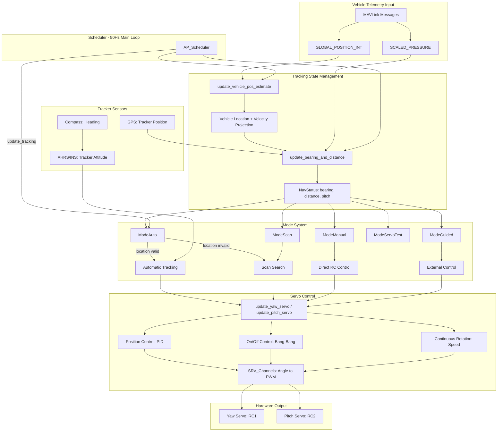
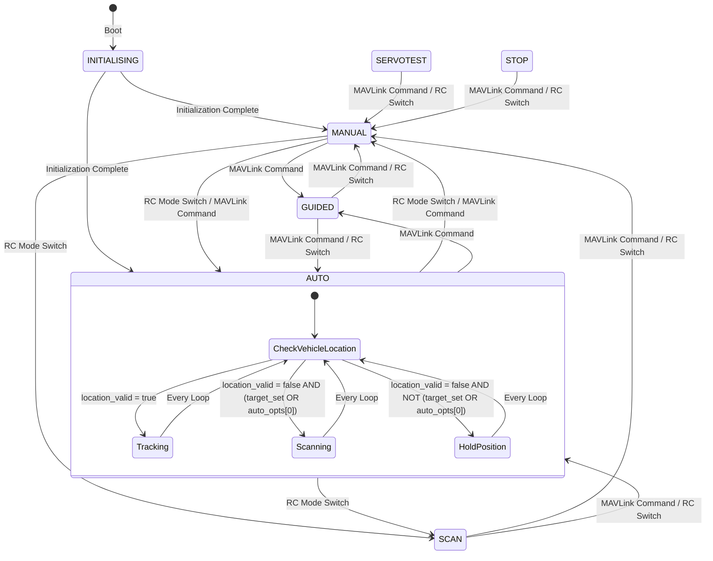

# AntennaTracker

## Overview
AntennaTracker is an ArduPilot firmware implementation for alt-azimuth antenna tracking systems. It automatically points directional antennas (for FPV, telemetry, or other RF links) at moving vehicles by processing MAVLink telemetry and commanding pan/tilt servos with PID-controlled feedback.

## Architecture


```mermaid
graph TB
    subgraph "Vehicle Telemetry Input"
        MAV[MAVLink Messages]
        POS[GLOBAL_POSITION_INT]
        PRES[SCALED_PRESSURE]
        MAV --> POS
        MAV --> PRES
    end
    
    subgraph "Tracking State Management"
        POS --> EST[update_vehicle_pos_estimate]
        EST --> LOC[Vehicle Location + Velocity Projection]
        LOC --> CALC[update_bearing_and_distance]
        PRES --> CALC
        CALC --> NAV[NavStatus: bearing, distance, pitch]
    end
    
    subgraph "Mode System"
        NAV --> AUTO[ModeAuto]
        NAV --> MANUAL[ModeManual]
        NAV --> GUIDED[ModeGuided]
        NAV --> SCAN[ModeScan]
        NAV --> TEST[ModeServoTest]
        
        AUTO -->|location valid| TRACK[Automatic Tracking]
        AUTO -->|location invalid| SEARCH[Scan Search]
        MANUAL --> RCIN[Direct RC Control]
        GUIDED --> EXTCTL[External Control]
        SCAN --> SEARCH
    end
    
    subgraph "Servo Control"
        TRACK --> SERVOS[update_yaw_servo / update_pitch_servo]
        SEARCH --> SERVOS
        RCIN --> SERVOS
        EXTCTL --> SERVOS
        
        SERVOS --> POS_CTRL[Position Control: PID]
        SERVOS --> ONOFF[On/Off Control: Bang-Bang]
        SERVOS --> CR[Continuous Rotation: Speed]
        
        POS_CTRL --> PWM[SRV_Channels: Angle to PWM]
        ONOFF --> PWM
        CR --> PWM
    end
    
    subgraph "Hardware Output"
        PWM --> YAW_SERVO[Yaw Servo: RC1]
        PWM --> PITCH_SERVO[Pitch Servo: RC2]
    end
    
    subgraph "Tracker Sensors"
        AHRS[AHRS/INS: Tracker Attitude]
        GPS[GPS: Tracker Position]
        COMP[Compass: Heading]
        
        AHRS --> TRACK
        GPS --> CALC
        COMP --> AHRS
    end
    
    subgraph "Scheduler - 50Hz Main Loop"
        SCHED[AP_Scheduler]
        SCHED --> EST
        SCHED --> CALC
        SCHED --> |update_tracking| AUTO
    end
```

## Key Components

### Main Tracker Class (Tracker.h / Tracker.cpp)
- **Purpose**: Singleton vehicle class containing all subsystems and state
- **Responsibilities**:
  - Scheduler task registration and execution
  - Mode instance management (auto, manual, guided, scan, etc.)
  - Vehicle tracking state maintenance
  - Hardware subsystem coordination (GPS, compass, AHRS, servos)
- **Key Members**:
  - `vehicle` struct: Tracked vehicle position, velocity, and update timestamps
  - `nav_status` struct: Calculated bearing, distance, pitch, and tracking errors
  - Mode instances: `mode_auto`, `mode_manual`, `mode_guided`, `mode_scan`, `mode_servotest`, `mode_stop`
  - Current mode pointer: `mode`

### Tracking Algorithm (tracking.cpp)
- **Purpose**: Core 50Hz tracking loop implementing position estimation and target angle calculation
- **Key Functions**:
  - `update_vehicle_pos_estimate()`: Projects vehicle position forward using velocity to compensate for telemetry latency and lost packets (5-second timeout)
  - `update_tracker_position()`: Maintains tracker's own GPS position (supports mobile platforms)
  - `update_bearing_and_distance()`: Calculates great-circle bearing, horizontal distance, and elevation pitch to vehicle
  - `update_tracking()`: Main loop orchestrating position updates, mode execution, and servo output
  - `tracking_update_position()`: Processes MAVLink GLOBAL_POSITION_INT messages from vehicle
  - `tracking_update_pressure()`: Processes MAVLink SCALED_PRESSURE for barometric altitude (with one-time calibration)

### Mode System (mode.h / mode.cpp)
- **Purpose**: Implements different operational modes with polymorphic mode interface
- **Base Class**: `Mode` - Abstract base defining `update()`, `number()`, `name()`, `requires_armed_servos()`
- **Concrete Modes**:
  - **AUTO** (10): Primary operational mode - tracks vehicle when position valid, scans when lost. Supports AUTO_OPTS parameter for fallback behavior.
  - **MANUAL** (0): Direct RC control - pilot yaw/pitch inputs passed straight to servo PWM outputs
  - **GUIDED** (4): External control via MAVLink SET_ATTITUDE_TARGET - GCS or companion computer commands quaternion attitude
  - **SCAN** (2): Search pattern mode - sweeps through yaw and pitch ranges to locate lost vehicle
  - **SERVOTEST** (3): Direct PWM commands from GCS for calibration and testing
  - **STOP** (1): Hold current position, no tracking
  - **INITIALISING** (16): Startup mode during sensor initialization
- **Shared Algorithms**:
  - `update_scan()`: Implements scanning state machine with yaw/pitch sweep and direction reversal
  - `update_auto()`: Automatic tracking - calculates errors, transforms coordinates, commands servos
  - `convert_ef_to_bf()` / `convert_bf_to_ef()`: Earth frame ↔ Body frame transforms for mobile platforms

### Servo Control (servos.cpp)
- **Purpose**: PID-based servo control with support for three servo types
- **Servo Types** (configurable via SERVO_YAW_TYPE / SERVO_PITCH_TYPE):
  1. **SERVO_TYPE_POSITION** (default): Standard position-controlled servos with PID feedback
     - Closed-loop control using PIDPitch2Srv / PIDYaw2Srv controllers
     - Anti-windup integrator reset at position limits
     - Low-pass filtering for smooth motion (SERVO_OUT_FILT_HZ cutoff)
  2. **SERVO_TYPE_ONOFF**: Bang-bang control for limit-switch actuators
     - Full-speed motion in error-reducing direction
     - Stops within acceptable error threshold
     - For winch-style or mechanically limited systems
  3. **SERVO_TYPE_CR**: Continuous rotation servos
     - Speed command proportional to error
     - For continuous azimuth rotation without limits
- **"Ballerina" Algorithm** (yaw position control):
  - Handles non-North-aligned antenna mounts
  - Supports moving/rotating tracker platforms
  - Manages ±180° azimuth range with wrap-around
- **Servo Configuration Requirements**:
  - RC1_MIN/MAX must map to full ±180° yaw range (-180° to +180° relative to mount)
  - RC2_MIN/MAX must map to pitch limits (typically -90° to +90°)
  - RC1_REV / RC2_REV may need reversal depending on mechanical installation
  - YAW_RANGE parameter defines total azimuth range (360° or 180°)
  - PITCH_MIN / PITCH_MAX define elevation limits

### Parameters and Configuration (Parameters.h / Parameters.cpp)
- **Parameter Groups**:
  - **PID Tuning**: PITCH2SRV_P/I/D/IMAX, YAW2SRV_P/I/D/IMAX
  - **Servo Types**: SERVO_PITCH_TYPE, SERVO_YAW_TYPE
  - **Mechanical Limits**: YAW_RANGE, PITCH_MIN, PITCH_MAX
  - **Trim Offsets**: YAW_TRIM, PITCH_TRIM
  - **Altitude Source**: ALT_SOURCE (GPS, BARO, GPS_VEH_ONLY)
  - **MAVLink IDs**: SYSID_THIS_MAV (default 2), SYSID_TARGET
  - **Timing**: STARTUP_DELAY (prevents servo motion during init)
  - **Disarm Behavior**: DISARM_PWM (TRIM or ZERO)
  - **Mode Options**: AUTO_OPTS (scan-on-lost flag)
- **Subsystem Objects**: Barometer, GPS, AHRS, Compass, Battery, Notify, Logger, Scheduler

### MAVLink / GCS Integration (GCS_MAVLink_Tracker.cpp / GCS_Tracker.cpp)
- **Vehicle Type**: MAV_TYPE_ANTENNA_TRACKER
- **Primary Messages Processed**:
  - GLOBAL_POSITION_INT: Vehicle GPS position and velocity (primary tracking input)
  - SCALED_PRESSURE: Vehicle barometer for altitude difference calculation
  - MANUAL_CONTROL: Direct bearing/pitch commands from GCS
  - SET_ATTITUDE_TARGET: Quaternion attitude commands for GUIDED mode
- **Telemetry Sent**:
  - HEARTBEAT: Mode, arm state, system status
  - NAV_CONTROLLER_OUTPUT: Tracking targets (bearing, pitch, distance, alt_diff)
  - GLOBAL_POSITION_INT: Tracker's own GPS position
  - ATTITUDE: Tracker attitude and targets
  - PID_TUNING: Yaw/pitch PID performance data
- **Vehicle Targeting**: Tracks specific SYSID/COMPID set by SYSID_TARGET parameter

### Scheduler and Task Architecture (Tracker.cpp)
- **Main Loop Rate**: 50Hz base scheduler rate
- **Critical Tasks** (50Hz):
  - `update_ahrs`: AHRS/INS attitude estimation
  - `read_radio`: RC input reading
  - `update_tracking`: Main tracking loop (position, angles, servo commands)
  - `compass.cal_update`: Compass calibration (if active)
- **Medium Rate Tasks** (10Hz):
  - `update_GPS`: GPS driver with ground-start countdown logic
  - `update_compass`: Magnetometer reading
  - `accel_cal_update`: Accelerometer calibration (if active)
  - `ten_hz_logging_loop`: Attitude and vehicle logging
- **Slow Tasks** (1Hz):
  - `update_armed_disarmed`: Armed LED status
  - `one_second_loop`: Housekeeping (home check, servo arming, PID updates)
- **Variable Rate**:
  - `gcs().update`: MAVLink communication (rate-limited per stream configuration)

## Mode State Machine


```mermaid
stateDiagram-v2
    [*] --> INITIALISING: Boot
    
    INITIALISING --> MANUAL: Initialization Complete
    INITIALISING --> AUTO: Initialization Complete
    
    MANUAL --> AUTO: RC Mode Switch / MAVLink Command
    MANUAL --> GUIDED: MAVLink Command
    MANUAL --> SCAN: RC Mode Switch
    
    AUTO --> MANUAL: RC Mode Switch / MAVLink Command
    AUTO --> GUIDED: MAVLink Command
    AUTO --> SCAN: RC Mode Switch
    
    state AUTO {
        [*] --> CheckVehicleLocation
        CheckVehicleLocation --> Tracking: location_valid = true
        CheckVehicleLocation --> Scanning: location_valid = false AND (target_set OR auto_opts[0])
        CheckVehicleLocation --> HoldPosition: location_valid = false AND NOT (target_set OR auto_opts[0])
        
        Tracking --> CheckVehicleLocation: Every Loop
        Scanning --> CheckVehicleLocation: Every Loop
        HoldPosition --> CheckVehicleLocation: Every Loop
    }
    
    GUIDED --> AUTO: MAVLink Command / RC Switch
    GUIDED --> MANUAL: MAVLink Command / RC Switch
    
    SCAN --> AUTO: MAVLink Command / RC Switch
    SCAN --> MANUAL: MAVLink Command / RC Switch
    
    SERVOTEST --> MANUAL: MAVLink Command / RC Switch
    STOP --> MANUAL: MAVLink Command / RC Switch
```

## Usage Patterns

### Initial Setup and Configuration

1. **Hardware Connections**:
   ```
   Tracker Hardware → Flight Controller
   - Yaw Servo Signal → RC Output 1 (k_tracker_yaw)
   - Pitch Servo Signal → RC Output 2 (k_tracker_pitch)
   - RC Receiver → RC Input (for mode switching, manual control)
   - Telemetry Radio → UART (for MAVLink from vehicle)
   - GPS/Compass → I2C/SPI/UART (for tracker position)
   ```

2. **Parameter Configuration via GCS**:
   ```python
   # Servo mechanical limits (degrees)
   param set YAW_RANGE 360          # Full rotation capability
   param set PITCH_MIN -90          # Straight down
   param set PITCH_MAX 90           # Straight up
   
   # Servo PWM mapping (microseconds) - CRITICAL for proper operation
   param set RC1_MIN 1000           # PWM at -180° yaw
   param set RC1_MAX 2000           # PWM at +180° yaw
   param set RC2_MIN 1000           # PWM at PITCH_MIN
   param set RC2_MAX 2000           # PWM at PITCH_MAX
   
   # Servo reversal if needed
   param set RC1_REV 1              # 1 = normal, -1 = reversed
   param set RC2_REV 1
   
   # PID tuning (start with these, tune for your hardware)
   param set YAW2SRV_P 0.1
   param set YAW2SRV_I 0.02
   param set YAW2SRV_D 0.0
   param set YAW2SRV_IMAX 4000
   param set PITCH2SRV_P 0.1
   param set PITCH2SRV_I 0.02
   param set PITCH2SRV_D 0.0
   param set PITCH2SRV_IMAX 4000
   
   # Altitude source selection
   param set ALT_SOURCE 0           # 0=GPS, 1=Baro, 2=GPS_VEH_ONLY
   
   # Target vehicle addressing
   param set SYSID_TARGET 1         # Vehicle's MAV_SYS_ID
   ```

3. **Servo Calibration** (SERVOTEST mode):
   ```python
   # Enter SERVOTEST mode and command specific PWM values
   # Use this to verify RC1_MIN/MAX and RC2_MIN/MAX span full mechanical range
   mode SERVOTEST
   # GCS can then send MAV_CMD_DO_SET_SERVO commands
   ```

### Normal Operation Workflow

1. **Startup Sequence**:
   ```
   Power On → INITIALISING mode
   ├─ Load parameters from EEPROM
   ├─ Initialize sensors (AHRS, GPS, Compass, Baro)
   ├─ Calibrate barometer (requires stationary)
   ├─ Wait for GPS 3D fix (ground-start countdown)
   ├─ Set home location from GPS
   ├─ Start MAVLink communication
   └─ Enter configured initial mode (typically MANUAL or AUTO)
   ```

2. **Automatic Tracking** (AUTO mode):
   ```
   Enter AUTO mode → Tracker waits for vehicle telemetry
   ├─ Receives GLOBAL_POSITION_INT from vehicle (1-10Hz typical)
   ├─ Projects position forward using velocity (compensates latency)
   ├─ Calculates bearing, distance, pitch to vehicle
   ├─ Transforms earth-frame angles to body-frame
   ├─ PID controllers command servos to track target
   └─ If telemetry lost >5s → Falls back to SCAN mode (if AUTO_OPTS[0] set)
   ```

3. **Manual Control** (MANUAL mode):
   ```
   RC Stick Input → Direct servo PWM output
   ├─ Yaw stick (usually Ch1) → Yaw servo PWM
   ├─ Pitch stick (usually Ch2) → Pitch servo PWM
   └─ No automatic tracking, full pilot control
   ```

4. **External Control** (GUIDED mode):
   ```
   GCS/Companion Computer → MAVLink SET_ATTITUDE_TARGET
   ├─ Quaternion attitude converted to Euler angles
   ├─ Earth-frame to body-frame coordinate transform
   ├─ Servo commands based on target angles
   └─ Useful for scripted pointing or integration with other systems
   ```

### PID Tuning Procedure

1. **Initial Testing** (start conservative):
   ```
   P = 0.1, I = 0.0, D = 0.0
   Test tracking → Should follow slowly, may lag
   ```

2. **Increase P** (main tuning knob):
   ```
   Gradually increase P until tracking becomes responsive
   Too high P → Oscillation around target
   Good P → Smooth following with minimal lag
   Typical range: 0.1 - 0.5
   ```

3. **Add I** (eliminate steady-state error):
   ```
   Add small I term (0.01 - 0.05)
   I accumulates error over time to eliminate offsets
   Set IMAX to prevent integrator windup (typical: 4000 centidegrees)
   ```

4. **Tune D** (damping, usually not needed):
   ```
   D = 0.0 usually sufficient
   Can add small D (0.001 - 0.01) to reduce overshoot
   Too much D amplifies noise
   ```

5. **Monitor via PID_TUNING telemetry**:
   ```python
   # View PID performance in real-time
   # Check target vs achieved, P/I/D components
   # Logged for post-analysis
   ```

## Configuration Parameters

| Parameter | Description | Default | Range | Units |
|-----------|-------------|---------|-------|-------|
| **Servo Mechanical Limits** |
| YAW_RANGE | Total azimuth rotation range | 360 | 0-360 | degrees |
| PITCH_MIN | Minimum elevation angle | -90 | -90 to 0 | degrees |
| PITCH_MAX | Maximum elevation angle | 90 | 0 to 90 | degrees |
| YAW_TRIM | Yaw zero-degree offset | 0 | -180 to 180 | degrees |
| PITCH_TRIM | Pitch zero-degree offset | 0 | -90 to 90 | degrees |
| **Servo Types** |
| SERVO_YAW_TYPE | Yaw servo control type | 0 | 0=Position, 1=OnOff, 2=CR | - |
| SERVO_PITCH_TYPE | Pitch servo control type | 0 | 0=Position, 1=OnOff, 2=CR | - |
| **PID Tuning - Yaw** |
| YAW2SRV_P | Yaw proportional gain | 0.1 | 0-10 | - |
| YAW2SRV_I | Yaw integral gain | 0.02 | 0-1 | - |
| YAW2SRV_D | Yaw derivative gain | 0.0 | 0-1 | - |
| YAW2SRV_IMAX | Yaw integrator limit | 4000 | 0-18000 | centidegrees |
| **PID Tuning - Pitch** |
| PITCH2SRV_P | Pitch proportional gain | 0.1 | 0-10 | - |
| PITCH2SRV_I | Pitch integral gain | 0.02 | 0-1 | - |
| PITCH2SRV_D | Pitch derivative gain | 0.0 | 0-1 | - |
| PITCH2SRV_IMAX | Pitch integrator limit | 4000 | 0-9000 | centidegrees |
| **Altitude Source** |
| ALT_SOURCE | Altitude data source for pitch | 0 | 0=GPS, 1=Baro, 2=GPS_VEH_ONLY | - |
| **MAVLink Configuration** |
| SYSID_THIS_MAV | Tracker system ID | 2 | 1-255 | - |
| SYSID_TARGET | Target vehicle system ID | 1 | 0-255 | - |
| **Timing and Safety** |
| STARTUP_DELAY | Delay before servo movement | 3 | 0-30 | seconds |
| DISARM_PWM | Servo output when disarmed | 0 | 0=TRIM, 1=ZERO | - |
| **Mode Behavior** |
| AUTO_OPTS | AUTO mode options bitmask | 0 | Bit 0: Scan when lost | - |

## Safety Considerations

### Critical Operating Requirements

1. **Startup Delay** (STARTUP_DELAY parameter):
   - Prevents servo movement during sensor initialization
   - Default 3 seconds allows GPS, compass, AHRS to stabilize
   - Ensure tracker stationary during this period
   - **WARNING**: Moving tracker during initialization causes incorrect attitude reference

2. **Safety Switch and Arming**:
   - Hardware safety switch must be enabled for servo movement
   - Soft-arm state checked every loop
   - Disarmed behavior controlled by DISARM_PWM parameter:
     * TRIM (0): Servos output neutral position (0° angle)
     * ZERO (1): Servos output 0 PWM (unpowered)
   - **WARNING**: Ensure safe servo positions when arming

3. **Servo Limit Enforcement**:
   - Position limits (YAW_RANGE, PITCH_MIN, PITCH_MAX) enforced in software
   - PID integrator reset at limits prevents windup
   - **CRITICAL**: Set RC1_MIN/MAX and RC2_MIN/MAX so mechanical limits aligned with parameter limits
   - **WARNING**: Incorrect limits can damage servos or mechanical hardware

4. **Vehicle Telemetry Loss**:
   - 5-second timeout (TRACKING_TIMEOUT_SEC) before vehicle considered lost
   - AUTO mode behavior on loss controlled by AUTO_OPTS:
     * Bit 0 clear: Hold last known position
     * Bit 0 set: Enter scan mode to search
   - Armed LED indicates telemetry health (lit = recent updates)

5. **Barometer Calibration** (if using ALT_SOURCE=BARO):
   - One-time calibration on first SCALED_PRESSURE message
   - Assumes tracker and vehicle at same altitude initially
   - **WARNING**: Incorrect initial calibration causes persistent pitch error
   - Baro altitude drifts with weather changes - GPS more stable long-term

### Error Conditions and Recovery

| Condition | Detection | Behavior | Recovery |
|-----------|-----------|----------|----------|
| GPS Lost | No 3D fix | Hold last position or scan | Regain GPS fix |
| Telemetry Lost | >5s since GLOBAL_POSITION_INT | Scan or hold (AUTO_OPTS) | Vehicle reconnects |
| Safety Disarmed | Hardware switch | Servo output per DISARM_PWM | Arm safety switch |
| Soft Disarmed | Arming state | Servo output per DISARM_PWM | Arm via GCS |
| Servo Limit Hit | Position at YAW/PITCH limit | Integrator reset, hold limit | Vehicle returns to range |
| Compass Failure | AHRS reports compass unhealthy | Degraded attitude, may affect tracking | Compass calibration |
| Mode invalid | Mode requirements not met | Mode change rejected | Meet requirements (arm, etc) |

## Testing

### SITL (Software-In-The-Loop) Testing

1. **Start Tracker SITL**:
   ```bash
   # Terminal 1: Start tracker simulation
   cd ardupilot/AntennaTracker
   sim_vehicle.py --console --map -L MyLocation
   
   # Tracker starts at specified location
   # GCS console available for commands
   # Map shows tracker icon
   ```

2. **Start Vehicle SITL** (to track):
   ```bash
   # Terminal 2: Start vehicle (copter example)
   cd ardupilot/ArduCopter
   sim_vehicle.py --console --map -I 1 -L MyLocation
   
   # Vehicle starts near tracker
   # Use -I 1 for instance 1 (different ports)
   ```

3. **Connect Tracker to Vehicle Telemetry**:
   ```python
   # In Tracker console:
   param set SYSID_TARGET 1         # Vehicle's system ID
   mode AUTO                        # Enter automatic tracking
   
   # In Vehicle console:
   arm throttle                     # Arm vehicle
   mode GUIDED                      # Or any flight mode
   # Vehicle sends GLOBAL_POSITION_INT to tracker
   ```

4. **Verify Tracking**:
   ```python
   # Tracker console shows:
   # - Bearing to vehicle
   # - Distance to vehicle  
   # - Pitch angle
   # - Servo outputs
   
   # Fly vehicle around
   # Watch tracker servos follow in SITL visualization
   ```

5. **Test Failure Scenarios**:
   ```bash
   # Disconnect vehicle telemetry (Terminal 2: Ctrl+C)
   # Tracker should detect timeout and enter scan mode (if AUTO_OPTS[0] set)
   # Or hold last position (if AUTO_OPTS[0] clear)
   ```

### Hardware Testing

1. **Bench Testing** (servo calibration):
   ```python
   # Connect servos without antenna attached
   # Power on tracker
   
   # Mode: SERVOTEST
   mode SERVOTEST
   
   # Command servos through full range via GCS
   # Verify:
   # - RC1_MIN/MAX maps to full yaw range
   # - RC2_MIN/MAX maps to full pitch range
   # - No mechanical binding
   # - Servo direction correct (may need RC1_REV or RC2_REV)
   ```

2. **Ground Testing** (with antenna):
   ```python
   # IMPORTANT: Ensure clear space around antenna for full rotation
   # Secure all cables and connections
   
   # Power on, wait for GPS fix and home set
   # Mode: MANUAL
   # Verify RC control of servos
   # Check for mechanical interference throughout range
   ```

3. **Live Vehicle Testing**:
   ```python
   # Vehicle must be transmitting MAVLink GLOBAL_POSITION_INT
   # Verify SYSID_TARGET matches vehicle
   # Verify telemetry radio link working (both directions)
   
   # Mode: AUTO
   # Vehicle should be tracked automatically
   # Monitor via GCS:
   # - Bearing, distance, pitch in NAV_CONTROLLER_OUTPUT
   # - Attitude in ATTITUDE message
   # - PID performance in PID_TUNING
   ```

4. **Safety Tests**:
   ```python
   # Test safety switch (should disable servos)
   # Test disarm (check DISARM_PWM behavior)
   # Test telemetry loss (>5 second timeout)
   # Test mode switching (RC and MAVLink commands)
   # Test servo limits (should not exceed mechanical range)
   ```

### Common Test Scenarios

```python
# 1. Static vehicle test
#    Vehicle on ground, tracker nearby
#    Verify tracker points at vehicle with correct pitch (should be near 0°)

# 2. Moving vehicle test  
#    Vehicle flies around tracker
#    Verify smooth tracking, minimal lag
#    Check PID_TUNING for oscillation or errors

# 3. Altitude test
#    Vehicle climbs/descends
#    Verify pitch angle changes correctly
#    Test both GPS and BARO altitude sources (ALT_SOURCE parameter)

# 4. Distant vehicle test
#    Vehicle flies several kilometers away
#    Verify bearing accuracy (use map for reference)
#    Check telemetry link range limits

# 5. Rapid maneuver test
#    Vehicle performs quick turns
#    Verify tracker keeps up with velocity projection
#    Acceptable lag is 0.5-2 seconds depending on telemetry rate

# 6. Telemetry loss/recovery test
#    Simulate radio link failure
#    Verify timeout detection (armed LED turns off)
#    Verify scan mode activation (if enabled)
#    Restore link and verify reacquisition
```

## Implementation Notes

### Design Decisions

**Why 50Hz Main Loop Rate?**
- Balance between tracking responsiveness and CPU load
- Matches typical servo update rates (20-50Hz)
- Sufficient for vehicle velocities up to ~50 m/s with acceptable lag
- Lower rates (10-20Hz) usable for slower vehicles or lower-power processors

**Why Velocity Projection for Position Estimate?**
- MAVLink telemetry typically 1-10Hz with variable latency (50-200ms)
- Dead reckoning using velocity improves tracking smoothness
- Reduces servo jitter from quantized position updates
- 5-second timeout reasonable for typical telemetry link interruptions

**Why Three Servo Control Types?**
- POSITION: Standard case, most accurate, requires position feedback servos
- ON/OFF: Low-cost alternative for limit-switched or mechanically stopped actuators
- CR: Supports continuous rotation for full 360° azimuth without mechanical limits

**Why "Ballerina" Yaw Algorithm?**
- Handles arbitrary antenna mount orientations (not just North-aligned)
- Supports mobile platforms where tracker orientation changes continuously
- Prevents unwanted 360° servo spins when crossing ±180° boundary
- Ensures shortest-path yaw movement

**Why Both GPS and Barometer Altitude Sources?**
- GPS: Absolute altitude, stable long-term, but noisy short-term (~3-5m accuracy)
- Baro: Smooth short-term, accurate for pitch changes, but drifts with weather
- GPS_VEH_ONLY: Uses vehicle's altitude above home, good when tracker GPS poor quality
- User selectable per application requirements (fixed ground station vs mobile platform)

### Known Limitations

1. **Constant Velocity Assumption**:
   - Position projection assumes vehicle maintains velocity
   - Accuracy degrades during rapid maneuvers (turns, climbs)
   - Typical lag 0.5-2 seconds depending on telemetry rate and vehicle agility

2. **Mechanical Range Constraints**:
   - Position servos have limited rotation (typically ±90° to ±180°)
   - Vehicle flying behind tracker causes mechanical limits to be hit
   - CR servos avoid this but require continuous rotation hardware

3. **Altitude Source Selection Trade-offs**:
   - GPS altitude: Absolute but noisy, 3-5 meter typical accuracy
   - Baro altitude: Smooth but drifts with weather (pressure changes)
   - Single source selection - no automatic failover or fusion

4. **Telemetry Link Dependency**:
   - Tracking completely dependent on MAVLink GLOBAL_POSITION_INT messages
   - Link loss >5 seconds triggers timeout
   - No autonomous prediction beyond 5-second horizon

5. **No Lead Angle Compensation**:
   - Tracker points at current vehicle position (with velocity projection)
   - Does not calculate future position for directional antenna beam lead
   - For high-gain antennas and fast vehicles, may benefit from additional lead angle

6. **Coordinate System Conventions**:
   - Earth frame vs body frame transforms assume small roll angles for tracker
   - Not designed for trackers mounted on highly dynamic platforms (aircraft, boats)

### Future Enhancements

**Potential improvements for future development:**

- **Multi-vehicle tracking**: Automatic selection of closest or prioritized vehicle
- **Lead angle calculation**: Predict future vehicle position for beam steering
- **Kalman filter fusion**: Combine GPS and barometer for optimal altitude estimation
- **Advanced scan patterns**: Spiral, sector-limited, or likelihood-based search
- **Gimbal camera integration**: Unified control of antenna and camera pointing
- **Terrain awareness**: Use terrain database for horizon masking and optimal placement
- **Automatic PID tuning**: Online parameter adaptation based on tracking performance
- **Redundant altitude sources**: Automatic failover between GPS and baro
- **Dynamic telemetry timeout**: Adapt timeout based on observed message rates
- **Tracking quality metrics**: Report tracking accuracy, lag, and confidence to GCS

## References

### Source Files
- **Main Class**: `Tracker.h`, `Tracker.cpp`
- **Tracking Algorithm**: `tracking.cpp`
- **Mode System**: `mode.h`, `mode.cpp`, `mode_*.cpp`
- **Servo Control**: `servos.cpp`
- **System Init**: `system.cpp`
- **Sensors**: `sensors.cpp`, `radio.cpp`
- **MAVLink**: `GCS_MAVLink_Tracker.cpp`, `GCS_Tracker.cpp`
- **Configuration**: `Parameters.h`, `Parameters.cpp`, `config.h`, `defines.h`
- **Logging**: `Log.cpp`

### Related ArduPilot Modules
- **AP_AHRS**: Attitude estimation (DCM or EKF backends)
- **AP_GPS**: GPS driver supporting multiple protocols
- **AP_Compass**: Magnetometer driver for heading
- **AP_Baro**: Barometric pressure sensor
- **SRV_Channels**: Servo output management and PWM generation
- **AP_Scheduler**: Task scheduling and timing
- **GCS_MAVLink**: MAVLink protocol implementation
- **AP_Param**: Parameter storage and management
- **AP_Logger**: Binary log recording

### External Resources
- **ArduPilot Documentation**: https://ardupilot.org/dev/
- **AntennaTracker Wiki**: https://ardupilot.org/antennatracker/
- **MAVLink Protocol**: https://mavlink.io/
- **PID Tuning Guide**: https://ardupilot.org/antennatracker/docs/tuning.html

### Hardware References
- **Supported Flight Controllers**: Any ArduPilot-compatible board (Pixhawk, Cube, MatekSys, etc.)
- **Servo Requirements**: Standard RC servos with 1000-2000μs PWM input
- **Telemetry Radios**: SiK radios, RFD900, 3DR telemetry, or any MAVLink-compatible link
- **GPS/Compass**: Any ArduPilot-supported GPS module (u-blox, HERE, etc.)
