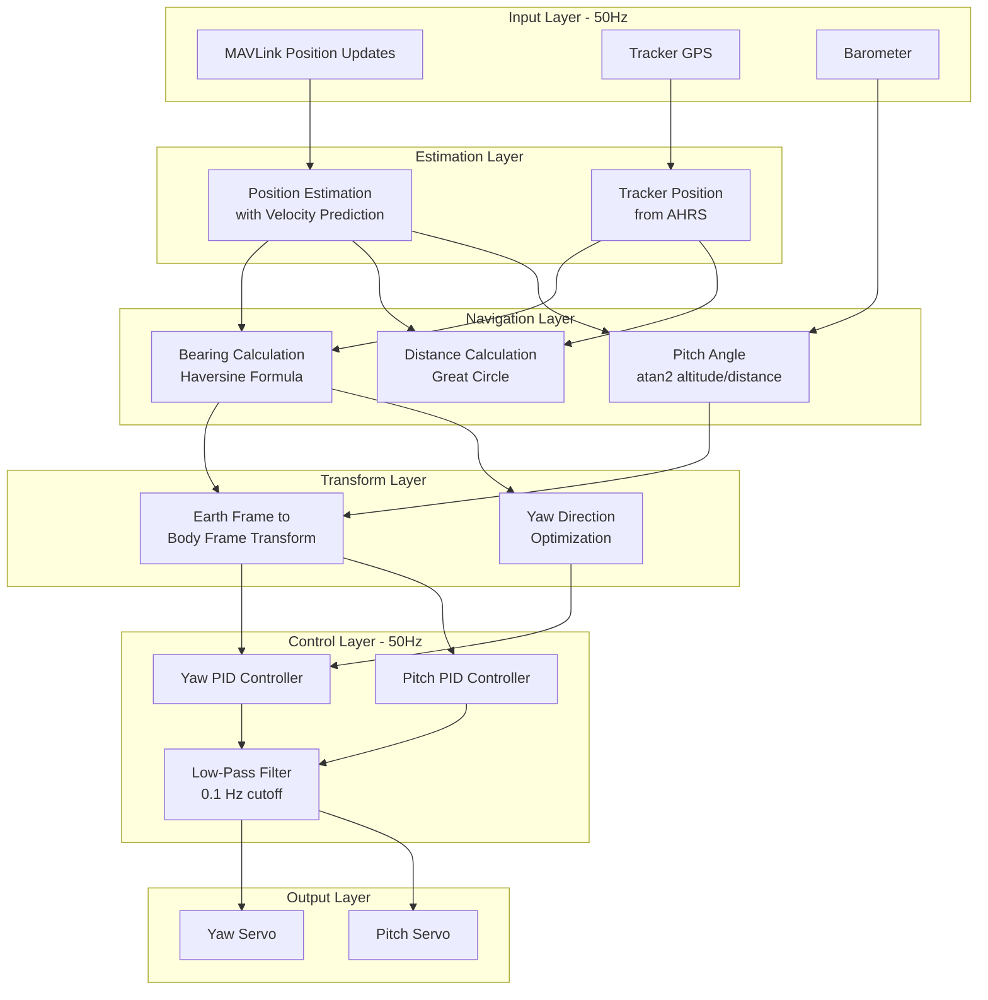
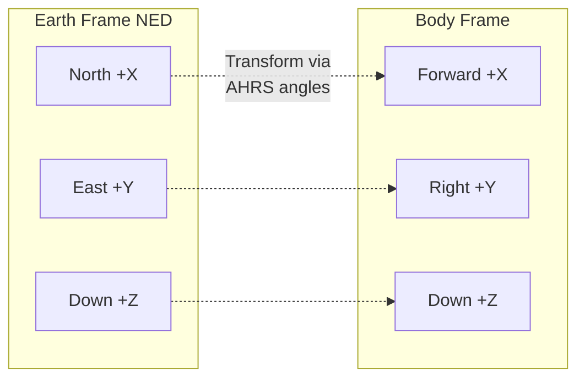
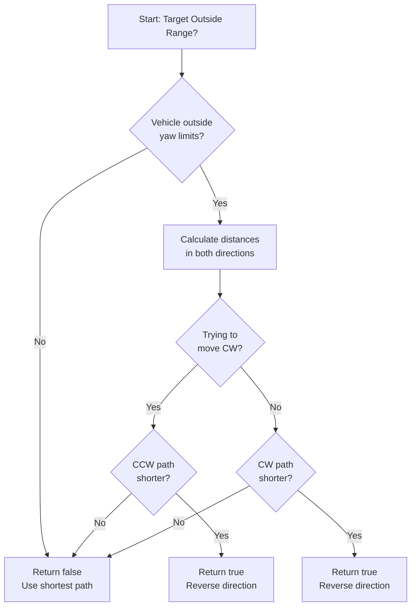
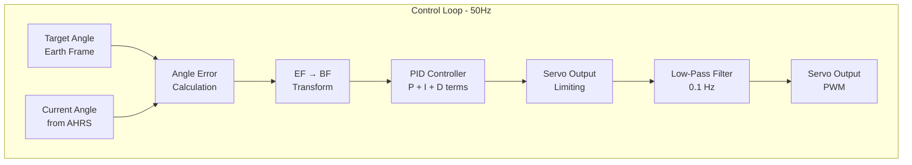
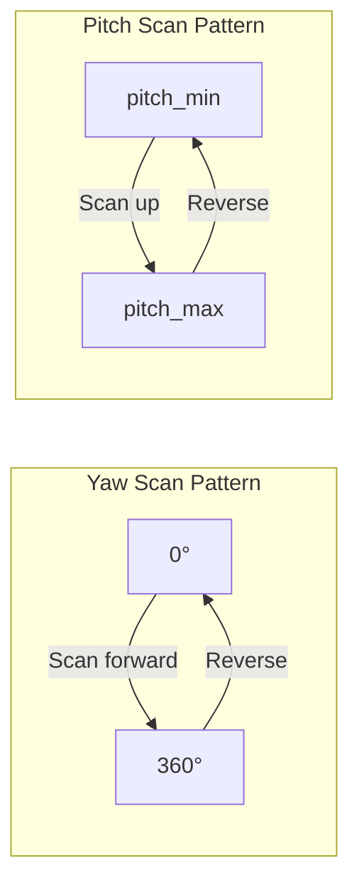

# AntennaTracker Tracking Algorithms

## Table of Contents
- [Overview](#overview)
- [System Architecture](#system-architecture)
- [Position Estimation and Prediction](#position-estimation-and-prediction)
- [Bearing and Distance Calculations](#bearing-and-distance-calculations)
- [Pitch Angle Computation](#pitch-angle-computation)
- [Coordinate System Transformations](#coordinate-system-transformations)
- [Yaw Direction Optimization](#yaw-direction-optimization)
- [Control Loop Implementation](#control-loop-implementation)
- [Low-Pass Filtering](#low-pass-filtering)
- [Scan Pattern Generation](#scan-pattern-generation)
- [Mathematical Foundations](#mathematical-foundations)

## Overview

The AntennaTracker implements a comprehensive set of algorithms to continuously point an antenna toward a moving vehicle. The tracking system operates at 50Hz (20ms update cycle) and includes position estimation, coordinate transformations, PID control loops, and intelligent path planning for continuous rotation servos.

**Key Features**:
- Velocity-based position prediction to compensate for telemetry latency
- Haversine formula for accurate bearing/distance calculations
- Earth-frame to body-frame coordinate transformations
- Optimal yaw direction selection for continuous rotation servos
- PID control loops with integral windup protection
- Low-pass filtering for smooth servo output
- Automated scan patterns for target acquisition

**Source Files**:
- `/AntennaTracker/tracking.cpp` - Core tracking algorithms
- `/AntennaTracker/mode.cpp` - Mode-specific control logic
- `/AntennaTracker/mode_auto.cpp` - Auto mode implementation
- `/AntennaTracker/mode_guided.cpp` - Guided mode implementation
- `/AntennaTracker/servos.cpp` - Servo control and PID loops

**Update Rate**: 50Hz (defined by `G_Dt = 0.02f` in `/AntennaTracker/defines.h:25`)

## System Architecture

The tracking system follows a hierarchical control architecture:



**Source**: Architecture derived from `/AntennaTracker/tracking.cpp:85-127` (`update_tracking()` function)

## Position Estimation and Prediction

### Algorithm Overview

The position estimation algorithm predicts the vehicle's current position by extrapolating from the last known position using velocity vectors. This compensates for telemetry latency and packet loss in the MAVLink communication link.

**Source**: `/AntennaTracker/tracking.cpp:7-26` (`update_vehicle_pos_estimate()`)

### Mathematical Model

The position estimate uses a simple kinematic prediction model:

```
position_estimate = last_known_position + velocity × Δt
```

Where:
- `Δt` = time elapsed since last position update (seconds)
- `velocity` = vehicle velocity vector [vx, vy, vz] in m/s
- Position components: latitude, longitude (degrees × 10⁷), altitude (meters × 100)

### Implementation Details

**Update Rate**: 50Hz

**Position Extrapolation**:
```cpp
// Calculate time delta since last update
float dt = (AP_HAL::micros() - vehicle.last_update_us) * 1.0e-6f;

// Project position using velocity
vehicle.location_estimate = vehicle.location;
float north_offset = vehicle.vel.x * dt;  // North velocity (m/s) × time
float east_offset = vehicle.vel.y * dt;   // East velocity (m/s) × time
vehicle.location_estimate.offset(north_offset, east_offset);

// Update altitude (convert m/s to cm/s, multiply by dt)
vehicle.location_estimate.alt += vehicle.vel.z * 100.0f * dt;
```

**Source**: `/AntennaTracker/tracking.cpp:14-19`

### Timeout and Validity

**Tracking Timeout**: 5.0 seconds (`TRACKING_TIMEOUT_SEC` in `/AntennaTracker/config.h:43`)

The system considers the vehicle position invalid if no updates are received within 5 seconds:

```cpp
if (dt < TRACKING_TIMEOUT_SEC) {
    // Position estimate is valid
    vehicle.location_valid = true;
} else {
    // Vehicle has been lost
    vehicle.location_valid = false;
}
```

**Source**: `/AntennaTracker/tracking.cpp:13-25`

**Rationale**: The 5-second timeout balances between:
- Allowing temporary telemetry dropouts without declaring vehicle lost
- Preventing tracking of stale position data that would cause dangerous antenna movements

### Position Update from MAVLink

Vehicle position updates are received via MAVLink `GLOBAL_POSITION_INT` messages:

```cpp
void tracking_update_position(const mavlink_global_position_int_t &msg)
{
    // Reject invalid (0,0) coordinates
    if (!msg.lat && !msg.lon) {
        return;
    }
    
    vehicle.location.lat = msg.lat;           // Latitude (degrees × 10⁷)
    vehicle.location.lng = msg.lon;           // Longitude (degrees × 10⁷)
    vehicle.location.alt = msg.alt / 10;      // Altitude AMSL (mm → cm)
    vehicle.relative_alt = msg.relative_alt / 10;  // Relative altitude (mm → cm)
    
    // Convert velocity from cm/s to m/s
    vehicle.vel = Vector3f(msg.vx * 0.01f, msg.vy * 0.01f, msg.vz * 0.01f);
    
    // Update timestamps
    vehicle.last_update_us = AP_HAL::micros();
    vehicle.last_update_ms = AP_HAL::millis();
}
```

**Source**: `/AntennaTracker/tracking.cpp:132-152`

## Bearing and Distance Calculations

### Bearing Calculation

The bearing to the vehicle is calculated using the haversine formula for great circle navigation, implemented in the `Location::get_bearing_to()` method.

**Output**: Bearing in centidegrees (0-36000), where 0° = North, 90° = East, 180° = South, 270° = West

**Source**: `/AntennaTracker/tracking.cpp:54-58`

```cpp
if (mode != &mode_scan && !nav_status.manual_control_yaw) {
    // get_bearing_to() returns bearing in centidegrees
    nav_status.bearing = current_loc.get_bearing_to(vehicle.location_estimate) * 0.01f;
}
```

### Haversine Formula (Mathematical Foundation)

The bearing calculation uses the haversine formula for spherical trigonometry:

```
Δλ = longitude₂ - longitude₁
Δφ = latitude₂ - latitude₁

y = sin(Δλ) × cos(φ₂)
x = cos(φ₁) × sin(φ₂) - sin(φ₁) × cos(φ₂) × cos(Δλ)

bearing = atan2(y, x)
```

Where:
- φ₁, λ₁ = tracker latitude and longitude (radians)
- φ₂, λ₂ = vehicle latitude and longitude (radians)
- Result converted to degrees and normalized to 0-360°

**Note**: The actual implementation is in the ArduPilot `Location` class, which handles Earth's ellipsoidal shape for improved accuracy.

### Distance Calculation

The distance to the vehicle is calculated using the great circle distance formula:

```cpp
nav_status.distance = current_loc.get_distance(vehicle.location_estimate);
```

**Source**: `/AntennaTracker/tracking.cpp:61`

**Output**: Distance in meters

**Great Circle Distance Formula**:

```
a = sin²(Δφ/2) + cos(φ₁) × cos(φ₂) × sin²(Δλ/2)
c = 2 × atan2(√a, √(1-a))
distance = R × c
```

Where:
- R = Earth's radius (≈ 6,371,000 meters)
- Δφ = difference in latitude (radians)
- Δλ = difference in longitude (radians)
- φ₁, φ₂ = tracker and vehicle latitudes (radians)

**Accuracy**: The Location class implementation accounts for:
- Earth's ellipsoidal shape (WGS84 datum)
- Altitude differences for slant distance
- Local geodetic variations

### Distance Minimum Threshold

The tracker can be configured to ignore targets closer than a minimum distance:

```cpp
if ((g.distance_min <= 0) || (nav_status.distance >= g.distance_min) || !tracker.vehicle.location_valid) {
    tracker.update_pitch_servo(bf_pitch);
    tracker.update_yaw_servo(bf_yaw);
}
```

**Source**: `/AntennaTracker/mode.cpp:23-26`

**Default**: 5.0 meters (`DISTANCE_MIN_DEFAULT` in `/AntennaTracker/config.h:46`)

**Rationale**: Prevents erratic antenna movements when the vehicle is very close to the tracker, where small GPS errors can cause large bearing changes.

## Pitch Angle Computation

### Pitch Calculation Algorithm

The pitch angle (elevation angle) determines how far the antenna should point above or below the horizon to aim at the vehicle. The calculation uses the altitude difference and horizontal distance:

```
pitch = atan2(altitude_difference, horizontal_distance)
```

**Source**: `/AntennaTracker/tracking.cpp:73-79`

### Altitude Sources

The tracker supports three altitude source modes (`ALT_SOURCE` in `/AntennaTracker/defines.h:12-16`):

1. **ALT_SOURCE_BARO (0)**: Use barometric altitude difference between tracker and vehicle
2. **ALT_SOURCE_GPS (1)**: Use GPS altitude difference (AMSL - Above Mean Sea Level)
3. **ALT_SOURCE_GPS_VEH_ONLY (2)**: Use vehicle's relative altitude only (vehicle's altitude above home)

### Implementation Details

**GPS Altitude Difference**:
```cpp
if (g.alt_source == ALT_SOURCE_GPS) {
    // Both altitudes are AMSL (Above Mean Sea Level)
    nav_status.alt_difference_gps = (vehicle.location_estimate.alt - current_loc.alt) * 0.01f;
} else {
    // g.alt_source == ALT_SOURCE_GPS_VEH_ONLY
    // Use vehicle's relative altitude (altitude above home position)
    nav_status.alt_difference_gps = vehicle.relative_alt * 0.01f;
}
```

**Source**: `/AntennaTracker/tracking.cpp:64-69`

**Pitch Angle Calculation**:
```cpp
if (mode->number() != Mode::Number::SCAN && !nav_status.manual_control_pitch) {
    if (g.alt_source == ALT_SOURCE_BARO) {
        nav_status.pitch = degrees(atan2f(nav_status.alt_difference_baro, nav_status.distance));
    } else {
        nav_status.pitch = degrees(atan2f(nav_status.alt_difference_gps, nav_status.distance));
    }
}
```

**Source**: `/AntennaTracker/tracking.cpp:74-79`

**Output**: Pitch angle in degrees
- Positive values: vehicle is above the tracker
- Negative values: vehicle is below the tracker

### Barometric Altitude Difference

When using barometric altitude, the tracker receives pressure readings from the vehicle via MAVLink and calculates altitude difference:

```cpp
void tracking_update_pressure(const mavlink_scaled_pressure_t &msg)
{
    float local_pressure = barometer.get_pressure();
    float aircraft_pressure = msg.press_abs * 100.0f;  // Convert to Pascals
    
    // Calculate altitude difference from pressure difference
    float alt_diff = barometer.get_altitude_difference(local_pressure, aircraft_pressure);
    
    if (!isnan(alt_diff) && !isinf(alt_diff)) {
        nav_status.alt_difference_baro = alt_diff + nav_status.altitude_offset;
        
        // Altitude calibration on first barometric reading
        if (nav_status.need_altitude_calibration) {
            nav_status.altitude_offset = -alt_diff;
            nav_status.alt_difference_baro = 0;
            nav_status.need_altitude_calibration = false;
        }
    }
}
```

**Source**: `/AntennaTracker/tracking.cpp:158-181`

**Barometric Altitude Formula**:

```
h₂ - h₁ = (T₀/L) × [1 - (P₂/P₁)^(RL/g)]
```

Where:
- h = altitude (meters)
- T₀ = standard temperature at sea level (288.15 K)
- L = temperature lapse rate (0.0065 K/m)
- P = pressure (Pascals)
- R = specific gas constant for air (287.053 J/(kg·K))
- g = gravitational acceleration (9.80665 m/s²)

**Advantage of Barometric Altitude**: Higher update rate and precision compared to GPS altitude, especially for vertical tracking of aircraft.

## Coordinate System Transformations

### Coordinate Frame Definitions

The AntennaTracker uses two primary coordinate frames:

**Earth Frame (EF)**:
- Fixed to the Earth's surface
- North-East-Down (NED) convention
- Yaw: 0° = North, 90° = East, 180° = South, 270° = West
- Pitch: 0° = horizontal, positive = up
- Roll: 0° = level, positive = right wing down

**Body Frame (BF)**:
- Fixed to the antenna tracker structure
- Moves with the tracker's orientation
- Accounts for tracker pitch and roll
- X-axis: forward, Y-axis: right, Z-axis: down



### Earth Frame to Body Frame Transformation

This transformation converts target angles from the earth frame (where the bearing and pitch are calculated) to the body frame (where the servos operate).

**Algorithm**:
```cpp
void convert_ef_to_bf(float pitch, float yaw, float& bf_pitch, float& bf_yaw)
{
    // Earth frame to body frame pitch and yaw conversion
    const AP_AHRS &ahrs = AP::ahrs();
    bf_pitch = ahrs.cos_roll() * pitch + ahrs.sin_roll() * ahrs.cos_pitch() * yaw;
    bf_yaw = -ahrs.sin_roll() * pitch + ahrs.cos_pitch() * ahrs.cos_roll() * yaw;
}
```

**Source**: `/AntennaTracker/mode.cpp:104-110`

**Mathematical Foundation**:

The transformation uses the tracker's current attitude (roll, pitch from AHRS):

```
bf_pitch = cos(roll) × ef_pitch + sin(roll) × cos(pitch) × ef_yaw
bf_yaw = -sin(roll) × ef_pitch + cos(pitch) × cos(roll) × ef_yaw
```

Where:
- `roll`, `pitch` = tracker's current orientation from AHRS
- `ef_pitch`, `ef_yaw` = target angles in earth frame (centidegrees)
- `bf_pitch`, `bf_yaw` = target angles in body frame (centidegrees)

**Why This is Needed**: If the tracker platform is not level (e.g., mounted on a moving vehicle), the servo movements must be adjusted to maintain accurate pointing in the earth frame.

### Body Frame to Earth Frame Transformation

This inverse transformation is used for calculating servo angle limits in earth frame coordinates:

```cpp
bool convert_bf_to_ef(float pitch, float yaw, float& ef_pitch, float& ef_yaw)
{
    const AP_AHRS &ahrs = AP::ahrs();
    
    // Avoid divide by zero when pitch is ±90°
    if (is_zero(ahrs.cos_pitch())) {
        return false;
    }
    
    // Convert body frame angles to earth frame
    ef_pitch = ahrs.cos_roll() * pitch - ahrs.sin_roll() * yaw;
    ef_yaw = (ahrs.sin_roll() / ahrs.cos_pitch()) * pitch + 
             (ahrs.cos_roll() / ahrs.cos_pitch()) * yaw;
    
    return true;
}
```

**Source**: `/AntennaTracker/mode.cpp:112-123`

**Mathematical Foundation**:

```
ef_pitch = cos(roll) × bf_pitch - sin(roll) × bf_yaw
ef_yaw = [sin(roll)/cos(pitch)] × bf_pitch + [cos(roll)/cos(pitch)] × bf_yaw
```

**Singularity**: The transformation is undefined when the tracker pitch is ±90° (gimbal lock condition), which is checked in the implementation.

### Angle Error Calculation

After calculating the target angles and transforming to body frame, the system calculates the error between target and actual angles:

```cpp
void calc_angle_error(float pitch, float yaw, bool direction_reversed)
{
    const AP_AHRS &ahrs = AP::ahrs();
    
    // Pitch angle error (centidegrees)
    float ahrs_pitch = ahrs.pitch_sensor;
    int32_t ef_pitch_angle_error = pitch - ahrs_pitch;
    
    // Yaw angle error (centidegrees)
    int32_t ahrs_yaw_cd = wrap_180_cd(ahrs.yaw_sensor);
    int32_t ef_yaw_angle_error = wrap_180_cd(yaw - ahrs_yaw_cd);
    
    // Handle direction reversal for continuous rotation servos
    if (direction_reversed) {
        if (ef_yaw_angle_error > 0) {
            ef_yaw_angle_error = (yaw - ahrs_yaw_cd) - 36000;
        } else {
            ef_yaw_angle_error = 36000 + (yaw - ahrs_yaw_cd);
        }
    }
    
    // Transform errors to body frame
    float bf_pitch_err, bf_yaw_err;
    convert_ef_to_bf(ef_pitch_angle_error, ef_yaw_angle_error, bf_pitch_err, bf_yaw_err);
    
    // Store body frame errors for PID controllers
    nav_status.angle_error_pitch = bf_pitch_err;
    nav_status.angle_error_yaw = bf_yaw_err;
}
```

**Source**: `/AntennaTracker/mode.cpp:66-102`

## Yaw Direction Optimization

### Problem Statement

For antenna trackers with limited yaw range (typically 360° or less), the system must determine the optimal rotation direction when the target is outside the current servo range. This is particularly important for continuous rotation servos that can rotate indefinitely.

The algorithm solves the "Antenna as Ballerina" problem: when tracking a vehicle that moves behind the antenna's physical limits, should the antenna rotate clockwise or counter-clockwise to reacquire the target?

**Source**: `/AntennaTracker/servos.cpp:162-181` (comments), `/AntennaTracker/mode.cpp:126-176` (implementation)

### Algorithm Overview

The `get_ef_yaw_direction()` function determines whether the tracker should take the "long road" (non-standard direction) to reach the target:

**Returns**:
- `true`: Take the long road (reverse direction) - results in `direction_reversed` flag being set
- `false`: Take the normal shortest path

**Source**: `/AntennaTracker/mode.cpp:126-176`

### Implementation Details

```cpp
bool get_ef_yaw_direction()
{
    Parameters &g = tracker.g;
    
    // Calculate distances from current angles to servo limits (centidegrees)
    float yaw_angle_limit_lower = (-g.yaw_range * 100.0f / 2.0f) - tracker.yaw_servo_out_filt.get();
    float yaw_angle_limit_upper = (g.yaw_range * 100.0f / 2.0f) - tracker.yaw_servo_out_filt.get();
    float pitch_angle_limit_lower = (g.pitch_min * 100.0f) - tracker.pitch_servo_out_filt.get();
    float pitch_angle_limit_upper = (g.pitch_max * 100.0f) - tracker.pitch_servo_out_filt.get();
    
    // Transform body frame limits to earth frame
    float ef_yaw_limit_lower, ef_yaw_limit_upper;
    float ef_pitch_limit_lower, ef_pitch_limit_upper;
    convert_bf_to_ef(pitch_angle_limit_lower, yaw_angle_limit_lower, 
                     ef_pitch_limit_lower, ef_yaw_limit_lower);
    convert_bf_to_ef(pitch_angle_limit_upper, yaw_angle_limit_upper, 
                     ef_pitch_limit_upper, ef_yaw_limit_upper);
    
    // Get current and target yaw in earth frame
    const AP_AHRS &ahrs = AP::ahrs();
    float ef_yaw_current = wrap_180_cd(ahrs.yaw_sensor);
    float ef_yaw_target = wrap_180_cd((nav_status.bearing + g.yaw_trim) * 100);
    float ef_yaw_angle_error = wrap_180_cd(ef_yaw_target - ef_yaw_current);
    
    // Calculate angle error in both rotation directions
    float yaw_angle_error_upper, yaw_angle_error_lower;
    if (ef_yaw_angle_error >= 0) {
        yaw_angle_error_upper = ef_yaw_angle_error;
        yaw_angle_error_lower = ef_yaw_angle_error - 36000;  // Go the "long way"
    } else {
        yaw_angle_error_upper = 36000 + ef_yaw_angle_error;  // Go the "long way"
        yaw_angle_error_lower = ef_yaw_angle_error;
    }
    
    // Check if vehicle is outside tracker's range
    if ((yaw_angle_error_lower < ef_yaw_limit_lower) && 
        (yaw_angle_error_upper > ef_yaw_limit_upper)) {
        
        // If trying to move clockwise but counter-clockwise is shorter
        if (ef_yaw_angle_error > 0 && 
            ((ef_yaw_limit_lower - yaw_angle_error_lower) < 
             (yaw_angle_error_upper - ef_yaw_limit_upper))) {
            return true;  // Reverse direction
        }
        
        // If trying to move counter-clockwise but clockwise is shorter
        if (ef_yaw_angle_error < 0 && 
            ((ef_yaw_limit_lower - yaw_angle_error_lower) > 
             (yaw_angle_error_upper - ef_yaw_limit_upper))) {
            return true;  // Reverse direction
        }
    }
    
    return false;  // Use shortest path
}
```

**Source**: `/AntennaTracker/mode.cpp:126-176`

### Decision Logic Diagram



### Example Scenario

**Configuration**:
- Yaw range: 360° (±180° from center)
- Current yaw: 170°
- Target yaw: -170° (190° as positive angle)

**Standard Path**: Rotate 340° clockwise (170° → 180° → 190°)
**Optimized Path**: Rotate 20° counter-clockwise (170° → 160° → ... → -170°)

The algorithm detects this scenario and sets `direction_reversed = true`, causing the angle error calculation to use the 20° counter-clockwise path instead.

### Continuous Rotation Servo Support

For continuous rotation (CR) servos that can spin indefinitely:

```cpp
void update_yaw_cr_servo(float yaw)
{
    // Calculate PID output for continuous rotation
    const float yaw_out = constrain_float(
        -g.pidYaw2Srv.update_error(nav_status.angle_error_yaw, G_Dt), 
        -g.yaw_range * 100/2, 
        g.yaw_range * 100/2
    );
    
    SRV_Channels::set_output_scaled(SRV_Channel::k_tracker_yaw, yaw_out);
}
```

**Source**: `/AntennaTracker/servos.cpp:239-243`

**Note**: The negative sign in `-g.pidYaw2Srv.update_error()` inverts the error direction, which combined with the direction reversal logic, ensures the servo always rotates in the optimal direction.

## Control Loop Implementation

### PID Control Architecture

The AntennaTracker uses separate PID controllers for yaw and pitch axes. The control loops run at 50Hz (20ms period) and use angle errors as inputs.

**Update Rate**: 50Hz (`G_Dt = 0.02f` in `/AntennaTracker/defines.h:25`)

**Control Loop Diagram**:



### Pitch PID Controller (Position Servo)

The pitch controller maintains the antenna's elevation angle to point at the vehicle:

```cpp
void update_pitch_position_servo()
{
    int32_t pitch_min_cd = g.pitch_min * 100;
    int32_t pitch_max_cd = g.pitch_max * 100;
    
    // Calculate new servo position using PID
    float new_servo_out = SRV_Channels::get_output_scaled(SRV_Channel::k_tracker_pitch) + 
                         g.pidPitch2Srv.update_error(nav_status.angle_error_pitch, G_Dt);
    
    // Position limit with integral windup protection
    if (new_servo_out <= pitch_min_cd) {
        new_servo_out = pitch_min_cd;
        g.pidPitch2Srv.reset_I();  // Reset integrator at limit
    }
    if (new_servo_out >= pitch_max_cd) {
        new_servo_out = pitch_max_cd;
        g.pidPitch2Srv.reset_I();  // Reset integrator at limit
    }
    
    SRV_Channels::set_output_scaled(SRV_Channel::k_tracker_pitch, new_servo_out);
    
    // Apply low-pass filter
    if (pitch_servo_out_filt_init) {
        pitch_servo_out_filt.apply(new_servo_out, G_Dt);
    } else {
        pitch_servo_out_filt.reset(new_servo_out);
        pitch_servo_out_filt_init = true;
    }
}
```

**Source**: `/AntennaTracker/servos.cpp:55-97`

### Yaw PID Controller (Position Servo)

The yaw controller maintains the antenna's azimuth angle:

```cpp
void update_yaw_position_servo()
{
    int32_t yaw_limit_cd = g.yaw_range * 100 / 2;
    
    // Calculate servo change from PID
    float servo_change = g.pidYaw2Srv.update_error(nav_status.angle_error_yaw, G_Dt);
    servo_change = constrain_float(servo_change, -18000, 18000);
    
    float new_servo_out = constrain_float(
        SRV_Channels::get_output_scaled(SRV_Channel::k_tracker_yaw) + servo_change, 
        -18000, 18000
    );
    
    // Position limit with integral windup protection
    if (new_servo_out <= -yaw_limit_cd) {
        new_servo_out = -yaw_limit_cd;
        g.pidYaw2Srv.reset_I();
    }
    if (new_servo_out >= yaw_limit_cd) {
        new_servo_out = yaw_limit_cd;
        g.pidYaw2Srv.reset_I();
    }
    
    SRV_Channels::set_output_scaled(SRV_Channel::k_tracker_yaw, new_servo_out);
    
    // Apply low-pass filter
    if (yaw_servo_out_filt_init) {
        yaw_servo_out_filt.apply(new_servo_out, G_Dt);
    } else {
        yaw_servo_out_filt.reset(new_servo_out);
        yaw_servo_out_filt_init = true;
    }
}
```

**Source**: `/AntennaTracker/servos.cpp:158-212`

### PID Mathematical Model

The PID controller implements the standard discrete-time PID algorithm:

```
output(t) = Kp × e(t) + Ki × ∫e(τ)dτ + Kd × de(t)/dt
```

Where:
- `e(t)` = angle error at time t (centidegrees)
- `Kp` = proportional gain (parameter: `PITCH2SRV_P`, `YAW2SRV_P`)
- `Ki` = integral gain (parameter: `PITCH2SRV_I`, `YAW2SRV_I`)
- `Kd` = derivative gain (parameter: `PITCH2SRV_D`, `YAW2SRV_D`)
- `dt` = time step (0.02 seconds at 50Hz)

**Discrete Implementation**:
```
P_term = Kp × error
I_term = I_term_prev + Ki × error × dt
D_term = Kd × (error - error_prev) / dt
output = P_term + I_term + D_term
```

### Integral Windup Protection

The controller implements integral windup protection by resetting the integrator when servo limits are reached:

```cpp
if (new_servo_out <= limit_min || new_servo_out >= limit_max) {
    g.pidPitch2Srv.reset_I();  // Clear accumulated integral term
}
```

**Rationale**: When the servo reaches its physical limit, continuing to accumulate integral error would cause overshoot when the target moves back into range. Resetting the integrator prevents this.

### Typical PID Tuning Parameters

**Pitch Axis** (from code comments in `/AntennaTracker/servos.cpp:70-74`):
- `PITCH2SRV_P = 0.100000` - Proportional gain
- `PITCH2SRV_I = 0.020000` - Integral gain  
- `PITCH2SRV_D = 0.000000` - Derivative gain (typically zero to avoid noise amplification)
- `PITCH2SRV_IMAX = 4000.000000` - Maximum integral contribution (centidegrees)

**Yaw Axis** (similar structure):
- `YAW2SRV_P` - Proportional gain
- `YAW2SRV_I` - Integral gain
- `YAW2SRV_D` - Derivative gain
- `YAW2SRV_IMAX` - Maximum integral contribution (centidegrees)

### On-Off Servo Control Mode

For simple on-off actuators without position feedback:

```cpp
void update_pitch_onoff_servo(float pitch) const
{
    int32_t pitch_min_cd = g.pitch_min * 100;
    int32_t pitch_max_cd = g.pitch_max * 100;
    
    // Calculate acceptable error threshold
    float acceptable_error = g.onoff_pitch_rate * g.onoff_pitch_mintime;
    
    if (fabsf(nav_status.angle_error_pitch) < acceptable_error) {
        // Within acceptable error - stop servo
        SRV_Channels::set_output_scaled(SRV_Channel::k_tracker_pitch, 0);
    } else if ((nav_status.angle_error_pitch > 0) && (pitch * 100 > pitch_min_cd)) {
        // Pointing too low - push servo up
        SRV_Channels::set_output_scaled(SRV_Channel::k_tracker_pitch, -9000);
    } else if (pitch * 100 < pitch_max_cd) {
        // Pointing too high - push servo down
        SRV_Channels::set_output_scaled(SRV_Channel::k_tracker_pitch, 9000);
    }
}
```

**Source**: `/AntennaTracker/servos.cpp:104-121`

**Hysteresis**: The `acceptable_error` threshold prevents servo "chattering" by creating a dead zone around the target angle.

## Low-Pass Filtering

### Filter Purpose

Low-pass filtering smooths the servo output commands to:
1. Reduce high-frequency oscillations from PID controller
2. Minimize mechanical wear on servo actuators
3. Reduce noise from GPS and attitude estimation errors
4. Improve tracking smoothness for video/photography applications

**Source**: `/AntennaTracker/servos.cpp:25-26`, `/AntennaTracker/servos.cpp:92-96`, `/AntennaTracker/servos.cpp:206-211`

### Filter Configuration

**Cutoff Frequency**: 0.1 Hz (`SERVO_OUT_FILT_HZ` in `/AntennaTracker/defines.h:24`)

**Filter Type**: Single-pole low-pass IIR filter (implemented in `LowPassFilterFloat` class)

**Initialization**:
```cpp
void init_servos()
{
    // Set filter cutoff frequency for both axes
    yaw_servo_out_filt.set_cutoff_frequency(SERVO_OUT_FILT_HZ);    // 0.1 Hz
    pitch_servo_out_filt.set_cutoff_frequency(SERVO_OUT_FILT_HZ);  // 0.1 Hz
}
```

**Source**: `/AntennaTracker/servos.cpp:25-26`

### Filter Algorithm

The low-pass filter implements a first-order IIR (Infinite Impulse Response) filter:

```
y[n] = α × x[n] + (1 - α) × y[n-1]
```

Where:
- `y[n]` = filtered output at time n
- `x[n]` = raw input at time n
- `y[n-1]` = previous filtered output
- `α` = filter coefficient determined by cutoff frequency and sample rate

**Filter Coefficient Calculation**:

```
ω_c = 2π × f_cutoff
α = (ω_c × dt) / (1 + ω_c × dt)
```

Where:
- `f_cutoff` = 0.1 Hz
- `dt` = 0.02 seconds (50Hz update rate)
- `ω_c` = angular cutoff frequency (rad/s)

**Calculated α** ≈ 0.0125 for 0.1 Hz cutoff at 50Hz sample rate

### Filter Application

**Pitch Axis**:
```cpp
if (pitch_servo_out_filt_init) {
    pitch_servo_out_filt.apply(new_servo_out, G_Dt);
} else {
    pitch_servo_out_filt.reset(new_servo_out);  // Initialize on first sample
    pitch_servo_out_filt_init = true;
}
```

**Source**: `/AntennaTracker/servos.cpp:91-96`

**Yaw Axis**:
```cpp
if (yaw_servo_out_filt_init) {
    yaw_servo_out_filt.apply(new_servo_out, G_Dt);
} else {
    yaw_servo_out_filt.reset(new_servo_out);  // Initialize on first sample
    yaw_servo_out_filt_init = true;
}
```

**Source**: `/AntennaTracker/servos.cpp:206-211`

### Frequency Response Characteristics

**Cutoff Frequency (0.1 Hz)**:
- -3dB point at 0.1 Hz
- Signals below 0.1 Hz pass with minimal attenuation
- Signals above 0.1 Hz are increasingly attenuated

**Phase Lag**:
At 0.1 Hz (cutoff): approximately 45° phase lag
At 1.0 Hz: approximately 84° phase lag

**Time Constant**:
```
τ = 1 / (2π × f_cutoff) = 1 / (2π × 0.1) ≈ 1.59 seconds
```

The servo output reaches 63.2% of a step change in approximately 1.59 seconds.

**Trade-offs**:
- **Lower cutoff frequency** (e.g., 0.05 Hz): Smoother output, but slower response to target movements
- **Higher cutoff frequency** (e.g., 0.2 Hz): Faster response, but more jitter in servo output

### Filter Usage in Limit Calculations

The filtered servo output is used when calculating yaw direction optimization:

```cpp
float yaw_angle_limit_lower = (-g.yaw_range * 100.0f / 2.0f) - tracker.yaw_servo_out_filt.get();
float yaw_angle_limit_upper = (g.yaw_range * 100.0f / 2.0f) - tracker.yaw_servo_out_filt.get();
```

**Source**: `/AntennaTracker/mode.cpp:130-131`

**Rationale**: Using the filtered (smoothed) servo position for limit calculations prevents rapid direction reversals caused by momentary servo position noise.

## Scan Pattern Generation

### Scan Mode Overview

Scan mode implements an automated search pattern when no valid vehicle position is available. The antenna sweeps through a defined search area using a systematic scan pattern.

**Activation Conditions**:
- No valid vehicle position (`!vehicle.location_valid`)
- Auto mode with scan enabled (`auto_opts` parameter)

**Source**: `/AntennaTracker/mode_auto.cpp:7-11`, `/AntennaTracker/mode.cpp:29-64`

### Scan Algorithm

The scan pattern generates a sweeping motion in both yaw and pitch axes using independent oscillators:

```cpp
void update_scan(void)
{
    struct Tracker::NavStatus &nav_status = tracker.nav_status;
    Parameters &g = tracker.g;
    
    // Yaw axis scan (unless under manual control)
    if (!nav_status.manual_control_yaw) {
        float yaw_delta = g.scan_speed_yaw * 0.02f;  // degrees per 20ms update
        
        // Update bearing with direction reversal at limits
        nav_status.bearing += yaw_delta * (nav_status.scan_reverse_yaw ? -1 : 1);
        
        // Reverse direction at 0° limit
        if (nav_status.bearing < 0 && nav_status.scan_reverse_yaw) {
            nav_status.scan_reverse_yaw = false;
        }
        
        // Reverse direction at 360° limit
        if (nav_status.bearing > 360 && !nav_status.scan_reverse_yaw) {
            nav_status.scan_reverse_yaw = true;
        }
        
        // Constrain to 0-360° range
        nav_status.bearing = constrain_float(nav_status.bearing, 0, 360);
    }
    
    // Pitch axis scan (unless under manual control)
    if (!nav_status.manual_control_pitch) {
        const float pitch_delta = g.scan_speed_pitch * 0.02f;  // degrees per 20ms update
        
        if (nav_status.scan_reverse_pitch) {
            nav_status.pitch -= pitch_delta;
            if (nav_status.pitch < g.pitch_min) {
                nav_status.scan_reverse_pitch = false;  // Reverse at lower limit
            }
        } else {
            nav_status.pitch += pitch_delta;
            if (nav_status.pitch > g.pitch_max) {
                nav_status.scan_reverse_pitch = true;  // Reverse at upper limit
            }
        }
        
        // Constrain to pitch limits
        nav_status.pitch = constrain_float(nav_status.pitch, g.pitch_min, g.pitch_max);
    }
    
    // Use standard auto update for servo control
    update_auto();
}
```

**Source**: `/AntennaTracker/mode.cpp:29-64`

### Scan Pattern Characteristics

**Scan Speed Parameters**:
- `scan_speed_yaw` - Yaw scan rate in degrees per second
- `scan_speed_pitch` - Pitch scan rate in degrees per second

**Update Rate**: 50Hz (velocity is scaled by 0.02 to get displacement per update)

**Pattern Type**: Bidirectional sweep (back and forth) on each axis

**Yaw Scan Range**: 0° to 360° (full azimuth coverage)

**Pitch Scan Range**: `pitch_min` to `pitch_max` (typically -90° to +90°)

### Scan Pattern Visualization



**Note**: Yaw and pitch scans operate independently, creating a 2D search pattern.

### Example Scan Timing

**Configuration**:
- `scan_speed_yaw = 10°/s`
- `scan_speed_pitch = 5°/s`
- Yaw range: 0° to 360°
- Pitch range: -90° to +90°

**Yaw Sweep Time**: 360° / 10°/s = 36 seconds per full sweep
**Pitch Sweep Time**: 180° / 5°/s = 36 seconds per full sweep

With these settings, the pattern creates a systematic grid search that covers the entire azimuth and elevation range.

### Transition from Scan to Track

When a valid vehicle position is received during scan mode:

```cpp
void ModeAuto::update()
{
    if (tracker.vehicle.location_valid) {
        update_auto();  // Switch to tracking mode
    } else if (tracker.target_set || (tracker.g.auto_opts.get() & (1 << 0)) != 0) {
        update_scan();  // Continue scanning
    }
}
```

**Source**: `/AntennaTracker/mode_auto.cpp:5-12`

The transition is seamless - the antenna simply begins tracking the vehicle from its current scan position.

## Mathematical Foundations

### Summary of Key Equations

#### 1. Position Prediction (Dead Reckoning)

```
position(t + Δt) = position(t) + velocity × Δt
```

**Components**:
```
latitude_new = latitude_old + north_velocity × Δt
longitude_new = longitude_old + east_velocity × Δt
altitude_new = altitude_old + vertical_velocity × Δt
```

**Units**:
- Latitude/longitude: degrees × 10⁷
- Velocity: meters per second
- Altitude: centimeters
- Time: seconds

#### 2. Bearing (Azimuth) Calculation

Haversine formula for initial bearing:

```
Δλ = lon₂ - lon₁

y = sin(Δλ) × cos(φ₂)
x = cos(φ₁) × sin(φ₂) - sin(φ₁) × cos(φ₂) × cos(Δλ)

bearing = atan2(y, x)
```

Convert to degrees: `bearing_degrees = bearing_radians × 180 / π`

Normalize to 0-360°: `bearing_normalized = (bearing_degrees + 360) mod 360`

#### 3. Great Circle Distance

Haversine formula for distance:

```
a = sin²(Δφ/2) + cos(φ₁) × cos(φ₂) × sin²(Δλ/2)
c = 2 × atan2(√a, √(1-a))
distance = R × c
```

Where:
- φ = latitude (radians)
- λ = longitude (radians)
- R = Earth's radius ≈ 6,371,000 meters

#### 4. Pitch (Elevation) Angle

```
pitch = atan2(Δh, d_horizontal)
```

Where:
- Δh = altitude difference (meters): `h_vehicle - h_tracker`
- d_horizontal = horizontal distance (meters) from great circle calculation

Convert to degrees: `pitch_degrees = pitch_radians × 180 / π`

**Sign convention**:
- Positive pitch: vehicle above tracker
- Negative pitch: vehicle below tracker

#### 5. Barometric Altitude Difference

International Standard Atmosphere (ISA) model:

```
h₂ - h₁ = (T₀ / L) × [1 - (P₂ / P₁)^(R×L/g₀)]
```

**Constants**:
- T₀ = 288.15 K (standard temperature at sea level)
- L = 0.0065 K/m (temperature lapse rate)
- R = 287.053 J/(kg·K) (specific gas constant for air)
- g₀ = 9.80665 m/s² (standard gravity)
- P = pressure in Pascals

**Simplified approximation** for small altitude differences:

```
Δh ≈ (T / (g × M)) × ln(P₁ / P₂)
```

Where:
- M = molar mass of air ≈ 0.02897 kg/mol
- T = temperature (Kelvin)

#### 6. Coordinate Frame Transformations

**Earth Frame to Body Frame**:

```
⎡bf_pitch⎤   ⎡cos(roll)  sin(roll)×cos(pitch)⎤ ⎡ef_pitch⎤
⎣bf_yaw  ⎦ = ⎣-sin(roll) cos(pitch)×cos(roll)⎦ ⎣ef_yaw  ⎦
```

**Body Frame to Earth Frame** (inverse transform):

```
⎡ef_pitch⎤   ⎡cos(roll)            -sin(roll)           ⎤ ⎡bf_pitch⎤
⎣ef_yaw  ⎦ = ⎣sin(roll)/cos(pitch) cos(roll)/cos(pitch)⎦ ⎣bf_yaw  ⎦
```

**Singularity**: When tracker pitch = ±90°, cos(pitch) = 0, causing division by zero in the inverse transform.

#### 7. PID Control Law

Discrete-time PID controller:

```
P(t) = Kp × e(t)
I(t) = I(t-1) + Ki × e(t) × Δt
D(t) = Kd × [e(t) - e(t-1)] / Δt

output(t) = P(t) + constrain(I(t), -Imax, Imax) + D(t)
```

Where:
- e(t) = error at time t (centidegrees)
- Δt = 0.02 seconds (50Hz control loop)
- Imax = maximum integral contribution (prevents windup)

**Integral Reset Condition**:
```
if output(t) ≥ limit_max or output(t) ≤ limit_min:
    I(t) = 0
```

#### 8. Low-Pass Filter

First-order IIR low-pass filter:

```
y[n] = α × x[n] + (1 - α) × y[n-1]
```

**Filter coefficient**:
```
ω_c = 2π × f_cutoff
α = (ω_c × Δt) / (1 + ω_c × Δt)
```

For f_cutoff = 0.1 Hz, Δt = 0.02 s:
```
α = (0.628 × 0.02) / (1 + 0.628 × 0.02) ≈ 0.0124
```

**Cutoff frequency**: -3dB point at f_cutoff

**Time constant**: τ = 1 / (2π × f_cutoff) ≈ 1.59 seconds

#### 9. Scan Pattern Position

**Yaw position** (sawtooth wave with direction reversal):
```
yaw(t) = yaw(t-1) + v_yaw × Δt × direction

direction = { 1  if yaw < yaw_max and not reversing
            {-1  if yaw > yaw_min and reversing

Reverse when: yaw ≤ 0° or yaw ≥ 360°
```

**Pitch position** (triangle wave with direction reversal):
```
pitch(t) = pitch(t-1) + v_pitch × Δt × direction

direction = { 1  if pitch < pitch_max and not reversing
            {-1  if pitch > pitch_min and reversing

Reverse when: pitch ≤ pitch_min or pitch ≥ pitch_max
```

### Angle Wrapping Functions

**wrap_180_cd()** - Wrap angle to ±180° range (centidegrees):
```
angle_wrapped = ((angle + 18000) mod 36000) - 18000
```

**wrap_360()** - Wrap angle to 0-360° range:
```
angle_wrapped = angle mod 360
```

### Unit Conversions

**Centidegrees to degrees**: `degrees = centidegrees / 100.0`

**Degrees to radians**: `radians = degrees × π / 180`

**Radians to degrees**: `degrees = radians × 180 / π`

**Millimeters to centimeters**: `cm = mm / 10`

**Centimeters to meters**: `m = cm / 100`

**Microseconds to seconds**: `seconds = microseconds × 10⁻⁶`

**Velocity cm/s to m/s**: `m/s = (cm/s) × 0.01`

### Constants Reference

| Constant | Value | Source |
|----------|-------|--------|
| G_Dt | 0.02 seconds | `/AntennaTracker/defines.h:25` |
| SERVO_OUT_FILT_HZ | 0.1 Hz | `/AntennaTracker/defines.h:24` |
| TRACKING_TIMEOUT_SEC | 5.0 seconds | `/AntennaTracker/config.h:43` |
| YAW_RANGE_DEFAULT | 360° | `/AntennaTracker/config.h:27` |
| PITCH_MIN_DEFAULT | -90° | `/AntennaTracker/config.h:30` |
| PITCH_MAX_DEFAULT | +90° | `/AntennaTracker/config.h:32` |
| DISTANCE_MIN_DEFAULT | 5.0 meters | `/AntennaTracker/config.h:46` |
| Earth radius (approx) | 6,371,000 m | Location class |

---

## References

### Source File Index

- `/AntennaTracker/tracking.cpp` - Position estimation, bearing/distance calculations, pressure altitude
- `/AntennaTracker/mode.cpp` - Coordinate transformations, angle error calculation, scan patterns
- `/AntennaTracker/mode_auto.cpp` - Auto mode logic with scan fallback
- `/AntennaTracker/mode_guided.cpp` - Guided mode with quaternion targets
- `/AntennaTracker/servos.cpp` - PID control loops, servo output filtering
- `/AntennaTracker/defines.h` - System constants and enumerations
- `/AntennaTracker/config.h` - Default configuration parameters
- `/AntennaTracker/Tracker.h` - Data structures and class definitions

### Related Documentation

- [AntennaTracker README](../README.md) - System overview and hardware setup
- [Flight Mode Documentation](../FLIGHT_MODES.md) - Detailed mode descriptions
- [Parameter Reference](https://ardupilot.org/antennatracker/docs/parameters.html) - Complete parameter list
- [ArduPilot Location Class](../../libraries/AP_Common/Location.cpp) - Geographic calculations
- [ArduPilot AHRS](../../libraries/AP_AHRS/AP_AHRS.h) - Attitude estimation
- [PID Controller](../../libraries/AC_PID/AC_PID.h) - PID implementation

### Algorithm Development Notes

**Coordinate System**: The tracker uses NED (North-East-Down) convention consistently throughout the codebase.

**Timing Critical Sections**: All algorithms assume 50Hz update rate. Changing G_Dt requires retuning PID parameters and filter coefficients.

**Thread Safety**: The tracking algorithms run in the main thread at 50Hz. Position updates from MAVLink may arrive asynchronously and are protected by timestamp checks.

**Future Enhancements**: Potential improvements mentioned in code comments:
- Kalman filter for position prediction (currently simple dead reckoning)
- Adaptive PID tuning based on tracking performance
- Multi-vehicle tracking with priority selection
- Predictive tracking using vehicle acceleration data

---

**Document Version**: 1.0  
**Last Updated**: 2024  
**Maintainer**: ArduPilot Development Team

