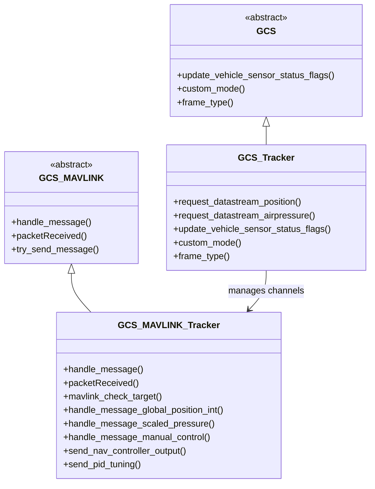
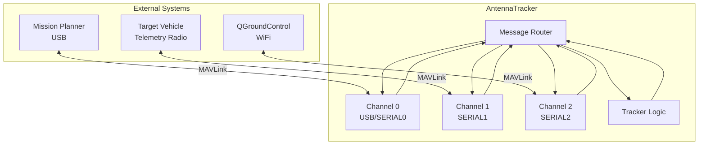
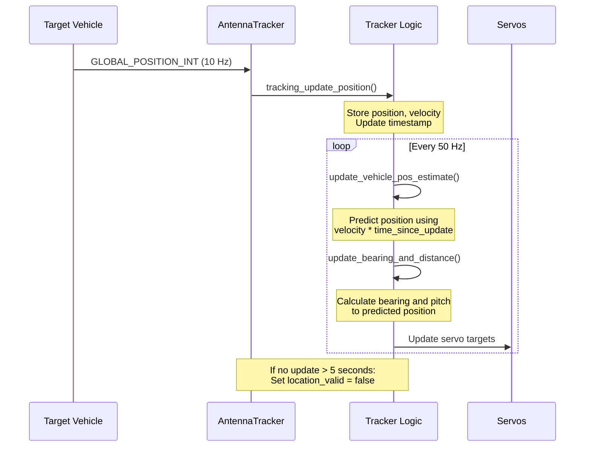
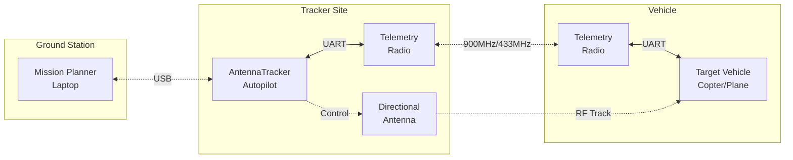
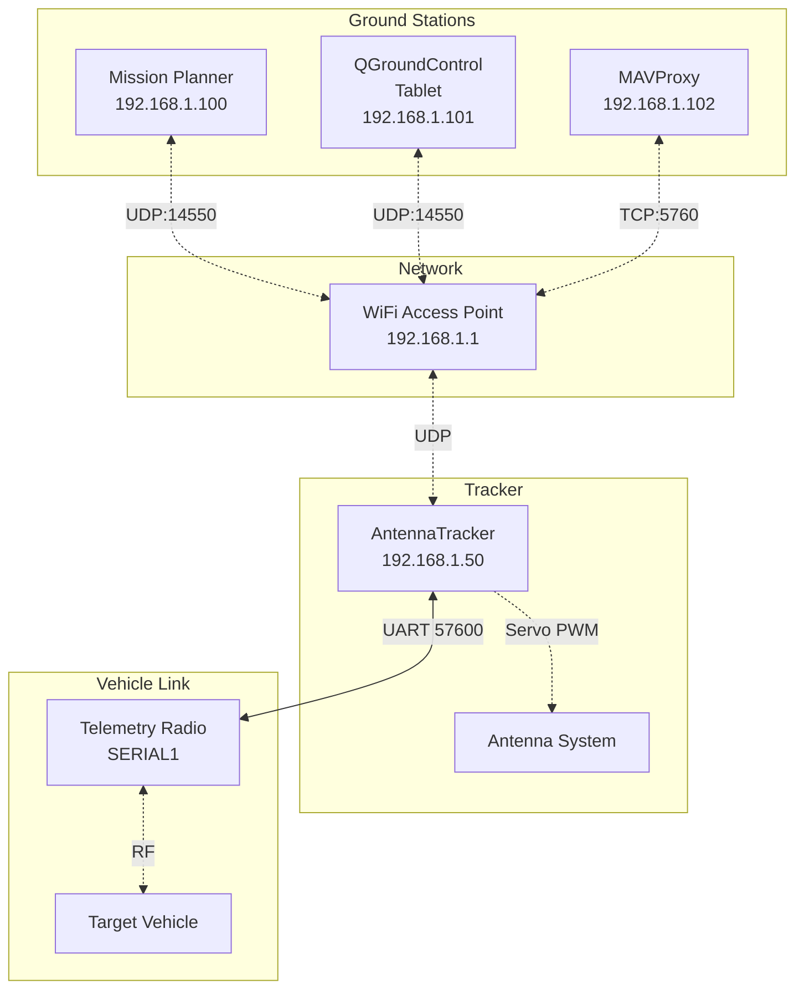
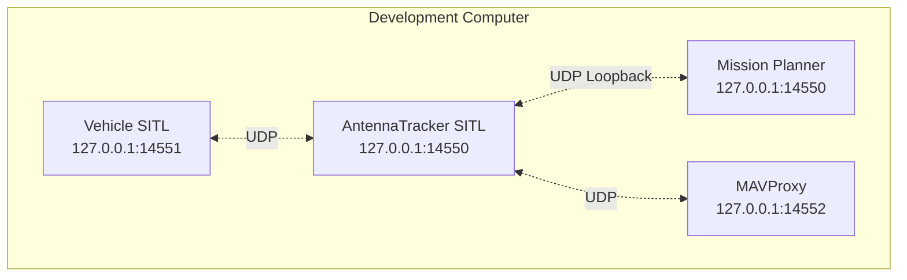

# AntennaTracker Communication Setup Guide


## Table of Contents
- [Overview](#overview)
- [MAVLink Protocol Implementation](#mavlink-protocol-implementation)
- [Target Vehicle Selection](#target-vehicle-selection)
- [Telemetry Link Configuration](#telemetry-link-configuration)
- [Ground Control Station Integration](#ground-control-station-integration)
- [Message Routing and Filtering](#message-routing-and-filtering)
- [Position Update Handling](#position-update-handling)
- [Manual Control via MAVLink](#manual-control-via-mavlink)
- [Network Topology](#network-topology)
- [Troubleshooting Communication Issues](#troubleshooting-communication-issues)

---

## Overview

The AntennaTracker system implements a robust MAVLink-based communication architecture that enables:

- **Multi-channel telemetry** supporting simultaneous GCS and vehicle connections
- **Automatic target acquisition** with configurable vehicle type filtering
- **Real-time position tracking** with velocity-based prediction for packet loss compensation
- **Bidirectional communication** for telemetry and command/control
- **Manual override capabilities** via MAVLink MANUAL_CONTROL messages

**Source Files**: 
- `/AntennaTracker/GCS_MAVLink_Tracker.h` - MAVLink message handler definitions
- `/AntennaTracker/GCS_MAVLink_Tracker.cpp` - Core MAVLink implementation
- `/AntennaTracker/GCS_Tracker.h` - GCS connection manager
- `/AntennaTracker/GCS_Tracker.cpp` - Data stream request handling
- `/AntennaTracker/tracking.cpp` - Position update and tracking logic

---

## MAVLink Protocol Implementation

### Architecture Overview

AntennaTracker implements the MAVLink 2.0 protocol through specialized GCS classes:



**Key Classes**:
- **`GCS_Tracker`**: High-level GCS manager handling multiple communication channels
- **`GCS_MAVLINK_Tracker`**: Per-channel MAVLink protocol implementation
- **Message filtering**: System ID-based filtering for target vehicle isolation

### Supported MAVLink Messages

#### Incoming Messages (Tracker Receives)

| Message ID | Message Name | Purpose | Handler Function |
|-----------|--------------|---------|------------------|
| HEARTBEAT | System heartbeat | Target vehicle discovery | `mavlink_check_target()` |
| GLOBAL_POSITION_INT | Global position | Vehicle position updates | `handle_message_global_position_int()` |
| SCALED_PRESSURE | Barometric pressure | Altitude difference calculation | `handle_message_scaled_pressure()` |
| MANUAL_CONTROL | Manual control inputs | Remote manual pointing control | `handle_message_manual_control()` |
| SET_ATTITUDE_TARGET | Attitude setpoint | Guided mode attitude control | `handle_set_attitude_target()` |
| MISSION_WRITE_PARTIAL_LIST | Mission upload start | Home position setting | `handle_message_mission_write_partial_list()` |
| MISSION_ITEM | Mission waypoint | Home position data | `handle_message_mission_item()` |

> **Source**: `/AntennaTracker/GCS_MAVLink_Tracker.cpp:296-330` (handle_message() switch statement)

#### Outgoing Messages (Tracker Sends)

| Message Name | Update Rate | Purpose | Source Function |
|-------------|-------------|---------|-----------------|
| HEARTBEAT | 1 Hz | System status | Inherited from GCS_MAVLINK |
| SYS_STATUS | 1 Hz | System health | Inherited from GCS_MAVLINK |
| NAV_CONTROLLER_OUTPUT | 10 Hz | Current pointing direction | `send_nav_controller_output()` |
| GLOBAL_POSITION_INT | 10 Hz | Tracker position (if moving) | `send_global_position_int()` |
| PID_TUNING | On demand | Servo PID debugging | `send_pid_tuning()` |
| REQUEST_DATA_STREAM | On connect | Request vehicle telemetry | `request_datastream_position()` |

> **Source**: `/AntennaTracker/GCS_MAVLink_Tracker.cpp:66-80` (send_nav_controller_output)

---

## Target Vehicle Selection

### Automatic Target Discovery

The AntennaTracker automatically locks onto the first compatible vehicle it receives a heartbeat from:

```cpp
// Source: /AntennaTracker/GCS_MAVLink_Tracker.cpp:217-248
void GCS_MAVLINK_Tracker::mavlink_check_target(const mavlink_message_t &msg)
{
    // exit immediately if the target has already been set
    if (tracker.target_set) {
        return;
    }

    // decode
    mavlink_heartbeat_t packet;
    mavlink_msg_heartbeat_decode(&msg, &packet);

    // exit immediately if this is not a vehicle we would track
    if ((packet.type == MAV_TYPE_ANTENNA_TRACKER) ||
        (packet.type == MAV_TYPE_GCS) ||
        (packet.type == MAV_TYPE_ONBOARD_CONTROLLER) ||
        (packet.type == MAV_TYPE_GIMBAL)) {
        return;
    }

    // set our sysid to the target
    if (tracker.g.sysid_target == 0) {
        tracker.g.sysid_target.set(msg.sysid);
    }

    // send data stream request to target on all channels
    tracker.gcs().request_datastream_position(msg.sysid, msg.compid);
    tracker.gcs().request_datastream_airpressure(msg.sysid, msg.compid);

    // flag target has been set
    tracker.target_set = true;
}
```

### SYSID_TARGET Configuration

**Parameter**: `SYSID_TARGET` (tracker.g.sysid_target)

| Configuration | Behavior | Use Case |
|--------------|----------|----------|
| `SYSID_TARGET = 0` | Auto-detect first vehicle | Single vehicle environments |
| `SYSID_TARGET = 1-255` | Lock to specific system ID | Multi-vehicle environments |

**Configuration Example**:
```bash
# Via MAVProxy
param set SYSID_TARGET 1

# Via Mission Planner
CONFIG/TUNING → Full Parameter List → SYSID_TARGET = 1
```

### Vehicle Type Filtering

The tracker **excludes** these MAVLink vehicle types from automatic targeting:

- `MAV_TYPE_ANTENNA_TRACKER` - Other antenna trackers
- `MAV_TYPE_GCS` - Ground control stations
- `MAV_TYPE_ONBOARD_CONTROLLER` - Companion computers
- `MAV_TYPE_GIMBAL` - Camera gimbals

**Accepted Vehicle Types** include:
- `MAV_TYPE_FIXED_WING` - Fixed-wing aircraft
- `MAV_TYPE_QUADROTOR` - Multicopters
- `MAV_TYPE_HELICOPTER` - Traditional helicopters
- `MAV_TYPE_GROUND_ROVER` - Ground vehicles
- `MAV_TYPE_SUBMARINE` - Underwater vehicles
- And all other vehicle types not in the exclusion list

> **Source**: `/AntennaTracker/GCS_MAVLink_Tracker.cpp:229-234`

### Message Filtering

Once a target is locked, all position and pressure messages from other system IDs are ignored:

```cpp
// Source: /AntennaTracker/GCS_MAVLink_Tracker.cpp:168-175
void GCS_MAVLINK_Tracker::packetReceived(const mavlink_status_t &status,
                                         const mavlink_message_t &msg)
{
    // return immediately if sysid doesn't match our target sysid
    if ((tracker.g.sysid_target != 0) && (tracker.g.sysid_target != msg.sysid)) {
        GCS_MAVLINK::packetReceived(status, msg);
        return;
    }
    // ... process message
}
```

---

## Telemetry Link Configuration

### Serial Port Configuration

AntennaTracker supports multiple simultaneous telemetry links on different serial ports.

#### Serial Port Parameters

| Parameter | Description | Default | Range |
|-----------|-------------|---------|-------|
| `SERIAL0_PROTOCOL` | USB port protocol | MAVLink2 | 0-35 |
| `SERIAL0_BAUD` | USB baud rate | 115200 | 1-2000 |
| `SERIAL1_PROTOCOL` | Telemetry 1 protocol | MAVLink2 | 0-35 |
| `SERIAL1_BAUD` | Telemetry 1 baud rate | 57600 | 1-2000 |
| `SERIAL2_PROTOCOL` | Telemetry 2 protocol | MAVLink2 | 0-35 |
| `SERIAL2_BAUD` | Telemetry 2 baud rate | 57600 | 1-2000 |

#### Typical Serial Configuration

**Scenario 1: Single telemetry radio to vehicle**
```bash
# SERIAL0 = USB connection to GCS
param set SERIAL0_PROTOCOL 2    # MAVLink2
param set SERIAL0_BAUD 115

# SERIAL1 = Radio to target vehicle
param set SERIAL1_PROTOCOL 2    # MAVLink2
param set SERIAL1_BAUD 57       # 57600 baud
```

**Scenario 2: Dual telemetry (GCS + Vehicle)**
```bash
# SERIAL0 = USB to laptop GCS
param set SERIAL0_PROTOCOL 2
param set SERIAL0_BAUD 115

# SERIAL1 = Radio to target vehicle
param set SERIAL1_PROTOCOL 2
param set SERIAL1_BAUD 57

# SERIAL2 = WiFi telemetry module to tablet GCS
param set SERIAL2_PROTOCOL 2
param set SERIAL2_BAUD 921      # 921600 baud for WiFi
```

### UDP Network Configuration

For SITL (Software In The Loop) and Ethernet-based telemetry:

```bash
# Start AntennaTracker SITL with multiple UDP endpoints
sim_vehicle.py -v Tracker --console --map \
    --out=udp:192.168.1.100:14550 \     # GCS computer
    --out=udp:192.168.1.101:14550       # Tablet GCS
```

**UDP Connection Parameters**:
- **Default GCS port**: 14550 (listens for incoming connections)
- **Default vehicle port**: 14551 (outgoing connection to vehicle)
- **SITL listen address**: 127.0.0.1 (localhost) or 0.0.0.0 (all interfaces)

### TCP Network Configuration

For reliable connections over WiFi/Ethernet:

```bash
# TCP server mode (tracker waits for connections)
param set SERIAL2_PROTOCOL 2
# Configure via command line:
--serial2=tcp:0.0.0.0:5760:wait

# TCP client mode (tracker initiates connection)
--serial2=tcp:192.168.1.100:5760
```

**TCP vs UDP Trade-offs**:
- **UDP**: Lower latency, no connection overhead, packet loss possible
- **TCP**: Reliable delivery, higher latency, connection management overhead

### Data Stream Rate Configuration

**Parameter**: `SR0_POSITION`, `SR0_RAW_SENS`, etc.

The tracker requests position and pressure data from the target vehicle at a configurable rate:

```cpp
// Source: /AntennaTracker/GCS_Tracker.cpp:4-18
void GCS_Tracker::request_datastream_position(const uint8_t _sysid, const uint8_t compid)
{
    for (uint8_t i=0; i < num_gcs(); i++) {
        if (HAVE_PAYLOAD_SPACE((mavlink_channel_t)i, DATA_STREAM)) {
            mavlink_msg_request_data_stream_send(
                (mavlink_channel_t)i,
                _sysid,
                compid,
                MAV_DATA_STREAM_POSITION,
                tracker.g.mavlink_update_rate,  // Requested rate in Hz
                1);                             // start streaming
        }
    }
}
```

**Configuration**:
```bash
# Set MAVLink update rate for position requests
param set MAV_RATE 10           # Request 10 Hz position updates

# Per-stream rate multipliers (if supported by vehicle)
param set SR0_POSITION 2        # 2x base rate = 20 Hz
param set SR0_RAW_SENS 1        # 1x base rate = 10 Hz
```

---

## Ground Control Station Integration

### Mission Planner Setup

**Step 1: Connect to Tracker**
1. Select COM port where tracker is connected
2. Select baud rate (typically 57600 or 115200)
3. Click **Connect**

**Step 2: Configure Target Vehicle**
1. Navigate to **CONFIG/TUNING** → **Full Parameter List**
2. Set `SYSID_TARGET`:
   - `0` for automatic detection
   - `1-255` for specific vehicle system ID
3. Click **Write Params**

**Step 3: Verify Communication**
1. Check **Status** tab shows tracker position
2. **HUD** should display tracker attitude
3. **Quick** tab shows servo outputs

**Step 4: Monitor Tracking**
1. **Flight Data** screen shows:
   - Distance to target
   - Bearing to target
   - Pitch angle
2. NAV_CONTROLLER_OUTPUT message contains:
   ```
   nav_pitch:    Current pitch angle (degrees)
   nav_bearing:  Current bearing (degrees)  
   target_dist:  Distance to target (meters)
   alt_error:    Altitude difference (meters)
   ```

### QGroundControl Integration

**Connection Setup**:
1. **Application Settings** → **Comm Links** → **Add**
2. Configure link:
   - **Type**: Serial, UDP, or TCP
   - **Serial**: Select port and 57600 baud
   - **UDP**: Port 14550 (auto-detects tracker)
3. **Connect**

**Monitoring**:
- **Analyze Tools** → **MAVLink Inspector** shows all received messages
- **Vehicle Setup** → **Parameters** for configuration
- Custom widget for NAV_CONTROLLER_OUTPUT display

### MAVProxy Command Line GCS

**Basic Connection**:
```bash
# Serial connection
mavproxy.py --master=/dev/ttyUSB0 --baudrate=57600

# Network connection  
mavproxy.py --master=udp:192.168.1.10:14550

# Multiple outputs
mavproxy.py --master=/dev/ttyUSB0 --out=udp:192.168.1.100:14550
```

**Useful MAVProxy Commands**:
```bash
# Check target vehicle lock
param show SYSID_TARGET

# Monitor tracker status
status
watch NAV_CONTROLLER_OUTPUT

# Change flight mode
mode AUTO
mode MANUAL

# Arm/disarm servos
arm throttle
disarm

# Set home position
setheome <lat> <lon> <alt>

# Manual control (requires GUIDED or MANUAL mode)
guided <yaw> <pitch>
```

**MAVProxy Module for Tracker Monitoring**:
```python
# Load tracker module
module load tracker

# Display tracker information
tracker status
tracker target    # Show target vehicle info
```

---

## Message Routing and Filtering

### Multi-Channel Architecture

AntennaTracker can handle multiple simultaneous MAVLink connections:



### System ID Based Filtering

**Message Flow Logic**:

1. **Incoming messages** are checked against `SYSID_TARGET`:
   ```cpp
   if ((tracker.g.sysid_target != 0) && (tracker.g.sysid_target != msg.sysid)) {
       // Not from target - pass to base class for GCS handling
       GCS_MAVLINK::packetReceived(status, msg);
       return;
   }
   ```

2. **Position/Pressure messages** from target are processed:
   - `GLOBAL_POSITION_INT` → Updates vehicle position
   - `SCALED_PRESSURE` → Updates altitude difference
   
3. **Command messages** from GCS are always processed regardless of system ID

4. **Outgoing messages** are broadcast to all connected channels

### Routing Rules

| Message Source | Message Type | Routing Behavior |
|---------------|--------------|------------------|
| Target Vehicle | GLOBAL_POSITION_INT | Process for tracking + forward to GCS |
| Target Vehicle | SCALED_PRESSURE | Process for tracking + forward to GCS |
| Target Vehicle | HEARTBEAT | Process for target lock + forward to GCS |
| Any GCS | Command messages | Process locally |
| Any GCS | Parameter read/write | Process locally |
| Tracker | NAV_CONTROLLER_OUTPUT | Broadcast to all GCS |
| Tracker | HEARTBEAT | Broadcast to all channels |

> **Source**: `/AntennaTracker/GCS_MAVLink_Tracker.cpp:168-203` (packetReceived implementation)

---

## Position Update Handling

### Position Data Flow



### Position Update Implementation

```cpp
// Source: /AntennaTracker/tracking.cpp:132-152
void Tracker::tracking_update_position(const mavlink_global_position_int_t &msg)
{
    // reject (0;0) coordinates
    if (!msg.lat && !msg.lon) {
        return;
    }

    vehicle.location.lat = msg.lat;                    // Latitude in 1E7 degrees
    vehicle.location.lng = msg.lon;                    // Longitude in 1E7 degrees
    vehicle.location.alt = msg.alt/10;                 // Altitude in mm, convert to cm
    vehicle.relative_alt = msg.relative_alt/10;        // Relative alt in mm, convert to cm
    vehicle.vel = Vector3f(msg.vx*0.01f,               // X velocity cm/s → m/s
                           msg.vy*0.01f,               // Y velocity cm/s → m/s
                           msg.vz*0.01f);              // Z velocity cm/s → m/s
    vehicle.last_update_us = AP_HAL::micros();
    vehicle.last_update_ms = AP_HAL::millis();
}
```

### Position Prediction Algorithm

To compensate for telemetry latency and packet loss, the tracker predicts vehicle position:

```cpp
// Source: /AntennaTracker/tracking.cpp:7-26
void Tracker::update_vehicle_pos_estimate()
{
    // calculate time since last actual position update
    float dt = (AP_HAL::micros() - vehicle.last_update_us) * 1.0e-6f;

    // if less than 5 seconds since last position update estimate the position
    if (dt < TRACKING_TIMEOUT_SEC) {  // TRACKING_TIMEOUT_SEC = 5.0
        // project the vehicle position to take account of lost radio packets
        vehicle.location_estimate = vehicle.location;
        float north_offset = vehicle.vel.x * dt;      // Velocity in NED frame
        float east_offset = vehicle.vel.y * dt;
        vehicle.location_estimate.offset(north_offset, east_offset);
        vehicle.location_estimate.alt += vehicle.vel.z * 100.0f * dt;  // m/s to cm
        
        // set valid_location flag
        vehicle.location_valid = true;
    } else {
        // vehicle has been lost, set lost flag
        vehicle.location_valid = false;
    }
}
```

**Key Features**:
- **Dead reckoning**: Uses last known velocity to predict current position
- **Timeout handling**: Marks vehicle as lost after 5 seconds without updates
- **High update rate**: Position estimate updated at 50 Hz even if telemetry is slower
- **Smooth tracking**: Reduces jitter from irregular telemetry updates

### Altitude Source Selection

The tracker supports multiple altitude difference calculation methods:

**Parameter**: `ALT_SOURCE`

| Value | Source | Description | Use Case |
|-------|--------|-------------|----------|
| 0 | GPS | Use GPS altitude difference | Default, works without barometer |
| 1 | Baro | Use barometric altitude difference | More accurate for nearby vehicles |
| 2 | GPS Vehicle Only | Use vehicle's relative altitude | Vehicle has better altitude source |

```cpp
// Source: /AntennaTracker/tracking.cpp:64-78
// calculate altitude difference to vehicle using gps
if (g.alt_source == ALT_SOURCE_GPS){
    nav_status.alt_difference_gps = (vehicle.location_estimate.alt - current_loc.alt) * 0.01f;
} else {
    // g.alt_source == ALT_SOURCE_GPS_VEH_ONLY
    nav_status.alt_difference_gps = vehicle.relative_alt * 0.01f;
}

// calculate pitch to vehicle
if (mode->number() != Mode::Number::SCAN && !nav_status.manual_control_pitch) {
    if (g.alt_source == ALT_SOURCE_BARO) {
        nav_status.pitch = degrees(atan2f(nav_status.alt_difference_baro, nav_status.distance));
    } else {
        nav_status.pitch = degrees(atan2f(nav_status.alt_difference_gps, nav_status.distance));
    }
}
```

### Barometric Pressure Handling

When using barometric altitude source, the tracker compares local and vehicle pressure:

```cpp
// Source: /AntennaTracker/tracking.cpp:158-175
void Tracker::tracking_update_pressure(const mavlink_scaled_pressure_t &msg)
{
    float local_pressure = barometer.get_pressure();
    float aircraft_pressure = msg.press_abs*100.0f;  // Convert hPa to Pa

    // calculate altitude difference based on difference in barometric pressure
    float alt_diff = barometer.get_altitude_difference(local_pressure, aircraft_pressure);
    
    if (!isnan(alt_diff) && !isinf(alt_diff)) {
        nav_status.alt_difference_baro = alt_diff + nav_status.altitude_offset;

        if (nav_status.need_altitude_calibration) {
            // we have done a baro calibration - zero the altitude
            // difference to the aircraft
            nav_status.altitude_offset = -alt_diff;
            nav_status.alt_difference_baro = 0;
            nav_status.need_altitude_calibration = false;
        }
    }
}
```

**Barometer Calibration**:
```bash
# Via MAVProxy or Mission Planner, send preflight calibration command
# This zeros the altitude difference when tracker and vehicle are at same altitude
mavproxy> preflightcal baro
```

---

## Manual Control via MAVLink

### MANUAL_CONTROL Message Support

The tracker can be remotely controlled via MAVLink `MANUAL_CONTROL` messages, allowing GCS or companion computer to directly command pointing angles.

#### Message Format

```c
// MAVLink MANUAL_CONTROL message structure
typedef struct __mavlink_manual_control_t {
    int16_t x;       // X-axis / Yaw input (-1000 to 1000, or 0x7FFF to ignore)
    int16_t y;       // Y-axis / Pitch input (-1000 to 1000, or 0x7FFF to ignore)
    int16_t z;       // Z-axis / Throttle (not used by tracker)
    int16_t r;       // R-axis / Rotation (not used by tracker)
    uint16_t buttons;// Button states (not used by tracker)
    uint8_t target;  // Target system ID
} mavlink_manual_control_t;
```

#### Implementation

```cpp
// Source: /AntennaTracker/tracking.cpp:186-194
void Tracker::tracking_manual_control(const mavlink_manual_control_t &msg)
{
    nav_status.bearing = msg.x;                          // Yaw angle in degrees
    nav_status.pitch   = msg.y;                          // Pitch angle in degrees
    nav_status.distance = 0.0;
    nav_status.manual_control_yaw   = (msg.x != 0x7FFF); // Check if yaw is specified
    nav_status.manual_control_pitch = (msg.y != 0x7FFF); // Check if pitch is specified
    // z, r and buttons are not used
}
```

**Key Behaviors**:
- **Yaw control**: `msg.x` directly sets bearing angle in degrees
- **Pitch control**: `msg.y` directly sets pitch angle in degrees
- **Axis ignore**: Setting axis to `0x7FFF` (32767) tells tracker to ignore that axis
- **Mode independence**: Works in MANUAL mode, overrides automatic tracking in other modes
- **Persistence**: Manual control values persist until overwritten by automatic tracking

#### Sending Manual Control Commands

**Python Example (using pymavlink)**:
```python
from pymavlink import mavutil

# Connect to tracker
tracker = mavutil.mavlink_connection('/dev/ttyUSB0', baud=57600)
tracker.wait_heartbeat()

# Send manual control command
# Point tracker to 45° yaw, 30° pitch
tracker.mav.manual_control_send(
    tracker.target_system,   # Target system ID
    x=45,                    # Yaw: 45 degrees
    y=30,                    # Pitch: 30 degrees
    z=0,                     # Throttle: not used
    r=0,                     # Rotation: not used
    buttons=0                # Buttons: not used
)

# To release yaw control (let tracker auto-track yaw):
tracker.mav.manual_control_send(
    tracker.target_system,
    x=0x7FFF,                # Ignore yaw
    y=30,                    # Keep pitch at 30°
    z=0, r=0, buttons=0
)
```

**MAVProxy Guided Control**:
```bash
# Enter GUIDED mode for scripted control
mode GUIDED

# Use SET_ATTITUDE_TARGET message for quaternion-based control
# (More precise than MANUAL_CONTROL)
```

### SET_ATTITUDE_TARGET Support (GUIDED Mode)

For more precise control in GUIDED mode:

```cpp
// Source: /AntennaTracker/GCS_MAVLink_Tracker.cpp:82-120
void GCS_MAVLINK_Tracker::handle_set_attitude_target(const mavlink_message_t &msg)
{
    mavlink_set_attitude_target_t packet;
    mavlink_msg_set_attitude_target_decode(&msg, &packet);

    // exit if vehicle is not in Guided mode
    if (tracker.mode != &tracker.mode_guided) {
        return;
    }

    // Sanity checks for valid fields
    const bool use_yaw_rate = !(packet.type_mask & (1<<2));

    tracker.mode_guided.set_angle(
        Quaternion(packet.q[0],packet.q[1],packet.q[2],packet.q[3]),
        use_yaw_rate,
        packet.body_yaw_rate);
}
```

**Python Example (SET_ATTITUDE_TARGET)**:
```python
import math
from pymavlink import mavutil
from pymavlink.quaternion import QuaternionBase

tracker = mavutil.mavlink_connection('/dev/ttyUSB0', baud=57600)
tracker.wait_heartbeat()

# Convert yaw and pitch to quaternion
# Roll = 0 (not applicable to tracker)
yaw_deg = 45
pitch_deg = 30
roll_deg = 0

q = QuaternionBase([math.radians(roll_deg), 
                    math.radians(pitch_deg), 
                    math.radians(yaw_deg)])

# Send SET_ATTITUDE_TARGET
tracker.mav.set_attitude_target_send(
    0,                      # time_boot_ms (0 = ignore)
    tracker.target_system,  # target system
    tracker.target_component, # target component
    0b00000111,             # type_mask (ignore rates)
    q,                      # attitude quaternion
    0,                      # roll rate (ignored)
    0,                      # pitch rate (ignored)
    0,                      # yaw rate (ignored)
    0                       # thrust (ignored)
)
```

---

## Network Topology

### Typical Deployment Scenarios

#### Scenario 1: Single GCS, Single Telemetry Radio



**Configuration**:
- Tracker USB (SERIAL0): Mission Planner at 115200 baud
- Tracker SERIAL1: Telemetry radio at 57600 baud
- Vehicle receives position requests from tracker
- Tracker receives position updates from vehicle
- GCS monitors both tracker and vehicle

#### Scenario 2: Multiple GCS with Network Telemetry



**Configuration**:
```bash
# Tracker network setup (via companion computer or WiFi module)
# Forward MAVLink from SERIAL0 to network
mavproxy.py --master=/dev/ttyAMA0 --baudrate=115200 \
    --out=udpbcast:192.168.1.255:14550 \  # Broadcast to all GCS
    --out=tcpout:0.0.0.0:5760              # TCP server for MAVProxy
```

#### Scenario 3: SITL Testing Environment



**SITL Startup Commands**:
```bash
# Terminal 1: Start vehicle SITL
cd ardupilot/ArduCopter
sim_vehicle.py -v ArduCopter --console --map

# Terminal 2: Start tracker SITL
cd ardupilot/AntennaTracker  
sim_vehicle.py -v Tracker --console \
    --out=udp:127.0.0.1:14550 \      # GCS connection
    --mavproxy-args="--target-system=1"  # Track vehicle sysid 1

# Terminal 3: Connect Mission Planner to UDP 127.0.0.1:14550
```

### Port Allocations

| Port | Protocol | Purpose | Default User |
|------|----------|---------|--------------|
| 14550 | UDP | GCS telemetry | Mission Planner, QGC |
| 14551 | UDP | Vehicle telemetry | Vehicle SITL |
| 14552 | UDP | Secondary GCS | MAVProxy |
| 5760 | TCP | GCS connection | MAVProxy, custom apps |
| 5761 | TCP | Secondary connection | Additional GCS |

---

## Troubleshooting Communication Issues

### No Target Lock / Vehicle Not Tracking

**Symptoms**:
- Tracker powered on but not moving
- `vehicle.target_set` = false
- No position data in telemetry logs

**Diagnostic Steps**:

1. **Verify vehicle is transmitting heartbeat**:
   ```bash
   # Via MAVProxy connected to tracker
   status
   # Check for "Target: Not locked" message
   
   # Enable MAVLink message logging
   set shownoise 1
   # Should see HEARTBEAT messages from vehicle
   ```

2. **Check SYSID_TARGET configuration**:
   ```bash
   param show SYSID_TARGET
   # If set to non-zero, must match vehicle system ID
   
   # Check vehicle system ID:
   # Connect to vehicle with separate GCS
   # Look at HEARTBEAT.sysid field
   ```

3. **Verify vehicle type not filtered**:
   - Tracker ignores MAV_TYPE_GCS, MAV_TYPE_ANTENNA_TRACKER, MAV_TYPE_GIMBAL
   - Check vehicle's MAV_TYPE in HEARTBEAT message
   - Common vehicle types: MAV_TYPE_QUADROTOR (2), MAV_TYPE_FIXED_WING (1)

4. **Check telemetry link quality**:
   ```bash
   # Look at radio RSSI (Received Signal Strength Indicator)
   # RSSI should be > 50% for reliable communication
   
   # Check for packet loss
   status
   # Look at "pkts" counters in radio status
   ```

**Solutions**:
```bash
# Reset SYSID_TARGET to auto-detect
param set SYSID_TARGET 0

# Force target lock by matching vehicle system ID
param set SYSID_TARGET 1  # If vehicle is sysid 1

# Reboot tracker to restart target detection
reboot
```

### Erratic Tracking / Jittery Movement

**Symptoms**:
- Antenna oscillates or hunts
- Tracking lags behind vehicle movement
- Sudden jumps in pointing direction

**Diagnostic Steps**:

1. **Check telemetry update rate**:
   ```cpp
   // Expected: GLOBAL_POSITION_INT at 5-10 Hz minimum
   // Source: /AntennaTracker/GCS_Tracker.cpp:14
   // tracker.g.mavlink_update_rate should be 5-10
   ```
   ```bash
   param show MAV_RATE
   # Should be 5-10 Hz
   
   # Monitor actual message rate
   watch GLOBAL_POSITION_INT
   # Should see consistent updates
   ```

2. **Verify position prediction is working**:
   - Check vehicle velocity fields in GLOBAL_POSITION_INT are non-zero during movement
   - Velocity is used for position prediction between telemetry updates
   - Source: `/AntennaTracker/tracking.cpp:16-18`

3. **Check PID tuning**:
   ```bash
   # View current PID parameters
   param show PITCH2SRV_P
   param show PITCH2SRV_I
   param show PITCH2SRV_D
   param show YAW2SRV_P
   param show YAW2SRV_I
   param show YAW2SRV_D
   
   # Enable PID tuning messages for real-time debugging
   param set GCS_PID_MASK 3  # Enable pitch (1) + yaw (2) PID tuning
   ```

4. **Check for mechanical issues**:
   - Binding in pan/tilt mechanism
   - Servo slop or backlash
   - Insufficient servo torque
   - Electrical noise affecting servos

**Solutions**:
```bash
# Increase telemetry rate from vehicle
param set SR1_POSITION 10  # 10 Hz position updates (on vehicle)

# Adjust PID gains (start with P term)
param set PITCH2SRV_P 0.2  # Increase for faster response
param set YAW2SRV_P 0.2

# Add rate limiting to prevent oscillation
param set PITCH2SRV_RMAX 60  # Max 60 deg/s pitch rate
param set YAW2SRV_RMAX 60    # Max 60 deg/s yaw rate

# Increase velocity-based prediction weighting
# (Inherent in position prediction algorithm, no parameter)
```

### No Communication Between GCS and Tracker

**Symptoms**:
- Mission Planner shows "Connecting..." indefinitely
- No heartbeat received from tracker
- Serial port issues

**Diagnostic Steps**:

1. **Verify serial port configuration**:
   ```bash
   # Check COM port assignment (Windows)
   # Device Manager → Ports (COM & LPT)
   
   # Check USB device (Linux)
   ls -l /dev/ttyUSB* /dev/ttyACM*
   dmesg | grep tty  # Look for recent USB serial connections
   ```

2. **Verify baud rate match**:
   ```bash
   # Tracker parameter
   param show SERIAL0_BAUD
   # Must match GCS connection settings
   # Common values: 57 (57600), 115 (115200), 921 (921600)
   ```

3. **Check protocol configuration**:
   ```bash
   param show SERIAL0_PROTOCOL
   # Should be 2 (MAVLink2) or 1 (MAVLink1)
   # 0 = None, will not communicate
   ```

4. **Test with different GCS**:
   ```bash
   # Try MAVProxy for simpler debugging
   mavproxy.py --master=/dev/ttyUSB0 --baudrate=57600
   
   # Should see:
   # "Received XXX messages"
   # "Got HEARTBEAT from Tracker"
   ```

**Solutions**:
```bash
# Reconfigure serial port (requires reboot)
param set SERIAL0_PROTOCOL 2   # MAVLink2
param set SERIAL0_BAUD 115     # 115200 baud
reboot

# Try default baud rates in sequence:
# 115200, 57600, 38400, 9600

# Check for serial port permissions (Linux)
sudo usermod -a -G dialout $USER
# Log out and back in

# Check for conflicting applications
sudo lsof /dev/ttyUSB0  # Linux
# Close any other applications using the port
```

### Altitude Difference Incorrect

**Symptoms**:
- Tracker pitch angle doesn't match vehicle elevation
- Large altitude offset
- Altitude jumps unexpectedly

**Diagnostic Steps**:

1. **Check altitude source configuration**:
   ```bash
   param show ALT_SOURCE
   # 0 = GPS (default)
   # 1 = Baro (requires SCALED_PRESSURE from vehicle)
   # 2 = GPS vehicle only
   ```

2. **Verify SCALED_PRESSURE messages received** (if ALT_SOURCE = 1):
   ```bash
   # Enable message monitoring
   watch SCALED_PRESSURE
   # Should see periodic updates from vehicle
   ```

3. **Check barometer calibration**:
   ```bash
   # Zero altitude difference when both at same altitude
   preflightcal baro
   # Sets nav_status.altitude_offset
   # Source: /AntennaTracker/tracking.cpp:168-174
   ```

4. **Verify GPS altitude is MSL (Mean Sea Level)**:
   - GPS altitude should be relative to sea level, not WGS84 ellipsoid
   - Check vehicle GPS configuration

**Solutions**:
```bash
# Use GPS altitude (most reliable)
param set ALT_SOURCE 0

# If using baro, calibrate with vehicle at known altitude
preflightcal baro

# Use vehicle's relative altitude (avoids tracker GPS requirement)
param set ALT_SOURCE 2
```

### Lost Communication After Period of Operation

**Symptoms**:
- Tracking works initially, then stops
- `vehicle.location_valid` becomes false
- Last update timestamp > 5 seconds old

**Diagnostic Steps**:

1. **Check for interference**:
   - Operating near other 900MHz/2.4GHz sources
   - Antenna pointing away from tracker reduces link quality
   - Moving out of radio range

2. **Monitor telemetry link quality**:
   ```bash
   # Check radio status
   status
   # Look at RSSI, remote RSSI
   # Check error counters
   ```

3. **Verify power supply stability**:
   - Low voltage can cause radio brown-outs
   - Check battery voltage on tracker and vehicle
   - EMI from servos can interfere with radio

4. **Check for GCS telemetry flooding**:
   - Too many stream requests can saturate link
   - Reduce GCS telemetry rates

**Solutions**:
```bash
# Reduce telemetry bandwidth usage
param set SR1_EXTRA1 0   # Disable extra1 stream
param set SR1_EXTRA2 0   # Disable extra2 stream
param set SR1_EXTRA3 0   # Disable extra3 stream
param set SR1_RC_CHAN 0  # Disable RC channel stream

# Use telemetry radio with higher power/better antenna
# Check radio configuration for optimal settings

# Increase timeout threshold (if frequent short dropouts)
# Note: TRACKING_TIMEOUT_SEC is compile-time constant (5.0s)
# Located in /AntennaTracker/tracking.cpp:13
```

### Multiple Vehicle Interference

**Symptoms**:
- Tracker switches between multiple vehicles
- Position jumps erratically
- Unexpected target changes

**Diagnostic Steps**:

1. **Check for multiple heartbeats**:
   ```bash
   set shownoise 1
   # Watch for HEARTBEAT from multiple system IDs
   ```

2. **Verify SYSID_TARGET is set**:
   ```bash
   param show SYSID_TARGET
   # 0 = Will lock to first vehicle, may switch if restarted
   # 1-255 = Locked to specific vehicle
   ```

**Solutions**:
```bash
# Lock to specific vehicle system ID
param set SYSID_TARGET 1  # Replace with actual vehicle sysid

# Ensure each vehicle has unique system ID
# Configure on vehicle side:
# param set SYSID_THISMAV 1  # Vehicle 1
# param set SYSID_THISMAV 2  # Vehicle 2

# Restart tracker to re-acquire target
reboot
```

---

## Advanced Configuration

### Custom Message Handlers

For custom telemetry handling, modify:
```cpp
// File: /AntennaTracker/GCS_MAVLink_Tracker.cpp
// Add case to handle_message() switch statement:

void GCS_MAVLINK_Tracker::handle_message(const mavlink_message_t &msg)
{
    switch (msg.msgid) {
    
    case MAVLINK_MSG_ID_YOUR_CUSTOM_MESSAGE:
        handle_custom_message(msg);
        break;
    
    // ... existing cases
    }
}
```

### Logging Communication Events

Enable MAVLink logging to diagnose communication issues:
```bash
# Set log bitmask to include MAVLink messages
param set LOG_BITMASK 131071  # All logging
param set LOG_BACKEND_TYPE 1  # Dataflash/SD card

# Specific logging for GPS position updates
# Source: /AntennaTracker/tracking.cpp:147-151
```

Logged data includes:
- VPOS: Vehicle position from GLOBAL_POSITION_INT
- VBAR: Vehicle barometric altitude
- NAV: Navigation controller output (bearing, pitch, distance)

### Telemetry Encryption

For secure communication links:
```bash
# Enable MAVLink 2 signing (encryption)
param set SERIAL1_PROTOCOL 2   # MAVLink2 required
# Configure signing key via GCS
# Both tracker and vehicle must have matching keys
```

---

## Summary

The AntennaTracker communication system provides:

✅ **Robust multi-channel MAVLink implementation** supporting simultaneous GCS and vehicle links  
✅ **Automatic target acquisition** with configurable vehicle filtering  
✅ **Real-time position tracking** with velocity-based prediction  
✅ **Multiple altitude sources** (GPS, barometric, vehicle-relative)  
✅ **Manual control capabilities** via MAVLink messages  
✅ **Flexible network topology** supporting serial, UDP, and TCP transports  

**Key Configuration Parameters**:
- `SYSID_TARGET`: Target vehicle system ID (0 = auto-detect)
- `MAV_RATE`: MAVLink telemetry update rate
- `ALT_SOURCE`: Altitude calculation method
- `SERIAL0_PROTOCOL` / `SERIAL0_BAUD`: GCS connection settings
- `SERIAL1_PROTOCOL` / `SERIAL1_BAUD`: Vehicle telemetry settings

**Communication Health Indicators**:
- `vehicle.target_set`: Target vehicle locked
- `vehicle.location_valid`: Receiving valid position updates
- `vehicle.last_update_ms`: Timestamp of last position update
- `nav_status.distance`: Current range to target
- `nav_status.bearing`: Current bearing to target

For additional support, refer to:
- ArduPilot AntennaTracker Documentation: https://ardupilot.org/antennatracker/
- MAVLink Protocol Specification: https://mavlink.io/
- ArduPilot Discourse Forum: https://discuss.ardupilot.org/

---

**Document Version**: 1.0  
**Last Updated**: 2024  
**Applicable Firmware**: AntennaTracker 4.0+  
**Maintainer**: ArduPilot Development Team
