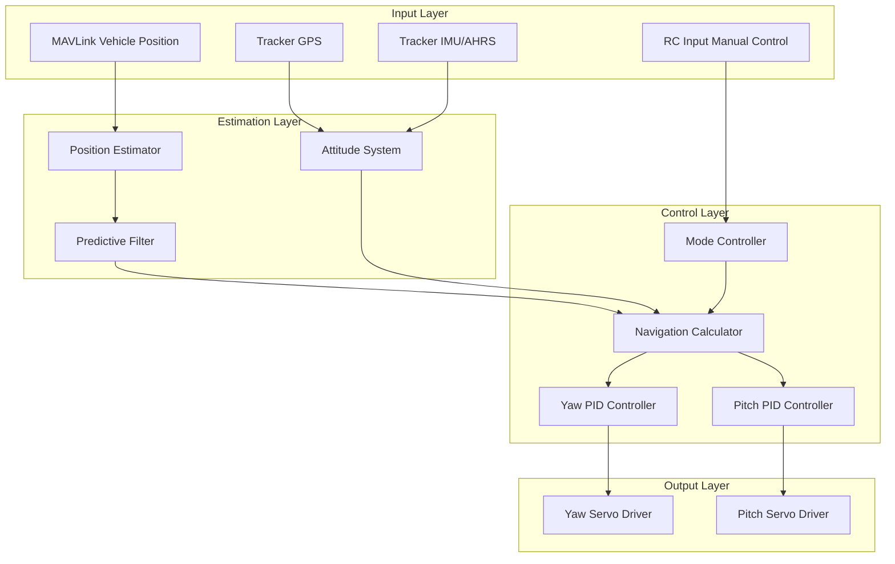
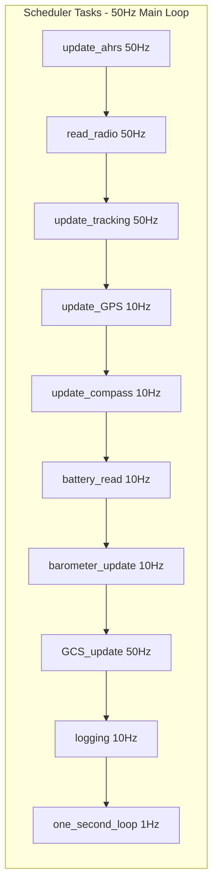
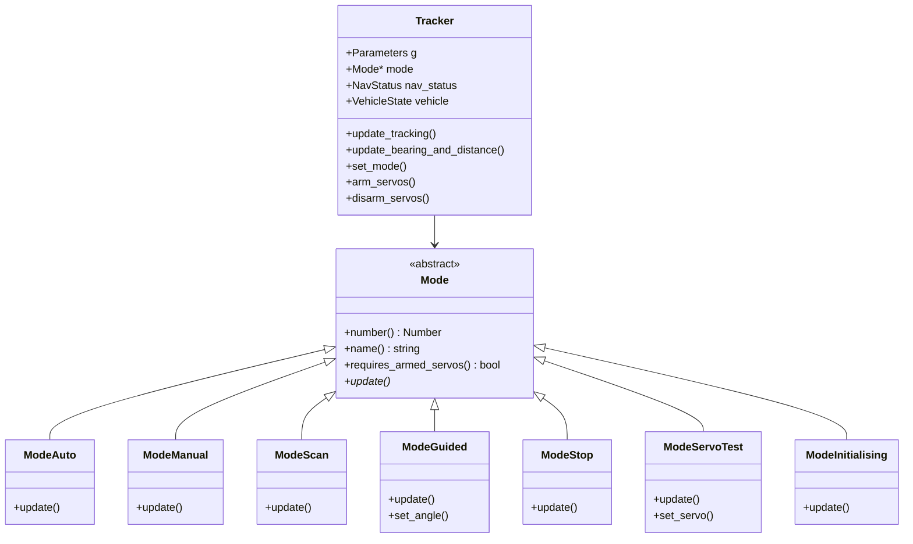
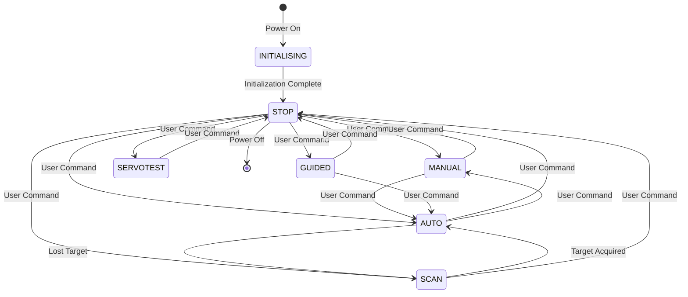
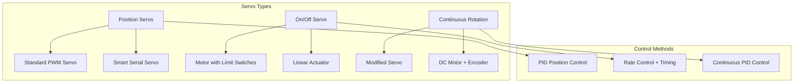
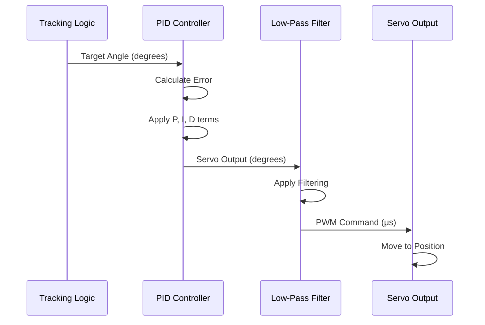
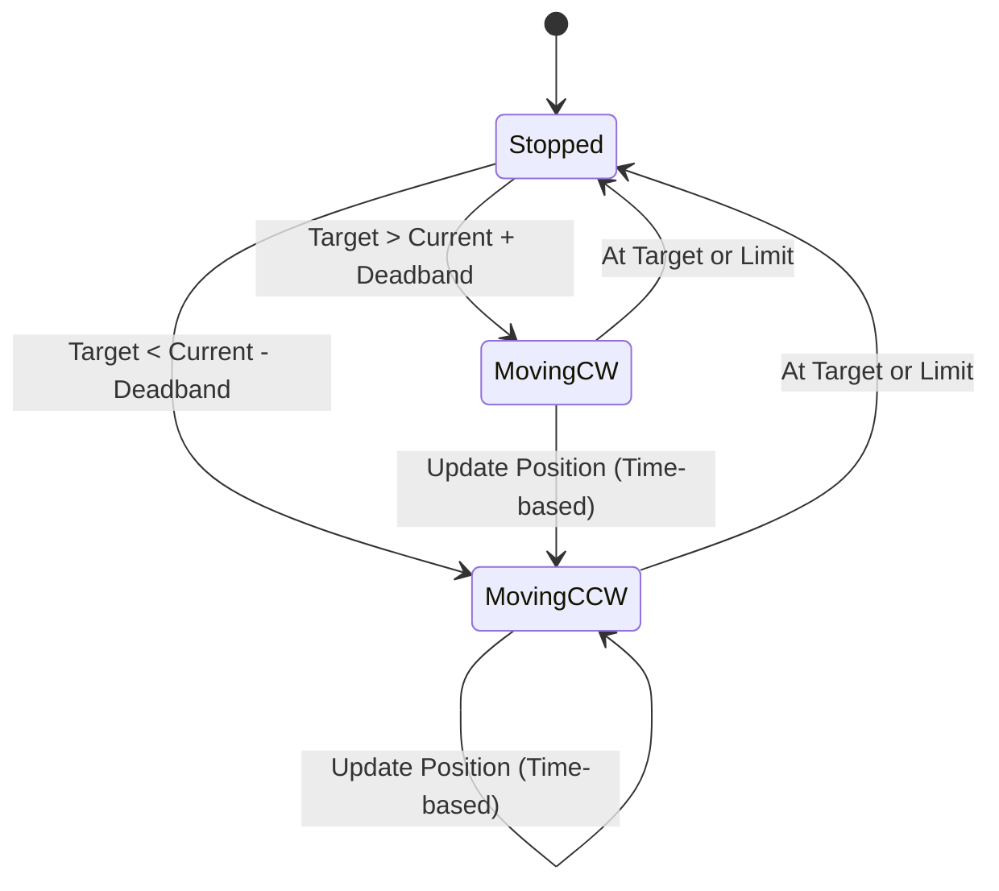
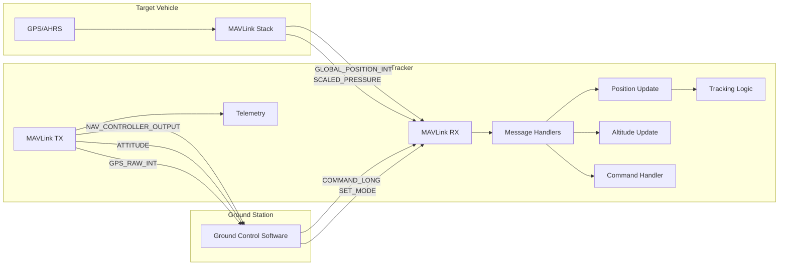
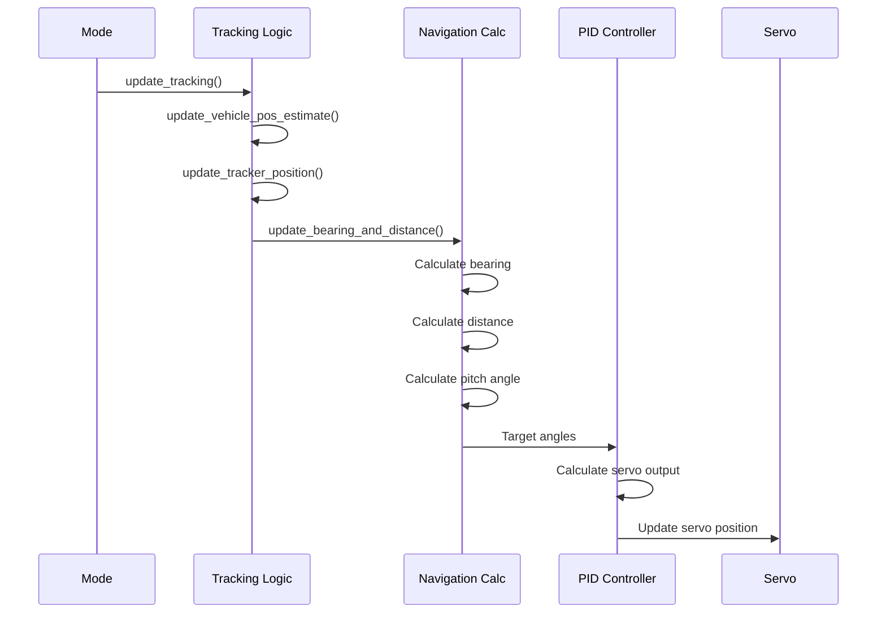

# AntennaTracker


## Table of Contents
- [Overview](#overview)
- [System Architecture](#system-architecture)
- [Tracking Modes](#tracking-modes)
- [Servo Control System](#servo-control-system)
- [MAVLink Integration](#mavlink-integration)
- [Navigation and Positioning](#navigation-and-positioning)
- [Hardware Platforms](#hardware-platforms)
- [Configuration Parameters](#configuration-parameters)
- [Getting Started](#getting-started)
- [Advanced Topics](#advanced-topics)
- [Related Documentation](#related-documentation)

## Overview

AntennaTracker is a specialized ArduPilot vehicle firmware designed to autonomously point directional antennas, cameras, or sensors at a moving target vehicle. The system continuously calculates the required pan (yaw) and tilt (pitch) angles to maintain optimal pointing alignment with a tracked vehicle, making it ideal for:

- **Long-range telemetry**: High-gain directional antennas for extended communication range
- **FPV video reception**: Directional video antennas for improved signal quality
- **Ground station cameras**: Automated camera tracking for aerial photography missions
- **RF tracking**: Specialized sensor pointing for research and monitoring applications

**Source Files**: `/AntennaTracker/`
- **Core Implementation**: `Tracker.h`, `Tracker.cpp`
- **Mode System**: `mode.h`, `mode_*.cpp`
- **Parameters**: `Parameters.h`, `Parameters.cpp`
- **Servo Control**: `servos.cpp`
- **Tracking Logic**: `tracking.cpp`

### Key Features

- **Multi-mode operation**: Seven distinct tracking modes for different use cases
- **Flexible servo control**: Support for position, on/off, and continuous rotation servos
- **Real-time tracking**: 50Hz tracking update rate with predictive positioning
- **MAVLink integration**: Receives target position via standard MAVLink protocol
- **Multiple altitude sources**: GPS, barometric, or target-reported altitude
- **PID-based control**: Tunable PID controllers for smooth, accurate pointing
- **Safety features**: Configurable limits, failsafe behavior, and disarm protection

## System Architecture

### High-Level Architecture

AntennaTracker implements a specialized control system optimized for directional antenna pointing. The architecture follows the standard ArduPilot design patterns while focusing on precise servo control and target tracking.



**Source**: `/AntennaTracker/Tracker.h:58-229`

### Main Loop Structure

The tracker operates on a 50Hz main loop managed by the AP_Scheduler. Key tasks are prioritized by importance and executed at defined rates:



**Source**: `/AntennaTracker/Tracker.cpp:50-67`

**Task Breakdown**:
1. **update_ahrs** (50Hz, 1000μs): Updates attitude and heading reference system
2. **read_radio** (50Hz, 200μs): Processes RC input for manual control
3. **update_tracking** (50Hz, 1000μs): Core tracking computation and servo updates
4. **update_GPS** (10Hz, 4000μs): Processes GPS position for tracker location
5. **update_compass** (10Hz, 1500μs): Updates compass heading data
6. **GCS communication** (50Hz): Handles MAVLink message reception and transmission
7. **Logging** (10Hz): Records telemetry data
8. **one_second_loop** (1Hz): Auxiliary servos, home setting, arming LEDs

### Component Hierarchy



**Source**: `/AntennaTracker/mode.h:6-111`

## Tracking Modes

AntennaTracker supports seven distinct operational modes, each designed for specific tracking scenarios. The mode system follows the standard ArduPilot mode architecture with polymorphic mode classes.

### Mode Overview

| Mode Number | Mode Name | Servos Armed Required | Description | Use Case |
|-------------|-----------|----------------------|-------------|----------|
| 0 | MANUAL | Yes | Direct RC control | Initial setup, manual override |
| 1 | STOP | No | Holds current position | Safe mode, maintenance |
| 2 | SCAN | Yes | Sweeps search pattern | Target acquisition |
| 3 | SERVOTEST | Yes | Individual servo testing | Hardware validation |
| 4 | GUIDED | Yes | External attitude control | Script/companion computer control |
| 10 | AUTO | Yes | Automatic vehicle tracking | Normal operation |
| 16 | INITIALISING | No | Startup initialization | System boot |

**Source**: `/AntennaTracker/mode.h:8-17`

### Mode State Machine



**Source**: `/AntennaTracker/Tracker.cpp:123-150` - `mode_from_mode_num()`

### Detailed Mode Descriptions

#### AUTO Mode (Mode 10)

**Purpose**: Automatic tracking of a moving vehicle using position data received via MAVLink.

**Operation**:
- Continuously receives target vehicle position via `GLOBAL_POSITION_INT` MAVLink messages
- Calculates bearing and pitch angles based on tracker location and target location
- Applies predictive filtering to account for communication latency and target velocity
- Updates servo positions at 50Hz via PID controllers for smooth tracking
- Requires valid GPS lock on both tracker and target vehicle

**Servo Requirements**: Armed servos required

**Key Parameters**:
- `SYSID_TARGET`: MAVLink system ID of vehicle to track (default: 0 = any vehicle)
- `DISTANCE_MIN`: Minimum distance in meters to track (prevents gimbal lock)
- `ALT_SOURCE`: Altitude source (0=GPS, 1=Baro, 2=Target reported)

**Source**: `/AntennaTracker/mode.h:43-49`

#### MANUAL Mode (Mode 0)

**Purpose**: Direct manual control of tracker servos via RC transmitter.

**Operation**:
- RC yaw stick input directly controls yaw servo position
- RC pitch stick input directly controls pitch servo position  
- No automatic tracking calculations performed
- Useful for initial positioning, testing, and manual overrides
- Respects configured servo limits and trim values

**Servo Requirements**: Armed servos required

**RC Input Mapping**:
- Yaw control: RC channel configured for yaw function
- Pitch control: RC channel configured for pitch function

**Source**: `/AntennaTracker/mode.h:78-84`

#### SCAN Mode (Mode 2)

**Purpose**: Automated sweeping search pattern to acquire lost targets or scan an area.

**Operation**:
- Executes a raster scan pattern covering configured yaw and pitch ranges
- Scans horizontally at configured yaw speed until yaw limit reached
- Steps pitch by configured amount and reverses yaw direction
- Repeats pattern until target reacquired or mode changed
- Automatically transitions to AUTO mode when target position received

**Servo Requirements**: Armed servos required

**Key Parameters**:
- `SCAN_SPEED_YAW`: Yaw scan speed in degrees/second
- `SCAN_SPEED_PITCH`: Pitch scan speed in degrees/second
- `YAW_RANGE`: Total yaw range of motion in degrees
- `PITCH_MIN` / `PITCH_MAX`: Pitch travel limits in degrees

**Source**: `/AntennaTracker/mode.h:86-92`

#### GUIDED Mode (Mode 4)

**Purpose**: Allows external control of tracker attitude via MAVLink commands or Lua scripts.

**Operation**:
- Accepts attitude targets from external controller (companion computer, GCS, or scripts)
- Receives quaternion attitude commands via MAVLink `SET_ATTITUDE_TARGET` message
- Supports both absolute angle and yaw rate control modes
- Useful for integration with custom tracking algorithms or camera gimbals
- Provides programmatic control interface for advanced applications

**Servo Requirements**: Armed servos required

**Control Interface**:
- `set_angle()`: Set target attitude quaternion with optional yaw rate
- Accepts both earth-frame and body-frame reference frames

**Source**: `/AntennaTracker/mode.h:51-68`

#### STOP Mode (Mode 1)

**Purpose**: Safely halts all tracking activity and holds servos in current position.

**Operation**:
- Freezes servos at current positions
- Does not require armed servos (safe mode)
- Continues to receive vehicle position updates but does not track
- Used for maintenance, configuration changes, or emergency stop
- Default mode after initialization complete

**Servo Requirements**: No armed servos required (safe state)

**Behavior**:
- Servos remain powered but do not move
- All tracking calculations suspended
- MAVLink communication continues normally

**Source**: `/AntennaTracker/mode.h:104-110`

#### SERVOTEST Mode (Mode 3)

**Purpose**: Individual servo testing and range of motion validation.

**Operation**:
- Allows direct PWM control of individual servos via MAVLink commands
- Used for hardware validation and servo configuration
- Tests full range of motion and verifies mechanical limits
- Validates servo direction and response
- Useful during initial setup and troubleshooting

**Servo Requirements**: Armed servos required

**Test Interface**:
- `set_servo(servo_num, pwm)`: Set specific servo to PWM value
- Commanded via MAVLink `DO_SET_SERVO` command

**Source**: `/AntennaTracker/mode.h:94-102`

#### INITIALISING Mode (Mode 16)

**Purpose**: Transient startup state during system initialization.

**Operation**:
- Active only during bootup sequence
- Initializes all hardware peripherals (IMU, GPS, compass, barometer)
- Loads parameters from EEPROM
- Performs sensor calibration if required
- Automatically transitions to STOP mode when initialization completes
- No servo movement during this phase

**Servo Requirements**: No armed servos required

**Duration**: Typically 3-5 seconds depending on hardware

**Source**: `/AntennaTracker/mode.h:70-76`

## Servo Control System

AntennaTracker supports three distinct servo types for both yaw (pan) and pitch (tilt) axes, allowing compatibility with a wide range of antenna mount hardware configurations.

### Servo Type Overview



### Position Servo (Type 0)

**Hardware**: Standard RC position servos (0.5-2.5ms PWM) or smart serial servos

**Operation**:
- Direct angle-to-PWM conversion with configurable limits
- PID controller provides smooth, damped motion to target angle
- Supports full 360° rotation with multi-turn servos
- Low-pass filtering prevents jitter and oscillation

**Control Flow**:


**Configuration Parameters**:
- `SERVO_YAW_TYPE = 0` or `SERVO_PITCH_TYPE = 0`
- `YAW_RANGE`: Total yaw range of motion in degrees (e.g., 360)
- `PITCH_MIN` / `PITCH_MAX`: Pitch limits in degrees (e.g., -90 to +90)
- `YAW_TRIM` / `PITCH_TRIM`: Center position offset in degrees

**PID Tuning**:
- `YAW2SRV_P`, `YAW2SRV_I`, `YAW2SRV_D`: Yaw PID gains
- `PITCH2SRV_P`, `PITCH2SRV_I`, `PITCH2SRV_D`: Pitch PID gains
- Higher P gain = faster response, but can cause overshoot
- D gain adds damping to prevent oscillation

**Source**: `/AntennaTracker/servos.cpp` - `update_yaw_position_servo()`, `update_pitch_position_servo()`

### On/Off Servo (Type 1)

**Hardware**: DC motors with limit switches, linear actuators, or relay-controlled systems

**Operation**:
- Bang-bang control: motor runs at fixed speed in one direction or the other
- Requires physical limit switches to determine position endpoints
- Timing-based position estimation between limits
- Suitable for large, slow-moving antenna mounts with mechanical hard stops

**Control Logic**:


**Configuration Parameters**:
- `SERVO_YAW_TYPE = 1` or `SERVO_PITCH_TYPE = 1`
- `ONOFF_YAW_RATE`: Yaw rotation speed in degrees/second
- `ONOFF_PITCH_RATE`: Pitch rotation speed in degrees/second
- `ONOFF_YAW_MINTIME`: Minimum motor run time in seconds
- `ONOFF_PITCH_MINTIME`: Minimum motor run time in seconds

**Output Mapping**:
- PWM > 1600μs: Rotate clockwise/up
- PWM < 1400μs: Rotate counter-clockwise/down  
- 1400-1600μs: Stop (deadband)

**Calibration Requirements**:
- Must manually move to both limit switches during setup
- System learns full range of motion from limit switch positions
- Requires accurate rate configuration for position estimation

**Source**: `/AntennaTracker/servos.cpp` - `update_yaw_onoff_servo()`, `update_pitch_onoff_servo()`

### Continuous Rotation Servo (Type 2)

**Hardware**: Modified continuous rotation servos, DC motors with encoders

**Operation**:
- Servo speed (rotation rate) is proportional to tracking error
- Continuous PID control adjusts rotation speed based on angle error
- No absolute position feedback - uses relative angle tracking
- Suitable for encoderless systems or modified standard servos

**Control Algorithm**:
```
rotation_rate = PID(angle_error)
servo_speed = CONSTRAIN(rotation_rate, -max_rate, +max_rate)
pwm_output = MAP(servo_speed, 1000μs to 2000μs)
```

**Configuration Parameters**:
- `SERVO_YAW_TYPE = 2` or `SERVO_PITCH_TYPE = 2`  
- Uses same PID parameters as position servo
- `YAW_RANGE` / `PITCH_MIN` / `PITCH_MAX` define operational limits

**Characteristics**:
- Proportional speed control: large errors = fast rotation
- Slower final approach as error decreases
- Potential for drift without absolute position feedback
- Best suited for applications with mechanical hard stops

**Source**: `/AntennaTracker/servos.cpp` - `update_yaw_cr_servo()`, `update_pitch_cr_servo()`

### Servo Arming and Safety

**Arming Requirements**:
- Most modes require servos to be armed before movement allowed
- Arming prevents unintended motion during configuration
- STOP and INITIALISING modes do not require armed servos

**Arming Commands**:
- Arm: `arm_servos()` - Enables servo outputs
- Disarm: `disarm_servos()` - Disables servo outputs
- Commanded via MAVLink `COMPONENT_ARM_DISARM` message or GCS

**Safety Features**:
- Servo outputs disabled when disarmed (configurable PWM value)
- Angle limits prevent mechanical damage
- Low-pass filtering prevents sudden movements
- PID output limiting prevents excessive servo speeds

**Disarm PWM**: Parameter `DISARM_PWM` sets servo PWM when disarmed:
- 0: Disabled (no PWM output)
- 1000-2000: Specific PWM value (holds position)

**Source**: `/AntennaTracker/Tracker.h:67-68`, `/AntennaTracker/servos.cpp`

### Servo Output Configuration

**PWM Output Mapping**:
- Yaw servo: Configured SRV_Channel yaw function
- Pitch servo: Configured SRV_Channel pitch function
- Uses standard ArduPilot SRV_Channel library for output management

**Servo Filtering**:
- Low-pass filters applied to servo outputs prevent jitter
- Filter cutoff frequency: Automatically configured
- Separate filters for yaw and pitch axes
- Filter initialization on first servo command

**Source**: `/AntennaTracker/Tracker.h:81-85`

## MAVLink Integration

AntennaTracker relies heavily on the MAVLink protocol for both receiving target vehicle position and communicating with ground control stations. The system implements ArduPilot's standard GCS_MAVLink architecture with tracker-specific message handlers.

### Communication Architecture



### Key MAVLink Messages

#### Received Messages (Target Vehicle → Tracker)

**GLOBAL_POSITION_INT (Message ID: 33)**
- **Purpose**: Primary vehicle position update
- **Frequency**: Typically 2-10 Hz from vehicle
- **Content**:
  - Latitude/longitude (degrees × 10^7)
  - Altitude MSL and relative (millimeters)
  - Velocity vector (cm/s)
  - Heading (centi-degrees)
- **Handler**: `tracking_update_position()`
- **Usage**: Updates vehicle position estimate, triggers tracking calculation

**SCALED_PRESSURE (Message ID: 29)**
- **Purpose**: Vehicle barometric altitude for altitude source option
- **Frequency**: 2-5 Hz
- **Content**:
  - Absolute pressure (hectopascals)
  - Differential pressure (hectopascals)
  - Temperature (centi-degrees Celsius)
- **Handler**: `tracking_update_pressure()`
- **Usage**: Used when `ALT_SOURCE = 1` (barometric altitude)

**MANUAL_CONTROL (Message ID: 69)**
- **Purpose**: Manual control override from GCS
- **Frequency**: On-demand
- **Content**: Axis control values
- **Handler**: `tracking_manual_control()`
- **Usage**: Allows GCS manual control in certain modes

**Source**: `/AntennaTracker/tracking.cpp:215-217`

#### Transmitted Messages (Tracker → Ground Station)

**NAV_CONTROLLER_OUTPUT (Message ID: 62)**
- **Purpose**: Tracker pointing status and tracking errors
- **Frequency**: 2 Hz
- **Content**:
  - Bearing to target (degrees)
  - Distance to target (meters)
  - Altitude error (meters)
  - Angle error pitch/yaw (centi-degrees)
- **Generator**: `send_nav_controller_output()`
- **Usage**: Displays tracking status in ground station

**ATTITUDE (Message ID: 30)**
- **Purpose**: Tracker's own attitude from AHRS
- **Frequency**: 10 Hz
- **Content**:
  - Roll, pitch, yaw (radians)
  - Angular rates (rad/s)
- **Usage**: Displays tracker orientation in GCS

**GPS_RAW_INT (Message ID: 24)**
- **Purpose**: Tracker GPS position and status
- **Frequency**: 1-5 Hz
- **Usage**: Displays tracker location on GCS map

**Source**: `/AntennaTracker/GCS_Mavlink.cpp`

### MAVLink Configuration

**System ID Configuration**:
- `SYSID_THISMAV`: Tracker's own system ID (default: 2)
- `SYSID_TARGET`: Target vehicle system ID to track (default: 0 = any)
- When `SYSID_TARGET = 0`, tracker accepts position from any vehicle
- When `SYSID_TARGET > 0`, tracker only tracks specified system ID

**Communication Channels**:
- Supports multiple MAVLink channels simultaneously
- Typically configured with:
  - Channel 0 (SERIAL0): USB connection to GCS
  - Channel 1 (SERIAL1): Telemetry radio to vehicle
  - Additional channels as configured

**Stream Rates**:
- Configurable via ground station stream rate settings
- SR0_*, SR1_* parameters control message rates per channel
- Default rates optimized for bandwidth efficiency

**Source**: `/AntennaTracker/Parameters.h:143`

### Target Vehicle Filtering

**Position Validation**:
- Checks for valid GPS fix before using position data
- Validates latitude/longitude in reasonable ranges
- Rejects positions beyond configured maximum distance
- Maintains "last known good position" for brief dropouts

**Predictive Position Estimation**:
- Uses vehicle velocity vector to predict future position
- Compensates for MAVLink communication latency (typically 50-200ms)
- Reduces pointing lag during high-speed tracking
- Prediction algorithm: `predicted_pos = current_pos + velocity * latency`

**Source**: `/AntennaTracker/tracking.cpp` - `update_vehicle_pos_estimate()`

### Command Interface

**Mode Changes**:
- MAVLink `SET_MODE` message or `COMMAND_LONG` with `MAV_CMD_DO_SET_MODE`
- Supports both custom mode numbers and standard base modes
- Mode changes validated before application

**Arming/Disarming**:
- `COMMAND_LONG` with `MAV_CMD_COMPONENT_ARM_DISARM`
- Arms or disarms servo outputs
- Safety checks performed before arming

**Servo Test**:
- `COMMAND_LONG` with `MAV_CMD_DO_SET_SERVO`
- Direct servo PWM control in SERVOTEST mode
- Allows GCS-based servo configuration

**Home Position**:
- `COMMAND_LONG` with `MAV_CMD_DO_SET_HOME`
- Sets tracker home position for relative altitude calculations
- Can set to current position or specified coordinates

### Telemetry Streaming

**Outbound Telemetry Configuration**:
- Position: Tracker GPS location and status
- Attitude: Tracker AHRS attitude (for multi-axis tracker orientation)
- Navigation: Pointing angles, errors, and target information
- System Status: Battery, mode, armed state, errors
- Parameters: Full parameter list on request

**Bandwidth Considerations**:
- Tracker typically requires 1-2 kbps for basic operation
- Full telemetry with logging: 4-8 kbps
- Position updates from vehicle: 2-4 kbps
- Total recommended bandwidth: 10+ kbps for reliable operation

## Navigation and Positioning

The navigation system calculates the required pointing angles based on tracker and vehicle positions, handling coordinate transformations and accounting for altitude differences.

### Navigation State Structure

The `nav_status` structure maintains all tracking-related state information:

```cpp
struct NavStatus {
    float bearing;                  // bearing to vehicle in centi-degrees
    float distance;                 // distance to vehicle in meters
    float pitch;                    // pitch to vehicle in degrees
    float angle_error_pitch;        // angle error pitch in centi-degrees
    float angle_error_yaw;          // angle error yaw in centi-degrees
    float alt_difference_baro;      // altitude difference (barometric)
    float alt_difference_gps;       // altitude difference (GPS)
    float altitude_offset;          // altitude alignment offset in meters
    bool manual_control_yaw;        // true if yaw manually controlled
    bool manual_control_pitch;      // true if pitch manually controlled
    bool need_altitude_calibration; // true if altitude needs calibration
    bool scan_reverse_pitch;        // pitch scan direction
    bool scan_reverse_yaw;          // yaw scan direction
};
```

**Source**: `/AntennaTracker/Tracker.h:120-134`

### Coordinate System and Calculations

**Reference Frames**:
- **Earth Frame (EF)**: North-East-Down (NED) coordinate system
- **Body Frame (BF)**: Tracker-relative coordinates (forward-right-down)
- **Geodetic**: WGS84 latitude, longitude, altitude (GPS coordinates)

**Bearing Calculation**:
```
bearing = atan2(target_east - tracker_east, target_north - tracker_north)
```
- Range: 0° to 360°, where 0° = North, 90° = East
- Calculated in earth frame, converted to tracker body frame if tracker rotates

**Distance Calculation**:
```
horizontal_distance = haversine(tracker_lat, tracker_lon, target_lat, target_lon)
altitude_difference = target_alt - tracker_alt
slant_range = sqrt(horizontal_distance² + altitude_difference²)
```

**Pitch (Elevation) Calculation**:
```
pitch = atan2(altitude_difference, horizontal_distance) × (180/π)
```
- Positive pitch: Target above tracker
- Negative pitch: Target below tracker
- Range: Typically -90° to +90°

**Source**: `/AntennaTracker/tracking.cpp` - `update_bearing_and_distance()`

### Altitude Sources

The tracker supports three altitude source options configured via `ALT_SOURCE` parameter:

#### GPS Altitude (ALT_SOURCE = 0)

**Method**: Uses GPS-reported altitude MSL (Mean Sea Level)
- **Accuracy**: Typically ±5-10 meters
- **Advantages**: No calibration required, works immediately
- **Disadvantages**: Lower accuracy than barometric altitude
- **Use Case**: General purpose, long-range tracking where precision < 10m acceptable

**Calculation**:
```
altitude_difference = vehicle.GPS_alt - tracker.GPS_alt
```

#### Barometric Altitude (ALT_SOURCE = 1)

**Method**: Uses barometric pressure sensor altitude
- **Accuracy**: Typically ±1-2 meters (after calibration)
- **Advantages**: Higher precision, better for close-range tracking
- **Disadvantages**: Requires altitude calibration, affected by weather
- **Use Case**: Close-range tracking, camera pointing, precise applications

**Calibration**: System learns altitude offset when vehicle is on ground near tracker

**Calculation**:
```
altitude_difference = vehicle.baro_alt - tracker.baro_alt + altitude_offset
```

#### Target Reported Altitude (ALT_SOURCE = 2)

**Method**: Uses altitude reported by vehicle in MAVLink messages
- **Accuracy**: Depends on vehicle's altitude estimate quality
- **Advantages**: Uses vehicle's own altitude fusion (typically EKF-based)
- **Disadvantages**: Assumes vehicle altitude estimate is optimal
- **Use Case**: Advanced vehicles with high-quality navigation systems

**Source**: `/AntennaTracker/Parameters.h:157`

### Position Estimation and Prediction

**Vehicle State Tracking**:
```cpp
struct VehicleState {
    bool location_valid;          // true if valid position received
    Location location;            // current vehicle location
    Location location_estimate;   // predicted vehicle location
    uint32_t last_update_us;      // timestamp of last position update
    uint32_t last_update_ms;      // timestamp (milliseconds)
    Vector3f vel;                 // vehicle velocity vector (m/s)
    int32_t relative_alt;         // relative altitude (meters × 100)
};
```

**Source**: `/AntennaTracker/Tracker.h:109-117`

**Prediction Algorithm**:
1. Record vehicle position and velocity from MAVLink
2. Measure time since last update (latency)
3. Predict current position: `predicted_pos = last_pos + velocity × latency`
4. Use predicted position for tracking calculations
5. Limits: Prediction capped at 1 second to prevent divergence on link loss

**Benefits**:
- Reduces tracking lag during fast vehicle movement
- Compensates for MAVLink latency (typically 100-300ms)
- Improves tracking smoothness with low update rates
- Particularly beneficial for video tracking applications

**Source**: `/AntennaTracker/tracking.cpp` - `update_vehicle_pos_estimate()`

### Tracking Update Process

**Main Tracking Loop** (50Hz):



**Key Functions**:

1. **update_vehicle_pos_estimate()**: Apply predictive filter to vehicle position
2. **update_tracker_position()**: Get current tracker GPS position
3. **update_bearing_and_distance()**: Calculate pointing geometry
4. **Mode-specific update()**: Apply mode logic (AUTO tracks, SCAN sweeps, etc.)
5. **PID controllers**: Calculate smooth servo commands
6. **Servo output**: Apply filters and command servos

**Source**: `/AntennaTracker/tracking.cpp:214`

### Distance Filtering

**Minimum Distance Threshold**:
- Parameter: `DISTANCE_MIN` (meters)
- Purpose: Prevents gimbal lock and erratic pointing at very close range
- Behavior: Tracker does not move when vehicle within minimum distance
- Default: 5 meters
- Recommended: Set to 2-3× tracker antenna boom length

**Use Cases**:
- Prevents rapid yaw changes when vehicle passes overhead
- Avoids mechanical stress from rapid servo movements
- Protects against position noise at close range

**Source**: `/AntennaTracker/Parameters.h:166`

### Tracker Location

**Home Position**:
- Tracker sets home position to current GPS location on boot
- Home position used for relative altitude calculations
- Can be manually set via MAVLink command
- Stored in EEPROM, persistent across reboots

**Mobile Tracker Support**:
- Tracker continuously updates own position from GPS
- Supports tracker mounted on moving platform (vehicle, ship, etc.)
- Position updated at 10Hz from GPS sensor
- Tracking calculations use current tracker position, not static home

**GPS Requirements**:
- Minimum 3D fix required for tracking operation
- Recommended: GPS with 5Hz+ update rate
- External GPS can be used via MAVLink position injection
- Supports GPS blending if multiple GPS receivers configured

**Source**: `/AntennaTracker/Tracker.cpp:86-94`

## Hardware Platforms

AntennaTracker is compatible with all ArduPilot-supported autopilot hardware platforms. The firmware is optimized for cost-effective boards suitable for ground station applications.

### Recommended Autopilot Hardware

| Hardware Class | Examples | GPS Required | Compass Required | Notes |
|----------------|----------|--------------|------------------|-------|
| **Entry Level** | Pixhawk1, Cube Black, mRo Pixhawk | Yes | Optional | Standard ArduPilot hardware |
| **Compact** | Pixracer, Pixhawk4 Mini, KakuteF7 | Yes | Optional | Space-constrained installations |
| **Budget** | Matek F405, Omnibus F4 | Yes | No | Cost-optimized ground station |
| **Industrial** | Cube Orange, Cube Blue, Edge | Yes | Optional | High-reliability applications |
| **Custom** | Linux boards (BBB, RPi) + HAL | Yes | No | Advanced integration |

### Minimum Hardware Requirements

**Essential Components**:
- **Autopilot**: Any ArduPilot-compatible flight controller
- **GPS Module**: UBLOX M8N or better (5Hz+ update rate recommended)
- **Power**: 5V regulated power supply (1A minimum)
- **Servos**: 2× servos (yaw and pitch) matching selected servo type
- **Telemetry Radio**: For receiving vehicle position (915MHz or 433MHz)

**Optional Components**:
- **Compass**: Improves tracker heading accuracy (recommended for mobile trackers)
- **Barometer**: Required for barometric altitude source option
- **RC Receiver**: For manual control and mode changes
- **Battery Monitor**: For power supply monitoring

### Antenna Mount Configurations

**Pan-Tilt Mount** (Most Common):
```
         ┌─────────────┐
         │  Antenna    │
         └──────┬──────┘
                │ Pitch Servo
         ┌──────┴──────┐
         │  Tilt Axis  │
         └──────┬──────┘
                │ Yaw Servo
         ┌──────┴──────┐
         │  Base/Tripod │
         └─────────────┘
```

**Azimuth-Elevation Mount** (Astronomy-style):
- Yaw servo rotates entire mount in azimuth (360°)
- Pitch servo tilts antenna in elevation (0-90°)
- Suitable for directional antennas and parabolic dishes

**Helical Track Mount** (Sun-tracker style):
- Single-axis tracking for specialized applications
- Uses only yaw or pitch servo
- Limited angular coverage

### Servo Selection Guidelines

**Position Servos**:
- **Standard RC servos**: Tower Pro MG996R, Hitec HS-485HB
- **Digital servos**: Better accuracy, faster response, but higher cost
- **Torque requirements**: Calculate based on antenna weight and boom length
- **Speed**: 0.15-0.20 sec/60° typical for tracking applications
- **Rotation**: 180° minimum, 360° for full azimuth coverage

**On/Off Motors**:
- DC gear motors with limit switches
- Linear actuators for tilt axis
- Requires position feedback via timing or encoders
- Typical speeds: 5-20 degrees/second

**Continuous Rotation**:
- Modified standard servos (feedback potentiometer disconnected)
- Dedicated CR servos
- Speed-controlled DC motors
- Requires external position reference

### Communication Hardware

**Telemetry Radios**:
- **RFD900x**: Long-range, high power (up to 1W)
- **SiK Radio**: Standard 100mW telemetry radio
- **915MHz or 433MHz**: Frequency depends on regional regulations
- **Minimum data rate**: 57600 baud for reliable operation

**Network Options**:
- **WiFi**: ESP8266/ESP32 bridge for local networks
- **LTE/4G**: Cellular modem for beyond-line-of-sight tracking
- **Satellite**: Iridium/RockBLOCK for global coverage
- **Serial**: Direct wired connection for fixed installations

### Power Supply

**Voltage Requirements**:
- Autopilot: 5V regulated (typically via BEC or USB)
- Servos: 5-7.4V (check servo specifications)
- Power consumption: 0.5-2A typical (depends on servo load)

**Power Options**:
- **Mains powered**: 12V AC/DC adapter with BEC
- **Battery powered**: 3S LiPo or 4S LiFePO4 with voltage regulator
- **Solar powered**: 20W+ solar panel with battery for remote sites

**Wiring Considerations**:
- Separate power for high-current servos (prevents voltage sag)
- Use adequate wire gauge for servo current
- Common ground between all components
- EMI/RFI filtering for sensitive RF applications

### Installation Considerations

**Mounting Location**:
- Clear view of sky for GPS reception (4+ satellites required)
- Unobstructed antenna rotation range
- Protection from weather (enclosure for electronics)
- Stable mounting surface (minimize vibration)

**Mechanical Design**:
- Balance antenna about rotation axes (reduces servo load)
- Cable management (allow full rotation without binding)
- Weatherproofing (outdoor installations)
- Lightning protection (grounding for elevated installations)

**RF Considerations**:
- Minimize RF interference from autopilot to telemetry radio
- Separate antenna from autopilot electronics (>20cm)
- Proper coaxial cable routing (avoid sharp bends)
- SWR testing for high-power antenna systems

## Configuration Parameters

AntennaTracker uses ArduPilot's parameter system for configuration. Key parameters are organized by function:

### Essential Parameters

| Parameter | Type | Range | Default | Description |
|-----------|------|-------|---------|-------------|
| `SYSID_THISMAV` | INT16 | 1-255 | 2 | Tracker's MAVLink system ID |
| `SYSID_TARGET` | INT16 | 0-255 | 0 | Target vehicle system ID (0=any) |
| `INITIAL_MODE` | INT8 | 0-16 | 1 | Mode on startup (1=STOP) |
| `SERVO_YAW_TYPE` | INT8 | 0-2 | 0 | Yaw servo type (0=Position, 1=OnOff, 2=CR) |
| `SERVO_PITCH_TYPE` | INT8 | 0-2 | 0 | Pitch servo type |
| `ALT_SOURCE` | INT8 | 0-2 | 0 | Altitude source (0=GPS, 1=Baro, 2=Target) |

**Source**: `/AntennaTracker/Parameters.h:41-177`

### Servo Configuration

| Parameter | Type | Range | Default | Description |
|-----------|------|-------|---------|-------------|
| `YAW_RANGE` | INT16 | 0-360 | 360 | Total yaw range of motion (degrees) |
| `PITCH_MIN` | INT16 | -90-0 | -90 | Minimum pitch angle (degrees) |
| `PITCH_MAX` | INT16 | 0-90 | 90 | Maximum pitch angle (degrees) |
| `YAW_TRIM` | FLOAT | -180-180 | 0 | Yaw trim offset (degrees) |
| `PITCH_TRIM` | FLOAT | -90-90 | 0 | Pitch trim offset (degrees) |
| `DISARM_PWM` | INT8 | 0-2 | 0 | Servo behavior when disarmed |

### PID Tuning Parameters

**Yaw Axis**:
| Parameter | Type | Range | Default | Description |
|-----------|------|-------|---------|-------------|
| `YAW2SRV_P` | FLOAT | 0-10 | 0.2 | Proportional gain |
| `YAW2SRV_I` | FLOAT | 0-10 | 0.0 | Integral gain |
| `YAW2SRV_D` | FLOAT | 0-1 | 0.05 | Derivative gain |
| `YAW2SRV_FF` | FLOAT | 0-10 | 0.02 | Feed-forward gain |
| `YAW2SRV_IMAX` | FLOAT | 0-4500 | 4000 | Integrator limit (centi-degrees) |

**Pitch Axis**:
| Parameter | Type | Range | Default | Description |
|-----------|------|-------|---------|-------------|
| `PITCH2SRV_P` | FLOAT | 0-10 | 0.2 | Proportional gain |
| `PITCH2SRV_I` | FLOAT | 0-10 | 0.0 | Integral gain |
| `PITCH2SRV_D` | FLOAT | 0-1 | 0.05 | Derivative gain |
| `PITCH2SRV_FF` | FLOAT | 0-10 | 0.02 | Feed-forward gain |
| `PITCH2SRV_IMAX` | FLOAT | 0-4500 | 4000 | Integrator limit (centi-degrees) |

**Source**: `/AntennaTracker/Parameters.h:180-186`

### Tracking Parameters

| Parameter | Type | Range | Default | Description |
|-----------|------|-------|---------|-------------|
| `DISTANCE_MIN` | INT16 | 0-100 | 5 | Minimum tracking distance (meters) |
| `YAW_SLEW_TIME` | FLOAT | 0-10 | 1 | Yaw servo slew time (seconds for 90°) |
| `PITCH_SLEW_TIME` | FLOAT | 0-10 | 1 | Pitch servo slew time (seconds for 90°) |
| `SCAN_SPEED_YAW` | INT16 | 0-100 | 10 | Scan mode yaw speed (deg/s) |
| `SCAN_SPEED_PITCH` | INT16 | 0-100 | 5 | Scan mode pitch speed (deg/s) |

### OnOff Servo Parameters

| Parameter | Type | Range | Default | Description |
|-----------|------|-------|---------|-------------|
| `ONOFF_YAW_RATE` | FLOAT | 0-100 | 10 | Yaw rotation rate (deg/s) |
| `ONOFF_PITCH_RATE` | FLOAT | 0-100 | 5 | Pitch rotation rate (deg/s) |
| `ONOFF_YAW_MINTIME` | FLOAT | 0-10 | 1 | Minimum yaw motor run time (seconds) |
| `ONOFF_PITCH_MINTIME` | FLOAT | 0-10 | 1 | Minimum pitch motor run time (seconds) |

### Startup Parameters

| Parameter | Type | Range | Default | Description |
|-----------|------|-------|---------|-------------|
| `START_LATITUDE` | FLOAT | -90-90 | 0 | Initial latitude if GPS unavailable |
| `START_LONGITUDE` | FLOAT | -180-180 | 0 | Initial longitude if GPS unavailable |
| `STARTUP_DELAY` | FLOAT | 0-60 | 3 | Delay before initialization completes (seconds) |

## Getting Started

This quick start guide walks through initial setup of an AntennaTracker system from hardware assembly to first track.

### 1. Hardware Assembly

**Mechanical Assembly**:
1. Assemble pan-tilt mount or antenna rotator
2. Mount servos securely to base and tilt platform
3. Attach antenna to tilt platform
4. Balance antenna (center of mass over rotation axes)
5. Verify full range of motion without binding

**Electrical Connections**:
1. Connect autopilot to power supply (5V regulated)
2. Connect yaw servo to autopilot servo output (configure in Mission Planner)
3. Connect pitch servo to autopilot servo output
4. Connect GPS module to autopilot GPS port
5. Connect telemetry radio to autopilot TELEM port
6. (Optional) Connect RC receiver for manual control
7. (Optional) Connect compass if using mobile tracker

### 2. Firmware Installation

**Using Mission Planner** (Windows):
1. Connect autopilot to computer via USB
2. Open Mission Planner
3. Go to Setup → Install Firmware
4. Select "AntennaTracker" firmware
5. Follow prompts to upload firmware
6. Wait for upload and reboot to complete

**Using QGroundControl** (Cross-platform):
1. Connect autopilot via USB
2. Open QGroundControl
3. Go to Vehicle Setup → Firmware
4. Select "Advanced" and choose AntennaTracker
5. Click OK to install
6. Wait for installation to complete

**Verification**:
- Mission Planner should show "AntennaTracker V4.x.x" in status area
- Check that all sensors are detected (GPS, compass, barometer)

### 3. Initial Configuration

**Mandatory Parameters** (via Mission Planner → Config/Tuning → Full Parameter List):

```
SERVO_YAW_TYPE = 0           # Position servo (adjust if using different type)
SERVO_PITCH_TYPE = 0         # Position servo
YAW_RANGE = 360              # 360° rotation (adjust for your mount)
PITCH_MIN = -10              # Minimum pitch angle (adjust for mount limits)
PITCH_MAX = 90               # Maximum pitch angle
SYSID_TARGET = 0             # Track any vehicle (set to specific ID if needed)
ALT_SOURCE = 0               # GPS altitude
DISTANCE_MIN = 5             # 5 meter minimum distance
```

**Servo Output Assignment**:
1. Go to Setup → Servo Output
2. Assign servo functions:
   - Yaw servo: Select output channel, set function to "Yaw"
   - Pitch servo: Select output channel, set function to "Pitch"
3. Set servo PWM ranges (typically 1000-2000μs)
4. Test servo direction (reverse if needed)

**PID Tuning Starting Points**:
```
YAW2SRV_P = 0.2
YAW2SRV_I = 0.0
YAW2SRV_D = 0.05
PITCH2SRV_P = 0.2
PITCH2SRV_I = 0.0
PITCH2SRV_D = 0.05
```

### 4. Ground Testing

**Manual Control Test** (MANUAL Mode):
1. Power on tracker
2. Wait for GPS lock (green LED solid)
3. Arm servos: Actions → Arm/Disarm → Arm
4. Set mode to MANUAL (Mode 0)
5. Use RC transmitter or Mission Planner servo sliders to move servos
6. Verify yaw and pitch respond correctly
7. Check for smooth motion without oscillation
8. Verify servo limits prevent mechanical binding

**ServoTest Mode** (SERVOTEST Mode):
1. Set mode to SERVOTEST (Mode 3)
2. Use Mission Planner → Actions → Do Set Servo
3. Test each servo individually with specific PWM values
4. Map out full range of motion
5. Verify no mechanical interference

**Stop Mode Test**:
1. Set mode to STOP (Mode 1)
2. Servos should hold current position
3. Verify servos remain powered but stationary

### 5. Tracking Configuration

**Vehicle Setup** (on target vehicle):
1. Ensure vehicle has GPS lock
2. Configure vehicle telemetry to send GLOBAL_POSITION_INT messages (default)
3. Set vehicle telemetry stream rate to 2-10Hz (SR1_POSITION = 2)
4. Note vehicle system ID (SYSID_THISMAV parameter on vehicle)

**Tracker Configuration**:
1. If tracking specific vehicle, set `SYSID_TARGET` to vehicle's system ID
2. Configure `ALT_SOURCE` based on preference (GPS=0 is easiest to start)
3. Set `DISTANCE_MIN` to appropriate value (5-10m typical)

### 6. First Track Test

**Preparation**:
1. Place tracker at known location with clear view of sky
2. Ensure tracker has GPS lock (may take 1-3 minutes on first boot)
3. Arm tracker servos
4. Set mode to AUTO (Mode 10)
5. Verify tracker is receiving position data from vehicle (check Mission Planner → Data screen)

**Test Procedure**:
1. Power on and arm target vehicle
2. Observe tracker on Mission Planner:
   - "bearing" should show direction to vehicle
   - "distance" should show range to vehicle
   - "pitch" should show elevation angle
3. Move vehicle (drive, fly, or carry)
4. Verify tracker antenna follows vehicle
5. Check tracking smoothness and accuracy

**Troubleshooting**:
- **Tracker not moving**: Check servos are armed, mode is AUTO, position data is received
- **Erratic motion**: Reduce PID P gains by 50%, add filtering
- **Slow response**: Increase PID P gains by 50%
- **Oscillation**: Increase PID D gain, reduce P gain
- **Wrong direction**: Reverse servo direction in Servo Output setup

### 7. Fine Tuning

**PID Tuning Process**:
1. Start with P gain only (I=0, D=0)
2. Gradually increase P until fast response with slight overshoot
3. Add D gain to reduce overshoot (typically P/4 to P/2)
4. Add small I gain only if steady-state error exists (typically P/10)
5. Test at various distances and vehicle speeds

**Slew Rate Adjustment**:
- `YAW_SLEW_TIME` and `PITCH_SLEW_TIME` limit maximum servo speed
- Lower values = faster response but more aggressive motion
- Higher values = smoother motion but slower response
- Typical: 1-2 seconds for 90° movement

**Servo Filtering**:
- Low-pass filtering is applied automatically
- If jitter occurs, reduce PID gains rather than adding external filtering

## Advanced Topics

### Multi-Target Tracking

AntennaTracker normally tracks a single vehicle, but can switch between multiple vehicles:

**Configuration**:
- Set `SYSID_TARGET = 0` to accept position from any vehicle
- Tracker will track whichever vehicle sends position data
- For selective tracking, set `SYSID_TARGET` to specific vehicle ID

**Dynamic Switching**:
- Change `SYSID_TARGET` parameter via MAVLink during operation
- Allows GCS to command tracker to switch between vehicles
- Useful for multi-vehicle operations

### Custom Tracking Algorithms

**GUIDED Mode for Custom Control**:
- Accepts attitude commands from external controller
- Use cases:
  - Companion computer running computer vision
  - Custom predictive tracking algorithms
  - Integration with external sensors (RF direction finders)
  - Lead angle compensation for projectile aiming

**Example MAVLink Command**:
```python
# Python example using pymavlink
mav.mav.set_attitude_target_send(
    0,              # time_boot_ms
    target_system,  # target system
    target_component,  # target component
    0,              # type_mask
    [q0, q1, q2, q3],  # attitude quaternion
    0, 0, yaw_rate,    # body roll, pitch, yaw rates
    thrust             # thrust (unused for tracker)
)
```

### Mobile Tracker Support

**Vehicle-Mounted Tracker**:
- Tracker continuously updates own GPS position
- Calculations use moving tracker position
- Requires compass for accurate heading
- Suitable for:
  - Tracker on chase vehicle
  - Ship-based tracker
  - Mobile command station

**Configuration**:
- Ensure `COMPASS_ENABLE = 1`
- Calibrate compass for vehicle installation
- GPS update rate 5Hz+ recommended

### Data Logging

**Enabled Logs** (via `LOG_BITMASK` parameter):
- Attitude (MASK_LOG_ATTITUDE = 0x01)
- GPS (MASK_LOG_GPS = 0x02)
- IMU (MASK_LOG_IMU = 0x08)
- RC Input/Output (MASK_LOG_RCIN = 0x10, MASK_LOG_RCOUT = 0x20)

**Log Analysis**:
- Download logs via Mission Planner → Data → DataFlash Logs
- Use Mission Planner log analysis tools
- Examine tracking errors, servo response, PID performance

### Failsafe Behavior

**Communication Loss**:
- Tracker maintains last known target position
- After 30 seconds without update, tracker enters SCAN mode (if configured)
- Resumes tracking when position data received

**GPS Loss**:
- Tracker cannot calculate pointing without own GPS position
- System continues operation using last known tracker position
- Manual mode still functional

**Power Failsafe**:
- Battery monitor can trigger alerts via MAVLink
- Configure `BATT_*` parameters for battery monitoring
- GCS displays battery voltage and warnings

## Related Documentation

### ArduPilot Documentation
- [AntennaTracker Wiki](https://ardupilot.org/antennatracker/): Official documentation
- [MAVLink Protocol](https://mavlink.io/): Communication protocol specification
- [Mission Planner Documentation](https://ardupilot.org/planner/): Ground station software guide

### Hardware Integration
- **Servo Control**: `/libraries/SRV_Channel/` - Servo output library documentation
- **MAVLink System**: `/libraries/GCS_MAVLink/` - MAVLink implementation details
- **AHRS**: `/libraries/AP_AHRS/` - Attitude and heading reference system
- **GPS**: `/libraries/AP_GPS/` - GPS driver documentation

### Source Code Reference
- **Main tracker implementation**: `/AntennaTracker/Tracker.h`, `/AntennaTracker/Tracker.cpp`
- **Mode implementations**: `/AntennaTracker/mode_*.cpp`
- **Tracking logic**: `/AntennaTracker/tracking.cpp`
- **Servo control**: `/AntennaTracker/servos.cpp`
- **Parameters**: `/AntennaTracker/Parameters.h`, `/AntennaTracker/Parameters.cpp`

### Community Resources
- [ArduPilot Forum](https://discuss.ardupilot.org/): Community support
- [ArduPilot Discord](https://ardupilot.org/discord): Real-time chat
- [GitHub Repository](https://github.com/ArduPilot/ardupilot): Source code and issues

### Development Documentation
- **Contributing Guide**: `/CONTRIBUTING.md` - How to contribute to ArduPilot
- **Build System**: `/BUILD_SYSTEM.md` - Compiling firmware from source
- **Coding Standards**: `/docs/` - Code style and best practices

---

**Document Version**: 1.0  
**Last Updated**: 2025  
**Applies to**: AntennaTracker 4.x  
**Maintainers**: ArduPilot Development Team

