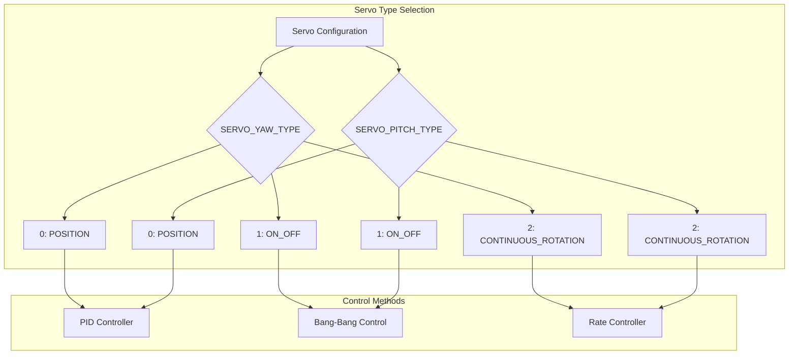
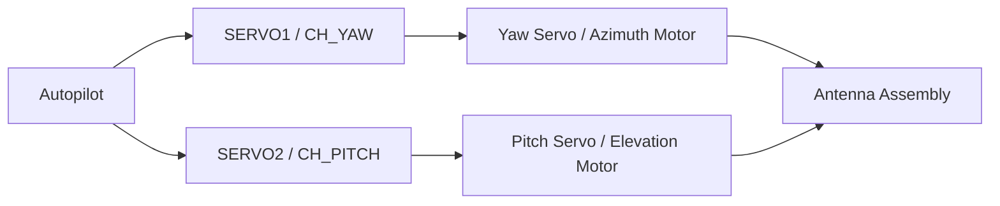
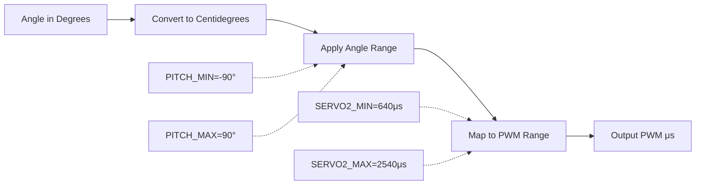
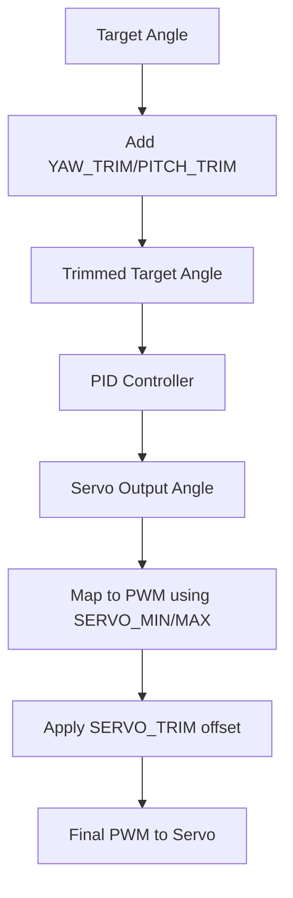
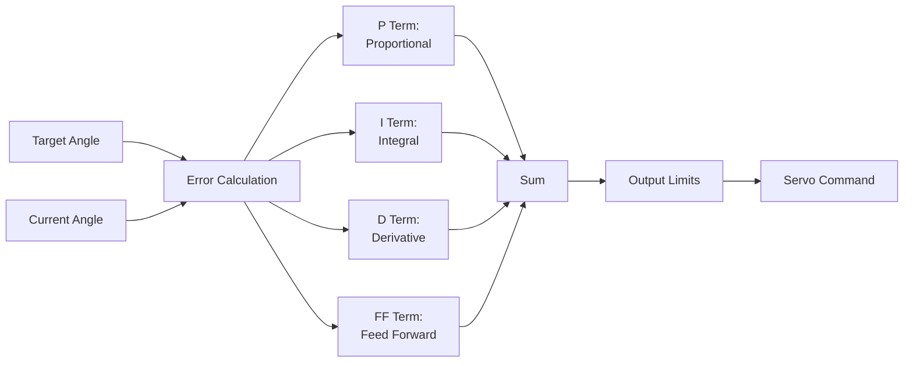

# AntennaTracker Servo Configuration Guide

 

## Table of Contents

- [Overview](#overview)
- [Servo Types](#servo-types)
- [Hardware Connections](#hardware-connections)
- [Servo Channel Assignments](#servo-channel-assignments)
- [PWM Configuration](#pwm-configuration)
- [Servo Range Configuration](#servo-range-configuration)
- [Servo Trim Adjustment](#servo-trim-adjustment)
- [PID Controller Tuning](#pid-controller-tuning)
- [Low-Pass Filtering](#low-pass-filtering)
- [Slew Rate Limiting](#slew-rate-limiting)
- [Troubleshooting](#troubleshooting)
- [Configuration Examples](#configuration-examples)

## Overview

The AntennaTracker servo configuration system controls the yaw (azimuth) and pitch (elevation) servos to accurately point the antenna at a target vehicle. Proper configuration is critical for smooth tracking performance and mechanical reliability.

**Source Files**:
- `/AntennaTracker/servos.cpp` - Servo control implementation
- `/AntennaTracker/Parameters.cpp` - Parameter definitions
- `/AntennaTracker/config.h` - Default configuration values

**Key Features**:
- Three servo control modes: Position, Continuous Rotation, and On/Off
- Independent yaw and pitch axis configuration
- PID-based control with configurable gains
- Low-pass filtering for smooth motion
- Slew rate limiting to protect mechanical components
- Trim adjustment for alignment correction

## Servo Types

The AntennaTracker supports three different servo control strategies, configurable independently for yaw and pitch axes.



### 1. Position Servos (SERVO_TYPE_POSITION = 0)

**Description**: Standard RC servos with defined position ranges. This is the most common configuration and provides the smoothest control.

**Source**: `/AntennaTracker/servos.cpp:44-47, 55-97, 146-149, 158-212`

**Characteristics**:
- Servo moves to an absolute position based on PWM signal
- Uses PID controller to minimize tracking error
- Supports full 180° or 360° rotation depending on servo gearing
- Integrator reset when reaching mechanical limits

**Control Algorithm**:
```
new_servo_out = current_servo_out + PID.update_error(angle_error, dt)
new_servo_out = constrain(new_servo_out, min_limit, max_limit)
```

**Configuration Parameters**:
- `SERVO_YAW_TYPE = 0` (Source: `/AntennaTracker/Parameters.cpp:87-92`)
- `SERVO_PITCH_TYPE = 0` (Source: `/AntennaTracker/Parameters.cpp:80-85`)
- `YAW_RANGE` - Total yaw range in degrees (default: 360°)
- `PITCH_MIN` - Minimum pitch angle in degrees (default: -90°)
- `PITCH_MAX` - Maximum pitch angle in degrees (default: 90°)

**When to Use**:
- Standard RC servos (e.g., HS-645MG, Futaba S3003)
- Pan-tilt mechanisms with mechanical limits
- Most tracking applications requiring smooth, precise control

**Hardware Requirements**:
- Servos must accept standard 50Hz PWM signals (1000-2000µs typical)
- Sufficient torque to move antenna assembly
- 180° or 360° rotation range (with appropriate gearing)

**Example Configuration** (Source: `/AntennaTracker/servos.cpp:59-75`):
```
# Position servo configuration for HS-645MG servos
SERVO_PITCH_TYPE 0       # Position mode
PITCH_MIN -90            # Minimum elevation angle
PITCH_MAX 90             # Maximum elevation angle
SERVO2_MIN 640           # PWM for -90° pitch
SERVO2_MAX 2540          # PWM for +90° pitch
SERVO2_REVERSED 1        # Reversed for elevation increase

SERVO_YAW_TYPE 0         # Position mode
YAW_RANGE 360            # Full rotation capability
SERVO1_MIN 680           # PWM for -180° yaw
SERVO1_MAX 2380          # PWM for +180° yaw
```

### 2. On/Off Servos (SERVO_TYPE_ONOFF = 1)

**Description**: Binary control mode for servos or actuators that only need to move in one direction or the other (e.g., linear actuators, motorized gears).

**Source**: `/AntennaTracker/servos.cpp:36-38, 104-121, 138-140, 220-234`

**Characteristics**:
- Servo receives maximum deflection command in one direction or stop command
- Simple bang-bang control based on acceptable error threshold
- No PID controller used
- Minimum movement time prevents excessive oscillation

**Control Algorithm** (Source: `/AntennaTracker/servos.cpp:104-121`):
```
acceptable_error = rate * min_time

if (abs(error) < acceptable_error):
    servo_output = 0  # Stop
else if (error > 0):
    servo_output = MAX  # Move one direction
else:
    servo_output = -MAX  # Move other direction
```

**Configuration Parameters**:
- `SERVO_YAW_TYPE = 1` or `SERVO_PITCH_TYPE = 1`
- `ONOFF_YAW_RATE` - Yaw rotation rate in deg/s (default: 9.0, range: 0-50)
- `ONOFF_PITCH_RATE` - Pitch rotation rate in deg/s (default: 1.0, range: 0-50)
- `ONOFF_YAW_MINT` - Minimum yaw movement time in seconds (default: 0.1, range: 0-2)
- `ONOFF_PITCH_MINT` - Minimum pitch movement time in seconds (default: 0.1, range: 0-2)

**When to Use**:
- Linear actuators with limit switches
- Motorized pan-tilt heads with position feedback from separate sensor
- Continuous rotation servos without position sensing
- Cost-sensitive applications

**Tuning Guidance**:
1. Set rate parameter to match actual mechanical rotation speed
2. Adjust minimum time to prevent chattering near target
3. Acceptable error = rate × min_time (determines deadband)

**Example Configuration**:
```
# On/Off servo for motorized gear system
SERVO_YAW_TYPE 1         # On/Off mode
ONOFF_YAW_RATE 10.0      # 10 degrees per second rotation
ONOFF_YAW_MINT 0.15      # Minimum 150ms movement
                         # Deadband = 10 * 0.15 = 1.5 degrees
```

### 3. Continuous Rotation Servos (SERVO_TYPE_CR = 2)

**Description**: Continuous rotation servos that interpret PWM as rotation speed rather than position. The control system uses PID to adjust rotation rate based on angle error.

**Source**: `/AntennaTracker/servos.cpp:40-42, 126-130, 142-144, 239-243`

**Characteristics**:
- Servo rotates continuously with speed proportional to PWM deviation from center
- PID controller outputs a rate command, not a position
- No absolute position limits enforced by controller
- Requires external position feedback (from IMU/compass)

**Control Algorithm** (Source: `/AntennaTracker/servos.cpp:126-130, 239-243`):
```
rate_output = PID.update_error(angle_error, dt)
rate_output = constrain(rate_output, -max_rate, max_rate)
servo_output = rate_output
```

**Configuration Parameters**:
- `SERVO_YAW_TYPE = 2` or `SERVO_PITCH_TYPE = 2`
- `YAW_RANGE` - Used to constrain output rate
- `PITCH_MIN`, `PITCH_MAX` - Used to calculate maximum rate range

**When to Use**:
- Continuous rotation modified servos (e.g., modified HS-422)
- 360° tracking without mechanical stops
- High-speed tracking applications
- Geared systems with absolute position sensing

**Important Notes**:
- Requires reliable compass/IMU for position feedback
- No protection against mechanical over-rotation
- PID tuning is critical for stability

**Example Configuration**:
```
# Continuous rotation servo configuration
SERVO_YAW_TYPE 2         # Continuous rotation mode
YAW_RANGE 360            # Constrains maximum rate output
YAW2SRV_P 0.15           # Lower P gain for rate control
YAW2SRV_I 0.01           # Minimal integral term
YAW2SRV_D 0.02           # Damping for smooth motion
```

## Hardware Connections

### Autopilot Servo Outputs

The AntennaTracker uses two servo outputs for antenna control:

**Source**: `/AntennaTracker/config.h:13-20`



**Default Channel Assignments**:
- **CH_YAW = Channel 1 (SERVO1)**: Controls yaw/azimuth rotation
- **CH_PITCH = Channel 2 (SERVO2)**: Controls pitch/elevation angle

**Physical Connection**:
1. Connect yaw servo to autopilot SERVO1 output
2. Connect pitch servo to autopilot SERVO2 output
3. Ensure servos receive adequate power (servos draw current during movement)
4. Use separate power supply for high-torque servos (not autopilot 5V rail)

**Power Considerations**:
- High-torque servos can draw 1-3A under load
- Use dedicated BEC or servo power supply (typically 5-6V)
- Connect servo power to autopilot servo rail (center pins)
- Ensure common ground between autopilot and servo power

**Wiring Diagram**:
```
Autopilot Servo Rail          Servo
┌─────────────────┐          ┌─────────┐
│  GND  │ 5V │ SIG │          │ Brn Rd Or│
│   •   │ •  │  •  │◄────────►│  •  •  • │
└─────────────────┘          └─────────┘
   │      │    └──────────────────┘  └─── Signal (Orange/White)
   │      └──────────────────────────────── Power (Red)
   └──────────────────────────────────────── Ground (Brown/Black)

Note: Servo power may come from external BEC, not autopilot
```

## Servo Channel Assignments

### Function Mapping

The AntennaTracker initializes servo channels with specific tracking functions during startup.

**Source**: `/AntennaTracker/servos.cpp:8-27`

**Initialization Sequence** (from `init_servos()`):
```cpp
// Channel 1 assigned to yaw tracking function
SRV_Channels::set_default_function(CH_YAW, SRV_Channel::k_tracker_yaw)

// Channel 2 assigned to pitch tracking function
SRV_Channels::set_default_function(CH_PITCH, SRV_Channel::k_tracker_pitch)
```

**Servo Parameters**:

Each channel has associated parameters in the format `SERVOn_*`:

| Parameter | Description | Typical Range | Notes |
|-----------|-------------|---------------|-------|
| `SERVO1_FUNCTION` | Set to k_tracker_yaw (auto) | - | Configured by init_servos() |
| `SERVO1_MIN` | Minimum PWM microseconds | 800-1100 | Maps to -YAW_RANGE/2 |
| `SERVO1_MAX` | Maximum PWM microseconds | 1900-2200 | Maps to +YAW_RANGE/2 |
| `SERVO1_TRIM` | Center PWM microseconds | 1400-1600 | Mechanical center position |
| `SERVO1_REVERSED` | Reverse servo direction | 0 or 1 | Set to match mount mechanics |
| `SERVO2_FUNCTION` | Set to k_tracker_pitch (auto) | - | Configured by init_servos() |
| `SERVO2_MIN` | Minimum PWM microseconds | 800-1100 | Maps to PITCH_MIN |
| `SERVO2_MAX` | Maximum PWM microseconds | 1900-2200 | Maps to PITCH_MAX |
| `SERVO2_TRIM` | Center PWM microseconds | 1400-1600 | Horizontal position |
| `SERVO2_REVERSED` | Reverse servo direction | 0 or 1 | Often reversed for elevation |

**Key Concepts**:
- **MIN/MAX PWM**: Physical PWM values sent to servo (hardware limits)
- **Angle Range**: Logical angle range that maps to MIN/MAX PWM
- **TRIM**: PWM value for center/home position
- **REVERSED**: Inverts direction without changing angle mapping

## PWM Configuration

### Understanding PWM Mapping

PWM (Pulse Width Modulation) signals control servo position. The AntennaTracker maps desired angles to PWM microsecond values.

**Source**: `/AntennaTracker/servos.cpp:16-20`



### Determining Your PWM Range

**Step 1: Measure Servo Physical Range**

Most servos rotate approximately 180° with PWM from 1000-2000µs. However, actual values vary:

1. **Find Minimum PWM**:
   - Set `SERVO_MIN` to a safe starting value (e.g., 1000)
   - Manually command servo to minimum position
   - Gradually decrease `SERVO_MIN` until servo reaches mechanical stop
   - Add 50µs safety margin
   
2. **Find Maximum PWM**:
   - Set `SERVO_MAX` to a safe starting value (e.g., 2000)
   - Manually command servo to maximum position
   - Gradually increase `SERVO_MAX` until servo reaches mechanical stop
   - Subtract 50µs safety margin

3. **Find Trim/Center PWM**:
   - Move servo to mechanical center (90° for 180° servo)
   - Note the PWM value
   - Set `SERVO_TRIM` to this value

**Step 2: Map Angles to PWM**

The AntennaTracker uses `SRV_Channels::set_angle()` to establish the angle-to-PWM mapping.

**For Yaw** (Source: `/AntennaTracker/servos.cpp:16-17`):
```cpp
// Yaw range is +/- (YAW_RANGE/2) in centidegrees
SRV_Channels::set_angle(SRV_Channel::k_tracker_yaw, g.yaw_range * 100/2);

// Example: YAW_RANGE = 360
// Angle range = ±180° = ±18000 centidegrees
// SERVO1_MIN maps to -180°
// SERVO1_MAX maps to +180°
```

**For Pitch** (Source: `/AntennaTracker/servos.cpp:19-20`):
```cpp
// Pitch range is calculated from PITCH_MIN and PITCH_MAX
SRV_Channels::set_angle(SRV_Channel::k_tracker_pitch, (-g.pitch_min+g.pitch_max) * 100/2);

// Example: PITCH_MIN = -90, PITCH_MAX = 90
// Angle range = ±90° = ±9000 centidegrees
// SERVO2_MIN maps to -90° (pointing down)
// SERVO2_MAX maps to +90° (pointing up)
```

### PWM Calculation Formula

```
PWM = TRIM + (angle / angle_range) × (MAX - MIN)

Where:
  angle        = Desired angle in degrees from center
  angle_range  = Total angular range (YAW_RANGE or PITCH_MAX - PITCH_MIN)
  MIN          = SERVOn_MIN parameter
  MAX          = SERVOn_MAX parameter
  TRIM         = SERVOn_TRIM parameter
```

### Example PWM Configurations

**Example 1: Standard 180° Servo (HS-645MG) for Pitch**

Servo specifications:
- 180° rotation with PWM 600-2400µs
- Needs to cover -90° to +90° elevation

```
SERVO_PITCH_TYPE 0       # Position servo
PITCH_MIN -90            # Point straight down
PITCH_MAX 90             # Point straight up
SERVO2_MIN 640           # PWM for -90° (with 40µs margin)
SERVO2_MAX 2540          # PWM for +90° (with 40µs margin, adjusted for actual servo)
SERVO2_TRIM 1500         # PWM for 0° (horizontal)
SERVO2_REVERSED 1        # Reverse so increasing PWM = increasing elevation
```

**Example 2: 2:1 Geared Servo for Yaw (360° antenna rotation)**

Servo specifications:
- 180° servo with 2:1 reduction gear
- Results in 360° antenna rotation

```
SERVO_YAW_TYPE 0         # Position servo
YAW_RANGE 360            # Full circle rotation
SERVO1_MIN 680           # PWM for -180° (antenna)
SERVO1_MAX 2380          # PWM for +180° (antenna)
SERVO1_TRIM 1530         # PWM for 0° (north alignment)
SERVO1_REVERSED -1       # May need reversal depending on gear direction
```

**Example 3: High-Resolution Servo with 270° Range**

```
SERVO_YAW_TYPE 0
YAW_RANGE 270            # Limited rotation range
SERVO1_MIN 900
SERVO1_MAX 2100
SERVO1_TRIM 1500
```

### Safety Recommendations

> **Warning**: Always test servo PWM ranges carefully to avoid mechanical damage

1. **Start Conservative**: Use PWM values well within servo specifications
2. **Test Incrementally**: Adjust MIN/MAX in small steps (10-20µs)
3. **Listen for Binding**: Stop if servo makes unusual noise or draws excessive current
4. **Add Margin**: Keep 30-50µs away from absolute mechanical limits
5. **Check Temperature**: Servos should not become excessively hot during normal operation

## Servo Range Configuration

### Angle Limits

The AntennaTracker enforces angle limits to protect mechanical components and prevent unwanted rotations.

**Source**: `/AntennaTracker/config.h:24-34`, `/AntennaTracker/Parameters.cpp:148-198`

### Yaw Range Configuration

**Parameter**: `YAW_RANGE` (Source: `/AntennaTracker/Parameters.cpp:148-155`)

| Parameter | Description | Units | Default | Range |
|-----------|-------------|-------|---------|-------|
| `YAW_RANGE` | Total yaw axis range of motion | degrees | 360 | 0-360 |

**Behavior**:
- Defines total rotation capability: ±(YAW_RANGE/2)
- YAW_RANGE = 360: Servo can rotate ±180° from center (-180° to +180°)
- YAW_RANGE = 180: Servo can rotate ±90° from center (-90° to +90°)
- Applied as soft limits in position servo mode (Source: `/AntennaTracker/servos.cpp:160, 195-202`)

**Limit Enforcement** (Source: `/AntennaTracker/servos.cpp:194-202`):
```cpp
int32_t yaw_limit_cd = g.yaw_range*100/2;

if (new_servo_out <= -yaw_limit_cd) {
    new_servo_out = -yaw_limit_cd;
    g.pidYaw2Srv.reset_I();  // Prevent integrator windup
}
if (new_servo_out >= yaw_limit_cd) {
    new_servo_out = yaw_limit_cd;
    g.pidYaw2Srv.reset_I();
}
```

**Configuration Guidelines**:
- **360° Systems**: Use YAW_RANGE = 360 for full rotation tracking
- **Limited Rotation**: Set YAW_RANGE < 360 for mechanical stops
- **Cable Management**: Consider cable wrapping with 270° or less

### Pitch Range Configuration

**Parameters**: `PITCH_MIN` and `PITCH_MAX` (Source: `/AntennaTracker/Parameters.cpp:182-198`)

| Parameter | Description | Units | Default | Range |
|-----------|-------------|-------|---------|-------|
| `PITCH_MIN` | Minimum pitch/elevation angle | degrees | -90 | -90 to 0 |
| `PITCH_MAX` | Maximum pitch/elevation angle | degrees | 90 | 0 to 90 |

**Behavior**:
- PITCH_MIN: Lowest angle (typically negative, pointing below horizon)
- PITCH_MAX: Highest angle (typically positive, pointing above horizon)
- Common settings:
  - **Full Range**: PITCH_MIN=-90, PITCH_MAX=90 (180° total)
  - **Upper Hemisphere Only**: PITCH_MIN=0, PITCH_MAX=90 (90° total)
  - **Limited Range**: PITCH_MIN=-45, PITCH_MAX=45 (90° total)

**Limit Enforcement** (Source: `/AntennaTracker/servos.cpp:57-58, 80-87`):
```cpp
int32_t pitch_min_cd = g.pitch_min*100;  // Convert to centidegrees
int32_t pitch_max_cd = g.pitch_max*100;

// Position limit pitch servo
if (new_servo_out <= pitch_min_cd) {
    new_servo_out = pitch_min_cd;
    g.pidPitch2Srv.reset_I();  // Reset integrator at limits
}
if (new_servo_out >= pitch_max_cd) {
    new_servo_out = pitch_max_cd;
    g.pidPitch2Srv.reset_I();
}
```

**Configuration Guidelines**:
- Set based on physical antenna mount limitations
- Consider ground obstructions when setting PITCH_MIN
- Ensure mount can mechanically reach configured limits
- Test limits in MANUAL mode before AUTO tracking

### Ballerina Mode (Position Servo Yaw)

For position servos with limited yaw range, the tracker implements "Ballerina Mode" to handle full 360° tracking.

**Source**: `/AntennaTracker/servos.cpp:162-181`

**Description**: When tracking a target that moves beyond the servo's physical range, the tracker detects the limit and commands the servo to slew rapidly through the 360° "back side" to continue tracking from the opposite limit.

**Key Features**:
- Automatic detection of range limits
- Reversal and slew to opposite side
- Accounts for misalignment between mount and north
- Works with moving tracker platforms

**Example Scenario**:
```
Servo Range: -180° to +180°
Target moves from +175° to +185°

Action:
1. Servo reaches +180° limit
2. Tracker detects limit exceeded
3. Servo rapidly slews to -180°
4. Continues tracking at -175° (equivalent to +185°)
```

**Parameter Interaction**:
- `YAW_RANGE`: Defines the physical rotation range
- `MIN_REVERSE_TIME`: Minimum time for reversal slew (default: 1s)

**Configuration**:
```
YAW_RANGE 180            # Servo can rotate ±90°
MIN_REVERSE_TIME 1       # Ensure full slew completes
YAW_SLEW_TIME 2          # Limit normal movement rate
```

## Servo Trim Adjustment

Trim adjustments compensate for mechanical misalignment or sensor calibration errors without re-calibrating the entire system.

**Source**: `/AntennaTracker/Parameters.cpp:130-146`

### Yaw Trim

**Parameter**: `YAW_TRIM` (Source: `/AntennaTracker/Parameters.cpp:130-137`)

| Parameter | Description | Units | Default | Range |
|-----------|-------------|-------|---------|-------|
| `YAW_TRIM` | Offset added to yaw angle | degrees | 0 | -10 to +10 |

**Purpose**: Compensates for compass calibration errors or mount misalignment with north

**Use Cases**:
- Antenna mount not aligned precisely with magnetic north
- Small compass calibration errors
- Mechanical assembly tolerance compensation

**Example**:
```
# Antenna mount is rotated 3° clockwise from north
YAW_TRIM -3.0            # Apply -3° offset to compensate

# Result: When tracker calculates 0° (north), 
#         it will command servo to -3° position
```

### Pitch Trim

**Parameter**: `PITCH_TRIM` (Source: `/AntennaTracker/Parameters.cpp:139-146`)

| Parameter | Description | Units | Default | Range |
|-----------|-------------|-------|---------|-------|
| `PITCH_TRIM` | Offset added to pitch angle | degrees | 0 | -10 to +10 |

**Purpose**: Compensates for barometer altitude errors or mount tilt

**Use Cases**:
- Antenna mount not perfectly level
- Small barometer calibration errors
- Temperature-induced altitude drift compensation

**Example**:
```
# Antenna mount is tilted 2° downward
PITCH_TRIM 2.0           # Apply +2° offset to compensate

# Result: When tracking at 0° elevation (horizon),
#         servo will point 2° higher to achieve actual horizon tracking
```

### Trim vs. Servo Trim

**Important Distinction**:
- **SERVOn_TRIM**: PWM value for mechanical center position (hardware)
- **YAW_TRIM / PITCH_TRIM**: Angular offset for tracking calculations (software)



**Best Practice**:
1. Set `SERVOn_TRIM` to match mechanical center
2. Verify `SERVOn_MIN/MAX` are correct for angular range
3. Use `YAW_TRIM/PITCH_TRIM` for fine alignment adjustment
4. Keep trim values small (< 5°) - larger values indicate mechanical issues

## PID Controller Tuning

The AntennaTracker uses PID (Proportional-Integral-Derivative) controllers to achieve smooth and accurate tracking for position and continuous rotation servos.

**Source**: `/AntennaTracker/Parameters.h:184-187`, `/AntennaTracker/Parameters.cpp:263-453`

### PID Controller Overview



**Control Equation**:
```
output = P×error + I×∫error dt + D×(d error/dt) + FF×target_rate
```

### Pitch Axis PID Parameters

**Parameter Group**: `PITCH2SRV_*` (Source: `/AntennaTracker/Parameters.cpp:263-357`)

| Parameter | Description | Default | Range | Units |
|-----------|-------------|---------|-------|-------|
| `PITCH2SRV_P` | Proportional gain | 0.2 | 0.0-3.0 | - |
| `PITCH2SRV_I` | Integral gain | 0.0 | 0.0-3.0 | - |
| `PITCH2SRV_D` | Derivative gain | 0.05 | 0.001-0.1 | - |
| `PITCH2SRV_IMAX` | Maximum integrator contribution | 4000 | 0-4000 | centi-degrees |
| `PITCH2SRV_FF` | Feed-forward gain | 0.02 | 0-0.5 | - |
| `PITCH2SRV_FLTT` | Target low-pass filter frequency | - | 1-50 | Hz |
| `PITCH2SRV_FLTE` | Error low-pass filter frequency | - | 1-100 | Hz |
| `PITCH2SRV_FLTD` | Derivative low-pass filter frequency | - | 1-100 | Hz |
| `PITCH2SRV_SMAX` | Slew rate limit | - | 0-200 | - |
| `PITCH2SRV_PDMX` | P+D sum maximum | - | 0-4000 | centi-degrees |
| `PITCH2SRV_D_FF` | Derivative feed-forward | - | 0-0.1 | - |

**Constructor Defaults** (Source: `/AntennaTracker/Parameters.h:184-186`):
```cpp
pidPitch2Srv(P=0.2, I=0.0, D=0.05, FF=0.02, IMAX=4000.0, ...)
```

### Yaw Axis PID Parameters

**Parameter Group**: `YAW2SRV_*` (Source: `/AntennaTracker/Parameters.cpp:359-453`)

| Parameter | Description | Default | Range | Units |
|-----------|-------------|---------|-------|-------|
| `YAW2SRV_P` | Proportional gain | 0.2 | 0.0-3.0 | - |
| `YAW2SRV_I` | Integral gain | 0.0 | 0.0-3.0 | - |
| `YAW2SRV_D` | Derivative gain | 0.05 | 0.001-0.1 | - |
| `YAW2SRV_IMAX` | Maximum integrator contribution | 4000 | 0-4000 | centi-degrees |
| `YAW2SRV_FF` | Feed-forward gain | 0.02 | 0-0.5 | - |
| `YAW2SRV_FLTT` | Target low-pass filter frequency | - | 1-50 | Hz |
| `YAW2SRV_FLTE` | Error low-pass filter frequency | - | 1-100 | Hz |
| `YAW2SRV_FLTD` | Derivative low-pass filter frequency | - | 1-100 | Hz |
| `YAW2SRV_SMAX` | Slew rate limit | - | 0-200 | - |
| `YAW2SRV_PDMX` | P+D sum maximum | - | 0-4000 | centi-degrees |
| `YAW2SRV_D_FF` | Derivative feed-forward | - | 0-0.1 | - |

**Constructor Defaults** (Source: `/AntennaTracker/Parameters.h:185-186`):
```cpp
pidYaw2Srv(P=0.2, I=0.0, D=0.05, FF=0.02, IMAX=4000.0, ...)
```

### PID Term Explanations

#### Proportional (P) Term

**Function**: Provides corrective output proportional to current error

```
P_output = P_gain × angle_error
```

**Characteristics**:
- Larger P = Faster response, more aggressive tracking
- Too high P = Oscillation around target
- Too low P = Slow, sluggish response

**Tuning**:
1. Start with P = 0.1
2. Increase until servo responds quickly to target changes
3. Reduce if oscillation occurs
4. Typical values: 0.1 - 0.5 for most systems

#### Integral (I) Term

**Function**: Eliminates steady-state error by accumulating error over time

```
I_output = I_gain × ∫ angle_error dt
I_output = constrain(I_output, -IMAX, IMAX)
```

**Characteristics**:
- Compensates for constant bias (wind loading, friction)
- Can cause integrator windup at limits
- Reset when reaching mechanical limits (Source: `/AntennaTracker/servos.cpp:82, 86, 197, 201`)

**Tuning**:
1. Set I = 0 initially
2. Tune P and D first
3. Add small I (0.01-0.05) if steady-state error exists
4. Set IMAX to 20-50% of total range
5. Default I = 0 is appropriate for most antenna trackers

**Important**: The AntennaTracker automatically resets the integrator when reaching mechanical limits to prevent windup.

#### Derivative (D) Term

**Function**: Provides damping proportional to rate of error change

```
D_output = D_gain × (d angle_error / dt)
```

**Characteristics**:
- Reduces overshoot and oscillation
- Adds damping to system response
- Sensitive to noise (use with FLTD filter)

**Tuning**:
1. Start with D = 0.02 - 0.05
2. Increase to reduce overshoot
3. Reduce if servo motion becomes jerky
4. Use FLTD filter (10-20 Hz) to reduce noise sensitivity

#### Feed-Forward (FF) Term

**Function**: Anticipates required output based on target rate of change

```
FF_output = FF_gain × target_rate
```

**Characteristics**:
- Improves tracking of moving targets
- Reduces lag during target motion
- Not affected by feedback loop dynamics

**Tuning**:
1. Start with FF = 0.01 - 0.02
2. Increase if tracking lags behind fast-moving targets
3. Monitor for instability with rapid target changes

### Tuning Procedure

**Step-by-Step PID Tuning**:

**1. Preparation**:
```
# Start with conservative values
PITCH2SRV_P 0.1
PITCH2SRV_I 0.0
PITCH2SRV_D 0.02
PITCH2SRV_IMAX 2000
PITCH2SRV_FF 0.0

YAW2SRV_P 0.1
YAW2SRV_I 0.0
YAW2SRV_D 0.02
YAW2SRV_IMAX 2000
YAW2SRV_FF 0.0
```

**2. Tune Proportional (P) Gain**:
- Set I=0, D=0, FF=0
- Gradually increase P from 0.1
- Test with stationary target at various angles
- Stop increasing when:
  - Servo responds quickly (< 1 second to reach target)
  - Minimal overshoot
  - No sustained oscillation
- Typical final P: 0.15 - 0.3

**3. Add Derivative (D) Damping**:
- With P set, increase D from 0.02
- Observe reduction in overshoot and oscillation
- Stop increasing when motion is smooth and critically damped
- Typical final D: 0.03 - 0.08
- If servo becomes jerky, enable D filter: `FLTD 15-20 Hz`

**4. Add Integral (I) if Needed**:
- Only add if steady-state error exists (servo doesn't quite reach target)
- Start with very small I: 0.005 - 0.01
- Increase slowly until steady-state error is eliminated
- Set IMAX to 2000-4000 (limits I contribution)
- Most antenna trackers work well with I=0

**5. Add Feed-Forward (FF) for Moving Targets**:
- Test tracking a moving vehicle
- If tracking lags behind target motion, increase FF
- Start with FF = 0.01
- Increase until tracking lag is minimized
- Typical final FF: 0.01 - 0.03

**6. Fine Tuning**:
- Test with real vehicle tracking scenarios
- Adjust filters if needed:
  - `FLTE`: Error filter, 20-50 Hz
  - `FLTD`: Derivative filter, 10-20 Hz
  - `FLTT`: Target filter, 10-30 Hz
- Set `SMAX` if limiting servo slew rate (advanced)

### Example PID Configurations

**Configuration 1: Lightweight Antenna, Fast Servo**
```
# Quick response, minimal overshoot
PITCH2SRV_P 0.25
PITCH2SRV_I 0.01
PITCH2SRV_D 0.06
PITCH2SRV_IMAX 3000
PITCH2SRV_FF 0.02
PITCH2SRV_FLTD 15

YAW2SRV_P 0.30
YAW2SRV_I 0.01
YAW2SRV_D 0.05
YAW2SRV_IMAX 3000
YAW2SRV_FF 0.025
YAW2SRV_FLTD 15
```

**Configuration 2: Heavy Antenna, High Inertia**
```
# Slower response, more damping
PITCH2SRV_P 0.15
PITCH2SRV_I 0.0
PITCH2SRV_D 0.08
PITCH2SRV_IMAX 2000
PITCH2SRV_FF 0.01
PITCH2SRV_FLTD 10

YAW2SRV_P 0.15
YAW2SRV_I 0.0
YAW2SRV_D 0.08
YAW2SRV_IMAX 2000
YAW2SRV_FF 0.01
YAW2SRV_FLTD 10
```

**Configuration 3: Continuous Rotation Servos** (Source: `/AntennaTracker/servos.cpp:126-130, 239-243`)
```
# Rate control (not position)
PITCH2SRV_P 0.12
PITCH2SRV_I 0.005
PITCH2SRV_D 0.03
PITCH2SRV_IMAX 1000
PITCH2SRV_FF 0.005

YAW2SRV_P 0.15
YAW2SRV_I 0.008
YAW2SRV_D 0.04
YAW2SRV_IMAX 1000
YAW2SRV_FF 0.008
```

### PID Tuning Tips

**Symptoms and Solutions**:

| Symptom | Likely Cause | Solution |
|---------|--------------|----------|
| Slow to reach target | P too low | Increase P |
| Oscillates around target | P too high | Decrease P, increase D |
| Overshoots target | D too low | Increase D |
| Jerky, nervous motion | D too high or noise | Decrease D, add FLTD filter |
| Doesn't quite reach target | Friction/bias, I=0 | Add small I (0.01), set IMAX |
| Lags behind moving target | FF too low | Increase FF |
| Unstable with fast targets | FF too high | Decrease FF |
| Windup at limits | I accumulation | Automatic - integrator auto-resets |

**Logging for Tuning**:

Enable PID logging to analyze performance:
```
# Enable PID tuning messages
GCS_PID_MASK 3           # Bit 0=Pitch, Bit 1=Yaw (3 = both)

# Analyze logs:
# - Desired angle vs actual angle (tracking error)
# - P, I, D term contributions
# - Total PID output
```

## Low-Pass Filtering

The AntennaTracker applies low-pass filtering to servo outputs to smooth motion and reduce mechanical stress.

**Source**: `/AntennaTracker/servos.cpp:25-26, 91-96, 206-211`

### Servo Output Filter

**Purpose**: Smooths servo commands to reduce:
- High-frequency oscillations from PID controller
- Mechanical stress and wear
- Power consumption spikes
- Noise in tracking

**Filter Type**: Single-pole IIR low-pass filter

**Filter Frequency**: Defined in `/AntennaTracker/Tracker.h` (not shown in provided files, but referenced in code)

**Implementation** (Source: `/AntennaTracker/servos.cpp:25-26`):
```cpp
yaw_servo_out_filt.set_cutoff_frequency(SERVO_OUT_FILT_HZ);
pitch_servo_out_filt.set_cutoff_frequency(SERVO_OUT_FILT_HZ);
```

**Filter Application** (Source: `/AntennaTracker/servos.cpp:91-96, 206-211`):
```cpp
if (pitch_servo_out_filt_init) {
    pitch_servo_out_filt.apply(new_servo_out, G_Dt);
} else {
    pitch_servo_out_filt.reset(new_servo_out);
    pitch_servo_out_filt_init = true;
}
```

**Filter Characteristics**:
- Applied after PID calculation and limiting
- Runs at main loop rate (G_Dt)
- Initialized on first servo update
- Separate filters for yaw and pitch axes

**Effect on Performance**:
- **Lower cutoff frequency** (e.g., 2-5 Hz):
  - Smoother motion
  - Reduced mechanical stress
  - Increased tracking lag
  - Better for heavy antennas

- **Higher cutoff frequency** (e.g., 10-20 Hz):
  - Faster response
  - More tracking precision
  - Slightly increased mechanical stress
  - Better for lightweight antennas

> **Note**: The exact cutoff frequency is typically 2-10 Hz and defined in the Tracker.h configuration file. This filter is always active and cannot be disabled through parameters.

## Slew Rate Limiting

Slew rate limiting protects mechanical components and provides smoother tracking by limiting the maximum rate of servo position change.

**Source**: `/AntennaTracker/Parameters.cpp:26-51`

### Slew Time Parameters

**Parameter**: `YAW_SLEW_TIME` (Source: `/AntennaTracker/Parameters.cpp:26-33`)

| Parameter | Description | Units | Default | Range |
|-----------|-------------|-------|---------|-------|
| `YAW_SLEW_TIME` | Time for yaw to slew through full range | seconds | 2.0 | 0-20 |

**Purpose**: Controls how rapidly the tracker changes yaw servo output

**Behavior**:
- Limits maximum rotation rate to: `YAW_RANGE / YAW_SLEW_TIME` degrees/second
- Example: YAW_RANGE=360°, YAW_SLEW_TIME=2s → Max rate = 180°/s
- Value of 0 = unlimited servo movement (no rate limiting)

**Parameter**: `PITCH_SLEW_TIME` (Source: `/AntennaTracker/Parameters.cpp:35-42`)

| Parameter | Description | Units | Default | Range |
|-----------|-------------|-------|---------|-------|
| `PITCH_SLEW_TIME` | Time for pitch to slew through full range | seconds | 2.0 | 0-20 |

**Purpose**: Controls how rapidly the tracker changes pitch servo output

**Behavior**:
- Limits maximum rotation rate to: `(PITCH_MAX - PITCH_MIN) / PITCH_SLEW_TIME` degrees/second
- Example: PITCH range=180°, PITCH_SLEW_TIME=2s → Max rate = 90°/s
- Value of 0 = unlimited servo movement (no rate limiting)

### Minimum Reverse Time

**Parameter**: `MIN_REVERSE_TIME` (Source: `/AntennaTracker/Parameters.cpp:44-51`)

| Parameter | Description | Units | Default | Range |
|-----------|-------------|-------|---------|-------|
| `MIN_REVERSE_TIME` | Minimum time to apply yaw reversal | seconds | 1.0 | 0-20 |

**Purpose**: Ensures complete reversal when position servo reaches limits (Ballerina Mode)

**Behavior**:
- When yaw servo reaches limits, tracker reverses direction
- `MIN_REVERSE_TIME` ensures servo completes full slew to opposite side
- Compensates for servo lag and mechanical inertia
- Only applicable to position servos with YAW_RANGE < 360°

**Configuration Example**:
```
# Slow, heavy antenna requiring gentle movement
YAW_SLEW_TIME 4.0        # 4 seconds for full rotation = 90°/s max
PITCH_SLEW_TIME 3.0      # 3 seconds for full range = 60°/s max
MIN_REVERSE_TIME 2.0     # Ensure complete reversal

# Fast, lightweight antenna
YAW_SLEW_TIME 1.0        # 1 second for full rotation = 360°/s max
PITCH_SLEW_TIME 1.0      # 1 second for full range = 180°/s max
MIN_REVERSE_TIME 0.5     # Quick reversal
```

### Slew Rate Limiting Benefits

1. **Mechanical Protection**:
   - Reduces stress on gears and servos
   - Prevents sudden jerky movements
   - Extends hardware lifetime

2. **Power Management**:
   - Limits peak current draw
   - Prevents voltage sags from sudden servo movements
   - Better for battery-powered systems

3. **Tracking Smoothness**:
   - Eliminates abrupt antenna movements
   - Provides more predictable tracking
   - Reduces RF link interruptions

4. **System Stability**:
   - Prevents mechanical resonances
   - Reduces risk of structural damage
   - Smoother video tracking (if camera mounted)

**Trade-offs**:
- Slower response to rapid target maneuvers
- May lag behind highly agile vehicles
- Balance between protection and performance

## Troubleshooting

### Common Servo Configuration Issues

#### Issue 1: Servo Doesn't Move

**Symptoms**:
- Servo receives power but doesn't respond to commands
- No movement in any tracking mode

**Possible Causes & Solutions**:

1. **Incorrect Function Assignment**:
   ```
   # Verify channels are assigned correctly
   SERVO1_FUNCTION 0 (should auto-set to yaw)
   SERVO2_FUNCTION 0 (should auto-set to pitch)
   
   # Solution: Let init_servos() handle assignment automatically
   ```

2. **PWM Range Too Narrow**:
   ```
   # Check MIN/MAX are significantly different
   SERVO1_MIN should be < SERVO1_TRIM < SERVO1_MAX
   
   # Solution: Set proper PWM range (typically 800-2200μs)
   SERVO1_MIN 900
   SERVO1_MAX 2100
   ```

3. **Servo Power Supply**:
   - Check servo power rail voltage (should be 4.8-6.0V)
   - Verify adequate current capacity (2-3A per servo)
   - Ensure common ground between autopilot and servo power

4. **Safety/Arming State**:
   - Antenna tracker may require "arming" to enable servo output
   - Check SAFE_DISARM_PWM parameter
   - Verify tracker is in appropriate mode (AUTO, MANUAL)

#### Issue 2: Servo Oscillates/Jitters

**Symptoms**:
- Servo continuously moves back and forth around target
- High-frequency vibration or buzzing
- Unstable tracking

**Possible Causes & Solutions**:

1. **P Gain Too High**:
   ```
   # Reduce proportional gain
   PITCH2SRV_P 0.15  (reduce from higher value)
   YAW2SRV_P 0.15
   ```

2. **Insufficient Damping**:
   ```
   # Increase derivative gain
   PITCH2SRV_D 0.06  (increase from lower value)
   YAW2SRV_D 0.06
   
   # Add derivative filtering to reduce noise
   PITCH2SRV_FLTD 15
   YAW2SRV_FLTD 15
   ```

3. **Mechanical Backlash**:
   - Inspect gears for excessive play
   - Tighten mechanical connections
   - Consider adding small amount of I gain to compensate

4. **Electrical Noise**:
   - Check servo wiring (separate from power wires)
   - Add capacitor across servo power (1000μF)
   - Verify good ground connections

#### Issue 3: Servo Moves in Wrong Direction

**Symptoms**:
- Increasing pitch command causes downward movement
- Clockwise yaw command causes counter-clockwise rotation

**Solution**:
```
# Reverse the affected servo
SERVO1_REVERSED 1   (for yaw)
SERVO2_REVERSED 1   (for pitch)

# Note: Pitch is often reversed
# Positive pitch should point antenna upward
```

#### Issue 4: Servo Reaches Limit and Stops Tracking

**Symptoms**:
- Servo moves to mechanical limit and stays there
- Tracking stops when limit reached
- Won't reverse for Ballerina mode

**Possible Causes & Solutions**:

1. **YAW_RANGE Too Large**:
   ```
   # If servo has 180° range (±90°), set:
   YAW_RANGE 180  (not 360)
   ```

2. **MIN_REVERSE_TIME Too Short**:
   ```
   # Increase time to ensure full reversal
   MIN_REVERSE_TIME 1.5
   ```

3. **PITCH_MIN/MAX Exceeds Physical Range**:
   ```
   # Set limits within mechanical capability
   PITCH_MIN -85  (instead of -90 if servo can't reach)
   PITCH_MAX 85   (instead of 90 if servo can't reach)
   ```

4. **Integrator Windup** (should be automatic):
   - Verify code is resetting integrator at limits
   - Check logs for I term saturation

#### Issue 5: Tracking is Sluggish/Slow

**Symptoms**:
- Antenna lags behind target
- Slow to respond to target movements
- Never quite catches up to fast-moving vehicles

**Possible Causes & Solutions**:

1. **P Gain Too Low**:
   ```
   # Increase proportional gain for faster response
   PITCH2SRV_P 0.25  (increase from lower value)
   YAW2SRV_P 0.25
   ```

2. **Slew Time Too Long**:
   ```
   # Reduce slew time for faster movement
   YAW_SLEW_TIME 1.5  (reduce from higher value)
   PITCH_SLEW_TIME 1.5
   ```

3. **Insufficient Feed-Forward**:
   ```
   # Add FF gain for moving targets
   PITCH2SRV_FF 0.025
   YAW2SRV_FF 0.025
   ```

4. **Mechanical Friction**:
   - Lubricate moving parts
   - Check for binding or tight spots
   - Verify servo has adequate torque

#### Issue 6: Servo Stutters or Moves Jerkily

**Symptoms**:
- Motion is not smooth
- Visible steps or jerks during movement
- Stops and starts frequently

**Possible Causes & Solutions**:

1. **D Gain Too High**:
   ```
   # Reduce derivative gain
   PITCH2SRV_D 0.03  (reduce from higher value)
   YAW2SRV_D 0.03
   ```

2. **Insufficient Filtering**:
   ```
   # Lower filter cutoff frequencies
   PITCH2SRV_FLTD 10  (lower from higher value)
   PITCH2SRV_FLTE 20
   YAW2SRV_FLTD 10
   YAW2SRV_FLTE 20
   ```

3. **On/Off Servo Min Time Too Large**:
   ```
   # Reduce minimum movement time
   ONOFF_PITCH_MINT 0.08  (reduce from higher value)
   ONOFF_YAW_MINT 0.08
   ```

4. **Power Supply Issues**:
   - Check for voltage drops during servo movement
   - Verify adequate current capacity
   - Add larger capacitor to servo power rail

#### Issue 7: Servo Gets Hot

**Symptoms**:
- Servo case becomes very hot to touch
- Reduced servo performance over time
- Servo may fail after extended operation

**Possible Causes & Solutions**:

1. **Mechanical Binding**:
   - Check for obstructions or tight spots
   - Verify smooth mechanical movement
   - Reduce mechanical load

2. **PWM Limits Incorrect**:
   ```
   # Ensure MIN/MAX don't drive servo past mechanical stops
   # Add margin to PWM values
   SERVO1_MIN 920  (increase from 900 if binding at limit)
   SERVO1_MAX 2080 (decrease from 2100 if binding at limit)
   ```

3. **Excessive Oscillation**:
   - Servo fighting against itself due to instability
   - Reduce P gain, increase D gain (see Issue 2)

4. **Continuous Stall**:
   - For On/Off servos, ensure acceptable_error is adequate
   - Check that servo can physically reach commanded positions

5. **Insufficient Cooling**:
   - Provide airflow around servos
   - Use heat sinks if available
   - Consider higher-torque servos for heavy loads

#### Issue 8: Servo Range Doesn't Match Angles

**Symptoms**:
- Servo at MIN position but software shows different angle
- Full servo range doesn't cover expected angle range
- Angles are scaled incorrectly

**Solution**:
```
# Verify angle-to-PWM mapping
# For Yaw:
SERVO1_MIN → -YAW_RANGE/2 degrees
SERVO1_MAX → +YAW_RANGE/2 degrees

# For Pitch:
SERVO2_MIN → PITCH_MIN degrees
SERVO2_MAX → PITCH_MAX degrees

# Example fix:
YAW_RANGE 360
SERVO1_MIN 900   # Maps to -180°
SERVO1_MAX 2100  # Maps to +180°
SERVO1_TRIM 1500 # Maps to 0°

PITCH_MIN -90
PITCH_MAX 90
SERVO2_MIN 900   # Maps to -90°
SERVO2_MAX 2100  # Maps to +90°
SERVO2_TRIM 1500 # Maps to 0°
```

### Diagnostic Procedures

**Procedure 1: Manual Servo Test**

1. Connect to Ground Control Station (GCS)
2. Navigate to servo output configuration
3. Manually command each servo through its range
4. Verify:
   - Servo moves smoothly
   - Range covers expected angles
   - No binding at limits
   - Direction is correct

**Procedure 2: PID Response Test**

1. Enable PID logging:
   ```
   GCS_PID_MASK 3  # Log both pitch and yaw
   ```

2. Track a stationary target at various angles
3. Analyze logs for:
   - Settling time (< 1-2 seconds ideal)
   - Overshoot (< 10% ideal)
   - Steady-state error (< 1° ideal)
   - P, I, D term contributions

**Procedure 3: Moving Target Test**

1. Track a moving vehicle in AUTO mode
2. Observe tracking behavior:
   - Lag behind target (increase FF)
   - Oscillation (reduce P, increase D)
   - Steady-state offset (add small I)

3. Log target angle vs actual angle for analysis

**Procedure 4: Mechanical Inspection**

1. Power off system
2. Manually move antenna through full range
3. Check for:
   - Smooth movement (no binding or tight spots)
   - Gear backlash (should be minimal)
   - Cable interference (cables shouldn't restrict movement)
   - Secure mounting (no loose components)

## Configuration Examples

### Example 1: Basic Ground Station Tracker

**Hardware**:
- Two HS-645MG servos (180° rotation)
- 2:1 gear reduction for yaw (360° antenna rotation)
- Lightweight Yagi antenna
- 5V 3A BEC

**Configuration**:
```
# Servo types
SERVO_YAW_TYPE 0         # Position servo
SERVO_PITCH_TYPE 0       # Position servo

# Angle ranges
YAW_RANGE 360            # Full rotation
PITCH_MIN -90            # Look down to horizon
PITCH_MAX 90             # Look straight up

# PWM configuration (HS-645MG servos)
SERVO1_MIN 750           # Yaw minimum
SERVO1_MAX 2250          # Yaw maximum
SERVO1_TRIM 1500         # Yaw center
SERVO1_REVERSED 0        # Adjust as needed

SERVO2_MIN 750           # Pitch minimum
SERVO2_MAX 2250          # Pitch maximum
SERVO2_TRIM 1500         # Pitch center
SERVO2_REVERSED 1        # Typically reversed

# PID tuning (lightweight antenna)
PITCH2SRV_P 0.20
PITCH2SRV_I 0.0
PITCH2SRV_D 0.05
PITCH2SRV_IMAX 3000
PITCH2SRV_FF 0.02

YAW2SRV_P 0.25
YAW2SRV_I 0.0
YAW2SRV_D 0.04
YAW2SRV_IMAX 3000
YAW2SRV_FF 0.02

# Slew rates (moderate protection)
YAW_SLEW_TIME 2.0
PITCH_SLEW_TIME 2.0
MIN_REVERSE_TIME 1.0

# Trim adjustments
YAW_TRIM 0.0
PITCH_TRIM 0.0
```

### Example 2: Heavy Dish Antenna with Linear Actuators

**Hardware**:
- Two linear actuators (12V, 4" stroke)
- Heavy parabolic dish antenna
- Hall effect position sensors
- 12V 5A power supply

**Configuration**:
```
# Servo types
SERVO_YAW_TYPE 1         # On/Off control
SERVO_PITCH_TYPE 1       # On/Off control

# Angle ranges
YAW_RANGE 180            # Limited rotation (cable management)
PITCH_MIN -10            # Limited downward (ground clearance)
PITCH_MAX 85             # Near-vertical

# On/Off parameters
ONOFF_YAW_RATE 8.0       # Measured rotation rate
ONOFF_YAW_MINT 0.2       # 200ms minimum movement
                         # Deadband = 1.6 degrees

ONOFF_PITCH_RATE 1.5     # Slow elevation change
ONOFF_PITCH_MINT 0.15    # 150ms minimum movement
                         # Deadband = 0.225 degrees

# PWM configuration (interpreted as on/off by actuator controller)
SERVO1_MIN 1000          # Full counter-clockwise
SERVO1_MAX 2000          # Full clockwise
SERVO1_TRIM 1500         # Stop

SERVO2_MIN 1000          # Full down
SERVO2_MAX 2000          # Full up
SERVO2_TRIM 1500         # Stop

# No PID tuning needed for On/Off mode
# No slew limiting (controlled by actuator speed)
```

### Example 3: High-Speed Racing Drone Tracker

**Hardware**:
- High-voltage digital servos (7.4V)
- Very lightweight carbon fiber arm
- Small patch antenna
- 2S LiPo with regulator

**Configuration**:
```
# Servo types
SERVO_YAW_TYPE 0         # Position servo
SERVO_PITCH_TYPE 0       # Position servo

# Angle ranges
YAW_RANGE 270            # Fast slew, don't need full 360°
PITCH_MIN -20            # Racing drones rarely go below horizon
PITCH_MAX 85             # Almost vertical

# PWM configuration (high-voltage digital servos)
SERVO1_MIN 800
SERVO1_MAX 2200
SERVO1_TRIM 1500
SERVO1_REVERSED 0

SERVO2_MIN 800
SERVO2_MAX 2200
SERVO2_TRIM 1500
SERVO2_REVERSED 1

# Aggressive PID tuning for fast response
PITCH2SRV_P 0.35         # High P for quick response
PITCH2SRV_I 0.0          # No I term needed
PITCH2SRV_D 0.08         # High D for damping
PITCH2SRV_IMAX 2000
PITCH2SRV_FF 0.04        # Significant FF for fast targets
PITCH2SRV_FLTD 20        # Higher filter freq for responsiveness

YAW2SRV_P 0.40           # Very high P
YAW2SRV_I 0.0
YAW2SRV_D 0.08
YAW2SRV_IMAX 2000
YAW2SRV_FF 0.05
YAW2SRV_FLTD 20

# Fast slew rates
YAW_SLEW_TIME 0.5        # 540°/s maximum rate!
PITCH_SLEW_TIME 0.5      # 210°/s maximum rate
MIN_REVERSE_TIME 0.3
```

### Example 4: Continuous Rotation Servos

**Hardware**:
- Modified FS90R continuous rotation micro servos
- 3D-printed pan-tilt
- Compass for absolute position
- Lightweight FPV camera

**Configuration**:
```
# Servo types
SERVO_YAW_TYPE 2         # Continuous rotation
SERVO_PITCH_TYPE 2       # Continuous rotation

# Angle ranges (constrain rate output)
YAW_RANGE 360
PITCH_MIN -45            # Limited physical range
PITCH_MAX 45

# PWM configuration
# 1500μs = stop
# <1500μs = rotate one direction
# >1500μs = rotate other direction
SERVO1_MIN 1000          # Full speed one direction
SERVO1_MAX 2000          # Full speed other direction
SERVO1_TRIM 1500         # Stop
SERVO1_REVERSED 0

SERVO2_MIN 1000
SERVO2_MAX 2000
SERVO2_TRIM 1500
SERVO2_REVERSED 0

# Rate-based PID tuning
PITCH2SRV_P 0.12         # Lower P for rate control
PITCH2SRV_I 0.01         # Small I to overcome friction
PITCH2SRV_D 0.03         # Moderate D
PITCH2SRV_IMAX 1000      # Limit I contribution
PITCH2SRV_FF 0.01

YAW2SRV_P 0.15
YAW2SRV_I 0.01
YAW2SRV_D 0.04
YAW2SRV_IMAX 1000
YAW2SRV_FF 0.01

# Slew rates less critical (no absolute position limits)
YAW_SLEW_TIME 2.0
PITCH_SLEW_TIME 2.0
```

### Example 5: Vehicle-Mounted Tracker (Moving Platform)

**Hardware**:
- Brushless gimbal motors with encoders
- 2-axis stabilized mount
- GPS on both tracker and target
- Vibration-isolated mounting

**Configuration**:
```
# Servo types (gimbal controllers act like position servos)
SERVO_YAW_TYPE 0
SERVO_PITCH_TYPE 0

# Angle ranges
YAW_RANGE 360            # Continuous rotation gimbal
PITCH_MIN -90            # Full range for vehicle pitch compensation
PITCH_MAX 90

# PWM configuration (gimbal controller dependent)
SERVO1_MIN 1000
SERVO1_MAX 2000
SERVO1_TRIM 1500
SERVO1_REVERSED 0

SERVO2_MIN 1000
SERVO2_MAX 2000
SERVO2_TRIM 1500
SERVO2_REVERSED 0

# PID tuning (high performance gimbal)
PITCH2SRV_P 0.30
PITCH2SRV_I 0.02         # I term helps with platform motion
PITCH2SRV_D 0.06
PITCH2SRV_IMAX 4000
PITCH2SRV_FF 0.03        # FF important for moving targets
PITCH2SRV_FLTE 25        # Higher filter frequencies
PITCH2SRV_FLTD 20

YAW2SRV_P 0.35
YAW2SRV_I 0.02
YAW2SRV_D 0.05
YAW2SRV_IMAX 4000
YAW2SRV_FF 0.03
YAW2SRV_FLTE 25
YAW2SRV_FLTD 20

# Moderate slew rates
YAW_SLEW_TIME 1.5
PITCH_SLEW_TIME 1.5
MIN_REVERSE_TIME 0.8

# Trim may need adjustment based on mount alignment
YAW_TRIM 0.0             # Adjust if mount not aligned with vehicle heading
PITCH_TRIM 0.0           # Adjust if mount not level
```

## Summary

This guide has covered comprehensive servo configuration for the AntennaTracker system, including:

- **Three Servo Types**: Position, On/Off, and Continuous Rotation with specific use cases
- **Hardware Setup**: Channel assignments, PWM configuration, and electrical connections
- **Range Configuration**: Setting angle limits and understanding Ballerina mode
- **Trim Adjustments**: Compensating for mechanical and sensor misalignment
- **PID Tuning**: Detailed procedures and parameters for smooth tracking
- **Filtering**: Low-pass filtering for smooth servo motion
- **Slew Rate Limiting**: Protecting mechanical components
- **Troubleshooting**: Common issues and diagnostic procedures
- **Real-World Examples**: Five complete configurations for different applications

**Key Takeaways**:

1. **Start Conservative**: Begin with low gains and slow slew rates
2. **Test Incrementally**: Make small adjustments and test thoroughly
3. **Match Hardware**: Configure parameters to match your servo and antenna specifications
4. **Monitor Performance**: Use logging to analyze tracking behavior
5. **Safety First**: Always protect mechanical components with appropriate limits

For additional support, refer to:
- Source code: `/AntennaTracker/servos.cpp`
- Parameter definitions: `/AntennaTracker/Parameters.cpp`
- Default values: `/AntennaTracker/config.h`
- ArduPilot documentation: https://ardupilot.org/antennatracker/

---

**Document Version**: 1.0  
**Last Updated**: 2024  
**Applies to**: AntennaTracker firmware (all recent versions)  
**Author**: ArduPilot Documentation Team


