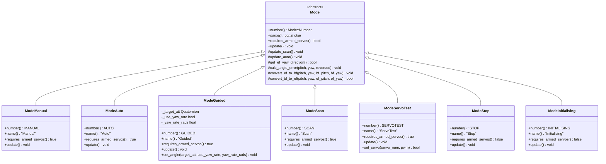
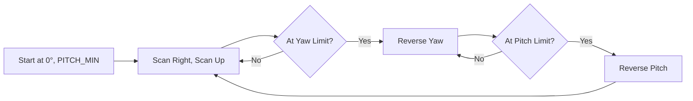
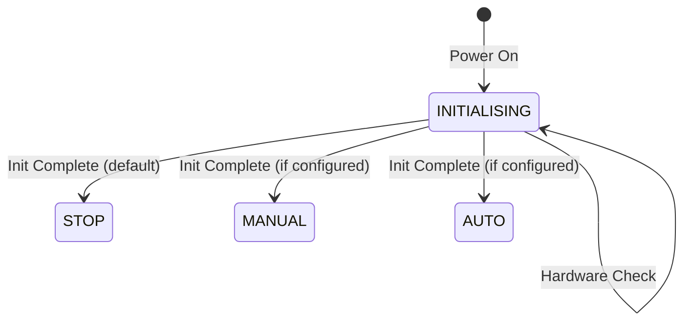
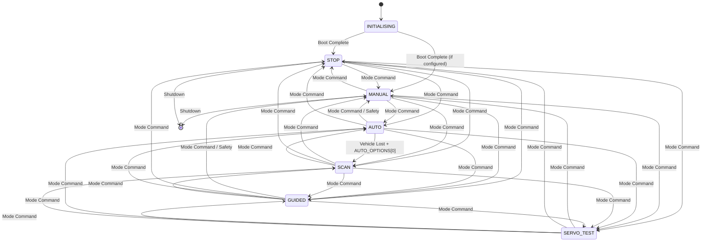
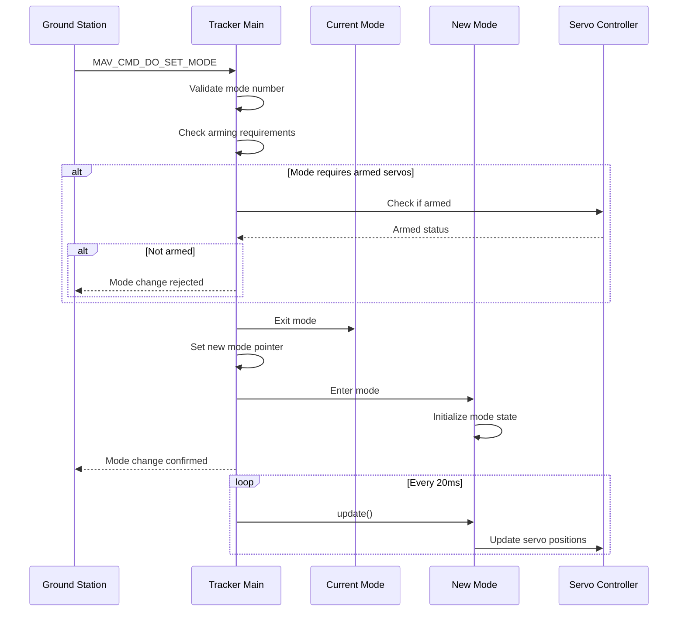

# AntennaTracker Tracking Modes


## Table of Contents
- [Overview](#overview)
- [Mode Architecture](#mode-architecture)
- [Mode Descriptions](#mode-descriptions)
  - [MANUAL Mode](#manual-mode)
  - [AUTO Mode](#auto-mode)
  - [GUIDED Mode](#guided-mode)
  - [SCAN Mode](#scan-mode)
  - [SERVO_TEST Mode](#servo_test-mode)
  - [STOP Mode](#stop-mode)
  - [INITIALISING Mode](#initialising-mode)
- [Mode Transitions](#mode-transitions)
- [Configuration Parameters](#configuration-parameters)
- [Safety Considerations](#safety-considerations)
- [Usage Examples](#usage-examples)

## Overview

The AntennaTracker system provides seven distinct tracking modes that control how the antenna servos position themselves. Each mode serves a specific purpose, from manual RC control to autonomous vehicle tracking, scanning patterns, and servo testing.

**Source Files**: 
- `/AntennaTracker/mode.h` - Mode class definitions and enumeration
- `/AntennaTracker/mode.cpp` - Common mode functionality
- `/AntennaTracker/mode_*.cpp` - Individual mode implementations

### Mode Summary Table

| Mode Number | Mode Name | Requires Armed Servos | Primary Purpose |
|------------|-----------|----------------------|-----------------|
| 0 | MANUAL | Yes | Direct RC pilot control |
| 10 | AUTO | Yes | Automatic vehicle tracking |
| 4 | GUIDED | Yes | External MAVLink control |
| 2 | SCAN | Yes | Continuous scanning pattern |
| 3 | SERVO_TEST | Yes | Servo testing and calibration |
| 1 | STOP | No | Servos stopped/disabled |
| 16 | INITIALISING | No | System startup state |

> **Note**: Mode numbers are not sequential for historical compatibility reasons. Mode 30 is reserved for future offboard/lua control.

## Mode Architecture

The tracking mode system is built on an object-oriented architecture with a base `Mode` class and specific implementations for each mode.



### Common Mode Functionality

All modes inherit from the base `Mode` class which provides common functionality:

**Source**: `/AntennaTracker/mode.cpp`

- **`update_auto()`** - Implements automatic vehicle tracking logic with yaw/pitch trimming and distance filtering
- **`update_scan()`** - Implements scanning pattern with configurable speeds and reversing at limits
- **`calc_angle_error()`** - Calculates angular error between current and target attitudes
- **`convert_ef_to_bf()`** - Converts earth-frame angles to body-frame for servo control
- **`convert_bf_to_ef()`** - Converts body-frame angles to earth-frame for calculations
- **`get_ef_yaw_direction()`** - Determines optimal yaw direction considering angular limits

## Mode Descriptions

### MANUAL Mode

**Mode Number**: 0  
**Source**: `/AntennaTracker/mode_manual.cpp`  
**Requires Armed Servos**: Yes

#### Description

MANUAL mode provides direct pilot control of the antenna tracker through RC (Radio Control) inputs. The pilot's yaw and pitch stick inputs are passed directly to the servo outputs without any processing or stabilization.

#### Behavior

- **Yaw Control**: RC channel input (CH_YAW) is directly copied to yaw servo output
- **Pitch Control**: RC channel input (CH_PITCH) is directly copied to pitch servo output
- **Output Constraints**: Servo outputs are constrained to configured PWM limits
- **Update Rate**: Runs at 50Hz (called every 20ms)

#### Implementation Details

```cpp
// Source: /AntennaTracker/mode_manual.cpp:11-19
void ModeManual::update()
{
    // Copy yaw and pitch input to output
    SRV_Channels::set_output_pwm(SRV_Channel::k_tracker_yaw, 
                                  RC_Channels::rc_channel(CH_YAW)->get_radio_in());
    SRV_Channels::constrain_pwm(SRV_Channel::k_tracker_yaw);

    SRV_Channels::set_output_pwm(SRV_Channel::k_tracker_pitch, 
                                  RC_Channels::rc_channel(CH_PITCH)->get_radio_in());
    SRV_Channels::constrain_pwm(SRV_Channel::k_tracker_pitch);
}
```

#### Use Cases

- **Manual Alignment**: Initial antenna positioning and alignment
- **Direct Control**: When autonomous tracking is not required or not working
- **Testing**: Verifying servo movement and RC input functionality
- **Emergency Override**: Taking manual control from automatic modes

#### Configuration Parameters

| Parameter | Description | Default | Units |
|-----------|-------------|---------|-------|
| RC1_MIN | Yaw channel minimum PWM | 1000 | µs |
| RC1_MAX | Yaw channel maximum PWM | 2000 | µs |
| RC2_MIN | Pitch channel minimum PWM | 1000 | µs |
| RC2_MAX | Pitch channel maximum PWM | 2000 | µs |

#### Safety Notes

> **Warning**: Servos must be armed before MANUAL mode will move the antenna. Verify mechanical range limits before use.

---

### AUTO Mode

**Mode Number**: 10  
**Source**: `/AntennaTracker/mode_auto.cpp`  
**Requires Armed Servos**: Yes

#### Description

AUTO mode is the primary tracking mode that automatically points the antenna toward a tracked vehicle's GPS position. When vehicle location is unavailable, it can optionally fall back to SCAN mode behavior.

#### Behavior

The AUTO mode operates with intelligent fallback logic:

1. **Vehicle Location Valid**: Tracks the vehicle's GPS position using `update_auto()`
2. **Vehicle Location Invalid**: 
   - Falls back to scanning if `tracker.target_set` is true
   - Falls back to scanning if AUTO_OPTIONS bit 0 is set
   - Otherwise remains at last known position

#### Implementation Details

```cpp
// Source: /AntennaTracker/mode_auto.cpp:5-12
void ModeAuto::update()
{
    if (tracker.vehicle.location_valid) {
        update_auto();  // Track vehicle GPS position
    } else if (tracker.target_set || (tracker.g.auto_opts.get() & (1 << 0)) != 0) {
        update_scan();  // Fallback to scanning pattern
    }
}
```

#### Tracking Algorithm

The `update_auto()` function (inherited from base Mode class) performs the following steps:

**Source**: `/AntennaTracker/mode.cpp:5-27`

1. **Calculate Target Angles**:
   - Yaw: `bearing + YAW_TRIM` (in centidegrees, wrapped to ±180°)
   - Pitch: `pitch + PITCH_TRIM` (constrained to PITCH_MIN/PITCH_MAX)

2. **Direction Optimization**: 
   - Determines if taking the "long way" around is more efficient
   - Considers yaw range limits and current servo positions

3. **Angle Error Calculation**:
   - Computes difference between target and current AHRS attitude
   - Converts earth-frame errors to body-frame for servo control

4. **Frame Conversion**:
   - Transforms earth-frame pitch/yaw to body-frame accounting for tracker roll

5. **Distance Filtering**:
   - Only moves servos if `distance >= DISTANCE_MIN` (when DISTANCE_MIN > 0)
   - Prevents tracking very close objects that may cause erratic movement

6. **Servo Update**:
   - Commands pitch and yaw servos with calculated body-frame angles

#### Use Cases

- **Primary Operation**: Standard vehicle tracking during flight
- **Ground Station**: Tracking aircraft for telemetry/video reception
- **Camera Tracking**: Keeping cameras pointed at moving vehicles
- **Antenna Pointing**: Maintaining RF link with moving platforms

#### Configuration Parameters

| Parameter | Description | Default | Units | Range |
|-----------|-------------|---------|-------|-------|
| YAW_TRIM | Yaw angle offset | 0 | degrees | -180 to 180 |
| PITCH_TRIM | Pitch angle offset | 0 | degrees | -90 to 90 |
| PITCH_MIN | Minimum pitch angle | -90 | degrees | -90 to 0 |
| PITCH_MAX | Maximum pitch angle | 90 | degrees | 0 to 90 |
| DISTANCE_MIN | Minimum tracking distance | 5 | meters | 0 to 100 |
| YAW_RANGE | Maximum yaw rotation range | 360 | degrees | 0 to 360 |
| AUTO_OPTIONS | Behavior option bitmask | 0 | bitmask | - |

**AUTO_OPTIONS Bitmask**:
- Bit 0 (value 1): Enable scan fallback when vehicle location invalid

#### Safety Notes

> **Note**: AUTO mode requires valid GPS position from both the tracker and the tracked vehicle. Ensure GPS lock before switching to AUTO mode.

> **Warning**: Large DISTANCE_MIN values may prevent tracking of nearby vehicles. Set appropriately for your application.

---

### GUIDED Mode

**Mode Number**: 4  
**Source**: `/AntennaTracker/mode_guided.cpp`  
**Requires Armed Servos**: Yes

#### Description

GUIDED mode allows external control of the tracker's attitude through MAVLink messages. This mode is used for programmatic control from ground stations, companion computers, or scripts.

#### Behavior

- **Attitude Control**: Tracks a target attitude (quaternion) set via MAVLink
- **Rate Control**: Optionally supports yaw rate control instead of absolute yaw angle
- **Logging**: Sends periodic status messages (every 5 seconds) with target angles
- **Frame Handling**: Converts received attitude to body-frame for servo control

#### Implementation Details

```cpp
// Source: /AntennaTracker/mode_guided.cpp:6-22
void ModeGuided::update()
{
    static uint32_t last_debug;
    const uint32_t now = AP_HAL::millis();
    float target_roll, target_pitch, target_yaw;
    _target_att.to_euler(target_roll, target_pitch, target_yaw);
    
    // Periodic status logging
    if (now - last_debug > 5000) {
        last_debug = now;
        gcs().send_text(MAV_SEVERITY_INFO, "target_yaw=%f target_pitch=%f", 
                       degrees(target_yaw), degrees(target_pitch));
    }
    
    // Calculate angle errors and update servos
    calc_angle_error(degrees(target_pitch)*100, degrees(target_yaw)*100, false);
    float bf_pitch, bf_yaw;
    convert_ef_to_bf(target_pitch, target_yaw, bf_pitch, bf_yaw);
    tracker.update_pitch_servo(bf_pitch);
    tracker.update_yaw_servo(bf_yaw);
}
```

#### Setting Target Attitude

The target attitude is set using the `set_angle()` method:

```cpp
// Source: /AntennaTracker/mode.h:58-62
void set_angle(const Quaternion &target_att, bool use_yaw_rate, float yaw_rate_rads)
{
    _target_att = target_att;        // Target attitude quaternion
    _use_yaw_rate = use_yaw_rate;    // Use rate control instead of angle
    _yaw_rate_rads = yaw_rate_rads;  // Yaw rate in radians/second
}
```

#### MAVLink Integration

GUIDED mode is typically controlled using these MAVLink messages:
- **SET_ATTITUDE_TARGET**: Sets desired attitude quaternion
- **COMMAND_LONG (MAV_CMD_DO_MOUNT_CONTROL)**: Legacy mount control interface

#### Use Cases

- **Scripted Tracking**: Programmatic antenna positioning from companion computers
- **Custom Tracking**: Tracking targets not supported by AUTO mode
- **Ground Station Control**: Manual positioning from ground control software
- **Integration Testing**: Automated testing of antenna positioning
- **Research Applications**: Custom tracking algorithms running off-board

#### Configuration Parameters

GUIDED mode uses the same trim and limit parameters as AUTO mode:

| Parameter | Description | Default | Units |
|-----------|-------------|---------|-------|
| YAW_TRIM | Yaw angle offset | 0 | degrees |
| PITCH_TRIM | Pitch angle offset | 0 | degrees |
| PITCH_MIN | Minimum pitch angle | -90 | degrees |
| PITCH_MAX | Maximum pitch angle | 90 | degrees |

#### Safety Notes

> **Note**: GUIDED mode requires continuous MAVLink updates. If external control is lost, manually switch to another mode.

> **Warning**: Ensure the controlling system respects mechanical angle limits to prevent servo damage.

---

### SCAN Mode

**Mode Number**: 2  
**Source**: `/AntennaTracker/mode_scan.cpp`  
**Requires Armed Servos**: Yes

#### Description

SCAN mode creates a continuous scanning pattern by automatically sweeping the antenna through its full range of motion in both yaw and pitch axes. This mode is useful for searching for vehicles or testing antenna coverage.

#### Behavior

The scanner operates independently on both axes, reversing direction when limits are reached:

**Yaw Axis Scanning**:
- Scans from 0° to 360° at configurable speed (SCAN_SPEED_YAW)
- Reverses direction at each limit
- Can be overridden by manual RC input (manual_control_yaw flag)

**Pitch Axis Scanning**:
- Scans from PITCH_MIN to PITCH_MAX at configurable speed (SCAN_SPEED_PITCH)
- Reverses direction at configured pitch limits
- Can be overridden by manual RC input (manual_control_pitch flag)

#### Implementation Details

```cpp
// Source: /AntennaTracker/mode_scan.cpp:3-6
void ModeScan::update()
{
    update_scan();  // Uses inherited scanning algorithm
}
```

The scanning algorithm is implemented in the base Mode class:

**Source**: `/AntennaTracker/mode.cpp:29-64`

```cpp
void Mode::update_scan(void)
{
    struct Tracker::NavStatus &nav_status = tracker.nav_status;
    Parameters &g = tracker.g;

    // Yaw axis scanning
    if (!nav_status.manual_control_yaw) {
        float yaw_delta = g.scan_speed_yaw * 0.02f;  // Delta per 20ms update
        nav_status.bearing += yaw_delta * (nav_status.scan_reverse_yaw ? -1 : 1);
        
        // Reverse at limits
        if (nav_status.bearing < 0 && nav_status.scan_reverse_yaw) {
            nav_status.scan_reverse_yaw = false;
        }
        if (nav_status.bearing > 360 && !nav_status.scan_reverse_yaw) {
            nav_status.scan_reverse_yaw = true;
        }
        nav_status.bearing = constrain_float(nav_status.bearing, 0, 360);
    }

    // Pitch axis scanning
    if (!nav_status.manual_control_pitch) {
        const float pitch_delta = g.scan_speed_pitch * 0.02f;  // Delta per 20ms update
        
        if (nav_status.scan_reverse_pitch) {
            nav_status.pitch -= pitch_delta;
            if (nav_status.pitch < g.pitch_min) {
                nav_status.scan_reverse_pitch = false;
            }
        } else {
            nav_status.pitch += pitch_delta;
            if (nav_status.pitch > g.pitch_max) {
                nav_status.scan_reverse_pitch = true;
            }
        }
        nav_status.pitch = constrain_float(nav_status.pitch, g.pitch_min, g.pitch_max);
    }

    update_auto();  // Apply calculated angles to servos
}
```

#### Scanning Pattern Diagram



#### Use Cases

- **Vehicle Search**: Scanning for lost aircraft or vehicles
- **Coverage Testing**: Verifying antenna pattern and coverage
- **System Testing**: Exercising full range of servo motion
- **Demonstration**: Showing tracker capabilities
- **Fallback Mode**: Used by AUTO mode when vehicle location is lost

#### Configuration Parameters

| Parameter | Description | Default | Units | Range |
|-----------|-------------|---------|-------|-------|
| SCAN_SPEED_YAW | Yaw scan rate | 10 | deg/s | 0 to 180 |
| SCAN_SPEED_PITCH | Pitch scan rate | 10 | deg/s | 0 to 90 |
| PITCH_MIN | Minimum pitch angle | -90 | degrees | -90 to 0 |
| PITCH_MAX | Maximum pitch angle | 90 | degrees | 0 to 90 |
| YAW_RANGE | Yaw scan range | 360 | degrees | 0 to 360 |

#### Scan Time Calculation

To calculate the time for a complete scan cycle:

**Yaw Scan Period**: `YAW_RANGE / SCAN_SPEED_YAW * 2` (seconds for forward + reverse)

**Pitch Scan Period**: `(PITCH_MAX - PITCH_MIN) / SCAN_SPEED_PITCH * 2` (seconds for up + down)

Example with default parameters:
- Yaw: 360° / 10°/s * 2 = 72 seconds
- Pitch: (90° - (-90°)) / 10°/s * 2 = 36 seconds

#### Safety Notes

> **Note**: SCAN mode will continuously move servos. Ensure mechanical stops are in place or configure appropriate angle limits.

> **Warning**: High scan speeds may cause mechanical stress. Start with low speeds and increase gradually.

---

### SERVO_TEST Mode

**Mode Number**: 3  
**Source**: `/AntennaTracker/mode_servotest.cpp`  
**Requires Armed Servos**: Yes

#### Description

SERVO_TEST mode allows direct PWM control of individual servos via MAVLink commands. This mode is designed for servo calibration, testing, and verifying mechanical range of motion.

#### Behavior

- **Direct PWM Control**: Sets exact PWM values to yaw or pitch servos
- **MAVLink Controlled**: Commands received via ground station or MAVLink interface
- **Immediate Application**: PWM changes are applied immediately to hardware
- **Range Constraint**: Output is constrained to configured servo limits
- **Manual Update**: Does not run autonomous update loop (update() is empty)

#### Implementation Details

```cpp
// Source: /AntennaTracker/mode_servotest.cpp:11-38
bool ModeServoTest::set_servo(uint8_t servo_num, uint16_t pwm)
{
    // Convert servo_num from 1~2 to 0~1 range
    servo_num--;

    // Exit immediately if servo_num is invalid
    if (servo_num != CH_YAW && servo_num != CH_PITCH) {
        return false;
    }

    // Set yaw servo pwm and send output to servo
    if (servo_num == CH_YAW) {
        SRV_Channels::set_output_pwm(SRV_Channel::k_tracker_yaw, pwm);
        SRV_Channels::constrain_pwm(SRV_Channel::k_tracker_yaw);
    }

    // Set pitch servo pwm and send output to servo
    if (servo_num == CH_PITCH) {
        SRV_Channels::set_output_pwm(SRV_Channel::k_tracker_pitch, pwm);
        SRV_Channels::constrain_pwm(SRV_Channel::k_tracker_pitch);
    }

    // Calculate and output PWM to hardware
    SRV_Channels::calc_pwm();
    SRV_Channels::output_ch_all();
    
    return true;  // Success
}
```

#### Servo Numbering

| Servo Number | Channel | Function |
|--------------|---------|----------|
| 1 | CH_YAW | Yaw (azimuth) servo |
| 2 | CH_PITCH | Pitch (elevation) servo |

> **Note**: Servo numbers are 1-indexed for MAVLink compatibility but converted to 0-indexed internally.

#### MAVLink Control

SERVO_TEST mode is typically controlled using:
- **MAV_CMD_DO_SET_SERVO**: Command 183, sets servo to specific PWM value
- **MAV_CMD_DO_REPEAT_SERVO**: Command 184, oscillates servo for testing

Example MAVLink command sequence:
```
MAV_CMD_DO_SET_SERVO:
  param1: servo_num (1=yaw, 2=pitch)
  param2: pwm (1000-2000 µs)
```

#### Use Cases

- **Servo Calibration**: Determining actual mechanical range of servos
- **PWM Verification**: Testing servo response to specific PWM values
- **Mechanical Alignment**: Setting servos to known positions for alignment
- **Range Testing**: Verifying servo travel and mechanical limits
- **Troubleshooting**: Isolating servo or mechanical issues

#### Configuration Parameters

Servo output is constrained by these parameters:

| Parameter | Description | Default | Units | Range |
|-----------|-------------|---------|-------|-------|
| SERVO_YAW_MIN | Minimum yaw servo PWM | 1000 | µs | 500-2500 |
| SERVO_YAW_MAX | Maximum yaw servo PWM | 2000 | µs | 500-2500 |
| SERVO_PITCH_MIN | Minimum pitch servo PWM | 1000 | µs | 500-2500 |
| SERVO_PITCH_MAX | Maximum pitch servo PWM | 2000 | µs | 500-2500 |

#### Safety Notes

> **Warning**: SERVO_TEST mode bypasses all angle limits and safety checks. Only use in a controlled environment.

> **Warning**: Verify mechanical limits before commanding extreme PWM values to prevent damage.

> **Caution**: Servos must be armed for SERVO_TEST to function. Ensure the area is clear before arming.

---

### STOP Mode

**Mode Number**: 1  
**Source**: `/AntennaTracker/mode.h`  
**Requires Armed Servos**: No

#### Description

STOP mode halts all servo movement and maintains the current position. This is a safe mode that doesn't require armed servos, making it suitable for system initialization or emergency stops.

#### Behavior

- **No Servo Updates**: The `update()` method is empty, no servo commands are sent
- **Position Hold**: Servos remain at their last commanded position
- **No Arming Required**: Can be entered without arming servos
- **Minimal Processing**: No calculations or sensor processing occurs

#### Implementation Details

```cpp
// Source: /AntennaTracker/mode.h:104-110
class ModeStop : public Mode {
public:
    Mode::Number number() const override { return Mode::Number::STOP; }
    const char* name() const override { return "Stop"; }
    bool requires_armed_servos() const override { return false; }
    void update() override {};  // Empty - no servo updates
};
```

#### Use Cases

- **Safe Default**: Default mode during initialization
- **Emergency Stop**: Quick way to halt all antenna movement
- **Power Save**: Reduce servo power consumption when tracking not needed
- **Manual Positioning**: Allow manual physical positioning of antenna
- **System Troubleshooting**: Stop automated movement for diagnostics

#### Configuration Parameters

STOP mode has no specific configuration parameters.

#### Safety Notes

> **Note**: STOP mode does not actively hold position. Servos may drift if gravity or wind applies force to the antenna.

> **Note**: This mode can be entered at any time, regardless of arming state, making it a safe emergency fallback.

---

### INITIALISING Mode

**Mode Number**: 16  
**Source**: `/AntennaTracker/mode.h`  
**Requires Armed Servos**: No

#### Description

INITIALISING is a transient startup mode active during system boot and initialization. The tracker automatically exits this mode once initialization is complete.

#### Behavior

- **Temporary State**: Active only during system startup
- **No Servo Updates**: The `update()` method is empty
- **Automatic Exit**: System transitions to another mode (typically STOP or MANUAL) after initialization
- **No Arming Required**: Initialization occurs before servo arming

#### Implementation Details

```cpp
// Source: /AntennaTracker/mode.h:70-76
class ModeInitialising : public Mode {
public:
    Mode::Number number() const override { return Mode::Number::INITIALISING; }
    const char* name() const override { return "Initialising"; }
    bool requires_armed_servos() const override { return false; }
    void update() override {};  // Empty - no servo updates during init
};
```

#### Initialization Sequence



#### Use Cases

- **System Boot**: Normal power-on sequence
- **Parameter Reset**: After parameter changes requiring reboot
- **Firmware Update**: After flashing new firmware
- **Hardware Detection**: During hardware enumeration and setup

#### Configuration Parameters

INITIALISING mode has no specific configuration parameters. The default mode after initialization is controlled by:

| Parameter | Description | Default | Options |
|-----------|-------------|---------|---------|
| INITIAL_MODE | Mode to enter after init | 1 (STOP) | 0=MANUAL, 1=STOP, 2=SCAN, etc. |

#### Safety Notes

> **Note**: INITIALISING mode is automatic and cannot be manually selected. It is not included in ground station mode selection options.

> **Note**: If the system remains in INITIALISING mode, check for initialization errors in the boot log.

## Mode Transitions

### State Machine Diagram



### Transition Rules

#### Mode Change Commands

Mode transitions are initiated through:
1. **MAVLink Commands**: `MAV_CMD_DO_SET_MODE` with custom_mode parameter
2. **RC Switch**: If configured via RCx_OPTION parameter
3. **Ground Station**: Mode selection in mission planner or other GCS
4. **Automatic**: AUTO → SCAN fallback when vehicle location is lost

#### Transition Validation

Before allowing a mode change, the system checks:
- **Arming State**: Modes requiring armed servos can only be entered if servos are armed
- **Valid Mode Number**: Mode must be one of the defined mode numbers
- **Initialization Complete**: Cannot change from INITIALISING manually

#### Automatic Transitions

The only automatic mode transition is:
- **AUTO → SCAN**: When vehicle location becomes invalid AND scan fallback is enabled

### Mode Change Sequence



## Configuration Parameters

### Core Tracking Parameters

| Parameter | Description | Default | Units | Range | Modes Affected |
|-----------|-------------|---------|-------|-------|----------------|
| YAW_TRIM | Yaw angle offset/trim | 0 | degrees | -180 to 180 | AUTO, GUIDED |
| PITCH_TRIM | Pitch angle offset/trim | 0 | degrees | -90 to 90 | AUTO, GUIDED |
| PITCH_MIN | Minimum pitch angle | -90 | degrees | -90 to 0 | AUTO, SCAN, GUIDED |
| PITCH_MAX | Maximum pitch angle | 90 | degrees | 0 to 90 | AUTO, SCAN, GUIDED |
| YAW_RANGE | Maximum yaw rotation | 360 | degrees | 0 to 360 | AUTO, SCAN |

### AUTO Mode Parameters

| Parameter | Description | Default | Units | Range |
|-----------|-------------|---------|-------|-------|
| DISTANCE_MIN | Minimum tracking distance | 5 | meters | 0 to 1000 |
| AUTO_OPTIONS | Behavior bitmask | 0 | bitmask | 0 to 255 |

**AUTO_OPTIONS Flags**:
- Bit 0 (1): Enable scan when vehicle location invalid

### SCAN Mode Parameters

| Parameter | Description | Default | Units | Range |
|-----------|-------------|---------|-------|-------|
| SCAN_SPEED_YAW | Yaw scan speed | 10 | deg/s | 0 to 180 |
| SCAN_SPEED_PITCH | Pitch scan speed | 10 | deg/s | 0 to 90 |

### Servo Configuration Parameters

| Parameter | Description | Default | Units | Range |
|-----------|-------------|---------|-------|-------|
| SERVO_YAW_MIN | Yaw servo minimum PWM | 1000 | µs | 500 to 2500 |
| SERVO_YAW_MAX | Yaw servo maximum PWM | 2000 | µs | 500 to 2500 |
| SERVO_PITCH_MIN | Pitch servo minimum PWM | 1000 | µs | 500 to 2500 |
| SERVO_PITCH_MAX | Pitch servo maximum PWM | 2000 | µs | 500 to 2500 |

### PID Controller Parameters

| Parameter | Description | Default | Modes Affected |
|-----------|-------------|---------|----------------|
| YAW2SRV_P | Yaw P gain | 0.2 | AUTO, GUIDED, SCAN |
| YAW2SRV_I | Yaw I gain | 0.1 | AUTO, GUIDED, SCAN |
| YAW2SRV_D | Yaw D gain | 0 | AUTO, GUIDED, SCAN |
| PITCH2SRV_P | Pitch P gain | 0.2 | AUTO, GUIDED, SCAN |
| PITCH2SRV_I | Pitch I gain | 0.1 | AUTO, GUIDED, SCAN |
| PITCH2SRV_D | Pitch D gain | 0 | AUTO, GUIDED, SCAN |

## Safety Considerations

### Arming Requirements

Modes that require armed servos (MANUAL, AUTO, GUIDED, SCAN, SERVO_TEST) will not move servos until:
1. Arming command is received via MAVLink or RC switch
2. Pre-arm checks pass (if configured)
3. Safety switch is disengaged (if equipped)

### Mechanical Limits

**Critical Safety Checks**:
- Always configure PITCH_MIN and PITCH_MAX to match mechanical limits
- Set YAW_RANGE to prevent cable wrap or mechanical interference
- Verify servo limits (SERVO_*_MIN/MAX) match actual servo safe range
- Test movement at low speed before increasing scan speeds

### Angle Limit Protection

The tracker implements software angle limiting:
- Pitch angles are constrained to [PITCH_MIN, PITCH_MAX]
- Yaw movement is limited to YAW_RANGE
- Servo outputs are constrained to configured PWM limits

**Source**: `/AntennaTracker/mode.cpp:12` (pitch constraining)
**Source**: `/AntennaTracker/mode.cpp:44` (yaw/bearing constraining)

### Emergency Procedures

#### Unexpected Movement
1. Switch to STOP mode immediately (no arming required)
2. Disarm servos if equipped with kill switch
3. Power off system if necessary

#### Lost Vehicle in AUTO Mode
- Tracker will hold last known position OR
- Switch to SCAN mode if AUTO_OPTIONS bit 0 is set
- Manually switch to MANUAL or STOP for direct control

#### MAVLink Loss in GUIDED Mode
- Tracker continues pointing at last commanded attitude
- Manually switch to another mode to regain control
- Consider configuring failsafe action for comm loss

### Frame Convention

The tracker uses earth-frame (EF) and body-frame (BF) coordinate systems:

**Earth Frame (EF)**:
- Yaw: 0° = North, 90° = East, 180° = South, 270° = West
- Pitch: 0° = Horizontal, +90° = Straight up, -90° = Straight down

**Body Frame (BF)**:
- Relative to tracker's mounting orientation
- Accounts for tracker roll angle in calculations

**Conversion**: The system automatically converts between frames using tracker AHRS attitude
**Source**: `/AntennaTracker/mode.cpp:104-123` (frame conversion functions)

## Usage Examples

### Example 1: Basic Vehicle Tracking

**Scenario**: Track a flying aircraft with default parameters

```bash
# Initial setup
# 1. Connect to tracker via ground station
# 2. Verify GPS lock on both tracker and vehicle
# 3. Arm servos

# Enter AUTO mode
MAV_CMD_DO_SET_MODE custom_mode=10

# Tracker will now automatically point at vehicle
# Monitor in ground station:
# - Bearing to vehicle
# - Pitch angle to vehicle
# - Distance to vehicle
# - Angle errors
```

### Example 2: Scanning for Lost Vehicle

**Scenario**: Vehicle GPS lost, scan to reacquire

```bash
# Configure scan fallback
AUTO_OPTIONS = 1  # Enable scan when vehicle lost

# Set comfortable scan speeds
SCAN_SPEED_YAW = 20    # 20 deg/s yaw scan
SCAN_SPEED_PITCH = 10  # 10 deg/s pitch scan

# Set scan limits
PITCH_MIN = -10  # Don't scan below -10°
PITCH_MAX = 45   # Don't scan above 45°

# Enter AUTO mode
# If vehicle location is lost, tracker automatically scans
# When vehicle GPS recovers, automatically resume tracking
```

### Example 3: Manual Override During Flight

**Scenario**: Take manual control temporarily during AUTO mode

```bash
# During AUTO mode operation
# Switch to MANUAL via RC switch or ground station

MAV_CMD_DO_SET_MODE custom_mode=0  # Enter MANUAL

# Use RC sticks to position antenna manually
# - RC channel 1 controls yaw
# - RC channel 2 controls pitch

# Return to AUTO when ready
MAV_CMD_DO_SET_MODE custom_mode=10  # Return to AUTO
```

### Example 4: Servo Calibration

**Scenario**: Calibrate yaw servo mechanical limits

```bash
# Enter SERVO_TEST mode
MAV_CMD_DO_SET_MODE custom_mode=3

# Test minimum PWM
MAV_CMD_DO_SET_SERVO param1=1 param2=1000  # Yaw to min

# Test center PWM
MAV_CMD_DO_SET_SERVO param1=1 param2=1500  # Yaw to center

# Test maximum PWM
MAV_CMD_DO_SET_SERVO param1=1 param2=2000  # Yaw to max

# Note actual mechanical angles at each position
# Update SERVO_YAW_MIN and SERVO_YAW_MAX accordingly

# Test pitch servo
MAV_CMD_DO_SET_SERVO param1=2 param2=1000  # Pitch to min
MAV_CMD_DO_SET_SERVO param1=2 param2=1500  # Pitch to center
MAV_CMD_DO_SET_SERVO param1=2 param2=2000  # Pitch to max
```

### Example 5: GUIDED Mode from Companion Computer

**Scenario**: Point antenna using custom script

```python
# Python example using pymavlink
from pymavlink import mavutil

# Connect to tracker
master = mavutil.mavlink_connection('udp:127.0.0.1:14550')
master.wait_heartbeat()

# Switch to GUIDED mode
master.mav.command_long_send(
    master.target_system,
    master.target_component,
    mavutil.mavlink.MAV_CMD_DO_SET_MODE,
    0,  # confirmation
    mavutil.mavlink.MAV_MODE_FLAG_CUSTOM_MODE_ENABLED,
    4,  # custom_mode = GUIDED
    0, 0, 0, 0, 0
)

# Set target attitude (point 30° up, 45° east of north)
import math
target_roll = 0
target_pitch = math.radians(30)
target_yaw = math.radians(45)

# Convert to quaternion
# (simplified - actual implementation would use quaternion library)
master.mav.set_attitude_target_send(
    0,  # time_boot_ms
    master.target_system,
    master.target_component,
    0,  # type_mask
    [q0, q1, q2, q3],  # attitude quaternion
    0, 0, 0,  # body roll/pitch/yaw rates
    0  # thrust
)

# Tracker will now point to specified attitude
```

### Example 6: Trimming for Antenna Offset

**Scenario**: Antenna is mounted 5° offset from tracker centerline

```bash
# Measure actual antenna pointing vs. tracker orientation
# If antenna points 5° right of tracker yaw axis:

YAW_TRIM = -5  # Compensate by trimming -5°

# If antenna points 2° above tracker pitch axis:
PITCH_TRIM = -2  # Compensate by trimming -2°

# Now when tracker points at vehicle:
# - Actual antenna direction matches vehicle position
# - Trim is applied in AUTO, GUIDED, and SCAN modes
```

### Example 7: Limited Range Scanning

**Scenario**: Scan limited sector (e.g., 180° in front)

```bash
# Configure for 180° yaw range
YAW_RANGE = 180  # Only scan 180° range

# Set scanning speed
SCAN_SPEED_YAW = 15   # 15 deg/s
SCAN_SPEED_PITCH = 8  # 8 deg/s

# Limit pitch range
PITCH_MIN = 0     # Horizontal minimum
PITCH_MAX = 60    # Don't scan above 60°

# Enter SCAN mode
MAV_CMD_DO_SET_MODE custom_mode=2

# Tracker scans ±90° from center, 0° to 60° pitch
# Scan cycle time: (180/15)*2 = 24 seconds yaw
#                  (60/8)*2 = 15 seconds pitch
```

## Troubleshooting

### Common Issues

| Issue | Possible Cause | Solution |
|-------|---------------|----------|
| Servos not moving in MANUAL | Servos not armed | Arm servos via GCS or RC switch |
| Jerky tracking in AUTO | PID gains too high | Reduce P and D gains |
| Tracker points wrong direction | Trim not configured | Set YAW_TRIM and PITCH_TRIM |
| GUIDED mode not responding | MAVLink messages not received | Check MAVLink connection and message rate |
| Scan stops at wrong angle | Mechanical limits reached | Adjust PITCH_MIN/PITCH_MAX/YAW_RANGE |
| SERVO_TEST no response | Wrong servo number | Use 1 for yaw, 2 for pitch |
| Cannot enter mode | Arming required | Arm servos or choose STOP/INITIALISING |

### Diagnostic Procedures

**Verify Mode Transition**:
```bash
# Check current mode in ground station status display
# Or request mode via MAVLink:
MAV_CMD_REQUEST_MESSAGE (id=HEARTBEAT)
# Check custom_mode field in response
```

**Check Servo Outputs**:
```bash
# Monitor SERVO_OUTPUT_RAW MAVLink message
# Verify PWM values are within expected range
# Confirm values change when mode/inputs change
```

**Verify Angle Calculations**:
```bash
# Monitor these MAVLink messages:
# - ATTITUDE: Tracker's current attitude
# - GLOBAL_POSITION_INT: Tracker's GPS position
# - GPS_RAW_INT: Vehicle's GPS position (in AUTO)
# Calculate expected bearing/pitch and compare
```

## References

### Source Code Files

- `/AntennaTracker/mode.h` - Mode class definitions and enumerations
- `/AntennaTracker/mode.cpp` - Common mode functionality and frame conversions
- `/AntennaTracker/mode_auto.cpp` - AUTO mode implementation
- `/AntennaTracker/mode_manual.cpp` - MANUAL mode implementation
- `/AntennaTracker/mode_guided.cpp` - GUIDED mode implementation
- `/AntennaTracker/mode_scan.cpp` - SCAN mode implementation
- `/AntennaTracker/mode_servotest.cpp` - SERVO_TEST mode implementation

### Related Documentation

- **ArduPilot Main Documentation**: https://ardupilot.org/antennatracker/
- **MAVLink Protocol**: https://mavlink.io/en/
- **Parameter Reference**: Available in ground station software
- **Hardware Setup**: `/AntennaTracker/README.md` (if available)

### Key Algorithms

- **Earth Frame to Body Frame Conversion**: `/AntennaTracker/mode.cpp:104-110`
- **Body Frame to Earth Frame Conversion**: `/AntennaTracker/mode.cpp:112-123`
- **Yaw Direction Optimization**: `/AntennaTracker/mode.cpp:126-176`
- **Angle Error Calculation**: `/AntennaTracker/mode.cpp:66-102`
- **Scanning Pattern**: `/AntennaTracker/mode.cpp:29-64`
- **Auto Tracking**: `/AntennaTracker/mode.cpp:5-27`

---

**Document Version**: 1.0  
**Last Updated**: 2024  
**Maintainer**: ArduPilot Development Team  
**License**: GPLv3

