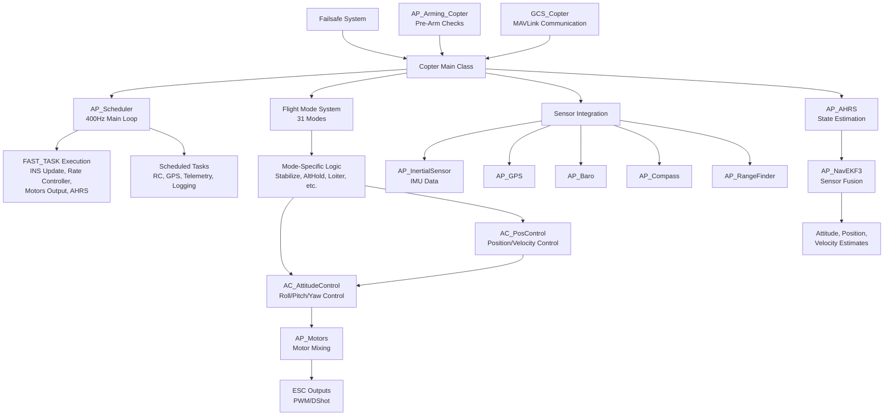
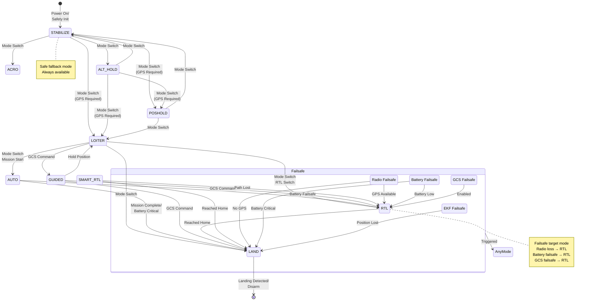
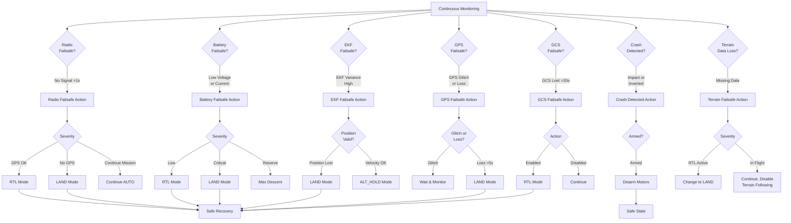

# ArduCopter

## Overview

ArduCopter is ArduPilot's multicopter flight control system supporting traditional helicopters, multirotor configurations (tricopters, quadcopters, hexacopters, octocopters), and coaxial copters. It provides comprehensive flight stabilization, autonomous navigation, and mission execution capabilities for rotary-wing aircraft. The system integrates sensor fusion through EKF (Extended Kalman Filter), advanced attitude and position control algorithms, and a robust failsafe framework to ensure safe flight operations.

ArduCopter implements 31 distinct flight modes ranging from manual stabilization to fully autonomous waypoint navigation, precision landing, and intelligent return-to-launch. The architecture emphasizes real-time performance with a 400Hz main control loop, modular design for extensibility, and safety-critical features including comprehensive pre-arm checks, multi-layer failsafe protection, and crash detection.

Source: ArduCopter/*.{h,cpp}

## Architecture

The ArduCopter system follows a hierarchical architecture with the Copter class serving as the central coordinator, integrating sensor data processing, state estimation, flight mode management, attitude/position control, and motor output generation.



### Key Components

- **Copter Class** (`Copter.h`, `Copter.cpp`): Main vehicle class managing initialization, scheduler integration, mode transitions, and system state. Inherits from AP_Vehicle and coordinates all subsystems.

- **Scheduler** (`scheduler_tasks[]`): Priority-based task scheduler with FAST_TASK entries running at 400Hz (INS update, rate controller, motor output, AHRS) and slower scheduled tasks for GPS (50Hz), RC input (250Hz), telemetry (400Hz), logging (various rates).

- **Flight Mode System** (`mode.h`, `mode.cpp`, `mode_*.cpp`): Polymorphic mode architecture with base Mode class and 31 concrete mode implementations. Each mode defines behavior for pilot input interpretation, navigation logic, and control objectives.

- **Attitude Control** (`AC_AttitudeControl`): Multi-loop cascade controller converting desired attitudes or angular rates into motor commands. Implements rate controller (innermost), angle controller, and input shaping with configurable limits and slew rates.

- **Position Control** (`AC_PosControl`): Manages velocity and position control loops for autonomous flight. Generates desired lean angles for attitude controller based on position errors, velocity targets, or pilot input in assisted modes.

- **Waypoint Navigation** (`AC_WPNav`, `AC_Loiter`): Trajectory generation and path following for autonomous missions, loiter mode, and guided operations. Handles corner cutting, spline waypoints, and terrain following.

- **Sensor Integration**: Unified interface to IMUs (`AP_InertialSensor`), GPS (`AP_GPS`), barometers (`AP_Baro`), magnetometers (`AP_Compass`), rangefinders (`AP_RangeFinder`), and optical flow (`AP_OpticalFlow`).

- **State Estimation** (`AP_AHRS`, `AP_NavEKF3`): Extended Kalman Filter fusing IMU, GPS, barometer, magnetometer, optical flow, and rangefinder data to produce filtered estimates of attitude, position, and velocity in NED (North-East-Down) frame.

- **Motor Control** (`AP_Motors`): Frame-specific motor mixing converting desired roll/pitch/yaw moments and throttle into individual motor outputs. Supports multi-rotor, traditional helicopter, and coaxial configurations with comprehensive output limiting and safety features.

- **Failsafe System** (`failsafe.cpp`): Multi-layer protection against radio loss, GPS failure, EKF divergence, battery depletion, geofence breach, and main loop lockup. Cascading failsafe actions based on severity and vehicle capabilities.

- **Arming System** (`AP_Arming_Copter`): Comprehensive pre-arm and arm checks validating sensor health, calibration status, RC input, GPS lock, battery voltage, and flight configuration before allowing motor startup.

- **GCS Integration** (`GCS_Copter.cpp`, `GCS_MAVLink_Copter.h`): MAVLink communication for telemetry streaming, parameter access, mission upload/download, and command execution. Vehicle-specific message handlers and streaming configurations.

- **Precision Landing** (`AC_PrecLand`): Integration with IR-LOCK or other precision landing sensors for accurate touchdown on moving or stationary targets.

Source: ArduCopter/Copter.h, ArduCopter/Copter.cpp

## Flight Mode System

ArduCopter implements 31 distinct flight modes categorized by pilot control requirements and autonomy level:

### Manual Control Modes

1. **STABILIZE** (0): Manual airframe angle control with manual throttle. Pilot stick input directly controls desired roll/pitch angles and yaw rate. Requires active piloting. No GPS required.

2. **ACRO** (1): Manual body-frame angular rate control with manual throttle. Pilot inputs desired roll/pitch/yaw rates. For advanced aerobatic flight. No GPS required.

3. **SPORT** (13): Manual earth-frame angular rate control with manual throttle. Similar to ACRO but inputs are earth-frame relative. No GPS required.

4. **DRIFT** (11): Semi-autonomous mode combining elements of STABILIZE and LOITER. Automatically controls yaw to align with ground track. Requires GPS.

### Altitude-Assisted Modes

5. **ALT_HOLD** (2): Manual airframe angle control with automatic altitude hold using barometer/rangefinder. Pilot controls horizontal movement; throttle controls climb/descent rate. No GPS required for basic operation.

6. **POSHOLD** (16): Automatic position and altitude hold with manual override. Releasing sticks returns to hover. Aggressive brake on stick release. Requires GPS.

### GPS-Stabilized Modes

7. **LOITER** (5): Automatic horizontal position and altitude control. Pilot input commands velocity; stick release initiates position hold. Requires GPS.

8. **FLOWHOLD** (22): Position hold using optical flow sensor without requiring GPS or rangefinder. Suitable for indoor flight with downward-facing camera.

### Automated Modes

9. **AUTO** (3): Fully autonomous waypoint navigation executing mission commands from uploaded flight plan. Handles takeoff, waypoints, camera control, and landing. Requires GPS.

10. **GUIDED** (4): Fly to coordinates or follow velocity/direction commands from GCS or companion computer. Dynamic waypoint adjustments. Requires GPS.

11. **GUIDED_NOGPS** (20): Guided mode accepting only attitude and altitude commands, no horizontal position control. For non-GPS environments.

### Return and Landing Modes

12. **RTL** (6): Automatic return to launch point, climb to safe altitude, return to home, and land. Multi-phase behavior with configurable altitude and final approach. Requires GPS.

13. **SMART_RTL** (21): Returns home by retracing outbound path, avoiding obstacles encountered during flight. Falls back to RTL if path data unavailable. Requires GPS.

14. **AUTO_RTL** (27): Sub-mode of AUTO executing DO_LAND_START landing sequence during autonomous missions. Requires GPS.

15. **LAND** (9): Automatic vertical descent with horizontal position control if GPS available. Detects landing through motor output monitoring and accelerometer data.

### Advanced Flight Modes

16. **CIRCLE** (7): Automatic circular flight around a center point with automatic altitude hold. Pilot can adjust radius and rate. Requires GPS.

17. **BRAKE** (17): Maximum deceleration using position controller. Rapidly arrests horizontal movement. Requires GPS or optical flow.

18. **THROW** (18): Throw-to-launch mode. Vehicle detects being thrown, spins up motors, and transitions to stabilized flight. Requires accelerometer-based throw detection.

19. **FLIP** (14): Automatic flip on roll or pitch axis. Pre-programmed aerobatic maneuver with safety checks. Pilot must hold switch throughout maneuver.

20. **ZIGZAG** (24): Semi-autonomous mode for flying predefined zigzag patterns between point A and point B. Useful for surveying or agricultural applications. Requires GPS.

### Special Function Modes

21. **AUTOTUNE** (15): Automated tuning of roll/pitch/yaw PID gains through systematic excitation and response measurement. Requires stable flight conditions and GPS.

22. **SYSTEMID** (25): System identification mode producing automated frequency sweeps in control inputs for system characterization and advanced tuning. Requires GPS.

23. **FOLLOW** (23): Attempts to follow another vehicle or ground station broadcasting position. Maintains offset position. Requires GPS.

24. **AVOID_ADSB** (19): Automatic avoidance of obstacles detected via ADS-B (aircraft transponders). Maneuvers to maintain separation. Requires GPS and ADS-B receiver.

25. **TURTLE** (28): Flip-over recovery mode allowing motor reversal to right vehicle after crash. For multirotors with bidirectional ESCs.

### Helicopter-Specific Modes

26. **ACRO_HELI**: Helicopter-specific acro mode with tailored rate control for traditional helicopters.

27. **STABILIZE_HELI**: Helicopter-specific stabilization with collective pitch control.

28. **AUTOROTATE** (26): Autonomous autorotation for helicopters in power-loss scenarios. Manages rotor RPM through collective pitch. Requires RPM sensor.

### Developer/Testing Modes

29. **TOY_MODE**: Simplified control mode for toy-grade vehicles with reduced complexity.

30. **Custom Modes**: Mode number 30 reserved for external/Lua scripting control. Mode 127 reserved for Skybrush drone show coordination.

**Mode Requirements Summary**:
- GPS Required: AUTO, GUIDED, RTL, SMART_RTL, LOITER, CIRCLE, POSHOLD, FOLLOW, ZIGZAG, AVOID_ADSB, AUTOTUNE, SYSTEMID
- GPS Optional: ALT_HOLD (enhanced with GPS), LAND (position hold with GPS)
- No GPS Required: STABILIZE, ACRO, SPORT, FLOWHOLD, GUIDED_NOGPS, THROW, FLIP, BRAKE (with optical flow)

Source: ArduCopter/mode.h:77-109, ArduCopter/mode.cpp

## Mode State Machine

Flight mode transitions follow these rules:



### Mode Transition Rules

1. **Always Available**: STABILIZE mode is always available as a fallback and can be entered from any mode.

2. **GPS Requirements**: Modes requiring GPS (AUTO, GUIDED, LOITER, RTL, CIRCLE, POSHOLD, FOLLOW, ZIGZAG) can only be entered when GPS has 3D fix with sufficient satellites and HDOP.

3. **RC Failsafe Restrictions**: Some modes (AUTO, GUIDED, RTL, SMART_RTL, LAND) allow entry during RC failsafe for autonomous recovery. Manual modes require valid RC.

4. **Arming Requirements**: Only certain modes allow arming (typically stabilized modes, LOITER, AUTO with mission). Fully autonomous modes like RTL typically require arming in another mode first.

5. **Failsafe Overrides**: Failsafe conditions (radio loss, battery low, GCS loss, EKF failure) can force mode transitions overriding pilot selection. Priority: Critical Battery > EKF Failure > Radio Loss > GCS Loss.

6. **Pre-Arm vs In-Flight**: Some modes (THROW, FLIP, AUTOTUNE, SYSTEMID) can only be entered in flight after arming in another mode.

Source: ArduCopter/mode.h, ArduCopter/Copter.cpp

## Scheduler Architecture

ArduCopter uses the AP_Scheduler priority-based task scheduler with a 400Hz primary loop rate for time-critical control functions and lower-rate scheduled tasks for sensors, telemetry, and logging.

### Main Loop Rate

- **Primary Loop**: 400Hz (2.5ms period) configurable by SCHED_LOOP_RATE parameter
- **FAST_TASK**: Runs at full loop rate (400Hz) - marked with FAST_TASK macro
- **Scheduled Tasks**: Run at specified rates (1Hz to 400Hz) with assigned priorities

### Fast Tasks (400Hz Critical Path)

Executed sequentially every loop iteration in priority order:

1. **ins.update()**: Update inertial sensor, read new gyro/accel samples, run filtering
2. **run_rate_controller_main()**: Execute innermost attitude rate controller (roll/pitch/yaw rates)
3. **run_custom_controller()**: Custom controller integration (if enabled)
4. **motors_output_main()**: Send motor commands to ESCs via PWM/DShot
5. **read_AHRS()**: Update AHRS/EKF state estimation with latest IMU data
6. **read_inertia()**: Update inertial navigation position/velocity estimates
7. **check_ekf_reset()**: Detect and handle EKF position/yaw resets
8. **update_flight_mode()**: Execute current flight mode logic (attitude controller, position controller)
9. **update_home_from_EKF()**: Update home position if EKF origin changes
10. **update_land_and_crash_detectors()**: Monitor for landing contact or crash conditions
11. **update_rangefinder_terrain_offset()**: Surface tracking for terrain following
12. **Log_Video_Stabilisation()**: Log data for video stabilization

**Fast Task Budget**: Each FAST_TASK must complete in well under 2.5ms total to maintain real-time performance. Typical budget: 1.8-2.0ms for all fast tasks combined.

### Scheduled Tasks (Priority-Based Execution)

Lower-priority tasks run at specified rates, scheduled between fast task executions:

| Task | Rate (Hz) | Max Time (μs) | Priority | Description |
|------|-----------|---------------|----------|-------------|
| rc_loop | 250 | 130 | 3 | Read and process RC input channels |
| throttle_loop | 50 | 75 | 6 | Process throttle input, apply deadband |
| fence_check | 25 | 100 | 7 | Check geofence boundaries, trigger breach actions |
| gps.update | 50 | 200 | 9 | Update GPS position, velocity, satellite data |
| optflow.update | 200 | 160 | 12 | Update optical flow velocity measurements |
| update_batt_compass | 10 | 120 | 15 | Read battery voltage/current, compass data |
| rc_channels.read_aux_all | 10 | 50 | 18 | Process auxiliary RC channels, check switches |
| auto_disarm_check | 10 | 50 | 27 | Check auto-disarm timeout conditions |
| read_rangefinder | 20 | 100 | 33 | Update rangefinder distance measurements |
| proximity.update | 200 | 50 | 36 | Update proximity sensor obstacle data |
| update_altitude | 10 | 100 | 42 | Calculate and log current altitude |
| run_nav_updates | 50 | 100 | 45 | Update navigation controllers, waypoint logic |
| update_throttle_hover | 100 | 90 | 48 | Learn and update hover throttle estimate |
| mode_smartrtl.save_position | 3 | 100 | 51 | Record breadcrumb path for Smart RTL |
| three_hz_loop | 3 | 75 | 57 | Low-frequency checks, compass learning |
| update_precland | 400 | 50 | 69 | Precision landing sensor updates |
| one_hz_loop | 1 | 100 | 81 | Once per second: update home, check values |
| ekf_check | 10 | 75 | 84 | Monitor EKF health, trigger failsafe if diverged |
| check_vibration | 10 | 50 | 87 | Check for high vibration levels |
| gpsglitch_check | 10 | 50 | 90 | Detect GPS glitches, inconsistencies |
| takeoff_check | 50 | 50 | 91 | Verify safe takeoff conditions after arming |
| gcs.update_receive | 400 | 180 | 102 | Receive and parse MAVLink messages |
| gcs.update_send | 400 | 550 | 105 | Send MAVLink telemetry streams |
| camera_mount.update | 50 | 75 | 108 | Update camera gimbal control |
| ten_hz_logging_loop | 10 | 350 | 114 | Log medium-rate data (attitude, position) |
| twentyfive_hz_logging | 25 | 110 | 117 | Log higher-rate data (control outputs) |
| logger.periodic_tasks | 400 | 300 | 120 | Flush log buffers, manage log files |
| ins.periodic | 400 | 50 | 123 | Periodic IMU calibration, health checks |

### Timing Budget and Priorities

- **Priority 0-50**: Critical tasks (most fast tasks, rate controllers)
- **Priority 51-100**: Important but not time-critical (navigation, sensors)
- **Priority 101-150**: Communications, logging, diagnostics
- **Priority 151+**: User hooks, optional features

**Overrun Handling**: If a task exceeds its max_time budget, scheduler logs warning but continues. Repeated overruns trigger performance warnings. Tasks are automatically delayed if insufficient time before next fast task iteration.

### Scheduler Configuration

- **SCHED_LOOP_RATE**: Main loop frequency (default 400Hz, range 50-2000Hz)
- **SCHED_OPTIONS**: Bit flags controlling logging, performance monitoring
- **Per-Task Enable**: Many tasks automatically enabled/disabled based on feature flags (e.g., fence_check only runs if AP_FENCE_ENABLED)

Source: ArduCopter/Copter.cpp:113-256, ArduCopter/Copter.h

## Flight Control Integration

ArduCopter integrates multiple control libraries to achieve stable, accurate flight:

### Attitude Control (AC_AttitudeControl)

**Multi-Loop Cascade Structure**:
1. **Rate Controller** (Innermost): Converts desired angular rates (deg/s) to motor commands using PID control on gyro measurements. Runs at 400Hz.
2. **Angle Controller**: Converts desired attitude angles (roll/pitch/yaw) to angular rate commands. Implements feedforward for responsive control.
3. **Input Shaping**: Converts pilot stick inputs to desired angles or rates with expo curves, rate limits, and slew limiting.

**Control Modes**:
- **Rate Mode**: Direct angular rate control (ACRO, SPORT modes)
- **Angle Mode**: Stabilized angle control with automatic leveling (STABILIZE, ALT_HOLD)
- **Hybrid**: Combined angle and rate control with pilot input (most GPS modes)

**Key Features**:
- Quaternion-based attitude representation for singularity-free control
- Feedforward from pilot input for immediate response
- Notch filtering for vibration rejection, dynamic harmonic notch
- Angle and rate limiting for safety
- Separate tuning for roll, pitch, yaw axes
- Square-root controller option for linear response

**Parameters**: ATC_RAT_RLL_*, ATC_RAT_PIT_*, ATC_RAT_YAW_* for rate control. ATC_ANG_* for angle limits.

Source: ArduCopter/Attitude.cpp, libraries/AC_AttitudeControl/

### Position Control (AC_PosControl)

**Multi-Loop Position/Velocity Control**:
1. **Position Controller**: Converts position errors (cm) to velocity commands (cm/s) using P control
2. **Velocity Controller**: Converts velocity errors to desired lean angles using PID control
3. **Acceleration Limiting**: Constrains commanded accelerations for smooth flight
4. **Jerk Limiting**: Limits rate of acceleration change for passenger comfort

**Operating Modes**:
- **Position Control**: Hold specific 3D position (LOITER, POSHOLD, AUTO)
- **Velocity Control**: Track desired velocity vector (GUIDED velocity commands)
- **Altitude Control**: Independent vertical position/velocity control (all modes)
- **Surface Tracking**: Follow terrain/ceiling at constant height using rangefinder

**Coordinate Frames**:
- **NED Frame** (North-East-Down): Position and velocity targets expressed relative to EKF origin
- **Body Frame**: Velocity commands can be body-relative for intuitive pilot control
- **Transforms**: Automatic conversion between frames based on mode requirements

**Terrain Following**:
- Integrates with AP_Terrain database for pre-loaded terrain altitude
- Uses rangefinder for real-time terrain tracking when available
- Maintains altitude above ground level (AGL) instead of mean sea level (MSL)

**Parameters**: PSC_POS_*, PSC_VEL_*, PSC_ACC_* for horizontal control. PSC_POSZ_*, PSC_VELZ_*, PSC_ACCZ_* for vertical control.

Source: ArduCopter/navigation.cpp, libraries/AC_PosControl/

### Waypoint Navigation (AC_WPNav)

**Trajectory Generation**: Creates smooth paths between waypoints with configurable speed profiles, acceleration limits, and corner-cutting behavior.

**Path Types**:
- **Straight Line**: Direct path between waypoints with optional corner cutting
- **Spline**: Smooth curved paths through waypoint sequences
- **Loiter**: Circular or figure-8 patterns around target points
- **Terrain Following**: Maintain constant height above terrain during mission

**Speed Management**:
- **Horizontal Speed**: WPNAV_SPEED parameter (default 1000 cm/s)
- **Vertical Speed**: WPNAV_SPEED_UP, WPNAV_SPEED_DN parameters
- **Corner Speed**: Automatic slowdown for sharp turns based on WPNAV_RADIUS
- **Acceleration**: WPNAV_ACCEL, WPNAV_ACCEL_Z limits for smooth motion

Source: ArduCopter/commands.cpp, libraries/AC_WPNav/

### Motor Control and Mixing (AP_Motors)

**Motor Library Integration**: Converts desired roll/pitch/yaw moments and collective thrust into individual motor outputs.

**Frame Configurations**:
- Multirotor: Tri, Quad (X, +, H, V), Hexa (X, +), Octa (X, +, V), Deca, Dodeca
- Coaxial: Y6, X8
- Traditional Helicopter: Single and dual rotor with swashplate mixing
- Single/Dual Copter: Servo-controlled surfaces with single/dual motors

**Output Limiting**:
- **Collective Thrust Saturation**: Scale all motors proportionally when sum exceeds 100%
- **Priority Weighting**: Maintain attitude control (roll/pitch/yaw) over vertical thrust when saturated
- **Boost Limiting**: Limit maximum collective boost to maintain control authority
- **Low-End Protection**: Ensure minimum motor speeds for controlability

**Safety Features**:
- Motor interlock: Separate arming (electronics) from motor interlock (spin motors)
- Spin-when-armed: Keep motors spinning at low speed when armed for immediate response
- Motor test: Individual motor testing for configuration validation
- Emergency stop: Immediate motor cutoff on E-stop switch

**ESC Protocols**: PWM (1000-2000μs), OneShot125, DShot (150/300/600/1200), bi-directional DShot for RPM telemetry.

**Parameters**: MOT_PWM_TYPE, MOT_PWM_MIN, MOT_PWM_MAX, MOT_SPIN_MIN, MOT_SPIN_ARM, MOT_THST_EXPO, MOT_BAT_VOLT_*, MOT_BAT_CURR_*.

Source: ArduCopter/motors.cpp, libraries/AP_Motors/

## Sensor Integration

### Inertial Measurement (AP_InertialSensor)

- **Gyroscope**: Angular rate measurements for attitude control and stabilization
- **Accelerometer**: Linear acceleration for velocity estimation and vibration monitoring
- **Sampling**: 1kHz+ raw sampling, 400Hz filtered output to EKF and controllers
- **Multi-IMU**: Supports up to 3 IMUs, automatic failover on sensor failure
- **Filtering**: Low-pass filters, notch filters (static and dynamic harmonic)
- **Calibration**: Accelerometer calibration (6-position), gyro bias learning

### GPS (AP_GPS)

- **Position**: Latitude, longitude, altitude (MSL) with accuracy estimates
- **Velocity**: 3D velocity vector in NED frame
- **Protocols**: UBlox, NMEA, SBF, GSOF, MAV, NOVA, SBP
- **Dual GPS**: Automatic blending or switching between two GPS modules
- **RTK**: Real-Time Kinematic for centimeter-level accuracy

### Barometer (AP_Baro)

- **Altitude**: Pressure-based altitude estimate relative to calibrated ground level
- **Vertical Velocity**: Derived from pressure altitude changes
- **Multi-Baro**: Fusion of up to 3 barometers for redundancy
- **Temperature Compensation**: Corrects for temperature variations

### Magnetometer (AP_Compass)

- **Heading**: Magnetic north reference for yaw angle estimation
- **Compass Count**: Supports up to 3 compasses, priority-based selection
- **Calibration**: 3D calibration for hard and soft iron compensation
- **Motor Compensation**: Learns and corrects magnetic interference from motors
- **Declination**: Automatic application of magnetic declination for true north

### Rangefinder (AP_RangeFinder)

- **Distance**: Height above ground (ROTATION_PITCH_270) or below ceiling (ROTATION_PITCH_90)
- **Technologies**: Lidar (Lightware, TeraRanger, Benewake), sonar (MaxBotix), radar
- **Terrain Following**: Maintains constant AGL altitude
- **Landing Detection**: Assists in detecting ground contact
- **Surface Tracking**: Enables ceiling or floor tracking in confined spaces

### Optical Flow (AP_OpticalFlow)

- **Velocity Estimation**: 2D velocity measurement from downward camera
- **Indoor Flight**: Enables position hold without GPS (FLOWHOLD mode)
- **Sensors**: PX4Flow, Cheerson CX-OF, MAVLink, CXOF, MSP
- **Integration**: Fused with IMU in EKF for position estimation
- **Quality Threshold**: Rejects low-quality flow measurements

Source: ArduCopter/sensors.cpp, ArduCopter/Attitude.cpp

## Failsafe System

ArduCopter implements multiple independent failsafe layers to handle various failure scenarios:

### Failsafe Cascade



### Radio Failsafe

**Trigger**: RC signal loss detected for > FS_THR_ENABLE threshold (typically 1 second)

**Actions** (FS_THR_ENABLE parameter):
- **0 - Disabled**: No action, pilot must regain control
- **1 - Enabled Always RTL**: RTL if GPS available, LAND if no GPS position
- **2 - Enabled Continue with Mission in Auto**: Continue AUTO mission, else RTL/LAND
- **3 - Enabled SmartRTL or RTL or Land**: Attempt SmartRTL, fallback to RTL, then LAND

**Recovery**: Automatic when RC signal restored. Returns to previous mode after recovery delay.

**Parameters**: FS_THR_ENABLE, FS_THR_VALUE, FS_OPTIONS

### Battery Failsafe

**Voltage Monitoring**: Triggers when battery voltage falls below thresholds
- **Low Battery** (BATT_LOW_VOLT): Warning, action based on BATT_FS_LOW_ACT
- **Critical Battery** (BATT_CRT_VOLT): Immediate action based on BATT_FS_CRT_ACT
- **Reserve Battery** (BATT_LOW_MAH, BATT_CRT_MAH): Capacity-based failsafe

**Actions**:
- **0 - None**: Warning only, no automatic action
- **1 - Land**: Immediate descent and landing
- **2 - RTL**: Return to launch, then land
- **3 - SmartRTL**: Return via recorded path, fallback to RTL
- **4 - Terminate**: Emergency motor cutoff (use with caution)

**Multi-Stage**: Low battery triggers warning action, critical battery overrides with more aggressive action.

**Parameters**: BATT_LOW_VOLT, BATT_CRT_VOLT, BATT_FS_LOW_ACT, BATT_FS_CRT_ACT, BATT_LOW_MAH, BATT_CRT_MAH

### GPS Failsafe

**GPS Glitch Detection**: Monitors inconsistencies between GPS position and inertial navigation
- Triggers when GPS reports position jump inconsistent with vehicle dynamics
- Automatically rejects glitched GPS data, relies on EKF inertial prediction
- Recovers automatically when GPS reports consistent data

**GPS Loss Failsafe**: Loss of GPS fix for > FS_GPS_TIMEOUT seconds
- Switches to dead reckoning using IMU and last known velocity
- If in GPS-dependent mode (AUTO, GUIDED, RTL), may switch to LAND or ALT_HOLD
- FS_GPS_ENABLE: 0=Disabled, 1=Land, 2=AltHold, 3=Land even from stabilized modes

**Parameters**: FS_GPS_ENABLE, FS_GPS_TIMEOUT

### EKF Failsafe

**Trigger**: EKF reports high variance in position or velocity estimates exceeding FS_EKF_THRESH threshold

**Detection**:
- Position variance filtered over 1 second (pos_variance_filt)
- Velocity variance filtered over 1 second (vel_variance_filt)
- Failsafe if variance > FS_EKF_THRESH for > 1 second

**Actions**:
- **Position Lost**: Land immediately (motors output minimum, descent to landing)
- **Velocity Valid**: May continue in ALT_HOLD or stabilized mode
- **Complete Loss**: Disarm after landing detected

**Causes**: Sensor failures, excessive vibration, magnetic interference, GPS jamming, sudden environmental changes

**Parameters**: FS_EKF_ENABLE, FS_EKF_THRESH

### GCS Failsafe

**Trigger**: Loss of MAVLink heartbeat messages from ground control station for > FS_GCS_TIMEOUT seconds

**Actions** (FS_GCS_ENABLE):
- **0 - Disabled**: No action
- **1 - Enabled Always RTL**: RTL mode if GPS available, LAND otherwise
- **2 - Enabled Continue with Mission in Auto**: Continue AUTO mission, else RTL/LAND
- **5 - Enabled SmartRTL or RTL or Land**: SmartRTL > RTL > LAND

**Use Cases**: Loss of telemetry link, GCS software crash, antenna failure

**Parameters**: FS_GCS_ENABLE, FS_GCS_TIMEOUT

### Crash Detection

**Detection Methods**:
- **Impact Detection**: Sudden deceleration exceeding FS_CRASH_CHECK threshold (default 0.7 m/s²)
- **Angle Deviation**: Lean angle > 30° for > 2 seconds while landed
- **Inverted Detection**: Vehicle upside down (z-axis accelerometer negative)

**Actions**:
- **Disarm Motors**: Immediate motor cutoff if armed
- **Log Event**: Record crash in dataflash logs
- **Notification**: Report to GCS via MAVLink

**Parameters**: FS_CRASH_CHECK (0=Disabled, 1=Disarm only, 2=Disarm or land)

### Terrain Data Failsafe

**Trigger**: Loss of terrain altitude data while terrain following active

**Detection**: No terrain data available for current position for > 10 seconds

**Actions**:
- **In RTL**: Switch from RTL to LAND (cannot safely return without terrain data)
- **In AUTO**: Continue mission without terrain following, use barometric altitude
- **Logging**: Record terrain failsafe event

**Parameters**: TERRAIN_ENABLE, TERRAIN_FOLLOW

### Main Loop Lockup Failsafe

**Watchdog Protection**: Hardware watchdog detects if main loop stops advancing

**Detection**: Scheduler tick counter not incrementing for > 2 seconds

**Actions**:
- **Output Minimum**: Set all motor outputs to minimum
- **Disarm After 1s**: Complete motor shutoff after 1 second of lockup
- **Log Error**: Record CPU failsafe error code

**Causes**: Software bugs causing infinite loops, ISR deadlock, hardware faults

Source: ArduCopter/failsafe.cpp, ArduCopter/crash_check.cpp, ArduCopter/ekf_check.cpp

## Arming System

The arming system ensures safe vehicle operation through comprehensive pre-flight validation checks:

### Pre-Arm Checks

Performed continuously while disarmed, must pass before arming allowed:

1. **System Initialization**: All subsystems initialized, parameters loaded
2. **Motor Configuration**: Motor configuration valid for selected frame type
3. **RC Calibration**: RC min/max values calibrated, throttle at minimum
4. **GPS Lock**: 3D fix with >= 6 satellites and HDOP < 2.0 (if GPS-dependent mode selected)
5. **Compass Health**: Compass calibrated, health good, offsets reasonable
6. **Compass Consistency**: Multiple compasses agree within tolerance
7. **Barometer Health**: Barometer initialized and providing valid data
8. **Accelerometer Calibration**: All IMUs calibrated, offsets within limits
9. **Gyroscope Calibration**: Gyro bias stable, not drifting
10. **Board Voltage**: Board voltage within acceptable range
11. **Battery Voltage**: Battery voltage above minimum threshold
12. **Parameter Load**: All parameters successfully loaded from storage
13. **Logging**: Logger ready, SD card present and writable (if required)
14. **Geofence**: Geofence loaded and valid (if enabled)
15. **Proximity**: Proximity sensors online and reporting (if enabled)
16. **EKF Health**: EKF initialized, variances low, healthy state estimation
17. **Mission Valid**: Mission loaded and valid (if starting in AUTO mode)
18. **RC Failsafe**: RC failsafe not active
19. **GCS Failsafe**: GCS failsafe not active (if GCS required)
20. **Safety Switch**: Hardware safety switch disengaged (if present)

### Arming Checks

Performed at arming request, must pass to arm:

1. **Pre-Arm Status**: All pre-arm checks currently passing
2. **Mode Allows Arming**: Current flight mode allows arming
3. **Throttle Position**: Throttle stick at minimum (unless override enabled)
4. **Lean Angle**: Vehicle level within tolerance (roll/pitch < 2° unless override)
5. **Motor Interlock**: Motor interlock switch in disabled position (if used)
6. **Rotor Speed**: Rotor speed at zero for helicopters

### Arming Methods

- **Rudder Arming**: Throttle minimum, full right rudder for 1 second (if enabled)
- **Switch Arming**: Arm/disarm auxiliary switch (default method)
- **GCS Arming**: MAVLink command from ground station
- **Scripting**: Lua script command (if scripting enabled)

### Arming Options (ARMING_OPTIONS Bitmask)

- **Bit 0**: Ignore throttle position pre-arm check
- **Bit 1**: Ignore battery failsafe on arm
- **Bit 2**: Ignore GPS HDOP pre-arm check
- **Bit 3**: Ignore GPS satellite count pre-arm check
- **Bit 4**: Enable arming without RC (for companion computer control)
- **Bit 5**: Require switch to arm (disable rudder arming)
- **Bit 6**: Allow compass cal during flight

### Auto-Disarm

Automatic disarming after landing:

- **Delay**: DISARM_DELAY parameter (default 10 seconds)
- **Condition**: Land complete flag set, throttle at minimum
- **Override**: Pilot can delay auto-disarm by raising throttle briefly

### Safety Features

- **Spin-When-Armed**: Motors spin at minimum speed when armed (MOT_SPIN_ARM)
- **Motor Interlock**: Separate safety from arming; armed ≠ motors spinning
- **Arm Timeout**: Re-arm required after extended armed-but-not-flying period
- **Forced Disarm**: Emergency disarm via GCS or RC switch bypassing checks

Source: ArduCopter/AP_Arming_Copter.cpp, ArduCopter/AP_Arming_Copter.h, libraries/AP_Arming/

## GCS Integration

Ground Control Station communication via MAVLink protocol:

### MAVLink Communication

- **Protocol**: MAVLink 1.0 and 2.0 support with automatic negotiation
- **Link Types**: Serial (telemetry radios), USB, WiFi, CAN (DroneCAN)
- **Channels**: Up to 6 independent MAVLink channels (SERIAL1-6)
- **Baudrates**: Configurable per channel (typical: 57600 for radio, 115200 for USB)

### Telemetry Streams

**Stream Rates** (SR1_*, SR2_* parameters per channel):

1. **RAW_SENSORS**: IMU, barometer, magnetometer raw data
2. **EXTENDED_STATUS**: System status, battery, GPS, heartbeat
3. **RC_CHANNELS**: RC input values
4. **POSITION**: Position, velocity, altitude estimates
5. **EXTRA1**: Attitude (roll/pitch/yaw)
6. **EXTRA2**: VFR_HUD, wind estimate
7. **EXTRA3**: AHRS, EKF status, vibration
8. **PARAMS**: Parameter values (on-demand)

**Rate Limiting**: Maximum stream rates configurable to prevent link saturation

### Command Handling

Copter-specific MAVLink command handlers:

- **MAV_CMD_NAV_TAKEOFF**: Initiate takeoff to specified altitude
- **MAV_CMD_NAV_LAND**: Initiate landing sequence
- **MAV_CMD_NAV_WAYPOINT**: Fly to waypoint during guided mode
- **MAV_CMD_CONDITION_YAW**: Set desired yaw angle or rate
- **MAV_CMD_DO_SET_MODE**: Change flight mode
- **MAV_CMD_DO_SET_SERVO**: Control servo outputs
- **MAV_CMD_DO_SET_RELAY**: Control relay outputs
- **MAV_CMD_DO_FENCE_ENABLE**: Enable/disable geofence
- **MAV_CMD_DO_MOTOR_TEST**: Test individual motors
- **MAV_CMD_DO_SET_ROI**: Set Region Of Interest for camera
- **MAV_CMD_COMPONENT_ARM_DISARM**: Arm or disarm vehicle

### Guided Mode Integration

**Position Commands**: Fly to lat/lon/alt coordinate
**Velocity Commands**: Maintain specified velocity vector (NED or body frame)
**Attitude Commands**: Hold specified attitude with throttle control
**Acceleration Commands**: Track acceleration setpoints

### Mission Protocol

- **Mission Upload**: Receive waypoint list from GCS, validate, store
- **Mission Download**: Send current mission to GCS
- **Mission Count**: Report number of waypoints
- **Mission Current**: Set/get currently active waypoint
- **Mission Clear**: Erase stored mission

### Parameter Protocol

- **Parameter Read**: Request specific parameter value by name or index
- **Parameter Set**: Change parameter value with validation
- **Parameter List**: Send all parameter name/value pairs to GCS
- **Parameter Save**: Write parameters to persistent storage

### Fence and Rally Protocol

- **Fence Upload/Download**: Transfer geofence polygon points
- **Rally Upload/Download**: Transfer rally point positions
- **Status Reporting**: Fence breach status, rally point selection

### Copter-Specific Messages

- **MOUNT_STATUS**: Gimbal orientation and status
- **VIBRATION**: Vibration levels for each axis
- **EKF_STATUS_REPORT**: Detailed EKF health information
- **BATTERY_STATUS**: Extended battery information
- **TERRAIN_REPORT**: Terrain data status and current terrain height
- **AUTOPILOT_VERSION_REQUEST**: Firmware version and capabilities

Source: ArduCopter/GCS_Copter.cpp, ArduCopter/GCS_MAVLink_Copter.h, libraries/GCS_MAVLink/

## Precision Landing

Integration with AC_PrecLand library for accurate landing on targets:

### Supported Sensors

- **IR-LOCK**: Infrared beacon tracking (default, most common)
- **MAVLink**: Position data from external vision system via MAVLink
- **SITL**: Simulated precision landing in software-in-the-loop
- **Companion Computer**: Computer vision via MAVLink offboard target messages

### Precision Landing Modes

- **Disabled (PLND_ENABLED=0)**: Precision landing features disabled
- **Enabled (PLND_ENABLED=1)**: Active during LAND mode and mission landing
- **Enabled with Auto-land (PLND_ENABLED=2)**: Automatically triggers precision land

### Landing Phases

1. **Target Acquisition**: Search for landing beacon while descending normally
2. **Target Tracking**: Center vehicle over target while continuing descent
3. **Final Approach**: Slow descent rate, tight position hold on target
4. **Touchdown**: Detect landing, disarm

### Position Control

- **Horizontal Correction**: Position controller maintains center on target
- **Descent Rate**: PLND_SPEED_DN parameter (slower than normal landing)
- **Accuracy**: Typical landing accuracy within 5-10cm of target center
- **Retry**: If target lost during descent, may attempt repositioning

### Configuration Parameters

- **PLND_ENABLED**: Enable precision landing (0=Disabled, 1=Enabled)
- **PLND_TYPE**: Sensor type (0=None, 1=IR-LOCK, 2=MAVLink, 3=SITL)
- **PLND_YAW_ALIGN**: Yaw offset between beacon and vehicle
- **PLND_LAND_OFS**: Landing offset from beacon center (x,y in cm)
- **PLND_OPTIONS**: Bitmask for retry behavior, strict mode
- **PLND_SPEED_DN**: Target descent speed in precision land (cm/s)

### State Machine Integration

Precision landing integrates with Land mode and mission landing commands, activated automatically when target visible and position accuracy sufficient.

Source: ArduCopter/precision_landing.cpp, libraries/AC_PrecLand/

## Configuration Parameters

### Key Parameter Groups

**Rate Controller** (ATC_RAT_*):
- **ATC_RAT_RLL_P, ATC_RAT_PIT_P**: Roll and pitch rate P gains
- **ATC_RAT_RLL_I, ATC_RAT_PIT_I**: Rate I gains for wind rejection
- **ATC_RAT_RLL_D, ATC_RAT_PIT_D**: Rate D gains for damping
- **ATC_RAT_YAW_P, ATC_RAT_YAW_I**: Yaw rate gains
- **ATC_RAT_*_FLTD, ATC_RAT_*_FLTT**: Derivative and target filtering

**Angle Limits** (ATC_ANG_*):
- **ATC_ANG_RLL_P, ATC_ANG_PIT_P**: Angle P gains (angle to rate)
- **ANGLE_MAX**: Maximum lean angle in degrees (default 4500 = 45°)
- **ATC_SLEW_YAW**: Maximum yaw rate change (deg/s/s)

**Position Control** (PSC_*):
- **PSC_POSXY_P**: Horizontal position to velocity P gain
- **PSC_VELXY_P, PSC_VELXY_I, PSC_VELXY_D**: Horizontal velocity PID
- **PSC_POSZ_P**: Vertical position to velocity P gain
- **PSC_VELZ_P, PSC_VELZ_I, PSC_VELZ_D**: Vertical velocity PID
- **PSC_ACCZ_P, PSC_ACCZ_I**: Vertical acceleration control gains

**Waypoint Navigation** (WPNAV_*):
- **WPNAV_SPEED**: Horizontal speed in AUTO/GUIDED (cm/s)
- **WPNAV_SPEED_UP, WPNAV_SPEED_DN**: Vertical speeds (cm/s)
- **WPNAV_RADIUS**: Waypoint radius for completion (cm)
- **WPNAV_ACCEL, WPNAV_ACCEL_Z**: Acceleration limits (cm/s²)

**Motors** (MOT_*):
- **MOT_PWM_TYPE**: ESC protocol (0=PWM, 1=OneShot, 4-7=DShot)
- **MOT_PWM_MIN, MOT_PWM_MAX**: PWM output range (μs)
- **MOT_SPIN_MIN**: Minimum throttle for motor spin (0-1 range)
- **MOT_SPIN_ARM**: Throttle when armed but not flying
- **MOT_THST_EXPO**: Thrust curve exponential (0.5-0.8 typical)
- **MOT_BAT_VOLT_MAX, MOT_BAT_VOLT_MIN**: Battery compensation voltage range

**Failsafe** (FS_*):
- **FS_THR_ENABLE**: Radio failsafe action (0=Disabled, 1=RTL, 2=Continue, 3=SmartRTL)
- **FS_THR_VALUE**: RC throttle value indicating failsafe (<975 typical)
- **FS_GCS_ENABLE**: GCS failsafe enable/action
- **FS_EKF_ENABLE**: EKF failsafe enable (0=Disabled, 1=Land)
- **FS_EKF_THRESH**: EKF variance threshold (default 0.8)
- **FS_CRASH_CHECK**: Crash detection (0=Disabled, 1=Disarm, 2=Disarm or Land)

**Battery** (BATT_*):
- **BATT_CAPACITY**: Battery capacity in mAh
- **BATT_LOW_VOLT, BATT_CRT_VOLT**: Low and critical voltage thresholds
- **BATT_FS_LOW_ACT, BATT_FS_CRT_ACT**: Failsafe actions (0=None, 1=Land, 2=RTL)
- **BATT_LOW_MAH, BATT_CRT_MAH**: Capacity-based thresholds

**Arming** (ARMING_CHECK, DISARM_DELAY):
- **ARMING_CHECK**: Bitmask of enabled pre-arm checks
- **ARMING_OPTIONS**: Arming behavior options
- **DISARM_DELAY**: Auto-disarm delay after landing (seconds)

**Scheduler** (SCHED_*):
- **SCHED_LOOP_RATE**: Main loop frequency (50-2000Hz, default 400Hz)
- **SCHED_OPTIONS**: Scheduler behavior bitmask

**Logging** (LOG_*):
- **LOG_BITMASK**: Controls which message types are logged
- **LOG_FILE_DSRMROT**: Delete logs after disarm (0=No, 1=Yes)
- **LOG_BACKEND_TYPE**: Where to log (SD card, MAVLink, etc.)

Source: ArduCopter/Parameters.h, ArduCopter/Parameters.cpp

## Safety Considerations

### Critical Safety Features

1. **Pre-Arm Checks**: Comprehensive validation before flight (GPS lock, compass cal, battery voltage, RC calibration, sensor health)

2. **Failsafe Protection**: Multiple independent failsafe layers (radio, battery, GPS, EKF, GCS, terrain) with configurable actions

3. **Geofencing**: Cylindrical and polygon fences prevent flight outside defined boundaries. Actions: Report, Avoid, RTL, Land

4. **Crash Detection**: Automatic detection of crashes and impacts with immediate motor disarm to prevent injury or damage

5. **Motor Interlock**: Separation of arming (electronics powered) from motor interlock (motors spinning) for additional safety layer

6. **Vibration Monitoring**: Continuous monitoring of vibration levels with warnings and automatic compensation

7. **EKF Monitoring**: Real-time validation of state estimation quality, failsafe on divergence

8. **Battery Monitoring**: Multi-stage battery protection (low, critical, reserve) with automatic failsafe actions

9. **RC Loss Protection**: Automatic return-to-launch or land when RC signal lost

10. **Altitude Limits**: Maximum altitude enforcement via ALT_HOLD_RTL parameter

### Flight-Critical Code Paths

**400Hz Rate Controller** (`run_rate_controller_main`): Innermost control loop converting angular rate errors to motor commands. Any failure here results in loss of control.

**Motor Output** (`motors_output_main`): Direct motor command generation. Protected by multiple safety checks and output limiting.

**EKF Update** (`read_AHRS`): State estimation providing attitude, position, velocity. EKF divergence triggers failsafe.

**Main Loop Watchdog** (`failsafe_check`): Detects main loop lockup, forces motor shutoff after 2 seconds.

### Safe Testing Procedures

1. **Bench Testing**:
   - Test with propellers removed
   - Use motor test function to verify motor ordering
   - Validate sensor readings in Mission Planner/QGroundControl
   - Confirm failsafes trigger correctly (simulate RC loss, low battery)

2. **SITL Testing**:
   - Test mode transitions and navigation logic in simulator
   - Validate mission behavior before flight
   - Test failsafe scenarios safely
   - Develop custom scripts and autonomous behaviors

3. **First Flights**:
   - Fly in calm wind conditions
   - Start with STABILIZE mode, verify control response
   - Test ALT_HOLD for altitude control
   - Test LOITER for position hold (GPS required)
   - Gradually progress to autonomous modes

4. **Tuning Flights**:
   - Use AUTOTUNE mode for automated PID tuning
   - Review logs after each flight for issues
   - Incrementally adjust parameters, test after each change
   - Monitor vibration levels and IMU health

### Safety Warnings

⚠️ **Propeller Hazard**: Spinning propellers are extremely dangerous. Never arm with propellers installed unless ready for immediate flight. Keep hands, clothing, and objects clear of propellers at all times.

⚠️ **Failsafe Configuration**: Test ALL failsafe configurations on the bench before flight. Incorrect failsafe settings can result in fly-aways or crashes.

⚠️ **GPS Dependence**: Modes requiring GPS (AUTO, GUIDED, LOITER, RTL) will not function without 3D GPS fix. Always have manual fallback mode available.

⚠️ **Compass Calibration**: Poor compass calibration is a leading cause of flight issues. Perform thorough calibration away from magnetic interference, verify before each flight.

⚠️ **Vibration**: Excessive vibration degrades EKF performance and control quality. Address vibration sources (balancing, damping) before extensive flight operations.

⚠️ **Battery Monitoring**: Always configure battery failsafe with conservative voltage thresholds. Battery failsafe is last line of defense against over-discharge.

⚠️ **Parameter Changes**: Changing parameters incorrectly can make vehicle unflyable. Understand parameter function before modification, make incremental changes, test thoroughly.

Source: ArduCopter/crash_check.cpp, ArduCopter/failsafe.cpp, ArduCopter/AP_Arming_Copter.cpp

## Testing

### SITL (Software-In-The-Loop) Testing

**Starting SITL Copter**:
```bash
cd ArduPilot/Tools/autotest
./sim_vehicle.py -v ArduCopter --console --map
```

**SITL with Specific Frame**:
```bash
./sim_vehicle.py -v ArduCopter -f quad --console --map
./sim_vehicle.py -v ArduCopter -f hexa --console --map
./sim_vehicle.py -v ArduCopter -f octa --console --map
./sim_vehicle.py -v ArduCopter -f heli --console --map
```

**SITL with Custom Location**:
```bash
./sim_vehicle.py -v ArduCopter -L CMAC --console --map  # California
./sim_vehicle.py -v ArduCopter -L Ballarat --console --map  # Australia
```

**Basic Flight Commands** (in MAVProxy console):
```
mode GUIDED
arm throttle
takeoff 10
mode LOITER
mode RTL
```

**Testing Failsafes in SITL**:
```bash
# Simulate RC failsafe
param set FS_THR_ENABLE 1
rc 3 900  # Set throttle below failsafe threshold

# Simulate GPS failure
param set SIM_GPS_DISABLE 1

# Simulate battery failsafe
param set BATT_LOW_VOLT 12.0
param set SIM_BATT_VOLTAGE 11.5

# Simulate EKF failure
param set SIM_EKF_NOISE 2.0  # Increase sensor noise
```

### Autotest Framework

**Running Automated Tests**:
```bash
cd ArduPilot/Tools/autotest
./autotest.py --vehicle Copter
```

**Running Specific Test**:
```bash
./autotest.py --vehicle Copter --test fly.ArmFeatures
./autotest.py --vehicle Copter --test fly.AutoTest.ModeLoiter
./autotest.py --vehicle Copter --test fly.AutoTest.ModeAuto
```

**Test Categories**:
- **Arm/Disarm Tests**: Verify arming checks, disarm behavior
- **Mode Tests**: Each flight mode tested independently
- **Failsafe Tests**: Radio, battery, GPS, EKF failsafe validation
- **Mission Tests**: Waypoint navigation, AUTO mode, RTL
- **Control Tests**: Attitude hold, position hold, velocity control
- **Sensor Tests**: GPS, compass, barometer, rangefinder integration

### Hardware Testing

**Pre-Flight Checks**:
1. Visual inspection of frame, motors, propellers, wiring
2. Verify all sensors detected and healthy in ground station
3. Confirm GPS 3D fix with adequate satellites (>= 8)
4. Check compass heading matches actual orientation
5. Verify battery voltage and remaining capacity
6. Test RC link quality and range
7. Confirm all flight modes accessible via RC switches
8. Test failsafe triggers (reduce RC range briefly)

**Motor Test** (via MAVProxy or GCS):
```
motortest 1 1000 5  # Test motor 1 at 1000 PWM for 5 seconds
motortest 2 1000 5  # Test motor 2
# Continue for all motors
```

**Compass Motor Calibration**:
1. Select compass motor calibration in ground station
2. Arm and slowly increase throttle from minimum to maximum
3. System learns magnetic interference vs throttle relationship
4. Apply learned compensation automatically in flight

### Log Analysis

**Download Logs**:
- Via MAVLink: Use Mission Planner, QGroundControl, or MAVProxy
- Direct SD Card: Remove card, copy .BIN files from APM/LOGS/

**Analyzing with MAVExplorer**:
```bash
cd ArduPilot/Tools/autotest
./MAVExplorer.py <logfile.BIN>
```

**Common Log Checks**:
- **Vibration**: Check VIBE.VibeX, VibeY, VibeZ (should be < 30)
- **EKF Health**: Check NKF1.Flags, NKF2.Flags (healthy bits set)
- **Compass**: Check MAG.Health, compare MAG1/2/3 readings for consistency
- **Motor Performance**: Check RCOU channels, compare commanded vs delivered throttle
- **Attitude Control**: Check ATT.DesRoll vs AHRS2.Roll for tracking performance
- **Position Control**: Check POS.Lat/Lng vs GPS.Lat/Lng for position hold accuracy

### Debugging Common Issues

**Vehicle Won't Arm**:
- Check GCS pre-arm check messages
- Verify GPS has 3D fix (>= 6 satellites)
- Ensure compass calibrated, health good
- Check battery voltage above minimum
- Verify RC inputs centered, throttle low
- Review ARMING_CHECK parameter

**Poor Position Hold**:
- Check GPS HDOP (should be < 2.0)
- Verify compass heading accurate
- Check vibration levels in logs
- Review EKF status for warnings
- Tune PSC_POSXY_P, PSC_VELXY_* gains

**Oscillations in Hover**:
- Check vibration levels (may need damping)
- Review rate controller D gains (may be too high)
- Check propeller balance
- Review filter settings (FLTD, FLTT)
- Consider running AUTOTUNE

**Altitude Drift**:
- Verify barometer health
- Check for air leaks in flight controller case
- Review PSC_POSZ_P, PSC_VELZ_* gains
- Check rangefinder if used for terrain following
- Verify battery voltage compensation (MOT_BAT_VOLT_*)

Source: Tools/autotest/arducopter.py, Tools/autotest/common.py

## Additional Resources

### Source Code Structure

```
ArduCopter/
├── Copter.h, Copter.cpp           # Main Copter class, scheduler tasks
├── mode.h, mode.cpp               # Flight mode base class and infrastructure
├── mode_*.cpp                     # Individual mode implementations (31 files)
├── Parameters.h, Parameters.cpp   # Parameter definitions and groupings
├── failsafe.cpp                   # Radio, battery, GPS, EKF failsafes
├── ekf_check.cpp                  # EKF health monitoring
├── crash_check.cpp                # Crash and flip-over detection
├── AP_Arming_Copter.*             # Pre-arm checks, arming logic
├── motors.cpp, motor_test.cpp     # Motor output, testing functions
├── sensors.cpp                    # Sensor initialization, updates
├── Attitude.cpp                   # Attitude control integration
├── navigation.cpp                 # Position/velocity control integration
├── commands.cpp                   # Mission command execution
├── GCS_Copter.cpp                 # GCS MAVLink handlers
├── GCS_MAVLink_Copter.h           # MAVLink message definitions
├── Log.cpp                        # Copter-specific logging
├── events.cpp                     # Event handling
├── fence.cpp                      # Geofence integration
├── precision_landing.cpp          # Precision landing integration
└── RC_Channel_Copter.*            # RC input processing
```

### Related Library Documentation

- **AC_AttitudeControl**: Multi-loop attitude controller (libraries/AC_AttitudeControl/README.md)
- **AC_PosControl**: Position and velocity controller (libraries/AC_PosControl/README.md)
- **AC_WPNav**: Waypoint navigation (libraries/AC_WPNav/README.md)
- **AP_Motors**: Motor mixing and output (libraries/AP_Motors/README.md)
- **AP_AHRS**: Attitude heading reference system (libraries/AP_AHRS/README.md)
- **AP_NavEKF3**: Extended Kalman Filter (libraries/AP_NavEKF3/README.md)
- **AP_InertialSensor**: IMU interface (libraries/AP_InertialSensor/README.md)
- **AP_GPS**: GPS drivers (libraries/AP_GPS/README.md)
- **AP_Mission**: Mission management (libraries/AP_Mission/README.md)
- **AC_Fence**: Geofencing (libraries/AC_Fence/README.md)
- **AP_Arming**: Arming checks (libraries/AP_Arming/README.md)
- **GCS_MAVLink**: MAVLink communication (libraries/GCS_MAVLink/README.md)
- **AP_Logger**: Dataflash logging (libraries/AP_Logger/README.md)

### External Documentation

- **ArduPilot Wiki**: https://ardupilot.org/copter/
- **Developer Documentation**: https://ardupilot.org/dev/
- **Parameter Reference**: https://ardupilot.org/copter/docs/parameters.html
- **Mission Planner**: https://ardupilot.org/planner/
- **MAVLink Protocol**: https://mavlink.io/en/
- **Forum Support**: https://discuss.ardupilot.org/c/copter/

### Contributing

When modifying ArduCopter code:
1. Follow ArduPilot coding standards
2. Test changes in SITL before hardware flights
3. Run autotest suite to validate no regressions
4. Add appropriate logging for debugging
5. Update parameter documentation if adding new parameters
6. Consider impact on all 31 flight modes
7. Verify failsafe behavior remains safe
8. Test on multiple frame types if relevant (multi, heli, single)

---

**Document Version**: 1.0  
**Last Updated**: 2025  
**Maintained By**: ArduPilot Development Team  
**License**: GNU GPL v3
