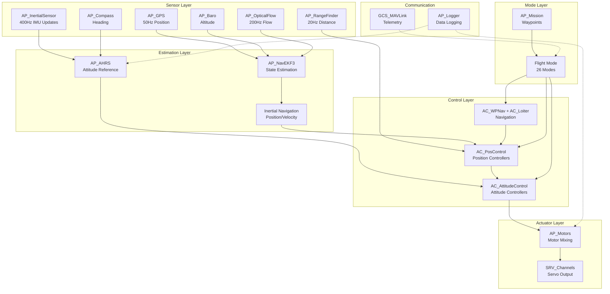
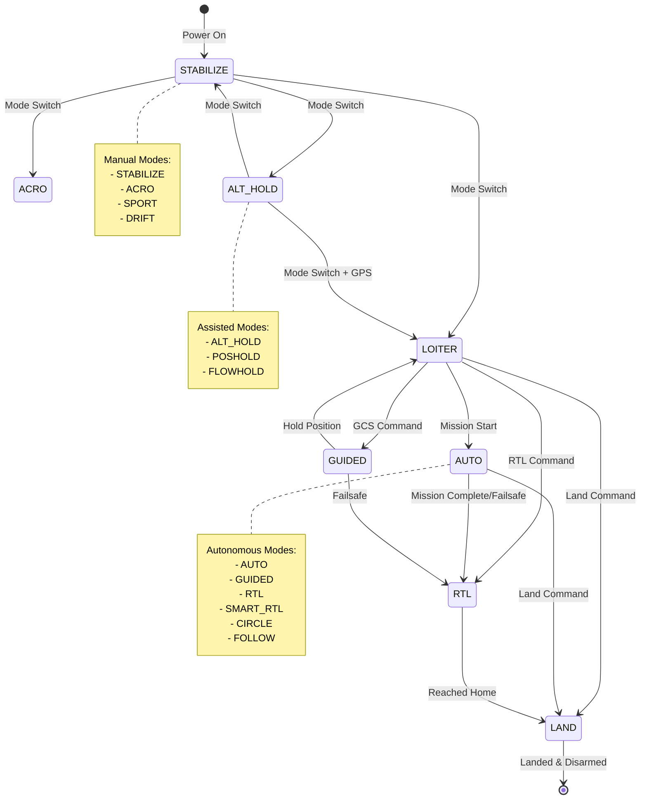
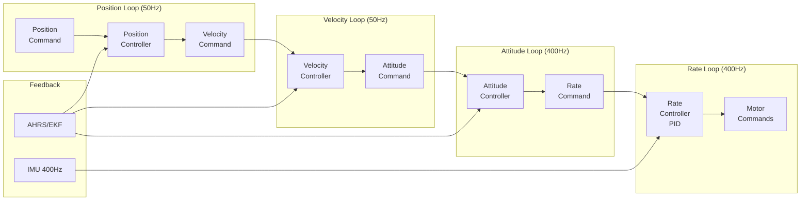

# ArduCopter


## Table of Contents
- [Overview](#overview)
- [System Architecture](#system-architecture)
  - [Main Loop and Scheduler](#main-loop-and-scheduler)
  - [Sensor Integration Pipeline](#sensor-integration-pipeline)
  - [Actuator Output Chain](#actuator-output-chain)
- [Flight Modes](#flight-modes)
- [Safety Systems](#safety-systems)
  - [Failsafe Mechanisms](#failsafe-mechanisms)
  - [Arming Checks](#arming-checks)
  - [Geofence](#geofence)
  - [EKF Health Monitoring](#ekf-health-monitoring)
- [Hardware Integration](#hardware-integration)
  - [Supported Autopilot Boards](#supported-autopilot-boards)
  - [Motor Configuration](#motor-configuration)
  - [RC Setup](#rc-setup)
  - [Sensor Configuration](#sensor-configuration)
- [Control Architecture](#control-architecture)
  - [Attitude Control](#attitude-control)
  - [Position Control](#position-control)
  - [Navigation](#navigation)
- [Communication](#communication)
  - [GCS and MAVLink](#gcs-and-mavlink)
  - [Logging](#logging)
- [Configuration](#configuration)
  - [Parameter Groups](#parameter-groups)
- [Examples and Testing](#examples-and-testing)
- [Related Documentation](#related-documentation)

## Overview

ArduCopter is the multicopter vehicle module of the ArduPilot autopilot software suite, providing comprehensive flight control for:
- **Multirotors**: Quadcopters, hexacopters, octocopters, and other multi-rotor configurations
- **Traditional Helicopters**: Single-rotor helicopters with collective pitch control
- **Tricopters**: Three-rotor vehicles with tilting rear motor
- **Single/Coaxial Copters**: Specialized single and dual-rotor configurations

**Source Files**: `/ArduCopter/`
- **Core Class**: `Copter.h`, `Copter.cpp` - Main vehicle class and scheduler
- **Mode Management**: `mode.h`, `mode.cpp`, `mode_*.cpp` - Flight mode implementations

ArduCopter implements a sophisticated real-time control system running at 400Hz for attitude control, with comprehensive sensor fusion through AP_AHRS and AP_NavEKF3, safety-critical failsafe mechanisms, and support for 26 different flight modes ranging from manual stabilization to fully autonomous waypoint navigation.

**Key Features**:
- **400Hz Main Loop**: Fast attitude and rate control for responsive flight (`Copter.cpp:scheduler_tasks[]`)
- **Extended Kalman Filter**: AP_NavEKF3 for sensor fusion and state estimation
- **Multi-Mode Operation**: 26 flight modes from manual to fully autonomous (`mode.h:Mode::Number`)
- **Safety Critical**: Multiple failsafe layers, pre-arm checks, and health monitoring
- **Hardware Abstraction**: Support for 100+ autopilot boards through AP_HAL
- **MAVLink Protocol**: Full GCS integration with telemetry and mission planning

**Credits** (Source: `Copter.cpp:16-75`):
- **Creator**: Jason Short
- **Lead Developer**: Randy Mackay  
- **Lead Tester**: Marco Robustini
- **Key Contributors**: Leonard Hall (Flight Dynamics), Andrew Tridgell (Core Development), Robert Lefebvre (Heli Support), Pat Hickey (HAL), Andy Piper (Harmonic Notch, DShot), and many more

## System Architecture

ArduCopter is built around the `Copter` class which inherits from `AP_Vehicle` and integrates numerous subsystems through composition and dependency injection.



### Main Loop and Scheduler

ArduCopter uses the AP_Scheduler system to execute tasks at precise intervals. The main loop runs at **400Hz** for the fast attitude control tasks, with other tasks scheduled at appropriate rates.

**Source**: `Copter.cpp:113-250` - `const AP_Scheduler::Task Copter::scheduler_tasks[]`

#### Fast Loop Tasks (400Hz)

These tasks run every loop iteration (2.5ms) for time-critical control:

```cpp
// Source: Copter.cpp:115-149
FAST_TASK_CLASS(AP_InertialSensor, &copter.ins, update),           // IMU data acquisition
FAST_TASK(run_rate_controller_main),                                // Rate controllers (roll/pitch/yaw rates)
FAST_TASK(motors_output_main),                                      // Send outputs to motors/ESCs
FAST_TASK(read_AHRS),                                               // Run EKF state estimator
FAST_TASK(read_inertia),                                            // Inertial navigation update
FAST_TASK(check_ekf_reset),                                         // Check for EKF resets
FAST_TASK(update_flight_mode),                                      // Run attitude controllers for current mode
FAST_TASK(update_home_from_EKF),                                    // Update home position
FAST_TASK(update_land_and_crash_detectors),                         // Safety: landing/crash detection
FAST_TASK(update_rangefinder_terrain_offset),                       // Surface tracking
```

**Key Insight**: The fast loop prioritizes sensor reading → state estimation → control calculation → motor output in a deterministic sequence to minimize latency.

#### Medium-Rate Scheduled Tasks

| Task | Rate (Hz) | Time (μs) | Priority | Description | Source |
|------|-----------|-----------|----------|-------------|--------|
| rc_loop | 250 | 130 | 3 | RC input processing | Copter.cpp:151 |
| throttle_loop | 50 | 75 | 6 | Throttle hover learning | Copter.cpp:152 |
| fence_check | 25 | 100 | 7 | Geofence monitoring | Copter.cpp:154 |
| AP_GPS::update | 50 | 200 | 9 | GPS data processing | Copter.cpp:156 |
| AP_OpticalFlow::update | 200 | 160 | 12 | Optical flow processing | Copter.cpp:158 |
| update_batt_compass | 10 | 120 | 15 | Battery and compass updates | Copter.cpp:160 |
| read_rangefinder | 20 | 100 | 33 | Rangefinder distance | Copter.cpp:170 |
| run_nav_updates | 50 | 100 | 45 | Navigation calculations | Copter.cpp:179 |
| update_throttle_hover | 100 | 90 | 48 | Throttle hover estimate | Copter.cpp:180 |

#### Low-Rate Scheduled Tasks

| Task | Rate (Hz) | Time (μs) | Priority | Description | Source |
|------|-----------|-----------|----------|-------------|--------|
| three_hz_loop | 3 | 75 | 57 | Low-rate updates | Copter.cpp:187 |
| one_hz_loop | 1 | 100 | 81 | 1Hz maintenance | Copter.cpp:200 |
| ekf_check | 10 | 75 | 84 | EKF health monitoring | Copter.cpp:201 |
| check_vibration | 10 | 50 | 87 | Vibration level checks | Copter.cpp:202 |
| gpsglitch_check | 10 | 50 | 90 | GPS consistency checks | Copter.cpp:203 |
| GCS::update_receive | 400 | 180 | 102 | MAVLink message reception | Copter.cpp:210 |
| GCS::update_send | 400 | 550 | 105 | MAVLink message transmission | Copter.cpp:211 |
| ten_hz_logging_loop | 10 | 350 | 114 | Data logging | Copter.cpp:219 |

**Scheduler Configuration** (Source: `Copter.cpp:86-112`):
- **SCHED_TASK**: Macro for defining Copter member function tasks
- **FAST_TASK**: Macro for 400Hz fast loop tasks
- **Priority Ordering**: Lower numbers = higher priority (0-255 range)
- **Execution Time**: Each task has expected execution time for overrun detection

### Sensor Integration Pipeline

ArduCopter integrates data from multiple sensor types through a sophisticated pipeline.

**Source**: `sensors.cpp` - Sensor management and configuration

#### IMU (Inertial Measurement Unit)

**Source**: `Copter.h:40` - `#include <AP_InertialSensor/AP_InertialSensor.h>`

The AP_InertialSensor library provides:
- **Accelerometer** data at 400Hz+ (body-frame acceleration in m/s²)
- **Gyroscope** data at 400Hz+ (body-frame rotation rates in rad/s)
- **Multi-IMU Support**: Up to 3 IMUs with automatic failover
- **Calibration**: Temperature compensation, bias correction, scaling
- **Filtering**: Harmonic notch filters for motor noise rejection

**Update Sequence** (Source: `Copter.cpp:115`):
```cpp
FAST_TASK_CLASS(AP_InertialSensor, &copter.ins, update),  // First task in fast loop
```

#### Barometer

**Source**: `sensors.cpp:4-9` - `void Copter::read_barometer()`

```cpp
void Copter::read_barometer(void)
{
    barometer.update();
    baro_alt = barometer.get_altitude() * 100.0f;  // Convert to centimeters
}
```

- **Purpose**: Provides altitude estimate via atmospheric pressure
- **Units**: Altitude stored in centimeters relative to power-on location
- **Fusion**: Fed into EKF for vertical position estimation

#### GPS

**Source**: `Copter.cpp:156` - GPS scheduled at 50Hz

```cpp
SCHED_TASK_CLASS(AP_GPS, &copter.gps, update, 50, 200, 9),
```

- **Position**: Latitude, longitude, altitude (AMSL and relative)
- **Velocity**: 3D velocity vector
- **Accuracy**: HDOP, satellite count, fix type (2D/3D/RTK)
- **Multi-GPS**: Support for GPS blending and failover
- **RTK Support**: Centimeter-level accuracy with RTK corrections

#### Rangefinder

**Source**: `sensors.cpp:12-78` - Rangefinder initialization and updates

```cpp
// Source: sensors.cpp:12-22
void Copter::init_rangefinder(void)
{
   rangefinder.set_log_rfnd_bit(MASK_LOG_CTUN);
   rangefinder.init(ROTATION_PITCH_270);  // Downward facing
   rangefinder_state.alt_cm_filt.set_cutoff_frequency(g2.rangefinder_filt);
   rangefinder_state.enabled = rangefinder.has_orientation(ROTATION_PITCH_270);
   
   // Upward facing range finder
   rangefinder_up_state.alt_cm_filt.set_cutoff_frequency(g2.rangefinder_filt);
   rangefinder_up_state.enabled = rangefinder.has_orientation(ROTATION_PITCH_90);
}
```

**Features**:
- **Downward Facing** (ROTATION_PITCH_270): Terrain following, precision landing
- **Upward Facing** (ROTATION_PITCH_90): Ceiling avoidance
- **Filtering**: Low-pass filter to reject glitches (configurable cutoff frequency)
- **Terrain Offset**: Tracks terrain height above EKF origin (`sensors.cpp:54-68`)

#### Optical Flow

**Source**: `Copter.cpp:158` - Scheduled at 200Hz

```cpp
SCHED_TASK_CLASS(AP_OpticalFlow, &copter.optflow, update, 200, 160, 12),
```

- **Purpose**: Non-GPS position hold using downward-facing camera
- **Output**: X/Y velocity estimates from optical flow sensor
- **Integration**: Fed into EKF for position estimation in GPS-denied environments
- **Quality**: Automatic quality assessment, requires rangefinder for scaling

#### Compass

**Source**: `Copter.cpp:160` - Combined with battery monitoring

```cpp
SCHED_TASK(update_batt_compass, 10, 120, 15),
```

- **Heading**: Magnetic heading for yaw estimation
- **Calibration**: Offsets, scale factors, motor compensation
- **Multi-Compass**: Up to 3 compasses with priority and health checking
- **Declination**: Automatic magnetic declination correction

### Actuator Output Chain

The actuator chain transforms control commands into motor/servo outputs.

**Source**: `motors.cpp` - Motor control and safety logic

#### Motor Output Sequence

**Source**: `Copter.cpp:125` - Fast loop motor output

```cpp
FAST_TASK(motors_output_main),  // Send outputs to motors library
```

**Detailed Flow** (Source: `motors.cpp:60-80`):

```cpp
void Copter::motors_output(bool full_push)
{
    // Advanced Failsafe vehicle termination check
    #if AP_COPTER_ADVANCED_FAILSAFE_ENABLED
    if (g2.afs.should_crash_vehicle()) {
        g2.afs.terminate_vehicle();
        return;
    }
    #endif
    
    // Update arming delay state
    if (ap.in_arming_delay && (!motors->armed() || 
        millis()-arm_time_ms > ARMING_DELAY_SEC*1.0e3f)) {
        ap.in_arming_delay = false;
    }
    
    // Motor output based on arming state
    // - Armed: Full control output
    // - Disarmed: Motors stopped or spinning at minimum
    motors->output();
}
```

#### Motor Mixing

**Source**: `Copter.h:49` - `#include <AP_Motors/AP_Motors.h>`

The AP_Motors library provides:

- **Motor Classes**:
  - `AP_MotorsMatrix`: Multirotors (quad, hex, octo, custom)
  - `AP_MotorsHeli`: Traditional helicopters
  - `AP_MotorsTri`: Tricopters with tilt servo
  - `AP_MotorsSingle`: Single rotor with control vanes
  - `AP_MotorsCoax`: Coaxial dual rotors

- **Mixing Functions**:
  - **Roll/Pitch/Yaw**: Body rates to individual motor thrusts
  - **Throttle**: Collective thrust command
  - **Output Limiting**: Prevents control saturation
  - **Spool State Machine**: Smooth spin-up/down sequences

#### Auto-Disarm

**Source**: `motors.cpp:10-56` - `void Copter::auto_disarm_check()`

```cpp
// Source: motors.cpp:9-56
// Auto-disarms after sitting on ground with throttle low
void Copter::auto_disarm_check()
{
    uint32_t tnow_ms = millis();
    uint32_t disarm_delay_ms = 1000*constrain_int16(g.disarm_delay, 0, 127);
    
    // Exit if already disarmed or auto-disarm disabled
    if (!motors->armed() || disarm_delay_ms == 0 || 
        flightmode->mode_number() == Mode::Number::THROW) {
        auto_disarm_begin = tnow_ms;
        return;
    }
    
    // Don't disarm if motors are spooling up/running
    if (motors->get_spool_state() > AP_Motors::SpoolState::GROUND_IDLE) {
        auto_disarm_begin = tnow_ms;
        return;
    }
    
    // Disarm after delay expires with throttle low and landed
    if ((tnow_ms-auto_disarm_begin) >= disarm_delay_ms) {
        arming.disarm(AP_Arming::Method::DISARMDELAY);
    }
}
```

**Safety Features**:
- **Configurable Delay**: `disarm_delay` parameter (0-127 seconds)
- **Throttle Check**: Must be at zero/minimum
- **Landing Detection**: Must have `ap.land_complete` flag set
- **Mode Exception**: THROW mode never auto-disarms
- **Shorter Delay**: Half time when using motor interlock or E-Stop

## Flight Modes

ArduCopter supports 26 distinct flight modes, each providing different levels of automation and pilot control.

**Source**: `mode.h:77-109` - `enum class Mode::Number`

**Complete Flight Mode Reference** → See [FLIGHT_MODES.md](FLIGHT_MODES.md) for detailed documentation

### Flight Mode Summary

| Mode # | Name | GPS Required | Auto Throttle | Description | Source |
|--------|------|--------------|---------------|-------------|--------|
| 0 | STABILIZE | No | No | Manual attitude, manual throttle | mode.h:78 |
| 1 | ACRO | No | No | Manual body rates, manual throttle | mode.h:79 |
| 2 | ALT_HOLD | No | Yes | Manual attitude, auto altitude | mode.h:80 |
| 3 | AUTO | Yes | Yes | Fully autonomous waypoint mission | mode.h:81 |
| 4 | GUIDED | Yes | Yes | GCS-controlled position/velocity | mode.h:82 |
| 5 | LOITER | Yes | Yes | Position hold with manual override | mode.h:83 |
| 6 | RTL | Yes | Yes | Return to launch point | mode.h:84 |
| 7 | CIRCLE | Yes | Yes | Orbit around center point | mode.h:85 |
| 9 | LAND | No* | Yes | Autonomous descent and land | mode.h:86 |
| 11 | DRIFT | No | No | Semi-auto position with yaw control | mode.h:87 |
| 13 | SPORT | No | No | Manual earth-frame rates, manual throttle | mode.h:88 |
| 14 | FLIP | No | Yes | Automated flip maneuver | mode.h:89 |
| 15 | AUTOTUNE | Yes | Yes | Automated controller tuning | mode.h:90 |
| 16 | POSHOLD | Yes | Yes | Position hold with brake on release | mode.h:91 |
| 17 | BRAKE | Yes | Yes | Maximum deceleration stop | mode.h:92 |
| 18 | THROW | No | Yes | Throw-to-launch mode | mode.h:93 |
| 19 | AVOID_ADSB | Yes | Yes | Avoidance of ADS-B aircraft | mode.h:94 |
| 20 | GUIDED_NOGPS | No | Yes | Guided mode without GPS | mode.h:95 |
| 21 | SMART_RTL | Yes | Yes | Return via recorded path | mode.h:96 |
| 22 | FLOWHOLD | No | Yes | Optical flow position hold | mode.h:97 |
| 23 | FOLLOW | Yes | Yes | Follow another vehicle | mode.h:98 |
| 24 | ZIGZAG | Yes | Yes | Automated zigzag pattern | mode.h:99 |
| 25 | SYSTEMID | No | Yes | System identification signals | mode.h:100 |
| 26 | AUTOROTATE | No | Yes | Autonomous autorotation (heli) | mode.h:101 |
| 27 | AUTO_RTL | Yes | Yes | AUTO mode performing landing | mode.h:102 |
| 28 | TURTLE | No | No | Flip after crash | mode.h:103 |

*GPS recommended but not strictly required if using other position sources

### Mode State Machine



### Mode Base Class

**Source**: `mode.h:71-150` - `class Mode`

All flight modes inherit from the abstract `Mode` base class:

```cpp
// Source: mode.h:71
class Mode {
public:
    // Returns unique mode number
    virtual Number mode_number() const = 0;
    
    // Mode lifecycle methods
    virtual bool init(bool ignore_checks) { return true; }
    virtual void exit() {};
    virtual void run() = 0;  // Called at 400Hz
    
    // Mode properties
    virtual bool requires_GPS() const = 0;
    virtual bool has_manual_throttle() const = 0;
    virtual bool allows_arming(AP_Arming::Method method) const = 0;
    virtual bool is_autopilot() const { return false; }
    
    // Safety properties
    virtual bool allows_entry_in_rc_failsafe() const { return true; }
    virtual bool crash_check_enabled() const { return true; }
```

**Mode Selection**: Users can assign 6 flight modes to RC channel positions via parameters `FLTMODE1` through `FLTMODE6` (Source: `Copter.h:259-260`).

## Safety Systems

ArduCopter implements multiple layers of safety systems to protect the vehicle and surroundings.

### Failsafe Mechanisms

**Source**: `failsafe.cpp` - Main loop lockup detection and motor safety

#### Main Loop Failsafe

ArduCopter includes a critical failsafe that detects if the main control loop stops running.

**Source**: `failsafe.cpp:35-72` - `void Copter::failsafe_check()`

```cpp
// Called from 1kHz timer interrupt (failsafe.cpp:35-72)
void Copter::failsafe_check()
{
    uint32_t tnow = AP_HAL::micros();
    const uint16_t ticks = scheduler.ticks();
    
    if (ticks != failsafe_last_ticks) {
        // Main loop is running normally
        failsafe_last_ticks = ticks;
        failsafe_last_timestamp = tnow;
        if (in_failsafe) {
            in_failsafe = false;
            LOGGER_WRITE_ERROR(LogErrorSubsystem::CPU, LogErrorCode::FAILSAFE_RESOLVED);
        }
        return;
    }
    
    // Main loop has not run for 2 seconds - CRITICAL FAILURE
    if (!in_failsafe && failsafe_enabled && tnow - failsafe_last_timestamp > 2000000) {
        in_failsafe = true;
        // Reduce motors to minimum (do not immediately disarm for logging)
        if (motors->armed()) {
            motors->output_min();
        }
        LOGGER_WRITE_ERROR(LogErrorSubsystem::CPU, LogErrorCode::FAILSAFE_OCCURRED);
    }
    
    // Disarm motors every second while in failsafe
    if (failsafe_enabled && in_failsafe && tnow - failsafe_last_timestamp > 1000000) {
        failsafe_last_timestamp = tnow;
        if(motors->armed()) {
            motors->armed(false);
            motors->output();
        }
    }
}
```

**Key Features**:
- **Detection**: Monitors scheduler tick counter from 1kHz interrupt
- **Response**: Reduces motors to minimum, then disarms
- **Logging**: Records failsafe entry and resolution for post-flight analysis
- **Timeout**: 2-second detection threshold

#### Radio Failsafe

Triggered when RC transmitter signal is lost or weak:
- **Detection**: No valid RC pulses for configurable timeout (typically 1.5s)
- **Actions**: Configurable via `FS_THR_ENABLE` parameter
  - Continue with mission (AUTO/GUIDED modes)
  - RTL (Return to Launch)
  - Land in place
  - SmartRTL if available

**Parameters**:
- `FS_THR_ENABLE`: Enable/disable radio failsafe
- `FS_THR_VALUE`: PWM value indicating failsafe (typically 975)
- `FS_OPTIONS`: Bitmask for failsafe behavior options

#### Battery Failsafe

Monitors battery voltage and capacity:
- **Low Battery**: Warning to pilot, may trigger RTL
- **Critical Battery**: Forces LAND mode
- **Capacity**: Can trigger based on mAh consumed

**Parameters**:
- `BATT_LOW_VOLT`: Low battery voltage threshold
- `BATT_CRT_VOLT`: Critical battery voltage threshold  
- `BATT_LOW_MAH`: Low battery capacity threshold
- `BATT_CRT_MAH`: Critical battery capacity threshold
- `BATT_FS_LOW_ACT`: Action on low battery (warn/RTL/land/smartRTL)
- `BATT_FS_CRT_ACT`: Action on critical battery (land/terminate)

#### GPS Failsafe

Monitors GPS health and position accuracy:
- **GPS Glitch Detection**: Large jumps in reported position (`gpsglitch_check`)
- **Loss of GPS**: Automatic mode changes if GPS-dependent mode becomes unsafe
- **HDOP Monitoring**: Horizontal dilution of precision thresholds

**Source**: `Copter.cpp:203` - Scheduled at 10Hz

```cpp
SCHED_TASK(gpsglitch_check, 10, 50, 90),
```

#### Ground Control Station (GCS) Failsafe

Triggered when MAVLink heartbeat from GCS is lost:
- **Detection**: No heartbeat for configurable timeout
- **Actions**: RTL, Land, SmartRTL, or Continue
- **Configuration**: `FS_GCS_ENABLE` parameter

#### Crash/Parachute Failsafe

**Crash Detection**:
- Monitors acceleration and attitude for crash indicators
- Automatically disarms motors after crash detected
- Prevents motor damage and fire risk

**Parachute Deployment**:
- Can auto-deploy parachute on altitude loss or high sink rate
- Manual deployment via RC switch
- **Source**: `Copter.h:66` - `#include <AP_Parachute/AP_Parachute.h>`

#### Advanced Failsafe (AFS)

**Source**: `failsafe.cpp:75-84` - AFS periodic check

```cpp
#if AP_COPTER_ADVANCED_FAILSAFE_ENABLED
void Copter::afs_fs_check(void)
{
    g2.afs.check(last_radio_update_ms);  // Perform AFS failsafe checks
}
#endif
```

The Advanced Failsafe system provides additional safety for situations like:
- Loss of GPS+RC combined
- Geofence breaches
- Complete communication loss
- Can trigger vehicle termination in extreme cases (competition use)

### Arming Checks

ArduCopter performs comprehensive pre-arm safety checks before allowing motor arming.

**Source**: `AP_Arming_Copter.cpp` - Pre-arm and arming check implementation

#### Pre-Arm Check Sequence

**Source**: `AP_Arming_Copter.cpp:17-87` - `bool AP_Arming_Copter::run_pre_arm_checks()`

```cpp
bool AP_Arming_Copter::run_pre_arm_checks(bool display_failure)
{
    // Exit if already armed
    if (copter.motors->armed()) {
        return true;
    }
    
    // System initialization check
    if (!hal.scheduler->is_system_initialized()) {
        check_failed(display_failure, "System not initialised");
        return false;
    }
    
    // Check for motor interlock/E-Stop conflict (AP_Arming_Copter.cpp:32-37)
    if (rc().find_channel_for_option(RC_Channel::AUX_FUNC::MOTOR_INTERLOCK) &&
        (rc().find_channel_for_option(RC_Channel::AUX_FUNC::MOTOR_ESTOP) || 
        rc().find_channel_for_option(RC_Channel::AUX_FUNC::ARM_EMERGENCY_STOP))) {
        check_failed(display_failure, "Interlock/E-Stop Conflict");
        passed = false;
    }
    
    // Motor interlock must be disabled to arm (AP_Arming_Copter.cpp:42-45)
    if (copter.ap.using_interlock && copter.ap.motor_interlock_switch) {
        check_failed(display_failure, "Motor Interlock Enabled");
        passed = false;
    }
    
    // Always check motors (AP_Arming_Copter.cpp:52-56)
    char failure_msg[100] {};
    if (!copter.motors->arming_checks(ARRAY_SIZE(failure_msg), failure_msg)) {
        check_failed(display_failure, "Motors: %s", failure_msg);
        passed = false;
    }
    
    // Comprehensive check suite (AP_Arming_Copter.cpp:77-86)
    return parameter_checks(display_failure)
        & oa_checks(display_failure)           // Object avoidance
        & gcs_failsafe_check(display_failure)  // GCS heartbeat
        & winch_checks(display_failure)        // Winch safety
        & rc_throttle_failsafe_checks(display_failure)
        & alt_checks(display_failure)          // Altitude source
        & AP_Arming::pre_arm_checks(display_failure);  // Base class checks
}
```

#### Pre-Arm Check Categories

**Mandatory Checks** (always performed):
1. **System Initialization**: HAL and scheduler ready
2. **Motor Configuration**: Motor mixing and outputs valid
3. **Safety Switch**: Hardware safety switch if present
4. **Mode Validity**: Current mode allows arming

**Standard Checks** (can be disabled via `ARMING_CHECK` parameter):
1. **Barometer**: Healthy altitude readings
2. **Compass**: Calibrated and healthy
3. **GPS**: Valid fix with sufficient satellites (if mode requires)
4. **INS**: IMU calibrated and healthy
5. **Board Voltage**: Within acceptable range
6. **RC Channels**: Valid RC input on all required channels
7. **Rangefinder**: Healthy if being used
8. **Logging**: Logging system functional
9. **Parameters**: All parameters within valid ranges
10. **EKF**: Navigation filter healthy and converged

**Visual Feedback**:
- **LED Patterns**: Indicate arming readiness and specific failures
- **Ground Station**: Detailed failure messages sent via MAVLink
- **Sounds**: Buzzer patterns for different states

#### Throttle Position Check

**Source**: `AP_Arming_Copter.cpp:89-100` - RC throttle validation

The system verifies throttle is at minimum position before arming (unless overridden by GCS/Scripting in specific modes):

```cpp
bool AP_Arming_Copter::rc_throttle_failsafe_checks(bool display_failure) const
{
    if (!check_enabled(Check::RC)) {
        return true;  // Check disabled
    }
    
    // Throttle failsafe check
    // Ensures valid RC input and proper throttle position
    // No-pulses scenario requires proper parameter configuration
```

**Safety Rationale**: Prevents unexpected motor spin-up if pilot is holding throttle high during arming attempt.

### Geofence

The geofence system creates virtual boundaries to contain the vehicle.

**Source**: `fence.cpp` - Geofence monitoring and violation handling  
**Scheduling**: `Copter.cpp:154` - Checked at 25Hz

```cpp
#if AP_FENCE_ENABLED
    SCHED_TASK(fence_check, 25, 100, 7),
#endif
```

**Fence Types**:

1. **Altitude Fence**:
   - Maximum altitude above home
   - Minimum altitude above home (for fixed-wing VTOL)
   - Prevents flying too high or descending too low

2. **Circular Fence**:
   - Maximum horizontal distance from home point
   - Simple radius-based boundary

3. **Polygon Fence**:
   - Complex boundary defined by waypoints
   - Can create inclusion or exclusion zones
   - Multiple polygons supported

**Fence Actions** (configurable):
- **Report Only**: Log violation but take no action
- **RTL**: Return to launch when fence breached
- **Land**: Land in place immediately
- **Brake**: Stop and hold position (if within fence)
- **SmartRTL**: Return via safe path

**Parameters**:
- `FENCE_ENABLE`: Enable/disable fence system
- `FENCE_TYPE`: Bitmask of active fence types
- `FENCE_ALT_MAX`: Maximum altitude (m)
- `FENCE_RADIUS`: Circular fence radius (m)
- `FENCE_ACTION`: Action to take on breach
- `FENCE_MARGIN`: Pre-breach warning margin

### EKF Health Monitoring

The Extended Kalman Filter health is continuously monitored to ensure safe navigation.

**Source**: `ekf_check.cpp` - EKF health monitoring and failover  
**Scheduling**: `Copter.cpp:201` - Checked at 10Hz

```cpp
SCHED_TASK(ekf_check, 10, 75, 84),
```

**Monitored Parameters**:

1. **Position Variance**:
   - Horizontal position uncertainty
   - Vertical position uncertainty
   - Triggers failsafe if exceeds thresholds

2. **Velocity Variance**:
   - Velocity estimate uncertainty
   - Indicates quality of inertial navigation

3. **Compass Variance**:
   - Heading estimate uncertainty
   - Can trigger compass-only mode or failsafe

4. **Innovation Checks**:
   - GPS position innovations (difference between prediction and measurement)
   - Magnetometer innovations
   - Large innovations indicate sensor problems

**Failsafe Actions**:
- **EKF Failsafe**: If variance exceeds `FS_EKF_THRESH` for `FS_EKF_ACTION` time:
  - Land immediately
  - Switch to non-GPS mode if possible
  - Disarm if on ground

**EKF Lane Switching**:
- Multiple EKF "lanes" can run in parallel
- Automatic switching to healthier lane if primary degrades
- Provides redundancy against sensor failures

**Parameters**:
- `EK3_ENABLE`: Enable EKF3
- `FS_EKF_ENABLE`: Enable EKF failsafe
- `FS_EKF_THRESH`: Variance threshold for failsafe trigger
- `FS_EKF_ACTION`: Action to take (land/land even in stabilize/disable)

## Hardware Integration

ArduCopter supports extensive hardware configurations through the AP_HAL (Hardware Abstraction Layer).

### Supported Autopilot Boards

**Source**: `Copter.h:28` - `#include <AP_HAL/AP_HAL.h>`

ArduCopter runs on 100+ autopilot boards through various HAL implementations:

**Primary HAL Platforms**:
- **ChibiOS**: Most ARM-based autopilots (Pixhawk family, Cube, KakuteH7, etc.)
- **Linux**: Raspberry Pi, BeagleBone, NAVIO, etc.
- **SITL**: Software-in-the-loop simulation on desktop

**Popular Board Families**:
1. **Pixhawk Family**: Pixhawk 1/2/4/5/6, PixRacer, various derivatives
2. **Cube Family**: CubeBlack, CubeOrange, CubeYellow, CubePurple
3. **Holybro**: Kakute F4/F7/H7, Durandal
4. **mRo**: ControlZero, x2.1, Nexus
5. **CUAV**: V5+, V5 Nano, Nora
6. **Hex**: Here3, Here Flow

**Board Selection**: Configure at build time using WAF build system:
```bash
./waf configure --board=CubeOrange
./waf copter
```

### Motor Configuration

**Source**: `motors.cpp`, `Copter.h:49` - Motor control integration

#### Frame Types

ArduCopter supports numerous frame configurations via the `FRAME_CLASS` and `FRAME_TYPE` parameters:

**Multirotor Frames** (`FRAME_CLASS=1`):
- **Quad**: X, +, H, V, Wide (most common)
- **Hexa**: X, +, CoaxialX
- **Octa**: X, +, CoaxialX, CoaxialPlus
- **Deca**: X, +, CoaxialX
- **Dodeca**: X, +, CoaxialX
- **Y6**: Y-configuration with coaxial motors

**Traditional Helicopter** (`FRAME_CLASS=6`):
- Single rotor with swashplate control
- Collective pitch and cyclic control
- Requires specialized helicopter firmware configuration
- **Source**: `Copter.h:80-84` - Helicopter motor class selection

```cpp
#if FRAME_CONFIG == HELI_FRAME
 #define MOTOR_CLASS AP_MotorsHeli
#else
 #define MOTOR_CLASS AP_MotorsMulticopter
#endif
```

**Special Frames**:
- **Tricopter**: 3 motors with tilt servo
- **Single/Coaxial**: Single rotor with control fins
- **Bicopter**: Dual motors with tilt servos

#### Motor Mixing

The AP_Motors library converts desired roll, pitch, yaw, and throttle into individual motor outputs:

**Output Calculation**:
```
motor_output[i] = throttle + roll_factor[i] * roll_command + 
                            pitch_factor[i] * pitch_command + 
                            yaw_factor[i] * yaw_command
```

**Motor Limits**:
- **MOT_SPIN_MIN**: Minimum throttle when armed (keeps props spinning)
- **MOT_SPIN_ARM**: Throttle for just barely spinning props  
- **MOT_SPIN_MAX**: Maximum throttle (saturation point)
- **MOT_BAT_VOLT_MAX**: Battery voltage for thrust curve compensation
- **MOT_BAT_VOLT_MIN**: Minimum battery voltage expected

**Thrust Curve**:
- **MOT_THST_EXPO**: Thrust curve exponential (typically 0.55-0.65)
- **MOT_THST_HOVER**: Estimated hover throttle (learned in flight)

#### ESC Protocols

Supported ESC protocols (via `MOT_PWM_TYPE` parameter):
- **Normal PWM**: 50Hz traditional PWM (1000-2000μs)
- **OneShot125**: Fast protocol (125-250μs)
- **OneShot**: Even faster (125μs per 1000 throttle)
- **Brushed**: Brushed motor H-bridge control
- **DShot150/300/600/1200**: Digital ESC protocol with CRC
- **Bi-directional DShot**: DShot with RPM telemetry

**DShot Features**:
- **Digital Protocol**: Immune to PWM noise
- **CRC Protection**: Detects corrupted commands
- **Bi-directional**: Returns motor RPM to autopilot
- **Reversible**: Can run motors backwards (turtle mode)

### RC Setup

**Source**: `radio.cpp` - RC input processing  
**Scheduling**: `Copter.cpp:151` - RC loop at 250Hz

```cpp
SCHED_TASK(rc_loop, 250, 130, 3),
```

**RC Input Protocols**:
- **PPM**: Traditional pulse position modulation (8-16 channels)
- **SBUS**: Futaba serial protocol (16 channels)
- **DSM/DSM2/DSMX**: Spektrum satellite protocols
- **SRXL**: Multiplex serial protocol
- **SUMD**: Graupner serial protocol
- **ST24**: Yuneec ST24 protocol
- **IBUS**: FlySky protocol
- **CRSF**: TBS Crossfire / ExpressLRS
- **GHST**: ImmersionRC Ghost

**RC Channel Mapping**:

**Source**: `Copter.h:249-254` - Primary control channels

```cpp
// Primary input control channels
RC_Channel *channel_roll;
RC_Channel *channel_pitch;
RC_Channel *channel_throttle;
RC_Channel *channel_yaw;
```

**Standard Channel Functions**:
1. **Roll**: Aileron/roll control
2. **Pitch**: Elevator/pitch control
3. **Throttle**: Collective/throttle control
4. **Yaw**: Rudder/yaw control
5. **Flight Mode**: Mode selection switch
6. **Aux Functions**: Configurable auxiliary switches

**Auxiliary Functions** (70+ available):
- **Arm/Disarm**: Motor arming switch
- **RTL**: Return to launch
- **Parachute Deploy**: Manual parachute release
- **Camera Trigger**: Camera shutter control
- **Gripper**: Cargo gripper control
- **Landing Gear**: Retract/extend landing gear
- **Motor Interlock**: Helicopter motor interlock
- **Emergency Stop**: Immediate motor shutdown
- **Arming Check**: Enable/disable arming checks
- Many more...

**RC Deadzone and Expo**:
- **RC_DZ**: Center deadzone for stick inputs
- **Expo**: Exponential curve for control feel
- **Trim**: Manual trim adjustments

### Sensor Configuration

**Source**: `sensors.cpp` - Sensor initialization and updates

#### IMU Configuration

**Calibration Requirements**:
1. **Accelerometer Calibration**: 6-position (up/down/left/right/front/back)
2. **Gyroscope Calibration**: Automatic at boot (vehicle must be stationary)
3. **Temperature Calibration**: Optional for precision applications

**Parameters**:
- **INS_GYRO_FILTER**: Low-pass filter cutoff frequency (Hz)
- **INS_ACCEL_FILTER**: Accelerometer low-pass filter (Hz)
- **INS_USE**: Select which IMUs to use (bitmask)
- **INS_NOTCH_***: Harmonic notch filter for motor noise rejection

#### Compass Configuration

**Calibration**:
- **Compass Dance**: Rotate vehicle in all orientations to map magnetic field
- **Motor Compensation**: Compensate for motor-induced magnetic interference
- **Declination**: Automatic magnetic declination from GPS position

**Parameters**:
- **COMPASS_USE**: Enable each compass (1/2/3)
- **COMPASS_ORIENT**: Compass mounting orientation
- **COMPASS_EXTERNAL**: Mark as external (on GPS mast)
- **COMPASS_MOT_***: Motor interference compensation

#### GPS Configuration

**Parameters**:
- **GPS_TYPE**: GPS receiver type (auto, UBLOX, NMEA, etc.)
- **GPS_TYPE2**: Second GPS type for redundancy
- **GPS_AUTO_SWITCH**: Auto-switch between GPS receivers
- **GPS_BLEND_MASK**: Blend multiple GPS solutions
- **GPS_INJECT_TO**: Inject RTCM corrections for RTK

**RTK GPS**:
- Requires RTK base station or NTRIP connection
- Achieves centimeter-level accuracy
- **RTK Float**: Sub-meter accuracy
- **RTK Fixed**: Centimeter accuracy

## Control Architecture

ArduCopter uses a cascaded control architecture with attitude, velocity, and position control loops.

### Attitude Control

**Source**: `Attitude.cpp` - Attitude and rate controller implementation  
**Library**: `Copter.h:44` - `#include <AC_AttitudeControl/AC_AttitudeControl_Multi.h>`

#### Control Loop Structure



#### Rate Controllers

**Source**: `Attitude.cpp:10-24` - `void Copter::run_rate_controller_main()`

```cpp
void Copter::run_rate_controller_main()
{
    // Set loop time for accurate derivative/integral terms
    const float last_loop_time_s = AP::scheduler().get_last_loop_time_s();
    pos_control->set_dt_s(last_loop_time_s);
    attitude_control->set_dt_s(last_loop_time_s);
    
    if (!using_rate_thread) {
        motors->set_dt_s(last_loop_time_s);
        // Run rate controller at 400Hz
        attitude_control->rate_controller_run();
    }
    // Reset temporary inputs (e.g., from system ID)
    attitude_control->rate_controller_target_reset();
}
```

**Rate Controller Features**:
- **PID Control**: Proportional, Integral, Derivative terms
- **Feed-Forward**: Improves response to commanded rate changes
- **Input Shaping**: Filters to prevent excitation of vehicle resonances
- **Saturation Handling**: Anti-windup and integral limiting

**Tuning Parameters** (per axis: roll/pitch/yaw):
- **ATC_RAT_RLL_P**: Roll rate proportional gain
- **ATC_RAT_RLL_I**: Roll rate integral gain
- **ATC_RAT_RLL_D**: Roll rate derivative gain
- **ATC_RAT_RLL_FF**: Roll rate feed-forward gain
- **ATC_RAT_RLL_FLTD**: D-term filter frequency
- **ATC_RAT_RLL_FLTT**: Target rate filter frequency
- (Similar for pitch and yaw)

#### Angle Controllers

Attitude (angle) controllers produce rate commands from angle errors:

**Features**:
- **P Control**: Proportional angle error to rate command
- **Input Shaping**: Smooth angle command changes
- **Angle Limits**: Configurable maximum roll/pitch angles

**Tuning Parameters**:
- **ATC_ANG_RLL_P**: Roll angle P gain (angle error to rate)
- **ATC_ANG_PIT_P**: Pitch angle P gain  
- **ATC_ANG_YAW_P**: Yaw angle P gain
- **ATC_INPUT_TC**: Input shaping time constant

#### Throttle Control

**Source**: `Attitude.cpp:30-67` - `void Copter::update_throttle_hover()`

Learns the hover throttle automatically:

```cpp
// Source: Attitude.cpp:32-66
void Copter::update_throttle_hover()
{
    // Exit if not armed, landed, or in standby
    if (!motors->armed() || ap.land_complete || standby_active) {
        return;
    }
    
    // Don't update in manual throttle modes
    if (flightmode->has_manual_throttle() || 
        (copter.flightmode->mode_number() == Mode::Number::DRIFT)) {
        return;
    }
    
    // Don't update while climbing/descending
    if (!is_zero(pos_control->get_vel_desired_NEU_cms().z)) {
        return;
    }
    
    // Get vertical velocity
    float vel_d_ms;
    if (!AP::ahrs().get_velocity_D(vel_d_ms, vibration_check.high_vibes)) {
        return;
    }
    
    float throttle = motors->get_throttle();
    
    // Update hover throttle if level hover detected
    // Within ±5° of level, vertical velocity < 0.6m/s
    if ((throttle > 0.0f) && (fabsf(vel_d_ms) < 0.6) &&
        (fabsf(ahrs.get_roll_rad() - attitude_control->get_roll_trim_rad()) < radians(5)) &&
        (labs(ahrs.get_pitch_rad()) < radians(5))) {
        motors->update_throttle_hover(0.01f);  // 1% time constant update
    }
}
```

**Hover Learning**:
- **MOT_THST_HOVER**: Learned hover throttle (0.0-1.0)
- **Automatic Learning**: Updates during level hover
- **Time Constant**: 1% per update for slow convergence
- **Usage**: Improves altitude hold and position control accuracy

### Position Control

**Source**: `Copter.h:47` - `#include <AC_AttitudeControl/AC_PosControl.h>`

The position controller manages 3D position and velocity:

**Control Modes**:
1. **Position Control**: Hold or move to specific position
2. **Velocity Control**: Maintain desired velocity
3. **Acceleration Control**: Direct acceleration commands

**Features**:
- **S-Curve Limits**: Smooth acceleration/deceleration profiles
- **Jerk Limiting**: Limits rate of acceleration change
- **Lean Angle Limiting**: Respects maximum tilt angles
- **Stopping Distance**: Calculates braking distance

**Tuning Parameters**:
- **PSC_POSXY_P**: Horizontal position P gain
- **PSC_POSZ_P**: Vertical position P gain
- **PSC_VELXY_P/I/D**: Horizontal velocity PID gains
- **PSC_VELZ_P/I/D**: Vertical velocity PID gains
- **PSC_ACCZ_P/I/D**: Vertical acceleration PID gains

**Limits**:
- **PSC_ANGLE_MAX**: Maximum lean angle (deg)
- **PSC_VELXY_MAX**: Maximum horizontal velocity (cm/s)
- **PSC_VELZ_MAX**: Maximum vertical velocity (cm/s)
- **PSC_ACCZ_MAX**: Maximum vertical acceleration (cm/s²)

### Navigation

**Source**: `navigation.cpp` - Navigation updates and waypoint following  
**Libraries**: 
- `Copter.h:52` - `#include <AC_WPNav/AC_WPNav.h>` (Waypoint navigation)
- `Copter.h:53` - `#include <AC_WPNav/AC_Loiter.h>` (Loiter control)
- `Copter.h:54` - `#include <AC_WPNav/AC_Circle.h>` (Circle navigation)

**Scheduling**: `Copter.cpp:179` - Navigation updates at 50Hz

```cpp
SCHED_TASK(run_nav_updates, 50, 100, 45),
```

#### Waypoint Navigation (AC_WPNav)

Handles autonomous navigation between waypoints:

**Features**:
- **Straight-line Paths**: Direct routes between waypoints
- **Spline Paths**: Smooth curved paths through waypoints
- **Speed Control**: Automatic speed adjustments for corners
- **Altitude Transitions**: Smooth vertical path planning
- **Terrain Following**: Maintain constant height above terrain

**Parameters**:
- **WPNAV_SPEED**: Horizontal waypoint speed (cm/s)
- **WPNAV_SPEED_DN**: Maximum descent speed (cm/s)
- **WPNAV_SPEED_UP**: Maximum climb speed (cm/s)
- **WPNAV_RADIUS**: Waypoint completion radius (cm)
- **WPNAV_ACCEL**: Horizontal acceleration (cm/s²)

#### Loiter Control (AC_Loiter)

Maintains position during hover:

**Features**:
- **Wind Compensation**: Adjusts for wind drift
- **GPS Position Hold**: Maintains GPS coordinates
- **Brake on Stop**: Rapid deceleration when releasing sticks
- **Pilot Override**: Smooth transition between manual and auto hold

**Parameters**:
- **LOIT_SPEED**: Maximum loiter speed with pilot input (cm/s)
- **LOIT_ACC_MAX**: Maximum loiter acceleration (cm/s²)
- **LOIT_BRK_ACCEL**: Braking acceleration (cm/s²)
- **LOIT_BRK_DELAY**: Brake delay time (sec)
- **LOIT_BRK_JERK**: Braking jerk limit (m/s³)

#### Circle Mode (AC_Circle)

Flies in circles around a center point:

**Features**:
- **Configurable Radius**: Set circle diameter
- **Configurable Rate**: Control rotation speed
- **Direction Control**: Clockwise or counter-clockwise
- **Pilot Control**: Can adjust radius and rate in flight

**Parameters**:
- **CIRCLE_RADIUS**: Circle radius (cm)
- **CIRCLE_RATE**: Circle rate (deg/s)
- **CIRCLE_OPTIONS**: Options bitmask

## Communication

### GCS and MAVLink

**Source**: `GCS_MAVLink_Copter.cpp` - MAVLink message handling  
**Header**: `Copter.h:92` - `#include "GCS_MAVLink_Copter.h"`

**Scheduling**: `Copter.cpp:210-211` - MAVLink at 400Hz

```cpp
SCHED_TASK_CLASS(GCS, (GCS*)&copter._gcs, update_receive, 400, 180, 102),
SCHED_TASK_CLASS(GCS, (GCS*)&copter._gcs, update_send, 400, 550, 105),
```

#### MAVLink Protocol

ArduCopter implements the MAVLink 2.0 protocol for communication with ground control stations:

**Message Categories**:

1. **Telemetry Streams**:
   - **RAW_SENSORS**: IMU, mag, baro raw data
   - **EXTENDED_STATUS**: Battery, failsafe, GPS status
   - **RC_CHANNELS**: RC input values
   - **POSITION**: GPS position and velocity
   - **EXTRA1**: Attitude (roll/pitch/yaw)
   - **EXTRA2**: VFR HUD (airspeed, groundspeed, alt, climb)
   - **EXTRA3**: AHRS, hardware status, wind
   - **ADSB**: ADS-B traffic information

2. **Mission Protocol**:
   - Waypoint upload/download
   - Mission count, items, request list
   - Rally point management
   - Fence point management

3. **Parameter Protocol**:
   - Parameter list request
   - Parameter get/set
   - Parameter value messages

4. **Command Protocol**:
   - MAV_CMD_* long commands
   - Mode changes
   - Arm/disarm commands
   - Takeoff/land commands
   - DO_* mission commands

**Stream Rates**: Configurable via `SRx_*` parameters:
- **SR0_**: Serial port 0 rates
- **SR1_**: Serial port 1 rates  
- **SR2_**: Serial port 2 rates (typically telemetry)

**Typical GCS Features**:
- Real-time telemetry display
- Mission planning and upload
- Parameter configuration
- Pre-flight checks and calibration
- Log download and analysis
- Video integration

#### Ground Control Stations

Compatible GCS applications:
- **Mission Planner** (Windows): Full-featured GCS
- **QGroundControl** (Cross-platform): Modern Qt-based GCS
- **APM Planner 2**: Cross-platform GCS
- **MAVProxy**: Command-line GCS and developer tool
- **Tower** (Android): Mobile GCS
- **SidePilot** (iOS): iOS GCS

### Logging

**Source**: `Log.cpp` - Data logging implementation  
**Scheduling**: `Copter.cpp:219-221` - Logging tasks

```cpp
SCHED_TASK(ten_hz_logging_loop, 10, 350, 114),
SCHED_TASK(twentyfive_hz_logging, 25, 110, 117),
SCHED_TASK_CLASS(AP_Logger, &copter.logger, periodic_tasks, 400, 300, 120),
```

**Log Message Types**:
- **ATT**: Attitude (roll/pitch/yaw)
- **PSCN/PSCE**: North/East position controller
- **PSCD**: Down position controller
- **RATE**: Rate controller outputs
- **RCIN**: RC input values
- **RCOUT**: Servo/motor outputs
- **BARO**: Barometer measurements
- **GPS**: GPS data and health
- **IMU**: IMU sensor data
- **MAG**: Magnetometer data
- **CTUN**: Control tuning (climb rate, throttle)
- **NTUN**: Navigation tuning (desired vs actual position/velocity)
- **PM**: Performance monitoring (loop time, memory)
- **MODE**: Mode changes
- **EKF**: EKF variances and innovations
- **XKF**: Extended EKF detailed data
- **ERR**: Error messages and failsafes

**Logging Configuration**:
- **LOG_BITMASK**: Controls which message types are logged
- **LOG_FILE_DSRMROT**: Auto-delete logs on disarm
- **LOG_DISARMED**: Log while disarmed
- **LOG_REPLAY**: Enable replay-compatible logging

**Log Download**:
- Download via MAVLink through GCS
- Direct access via SD card removal
- Analyze with Mission Planner, MAVExplorer, or UAV Log Viewer

## Configuration

### Parameter Groups

**Source**: `Parameters.h` - Parameter definitions  
**Source**: `Parameters.cpp` - Parameter initialization and info

ArduCopter uses the AP_Param system for persistent parameter storage in EEPROM/Flash.

**Parameter Structure** (Source: `Parameters.h:18`):

```cpp
class Parameters {
public:
    static const uint16_t k_format_version = 120;  // Current param format
```

**Major Parameter Groups** (Source: `Parameters.h:49-100`):

| Group | Key | Description | Source |
|-------|-----|-------------|--------|
| FORMAT_VERSION | 0 | Parameter format version | Parameters.h:52 |
| AP_InertialSensor | 4 | IMU configuration and calibration | Parameters.h:55 |
| AP_NavEKF2 | 6 | EKF2 configuration (legacy) | Parameters.h:57 |
| ParametersG2 | 7 | Second parameter block | Parameters.h:58 |
| AP_NavEKF3 | 8 | EKF3 configuration | Parameters.h:59 |
| AP_CANManager | 9 | CAN bus configuration | Parameters.h:60 |
| AP_OSD | 10 | On-screen display | Parameters.h:61 |
| AP_SITL | 10 | Simulation parameters | Parameters.h:64 |
| AP_Baro | 11 | Barometer | Parameters.h:67 |
| AP_Scheduler | 12 | Scheduler tuning | Parameters.h:70 |
| AP_Relay | 13 | Relay outputs | Parameters.h:73 |
| BoardConfig | 15 | Board-specific config | Parameters.h:79 |
| AP_GPS | 17 | GPS configuration | Parameters.h:82 |
| AP_Parachute | 18 | Parachute deployment | Parameters.h:85 |
| AP_LandingGear | 19 | Landing gear control | Parameters.h:88 |
| AC_InputManager | 20 | Pilot input processing | Parameters.h:91 |

**Key Copter Parameters** (subset):

**Basic Configuration**:
- `SYSID_THISMAV`: MAVLink system ID (1-255)
- `FRAME_CLASS`: Vehicle frame class (quad/hexa/octo/heli/etc.)
- `FRAME_TYPE`: Specific frame configuration (X/+/H/etc.)

**Flight Modes**:
- `FLTMODE1-6`: Flight mode for each RC switch position
- `FLTMODE_CH`: RC channel for mode selection

**RC Configuration**:
- `RC1_MIN/MAX/TRIM`: RC channel 1 calibration (repeat for channels 2-16)
- `RC1_OPTION`: Auxiliary function for channel 1 (repeat for all)

**Arming**:
- `ARMING_CHECK`: Bitmask of enabled pre-arm checks
- `DISARM_DELAY`: Auto-disarm delay after landing (seconds)

**Failsafe**:
- `FS_THR_ENABLE`: Radio failsafe enable
- `FS_THR_VALUE`: Radio failsafe PWM threshold
- `FS_GCS_ENABLE`: GCS failsafe enable
- `FS_EKF_ENABLE`: EKF failsafe enable
- `BATT_FS_LOW_ACT`: Low battery action
- `BATT_FS_CRT_ACT`: Critical battery action

**Control Tuning**:
- `ATC_RAT_RLL_*`: Roll rate controller gains
- `ATC_RAT_PIT_*`: Pitch rate controller gains  
- `ATC_RAT_YAW_*`: Yaw rate controller gains
- `ATC_ANG_*`: Attitude controller gains
- `PSC_*`: Position controller gains
- `WPNAV_*`: Navigation controller parameters

**Motors**:
- `MOT_PWM_TYPE`: ESC protocol
- `MOT_SPIN_MIN/MAX/ARM`: Motor spin parameters
- `MOT_THST_EXPO`: Thrust curve exponent
- `MOT_THST_HOVER`: Hover throttle estimate

**Safety**:
- `FENCE_ENABLE`: Enable geofence
- `FENCE_TYPE`: Fence types active
- `FENCE_ALT_MAX`: Maximum altitude
- `FENCE_RADIUS`: Maximum radius

**Parameter Management**:
- Stored in EEPROM/Flash for persistence
- Can be backed up to SD card
- Uploaded/downloaded via GCS
- Organized in param files (*.param, *.parm)

## Examples and Testing

### Example Usage

**Typical Flight Sequence**:

1. **Pre-Flight**:
   ```
   - Power on autopilot
   - Wait for GPS lock (3D fix, 6+ satellites)
   - Wait for EKF to initialize (LED pattern changes)
   - Perform pre-arm checks
   - Verify correct flight mode (STABILIZE recommended)
   ```

2. **Arming**:
   ```
   - Check for pre-arm check failures (LED/GCS messages)
   - Arm via RC stick command (throttle low, yaw right)
   - Or arm via GCS button
   - Motors will spin at minimum
   ```

3. **Takeoff** (Manual):
   ```
   - Switch to STABILIZE or ALT_HOLD
   - Slowly increase throttle
   - Hover at low altitude initially
   - Test controls gently
   ```

4. **Flight**:
   ```
   - Switch to desired flight mode (LOITER, AUTO, GUIDED, etc.)
   - Monitor battery and telemetry
   - Stay within RC range and line of sight
   ```

5. **Landing**:
   ```
   - Return to launch area
   - Switch to LAND mode or manually descend
   - Reduce throttle smoothly
   - Motors will disarm automatically after touchdown
   ```

6. **Post-Flight**:
   ```
   - Download logs via GCS
   - Check for errors or warnings
   - Inspect airframe for damage
   - Review flight performance
   ```

### SITL Testing

**Source**: Referenced in `Tools/autotest/arducopter.py`

ArduCopter includes comprehensive Software-In-The-Loop (SITL) simulation:

**Running SITL**:
```bash
# Basic SITL with default copter
sim_vehicle.py -v ArduCopter --console --map

# Specify frame type
sim_vehicle.py -v ArduCopter -f quad --console --map

# Different frame types available:
# quad, X, hexa, octa, tri, y6, djix, cwx, dodecahexa, etc.
```

**SITL Features**:
- Full physics simulation
- Simulated sensors (GPS, IMU, baro, compass, rangefinder, optical flow)
- Customizable vehicle parameters
- Terrain and obstacle simulation
- Multi-vehicle simulation
- Hardware-in-the-loop (HIL) support

**Autotest Framework**:
```bash
# Run full autotest suite
Tools/autotest/autotest.py --vehicle ArduCopter

# Run specific test
Tools/autotest/autotest.py -b ArduCopter.Tests.ArmFeatures
```

**Test Coverage**:
- Arming checks
- All flight modes
- Failsafe scenarios
- Mission execution
- Geofence violations
- Battery failsafes
- GPS glitches
- Motor failures
- And 100+ more test cases

### Flight Mode Examples

**Example: LOITER Mode Usage**:
```
1. Ensure GPS has 3D lock
2. Switch to LOITER mode
3. Release sticks - copter holds position
4. Push stick - copter moves in that direction
5. Release stick - copter stops and holds new position
6. Works in wind (automatic wind compensation)
```

**Example: AUTO Mission**:
```
1. Plan mission in GCS (waypoints, altitude, speed)
2. Upload mission to copter
3. Arm copter in LOITER or AUTO
4. Raise throttle to takeoff altitude (or use AUTO takeoff waypoint)
5. Switch to AUTO mode
6. Copter executes mission waypoints
7. Returns to launch after last waypoint (if RTL included)
```

**Example: RTL (Return to Launch)**:
```
1. Switch to RTL at any time during flight
2. Copter climbs to RTL_ALT altitude (if below)
3. Flies direct path home
4. Descends at RTL_SPEED
5. Lands automatically
6. Disarms after RTL_DISARM_DELAY
```

## Related Documentation

### ArduCopter-Specific Documentation
- **[FLIGHT_MODES.md](FLIGHT_MODES.md)** - Detailed documentation of all 26 flight modes
- **mode_*.cpp** - Individual flight mode implementations in `/ArduCopter/`

### Library Documentation
- **[/libraries/AP_HAL/README.md](/libraries/AP_HAL/README.md)** - Hardware Abstraction Layer
- **[/libraries/AP_InertialSensor/README.md](/libraries/AP_InertialSensor/README.md)** - IMU drivers
- **[/libraries/AP_Motors/README.md](/libraries/AP_Motors/README.md)** - Motor control and mixing
- **[/libraries/AP_NavEKF3/README.md](/libraries/AP_NavEKF3/README.md)** - Extended Kalman Filter
- **[/libraries/AC_AttitudeControl/README.md](/libraries/AC_AttitudeControl/README.md)** - Attitude controllers
- **[/libraries/GCS_MAVLink/README.md](/libraries/GCS_MAVLink/README.md)** - MAVLink implementation
- **[/libraries/AP_GPS/README.md](/libraries/AP_GPS/README.md)** - GPS drivers
- **[/libraries/AP_Mission/README.md](/libraries/AP_Mission/README.md)** - Mission management

### System-Wide Documentation
- **[/BUILD_SYSTEM.md](/BUILD_SYSTEM.md)** - Build system and compilation
- **[/docs/ARCHITECTURE.md](/docs/ARCHITECTURE.md)** - Overall system architecture
- **[/docs/COORDINATE_SYSTEMS.md](/docs/COORDINATE_SYSTEMS.md)** - Frame conventions (NED/NEU)
- **[/docs/SAFETY_CRITICAL.md](/docs/SAFETY_CRITICAL.md)** - Safety-critical code paths

### Online Resources
- **Wiki**: https://copter.ardupilot.org/
- **Forum**: https://discuss.ardupilot.org/c/arducopter
- **GitHub**: https://github.com/ArduPilot/ardupilot
- **Discord**: https://ardupilot.org/discord

---

**Document Version**: 1.0  
**Last Updated**: 2024  
**Maintainer**: ArduPilot Development Team  
**License**: GPLv3

