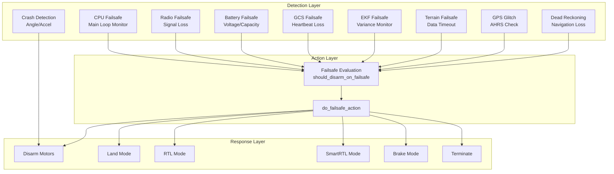

# ArduCopter Failsafe System Documentation


## Table of Contents
- [Overview](#overview)
- [Failsafe System Architecture](#failsafe-system-architecture)
- [CPU Failsafe](#cpu-failsafe)
- [Radio Failsafe](#radio-failsafe)
- [Battery Failsafe](#battery-failsafe)
- [GCS Failsafe](#gcs-failsafe)
- [EKF Failsafe](#ekf-failsafe)
- [Terrain Failsafe](#terrain-failsafe)
- [GPS Glitch Detection](#gps-glitch-detection)
- [Dead Reckoning Failsafe](#dead-reckoning-failsafe)
- [Crash Detection](#crash-detection)
- [Thrust Loss Detection](#thrust-loss-detection)
- [Advanced Failsafe System](#advanced-failsafe-system)
- [Failsafe Actions and Priorities](#failsafe-actions-and-priorities)
- [Failsafe Options](#failsafe-options)
- [Configuration Parameters](#configuration-parameters)
- [Testing and Validation](#testing-and-validation)

---

## Overview

The ArduCopter failsafe system provides multiple layers of protection to detect and respond to various failure conditions during flight. The system is designed to maintain safe operation and initiate appropriate recovery actions when anomalies are detected.

**Source Files**: 
- `/ArduCopter/failsafe.cpp` - Core CPU failsafe
- `/ArduCopter/events.cpp` - Event-based failsafes (Radio, Battery, GCS, Terrain, GPS, Dead Reckoning)
- `/ArduCopter/crash_check.cpp` - Crash and thrust loss detection
- `/ArduCopter/ekf_check.cpp` - EKF health monitoring
- `/ArduCopter/radio.cpp` - Radio input and throttle failsafe detection
- `/ArduCopter/afs_copter.cpp` - Advanced Failsafe System
- `/ArduCopter/AP_Arming_Copter.cpp` - Pre-arm failsafe checks

### Failsafe Philosophy

The failsafe system follows these core principles:

1. **Defense in Depth**: Multiple independent detection mechanisms
2. **Progressive Response**: Warnings before critical actions
3. **Safe Defaults**: Conservative failsafe actions when uncertain
4. **User Control**: Configurable responses for different scenarios
5. **Logging**: All failsafe events are logged for post-flight analysis

---

## Failsafe System Architecture



**Source**: `/ArduCopter/events.cpp:do_failsafe_action()` (lines 474-513)

---

## CPU Failsafe

The CPU failsafe monitors the main loop execution to detect system lockups or severe performance degradation.

### Detection Mechanism

**Source**: `/ArduCopter/failsafe.cpp:failsafe_check()` (lines 35-72)

The CPU failsafe runs from a 1kHz timer interrupt and checks if the main loop scheduler is advancing:

```cpp
// Called at 1kHz from timer interrupt
void Copter::failsafe_check()
{
    const uint16_t ticks = scheduler.ticks();
    if (ticks != failsafe_last_ticks) {
        // Main loop is running normally
        failsafe_last_ticks = ticks;
        failsafe_last_timestamp = tnow;
        return;
    }
    
    if (tnow - failsafe_last_timestamp > 2000000) {
        // 2 seconds without main loop advancement
        in_failsafe = true;
        motors->output_min();  // Reduce motors to minimum
        LOGGER_WRITE_ERROR(LogErrorSubsystem::CPU, LogErrorCode::FAILSAFE_OCCURRED);
    }
}
```

### Behavior

1. **Detection Time**: 2 seconds of main loop stall triggers failsafe
2. **Initial Action**: Motors reduced to minimum output (not immediate disarm to allow logging)
3. **Sustained Action**: Motors disarmed every second while in CPU failsafe
4. **Recovery**: Automatic recovery when main loop resumes

### Key Constants

- **Trigger Threshold**: 2,000,000 microseconds (2 seconds) without scheduler advancement
- **Disarm Interval**: 1,000,000 microseconds (1 second) between disarm attempts

**Source**: `/ArduCopter/failsafe.cpp` (lines 51-71)

---

## Radio Failsafe

The radio failsafe system detects loss of RC transmitter signal through two mechanisms: throttle value monitoring and signal timeout.

### Detection Mechanisms

#### 1. Throttle-Based Detection (PWM Value)

**Source**: `/ArduCopter/radio.cpp:set_throttle_and_failsafe()` (lines 128-164)

Monitors throttle PWM value and triggers failsafe when below configured threshold:

```cpp
#define FS_COUNTER 3  // 3 consecutive low throttle readings required

void Copter::set_throttle_and_failsafe(uint16_t throttle_pwm)
{
    if (throttle_pwm < (uint16_t)g.failsafe_throttle_value) {
        failsafe.radio_counter++;
        if (failsafe.radio_counter >= FS_COUNTER) {
            set_failsafe_radio(true);  // Trigger failsafe
        }
    } else {
        failsafe.radio_counter--;  // Good throttle, reduce counter
        if (failsafe.radio_counter <= 0 && failsafe.radio) {
            set_failsafe_radio(false);  // Clear failsafe
        }
    }
}
```

**Hysteresis**: Requires 3 consecutive readings below threshold to trigger, preventing false positives from glitches.

#### 2. Signal Timeout Detection

**Source**: `/ArduCopter/radio.cpp:read_radio()` (lines 82-125)

Monitors time since last valid RC frame:

```cpp
void Copter::read_radio()
{
    const uint32_t elapsed_ms = tnow_ms - last_radio_update_ms;
    
    if (elapsed_ms < rc().get_fs_timeout_ms()) {
        return;  // Still receiving updates
    }
    
    // Timeout exceeded
    if (g.failsafe_throttle && (rc().has_ever_seen_rc_input() || motors->armed())) {
        LOGGER_WRITE_ERROR(LogErrorSubsystem::RADIO, LogErrorCode::RADIO_LATE_FRAME);
        set_failsafe_radio(true);
    }
}
```

### Failsafe Actions

**Source**: `/ArduCopter/events.cpp:failsafe_radio_on_event()` (lines 13-79)

When radio failsafe triggers, the system evaluates the appropriate action:

```cpp
void Copter::failsafe_radio_on_event()
{
    FailsafeAction desired_action;
    
    // Determine action based on FS_THR_ENABLE parameter
    switch (g.failsafe_throttle) {
        case FS_THR_DISABLED:
            desired_action = FailsafeAction::NONE;
            break;
        case FS_THR_ENABLED_ALWAYS_RTL:
            desired_action = FailsafeAction::RTL;
            break;
        case FS_THR_ENABLED_ALWAYS_SMARTRTL_OR_RTL:
            desired_action = FailsafeAction::SMARTRTL;
            break;
        case FS_THR_ENABLED_ALWAYS_LAND:
            desired_action = FailsafeAction::LAND;
            break;
        // ... additional cases
    }
    
    // Override action if on ground
    if (should_disarm_on_failsafe()) {
        arming.disarm(AP_Arming::Method::RADIOFAILSAFE);
        desired_action = FailsafeAction::NONE;
    }
    
    do_failsafe_action(desired_action, ModeReason::RADIO_FAILSAFE);
}
```

### Special Conditions

The radio failsafe logic includes several override conditions:

1. **On Ground**: Disarm motors immediately if `should_disarm_on_failsafe()` returns true
2. **Landing In Progress**: Continue landing if battery failsafe also active or `FS_OPTIONS` bit set
3. **AUTO Mode**: Continue mission if `FS_OPTIONS` bit 7 (`RC_CONTINUE_IF_AUTO`) is set
4. **Guided Mode**: Continue guided commands if `FS_OPTIONS` bit 8 (`RC_CONTINUE_IF_GUIDED`) is set

**Source**: `/ArduCopter/events.cpp` (lines 47-75)

### Recovery

**Source**: `/ArduCopter/events.cpp:failsafe_radio_off_event()` (lines 82-88)

When radio signal is restored:
- Failsafe flag cleared
- GCS notification sent
- Pilot regains manual control (can override current mode)
- Previous flight mode NOT automatically restored

### Configuration Parameters

| Parameter | Description | Default | Valid Range |
|-----------|-------------|---------|-------------|
| `FS_THR_ENABLE` | Radio failsafe action | 1 | 0-8 |
| `FS_THR_VALUE` | Throttle PWM failsafe threshold | 975 | 925-1100 |
| `RC_FS_TIMEOUT` | Signal timeout (seconds) | 1.0 | 0.1-10.0 |
| `FS_OPTIONS` | Failsafe behavior options (bitmask) | 0 | 0-2047 |

**Parameter Source**: `/ArduCopter/Parameters.cpp` (FS_THR_* parameters)

---

## Battery Failsafe

The battery failsafe system monitors battery voltage and remaining capacity to prevent over-discharge and ensure safe landing.

### Detection Mechanism

Battery monitoring is handled by the `AP_BattMonitor` library, which triggers failsafe events when thresholds are exceeded.

**Source**: `/ArduCopter/events.cpp:handle_battery_failsafe()` (lines 99-123)

### Failsafe Levels

The battery system supports two failsafe levels:

1. **Low Battery**: Warning level, typically triggers RTL
2. **Critical Battery**: Emergency level, typically triggers immediate landing

### Failsafe Actions

```cpp
void Copter::handle_battery_failsafe(const char *type_str, const int8_t action)
{
    LOGGER_WRITE_ERROR(LogErrorSubsystem::FAILSAFE_BATT, LogErrorCode::FAILSAFE_OCCURRED);
    
    FailsafeAction desired_action = (FailsafeAction)action;
    
    // Check if on ground
    if (should_disarm_on_failsafe()) {
        arming.disarm(AP_Arming::Method::BATTERYFAILSAFE);
        desired_action = FailsafeAction::NONE;
        announce_failsafe("Battery", "Disarming");
    }
    // Allow landing to continue if FS_OPTIONS bit 0 set
    else if (flightmode->is_landing() && 
             failsafe_option(FailsafeOption::CONTINUE_IF_LANDING)) {
        desired_action = FailsafeAction::LAND;
        announce_failsafe("Battery", "Continuing Landing");
    }
    
    do_failsafe_action(desired_action, ModeReason::BATTERY_FAILSAFE);
}
```

### Interaction with Other Failsafes

Battery failsafe has **highest priority** when landing:

**Source**: `/ArduCopter/events.cpp` (lines 53-56, 208-211)

```cpp
// Radio and GCS failsafes defer to battery failsafe during landing
if (flightmode->is_landing() && 
    battery.has_failsafed() && 
    battery.get_highest_failsafe_priority() <= FAILSAFE_LAND_PRIORITY) {
    // Continue landing (battery requirement overrides RC/GCS failsafe)
    desired_action = FailsafeAction::LAND;
}
```

### Configuration Parameters

| Parameter | Description | Default | Valid Range |
|-----------|-------------|---------|-------------|
| `BATT_LOW_VOLT` | Low battery voltage threshold | 10.5V | 0-50V |
| `BATT_CRT_VOLT` | Critical battery voltage threshold | 10.0V | 0-50V |
| `BATT_LOW_MAH` | Low battery capacity threshold | 0 mAh | 0-50000 |
| `BATT_CRT_MAH` | Critical battery capacity threshold | 0 mAh | 0-50000 |
| `BATT_FS_LOW_ACT` | Low battery failsafe action | 2 (RTL) | 0-6 |
| `BATT_FS_CRT_ACT` | Critical battery failsafe action | 1 (Land) | 0-6 |

**Note**: Voltage-based monitoring is active by default; capacity-based monitoring requires `BATT_CAPACITY` to be set.

---

## GCS Failsafe

The Ground Control Station (GCS) failsafe detects loss of telemetry connection with the ground station.

### Detection Mechanism

**Source**: `/ArduCopter/events.cpp:failsafe_gcs_check()` (lines 125-160)

Monitors MAVLink heartbeat messages from the GCS:

```cpp
void Copter::failsafe_gcs_check()
{
    // Skip if disabled or GCS never connected
    if (g.failsafe_gcs == FS_GCS_DISABLED || gcs_last_seen_ms == 0) {
        return;
    }
    
    const uint32_t last_gcs_update_ms = millis() - gcs_last_seen_ms;
    const uint32_t gcs_timeout_ms = g2.fs_gcs_timeout * 1000.0f;
    
    if (last_gcs_update_ms > gcs_timeout_ms && !failsafe.gcs) {
        set_failsafe_gcs(true);
        failsafe_gcs_on_event();
    }
    else if (last_gcs_update_ms < gcs_timeout_ms && failsafe.gcs) {
        set_failsafe_gcs(false);
        failsafe_gcs_off_event();
    }
}
```

### Failsafe Actions

**Source**: `/ArduCopter/events.cpp:failsafe_gcs_on_event()` (lines 162-233)

```cpp
void Copter::failsafe_gcs_on_event(void)
{
    LOGGER_WRITE_ERROR(LogErrorSubsystem::FAILSAFE_GCS, LogErrorCode::FAILSAFE_OCCURRED);
    
    // Clear any RC overrides from GCS
    RC_Channels::clear_overrides();
    
    // Determine action based on FS_GCS_ENABLE parameter
    switch (g.failsafe_gcs) {
        case FS_GCS_ENABLED_ALWAYS_RTL:
            desired_action = FailsafeAction::RTL;
            break;
        case FS_GCS_ENABLED_ALWAYS_SMARTRTL_OR_RTL:
            desired_action = FailsafeAction::SMARTRTL;
            break;
        case FS_GCS_ENABLED_ALWAYS_LAND:
            desired_action = FailsafeAction::LAND;
            break;
        // ... additional cases
    }
    
    // Special conditions (similar to radio failsafe)
    if (!motors->armed()) {
        desired_action = FailsafeAction::NONE;
    }
    else if (should_disarm_on_failsafe()) {
        arming.disarm(AP_Arming::Method::GCSFAILSAFE);
        desired_action = FailsafeAction::NONE;
    }
    
    do_failsafe_action(desired_action, ModeReason::GCS_FAILSAFE);
}
```

### Special Conditions

1. **Disarmed**: No action taken if motors not armed
2. **On Ground**: Immediate disarm if `should_disarm_on_failsafe()` returns true
3. **AUTO Mode**: Can continue mission if `FS_OPTIONS` bit 5 (`GCS_CONTINUE_IF_AUTO`) is set
4. **Pilot Control**: Can continue if `FS_OPTIONS` bit 4 (`GCS_CONTINUE_IF_PILOT_CONTROL`) is set and in manual mode

**Source**: `/ArduCopter/events.cpp` (lines 198-229)

### Recovery

**Source**: `/ArduCopter/events.cpp:failsafe_gcs_off_event()` (lines 236-240)

When GCS heartbeat is restored:
- Failsafe flag cleared
- GCS notification sent
- Vehicle continues in current mode (does not auto-resume previous mode)

### Configuration Parameters

| Parameter | Description | Default | Valid Range |
|-----------|-------------|---------|-------------|
| `FS_GCS_ENABLE` | GCS failsafe action | 0 (Disabled) | 0-8 |
| `FS_GCS_TIMEOUT` | GCS heartbeat timeout (seconds) | 5.0 | 0.1-120 |
| `SYSID_MYGCS` | GCS MAVLink system ID to monitor | -1 (any) | -1-255 |

---

## EKF Failsafe

The Extended Kalman Filter (EKF) failsafe monitors the health of the navigation filter and triggers when variance thresholds are exceeded, indicating unreliable position/velocity estimates.

### Detection Mechanism

**Source**: `/ArduCopter/ekf_check.cpp:ekf_check()` (lines 30-111)

Called at 10Hz to monitor EKF variance and position availability:

```cpp
void Copter::ekf_check()
{
    // Get EKF status
    const bool over_threshold = ekf_over_threshold();
    const bool has_position = ekf_has_relative_position() || ekf_has_absolute_position();
    const bool checks_passed = !over_threshold && has_position;
    
    if (!checks_passed) {
        ekf_check_state.fail_count++;
        
        // Attempt yaw reset 2 iterations before failsafe
        if (ekf_check_state.fail_count == (EKF_CHECK_ITERATIONS_MAX-2)) {
            ahrs.request_yaw_reset();
        }
        
        // Attempt lane switch 1 iteration before failsafe
        if (ekf_check_state.fail_count == (EKF_CHECK_ITERATIONS_MAX-1)) {
            ahrs.check_lane_switch();
        }
        
        // Trigger failsafe after max iterations
        if (ekf_check_state.fail_count >= EKF_CHECK_ITERATIONS_MAX) {
            ekf_check_state.bad_variance = true;
            failsafe_ekf_event();
        }
    } else {
        ekf_check_state.fail_count--;  // Reduce counter on good checks
        if (ekf_check_state.bad_variance && ekf_check_state.fail_count == 0) {
            failsafe_ekf_off_event();  // Clear failsafe
        }
    }
}
```

### Variance Threshold Evaluation

**Source**: `/ArduCopter/ekf_check.cpp:ekf_over_threshold()` (lines 114-162)

```cpp
bool Copter::ekf_over_threshold()
{
    float position_var, vel_var, height_var, tas_variance;
    Vector3f mag_variance;
    ahrs.get_variances(vel_var, position_var, height_var, mag_variance, tas_variance);
    
    // Apply low-pass filtering
    position_var = pos_variance_filt.apply(position_var, dt);
    vel_var = vel_variance_filt.apply(vel_var, dt);
    
    const float mag_max = fmaxf(fmaxf(mag_variance.x, mag_variance.y), mag_variance.z);
    
    // Count variances over threshold
    uint8_t over_thresh_count = 0;
    if (mag_max >= g.fs_ekf_thresh) {
        over_thresh_count++;
    }
    if (vel_var >= (2.0f * g.fs_ekf_thresh)) {
        over_thresh_count += 2;  // Velocity variance weighted more heavily
    } else if (vel_var >= g.fs_ekf_thresh) {
        over_thresh_count++;
    }
    
    // Trigger if position variance over threshold AND at least one other,
    // OR at least two variances over threshold
    return ((position_var >= g.fs_ekf_thresh && over_thresh_count >= 1) || 
            over_thresh_count >= 2);
}
```

### Failsafe Actions

**Source**: `/ArduCopter/ekf_check.cpp:failsafe_ekf_event()` (lines 166-216)

```cpp
void Copter::failsafe_ekf_event()
{
    failsafe.ekf = true;
    LOGGER_WRITE_ERROR(LogErrorSubsystem::FAILSAFE_EKFINAV, LogErrorCode::FAILSAFE_OCCURRED);
    
    if (!motors->armed()) {
        return;  // No action if disarmed
    }
    
    AP_Notify::flags.failsafe_ekf = true;
    
    // Handle special cases
    const bool report_only = (g.fs_ekf_action == FS_EKF_ACTION_REPORT_ONLY);
    const bool landing_with_position = landing_with_GPS();
    const bool no_action_needed = !flightmode->requires_GPS();
    
    if (report_only || landing_with_position || no_action_needed) {
        gcs().send_text(MAV_SEVERITY_CRITICAL, "EKF Failsafe");
        return;
    }
    
    // Take action
    switch (g.fs_ekf_action) {
        case FS_EKF_ACTION_ALTHOLD:
            if (!set_mode(Mode::Number::ALT_HOLD, ModeReason::EKF_FAILSAFE)) {
                set_mode_land_with_pause(ModeReason::EKF_FAILSAFE);
            }
            break;
        case FS_EKF_ACTION_LAND:
        case FS_EKF_ACTION_LAND_EVEN_STABILIZE:
        default:
            set_mode_land_with_pause(ModeReason::EKF_FAILSAFE);
            break;
    }
}
```

### Recovery Mechanisms

Before triggering failsafe, the system attempts recovery:

1. **Yaw Reset** (8 iterations before trigger): Attempts to reset EKF yaw estimate
2. **Lane Switch** (9 iterations before trigger): Switches to healthier EKF lane if available

**Source**: `/ArduCopter/ekf_check.cpp` (lines 68-77)

### Key Constants

| Constant | Value | Description |
|----------|-------|-------------|
| `EKF_CHECK_ITERATIONS_MAX` | 10 | Number of 10Hz iterations (1 second) before triggering |
| `EKF_CHECK_WARNING_TIME` | 30000 ms | Minimum time between warning messages to GCS |

**Source**: `/ArduCopter/ekf_check.cpp` (lines 10-16)

### Configuration Parameters

| Parameter | Description | Default | Valid Range |
|-----------|-------------|---------|-------------|
| `FS_EKF_THRESH` | EKF variance threshold | 0.8 | 0.0-10.0 |
| `FS_EKF_ACTION` | EKF failsafe action | 1 (Land) | 0-3 |

**Actions**:
- `0`: Report Only
- `1`: Land
- `2`: AltHold (falls back to Land if Radio FS also active)
- `3`: Land even in Stabilize mode

---

## Terrain Failsafe

The terrain failsafe triggers when terrain altitude data is unavailable for modes that require it (e.g., Terrain Follow mode).

### Detection Mechanism

**Source**: `/ArduCopter/events.cpp:failsafe_terrain_check()` (lines 242-258)

```cpp
void Copter::failsafe_terrain_check()
{
    // Calculate timeout based on failure duration
    bool timeout = (failsafe.terrain_last_failure_ms - 
                   failsafe.terrain_first_failure_ms) > FS_TERRAIN_TIMEOUT_MS;
    
    // Only trigger if current mode requires terrain data
    bool trigger_event = timeout && flightmode->requires_terrain_failsafe();
    
    if (trigger_event != failsafe.terrain) {
        if (trigger_event) {
            failsafe_terrain_on_event();
        } else {
            LOGGER_WRITE_ERROR(LogErrorSubsystem::FAILSAFE_TERRAIN, 
                             LogErrorCode::ERROR_RESOLVED);
            failsafe.terrain = false;
        }
    }
}
```

### Terrain Data Status Tracking

**Source**: `/ArduCopter/events.cpp:failsafe_terrain_set_status()` (lines 260-278)

```cpp
void Copter::failsafe_terrain_set_status(bool data_ok)
{
    uint32_t now = millis();
    
    if (!data_ok) {
        failsafe.terrain_last_failure_ms = now;
        if (failsafe.terrain_first_failure_ms == 0) {
            failsafe.terrain_first_failure_ms = now;  // Record first failure
        }
    } else {
        // Clear failures after 100ms of persistent success
        if (now - failsafe.terrain_last_failure_ms > 100) {
            failsafe.terrain_last_failure_ms = 0;
            failsafe.terrain_first_failure_ms = 0;
        }
    }
}
```

### Failsafe Actions

**Source**: `/ArduCopter/events.cpp:failsafe_terrain_on_event()` (lines 281-296)

```cpp
void Copter::failsafe_terrain_on_event()
{
    failsafe.terrain = true;
    gcs().send_text(MAV_SEVERITY_CRITICAL, "Failsafe: Terrain data missing");
    LOGGER_WRITE_ERROR(LogErrorSubsystem::FAILSAFE_TERRAIN, LogErrorCode::FAILSAFE_OCCURRED);
    
    if (should_disarm_on_failsafe()) {
        arming.disarm(AP_Arming::Method::TERRAINFAILSAFE);
    } 
    else if (flightmode->mode_number() == Mode::Number::RTL) {
        // Special case: restart RTL without terrain following
        mode_rtl.restart_without_terrain();
    } 
    else {
        set_mode_RTL_or_land_with_pause(ModeReason::TERRAIN_FAILSAFE);
    }
}
```

### Key Constants

| Constant | Value | Description |
|----------|-------|-------------|
| `FS_TERRAIN_TIMEOUT_MS` | Not shown in excerpts | Time before terrain data loss triggers failsafe |

### Affected Flight Modes

Modes that may require terrain data:
- RTL (with terrain following enabled)
- Guided (with terrain following)
- AUTO (with terrain waypoints)
- Surface Tracking modes

---

## GPS Glitch Detection

GPS glitch detection monitors the AHRS system for sudden position jumps or unreliable GPS data.

### Detection Mechanism

**Source**: `/ArduCopter/events.cpp:gpsglitch_check()` (lines 298-314)

```cpp
void Copter::gpsglitch_check()
{
    const bool gps_glitching = AP::ahrs().has_status(AP_AHRS::Status::GPS_GLITCHING);
    
    // Detect state change
    if (ap.gps_glitching != gps_glitching) {
        ap.gps_glitching = gps_glitching;
        
        if (gps_glitching) {
            LOGGER_WRITE_ERROR(LogErrorSubsystem::GPS, LogErrorCode::GPS_GLITCH);
            gcs().send_text(MAV_SEVERITY_CRITICAL, "GPS Glitch or Compass error");
        } else {
            LOGGER_WRITE_ERROR(LogErrorSubsystem::GPS, LogErrorCode::ERROR_RESOLVED);
            gcs().send_text(MAV_SEVERITY_CRITICAL, "Glitch cleared");
        }
    }
}
```

### Behavior

GPS glitch detection is **primarily informational** and does not automatically trigger failsafe actions:

1. **Detection**: AHRS library detects inconsistencies between GPS and inertial navigation
2. **Notification**: Pilot and GCS are warned of the condition
3. **EKF Handling**: The EKF may automatically switch to alternate sensors or lanes
4. **No Automatic Action**: Vehicle continues in current mode unless EKF failsafe also triggers

### Underlying Detection

The actual glitch detection is performed by the AHRS/EKF system, which monitors:
- Innovation (difference between GPS measurement and EKF prediction)
- Sudden position jumps
- GPS velocity vs. inertial velocity discrepancies
- Compass heading vs. GPS course discrepancies

---

## Dead Reckoning Failsafe

Dead reckoning failsafe triggers when the vehicle is navigating without GPS (using only inertial sensors) for an extended period.

### Detection Mechanism

**Source**: `/ArduCopter/events.cpp:failsafe_deadreckon_check()` (lines 316-374)

```cpp
void Copter::failsafe_deadreckon_check()
{
    // Get EKF dead reckoning status
    const bool ekf_dead_reckoning = AP::ahrs().has_status(AP_AHRS::Status::DEAD_RECKONING);
    
    // Alert on state changes
    if (dead_reckoning.active != ekf_dead_reckoning) {
        dead_reckoning.active = ekf_dead_reckoning;
        
        if (dead_reckoning.active) {
            dead_reckoning.start_ms = now_ms;
            gcs().send_text(MAV_SEVERITY_CRITICAL, "Dead Reckoning started");
        } else {
            dead_reckoning.start_ms = 0;
            dead_reckoning.timeout = false;
            gcs().send_text(MAV_SEVERITY_CRITICAL, "Dead Reckoning stopped");
        }
    }
    
    // Check for timeout
    if (dead_reckoning.active && !dead_reckoning.timeout) {
        const uint32_t dr_timeout_ms = g2.failsafe_dr_timeout * 1000.0f;
        if (now_ms - dead_reckoning.start_ms > dr_timeout_ms) {
            dead_reckoning.timeout = true;
            gcs().send_text(MAV_SEVERITY_CRITICAL, "Dead Reckoning timeout");
        }
    }
    
    // Skip if failsafe disabled
    if (g2.failsafe_dr_enable <= 0) {
        failsafe.deadreckon = false;
        return;
    }
    
    // Take action if failsafe triggered and mode requires GPS
    if (failsafe.deadreckon != ekf_dead_reckoning) {
        failsafe.deadreckon = ekf_dead_reckoning;
        
        if (failsafe.deadreckon && flightmode->requires_GPS()) {
            LOGGER_WRITE_ERROR(LogErrorSubsystem::FAILSAFE_DEADRECKON, 
                             LogErrorCode::FAILSAFE_OCCURRED);
            
            if (should_disarm_on_failsafe()) {
                arming.disarm(AP_Arming::Method::DEADRECKON_FAILSAFE);
            } else {
                do_failsafe_action((FailsafeAction)g2.failsafe_dr_enable.get(), 
                                 ModeReason::DEADRECKON_FAILSAFE);
            }
        }
    }
}
```

### Dead Reckoning vs. EKF Failsafe

| Aspect | Dead Reckoning | EKF Failsafe |
|--------|----------------|--------------|
| **Trigger** | GPS unavailable, using inertial only | EKF variance exceeds threshold |
| **Data Quality** | Can be acceptable initially | Indicates poor estimate quality |
| **Duration** | Can persist indefinitely | Usually transient |
| **Action** | Configurable timer before failsafe | Immediate action when triggered |

### Configuration Parameters

| Parameter | Description | Default | Valid Range |
|-----------|-------------|---------|-------------|
| `FS_DR_ENABLE` | Dead reckoning failsafe action | 0 (Disabled) | 0-6 |
| `FS_DR_TIMEOUT` | Dead reckoning timeout (seconds) | 15.0 | 0-120 |

**Actions** (same as other failsafe actions):
- `0`: Disabled
- `1`: Land
- `2`: RTL
- `3`: SmartRTL or RTL
- `4`: SmartRTL or Land
- `5`: Terminate
- `6`: Auto DO_LAND_START

---

## Crash Detection

The crash detection system monitors vehicle attitude and acceleration to detect crashes and automatically disarm the motors.

### Detection Algorithm

**Source**: `/ArduCopter/crash_check.cpp:crash_check()` (lines 22-97)

```cpp
#define CRASH_CHECK_TRIGGER_SEC         2       // 2 seconds inverted = crash
#define CRASH_CHECK_ANGLE_DEVIATION_DEG 30.0f   // 30° beyond target = out of control
#define CRASH_CHECK_ANGLE_MIN_DEG       15.0f   // Must be leaning at least 15°
#define CRASH_CHECK_SPEED_MAX           10.0f   // Must be moving < 10 m/s
#define CRASH_CHECK_ACCEL_MAX           3.0f    // Acceleration < 3 m/s²

void Copter::crash_check()
{
    static uint16_t crash_counter;
    
    // Skip if disarmed, landed, or crash check disabled
    if (!motors->armed() || ap.land_complete || g.fs_crash_check == 0) {
        crash_counter = 0;
        return;
    }
    
    // Skip if in standby or force-flying
    if (standby_active || (get_force_flying() && !flightmode->is_landing())) {
        crash_counter = 0;
        return;
    }
    
    // Skip if flight mode doesn't support crash detection
    if (!flightmode->crash_check_enabled()) {
        crash_counter = 0;
        return;
    }
    
    // Check 1: Filtered acceleration must be < 3 m/s²
    const float filtered_acc = land_accel_ef_filter.get().length();
    if (filtered_acc >= CRASH_CHECK_ACCEL_MAX) {
        crash_counter = 0;
        return;
    }
    
    // Check 2: Lean angle must be > 15°
    const float lean_angle_deg = degrees(acosf(ahrs.cos_roll() * ahrs.cos_pitch()));
    if (lean_angle_deg <= CRASH_CHECK_ANGLE_MIN_DEG) {
        crash_counter = 0;
        return;
    }
    
    // Check 3: Angle error must be > 30°
    const float angle_error = attitude_control->get_att_error_angle_deg();
    if (angle_error <= CRASH_CHECK_ANGLE_DEVIATION_DEG) {
        crash_counter = 0;
        return;
    }
    
    // Check 4: Velocity must be < 10 m/s (if available)
    Vector3f vel_ned;
    if (ahrs.get_velocity_NED(vel_ned) && vel_ned.length() >= CRASH_CHECK_SPEED_MAX) {
        crash_counter = 0;
        return;
    }
    
    // All conditions met - may be crashing
    crash_counter++;
    
    // Trigger crash detection after 2 seconds
    if (crash_counter >= (CRASH_CHECK_TRIGGER_SEC * scheduler.get_loop_rate_hz())) {
        LOGGER_WRITE_ERROR(LogErrorSubsystem::CRASH_CHECK, LogErrorCode::CRASH_CHECK_CRASH);
        gcs().send_text(MAV_SEVERITY_EMERGENCY, 
                       "Crash: Disarming: AngErr=%.0f>%.0f, Accel=%.1f<%.1f",
                       angle_error, CRASH_CHECK_ANGLE_DEVIATION_DEG,
                       filtered_acc, CRASH_CHECK_ACCEL_MAX);
        arming.disarm(AP_Arming::Method::CRASH);
    }
}
```

### Crash Detection Criteria

All conditions must be met simultaneously for 2 seconds:

1. **Low Acceleration**: Filtered acceleration < 3.0 m/s² (indicates not moving)
2. **Significant Lean**: Lean angle > 15° (vehicle is tipped over)
3. **Large Angle Error**: Attitude error > 30° (not maintaining desired attitude)
4. **Low Speed**: Velocity < 10 m/s (not translating through air)

### Flight Modes Supporting Crash Detection

**Source**: Individual `mode_*.cpp` files

Crash detection is enabled in angle-stabilized modes:
- Stabilize
- AltHold
- Loiter
- PosHold
- Sport
- Guided
- AUTO (in certain conditions)
- RTL

**Not enabled in**:
- Acro (no angle stabilization)
- Flip (intentional large angles)
- Autorotate (helicopter autorotation)

### Parachute Integration

**Source**: `/ArduCopter/crash_check.cpp:parachute_check()` (lines 243-333)

If parachute is enabled (`HAL_PARACHUTE_ENABLED`), a separate check monitors for loss of control:

```cpp
#define PARACHUTE_CHECK_TRIGGER_SEC         1       // 1 second of loss of control
#define PARACHUTE_CHECK_ANGLE_DEVIATION_DEG 30.0f   // 30° off target

void Copter::parachute_check()
{
    // Check for angle error > 30° for 1 second
    const float angle_error = attitude_control->get_att_error_angle_deg();
    if (angle_error <= PARACHUTE_CHECK_ANGLE_DEVIATION_DEG) {
        if (control_loss_count > 0) {
            control_loss_count--;
        }
        return;
    }
    
    control_loss_count++;
    
    // After 1 second of control loss and descending, deploy parachute
    if (control_loss_count >= (PARACHUTE_CHECK_TRIGGER_SEC * scheduler.get_loop_rate_hz())) {
        control_loss_count = 0;
        LOGGER_WRITE_ERROR(LogErrorSubsystem::CRASH_CHECK, 
                         LogErrorCode::CRASH_CHECK_LOSS_OF_CONTROL);
        parachute_release();
    }
}
```

### Configuration Parameters

| Parameter | Description | Default | Valid Range |
|-----------|-------------|---------|-------------|
| `FS_CRASH_CHECK` | Enable crash detection | 1 | 0-1 |
| `CHUTE_ENABLED` | Enable parachute system | 0 | 0-1 |
| `CHUTE_ALT_MIN` | Minimum altitude for parachute (m) | 0 | 0-1000 |

---

## Thrust Loss Detection

Thrust loss detection identifies situations where the motors are not producing expected thrust, potentially due to motor/ESC failure or propeller damage.

### Detection Algorithm

**Source**: `/ArduCopter/crash_check.cpp:thrust_loss_check()` (lines 100-181)

```cpp
#define THRUST_LOSS_CHECK_TRIGGER_SEC         1      // 1 second of symptoms
#define THRUST_LOSS_CHECK_ANGLE_DEVIATION_CD  1500   // 15° max angle
#define THRUST_LOSS_CHECK_MINIMUM_THROTTLE    0.9f   // 90% throttle or saturation

void Copter::thrust_loss_check()
{
    static uint16_t thrust_loss_counter;
    
    // Skip if disabled via flight options
    if (option_is_enabled(FlightOption::DISABLE_THRUST_LOSS_CHECK)) {
        return;
    }
    
    // Skip if thrust boost already active
    if (motors->get_thrust_boost()) {
        return;
    }
    
    // Skip if disarmed or landed
    if (!motors->armed() || ap.land_complete || standby_active) {
        thrust_loss_counter = 0;
        return;
    }
    
    // Check 1: Desired angle < 15° (vehicle trying to stay level)
    const Vector3f& angle_target_rad = attitude_control->get_att_target_euler_rad();
    if (angle_target_rad.xy().length_squared() > 
        sq(cd_to_rad(THRUST_LOSS_CHECK_ANGLE_DEVIATION_CD))) {
        thrust_loss_counter = 0;
        return;
    }
    
    // Check 2: Throttle > 90% or saturated
    if ((attitude_control->get_throttle_in() < THRUST_LOSS_CHECK_MINIMUM_THROTTLE) &&
        (!motors->limit.throttle_upper)) {
        thrust_loss_counter = 0;
        return;
    }
    
    // Check 3: Throttle > 25% (prevents false triggers at low throttle)
    if (attitude_control->get_throttle_in() < 0.25f) {
        thrust_loss_counter = 0;
        return;
    }
    
    // Check 4: Descending (positive velocity down)
    float vel_d_ms = 0;
    if (!AP::ahrs().get_velocity_D(vel_d_ms, vibration_check.high_vibes) || 
        !is_positive(vel_d_ms)) {
        thrust_loss_counter = 0;
        return;
    }
    
    // Check 5: Attitude control working (angle error < 30°)
    const float angle_error = attitude_control->get_att_error_angle_deg();
    if (angle_error >= CRASH_CHECK_ANGLE_DEVIATION_DEG) {
        thrust_loss_counter = 0;
        return;
    }
    
    // All conditions met - potential thrust loss
    thrust_loss_counter++;
    
    // Trigger after 1 second
    if (thrust_loss_counter >= (THRUST_LOSS_CHECK_TRIGGER_SEC * scheduler.get_loop_rate_hz())) {
        thrust_loss_counter = 0;
        LOGGER_WRITE_ERROR(LogErrorSubsystem::THRUST_LOSS_CHECK, 
                         LogErrorCode::FAILSAFE_OCCURRED);
        gcs().send_text(MAV_SEVERITY_EMERGENCY, 
                       "Potential Thrust Loss (%d)", 
                       (int)motors->get_lost_motor() + 1);
        
        // Enable thrust boost compensation
        motors->set_thrust_boost(true);
        
        // Optionally release gripper
        #if AP_GRIPPER_ENABLED
        if (option_is_enabled(FlightOption::RELEASE_GRIPPER_ON_THRUST_LOSS)) {
            gripper.release();
        }
        #endif
    }
}
```

### Thrust Loss Criteria

All conditions must be met simultaneously for 1 second:

1. **Level Flight Desired**: Target angle < 15° (trying to hover level)
2. **High Throttle**: Throttle > 90% OR throttle saturated (maxed out)
3. **Sufficient Throttle**: Throttle > 25% (avoids false triggers)
4. **Descending**: Positive downward velocity despite high throttle
5. **Attitude Control Intact**: Angle error < 30° (can still control attitude)

### Thrust Boost Response

When thrust loss is detected:

**Source**: `AP_Motors` library

```cpp
motors->set_thrust_boost(true);
```

The thrust boost feature:
- Increases motor outputs to compensate for lost thrust
- May indicate which motor is suspected to have failed
- Automatically disables when no longer needed (pilot reduces throttle)
- Helps maintain altitude while pilot takes corrective action

### Yaw Imbalance Warning

**Source**: `/ArduCopter/crash_check.cpp:yaw_imbalance_check()` (lines 184-232)

Related to thrust loss, this check detects excessive yaw I-term, indicating motor/ESC calibration issues:

```cpp
#define YAW_IMBALANCE_IMAX_THRESHOLD 0.75f  // 75% of I max
#define YAW_IMBALANCE_WARN_MS 10000         // Warn every 10 seconds

void Copter::yaw_imbalance_check()
{
    // Get filtered yaw I term
    const float I = fabsf(yaw_I_filt.apply(
        attitude_control->get_rate_yaw_pid().get_pid_info().I, G_Dt));
    const float I_max = attitude_control->get_rate_yaw_pid().imax();
    
    // Warn if I term > 75% of maximum
    if ((is_positive(I_max) && (I > YAW_IMBALANCE_IMAX_THRESHOLD * I_max))) {
        const uint32_t now = millis();
        if (now - last_yaw_warn_ms > YAW_IMBALANCE_WARN_MS) {
            last_yaw_warn_ms = now;
            gcs().send_text(MAV_SEVERITY_EMERGENCY, "Yaw Imbalance %0.0f%%", I * 100);
        }
    }
}
```

This warning indicates potential issues:
- Badly calibrated ESCs
- Misaligned motors
- Damaged propellers
- Motor mounting issues

### Configuration Parameters

| Parameter | Description | Default | Valid Range |
|-----------|-------------|---------|-------------|
| `FLIGHT_OPTIONS` | Flight options bitmask | 0 | 0-2147483647 |

**Flight Options Bits**:
- Bit 22: Disable thrust loss check
- Bit 23: Release gripper on thrust loss

---

## Advanced Failsafe System

The Advanced Failsafe System (AFS) provides additional failsafe capabilities, particularly for vehicle termination and I/O failsafe configuration.

### Availability

**Source**: `/ArduCopter/afs_copter.cpp` (lines 1-66)

Advanced Failsafe is only available when `AP_COPTER_ADVANCED_FAILSAFE_ENABLED` is defined during compilation.

### Termination Actions

**Source**: `/ArduCopter/afs_copter.cpp:terminate_vehicle()` (lines 12-34)

```cpp
void AP_AdvancedFailsafe_Copter::terminate_vehicle(void)
{
    if (_terminate_action == TERMINATE_ACTION_LAND) {
        // Terminate by landing
        copter.set_mode(Mode::Number::LAND, ModeReason::TERMINATE);
    } else {
        // Terminate by stopping motors
        copter.motors->set_desired_spool_state(AP_Motors::DesiredSpoolState::SHUT_DOWN);
        copter.motors->output();
        copter.arming.disarm(AP_Arming::Method::AFS);
        
        // Set all auxiliary channels to trim (safe position)
        SRV_Channels::set_output_limit(SRV_Channel::k_heli_rsc, SRV_Channel::Limit::TRIM);
        SRV_Channels::set_output_limit(SRV_Channel::k_heli_tail_rsc, SRV_Channel::Limit::TRIM);
        SRV_Channels::set_output_limit(SRV_Channel::k_engine_run_enable, SRV_Channel::Limit::TRIM);
        SRV_Channels::set_output_limit(SRV_Channel::k_ignition, SRV_Channel::Limit::TRIM);
    }
    
    SRV_Channels::output_ch_all();
}
```

### I/O Failsafe Configuration

**Source**: `/ArduCopter/afs_copter.cpp:setup_IO_failsafe()` (lines 36-51)

Sets failsafe values for all auxiliary outputs:

```cpp
void AP_AdvancedFailsafe_Copter::setup_IO_failsafe(void)
{
    // Configure auxiliary channel failsafe positions
    SRV_Channels::set_failsafe_limit(SRV_Channel::k_heli_rsc, SRV_Channel::Limit::TRIM);
    SRV_Channels::set_failsafe_limit(SRV_Channel::k_heli_tail_rsc, SRV_Channel::Limit::TRIM);
    SRV_Channels::set_failsafe_limit(SRV_Channel::k_engine_run_enable, SRV_Channel::Limit::TRIM);
    SRV_Channels::set_failsafe_limit(SRV_Channel::k_ignition, SRV_Channel::Limit::TRIM);
    
    #if FRAME_CONFIG != HELI_FRAME
    // Set motor failsafe PWM (minimum output)
    uint32_t mask = copter.motors->get_motor_mask();
    hal.rcout->set_failsafe_pwm(mask, copter.motors->get_pwm_output_min());
    #endif
}
```

### AFS Check Integration

**Source**: `/ArduCopter/failsafe.cpp:afs_fs_check()` (lines 75-84)

```cpp
#if AP_COPTER_ADVANCED_FAILSAFE_ENABLED
void Copter::afs_fs_check(void)
{
    // Perform AFS failsafe checks
    g2.afs.check(last_radio_update_ms);
}
#endif
```

The AFS system monitors:
- Geofence breaches (if configured)
- Datalink quality and timeout
- Manual termination commands from GCS
- Automatic termination conditions

### Configuration

Advanced Failsafe is configured through the `AFS_*` parameter group. Common parameters include:

- `AFS_ENABLE`: Enable/disable AFS
- `AFS_TERM_ACTION`: Termination action (Land or Stop Motors)
- `AFS_RC_FAIL_MS`: RC failsafe timeout
- `AFS_MAX_GPS_LOSS`: Maximum GPS loss duration
- `AFS_MAX_COM_LOSS`: Maximum communication loss duration
- `AFS_GEOFENCE`: Enable geofence checking
- `AFS_DUAL_LOSS`: Action on dual loss (RC + GCS)

---

## Failsafe Actions and Priorities

### Available Failsafe Actions

**Source**: `/ArduCopter/events.cpp:do_failsafe_action()` (lines 474-513)

```cpp
enum class FailsafeAction : uint8_t {
    NONE = 0,
    LAND = 1,
    RTL = 2,
    SMARTRTL = 3,
    SMARTRTL_LAND = 4,
    TERMINATE = 5,
    AUTO_DO_LAND_START = 6,
    BRAKE_LAND = 7
};

void Copter::do_failsafe_action(FailsafeAction action, ModeReason reason)
{
    switch (action) {
        case FailsafeAction::NONE:
            return;
            
        case FailsafeAction::LAND:
            set_mode_land_with_pause(reason);
            break;
            
        case FailsafeAction::RTL:
            set_mode_RTL_or_land_with_pause(reason);
            break;
            
        case FailsafeAction::SMARTRTL:
            set_mode_SmartRTL_or_RTL(reason);
            break;
            
        case FailsafeAction::SMARTRTL_LAND:
            set_mode_SmartRTL_or_land_with_pause(reason);
            break;
            
        case FailsafeAction::TERMINATE:
            #if AP_COPTER_ADVANCED_FAILSAFE_ENABLED
            g2.afs.gcs_terminate(true, "Failsafe");
            #else
            arming.disarm(AP_Arming::Method::FAILSAFE_ACTION_TERMINATE);
            #endif
            break;
            
        case FailsafeAction::AUTO_DO_LAND_START:
            set_mode_auto_do_land_start_or_RTL(reason);
            break;
            
        case FailsafeAction::BRAKE_LAND:
            set_mode_brake_or_land_with_pause(reason);
            break;
    }
    
    // Additional actions based on failsafe options
    #if AP_GRIPPER_ENABLED
    if (failsafe_option(FailsafeOption::RELEASE_GRIPPER)) {
        gripper.release();
    }
    #endif
}
```

### Action Fallback Hierarchy

When a requested mode is unavailable, the system falls back to safer alternatives:

**1. SmartRTL → RTL → Land**

**Source**: `/ArduCopter/events.cpp:set_mode_SmartRTL_or_RTL()` (lines 408-420)

```cpp
void Copter::set_mode_SmartRTL_or_RTL(ModeReason reason)
{
    #if MODE_SMARTRTL_ENABLED
    if (set_mode(Mode::Number::SMART_RTL, reason)) {
        AP_Notify::events.failsafe_mode_change = 1;
        return;
    }
    #endif
    gcs().send_text(MAV_SEVERITY_WARNING, "SmartRTL Unavailable, Trying RTL Mode");
    set_mode_RTL_or_land_with_pause(reason);
}
```

**2. RTL → Land**

**Source**: `/ArduCopter/events.cpp:set_mode_RTL_or_land_with_pause()` (lines 378-389)

```cpp
void Copter::set_mode_RTL_or_land_with_pause(ModeReason reason)
{
    #if MODE_RTL_ENABLED
    if (set_mode(Mode::Number::RTL, reason)) {
        AP_Notify::events.failsafe_mode_change = 1;
        return;
    }
    #endif
    set_mode_land_with_pause(reason);
}
```

**3. Brake → Land**

**Source**: `/ArduCopter/events.cpp:set_mode_brake_or_land_with_pause()` (lines 439-450)

```cpp
void Copter::set_mode_brake_or_land_with_pause(ModeReason reason)
{
    #if MODE_BRAKE_ENABLED
    if (set_mode(Mode::Number::BRAKE, reason)) {
        AP_Notify::events.failsafe_mode_change = 1;
        return;
    }
    #endif
    gcs().send_text(MAV_SEVERITY_WARNING, "Trying Land Mode");
    set_mode_land_with_pause(reason);
}
```

### Ground Disarm Logic

**Source**: `/ArduCopter/events.cpp:should_disarm_on_failsafe()` (lines 452-471)

```cpp
bool Copter::should_disarm_on_failsafe() 
{
    // Always disarm if in arming delay
    if (ap.in_arming_delay) {
        return true;
    }
    
    switch (flightmode->mode_number()) {
        case Mode::Number::STABILIZE:
        case Mode::Number::ACRO:
            // Disarm if throttle zero OR landed
            return ap.throttle_zero || ap.land_complete;
            
        case Mode::Number::AUTO:
        case Mode::Number::AUTO_RTL:
            // Disarm if mission not started AND landed
            return !ap.auto_armed && ap.land_complete;
            
        default:
            // All other modes: disarm if landed
            return ap.land_complete;
    }
}
```

This logic ensures vehicles on the ground disarm immediately rather than attempting mode changes.

### Failsafe Priority System

When multiple failsafes are active, priority is determined by:

1. **Battery Failsafe During Landing**: Highest priority - always continues landing
   - **Source**: `/ArduCopter/events.cpp` (lines 53-56, 208-211)

2. **Ground Disarm**: Takes precedence over all mode changes
   - **Source**: `/ArduCopter/events.cpp:should_disarm_on_failsafe()`

3. **User-Configured Actions**: Applied based on failsafe type parameter
   - Radio: `FS_THR_ENABLE`
   - GCS: `FS_GCS_ENABLE`
   - Battery: `BATT_FS_LOW_ACT` / `BATT_FS_CRT_ACT`
   - EKF: `FS_EKF_ACTION`
   - Dead Reckoning: `FS_DR_ENABLE`

4. **Failsafe Options Override**: `FS_OPTIONS` bits can modify default behavior

---

## Failsafe Options

The `FS_OPTIONS` parameter is a bitmask that modifies default failsafe behavior.

**Source**: `/ArduCopter/events.cpp:failsafe_option()` (lines 8-11)

```cpp
bool Copter::failsafe_option(FailsafeOption opt) const
{
    return (g2.fs_options & (uint32_t)opt);
}
```

### Available Options

```cpp
enum class FailsafeOption : uint32_t {
    CONTINUE_IF_LANDING                 = (1<<0),  // Bit 0: Continue if landing
    RC_CONTINUE_IF_AUTO                 = (1<<7),  // Bit 7: RC FS continue AUTO
    RC_CONTINUE_IF_GUIDED               = (1<<8),  // Bit 8: RC FS continue GUIDED
    GCS_CONTINUE_IF_PILOT_CONTROL       = (1<<4),  // Bit 4: GCS FS continue manual
    GCS_CONTINUE_IF_AUTO                = (1<<5),  // Bit 5: GCS FS continue AUTO
    RELEASE_GRIPPER                     = (1<<9),  // Bit 9: Release gripper on FS
};
```

### Option Details

| Bit | Option Name | Effect |
|-----|-------------|--------|
| 0 | `CONTINUE_IF_LANDING` | Radio/GCS/Battery FS: Continue landing instead of RTL |
| 4 | `GCS_CONTINUE_IF_PILOT_CONTROL` | GCS FS: Continue in manual modes (Stabilize, AltHold, etc.) |
| 5 | `GCS_CONTINUE_IF_AUTO` | GCS FS: Continue AUTO mission instead of RTL |
| 7 | `RC_CONTINUE_IF_AUTO` | Radio FS: Continue AUTO mission instead of RTL |
| 8 | `RC_CONTINUE_IF_GUIDED` | Radio FS: Continue GUIDED mode instead of RTL |
| 9 | `RELEASE_GRIPPER` | All FS: Release gripper when failsafe triggers |

### Usage in Code

**Radio Failsafe Example**:

**Source**: `/ArduCopter/events.cpp` (lines 58-75)

```cpp
if (flightmode->is_landing() && failsafe_option(FailsafeOption::CONTINUE_IF_LANDING)) {
    announce_failsafe("Radio", "Continuing Landing");
    desired_action = FailsafeAction::LAND;
}
else if (flightmode->mode_number() == Mode::Number::AUTO && 
         failsafe_option(FailsafeOption::RC_CONTINUE_IF_AUTO)) {
    announce_failsafe("Radio", "Continuing Auto");
    desired_action = FailsafeAction::NONE;
}
else if (flightmode->in_guided_mode() && 
         failsafe_option(FailsafeOption::RC_CONTINUE_IF_GUIDED)) {
    announce_failsafe("Radio", "Continuing Guided Mode");
    desired_action = FailsafeAction::NONE;
}
```

**GCS Failsafe Example**:

**Source**: `/ArduCopter/events.cpp` (lines 218-226)

```cpp
if (flightmode->mode_number() == Mode::Number::AUTO && 
    failsafe_option(FailsafeOption::GCS_CONTINUE_IF_AUTO)) {
    announce_failsafe("GCS", "Continuing Auto Mode");
    desired_action = FailsafeAction::NONE;
}
else if (failsafe_option(FailsafeOption::GCS_CONTINUE_IF_PILOT_CONTROL) && 
         !flightmode->is_autopilot()) {
    announce_failsafe("GCS", "Continuing Pilot Control");
    desired_action = FailsafeAction::NONE;
}
```

---

## Configuration Parameters

### Radio Failsafe Parameters

| Parameter | Description | Default | Range | Units |
|-----------|-------------|---------|-------|-------|
| `FS_THR_ENABLE` | Radio failsafe enable and action | 1 (RTL) | 0-8 | - |
| `FS_THR_VALUE` | Throttle PWM failsafe trigger value | 975 | 925-1100 | PWM (µs) |
| `RC_FS_TIMEOUT` | Radio signal timeout | 1.0 | 0.1-10.0 | seconds |

**FS_THR_ENABLE Values**:
- `0`: Disabled
- `1`: Enabled Always RTL
- `2`: Enabled Continue with Mission in AUTO
- `3`: Enabled Always SmartRTL or RTL
- `4`: Enabled Always SmartRTL or Land
- `5`: Enabled Always Land
- `6`: Enabled Auto RTL (jump to DO_LAND_START)
- `7`: Enabled SmartRTL or Land (reserved)
- `8`: Enabled Brake or Land

### Battery Failsafe Parameters

| Parameter | Description | Default | Range | Units |
|-----------|-------------|---------|-------|-------|
| `BATT_CAPACITY` | Battery capacity | 0 | 0-50000 | mAh |
| `BATT_LOW_VOLT` | Low battery voltage | 10.5 | 0-50 | V |
| `BATT_CRT_VOLT` | Critical battery voltage | 10.0 | 0-50 | V |
| `BATT_LOW_MAH` | Low battery capacity | 0 | 0-50000 | mAh |
| `BATT_CRT_MAH` | Critical battery capacity | 0 | 0-50000 | mAh |
| `BATT_FS_LOW_ACT` | Low battery failsafe action | 2 (RTL) | 0-6 | - |
| `BATT_FS_CRT_ACT` | Critical battery failsafe action | 1 (Land) | 0-6 | - |
| `BATT_FS_VOLTSRC` | Voltage source (0=Raw, 1=Sag-compensated) | 0 | 0-1 | - |

**Battery Failsafe Action Values**:
- `0`: None
- `1`: Land
- `2`: RTL
- `3`: SmartRTL or RTL
- `4`: SmartRTL or Land
- `5`: Terminate
- `6`: Auto DO_LAND_START

### GCS Failsafe Parameters

| Parameter | Description | Default | Range | Units |
|-----------|-------------|---------|-------|-------|
| `FS_GCS_ENABLE` | GCS failsafe enable and action | 0 (Disabled) | 0-8 | - |
| `FS_GCS_TIMEOUT` | GCS heartbeat timeout | 5.0 | 0.1-120 | seconds |
| `SYSID_MYGCS` | GCS system ID to monitor | -1 (any) | -1-255 | - |

**FS_GCS_ENABLE Values**: Same as `FS_THR_ENABLE`

### EKF Failsafe Parameters

| Parameter | Description | Default | Range | Units |
|-----------|-------------|---------|-------|-------|
| `FS_EKF_THRESH` | EKF variance threshold | 0.8 | 0.0-10.0 | - |
| `FS_EKF_ACTION` | EKF failsafe action | 1 (Land) | 0-3 | - |

**FS_EKF_ACTION Values**:
- `0`: Report Only (log and report, no action)
- `1`: Land
- `2`: AltHold (falls back to Land if RC FS also active)
- `3`: Land even in Stabilize

### Dead Reckoning Failsafe Parameters

| Parameter | Description | Default | Range | Units |
|-----------|-------------|---------|-------|-------|
| `FS_DR_ENABLE` | Dead reckoning failsafe action | 0 (Disabled) | 0-6 | - |
| `FS_DR_TIMEOUT` | Dead reckoning timeout | 15.0 | 0-120 | seconds |

**FS_DR_ENABLE Values**: Same as battery failsafe actions (0-6)

### Crash Detection Parameters

| Parameter | Description | Default | Range | Units |
|-----------|-------------|---------|-------|-------|
| `FS_CRASH_CHECK` | Enable crash detection | 1 (Enabled) | 0-1 | - |

### Vibration Compensation Parameters

| Parameter | Description | Default | Range | Units |
|-----------|-------------|---------|-------|-------|
| `FS_VIBE_ENABLE` | Enable vibration compensation | 1 (Enabled) | 0-1 | - |

### Failsafe Options Parameter

| Parameter | Description | Default | Range | Units |
|-----------|-------------|---------|-------|-------|
| `FS_OPTIONS` | Failsafe behavior bitmask | 0 | 0-2047 | - |

**FS_OPTIONS Bits**:
- Bit 0 (1): Continue landing instead of RTL
- Bit 4 (16): GCS FS continue if pilot control
- Bit 5 (32): GCS FS continue if AUTO
- Bit 7 (128): RC FS continue if AUTO
- Bit 8 (256): RC FS continue if GUIDED
- Bit 9 (512): Release gripper on failsafe

### Flight Options Parameter

| Parameter | Description | Default | Range | Units |
|-----------|-------------|---------|-------|-------|
| `FLIGHT_OPTIONS` | Flight behavior bitmask | 0 | 0-2147483647 | - |

**FLIGHT_OPTIONS Bits (failsafe-related)**:
- Bit 22: Disable thrust loss check
- Bit 23: Release gripper on thrust loss

### Advanced Failsafe Parameters

*Available only when `AP_COPTER_ADVANCED_FAILSAFE_ENABLED` is compiled in*

| Parameter | Description | Default | Range | Units |
|-----------|-------------|---------|-------|-------|
| `AFS_ENABLE` | Enable Advanced Failsafe | 0 | 0-1 | - |
| `AFS_TERM_ACTION` | Termination action | 42 (stop motors) | 0-42 | - |
| `AFS_RC_FAIL_MS` | RC failsafe timeout | 1500 | 0-10000 | ms |
| `AFS_MAX_GPS_LOSS` | Maximum GPS loss time | 30 | 0-65535 | seconds |
| `AFS_MAX_COM_LOSS` | Maximum communication loss | 30 | 0-65535 | seconds |
| `AFS_GEOFENCE` | Enable geofence failsafe | 0 | 0-1 | - |
| `AFS_DUAL_LOSS` | Dual loss (RC+GCS) timeout | 15 | 0-65535 | seconds |

---

## Testing and Validation

### Pre-Flight Verification

#### 1. Radio Failsafe Test

**Procedure**:
1. Arm vehicle in STABILIZE mode on the ground
2. Verify `FS_THR_ENABLE` and `FS_THR_VALUE` parameters are set
3. Turn off RC transmitter or reduce throttle below `FS_THR_VALUE`
4. **Expected**: After 3 consecutive low readings, vehicle should disarm (on ground)
5. Restore transmitter
6. **Expected**: Failsafe cleared message

**In-Flight Test** (SITL recommended):
1. Fly in LOITER mode
2. Simulate radio loss
3. **Expected**: Vehicle should execute configured failsafe action (typically RTL)
4. Restore radio
5. **Expected**: Pilot regains control, failsafe cleared

#### 2. Battery Failsafe Test

**Procedure** (SITL or bench test):
1. Configure `BATT_LOW_VOLT` and `BATT_CRT_VOLT` to testable values
2. Verify `BATT_FS_LOW_ACT` and `BATT_FS_CRT_ACT` are configured
3. Arm and takeoff in LOITER
4. Use `SIM_BATT_VOLTAGE` parameter in SITL to reduce voltage
5. **Expected**: 
   - Low voltage: Warning + configured action (typically RTL)
   - Critical voltage: Emergency + land immediately
6. Monitor that landing continues even if RC/GCS failsafe triggers

#### 3. GCS Failsafe Test

**Procedure**:
1. Configure `FS_GCS_ENABLE` and `FS_GCS_TIMEOUT`
2. Connect GCS and verify telemetry
3. Arm and takeoff
4. Disconnect GCS or block telemetry
5. **Expected**: After `FS_GCS_TIMEOUT` seconds, configured action triggers
6. Reconnect GCS
7. **Expected**: Failsafe cleared, vehicle continues in current mode

#### 4. EKF Failsafe Test

**Procedure** (SITL only - do not test in flight):
1. Configure `FS_EKF_THRESH` and `FS_EKF_ACTION`
2. In SITL, inject GPS glitches: `param set SIM_GPS_GLITCH_X 100`
3. Monitor EKF variance in logs
4. **Expected**: EKF failsafe triggers when variance > threshold for 1 second
5. **Expected**: Vehicle switches to configured action (typically Land or AltHold)
6. Clear glitch
7. **Expected**: Failsafe clears after variances return to normal

#### 5. Crash Detection Test

**Procedure** (bench test only):
1. Ensure `FS_CRASH_CHECK` = 1
2. Arm vehicle on bench in STABILIZE
3. Tilt vehicle > 45° and hold for 2 seconds while armed
4. **Expected**: After 2 seconds meeting crash criteria, motors disarm
5. **Expected**: "Crash: Disarming" message logged

**Do NOT test crash detection in flight**

#### 6. Thrust Loss Detection Test

**Procedure** (SITL recommended):
1. Ensure thrust loss check not disabled in `FLIGHT_OPTIONS`
2. In SITL, simulate motor failure: `param set SIM_ENGINE_MUL 0.5`
3. Fly in LOITER mode
4. Apply significant throttle
5. **Expected**: "Potential Thrust Loss" warning
6. **Expected**: Thrust boost enabled
7. Reduce throttle
8. **Expected**: Thrust boost automatically disabled

### Parameter Validation

**Pre-Arm Checks**:

**Source**: `/ArduCopter/AP_Arming_Copter.cpp` (failsafe-related checks)

The pre-arm check system validates failsafe configuration:

```cpp
bool AP_Arming_Copter::rc_throttle_failsafe_checks(bool display_failure) const
{
    // Verify throttle failsafe configuration
    // Check FS_THR_VALUE is within valid range
    // Ensure RC input is present if required
}

bool AP_Arming_Copter::gcs_failsafe_check(bool display_failure)
{
    // Verify GCS failsafe not already triggered
    // Check parameters are valid
}
```

### Log Analysis

After any failsafe event, review logs for:

**Error Messages**:
- `FAILSAFE_OCCURRED` - Failsafe triggered
- `FAILSAFE_RESOLVED` - Failsafe cleared
- Specific subsystem errors (RADIO, BATT, GCS, EKFCHECK, etc.)

**Parameters to Monitor**:
- `MODE` - Mode changes
- `BAT` - Battery voltage/current
- `NKF*` - EKF variances and innovations
- `RCOU` - Motor outputs during failsafe
- `IMU` - Accelerations during crash detection
- `GPS` - GPS status during GPS glitch

**Example Log Analysis**:
```
FAIL: SUBSYSTEM=RADIO CODE=FAILSAFE_OCCURRED
MODE: RTL (reason=RADIO_FAILSAFE)
FAIL: SUBSYSTEM=RADIO CODE=FAILSAFE_RESOLVED
```

### SITL Simulation Testing

**Recommended SITL Test Script**:

```bash
# Start ArduCopter SITL
sim_vehicle.py -v ArduCopter

# In MAVProxy console:
mode LOITER
arm throttle
takeoff 10

# Test radio failsafe
param set SIM_RC_FAIL 1
# Wait for failsafe action
param set SIM_RC_FAIL 0

# Test battery failsafe
param set SIM_BATT_VOLTAGE 9.5
# Observe low battery action
param set SIM_BATT_VOLTAGE 9.0
# Observe critical battery action

# Test GPS glitch
param set SIM_GPS_GLITCH_X 50
param set SIM_GPS_GLITCH_Y 50
# Wait for EKF failsafe
param set SIM_GPS_GLITCH_X 0
param set SIM_GPS_GLITCH_Y 0

# Land and disarm
mode LAND
```

### Failsafe Checklist

Before every flight, verify:

- [ ] `FS_THR_ENABLE` configured for your operation
- [ ] `FS_THR_VALUE` tested and verified (typically 925-1000 PWM)
- [ ] `RC_FS_TIMEOUT` set appropriately (1-2 seconds typical)
- [ ] Battery failsafe thresholds configured (`BATT_LOW_VOLT`, `BATT_CRT_VOLT`)
- [ ] Battery capacity set if using mAh-based monitoring (`BATT_CAPACITY`)
- [ ] GCS failsafe configured if using telemetry (`FS_GCS_ENABLE`)
- [ ] EKF threshold set (`FS_EKF_THRESH` = 0.8 typical)
- [ ] Crash detection enabled (`FS_CRASH_CHECK` = 1)
- [ ] Home position set (for RTL failsafe actions)
- [ ] Failsafe actions tested in SITL before flight

### Common Issues and Troubleshooting

#### Radio Failsafe False Triggers

**Symptoms**: Radio failsafe triggers despite good signal

**Causes**:
- `FS_THR_VALUE` set too high
- RC receiver failsafe output above `FS_THR_VALUE`
- Interference causing brief signal drops

**Solutions**:
- Verify receiver failsafe is "No Pulses" not "Low Throttle"
- Adjust `FS_THR_VALUE` lower (typically 925-975)
- Test with `FS_COUNTER` = 3 (requires 3 consecutive low readings)
- Check `RC_FS_TIMEOUT` not too sensitive

#### EKF Failsafe Nuisance Triggers

**Symptoms**: EKF failsafe during normal flight

**Causes**:
- Vibration
- Compass interference
- Poor GPS signal
- `FS_EKF_THRESH` set too low

**Solutions**:
- Check vibration levels in logs (should be < 30 typically)
- Perform compass calibration away from interference
- Increase `FS_EKF_THRESH` gradually (0.8 → 1.0 → 1.2)
- Enable vibration compensation (`FS_VIBE_ENABLE` = 1)
- Consider EKF yaw reset/lane switch (automatic before failsafe)

#### Battery Failsafe Not Triggering

**Symptoms**: Low battery but no failsafe action

**Causes**:
- `BATT_CAPACITY` not set (for mAh monitoring)
- Voltage sag making failsafe voltage unrealistic
- Wrong `BATT_FS_VOLTSRC` setting

**Solutions**:
- Set `BATT_CAPACITY` for mAh-based monitoring
- Use sag-compensated voltage (`BATT_FS_VOLTSRC` = 1)
- Adjust `BATT_LOW_VOLT` based on actual battery sag under load
- Monitor both voltage and mAh thresholds

#### Crash Detection False Positive

**Symptoms**: Vehicle disarms during aggressive maneuvering

**Causes**:
- Very aggressive flight in angle-limited modes
- Wind gusts causing large attitude errors
- Tuning issues causing poor attitude control

**Solutions**:
- Fly less aggressively in Stabilize/AltHold
- Improve PID tuning to reduce attitude error
- Disable crash check temporarily if needed (`FS_CRASH_CHECK` = 0)
- Crash check is automatically disabled in ACRO mode

---

## Summary

The ArduCopter failsafe system provides comprehensive protection through multiple independent detection mechanisms:

### Failsafe Types Summary Table

| Failsafe | Detection | Typical Action | Key Parameters |
|----------|-----------|----------------|----------------|
| **CPU** | Main loop stall | Disarm | (Hard-coded thresholds) |
| **Radio** | PWM value / Timeout | RTL or Land | `FS_THR_ENABLE`, `FS_THR_VALUE` |
| **Battery** | Voltage / Capacity | RTL → Land | `BATT_FS_LOW_ACT`, `BATT_FS_CRT_ACT` |
| **GCS** | Heartbeat timeout | RTL or Land | `FS_GCS_ENABLE`, `FS_GCS_TIMEOUT` |
| **EKF** | Variance threshold | Land or AltHold | `FS_EKF_THRESH`, `FS_EKF_ACTION` |
| **Terrain** | Data timeout | RTL or Land | (Dependent on mode) |
| **GPS Glitch** | AHRS flag | Informational | (Automatic EKF handling) |
| **Dead Reckoning** | Navigation loss | Configurable | `FS_DR_ENABLE`, `FS_DR_TIMEOUT` |
| **Crash** | Angle + Accel | Disarm | `FS_CRASH_CHECK` |
| **Thrust Loss** | Descent at high throttle | Thrust boost | `FLIGHT_OPTIONS` |

### Key Takeaways

1. **Layered Protection**: Multiple independent systems monitor different aspects of flight safety
2. **Configurable Response**: Most failsafes allow user-configured actions appropriate for the mission
3. **Smart Defaults**: Conservative actions (Land/RTL) protect the vehicle when uncertain
4. **Ground Awareness**: On-ground vehicles disarm immediately rather than changing modes
5. **Fallback Hierarchy**: Unavailable modes fall back to safer alternatives (SmartRTL → RTL → Land)
6. **Priority Handling**: Battery failsafe during landing takes highest priority
7. **Testing Essential**: All failsafes must be tested in SITL before relying on them in flight

### Additional Resources

- **ArduPilot Wiki**: https://ardupilot.org/copter/docs/failsafe-landing-page.html
- **Parameter Documentation**: https://ardupilot.org/copter/docs/parameters.html
- **Log Analysis**: https://ardupilot.org/copter/docs/common-downloading-and-analyzing-data-logs-in-mission-planner.html
- **SITL Testing**: https://ardupilot.org/dev/docs/sitl-simulator-software-in-the-loop.html

---

**Document Version**: 1.0  
**Last Updated**: 2024  
**Source Code Version**: ArduPilot Copter-4.5+  
**Maintainer**: ArduPilot Development Team

