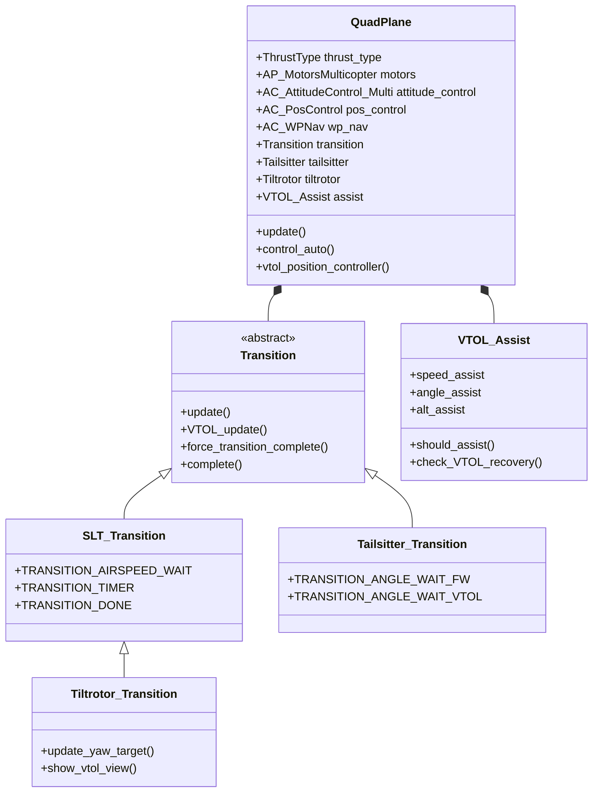
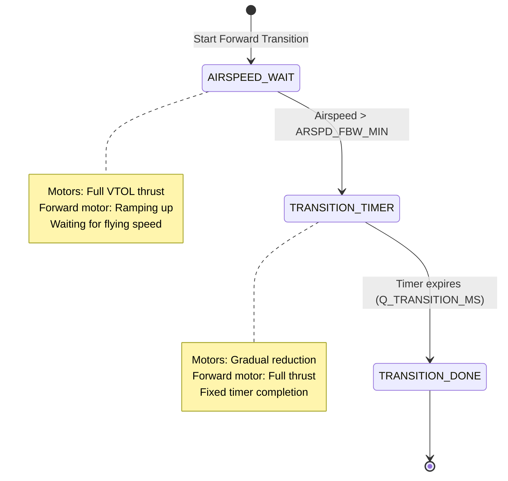
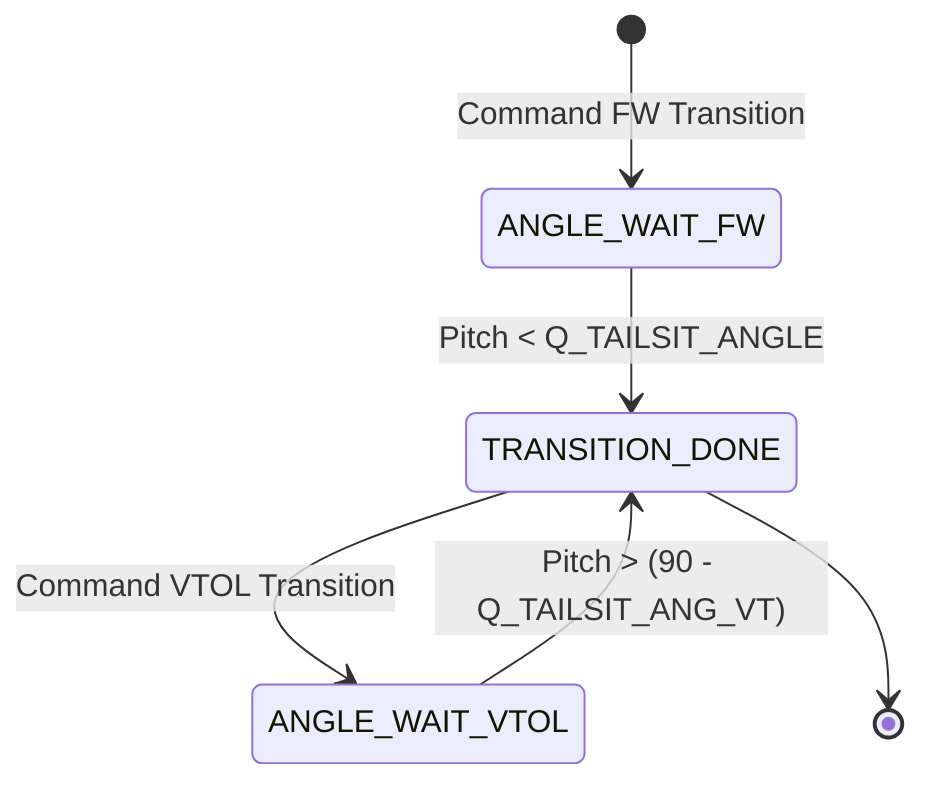
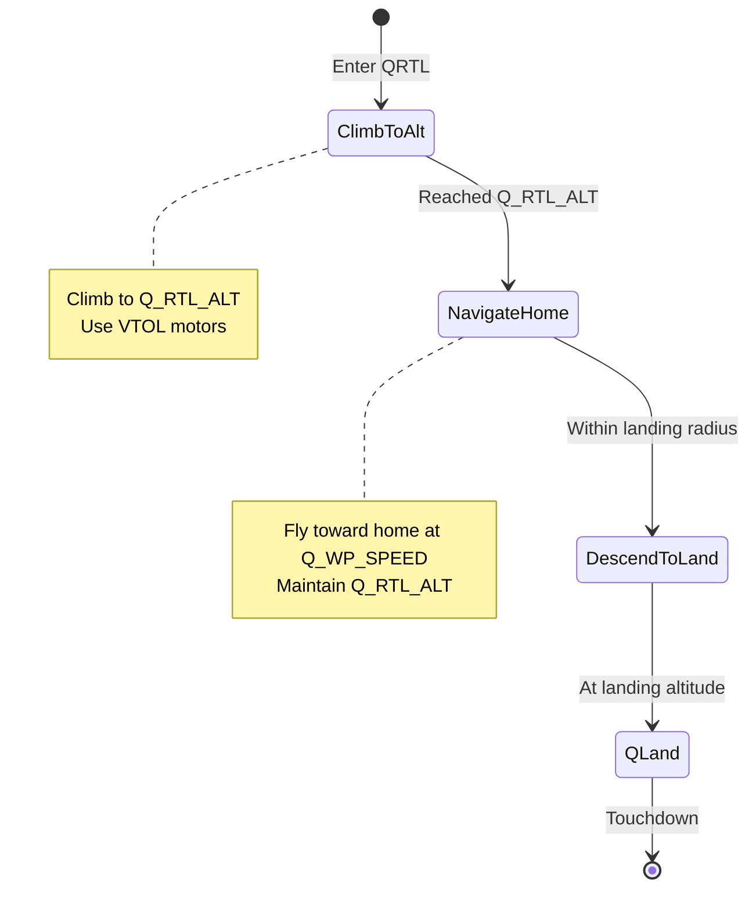

# ArduPlane QuadPlane VTOL Documentation


## Table of Contents
- [Overview](#overview)
- [QuadPlane Architecture](#quadplane-architecture)
- [VTOL Configuration Types](#vtol-configuration-types)
  - [Traditional QuadPlane (SLT)](#traditional-quadplane-slt)
  - [Tailsitter](#tailsitter)
  - [Tiltrotor](#tiltrotor)
- [Transition System](#transition-system)
- [Q-Flight Modes](#q-flight-modes)
- [VTOL Assist System](#vtol-assist-system)
- [Configuration Parameters](#configuration-parameters)
- [Tuning Guide](#tuning-guide)
- [Safety Systems](#safety-systems)
- [Common Setup Patterns](#common-setup-patterns)
- [Troubleshooting](#troubleshooting)

## Overview

The ArduPlane QuadPlane system provides comprehensive VTOL (Vertical Takeoff and Landing) capabilities for fixed-wing aircraft. This implementation allows aircraft to combine the efficiency of fixed-wing flight with the versatility of multicopter-style vertical flight.

**Source Files**: `/ArduPlane/quadplane.h`, `/ArduPlane/quadplane.cpp`

### Key Features

- **Multiple VTOL Configurations**: Support for traditional quadplanes, tailsitters, and tiltrotors
- **Seamless Transitions**: Automated transitions between fixed-wing and VTOL flight modes
- **VTOL Flight Modes**: Dedicated Q-modes (QHover, QLoiter, QLand, QRTL, QStabilize, QAcro)
- **Intelligent Assistance**: Automatic VTOL assist during fixed-wing flight when needed
- **Safety-Critical Design**: Comprehensive failsafe handling and mode transition validation

### Enabling QuadPlane

QuadPlane functionality is enabled via the `Q_ENABLE` parameter:

```cpp
// Source: /ArduPlane/quadplane.cpp:9-15
// @Param: ENABLE
// @DisplayName: Enable QuadPlane
// @Description: This enables QuadPlane functionality, assuming multicopter 
//               motors start on output 5. If this is set to 2 then when 
//               starting AUTO mode it will initially be in VTOL AUTO mode.
// @Values: 0:Disable,1:Enable,2:Enable VTOL AUTO
```

## QuadPlane Architecture

The QuadPlane system integrates multiple subsystems to provide comprehensive VTOL capabilities:



**Source**: `/ArduPlane/quadplane.h:34-747`

### Core Components

#### 1. Motor Control
The QuadPlane uses the `AP_MotorsMulticopter` library to control VTOL motors:

```cpp
// Source: /ArduPlane/quadplane.h:213
AP_MotorsMulticopter *motors = nullptr;
```

Motor configuration is controlled via the `Q_M_*` parameter group and supports multiple frame types including:
- Quadcopters (X, +, V, H configurations)
- Hexacopters
- Octocopters
- Y6 configurations

#### 2. Attitude Control
Multicopter-style attitude control is provided by `AC_AttitudeControl_Multi`:

```cpp
// Source: /ArduPlane/quadplane.h:216
AC_AttitudeControl_Multi *attitude_control;
```

This controller manages:
- Rate control loops (roll, pitch, yaw rates)
- Angle control loops (attitude targets)
- Thrust vectoring and motor mixing

#### 3. Position Control
3D position control using `AC_PosControl`:

```cpp
// Source: /ArduPlane/quadplane.h:217-219
AC_PosControl *pos_control;
AC_WPNav *wp_nav;
AC_Loiter *loiter_nav;
```

Manages:
- Velocity and position targets in NED frame
- Waypoint navigation in VTOL modes
- Loiter circle control
- Landing descent control

#### 4. Inertial Navigation
Dedicated VTOL navigation using `AP_InertialNav`:

```cpp
// Source: /ArduPlane/quadplane.h:204
AP_InertialNav inertial_nav{ahrs};
```

Provides position and velocity estimates optimized for VTOL flight.

## VTOL Configuration Types

QuadPlane supports three fundamental VTOL thrust configurations, selected automatically based on enabled features:

```cpp
// Source: /ArduPlane/quadplane.h:81-86
enum class ThrustType : uint8_t {
    SLT=0,        // Traditional quadplane (Separate Lift Thrust)
    TAILSITTER,   // Tailsitter configuration
    TILTROTOR,    // Tiltrotor/tiltwing configuration
};
```

### Traditional QuadPlane (SLT)

**Separate Lift Thrust (SLT)** configuration uses independent motors for vertical lift and a separate pusher/puller motor for forward flight.

**Architecture**:
- Multicopter motors (typically 4-8) provide vertical thrust
- Fixed-wing motor provides forward thrust
- Motors do not tilt - aircraft transitions by adjusting motor thrust balance
- Most common and straightforward QuadPlane configuration

**Transition Characteristics**:
- **Forward Transition**: Gradually increases forward motor thrust while maintaining VTOL motor thrust until flying speed achieved
- **Back Transition**: Reduces forward throttle and increases VTOL motor authority
- **Transition Time**: Controlled by `Q_TRANSITION_MS` parameter (default: 5000ms)

```cpp
// Source: /ArduPlane/quadplane.cpp:32-38
// @Param: TRANSITION_MS
// @DisplayName: Transition time
// @Description: Transition time in milliseconds after minimum airspeed is reached
// @Units: ms
// @Range: 500 30000
AP_GROUPINFO("TRANSITION_MS", 11, QuadPlane, transition_time_ms, 5000),
```

**Example Frame Configuration**:
```
Q_ENABLE = 1
Q_M_FRAME_CLASS = 1  // Quad
Q_M_FRAME_TYPE = 1   // X configuration
```

### Tailsitter

Tailsitters take off and land vertically on their tail, with the nose pointing upward. The aircraft rotates 90° during transition between VTOL and forward flight.

**Source**: `/ArduPlane/tailsitter.h`, `/ArduPlane/tailsitter.cpp`

#### Architecture

```cpp
// Source: /ArduPlane/tailsitter.h:25-154
class Tailsitter {
    AP_Int8 enable;
    AP_Int8 transition_angle_fw;      // Angle to start FW transition
    AP_Float transition_rate_fw;      // Rate limit for FW transition
    AP_Int8 transition_angle_vtol;    // Angle to start VTOL transition
    AP_Float transition_rate_vtol;    // Rate limit for VTOL transition
    AP_Int8 input_type;               // Control input mapping
    AP_MotorsTailsitter* tailsitter_motors;
};
```

#### Tailsitter Input Types

Tailsitters support different control input interpretations:

```cpp
// Source: /ArduPlane/tailsitter.h:79-82
enum input {
    TAILSITTER_INPUT_PLANE   = (1U<<0),  // Use plane-style inputs
    TAILSITTER_INPUT_BF_ROLL = (1U<<1)   // Use body-frame roll
};
```

- **Bit 0 (Plane Mode)**: Stick inputs remain in plane reference frame throughout flight
- **Bit 1 (Body-Frame Roll)**: Roll input is always in body frame, even in VTOL

#### Transition Behavior

Tailsitter transition is angle-based rather than time-based:

```cpp
// Source: /ArduPlane/tailsitter.h:194-198
enum {
    TRANSITION_ANGLE_WAIT_FW,    // Waiting for nose to drop to FW angle
    TRANSITION_ANGLE_WAIT_VTOL,  // Waiting for nose to rise to VTOL angle
    TRANSITION_DONE
} transition_state;
```

**Forward Transition (VTOL → Fixed-Wing)**:
1. Aircraft pitches nose down from vertical attitude
2. Transition completes when pitch reaches `Q_TAILSIT_ANGLE` (default: 45°)
3. Pitch rate limited by `Q_TAILSIT_RTE_FW` (deg/s)

**Back Transition (Fixed-Wing → VTOL)**:
1. Aircraft pitches nose up toward vertical
2. Transition completes when pitch reaches near-vertical attitude
3. Pitch rate limited by `Q_TAILSIT_RTE_VT` (deg/s)

#### Vectored Thrust Tailsitters

Some tailsitters use vectored thrust for enhanced control:

```cpp
// Source: /ArduPlane/tailsitter.h:98-100
AP_Float vectored_forward_gain;   // Gain for forward flight vectoring
AP_Float vectored_hover_gain;     // Gain for hover vectoring
AP_Float vectored_hover_power;    // Power applied during hover
```

#### Control Surface Tailsitters

Tailsitters can operate with motors-only or with control surfaces:

```cpp
// Source: /ArduPlane/tailsitter.h:37-38
// return true when flying a control surface only tailsitter
bool is_control_surface_tailsitter(void) const;
```

Control surfaces provide additional control authority, especially at higher airspeeds.

#### Gain Scaling

Tailsitters implement intelligent gain scaling based on airspeed:

```cpp
// Source: /ArduPlane/tailsitter.h:84-89
enum gscl_mask {
    TAILSITTER_GSCL_THROTTLE    = (1U<<0),  // Scale based on throttle
    TAILSITTER_GSCL_ATT_THR     = (1U<<1),  // Scale attitude with throttle
    TAILSITTER_GSCL_DISK_THEORY = (1U<<2),  // Use disk loading theory
    TAILSITTER_GSCL_ALTITUDE    = (1U<<3),  // Scale with altitude
};
```

This compensates for varying control effectiveness between hover and forward flight.

**Configuration Example**:
```
Q_TAILSIT_ENABLE = 1
Q_TAILSIT_ANGLE = 45      // Transition angle in degrees
Q_TAILSIT_RTE_FW = 50     // FW transition rate deg/s
Q_TAILSIT_RTE_VT = 50     // VTOL transition rate deg/s
Q_TAILSIT_INPUT = 0       // Standard plane inputs
```

### Tiltrotor

Tiltrotors transition between VTOL and fixed-wing flight by physically tilting the motors or entire wings. This provides efficient forward flight while retaining VTOL capability.

**Source**: `/ArduPlane/tiltrotor.h`, `/ArduPlane/tiltrotor.cpp`

#### Architecture

```cpp
// Source: /ArduPlane/tiltrotor.h:24-135
class Tiltrotor {
    AP_Int8 enable;
    AP_Int16 tilt_mask;           // Bitmask of which motors tilt
    AP_Int16 max_rate_up_dps;     // Max tilt rate up (deg/s)
    AP_Int16 max_rate_down_dps;   // Max tilt rate down (deg/s)
    AP_Int8  max_angle_deg;       // Maximum tilt angle
    AP_Int8  type;                // Tilt mechanism type
    float current_tilt;           // Current tilt angle
};
```

#### Tilt Mechanism Types

```cpp
// Source: /ArduPlane/tiltrotor.h:98-102
enum {
    TILT_TYPE_CONTINUOUS    = 0,  // Continuous servo tilt
    TILT_TYPE_BINARY        = 1,  // Binary (up/fwd) only
    TILT_TYPE_VECTORED_YAW  = 2,  // Differential tilt for yaw
    TILT_TYPE_BICOPTER      = 3   // Bicopter configuration
};
```

**Continuous Tilt** (Type 0):
- Servos smoothly transition between vertical and horizontal
- Most common configuration
- Allows partial tilt angles for transition optimization

**Binary Tilt** (Type 1):
- Motors snap between vertical (up) and horizontal (forward) positions
- Simpler mechanical implementation
- Faster transition but less smooth

**Vectored Yaw** (Type 2):
- Differential tilt provides yaw control in forward flight
- Left/right motors tilt independently
- Enhanced yaw authority without rudder

**Bicopter** (Type 3):
- Two motors with differential tilt for pitch/yaw
- Specialized configuration for specific airframes

#### Tilt Control Parameters

The tilt system provides precise control over transition behavior:

```cpp
// Source: /ArduPlane/tiltrotor.h:79-88
AP_Int16 tilt_mask;           // Bitmask: which motors tilt (bit per motor)
AP_Int16 max_rate_up_dps;     // Maximum tilt rate upward (degrees/second)
AP_Int16 max_rate_down_dps;   // Maximum tilt rate downward (degrees/second)
AP_Int8  max_angle_deg;       // Maximum tilt angle from vertical
AP_Float tilt_yaw_angle;      // Yaw vectoring tilt angle
AP_Float fixed_angle;         // Fixed tilt angle in FW flight
AP_Float fixed_gain;          // Gain for fixed tilt control
```

**Motor Tilt Mask**: Defines which motors physically tilt
```
Example: tilt_mask = 0b00001111 (0x0F)
Motors 0-3 tilt, Motors 4-7 remain fixed
```

#### Forward Flight Motor Configuration

```cpp
// Source: /ArduPlane/tiltrotor.h:119-123
bool _have_fw_motor;    // Has fixed forward motor
bool _have_vtol_motor;  // Has non-tilting VTOL motor
```

Tiltrotors can have:
- **All motors tilt**: Pure tiltrotor, no separate forward motor
- **Hybrid**: Some motors tilt, separate forward motor for cruise efficiency
- **Partial tilt**: Some VTOL motors fixed, others tilt

#### Transition Yaw Control

```cpp
// Source: /ArduPlane/tiltrotor.h:58-59
// update yaw target for tiltrotor transition
void update_yaw_target();
```

During transition, tiltrotors can maintain heading or use vectored thrust for yaw control.

**Configuration Example**:
```
Q_TILT_ENABLE = 1
Q_TILT_MASK = 15          // Motors 0-3 tilt (0x0F)
Q_TILT_RATE_UP = 40       // 40 deg/s tilt up rate
Q_TILT_RATE_DN = 50       // 50 deg/s tilt down rate
Q_TILT_MAX = 90           // 90° max tilt (fully forward)
Q_TILT_TYPE = 0           // Continuous tilt servos
```

## Transition System

The transition system manages the complex process of converting between fixed-wing and VTOL flight modes. This is one of the most critical and safety-sensitive aspects of QuadPlane operation.

**Source**: `/ArduPlane/transition.h`

### Transition Base Class

All transition types inherit from the abstract `Transition` base class:

```cpp
// Source: /ArduPlane/transition.h:20-69
class Transition {
public:
    virtual void update() = 0;                          // Called every loop
    virtual void VTOL_update() = 0;                    // VTOL-specific update
    virtual void force_transition_complete() = 0;       // Force completion
    virtual bool complete() const = 0;                  // Is transition done?
    virtual void restart() = 0;                        // Restart transition
    virtual uint8_t get_log_transition_state() const = 0;
    virtual bool active_frwd() const = 0;              // In forward transition?
    virtual bool show_vtol_view() const = 0;           // Show VTOL view in GCS?
    virtual MAV_VTOL_STATE get_mav_vtol_state() const = 0;
};
```

### SLT Transition (Traditional QuadPlane)

```cpp
// Source: /ArduPlane/transition.h:72-130
class SLT_Transition : public Transition {
    enum {
        TRANSITION_AIRSPEED_WAIT,   // Waiting for sufficient airspeed
        TRANSITION_TIMER,            // Timer-based transition completion
        TRANSITION_DONE              // Transition complete
    } transition_state;
};
```

#### Forward Transition State Machine



**Source**: `/ArduPlane/transition.h:108-112`

#### Back Transition (Fixed-Wing → VTOL)

Back transition is immediate for SLT quadplanes:
- VTOL motors spool up instantly
- Forward motor thrust reduced
- Position controller activated immediately
- No waiting for specific conditions

```cpp
// Source: /ArduPlane/transition.h:80
void VTOL_update() override;  // Handles back transition logic
```

#### Transition Parameters

```cpp
// Source: /ArduPlane/quadplane.h:315-319
AP_Int16 transition_time_ms;           // Time to complete transition
AP_Float transition_decel;             // Deceleration rate (m/s²)
AP_Int16 back_trans_pitch_limit_ms;    // Back transition pitch limit time
```

**Critical Parameters**:
- `Q_TRANSITION_MS`: Time from airspeed threshold to transition complete (default: 5000ms)
- `Q_TRANS_DECEL`: Target deceleration during back transition (default: 2.0 m/s²)
- `Q_TRANS_FAIL_TIMEOUT`: Transition failure timeout leading to QLAND/QRTL

### Transition Failure Handling

```cpp
// Source: /ArduPlane/quadplane.h:322-330
struct TRANS_FAIL {
    enum ACTION {
        QLAND,  // Land immediately in VTOL mode
        QRTL    // Return to home in VTOL mode
    };
    AP_Int16 timeout;      // Timeout in seconds
    AP_Enum<ACTION> action; // Action on failure
    bool warned;           // Warning issued flag
} transition_failure;
```

If forward transition does not complete within the timeout period:
1. Warning issued to GCS
2. Automatic switch to QLAND or QRTL based on `Q_TRANS_FAIL_ACT`
3. Vehicle enters VTOL mode for safety

**Configuration**:
```
Q_TRANS_FAIL = 30      // 30 second timeout
Q_TRANS_FAIL_ACT = 0   // QLAND on failure
```

### Tailsitter Transition

```cpp
// Source: /ArduPlane/tailsitter.h:194-198
enum {
    TRANSITION_ANGLE_WAIT_FW,    // Rotating to forward flight attitude
    TRANSITION_ANGLE_WAIT_VTOL,  // Rotating to vertical attitude
    TRANSITION_DONE
} transition_state;
```

Tailsitter transitions are controlled by attitude angle rather than airspeed:
- **To FW**: Pitch decreases from ~90° to configured angle (e.g., 45°)
- **To VTOL**: Pitch increases from level to ~90° vertical



### Tiltrotor Transition

Tiltrotor transition extends SLT transition with tilt-specific logic:

```cpp
// Source: /ArduPlane/tiltrotor.h:137-155
class Tiltrotor_Transition : public SLT_Transition {
    bool update_yaw_target(float& yaw_target_cd) override;
    bool show_vtol_view() const override;
    bool use_multirotor_control_in_fwd_transition() const override;
};
```

Key differences:
- Monitors tilt angle progression
- Coordinates tilt servos with thrust changes
- May maintain multicopter control during early forward transition
- Can use vectored thrust for yaw control

**Tilt Angle Coordination**:
```cpp
// Source: /ArduPlane/tiltrotor.h:90
float current_tilt;  // Current tilt angle in degrees (0=up, 90=forward)
```

## Q-Flight Modes

QuadPlane provides dedicated VTOL flight modes, all prefixed with "Q" to distinguish them from fixed-wing modes.

**Source**: `/ArduPlane/mode_q*.cpp` files

### Mode Overview Table

| Mode | Type | Description | Use Case |
|------|------|-------------|----------|
| **QStabilize** | Manual | Rate-stabilized VTOL flight | Manual control with stabilization |
| **QHover** | Assisted | Altitude hold, manual position | Hovering in place with drift |
| **QLoiter** | Autonomous | GPS position and altitude hold | Precise position hold |
| **QAcro** | Manual | Acrobatic mode, no stabilization | Advanced manual flying |
| **QLand** | Autonomous | Automated vertical landing | Landing at current location |
| **QRTL** | Autonomous | Return to launch in VTOL mode | Return home and land |
| **QAutotune** | Tuning | Automated PID tuning | Initial setup and optimization |

### QStabilize Mode

Basic rate-stabilized VTOL flight with manual throttle control.

**Source**: `/ArduPlane/mode_qstabilize.cpp`

**Characteristics**:
- Pilot controls roll/pitch/yaw rates directly
- No GPS position hold - aircraft will drift with wind
- Manual throttle control (no altitude hold)
- Simplest Q-mode, useful for testing and manual flight

**Control Mapping**:
- Roll stick → Roll rate (deg/s)
- Pitch stick → Pitch rate (deg/s)  
- Yaw stick → Yaw rate (deg/s)
- Throttle stick → Motor throttle (direct)

**Configuration**:
```
No specific parameters - uses base Q_ control parameters
Uses Q_ANGLE_MAX for maximum lean angle
```

### QHover Mode

Altitude hold with manual horizontal position control (no GPS position lock).

**Source**: `/ArduPlane/mode_qhover.cpp`

```cpp
// Source: /ArduPlane/mode_qhover.cpp:6-15
bool ModeQHover::_enter() {
    // set vertical speed and acceleration limits
    pos_control->set_max_speed_accel_U_cm(
        -quadplane.get_pilot_velocity_z_max_dn(), 
        quadplane.pilot_speed_z_max_up*100, 
        quadplane.pilot_accel_z*100);
    quadplane.init_throttle_wait();
    return true;
}
```

**Characteristics**:
- Automatic altitude hold using barometer/rangefinder
- Manual horizontal control (aircraft drifts with wind)
- Throttle stick controls climb rate
- Good for hovering without GPS or in GPS-denied environments

**Control Behavior**:
```cpp
// Source: /ArduPlane/mode_qhover.cpp:42-43
quadplane.hold_hover(quadplane.get_pilot_desired_climb_rate_cms());
```

- Roll/pitch sticks control attitude angles
- Centered throttle = hold altitude
- Throttle up/down = climb/descend at pilot-commanded rate

**Relevant Parameters**:
- `Q_PILOT_SPD_UP`: Maximum climb rate (m/s) - default 2.5
- `Q_PILOT_SPD_DN`: Maximum descent rate (m/s) - default 2.5
- `Q_PILOT_ACCEL_Z`: Vertical acceleration limit (m/s²) - default 2.5

### QLoiter Mode

Full GPS position and altitude hold - most commonly used VTOL mode.

**Source**: `/ArduPlane/mode_qloiter.cpp`

```cpp
// Source: /ArduPlane/mode_qloiter.cpp:6-24
bool ModeQLoiter::_enter() {
    // initialise loiter
    loiter_nav->clear_pilot_desired_acceleration();
    loiter_nav->init_target();
    
    // set vertical speed and acceleration limits
    pos_control->set_max_speed_accel_U_cm(...);
    
    quadplane.init_throttle_wait();
    return true;
}
```

**Characteristics**:
- GPS-based position hold (will not drift)
- Altitude hold using barometer/GPS fusion
- Stick inputs provide position changes relative to hold point
- Returns to center position when sticks released

**Loiter Controller**:
```cpp
// Source: /ArduPlane/mode_qloiter.cpp:114-115
quadplane.get_pilot_desired_lean_angles(target_roll_cd, target_pitch_cd, ...);
loiter_nav->set_pilot_desired_acceleration_cd(target_roll_cd, target_pitch_cd);
```

The loiter navigation system:
1. Converts stick inputs to desired accelerations
2. Integrates to velocity targets
3. Integrates to position targets
4. Position controller drives attitude commands

**Advanced Features**:
- Precision landing support (if configured)
- Velocity matching for moving targets
- Automatic landing descent in QLand mode

**Relevant Parameters**:
- `Q_WP_SPEED`: Horizontal speed limit (cm/s) - default 500
- `Q_WP_ACCEL`: Horizontal acceleration (cm/s²) - default 100
- `Q_WP_RADIUS`: Waypoint radius (cm) - default 200

### QAcro Mode

Acrobatic mode with no attitude stabilization - pure rate control.

**Source**: `/ArduPlane/mode_qacro.cpp`

**Characteristics**:
- Direct rate control on all axes
- No self-leveling - pilot must manually return to level
- Manual throttle control (no altitude hold)
- Allows inverted flight and aerobatics
- **WARNING**: Advanced pilots only - easy to lose control

**Rate Limits**:
```cpp
// Source: /ArduPlane/quadplane.h:389-391
AP_Float acro_roll_rate;   // Maximum roll rate (deg/s)
AP_Float acro_pitch_rate;  // Maximum pitch rate (deg/s) 
AP_Float acro_yaw_rate;    // Maximum yaw rate (deg/s)
```

**Configuration**:
```
Q_ACRO_RLL_RATE = 180  // 180 deg/s max roll rate
Q_ACRO_PIT_RATE = 180  // 180 deg/s max pitch rate
Q_ACRO_YAW_RATE = 90   // 90 deg/s max yaw rate
```

### QLand Mode

Autonomous vertical landing at the current position.

**Source**: `/ArduPlane/mode_qland.cpp`

```cpp
// Source: /ArduPlane/mode_qloiter.cpp:149-168 (QLand logic in QLoiter)
if (plane.control_mode == &plane.mode_qland) {
    if (poscontrol.get_state() < QuadPlane::QPOS_LAND_FINAL && 
        quadplane.check_land_final()) {
        poscontrol.set_state(QuadPlane::QPOS_LAND_FINAL);
        // cut IC engine if enabled
    }
    float descent_rate_cms = quadplane.landing_descent_rate_cms(height_above_ground);
    pos_control->land_at_climb_rate_cm(-descent_rate_cms, descent_rate_cms>0);
}
```

**Landing State Machine**:
```cpp
// Source: /ArduPlane/quadplane.h:498-508
enum position_control_state {
    QPOS_NONE = 0,
    QPOS_APPROACH,        // Approaching landing point
    QPOS_AIRBRAKE,        // Airbraking phase
    QPOS_POSITION1,       // Position control phase 1
    QPOS_POSITION2,       // Position control phase 2
    QPOS_LAND_DESCEND,    // Descending to land
    QPOS_LAND_ABORT,      // Landing aborted
    QPOS_LAND_FINAL,      // Final landing phase
    QPOS_LAND_COMPLETE    // Touchdown detected
};
```

**Landing Phases**:

1. **QPOS_LAND_DESCEND**: Initial descent at configured rate
   - Uses `Q_LAND_FINAL_SPD` parameter
   - Maintains position using GPS
   - Monitors altitude

2. **QPOS_LAND_FINAL**: Final approach to ground
   - Triggered at `Q_LAND_FINAL_ALT` above ground
   - Slower descent rate
   - Ground effect compensation enabled
   - Engine cut (if configured)

3. **QPOS_LAND_COMPLETE**: Touchdown detected
   - Motors disarm after delay
   - Arming checks reset

**Landing Detection**:
```cpp
// Source: /ArduPlane/quadplane.h:482-490
struct {
    uint32_t lower_limit_start_ms;  // Time at minimum throttle
    uint32_t land_start_ms;         // Landing sequence start
    float vpos_start_m;             // Starting vertical position
    AP_Float detect_alt_change;     // Detection threshold (m)
} landing_detect;
```

Land is detected when:
- Throttle at minimum for extended period
- Vertical position change below threshold
- Vehicle settled and stable

**Relevant Parameters**:
- `Q_LAND_FINAL_ALT`: Altitude to enter final landing phase (m)
- `Q_LAND_FINAL_SPD`: Final landing descent speed (m/s)
- `Q_LAND_ICE_CUT`: Cut internal combustion engine on final (0/1/2)

### QRTL Mode

Return to launch point and land in VTOL mode.

**Source**: `/ArduPlane/mode_qrtl.cpp`

**QRTL Behavior**:



**Altitude Control**:
```cpp
// Source: /ArduPlane/quadplane.h:349-350
AP_Int16 qrtl_alt;      // QRTL altitude (m)
AP_Int16 qrtl_alt_min;  // Minimum QRTL altitude (m)
```

The system uses:
- `Q_RTL_ALT`: Target altitude for return flight
- `Q_RTL_ALT_MIN`: Minimum altitude enforced during return
- Higher of the two values is used for safety

**RTL Mode Control**:
```cpp
// Source: /ArduPlane/quadplane.h:360-366
enum RTL_MODE {
    NONE,                    // Always use fixed-wing RTL
    SWITCH_QRTL,            // Switch to QRTL at RTL_RADIUS
    VTOL_APPROACH_QRTL,     // Fixed-wing approach then QRTL
    QRTL_ALWAYS,            // Always use QRTL
};
```

This parameter (`Q_RTL_MODE`) controls when the system uses QRTL vs fixed-wing RTL:
- **0 (NONE)**: Standard fixed-wing RTL always
- **1 (SWITCH_QRTL)**: Switch to QRTL when within `WP_LOITER_RAD` of home
- **2 (VTOL_APPROACH_QRTL)**: Fixed-wing approach followed by QRTL landing
- **3 (QRTL_ALWAYS)**: Always use QRTL regardless of distance

**Configuration**:
```
Q_RTL_MODE = 1     // Switch to QRTL near home
Q_RTL_ALT = 30     // Return at 30m altitude
Q_RTL_ALT_MIN = 15 // Minimum 15m altitude
```

## VTOL Assist System

The VTOL Assist system automatically provides multicopter assistance during fixed-wing flight when the aircraft approaches dangerous conditions. This is a critical safety feature.

**Source**: `/ArduPlane/VTOL_Assist.h`, `/ArduPlane/VTOL_Assist.cpp`

```cpp
// Source: /ArduPlane/VTOL_Assist.h:6-91
class VTOL_Assist {
    AP_Float speed;      // Speed threshold for assist
    AP_Int8 angle;       // Angle threshold for assist
    AP_Int16 alt;        // Altitude threshold for assist
    AP_Float delay;      // Time delay before assist
    AP_Int16 options;    // Special options
};
```

### Assist Triggers

The system monitors multiple conditions and activates VTOL motors when thresholds are exceeded:

#### 1. Speed Assist
```cpp
// Source: /ArduPlane/VTOL_Assist.h:16
AP_Float speed;  // speed below which quad assistance is given
```

- Activates when airspeed drops below `Q_ASSIST_SPEED`
- Prevents stall in fixed-wing flight
- VTOL motors provide additional thrust
- **Default**: Disabled (0 m/s)

#### 2. Angle Assist
```cpp
// Source: /ArduPlane/VTOL_Assist.h:19
AP_Int8 angle;  // angular error at which quad assistance is given
```

- Activates when attitude error exceeds `Q_ASSIST_ANGLE` degrees
- Prevents loss of control in extreme attitudes
- Helps recover from upsets
- **Default**: Disabled (0°)

#### 3. Altitude Assist  
```cpp
// Source: /ArduPlane/VTOL_Assist.h:22
AP_Int16 alt;  // altitude to trigger assistance
```

- Activates when altitude drops below `Q_ASSIST_ALT` above home
- Prevents terrain collision
- Emergency thrust for altitude recovery
- **Default**: Disabled (0m)

### Assist Hysteresis

```cpp
// Source: /ArduPlane/VTOL_Assist.h:66-81
class Assist_Hysteresis {
    uint32_t start_ms;    // Time condition first met
    uint32_t last_ms;     // Last time condition was true
    bool active;          // Currently providing assist
};
```

Hysteresis prevents assist "chattering":
- Condition must persist for `Q_ASSIST_DELAY` seconds before activation
- Once active, continues until condition clearly resolved
- Prevents oscillation between assisted and unassisted flight

### Assist State Control

```cpp
// Source: /ArduPlane/VTOL_Assist.h:41-47
enum class STATE {
    ASSIST_DISABLED,   // Pilot has disabled assist
    ASSIST_ENABLED,    // Normal operation
    FORCE_ENABLED,     // Pilot forcing assist on
};
```

Pilot can control assist via auxiliary function:
- **Disabled**: No automatic assist (use with caution!)
- **Enabled**: Normal automatic assist operation (default)
- **Force**: Always provide assist in forward flight

### Spin Recovery

```cpp
// Source: /ArduPlane/VTOL_Assist.h:56-59
// check if we are in VTOL recovery
bool check_VTOL_recovery(void);

// output rudder and elevator for spin recovery  
void output_spin_recovery(void);
```

Special recovery mode for spin or extreme upset:
- Detects uncontrolled rotation
- Provides maximum VTOL assistance
- Outputs full recovery control inputs
- Attempts to stabilize aircraft to safe attitude

### Assist Options

```cpp
// Source: /ArduPlane/VTOL_Assist.h:32-35
enum class OPTION {
    FW_FORCE_DISABLED = (1U<<0),  // Force disable in fixed wing
    SPIN_DISABLED     = (1U<<1),  // Disable spin recovery
};
```

**Configuration Example**:
```
Q_ASSIST_SPEED = 15    // Assist below 15 m/s
Q_ASSIST_ANGLE = 30    // Assist at 30° attitude error
Q_ASSIST_ALT = 50      // Assist below 50m AGL
Q_ASSIST_DELAY = 0.5   // 0.5s delay before activation
```

## Configuration Parameters

This section documents the key QuadPlane configuration parameters organized by functional area.

**Source**: `/ArduPlane/Parameters.cpp`, `/ArduPlane/quadplane.cpp:7-100`

### Basic Enable Parameters

| Parameter | Description | Default | Range |
|-----------|-------------|---------|-------|
| `Q_ENABLE` | Enable QuadPlane (0=Off, 1=On, 2=VTOL AUTO) | 0 | 0-2 |
| `Q_FRAME_CLASS` | Motor frame class (1=Quad, 2=Hexa, etc.) | 1 | - |
| `Q_FRAME_TYPE` | Motor frame type (0=+, 1=X, 2=V, 3=H) | 1 | - |

### Motor Control Parameters

| Parameter | Description | Default | Range | Units |
|-----------|-------------|---------|-------|-------|
| `Q_M_PWM_TYPE` | Output PWM type (0=Normal, 1=OneShot, etc.) | 0 | - | - |
| `Q_M_PWM_MIN` | Minimum PWM output | 1000 | 800-2200 | µs |
| `Q_M_PWM_MAX` | Maximum PWM output | 2000 | 800-2200 | µs |
| `Q_M_SPIN_MIN` | Minimum motor spin when armed | 0.15 | 0-0.3 | - |
| `Q_M_SPIN_MAX` | Maximum motor output | 0.95 | 0.9-1.0 | - |
| `Q_M_SPIN_ARM` | Motor spin when armed (idle) | 0.10 | 0-0.2 | - |
| `Q_M_THST_EXPO` | Motor thrust expo (linearization) | 0.65 | 0-1 | - |
| `Q_M_HOVER_LEARN` | Hover throttle learning (0=Off, 2=On) | 2 | 0-2 | - |

### Attitude Control Parameters

| Parameter | Description | Default | Range | Units |
|-----------|-------------|---------|-------|-------|
| `Q_ANGLE_MAX` | Maximum lean angle | 3000 | 1000-8000 | cdeg |
| `Q_A_RAT_RLL_P` | Roll rate P gain | 0.135 | 0.01-0.5 | - |
| `Q_A_RAT_RLL_I` | Roll rate I gain | 0.135 | 0-0.5 | - |
| `Q_A_RAT_RLL_D` | Roll rate D gain | 0.0036 | 0-0.05 | - |
| `Q_A_RAT_RLL_FLTD` | Roll rate filter (D term) | 20 | 1-100 | Hz |
| `Q_A_RAT_PIT_P` | Pitch rate P gain | 0.135 | 0.01-0.5 | - |
| `Q_A_RAT_PIT_I` | Pitch rate I gain | 0.135 | 0-0.5 | - |
| `Q_A_RAT_PIT_D` | Pitch rate D gain | 0.0036 | 0-0.05 | - |
| `Q_A_RAT_PIT_FLTD` | Pitch rate filter | 20 | 1-100 | Hz |
| `Q_A_RAT_YAW_P` | Yaw rate P gain | 0.180 | 0.01-1.0 | - |
| `Q_A_RAT_YAW_I` | Yaw rate I gain | 0.018 | 0-0.5 | - |
| `Q_A_RAT_YAW_FLTE` | Yaw rate filter | 2 | 1-10 | Hz |

### Position Control Parameters

| Parameter | Description | Default | Range | Units |
|-----------|-------------|---------|-------|-------|
| `Q_P_POSZ_P` | Vertical position P gain | 1.0 | 0.5-3.0 | - |
| `Q_P_VELZ_P` | Vertical velocity P gain | 5.0 | 1.0-10.0 | - |
| `Q_P_ACCZ_P` | Vertical accel P gain | 0.5 | 0.2-1.5 | - |
| `Q_P_ACCZ_I` | Vertical accel I gain | 1.0 | 0.5-3.0 | - |
| `Q_P_ACCZ_D` | Vertical accel D gain | 0.0 | 0-0.5 | - |
| `Q_P_POSXY_P` | Horizontal position P gain | 1.0 | 0.5-3.0 | - |

### Pilot Input Parameters

| Parameter | Description | Default | Range | Units |
|-----------|-------------|---------|-------|-------|
| `Q_PILOT_SPD_UP` | Maximum pilot climb rate | 2.5 | 0.5-5.0 | m/s |
| `Q_PILOT_SPD_DN` | Maximum pilot descent rate | 2.5 | 0.5-5.0 | m/s |
| `Q_PILOT_ACCEL_Z` | Vertical acceleration limit | 2.5 | 0.5-5.0 | m/s² |
| `Q_PILOT_Y_RATE` | Yaw rate max from pilot | 90 | 10-360 | deg/s |

### Waypoint Navigation Parameters

| Parameter | Description | Default | Range | Units |
|-----------|-------------|---------|-------|-------|
| `Q_WP_SPEED` | Horizontal waypoint speed | 500 | 100-2000 | cm/s |
| `Q_WP_ACCEL` | Horizontal acceleration | 100 | 50-500 | cm/s² |
| `Q_WP_RADIUS` | Waypoint acceptance radius | 200 | 10-1000 | cm |
| `Q_WP_SPEED_UP` | Vertical speed up | 250 | 10-1000 | cm/s |
| `Q_WP_SPEED_DN` | Vertical speed down | 150 | 10-1000 | cm/s |

### Transition Parameters

| Parameter | Description | Default | Range | Units |
|-----------|-------------|---------|-------|-------|
| `Q_TRANSITION_MS` | Transition time after airspeed reached | 5000 | 500-30000 | ms |
| `Q_TRANS_DECEL` | Transition deceleration | 2.0 | 0.5-10.0 | m/s² |
| `Q_TRANS_FAIL` | Transition failure timeout | 0 | 0-60 | s |
| `Q_TRANS_FAIL_ACT` | Action on transition failure (0=QLAND, 1=QRTL) | 0 | 0-1 | - |

### Landing Parameters

| Parameter | Description | Default | Range | Units |
|-----------|-------------|---------|-------|-------|
| `Q_LAND_FINAL_ALT` | Altitude to switch to final landing | 6 | 0.5-50 | m |
| `Q_LAND_FINAL_SPD` | Final landing descent speed | 0.5 | 0.1-2.0 | m/s |
| `Q_LAND_ICE_CUT` | Cut ICE on landing (0=No, 1=Final, 2=Descent) | 0 | 0-2 | - |

### RTL Parameters

| Parameter | Description | Default | Range | Units |
|-----------|-------------|---------|-------|-------|
| `Q_RTL_MODE` | QRTL mode (0=Off, 1=Switch, 2=Approach, 3=Always) | 0 | 0-3 | - |
| `Q_RTL_ALT` | QRTL altitude | 0 | 0-200 | m |
| `Q_RTL_ALT_MIN` | Minimum QRTL altitude | 0 | 0-200 | m |

### Assist Parameters

| Parameter | Description | Default | Range | Units |
|-----------|-------------|---------|-------|-------|
| `Q_ASSIST_SPEED` | Airspeed assist threshold | 0 | 0-50 | m/s |
| `Q_ASSIST_ANGLE` | Attitude error assist threshold | 0 | 0-90 | deg |
| `Q_ASSIST_ALT` | Altitude assist threshold | 0 | 0-1000 | m |
| `Q_ASSIST_DELAY` | Assist delay before activation | 0.5 | 0-2 | s |

### Tailsitter-Specific Parameters

| Parameter | Description | Default | Range | Units |
|-----------|-------------|---------|-------|-------|
| `Q_TAILSIT_ENABLE` | Enable tailsitter | 0 | 0-2 | - |
| `Q_TAILSIT_ANGLE` | Forward transition angle | 45 | 0-80 | deg |
| `Q_TAILSIT_RTE_FW` | Forward transition rate | 50 | 10-360 | deg/s |
| `Q_TAILSIT_RTE_VT` | VTOL transition rate | 50 | 10-360 | deg/s |
| `Q_TAILSIT_INPUT` | Input type (bitmask) | 0 | 0-3 | - |
| `Q_TAILSIT_VFGAIN` | Vectored forward gain | 0 | 0-1 | - |
| `Q_TAILSIT_VHGAIN` | Vectored hover gain | 0.5 | 0-1 | - |

### Tiltrotor-Specific Parameters

| Parameter | Description | Default | Range | Units |
|-----------|-------------|---------|-------|-------|
| `Q_TILT_ENABLE` | Enable tiltrotor | 0 | 0-1 | - |
| `Q_TILT_MASK` | Bitmask of tilting motors | 0 | 0-255 | - |
| `Q_TILT_RATE_UP` | Maximum tilt rate up | 40 | 10-360 | deg/s |
| `Q_TILT_RATE_DN` | Maximum tilt rate down | 50 | 10-360 | deg/s |
| `Q_TILT_MAX` | Maximum tilt angle | 90 | 20-90 | deg |
| `Q_TILT_TYPE` | Tilt mechanism type | 0 | 0-3 | - |
| `Q_TILT_YAW_ANGLE` | Yaw vectoring angle | 0 | 0-30 | deg |

### Advanced Options

```cpp
// Source: /ArduPlane/quadplane.h:587-611
enum class OPTION {
    LEVEL_TRANSITION          = (1<<0),   // Level flight in transition
    ALLOW_FW_TAKEOFF          = (1<<1),   // Allow FW takeoff
    ALLOW_FW_LAND             = (1<<2),   // Allow FW landing
    RESPECT_TAKEOFF_FRAME     = (1<<3),   // Respect takeoff frame
    MISSION_LAND_FW_APPROACH  = (1<<4),   // Mission uses FW approach
    FS_QRTL                   = (1<<5),   // Failsafe uses QRTL
    IDLE_GOV_MANUAL           = (1<<6),   // Idle governor in manual
    Q_ASSIST_FORCE_ENABLE     = (1<<7),   // Force Q assist on
    TAILSIT_Q_ASSIST_MOTORS_ONLY = (1<<8), // TS assist motors only
    DISARMED_TILT             = (1<<10),  // Allow tilt when disarmed
    DELAY_ARMING              = (1<<11),  // Delay arming
    DISABLE_SYNTHETIC_AIRSPEED_ASSIST = (1<<12), // No synthetic AS assist
    DISABLE_GROUND_EFFECT_COMP = (1<<13), // Disable ground effect
    INGORE_FW_ANGLE_LIMITS_IN_Q_MODES = (1<<14), // Ignore FW limits
    THR_LANDING_CONTROL       = (1<<15),  // Throttle landing control
    DISABLE_APPROACH          = (1<<16),  // Disable approach logic
    REPOSITION_LANDING        = (1<<17),  // Allow landing reposition
    ONLY_ARM_IN_QMODE_OR_AUTO = (1<<18),  // Arm only in Q or AUTO
    TRANS_FAIL_TO_FW          = (1<<19),  // Trans fail to FW
    FS_RTL                    = (1<<20),  // Failsafe uses RTL
    DISARMED_TILT_UP          = (1<<21),  // Tilt up when disarmed
    SCALE_FF_ANGLE_P          = (1<<22),  // Scale FF angle P
};
```

`Q_OPTIONS` is a bitmask parameter enabling advanced features. Calculate value by summing option bits.

## Tuning Guide

### Initial Setup Procedure

1. **Motor Configuration**
   ```
   Q_ENABLE = 1
   Q_M_FRAME_CLASS = 1  // Quad
   Q_M_FRAME_TYPE = 1   // X
   Q_M_PWM_TYPE = 0     // Normal PWM
   ```

2. **ESC Calibration** (if needed)
   ```
   Q_ESC_CAL = 1        // Enable ESC calibration mode
   # Power cycle with props removed
   # Follow ESC manufacturer procedure
   Q_ESC_CAL = 0        // Disable when complete
   ```

3. **Motor Direction Test**
   - Use Mission Planner Motor Test
   - Verify motor numbering matches frame type
   - Check rotation directions (CW/CCW pattern)

4. **Radio Calibration**
   - Calibrate RC inputs in RADIO_CALIBRATION
   - Set appropriate stick expo if desired
   - Configure mode switch

5. **Compass and Accelerometer Calibration**
   - Essential for stable VTOL flight
   - Perform full 3D accelerometer calibration
   - Perform compass calibration away from metal/motors

### Rate Controller Tuning

**Start with default values**, then tune if necessary:

#### Roll/Pitch Rate Tuning Sequence

1. **Test in QStabilize mode** (safest for initial tuning)

2. **Adjust P gain**:
   - Increase `Q_A_RAT_RLL_P` and `Q_A_RAT_PIT_P` until slight oscillation
   - Reduce by 10-20% for safety margin
   - Typical range: 0.08 - 0.20

3. **Adjust D gain**:
   - Increase `Q_A_RAT_RLL_D` and `Q_A_RAT_PIT_D` to dampen oscillations
   - D gain improves response but can amplify noise
   - Typical range: 0.002 - 0.008
   - If motors get hot or vibrate excessively, reduce D gain or lower `Q_A_RAT_*_FLTD`

4. **Adjust I gain**:
   - Set to match P gain initially (`I = P`)
   - Increase if aircraft drifts in hover
   - Decrease if oscillations after maneuvers
   - Typical range: 0.08 - 0.20

5. **Filter tuning**:
   - `Q_A_RAT_RLL_FLTD` and `Q_A_RAT_PIT_FLTD` filter D term noise
   - Lower values (10-15 Hz) for noisy builds
   - Higher values (20-40 Hz) for clean, stiff airframes
   - Monitor motor temperature during testing

#### Yaw Rate Tuning

1. **Yaw is typically less critical** than roll/pitch

2. **P gain**: `Q_A_RAT_YAW_P`
   - Start at 0.18
   - Increase if yaw response is sluggish
   - Decrease if yaw oscillates

3. **I gain**: `Q_A_RAT_YAW_I`
   - Start at P/10 (0.018)
   - Increase if heading drifts
   - Typical range: 0.01 - 0.05

4. **Filter**: `Q_A_RAT_YAW_FLTE`
   - Lower frequency than roll/pitch (2-5 Hz)
   - Prevents yaw oscillations

### Position Controller Tuning

Position controller tuning is usually not required with default values. Adjust only if:
- Waypoint tracking is poor
- Loiter position oscillates
- Landing is unstable

#### Vertical Position

1. **Velocity P**: `Q_P_VELZ_P`
   - Controls vertical velocity tracking
   - Increase for faster altitude corrections
   - Default: 5.0

2. **Acceleration PID**: `Q_P_ACCZ_*`
   - `Q_P_ACCZ_P` = 0.5 (typically no adjustment needed)
   - `Q_P_ACCZ_I` = 1.0 (compensates for weight/hover throttle)
   - `Q_P_ACCZ_D` = 0.0 (usually not needed)

#### Horizontal Position

1. **Position P**: `Q_P_POSXY_P`
   - Controls position tracking aggressiveness
   - Increase for tighter waypoint following
   - Decrease if aircraft overshoots waypoints
   - Default: 1.0

### Hover Throttle Learning

```cpp
// Source: /ArduPlane/quadplane.cpp (M_HOVER_LEARN parameter)
Q_M_HOVER_LEARN = 2  // Enabled
```

The system automatically learns hover throttle:
- Starts at 0.5 (50% throttle)
- Adapts during VTOL flight
- Saves learned value to parameters
- Improves altitude hold and position control

**Disable learning** (set to 0) if:
- Aircraft weight changes frequently
- Manual hover throttle preferred
- Testing specific configurations

### Transition Tuning

#### Traditional QuadPlane (SLT)

1. **Transition Time**: `Q_TRANSITION_MS`
   - Default: 5000ms (5 seconds)
   - Increase for heavier aircraft or higher cruise speeds
   - Decrease for lighter aircraft (minimum ~2000ms)

2. **Transition Deceleration**: `Q_TRANS_DECEL`
   - Target decel during back transition
   - Default: 2.0 m/s²
   - Increase for more aggressive back transitions
   - Decrease if back transition is too abrupt

3. **Minimum Airspeed**:
   - Set `ARSPD_FBW_MIN` appropriately
   - Transition begins when airspeed exceeds this value
   - Too low: transition before flying speed reached
   - Too high: excessive VTOL motor time

#### Tailsitter Transition

1. **Transition Angles**:
   ```
   Q_TAILSIT_ANGLE = 45    // FW transition complete angle
   ```
   - Lower values (30-40°): Earlier FW transition, more efficient
   - Higher values (50-70°): More VTOL authority, safer

2. **Transition Rates**:
   ```
   Q_TAILSIT_RTE_FW = 50   // deg/s forward transition
   Q_TAILSIT_RTE_VT = 50   // deg/s VTOL transition
   ```
   - Faster rates: Quicker transitions but less smooth
   - Slower rates: Smoother but longer transition time

#### Tiltrotor Transition

1. **Tilt Rates**:
   ```
   Q_TILT_RATE_UP = 40     // deg/s tilting up (to VTOL)
   Q_TILT_RATE_DN = 50     // deg/s tilting down (to FW)
   ```
   - Match to servo speed capabilities
   - Slower is generally safer
   - Consider mechanical stress on tilt mechanism

2. **Tilt Angle Limits**:
   ```
   Q_TILT_MAX = 90         // Maximum forward tilt
   ```
   - 90° = fully horizontal
   - Can be reduced if full forward tilt not needed

### QAutotune

QuadPlane supports automated tuning using QAutotune mode (similar to Copter Autotune):

**Requirements**:
- Calm weather (< 5 m/s wind)
- Safe altitude (> 20m AGL)
- Sufficient battery for 10-15 minute session
- Large open area

**Procedure**:
1. Take off in QHover or QLoiter
2. Switch to QAutotune mode
3. Raise throttle to start tuning
4. System performs automated maneuvers
5. Wait for completion (or switch modes to save progress)
6. Land and review parameters

**QAutotune adjusts**:
- Rate P, I, D gains
- Maximum rotation rates
- Attitude angle limits

**Post-autotune**: Test in QHover and QLoiter before using in missions.

## Safety Systems

QuadPlane implements multiple safety systems to protect the aircraft and prevent accidents.

### Arming Checks

```cpp
// Source: /ArduPlane/AP_Arming_Plane.cpp
// Quadplane-specific arming checks
```

**Pre-arm checks include**:
- **Motor configuration**: All motors must be configured and responding
- **Compass consistency**: Compass must be calibrated and healthy
- **GPS lock**: GPS required for Q-modes using position control
- **Battery voltage**: Battery must be above minimum voltage
- **RC calibration**: RC inputs must be calibrated
- **Mode check**: Some modes cannot be armed (e.g., AUTO without mission)
- **Parameter consistency**: Parameters must be within safe ranges

**Arming options**:
```
Q_OPTIONS bit 18: ONLY_ARM_IN_QMODE_OR_AUTO
```
If set, aircraft can only be armed in Q-modes or AUTO mode (prevents accidental fixed-wing takeoff).

### Failsafe Behavior

#### RC Failsafe in Q-Modes

When RC signal is lost in a Q-mode:
- Default action: Switch to QLAND
- If `Q_OPTIONS` bit 5 set: Switch to QRTL instead
- If `Q_OPTIONS` bit 20 set: Switch to RTL (fixed-wing) instead

```cpp
// Source: /ArduPlane/Parameters.cpp:440
// Quadplane modes will switch to QLAND unless Q_OPTIONS bit 5(QRTL) 
// or 20(RTL) are set.
```

#### GCS Failsafe in Q-Modes

Similar behavior to RC failsafe:
- Loss of GCS telemetry triggers failsafe
- Actions determined by `FS_LONG_ACTN` and Q_OPTIONS
- Defaults to QLAND for safety

#### Battery Failsafe

When battery reaches critical levels:
- Switch to QLAND for immediate landing
- If `Q_RTL_MODE` configured, may attempt QRTL first
- Prevents mid-air battery exhaustion

### Transition Failure Protection

```cpp
// Source: /ArduPlane/quadplane.h:322-330
struct TRANS_FAIL {
    AP_Int16 timeout;      // Transition timeout (seconds)
    enum ACTION {
        QLAND,             // Land immediately
        QRTL               // Return to launch
    } action;
};
```

**Configuration**:
```
Q_TRANS_FAIL = 30        // 30 second transition timeout
Q_TRANS_FAIL_ACT = 0     // QLAND on failure (0), or QRTL (1)
```

If forward transition does not complete within timeout:
1. System aborts transition
2. Returns to VTOL flight
3. Executes configured action (QLAND or QRTL)

**Option**: Set `Q_OPTIONS` bit 19 to fail to fixed-wing instead (advanced users only).

### Landing Detection

```cpp
// Source: /ArduPlane/quadplane.h:482-490
struct {
    uint32_t lower_limit_start_ms;
    uint32_t land_start_ms;
    float vpos_start_m;
    AP_Float detect_alt_change;  // Detection threshold
} landing_detect;
```

Landing is detected when:
- Throttle at minimum for sustained period (> 1 second)
- Vertical position stable (< `Q_LAND_DETECT_ALT_CHG`)
- Vehicle shows no significant movement

Upon detection:
- Motors disarm after 2-second delay
- Prevents premature disarm on rough landings
- User can manually disarm immediately if needed

### Geofence Integration

QuadPlane respects geofence settings:
- **Horizontal fence**: Maximum distance from home
- **Altitude ceiling**: Maximum altitude AGL
- **Altitude floor**: Minimum altitude AGL

**Fence breach actions**:
- RTL or QRTL depending on `Q_RTL_MODE`
- Land (LAND or QLAND)
- Warn only

Configure via `FENCE_*` parameters.

## Common Setup Patterns

### Pattern 1: Simple Quadplane (Small Aircraft)

**Use case**: Lightweight aircraft (< 3 kg), simple configuration

**Configuration**:
```
# Basic enable
Q_ENABLE = 1
Q_M_FRAME_CLASS = 1  # Quad X
Q_M_FRAME_TYPE = 1

# Conservative limits
Q_ANGLE_MAX = 3000   # 30° max lean
Q_PILOT_SPD_UP = 2.0
Q_PILOT_SPD_DN = 2.0

# Simple transition
Q_TRANSITION_MS = 5000
Q_TRANS_DECEL = 2.0

# QRTL for safety
Q_RTL_MODE = 1
Q_RTL_ALT = 20

# Assist for safety
Q_ASSIST_SPEED = 12  # Assist below 12 m/s
Q_ASSIST_ANGLE = 30
```

**Motor layout**: Outputs 1-4 for quad motors, Output 5 for forward motor

### Pattern 2: Long-Range QuadPlane

**Use case**: Larger aircraft (5-15 kg), efficiency-focused

**Configuration**:
```
# Basic enable
Q_ENABLE = 1
Q_M_FRAME_CLASS = 2  # Hexa for redundancy
Q_M_FRAME_TYPE = 0

# Higher performance
Q_ANGLE_MAX = 4000   # 40° max lean for faster waypoints
Q_WP_SPEED = 800     # 8 m/s waypoint speed

# Optimized transition
Q_TRANSITION_MS = 8000  # Longer for heavier aircraft
Q_TRANS_DECEL = 1.5     # Gentler decel

# Longer range RTL
Q_RTL_MODE = 2       # Fixed-wing approach, QRTL landing
Q_RTL_ALT = 100      # High altitude return

# Conservative assist (rely on fixed-wing)
Q_ASSIST_SPEED = 10
Q_ASSIST_ANGLE = 45
```

### Pattern 3: Tiltrotor VTOL

**Use case**: Tiltrotor with continuous tilt servos

**Configuration**:
```
# Basic enable
Q_ENABLE = 1
Q_M_FRAME_CLASS = 1
Q_M_FRAME_TYPE = 1

# Tiltrotor specific
Q_TILT_ENABLE = 1
Q_TILT_MASK = 15        # Motors 0-3 tilt
Q_TILT_TYPE = 0         # Continuous
Q_TILT_MAX = 90         # Full forward tilt
Q_TILT_RATE_UP = 30     # 30 deg/s up
Q_TILT_RATE_DN = 40     # 40 deg/s down

# Transition settings
Q_TRANSITION_MS = 6000

# Servo assignments
SERVO5_FUNCTION = 75    # Tilt motor 1
SERVO6_FUNCTION = 76    # Tilt motor 2
SERVO7_FUNCTION = 77    # Tilt motor 3
SERVO8_FUNCTION = 78    # Tilt motor 4
```

### Pattern 4: Tailsitter

**Use case**: Tailsitter VTOL (nose-up takeoff/landing)

**Configuration**:
```
# Basic enable
Q_ENABLE = 1
Q_M_FRAME_CLASS = 1
Q_M_FRAME_TYPE = 1

# Tailsitter specific
Q_TAILSIT_ENABLE = 1
Q_TAILSIT_ANGLE = 45    # Transition at 45° from vertical
Q_TAILSIT_RTE_FW = 50   # 50 deg/s forward transition
Q_TAILSIT_RTE_VT = 50   # 50 deg/s VTOL transition
Q_TAILSIT_INPUT = 0     # Standard plane inputs

# Gain scaling for varying effectiveness
Q_TAILSIT_GSCL_MASK = 7 # Enable throttle, attitude, disk theory scaling
Q_TAILSIT_GSCL_MIN = 0.4
Q_TAILSIT_GSCL_MAX = 2.0

# Disable standard transition time (angle-based instead)
Q_TRANSITION_MS = 2000  # Minimal value
```

## Troubleshooting

### Motors Not Spinning in Q-Modes

**Symptoms**: Motors do not spin when in QStabilize or other Q-modes

**Possible causes**:
1. **Q_ENABLE not set**: Verify `Q_ENABLE = 1`
2. **Motor outputs not configured**: Check `Q_M_FRAME_CLASS` and `Q_M_FRAME_TYPE`
3. **ESCs not calibrated**: Perform ESC calibration
4. **Wrong output channels**: Verify motors connected to correct outputs (usually 5-8 or 9-12)
5. **Motor test fails**: Use Mission Planner motor test to verify individual motors

**Solutions**:
- Set `Q_ENABLE = 1` and reboot
- Verify motor frame configuration matches physical layout
- Check ESC wiring and perform calibration
- Use Mission Planner Setup → Optional Hardware → Motor Test

### Transition Not Completing

**Symptoms**: Aircraft stuck in transition, motors not reducing

**Possible causes**:
1. **Airspeed not reached**: Not achieving `ARSPD_FBW_MIN`
2. **Airspeed sensor failed**: Bad airspeed reading prevents transition
3. **Q_TRANSITION_MS too short**: Not enough time for full transition
4. **Transition timeout**: Exceeding `Q_TRANS_FAIL` timeout

**Solutions**:
- Verify airspeed sensor calibration and health
- Check `ARSPD_FBW_MIN` is achievable in current conditions
- Increase `Q_TRANSITION_MS` to 8000-10000 for heavier aircraft
- Set `Q_TRANS_FAIL` appropriately (20-30 seconds typical)
- Check GCS messages for transition warnings

### Unstable Hover

**Symptoms**: Aircraft oscillates or drifts in QHover/QLoiter

**Possible causes**:
1. **PID gains too high**: Causing oscillation
2. **PID gains too low**: Insufficient control authority
3. **Vibration issues**: Affecting IMU readings
4. **Compass interference**: Poor heading hold
5. **Wind gusts**: Exceeding control authority

**Solutions**:
- Review dataflash logs for oscillations
- Reduce P and D gains if oscillating
- Increase P gain if sluggish response
- Check vibration levels (< 30 m/s² ideal, < 60 m/s² acceptable)
- Perform compass calibration away from interference
- Consider using QStabilize in high winds (no GPS position hold)

### Landing Too Hard

**Symptoms**: Aircraft lands with excessive vertical speed

**Possible causes**:
1. **Q_LAND_FINAL_SPD too high**: Descending too fast
2. **Rangefinder not working**: No ground detection
3. **Landing detection threshold wrong**: Not recognizing ground
4. **Insufficient hover throttle**: Motors not slowing descent

**Solutions**:
- Reduce `Q_LAND_FINAL_SPD` to 0.3-0.5 m/s
- Check rangefinder health and configuration
- Verify `Q_M_HOVER_LEARN = 2` for automatic hover throttle
- Increase `Q_LAND_FINAL_ALT` for earlier final phase
- Enable `Q_OPTIONS` bit 15 for throttle landing control

### Back Transition Too Aggressive

**Symptoms**: Aircraft pitches up violently when entering VTOL mode

**Possible causes**:
1. **Q_TRANS_DECEL too high**: Trying to stop too quickly
2. **Transitioning at too high airspeed**: More aggressive pitch required
3. **Q_ANGLE_MAX too high**: Allowing excessive pitch
4. **Insufficient VTOL motor authority**: Can't match fixed-wing speed

**Solutions**:
- Reduce `Q_TRANS_DECEL` to 1.0-1.5 m/s²
- Begin back transition at lower airspeeds
- Reduce `Q_ANGLE_MAX` to limit pitch authority
- Ensure VTOL motors have adequate thrust (> 1.5:1 thrust-to-weight)

### Compass Errors in VTOL Mode

**Symptoms**: "Bad compass health" errors, spinning in hover

**Possible causes**:
1. **Motor magnetic interference**: Motors near compass
2. **ESC magnetic interference**: High-current wires near compass
3. **Poor compass calibration**: Offsets incorrect
4. **Multiple compasses conflicting**: Primary compass selection wrong

**Solutions**:
- Move compass away from motors and power wiring
- Use external GPS/compass module on mast
- Perform compass calibration in clean environment
- Disable internal compasses, use external only
- Check `COMPASS_USE`, `COMPASS_USE2`, `COMPASS_USE3` settings
- Review compass consistency in pre-arm checks

### VTOL Assist Engaging Unnecessarily

**Symptoms**: VTOL motors engage during normal fixed-wing flight

**Possible causes**:
1. **Q_ASSIST_SPEED too high**: Assisting at normal cruise speed
2. **Q_ASSIST_ANGLE too low**: Triggering on minor upsets
3. **Q_ASSIST_ALT too high**: Always providing altitude assist
4. **Airspeed sensor failed**: Reporting low speed incorrectly

**Solutions**:
- Set `Q_ASSIST_SPEED` below typical cruise speed (or disable with 0)
- Increase `Q_ASSIST_ANGLE` to 40-50° for less sensitive assistance
- Set `Q_ASSIST_ALT` appropriately or disable with 0
- Verify airspeed sensor calibration
- Check dataflash logs for assist triggers

---

## Additional Resources

### Source Code References

- **Main QuadPlane Class**: `/ArduPlane/quadplane.h`, `/ArduPlane/quadplane.cpp`
- **Tailsitter**: `/ArduPlane/tailsitter.h`, `/ArduPlane/tailsitter.cpp`
- **Tiltrotor**: `/ArduPlane/tiltrotor.h`, `/ArduPlane/tiltrotor.cpp`
- **Transition**: `/ArduPlane/transition.h`
- **Q-Modes**: `/ArduPlane/mode_q*.cpp`
- **VTOL Assist**: `/ArduPlane/VTOL_Assist.h`, `/ArduPlane/VTOL_Assist.cpp`
- **Parameters**: `/ArduPlane/Parameters.cpp` (Q_* parameter group)

### Related Documentation

- **ArduPlane Main Documentation**: `/ArduPlane/README.md`
- **Motor Library**: `/libraries/AP_Motors/README.md`
- **Attitude Control**: `/libraries/AC_AttitudeControl/README.md`
- **Position Control**: `/libraries/AC_PosControl/README.md`
- **Waypoint Navigation**: `/libraries/AC_WPNav/README.md`

### Online Resources

- ArduPilot Wiki: https://ardupilot.org/plane/docs/quadplane-support.html
- ArduPilot Discourse: https://discuss.ardupilot.org/
- Discord Chat: https://ardupilot.org/discord

---

**Document Version**: 1.0  
**Last Updated**: 2024  
**ArduPlane Version**: 4.5+

**Safety Notice**: QuadPlane VTOL aircraft are complex systems. Always:
- Test thoroughly in simulation (SITL) before real flights
- Perform initial flights in calm conditions with experienced pilots
- Keep adequate altitude for safe transition testing
- Have a pre-planned emergency response for transition failures
- Maintain line-of-sight and be ready to take manual control
- Follow all local aviation regulations and safety guidelines
