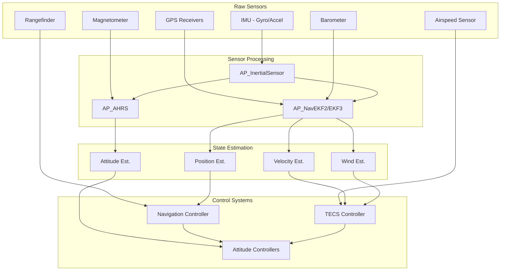
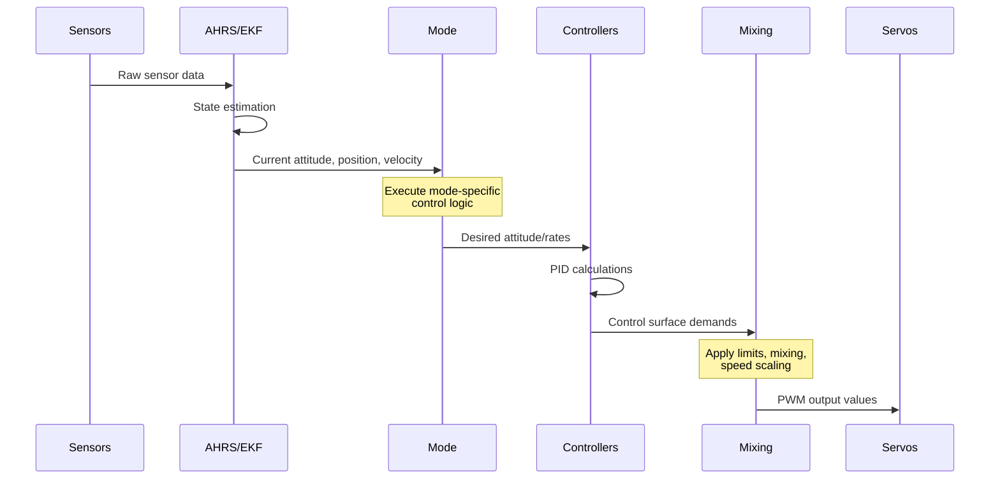
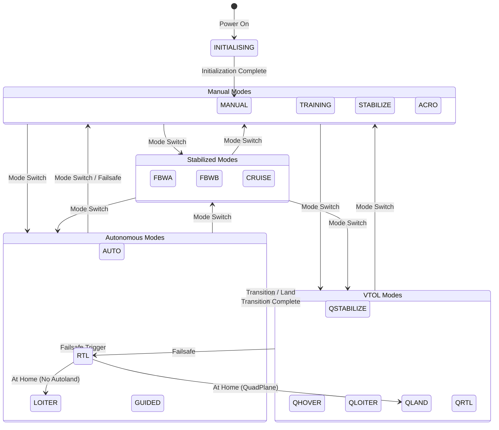
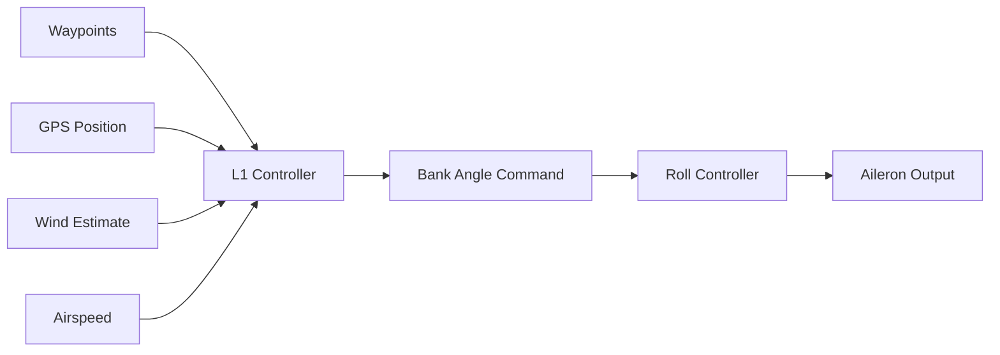
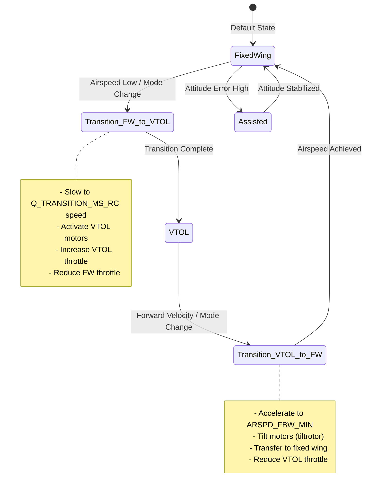

# ArduPlane

  

## Table of Contents

- [Overview](#overview)
- [System Architecture](#system-architecture)
  - [Plane Class Structure](#plane-class-structure)
  - [Main Loop and Scheduler](#main-loop-and-scheduler)
  - [Sensor Integration Pipeline](#sensor-integration-pipeline)
  - [Control Flow](#control-flow)
- [Flight Modes](#flight-modes)
  - [Mode Overview](#mode-overview)
  - [Manual Control Modes](#manual-control-modes)
  - [Stabilized Modes](#stabilized-modes)
  - [Autonomous Modes](#autonomous-modes)
  - [QuadPlane VTOL Modes](#quadplane-vtol-modes)
  - [Mode Transitions](#mode-transitions)
- [Control Architecture](#control-architecture)
  - [Attitude Control](#attitude-control)
  - [Navigation Control](#navigation-control)
  - [TECS (Total Energy Control System)](#tecs-total-energy-control-system)
  - [Speed Scaling](#speed-scaling)
- [QuadPlane/VTOL Integration](#quadplanevtol-integration)
- [Safety Systems](#safety-systems)
  - [Failsafe Mechanisms](#failsafe-mechanisms)
  - [Arming Checks](#arming-checks)
  - [Geofence](#geofence)
  - [Advanced Failsafe](#advanced-failsafe)
- [Hardware Integration](#hardware-integration)
  - [Supported Autopilot Boards](#supported-autopilot-boards)
  - [Sensor Configuration](#sensor-configuration)
  - [Servo and Motor Outputs](#servo-and-motor-outputs)
  - [RC Input Configuration](#rc-input-configuration)
- [Configuration and Tuning](#configuration-and-tuning)
  - [Parameter Groups](#parameter-groups)
  - [Tuning Guide](#tuning-guide)
- [Examples and Testing](#examples-and-testing)
- [Development and Contributing](#development-and-contributing)
- [References](#references)

---

## Overview

ArduPlane is the fixed-wing and VTOL (Vertical Take-Off and Landing) aircraft control system within the ArduPilot autopilot suite. It provides comprehensive flight control capabilities for conventional fixed-wing aircraft, tail-sitters, tilt-rotors, and quad-plane VTOL configurations.

**Key Capabilities:**
- **Multi-vehicle Support**: Traditional fixed-wing, QuadPlane VTOL, tail-sitter, and tilt-rotor configurations
- **Advanced Flight Modes**: 27 flight modes from manual to fully autonomous operation
- **Sophisticated Control**: TECS energy management, L1 navigation controller, PID attitude control
- **Safety Systems**: Comprehensive failsafe mechanisms, geofencing, and advanced failsafe (AFS)
- **Mission Planning**: Waypoint navigation, survey patterns, automated landing
- **VTOL Transitions**: Seamless transitions between fixed-wing and multicopter flight

**Source Files**: 
- Primary class definition: `/ArduPlane/Plane.h` (lines 131-190)
- Main implementation: `/ArduPlane/Plane.cpp`
- Mode framework: `/ArduPlane/mode.h`, `/ArduPlane/mode.cpp`

**Lead Developers**: Andrew Tridgell, Tom Pittenger

---

## System Architecture

### Plane Class Structure

The `Plane` class (defined in `Plane.h:131`) inherits from `AP_Vehicle` and serves as the central coordinator for all aircraft subsystems. The class manages:

**Core Components** (Source: `Plane.h:195-257`):

```cpp
// Aircraft configuration parameters
AP_FixedWing aparm;                      // Fixed-wing specific parameters
Parameters g;                             // Global parameters (group 1)
ParametersG2 g2;                          // Global parameters (group 2)

// Control systems
AP_TECS TECS_controller;                  // Total Energy Control System
AP_L1_Control L1_controller;              // L1 navigation controller
AP_RollController rollController;         // Roll attitude controller
AP_PitchController pitchController;       // Pitch attitude controller
AP_YawController yawController;           // Yaw/rudder controller
AP_SteerController steerController;       // Ground steering controller

// RC input mapping
RCMapper rcmap;                           // RC channel mapping
RC_Channel *channel_roll;                 // Roll input channel
RC_Channel *channel_pitch;                // Pitch input channel
RC_Channel *channel_throttle;             // Throttle input channel
RC_Channel *channel_rudder;               // Rudder input channel
```

**Subsystem Integration**:
The Plane class coordinates numerous subsystems including:
- Sensor systems (IMU, GPS, barometer, airspeed, compass)
- Navigation and mission management
- Communication (MAVLink GCS interface)
- Logging and telemetry
- Camera and payload control
- Terrain following and avoidance

**Friend Classes**: The Plane class declares 26+ friend classes (lines 133-188) to enable tight integration with modes, QuadPlane, and specialized subsystems while maintaining encapsulation.

### Main Loop and Scheduler

ArduPlane uses the AP_Scheduler framework to execute tasks at precise rates with priority-based scheduling. The scheduler table is defined in `Plane.cpp:62-150`.

**Fast Tasks** (Run every loop iteration, typically 50-400Hz):
```cpp
FAST_TASK(ahrs_update)           // Update attitude estimation (EKF/DCM)
FAST_TASK(update_control_mode)   // Execute current mode's control logic
FAST_TASK(stabilize)             // Run attitude stabilization controllers
FAST_TASK(set_servos)            // Output to servo/motor channels
```

**Scheduled Tasks** (Rate-controlled, source: `Plane.cpp:68-149`):

| Task | Rate (Hz) | Max Time (μs) | Priority | Purpose |
|------|-----------|---------------|----------|---------|
| `read_radio` | 50 | 100 | 6 | Read RC input channels |
| `check_short_failsafe` | 50 | 100 | 9 | Monitor RC signal loss |
| `update_speed_height` | 50 | 200 | 12 | TECS speed/height control |
| `update_GPS_50Hz` | 50 | 300 | 30 | High-rate GPS processing |
| `navigate` | 10 | 150 | 36 | L1 navigation controller |
| `update_compass` | 10 | 200 | 39 | Compass data processing |
| `ekf_check` | 10 | 75 | 54 | EKF health monitoring |
| `GCS::update_receive` | 300 | 500 | 57 | MAVLink message reception |
| `GCS::update_send` | 300 | 750 | 60 | MAVLink telemetry transmission |
| `check_long_failsafe` | 3 | 400 | 96 | Long-term failsafe monitoring |
| `Log_Write_FullRate` | 400 | 300 | 117 | High-rate logging |

**Scheduling Principles**:
- Lower priority numbers indicate higher priority execution
- Each task has a maximum execution time budget
- Fast tasks execute every loop regardless of timing
- The scheduler ensures critical tasks complete before lower-priority tasks
- Timing overruns are logged and monitored for system health

### Sensor Integration Pipeline

ArduPlane integrates data from multiple sensor types through a hierarchical fusion architecture:



**Sensor Data Flow** (Source: `Plane.cpp:64`, `sensors.cpp`):
1. **Raw Data Acquisition**: IMU samples at 1kHz+, other sensors at their native rates
2. **Preprocessing**: Calibration, filtering, error detection (handled by sensor libraries)
3. **State Estimation**: EKF fuses multi-sensor data for optimal state estimates
4. **Control Input**: Controllers consume estimated states to generate control outputs

**Key Features**:
- **Multi-IMU Support**: Automatic IMU selection and fallback
- **GPS Blending**: Combines multiple GPS receivers for enhanced reliability
- **Airspeed Validation**: Cross-checks airspeed against GPS ground speed and synthetic estimates
- **EKF Health Monitoring**: Continuous innovation variance checking (`ekf_check.cpp`)

### Control Flow

The complete control flow from sensor input to actuator output follows this path:



**Execution Details** (Source: `Plane.cpp:62-67`):
1. **AHRS Update** (`ahrs_update`): Propagate EKF state, update attitude quaternion
2. **Mode Update** (`update_control_mode`): Mode-specific logic generates control targets
3. **Stabilization** (`stabilize`): PID controllers convert targets to surface demands
4. **Servo Output** (`set_servos`): Mix, scale, limit, and output to hardware

---

## Flight Modes

### Mode Overview

ArduPlane supports 27 distinct flight modes, each designed for specific flight phases or control requirements. Modes are defined in `mode.h:38-75`.

**Mode Categories**:
- **Manual**: Direct pilot control (MANUAL, TRAINING)
- **Stabilized**: Pilot control with stability augmentation (STABILIZE, ACRO, FBWA, FBWB, CRUISE)
- **Autonomous**: Full autopilot control (AUTO, RTL, LOITER, GUIDED)
- **Special Purpose**: CIRCLE, TAKEOFF, THERMAL, AUTOLAND
- **QuadPlane VTOL**: QSTABILIZE, QHOVER, QLOITER, QLAND, QRTL, QACRO, QAUTOTUNE

**Mode Enumeration** (Source: `mode.h:38-73`):

```cpp
enum Number : uint8_t {
    MANUAL        = 0,   // Full manual control, no stabilization
    CIRCLE        = 1,   // Automatic circling around a point
    STABILIZE     = 2,   // Stability augmentation on all axes
    TRAINING      = 3,   // Manual with level flight assist
    ACRO          = 4,   // Rate-controlled acrobatic mode
    FLY_BY_WIRE_A = 5,   // Assisted flight mode A (pitch/roll)
    FLY_BY_WIRE_B = 6,   // Assisted flight mode B (auto-altitude)
    CRUISE        = 7,   // Like FBWB with ground track heading hold
    AUTOTUNE      = 8,   // Automated PID tuning
    AUTO          = 10,  // Mission execution mode
    RTL           = 11,  // Return to launch
    LOITER        = 12,  // Circle at current location
    TAKEOFF       = 13,  // Automated takeoff
    AVOID_ADSB    = 14,  // ADSB avoidance mode
    GUIDED        = 15,  // External guidance (GCS/companion)
    INITIALISING  = 16,  // Startup mode
    QSTABILIZE    = 17,  // QuadPlane stabilize
    QHOVER        = 18,  // QuadPlane hover
    QLOITER       = 19,  // QuadPlane loiter
    QLAND         = 20,  // QuadPlane land
    QRTL          = 21,  // QuadPlane RTL
    QAUTOTUNE     = 22,  // QuadPlane autotune
    QACRO         = 23,  // QuadPlane acro
    THERMAL       = 24,  // Autonomous thermal soaring
    LOITER_ALT_QLAND = 25,  // Loiter then QLAND
    AUTOLAND      = 26,  // Automated fixed-wing landing
};
```

### Manual Control Modes

**MANUAL (0)** - Direct Control
- **Source**: `mode_manual.cpp`
- **Control**: Pilot has direct control over all surfaces and throttle
- **Stabilization**: None - pure manual flying
- **Use Case**: Experienced pilots, aerobatics, testing
- **Safety**: No failsafe protection except basic RC loss handling
- **Parameters**: None mode-specific

```cpp
// Source: mode_manual.cpp:update()
void ModeManual::update()
{
    // Direct pass-through of pilot inputs to surfaces
    SRV_Channels::set_output_scaled(SRV_Channel::k_aileron, plane.roll_in_expo(false));
    SRV_Channels::set_output_scaled(SRV_Channel::k_elevator, plane.pitch_in_expo(false));
    output_rudder_and_steering(plane.rudder_in_expo(false));
    SRV_Channels::set_output_scaled(SRV_Channel::k_throttle, plane.get_throttle_input());
}
```

**TRAINING (3)** - Level Flight Assistance  
- **Source**: `mode_training.cpp`
- **Control**: Manual with automatic roll and pitch limit enforcement
- **Stabilization**: Prevents excessive bank angles and climbs/dives
- **Use Case**: Pilot training, learning to fly
- **Roll Limit**: Enforced LIM_ROLL_CD limit
- **Pitch Limit**: Enforced LIM_PITCH_MAX/LIM_PITCH_MIN limits

### Stabilized Modes

**STABILIZE (2)** - Full Stability Augmentation
- **Source**: `mode_stabilize.cpp`
- **Control**: Pilot inputs command desired bank and pitch angles
- **Stabilization**: Full PID control on all three axes
- **Roll**: Bank angle proportional to stick input (up to LIM_ROLL_CD)
- **Pitch**: Pitch angle proportional to stick input
- **Yaw**: Coordinated turns with rudder mixing
- **Throttle**: Manual control by pilot

```cpp
// Source: mode_stabilize.cpp:update()
void ModeStabilize::update()
{
    // Get pilot desired bank angle
    plane.nav_roll_cd = plane.channel_roll->norm_input() * plane.roll_limit_cd;
    
    // Get pilot desired pitch angle  
    plane.nav_pitch_cd = plane.channel_pitch->norm_input() * plane.aparm.pitch_limit_max_cd;
    
    // Stabilize using PID controllers
    plane.stabilize();
}
```

**ACRO (4)** - Rate Controlled Acrobatics
- **Source**: `mode_acro.cpp`
- **Control**: Pilot inputs command angular rates (deg/s)
- **Stabilization**: Rate controllers maintain commanded rates
- **Roll Rate**: ACRO_ROLL_RATE (deg/s)
- **Pitch Rate**: ACRO_PITCH_RATE (deg/s)
- **Yaw Rate**: ACRO_YAW_RATE (deg/s)
- **Throttle**: Manual control
- **Use Case**: Aerobatics, 3D flying, aggressive maneuvering

**FLY BY WIRE A (5)** - Assisted Fixed-Wing Flight
- **Source**: `mode_fbwa.cpp`  
- **Control**: Pilot commands roll and pitch with auto-coordination
- **Stabilization**: Bank angle and pitch angle hold
- **Features**:
  - Automatic turn coordination
  - Pitch limiting based on throttle (STAB_PITCH_DOWN)
  - Speed-based control surface scaling
  - Optional low-throttle pitch compensation
- **Use Case**: General flying, easier handling than manual

**FLY BY WIRE B (6)** - Auto-Altitude Mode
- **Source**: `mode_fbwb.cpp`
- **Control**: Pilot commands bank angle; altitude held automatically
- **Altitude**: Pitch controls airspeed; throttle controls altitude
- **Features**:
  - Automatic altitude hold
  - Target airspeed based on throttle stick position
  - Optional altitude nudging with pitch stick
  - Airspeed hold when enabled (FBWB_CLIMB_RATE = 0)
- **Use Case**: Long-duration flights, FPV flying

**CRUISE (7)** - Ground Track Following
- **Source**: `mode_cruise.cpp`
- **Control**: Like FBWB with automatic heading hold
- **Navigation**: L1 controller maintains ground track
- **Features**:
  - Locks ground track when stick centered
  - Bank angle commands change heading
  - Automatic altitude hold like FBWB
  - Wind compensation for straight ground tracks
- **Use Case**: Long-distance cruising, survey work

### Autonomous Modes

**AUTO (10)** - Mission Execution
- **Source**: `mode_auto.cpp`
- **Control**: Fully autonomous following uploaded waypoint mission
- **Navigation**: L1 controller for waypoint tracking
- **Altitude**: TECS manages speed and altitude targets
- **Features**:
  - Waypoint navigation
  - DO_XXX command execution
  - Geofence integration
  - Automated takeoff and landing sequences
  - Rally point support
- **Parameters**: Mission-specific from `mission.cpp`

**RTL (11)** - Return to Launch
- **Source**: `mode_rtl.cpp`
- **Control**: Autonomous return to launch location
- **Behavior**:
  1. Climb to RTL_ALTITUDE (if below)
  2. Navigate to home/rally point using L1
  3. Circle or proceed to landing based on RTL_AUTOLAND
  4. Execute automatic landing if enabled
- **Parameters**:
  - RTL_ALTITUDE: Return altitude (meters)
  - RTL_AUTOLAND: Enable automatic landing (0=circle, 1=autoland, 2=immediate land)
  - RTL_RADIUS: Loiter radius at home (meters)

**LOITER (12)** - Circle at Location
- **Source**: `mode_loiter.cpp`
- **Control**: Circle at current or specified location
- **Navigation**: L1 controller for circular path
- **Radius**: WP_LOITER_RAD parameter (meters)
- **Altitude**: Maintains entry altitude or commanded altitude
- **Direction**: Clockwise or counter-clockwise based on parameter
- **Use Case**: Orbit point of interest, hold position

**GUIDED (15)** - External Control
- **Source**: `mode_guided.cpp`
- **Control**: Accept real-time navigation commands from GCS or companion
- **Commands Supported**:
  - Goto location (lat/lon/alt)
  - Set attitude (roll/pitch/yaw/throttle)
  - Set velocity (NED frame)
  - Set position target with velocity
- **Timeout**: Reverts to previous mode if no updates received
- **Use Case**: Companion computer control, dynamic missions

### QuadPlane VTOL Modes

ArduPlane includes comprehensive VTOL support through the QuadPlane framework (see [QuadPlane/VTOL Integration](#quadplanevtol-integration) for details). QuadPlane-specific modes are available when `Q_ENABLE = 1`.

**QSTABILIZE (17)** - Multicopter Stabilize
- **Source**: `mode_qstabilize.cpp`  
- **Control**: Manual multicopter mode with attitude stabilization
- **Hover**: Uses copter motors for hover
- **Throttle**: Manual altitude control
- **Similar to**: Copter STABILIZE mode

**QHOVER (18)** - Multicopter Altitude Hold
- **Source**: `mode_qhover.cpp`
- **Control**: Manual horizontal control with automatic altitude hold
- **Altitude**: Automatic using barometer/rangefinder
- **Throttle**: Controls climb rate
- **Similar to**: Copter ALT_HOLD mode

**QLOITER (19)** - Multicopter Position Hold
- **Source**: `mode_qloiter.cpp`
- **Control**: GPS position hold with manual override
- **Position**: Automatic hold using GPS
- **Stick Input**: Moves position target
- **Similar to**: Copter LOITER mode

**QLAND (20)** - Multicopter Descent and Land
- **Source**: `mode_qland.cpp`
- **Control**: Automatic vertical descent and landing
- **Descent Rate**: Q_LAND_SPEED parameter
- **Final Phase**: Slows near ground, detects landing
- **Disarm**: Automatic after landing detection

**QRTL (21)** - Multicopter Return and Land
- **Source**: `mode_qrtl.cpp`
- **Control**: Return to launch in multicopter mode
- **Behavior**:
  1. Climb to Q_RTL_ALT (if below)
  2. Fly to home using position controller
  3. Descend and land like QLAND
- **Use Case**: VTOL return from mission

**QACRO (23)** - Multicopter Acro
- **Source**: `mode_qacro.cpp`
- **Control**: Rate-controlled multicopter aerobatics
- **Stabilization**: Angular rate control only
- **Rates**: Q_ACRO_RLL_RATE, Q_ACRO_PIT_RATE, Q_ACRO_YAW_RATE
- **Throttle**: Manual

### Mode Transitions

Mode transitions are managed by the Mode base class and vehicle-level logic. The system ensures safe transitions with appropriate state initialization.

**Transition Logic** (Source: `mode.cpp:16-108`):

```cpp
bool Mode::enter()
{
    // Reset flight state variables
    plane.auto_state.vtol_mode = is_vtol_mode();
    plane.prev_WP_loc = plane.current_loc;
    plane.crash_state.is_crashed = false;
    
    // Initialize mode-specific systems
    _enter();  // Call subclass enter method
    
    return true;  // Mode entry always succeeds
}

void Mode::exit()
{
    _exit();  // Call subclass exit method
    
    // Stop autotuning if leaving AUTOTUNE
    if (plane.control_mode != &plane.mode_autotune) {
        plane.autotune_restore();
    }
}
```

**Mode Transition State Machine**:



**Transition Validation**:
- **Arming State**: Some modes cannot be entered when disarmed
- **GPS Status**: AUTO, RTL, LOITER require GPS lock (unless using optical flow)
- **Home Set**: RTL requires valid home position
- **QuadPlane**: Q-modes require Q_ENABLE parameter set
- **Mission**: AUTO requires valid mission loaded

**Parameter-Controlled Transitions**:
- `FLTMODE1-6`: RC channel positions mapped to modes
- `FS_SHORT_ACTN`: Mode for short RC failsafe
- `FS_LONG_ACTN`: Mode for long RC failsafe
- `FENCE_ACTION`: Mode when geofence breached

---

## Control Architecture

ArduPlane implements a hierarchical control architecture with specialized controllers for different aspects of flight.

### Attitude Control

Attitude control uses PID controllers with feed-forward terms and speed-based gain scheduling.

**Roll Controller** (Source: `APM_Control/AP_RollController.cpp`):
```cpp
// Commanded bank angle -> aileron output
int32_t AP_RollController::get_rate_out(float desired_rate, float scaler)
{
    // Rate error
    float rate_error = desired_rate - AP::ahrs().get_gyro().x;
    
    // PID terms
    float proportional = rate_error * gains.P;
    integrator += rate_error * gains.I * delta_time;
    float derivative = (rate_error - last_error) / delta_time * gains.D;
    
    // Apply speed scaling
    return (proportional + integrator + derivative) * scaler;
}
```

**Key Features**:
- **Speed Scaling**: Control gains adjusted based on airspeed (see [Speed Scaling](#speed-scaling))
- **Integrator Management**: Anti-windup, decay during transitions
- **Roll Limiting**: Maximum bank angle from LIM_ROLL_CD parameter
- **Turn Coordination**: Automatic rudder mixing (KFF_RDDRMIX)

**Pitch Controller** (Source: `APM_Control/AP_PitchController.cpp`):
- Similar structure to roll controller
- Pitch rate damping (PTCH_RATE_D, PTCH_RATE_P)
- Trim compensation
- Neutral point calculation for varying CG

**Yaw Controller** (Source: `APM_Control/AP_YawController.cpp`):
- Yaw rate damping
- Sideslip coordination
- Ground steering integration (when on ground)

### Navigation Control

ArduPlane uses the L1 navigation controller for waypoint tracking and path following.

**L1 Controller Overview** (Source: `AP_L1_Control/AP_L1_Control.cpp`):
- **Algorithm**: L1 adaptive path following
- **Benefits**: Smooth turns, wind compensation, consistent tracking
- **Output**: Commanded bank angle to follow desired ground track



**Key Parameters**:
- `NAVL1_PERIOD`: L1 controller period (affects turn aggressiveness)
- `NAVL1_DAMPING`: Damping ratio for path following
- `WP_RADIUS`: Waypoint acceptance radius

**Navigation Modes**:
1. **Waypoint**: Point-to-point navigation
2. **Loiter**: Circular path at specified radius
3. **Return**: Straight-line return to home
4. **Heading**: Maintain specified heading

### TECS (Total Energy Control System)

TECS provides coordinated speed and altitude control by managing the aircraft's total energy.

**Energy Equations**:
- **Potential Energy**: PE = m × g × h (altitude)
- **Kinetic Energy**: KE = ½ × m × v² (airspeed)
- **Total Energy**: TE = PE + KE

**Control Strategy** (Source: `AP_TECS/AP_TECS.cpp`):
- **Throttle**: Controls total energy (TE rate)
- **Pitch**: Controls energy distribution (speed vs altitude)
- **Decoupling**: Allows independent speed and altitude control

```cpp
// Simplified TECS control (actual implementation more complex)
void AP_TECS::_update_pitch_throttle(void)
{
    // Energy errors
    float STE_error = _SPE_dem - _SPE_est;  // Specific total energy error
    float SKE_error = _SKE_dem - _SKE_est;  // Specific kinetic energy error
    
    // Control outputs
    throttle_out = STE_controller.get_output(STE_error);  // Throttle controls total energy
    pitch_out = SKE_controller.get_output(SKE_error);     // Pitch distributes energy
}
```

**TECS Parameters** (Source: `Parameters.cpp`, `AP_TECS`):
- `TECS_CLMB_MAX`: Maximum climb rate (m/s)
- `TECS_SINK_MIN`: Minimum sink rate (m/s)
- `TECS_SINK_MAX`: Maximum sink rate (m/s)
- `TECS_TIME_CONST`: Time constant for altitude/speed response
- `TECS_THR_DAMP`: Throttle damping gain
- `TECS_PTCH_DAMP`: Pitch damping gain
- `TECS_SPDWEIGHT`: Weighting between speed and altitude errors (0-2)

**Benefits**:
- Handles varying airspeeds gracefully
- Maintains speed through altitude changes
- Adapts to different aircraft types
- Provides consistent climb/descent performance

### Speed Scaling

Control surface effectiveness varies with airspeed. Speed scaling adjusts controller gains to maintain consistent response.

**Speed Scaling Calculation** (Source: `Attitude.cpp:8-58`):

```cpp
float Plane::calc_speed_scaler(void)
{
    float aspeed, speed_scaler;
    
    if (ahrs.airspeed_estimate(aspeed)) {
        // Scale based on configured scaling speed vs actual airspeed
        speed_scaler = g.scaling_speed / aspeed;
        
        // Constrain to reasonable range
        const float scale_min = MIN(0.5, g.scaling_speed / (2.0 * aparm.airspeed_max));
        const float scale_max = MAX(2.0, g.scaling_speed / (0.7 * airspeed_min));
        speed_scaler = constrain_float(speed_scaler, scale_min, scale_max);
    }
    
    return speed_scaler;
}
```

**Key Concepts**:
- **Reference Speed** (SCALING_SPEED): Airspeed at which gains are nominal
- **Low Speed**: Gains increased (more surface deflection needed)
- **High Speed**: Gains decreased (less surface deflection needed)
- **Scaling Factor**: Applied to all PID controller outputs

**Example**:
- SCALING_SPEED = 15 m/s
- Current airspeed = 20 m/s
- Speed scaler = 15/20 = 0.75
- Controller outputs multiplied by 0.75 (less deflection at higher speed)

---

## QuadPlane/VTOL Integration

ArduPlane includes comprehensive support for VTOL aircraft through the QuadPlane framework. This enables vertical takeoff and landing combined with efficient fixed-wing cruise flight.

**QuadPlane Overview** (Source: `quadplane.h`, `quadplane.cpp`):

The QuadPlane class extends fixed-wing capabilities with multicopter control. Key features include:

- **VTOL Flight**: Full multicopter control for hover and low-speed flight
- **Fixed-Wing Flight**: Traditional plane control for cruise
- **Automatic Transitions**: Seamless switching between VTOL and fixed-wing modes
- **Assisted Flight**: VTOL motors aid fixed-wing flight in challenging conditions
- **Multiple Configurations**: Tailsitter, tilt-rotor, standard QuadPlane

**QuadPlane Configurations**:

1. **Standard QuadPlane** (`Q_FRAME_CLASS = 1`):
   - Separate VTOL motors (typically quad) + forward motor/prop
   - Most common configuration
   - Simple transition logic

2. **Tailsitter** (`Q_FRAME_CLASS = 10`):
   - Aircraft sits on tail, takes off vertically
   - All motors used for both VTOL and forward flight
   - Complex transition dynamics

3. **Tiltrotor** (`Q_TILT_ENABLE = 1`):
   - Motors tilt between vertical and horizontal
   - Smooth transition capability
   - More complex mechanically

**Transition Logic** (Source: `quadplane.cpp`):



**Key QuadPlane Parameters**:
- `Q_ENABLE`: Enable QuadPlane (1 = enabled)
- `Q_FRAME_CLASS`: Frame type (1=Quad, 2=Hexa, 10=Tailsitter)
- `Q_TRANSITION_MS`: Transition timeout (milliseconds)
- `Q_ASSIST_SPEED`: Airspeed below which VTOL assist engages
- `Q_RTL_MODE`: RTL behavior (0=QRTL, 1=RTL)
- `Q_TILT_ENABLE`: Enable tiltrotor support

**VTOL Assist** (Source: `quadplane.cpp:assist_enabled()`):
When enabled, VTOL motors automatically engage during fixed-wing flight to prevent stalls or attitude loss:
- Activates below Q_ASSIST_SPEED airspeed
- Provides attitude correction in high bank/pitch angles
- Helps during aggressive maneuvers
- Automatic and transparent to pilot

For complete QuadPlane documentation, see [`QUADPLANE.md`](QUADPLANE.md).

---

## Safety Systems

ArduPlane implements multiple layers of safety systems to protect the aircraft and ensure safe operation.

### Failsafe Mechanisms

**Failsafe Philosophy** (Source: `failsafe.cpp:3-11`):
ArduPlane implements multiple failsafe strategies:
1. **Main Loop Watchdog**: Detects system lockup and passes through RC inputs
2. **RC Failsafe**: Handles loss of RC signal (short and long-term)
3. **GCS Failsafe**: Handles loss of ground station communication
4. **Battery Failsafe**: Responds to low battery conditions
5. **EKF Failsafe**: Handles navigation system failures

**Main Loop Watchdog** (Source: `failsafe.cpp:17-100`):

```cpp
void Plane::failsafe_check(void)
{
    // Called from timer interrupt at 1kHz
    uint32_t tnow = micros();
    
    if (tnow - last_timestamp > 200000) {
        // Main loop hasn't run for 200ms - system locked up
        in_failsafe = true;
        
        // Pass RC inputs directly to outputs
        rc().read_input();
        float roll = roll_in_expo(false);
        float pitch = pitch_in_expo(false);
        float throttle = get_throttle_input(true);
        float rudder = rudder_in_expo(false);
        
        // Output directly to servos
        SRV_Channels::set_output_scaled(SRV_Channel::k_aileron, roll);
        SRV_Channels::set_output_scaled(SRV_Channel::k_elevator, pitch);
        SRV_Channels::set_output_scaled(SRV_Channel::k_throttle, throttle);
        SRV_Channels::set_output_scaled(SRV_Channel::k_rudder, rudder);
    }
}
```

**RC Failsafe** (Source: `failsafe.cpp`, `check_short_failsafe`, `check_long_failsafe`):

| Failsafe Type | Trigger Condition | Action | Parameter |
|---------------|-------------------|--------|-----------|
| **Short Failsafe** | RC signal lost < 1.5s | Mode change or continue | `FS_SHORT_ACTN` |
| **Long Failsafe** | RC signal lost > 1.5s | RTL, FBWA, or continue | `FS_LONG_ACTN` |

**Short Failsafe Actions** (`FS_SHORT_ACTN`):
- `0`: Continue (no action)
- `1`: CIRCLE mode
- `2`: RTL mode
- `3`: FBWA mode (for glide)
- `4`: QLAND mode (QuadPlane)

**Long Failsafe Actions** (`FS_LONG_ACTN`):
- `0`: Continue
- `1`: RTL mode
- `2`: FBWA glide
- `3`: QLAND mode (QuadPlane)

**Battery Failsafe** (Source: `events.cpp`, `BattMonitor` library):
- **Low Battery**: Warning only (MAV_SYS_STATUS_SENSOR message)
- **Critical Battery**: Forced RTL or LAND based on `BATT_FS_LOW_ACT`
- **Remaining Capacity**: Can trigger RTL when percentage drops below threshold

**GCS Failsafe** (Source: `failsafe.cpp`):
- Triggered when no MAVLink heartbeat from GCS for `FS_GCS_ENABL` seconds
- Actions: Continue, RTL, or configured mode
- Parameter: `FS_GCS_ENABL` (0=disabled, >0=timeout in seconds)

**EKF Failsafe** (Source: `ekf_check.cpp`):

```cpp
void Plane::ekf_check(void)
{
    // Check EKF health
    nav_filter_status filt_status = ahrs.get_filter_status();
    
    // Monitor innovation variance gates
    if (!filt_status.flags.horiz_pos_abs && !filt_status.flags.pred_horiz_pos_abs) {
        // EKF has lost position reference
        ekf_failsafe_action();
    }
    
    // Check innovation test ratios
    float vel_variance, pos_variance, hgt_variance;
    Vector3f mag_variance;
    ahrs.get_variances(vel_variance, pos_variance, hgt_variance, mag_variance, tas_variance, offset);
    
    // Trigger failsafe if variances exceed thresholds
}
```

**EKF Failsafe Actions**:
- Switch to DCM attitude estimation (if EKF-only features not required)
- Trigger GCS warning
- Optionally trigger mode change or RTL
- Parameter: `FS_EKF_ACTION` (0=report only, 1=mode change)

### Arming Checks

Pre-arm safety checks prevent arming with unsafe configurations. Implemented in `AP_Arming_Plane.cpp`.

**Arming Check Categories** (Source: `AP_Arming_Plane.cpp`):

```cpp
bool AP_Arming_Plane::pre_arm_checks(bool report)
{
    // Mandatory checks (cannot be disabled)
    if (!board_voltage_checks()) return false;
    if (!mission_checks()) return false;
    if (!rc_calibration_checks()) return false;
    
    // Optional checks (controlled by ARMING_CHECK bitmask)
    if (!ins_checks(report)) return false;          // IMU health
    if (!compass_checks(report)) return false;       // Compass calibration
    if (!gps_checks(report)) return false;           // GPS lock and accuracy
    if (!barometer_checks(report)) return false;     // Barometer health
    if (!airspeed_checks(report)) return false;      // Airspeed sensor (if required)
    if (!logging_checks(report)) return false;       // Logging availability
    if (!battery_checks(report)) return false;       // Battery voltage/capacity
    if (!terrain_checks(report)) return false;       // Terrain data (if required)
}
```

**Arming Check Parameters**:
- `ARMING_CHECK`: Bitmask of checks to perform
  - Bit 0: All checks
  - Bit 1: Barometer
  - Bit 2: Compass
  - Bit 3: GPS lock
  - Bit 4: INS (IMU)
  - Bit 5: Parameters
  - Bit 6: RC channels
  - Bit 7: Board voltage
  - Bit 8: Battery level
  - Bit 10: Logging
  - Bit 11: Switch positions
  - Bit 12: GPS accuracy

**Safety Interlocks**:
- **Rudder Arming**: Hold rudder right to arm (if enabled)
- **Switch Arming**: Aux switch can be configured for arming
- **GCS Arming**: MAVLink arm/disarm commands
- **Safety Button**: Hardware safety switch on some boards

**Arming Restrictions**:
- Cannot arm in AUTO mode (unless AUTO_OPTIONS set)
- Cannot arm with mission items requiring GPS unless GPS is locked
- Cannot arm with invalid home position for RTL
- Cannot arm with critical battery condition

### Geofence

The geofence system creates virtual boundaries to contain the aircraft.

**Fence Types** (Source: `fence.cpp`, `AC_Fence` library):
1. **Maximum Altitude**: Ceiling above home
2. **Maximum Distance**: Cylinder around home
3. **Inclusion Fence**: Polygon the aircraft must stay within
4. **Exclusion Fence**: Polygon areas the aircraft must avoid

**Fence Parameters**:
- `FENCE_ENABLE`: Enable fence system (0=disabled, 1=enabled)
- `FENCE_ACTION`: Action on fence breach (0=report only, 1=RTL, 2=land, 3=guided)
- `FENCE_ALT_MAX`: Maximum altitude above home (meters)
- `FENCE_ALT_MIN`: Minimum altitude (for avoiding terrain)
- `FENCE_RADIUS`: Maximum distance from home (meters)
- `FENCE_MARGIN`: Margin inside fence for breach warnings (meters)
- `FENCE_TYPE`: Bitmask of enabled fence types

**Fence Breach Handling** (Source: `fence.cpp:breach_action()`):
```cpp
void Plane::fence_breach_action(void)
{
    switch (g2.fence.get_action()) {
        case AC_Fence::ACTION_RTL:
            // Switch to RTL mode
            set_mode(mode_rtl, ModeReason::FENCE_BREACHED);
            break;
            
        case AC_Fence::ACTION_LAND:
            // Land immediately (QLAND for QuadPlane, else descend)
            set_mode(mode_qland, ModeReason::FENCE_BREACHED);
            break;
            
        case AC_Fence::ACTION_GUIDED:
            // Fly to fence return point
            guided_mode_return_point();
            break;
    }
    
    // Log fence breach
    logger.Write_Error(LogErrorSubsystem::FAILSAFE_FENCE, 
                      LogErrorCode::FAILSAFE_OCCURRED);
}
```

**Recovery**:
- Fence can be disabled in-flight via switch or GCS
- Once clear of fence, manual mode recovery is possible
- Fence breach count logged for analysis

### Advanced Failsafe

The Advanced Failsafe (AFS) system provides additional safety for regulatory compliance (e.g., OBC rules).

**AFS Features** (Source: `afs_plane.cpp`, `AP_AdvancedFailsafe`):
- **Termination**: Can cut motor power for controlled crash
- **Manual Recovery**: Requires specific RC input sequence to recover
- **GPS Quality Monitoring**: Triggers on sustained poor GPS
- **Geofence Integration**: Coordinates with standard geofence
- **Communication Loss**: Enhanced GCS loss handling

**AFS Parameters** (`afs_plane.cpp`):
- `AFS_ENABLE`: Enable advanced failsafe
- `AFS_WP_COMMS`: Waypoint on communication loss
- `AFS_WP_GPS_LOSS`: Waypoint on GPS loss
- `AFS_TERMINATE`: Enable termination capability
- `AFS_TERM_ACTION`: Termination action (0=land, 1=terminate)
- `AFS_AMSL_LIMIT`: Absolute altitude limit (MSL)
- `AFS_AMSL_ERR_GPS`: GPS accuracy required at high altitude

**Use Case**: 
AFS is primarily used for regulatory compliance in regions requiring fail-safe termination systems for UAVs.

---

## Hardware Integration

### Supported Autopilot Boards

ArduPlane runs on a wide variety of autopilot hardware through the AP_HAL (Hardware Abstraction Layer).

**Board Categories**:
- **Pixhawk Family**: Pixhawk 1-6, Cube (Black/Orange/Purple/Yellow), MindPX
- **Proprietary Boards**: mRo boards, Holybro boards, Hex boards
- **Custom Boards**: Community-developed hardware
- **SITL**: Software-in-the-loop simulation on PC

**Hardware Requirements**:
- STM32 microcontroller (F4, F7, or H7 series)
- IMU (gyroscope + accelerometer)
- Barometer (for altitude)
- Minimum 1MB flash, 256KB RAM (more recommended for full features)
- SD card for logging (highly recommended)

**Board Selection**: Configured at build time using waf build system
```bash
./waf configure --board Pixhawk4
./waf plane
```

### Sensor Configuration

**Primary Sensors** (Source: `sensors.cpp`):

**IMU (Inertial Measurement Unit)**:
- Detects accelerometers and gyroscopes at startup
- Supports multiple concurrent IMUs (up to 3)
- Automatic selection of best IMU
- Parameters:
  - `INS_GYRO_FILTER`: Gyro low-pass filter cutoff frequency
  - `INS_ACCEL_FILTER`: Accelerometer low-pass filter cutoff
  - `INS_USE`, `INS_USE2`, `INS_USE3`: Enable/disable specific IMUs

**Barometer**:
- Altitude and vertical speed estimation
- Multiple barometer support with automatic selection
- Parameters:
  - `BARO_ALT_OFFSET`: Altitude offset (meters)
  - `BARO_PRIMARY`: Primary barometer selection

**GPS**:
- Position and velocity estimation
- Supports uBlox, HERE, NMEA, SBF, GSOF protocols
- Dual GPS blending for redundancy
- RTK for centimeter-level accuracy
- Parameters:
  - `GPS_TYPE`: Protocol type (1=AUTO, 2=uBlox, 3=NMEA, etc.)
  - `GPS_AUTO_SWITCH`: Enable automatic GPS switching
  - `GPS_BLEND_MASK`: GPS blending enable

**Compass (Magnetometer)**:
- Heading reference
- Multiple compass support (internal + external)
- Automatic declination correction
- Parameters:
  - `COMPASS_USE`, `COMPASS_USE2`, `COMPASS_USE3`: Enable compasses
  - `COMPASS_AUTODEC`: Automatic declination
  - `COMPASS_EXTERNAL`: Use external compass
  - `COMPASS_ORIENT`: Compass orientation

**Airspeed Sensor**:
- Measures pitot pressure for true airspeed
- Critical for fixed-wing performance
- Can operate without (synthesized airspeed)
- Parameters:
  - `ARSPD_TYPE`: Sensor type (0=None, 1=I2C-MS4525, 2=Analog, etc.)
  - `ARSPD_USE`: Enable airspeed sensor
  - `ARSPD_FBW_MIN`: Minimum airspeed for FBW modes
  - `ARSPD_FBW_MAX`: Maximum airspeed for FBW modes
  - `ARSPD_AUTOCAL`: Enable automatic calibration

**Rangefinder**:
- Measures height above ground
- Used for landing, terrain following
- Supports multiple types (Lidar, sonar, radar)
- Parameters:
  - `RNGFND1_TYPE`: Rangefinder type
  - `RNGFND1_ORIENT`: Mounting orientation
  - `RNGFND1_MAX_CM`: Maximum reliable range

### Servo and Motor Outputs

**Output Configuration** (Source: `servos.cpp`, `SRV_Channel` library):

ArduPlane uses the SRV_Channel library for flexible output configuration.

**Standard Servo Assignments**:
```cpp
// Typical fixed-wing configuration
SRV_Channel::k_aileron        // Channel 1: Ailerons
SRV_Channel::k_elevator       // Channel 2: Elevator
SRV_Channel::k_throttle       // Channel 3: Throttle/ESC
SRV_Channel::k_rudder         // Channel 4: Rudder

// Additional channels
SRV_Channel::k_flap           // Flaps
SRV_Channel::k_flap_auto      // Auto flaps
SRV_Channel::k_airbrake       // Air brakes
SRV_Channel::k_steering       // Ground steering (tail wheel/nose wheel)
```

**Servo Function Parameters** (`SERVOn_FUNCTION`):
Each output channel has a function assignment:
- `0`: Disabled
- `1-4`: Dedicated functions (roll/pitch/throttle/yaw)
- `19-21`: Flaps
- `24`: Differential spoilers
- `26`: Ground steering
- `33-36`: Motor outputs (QuadPlane motors)
- `70`: Throttle left
- `73`: Throttle right

**Servo Configuration Parameters**:
```cpp
// For each servo channel (n = 1-16)
SERVOn_FUNCTION   // What the channel controls
SERVOn_MIN        // Minimum PWM value (typically 1000μs)
SERVOn_MAX        // Maximum PWM value (typically 2000μs)
SERVOn_TRIM       // Neutral PWM value (typically 1500μs)
SERVOn_REVERSED   // Reverse servo direction (0 or 1)
```

**Motor Control** (Source: `servos.cpp`):
```cpp
void Plane::set_servos(void)
{
    // This is the final output stage called every loop
    
    // Calculate control surface demands
    // (already done in stabilize() or by mode)
    
    // Apply mixing (elevons, v-tails, etc.)
    servos_output();
    
    // Handle flaps
    set_servos_flaps();
    
    // Handle throttle
    SRV_Channels::set_output_scaled(SRV_Channel::k_throttle, 
                                    get_throttle_out());
    
    // QuadPlane motors (if enabled)
    quadplane.update();
    
    // Write to hardware
    SRV_Channels::calc_pwm();
    SRV_Channels::output_ch_all();
}
```

**Mixing**:
ArduPlane supports various airframe configurations:
- **Elevons**: Combined aileron + elevator (flying wings)
- **V-Tail**: Combined elevator + rudder
- **Differential Spoilers**: Roll control via spoilers
- **Flaperon**: Combined flaps + ailerons
- **Dual Motor**: Left/right motors for differential thrust

**Mixing Parameters**:
- `MIXING_GAIN`: Overall mixing gain
- `ELEVON_OUTPUT`: Enable elevon mixing
- `VTAIL_OUTPUT`: Enable v-tail mixing

### RC Input Configuration

**RC Input** (Source: `radio.cpp`, `RC_Channel` library):

**Input Protocols Supported**:
- PPM (Pulse Position Modulation)
- SBUS (Futaba)
- DSM/DSM2/DSMX (Spektrum)
- SUMD (Graupner)
- SRXL (Multiplex)
- IBUS (FlySky)
- CRSF (TBS Crossfire)
- FPort (FrSky)

**RC Channel Mapping** (Source: `radio.cpp`, `RCMapper`):
```cpp
// Default AETR mapping
rcmap.roll()     = 1;  // Channel 1 = Aileron
rcmap.pitch()    = 2;  // Channel 2 = Elevator
rcmap.throttle() = 3;  // Channel 3 = Throttle
rcmap.yaw()      = 4;  // Channel 4 = Rudder
```

**RC Parameters**:
```cpp
// Channel mapping
RCMAP_ROLL      // Roll input channel (default 1)
RCMAP_PITCH     // Pitch input channel (default 2)
RCMAP_THROTTLE  // Throttle input channel (default 3)
RCMAP_YAW       // Rudder input channel (default 4)

// Trim and calibration (for each channel)
RCn_MIN         // Minimum PWM value (typically 1000μs)
RCn_MAX         // Maximum PWM value (typically 2000μs)
RCn_TRIM        // Center/neutral PWM value (typically 1500μs)
RCn_DZ          // Deadzone around trim (PWM units)
RCn_REVERSED    // Reverse channel direction

// Expo (smoothing around center stick)
RC_EXPO         // Exponential factor for roll/pitch inputs
```

**Mode Selection**:
Flight modes are typically selected via a 6-position switch mapped to RC channel 5:
```cpp
// Mode switch positions -> Flight mode parameters
FLTMODE_CH = 5   // RC channel for mode selection (typically 5)
FLTMODE1 = 0     // Mode for switch position 1 (MANUAL)
FLTMODE2 = 2     // Mode for switch position 2 (STABILIZE)
FLTMODE3 = 5     // Mode for switch position 3 (FBWA)
FLTMODE4 = 7     // Mode for switch position 4 (CRUISE)
FLTMODE5 = 10    // Mode for switch position 5 (AUTO)
FLTMODE6 = 11    // Mode for switch position 6 (RTL)
```

**Auxiliary Functions**:
RC channels 6-16 can trigger auxiliary functions:
- Arming/disarming
- Camera trigger
- Geofence enable/disable
- Parachute release
- Servo position override
- Autotune enable
- Terrain disable

---

## Configuration and Tuning

### Parameter Groups

ArduPlane has 800+ parameters organized into logical groups. Key groups include:

**Global Parameters** (Source: `Parameters.cpp:10-500`, `Parameters.h`):
```cpp
// Format: Name, DisplayName, Description, Default Value

// Flight behavior
STICK_MIXING          // Stick mixing in auto modes
SCALING_SPEED         // Speed for control scaling (m/s)
AUTOTUNE_LEVEL        // Autotune aggressiveness (1-10)

// Limits
LIM_ROLL_CD           // Maximum roll angle (centidegrees)
LIM_PITCH_MAX         // Maximum pitch up angle (centidegrees)
LIM_PITCH_MIN         // Maximum pitch down angle (centidegrees)

// Tuning
KFF_RDDRMIX           // Rudder mixing into aileron
KFF_THR2PTCH          // Throttle to pitch compensation
STAB_PITCH_DOWN       // Pitch down at low throttle (deg)
```

**Airspeed Parameters** (`ARSPD_*`):
```cpp
ARSPD_TYPE            // Sensor type (0=None, 1=I2C, 2=Analog)
ARSPD_USE             // Enable airspeed sensor
ARSPD_FBW_MIN         // Minimum target airspeed (m/s)
ARSPD_FBW_MAX         // Maximum target airspeed (m/s)
ARSPD_CRUISE          // Cruising airspeed (m/s)
```

**TECS Parameters** (`TECS_*`):
```cpp
TECS_CLMB_MAX         // Maximum climb rate (m/s)
TECS_SINK_MIN         // Minimum sink rate (m/s)
TECS_SINK_MAX         // Maximum sink rate (m/s)
TECS_TIME_CONST       // Controller time constant (s)
TECS_PITCH_MIN        // Minimum pitch angle (deg)
TECS_PITCH_MAX        // Maximum pitch angle (deg)
```

**PID Controller Parameters**:
```cpp
// Roll controller (RLL2SRV_*)
RLL2SRV_TCONST        // Time constant for roll response
RLL2SRV_RMAX          // Maximum roll rate (deg/s)
RLL2SRV_P             // Proportional gain
RLL2SRV_I             // Integral gain
RLL2SRV_D             // Derivative gain
RLL2SRV_IMAX          // Maximum integrator value

// Pitch controller (PTCH2SRV_*)
PTCH2SRV_TCONST       // Time constant for pitch response
PTCH2SRV_RMAX_UP      // Maximum pitch up rate (deg/s)
PTCH2SRV_RMAX_DN      // Maximum pitch down rate (deg/s)
PTCH2SRV_P            // Proportional gain
PTCH2SRV_I            // Integral gain
PTCH2SRV_D            // Derivative gain

// Yaw controller (YAW2SRV_*)
YAW2SRV_SLIP          // Sideslip gain
YAW2SRV_RLL           // Roll rate contribution
```

**QuadPlane Parameters** (`Q_*`) - see [QUADPLANE.md](QUADPLANE.md):
```cpp
Q_ENABLE              // Enable QuadPlane (0/1)
Q_FRAME_CLASS         // Frame type (1=Quad, 2=Hexa, 10=Tailsitter)
Q_TRANSITION_MS       // Transition timeout (ms)
Q_ASSIST_SPEED        // Airspeed for VTOL assist (m/s)
Q_RTL_MODE            // RTL mode (0=QRTL, 1=plane RTL)
```

**Safety Parameters**:
```cpp
// Arming
ARMING_CHECK          // Pre-arm check bitmask

// Failsafe
FS_SHORT_ACTN         // Short RC failsafe action
FS_LONG_ACTN          // Long RC failsafe action
FS_GCS_ENABL          // GCS failsafe enable/timeout

// Geofence
FENCE_ENABLE          // Enable geofence
FENCE_ACTION          // Action on breach
FENCE_ALT_MAX         // Maximum altitude (m)
FENCE_RADIUS          // Maximum radius (m)
```

### Tuning Guide

**Initial Setup**:
1. **Configure RC inputs and outputs** (mandatory)
   - Calibrate all RC channels
   - Verify servo directions
   - Set trim values

2. **Sensor calibration** (mandatory)
   - Accelerometer calibration (level flight critical)
   - Compass calibration (heading accuracy)
   - Airspeed sensor calibration (if installed)
   - RC calibration

3. **Set aircraft parameters** (before first flight)
   - `ARSPD_FBW_MIN`: Stall speed + 30%
   - `ARSPD_FBW_MAX`: Maximum safe speed
   - `ARSPD_CRUISE`: Efficient cruise speed
   - `THR_MIN`, `THR_MAX`: Motor throttle range
   - `TRIM_THROTTLE`: Throttle for level flight
   - `LIM_ROLL_CD`: Maximum bank angle (typically 60° = 6000)
   - `LIM_PITCH_MAX/MIN`: Pitch angle limits

**Manual Tuning Process**:

**Step 1: FBWA Mode Tuning**
Tune in FBWA mode first for basic stability:

1. **Roll tuning** (RLL2SRV_*):
   ```
   - Start with RLL2SRV_P = 1.0
   - Fly and command sharp rolls
   - If response is sluggish, increase P
   - If oscillation occurs, decrease P
   - Add D gain (typically P/10) to reduce overshoot
   ```

2. **Pitch tuning** (PTCH2SRV_*):
   ```
   - Start with PTCH2SRV_P = 1.0
   - Command pitch changes
   - Tune similar to roll
   - Ensure trim is correct first
   ```

3. **Yaw tuning** (YAW2SRV_*):
   ```
   - YAW2SRV_SLIP controls sideslip damping
   - Start with 0, increase if nose wanders in turns
   - YAW2SRV_RLL coordinates turns
   ```

**Step 2: TECS Tuning**
After basic stability, tune TECS for altitude and speed control:

1. **Time constant** (`TECS_TIME_CONST`):
   - Controls how aggressively TECS responds
   - Start with 5.0 seconds
   - Lower for faster response (more aggressive)
   - Higher for gentler response (more stable)

2. **Climb/sink rates**:
   ```
   TECS_CLMB_MAX = 5.0    // Maximum climb (m/s)
   TECS_SINK_MIN = 2.0    // Minimum sink (m/s)
   TECS_SINK_MAX = 5.0    // Maximum sink (m/s)
   ```

3. **Speed vs altitude weighting** (`TECS_SPDWEIGHT`):
   - 1.0 = Equal weight (default)
   - < 1.0 = Prioritize altitude
   - > 1.0 = Prioritize speed

**Step 3: Autotune** (recommended)
ArduPlane includes automatic PID tuning:

1. Fly in FBWA mode at safe altitude
2. Switch to AUTOTUNE mode
3. Aircraft executes automated tuning maneuvers
4. Hold switch in AUTOTUNE until complete (5-10 minutes)
5. Return to FBWA - tuning automatically saved
6. Parameters: `AUTOTUNE_LEVEL` (1-10, default 6)

**L1 Navigation Tuning**:
```cpp
NAVL1_PERIOD = 18     // Period for L1 controller (seconds)
                      // Lower = tighter turns, more aggressive
                      // Higher = gentler turns, wider paths
                      // Typical range: 15-25 seconds

NAVL1_DAMPING = 0.75  // Damping ratio
                      // Typical: 0.7-0.85
                      // Higher = more damping, less overshoot
```

**Advanced Tuning**:
- **Speed scaling** (`SCALING_SPEED`): Set to typical cruise speed
- **Throttle damping** (`TECS_THR_DAMP`): Reduces throttle oscillations
- **Pitch damping** (`TECS_PTCH_DAMP`): Reduces pitch oscillations
- **Integrator limits** (`*_IMAX`): Prevents integrator windup

**Common Issues**:
| Symptom | Likely Cause | Solution |
|---------|--------------|----------|
| Oscillation in roll | P gain too high | Decrease RLL2SRV_P |
| Sluggish roll response | P gain too low | Increase RLL2SRV_P |
| Altitude hunting | TECS_TIME_CONST too low | Increase to 6-8 |
| Speed oscillation | TECS_THR_DAMP too low | Increase damping |
| Wide turns | NAVL1_PERIOD too high | Decrease period |
| Overshoot waypoints | NAVL1_PERIOD too low | Increase period |

---

## Examples and Testing

**Autotest Framework** (Source: `Tools/autotest/arduplane.py`):

ArduPlane includes comprehensive automated testing using the SITL (Software In The Loop) simulator.

**Running Tests**:
```bash
# Run all ArduPlane tests
./Tools/autotest/autotest.py --vehicle=plane

# Run specific test
./Tools/autotest/autotest.py --vehicle=plane --test-name="RTL"

# Run SITL for manual testing
sim_vehicle.py -v ArduPlane --console --map
```

**Test Coverage** (`Tools/autotest/arduplane.py`):
- All flight modes (MANUAL through AUTOLAND)
- Failsafe scenarios (RC loss, GPS loss, EKF failure)
- Mission execution (waypoints, loiter, RTL)
- Geofence breaches
- Terrain following
- QuadPlane transitions
- Autotune execution
- Advanced failsafe

**Example Test Structure**:
```python
# Source: Tools/autotest/arduplane.py
def test_rtl(self):
    """Test RTL mode behavior"""
    self.takeoff()
    self.fly_to_waypoint(1000, 1000, 100)  # Fly away from home
    self.set_mode('RTL')                    # Trigger RTL
    self.wait_distance_to_home(0, 50, timeout=120)  # Wait for return
    self.wait_altitude(-10, 10, relative=True)  # Wait for altitude
```

**Manual Testing Examples**:

**Example 1: Basic Flight Test**
```bash
# Start SITL
sim_vehicle.py -v ArduPlane

# In console:
arm throttle
mode FBWA
rc 3 1700        # Increase throttle
rc 1 1800        # Roll right
rc 2 1300        # Pitch up
```

**Example 2: Mission Flight**
```python
# Upload simple mission via MAVProxy
wp load mission.txt

# Mission file (mission.txt):
QGC WPL 110
0   1   0   16  0   0   0   0   -35.363  149.165  584  1
1   0   3   22  15  0   0   0   -35.361  149.165  100  1
2   0   3   16  0   0   0   0   -35.361  149.170  100  1
3   0   3   16  0   0   0   0   -35.365  149.170  100  1
4   0   3   16  0   0   0   0   -35.365  149.165  100  1
5   0   3   20  0   0   0   0   -35.363  149.165  100  1

# Arm and execute
arm throttle
mode AUTO
```

**Log Analysis**:
All flights are logged to SD card (or SITL dataflash logs):
```bash
# Review logs using MAVExplorer
mavexplorer.py logfile.bin

# Plot attitude tracking
graph ATT.Roll ATT.DesRoll
graph ATT.Pitch ATT.DesPitch

# Plot TECS performance
graph TECS.h TECS.dh
graph TECS.sp TECS.sp_dem
```

---

## Development and Contributing

**Development Resources**:
- **Source Repository**: https://github.com/ArduPilot/ardupilot
- **Developer Wiki**: https://ardupilot.org/dev/
- **Discourse Forum**: https://discuss.ardupilot.org/
- **Discord Chat**: https://ardupilot.org/discord

**Build System** (waf):
```bash
# Configure for specific board
./waf configure --board Pixhawk4

# Build ArduPlane
./waf plane

# Build for SITL
./waf configure --board sitl
./waf plane

# Build with debugging
./waf configure --board sitl --debug
./waf plane
```

**Coding Standards**:
- C++11 standard
- Follow existing code style (see CODING_STYLE.md)
- Document all public methods with Doxygen comments
- Add unit tests for new features
- Test in SITL before hardware

**Adding a New Feature**:
1. Fork repository on GitHub
2. Create feature branch
3. Implement feature with tests
4. Test thoroughly in SITL
5. Test on hardware
6. Submit pull request with documentation
7. Respond to code review

**File Organization**:
```
ArduPlane/
├── Plane.h              # Main class declaration
├── Plane.cpp            # Scheduler and initialization
├── mode.h               # Mode base class
├── mode_*.cpp           # Individual mode implementations
├── Attitude.cpp         # Attitude control
├── navigation.cpp       # Navigation logic
├── system.cpp           # System initialization
├── Parameters.h/cpp     # Parameter definitions
├── failsafe.cpp         # Failsafe logic
├── sensors.cpp          # Sensor reading
├── servos.cpp           # Servo output
├── radio.cpp            # RC input
├── GCS_MAVLink_*.cpp    # MAVLink communication
├── Log.cpp              # Logging
└── quadplane.*          # QuadPlane integration
```

**Key Libraries** (in `libraries/`):
- `AP_HAL`: Hardware abstraction layer
- `AP_InertialSensor`: IMU management
- `AP_GPS`: GPS drivers
- `AP_AHRS`: Attitude/heading estimation
- `AP_NavEKF2/3`: Extended Kalman Filter
- `APM_Control`: PID controllers (roll, pitch, yaw)
- `AP_TECS`: Total energy control system
- `AP_L1_Control`: L1 navigation controller
- `AP_Mission`: Mission management
- `GCS_MAVLink`: MAVLink protocol

---

## References

**Documentation**:
- ArduPlane User Guide: https://ardupilot.org/plane/
- ArduPilot Developer Guide: https://ardupilot.org/dev/
- MAVLink Protocol: https://mavlink.io/

**Source Code References**:
- Main Class: `ArduPlane/Plane.h` (line 131)
- Scheduler Tasks: `ArduPlane/Plane.cpp` (lines 62-150)
- Mode Definitions: `ArduPlane/mode.h` (lines 38-75)
- Mode Transitions: `ArduPlane/mode.cpp` (lines 16-108)
- Parameters: `ArduPlane/Parameters.cpp` (lines 10-500)
- Failsafe Logic: `ArduPlane/failsafe.cpp` (lines 17-100)
- Attitude Control: `ArduPlane/Attitude.cpp` (lines 8-58)
- Arming Checks: `ArduPlane/AP_Arming_Plane.cpp`
- Fence: `ArduPlane/fence.cpp`
- Advanced Failsafe: `ArduPlane/afs_plane.cpp`
- QuadPlane: `ArduPlane/quadplane.h`, `ArduPlane/quadplane.cpp`

**Papers and Algorithms**:
- L1 Navigation: "Nonlinear Model Predictive Control of an Unmanned Air Vehicle" (Park, Deyst, How)
- TECS: "Total Energy Control System for Aircraft" (Lambregts)
- EKF: "Inertial Navigation Using an Extended Kalman Filter" (Priseborough)

**Community**:
- Discussion Forum: https://discuss.ardupilot.org/c/arduplane/
- Facebook Group: ArduPilot Plane
- YouTube Channel: ArduPilot (tutorials and demonstrations)

---

**Document Version**: 1.0  
**Last Updated**: 2024  
**ArduPlane Version**: 4.5+  
**Maintainers**: Andrew Tridgell, Tom Pittenger, ArduPilot Development Team

For detailed QuadPlane/VTOL documentation, see [QUADPLANE.md](QUADPLANE.md).

