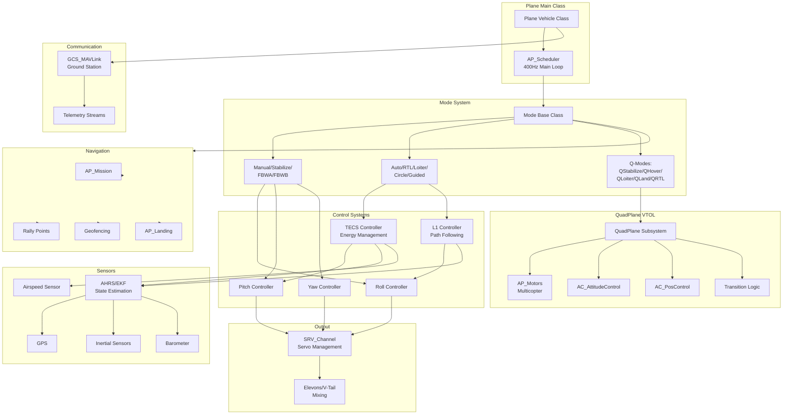

# ArduPlane

## Overview

ArduPlane is the fixed-wing aircraft control system within the ArduPilot autopilot suite, providing comprehensive flight control for conventional airplanes, flying wings, and hybrid VTOL (Vertical Take-Off and Landing) aircraft through the QuadPlane subsystem. ArduPlane implements advanced energy management via TECS (Total Energy Control System), precise navigation through L1 guidance algorithms, and supports over 26 flight modes ranging from manual control to fully autonomous missions.

As a production-grade autopilot system, ArduPlane integrates sensor fusion (GPS, IMU, barometer, airspeed), sophisticated control algorithms (PID-based attitude control with TECS energy coupling), failsafe mechanisms, and MAVLink-based communication with ground control stations. The system is designed for safety-critical operations with comprehensive pre-flight checks, multiple failsafe layers, and geofencing capabilities.

## Architecture

The ArduPlane architecture centers around the `Plane` class as the main vehicle coordinator, integrating multiple subsystems for flight control, navigation, and safety management:


```mermaid
graph TB
    subgraph "Plane Main Class"
        Plane[Plane Vehicle Class]
        Scheduler[AP_Scheduler<br/>400Hz Main Loop]
    end
    
    subgraph "Mode System"
        Mode[Mode Base Class]
        ManualModes[Manual/Stabilize/<br/>FBWA/FBWB]
        AutoModes[Auto/RTL/Loiter/<br/>Circle/Guided]
        QModes[Q-Modes:<br/>QStabilize/QHover/<br/>QLoiter/QLand/QRTL]
    end
    
    subgraph "Control Systems"
        TECS[TECS Controller<br/>Energy Management]
        L1[L1 Controller<br/>Path Following]
        Roll[Roll Controller]
        Pitch[Pitch Controller]
        Yaw[Yaw Controller]
    end
    
    subgraph "QuadPlane VTOL"
        QP[QuadPlane Subsystem]
        Motors[AP_Motors<br/>Multicopter]
        AttControl[AC_AttitudeControl]
        PosControl[AC_PosControl]
        Transition[Transition Logic]
    end
    
    subgraph "Sensors"
        GPS[GPS]
        IMU[Inertial Sensors]
        Airspeed[Airspeed Sensor]
        Baro[Barometer]
        AHRS[AHRS/EKF<br/>State Estimation]
    end
    
    subgraph "Navigation"
        Mission[AP_Mission]
        Rally[Rally Points]
        Fence[Geofencing]
        Landing[AP_Landing]
    end
    
    subgraph "Output"
        Servos[SRV_Channel<br/>Servo Management]
        Elevons[Elevons/V-Tail<br/>Mixing]
    end
    
    subgraph "Communication"
        GCS[GCS_MAVLink<br/>Ground Station]
        Telemetry[Telemetry Streams]
    end
    
    Plane --> Scheduler
    Scheduler --> Mode
    Mode --> ManualModes
    Mode --> AutoModes
    Mode --> QModes
    
    ManualModes --> Roll
    ManualModes --> Pitch
    ManualModes --> Yaw
    
    AutoModes --> TECS
    AutoModes --> L1
    TECS --> Pitch
    L1 --> Roll
    
    QModes --> QP
    QP --> Motors
    QP --> AttControl
    QP --> PosControl
    QP --> Transition
    
    AHRS --> GPS
    AHRS --> IMU
    AHRS --> Baro
    
    L1 --> AHRS
    TECS --> AHRS
    TECS --> Airspeed
    
    Mode --> Navigation
    Navigation --> Mission
    Navigation --> Rally
    Navigation --> Fence
    Navigation --> Landing
    
    Roll --> Servos
    Pitch --> Servos
    Yaw --> Servos
    Servos --> Elevons
    
    Plane --> GCS
    GCS --> Telemetry
```

## Key Components

### Plane Class (Plane.h / Plane.cpp)

The `Plane` class serves as the central coordinator for all fixed-wing operations:

- **Singleton Pattern**: Accessible via `plane` global instance
- **Scheduler Integration**: Runs main control loop at 400Hz with task scheduling for sensor updates, navigation, and control
- **Mode Management**: Maintains current `control_mode` pointer and handles mode transitions
- **Parameter System**: Contains `Parameters g` and `ParametersG2 g2` structures for configuration
- **Subsystem Coordination**: Integrates TECS, L1, QuadPlane, sensors, and communication systems

Source: ArduPlane/Plane.h:131-191, ArduPlane/Plane.cpp

### Mode System (mode.h / mode.cpp)

Flight modes inherit from the `Mode` base class, implementing a polymorphic mode architecture:

- **Mode Base Class**: Defines `enter()`, `exit()`, `run()`, and `update()` virtual methods
- **Mode Enumeration**: `Mode::Number` enum defines 26+ mode identifiers (MANUAL=0, STABILIZE=2, AUTO=10, etc.)
- **Mode Objects**: Each mode has a dedicated object (e.g., `mode_auto`, `mode_fbwa`, `mode_qstabilize`)
- **Current Mode Pointer**: `control_mode` points to the active mode object
- **Mode Entry/Exit**: Automatic state cleanup and initialization when switching modes

Source: ArduPlane/mode.h:29-100, ArduPlane/mode.cpp

### Individual Mode Implementations

Each flight mode is implemented in a dedicated `mode_*.cpp` file:

- **Manual Modes**: mode_manual.cpp, mode_stabilize.cpp, mode_acro.cpp, mode_training.cpp
- **Fly-By-Wire**: mode_fbwa.cpp (roll/pitch stabilized), mode_fbwb.cpp (altitude hold)
- **Auto Navigation**: mode_auto.cpp, mode_rtl.cpp, mode_loiter.cpp, mode_circle.cpp, mode_cruise.cpp, mode_guided.cpp
- **Takeoff/Landing**: mode_takeoff.cpp, mode_autoland.cpp
- **QuadPlane Modes**: mode_qstabilize.cpp, mode_qhover.cpp, mode_qloiter.cpp, mode_qland.cpp, mode_qrtl.cpp, mode_qacro.cpp, mode_qautotune.cpp
- **Special Modes**: mode_thermal.cpp (soaring), mode_avoidADSB.cpp, mode_autotune.cpp

Source: ArduPlane/mode_*.cpp (25+ files)

### TECS Controller (Total Energy Control System)

Energy management system coupling altitude and airspeed control:

- **Integration**: `AP_TECS TECS_controller` member in Plane class
- **Energy Approach**: Manages total energy (kinetic + potential) and energy distribution
- **Altitude/Airspeed Coupling**: Throttle controls total energy, elevator distributes between speed and altitude
- **Landing Flare**: Specialized flare control for touchdown with energy dissipation
- **Climb/Descent Optimization**: Optimal climb rates and descent paths based on aircraft performance

Source: ArduPlane/Plane.h:250, libraries/AP_TECS/

### L1 Navigation Controller

Path following guidance algorithm for waypoint navigation:

- **Integration**: `AP_L1_Control L1_controller` member providing navigation commands
- **L1 Algorithm**: Nonlinear guidance law for smooth path following with lookahead distance
- **Waypoint Tracking**: Calculates desired bank angle and track for waypoint navigation
- **Loiter Circles**: Generates circular paths with configurable radius
- **Wind Compensation**: Automatically compensates for wind drift
- **Crosstrack Error**: Minimizes lateral deviation from desired path

Source: ArduPlane/Plane.h:251, libraries/AP_L1_Control/

### Attitude Controllers

PID-based controllers for fixed-wing control surfaces:

- **Roll Controller** (`AP_RollController rollController`): Ailerons/elevons for roll control
- **Pitch Controller** (`AP_PitchController pitchController`): Elevator for pitch control  
- **Yaw Controller** (`AP_YawController yawController`): Rudder for yaw/sideslip control
- **Steering Controller** (`AP_SteerController steerController`): Ground steering during taxi

Source: ArduPlane/Plane.h:254-257, libraries/APM_Control/

### QuadPlane Subsystem (quadplane.h / quadplane.cpp)

Hybrid VTOL system integrating multicopter and fixed-wing flight:

- **QuadPlane Class**: Complete multicopter subsystem with motors, attitude control, and position control
- **Thrust Types**: Traditional SLT (Separate Lift and Thrust), Tailsitter, Tiltrotor configurations
- **Transition Logic**: Forward transitions (VTOL → fixed-wing) and back transitions (fixed-wing → VTOL)
- **Q-Modes**: Complete set of multicopter modes (QStabilize, QHover, QLoiter, QLand, QRTL, QAcro)
- **VTOL Assist**: Provides lift assist in fixed-wing modes when needed
- **Motor Integration**: Uses `AP_Motors` library for multicopter motor mixing
- **Attitude Control**: Integrates `AC_AttitudeControl_Multi` for multicopter stabilization
- **Position Control**: Uses `AC_PosControl` and `AC_WPNav` for VTOL navigation

Source: ArduPlane/quadplane.h:34-100, ArduPlane/quadplane.cpp

### Configuration System (Parameters.h / Parameters.cpp)

Hierarchical parameter storage with EEPROM persistence:

- **Parameters Structure**: `Parameters g` and `ParametersG2 g2` contain all configuration
- **Parameter Groups**: Flight modes (FLTMODE1-6), servo functions, control limits, TECS tuning, L1 tuning, QuadPlane configuration
- **Format Version**: `k_format_version = 13` for EEPROM compatibility management
- **AP_Param Integration**: Uses ArduPilot parameter system for storage and GCS access

Source: ArduPlane/Parameters.h:9-100, ArduPlane/Parameters.cpp

### Servo Management (servos.cpp)

Output mixing and control surface coordination:

- **SRV_Channel Library**: Maps functions (aileron, elevator, rudder, throttle) to physical outputs
- **Servo Functions**: Configurable via `SERVO*_FUNCTION` parameters
- **Elevon/V-Tail Mixing**: Automatic mixing for delta wings and V-tail configurations
- **Output Limits**: Min/max/trim values per servo channel
- **Flap Control**: Coordinated flap deployment with multiple stages

Source: ArduPlane/servos.cpp

### GCS Communication (GCS_Plane.h / GCS_MAVLink_Plane.cpp)

MAVLink protocol integration for ground control station communication:

- **GCS_Plane Class**: Vehicle-specific GCS interface implementation
- **Message Handlers**: Processes MAVLink commands (MAV_CMD_*) and messages
- **Telemetry Streams**: Configurable data streaming (position, attitude, status, parameters)
- **Parameter Protocol**: Remote parameter get/set operations
- **Mission Protocol**: Mission upload/download and current waypoint management
- **Command Protocol**: Handles mode changes, guided commands, and vehicle control

Source: ArduPlane/GCS_Plane.h, ArduPlane/GCS_MAVLink_Plane.cpp

### Safety Systems

Multiple layers of safety monitoring and response:

- **Failsafe Module** (failsafe.cpp): RC loss, GCS loss, battery failsafe detection and actions
- **Arming Checks** (AP_Arming_Plane): Pre-flight validation of sensors, calibration, and configuration
- **Geofencing** (fence.cpp): Altitude and horizontal boundary enforcement with breach actions
- **EKF Monitoring** (ekf_check.cpp): Navigation health checks and failsafe triggers
- **Battery Monitor**: Voltage/capacity monitoring with low battery failsafe
- **Stall Detection**: Airspeed monitoring with stall prevention logic

Source: ArduPlane/failsafe.cpp, ArduPlane/AP_Arming_Plane.cpp, ArduPlane/fence.cpp, ArduPlane/ekf_check.cpp

## Flight Modes

ArduPlane supports 26+ flight modes, each implementing specific control and navigation behavior:

### Manual Control Modes

#### MANUAL (Mode 0)
- **Control**: Direct RC input pass-through to servos with no stabilization
- **Use Case**: Manual flying for experienced pilots, testing servo operation
- **Safety**: No autopilot intervention; pilot has complete control
- **Arming**: Can arm in this mode

Source: ArduPlane/mode_manual.cpp

#### STABILIZE (Mode 2)
- **Control**: Bank angle and pitch angle stabilization with self-leveling
- **Pilot Input**: RC roll/pitch inputs command bank/pitch angles, autopilot maintains angles
- **Use Case**: Stabilized manual flying with automatic level return
- **Arming**: Can arm in this mode

Source: ArduPlane/mode_stabilize.cpp

#### TRAINING (Mode 3)
- **Control**: Stabilized mode with training-wheel protections
- **Features**: Prevents excessive roll/pitch angles, disengages stabilization when stick centered
- **Use Case**: Pilot training and learning
- **Arming**: Can arm in this mode

Source: ArduPlane/mode_training.cpp

#### ACRO (Mode 4)
- **Control**: Rate-based aerobatic mode (roll/pitch/yaw rate control)
- **Pilot Input**: Stick inputs command rotation rates for aerobatics
- **Use Case**: Aerobatic flying, advanced manual control
- **Arming**: Can arm in this mode

Source: ArduPlane/mode_acro.cpp

### Fly-By-Wire Modes

#### FLY_BY_WIRE_A (FBWA, Mode 5)
- **Control**: Roll and pitch angle stabilization with manual throttle
- **Features**: Bank angle limits, automatic pitch limits based on airspeed
- **Pilot Input**: Roll stick → bank angle, pitch stick → pitch angle, direct throttle control
- **Use Case**: Stabilized flight with pilot-controlled energy management
- **Arming**: Can arm in this mode

Source: ArduPlane/mode_fbwa.cpp

#### FLY_BY_WIRE_B (FBWB, Mode 6)
- **Control**: Roll angle stabilization with altitude hold and manual throttle
- **Features**: Maintains altitude with elevator, airspeed control via throttle
- **Pilot Input**: Roll → bank angle, pitch → climb/descent rate, throttle → airspeed
- **Use Case**: Stabilized cruising with altitude hold
- **Arming**: Can arm in this mode

Source: ArduPlane/mode_fbwb.cpp

#### CRUISE (Mode 7)
- **Control**: Similar to FBWB with ground course hold (maintains ground track)
- **Features**: Altitude hold, heading lock, wind compensation
- **Pilot Input**: Roll commands turn, pitch commands climb/descent
- **Use Case**: Long-distance cruising with minimal pilot input
- **Arming**: Can arm in this mode

Source: ArduPlane/mode_cruise.cpp

### Automatic Navigation Modes

#### AUTO (Mode 10)
- **Control**: Fully autonomous mission execution following waypoints
- **Navigation**: Uses L1 controller for path following, TECS for energy management
- **Features**: Executes DO_* commands, supports rally points, automatic landing sequences
- **Mission Items**: Supports waypoints, loiter, circle, land, takeoff, camera triggers, etc.
- **Failsafe**: Can return to manual control or RTL on RC/GCS loss
- **Arming**: Cannot arm in this mode (must arm in manual mode first)

Source: ArduPlane/mode_auto.cpp

#### RTL (Return To Launch, Mode 11)
- **Control**: Automatic return to launch location or nearest rally point
- **Behavior**: Climbs to RTL altitude, navigates to home/rally, circles or lands
- **Features**: Configurable RTL altitude, can automatically land or circle  
- **Radius**: Uses L1 navigation to approach with configurable radius
- **Arming**: Cannot arm in this mode

Source: ArduPlane/mode_rtl.cpp

#### LOITER (Mode 12)
- **Control**: Circles around a specified point at current altitude
- **Navigation**: Maintains circular path with configurable radius and direction
- **Features**: Can change loiter radius and direction via parameters or commands
- **Use Case**: Waiting, aerial photography, survey patterns
- **Arming**: Cannot arm in this mode

Source: ArduPlane/mode_loiter.cpp

#### CIRCLE (Mode 1)
- **Control**: Circles around a point with continuous rotation
- **Difference from Loiter**: Fixed circle mode vs. Loiter which can be exited
- **Features**: Configurable radius and rate
- **Use Case**: Testing, demonstration, specific mission requirements
- **Arming**: Can arm in this mode

Source: ArduPlane/mode_circle.cpp

#### GUIDED (Mode 15)
- **Control**: Commanded navigation from GCS or companion computer
- **Features**: Accepts MAVLink GUIDED commands for position/attitude targets
- **Use Case**: Companion computer control, dynamic mission changes, research
- **Commands**: SET_POSITION_TARGET_GLOBAL_INT, DO_REPOSITION, attitude commands
- **Arming**: Cannot arm in this mode

Source: ArduPlane/mode_guided.cpp

### Takeoff and Landing Modes

#### TAKEOFF (Mode 13)
- **Control**: Automatic takeoff sequence
- **Ground Roll**: Maintains heading, applies full throttle
- **Rotation**: Pitches up at configured speed
- **Climb**: Climbs to target altitude, then switches to next mode or circles
- **Safety**: Monitors airspeed, prevents premature rotation
- **Arming**: Must arm in manual mode, then switch to TAKEOFF

Source: ArduPlane/mode_takeoff.cpp

#### AUTOLAND (Mode 26)
- **Control**: Dedicated automatic landing mode (if enabled)
- **Approach**: Follows approach path with TECS energy management
- **Flare**: Executes landing flare at configured altitude
- **Touchdown**: Throttle reduction, maintains runway heading
- **Use Case**: Standalone landing without full AUTO mission
- **Arming**: Cannot arm in this mode

Source: ArduPlane/mode_autoland.cpp (if MODE_AUTOLAND_ENABLED)

### QuadPlane VTOL Modes

#### QSTABILIZE (Mode 17)
- **Control**: Multicopter stabilize mode (angle stabilization)
- **Pilot Input**: Direct roll/pitch/yaw control with throttle for altitude
- **Use Case**: Manual VTOL flight with stabilization
- **Requires**: QuadPlane configuration (Q_ENABLE=1)
- **Arming**: Can arm in this mode

Source: ArduPlane/mode_qstabilize.cpp

#### QHOVER (Mode 18)
- **Control**: Multicopter position and altitude hold
- **Features**: Maintains current position and altitude using GPS
- **Pilot Input**: Small adjustments to position, automatic hold when centered
- **Use Case**: VTOL hovering, aerial photography
- **Arming**: Can arm in this mode

Source: ArduPlane/mode_qhover.cpp

#### QLOITER (Mode 19)
- **Control**: Multicopter loiter with position hold
- **Features**: GPS position hold, altitude hold, wind compensation
- **Pilot Input**: Commands velocity changes, returns to center when released
- **Use Case**: VTOL waypoint holding, stable platform
- **Arming**: Can arm in this mode

Source: ArduPlane/mode_qloiter.cpp

#### QLAND (Mode 20)
- **Control**: Automatic multicopter landing sequence
- **Descent**: Controlled descent rate to ground
- **Touchdown Detection**: Monitors thrust/altitude for landing detection
- **Disarm**: Automatically disarms after touchdown
- **Use Case**: Safe VTOL landing
- **Arming**: Cannot arm in this mode

Source: ArduPlane/mode_qland.cpp

#### QRTL (Mode 21)
- **Control**: Return to launch in VTOL mode
- **Behavior**: Climbs to safe altitude, navigates to home, descends and lands
- **Difference from RTL**: Uses multicopter mode throughout, vertical landing
- **Use Case**: VTOL return and landing
- **Arming**: Cannot arm in this mode

Source: ArduPlane/mode_qrtl.cpp

#### QACRO (Mode 23)
- **Control**: Rate-based multicopter acrobatic mode
- **Pilot Input**: Commands rotation rates in roll/pitch/yaw
- **Use Case**: VTOL aerobatics, manual rate control
- **Arming**: Can arm in this mode

Source: ArduPlane/mode_qacro.cpp

#### QAUTOTUNE (Mode 22)
- **Control**: Automatic multicopter PID tuning (if enabled)
- **Process**: Excites control axes, measures response, adjusts gains
- **Requirements**: Safe altitude, stable conditions
- **Use Case**: Optimizing VTOL control performance
- **Arming**: Cannot arm in this mode

Source: ArduPlane/mode_qautotune.cpp (if QAUTOTUNE_ENABLED)

#### LOITER_ALT_QLAND (Mode 25)
- **Control**: Loiter until reaching altitude threshold, then QLAND
- **Behavior**: Circles in fixed-wing mode, transitions to VTOL landing at altitude
- **Use Case**: Hybrid approach - efficient fixed-wing loiter with VTOL landing
- **Arming**: Cannot arm in this mode

Source: ArduPlane/mode_loiter_qland.cpp

### Special Modes

#### AUTOTUNE (Mode 8)
- **Control**: Automatic fixed-wing PID tuning
- **Process**: Flies level, excites roll/pitch axes, measures response
- **Safety**: Requires safe altitude, clear airspace
- **Use Case**: Optimizing fixed-wing control gains
- **Arming**: Cannot arm in this mode

Source: ArduPlane/mode_autotune.cpp

#### THERMAL (Mode 24)
- **Control**: Thermal soaring mode (if HAL_SOARING_ENABLED)
- **Behavior**: Detects thermals via variometer, circles to climb
- **Features**: Automatic thermal centering, energy management
- **Use Case**: Unpowered glider flight, range extension
- **Arming**: Cannot arm in this mode

Source: ArduPlane/mode_thermal.cpp (if HAL_SOARING_ENABLED)

#### AVOID_ADSB (Mode 14)
- **Control**: ADSB collision avoidance mode (if HAL_ADSB_ENABLED)
- **Behavior**: Maintains current path with automatic avoidance maneuvers
- **Features**: Detects ADSB traffic, calculates avoidance vectors
- **Use Case**: Airspace deconfliction
- **Arming**: Cannot arm in this mode

Source: ArduPlane/mode_avoidADSB.cpp (if HAL_ADSB_ENABLED)

#### INITIALISING (Mode 16)
- **Control**: Initial startup mode
- **Behavior**: Temporary mode during system initialization
- **Duration**: Transitions to default flight mode after initialization complete
- **Use Case**: System internal use only

Source: ArduPlane/mode_initializing.cpp

## TECS Energy Management

The Total Energy Control System (TECS) provides sophisticated energy management by coupling altitude and airspeed control, treating the aircraft as an energy system rather than separate height and speed controllers.

### TECS Concept

**Total Energy**: The sum of kinetic energy (airspeed) and potential energy (altitude)

```
Total Energy = (1/2 * m * v²) + (m * g * h)
```

**Energy Distribution**: Balance between speed and altitude at constant total energy

**Control Approach**:
- **Throttle**: Controls total energy (increases/decreases total energy)
- **Elevator**: Distributes energy between speed and altitude (trades kinetic for potential energy)

### TECS Controllers

1. **Total Energy Controller**: Maintains total energy using throttle
   - Monitors energy error (difference between desired and actual)
   - Commands throttle to add or remove energy

2. **Energy Distribution Controller**: Maintains speed/altitude balance using elevator
   - Trades altitude for speed or speed for altitude
   - Keeps energy distribution at desired setpoint

### TECS Integration in ArduPlane

**Controller Instance**: `AP_TECS TECS_controller` in Plane class

**Inputs**:
- Desired altitude (from navigation system)
- Desired airspeed (from mode logic or mission)
- Current altitude (from AHRS/barometer)
- Current airspeed (from airspeed sensor or synthetic)
- Vertical speed (from inertial navigation)
- Acceleration (for rate limiting)

**Outputs**:
- Throttle demand (-100 to +100%)
- Pitch demand (radians)

**Update Frequency**: Called at main loop rate (typically 50-400Hz depending on mode)

Source: libraries/AP_TECS/AP_TECS.h, ArduPlane/Plane.h:250

### TECS in Different Flight Phases

#### Cruise Flight
- Maintains altitude within deadband (TECS_ALT_CTRL_DEADBAND)
- Tracks airspeed setpoint with configured margins
- Smooth response for passenger comfort

#### Climb Optimization
- Maximizes climb rate for aircraft performance
- Respects maximum pitch angle limits
- Manages throttle for optimal climb power

#### Descent Management
- Controlled descent at configured sink rate
- Can use idle throttle or speedbrakes
- Maintains safe airspeed margins

#### Landing Flare
- **Flare Initiation**: At configured altitude above touchdown (TECS_LAND_ARSPD, TECS_LAND_FL_TIME)
- **Throttle Cut**: Progressive throttle reduction to idle
- **Pitch Control**: Raises nose to reduce sink rate
- **Energy Dissipation**: Bleeds speed while controlling descent rate
- **Touchdown**: Aims for target speed at touchdown (TECS_LAND_TDSPD)

Source: libraries/AP_TECS/AP_TECS.cpp

### TECS Tuning Parameters

Key parameters for TECS configuration (TECS_* namespace):

| Parameter | Description | Typical Range | Units |
|-----------|-------------|---------------|-------|
| TECS_CLMB_MAX | Maximum climb rate | 2-10 | m/s |
| TECS_SINK_MIN | Minimum sink rate | 1-5 | m/s |
| TECS_SINK_MAX | Maximum sink rate | 2-10 | m/s |
| TECS_PITCH_MAX | Maximum pitch angle | 20-45 | degrees |
| TECS_PITCH_MIN | Minimum pitch angle | -25 to -10 | degrees |
| TECS_THR_DAMP | Throttle damping gain | 0.1-0.5 | - |
| TECS_INTEG_GAIN | Integrator gain | 0.0-0.5 | - |
| TECS_VERT_ACC | Vertical acceleration limit | 5-10 | m/s² |
| TECS_LAND_ARSPD | Landing approach airspeed | -1 (auto) or m/s | m/s |
| TECS_LAND_SINK | Landing sink rate | 0.2-1.0 | m/s |
| TECS_LAND_TDSPD | Touchdown target speed | m/s or -1 | m/s |

### TECS Advantages

1. **Coupled Control**: Optimal energy management without altitude/airspeed fighting
2. **Landing Performance**: Smooth flare and energy dissipation
3. **Climb Efficiency**: Maximizes climb performance
4. **Wind Handling**: Automatically compensates for wind gradients
5. **Stall Prevention**: Prioritizes airspeed when energy is low

## L1 Navigation Controller

The L1 controller implements a nonlinear guidance law for precise path following and waypoint navigation, providing smooth and predictable tracking behavior.

### L1 Guidance Law

**L1 Algorithm**: Uses a vector field approach with a lookahead distance to generate navigation commands

**Key Concepts**:
- **L1 Distance**: Lookahead distance along desired path (function of groundspeed and period)
- **Lateral Acceleration**: Commands bank angle to achieve desired lateral acceleration
- **Vector Field**: Creates vector field that aircraft follows toward desired path

**Advantages over Traditional Navigation**:
- Smooth path following without oscillation
- Automatic wind compensation
- Predictable, tuneable response
- Single primary tuning parameter (NAVL1_PERIOD)

Source: libraries/AP_L1_Control/AP_L1_Control.h, libraries/AP_L1_Control/AP_L1_Control.cpp

### L1 Integration in ArduPlane

**Controller Instance**: `AP_L1_Control L1_controller` in Plane class

**Navigation Pointer**: `AP_Navigation *nav_controller = &L1_controller` selects L1 as active controller

**Usage**: Auto modes (AUTO, RTL, LOITER, CIRCLE, GUIDED) use L1 for path following

Source: ArduPlane/Plane.h:251, ArduPlane/Plane.h:278

### L1 Control Outputs

**Bank Angle Command**: Calculated desired bank angle to intercept and follow path

**Lateral Acceleration**: Commands turn rate to achieve path tracking

**Bearing Error**: Cross-track error and bearing to next waypoint

**Navigation Ratio**: Progress along path segment (0.0 to 1.0)

### L1 Navigation Modes

#### Waypoint Navigation
- **Path Following**: Follows straight line between waypoints
- **Waypoint Capture**: Determines when to transition to next waypoint
- **Overshoot Prevention**: Smooth turns at waypoints without overshoot
- **Crosstrack Correction**: Minimizes lateral path deviation

#### Loiter Circles
- **Circular Path**: Generates smooth circular path around loiter point
- **Radius Control**: Configurable loiter radius (WP_LOITER_RAD parameter)
- **Direction**: Clockwise or counter-clockwise (configurable)
- **Wind Compensation**: Maintains circular ground track in wind

#### Orbit Navigation
- **Centered Orbit**: Circles around a point with precise radius
- **Rate Control**: Maintains constant turn rate
- **Altitude Hold**: TECS maintains altitude during orbit

### L1 Tuning Parameters

Key parameters for L1 configuration (NAVL1_* namespace):

| Parameter | Description | Typical Range | Units |
|-----------|-------------|---------------|-------|
| NAVL1_PERIOD | L1 control period (primary tuning) | 15-25 | seconds |
| NAVL1_DAMPING | L1 control damping ratio | 0.7-0.9 | - |
| NAVL1_LIM_BANK | Maximum bank angle | 30-60 | degrees |
| NAVL1_XTRACK_I | Crosstrack error integrator gain | 0.0-0.05 | - |

**Primary Tuning**: NAVL1_PERIOD
- Larger values (20-25): Gentler turns, wider tracking, better for fast aircraft
- Smaller values (15-18): Tighter turns, precise tracking, better for slow aircraft
- Default (17): Good compromise for most aircraft

### L1 vs. Traditional Navigation

**Traditional PID-based navigation**:
- Can oscillate around path
- Separate tuning for straight and circular paths
- Wind compensation requires additional logic

**L1 Advantages**:
- Single tuning parameter for all navigation
- No oscillation or S-turns
- Inherent wind compensation
- Predictable behavior across speed ranges
- Mathematically proven convergence

Source: ArduPlane/navigation.cpp

## QuadPlane VTOL Support

QuadPlane provides hybrid fixed-wing and multicopter capability, enabling vertical takeoff and landing (VTOL) combined with efficient fixed-wing cruise flight.

### QuadPlane Architecture

**QuadPlane Class**: Complete multicopter subsystem integrated into Plane

**Thrust Type Configurations**:
1. **SLT (Separate Lift and Thrust)**: Traditional QuadPlane with pusher/puller motor for forward flight and vertical motors for VTOL
2. **Tailsitter**: Aircraft sits on tail, VTOL motors also provide forward thrust
3. **Tiltrotor**: Motors tilt from vertical (VTOL) to horizontal (forward flight)

Source: ArduPlane/quadplane.h:81-86

### QuadPlane Components

**Motor Control**: Uses `AP_Motors` library for multicopter mixing
- Motor matrix configuration
- Motor output limits
- Thrust scaling

**Attitude Control**: `AC_AttitudeControl_Multi` for multicopter stabilization
- Rate controllers (roll/pitch/yaw)
- Angle controllers
- Thrust vectoring (for tiltrotor)

**Position Control**: `AC_PosControl` for GPS-based position hold
- Velocity control
- Position hold
- Altitude hold

**Waypoint Navigation**: `AC_WPNav` for multicopter autonomous flight
- Waypoint approach
- Speed profiles
- Stopping behavior

**Loiter Control**: `AC_Loiter` for position hold in VTOL
- GPS position hold
- Wind compensation
- Drift correction

Source: ArduPlane/quadplane.h:11-22

### QuadPlane Transitions

#### Forward Transition (VTOL → Fixed-Wing)

**Transition Sequence**:
1. **Initiation**: Triggered by mode change, airspeed threshold, or pilot command
2. **Motor Spool**: VTOL motors remain active initially
3. **Acceleration**: Fixed-wing motor increases throttle
4. **Airspeed Build**: Aircraft accelerates to transition airspeed
5. **VTOL Motor Reduction**: Gradually reduce VTOL motor output
6. **Completion**: VTOL motors stop when fixed-wing flight established

**Transition Parameters**:
- Q_TRANSITION_MS: Transition duration (milliseconds)
- Q_TRANS_DECEL: Deceleration during transition
- ARSPD_FBW_MIN: Minimum airspeed for fixed-wing flight

**Safety**: VTOL motors provide lift assist until safe fixed-wing speed achieved

#### Back Transition (Fixed-Wing → VTOL)

**Transition Sequence**:
1. **Initiation**: Triggered by mode change, altitude threshold, or pilot command
2. **VTOL Motor Start**: Spin up VTOL motors to provide lift
3. **Deceleration**: Reduce forward airspeed
4. **Pitch Up**: Increase pitch to slow aircraft
5. **VTOL Takeover**: VTOL motors assume full control
6. **Completion**: Aircraft in stable hover, forward motor stopped

**Transition Parameters**:
- Q_TRANSITION_MS: Transition duration
- Q_ASSIST_SPEED: Speed below which VTOL assist is active

**Safety**: VTOL motors provide lift before forward motor thrust lost

Source: ArduPlane/transition.h, ArduPlane/transition.cpp

### VTOL Assist

**Purpose**: Provides lift assist from VTOL motors during fixed-wing flight when needed

**Activation Conditions**:
- Low airspeed (below Q_ASSIST_SPEED)
- High angle of attack
- Insufficient lift from wings

**Behavior**:
- VTOL motors provide additional thrust
- Prevents stall in slow flight
- Automatic assistance without mode change

**Use Cases**:
- Slow speed maneuvering
- Takeoff assistance
- Landing approach
- High wind conditions

Source: ArduPlane/VTOL_Assist.h, ArduPlane/VTOL_Assist.cpp

### QuadPlane Configuration

**Essential Parameters** (Q_* namespace):

| Parameter | Description | Values |
|-----------|-------------|--------|
| Q_ENABLE | Enable QuadPlane | 0=Disabled, 1=Enabled |
| Q_FRAME_CLASS | Frame type | 1=Quad, 2=Hexa, 3=Octa, etc. |
| Q_FRAME_TYPE | Frame configuration | 0=X, 1=+, etc. |
| Q_THROTTLE_EXPO | Throttle expo | 0.0-1.0 |
| Q_M_THST_HOVER | Hover throttle | 0.0-1.0 (typically 0.3-0.5) |
| Q_ASSIST_SPEED | VTOL assist airspeed | m/s |
| Q_TRANSITION_MS | Transition time | milliseconds |
| Q_TILT_TYPE | Tilt mechanism | 0=None, 1=Continuous, 2=Binary |

**Tiltrotor Parameters** (Q_TILT_*):
- Q_TILT_MASK: Which servos tilt
- Q_TILT_RATE_UP: Tilt rate upward (deg/s)
- Q_TILT_RATE_DN: Tilt rate downward (deg/s)
- Q_TILT_MAX: Maximum tilt angle

**Tailsitter Parameters**:
- Q_TAILSIT_ENABLE: Enable tailsitter
- Q_TAILSIT_ANGLE: Tailsit angle
- Q_TAILSIT_INPUT: Input type (0=angle, 1=rate)

### QuadPlane Flight Modes

**Q-Modes**: Full set of multicopter modes prefixed with "Q"
- QSTABILIZE (Mode 17): Multicopter stabilize
- QHOVER (Mode 18): Position and altitude hold
- QLOITER (Mode 19): Loiter at current position
- QLAND (Mode 20): Automatic VTOL landing
- QRTL (Mode 21): Return to launch and land vertically
- QACRO (Mode 23): Multicopter acro mode
- QAUTOTUNE (Mode 22): Multicopter autotune

**Assisted Fixed-Wing Modes**: VTOL assist available in FBWA, FBWB, CRUISE, AUTO, RTL, etc.

Source: ArduPlane/mode.h:55-68

### QuadPlane Safety Considerations

**Transition Failures**:
- Monitor airspeed during forward transition
- VTOL assist prevents stall during back transition
- Failsafe: Revert to VTOL if transition fails

**Motor Failures**:
- VTOL motor failure detection
- Automatic fixed-wing fallback if VTOL not available
- Battery monitoring for both motor systems

**Wind Limits**:
- VTOL flight limited by wind speed
- Transition thresholds adjusted for wind
- Position hold degrades in high wind

**Configuration Validation**:
- Pre-arm checks verify QuadPlane configuration
- Motor ordering verification
- Tilt servo range checks

## Automatic Landing

ArduPlane implements sophisticated automatic landing with multiple approach types and configurable landing sequences.

### Landing System Components

**AP_Landing Library**: Centralized landing logic with vehicle-specific implementations

**Landing Types**:
1. **Deepstall Landing**: Aggressive high-drag landing (flying wings)
2. **Standard Landing**: Traditional approach with flare
3. **Abort**: Go-around procedures

Source: libraries/AP_Landing/, ArduPlane/AP_Landing_Plane.cpp

### Standard Landing Sequence

#### 1. Approach Phase

**Altitude Management**: TECS maintains approach slope and airspeed

**Approach Types**:
- **Straight-in**: Direct approach to runway waypoint
- **Loiter-to-land**: Circle down to landing altitude, then straight approach

**Approach Parameters**:
- LAND_SLOPE: Approach glide slope (degrees)
- TECS_LAND_ARSPD: Approach airspeed (m/s)
- TECS_LAND_SINK: Target sink rate (m/s)

#### 2. Flare Phase

**Flare Initiation**: Triggered by altitude above touchdown point

**Flare Altitude Sources**:
- Rangefinder (most accurate)
- Barometric altitude (with home reference)
- GPS altitude (least accurate)

**Flare Behavior**:
- **Throttle Reduction**: Progressive throttle cut to idle
- **Pitch Increase**: Raises nose to reduce sink rate
- **Energy Management**: TECS dissipates energy for touchdown
- **Airspeed Bleed**: Reduces speed to touchdown target

**Flare Parameters**:
- LAND_FLARE_ALT: Flare altitude (meters above touchdown)
- LAND_FLARE_SEC: Flare time (seconds before touchdown)
- TECS_LAND_TDSPD: Touchdown target speed (m/s, -1 for auto)

#### 3. Touchdown and Rollout

**Touchdown Detection**:
- Speed below threshold
- Altitude at ground level
- Pitch angle indicates ground contact

**Rollout Control**:
- Steering: Maintains runway heading using ground steering
- Braking: Applies spoilers/brakes if configured
- Disarm: Can auto-disarm after stopping (LAND_DISARMDELAY)

Source: ArduPlane/landing.cpp, libraries/AP_Landing/AP_Landing.cpp

### Landing Configuration

**Mission Landing Command** (MAV_CMD_NAV_LAND):
- Specified in AUTO missions
- Defines landing location and approach direction
- Can include abort altitude

**Landing Rally Points**:
- Can designate rally points as landing sites
- RTL can automatically land at rally point

**Abort Conditions**:
- Airspeed too low
- Altitude loss too rapid
- Pilot stick input above threshold
- Bad GPS/EKF during approach

**Abort Behavior**:
- Applies full throttle
- Pitches up to climb angle
- Returns to approach pattern or switches to LOITER/RTL

### Landing Types

#### Standard Landing (Most Common)

**Approach**: Gradual descent on glide slope
**Flare**: At configured altitude
**Use Case**: Conventional aircraft, all types

#### Deepstall Landing

**Purpose**: High sink rate landing for flying wings without conventional control surfaces

**Sequence**:
1. Approach at normal speed
2. Enter deepstall: Full up elevator + spoilers
3. High drag, high sink rate descent
4. Touchdown at low forward speed

**Configuration**:
- LAND_TYPE=1 (Deepstall)
- Deepstall-specific parameters (LAND_DS_*)

**Requirements**:
- Flying wing with adequate pitch authority
- Tested at altitude before use
- Clear landing area (high sink rate)

Source: libraries/AP_Landing/AP_Landing_Deepstall.cpp

#### QuadPlane VTOL Landing

**QLAND Mode**: Vertical landing using multicopter motors

**Sequence**:
1. Transition to VTOL if in fixed-wing flight
2. Descend vertically at controlled rate
3. Touchdown detection: monitors motor output and altitude
4. Disarm after touchdown confirmation

**Advantages**:
- Precise landing location
- No runway required
- Wind independence

Source: ArduPlane/mode_qland.cpp

### Landing Safety

**Multiple Sensors**:
- Rangefinder (preferred): Accurate height above ground
- Barometer: Altitude reference from home
- GPS: Position and altitude backup

**Failsafe Actions**:
- RC/GCS loss during landing: Continues landing sequence
- GPS loss: Uses dead reckoning to complete landing
- Airspeed loss: Aborts if below safe threshold

**Touchdown Speed**:
- TECS_LAND_TDSPD: Configurable touchdown speed
- Margin above stall speed for safety
- Auto-calculation based on stall speed if set to -1

**Geofencing**:
- Landing can occur outside fence if in progress
- Fence breach during approach may trigger abort

## Airspeed Handling

Airspeed management is critical for fixed-wing flight safety and performance, affecting stall prevention, energy management, and control authority.

### Airspeed Sensor Integration

**AP_Airspeed Library**: Multi-sensor airspeed measurement system

**Sensor Types**:
- **Differential Pressure**: MS4525DO, MS5525DSO, DLVR, SDP3x sensors
- **UAVCAN Airspeed**: CAN-bus connected sensors
- **Analog Pressure**: 5V analog differential pressure sensors
- **Synthetic Airspeed**: GPS-based estimation (no sensor)

**Multiple Sensors**: Supports up to 2 airspeed sensors with redundancy and health monitoring

Source: libraries/AP_Airspeed/

### Airspeed Calibration

**Calibration Types**:

1. **Offset Calibration**: Measures zero-pressure offset with aircraft stationary
2. **Scale Calibration**: Compares indicated vs GPS groundspeed in flight

**Calibration Procedure**:
- Pre-flight: Automatic offset calibration during ground startup
- In-flight: Automatic scale adjustment by comparing with GPS (if ARSPD_AUTOCAL enabled)
- Manual: Can manually set scale (ARSPD_RATIO) and offset (ARSPD_OFFSET)

**Temperature Compensation**: Sensors adjust readings for temperature effects

### Synthetic Airspeed Estimation

**Purpose**: Provides airspeed estimate when sensor absent or failed

**Estimation Method**:
- **GPS Groundspeed**: Base measurement
- **Wind Estimation**: Estimates wind from GPS track vs heading
- **Inertial Calculation**: Uses accelerometers for short-term accuracy
- **EKF Integration**: Extended Kalman Filter fuses all sources

**Accuracy**: Less accurate than sensor, but sufficient for many operations

**Configuration**: Automatic fallback if ARSPD_USE=0 or sensor fails

Source: libraries/AP_Airspeed/AP_Airspeed.cpp

### Airspeed in Flight Control

#### TECS Integration

**Energy Management**: Airspeed is half of total energy equation (kinetic energy)

**Airspeed Control**: TECS maintains desired airspeed through throttle and pitch

**Airspeed Limits**:
- **ARSPD_FBW_MIN**: Minimum airspeed for FBW and auto modes (m/s)
- **ARSPD_FBW_MAX**: Maximum airspeed limit (m/s)
- **THR_MAX**: Maximum throttle (limits airspeed via TECS)
- **THR_MIN**: Minimum throttle

#### Stall Prevention

**Minimum Airspeed**: ARSPD_FBW_MIN defines minimum safe airspeed

**Stall Detection**:
- Monitors airspeed vs minimum threshold
- Detects rapid airspeed loss
- Watches pitch angle and vertical speed

**Stall Prevention Actions**:
- Limits pitch up commands when near minimum airspeed
- Increases throttle demand (TECS)
- Reduces bank angle to reduce induced drag
- Can trigger VTOL assist in QuadPlane

**Stall Warning**: Logged and can trigger warnings to GCS

### Wind Estimation

**Wind Vector Calculation**: EKF estimates wind from GPS vs airspeed

**Wind Components**:
- **Magnitude**: Wind speed in m/s
- **Direction**: Wind direction in degrees

**Uses**:
- L1 navigation compensation
- TECS energy management
- Landing approach adjustments
- Mission planning adjustments

**Accuracy**: Improves over time as EKF observes multiple flight directions

Source: libraries/AP_AHRS/AP_AHRS.cpp, EKF wind estimation

### Airspeed Parameters

Key airspeed configuration parameters (ARSPD_* namespace):

| Parameter | Description | Typical Value | Units |
|-----------|-------------|---------------|-------|
| ARSPD_TYPE | Sensor type | Varies (0=None, 1=I2C MS4525, etc.) | - |
| ARSPD_USE | Use airspeed sensor | 0=Disable, 1=Enable | - |
| ARSPD_OFFSET | Airspeed offset | Auto-calibrated | pressure units |
| ARSPD_RATIO | Airspeed scale factor | ~2.0 (auto-calibrated) | - |
| ARSPD_FBW_MIN | Minimum airspeed | 10-20 | m/s |
| ARSPD_FBW_MAX | Maximum airspeed | 20-40 | m/s |
| ARSPD_AUTOCAL | Enable auto-calibration | 0=Disable, 1=Enable | - |

**Critical Parameters**:
- ARSPD_FBW_MIN: Must be above stall speed with margin (typically stall + 30-50%)
- ARSPD_FBW_MAX: Should be below VNE (never exceed speed) with margin

### Airspeed Sensor Health Monitoring

**Health Checks**:
- Sensor communication status
- Pressure reading sanity (not stuck)
- Comparison with synthetic airspeed
- Comparison with second sensor (if present)

**Failover**:
- Automatic switch to synthetic airspeed if sensor unhealthy
- Logged warnings for post-flight analysis
- Can trigger failsafe if critical to mission

**Pre-Arm Checks**:
- Verifies sensor present (if configured)
- Checks calibration status
- Validates sensor health

Source: libraries/AP_Airspeed/AP_Airspeed.cpp, ArduPlane/AP_Arming_Plane.cpp

## Configuration Parameters

ArduPlane uses the ArduPilot parameter system (AP_Param) for persistent configuration storage in EEPROM/flash. Parameters are organized into namespaces and groups.

### Flight Mode Configuration

**Mode Selection** (FLTMODE* parameters):

| Parameter | Description | Values |
|-----------|-------------|--------|
| FLTMODE1 | Flight mode on switch position 1 | Mode number (0-26) |
| FLTMODE2 | Flight mode on switch position 2 | Mode number (0-26) |
| FLTMODE3 | Flight mode on switch position 3 | Mode number (0-26) |
| FLTMODE4 | Flight mode on switch position 4 | Mode number (0-26) |
| FLTMODE5 | Flight mode on switch position 5 | Mode number (0-26) |
| FLTMODE6 | Flight mode on switch position 6 | Mode number (0-26) |

**Mode Numbers**: See Flight Modes section for mode enumeration (e.g., MANUAL=0, STABILIZE=2, AUTO=10, QSTABILIZE=17)

### Servo and Output Configuration

**Servo Functions** (SERVO*_FUNCTION parameters):

Each servo output (SERVO1 through SERVO16+) can be assigned a function:

| Function Value | Description |
|----------------|-------------|
| 0 | Disabled |
| 1 | RCPassThru (direct RC input) |
| 4 | Aileron |
| 19 | Elevator |
| 21 | Rudder |
| 70 | Throttle |
| 73 | ThrottleLeft |
| 74 | ThrottleRight |
| 77 | Flap |
| 86 | Airbrake |
| 33-36 | Motor1-4 (QuadPlane) |

**Servo Limits and Trim**:
- SERVO*_MIN: Minimum PWM output (typically 1000 μs)
- SERVO*_MAX: Maximum PWM output (typically 2000 μs)
- SERVO*_TRIM: Neutral position (typically 1500 μs)
- SERVO*_REVERSED: Reverse servo direction (0=Normal, 1=Reversed)

Source: libraries/SRV_Channel/

### Control Surface Tuning

**Roll Control** (RLL2SRV_* parameters):
- RLL2SRV_TCONST: Roll time constant (seconds)
- RLL2SRV_P: Proportional gain
- RLL2SRV_I: Integral gain
- RLL2SRV_D: Derivative gain
- RLL2SRV_IMAX: Integrator maximum

**Pitch Control** (PTCH2SRV_* parameters):
- PTCH2SRV_TCONST: Pitch time constant (seconds)
- PTCH2SRV_P: Proportional gain
- PTCH2SRV_I: Integral gain
- PTCH2SRV_D: Derivative gain
- PTCH2SRV_IMAX: Integrator maximum

**Yaw Control** (YAW2SRV_* parameters):
- YAW2SRV_SLIP: Sideslip gain
- YAW2SRV_INT: Integrator gain
- YAW2SRV_DAMP: Damping gain
- YAW2SRV_RLL: Roll to yaw coupling

Source: libraries/APM_Control/

### TECS Parameters

See TECS Energy Management section for detailed parameter descriptions (TECS_* namespace)

Key parameters:
- TECS_CLMB_MAX: Maximum climb rate
- TECS_SINK_MAX: Maximum sink rate
- TECS_PITCH_MAX/MIN: Pitch angle limits
- TECS_THR_DAMP: Throttle damping
- TECS_LAND_* : Landing-specific TECS parameters

### L1 Navigation Parameters

See L1 Navigation Controller section for detailed parameter descriptions (NAVL1_* namespace)

Key parameters:
- NAVL1_PERIOD: Primary tuning parameter (15-25 seconds)
- NAVL1_DAMPING: Damping ratio (0.7-0.9)
- NAVL1_LIM_BANK: Maximum bank angle (degrees)

### QuadPlane Parameters

See QuadPlane VTOL Support section for detailed parameter descriptions (Q_* namespace)

Essential parameters:
- Q_ENABLE: Enable QuadPlane (0=Disabled, 1=Enabled)
- Q_FRAME_CLASS: Multicopter frame type
- Q_M_THST_HOVER: Hover throttle estimate
- Q_ASSIST_SPEED: VTOL assist speed threshold
- Q_TRANSITION_MS: Transition duration

### Failsafe Configuration

**RC Failsafe** (THR_FAILSAFE, FS_SHORT_*, FS_LONG_*):
- THR_FAILSAFE: Enable RC throttle failsafe (0=Disabled, 1=Enabled, 2=EnabledNoGCS)
- FS_SHORT_ACTN: Short failsafe action (0=Circle, 1=RTL)
- FS_SHORT_TIMEOUT: Short failsafe timeout (seconds)
- FS_LONG_ACTN: Long failsafe action (0=RTL, 1=Land)
- FS_LONG_TIMEOUT: Long failsafe timeout (seconds)

**GCS Failsafe** (FS_GCS_ENABL):
- FS_GCS_ENABL: GCS failsafe enable (0=Disabled, 1=Enabled)
- Action follows FS_SHORT/LONG settings

**Battery Failsafe** (BATT_* parameters):
- BATT_FS_VOLTSRC: Voltage source for failsafe
- BATT_LOW_VOLT: Low battery voltage threshold
- BATT_CRT_VOLT: Critical battery voltage threshold
- BATT_LOW_MAH: Low capacity threshold (mAh)
- BATT_CRT_MAH: Critical capacity threshold (mAh)
- BATT_FS_LOW_ACT: Low battery action
- BATT_FS_CRT_ACT: Critical battery action

Source: ArduPlane/Parameters.h, ArduPlane/failsafe.cpp

### Geofence Parameters

**Altitude Fence** (FENCE_ALT_MAX, FENCE_ALT_MIN):
- FENCE_ALT_MAX: Maximum altitude above home (meters)
- FENCE_ALT_MIN: Minimum altitude above home (meters, 0=disabled)

**Radius Fence** (FENCE_RADIUS):
- FENCE_RADIUS: Maximum horizontal distance from home (meters, 0=disabled)

**Polygon Fence**:
- Defined via fence point upload (similar to mission waypoints)
- Inclusion or exclusion zones

**Fence Actions** (FENCE_ACTION):
- 0: Report only
- 1: RTL
- 2: Land
- 3: SmartRTL (if available)
- 4: Brake then Land (QuadPlane)

**Fence Configuration** (FENCE_*):
- FENCE_ENABLE: Enable fence (0=Disabled, 1=Enabled)
- FENCE_TYPE: Fence type bitmask (1=Max altitude, 2=Circle, 4=Polygon, 8=Min altitude)
- FENCE_MARGIN: Breach margin (meters)

Source: libraries/AC_Fence/

### Arming Parameters

**Arming Checks** (ARMING_CHECK bitmask):
- Each bit enables/disables a specific pre-arm check
- 1: All checks enabled (default)
- 0: All checks disabled (dangerous)
- Bitmask: individual check selection

**Arming Configuration** (ARMING_*):
- ARMING_REQUIRE: Require arming before throttle (0=Disabled, 1=Required, 2=RequiredWithRudder)
- ARMING_ACCTHRESH: Accelerometer error threshold for arming
- ARMING_VOLT_MIN: Minimum battery voltage to arm
- ARMING_VOLT2_MIN: Minimum battery2 voltage to arm

Source: libraries/AP_Arming/, ArduPlane/AP_Arming_Plane.cpp

### Logging Parameters

**LOG_BITMASK**: Selects which data types to log (bitmask)

Common log types:
- Attitude (Fast, Medium, Raw)
- GPS
- Performance
- Controls (input/output)
- IMU
- Mission commands
- Compass
- Camera
- RC inputs/outputs

**LOG_DISARMED**: Enable logging while disarmed (0=Disabled, 1=Enabled)

Source: libraries/AP_Logger/

### Parameter Management

**Parameter Storage**: Stored in EEPROM or flash memory with wear leveling

**Parameter Access**:
- MAVLink parameter protocol (read/write via GCS)
- Parameter files (.param or .parm format)
- Lua scripting access (if enabled)

**Parameter Reset**:
- Individual parameter: Set to default via GCS
- All parameters: Format EEPROM (loses all settings)

**Parameter Validation**:
- Range checking enforced for many parameters
- Pre-arm checks validate critical parameters
- Some parameters require reboot to take effect

Source: libraries/AP_Param/

## GCS Integration

ArduPlane integrates with ground control stations (GCS) via the MAVLink protocol, providing bidirectional communication for telemetry, commands, mission management, and configuration.

### MAVLink Communication

**Protocol**: MAVLink v1 and v2 supported

**Communication Ports**: Configurable UART, USB, telemetry radios, WiFi, Ethernet

**Message Types**:
- Telemetry streams (attitude, position, status, sensor data)
- Commands (mode changes, guided navigation, arm/disarm)
- Mission protocol (upload/download waypoints)
- Parameter protocol (read/write configuration)
- File transfer (FTP for logs, parameters, terrain)

Source: libraries/GCS_MAVLink/

### GCS_Plane Implementation

**GCS_Plane Class**: Vehicle-specific GCS interface extending GCS_MAVLink

**Vehicle-Specific Handlers**:
- Mode reporting (sends current flight mode)
- Vehicle capabilities (what the aircraft can do)
- Extended status (plane-specific states)
- Custom MAVLink messages for plane operations

**Telemetry Customization**:
- Airspeed reporting
- Pitch/roll/yaw attitude
- TECS controller state
- L1 navigation state
- QuadPlane status (if enabled)

Source: ArduPlane/GCS_Plane.h, ArduPlane/GCS_Plane.cpp

### Telemetry Streams

**Stream Configuration**: Each serial port can be configured with different stream rates

**Stream Types** (SR*_ parameters per port):
- EXTRA1: Attitude (roll, pitch, yaw, rates) - typically 10-50 Hz
- EXTRA2: VFR_HUD (airspeed, groundspeed, heading, throttle) - typically 10 Hz
- EXTRA3: AHRS, HWSTATUS, SYSTEM_TIME - typically 2-5 Hz
- POSITION: GPS and global position - typically 2-5 Hz
- RAW_SENS: Raw IMU, baro, MAG - typically 2-5 Hz
- RC_CHAN: RC input channels - typically 2-5 Hz
- RAW_CTRL: Servo outputs - typically 2-5 Hz
- PARAMS: Parameter stream on connect

**Rate Limiting**: Prevents telemetry overload on low-bandwidth links

Source: libraries/GCS_MAVLink/GCS_Common.cpp

### Command Handling

**MAVLink Commands** (MAV_CMD_*):

ArduPlane implements numerous MAVLink commands for vehicle control:

**Mode Commands**:
- MAV_CMD_DO_SET_MODE: Change flight mode
- MAV_CMD_NAV_RETURN_TO_LAUNCH: Trigger RTL
- MAV_CMD_NAV_TAKEOFF: Takeoff command
- MAV_CMD_NAV_LAND: Landing command

**Guided Mode Commands**:
- MAV_CMD_NAV_GUIDED_ENABLE: Enable GUIDED mode
- SET_POSITION_TARGET_GLOBAL_INT: Fly to position
- SET_POSITION_TARGET_LOCAL_NED: Local position command
- MAV_CMD_DO_REPOSITION: Reposition command

**Arm/Disarm**:
- MAV_CMD_COMPONENT_ARM_DISARM: Arm or disarm vehicle

**Camera and Gimbal**:
- MAV_CMD_DO_DIGICAM_CONTROL: Camera trigger
- MAV_CMD_DO_MOUNT_CONTROL: Gimbal pointing

**Mission Commands**:
- MAV_CMD_MISSION_START: Start mission execution
- MAV_CMD_DO_CHANGE_SPEED: Change speed during mission
- MAV_CMD_DO_SET_SERVO: Control servo during mission

Source: libraries/GCS_MAVLink/GCS_Common.cpp, ArduPlane/GCS_MAVLink_Plane.cpp

### Mission Protocol

**Mission Management**: Upload, download, and execute autonomous missions

**Mission Waypoint Types**:
- NAV_WAYPOINT: Navigate to waypoint
- NAV_LOITER_UNLIM: Loiter indefinitely
- NAV_LOITER_TURNS: Loiter for N turns
- NAV_LOITER_TIME: Loiter for time
- NAV_RETURN_TO_LAUNCH: RTL item
- NAV_LAND: Landing sequence
- NAV_TAKEOFF: Takeoff sequence
- NAV_LOITER_TO_ALT: Loiter descending to altitude

**DO Commands** (Execute immediately):
- DO_CHANGE_SPEED: Change airspeed
- DO_SET_SERVO: Set servo PWM
- DO_SET_RELAY: Control relay
- DO_REPEAT_SERVO: Servo cycling
- DO_DIGICAM_CONTROL: Trigger camera
- DO_MOUNT_CONTROL: Point camera/antenna
- DO_FENCE_ENABLE: Enable/disable fence
- DO_INVERTED_FLIGHT: Enable inverted flight
- DO_VTOL_TRANSITION: Force transition (QuadPlane)

**Mission Upload/Download**:
- MISSION_COUNT: Start mission transfer
- MISSION_ITEM_INT: Individual waypoint
- MISSION_REQUEST: Request specific waypoint
- MISSION_ACK: Acknowledge mission transfer
- MISSION_SET_CURRENT: Change current waypoint

Source: libraries/AP_Mission/, ArduPlane/commands.cpp

### Parameter Protocol

**Parameter Operations**:
- PARAM_REQUEST_LIST: Request all parameters
- PARAM_REQUEST_READ: Request specific parameter
- PARAM_SET: Set parameter value
- PARAM_VALUE: Parameter value message

**Parameter Management**:
- All parameters accessible via GCS
- Real-time parameter tuning
- Parameter file save/load
- Parameter documentation embedded

Source: libraries/AP_Param/, libraries/GCS_MAVLink/GCS_Param.cpp

### FTP (File Transfer Protocol)

**MAVLink FTP**: Transfer files between vehicle and GCS

**Supported Operations**:
- Log file download
- Parameter file transfer
- Terrain data upload
- Fence data transfer
- Rally point transfer

**Use Cases**:
- Post-flight log retrieval
- Bulk parameter updates
- Terrain database loading

Source: libraries/GCS_MAVLink/GCS_FTP.cpp

### Status Reporting

**System Status** (HEARTBEAT):
- Vehicle type (fixed-wing)
- Autopilot type (ArduPilot)
- Flight mode
- Armed state
- System status (boot, calibrating, active, critical, emergency)

**Extended Status**:
- GPS fix type and satellite count
- Battery voltage and remaining capacity
- Airspeed (indicated and true)
- Altitude (barometric and GPS)
- Groundspeed and climb rate

**Error Reporting**:
- STATUSTEXT: Text messages for warnings and errors
- Error codes for specific issues
- Pre-arm check failure reasons

Source: libraries/GCS_MAVLink/GCS_Common.cpp

## Safety Considerations

ArduPlane implements multiple layers of safety systems to handle failures, prevent unsafe conditions, and enable safe recovery from emergencies.

### Stall Detection and Prevention

**Minimum Airspeed Monitoring**:
- Monitors current airspeed vs ARSPD_FBW_MIN
- Warns when approaching stall speed
- Prevents maneuvers that would reduce airspeed below safe margin

**Stall Prevention Actions**:
- **Pitch Limiting**: Reduces maximum pitch-up commands when slow
- **Throttle Increase**: TECS increases throttle demand
- **Bank Angle Reduction**: Limits bank to reduce induced drag
- **QuadPlane VTOL Assist**: Activates multicopter motors if available

**Angle of Attack Monitoring** (if sensor available):
- Direct AoA measurement
- Stall warning at configured AoA threshold
- More accurate than airspeed-only monitoring

Source: ArduPlane/Attitude.cpp, libraries/AP_TECS/AP_TECS.cpp

### Battery Failsafe

**Battery Monitoring**: Tracks voltage and consumed capacity (mAh)

**Failsafe Thresholds**:
- **Low Battery** (BATT_LOW_VOLT, BATT_LOW_MAH): Warning threshold
- **Critical Battery** (BATT_CRT_VOLT, BATT_CRT_MAH): Emergency threshold

**Failsafe Actions**:
- **Low Battery**: Trigger RTL or continue mission (configurable)
- **Critical Battery**: Force land or emergency action
- **Warning Messages**: STATUSTEXT warnings to GCS

**Multiple Batteries**:
- Supports up to 2 batteries with independent monitoring
- Failsafe triggers if any battery critical

**SmartBattery Support**:
- SMBus battery communication
- Detailed cell monitoring
- Accurate capacity estimation

Source: libraries/AP_BattMonitor/, ArduPlane/failsafe.cpp

### RC Failsafe

**RC Loss Detection**: Monitors RC input signal loss

**Failsafe Triggers**:
- **Short Failsafe** (FS_SHORT_TIMEOUT): RC loss for configured duration (typically 1.5s)
- **Long Failsafe** (FS_LONG_TIMEOUT): RC loss for extended period (typically 20s)

**Short Failsafe Actions** (FS_SHORT_ACTN):
- 0: Circle at current location
- 1: Return to Launch (RTL)
- 2: Continue with mission (if in AUTO)

**Long Failsafe Actions** (FS_LONG_ACTN):
- 0: Return to Launch (RTL)
- 1: Land immediately (QLAND for QuadPlane)
- 2: Terminate (extreme emergency only)

**RC Failsafe Requirements**:
- RC receiver must output predictable signal on loss (low throttle)
- Requires proper RC receiver configuration
- Pre-arm checks verify RC failsafe configuration

Source: ArduPlane/failsafe.cpp, ArduPlane/radio.cpp

### GCS Failsafe

**GCS Link Monitoring**: Tracks MAVLink heartbeat messages from ground station

**Failsafe Trigger** (FS_GCS_ENABL):
- Loss of GCS heartbeat for configured timeout
- Only active if GCS heartbeat was previously received

**Failsafe Actions**:
- Follows FS_SHORT/LONG failsafe action configuration
- Typically RTL or continue mission
- Can be disabled if RC link is primary

**GCS Failsafe Recovery**:
- Automatically resumes normal operation when GCS link restored
- Does not revert mode automatically (pilot/GCS must command)

Source: ArduPlane/failsafe.cpp

### Geofencing

**Fence Types**:

1. **Altitude Fence** (FENCE_ALT_MAX, FENCE_ALT_MIN):
   - Maximum altitude above home
   - Minimum altitude above home (terrain following fence)

2. **Circular Fence** (FENCE_RADIUS):
   - Maximum horizontal distance from home
   - Simple radius-based boundary

3. **Polygon Fence**:
   - Complex arbitrary boundaries
   - Inclusion zones (stay inside)
   - Exclusion zones (stay outside)
   - Uploaded via mission protocol

**Fence Breach Detection**:
- Monitors position vs fence boundaries
- Breach margin (FENCE_MARGIN) for early warning
- Separate breach actions per fence type

**Fence Breach Actions** (FENCE_ACTION):
- 0: **Report Only**: Log breach, send warning, no action
- 1: **RTL**: Return to launch
- 2: **Land**: Immediate landing (QLAND for QuadPlane)
- 3: **SmartRTL**: Return via recorded path (if available)
- 4: **Brake**: Stop and hold (QuadPlane), then land

**Fence Enable/Disable**:
- Can enable/disable via parameter (FENCE_ENABLE)
- Can enable/disable via MAVLink command (DO_FENCE_ENABLE)
- Typically disabled during takeoff, enabled after altitude threshold

**Landing Exception**:
- Fence typically disabled or ignored during landing sequence
- Prevents fence triggering during approach/landing

Source: libraries/AC_Fence/, ArduPlane/fence.cpp

### EKF Monitoring

**Navigation Health Checks**: Monitors Extended Kalman Filter health

**EKF Failsafe Conditions**:
- GPS quality degradation
- Excessive innovation (measurement disagreement)
- Velocity divergence
- Position divergence
- Compass inconsistency

**EKF Failsafe Actions**:
- Switch to backup EKF lane (if available)
- Warning messages to GCS
- Can trigger mode change (RTL or LAND) if critical
- Pre-arm checks prevent takeoff with poor EKF

**EKF Monitoring Parameters**:
- EKF_CHECK: Enable/disable EKF failsafe
- FS_EKF_ACTION: Action on EKF failsafe (1=LAND, 2=AltHold, 3=LAND even in manual)
- FS_EKF_THRESH: EKF error threshold for failsafe

Source: ArduPlane/ekf_check.cpp, libraries/AP_NavEKF3/

### Arming Checks

**Pre-Flight Safety Validation**: Comprehensive checks before arming

**Arming Check Categories** (ARMING_CHECK bitmask):

1. **All**: Enable all checks (default, safest)
2. **Barometer**: Altitude sensor health
3. **Compass**: Magnetometer calibration and health
4. **GPS**: GPS lock quality (typically requires 3D fix with HDOP < 2.0)
5. **INS** (Inertial Navigation System): Gyro/accelerometer calibration
6. **Parameters**: Critical parameter validation
7. **RC**: RC calibration and failsafe configuration
8. **Board Voltage**: Power supply voltage adequate
9. **Battery**: Battery voltage above minimum
10. **Airspeed**: Airspeed sensor health (if configured)
11. **Logging**: SD card present and writable
12. **Safety Switch**: External safety switch state (if present)
13. **GPS Configuration**: GPS configuration matches vehicle
14. **System**: General system health

**Arming Procedure**:
- Must arm in a manual-class mode (MANUAL, STABILIZE, FBWA, ACRO)
- Cannot arm in autonomous modes
- Rudder stick arming (if enabled): right rudder full for 2 seconds
- GCS arming: MAV_CMD_COMPONENT_ARM_DISARM command
- Safety switch: Must be pressed if present

**Arming Failures**:
- Detailed failure reason reported to GCS
- STATUSTEXT messages explain which check failed
- Must fix issue before arming allowed

Source: libraries/AP_Arming/, ArduPlane/AP_Arming_Plane.cpp

### Crash Detection

**Crash Indicators**:
- Large deceleration detected by accelerometers
- Large attitude change without pilot input
- Impact detection

**Post-Crash Actions**:
- Disarm automatically
- Stop motors immediately
- Log crash event
- Enter safe state

**Use Case**: Minimizes damage after impact

Source: ArduPlane/crash_check.cpp

### Motor and ESC Safety

**Pre-Arm Safety**:
- Motors will not spin until armed
- Safety switch (if present) must be pressed
- Throttle must be at minimum to arm

**In-Flight Safety**:
- Throttle failsafes (low throttle, signal loss)
- Motor output limits (THR_MIN, THR_MAX)
- ESC telemetry monitoring (if available)

**QuadPlane Motor Safety**:
- Multicopter motors separate from forward motor
- Independent arming of VTOL motors
- Motor ordering verification in pre-arm

Source: libraries/AP_Motors/, libraries/SRV_Channel/

### Redundancy and Fault Tolerance

**Sensor Redundancy**:
- Multiple IMUs (gyros/accelerometers) with health monitoring
- Dual GPS with automatic failover
- Dual airspeed sensors with health checking
- Multiple barometers with consensus selection
- Multiple compasses with interference rejection

**EKF Redundancy**:
- Multiple EKF lanes processing same sensor data
- Automatic failover to healthy EKF lane
- Innovation monitoring detects sensor faults

**Communication Redundancy**:
- Multiple telemetry links supported simultaneously
- RC receiver backup (can have RC+GCS simultaneously)

**Power Redundancy**:
- Dual battery support with independent monitoring
- Redundant power supplies for critical systems
- Backup power monitoring

Source: libraries/AP_InertialSensor/, libraries/AP_NavEKF3/, libraries/AP_GPS/

### Emergency Procedures

**Pilot Override**: Pilot can always override automation by switching to MANUAL mode

**Failsafe Hierarchy**:
1. RC failsafe (highest priority if RC primary control)
2. GCS failsafe
3. Battery failsafe
4. Geofence breach
5. EKF failsafe

**Emergency Descent**:
- Can command immediate land via GCS
- QLAND for QuadPlane immediate vertical landing
- Geofence breach action can force landing

**Mission Abort**:
- RTL available from any mode
- Can clear mission in-flight
- Can manually control from any autonomous mode

## Testing with SITL

Software-In-The-Loop (SITL) simulation allows testing ArduPlane without physical hardware, enabling safe development and validation of flight control logic, mission planning, and autopilot behavior.

### SITL Setup

**Prerequisites**:
- ArduPilot source code
- Python 3 with MAVProxy
- Terminal with X forwarding (for GUI map)

**Basic SITL Launch**:

```bash
# Navigate to ArduPilot directory
cd ardupilot/ArduPlane

# Launch SITL with default plane
sim_vehicle.py -v Plane --console --map

# Launch with specific aircraft model
sim_vehicle.py -v Plane --console --map -f quadplane

# Launch at specific location
sim_vehicle.py -v Plane --console --map -L CMAC  # Castle Air Museum, CA
```

Source: Tools/autotest/sim_vehicle.py

### Available Aircraft Models

**Fixed-Wing Models** (-f parameter):
- `plane`: Default fixed-wing (Rascal 110)
- `plane-elevon`: Flying wing with elevon mixing
- `plane-vtail`: V-tail configuration
- `plane-dspoilers`: Differential spoilers
- `CRRCSim`: High-fidelity aerodynamics model

**QuadPlane Models**:
- `quadplane`: Standard QuadPlane (VTOL + pusher)
- `quadplane-tilttri`: Tiltrotor tricopter
- `quadplane-tilttrivec`: Vectored tilt tricopter  
- `firefly`: FireFLY6 VTOL model
- `quadplane-cl84`: CL-84 tiltwing

**Other**:
- `gazebo-zephyr`: Gazebo-based Zephyr model
- `jsbsim`: JSBSim physics integration

### Flight Testing Procedures

#### Testing Manual Modes

```bash
# Arm and test MANUAL mode
arm throttle
mode MANUAL
rc 3 1500  # Set mid throttle

# Test STABILIZE mode
mode STABILIZE
rc 1 1700  # Roll right
rc 2 1300  # Pitch up

# Test FBWA
mode FBWA
rc 3 1600  # Increase throttle
```

#### Testing Autonomous Navigation

```bash
# Create simple mission
wp load Tools/autotest/Generic_Missions/CMAC-circuit.txt

# Arm and takeoff
arm throttle
mode AUTO
# Aircraft will execute mission

# Monitor progress
watch_locations

# Return to launch
mode RTL
```

#### Testing QuadPlane Transitions

```bash
# Test QHOVER
mode QHOVER
arm throttle
rc 3 1600  # Climb in VTOL mode

# Test forward transition
mode FBWA
# Watch transition to fixed-wing

# Test back transition
mode QHOVER
# Watch transition to VTOL
```

#### Testing Failsafes

```bash
# Test RC failsafe
param set FS_SHORT_ACTN 1  # RTL on short failsafe
# Disconnect RC: rc off
# Watch failsafe trigger and RTL

# Test battery failsafe
param set BATT_FS_CRT_ACT 1  # Land on critical battery
param set BATT_CRT_VOLT 10.5  # Trigger at 10.5V
reboot
# Wait for simulated battery drain

# Test geofence
param set FENCE_ENABLE 1
param set FENCE_RADIUS 200
param set FENCE_ACTION 1  # RTL on breach
# Fly beyond 200m, watch fence breach
```

#### Testing Landing

```bash
# Test automatic landing
wp load Tools/autotest/Generic_Missions/CMAC-land.txt
mode AUTO
# Watch approach and landing sequence

# Test QLAND (QuadPlane)
mode QLAND
# Watch vertical descent and landing

# Test abort landing
mode AUTO
# During approach, switch to mode RTL
# Watch go-around
```

### SITL Physics Parameters

**Adjustable Physics** (SIM_* parameters):

| Parameter | Description | Use Case |
|-----------|-------------|----------|
| SIM_SPEEDUP | Simulation speed multiplier | Faster testing (max ~10x) |
| SIM_WIND_SPD | Wind speed (m/s) | Test wind handling |
| SIM_WIND_DIR | Wind direction (degrees) | Test crosswinds |
| SIM_WIND_TURB | Wind turbulence | Test gusty conditions |
| SIM_TERRAIN | Enable terrain | Test terrain following |
| SIM_BARO_DRIFT | Barometer drift rate | Test altitude estimation |
| SIM_GPS_GLITCH | GPS glitch simulation | Test GPS failsafe |
| SIM_ENGINE_FAIL | Engine failure time | Test deadstick landing |

### Log Analysis

**Log Retrieval**:
```bash
# Logs stored in logs/ directory
ls logs/

# Analyze with MAVExplorer
MAVExplorer.py logs/00000001.BIN
```

**Key Log Messages for Planes**:
- ATT: Attitude (roll, pitch, yaw)
- NTUN: Navigation tuning (airspeed, altitude errors)
- CTUN: Control tuning (roll, pitch commands)
- TECS: TECS controller state
- AETR: Control surface outputs

**Common Issues to Check**:
- Excessive navigation errors (NTUN.NavRoll, NTUN.NavPitch)
- Control surface saturation (AETR reaching limits)
- Airspeed tracking (ARSP vs TECS target)
- Altitude tracking (Alt vs Alt_Dem)

### Automated Testing

**Test Framework**: Tools/autotest/autotest.py

**Plane Test Suite**:
```bash
cd Tools/autotest
./autotest.py Plane
```

**Individual Tests**:
```bash
./autotest.py Plane.TestName

# Examples:
./autotest.py Plane.TestRTL
./autotest.py Plane.TestLanding
./autotest.py Plane.QuadPlaneTransition
```

**Custom Test Development**: Write Python tests in Tools/autotest/plane.py

Source: Tools/autotest/plane.py

### SITL Limitations

**Physics Fidelity**:
- Simplified aerodynamics (not suitable for detailed flight dynamics research)
- No detailed structural loads or flutter
- Limited turbulence modeling

**Sensor Simulation**:
- Perfect sensors unless noise/drift parameters configured
- No sensor communication delays
- Simplified sensor failures

**Real-World Differences**:
- No vibration effects
- No temperature effects on sensors/battery
- No electrical noise
- Wind model is simplified

**Best Practices**:
- Always validate critical behaviors on hardware
- Use SITL for logic testing, not precise flight performance
- Test with simulated failures and degraded conditions
- Cross-validate with hardware-in-the-loop (HITL) if available

## Source Code Reference

### Core Vehicle Files

| File | Description | Key Contents |
|------|-------------|--------------|
| Plane.h | Main vehicle class definition | Plane class, member variables, subsystem integration |
| Plane.cpp | Plane class implementation | Constructor, setup(), loop(), scheduler configuration |
| defines.h | Vehicle-wide definitions | Constants, enumerations, compile-time configuration |
| config.h | Build-time configuration | Feature enable/disable, hardware variants |
| system.cpp | System-level functions | Initialization, startup, system management |

Source: ArduPlane/

### Mode System Files

| File | Description |
|------|-------------|
| mode.h | Mode base class definition |
| mode.cpp | Mode base class implementation |
| mode_manual.cpp | MANUAL mode (no stabilization) |
| mode_stabilize.cpp | STABILIZE mode (attitude stabilization) |
| mode_training.cpp | TRAINING mode (training wheels) |
| mode_acro.cpp | ACRO mode (rate control) |
| mode_fbwa.cpp | FLY_BY_WIRE_A mode |
| mode_fbwb.cpp | FLY_BY_WIRE_B mode (altitude hold) |
| mode_cruise.cpp | CRUISE mode (altitude + heading hold) |
| mode_auto.cpp | AUTO mode (mission execution) |
| mode_rtl.cpp | RTL mode (return to launch) |
| mode_loiter.cpp | LOITER mode (circle at location) |
| mode_circle.cpp | CIRCLE mode |
| mode_guided.cpp | GUIDED mode (GCS/companion computer control) |
| mode_takeoff.cpp | TAKEOFF mode |
| mode_autoland.cpp | AUTOLAND mode (if enabled) |
| mode_autotune.cpp | AUTOTUNE mode (PID tuning) |
| mode_thermal.cpp | THERMAL mode (soaring) |
| mode_avoidADSB.cpp | AVOID_ADSB mode (collision avoidance) |
| mode_initializing.cpp | INITIALIZING mode (startup) |
| mode_qstabilize.cpp | QSTABILIZE mode (QuadPlane) |
| mode_qhover.cpp | QHOVER mode (QuadPlane) |
| mode_qloiter.cpp | QLOITER mode (QuadPlane) |
| mode_qland.cpp | QLAND mode (QuadPlane) |
| mode_qrtl.cpp | QRTL mode (QuadPlane) |
| mode_qacro.cpp | QACRO mode (QuadPlane) |
| mode_qautotune.cpp | QAUTOTUNE mode (QuadPlane) |
| mode_loiter_qland.cpp | LOITER_ALT_QLAND mode (hybrid) |

Source: ArduPlane/mode*.cpp

### QuadPlane VTOL Files

| File | Description |
|------|-------------|
| quadplane.h | QuadPlane class definition |
| quadplane.cpp | QuadPlane implementation (setup, control, assist) |
| tailsitter.h | Tailsitter configuration |
| tailsitter.cpp | Tailsitter control logic |
| tiltrotor.h | Tiltrotor configuration |
| tiltrotor.cpp | Tiltrotor servo control and transition |
| transition.h | Transition base class |
| transition.cpp | Transition state machine |
| VTOL_Assist.h | VTOL assist system |
| VTOL_Assist.cpp | Lift assist logic |
| qautotune.h | QuadPlane autotune |
| qautotune.cpp | VTOL PID tuning |

Source: ArduPlane/

### Navigation and Control Files

| File | Description |
|------|-------------|
| Attitude.cpp | Attitude control integration |
| navigation.cpp | Navigation and guidance |
| commands.cpp | Mission command execution |
| servos.cpp | Servo output management and mixing |

Source: ArduPlane/

### Safety and Monitoring Files

| File | Description |
|------|-------------|
| AP_Arming_Plane.h | Plane-specific arming checks |
| AP_Arming_Plane.cpp | Pre-flight validation implementation |
| failsafe.cpp | Failsafe detection and handling |
| fence.cpp | Geofence integration |
| ekf_check.cpp | EKF health monitoring |
| crash_check.cpp | Crash detection |

Source: ArduPlane/

### Communication Files

| File | Description |
|------|-------------|
| GCS_Plane.h | Plane GCS interface |
| GCS_Plane.cpp | Plane-specific GCS handlers |
| GCS_MAVLink_Plane.cpp | MAVLink message handlers |
| RC_Channel_Plane.h | Plane RC channel handling |
| RC_Channel_Plane.cpp | RC input processing |
| Log.cpp | Logging integration |

Source: ArduPlane/

### Configuration Files

| File | Description |
|------|-------------|
| Parameters.h | Parameter definitions |
| Parameters.cpp | Parameter table and initialization |

Source: ArduPlane/

### Build Files

| File | Description |
|------|-------------|
| wscript | Build configuration |
| ../waf | Build tool (repository root) |

Source: ArduPlane/, repository root

## Related Modules

ArduPlane integrates with numerous ArduPilot libraries. See the README files in these libraries for detailed documentation:

### Core Control and Navigation Libraries

- **libraries/AP_TECS/**: Total Energy Control System for energy management
- **libraries/AP_L1_Control/**: L1 navigation controller for path following
- **libraries/APM_Control/**: Fixed-wing attitude controllers (roll/pitch/yaw)
- **libraries/AC_AttitudeControl/**: Multicopter attitude control (QuadPlane)
- **libraries/AC_PosControl/**: Multicopter position control (QuadPlane)
- **libraries/AC_WPNav/**: Waypoint navigation (QuadPlane)
- **libraries/AP_Landing/**: Landing sequence and flare control

### Hardware Abstraction and Sensors

- **libraries/AP_HAL/**: Hardware Abstraction Layer interfaces
- **libraries/AP_AHRS/**: Attitude and Heading Reference System
- **libraries/AP_NavEKF3/**: Extended Kalman Filter for state estimation
- **libraries/AP_InertialSensor/**: IMU (gyro/accelerometer) drivers
- **libraries/AP_GPS/**: GPS receiver drivers
- **libraries/AP_Airspeed/**: Airspeed sensor drivers
- **libraries/AP_Baro/**: Barometer drivers
- **libraries/AP_Compass/**: Magnetometer drivers

### Motor and Servo Control

- **libraries/AP_Motors/**: Multicopter motor control (QuadPlane)
- **libraries/SRV_Channel/**: Servo channel management and mixing

### Mission and Safety

- **libraries/AP_Mission/**: Mission management and waypoint storage
- **libraries/AP_Rally/**: Rally point management
- **libraries/AC_Fence/**: Geofencing system
- **libraries/AP_Arming/**: Arming checks framework
- **libraries/AP_BattMonitor/**: Battery monitoring and failsafe

### Communication

- **libraries/GCS_MAVLink/**: MAVLink protocol implementation
- **libraries/AP_RCProtocol/**: RC receiver protocol decoding

### Utilities

- **libraries/AP_Math/**: Vector/matrix mathematics
- **libraries/AP_Logger/**: Binary logging system
- **libraries/AP_Param/**: Parameter storage and management
- **libraries/AP_Scheduler/**: Task scheduler

### Optional Features

- **libraries/AP_Soaring/**: Thermal soaring detection and exploitation
- **libraries/AP_ADSB/**: ADS-B transponder integration
- **libraries/AP_Camera/**: Camera trigger and control
- **libraries/AP_Mount/**: Gimbal/camera mount control
- **libraries/AP_OSD/**: On-screen display

---

**Document Revision**: Initial comprehensive documentation
**ArduPilot Version**: Latest (compatible with master branch)
**Last Updated**: 2025

For the latest documentation updates, see https://ardupilot.org/dev/

For questions and support, visit https://discuss.ardupilot.org/
