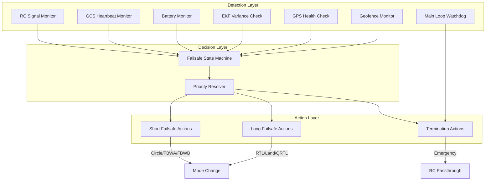
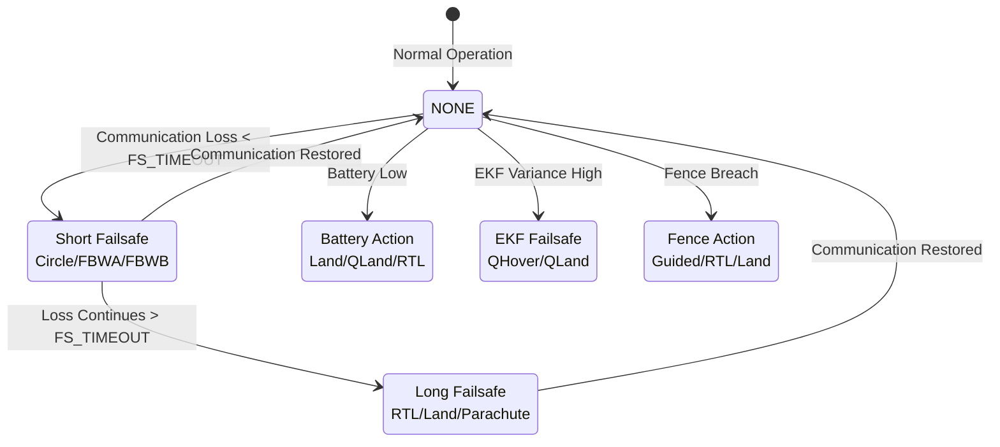
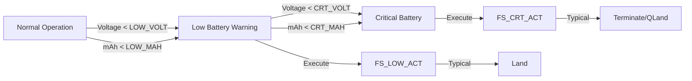
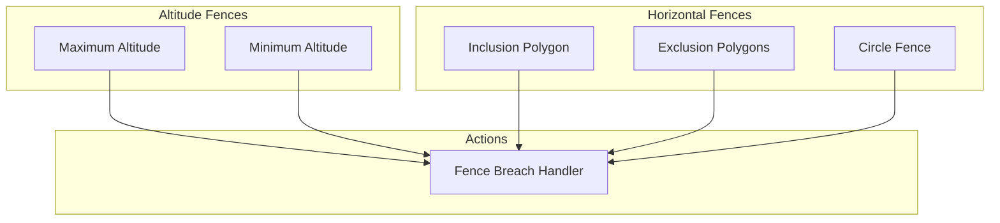
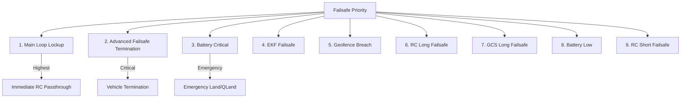
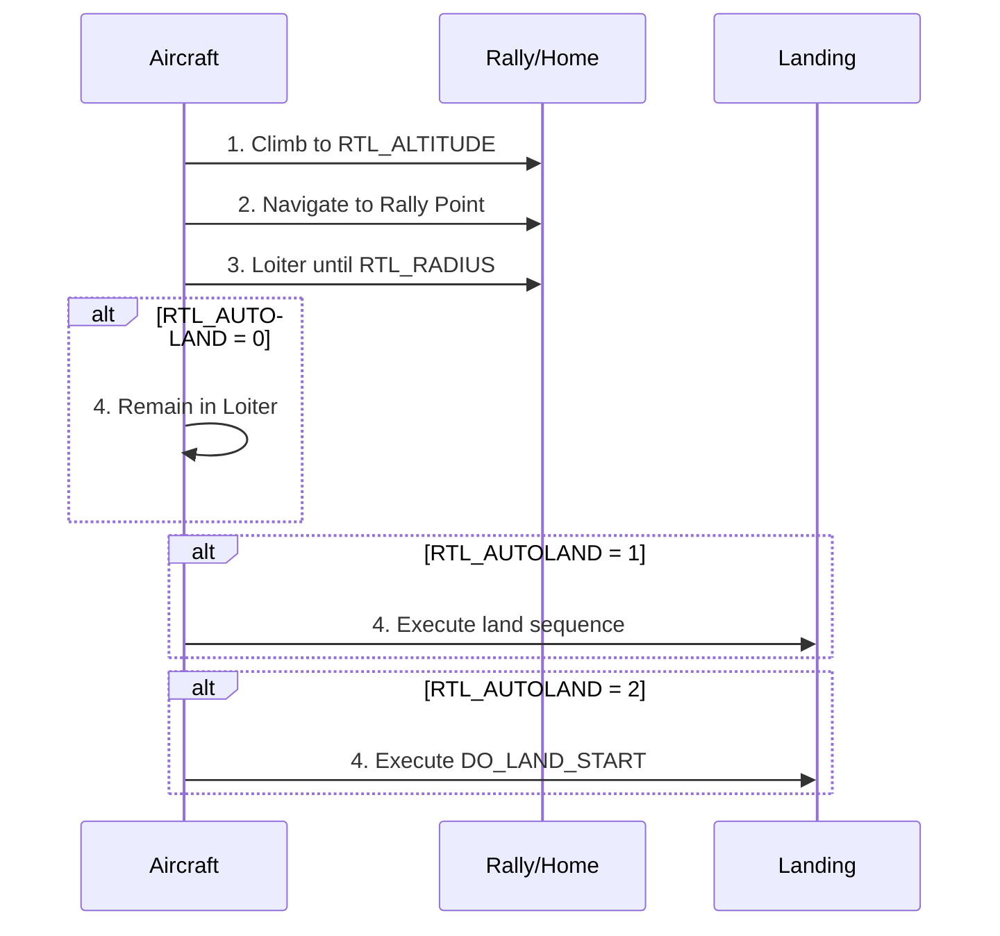
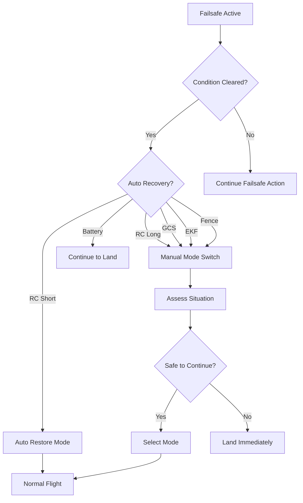

# ArduPlane Failsafe Systems


## Table of Contents
- [Overview](#overview)
- [Failsafe Architecture](#failsafe-architecture)
- [Radio Control (RC) Failsafe](#radio-control-rc-failsafe)
- [GCS (Ground Control Station) Failsafe](#gcs-ground-control-station-failsafe)
- [Battery Failsafe](#battery-failsafe)
- [EKF (Extended Kalman Filter) Failsafe](#ekf-extended-kalman-filter-failsafe)
- [GPS Failsafe](#gps-failsafe)
- [Geofence](#geofence)
- [Advanced Failsafe System (AFS)](#advanced-failsafe-system-afs)
- [Main Loop Failsafe](#main-loop-failsafe)
- [Failsafe Priority and Interaction](#failsafe-priority-and-interaction)
- [Return to Launch (RTL) Configuration](#return-to-launch-rtl-configuration)
- [QuadPlane-Specific Failsafe Behaviors](#quadplane-specific-failsafe-behaviors)
- [Emergency Landing Procedures](#emergency-landing-procedures)
- [Testing and Validation](#testing-and-validation)
- [Recovery from Failsafe Conditions](#recovery-from-failsafe-conditions)
- [Parameter Reference](#parameter-reference)
- [Troubleshooting](#troubleshooting)

## Overview

ArduPlane implements a comprehensive, multi-layered failsafe system designed to ensure safe operation of fixed-wing aircraft and VTOL configurations. The failsafe architecture protects against various failure modes including:

- **Communication Loss**: RC radio or ground control station disconnection
- **Power Issues**: Battery voltage, current, and capacity depletion
- **Navigation Failure**: GPS loss or EKF estimation degradation
- **Geospatial Violations**: Fence boundary breaches
- **System Failures**: Main loop lockup or processor malfunction

**Source Files**: 
- `/ArduPlane/failsafe.cpp` - Main loop watchdog
- `/ArduPlane/events.cpp` - Failsafe event handlers
- `/ArduPlane/ekf_check.cpp` - EKF monitoring
- `/ArduPlane/fence.cpp` - Geofence enforcement
- `/ArduPlane/afs_plane.cpp` - Advanced Failsafe System

### Safety Philosophy

ArduPlane's failsafe system follows these core principles:

1. **Defense in Depth**: Multiple independent failsafe layers
2. **Graceful Degradation**: Progressive responses based on severity
3. **Fail-Safe Defaults**: Conservative actions when in doubt
4. **Recovery Capability**: Automatic restoration when conditions improve
5. **Pilot Override**: Emergency manual control paths always available

> **Warning**: Proper failsafe configuration is essential for safe flight. Test all failsafe modes on the ground before first flight.

## Failsafe Architecture



### Failsafe State Machine

**Source**: `/ArduPlane/events.cpp:21-263`

The failsafe system maintains states and transitions based on detected conditions:



## Radio Control (RC) Failsafe

### Overview

RC failsafe monitors radio control signal quality and triggers protective actions when the link degrades or is lost. ArduPlane implements a two-stage failsafe: **Short** and **Long**.

**Source**: `/ArduPlane/events.cpp:21-110, 112-238`

### Detection Mechanism

RC failsafe is triggered when:
- RC receiver reports signal loss (no-pulses on throttle channel)
- Throttle PWM value drops below `FS_SHORT_TIMEOUT` threshold (typically <900us)
- No valid RC packets received for configured timeout period

### Short RC Failsafe

**Activation**: Triggered immediately upon RC signal loss

**Purpose**: Provide immediate, conservative response while hoping for quick recovery

**Actions by Flight Mode**:

| Current Mode | Default Action | Configurable Actions |
|--------------|----------------|---------------------|
| MANUAL, STABILIZE, ACRO | Circle | FS_SHORT_ACTN: Circle(0,1), FBWA(2), FBWB(3) |
| FBWA, FBWB, CRUISE | Circle | FS_SHORT_ACTN: Circle(0,1), FBWA(2), FBWB(3) |
| TRAINING, AUTOTUNE | Circle | FS_SHORT_ACTN: Circle(0,1), FBWA(2), FBWB(3) |
| AUTO, GUIDED, LOITER | Continue/FBWA | FS_SHORT_ACTN: None(0), Circle(1), FBWA(2), FBWB(3) |
| CIRCLE, RTL, TAKEOFF | No Action | Continue current mode |
| QSTABILIZE, QHOVER, QLOITER | QLand | Q_OPTIONS bit 5: QLand/QRTL/RTL |
| QACRO, QAUTOTUNE | QLand | Q_OPTIONS bit 5: QLand/QRTL/RTL |

**Configuration Parameters**:
- `FS_SHORT_ACTN` (0-3): Action to take on short failsafe
  - 0: Continue with mission (BESTGUESS)
  - 1: Circle mode
  - 2: Switch to FBWA
  - 3: Switch to FBWB

**Special Cases**:
- **During Landing**: Short failsafe is ignored if aircraft is in landing sequence to prevent abort
- **Emergency Landing Switch**: Overrides normal action, forces FBWA mode for out-of-range landing
- **TAKEOFF Mode**: No action during initial climb phase

```cpp
// Source: /ArduPlane/events.cpp:21-110
void Plane::failsafe_short_on_event(enum failsafe_state fstype, ModeReason reason)
{
    // Immediate response to RC loss
    failsafe.state = fstype;
    failsafe.short_timer_ms = millis();
    failsafe.saved_mode_number = control_mode->mode_number();
    
    // Mode-specific action selection
    switch (control_mode->mode_number()) {
        case Mode::Number::MANUAL:
        case Mode::Number::STABILIZE:
        case Mode::Number::ACRO:
            // Apply FS_SHORT_ACTN configuration
            if(g.fs_action_short == FS_ACTION_SHORT_FBWA) {
                set_mode(mode_fbwa, reason);
            } else if (g.fs_action_short == FS_ACTION_SHORT_FBWB) {
                set_mode(mode_fbwb, reason);
            } else {
                set_mode(mode_circle, reason);
            }
            break;
        // ... additional mode handling
    }
}
```

### Long RC Failsafe

**Activation**: Triggered after `FS_LONG_TIMEOUT` seconds of continuous RC signal loss (typically 20 seconds after short failsafe)

**Purpose**: Assume prolonged loss; take definitive action to ensure aircraft returns or lands safely

**Actions by Configuration**:

| FS_LONG_ACTN | Action | Description |
|--------------|--------|-------------|
| 0 (Continue) | Continue Mission | Proceed with current mode/mission |
| 1 (RTL) | Return to Launch | Navigate home and land |
| 2 (Land/QLand) | Emergency Land | Land immediately at current location |
| 3 (Terminate) | Parachute | Deploy parachute (if equipped) |
| 4 (Auto) | Continue AUTO | Resume AUTO mission |
| 5 (FBWA/Glide) | Glide Mode | Switch to FBWA for controlled glide |
| 6 (AUTOLAND) | Automatic Landing | Execute approach and landing |

**Configuration Parameters**:
- `FS_LONG_ACTN` (0-6): Action for long failsafe
- `FS_LONG_TIMEOUT` (seconds): Time before long failsafe activates (default: 20)

**Special Handling**:

1. **During TAKEOFF**: Long failsafe is deferred (`long_failsafe_pending = true`) until initial climb completes, unless action is GLIDE or PARACHUTE

2. **Landing Sequence Protection**: If already in landing sequence in AUTO mode, long failsafe is inhibited to prevent landing abort

3. **VTOL in Takeoff**: Switches to QLand if in quadplane VTOL takeoff

```cpp
// Source: /ArduPlane/events.cpp:112-238
void Plane::failsafe_long_on_event(enum failsafe_state fstype, ModeReason reason)
{
    // Clear GCS overrides to allow RC recovery
    RC_Channels::clear_overrides();
    failsafe.state = fstype;
    
    // Special handling for TAKEOFF mode
    if (plane.flight_stage == AP_FixedWing::FlightStage::TAKEOFF && 
        !(g.fs_action_long == FS_ACTION_LONG_GLIDE || 
          g.fs_action_long == FS_ACTION_LONG_PARACHUTE)) {
        long_failsafe_pending = true;
        break;
    }
    
    // Execute configured action
    if(g.fs_action_long == FS_ACTION_LONG_PARACHUTE) {
        parachute_release();
    } else if (g.fs_action_long == FS_ACTION_LONG_GLIDE) {
        set_mode(mode_fbwa, reason);
    } else if (g.fs_action_long == FS_ACTION_LONG_RTL) {
        set_mode(mode_rtl, reason);
    }
    // ... additional actions
}
```

### RC Failsafe Recovery

**Short Failsafe Recovery**:

When RC signal is restored during short failsafe:
- System automatically returns to the mode active before failsafe triggered
- "Flight mode [NAME] restored" message sent to GCS
- Failsafe state cleared

**Source**: `/ArduPlane/events.cpp:240-250`

```cpp
void Plane::failsafe_short_off_event(ModeReason reason)
{
    gcs().send_text(MAV_SEVERITY_WARNING, "Short Failsafe Cleared");
    failsafe.state = FAILSAFE_NONE;
    
    // Restore original mode
    if (control_mode_reason == ModeReason::RADIO_FAILSAFE) { 
        set_mode_by_number(failsafe.saved_mode_number, 
                          ModeReason::RADIO_FAILSAFE_RECOVERY);
    }
}
```

**Long Failsafe Recovery**:
- "RC Long Failsafe Cleared" message sent
- Aircraft remains in failsafe-induced mode (e.g., RTL)
- Pilot must manually switch modes to resume normal operation

### RC Failsafe Configuration Example

```cpp
// Recommended conservative configuration
FS_SHORT_ACTN = 1      // Circle on short failsafe
FS_SHORT_TIMEOUT = 1.5 // 1.5 seconds to trigger short failsafe
FS_LONG_ACTN = 1       // RTL on long failsafe
FS_LONG_TIMEOUT = 20   // 20 seconds to trigger long failsafe
```

## GCS (Ground Control Station) Failsafe

### Overview

GCS failsafe monitors MAVLink heartbeat messages from the ground control station. Loss of GCS communication triggers protective actions similar to RC failsafe.

**Source**: `/ArduPlane/events.cpp:112-238`

### Detection Mechanism

GCS failsafe activates when:
- No MAVLink heartbeat received for `FS_GCS_TIMEOUT` seconds
- GCS failsafe is enabled (`FS_GCS_ENABL = 1`)
- Aircraft is armed

### GCS Failsafe Actions

GCS failsafe uses the **same action logic as Long RC Failsafe** but with independent enable control:

**Configuration Parameters**:
- `FS_GCS_ENABL` (0/1): Enable GCS failsafe
  - 0: Disabled
  - 1: Enabled
- `FS_GCS_TIMEOUT` (seconds): Timeout before activation (default: 5)
- `FS_LONG_ACTN`: Shared with RC long failsafe (0-6)

### Mode-Specific Behavior

| Current Mode | GCS Failsafe Action |
|--------------|---------------------|
| MANUAL, STABILIZE, ACRO, FBWA, FBWB, CRUISE, TRAINING | Execute FS_LONG_ACTN |
| CIRCLE, LOITER, THERMAL, TAKEOFF | Execute FS_LONG_ACTN |
| AUTO (in landing) | No action - continue landing |
| GUIDED | Execute FS_LONG_ACTN |
| RTL | Switch to AUTO if FS_LONG_ACTN=4 |
| QSTABILIZE, QHOVER, QLOITER, QACRO | QLand or QRTL based on Q_OPTIONS |

### GCS Failsafe Recovery

**Source**: `/ArduPlane/events.cpp:252-263`

When GCS heartbeat is restored:
- "GCS Failsafe Off" message sent
- Failsafe state cleared
- Aircraft remains in current mode (manual mode change required)

```cpp
void Plane::failsafe_long_off_event(ModeReason reason)
{
    long_failsafe_pending = false;
    if (reason == ModeReason::GCS_FAILSAFE) {
        gcs().send_text(MAV_SEVERITY_WARNING, "GCS Failsafe Off");
    }
    failsafe.state = FAILSAFE_NONE;
}
```

### Typical GCS Failsafe Configuration

```cpp
// Example configuration for autonomous missions
FS_GCS_ENABL = 1       // Enable GCS failsafe
FS_GCS_TIMEOUT = 5     // 5 second timeout
FS_LONG_ACTN = 1       // RTL on GCS loss
```

> **Note**: GCS failsafe is particularly important for GUIDED mode operations and autonomous missions where continuous GCS connectivity is assumed.

## Battery Failsafe

### Overview

Battery failsafe monitors battery voltage, current consumption, and capacity to prevent power loss during flight. Multiple battery monitors can trigger independent failsafe actions.

**Source**: `/ArduPlane/events.cpp:265-371`

### Monitored Conditions

1. **Voltage-Based**: Battery voltage drops below critical threshold
2. **Capacity-Based**: Remaining mAh falls below reserve
3. **State of Charge**: Percentage remaining drops below limit

### Battery Failsafe Actions

**Configuration**: `BATT_FS_LOW_ACT`, `BATT_FS_CRT_ACT` (Battery 1)
                  `BATT2_FS_LOW_ACT`, `BATT2_FS_CRT_ACT` (Battery 2)

| Action Value | Action Name | Description |
|--------------|-------------|-------------|
| 0 | None | Warning only, no action |
| 1 | Land | Find landing location in mission or initiate emergency land |
| 2 | RTL | Return to launch and land |
| 3 | SmartRTL or RTL | Use SmartRTL path if available, else RTL |
| 4 | SmartRTL or Land | Use SmartRTL if available, else Land |
| 5 | Terminate | Deploy parachute and/or cut motors |
| 6 | Auto DO_LAND_START | Jump to DO_LAND_START in mission |
| 7 | QLand | QuadPlane vertical landing |
| 8 | Loiter_to_QLand | Loiter and descend, then QLand |

### Battery Failsafe Logic

**Source**: `/ArduPlane/events.cpp:265-371`

```cpp
void Plane::handle_battery_failsafe(const char *type_str, const int8_t action)
{
    switch ((Failsafe_Action)action) {
        case Failsafe_Action_Land: {
            bool already_landing = flight_stage == AP_FixedWing::FlightStage::LAND;
            
            if (!already_landing && plane.have_position) {
                // Check if mission contains a closer landing sequence
                if (plane.mission.is_best_land_sequence(plane.current_loc)) {
                    plane.mission.set_in_landing_sequence_flag(true);
                    break;
                }
                // Jump to landing sequence in mission
                if (plane.mission.jump_to_landing_sequence(plane.current_loc)) {
                    plane.set_mode(mode_auto, ModeReason::BATTERY_FAILSAFE);
                    break;
                }
            }
            
            // Fallback: Land immediately
            plane.set_mode(mode_rtl, ModeReason::BATTERY_FAILSAFE);
            break;
        }
        
        case Failsafe_Action_RTL:
            plane.set_mode(mode_rtl, ModeReason::BATTERY_FAILSAFE);
            break;
            
        case Failsafe_Action_QLand:
            if (quadplane.available()) {
                plane.set_mode(mode_qland, ModeReason::BATTERY_FAILSAFE);
            }
            break;
        // ... additional actions
    }
}
```

### Battery Monitoring Parameters

**Battery 1 (Primary)**:
- `BATT_MONITOR`: Battery monitor type (4=Analog Voltage/Current)
- `BATT_CAPACITY`: Battery capacity in mAh
- `BATT_LOW_VOLT`: Low battery voltage threshold
- `BATT_CRT_VOLT`: Critical battery voltage threshold
- `BATT_LOW_MAH`: Reserve capacity for low failsafe
- `BATT_CRT_MAH`: Reserve capacity for critical failsafe
- `BATT_FS_LOW_ACT`: Action on low battery
- `BATT_FS_CRT_ACT`: Action on critical battery
- `BATT_FS_VOLTSRC`: Use resting voltage (0) or current voltage (1)

**Battery 2 (Secondary)**:
- Same parameters with `BATT2_` prefix

### Battery Failsafe Stages



### Recommended Battery Failsafe Configuration

```cpp
// Conservative fixed-wing configuration
BATT_MONITOR = 4              // Voltage and Current
BATT_CAPACITY = 5000          // 5000 mAh battery
BATT_LOW_VOLT = 14.4          // 3.6V per cell (4S)
BATT_CRT_VOLT = 13.6          // 3.4V per cell (4S)
BATT_LOW_MAH = 1000           // 20% reserve
BATT_CRT_MAH = 500            // 10% reserve
BATT_FS_LOW_ACT = 6           // Auto land start
BATT_FS_CRT_ACT = 7           // QLand (if QuadPlane)
BATT_FS_VOLTSRC = 0           // Use resting voltage

// QuadPlane configuration
BATT_FS_LOW_ACT = 8           // Loiter to QLand
BATT_FS_CRT_ACT = 7           // QLand immediately
```

### Battery Failsafe Best Practices

1. **Calibrate Monitors**: Ensure accurate voltage and current sensing
2. **Test Thresholds**: Verify failsafe triggers at expected battery levels
3. **Reserve Margins**: Set LOW threshold with enough power for safe landing
4. **Critical Reserve**: Set CRITICAL threshold for emergency maneuvers only
5. **Mission Planning**: Include landing sequences in AUTO missions
6. **QuadPlane Considerations**: VTOL landing requires more power; set higher thresholds

> **Warning**: Battery failsafe is critical for preventing power loss in flight. Test with fully charged battery before each flight season.

## EKF (Extended Kalman Filter) Failsafe

### Overview

The EKF failsafe monitors the Extended Kalman Filter's estimation quality. High EKF variance indicates degraded navigation solution, which is dangerous for position-dependent VTOL modes.

**Source**: `/ArduPlane/ekf_check.cpp:1-187`

### Detection Mechanism

**Monitoring Frequency**: 10 Hz (every 100ms)

**Source**: `/ArduPlane/ekf_check.cpp:30-105`

EKF health is assessed by monitoring innovation variances:
- **Position Variance**: Horizontal position error estimate
- **Velocity Variance**: Velocity error estimate  
- **Height Variance**: Vertical position error estimate
- **Magnetometer Variance**: Compass error estimate (max of X/Y/Z)
- **True Airspeed Variance**: Airspeed sensor error estimate

### EKF Variance Threshold Logic

**Source**: `/ArduPlane/ekf_check.cpp:108-145`

```cpp
bool Plane::ekf_over_threshold()
{
    if (g2.fs_ekf_thresh <= 0.0f) {
        return false;  // EKF check disabled
    }
    
    // Get normalized innovation variances (>1.0 means EKF rejected sensor)
    float position_variance, vel_variance, height_variance, tas_variance;
    Vector3f mag_variance;
    ahrs.get_variances(vel_variance, position_variance, height_variance, 
                      mag_variance, tas_variance);
    
    // Take maximum magnetometer axis variance
    const float mag_max = fmaxf(fmaxf(mag_variance.x, mag_variance.y), 
                                mag_variance.z);
    
    // Score-based threshold evaluation
    uint8_t over_thresh_count = 0;
    
    if (mag_max >= g2.fs_ekf_thresh) {
        over_thresh_count++;
    }
    
    if (vel_variance >= (2.0f * g2.fs_ekf_thresh)) {
        over_thresh_count += 2;  // Velocity is weighted higher
    } else if (vel_variance >= g2.fs_ekf_thresh) {
        over_thresh_count++;
    }
    
    // Position is most critical
    if ((position_variance >= g2.fs_ekf_thresh && over_thresh_count >= 1) || 
        over_thresh_count >= 2) {
        return true;
    }
    
    return false;
}
```

### EKF Failsafe Triggering

**Trigger Conditions**:
1. EKF variance exceeds threshold (`FS_EKF_THRESH`)
2. Variance remains high for **10 consecutive iterations** (1 second)
3. Vehicle is armed
4. Vehicle is in VTOL position/velocity control mode (QuadPlane only)

**Source**: `/ArduPlane/ekf_check.cpp:30-105`

### EKF Failsafe Actions

**Scope**: EKF failsafe **only applies to QuadPlane VTOL modes** requiring position control

| Current Mode | Failsafe Action | Reason |
|--------------|-----------------|--------|
| QLOITER, QRTL, AUTO (VTOL) | QLand | Pilot not manually controlling |
| QHOVER, QSTABILIZE | QHover | Pilot has manual control |
| Fixed-Wing Modes | No Action | Position not required |

**Source**: `/ArduPlane/ekf_check.cpp:149-174`

```cpp
void Plane::failsafe_ekf_event()
{
    if (ekf_check_state.failsafe_on) {
        return;  // Already triggered
    }
    
    ekf_check_state.failsafe_on = true;
    LOGGER_WRITE_ERROR(LogErrorSubsystem::FAILSAFE_EKFINAV, 
                      LogErrorCode::FAILSAFE_OCCURRED);
    
    // Only act if in VTOL position/velocity mode
    if (!quadplane.in_vtol_posvel_mode()) {
        return;
    }
    
    if (quadplane.in_vtol_auto()) {
        // Pilot not controlling - land immediately
        plane.set_mode(mode_qland, ModeReason::EKF_FAILSAFE);
    } else {
        // Pilot controlling - hold position
        plane.set_mode(mode_qhover, ModeReason::EKF_FAILSAFE);
    }
}
```

### EKF Recovery Logic

**Recovery Actions**:

1. **Yaw Reset Request**: At 8 consecutive bad iterations, EKF is asked to reset yaw alignment
2. **Lane Switch**: At 9 consecutive bad iterations, EKF attempts to switch to redundant lane
3. **Failsafe Clear**: When variance returns below threshold for 10 consecutive iterations

**Source**: `/ArduPlane/ekf_check.cpp:57-99`

```cpp
// Failure count management
if (ekf_over_threshold()) {
    ekf_check_state.fail_count++;
    
    if (ekf_check_state.fail_count == (EKF_CHECK_ITERATIONS_MAX-2)) {
        // 8 iterations: Request yaw reset
        ahrs.request_yaw_reset();
    }
    if (ekf_check_state.fail_count == (EKF_CHECK_ITERATIONS_MAX-1)) {
        // 9 iterations: Attempt lane switch
        ahrs.check_lane_switch();
    }
    if (ekf_check_state.fail_count >= EKF_CHECK_ITERATIONS_MAX) {
        // 10 iterations: Trigger failsafe
        ekf_check_state.bad_variance = true;
        failsafe_ekf_event();
    }
} else {
    // Variance improving
    if (ekf_check_state.fail_count > 0) {
        ekf_check_state.fail_count--;
        
        if (ekf_check_state.bad_variance && ekf_check_state.fail_count == 0) {
            ekf_check_state.bad_variance = false;
            failsafe_ekf_off_event();  // Clear failsafe
        }
    }
}
```

### EKF Failsafe Configuration

**Parameters**:
- `FS_EKF_THRESH`: EKF variance threshold (0.0 = disabled, typical: 0.8-1.0)
  - 0.0: Disabled
  - 0.8: Conservative (triggers more easily)
  - 1.0: Moderate (default for most applications)
  - 1.5: Permissive (high GPS interference environments)

### EKF Variance Sources

Common causes of high EKF variance:

1. **GPS Issues**:
   - Multipath interference
   - Low satellite count
   - Poor satellite geometry (high HDOP)
   - GPS jamming

2. **Magnetometer Issues**:
   - Magnetic interference from power lines
   - Incorrect compass calibration
   - Metal structures nearby

3. **Vibration**:
   - Excessive IMU noise
   - Poor vibration isolation

4. **Airspeed Sensor**:
   - Blocked pitot tube
   - Incorrect airspeed calibration

### EKF Failsafe Configuration Example

```cpp
// QuadPlane EKF failsafe configuration
FS_EKF_THRESH = 0.8         // Conservative threshold
EK3_ENABLE = 1              // Use EKF3
EK3_IMU_MASK = 3            // Use first two IMUs
EK3_GPS_TYPE = 0            // Automatic GPS selection
EK3_MAG_CAL = 5             // When landed and armed
```

### EKF Health Monitoring

**Pre-Flight Checks**:
1. Verify "EKF OK" in GCS before arming
2. Check GPS satellite count ≥ 10
3. Ensure HDOP < 1.5
4. Verify compass healthy (no MAG error messages)

**In-Flight Monitoring**:
- Watch for "EKF variance" messages
- Monitor EKF flags in GCS telemetry
- Observe GPS and compass health indicators

> **Note**: Fixed-wing modes (FBWA, CRUISE, etc.) can operate safely with degraded EKF, but VTOL modes require accurate position estimation.

## GPS Failsafe

### Overview

GPS failsafe protects against navigation failures due to GPS signal loss. Unlike EKF failsafe which monitors estimation quality, GPS failsafe detects complete GPS unavailability.

### GPS Health Monitoring

ArduPlane monitors GPS health indicators:
- GPS fix type (No Fix, 2D, 3D, DGPS, RTK)
- Number of satellites
- Horizontal Dilution of Precision (HDOP)
- GPS update rate

### GPS Failsafe Behavior

**Fixed-Wing Impact**:
- FBWA, FBWB, STABILIZE, MANUAL: Continue normal operation (no GPS required)
- CRUISE, LOITER, AUTO, RTL, GUIDED: May degrade or fail without GPS

**QuadPlane Impact**:
- QHOVER, QSTABILIZE: Limited impact (can fly without GPS)
- QLOITER, QRTL, AUTO (VTOL): Triggers EKF failsafe if position estimation fails

### GPS Failsafe Configuration

**Arming Checks**:
- `ARMING_CHECK` bit 3 (GPS): Require GPS lock before arming
- `GPS_MIN_SATS`: Minimum satellite count for arming

**Home Position**:
- Home is set when GPS first achieves 3D lock and HDOP < 2.0
- Vehicle must have valid home before RTL can be used

> **Important**: GPS failsafe is implicit through EKF monitoring. No dedicated GPS failsafe parameters exist; instead, EKF failsafe handles GPS degradation.

## Geofence

### Overview

Geofence defines virtual boundaries that trigger failsafe actions when breached. ArduPlane supports multiple fence types for comprehensive airspace protection.

**Source**: `/ArduPlane/fence.cpp:1-248`

### Fence Types



### Fence Breach Detection

**Monitoring Frequency**: 3 Hz (every 333ms)

**Source**: `/ArduPlane/fence.cpp:8-36`

```cpp
void Plane::fence_checks_async()
{
    const uint32_t now = AP_HAL::millis();
    
    // Rate limit to 3Hz
    if (!AP_HAL::timeout_expired(fence_breaches.last_check_ms, now, 333U)) {
        return;
    }
    
    fence_breaches.last_check_ms = now;
    const bool armed = arming.is_armed();
    
    // Determine if landing or landed (fence disabled)
    bool landing_or_landed = plane.flight_stage == AP_FixedWing::FlightStage::LAND
                         || !armed
                         || control_mode->mode_number() == Mode::Number::QLAND
                         || quadplane.in_vtol_land_descent();
    
    // Check for breaches
    fence_breaches.new_breaches = fence.check(landing_or_landed);
    fence_breaches.have_updates = true;
}
```

**Fence Disabled During**:
- Aircraft is disarmed
- In LAND flight stage
- In QLand mode (QuadPlane)
- Final landing descent

### Fence Actions

**Configuration**: `FENCE_ACTION`

| Action Value | Action Name | Description |
|--------------|-------------|-------------|
| 0 | Report Only | Log breach, no mode change |
| 1 | RTL and Land | Return to launch, then land |
| 2 | Hold (Loiter) | Not applicable to planes |
| 3 | SmartRTL | Not applicable to planes |
| 4 | Guided | Fly to fence return point |
| 5 | Guided Throttle Pass | Guided with manual throttle |
| 6 | AUTOLAND or RTL | Attempt AUTOLAND, fallback RTL |

**Source**: `/ArduPlane/fence.cpp:107-189`

### Fence Action Details

#### Report Only (0)
- Breach logged to dataflash
- GCS notified
- No mode or flight path change
- Useful for testing fence configuration

#### RTL and Land (1)
```cpp
case AC_Fence::Action::RTL_AND_LAND:
    if (control_mode == &mode_auto &&
        mission.get_in_landing_sequence_flag()) {
        // Already landing, continue
        break;
    }
    set_mode(mode_rtl, ModeReason::FENCE_BREACHED);
    break;
```

#### Guided Mode (4, 5)
- Aircraft flies to fence return point
- Return point defined by:
  1. Polygon fence return point (if set)
  2. Rally point (if `FENCE_RET_RALLY = 1`)
  3. Home location (fallback)
  
- Altitude selection:
  1. `FENCE_RET_ALT` (if > 0)
  2. Midpoint of `FENCE_ALT_MIN` and `FENCE_ALT_MAX` (if valid)
  3. `RTL_ALTITUDE` (fallback)

**Source**: `/ArduPlane/fence.cpp:144-187`

```cpp
case AC_Fence::Action::GUIDED:
case AC_Fence::Action::GUIDED_THROTTLE_PASS:
    set_mode(mode_guided, ModeReason::FENCE_BREACHED);
    
    Location loc;
    if (fence.get_return_rally() != 0) {
        // Use rally point
        loc = calc_best_rally_or_home_location(current_loc, 
                                               get_RTL_altitude_cm());
    } else {
        // Determine return altitude
        if (fence.get_return_altitude() > 0) {
            loc.set_alt_cm(home.alt + 100.0 * fence.get_return_altitude(),
                          Location::AltFrame::ABSOLUTE);
        } else {
            // Use midpoint of altitude fence
            loc.set_alt_cm(home.alt + 100.0f * 
                          (fence.get_safe_alt_min() + fence.get_safe_alt_max()) / 2,
                          Location::AltFrame::ABSOLUTE);
        }
        
        // Get return point from polygon fence
        Vector2l return_point;
        if(fence.polyfence().get_return_point(return_point)) {
            loc.lat = return_point[0];
            loc.lng = return_point[1];
        } else {
            // No return point, use home
            loc.lat = home.lat;
            loc.lng = home.lng;
        }
    }
    
    set_guided_WP(loc);
    
    if (fence.get_action() == AC_Fence::Action::GUIDED_THROTTLE_PASS) {
        guided_throttle_passthru = true;  // Pilot retains throttle control
    }
    break;
```

#### AUTOLAND or RTL (6)
- Attempts to enter AUTOLAND mode (if compiled)
- Falls back to RTL if AUTOLAND unavailable
- Best for airfields with approach procedures

### Fence Types Configuration

#### Maximum Altitude Fence
- `FENCE_ALT_MAX` (meters): Maximum altitude above home
- Prevents aircraft from climbing too high
- Useful for regulatory compliance (e.g., 400ft AGL limit)

#### Minimum Altitude Fence
- `FENCE_ALT_MIN` (meters): Minimum altitude above home
- Prevents terrain collision
- Should account for local terrain elevation

#### Circular Fence
- `FENCE_RADIUS` (meters): Maximum horizontal distance from home
- Simple distance-based boundary
- 0 = disabled

#### Polygon Inclusion Fence
- Defined via GCS (Mission Planner, QGroundControl)
- Aircraft must remain inside polygon
- Can define complex operational areas
- Breach detected when outside boundary

#### Polygon Exclusion Fences
- Multiple exclusion zones supported
- Aircraft must remain outside these areas
- Useful for no-fly zones (airports, restricted areas)
- Breach detected when inside boundary

### Fence Configuration Parameters

**Enable Control**:
- `FENCE_ENABLE`: Master fence enable
  - 0: Disabled
  - 1: Enabled
  - 2: Learn mode (disabled until armed once)
- `FENCE_TYPE`: Bitmask of active fence types
  - Bit 0: Altitude max fence
  - Bit 1: Circle fence
  - Bit 2: Polygon inclusion fence
  - Bit 3: Altitude min fence
  - Bit 4: Polygon exclusion fences

**Action Parameters**:
- `FENCE_ACTION`: Action on breach (0-6)
- `FENCE_AUTOENABLE`: Auto-enable delay after takeoff
  - 0: Fence enabled immediately at arm
  - >0: Seconds after takeoff to enable
- `FENCE_RET_RALLY`: Use rally points for return
- `FENCE_RET_ALT`: Return altitude (meters)

**Margin Parameters**:
- `FENCE_MARGIN`: Distance margin before breach (meters)
- Provides warning before actual breach

### Fence Breach Recovery

**Automatic Recovery**:

When fence breach clears (aircraft returns inside boundary):
- "Fence breach cleared" message sent
- Fence state resets if fence subsequently disabled
- Aircraft continues in breach-induced mode (e.g., remains in GUIDED)

**Manual Recovery**:

Pilot can:
1. Disable fence via RC switch or GCS command
2. Manually switch to appropriate mode
3. Re-enable fence after resolving situation

**Source**: `/ArduPlane/fence.cpp:191-195`

```cpp
if (orig_breaches && fence.get_breaches() == 0) {
    GCS_SEND_TEXT(MAV_SEVERITY_NOTICE, "Fence breach cleared");
    LOGGER_WRITE_ERROR(LogErrorSubsystem::FAILSAFE_FENCE, 
                      LogErrorCode::ERROR_RESOLVED);
}
```

### Fence Configuration Example

```cpp
// Recreational flying site with 400ft ceiling
FENCE_ENABLE = 1              // Enabled
FENCE_TYPE = 15               // All fence types (binary: 1111)
FENCE_ACTION = 1              // RTL and Land
FENCE_ALT_MAX = 120           // 120m (394ft) ceiling
FENCE_ALT_MIN = 30            // 30m minimum (terrain clearance)
FENCE_RADIUS = 500            // 500m circle (backup)
FENCE_MARGIN = 10             // 10m warning margin
FENCE_AUTOENABLE = 30         // Enable 30s after takeoff
FENCE_RET_RALLY = 1           // Use rally points
FENCE_RET_ALT = 80            // Return at 80m

// Polygon fence defined in GCS:
// - Inclusion polygon around flying field
// - Exclusion polygon over nearby houses
```

### Fence Best Practices

1. **Test on Ground**: Enable fence on ground, walk outside boundary to verify breach detection
2. **Conservative Margins**: Set altitude limits well below legal/physical limits
3. **Rally Points**: Configure rally points for safer return locations
4. **Airfield Awareness**: Exclude non-flying areas (parking, pits, spectators)
5. **Terrain Consideration**: Min altitude should clear highest terrain by margin
6. **Auto-Enable Delay**: Use `FENCE_AUTOENABLE` to prevent breach during hand-launch
7. **RC Switch**: Assign fence enable/disable to RC switch for emergency override

> **Warning**: Geofence is a last-resort safety measure, not a substitute for proper flight planning and situational awareness.

## Advanced Failsafe System (AFS)

### Overview

The Advanced Failsafe System (AFS) is an optional, enhanced failsafe capability designed for compliance with regulatory requirements such as the Outback Challenge (OBC) rules. AFS provides stricter monitoring and more aggressive termination options.

**Source**: `/ArduPlane/afs_plane.cpp`, `/ArduPlane/afs_plane.h`

**Compilation**: Enabled with `AP_ADVANCEDFAILSAFE_ENABLED=1`

### AFS Features

1. **Data Link Monitoring**: Strict GCS heartbeat requirements
2. **GPS Quality Monitoring**: Enhanced GPS health checks
3. **Geofence Integration**: Mandatory fence breach actions
4. **Termination**: Ability to terminate vehicle (cut motors, deploy parachute)
5. **Flight Termination Unit (FTU)**: Hardware termination support
6. **Manual Recovery Prevention**: Limits pilot override in certain conditions

### AFS Termination

**Vehicle Termination Actions**:

**Source**: `/ArduPlane/afs_plane.h:34, /ArduPlane/failsafe.cpp:83-93`

```cpp
// Check if termination required
if (afs.should_crash_vehicle()) {
    afs.terminate_vehicle();
    
    if (!afs.terminating_vehicle_via_landing()) {
        return;  // Full termination, stop all outputs
    }
}
```

**Termination Methods**:
1. **Emergency Landing**: Controlled descent and landing
2. **Motor Cutoff**: Immediate motor/throttle kill
3. **Parachute Deployment**: Activate parachute release servo

### AFS Configuration

**Parameters** (when AFS is enabled):
- `AFS_ENABLE`: Enable advanced failsafe
- `AFS_TERM_ACTION`: Termination action
  - 0: Land
  - 42: Parachute
  - 43: Flight termination
- `AFS_TERM_PIN`: Hardware pin for termination signal
- `AFS_GEOFENCE`: Enforce geofence
- `AFS_RC_FAIL_MS`: RC failsafe timeout (stricter than standard)
- `AFS_MAX_GPS_LOSS`: Maximum GPS loss time before termination
- `AFS_MAX_COM_LOSS`: Maximum GCS communication loss before termination
- `AFS_WP_COMMS`: Require comms for AUTO mode
- `AFS_WP_GPS_LOSS`: Maximum GPS loss in AUTO

### AFS vs Standard Failsafe

| Feature | Standard Failsafe | Advanced Failsafe |
|---------|-------------------|-------------------|
| RC Failsafe Timeout | Configurable (FS_LONG_TIMEOUT) | Stricter (AFS_RC_FAIL_MS) |
| GCS Failsafe | Optional | Mandatory |
| GPS Loss Action | EKF-based | Forced termination |
| Fence Breach | Multiple actions | Mandatory strict action |
| Termination | Parachute optional | Full termination support |
| Recovery | Automatic | Limited/disabled |
| Manual Override | Full | Restricted |

### AFS Use Cases

**When to Use AFS**:
- Regulatory compliance (OBC, competition)
- Flight over populated areas (requires stricter safety)
- Autonomous operations beyond visual line of sight (BVLOS)
- High-consequence missions

**When NOT to Use AFS**:
- Recreational flying
- Development and testing
- Line-of-sight operations
- Learning and training

> **Warning**: AFS termination actions can result in immediate aircraft loss. Only enable AFS if required and fully understand the termination conditions.

## Main Loop Failsafe

### Overview

The Main Loop Failsafe is the ultimate safety backstop, detecting when the main flight control loop has locked up or stopped running.

**Source**: `/ArduPlane/failsafe.cpp:17-110`

### Detection Mechanism

**Monitoring**: Interrupt-based timer at 1 kHz checks scheduler tick count

**Source**: `/ArduPlane/failsafe.cpp:17-40`

```cpp
void Plane::failsafe_check(void)
{
    static uint16_t last_ticks;
    static uint32_t last_timestamp;
    static bool in_failsafe;
    uint32_t tnow = micros();
    
    const uint16_t ticks = scheduler.ticks();
    if (ticks != last_ticks) {
        // Main loop is running, all is OK
        last_ticks = ticks;
        last_timestamp = tnow;
        in_failsafe = false;
        return;
    }
    
    if (tnow - last_timestamp > 200000) {
        // No main loop execution for >200ms - trouble!
        in_failsafe = true;
    }
}
```

**Trigger Condition**: Main loop has not incremented tick counter for >200ms

### Main Loop Failsafe Action

**Emergency Response**: Direct RC passthrough

When main loop lockup detected:
1. Read RC inputs directly
2. Apply expo curves to pilot inputs
3. Directly write to servo outputs
4. Bypass all flight control logic
5. Update every 20ms from interrupt context

**Source**: `/ArduPlane/failsafe.cpp:41-110`

```cpp
if (in_failsafe && tnow - last_timestamp > 20000) {
    // Read latest RC inputs
    rc().read_input();
    last_timestamp = tnow;
    
    // Check for valid RC
    if (RC_Channels::get_valid_channel_count() < 5) {
        return;  // No RC available
    }
    
    // Clear any GCS overrides
    RC_Channels::clear_overrides();
    
    // Read pilot inputs with expo
    float roll = roll_in_expo(false);
    float pitch = pitch_in_expo(false);
    float throttle = get_throttle_input(true);
    float rudder = rudder_in_expo(false);
    
    // Safety check: zero throttle if disarmed
    if (!arming.is_armed_and_safety_off()) {
        throttle = 0;
    }
    
    // Write directly to servo outputs
    SRV_Channels::set_output_scaled(SRV_Channel::k_aileron, roll);
    SRV_Channels::set_output_scaled(SRV_Channel::k_elevator, pitch);
    SRV_Channels::set_output_scaled(SRV_Channel::k_rudder, rudder);
    SRV_Channels::set_output_scaled(SRV_Channel::k_throttle, throttle);
    
    // Passthrough remaining channels
    SRV_Channels::copy_radio_in_out(SRV_Channel::k_manual, true);
}
```

### Main Loop Failsafe Characteristics

**Advantages**:
- Independent of main code execution
- Direct hardware control
- Cannot be prevented by software hangs
- Allows manual piloting even with frozen autopilot

**Limitations**:
- No stabilization or autonomy
- Requires pilot proficiency in manual flight
- No flight mode features available
- RC link must remain operational

**When Triggered**:
- Software crash or exception
- Infinite loop in main code
- Scheduler overrun (tasks taking too long)
- Flash memory read/write lockup
- Peripheral communication hang

### Recovery from Main Loop Lockup

**Automatic Recovery**: If main loop resumes, failsafe automatically exits and normal operation resumes

**Manual Recovery**: 
1. Pilot maintains aircraft control via RC passthrough
2. Land aircraft as soon as safely possible
3. Investigate cause of lockup before next flight

> **Critical**: Main loop failsafe indicates a serious software or hardware fault. Do not fly again until root cause is identified and resolved.

## Failsafe Priority and Interaction

### Failsafe Hierarchy

When multiple failsafe conditions occur simultaneously, ArduPlane follows a priority order:



### Failsafe Interactions

#### RC + GCS Failsafe
- RC failsafe takes precedence
- Both can be active simultaneously
- Actions are independent unless mode conflicts

#### Battery + RC Failsafe
- Battery failsafe can override RC failsafe mode
- If RC long failsafe sets RTL, battery critical can change to QLand
- More severe condition (battery critical) takes priority

#### Geofence + Other Failsafes
- Geofence can trigger during existing failsafe
- Fence action may change mode selected by previous failsafe
- Fence logged independently

#### EKF + Other Failsafes
- EKF failsafe only affects VTOL position modes
- Does not override other failsafe actions
- Can trigger simultaneously with RC/GCS failsafe

### Mode Change Conflict Resolution

**Last Wins**: If multiple failsafes request different modes, the most recent takes effect

**Example Scenario**:
1. RC long failsafe triggers → Aircraft enters RTL
2. Battery critical occurs → Aircraft switches to QLand
3. RC restored → RC failsafe clears, but battery failsafe remains active
4. Aircraft continues QLand until landed

### Failsafe State Tracking

**Source**: `/ArduPlane/Plane.h` (failsafe structure)

```cpp
struct {
    enum failsafe_state state;  // Current failsafe type
    uint32_t short_timer_ms;    // Short failsafe start time
    uint8_t saved_mode_number;  // Mode before failsafe
} failsafe;

// Mode change reasons tracked independently
enum class ModeReason {
    UNKNOWN,
    RADIO_FAILSAFE,
    BATTERY_FAILSAFE,
    FENCE_BREACHED,
    GCS_FAILSAFE,
    EKF_FAILSAFE,
    //... others
};
```

### Testing Multiple Failsafes

**Recommended Test Sequence**:

1. **Individual Tests**: Test each failsafe type independently
2. **Combined Tests**: Test realistic combinations:
   - RC loss during low battery
   - Fence breach during RTL
   - EKF failure during AUTO

3. **Priority Verification**: Confirm higher-priority failsafes override lower

## Return to Launch (RTL) Configuration

### Overview

RTL (Return to Launch) is the most common failsafe action, providing autonomous return and landing at the home location or rally point.

### RTL Behavior Sequence

**Fixed-Wing RTL**:



### RTL Parameters

**Altitude Control**:
- `RTL_ALTITUDE` (meters): Climb to this altitude during return
  - <0: Return at current altitude
  - =0: Return at 100m (default)
  - >0: Return at specified altitude
  
**Horizontal Navigation**:
- `RTL_RADIUS` (meters): Loiter radius around home/rally
  - Default: 0 (uses WP_LOITER_RAD)
  
**Landing Behavior**:
- `RTL_AUTOLAND`: Automatic landing after reaching home
  - 0: Loiter at RTL_ALTITUDE (default)
  - 1: Automatic land sequence
  - 2: Execute DO_LAND_START from mission
  
**Return Point Selection**:
- `RTL_RALLY`: Use rally points instead of home
  - 0: Always return to home
  - 1: Return to nearest rally point

### Rally Points

**Purpose**: Provide alternative return locations safer than home

**Configuration**:
- Defined in GCS (Mission Planner rally point screen)
- Can define multiple rally points
- Aircraft returns to nearest rally point (if `RTL_RALLY=1`)

**Use Cases**:
- Home location not suitable for landing
- Multiple landing options in large operational area
- Obstacle avoidance around home

### QuadPlane RTL Behavior

**QRTL Mode**: QuadPlane-specific RTL

**QRTL Sequence**:
1. Climb to `Q_RTL_ALT` (QuadPlane RTL altitude)
2. Transition to fixed-wing mode (if currently VTOL)
3. Navigate to home/rally
4. Transition to VTOL at `RTL_RADIUS`
5. Descend vertically and land

**QRTL Parameters**:
- `Q_RTL_ALT`: QRTL altitude (meters)
- `Q_RTL_MODE`: Return mode
  - 0: QRTL (VTOL return)
  - 1: Hybrid (fixed-wing cruise, VTOL land)

### RTL Configuration Examples

**Simple Fixed-Wing**:
```cpp
RTL_ALTITUDE = 100        // Return at 100m
RTL_AUTOLAND = 1          // Auto land on arrival
WP_LOITER_RAD = 60        // 60m loiter radius
```

**QuadPlane with Rally**:
```cpp
RTL_ALTITUDE = 80         // Fixed-wing return altitude
RTL_RALLY = 1             // Use rally points
Q_RTL_ALT = 25            // VTOL altitude 25m
Q_RTL_MODE = 1            // Hybrid return
```

**Conservative (Loiter Only)**:
```cpp
RTL_ALTITUDE = 120        // High altitude for safety
RTL_AUTOLAND = 0          // Loiter only, manual landing
RTL_RADIUS = 80           // Large loiter
```

### RTL Best Practices

1. **Set Home Before Flight**: Ensure GPS lock and home set before arming
2. **Sufficient Altitude**: `RTL_ALTITUDE` should clear all obstacles
3. **Landing Area**: Ensure home/rally points have safe landing approach
4. **Test RTL**: Execute manual RTL during test flights
5. **Battery Reserve**: Ensure battery can complete RTL from farthest point
6. **Wind Consideration**: RTL altitude should account for wind drift

## QuadPlane-Specific Failsafe Behaviors

### Overview

QuadPlane aircraft have unique failsafe requirements due to their dual flight envelope (fixed-wing + VTOL). Failsafe actions must account for current flight mode and transition state.

### QuadPlane Failsafe Modes

**VTOL Failsafe Modes**:
- **QLand**: Immediate vertical landing from current position
- **QRTL**: Return home, then vertical landing
- **QHover**: Hold current position (manual recovery expected)

### QuadPlane Failsafe Options

**Parameter**: `Q_OPTIONS` (bitmask)

**Bit 5 (value 32)**: RC/GCS Failsafe QRTL
- When set: Long failsafe triggers QRTL instead of QLand
- When clear: Long failsafe triggers QLand

**Bit 7 (value 128)**: FS_RTL over FS_QRTL
- When set: Long failsafe triggers fixed-wing RTL
- When clear: Long failsafe triggers QRTL

### QuadPlane RC Failsafe Actions

**Short Failsafe in VTOL Modes**:

| Mode | Q_OPTIONS Bit 5 Clear | Q_OPTIONS Bit 5 Set |
|------|----------------------|---------------------|
| QSTABILIZE | QLand | QLand |
| QHOVER | QLand | QRTL or RTL |
| QLOITER | QLand | QRTL or RTL |
| QACRO | QLand | QRTL or RTL |
| QAUTOTUNE | QLand | QRTL or RTL |

**Long Failsafe in VTOL Modes**:
- Always triggers QLand, QRTL, or RTL based on `Q_OPTIONS`

**Source**: `/ArduPlane/events.cpp:50-66, 163-179`

```cpp
// Short failsafe - VTOL modes
case Mode::Number::QSTABILIZE:
case Mode::Number::QLOITER:
case Mode::Number::QHOVER:
    if (quadplane.option_is_set(QuadPlane::OPTION::FS_RTL)) {
        set_mode(mode_rtl, reason);  // Fixed-wing RTL
    } else if (quadplane.option_is_set(QuadPlane::OPTION::FS_QRTL)) {
        set_mode(mode_qrtl, reason);  // VTOL RTL
    } else {
        set_mode(mode_qland, reason);  // Immediate land
    }
    break;
```

### QuadPlane Battery Failsafe

**QuadPlane-Specific Actions**:

| Action | Fixed-Wing Equivalent | QuadPlane Behavior |
|--------|----------------------|-------------------|
| Land | RTL or DO_LAND_START | QLand (vertical landing) |
| Loiter_to_QLand | N/A | Loiter while descending, then QLand |
| QLand | N/A | Immediate vertical landing |

**Configuration**:
```cpp
BATT_FS_LOW_ACT = 8      // Loiter to QLand (gradual)
BATT_FS_CRT_ACT = 7      // QLand immediately
```

**Loiter_to_QLand Behavior**:
1. Enter LOITER mode
2. Gradually descend while loitering
3. At transition altitude, switch to QLand
4. Complete vertical landing

### QuadPlane EKF Failsafe

**VTOL Position Mode Protection**:

EKF failsafe specifically protects QuadPlane VTOL modes requiring position control:

**Triggered In**:
- QLOITER
- QRTL
- AUTO (during VTOL phases)

**NOT Triggered In**:
- QHOVER (position not required)
- QSTABILIZE (manual control)
- QACRO (manual control)
- Fixed-wing modes (position less critical)

**Action**:
- **In VTOL Auto**: Switch to QLand (safest immediate action)
- **In Manual VTOL**: Switch to QHover (pilot retains control)

**Source**: `/ArduPlane/ekf_check.cpp:149-174`

### QuadPlane Transition Failsafes

**Failsafe During Transition**:

If failsafe occurs during forward→VTOL or VTOL→forward transition:
1. **Prioritize VTOL Capability**: Transition immediately completes to VTOL
2. **Abort Forward Flight**: Cancel fixed-wing navigation
3. **Execute Failsafe**: QLand or QRTL as configured

**Critical Window**: Transition is a vulnerable phase; failsafe actions are immediate

### QuadPlane Failsafe Configuration

**Recommended QuadPlane Setup**:

```cpp
// RC Failsafe
FS_SHORT_ACTN = 0         // Continue mission
FS_LONG_ACTN = 1          // RTL (will use QRTL if needed)

// QuadPlane Options
Q_OPTIONS = 160           // Bit 5 (QRTL) + Bit 7 (prefer RTL)
                          // = 32 + 128 = 160

// Battery Failsafe
BATT_FS_LOW_ACT = 8       // Loiter to QLand
BATT_FS_CRT_ACT = 7       // QLand immediately

// EKF Failsafe
FS_EKF_THRESH = 0.8       // Conservative

// RTL Configuration
RTL_ALTITUDE = 80         // Fixed-wing return altitude
Q_RTL_ALT = 25            // VTOL altitude
Q_RTL_MODE = 1            // Hybrid return
```

### QuadPlane Failsafe Best Practices

1. **Test Both Envelopes**: Verify failsafes in fixed-wing AND VTOL modes
2. **Battery Margins**: VTOL requires more power; increase battery reserves
3. **Transition Clearance**: Ensure RTL altitude allows safe transition
4. **EKF Monitoring**: VTOL modes are more sensitive to EKF health
5. **Landing Zone**: Ensure home/rally suitable for vertical landing
6. **Wind Limits**: VTOL failsafe limited by wind; know your limits

## Emergency Landing Procedures

### Pilot-Initiated Emergency Landing

**Manual Emergency Actions**:

1. **Immediate Landing**:
   - Fixed-Wing: Switch to FBWA, select landing area, execute approach
   - QuadPlane: Switch to QLand for immediate vertical descent

2. **Controlled Return**:
   - Switch to RTL (or QRTL for QuadPlane)
   - Monitor altitude and battery
   - Override RTL if better landing site identified

3. **Emergency Mode Switch**:
   - Use RC mode switch or GCS command
   - Emergency Landing switch (if configured): Forces FBWA for manual landing

### Emergency Landing Switch

**Configuration**: Assign RC channel to override normal failsafe actions

**Purpose**: Allow out-of-range manual landing in FBWA when RC failsafe would otherwise trigger RTL

**Source**: `/ArduPlane/events.cpp:37-40, 140-143`

```cpp
if(plane.emergency_landing) {
    // Emergency landing switch overrides normal failsafe action
    set_mode(mode_fbwa, reason);
    break;
}
```

### Parachute Emergency

**When Equipped with Parachute System**:

**Trigger Conditions**:
- Manual RC switch
- Long failsafe with `FS_LONG_ACTN = 3`
- Battery critical with `BATT_FS_CRT_ACT = 5`
- AFS termination with `AFS_TERM_ACTION = 42`

**Configuration**:
- `CHUTE_ENABLED`: Enable parachute
- `CHUTE_TYPE`: Servo or relay
- `CHUTE_SERVO_ON/OFF`: PWM values for deploy/stow
- `CHUTE_ALT_MIN`: Minimum altitude for deployment

**Source**: `/ArduPlane/events.cpp:144-147, 199-202`

```cpp
if(g.fs_action_long == FS_ACTION_LONG_PARACHUTE) {
    #if HAL_PARACHUTE_ENABLED
        parachute_release();
    #endif
}
```

### Forced Crash (AFS Termination)

**Advanced Failsafe Termination**:

When AFS determines vehicle must be terminated:

**Termination Sequence**:
1. Cut throttle to zero
2. Set control surfaces to neutral
3. Deploy parachute (if equipped)
4. Assert hardware termination pin

**Use Cases**:
- Vehicle cannot be recovered
- Heading toward populated area
- Regulatory termination requirement

> **Warning**: Termination results in immediate crash. Only used as absolute last resort.

### Emergency Landing Checklist

**Pre-Flight**:
- [ ] Verify RTL/QRTL home location set
- [ ] Confirm rally points configured (if used)
- [ ] Test emergency mode switches
- [ ] Verify parachute armed (if equipped)
- [ ] Brief emergency procedures

**In-Flight Emergency**:
- [ ] Assess situation (power, control, position)
- [ ] Select best landing option (RTL vs immediate land)
- [ ] Clear area of people/obstacles if possible
- [ ] Execute emergency action
- [ ] Monitor descent and prepare for impact
- [ ] Cut throttle before ground contact (fixed-wing)

**Post-Emergency**:
- [ ] Disarm vehicle
- [ ] Download logs
- [ ] Inspect for damage
- [ ] Analyze cause
- [ ] Repair and test before next flight

## Testing and Validation

### Pre-Flight Failsafe Testing

**Ground Tests (REQUIRED before first flight)**:

#### 1. RC Failsafe Test

**Procedure**:
1. Arm aircraft on ground (propellers OFF for safety)
2. Verify current mode displayed
3. Turn off RC transmitter
4. Verify "RC Short Failsafe On" message within FS_SHORT_TIMEOUT
5. Verify mode change per FS_SHORT_ACTN configuration
6. Wait FS_LONG_TIMEOUT seconds
7. Verify "RC Long Failsafe On" message
8. Verify mode change per FS_LONG_ACTN configuration
9. Turn on RC transmitter
10. Verify "Short/Long Failsafe Cleared" messages
11. Verify return to previous mode (if short failsafe)
12. Disarm

**Expected Results**:
- Failsafe triggers at configured timeouts
- Mode changes per configuration
- GCS displays failsafe messages
- Recovery functions correctly

#### 2. Battery Failsafe Test

**Procedure**:
1. Set BATT_LOW_VOLT to current battery voltage + 0.5V (simulates low battery)
2. Arm aircraft
3. Verify "Battery X Low" warning message
4. Verify mode change per BATT_FS_LOW_ACT
5. Set BATT_CRT_VOLT to current voltage + 0.5V
6. Verify "Battery X Critical" message
7. Verify mode change per BATT_FS_CRT_ACT
8. Disarm
9. Reset BATT_LOW_VOLT and BATT_CRT_VOLT to normal values

> **Important**: Always reset battery parameters to actual values after testing!

#### 3. GCS Failsafe Test

**Procedure**:
1. Enable GCS failsafe (FS_GCS_ENABL = 1)
2. Arm aircraft
3. Disconnect GCS telemetry link
4. Wait FS_GCS_TIMEOUT seconds
5. Verify "GCS Failsafe On" message (should be in logs)
6. Reconnect GCS
7. Verify failsafe cleared message
8. Disarm

#### 4. Geofence Test

**Procedure**:
1. Define small polygon fence around aircraft position
2. Enable fence (FENCE_ENABLE = 1)
3. Arm aircraft
4. **Manually carry** aircraft outside fence boundary (propellers OFF!)
5. Verify fence breach message in GCS
6. Verify mode change per FENCE_ACTION
7. Carry aircraft back inside fence
8. Verify "Fence breach cleared" message
9. Disarm

**Alternative**: Use SITL simulator for fence testing

#### 5. EKF Failsafe Test (QuadPlane Only)

**Procedure**:
1. Set FS_EKF_THRESH = 0.1 (very low threshold)
2. Arm in QHOVER mode
3. Cover GPS antenna or disconnect GPS
4. Wait for EKF variance to increase
5. Verify "EKF variance" message
6. Verify mode change to QLand or QHover
7. Restore GPS
8. Verify failsafe clears
9. Disarm
10. Reset FS_EKF_THRESH to normal value

### Flight Testing

**In-Flight Failsafe Tests** (After ground tests successful):

#### Safe Testing Environment
- Open area away from people and obstacles
- Sufficient altitude (>50m AGL for fixed-wing, >20m for QuadPlane)
- Good weather conditions
- Experienced safety pilot ready

#### RC Failsafe Flight Test

**Procedure**:
1. Takeoff and climb to safe altitude
2. Establish stable flight in FBWA or CRUISE
3. Turn off RC transmitter (or enable trainer switch)
4. Observe short failsafe action (Circle/FBWA/FBWB)
5. Wait for long failsafe timeout
6. Observe long failsafe action (RTL/Land)
7. Allow aircraft to complete RTL sequence
8. Turn on transmitter before landing
9. Observe recovery behavior
10. Land normally

#### Battery Failsafe Flight Test

**Procedure**:
1. In flight at safe altitude
2. Temporarily adjust BATT_LOW_VOLT via GCS to trigger failsafe
3. Observe failsafe action
4. Restore parameter
5. Land and verify dataflash log shows correct trigger

> **Note**: Safer than actually depleting battery to low voltage

#### Geofence Flight Test

**Procedure**:
1. Configure fence boundary larger than takeoff area but reachable in flight
2. Takeoff and climb to altitude within fence
3. Fly toward fence boundary
4. Cross fence boundary deliberately
5. Observe fence breach action (RTL/Guided)
6. Allow aircraft to execute return
7. Verify aircraft returns inside fence
8. Resume normal flight or land

### Failsafe Testing Matrix

| Failsafe Type | Ground Test | Flight Test | Frequency |
|---------------|-------------|-------------|-----------|
| RC Short | Required | Recommended | Before first flight, annually |
| RC Long | Required | Required | Before first flight, annually |
| GCS | Required | Optional | Before autonomous missions |
| Battery Low | Required | Recommended | Before first flight, after battery changes |
| Battery Critical | Required | Optional | Before first flight |
| EKF | Required (QPLANE) | Recommended | Before first VTOL flight |
| Geofence | Required | Recommended | Before first flight, after fence changes |
| Main Loop | Cannot test | N/A | Automatic |

### Dataflash Log Analysis

**Post-Flight Failsafe Verification**:

1. Download dataflash logs via GCS
2. Open in Mission Planner or UAV Log Viewer
3. Search for failsafe events:
   - ERR messages with Subsystem = FAILSAFE_*
   - MODE messages showing failsafe-induced mode changes
   - MSG messages containing failsafe text

4. Verify correct failsafe triggers:
   - Timestamps align with test actions
   - Modes changed as configured
   - Recovery functioned correctly

**Key Log Messages**:
- `FAILSAFE_RADIO`: RC failsafe events
- `FAILSAFE_GCS`: GCS failsafe events
- `FAILSAFE_BATT`: Battery failsafe
- `FAILSAFE_EKFINAV`: EKF failsafe
- `FAILSAFE_FENCE`: Geofence breach

### SITL Testing

**Software-In-The-Loop Failsafe Testing**:

SITL allows safe testing of failsafe scenarios without risk:

```bash
# Start SITL with Plane
sim_vehicle.py -v Plane --console --map

# In MAVProxy console, test RC failsafe
param set FS_SHORT_ACTN 1
param set FS_LONG_ACTN 1
arm throttle
mode fbwa
rc 3 1500  # Set throttle
rc 3 900   # Trigger RC failsafe (throttle low)

# Observe mode changes in SITL
```

**SITL Advantages**:
- No hardware risk
- Repeatable scenarios
- Test extreme conditions
- Rapid parameter iteration

## Recovery from Failsafe Conditions

### Automatic Recovery

**Short RC Failsafe Recovery**:

**Source**: `/ArduPlane/events.cpp:240-250`

When RC signal is restored during short failsafe:
- Automatic return to pre-failsafe mode
- "Flight mode [NAME] restored" message
- Immediate control restoration

**Conditions for Automatic Recovery**:
- Failsafe state is SHORT
- Control mode reason is RADIO_FAILSAFE
- Valid RC signal detected

### Manual Recovery

**Long Failsafe Recovery**:

After long failsafe (RC or GCS):
- Failsafe cleared message displayed
- Aircraft remains in failsafe-induced mode (e.g., RTL)
- Pilot must manually switch to desired mode

**Recovery Procedure**:
1. Verify RC/GCS link restored and stable
2. Assess aircraft state (altitude, position, battery)
3. Manually select appropriate mode via mode switch
4. Resume normal flight or proceed to landing

### Battery Failsafe Recovery

**No Automatic Recovery**:

Battery failsafe does NOT automatically clear when voltage rises (due to reduced current):

**Recovery Procedure**:
1. Aircraft lands or enters landing mode
2. After landing, disarm
3. Replace/recharge battery
4. Verify BATT_ voltage parameters reset to normal values
5. Pre-flight checks before next flight

### EKF Failsafe Recovery

**Automatic Recovery**:

**Source**: `/ArduPlane/ekf_check.cpp:176-186`

```cpp
void Plane::failsafe_ekf_off_event(void)
{
    if (!ekf_check_state.failsafe_on) {
        return;  // Not in failsafe
    }
    
    ekf_check_state.failsafe_on = false;
    LOGGER_WRITE_ERROR(LogErrorSubsystem::FAILSAFE_EKFINAV, 
                      LogErrorCode::FAILSAFE_RESOLVED);
}
```

When EKF variance returns to normal for 10 consecutive iterations:
- Failsafe automatically clears
- "EKF variance cleared" logged
- Aircraft remains in current mode (QLand or QHover)
- Pilot must manually select desired mode

### Geofence Recovery

**Breach Clear Behavior**:

When aircraft returns inside fence boundary:
- "Fence breach cleared" message
- Fence state resets
- Aircraft continues in breach-induced mode

**Manual Recovery**:
1. Verify aircraft is well inside fence boundary
2. Disable fence temporarily if needed (via RC switch or GCS)
3. Switch to desired mode
4. Re-enable fence after recovery

### Recovery Decision Tree



### Recovery Best Practices

1. **Never Force Recovery**: Allow failsafe actions to complete if aircraft is stabilizing
2. **Assess Before Overriding**: Verify all systems healthy before resuming mission
3. **Log Analysis**: After recovery, review logs to identify root cause
4. **Land if Uncertain**: When in doubt, prioritize safe landing over mission completion
5. **Test Recovery**: Practice recovery procedures in safe conditions

### Post-Recovery Actions

**After Failsafe Recovery**:

1. **Immediate**:
   - Monitor aircraft stability
   - Check all sensors (GPS, battery, RC signal)
   - Assess remaining battery capacity

2. **Short-Term**:
   - Complete current flight safely (land soon if prudent)
   - Download and review logs
   - Identify failsafe root cause

3. **Before Next Flight**:
   - Address root cause (repair, calibrate, configure)
   - Re-test failsafe system
   - Verify all parameters correct
   - Review lessons learned

## Parameter Reference

### RC Failsafe Parameters

| Parameter | Type | Range | Default | Description |
|-----------|------|-------|---------|-------------|
| `FS_SHORT_ACTN` | INT8 | 0-3 | 0 | Short failsafe action: 0=Continue, 1=Circle, 2=FBWA, 3=FBWB |
| `FS_SHORT_TIMEOUT` | FLOAT | 0.5-5.0 | 1.5 | Seconds before short failsafe triggers |
| `FS_LONG_ACTN` | INT8 | 0-6 | 1 | Long failsafe action: 0=Continue, 1=RTL, 2=Land, 3=Terminate, 4=Auto, 5=FBWA, 6=AUTOLAND |
| `FS_LONG_TIMEOUT` | INT8 | 0-300 | 20 | Seconds before long failsafe triggers |

### GCS Failsafe Parameters

| Parameter | Type | Range | Default | Description |
|-----------|------|-------|---------|-------------|
| `FS_GCS_ENABL` | INT8 | 0-1 | 0 | Enable GCS failsafe: 0=Disabled, 1=Enabled |
| `FS_GCS_TIMEOUT` | INT8 | 0-300 | 5 | Seconds before GCS failsafe triggers |

### Battery Failsafe Parameters

**Battery 1**:

| Parameter | Type | Range | Default | Description |
|-----------|------|-------|---------|-------------|
| `BATT_MONITOR` | INT8 | 0-4 | 0 | Battery monitor type: 0=Disabled, 4=Analog V+I |
| `BATT_CAPACITY` | INT32 | 0-500000 | 0 | Battery capacity in mAh |
| `BATT_LOW_VOLT` | FLOAT | 0-100 | 0 | Low battery voltage (per-cell * cell count) |
| `BATT_CRT_VOLT` | FLOAT | 0-100 | 0 | Critical battery voltage |
| `BATT_LOW_MAH` | INT32 | 0-500000 | 0 | Low battery reserve mAh |
| `BATT_CRT_MAH` | INT32 | 0-500000 | 0 | Critical battery reserve mAh |
| `BATT_FS_LOW_ACT` | INT8 | 0-8 | 0 | Low battery action: 0=None, 1=Land, 2=RTL, 6=DO_LAND_START, 7=QLand, 8=Loiter_QLand |
| `BATT_FS_CRT_ACT` | INT8 | 0-8 | 0 | Critical battery action |
| `BATT_FS_VOLTSRC` | INT8 | 0-1 | 0 | Voltage source: 0=Resting, 1=Current |

**Battery 2**: Same parameters with `BATT2_` prefix

### EKF Failsafe Parameters

| Parameter | Type | Range | Default | Description |
|-----------|------|-------|---------|-------------|
| `FS_EKF_THRESH` | FLOAT | 0.0-2.0 | 0.0 | EKF variance threshold (0.0=disabled) |

### Geofence Parameters

| Parameter | Type | Range | Default | Description |
|-----------|------|-------|---------|-------------|
| `FENCE_ENABLE` | INT8 | 0-2 | 0 | Fence enable: 0=Off, 1=On, 2=Learn |
| `FENCE_TYPE` | INT8 | 0-15 | 7 | Fence types bitmask |
| `FENCE_ACTION` | INT8 | 0-6 | 1 | Breach action: 0=Report, 1=RTL, 4=Guided, 6=AUTOLAND |
| `FENCE_ALT_MAX` | FLOAT | 0-10000 | 100 | Maximum altitude (meters) |
| `FENCE_ALT_MIN` | FLOAT | 0-10000 | 0 | Minimum altitude (meters) |
| `FENCE_RADIUS` | FLOAT | 0-10000 | 300 | Circle radius (meters) |
| `FENCE_MARGIN` | FLOAT | 1-100 | 10 | Breach margin (meters) |
| `FENCE_AUTOENABLE` | INT8 | 0-300 | 0 | Auto-enable delay (seconds) |
| `FENCE_RET_RALLY` | INT8 | 0-1 | 0 | Return to rally point |
| `FENCE_RET_ALT` | FLOAT | 0-10000 | 0 | Return altitude (meters) |

### RTL Parameters

| Parameter | Type | Range | Default | Description |
|-----------|------|-------|---------|-------------|
| `RTL_ALTITUDE` | INT32 | -1-100000 | 10000 | RTL altitude in cm (100m) |
| `RTL_AUTOLAND` | INT8 | 0-2 | 0 | Auto-land: 0=Loiter, 1=Land, 2=DO_LAND_START |
| `RTL_RADIUS` | FLOAT | 0-1000 | 0 | Loiter radius (0=use WP_LOITER_RAD) |
| `RTL_RALLY` | INT8 | 0-1 | 0 | Use rally points instead of home |

### QuadPlane Failsafe Parameters

| Parameter | Type | Range | Default | Description |
|-----------|------|-------|---------|-------------|
| `Q_OPTIONS` | INT32 | 0-32767 | 0 | Bitmask: Bit5=FS_QRTL, Bit7=FS_RTL |
| `Q_RTL_ALT` | FLOAT | 0-1000 | 0 | QRTL altitude (meters) |
| `Q_RTL_MODE` | INT8 | 0-1 | 0 | QRTL mode: 0=QRTL, 1=Hybrid |

### Advanced Failsafe Parameters

*(Only available when compiled with `AP_ADVANCEDFAILSAFE_ENABLED`)*

| Parameter | Type | Range | Default | Description |
|-----------|------|-------|---------|-------------|
| `AFS_ENABLE` | INT8 | 0-1 | 0 | Enable advanced failsafe |
| `AFS_TERM_ACTION` | INT8 | 0-43 | 42 | Termination action: 0=Land, 42=Parachute, 43=Terminate |
| `AFS_RC_FAIL_MS` | INT32 | 0-60000 | 1500 | RC failsafe timeout (ms) |
| `AFS_MAX_GPS_LOSS` | INT8 | 0-255 | 30 | Max GPS loss time (seconds) |
| `AFS_MAX_COM_LOSS` | INT8 | 0-255 | 30 | Max communication loss (seconds) |

### Parachute Parameters

| Parameter | Type | Range | Default | Description |
|-----------|------|-------|---------|-------------|
| `CHUTE_ENABLED` | INT8 | 0-1 | 0 | Enable parachute |
| `CHUTE_TYPE` | INT8 | 0-1 | 0 | Type: 0=Servo, 1=Relay |
| `CHUTE_SERVO_ON` | INT16 | 1000-2000 | 1900 | Servo PWM deployed |
| `CHUTE_SERVO_OFF` | INT16 | 1000-2000 | 1100 | Servo PWM stowed |
| `CHUTE_ALT_MIN` | INT16 | 0-32000 | 10 | Minimum altitude for deploy (meters) |

## Troubleshooting

### Common Failsafe Issues

#### Issue: RC Failsafe Triggers Unexpectedly

**Symptoms**:
- Failsafe activates during normal flight with good RC signal
- "RC Short Failsafe On" messages appear randomly

**Possible Causes**:
1. **Low RC Receiver Signal Strength**
   - Solution: Relocate receiver, improve antenna orientation
   
2. **FS_SHORT_TIMEOUT Too Aggressive**
   - Solution: Increase `FS_SHORT_TIMEOUT` from 1.5s to 2.0s or 3.0s
   
3. **Electrical Interference**
   - Solution: Relocate receiver away from power systems, motors, ESCs
   
4. **Throttle PWM Misconfiguration**
   - Solution: Verify RC3_MIN around 1000, RC3_TRIM around 1500

**Diagnosis**:
- Review RCIN dataflash logs
- Check for PWM dropouts on throttle channel
- Verify RC RSSI telemetry if available

#### Issue: Battery Failsafe Triggers Prematurely

**Symptoms**:
- Battery failsafe with significant battery remaining
- "Battery Low" at high cell voltages

**Possible Causes**:
1. **Voltage Sag Under Load**
   - Solution: Use `BATT_FS_VOLTSRC = 0` (resting voltage)
   - Increase `BATT_LOW_VOLT` threshold
   
2. **Incorrect Battery Cell Count**
   - Solution: Verify `BATT_LOW_VOLT = cells × cell_voltage`
   - Example: 4S LiPo: 4 × 3.6V = 14.4V low, 4 × 3.4V = 13.6V critical
   
3. **Inaccurate Voltage Sensing**
   - Solution: Calibrate voltage sensor
   - Measure actual battery voltage, adjust `BATT_VOLT_MULT`

**Diagnosis**:
- Graph BATT voltage in dataflash logs
- Compare to actual battery voltage
- Observe voltage drop during high-current events

#### Issue: EKF Failsafe in Good Conditions

**Symptoms**:
- "EKF variance" messages with clear sky and good GPS
- EKF failsafe during QuadPlane hover

**Possible Causes**:
1. **Excessive Vibration**
   - Solution: Improve vibration isolation, balance propellers
   - Check VIBE dataflash log values
   
2. **Compass Interference**
   - Solution: Recalibrate compass, relocate compass away from power
   - Disable unhealthy compass: `COMPASS_USE=0`, `COMPASS_USE2=0`
   
3. **GPS Multipath**
   - Solution: Relocate GPS, use GPS with better multipath rejection
   - Ensure clear sky view (no metal structures nearby)
   
4. **FS_EKF_THRESH Too Conservative**
   - Solution: Increase from 0.8 to 1.0 or 1.2

**Diagnosis**:
- Review NKF EKF log messages
- Check innovation variances: `NKF.IVN`, `NKF.IVE`, `NKF.IVD`
- Analyze VIBE log for vibration

#### Issue: Geofence Breach When Inside Boundary

**Symptoms**:
- Fence breach message when aircraft clearly inside fence
- Intermittent fence breaches

**Possible Causes**:
1. **GPS Position Jitter**
   - Solution: Increase `FENCE_MARGIN` to 15-20 meters
   - Improve GPS reception
   
2. **Incorrect Fence Polygon**
   - Solution: Verify polygon points in GCS map view
   - Ensure polygon is closed (first and last points connected)
   
3. **Altitude Fence Misconfigured**
   - Solution: Check `FENCE_ALT_MIN` and `FENCE_ALT_MAX` account for home altitude
   - Fence altitudes are relative to home

**Diagnosis**:
- Plot flight path on GCS map with fence boundary
- Review FENC dataflash log messages
- Check GPS HDOP during breach

#### Issue: RTL Doesn't Land

**Symptoms**:
- Aircraft circles at RTL_ALTITUDE, never lands
- "Reached home" message but continues loitering

**Possible Causes**:
1. **RTL_AUTOLAND Not Set**
   - Solution: Set `RTL_AUTOLAND = 1` for automatic landing
   
2. **No Landing Sequence in Mission**
   - If `RTL_AUTOLAND = 2`, mission must contain DO_LAND_START
   - Solution: Add landing sequence to mission or change to `RTL_AUTOLAND = 1`
   
3. **QuadPlane: Wrong RTL Mode**
   - Using fixed-wing RTL instead of QRTL
   - Solution: Use QRTL mode or set `Q_RTL_MODE` appropriately

**Diagnosis**:
- Verify RTL mode entered (MODE dataflash message)
- Check `RTL_AUTOLAND` parameter value
- Review mission for DO_LAND_START command

#### Issue: Failsafe Recovery Doesn't Restore Mode

**Symptoms**:
- RC restored but aircraft stays in failsafe mode
- No "mode restored" message

**Possible Causes**:
1. **Long Failsafe Triggered**
   - Long failsafe does NOT auto-restore mode
   - Solution: Manually switch modes after recovery
   
2. **Mode Reason Changed**
   - Another event changed mode (e.g., battery failsafe)
   - Solution: Check dataflash MODE messages for reason codes

**Diagnosis**:
- Verify failsafe type (short vs long)
- Review MODE log: check `ModeReason` field
- Check for overlapping failsafes (battery + RC)

### Debugging Failsafe Behavior

**Dataflash Log Analysis**:

1. **Open Log File** (Mission Planner → Dataflash Logs → Review a Log)

2. **Key Messages to Review**:
   - `ERR`: Error and failsafe events
   - `MODE`: Mode changes with reason codes
   - `MSG`: Text messages sent to GCS
   - `FENC`: Fence status
   - `NKF`: EKF status
   - `BATT`: Battery monitoring
   - `RCIN`: RC input values

3. **Timeline Reconstruction**:
   - Graph RC inputs (RCIN.C3 for throttle)
   - Overlay MODE changes
   - Overlay ERR events
   - Identify trigger timestamp and failsafe type

**Mission Planner Failsafe Panel**:
- Go to Config → Failsafe
- Displays current failsafe configuration
- Shows last failsafe event type and time

**MAVLink Inspector**:
- Mission Planner → Status → MAVLink Inspector
- Monitor real-time failsafe status bits
- `SYS_STATUS.onboard_control_sensors_health`

### Failsafe Tuning Recommendations

**Conservative (High Safety Priority)**:
```cpp
FS_SHORT_ACTN = 1         // Circle immediately
FS_SHORT_TIMEOUT = 1.5    // Quick trigger
FS_LONG_ACTN = 1          // RTL
FS_LONG_TIMEOUT = 10      // Fast escalation

BATT_FS_LOW_ACT = 6       // DO_LAND_START
BATT_FS_CRT_ACT = 7       // QLand (if QuadPlane)

FS_EKF_THRESH = 0.8       // Sensitive

FENCE_ACTION = 1          // RTL
FENCE_MARGIN = 15         // Large margin
```

**Balanced (Typical Operations)**:
```cpp
FS_SHORT_ACTN = 0         // Continue mission
FS_SHORT_TIMEOUT = 1.5    
FS_LONG_ACTN = 1          // RTL
FS_LONG_TIMEOUT = 20      // Standard

BATT_FS_LOW_ACT = 2       // RTL
BATT_FS_CRT_ACT = 1       // Land

FS_EKF_THRESH = 1.0       // Moderate

FENCE_ACTION = 1          // RTL
FENCE_MARGIN = 10         
```

**Permissive (Experienced Pilots)**:
```cpp
FS_SHORT_ACTN = 0         // Continue
FS_SHORT_TIMEOUT = 3.0    // Longer timeout
FS_LONG_ACTN = 5          // FBWA (manual control)
FS_LONG_TIMEOUT = 30      // Extended time

BATT_FS_LOW_ACT = 0       // Warning only
BATT_FS_CRT_ACT = 1       // Land

FS_EKF_THRESH = 1.2       // Permissive

FENCE_ACTION = 4          // Guided (pilot override available)
FENCE_MARGIN = 10
```

### Getting Help

**Resources**:
- **ArduPilot Forum**: https://discuss.ardupilot.org/c/arduplane
- **ArduPilot Wiki**: https://ardupilot.org/plane/docs/failsafes.html
- **Discord**: ArduPilot Discord server
- **GitHub Issues**: https://github.com/ArduPilot/ardupilot/issues

**When Requesting Help**:
1. Provide dataflash log file (.bin)
2. List relevant parameters (FS_*, BATT_*, FENCE_*, etc.)
3. Describe expected vs actual behavior
4. Include vehicle type (plane, QuadPlane, tailsitter, etc.)
5. Note ArduPilot version (from version.h or GCS)

---

## Summary

ArduPlane's failsafe system provides comprehensive protection through multiple independent layers:

1. **RC Failsafe**: Two-stage (short/long) response to radio loss
2. **GCS Failsafe**: Similar protection for telemetry link
3. **Battery Failsafe**: Multi-level battery depletion protection
4. **EKF Failsafe**: Navigation quality monitoring for VTOL modes
5. **GPS Failsafe**: Implicit through EKF monitoring
6. **Geofence**: Virtual boundary enforcement
7. **Advanced Failsafe**: Enhanced regulatory compliance
8. **Main Loop Failsafe**: Ultimate backstop for software failures

**Key Principles**:
- Test failsafes on the ground before first flight
- Configure conservatively, tune based on experience
- Review logs after every failsafe event
- Understand recovery procedures
- Prioritize safety over mission completion

**Remember**: Failsafes are the last line of defense. Proper pre-flight planning, monitoring, and conservative operation are the primary safety measures.

---

**Document Version**: 1.0  
**Last Updated**: 2024  
**ArduPlane Version**: 4.5+  
**Maintained By**: ArduPilot Development Team  

**Related Documentation**:
- `/ArduPlane/README.md` - ArduPlane architecture overview
- `/ArduPlane/FLIGHT_MODES.md` - Flight mode details
- `/ArduPlane/docs/quadplane.md` - QuadPlane configuration
- `/libraries/AP_Mission/README.md` - Mission planning
- `/BUILD_SYSTEM.md` - Building ArduPlane

**Source Code References**:
- `/ArduPlane/failsafe.cpp` - Main loop failsafe
- `/ArduPlane/events.cpp` - Failsafe event handlers
- `/ArduPlane/ekf_check.cpp` - EKF monitoring
- `/ArduPlane/fence.cpp` - Geofence implementation
- `/ArduPlane/afs_plane.cpp` - Advanced Failsafe System
