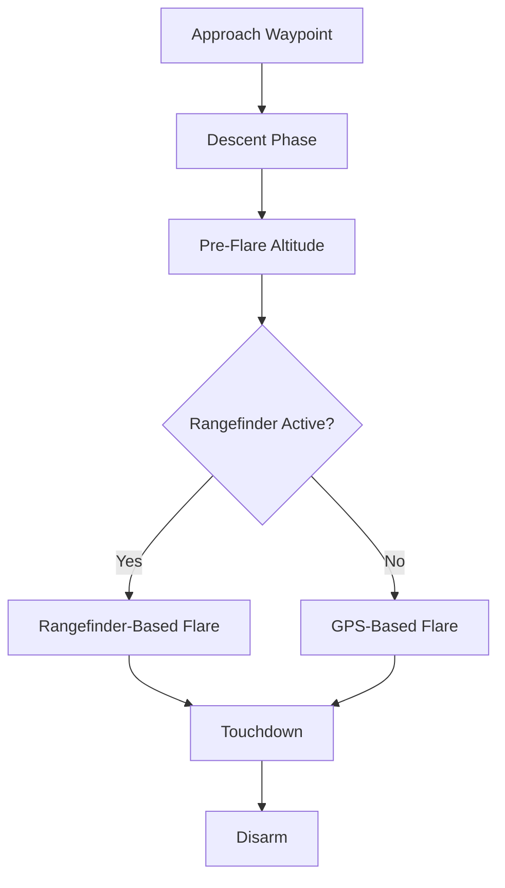
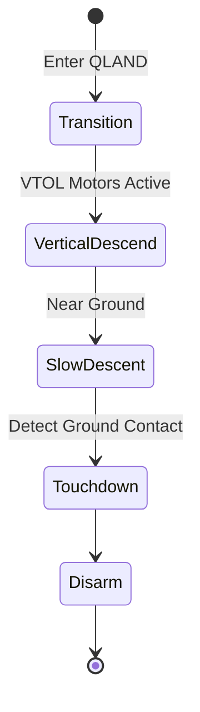
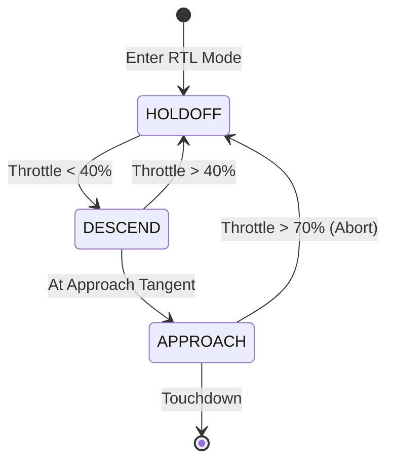

# ArduPlane Automatic Landing Systems


## Table of Contents
- [Overview](#overview)
- [Standard Landing Modes](#standard-landing-modes)
  - [AUTO Mode Landing](#auto-mode-landing)
  - [LAND Mode](#land-mode)
  - [QLAND Mode (QuadPlane)](#qland-mode-quadplane)
- [Precision Landing](#precision-landing)
  - [IRLock and Computer Vision](#irlock-and-computer-vision)
  - [Configuration and Parameters](#precision-landing-configuration)
  - [Operating Modes](#precision-landing-operating-modes)
- [Ship Landing for Moving Platforms](#ship-landing-for-moving-platforms)
  - [Equipment Requirements](#equipment-requirements)
  - [Radio Setup](#radio-setup)
  - [Landing Procedure](#ship-landing-procedure)
- [Terrain Following During Approach](#terrain-following-during-approach)
- [Rangefinder Integration](#rangefinder-integration)
- [Landing Abort and Go-Around](#landing-abort-and-go-around)
- [Parameter Configuration](#parameter-configuration)
- [Safety Considerations](#safety-considerations)
- [Troubleshooting](#troubleshooting)

---

## Overview

ArduPlane provides multiple automatic landing capabilities designed for different operational scenarios:

- **Standard Fixed-Wing Landing**: Gradual descent with flare before touchdown
- **QuadPlane VTOL Landing**: Vertical descent landing for hybrid aircraft
- **Precision Landing**: High-accuracy landing using visual beacons or computer vision
- **Ship Landing**: Landing on moving platforms (vessels, vehicles)
- **Terrain-Following Approach**: Maintaining consistent height above terrain during descent

These systems integrate rangefinder, GPS, visual sensors, and terrain data to execute safe, repeatable landings across diverse environments.

**Source Files**: 
- `/ArduPlane/sensors.cpp` - Rangefinder integration
- `/libraries/AP_Scripting/applets/plane_precland.lua` - Precision landing implementation
- `/libraries/AP_Scripting/applets/plane_ship_landing.lua` - Ship landing implementation
- `/libraries/AP_Scripting/examples/plane_guided_terrain.lua` - Terrain following

---

## Standard Landing Modes

### AUTO Mode Landing

AUTO mode landing executes a pre-programmed landing sequence from a mission waypoint (NAV_LAND or DO_LAND_START commands).

**Landing Sequence**:



**Key Parameters**:
- `TECS_LAND_ARSPD`: Landing approach airspeed (m/s). If -1, uses `AIRSPEED_CRUISE`
- `TECS_LAND_SINK`: Target sink rate during landing approach (m/s)
- `LAND_FLARE_ALT`: Altitude above ground to begin flare maneuver (meters)
- `LAND_FLARE_SEC`: Time before touchdown to flare (seconds)
- `LAND_PITCH_CD`: Pitch angle to hold during final approach (centidegrees)

**Approach Phase**:
During the approach, the aircraft descends at the configured sink rate while maintaining landing airspeed. The TECS (Total Energy Control System) manages the energy state to achieve a stable glide slope.

**Flare Phase**:
The flare maneuver reduces sink rate and airspeed before touchdown. Flare initiation can be triggered by:
- Rangefinder reading below `LAND_FLARE_ALT`
- Time-based: `LAND_FLARE_SEC` seconds before estimated touchdown
- GPS altitude (less accurate, not recommended for precision)

### LAND Mode

LAND mode initiates an immediate landing from the current position. The aircraft will:

1. Circle at current location while descending
2. Gradually reduce the circle radius
3. Execute flare and touchdown procedures

**Use Cases**:
- Emergency landing situations
- Quick return-to-launch when manual flight is not desired
- Failsafe landing trigger

**Parameters**:
- `RTL_RADIUS`: Loiter radius during LAND mode descent (meters). Negative for counter-clockwise
- `WP_LOITER_RAD`: Fallback loiter radius if `RTL_RADIUS` is zero
- Same flare parameters as AUTO mode landing

> **Warning**: LAND mode does not account for terrain or obstacles. Use only in clear landing areas.

### QLAND Mode (QuadPlane)

QLAND executes a vertical landing for QuadPlane (VTOL) aircraft. This mode is only available on aircraft with QuadPlane capability enabled.

**Landing Sequence**:



**Key Parameters**:
- `Q_LAND_SPEED`: Maximum descent speed (cm/s, typically 50-100 cm/s)
- `Q_LAND_FINAL_ALT`: Altitude to switch to final descent speed (meters, typically 5-10m)
- `Q_LAND_FINAL_SPD`: Final descent speed near ground (cm/s, typically 30-50 cm/s)
- `Q_OPTIONS`: Bit 15 enables throttle control during landing, bit 17 enables repositioning

**Descent Control**:
The QuadPlane gradually reduces descent rate as it approaches the ground. Ground contact is detected through:
- Motor throttle saturation (motors at minimum but still descending)
- Rangefinder reading below threshold
- Accelerometer impact detection

**Abort Options**:
If `Q_OPTIONS` bit 15 (ThrLandControl) is set, pilot can:
- Raise throttle above 70% to enable manual descent rate control
- Climb back up to abort landing

---

## Precision Landing

Precision landing enables high-accuracy touchdowns using visual tracking of ground-based targets. This is particularly useful for VTOL aircraft (QuadPlanes) landing on confined spaces, helipads, or autonomous platforms.

**Implementation**: Provided via Lua script `/libraries/AP_Scripting/applets/plane_precland.lua`

### IRLock and Computer Vision

ArduPlane supports precision landing through the precision landing subsystem (`PLND_*` parameters), which can use:

- **IRLock Beacon**: Infrared LED beacon tracked by IRLock sensor
- **Computer Vision**: Custom vision systems providing target pose via MAVLink
- **AprilTags**: Fiducial markers detected by onboard camera
- **Other Sensors**: Any sensor providing `LANDING_TARGET` MAVLink messages

**Supported Flight Modes**:
- **QLAND**: Full precision landing from altitude
- **QRTL**: Precision landing after return-to-launch
- **AUTO**: Precision landing at mission waypoints
- **QLOITER**: Precision position hold (requires auxiliary function 39 activation)

### Precision Landing Configuration

**Required Parameters**:

```cpp
// Enable precision landing subsystem
PLND_ENABLED = 1

// Sensor type: 0=None, 1=IRLock, 2=MAVLink, 3=Scripting
PLND_TYPE = 1  

// Maximum horizontal correction distance (meters)
// Target beyond this distance will be ignored
PLND_XY_DIST_MAX = 2.5

// Enable velocity matching for moving targets (bitmask)
// Bit 0: Enable velocity matching
PLND_OPTIONS = 1
```

**Script-Specific Parameters** (source: `plane_precland.lua:34-54`):

```cpp
// Altitude cutoff below which precision corrections stop (meters)
// Many sensors have poor performance at low altitude
// 0 = no cutoff, 5-10 recommended
PLND_ALT_CUTOFF = 5.0

// Maximum horizontal distance for landing corrections (meters)
// Corrections stop if target is beyond this distance
// 0 = no limit
PLND_DIST_CUTOFF = 10.0
```

**Sensor Installation**:
For IRLock installation and configuration, refer to: https://ardupilot.org/copter/docs/precision-landing-with-irlock.html

### Precision Landing Operating Modes

**Automatic Descent Phase**:

The precision landing script activates when:
1. Vehicle is in QLAND, QRTL, or AUTO VTOL landing
2. Vehicle enters VTOL land descent phase (`quadplane:in_vtol_land_descent()` returns true)
3. Precision landing sensor reports target acquired

**Target Tracking Logic** (source: `plane_precland.lua:73-95`):

```lua
-- Target acquisition requires:
-- 1. Healthy precision landing subsystem
-- 2. Target acquired signal from sensor
-- 3. Valid rangefinder data (if PLND_ALT_CUTOFF > 0)

function update_target()
   if not precland:healthy() then
      have_target = false
      return
   end
   local ok = precland:target_acquired()
   
   if PLND_ALT_CUTOFF:get() > 0 then
      -- Require rangefinder as well
      if not rangefinder:has_data_orient(rangefinder_orient) then
         ok = false
      end
   end
   
   if ok ~= have_target then
      have_target = ok
      if have_target then
         gcs:send_text(MAV_SEVERITY.INFO, "PLND: Target Acquired")
      else
         gcs:send_text(MAV_SEVERITY.INFO, "PLND: Target Lost")
      end
   end
end
```

**Position Correction** (source: `plane_precland.lua:158-180`):

The script continuously updates the vehicle's navigation target to track the precision landing target:

1. Retrieve current navigation waypoint
2. Get precision landing target location
3. Update waypoint latitude/longitude to match target
4. Apply velocity matching if target is moving (when `PLND_OPTIONS & 1`)
5. Pause descent if horizontal distance exceeds `PLND_XY_DIST_MAX`

**Altitude-Based Cutoff**:

When rangefinder distance drops below `PLND_ALT_CUTOFF`, precision corrections stop to avoid sensor noise at low altitude. The vehicle continues landing at the last corrected position.

```lua
-- Stop precision corrections at low altitude (plane_precland.lua:169-172)
local rngfnd_distance_m = rangefinder:distance_orient(rangefinder_orient)
if PLND_ALT_CUTOFF:get() > 0 and rngfnd_distance_m < PLND_ALT_CUTOFF:get() then
   return  -- Stop adjusting position
end
```

**Precision QLoiter Mode**:

Precision position hold in QLOITER mode allows pilot-controlled altitude while maintaining lateral position over a precision target.

**Activation**:
- Set RC auxiliary function 39 (`PRECISION_LOITER`) on a switch
- Enable the switch while in QLOITER mode
- Vehicle will center itself over the detected target
- Pilot retains throttle/altitude control

**Use Case**: Hovering over inspection targets, manual positioning before automated landing

### Precision Landing Data Logging

The script logs precision landing data to the `PPLD` message for post-flight analysis:

```
PPLD: Lat, Lon, Alt, HDist, TDist, RFND, VN, VE
```

Where:
- `Lat`, `Lon`, `Alt`: Target location
- `HDist`: Horizontal distance to target (meters)
- `TDist`: Total 3D distance to target (meters)
- `RFND`: Rangefinder distance (meters)
- `VN`, `VE`: Target velocity North/East (m/s)

**Analysis**: Use this log to evaluate sensor performance, tracking accuracy, and descent rate management.

---

## Ship Landing for Moving Platforms

Ship landing enables QuadPlane aircraft to autonomously land on moving vessels, vehicles, or other dynamic platforms. This advanced capability requires precise position tracking and velocity matching.

**Implementation**: Provided via Lua script `/libraries/AP_Scripting/applets/plane_ship_landing.lua`

**Key Concepts**:
- **Beacon**: A flight controller on the moving platform broadcasting position and velocity
- **Holdoff Position**: A circling position above and behind the platform
- **Approach Tangent**: The point where the aircraft transitions from fixed-wing to VTOL
- **Velocity Matching**: Aircraft matches platform velocity during VTOL descent

### Equipment Requirements

**Beacon Flight Controller**:

The moving platform must have a flight controller running ArduPilot Rover firmware configured as a beacon:

```cpp
// Beacon Configuration Parameters
FRAME_CLASS = 2          // Set to "boat" for proper GCS icon
SYSID_THISMAV = 17       // Unique system ID (different from aircraft and GCS)

// Yaw source (critical for accuracy)
// Option 1: Dual GPS with moving baseline
AHRS_EKF_TYPE = 3
GPS_TYPE = 17            // UBLOX Moving Baseline Base
GPS_TYPE2 = 18           // UBLOX Moving Baseline Rover
GPS_MB_TYPE = 1

// Option 2: Compass (less accurate in magnetically noisy environments)
COMPASS_ENABLE = 1

// Altitude source: Use GPS altitude
EK3_SRC1_POSZ = 3        // GPS altitude
```

**Recommended**: Dual F9P GPS with moving baseline yaw for reliable heading on platforms where compass performance may be degraded. See: https://ardupilot.org/rover/docs/common-gps-for-yaw.html

**Beacon Placement**:
- Position beacon for optimal radio performance (elevated, clear of obstructions)
- Actual landing point is offset from beacon using `FOLL_OFS_*` parameters
- Beacon does not need to be at the landing spot

### Radio Setup

Ship landing requires bidirectional communication between aircraft, beacon, and ground control station (GCS).

**Communication Requirements**:
- GCS must receive MAVLink from both aircraft and beacon
- Aircraft must receive `GLOBAL_POSITION_INT` messages from beacon
- Beacon system ID must differ from aircraft and GCS

**Radio Configuration Options**:

1. **WiFi Mesh Network**:
   - Configure all devices on same multicast network
   - Simplest for short-range operations
   - Good for harbor/dock testing

2. **Mesh-Capable Radio**:
   - RFDesign RFD900x with multi-point firmware
   - Configure radios for broadcast mode
   - Extended range for offshore operations

3. **Relay Radio Network**:
   - Use RFD900x relay firmware: https://firmware.ardupilot.org/SiK/RFD900x-relay/
   - NODE=1: GCS
   - NODE=0: Beacon
   - NODE=2: Aircraft
   - Relay automatically routes messages between nodes

4. **GCS Forwarding**:
   - MAVProxy or Mission Planner can forward beacon messages to aircraft
   - MAVProxy: Use `fwdpos` setting
   - Suitable for line-of-sight operations

### Ship Landing Configuration

**Aircraft Parameters** (source: `plane_ship_landing.md:35-42`):

```cpp
// Essential Parameters
SCR_ENABLE = 1                // Enable Lua scripting
SCR_HEAP_SIZE = 100000        // Allocate memory for scripts
SHIP_ENABLE = 1               // Enable ship landing script

// Follow System Configuration
FOLL_ENABLE = 1               // Enable follow mode
FOLL_SYSID = 17               // System ID of beacon (must match beacon SYSID_THISMAV)
FOLL_OFS_TYPE = 1             // Offsets relative to beacon heading
FOLL_ALT_TYPE = 0             // Altitude offset type

// Landing Behavior
Q_RTL_MODE = 0                // Required: Disable normal RTL auto-land
RTL_AUTOLAND = 0              // Required: Disable auto-land in RTL
```

> **Note**: After setting these parameters, refresh parameters and reboot. The `SHIP_*` parameters will appear once the script is loaded.

**Ship Landing Parameters**:

```cpp
// Approach angle in degrees relative to stern (source: plane_ship_landing.lua:57-64)
// 0 = approach from behind (following ship)
// 90 = approach from port (left) side
// -90 = approach from starboard (right) side
// 180 = approach from bow (head-on)
SHIP_LAND_ANGLE = 0

// Automatic offset calculation trigger
// Set to 1 to calculate FOLL_OFS_* from current position
// Auto-resets to 0 after calculation
SHIP_AUTO_OFS = 0
```

**Landing Offset Configuration**:

The landing point is offset from the beacon position using front-right-down coordinates relative to the beacon's heading:

```cpp
// FOLL_OFS_X: Distance in front of beacon (meters, negative = behind)
// FOLL_OFS_Y: Distance to right of beacon (meters, negative = left)
// FOLL_OFS_Z: Distance below beacon (meters, negative = above)
```

**Automatic Offset Calculation** (source: `plane_ship_landing.lua:389-408`):

The easiest way to configure landing offsets:

1. Place aircraft at desired landing position on the platform
2. Ensure beacon is active and visible to aircraft
3. Set `SHIP_AUTO_OFS = 1`
4. Script calculates and saves offset parameters automatically
5. Check GCS messages tab for: `Set follow offset (X, Y, Z)`
6. **Critical**: Verify Z offset is reasonable (altitude difference between beacon and aircraft)
7. If Z offset is incorrect, reboot beacon and/or aircraft to resolve GPS altitude drift

**Before Each Flight**: Run automatic offset calculation to account for GPS altitude drift.

### Ship Landing Procedure

**Holdoff Position Calculation** (source: `plane_ship_landing.lua:218-235`):

The aircraft circles at a "holdoff position" above and behind (or at configured angle) the moving platform. The holdoff distance is dynamically calculated based on:

- Loiter radius: `RTL_RADIUS` (or `WP_LOITER_RAD` if RTL_RADIUS is zero)
- Stopping distance: Function of airspeed, wind, ship velocity, and deceleration capability
- Minimum: 1.5 × loiter radius
- Maximum: 2.5 × loiter radius, or 2 × stopping distance (whichever is greater)

```lua
-- Holdoff distance calculation (plane_ship_landing.lua:227-234)
function get_holdoff_distance()
   local radius = get_holdoff_radius()
   local holdoff_dist = math.abs(radius * 1.5)
   local stop_distance = stopping_distance()
   
   -- Increase holdoff distance to ensure we can stop
   holdoff_dist = math.max(holdoff_dist, math.min(holdoff_dist * 2.5, stop_distance * 2))
   return holdoff_dist
end
```

**Stopping Distance** (source: `plane_ship_landing.lua:182-216`):

Calculates the distance required to decelerate from cruise to VTOL transition, accounting for:
- Landing approach airspeed: `TECS_LAND_ARSPD` (or `AIRSPEED_CRUISE` if negative)
- Wind velocity and direction
- Ship velocity relative to approach vector
- Deceleration rate: `Q_TRANS_DECEL`

**Landing Stages** (source: `plane_ship_landing.lua:98-103`):

```lua
local STAGE_HOLDOFF = 0    -- Circling at RTL_ALTITUDE above platform
local STAGE_DESCEND = 1    -- Descending to Q_RTL_ALT approach altitude
local STAGE_APPROACH = 2   -- Final VTOL approach and landing
local STAGE_IDLE = 3       -- Not in landing mode
```

**Stage Transitions**:



**Throttle Stick Control** (source: `plane_ship_landing.md:109-115`):

The pilot uses throttle stick position to control the landing sequence:

| Throttle Position | Action |
|------------------|--------|
| ≥ 40% | Hold at holdoff position (`RTL_ALTITUDE` above beacon) |
| 10% - 40% | Descend to approach altitude (`Q_RTL_ALT` above beacon) |
| < 10% | Initiate final approach when lined up |

**Approach Tangent Detection** (source: `plane_ship_landing.lua:271-298`):

The aircraft automatically transitions from DESCEND to APPROACH stage when:
- Throttle is low (< 40%)
- Altitude within 3m of `Q_RTL_ALT` target
- Within 0.7 to 2.5 × holdoff distance from platform
- Ground track aligned with target bearing (within 10°)
- Heading aligned with ship heading + landing angle (within 20°)

**Landing Abort** (source: `plane_ship_landing.lua:304-312`):

During APPROACH stage (QRTL mode), pilot can abort by:
1. Raising throttle above 70% (requires `Q_OPTIONS` bit 15 set)
2. Climbing above `Q_RTL_ALT` approach altitude
3. Aircraft automatically returns to RTL holdoff circling

**Velocity Matching**:

During VTOL descent, the aircraft continuously matches the platform's horizontal velocity:
```lua
-- Velocity matching during QRTL (plane_ship_landing.lua:456-459)
elseif vehicle_mode == MODE_QRTL then
   vehicle:set_velocity_match(target_velocity:xy())
   target_pos:alt(next_WP:alt())
   vehicle:update_target_location(next_WP, target_pos)
```

**Home Position Update**:

While ship landing is active, the HOME position continuously updates to match the landing target location. This provides real-time visualization of the landing point in the ground station.

### Ship Landing Parameters Summary

| Parameter | Description | Typical Value |
|-----------|-------------|---------------|
| `RTL_ALTITUDE` | Holdoff altitude above platform (cm) | 9000 (90m) |
| `Q_RTL_ALT` | Approach altitude above platform (m) | 40 |
| `RTL_RADIUS` | Loiter radius (m, negative for CCW) | -50 to -100 |
| `SHIP_LAND_ANGLE` | Approach angle relative to stern (deg) | 0 |
| `Q_TRANS_DECEL` | Deceleration rate (m/s²) | 2.0 |
| `Q_OPTIONS` | Bit 15: throttle control, Bit 17: repositioning | 49152 |

### Ship Landing Takeoff

When `SHIP_ENABLE=1` and beacon is visible, AUTO VTOL takeoff missions automatically use velocity matching. The aircraft maintains position relative to the moving platform while ascending (source: `plane_ship_landing.md:89-91`).

**Mission Planning**: A simple mission with a single VTOL_TAKEOFF waypoint is suitable for ship operations. After takeoff, the aircraft enters RTL and proceeds to the holdoff position. This mission works regardless of ship location.

### Ship Landing Simulation

For testing without physical hardware, use SITL simulation (source: `plane_ship_landing.md:123-132`):

```cpp
SIM_SHIP_ENABLE = 1       // Enable simulated ship
SIM_SHIP_SPEED = 5        // Ship speed (m/s)
SIM_SHIP_DSIZE = 50       // Deck size (m)
SIM_SHIP_PSIZE = 2000     // Circular path radius (m)
SIM_SHIP_OFS_X = 5        // Beacon offset forward from aircraft at start (m)
SIM_SHIP_OFS_Y = 0        // Beacon offset right from aircraft at start (m)
```

---

## Terrain Following During Approach

Terrain following maintains a consistent altitude above ground level (AGL) during landing approach, preventing premature touchdown on rising terrain or excessive altitude on descending slopes.

**Enable Terrain Following**:
```cpp
TERRAIN_ENABLE = 1        // Enable terrain database
TERRAIN_FOLLOW = 1        // Enable terrain following (bit 0)
                          // Bit 6 (value 64): Terrain following in GUIDED mode
```

**Terrain Data Sources**:
1. **Onboard Database**: Downloaded terrain tiles (requires SD card and GCS download)
2. **Rangefinder**: Real-time height-above-ground measurement
3. **Fusion**: Combines terrain database with rangefinder for highest accuracy

### Guided Mode Terrain Following

The `plane_guided_terrain.lua` script enables terrain-aware altitude control in GUIDED mode (source: `plane_guided_terrain.lua:1-18`).

**Script Parameters**:

```cpp
ZGT_MODE = 1              // Guided terrain mode:
                          // 1 = Reset to current terrain height (ignore GCS altitude command)
                          // 2 = Reset to X above terrain (GCS altitude)
                          // 3 = Reset to current altitude + X
```

**Use Case**: When a GCS sends "Fly to Altitude" command (e.g., right-click on QGroundControl map), the script automatically adjusts the command to be terrain-relative instead of home-relative.

**Operation** (source: `plane_guided_terrain.lua:140-196`):

When switching to GUIDED mode with terrain following enabled:
1. Script intercepts the GCS altitude target
2. Converts target to terrain-relative frame
3. Adjusts based on `ZGT_MODE` setting
4. Constrains to safe altitude range (50-120m in example)
5. Sends corrected altitude command to vehicle

```lua
-- Altitude adjustment based on ZGT_MODE (plane_guided_terrain.lua:167-178)
if zgt_mode == 1 then
   new_target_altitude = current_altitude  -- Ignore GCS, use current AGL
elseif zgt_mode == 2 then
   new_target_altitude = above_home  -- Use GCS altitude above terrain
elseif zgt_mode == 3 then
   new_target_altitude = current_altitude + above_home  -- Relative climb
end
```

### Terrain Following During Landing Approach

When `TERRAIN_FOLLOW` is enabled, the vehicle maintains the configured descent rate relative to terrain height, not home altitude. This ensures consistent approach profile over varying terrain.

**Terrain-Relative Waypoints**:
Mission waypoints can be set with altitude frame `ABOVE_TERRAIN` to follow terrain contours during the approach phase.

---

## Rangefinder Integration

Rangefinders (downward-facing distance sensors) provide critical data for landing safety:

- **Accurate Flare Height**: Trigger flare at precise altitude above ground
- **Terrain Following**: Real-time height-above-ground for approach
- **Precision Landing**: Required for altitude cutoff in low-altitude phase
- **Touchdown Detection**: Confirms ground contact

### Rangefinder Configuration

```cpp
RNGFND1_TYPE = X          // Sensor type (e.g., 1=LightWareI2C, 10=MAVLink, 20=UAVCAN)
RNGFND1_ORIENT = 25       // 25 = Downward facing
RNGFND1_MIN_CM = 10       // Minimum reliable distance (cm)
RNGFND1_MAX_CM = 4000     // Maximum reliable distance (cm)
RNGFND1_GNDCLEAR = 10     // Distance from rangefinder to ground when landed (cm)
```

**Sensor Selection**:
- **LiDAR**: Best accuracy and range (e.g., LightWare SF11, Benewake TF-Luna)
- **Ultrasonic**: Short range, weather-sensitive (e.g., MaxBotix)
- **Radar**: Good for rough terrain, longer range (e.g., Ainstein US-D1)

### Rangefinder in Landing Phases

**During Approach** (source: `ArduPlane/sensors.cpp:9-36`):

The flight controller notifies the rangefinder of approximate altitude to enable power management on sensors that can power down at high altitude:

```cpp
// Rangefinder power management (ArduPlane/sensors.cpp:12-31)
void Plane::read_rangefinder(void)
{
   float height;
   #if AP_TERRAIN_AVAILABLE
   if (terrain.status() == AP_Terrain::TerrainStatusOK && 
       terrain.height_above_terrain(height, true)) {
      rangefinder.set_estimated_terrain_height(height);
   } else
   #endif
   {
      if (flight_stage == AP_FixedWing::FlightStage::LAND) {
         // Ensure rangefinder powered during landing
         height = height_above_target();
      } else {
         height = relative_altitude;
      }
      rangefinder.set_estimated_terrain_height(height);
   }
   
   rangefinder.update();
   rangefinder_height_update();
}
```

**Flare Trigger**:

When `LAND_FLARE_ALT` is set and a valid rangefinder reading is available, the flare is triggered when:
```
rangefinder_distance < LAND_FLARE_ALT
```

This provides much more accurate flare initiation than GPS altitude, especially over uneven terrain.

**Precision Landing Cutoff** (source: `plane_precland.lua:166-172`):

Precision landing stops lateral corrections when rangefinder reports altitude below `PLND_ALT_CUTOFF`:

```lua
local rngfnd_distance_m = rangefinder:distance_orient(rangefinder_orient)
if PLND_ALT_CUTOFF:get() > 0 and rngfnd_distance_m < PLND_ALT_CUTOFF:get() then
   return  -- Stop precision adjustments at low altitude
end
```

**Touchdown Detection**:

QuadPlane landing uses rangefinder to detect ground proximity and confirm touchdown, enabling safe disarm.

### Rangefinder Failure Handling

If rangefinder data becomes invalid during landing:
- Flare trigger falls back to time-based (`LAND_FLARE_SEC`)
- Precision landing disables corrections (target lost message)
- Descent continues using barometric altitude

**Safety Note**: Always test landings with rangefinder failures in simulation to ensure safe fallback behavior.

---

## Landing Abort and Go-Around

### Fixed-Wing Abort

In AUTO mode, landing can be aborted by:

1. **Mode Change**: Switch to any non-AUTO mode (FBWA, LOITER, RTL, etc.)
2. **Mission Abort**: Issue `MAV_CMD_DO_GO_AROUND` MAVLink command
3. **Next Waypoint**: Advance to next mission waypoint if configured

**Go-Around Procedure**:
- Increase throttle to cruise power
- Pitch up to climb attitude
- Abort flare maneuver if in progress
- Climb to safe altitude before re-attempting

**Parameter**: `GO_AROUND_VEH_HEADING` can be used to configure heading during go-around.

### QuadPlane Abort

**During QLAND/QRTL Descent**:

If `Q_OPTIONS` bit 15 (ThrLandControl) is enabled:

1. **Throttle Abort**: Raise throttle above 70% momentarily
2. **Descent Control**: Throttle now controls descent/climb rate
3. **Climb Out**: If altitude rises above approach altitude, vehicle returns to holdoff/loiter

**During Ship Landing** (source: `plane_ship_landing.lua:304-312`):

The ship landing script automatically aborts if the aircraft climbs during QRTL approach:

```lua
function check_approach_abort()
   local alt = current_pos:alt() * 0.01
   local target_alt = get_target_alt()
   if alt > target_alt then
      gcs:send_text(MAV_SEVERITY.NOTICE, "Aborting landing")
      landing_stage = STAGE_HOLDOFF
      vehicle:set_mode(MODE_RTL)  -- Return to holdoff circling
   end
end
```

**Manual Abort**: Pilot raises throttle above 70%, climbs above `Q_RTL_ALT`, and the aircraft automatically returns to circling at holdoff position.

### Precision Landing Abort

Precision landing can be aborted by:

1. **Mode Switch**: Change to manual control mode (QLOITER, QSTABILIZE)
2. **Target Lost**: If target tracking fails, normal landing continues
3. **Distance Exceeded**: If `PLND_DIST_CUTOFF` is exceeded, corrections stop

**Fallback Behavior**: If precision target is lost, the vehicle continues landing at the last known target position using standard QLAND procedures.

### Abort Decision Factors

Consider aborting landing if:
- Excessive crosswind or wind shear encountered
- Landing target obstructed or unsafe
- Aircraft trajectory deviates significantly from planned approach
- System warnings (GPS loss, EKF errors, low battery critical)

**Critical**: Ensure sufficient battery reserves to execute go-around and reach alternate landing site.

---

## Parameter Configuration

### Essential Landing Parameters

**Fixed-Wing Landing**:

| Parameter | Description | Typical Range | Notes |
|-----------|-------------|---------------|-------|
| `TECS_LAND_ARSPD` | Landing approach airspeed (m/s) | 12-20 | -1 uses AIRSPEED_CRUISE |
| `TECS_LAND_SINK` | Target sink rate (m/s) | 0.5-2.0 | Higher for steep approaches |
| `LAND_FLARE_ALT` | Flare altitude above ground (m) | 2-10 | Lower for gentle approaches |
| `LAND_FLARE_SEC` | Flare time before touchdown (s) | 2-5 | Fallback if no rangefinder |
| `LAND_PITCH_CD` | Final approach pitch (centidegrees) | 0-500 | Slightly nose-up |
| `LAND_DISARMDELAY` | Time before auto-disarm after landing (s) | 3-20 | Safety buffer |

**QuadPlane Landing**:

| Parameter | Description | Typical Range | Notes |
|-----------|-------------|---------------|-------|
| `Q_LAND_SPEED` | Maximum descent speed (cm/s) | 50-100 | Conservative for safety |
| `Q_LAND_FINAL_ALT` | Altitude for final descent speed (m) | 5-10 | Transition to slow descent |
| `Q_LAND_FINAL_SPD` | Final descent speed (cm/s) | 30-50 | Gentle touchdown |
| `Q_OPTIONS` | Landing options bitmask | varies | Bit 15: throttle control, Bit 17: repositioning |
| `Q_RTL_ALT` | QRTL approach altitude (m) | 20-50 | Safety margin above obstacles |
| `Q_RTL_MODE` | QRTL landing behavior | 0 or 1 | 0 for ship landing |

**Precision Landing**:

| Parameter | Description | Typical Range | Notes |
|-----------|-------------|---------------|-------|
| `PLND_ENABLED` | Enable precision landing | 0 or 1 | Must enable subsystem |
| `PLND_TYPE` | Sensor type | 1-3 | 1=IRLock, 2=MAVLink, 3=Scripting |
| `PLND_XY_DIST_MAX` | Max horizontal correction (m) | 2-5 | Pause descent if exceeded |
| `PLND_OPTIONS` | Options bitmask | varies | Bit 0: velocity matching |
| `PLND_ALT_CUTOFF` | Stop corrections below (m) | 5-10 | Sensor noise at low altitude |
| `PLND_DIST_CUTOFF` | Max correction distance (m) | 10-20 | Ignore distant targets |

**Ship Landing**:

| Parameter | Description | Typical Range | Notes |
|-----------|-------------|---------------|-------|
| `SHIP_ENABLE` | Enable ship landing | 0 or 1 | Requires script |
| `SHIP_LAND_ANGLE` | Approach angle from stern (deg) | -180 to 180 | 0=from behind |
| `FOLL_ENABLE` | Enable follow mode | 1 | Required |
| `FOLL_SYSID` | Beacon system ID | 1-255 | Match beacon SYSID_THISMAV |
| `FOLL_OFS_X` | Landing offset forward (m) | varies | Use SHIP_AUTO_OFS |
| `FOLL_OFS_Y` | Landing offset right (m) | varies | Use SHIP_AUTO_OFS |
| `FOLL_OFS_Z` | Landing offset down (m) | varies | Critical for altitude |
| `RTL_ALTITUDE` | Holdoff altitude (cm) | 5000-10000 | 50-100m typical |
| `Q_TRANS_DECEL` | Deceleration rate (m/s²) | 1.5-3.0 | Affects holdoff distance |

### Parameter Tuning Procedure

**Step 1: Simulation Testing**

Test all landing configurations in SITL (Software-In-The-Loop) simulation before flight:

```bash
# Start ArduPlane SITL
sim_vehicle.py -v ArduPlane -f quadplane --console --map

# For ship landing simulation:
param set SIM_SHIP_ENABLE 1
param set SIM_SHIP_SPEED 5
```

**Step 2: Low-Risk Flight Testing**

1. **High Altitude Approaches**: Start with generous altitude margins
2. **Manual Takeover Ready**: Always have pilot ready to switch to manual mode
3. **Incremental Refinement**: Adjust one parameter at a time
4. **Data Logging**: Review logs after each landing to evaluate performance

**Step 3: Parameter Optimization**

Analyze logs for:
- **Airspeed Tracking**: Adjust `TECS_LAND_ARSPD` if airspeed deviates significantly
- **Sink Rate**: Modify `TECS_LAND_SINK` for desired glide slope
- **Flare Timing**: Tune `LAND_FLARE_ALT` or `LAND_FLARE_SEC` to achieve smooth touchdown
- **Pitch Control**: Adjust `LAND_PITCH_CD` to prevent tail strike or nose-wheel-first landing

---

## Safety Considerations

### Pre-Landing Checklist

**Before Every Automatic Landing**:

- [ ] **Battery Status**: Sufficient reserve for go-around and alternate landing (minimum 30%)
- [ ] **GPS Lock**: Good HDOP (< 1.5), satellite count (> 8)
- [ ] **EKF Health**: No EKF errors, variances within limits
- [ ] **Rangefinder**: Valid data if used for flare or precision landing
- [ ] **Wind Conditions**: Within aircraft limits, no severe turbulence or wind shear
- [ ] **Landing Area**: Clear of obstacles, suitable surface conditions
- [ ] **Precision Target**: Visible and tracking (if precision landing)
- [ ] **Beacon Link**: Active and healthy (if ship landing)
- [ ] **Failsafe Settings**: RTL, battery, and GCS failsafes configured
- [ ] **Manual Takeover**: Pilot ready to switch modes immediately

### Critical Safety Features

**Geofence**:
Configure geofence to prevent landing outside authorized areas:
```cpp
FENCE_ENABLE = 1
FENCE_ACTION = 1           // RTL on breach
FENCE_ALT_MAX = 120        // Maximum altitude (m)
FENCE_MARGIN = 10          // Margin for fence breach (m)
```

**Battery Failsafe**:
```cpp
BATT_LOW_VOLT = 3.5        // Low battery voltage per cell
BATT_CRT_VOLT = 3.3        // Critical battery voltage per cell
BATT_FS_LOW_ACT = 2        // Low battery action: RTL
BATT_FS_CRT_ACT = 1        // Critical battery action: LAND
```

**GCS Failsafe**:
```cpp
FS_LONG_ACTN = 1           // RTL on long GCS loss
FS_LONG_TIMEOUT = 20       // GCS timeout (seconds)
FS_SHORT_ACTN = 0          // No action on short loss
FS_SHORT_TIMEOUT = 3       // Short timeout (seconds)
```

### Landing Site Selection

**Fixed-Wing Landing Sites**:
- Minimum length: 2× stall distance + 50% safety margin
- Width: 3× wingspan minimum
- Surface: Smooth, firm, minimal obstacles
- Approach: Clear approach path, no obstructions in glide slope
- Wind: Land into wind when possible

**QuadPlane Landing Sites**:
- Minimum area: 5m × 5m clear zone
- Surface: Level, firm, no debris
- Clearance: No vertical obstacles within 10m radius
- Downdrafts: Avoid areas with buildings that cause turbulence

**Ship Landing**:
- Deck size minimum: 3m × 3m for small QuadPlanes
- Platform motion: Ensure approach angle clear of superstructure
- Abort path: Clear go-around vector away from ship obstacles

### Emergency Procedures

**If Landing Goes Wrong**:

1. **Immediate Abort**: Switch to manual mode or raise throttle (QuadPlane)
2. **Assess Situation**: Altitude, battery, aircraft state
3. **Execute Go-Around**: Climb to safe altitude
4. **Diagnose Issue**: Check telemetry, logs, sensor status
5. **Alternate Landing**: Switch to manual landing or alternate site

**Loss of GPS During Landing**:
- **Fixed-Wing**: Switch to FBWA (manual stabilized), land manually
- **QuadPlane**: Switch to QSTABILIZE (manual hover), land manually
- **Critical**: Do NOT attempt automatic landing without GPS

**Loss of RC Link**:
- Failsafe should trigger RTL or auto-land
- Aircraft executes configured failsafe action
- Monitor via telemetry, regain RC if possible

**Low Battery During Landing**:
- Do NOT attempt go-around if battery critical
- Continue landing immediately at current location
- Expect reduced power, potential loss of control

### Testing and Validation

**Simulation Testing** (REQUIRED before flight):
1. Normal landing scenarios
2. Wind variations (crosswind, headwind, tailwind)
3. Sensor failures (GPS, rangefinder, precision sensor)
4. Abort and go-around procedures
5. Battery failsafe during landing
6. Geofence interactions

**Flight Testing Progression**:
1. High-altitude aborts (test abort procedures without risk)
2. Landing approaches with manual takeover before touchdown
3. Complete automatic landings with pilot ready
4. Landing in various wind conditions
5. Precision landing (if applicable)
6. Ship landing (if applicable)

**Never test new landing configurations in operational scenarios without thorough simulation and incremental flight validation.**

---

## Troubleshooting

### Common Issues and Solutions

**Issue: Flare Too Early or Too Late**

**Symptoms**: 
- Aircraft flares several meters above ground (too early)
- Aircraft touches down hard without flare (too late)

**Causes**:
- Incorrect `LAND_FLARE_ALT` setting
- Rangefinder calibration error (`RNGFND1_GNDCLEAR`)
- GPS altitude drift without terrain data

**Solutions**:
1. Verify rangefinder is providing valid data during approach
2. Check `RNGFND1_GNDCLEAR` matches actual sensor-to-ground distance when landed
3. Adjust `LAND_FLARE_ALT` based on log analysis (increase if early, decrease if late)
4. Enable terrain following for GPS altitude correction
5. Use time-based flare (`LAND_FLARE_SEC`) as fallback

---

**Issue: Precision Target Not Acquired**

**Symptoms**:
- "PLND: Target Lost" or no target acquisition message
- Landing proceeds without precision corrections

**Causes**:
- Precision sensor not detecting target (IR beacon, AprilTag, etc.)
- `PLND_ENABLED = 0`
- Incorrect `PLND_TYPE` setting
- Sensor field-of-view doesn't include target
- Target too far away (`PLND_DIST_CUTOFF` or `PLND_XY_DIST_MAX`)

**Solutions**:
1. Verify `PLND_ENABLED = 1` and `PLND_TYPE` matches sensor
2. Check sensor field-of-view and mounting orientation
3. Test sensor detection at various altitudes and angles
4. Verify target beacon is powered and visible
5. Increase `PLND_DIST_CUTOFF` if target is initially distant
6. Check `precland:healthy()` and `precland:target_acquired()` in logs

---

**Issue: Ship Landing "Lost Beacon"**

**Symptoms**:
- "Lost beacon" message
- Arming failure: "Ship: no beacon"
- HOME icon not updating

**Causes**:
- Beacon flight controller not transmitting
- Radio link broken between aircraft and beacon
- Beacon system ID mismatch
- `FOLL_ENABLE = 0` or `FOLL_SYSID` incorrect

**Solutions**:
1. Verify beacon is powered, armed, and transmitting
2. Check radio link: GCS should see both aircraft and beacon
3. Confirm `FOLL_SYSID` matches beacon `SYSID_THISMAV`
4. Verify `FOLL_ENABLE = 1` on aircraft
5. Test with `mavproxy.py` or Mission Planner to confirm beacon messages received
6. Check beacon has valid GPS lock and yaw source

---

**Issue: Ship Landing Approach Tangent Never Triggers**

**Symptoms**:
- Aircraft descends to approach altitude but never enters QRTL
- Continues circling in RTL mode
- No "Starting approach" message

**Causes**:
- Aircraft not aligned with approach vector
- Distance to ship not in valid range (0.7-2.5× holdoff distance)
- Wind preventing accurate ground track
- `Q_RTL_MODE` not set to 0

**Solutions**:
1. Check `SLND` log messages for bearing errors (Err1, Err2)
2. Verify ground track matches ship heading + `SHIP_LAND_ANGLE` (within 20°)
3. Increase loiter time to allow better alignment
4. Adjust `SHIP_LAND_ANGLE` if wind consistently prevents alignment
5. Check `Q_RTL_MODE = 0` and `RTL_AUTOLAND = 0`
6. Review holdoff distance calculation in logs

---

**Issue: Terrain Following Not Active**

**Symptoms**:
- Aircraft maintains constant altitude above home, not terrain
- Premature touchdown on rising terrain or excessive altitude on descending terrain

**Causes**:
- `TERRAIN_ENABLE = 0`
- `TERRAIN_FOLLOW = 0` or incorrect bitmask
- No terrain data loaded (missing SD card or tiles not downloaded)
- Terrain database not covering location

**Solutions**:
1. Set `TERRAIN_ENABLE = 1`
2. Set `TERRAIN_FOLLOW = 1` (bit 0) for loiter/AUTO, or `TERRAIN_FOLLOW = 65` (bit 0 + bit 6) for GUIDED
3. Use Mission Planner or QGC to download terrain tiles to SD card
4. Verify SD card is installed and writable
5. Check terrain database coverage for your location
6. Use rangefinder as fallback for real-time terrain following

---

**Issue: QuadPlane Won't Disarm After Landing**

**Symptoms**:
- Aircraft lands successfully but remains armed
- Must manually disarm

**Causes**:
- `LAND_DISARMDELAY` set too high or zero (disabled)
- Touchdown not detected (rangefinder or accelerometer)
- Throttle not at minimum

**Solutions**:
1. Check `LAND_DISARMDELAY` is set to reasonable value (10-20 seconds)
2. Verify rangefinder detects ground contact
3. Ensure motors reach minimum throttle (motor saturation detection)
4. Check throttle stick is at minimum during final descent
5. Manually disarm if necessary (safety check first)

---

**Issue: Excessive Position Corrections During Precision Landing**

**Symptoms**:
- Aircraft oscillates laterally during descent
- "Hunting" behavior over target
- Slow or paused descent

**Causes**:
- Precision sensor noise
- `PLND_XY_DIST_MAX` too restrictive
- Controller gains too aggressive
- Wind gusts causing position deviations

**Solutions**:
1. Increase `PLND_ALT_CUTOFF` to stop corrections earlier
2. Increase `PLND_XY_DIST_MAX` to allow larger corrections without pausing
3. Check precision sensor mounting for vibration
4. Filter sensor data if using custom MAVLink feed
5. Tune position controller gains (`Q_P_*` parameters)
6. Reduce descent speed (`Q_LAND_SPEED`) for more stable tracking

---

**Issue: High Descent Rate on Final Approach (QuadPlane)**

**Symptoms**:
- Aircraft descends faster than `Q_LAND_SPEED`
- Hard touchdown
- Insufficient time for position corrections

**Causes**:
- `Q_LAND_SPEED` set too high
- Battery voltage drop reducing available thrust
- High aircraft weight relative to motor capability
- Downwash or ground effect on moving platform

**Solutions**:
1. Reduce `Q_LAND_SPEED` (e.g., from 100 to 50 cm/s)
2. Reduce `Q_LAND_FINAL_SPD` for very gentle final descent
3. Ensure battery is not critically low during landing
4. Check motor and propeller condition
5. Verify aircraft weight within design limits
6. Test different descent speeds in simulation

---

### Log Analysis for Landing

**Key Log Messages**:

| Message | Purpose | Key Fields |
|---------|---------|------------|
| `CTUN` | Control tuning | `Alt`, `DSAlt` (desired altitude), `WPD` (waypoint distance) |
| `RFND` | Rangefinder | `Dist` (distance), `Stat` (status) |
| `PL` | Precision landing | `Lat`, `Lon`, `H` (health), `Trg` (target acquired) |
| `PPLD` | Precision landing (script) | `HDist`, `RFND`, `VN`, `VE` (target velocity) |
| `SLND` | Ship landing (script) | `TBrg`, `GBrg`, `Dist`, `Err1`, `Err2` |
| `TECS` | TECS controller | `sp`, `h` (altitude), `dh` (climb rate), `tar_sink` |
| `TERR` | Terrain | `Alt`, `Height`, `Status` |

**Log Analysis Tools**:
- **Mission Planner**: Graph logs, analyze parameters
- **MAVExplorer**: Advanced log analysis and graphing
- **UAV Log Viewer**: Web-based log analysis

**Example Analysis**:
1. Plot `CTUN.Alt` vs `RFND.Dist` to evaluate flare timing
2. Plot `PL.Trg` to see when precision target was acquired/lost
3. Plot `SLND.Err1` and `SLND.Err2` to debug approach tangent issues
4. Check `TECS.tar_sink` vs actual sink rate for descent control evaluation

---

## Additional Resources

**Official Documentation**:
- ArduPlane Landing Documentation: https://ardupilot.org/plane/docs/landing-page.html
- Precision Landing with IRLock: https://ardupilot.org/copter/docs/precision-landing-with-irlock.html
- QuadPlane Documentation: https://ardupilot.org/plane/docs/quadplane-support.html
- Ship Landing Discussion: https://discuss.ardupilot.org/t/ship-landing-support

**Parameter Reference**:
- Complete Parameter List: https://ardupilot.org/plane/docs/parameters.html

**Community Support**:
- ArduPilot Discourse Forum: https://discuss.ardupilot.org/
- ArduPilot Discord: https://ardupilot.org/discord

**Source Code**:
- ArduPlane GitHub: https://github.com/ArduPilot/ardupilot/tree/master/ArduPlane
- Scripting Applets: https://github.com/ArduPilot/ardupilot/tree/master/libraries/AP_Scripting/applets

---

## Revision History

| Version | Date | Changes | Author |
|---------|------|---------|--------|
| 1.0 | 2024 | Initial documentation covering standard, precision, and ship landing | ArduPilot Documentation Team |

---

**Document Status**: ✅ Complete

**Maintainer**: ArduPilot Documentation Team

**Last Reviewed**: 2024

**Safety Classification**: CRITICAL - This documentation covers safety-critical flight operations. Always validate procedures in simulation before flight testing.

