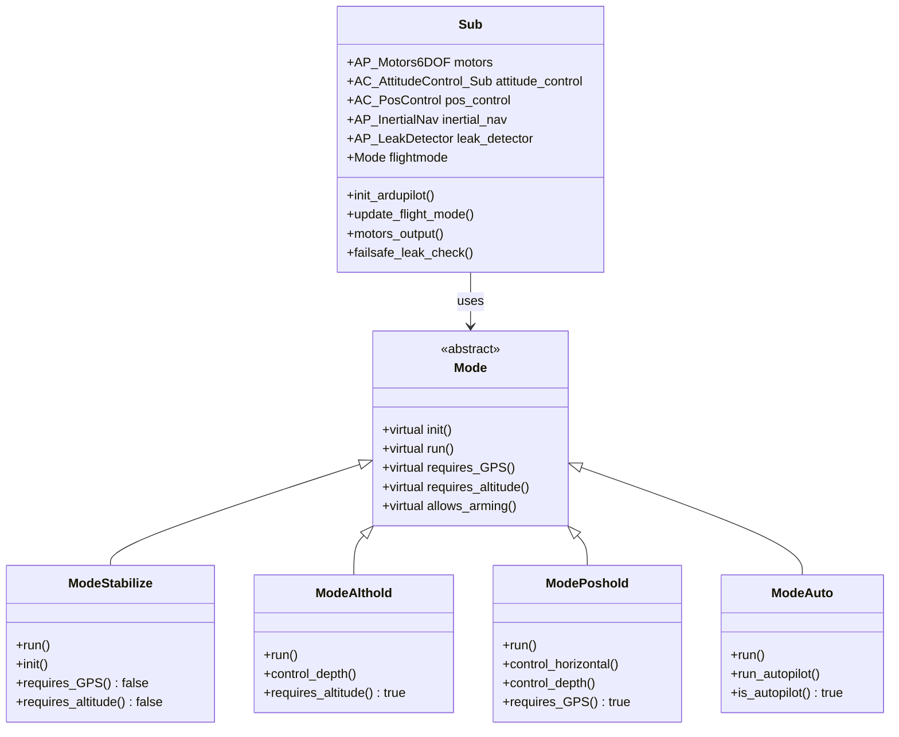
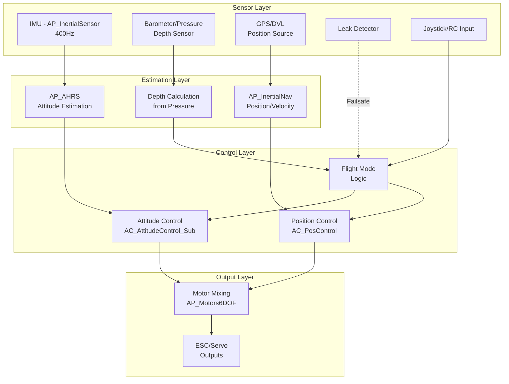
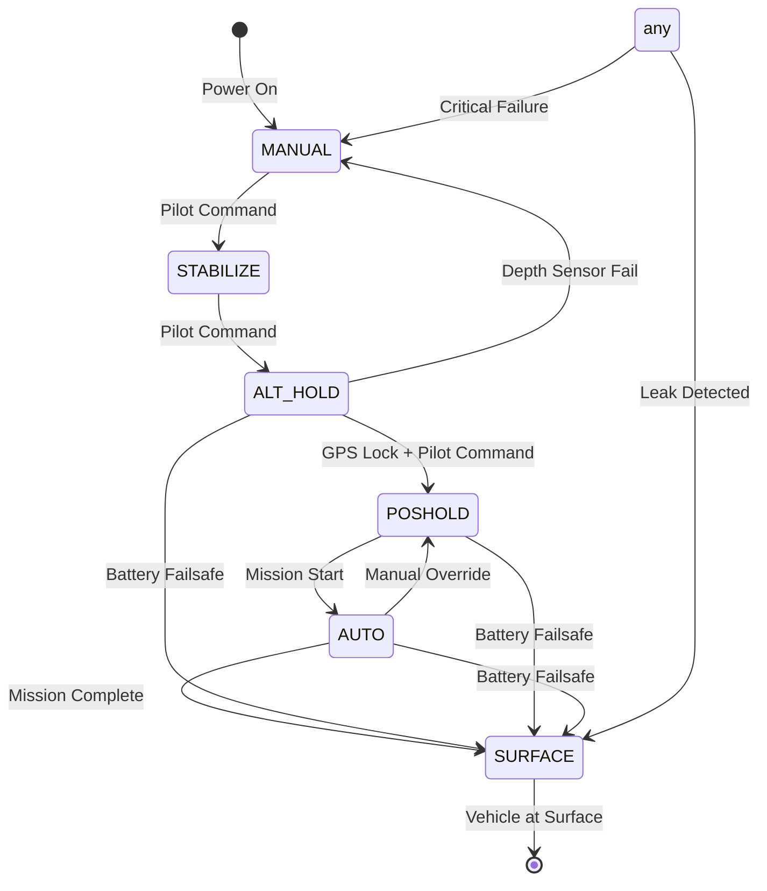
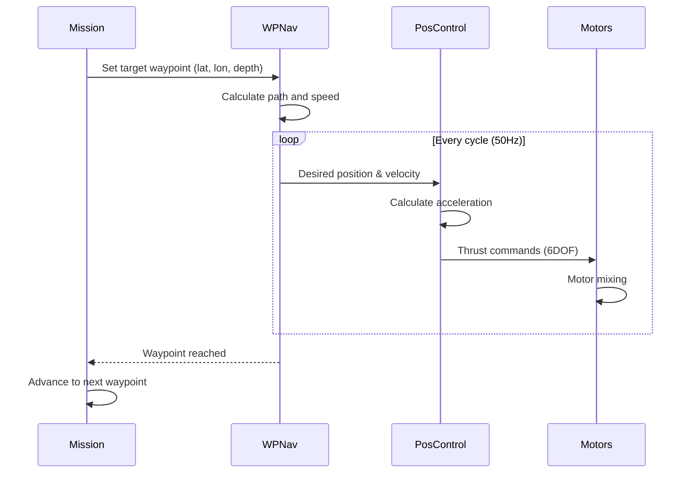
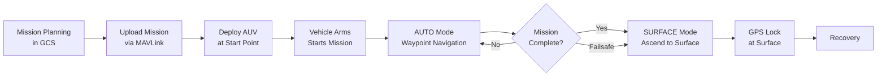

# ArduSub


## Table of Contents
- [Overview](#overview)
- [System Architecture](#system-architecture)
- [Flight Modes](#flight-modes)
- [6DOF Motor Control](#6dof-motor-control)
- [Depth and Pressure Control](#depth-and-pressure-control)
- [Joystick Control System](#joystick-control-system)
- [Underwater Navigation](#underwater-navigation)
- [Safety Systems and Failsafes](#safety-systems-and-failsafes)
- [Hardware Integration](#hardware-integration)
- [Configuration Parameters](#configuration-parameters)
- [ROV/AUV Operation](#rovauv-operation)
- [Code Examples](#code-examples)
- [Testing](#testing)
- [Contributing](#contributing)

## Overview

ArduSub is a comprehensive underwater vehicle control system within the ArduPilot autopilot suite, specifically designed for Remotely Operated Vehicles (ROVs) and Autonomous Underwater Vehicles (AUVs). It provides advanced 6-degree-of-freedom (6DOF) control, depth management, underwater-specific failsafe mechanisms, and comprehensive joystick integration for manual control.

**Key Features**:
- 6DOF motor control supporting multiple ROV frame configurations (BlueROV2, vectored, custom)
- Pressure-based depth control with automatic surface/bottom detection
- Comprehensive joystick/gamepad integration with button function mapping
- Underwater-specific failsafes (leak detection, internal pressure/temperature monitoring)
- Position hold using GPS, DVL, or visual odometry
- Autonomous mission execution with waypoint navigation
- Surface tracking mode for pipeline inspection and seafloor surveying
- Real-time attitude stabilization with manual override capabilities

**Source Files**: `/ArduSub/`
- Main vehicle class: `Sub.h`, `Sub.cpp`
- Flight modes: `mode.h`, `mode.cpp`, `mode_*.cpp`
- Safety systems: `failsafe.cpp`, `AP_Arming_Sub.cpp`
- Control systems: `joystick.cpp`, `motors.cpp`, `sensors.cpp`
- Configuration: `Parameters.cpp`, `Parameters.h`

## System Architecture

### Main Loop Structure

ArduSub implements a priority-based scheduler that executes tasks at different frequencies optimized for underwater vehicle control. The scheduler is defined in `/ArduSub/Sub.cpp:84-176`.

```cpp
// Source: /ArduSub/Sub.cpp:84-176
const AP_Scheduler::Task Sub::scheduler_tasks[] = {
    // FAST_TASK: Executed at main loop rate (typically 400Hz)
    FAST_TASK_CLASS(AP_InertialSensor, &sub.ins, update),
    FAST_TASK(run_rate_controller),
    FAST_TASK(motors_output),
    FAST_TASK(read_AHRS),
    FAST_TASK(read_inertia),
    FAST_TASK(check_ekf_yaw_reset),
    FAST_TASK(update_flight_mode),
    FAST_TASK(update_home_from_EKF),
    FAST_TASK(update_surface_and_bottom_detector),
    
    // Slower periodic tasks
    SCHED_TASK(fifty_hz_loop,         50,     75,   3),
    SCHED_TASK(update_batt_compass,   10,    120,  12),
    SCHED_TASK(read_rangefinder,      20,    100,  15),
    SCHED_TASK(update_altitude,       10,    100,  18),
    SCHED_TASK(three_hz_loop,          3,     75,  21),
    // ... additional tasks
};
```

> **Note**: The main loop runs at 400Hz (MAIN_LOOP_RATE) providing precise control for underwater maneuvering where water resistance affects vehicle dynamics.

### Class Architecture



**Component Responsibilities**:

Source: `/ArduSub/Sub.h:103-662`

- **Sub**: Main vehicle class coordinating all subsystems, inherits from `AP_Vehicle`
- **AP_Motors6DOF**: 6-degree-of-freedom motor control and mixing (roll, pitch, yaw, throttle, forward, lateral)
- **AC_AttitudeControl_Sub**: Underwater-specific attitude control with buoyancy compensation
- **AC_PosControl**: Position controller for GPS/DVL-based station keeping
- **AP_InertialNav**: Inertial navigation integrating IMU, pressure sensors, and position sources
- **AP_LeakDetector**: Water ingress detection system for hull integrity monitoring
- **AP_Arming_Sub**: Underwater-specific pre-arm safety checks

### Data Flow Pipeline



### Coordinate Systems

ArduSub uses standard ArduPilot coordinate conventions:

- **Body Frame**: Forward (X), Right (Y), Down (Z) - used for motor control and pilot inputs
- **Earth Frame (NED)**: North, East, Down - used for navigation and waypoint following
- **Depth Reference**: Positive depth is downward from surface (opposite of altitude convention)

> **Important**: Surface depth (parameter `SURFACE_DEPTH`) defines the pressure sensor reading when the vehicle is at the water surface, typically set to 0 or slightly negative to account for sensor offset.

## Flight Modes

ArduSub supports 11 distinct flight modes optimized for underwater operations. Mode selection can be via RC channel, joystick buttons, or GCS commands.

### Mode Overview Table

| Mode Number | Mode Name | GPS Required | Depth Control | Manual Override | Description |
|------------|-----------|--------------|---------------|-----------------|-------------|
| 0 | STABILIZE | No | Manual | Full | Manual angle control with depth/throttle input |
| 1 | ACRO | No | Manual | Full | Manual body-frame rate control for advanced pilots |
| 2 | ALT_HOLD | No | Automatic | Angle/Yaw | Automatic depth hold with manual angle control |
| 3 | AUTO | Yes | Automatic | Limited | Fully autonomous mission execution |
| 4 | GUIDED | Yes | Automatic | None | External control via MAVLink commands |
| 7 | CIRCLE | Yes | Automatic | Yaw | Circular pattern around point of interest |
| 9 | SURFACE | No | Automatic | Angle/Yaw | Automatic ascent to surface |
| 16 | POSHOLD | Yes | Automatic | All | GPS position and depth hold with manual override |
| 19 | MANUAL | No | None | Full | Direct thruster control, no stabilization |
| 20 | MOTOR_DETECT | No | None | None | Automatic motor orientation detection |
| 21 | SURFTRAK | Yes | Automatic | Angle/Yaw | Maintain constant altitude above seafloor |

Source: `/ArduSub/mode.h:42-55`

### STABILIZE Mode

**Purpose**: Manual attitude control with pilot-commanded depth changes, providing intuitive vehicle control for most operations.

**Implementation**: `/ArduSub/mode_stabilize.cpp`

```cpp
// Source: /ArduSub/mode_stabilize.cpp:13-69
void ModeStabilize::run()
{
    // Convert pilot input to lean angles
    sub.get_pilot_desired_lean_angles(channel_roll->get_control_in(), 
                                      channel_pitch->get_control_in(), 
                                      target_roll, target_pitch, 
                                      sub.aparm.angle_max);
    
    // Get pilot's desired yaw rate
    float target_yaw_rate = sub.get_pilot_desired_yaw_rate(yaw_input);
    
    // Attitude controller with heading hold logic
    if (!is_zero(target_yaw_rate)) {
        attitude_control->input_euler_angle_roll_pitch_euler_rate_yaw_cd(
            target_roll, target_pitch, target_yaw_rate);
    } else {
        attitude_control->input_euler_angle_roll_pitch_yaw_cd(
            target_roll, target_pitch, sub.last_pilot_heading, true);
    }
    
    // Direct throttle control for depth
    attitude_control->set_throttle_out(
        (channel_throttle->norm_input() + 1.0f) / 2.0f, false, g.throttle_filt);
    
    // Forward/lateral translation
    motors.set_forward(channel_forward->norm_input());
    motors.set_lateral(channel_lateral->norm_input());
}
```

**Behavior**:
- Roll/pitch inputs control vehicle attitude (up to `ANGLE_MAX` parameter, typically 45°)
- Yaw input controls rotation rate; releasing stick holds current heading
- Throttle directly controls vertical thruster output (no depth hold)
- Forward/lateral sticks control horizontal translation
- Ideal for general maneuvering, inspection work, and manual navigation

**Parameters**:
- `ANGLE_MAX`: Maximum tilt angle (default: 4500 centidegrees = 45°)
- `PILOT_THR_FILT`: Throttle filter cutoff frequency

### ALT_HOLD Mode (Depth Hold)

**Purpose**: Automatic depth maintenance using pressure sensor feedback, freeing pilot from constant depth corrections.

**Implementation**: `/ArduSub/mode_althold.cpp`

```cpp
// Source: /ArduSub/mode_althold.cpp:106-128
void ModeAlthold::control_depth() {
    // Get pilot's desired climb rate
    float target_climb_rate_cm_s = 
        sub.get_pilot_desired_climb_rate(channel_throttle->get_control_in());
    
    // Handle surface/bottom detection
    if (fabsf(target_climb_rate_cm_s) < 0.05f)  {
        if (sub.ap.at_surface) {
            // Hold 5cm below surface to prevent surface turbulence
            position_control->set_pos_desired_U_cm(
                MIN(position_control->get_pos_desired_U_cm(), g.surface_depth));
        } else if (sub.ap.at_bottom) {
            // Hold 10cm above bottom
            position_control->set_pos_desired_U_cm(
                MAX(inertial_nav.get_position_z_up_cm() + 10.0f, 
                    position_control->get_pos_desired_U_cm()));
        }
    }
    
    position_control->set_pos_target_U_from_climb_rate_cm(target_climb_rate_cm_s);
    position_control->update_U_controller();
}
```

**Behavior**:
- Throttle stick commands climb/descend rate (typical range: ±50 cm/s)
- Throttle centered: holds current depth automatically
- Automatically detects and compensates for surface/bottom proximity
- Roll/pitch/yaw control identical to STABILIZE mode
- Attitude control from pilot or MAVLink SET_ATTITUDE_TARGET messages

**Parameters**:
- `PILOT_SPEED_UP`: Maximum ascent rate in cm/s (default: 50)
- `PILOT_SPEED_DN`: Maximum descent rate in cm/s (default: 50)  
- `PILOT_ACCEL_Z`: Vertical acceleration in cm/s² (default: 100)
- `SURFACE_DEPTH`: Pressure reading at surface in cm (default: -5)

**Surface Detection**: Source `/ArduSub/system.cpp:update_surface_and_bottom_detector()`
- Vehicle is "at surface" when depth < SURFACE_DEPTH + 5cm
- Vehicle is "at bottom" when rangefinder detects seafloor within threshold
- Surface throttle limiting prevents propwash at air-water interface

### POSHOLD Mode (Position Hold)

**Purpose**: 3D position hold (latitude, longitude, depth) allowing hands-off station keeping for observation or intervention tasks.

**Requirements**: GPS lock, DVL, or visual odometry for horizontal position estimation.

**Implementation**: `/ArduSub/mode_poshold.cpp`

```cpp
// Source: /ArduSub/mode_poshold.cpp:99-135
void ModePoshold::control_horizontal() {
    float lateral_out = 0;
    float forward_out = 0;
    
    // Get pilot input for position override
    float lateral_in = channel_lateral->norm_input();
    float forward_in = channel_forward->norm_input();
    
    if (fabsf(lateral_in) > 0.1f || fabsf(forward_in) > 0.1f) {
        // Pilot wants to move - update desired position
        position_control->set_vel_desired_NE_cms(
            forward_in * g.pilot_speed, 
            lateral_in * g.pilot_speed);
        position_control->update_xy_controller();
    } else {
        // Hold position automatically
        position_control->update_xy_controller();
    }
    
    // Convert position controller output to body frame thrusts
    sub.translate_pos_control_rp(lateral_out, forward_out);
    motors.set_forward(forward_out);
    motors.set_lateral(lateral_out);
}
```

**Behavior**:
- Automatically maintains GPS/DVL position when sticks centered
- Forward/lateral inputs command velocity, not attitude
- Depth control identical to ALT_HOLD
- Position slowly drifts in GPS mode due to ~3m position uncertainty
- Excellent performance with DVL or visual odometry

**Parameters**:
- `PILOT_SPEED`: Maximum horizontal speed in cm/s (default: 50)
- Position controller tuning: `PSC_POS*` parameters

### AUTO Mode

**Purpose**: Autonomous execution of pre-programmed missions including waypoint navigation, survey patterns, and intervention tasks.

**Mission Commands Supported**:
- `NAV_WAYPOINT`: Navigate to 3D position with specified acceptance radius
- `NAV_LOITER_UNLIM`: Hold position indefinitely (useful for data collection)
- `NAV_LOITER_TIME`: Hold position for specified duration
- `NAV_RETURN_TO_LAUNCH`: Return to mission start point
- `DO_SET_ROI`: Point camera/gimbal at region of interest
- `DO_DIGICAM_CONTROL`: Trigger camera for photogrammetry
- `DO_CHANGE_SPEED`: Adjust navigation speed mid-mission

Source: `/ArduSub/commands.cpp`, `/libraries/AP_Mission/`

### SURFACE Mode

**Purpose**: Emergency or planned ascent to surface with automatic vertical thrust while maintaining manual heading/position control.

**Implementation**: `/ArduSub/mode_surface.cpp`

**Behavior**:
- Automatically ascends at configured rate until surface detection
- Pilot retains roll/pitch/yaw/forward/lateral control
- Critical for emergency egress, battery conservation, or communication needs
- Activatable via joystick button, RC switch, or failsafe trigger

**Parameters**:
- `PILOT_SPEED_UP`: Ascent rate (reused from ALT_HOLD)

### SURFTRAK Mode (Surface Tracking)

**Purpose**: Maintain constant altitude above seafloor using rangefinder, ideal for pipeline inspection, seafloor surveys, and bathymetric mapping.

**Requirements**: Downward-facing rangefinder (sonar or lidar)

**Implementation**: `/ArduSub/mode_surftrak.cpp`

**Behavior**:
- Throttle stick adjusts target altitude above seafloor (typical: 1-5m)
- Automatically follows terrain contours
- Switches to depth-hold if rangefinder loses lock
- Supports real-time altitude adjustment for varying terrain

**Parameters**:
- `RNGFND1_*`: Rangefinder configuration parameters
- `SURFTRAK_*`: Surface tracking specific parameters (if available)

### MANUAL Mode

**Purpose**: Direct passthrough of pilot inputs to thrusters with zero stabilization, used for testing, calibration, or emergency situations where attitude control is compromised.

**Implementation**: `/ArduSub/mode_manual.cpp`

**Behavior**:
- No attitude stabilization or depth hold
- Direct mapping: pilot inputs → motor outputs
- Requires experienced pilot
- Useful for motor direction verification, frame configuration testing
- Emergency fallback if IMU or attitude estimation fails

> **Warning**: MANUAL mode provides no stability assistance. Vehicle will tumble without constant pilot correction. Use only when necessary.

### MOTOR_DETECT Mode

**Purpose**: Automated motor direction and orientation detection by systematically testing each thruster and observing vehicle response.

**Implementation**: `/ArduSub/mode_motordetect.cpp`

**Behavior**:
- Activates each motor sequentially
- Uses IMU to detect motion direction
- Automatically generates correct motor matrix
- Must be run in water with vehicle free to move
- Results saved to frame parameters

**Usage**: Typically run once during initial vehicle setup or after motor reconfiguration.

### Mode Transition State Machine



Source: `/ArduSub/mode.cpp:set_mode()`

**Mode Transition Rules**:
- Modes requiring GPS/position estimation will reject init if position unavailable
- Modes requiring depth sensor will fall back to MANUAL if sensor fails
- Failsafe conditions can force mode changes overriding pilot commands
- Mode changes logged to dataflash and announced via GCS

## 6DOF Motor Control

ArduSub implements sophisticated 6-degree-of-freedom motor control supporting multiple ROV frame configurations. The system calculates individual thruster outputs from desired forces and torques in body frame axes.

### Supported Frame Types

Source: `/libraries/AP_Motors/AP_Motors6DOF.cpp`

**BlueROV2 Configuration** (Most Common):
- 6 thrusters: 4 vectored horizontal, 2 vertical
- Vectored thrusters provide coupled roll/pitch/yaw and forward/lateral translation
- Vertical thrusters provide heave and additional pitch/roll authority
- Excellent maneuverability in confined spaces

**Vectored Frame**:
- 6-8 thrusters arranged for optimal control authority
- Thrust vectoring provides redundancy and efficiency
- Configurable thruster angles and positions

**Custom Frames**:
- User-definable motor positions and thrust directions
- Supports asymmetric configurations
- Motor matrix calculated from geometry parameters

### Motor Mixing Algorithm

```cpp
// Conceptual overview - actual implementation in AP_Motors6DOF
// Source: /libraries/AP_Motors/AP_Motors6DOF.cpp

// Desired control inputs (range: -1.0 to 1.0)
float roll_out;      // Body-frame roll torque
float pitch_out;     // Body-frame pitch torque  
float yaw_out;       // Body-frame yaw torque
float throttle_out;  // Vertical force (heave)
float forward_out;   // Forward force (surge)
float lateral_out;   // Lateral force (sway)

// Motor mixing matrix converts 6DOF demands to individual motor outputs
for (int i = 0; i < num_motors; i++) {
    motor_out[i] = 
        roll_factor[i]    * roll_out +
        pitch_factor[i]   * pitch_out +
        yaw_factor[i]     * yaw_out +
        throttle_factor[i]* throttle_out +
        forward_factor[i] * forward_out +
        lateral_factor[i] * lateral_out;
    
    // Apply motor limits and thrust curve
    motor_out[i] = apply_thrust_curve_and_volt_scaling(motor_out[i]);
}
```

**Motor Factors**: Define each thruster's contribution to vehicle motion based on:
- Position relative to center of mass (moment arms)
- Thrust vector orientation
- Maximum thrust capability

### Thruster Output Limiting

ArduSub implements intelligent output limiting to prevent:

1. **Saturation Prevention**: Scales all outputs proportionally if any motor would exceed limits
2. **Priority Preservation**: Maintains control authority ratios
3. **Yaw Priority**: Can sacrifice translation to maintain heading control
4. **Surface Throttle Limiting**: Reduces vertical thrust near surface to prevent propwash

Source: `/libraries/AP_Motors/AP_Motors6DOF.cpp:output_armed_stabilizing()`

### Motor Configuration Parameters

| Parameter | Description | Typical Value |
|-----------|-------------|---------------|
| `MOT_1_DIRECTION` | Motor 1 direction (normal/reverse) | 1 or -1 |
| `MOT_1_ROLL_FACTOR` | Motor 1 roll authority | -1.0 to 1.0 |
| `MOT_1_PITCH_FACTOR` | Motor 1 pitch authority | -1.0 to 1.0 |
| `MOT_1_YAW_FACTOR` | Motor 1 yaw authority | -1.0 to 1.0 |
| `MOT_1_THROTTLE_FACTOR` | Motor 1 vertical authority | 0.0 to 1.0 |
| `MOT_1_FORWARD_FACTOR` | Motor 1 forward authority | -1.0 to 1.0 |
| `MOT_1_LATERAL_FACTOR` | Motor 1 lateral authority | -1.0 to 1.0 |

> **Note**: Factor parameters are automatically generated by frame type selection or MOTOR_DETECT mode. Manual modification rarely needed unless custom frame geometry.

### Thrust Curve Compensation

Thrusters produce non-linear thrust vs. PWM relationships, especially at low throttle and in reverse. ArduSub compensates using:

```cpp
// Thrust curve linearization
// Source: /libraries/AP_Motors/AP_Motors6DOF.cpp:thrust_to_pwm()

// Apply thrust curve based on measured thruster performance
if (thrust >= 0) {
    // Forward thrust: typically quadratic relationship
    pwm = 1500 + 400 * sqrt(thrust);  // Simplified example
} else {
    // Reverse thrust: often less efficient
    pwm = 1500 + 400 * sqrt(-thrust) * reverse_factor;
}
```

**Calibration**: Thrust curve parameters derived from thruster bench testing or in-water calibration procedures.

## Depth and Pressure Control

Accurate depth control is fundamental to underwater vehicle operation. ArduSub uses pressure sensors (barometers) to measure water depth with centimeter-level precision.

### Pressure Sensor Configuration

**Primary Depth Sensor**: External water-pressure sensor connected to autopilot barometer interface.

Source: `/ArduSub/sensors.cpp`, `/ArduSub/system.cpp`

```cpp
// Source: /ArduSub/Sub.h:272-273
// Barometer sensor instance index of external water pressure sensor
uint8_t depth_sensor_idx;

// Depth sensor health tracking
struct {
    uint8_t depth       : 1;    // true if depth sensor is healthy
    uint8_t compass     : 1;    // true if compass is healthy
} sensor_health;
```

**Sensor Selection**: ArduSub automatically detects the pressure sensor with highest variance (water pressure changes more than sealed internal barometer) and uses it for depth measurement.

### Depth Calculation

```cpp
// Depth from pressure using fluid statics
// P = P0 + ρgh where:
//   P = pressure at depth
//   P0 = surface pressure  
//   ρ = water density (typically 1025 kg/m³ for seawater, 1000 for freshwater)
//   g = 9.81 m/s²
//   h = depth

// Depth in meters = (pressure_Pa - surface_pressure_Pa) / (density * 9.81)
// Converted to centimeters for internal use
```

**Surface Reference**: Parameter `SURFACE_DEPTH` defines pressure sensor reading at water surface, compensating for sensor offset and allowing operation in varying atmospheric pressure.

### Surface and Bottom Detection

Source: `/ArduSub/system.cpp:update_surface_and_bottom_detector()`

```cpp
// Source: /ArduSub/Sub.h:207-209
struct {
    uint8_t at_bottom           : 1; // true if we are at the bottom
    uint8_t at_surface          : 1; // true if we are at the surface  
    uint8_t depth_sensor_present: 1; // true if depth sensor detected at boot
} ap;
```

**Surface Detection Logic**:
- Vehicle is "at surface" when: `depth < SURFACE_DEPTH + 5cm`
- Surface state triggers throttle limiting to reduce propwash
- Persists for configurable time to prevent rapid state changes

**Bottom Detection Logic**:
- Requires downward-facing rangefinder
- Vehicle is "at bottom" when: `rangefinder_distance < bottom_threshold`
- Used in ALT_HOLD to prevent descent into seafloor
- Triggers in AUTO mode for landing procedures

### Depth Control Tuning

The vertical position controller uses PID loops tunable via parameters:

| Parameter | Description | Typical Value |
|-----------|-------------|---------------|
| `PSC_VEL_P` | Velocity P gain | 5.0 |
| `PSC_VEL_I` | Velocity I gain | 1.0 |
| `PSC_VEL_D` | Velocity D gain | 0.0 |
| `PSC_ACC_P` | Acceleration P gain | 0.5 |
| `PSC_ACC_I` | Acceleration I gain | 1.0 |
| `PSC_ACC_D` | Acceleration D gain | 0.0 |

**Tuning Tips**:
- Increase P gain for faster depth corrections
- Add I gain to eliminate steady-state depth error (current compensation)
- Keep D gain low (0.0-0.2) as pressure measurements are noisy underwater
- Higher gains cause aggressive vertical motion (bad for video/observation)

## Joystick Control System

ArduSub provides comprehensive joystick/gamepad integration optimized for underwater piloting, with configurable button functions and input mapping.

### Joystick Initialization

Source: `/ArduSub/joystick.cpp:24-45`

```cpp
// Source: /ArduSub/joystick.cpp:24-45
void Sub::init_joystick()
{
    default_js_buttons();  // Load default button mappings
    
    set_mode(Mode::Number::MANUAL, ModeReason::RC_COMMAND);
    
    // Initialize gain (pilot input scaling)
    gain = constrain_float(g.gain_default, g.minGain, g.maxGain);
    gain = constrain_float(gain, 0.1, 1.0);
    
    // Initialize lights and camera outputs
    SRV_Channels::set_output_scaled(SRV_Channel::k_lights1, 0.0);
    SRV_Channels::set_output_scaled(SRV_Channel::k_lights2, 0.0);
}
```

### Input Processing

Joystick axes are mapped to vehicle control through the `transform_manual_control_to_rc_override()` function which converts MAVLink MANUAL_CONTROL messages to RC override values.

Source: `/ArduSub/joystick.cpp:47-139`

**Axis Mapping**:
- **X-axis**: Forward/backward translation (or pitch in attitude mode)
- **Y-axis**: Left/right translation (or roll in attitude mode)  
- **Z-axis**: Vertical (throttle/depth)
- **R-axis**: Yaw rotation
- **Additional axes**: Camera pan/tilt, custom functions

**Input Scaling**:
```cpp
// Source: /ArduSub/joystick.cpp:58-61
float rpyScale = 0.4 * gain;  // Roll/pitch/yaw: -400 to +400
float throttleScale = 0.8 * gain * g.throttle_gain;  // Throttle scaling

// Gain parameter allows pilot to adjust sensitivity (0.1 to 1.0)
// Lower gain for precise work, higher for transit
```

**Control Modes**:
1. **Maneuver Mode** (roll_pitch_flag = 0): X/Y axes control forward/lateral translation
2. **Attitude Mode** (roll_pitch_flag = 1): X/Y axes control roll/pitch angles directly

### Button Function Assignment

Joystick buttons can be assigned to 40+ functions via parameters `BTN0_FUNCTION` through `BTN15_FUNCTION`.

Common Button Functions (Source: `/libraries/AP_JSButton/AP_JSButton.h`):

| Function ID | Function Name | Description |
|-------------|---------------|-------------|
| 0 | Disabled | Button does nothing |
| 1 | shift | Modifier key for alternate functions |
| 3 | arm_toggle | Arm/disarm motors |
| 4 | arm | Arm motors only |
| 5 | disarm | Disarm motors only |
| 7 | mode_manual | Switch to MANUAL mode |
| 8 | mode_stabilize | Switch to STABILIZE mode |
| 9 | mode_depth_hold | Switch to ALT_HOLD mode |
| 21 | mount_center | Center camera gimbal |
| 22 | mount_tilt_up | Tilt camera up |
| 23 | mount_tilt_down | Tilt camera down |
| 26 | lights1_cycle | Cycle lights1 brightness |
| 31 | gain_toggle | Toggle between gain settings |
| 34 | relay_1_toggle | Toggle relay 1 (gripper, etc.) |
| 42 | roll_pitch_toggle | Switch maneuver/attitude modes |

**Shift Functionality**: Holding a button assigned to `shift` changes other button functions to their alternate assignments (`BTNx_SFUNCTION` parameters).

### Button Press Handling

Source: `/ArduSub/joystick.cpp:141-300`

```cpp
// Source: /ArduSub/joystick.cpp:141-150
void Sub::handle_jsbutton_press(uint8_t _button, bool shift, bool held)
{
    // Act based on function assigned to this button
    switch (get_button(_button)->function(shift)) {
    case JSButton::button_function_t::k_arm_toggle:
        if (motors.armed()) {
            arming.disarm(AP_Arming::Method::MAVLINK);
        } else {
            arming.arm(AP_Arming::Method::MAVLINK);
        }
        break;
    // ... additional cases
    }
}
```

**Input Hold Feature**: After activating input hold (button function), joystick axes are ignored until returned to neutral. Useful for releasing controls during autonomous segments without disarming.

### Camera and Lights Control

```cpp
// Camera tilt/pan controlled via RC channel overrides
RC_Channels::set_override(6, cam_pan, tnow);   // Camera pan
RC_Channels::set_override(7, cam_tilt, tnow);  // Camera tilt

// Lights controlled via SRV_Channels
SRV_Channels::set_output_scaled(SRV_Channel::k_lights1, brightness);
```

Lights can be:
- Toggled on/off
- Cycled through brightness levels (25%, 50%, 75%, 100%)
- Controlled proportionally via MAVLink commands

## Underwater Navigation

ArduSub supports multiple position estimation sources for underwater navigation where GPS is unavailable except at surface.

### Position Sources

**1. GPS** (Surface Only):
- Standard GNSS receivers (ublox, etc.)
- Usable only when surfaced or at periscope depth
- Position hold drifts significantly (±3m typical GPS accuracy)

**2. Doppler Velocity Log (DVL)**:
- Measures velocity over ground using acoustic beams
- Integrates velocity for position (dead reckoning)  
- Centimeter-level accuracy over short missions
- Drift accumulates without GPS updates

**3. Visual Odometry**:
- Camera-based motion estimation
- Tracks features on seafloor or structures
- Requires clear water and textured environment
- Used with `AP_VisualOdom` library

**4. External Position Systems**:
- USBL (Ultra-Short Baseline) acoustic positioning
- Integration via MAVLink VISION_POSITION_ESTIMATE messages

### Waypoint Navigation

Source: `/libraries/AC_WPNav/`, vehicle AUTO mode implementation

**Waypoint Following**:


**Acceptance Radius**: Waypoint considered "reached" when within specified radius (default: 200cm horizontal, 50cm vertical).

### Circle Mode Navigation

Flies circular patterns around point of interest for inspection:
- Center point defined at mode entry or via mission command
- Radius configurable (parameter `CIRCLE_RADIUS`, typical: 1000cm = 10m)
- Rate configurable (parameter `CIRCLE_RATE`, deg/s)
- Pilot can override yaw to look inward/outward
- Depth maintained automatically during circle

**Use Cases**: Structure inspection, pipeline survey, wreck documentation, photogrammetry data collection.

## Safety Systems and Failsafes

ArduSub implements comprehensive failsafe mechanisms tailored for underwater operations where surface egress may be required for safety.

### Failsafe Architecture

Source: `/ArduSub/failsafe.cpp`, `/ArduSub/Sub.h:226-264`

```cpp
// Source: /ArduSub/Sub.h:226-249
// Failsafe state structure
struct {
    uint32_t last_leak_warn_ms;
    uint32_t last_gcs_warn_ms;
    uint32_t last_pilot_input_ms;
    uint32_t terrain_first_failure_ms;
    uint32_t terrain_last_failure_ms;
    uint32_t last_crash_warn_ms;
    uint32_t last_ekf_warn_ms;
    
    uint8_t pilot_input          : 1; // joystick disconnected
    uint8_t gcs                  : 1; // ground station heartbeat lost
    uint8_t ekf                  : 1; // attitude estimation failure
    uint8_t terrain              : 1; // terrain data unavailable
    uint8_t leak                 : 1; // water ingress detected
    uint8_t internal_pressure    : 1; // enclosure pressure high
    uint8_t internal_temperature : 1; // enclosure temperature high  
    uint8_t crash                : 1; // crash detected
    uint8_t sensor_health        : 1; // depth sensor failure
} failsafe;
```

**Failsafe Actions** (Priority Order):
1. **Disarm**: Immediately stop all motors (most severe)
2. **Surface**: Ascend to surface (typical for leaks, battery critical)
3. **Warn**: Alert operator but continue mission
4. **None**: Disabled

Source: `/ArduSub/Sub.h:598-611`

### Leak Detection Failsafe

**Purpose**: Detect water ingress into electronics enclosure and trigger emergency surface procedure.

**Hardware**: Leak detector probes connected to autopilot GPIO pins via `AP_LeakDetector` library.

Source: `/ArduSub/failsafe.cpp:263-304`

```cpp
// Source: /ArduSub/failsafe.cpp:263-304
void Sub::failsafe_leak_check()
{
    bool status = leak_detector.get_status();
    
    // Do nothing if dry or failsafe disabled
    if (status == false || g.failsafe_leak == FS_LEAK_DISABLED) {
        AP_Notify::flags.leak_detected = false;
        failsafe.leak = false;
        return;
    }
    
    AP_Notify::flags.leak_detected = status;
    
    // Warning every 20 seconds
    if (tnow > failsafe.last_leak_warn_ms + 20000) {
        failsafe.last_leak_warn_ms = tnow;
        gcs().send_text(MAV_SEVERITY_CRITICAL, "Leak Detected");
    }
    
    if (!failsafe.leak) {
        failsafe.leak = true;
        LOGGER_WRITE_ERROR(LogErrorSubsystem::FAILSAFE_LEAK, 
                          LogErrorCode::FAILSAFE_OCCURRED);
        
        // Trigger failsafe action
        if (g.failsafe_leak == FS_LEAK_SURFACE && motors.armed()) {
            set_mode(Mode::Number::SURFACE, ModeReason::LEAK_FAILSAFE);
        }
    }
}
```

**Configuration**:
- Parameter `FS_LEAK_ENABLE`:
  - 0: Disabled (testing/pool use)
  - 1: Warn only (log and announce)
  - 2: Surface mode (ascend to surface)

**Leak Detector Wiring**: Connect leak probes to autopilot GPIO pins, configure via `LEAK1_PIN`, `LEAK2_PIN`, etc. Short-circuit detection triggers failsafe.

### Internal Pressure Failsafe

**Purpose**: Monitor sealed enclosure pressure for seal integrity; rising pressure indicates potential leak path before water ingress.

Source: `/ArduSub/failsafe.cpp:199-229`

```cpp
// Source: /ArduSub/failsafe.cpp:202-228
void Sub::failsafe_internal_pressure_check()
{
    if (g.failsafe_pressure == FS_PRESS_DISABLED) {
        return;
    }
    
    static uint32_t last_pressure_warn_ms;
    static uint32_t last_pressure_good_ms;
    
    if (barometer.get_pressure(0) < g.failsafe_pressure_max) {
        last_pressure_good_ms = tnow;
        failsafe.internal_pressure = false;
        return;
    }
    
    // 2 seconds above threshold triggers failsafe
    if (tnow > last_pressure_good_ms + 2000) {
        failsafe.internal_pressure = true;
    }
    
    // Warn every 30 seconds
    if (failsafe.internal_pressure && tnow > last_pressure_warn_ms + 30000) {
        last_pressure_warn_ms = tnow;
        gcs().send_text(MAV_SEVERITY_WARNING, "Internal pressure critical!");
    }
}
```

**Configuration**:
- Parameter `FS_PRESS_ENABLE`: 0=Disabled, 1=Warn only
- Parameter `FS_PRESS_MAX`: Maximum pressure threshold (Pa)

**Implementation Note**: Uses internal barometer (not depth sensor). Sealed enclosures should maintain constant pressure; increase indicates seal failure or temperature rise.

### Internal Temperature Failsafe

**Purpose**: Monitor electronics enclosure temperature; overheating can cause component failure or pressure buildup.

Source: `/ArduSub/failsafe.cpp:231-261`

Similar implementation to pressure failsafe:
- Parameter `FS_TEMP_ENABLE`: 0=Disabled, 1=Warn only  
- Parameter `FS_TEMP_MAX`: Maximum temperature (°C)
- Uses barometer temperature sensor
- Warns every 30 seconds if threshold exceeded

### Pilot Input Failsafe

**Purpose**: Detect loss of joystick/manual control (tether break, communication loss, joystick disconnect).

Source: `/ArduSub/failsafe.cpp:170-197`

```cpp
// Source: /ArduSub/failsafe.cpp:171-196
void Sub::failsafe_pilot_input_check()
{
    if (g.failsafe_pilot_input == FS_PILOT_INPUT_DISABLED) {
        failsafe.pilot_input = false;
        return;
    }
    
    // Check if pilot input received within timeout
    if (AP_HAL::millis() < failsafe.last_pilot_input_ms + 
                            g.failsafe_pilot_input_timeout * 1000.0f) {
        failsafe.pilot_input = false;
        return;
    }
    
    if (!failsafe.pilot_input) {
        failsafe.pilot_input = true;
        LOGGER_WRITE_ERROR(LogErrorSubsystem::PILOT_INPUT, 
                          LogErrorCode::FAILSAFE_OCCURRED);
        gcs().send_text(MAV_SEVERITY_CRITICAL, "Lost manual control");
        
        set_neutral_controls();  // Stop all motion
        
        if (g.failsafe_pilot_input == FS_PILOT_INPUT_DISARM) {
            arming.disarm(AP_Arming::Method::PILOT_INPUT_FAILSAFE);
        }
    }
}
```

**Configuration**:
- Parameter `FS_PILOT_INPUT`: 0=Disabled, 1=Warn, 2=Disarm
- Parameter `FS_PILOT_INPUT_TIMEOUT`: Timeout in seconds (typical: 5.0)

**Trigger**: No MANUAL_CONTROL or RC_CHANNELS_OVERRIDE messages received within timeout period.

### GCS Failsafe

**Purpose**: Handle loss of ground control station heartbeat (tether break on surface control, acoustic modem failure).

**Configuration**:
- Parameter `FS_GCS_ENABLE`:
  - 0: Disabled
  - 1: Warn only
  - 2: Disarm
  - 3: Enter depth hold mode
  - 4: Enter surface mode
- Parameter `FS_GCS_TIMEOUT`: Timeout in seconds (default: 5)

**Behavior**: Triggered when no MAVLink HEARTBEAT messages received from GCS within timeout. Action depends on configuration and current mode.

### EKF Failsafe

**Purpose**: Detect attitude and position estimation failures that could cause loss of control.

Source: `/ArduSub/failsafe.cpp:100-150`

```cpp
// Source: /ArduSub/failsafe.cpp:100-149
void Sub::failsafe_ekf_check()
{
    static uint32_t last_ekf_good_ms = 0;
    
    if (g.fs_ekf_action == FS_EKF_ACTION_DISABLED) {
        last_ekf_good_ms = AP_HAL::millis();
        failsafe.ekf = false;
        return;
    }
    
    // Get EKF variance metrics
    float posVar, hgtVar, tasVar;
    Vector3f magVar;
    float compass_variance;
    float vel_variance;
    ahrs.get_variances(vel_variance, posVar, hgtVar, magVar, tasVar);
    compass_variance = magVar.length();
    
    // Check if variances within acceptable limits
    if (compass_variance < g.fs_ekf_thresh && vel_variance < g.fs_ekf_thresh) {
        last_ekf_good_ms = AP_HAL::millis();
        failsafe.ekf = false;
        return;
    }
    
    // Bad EKF for 2 seconds triggers failsafe
    if (AP_HAL::millis() < last_ekf_good_ms + 2000) {
        return;
    }
    
    failsafe.ekf = true;
    gcs().send_text(MAV_SEVERITY_WARNING, "EKF bad");
    
    if (g.fs_ekf_action == FS_EKF_ACTION_DISARM) {
        arming.disarm(AP_Arming::Method::EKFFAILSAFE);
    }
}
```

**Configuration**:
- Parameter `FS_EKF_ACTION`: 0=Report only, 1=Disarm
- Parameter `FS_EKF_THRESH`: Variance threshold (default: 0.8)

**EKF Health Indicators**:
- Velocity variance (IMU/position sensor agreement)
- Position variance (multi-sensor fusion quality)
- Compass variance (magnetic heading consistency)

### Depth Sensor Failsafe

**Purpose**: Handle depth sensor failure in modes requiring altitude control.

Source: `/ArduSub/failsafe.cpp:67-98`

```cpp
// Source: /ArduSub/failsafe.cpp:67-97
void Sub::failsafe_sensors_check()
{
    if (!ap.depth_sensor_present) {
        return;  // No sensor to fail
    }
    
    if (sensor_health.depth) {
        // Sensor healthy - clear failsafe
        if (failsafe.sensor_health) {
            LOGGER_WRITE_ERROR(LogErrorSubsystem::FAILSAFE_SENSORS, 
                              LogErrorCode::ERROR_RESOLVED);
            failsafe.sensor_health = false;
        }
        return;
    }
    
    if (!failsafe.sensor_health) {
        failsafe.sensor_health = true;
        gcs().send_text(MAV_SEVERITY_CRITICAL, "Depth sensor error!");
        
        // Force mode change if in depth-dependent mode
        if (control_mode == Mode::Number::ALT_HOLD || 
            control_mode == Mode::Number::SURFACE || 
            sub.flightmode->requires_GPS()) {
            
            if (!set_mode(Mode::Number::MANUAL, ModeReason::BAD_DEPTH)) {
                arming.disarm(AP_Arming::Method::BADFLOWOFCONTROL);
            }
        }
    }
}
```

**Behavior**: ALT_HOLD, SURFACE, POSHOLD, and AUTO modes automatically transition to MANUAL if depth sensor fails.

### Battery Failsafe

**Purpose**: Surface vehicle before battery depletion prevents recovery.

Source: `/ArduSub/failsafe.cpp:152-168`

```cpp
// Source: /ArduSub/failsafe.cpp:153-168
void Sub::handle_battery_failsafe(const char* type_str, const int8_t action)
{
    LOGGER_WRITE_ERROR(LogErrorSubsystem::FAILSAFE_BATT, 
                      LogErrorCode::FAILSAFE_OCCURRED);
    
    switch((Failsafe_Action)action) {
        case Failsafe_Action_Surface:
            set_mode(Mode::Number::SURFACE, ModeReason::BATTERY_FAILSAFE);
            break;
        case Failsafe_Action_Disarm:
            arming.disarm(AP_Arming::Method::BATTERYFAILSAFE);
            break;
        case Failsafe_Action_Warn:
        case Failsafe_Action_None:
            break;
    }
}
```

**Configuration**: Uses standard ArduPilot battery monitor parameters:
- `BATT_LOW_VOLT`: Voltage threshold for low battery warning
- `BATT_CRT_VOLT`: Critical voltage threshold
- `BATT_LOW_MAH`: Capacity threshold for low battery
- `BATT_CRT_MAH`: Critical capacity threshold
- `BATT_FS_LOW_ACT`: Low battery action (0=None, 1=Warn, 2=Disarm, 3=Surface)
- `BATT_FS_CRT_ACT`: Critical battery action

**Recommended Settings**: Surface mode on low battery, disarm on critical (after surfacing).

### Crash Detection

**Purpose**: Detect vehicle collision or entanglement and disarm to prevent damage.

**Detection Methods**:
- Sudden deceleration (IMU-based)
- Motor saturation with no movement
- Attitude error exceeding limits

**Configuration**: Standard ArduPilot crash detection parameters applied to underwater environment.

### Mainloop Lockup Failsafe

**Purpose**: Hardware watchdog to detect main loop hangs (software crashes, infinite loops).

Source: `/ArduSub/failsafe.cpp:13-65`

```cpp
// Source: /ArduSub/failsafe.cpp:28-64
void Sub::mainloop_failsafe_check()
{
    uint32_t tnow = AP_HAL::micros();
    const uint16_t ticks = scheduler.ticks();
    
    if (ticks != failsafe_last_ticks) {
        // Main loop is running
        failsafe_last_ticks = ticks;
        failsafe_last_timestamp = tnow;
        if (in_failsafe) {
            in_failsafe = false;
            LOGGER_WRITE_ERROR(LogErrorSubsystem::CPU,
                              LogErrorCode::FAILSAFE_RESOLVED);
        }
        return;
    }
    
    // Main loop hasn't run for 2 seconds - critical failure
    if (!in_failsafe && failsafe_enabled && 
        tnow - failsafe_last_timestamp > 2000000) {
        in_failsafe = true;
        
        // Reduce motors to minimum
        if (motors.armed()) {
            motors.output_min();
        }
        LOGGER_WRITE_ERROR(LogErrorSubsystem::CPU,
                          LogErrorCode::FAILSAFE_OCCURRED);
    }
    
    // Disarm every second while in failsafe
    if (failsafe_enabled && in_failsafe && 
        tnow - failsafe_last_timestamp > 1000000) {
        failsafe_last_timestamp = tnow;
        if (motors.armed()) {
            motors.armed(false);
            motors.output();
        }
    }
}
```

**Function**: Called from 1kHz timer interrupt; if main loop hasn't incremented scheduler ticks in 2 seconds, assumes CPU lockup and disarms motors.

### Failsafe Testing

> **Warning**: Test failsafes thoroughly in safe environment (pool, benign conditions) before operational use.

**Testing Procedure**:
1. Configure failsafe with WARN action initially
2. Deliberately trigger condition (disconnect joystick, remove leak probe)
3. Verify warning messages and logging
4. Once confident, enable protective actions (Surface, Disarm)
5. Test protective actions in controlled environment
6. Document failsafe response times in operational procedures

## Hardware Integration

### Supported Autopilot Hardware

ArduSub runs on any ArduPilot-compatible autopilot hardware. Popular choices for underwater vehicles:

**Pixhawk Family**:
- Pixhawk 1/2/4 (most common)
- Pixhawk 6C/6X
- CubeOrange/CubeBlack
- Required: IMU, barometer, compass, sufficient I/O for motors/sensors

**Custom Boards**:
- Navigator (BlueRobotics) - optimized for BlueROV2
- Hardware configurations in `/libraries/AP_HAL_ChibiOS/hwdef/`

### Sensor Requirements

**Mandatory Sensors**:
1. **IMU** (Inertial Measurement Unit): Gyroscope + accelerometer for attitude estimation
2. **Barometer/Pressure Sensor**: At least one external water-pressure sensor for depth measurement
3. **Compass**: Magnetometer for heading reference (can use multiple for redundancy)

**Optional Sensors**:
- **GPS**: Position estimation at surface
- **Rangefinder** (sonar/lidar): Bottom distance for SURFTRAK mode and landing
- **DVL** (Doppler Velocity Log): Precise underwater velocity/position
- **Camera**: Visual odometry, inspection, photogrammetry
- **Gripper**: Manipulation tasks
- **Leak Detectors**: Water ingress detection

### Motor/ESC Configuration

**Electronic Speed Controllers**:
- Bidirectional ESCs required (forward/reverse thrust)
- BlueRobotics Basic ESC (common for ROVs)
- Standard quadcopter ESCs work if bidirectional firmware available

**ESC Protocol**: PWM (1100-1900μs), typically 1500μs = stop, <1500 = reverse, >1500 = forward

**Motor Wiring**:
- Connect ESCs to autopilot servo/motor outputs
- Outputs 1-8 typically used for thrusters  
- Reversing motor direction: swap any two motor wires OR set `MOT_n_DIRECTION = -1`

**Frame Configuration**:
- Parameter `FRAME_CONFIG` selects frame type (BlueROV2, Vectored, Custom)
- Auto-configures motor mixing matrix
- Manual tuning via `MOT_n_*_FACTOR` parameters if needed

### Tether Configuration

**Communication**:
- Ethernet-based: Fathom-X tether interface (common for BlueROV2)
- Serial-based: RS485/RS422 for long-distance, lower bandwidth
- Acoustic modem: Untethered operation with limited bandwidth

**MAVLink over Tether**:
- Configure serial port for MAVLink protocol
- Parameters: `SERIALn_PROTOCOL = 2` (MAVLink 2)
- Baud rate: 115200+ for ethernet, lower for serial/acoustic

### Power System

**Battery Configuration**:
- Voltage monitoring: `BATT_MONITOR`, `BATT_VOLT_PIN`
- Current monitoring: `BATT_CURR_PIN`, `BATT_AMP_PERVLT`
- Capacity: `BATT_CAPACITY` (mAh)

**Power Budget**:
- Autopilot: 2-5W
- Thrusters: 50-400W each (depending on size/thrust)
- Lights: 10-40W total
- Camera/payload: 5-30W

**Example**: BlueROV2 Heavy with 6 T200 thrusters, full power = ~2000W peak

## Configuration Parameters

### Essential Parameters

| Category | Parameter | Description | Typical Value |
|----------|-----------|-------------|---------------|
| **Frame** | `FRAME_CONFIG` | Frame type selection | 1 (BlueROV2) |
| **Depth** | `SURFACE_DEPTH` | Pressure reading at surface (cm) | 0 to -10 |
| | `PILOT_SPEED_UP` | Maximum ascent rate (cm/s) | 50 |
| | `PILOT_SPEED_DN` | Maximum descent rate (cm/s) | 50 |
| | `PILOT_ACCEL_Z` | Vertical acceleration (cm/s²) | 100 |
| **Control** | `ANGLE_MAX` | Maximum tilt angle (centidegrees) | 4500 (45°) |
| | `PILOT_THR_FILT` | Throttle filter cutoff (Hz) | 0 (disabled) |
| **Joystick** | `BTNn_FUNCTION` | Button function assignment | varies |
| | `JS_GAIN_DEFAULT` | Default pilot gain | 0.5 |
| | `JS_GAIN_MAX` | Maximum gain | 1.0 |
| | `JS_GAIN_MIN` | Minimum gain | 0.1 |
| | `JS_LIGHTS_STEPS` | Number of light brightness steps | 8 |
| **Failsafe** | `FS_LEAK_ENABLE` | Leak failsafe action | 2 (Surface) |
| | `FS_PRESS_ENABLE` | Internal pressure failsafe | 1 (Warn) |
| | `FS_PRESS_MAX` | Max internal pressure (Pa) | 105000 |
| | `FS_TEMP_ENABLE` | Internal temperature failsafe | 1 (Warn) |
| | `FS_TEMP_MAX` | Max internal temperature (°C) | 62 |
| | `FS_GCS_ENABLE` | GCS heartbeat loss action | 4 (Surface) |
| | `FS_PILOT_INPUT` | Pilot input loss action | 2 (Disarm) |
| | `FS_PILOT_INPUT_TIMEOUT` | Timeout seconds | 5.0 |
| | `FS_EKF_ACTION` | EKF failsafe action | 1 (Disarm) |
| | `FS_EKF_THRESH` | EKF variance threshold | 0.8 |
| **Battery** | `BATT_MONITOR` | Battery monitor type | 4 (Analog voltage and current) |
| | `BATT_CAPACITY` | Battery capacity (mAh) | varies |
| | `BATT_LOW_VOLT` | Low voltage threshold (V) | 14.0 (4S) |
| | `BATT_CRT_VOLT` | Critical voltage threshold (V) | 13.0 (4S) |
| | `BATT_FS_LOW_ACT` | Low battery action | 3 (Surface) |
| | `BATT_FS_CRT_ACT` | Critical battery action | 2 (Disarm) |
| **Navigation** | `WPNAV_SPEED` | Waypoint horizontal speed (cm/s) | 50 |
| | `WPNAV_RADIUS` | Waypoint acceptance radius (cm) | 200 |
| | `WPNAV_SPEED_UP` | Waypoint ascent speed (cm/s) | 50 |
| | `WPNAV_SPEED_DN` | Waypoint descent speed (cm/s) | 50 |

Source: `/ArduSub/Parameters.cpp:25-600`

### Tuning Parameters

**Attitude Control** (`AC_AttitudeControl_Sub`):

| Parameter | Description | Default | Tuning Notes |
|-----------|-------------|---------|--------------|
| `ATC_RAT_RLL_P` | Roll rate P gain | 0.135 | Higher = more aggressive roll response |
| `ATC_RAT_RLL_I` | Roll rate I gain | 0.090 | Compensates for trim/asymmetry |
| `ATC_RAT_RLL_D` | Roll rate D gain | 0.004 | Reduces overshoot |
| `ATC_RAT_PIT_P` | Pitch rate P gain | 0.135 | Higher = more aggressive pitch response |
| `ATC_RAT_PIT_I` | Pitch rate I gain | 0.090 | Compensates for trim/buoyancy |
| `ATC_RAT_PIT_D` | Pitch rate D gain | 0.004 | Reduces overshoot |
| `ATC_RAT_YAW_P` | Yaw rate P gain | 0.180 | Higher = faster yaw response |
| `ATC_RAT_YAW_I` | Yaw rate I gain | 0.018 | Compensates for magnetic interference |
| `ATC_RAT_YAW_D` | Yaw rate D gain | 0.000 | Usually kept at zero |

**Position Control** (`AC_PosControl`):

| Parameter | Description | Default | Tuning Notes |
|-----------|-------------|---------|--------------|
| `PSC_VELXY_P` | Horizontal velocity P gain | 1.0 | Position hold responsiveness |
| `PSC_VELXY_I` | Horizontal velocity I gain | 0.5 | Current compensation |
| `PSC_VELXY_D` | Horizontal velocity D gain | 0.0 | Damping |
| `PSC_VELZ_P` | Vertical velocity P gain | 5.0 | Depth hold responsiveness |
| `PSC_ACCZ_P` | Vertical acceleration P gain | 0.5 | Depth control aggressiveness |
| `PSC_ACCZ_I` | Vertical acceleration I gain | 1.0 | Steady-state depth error elimination |

**Tuning Process**:
1. Start with default parameters
2. Test in STABILIZE mode for basic control
3. Tune attitude rates (ATC_RAT_*) if oscillations occur
4. Test ALT_HOLD and adjust PSC_VELZ_P for depth response
5. Test POSHOLD and adjust PSC_VELXY_P for position response
6. Add I-gain gradually to eliminate steady-state errors
7. Use D-gain sparingly - can amplify sensor noise

### Parameter Loading and Saving

**Parameter File**: Complete parameter set stored in `/ArduSub/Parameters.cpp` and `/ArduSub/Parameters.h`

**Loading Custom Parameters**:
1. Via Ground Control Station (QGroundControl, Mission Planner)
2. Via MAVLink parameter protocol
3. Via SD card parameter file

**Parameter Format**:
```
# ArduSub parameters
SURFACE_DEPTH,-5
PILOT_SPEED_UP,50
PILOT_SPEED_DN,50
FS_LEAK_ENABLE,2
FRAME_CONFIG,1
```

## ROV/AUV Operation

### ROV (Remotely Operated Vehicle) Mode

**Characteristics**:
- Continuous pilot control via joystick/gamepad
- Tether provides power, communication, and video
- Real-time telemetry and control
- Suitable for inspection, intervention, and survey work

**Typical Configuration**:
- Flight modes: STABILIZE, ALT_HOLD, POSHOLD
- Joystick with button functions for mode switching, lights, camera
- Tether interface (Ethernet or serial)
- Minimal autonomy except depth/position hold

**Operational Workflow**:
1. Pre-dive checks: arm switches, leak detectors, sensor health
2. Deploy vehicle via tether
3. Pilot control in STABILIZE or ALT_HOLD
4. Use POSHOLD for stationary tasks (measurement, sampling)
5. Surface mode for recovery or emergency egress
6. Recover vehicle and download logs

### AUV (Autonomous Underwater Vehicle) Mode

**Characteristics**:
- Pre-programmed missions executed without pilot intervention
- Battery powered with finite mission duration
- Autonomous navigation and decision making
- Suitable for survey, mapping, and monitoring applications

**Typical Configuration**:
- Flight modes: AUTO, GUIDED
- Position estimation: GPS (at surface), DVL, visual odometry
- Mission planning via GCS before deployment
- Autonomous surface on mission complete or failsafe

**Mission Planning**:


**Autonomous Mission Commands**:
- **NAV_WAYPOINT**: Navigate to 3D coordinates
- **NAV_LOITER_TIME**: Hold position for data collection
- **DO_DIGICAM_CONTROL**: Trigger camera at waypoints
- **DO_SET_SERVO**: Control gripper, sensors, lights
- **CONDITION_DELAY**: Time-based sequencing

**Example Survey Mission**:
```
1. NAV_WAYPOINT: Dive to survey depth (-20m)
2. NAV_WAYPOINT: Transit to survey start
3. DO_SET_SERVO: Enable survey sensor
4. NAV_WAYPOINT: Survey line 1
5. NAV_WAYPOINT: Survey line 2
6. ... (multiple survey lines)
7. DO_SET_SERVO: Disable survey sensor
8. NAV_WAYPOINT: Return to launch point
9. SURFACE: Ascend for recovery
```

### Hybrid Operation

**Semi-Autonomous Control**:
- GUIDED mode allows external computer to command positions
- Useful for computer vision tasks (target following, inspection)
- Operator supervises with override capability

**Example**: Autonomous pipeline tracking with operator monitoring:
1. Vision system detects pipeline
2. Sends position targets via MAVLink GUIDED commands
3. Vehicle autonomously follows pipeline
4. Operator can override to MANUAL/STABILIZE anytime

## Code Examples

### Initializing the Sub Vehicle

```cpp
// Source: /ArduSub/Sub.cpp:27-54
Sub::Sub()
    :
#if AP_SUB_RC_ENABLED
          flight_modes(&g.flight_mode1),
#else
          control_mode(Mode::Number::MANUAL),
#endif
          motors(MAIN_LOOP_RATE),  // Initialize motors at 400Hz
          auto_yaw_mode(AUTO_YAW_LOOK_AT_NEXT_WP),
          inertial_nav(ahrs),
          ahrs_view(ahrs, ROTATION_NONE),
          attitude_control(ahrs_view, aparm, motors),
          pos_control(ahrs_view, motors, attitude_control),
          wp_nav(ahrs_view, pos_control, attitude_control),
          loiter_nav(ahrs_view, pos_control, attitude_control),
          circle_nav(ahrs_view, pos_control),
          param_loader(var_info),
          flightmode(&mode_manual),
          auto_mode(Auto_WP),
          guided_mode(Guided_WP)
{
    failsafe.pilot_input = true;  // Default to pilot input failsafe active
    if (_singleton != nullptr) {
        AP_HAL::panic("Can only be one Sub");
    }
    _singleton = this;
}
```

### Switching Flight Modes

```cpp
// Source: /ArduSub/mode.cpp (conceptual)
// Example: Switching to ALT_HOLD mode from user code

if (!sub.set_mode(Mode::Number::ALT_HOLD, ModeReason::GCS_COMMAND)) {
    gcs().send_text(MAV_SEVERITY_WARNING, "Failed to switch to ALT_HOLD");
} else {
    gcs().send_text(MAV_SEVERITY_INFO, "ALT_HOLD mode active");
}
```

### Reading Depth

```cpp
// Depth from inertial navigation system
// Positive depth = below surface
float depth_cm = sub.inertial_nav.get_position_z_down_cm();
float depth_m = depth_cm / 100.0f;

// Check if at surface
if (sub.ap.at_surface) {
    // Vehicle is within 5cm of SURFACE_DEPTH parameter
    // Reduce thruster output to prevent propwash
}

// Check if depth sensor is healthy
if (!sub.sensor_health.depth) {
    // Depth reading invalid - switch to MANUAL mode
}
```

### Controlling Motors Directly

```cpp
// Source: /ArduSub/motors.cpp:10-28
// In STABILIZE mode, motors are controlled through attitude controller
// but forward/lateral are set directly:

// Set forward thrust (-1.0 to 1.0)
motors.set_forward(channel_forward->norm_input());

// Set lateral thrust (-1.0 to 1.0)  
motors.set_lateral(channel_lateral->norm_input());

// Attitude controller sets roll/pitch/yaw/throttle outputs
// Motor mixing happens in motors.output() called every cycle
```

### Handling Joystick Button Press

```cpp
// Source: /ArduSub/joystick.cpp:141-200 (simplified)
void handle_button_function(JSButton::button_function_t function) {
    switch (function) {
        case JSButton::button_function_t::k_mode_stabilize:
            sub.set_mode(Mode::Number::STABILIZE, ModeReason::RC_COMMAND);
            break;
            
        case JSButton::button_function_t::k_mode_depth_hold:
            sub.set_mode(Mode::Number::ALT_HOLD, ModeReason::RC_COMMAND);
            break;
            
        case JSButton::button_function_t::k_arm_toggle:
            if (sub.motors.armed()) {
                sub.arming.disarm(AP_Arming::Method::MAVLINK);
            } else {
                sub.arming.arm(AP_Arming::Method::MAVLINK);
            }
            break;
            
        case JSButton::button_function_t::k_lights1_brighter:
            lights1_brightness += brightness_step;
            lights1_brightness = constrain_float(lights1_brightness, 0.0, 1.0);
            SRV_Channels::set_output_scaled(SRV_Channel::k_lights1, 
                                           lights1_brightness * 100.0);
            break;
    }
}
```

### Checking Failsafe Status

```cpp
// Source: /ArduSub/Sub.h:251-264
// Check if any failsafe is currently active
bool any_failsafe_triggered() const {
    return (
        failsafe.pilot_input
        || battery.has_failsafed()
        || failsafe.gcs
        || failsafe.ekf
        || failsafe.terrain
        || failsafe.leak
        || failsafe.internal_pressure
        || failsafe.internal_temperature
        || failsafe.crash
        || failsafe.sensor_health
    );
}

// Example usage:
if (sub.any_failsafe_triggered()) {
    // At least one failsafe is active
    // Check individual failsafe flags for specific condition
    if (sub.failsafe.leak) {
        // Handle leak failsafe specifically
    }
}
```

### Setting Up Pre-Arm Checks

```cpp
// Source: /ArduSub/AP_Arming_Sub.cpp
// ArduSub performs underwater-specific pre-arm checks

// Example: Depth sensor check
bool AP_Arming_Sub::depth_checks(bool report) {
    // Check if depth sensor is present and healthy
    if (!sub.ap.depth_sensor_present) {
        check_failed(report, "Depth sensor not detected");
        return false;
    }
    
    if (!sub.sensor_health.depth) {
        check_failed(report, "Depth sensor unhealthy");
        return false;
    }
    
    return true;
}

// Additional checks:
// - Compass calibration
// - Accelerometer calibration  
// - Battery voltage adequate
// - Failsafe configuration valid
// - Motor output configuration
```

## Testing

### SITL (Software In The Loop) Testing

ArduSub supports SITL simulation for development and testing without hardware.

**Starting SITL**:
```bash
# Navigate to ArduSub directory
cd ArduPilot/ArduSub

# Start SITL simulator
sim_vehicle.py --map --console

# SITL runs full ArduSub code in simulation
# Connect QGroundControl to localhost:14550
```

**SITL Features**:
- Simulated IMU, barometer, compass
- Simulated depth/pressure sensor
- Simulated GPS (for surface testing)
- Physics-based vehicle dynamics
- Joystick input support
- Mission testing without hardware

**Use Cases**:
- Testing mode transitions
- Validating failsafe behavior
- Mission planning and rehearsal
- Parameter tuning (initial values)
- Code development and debugging

### Hardware-In-The-Loop (HITL) Testing

Connect real autopilot hardware to simulator for:
- Testing actual sensor fusion algorithms
- Validating motor output code
- ESC protocol verification
- Real-time performance testing

### Pool Testing

Before open-water deployment, validate in swimming pool:

**Pre-Pool Checklist**:
- [ ] All parameters configured and saved
- [ ] Motor directions verified (MOTOR_DETECT mode)
- [ ] Depth sensor reading ~0 at surface
- [ ] Compass calibrated underwater
- [ ] Leak detectors tested (short circuit test)
- [ ] Battery fully charged
- [ ] Failsafes configured and tested in SITL
- [ ] Joystick button mappings confirmed
- [ ] Video/telemetry link verified

**Pool Test Sequence**:
1. **Surface tests** (vehicle on deck):
   - Arm/disarm verification
   - Joystick response in MANUAL mode
   - Motor output verification (low throttle)
   
2. **Shallow submersion** (0.5m depth):
   - STABILIZE mode: attitude hold check
   - Thruster balance (vehicle should hover neutrally buoyant)
   - Depth sensor readings
   
3. **Full depth** (pool depth):
   - ALT_HOLD mode: depth hold accuracy
   - POSHOLD mode: station keeping (if GPS available)
   - Mode transitions
   - Emergency SURFACE mode
   
4. **Failsafe testing**:
   - Pilot input timeout (disconnect joystick)
   - Leak detector (short probe circuit)
   - Battery failsafe (reduce voltage threshold temporarily)

**Data Logging**: Enable full logging (`LOG_BITMASK = 65535`) during pool tests for post-analysis.

### Autonomous Mission Testing

**Benign Environment Test**:
1. Plan simple rectangular mission (4 waypoints)
2. Enable AUTO mode in pool or calm water
3. Monitor mission execution closely with override ability
4. Verify waypoint navigation accuracy
5. Test mission abort and RTL

**Progressive Complexity**:
- Start with horizontal waypoints only (constant depth)
- Add depth changes between waypoints
- Add loiter/delay commands
- Add complex 3D survey patterns
- Finally test in operational environment

### Log Analysis

**Critical Log Messages**:
```
# View logs in Mission Planner or MAVExplorer
# Key metrics for underwater vehicles:

- CTUN (Control Tuning): Desired vs actual depth, throttle output
- ATT (Attitude): Roll/pitch/yaw vs desired
- BARO: Pressure readings, altitude calculation  
- BAT: Battery voltage/current over mission
- ERR: Any error messages or failsafe triggers
- MOT: Individual motor outputs for balance assessment
```

**Common Issues from Logs**:
- Depth oscillation: PSC_VELZ_P too high or I-gain too low
- Attitude oscillation: ATC_RAT gains too aggressive
- Position drift: Poor GPS/DVL or incorrect position control tuning
- Motor saturation: Underpowered vehicle or excessive control gains

## Contributing

ArduSub is part of the open-source ArduPilot project. Contributions are welcome!

### Development Environment Setup

```bash
# Clone ArduPilot repository
git clone https://github.com/ArduPilot/ardupilot.git
cd ardupilot

# Initialize submodules
git submodule update --init --recursive

# Install development dependencies
Tools/environment_install/install-prereqs-ubuntu.sh

# Configure build for ArduSub SITL
./waf configure --board sitl

# Build ArduSub
./waf sub

# Run tests
./waf check
```

### Code Style Guidelines

- Follow ArduPilot coding standards (documented in `/CODING.md`)
- Use descriptive variable names
- Comment complex algorithms and safety-critical code
- Add Doxygen documentation for public APIs
- Test changes in SITL before hardware

### Submitting Changes

1. Fork ArduPilot repository on GitHub
2. Create feature branch: `git checkout -b feature/underwater-improvement`
3. Make changes with clear commit messages
4. Test thoroughly in SITL and hardware
5. Submit Pull Request with description of changes
6. Address review feedback from maintainers

### Reporting Issues

- Use GitHub Issues: https://github.com/ArduPilot/ardupilot/issues
- Provide dataflash logs (`.bin` files)
- Include parameter file
- Describe hardware configuration
- Steps to reproduce issue
- Expected vs actual behavior

### Resources

**Documentation**:
- ArduPilot Wiki: https://ardupilot.org/
- ArduSub Documentation: https://www.ardusub.com/
- Developer Chat: https://ardupilot.org/discord

**Community**:
- ArduPilot Discord: Real-time development discussion
- ArduPilot Forum: https://discuss.ardupilot.org/
- ArduSub Category: Underwater-specific topics

**Learning Resources**:
- Example Missions: `/ArduSub/examples/`
- Test Scripts: `/Tools/autotest/arducopter.py` (includes Sub tests)
- SITL Documentation: https://ardupilot.org/dev/docs/sitl-simulator-software-in-the-loop.html

---

## Appendix: Quick Reference

### Mode Selection Quick Reference

| Situation | Recommended Mode | Notes |
|-----------|------------------|-------|
| General maneuvering | STABILIZE | Balanced control and stability |
| Stationary observation | ALT_HOLD | Hands-free depth hold |
| Station keeping with GPS | POSHOLD | 3D position hold |
| Emergency ascent | SURFACE | Automatic surface egress |
| Terrain following | SURFTRAK | Constant altitude above seafloor |
| Autonomous survey | AUTO | Waypoint-based mission |
| Direct thruster test | MANUAL | No stabilization, expert only |

### Critical Parameters for First Dive

```
SURFACE_DEPTH = -5           # Adjust based on sensor reading at surface
FRAME_CONFIG = 1             # BlueROV2 or appropriate frame type
FS_LEAK_ENABLE = 2           # Surface on leak detection
BATT_FS_LOW_ACT = 3          # Surface on low battery
BATT_LOW_VOLT = 14.0         # Adjust for your battery type
BTN0_FUNCTION = 3            # Arm/disarm toggle (or preferred)
LOG_BITMASK = 65535          # Full logging for first dives
```

### Emergency Procedures

**Loss of Control**:
1. Release all joystick inputs (should hold depth if in ALT_HOLD/POSHOLD)
2. If vehicle still unstable, press disarm button
3. Retrieve via tether

**Leak Detected**:
1. Failsafe should automatically surface
2. Monitor buoyancy - vehicle may become heavy if flooding
3. Retrieve immediately and inspect

**Tether Entanglement**:
1. Stop all motion (center sticks)
2. Carefully reverse maneuvers to untangle
3. If unable, disarm and hand-pull tether

**Loss of Video**:
1. Switch to telemetry-only piloting (depth, heading from GCS)
2. Execute pre-planned recovery (SURFACE mode or abort mission)
3. Trigger SURFACE mode via joystick button or GCS command

---

**Last Updated**: Based on ArduPilot master branch, Sub.h revision as of source file analysis  
**Maintainer**: ArduPilot Development Team  
**License**: GPLv3  
**Safety Notice**: ArduSub is experimental software. Always test thoroughly in safe environments and maintain safety protocols for underwater operations.
