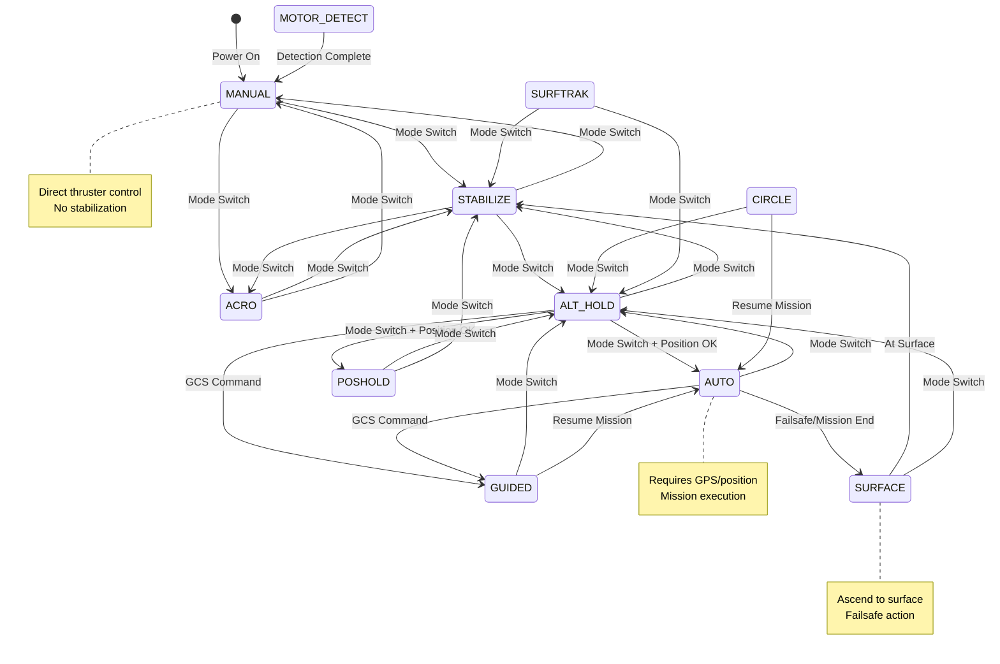
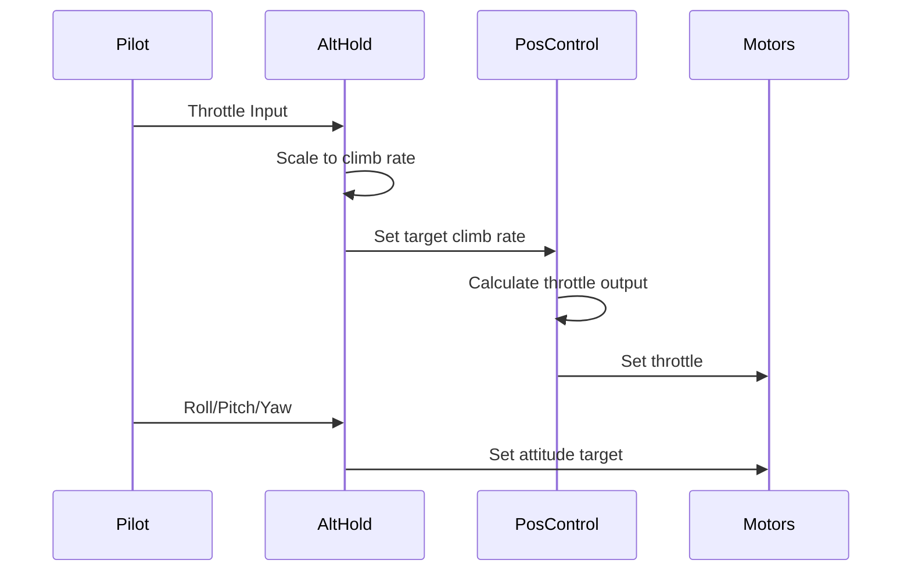
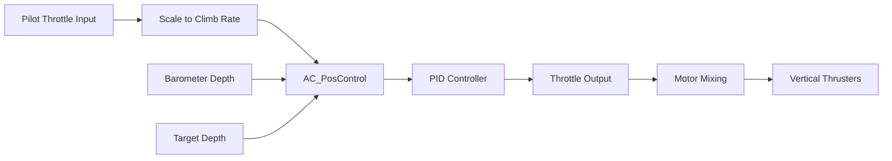
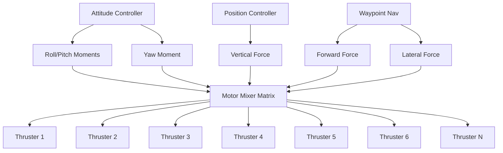
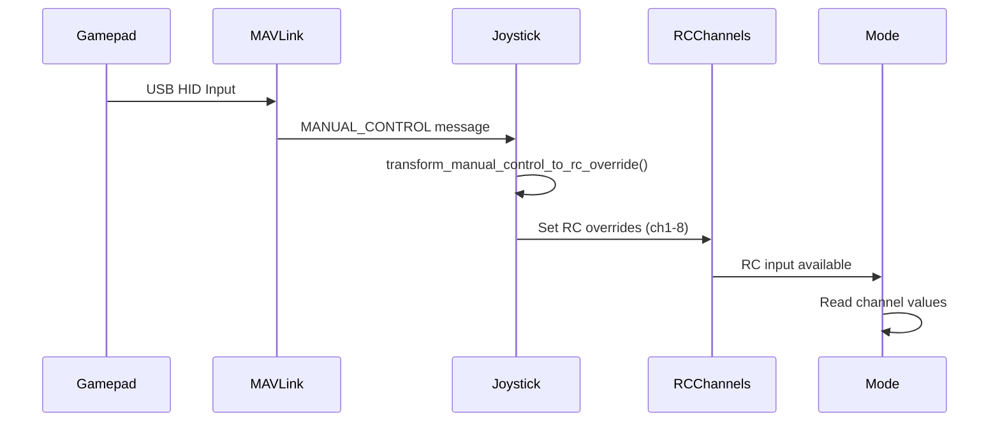
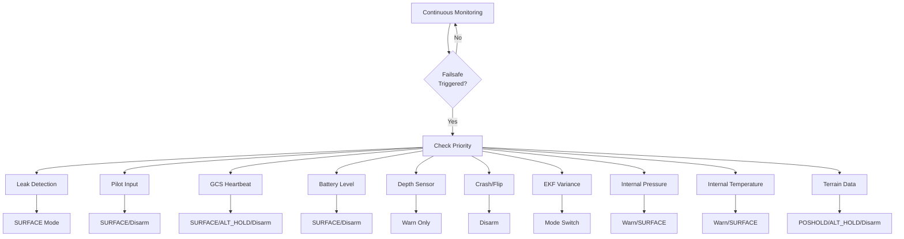

# ArduSub

## Overview

ArduSub is the underwater vehicle control system within the ArduPilot project, designed for remotely operated vehicles (ROVs) and autonomous underwater vehicles (AUVs). It provides 6-degree-of-freedom (6-DOF) control for underwater robots, supporting both manual piloting via joystick/gamepad and autonomous mission execution. ArduSub handles unique underwater challenges including depth control via pressure sensors, buoyancy compensation, leak detection, and specialized failsafe behaviors adapted for submerged operations where traditional "return to launch" is not applicable.

## Architecture


```mermaid
graph TB
    Sub[Sub Class<br/>Main Vehicle Controller] --> Scheduler[AP_Scheduler<br/>400Hz Main Loop]
    Sub --> Modes[Flight Mode System]
    Sub --> Motors[AP_Motors 6DOF<br/>Thruster Control]
    Sub --> Sensors[Sensor Suite]
    Sub --> Navigation[Navigation Controllers]
    Sub --> Failsafes[Failsafe System]
    Sub --> GCS[GCS MAVLink]
    
    Modes --> Manual[MANUAL]
    Modes --> Stabilize[STABILIZE]
    Modes --> Acro[ACRO]
    Modes --> AltHold[ALT_HOLD]
    Modes --> Auto[AUTO]
    Modes --> Guided[GUIDED]
    Modes --> PosHold[POSHOLD]
    Modes --> Circle[CIRCLE]
    Modes --> Surface[SURFACE]
    Modes --> SurfTrak[SURFTRAK]
    Modes --> MotorDetect[MOTOR_DETECT]
    
    Sensors --> Baro[Barometer/Depth]
    Sensors --> IMU[InertialSensor]
    Sensors --> Compass[Magnetometer]
    Sensors --> GPS[GPS Optional]
    Sensors --> Rangefinder[Rangefinder]
    Sensors --> LeakDetect[Leak Detector]
    
    Navigation --> WPNav[AC_WPNav]
    Navigation --> LoiterNav[AC_Loiter]
    Navigation --> CircleNav[AC_Circle]
    Navigation --> AttControl[AC_AttitudeControl_Sub]
    Navigation --> PosControl[AC_PosControl]
    
    Failsafes --> PilotInput[Pilot Input Loss]
    Failsafes --> GCSTimeout[GCS Heartbeat]
    Failsafes --> Battery[Battery Level]
    Failsafes --> Leak[Leak Detection]
    Failsafes --> Depth[Depth Sensor]
    Failsafes --> Crash[Crash Detection]
    Failsafes --> Terrain[Terrain Data]
    Failsafes --> InternalPressure[Internal Pressure]
    Failsafes --> InternalTemp[Internal Temperature]
```

## Key Components

### Sub Class (`Sub.h` / `Sub.cpp`)
The `Sub` class is the main vehicle controller that inherits from `AP_Vehicle`. It manages:
- **Scheduler Integration**: Coordinates task execution at various rates (400Hz fast loop, 50Hz, 10Hz, 3Hz, 1Hz)
- **Mode Management**: Maintains current flight mode and handles mode transitions
- **Subsystem Coordination**: Initializes and coordinates sensors, motors, navigation, and communication
- **Failsafe Monitoring**: Continuously checks safety conditions and triggers appropriate responses
- **State Management**: Tracks vehicle state through `ap` flags and `failsafe` structure

### Mode Framework (`mode.h` / `mode.cpp` / `mode_*.cpp`)
Flight modes in ArduSub follow an object-oriented design:
- **Base Mode Class**: Defines virtual interface (`init()`, `run()`, `requires_GPS()`, `requires_altitude()`)
- **Mode Instances**: Each flight mode is a singleton object (`mode_manual`, `mode_stabilize`, etc.)
- **Mode Switching**: `set_mode()` function validates requirements and performs transition
- **Mode-Specific Logic**: Each mode implements its own control algorithms in dedicated `.cpp` files

### Motor Control System (`motors.cpp`)
Thruster control for underwater 6-DOF movement:
- **6-DOF Output**: Roll, pitch, yaw, throttle (vertical), forward, lateral
- **Motor Library Integration**: Uses `AP_Motors` library with underwater-specific configurations
- **Frame Support**: Various ROV frame configurations (vectored, BlueROV2, custom)
- **Motor Testing**: Includes motor detection and testing capabilities
- **Spool State Management**: Controls motor initialization and shutdown sequences

### Joystick Integration (`joystick.cpp`)
Gamepad/joystick input processing system:
- **Input Transformation**: Converts gamepad axes to RC channel overrides
- **32-Button Support**: Comprehensive button function mapping via `AP_JSButton`
- **Axis Configuration**: Configurable axis assignments for 6-DOF control
- **Camera/Light Control**: Direct joystick control of cameras, lights, and servos
- **Gain Adjustment**: In-flight sensitivity adjustment capabilities

### Depth Control
Pressure-based depth management unique to underwater vehicles:
- **Primary Sensor**: Barometer used as depth/pressure sensor (measures water pressure)
- **Auto-Calibration**: Automatically calibrates when reading positive altitude (above water)
- **Position Controller**: Integrates with `AC_PosControl` for vertical position hold
- **Climb Rate Control**: Pilot throttle input translated to target climb/descent rates
- **Buoyancy Compensation**: Accounts for vehicle buoyancy characteristics

### Sensor Suite (`sensors.cpp`)
Specialized sensor configuration for underwater operations:
- **Depth Sensor**: Barometer provides depth measurement via water pressure
- **Rangefinder**: Downward-facing for terrain tracking (ROTATION_PITCH_270)
- **IMU**: Accelerometer and gyroscope for attitude estimation
- **Compass**: Magnetometer for heading reference
- **Leak Detector**: Monitors internal water ingress
- **Internal Pressure/Temperature**: Monitors enclosure environmental conditions

### Failsafe System (`failsafe.cpp`)
Comprehensive safety monitoring adapted for underwater operations:
- **No RTL Mode**: Unlike aircraft, underwater vehicles cannot "return to launch"
- **Leak Detection**: Critical safety feature for watertight integrity
- **Surface Mode**: Common failsafe action to bring vehicle to surface
- **Alt Hold**: Maintains current depth as failsafe action
- **Disarm**: Ultimate failsafe to stop all motors
- **Multiple Triggers**: Monitors pilot input, GCS, battery, sensors, crash, terrain

## Flight Mode System

### Flight Mode State Machine


```mermaid
stateDiagram-v2
    [*] --> MANUAL: Power On
    
    MANUAL --> STABILIZE: Mode Switch
    MANUAL --> ACRO: Mode Switch
    
    STABILIZE --> MANUAL: Mode Switch
    STABILIZE --> ACRO: Mode Switch
    STABILIZE --> ALT_HOLD: Mode Switch
    
    ACRO --> STABILIZE: Mode Switch
    ACRO --> MANUAL: Mode Switch
    
    ALT_HOLD --> STABILIZE: Mode Switch
    ALT_HOLD --> AUTO: Mode Switch + Position OK
    ALT_HOLD --> GUIDED: GCS Command
    ALT_HOLD --> POSHOLD: Mode Switch + Position OK
    
    AUTO --> ALT_HOLD: Mode Switch
    AUTO --> SURFACE: Failsafe/Mission End
    AUTO --> GUIDED: GCS Command
    
    GUIDED --> ALT_HOLD: Mode Switch
    GUIDED --> AUTO: Resume Mission
    
    POSHOLD --> ALT_HOLD: Mode Switch
    POSHOLD --> STABILIZE: Mode Switch
    
    CIRCLE --> ALT_HOLD: Mode Switch
    CIRCLE --> AUTO: Resume Mission
    
    SURFACE --> STABILIZE: At Surface
    SURFACE --> ALT_HOLD: Mode Switch
    
    SURFTRAK --> ALT_HOLD: Mode Switch
    SURFTRAK --> STABILIZE: Mode Switch
    
    MOTOR_DETECT --> MANUAL: Detection Complete
    
    note right of MANUAL
        Direct thruster control
        No stabilization
    end note
    
    note right of SURFACE
        Ascend to surface
        Failsafe action
    end note
    
    note right of AUTO
        Requires GPS/position
        Mission execution
    end note
```

### Mode Descriptions

#### STABILIZE (Mode 0)
**Purpose**: Manual attitude control with automatic self-leveling and manual depth control

**Behavior**:
- Pilot roll/pitch inputs control target attitude angles (±45° by default)
- Pilot yaw input controls yaw rate
- Pilot throttle directly controls vertical movement (no depth hold)
- Vehicle automatically levels when sticks are centered
- Most common mode for manual piloting

**Requirements**: None (always available)

**Source**: `ArduSub/mode_stabilize.cpp`

#### ACRO (Mode 1)
**Purpose**: Manual body-frame rate control for advanced pilots

**Behavior**:
- Pilot inputs directly command roll/pitch/yaw rates in body frame
- No automatic leveling or angle limits
- Provides maximum maneuverability and responsiveness
- Pilot throttle for vertical movement (no depth hold)
- Requires skilled pilot input to maintain orientation

**Requirements**: None

**Source**: `ArduSub/mode_acro.cpp`

#### ALT_HOLD (Mode 2)
**Purpose**: Manual attitude control with automatic depth hold

**Behavior**:
- Similar to STABILIZE but adds automatic depth control
- Pilot throttle input sets target climb/descent rate
- Vehicle maintains depth when throttle is centered
- Uses barometer pressure for depth sensing
- Position controller manages vertical hold

**Control Flow**:

```mermaid
sequenceDiagram
    participant Pilot
    participant AltHold
    participant PosControl
    participant Motors
    
    Pilot->>AltHold: Throttle Input
    AltHold->>AltHold: Scale to climb rate
    AltHold->>PosControl: Set target climb rate
    PosControl->>PosControl: Calculate throttle output
    PosControl->>Motors: Set throttle
    
    Pilot->>AltHold: Roll/Pitch/Yaw
    AltHold->>Motors: Set attitude target
```

**Requirements**: Valid depth sensor (barometer)

**Source**: `ArduSub/mode_althold.cpp`

#### AUTO (Mode 3)
**Purpose**: Autonomous waypoint mission execution

**Behavior**:
- Executes pre-programmed mission stored in `AP_Mission`
- Supports waypoint navigation, circles, loiter points
- Pilot can override yaw and take control in emergencies
- Uses `AC_WPNav` for waypoint navigation
- Terrain-following capable with rangefinder

**Sub-modes**:
- `Auto_WP`: Waypoint navigation
- `Auto_Circle`: Circular loiter patterns
- `Auto_Loiter`: Hold position at current location
- `Auto_NavGuided`: External navigation commands
- `Auto_TerrainRecover`: Recover from terrain data loss

**Requirements**: GPS or position estimate, valid mission

**Source**: `ArduSub/mode_auto.cpp`

#### GUIDED (Mode 4)
**Purpose**: External control via MAVLink commands from ground station

**Behavior**:
- Accepts position/velocity targets from GCS
- Real-time control from companion computer or ground station
- Similar navigation algorithms to AUTO mode
- Allows dynamic mission modification

**Requirements**: GPS or position estimate, GCS connection

**Source**: `ArduSub/mode_guided.cpp`

#### CIRCLE (Mode 7)
**Purpose**: Fly in circles around a point of interest

**Behavior**:
- Maintains circular path at configured radius
- Uses `AC_Circle` navigation library
- Configurable circle rate (degrees/second)
- Can circle clockwise or counter-clockwise
- Maintains altitude/depth during circle

**Requirements**: GPS or position estimate

**Source**: `ArduSub/mode_circle.cpp`

#### SURFACE (Mode 9)
**Purpose**: Controlled ascent to water surface

**Behavior**:
- Ascends at controlled rate to surface
- Common failsafe action (leak detection, battery low, GCS loss)
- Automatically levels attitude during ascent
- Can be manually commanded or triggered by failsafe
- Transitions to STABILIZE or ALT_HOLD upon reaching surface

**Requirements**: None

**Source**: `ArduSub/mode_surface.cpp`

#### POSHOLD (Mode 16)
**Purpose**: Hold position using GPS, DVL, or visual odometry

**Behavior**:
- Maintains 3D position (lat/lon/depth)
- Uses `AC_Loiter` for horizontal position control
- Requires external position source (GPS, DVL, visual odometry)
- Pilot can override to move vehicle, releases back to hold
- Ideal for inspection tasks requiring stable platform

**Requirements**: GPS or external position estimate, depth sensor

**Source**: `ArduSub/mode_poshold.cpp`

#### MANUAL (Mode 19)
**Purpose**: Direct thruster control without stabilization

**Behavior**:
- Direct passthrough of pilot inputs to thrusters
- No attitude stabilization or automatic leveling
- No depth control or assistance
- Maximum control authority
- Used for motor testing and advanced manual control
- Vehicle will tumble if pilot doesn't actively stabilize

**Requirements**: None

**Source**: `ArduSub/mode_manual.cpp`

#### MOTOR_DETECT (Mode 20)
**Purpose**: Automatic motor orientation detection

**Behavior**:
- Spins motors individually to detect thrust direction
- Uses IMU feedback to determine motor orientation
- Automatically configures motor mixing matrix
- Useful for verifying thruster installation
- Vehicle must be freely suspended in water

**Requirements**: IMU, armed vehicle

**Source**: `ArduSub/mode_motordetect.cpp`

#### SURFTRAK (Mode 21)
**Purpose**: Maintain constant distance from seafloor or ceiling

**Behavior**:
- Uses rangefinder to track terrain (floor or ceiling)
- Maintains configured distance from surface
- Useful for surveys at constant altitude above seabed
- Can track upward (ceiling) or downward (floor)
- Position controller adjusts depth to maintain distance

**Requirements**: Rangefinder, valid terrain data

**Source**: `ArduSub/mode_surftrak.cpp`

## Depth Control System

### Depth Sensing

ArduSub uses a barometer as a pressure sensor to measure depth:

```cpp
// Source: ArduSub/sensors.cpp:4-16
void Sub::read_barometer()
{
    barometer.update();
    // If reading positive altitude, sensor needs calibration
    // Above water should have no significant depth reading
    if(barometer.get_altitude() > 0) {
        barometer.update_calibration();
    }
    
    if (ap.depth_sensor_present) {
        sensor_health.depth = barometer.healthy(depth_sensor_idx);
    }
}
```

**Key Characteristics**:
- Barometer measures water pressure to determine depth
- Negative altitude values indicate depth below surface
- Auto-calibrates when detecting above-water conditions
- Depth sensor health monitored continuously

### Depth Hold Algorithm


```mermaid
graph LR
    A[Pilot Throttle Input] --> B[Scale to Climb Rate]
    B --> C[AC_PosControl]
    C --> D[PID Controller]
    D --> E[Throttle Output]
    E --> F[Motor Mixing]
    F --> G[Vertical Thrusters]
    
    H[Barometer Depth] --> C
    I[Target Depth] --> C
```

**Control Loop** (ALT_HOLD mode):
1. Pilot throttle input scaled to target climb rate (m/s)
2. When throttle centered, climb rate = 0 (hold depth)
3. Position controller compares current depth to target
4. PID generates throttle correction
5. Output mixed with attitude control and sent to thrusters

**Source**: `ArduSub/mode_althold.cpp:control_depth()`

### Buoyancy Compensation

The depth control system accounts for vehicle buoyancy:
- Slightly negative buoyancy typical for ROVs
- Position controller compensates for constant buoyancy force
- I-term in PID learns required hover throttle
- Aggressive tuning may cause depth oscillations

## Motor Control and Thruster Mixing

### 6-DOF Control Architecture


```mermaid
graph TB
    AttControl[Attitude Controller] --> RollPitch[Roll/Pitch Moments]
    AttControl --> Yaw[Yaw Moment]
    PosControl[Position Controller] --> Vertical[Vertical Force]
    WPNav[Waypoint Nav] --> Forward[Forward Force]
    WPNav --> Lateral[Lateral Force]
    
    RollPitch --> Mixer[Motor Mixer Matrix]
    Yaw --> Mixer
    Vertical --> Mixer
    Forward --> Mixer
    Lateral --> Mixer
    
    Mixer --> T1[Thruster 1]
    Mixer --> T2[Thruster 2]
    Mixer --> T3[Thruster 3]
    Mixer --> T4[Thruster 4]
    Mixer --> T5[Thruster 5]
    Mixer --> T6[Thruster 6]
    Mixer --> Tn[Thruster N]
```

### Motor Mixing

The `AP_Motors` library handles 6-DOF motor mixing:

**Inputs**:
- Roll moment (from attitude controller)
- Pitch moment (from attitude controller)
- Yaw moment (from attitude controller or pilot)
- Throttle (vertical force from position controller)
- Forward (translation force from waypoint nav or pilot)
- Lateral (translation force from waypoint nav or pilot)

**Process**:
- Motor mixing matrix transforms 6 control inputs to N thruster outputs
- Matrix configured based on frame type and thruster positions
- Accounts for thruster orientation (vectored vs fixed)
- Applies output scaling and limits

**Output**:
- Individual PWM values for each thruster ESC (typically 1100-1900 µs)

**Frame Types Supported**:
- BlueROV2 (6 thrusters, vectored)
- Vectored ROV configurations
- Custom frame configurations via parameter matrix

**Source**: `ArduSub/motors.cpp`, `libraries/AP_Motors/`

### Motor Testing and Detection

**MOTOR_DETECT Mode**:
- Automatically determines thruster contribution to each DOF
- Spins each motor individually
- Measures IMU response (acceleration/rotation)
- Builds motor mixing matrix from measurements
- Verifies motor installation and orientation

**Manual Motor Test**:
- Test individual motors via GCS or joystick
- Sequence through motors for checkout
- Safety checks prevent accidental activation
- Requires armed vehicle and motor test enabled

## Joystick Integration

### Input Processing Flow


```mermaid
sequenceDiagram
    participant Gamepad
    participant MAVLink
    participant Joystick
    participant RCChannels
    participant Mode
    
    Gamepad->>MAVLink: USB HID Input
    MAVLink->>Joystick: MANUAL_CONTROL message
    Joystick->>Joystick: transform_manual_control_to_rc_override()
    Joystick->>RCChannels: Set RC overrides (ch1-8)
    RCChannels->>Mode: RC input available
    Mode->>Mode: Read channel values
```

### Button Functions

ArduSub supports extensive button mapping via `AP_JSButton`:

**Common Button Functions**:
- Mode switching (STABILIZE, ALT_HOLD, etc.)
- Arm/disarm toggle
- Camera tilt control
- Light brightness adjustment (continuous and step)
- Gain/sensitivity adjustment
- Servo/relay control
- Camera trigger
- Mount control
- Custom script functions

**Configuration**:
- 32 button inputs supported
- Each button assigned function via `BTNn_FUNCTION` parameter
- Supports momentary and toggle actions
- Multiple buttons can trigger same function

**Source**: `ArduSub/joystick.cpp:transform_manual_control_to_rc_override()`

### Axis Mapping

**Default 6-DOF Mapping**:
- Forward/Backward: Forward axis
- Left/Right (strafe): Lateral axis
- Up/Down: Throttle axis
- Roll: Roll axis
- Pitch: Pitch axis
- Yaw (rotate): Yaw axis

**Configurable Parameters**:
- Axis reversing
- Deadzone adjustment
- Exponential curves for sensitivity
- Min/max limits

## Failsafe System

### Failsafe Cascade Architecture


```mermaid
graph TD
    Monitor[Continuous Monitoring] --> Trigger{Failsafe<br/>Triggered?}
    Trigger -->|No| Monitor
    Trigger -->|Yes| Priority[Check Priority]
    
    Priority --> Leak[Leak Detection]
    Priority --> Pilot[Pilot Input]
    Priority --> GCS[GCS Heartbeat]
    Priority --> Battery[Battery Level]
    Priority --> Depth[Depth Sensor]
    Priority --> Crash[Crash/Flip]
    Priority --> EKF[EKF Variance]
    Priority --> Pressure[Internal Pressure]
    Priority --> Temp[Internal Temperature]
    Priority --> Terrain[Terrain Data]
    
    Leak --> Action1[SURFACE Mode]
    Pilot --> Action2[SURFACE/Disarm]
    GCS --> Action3[SURFACE/ALT_HOLD/Disarm]
    Battery --> Action4[SURFACE/Disarm]
    Depth --> Action5[Warn Only]
    Crash --> Action6[Disarm]
    EKF --> Action7[Mode Switch]
    Pressure --> Action8[Warn/SURFACE]
    Temp --> Action9[Warn/SURFACE]
    Terrain --> Action10[POSHOLD/ALT_HOLD/Disarm]
```

### Failsafe Descriptions

#### Leak Detection Failsafe
**Trigger**: `AP_LeakDetector` reports water ingress

**Actions** (configurable via `FS_LEAK` parameter):
- `FS_LEAK_DISABLED` (0): No action, warnings only
- `FS_LEAK_SURFACE` (2): Switch to SURFACE mode

**Behavior**:
- Critical safety feature for watertight integrity
- Warnings sent every 20 seconds when leak detected
- Once triggered, stays active until leak cleared
- Notifies ground station via MAVLink

**Source**: `ArduSub/failsafe.cpp:failsafe_leak_check()` (lines 264-302)

#### Pilot Input Failsafe
**Trigger**: No joystick input for configured timeout (`FS_PILOT_TIMEOUT` seconds)

**Actions** (configurable via `FS_PILOT_INPUT` parameter):
- `FS_PILOT_DISABLED` (0): No action
- `FS_PILOT_WARN_ONLY` (1): Warnings only
- `FS_PILOT_DISARM` (2): Disarm motors

**Behavior**:
- Detects loss of manual control input
- 2-second default timeout
- Warnings every 20 seconds
- Does not trigger if already in AUTO or GUIDED mode

**Source**: `ArduSub/failsafe.cpp:failsafe_pilot_input_check()`

#### GCS Heartbeat Failsafe
**Trigger**: No MAVLink heartbeat from GCS for `FS_GCS_TIMEOUT` seconds

**Actions** (configurable via `FS_GCS` parameter):
- `FS_GCS_DISABLED` (0): No action
- `FS_GCS_WARN_ONLY` (1): Warnings only
- `FS_GCS_DISARM` (2): Disarm motors
- `FS_GCS_HOLD` (3): Switch to ALT_HOLD mode
- `FS_GCS_SURFACE` (4): Switch to SURFACE mode

**Behavior**:
- Monitors GCS heartbeat message timing
- Only triggers for configured GCS system ID
- Warnings every 30 seconds
- Clears when heartbeat resumes

**Source**: `ArduSub/failsafe.cpp:failsafe_gcs_check()` (lines 305-363)

#### Battery Failsafe
**Trigger**: Battery voltage or remaining capacity below thresholds

**Actions**:
- Low battery: Warning and mode change
- Critical battery: More aggressive action
- Configurable thresholds and actions per battery monitor

**Behavior**:
- Monitors voltage, current, and fuel remaining
- Multiple warning levels (low, critical)
- Can trigger SURFACE mode or disarm
- Integrates with `AP_BattMonitor` library

**Source**: `ArduSub/failsafe.cpp:failsafe_battery_check()`

#### Depth Sensor Failsafe
**Trigger**: Barometer unhealthy or providing invalid data

**Actions**:
- Warnings to GCS
- Prevents mode changes requiring depth hold
- Forces modes requiring altitude to exit

**Behavior**:
- 2-second timeout after loss of valid depth data
- Warnings every 30 seconds
- Primarily informational (no automatic mode change)
- Critical for ALT_HOLD and depth-dependent modes

**Source**: `ArduSub/failsafe.cpp:failsafe_sensors_check()`

#### Crash/Flip Detection
**Trigger**: Attitude error exceeds 30° for more than 2 seconds

**Actions** (configurable via `FS_CRASH_CHECK` parameter):
- `FS_CRASH_DISABLED` (0): No action
- `FS_CRASH_WARN_ONLY` (1): Warnings only
- `FS_CRASH_DISARM` (2): Disarm motors

**Behavior**:
- Detects vehicle flip or crash
- Only active in angle-stabilized modes (not MANUAL/ACRO)
- Warnings every 20 seconds
- Prevents motor damage from sustained high throttle

**Source**: `ArduSub/failsafe.cpp:failsafe_crash_check()` (lines 365-421)

#### EKF Variance Failsafe
**Trigger**: EKF (Extended Kalman Filter) reports excessive variance

**Actions**:
- Triggers mode changes requiring good navigation
- May force switch to simpler flight modes
- Prevents arming if variance too high

**Behavior**:
- Monitors EKF health continuously
- Critical for position-based modes (AUTO, GUIDED, POSHOLD)
- Variance limits configurable via EKF parameters

**Source**: `ArduSub/failsafe.cpp:failsafe_ekf_check()`

#### Internal Pressure Failsafe
**Trigger**: Enclosure internal pressure exceeds safe limits

**Actions**:
- Warnings to GCS
- Can trigger SURFACE mode if configured
- Indicates potential seal failure or pressure imbalance

**Behavior**:
- Monitors internal pressure sensor
- 2-second timeout after pressure exceeds threshold
- Warnings every 30 seconds
- Prevents catastrophic seal failure

**Source**: `ArduSub/failsafe.cpp:failsafe_internal_pressure_check()` (lines 202-233)

#### Internal Temperature Failsafe
**Trigger**: Enclosure internal temperature exceeds safe limits

**Actions**:
- Warnings to GCS
- Can trigger SURFACE mode if configured
- Prevents electronics overheating

**Behavior**:
- Monitors internal temperature sensor
- 2-second timeout after temperature exceeds threshold
- Warnings every 30 seconds

**Source**: `ArduSub/failsafe.cpp:failsafe_internal_temperature_check()` (lines 235-261)

#### Terrain Failsafe
**Trigger**: Loss of terrain data during AUTO or GUIDED mode with terrain-following

**Actions** (configurable via `FS_TERRAIN` parameter):
- `FS_TERRAIN_DISABLED` (0): No action
- `FS_TERRAIN_HOLD` (1): Switch to POSHOLD or ALT_HOLD
- `FS_TERRAIN_SURFACE` (2): Switch to SURFACE mode
- `FS_TERRAIN_DISARM` (3): Disarm motors

**Behavior**:
- Monitors rangefinder data availability
- 5-second timeout for terrain data loss
- Can attempt recovery if rangefinder re-enabled
- Critical for terrain-following missions

**Source**: `ArduSub/failsafe.cpp:failsafe_terrain_check()` (lines 423-500)

### Failsafe Priority

When multiple failsafes trigger simultaneously, ArduSub follows priority order:
1. Leak detection (highest priority - immediate safety risk)
2. Crash detection
3. EKF failure
4. Battery critical
5. Pilot input loss
6. GCS timeout
7. Terrain data loss
8. Internal pressure/temperature (lowest priority)

## Lights and Camera Control

### Underwater Lighting

ArduSub integrates with external lighting systems:

**Control Methods**:
- Joystick buttons for brightness adjustment
- Continuous adjustment (hold button to change)
- Step adjustment (press to increment/decrement)
- MAVLink commands for programmatic control

**Typical Configuration**:
- Lights connected via servo/relay outputs
- PWM control for brightness levels
- Multiple light groups supported
- Integration with `AP_Relay` and `SRV_Channel`

### Camera Integration

**Camera Mount Control**:
- Servo-based camera tilt (pitch axis)
- Joystick control for manual adjustment
- ROI (Region of Interest) tracking in AUTO mode
- Stabilization support via `AP_Mount`

**Camera Trigger**:
- Joystick button for camera shutter
- Time-lapse mode support
- Mission-based triggering
- Integration with `AP_Camera` library

**Video Streaming**:
- Companion computer integration for video
- MAVLink video stream metadata
- Multiple camera support

## Configuration Parameters

### Key Sub-Specific Parameters

#### Frame Configuration
- `FRAME_CONFIG`: ROV frame type (BlueROV2, Vectored, Custom)
- `MOT_PWM_TYPE`: ESC protocol (Normal, OneShot, DShot)
- `MOT_THR_MIN`, `MOT_THR_MAX`: Thruster output range

#### Depth Control
- `PSC_POSZ_P`, `PSC_VELZ_P`: Position and velocity gains for depth
- `PSC_ACCZ_P`, `PSC_ACCZ_I`: Acceleration control for depth
- `PILOT_SPEED_UP`, `PILOT_SPEED_DN`: Max climb/descent rates

#### Joystick Configuration
- `JS_GAIN_DEFAULT`: Default joystick sensitivity
- `BTNn_FUNCTION`: Button function assignments (n = 0-15)
- `GAIN_DEFAULT`: Default gain for all control axes

#### Failsafe Settings
- `FS_LEAK`: Leak detector action (0=Disabled, 2=Surface)
- `FS_GCS`: GCS failsafe action (0-4)
- `FS_GCS_TIMEOUT`: GCS timeout in seconds
- `FS_PILOT_INPUT`: Pilot input failsafe action
- `FS_PILOT_TIMEOUT`: Pilot input timeout in seconds
- `FS_EKF_ACTION`: EKF failsafe action
- `FS_EKF_THRESH`: EKF variance threshold
- `FS_CRASH_CHECK`: Crash detection action
- `FS_BATT_VOLTAGE`: Battery failsafe voltage
- `FS_BATT_MAH`: Battery failsafe capacity

#### Sensor Configuration
- `BARO_PRIMARY`: Primary barometer for depth sensing
- `RNGFND_ORIENT`: Rangefinder orientation (25=Down for seafloor)
- `RNGFND_SIGNAL_MIN`: Minimum signal quality percentage

#### Performance Tuning
- `PILOT_ACCEL_Z`: Pilot input to acceleration response
- `PILOT_THR_FILT`: Throttle input filtering (Hz)
- `ATC_RAT_RLL_P`, `ATC_RAT_PIT_P`, `ATC_RAT_YAW_P`: Attitude rate gains
- `ATC_ANG_RLL_P`, `ATC_ANG_PIT_P`, `ATC_ANG_YAW_P`: Attitude angle gains

## GCS Integration

### MAVLink Communication

ArduSub implements MAVLink protocol for ground control station communication:

**Vehicle Type**: `MAV_TYPE_SUBMARINE` (12)
**System ID**: Configurable via `SYSID_THISMAV` parameter

**Key Messages**:
- `HEARTBEAT`: 1 Hz vehicle status
- `ATTITUDE`: Vehicle orientation (roll, pitch, yaw)
- `GLOBAL_POSITION_INT`: GPS position (if available)
- `VFR_HUD`: Airspeed, groundspeed, heading, throttle, alt, climb
- `SCALED_PRESSURE`: Depth from pressure sensor
- `MANUAL_CONTROL`: Joystick input from GCS
- `COMMAND_LONG`: Commands (arm, mode change, etc.)
- `MISSION_ITEM`: Waypoint upload/download

### Sub-Specific MAVLink Extensions

**Custom Messages**:
- Leak detection status
- Internal pressure/temperature
- Motor testing status
- Rangefinder data for terrain tracking

**Status Text Messages**:
- Failsafe warnings
- Mode change confirmations
- Sensor health alerts
- Pre-arm check failures

**Source**: `ArduSub/GCS_MAVLink_Sub.cpp`, `ArduSub/GCS_Sub.cpp`

### Supported Ground Stations

- **QGroundControl**: Primary GCS for ArduSub (optimized ROV interface)
- **MAVProxy**: Command-line GCS for developers
- **Mission Planner**: Full-featured GCS (limited Sub support)

## Safety Considerations

### Critical Safety Features

#### Leak Detection
**Purpose**: Detect water ingress into pressure housing

**Implementation**:
- External leak detector probes via `AP_LeakDetector`
- Configurable sensor type and GPIO pin
- Immediate failsafe action available
- Critical for preventing equipment damage and loss

**Safety Notes**:
- Always test leak detector before dive
- Configure `FS_LEAK = 2` (Surface) for production operations
- Multiple leak detectors can be configured
- Dry test procedure: Verify detector triggers with wet finger

#### Depth Limits
**Purpose**: Prevent exceeding vehicle depth rating

**Implementation**:
- Fence altitude limits enforce maximum depth
- Position controller can enforce soft limits
- Hardware depth rating must be configured in parameters

**Safety Notes**:
- Set fence altitude to vehicle depth rating
- Account for water density (freshwater vs seawater)
- Test depth limits in shallow water first
- Emergency surface procedure should be practiced

#### Tether Management
**Purpose**: Prevent tether entanglement or damage

**Considerations**:
- Manual mode provides direct control for tether issues
- Joystick control allows precise movements
- No automatic "return to launch" to prevent tether wrap
- Yaw rotation limits can prevent cable twist

**Best Practices**:
- Monitor tether tension and routing
- Limit yaw rotation in confined spaces
- Use appropriate tether management system
- Train operators on tether emergency procedures

#### Battery Management
**Purpose**: Ensure safe return before battery depletion

**Implementation**:
- Battery monitoring via `AP_BattMonitor`
- Configurable low/critical voltage thresholds
- Failsafe can trigger SURFACE mode
- Remaining capacity estimation

**Safety Notes**:
- Configure conservative failsafe thresholds
- Account for cold water battery performance reduction
- Monitor both voltage and capacity
- Plan missions with 30% battery reserve minimum

#### Pre-Dive Checklist

**System Checks**:
- [ ] Leak detector test (wet probe, verify detection)
- [ ] Battery voltage and capacity check
- [ ] Barometer/depth sensor health verification
- [ ] IMU calibration status
- [ ] Compass calibration and interference check
- [ ] Thruster function test (motor test mode)
- [ ] Joystick control verification (all axes and buttons)
- [ ] Failsafe configuration review
- [ ] GCS telemetry link quality

**Operational Checks**:
- [ ] Tether inspection and secure attachment
- [ ] Buoyancy check (slightly negative)
- [ ] Camera and lights functional
- [ ] Emergency surface procedure review
- [ ] Backup communication method available

### Failsafe Configuration Recommendations

**Conservative Configuration** (recommended for most operations):
```
FS_LEAK = 2          (Surface on leak detection)
FS_GCS = 4           (Surface on GCS loss)
FS_GCS_TIMEOUT = 5.0 (5 second timeout)
FS_PILOT_INPUT = 2   (Disarm on pilot loss - if appropriate for tether/cable ops)
FS_PILOT_TIMEOUT = 2.0 (2 second timeout)
FS_CRASH_CHECK = 1   (Warn only - prevents nuisance disarms)
FS_BATT_VOLTAGE = 14.0 (Set based on battery chemistry)
FS_BATT_MAH = 1000   (Set to 20% of battery capacity)
```

**Aggressive Configuration** (for professional operations with recovery capability):
```
FS_LEAK = 2          (Surface on leak)
FS_GCS = 3           (Hold depth on GCS loss)
FS_PILOT_INPUT = 0   (No action - tethered operations)
FS_CRASH_CHECK = 2   (Disarm on crash)
```

### Testing Safety

**Safe Testing Procedures**:

**Bench Testing**:
1. Test with propellers REMOVED initially
2. Verify motor directions and orientations
3. Check control response to inputs
4. Validate failsafe triggers and actions

**Shallow Water Testing**:
1. Test in controlled shallow environment (< 2m depth)
2. Tether secured and managed
3. Safety diver or retrieval hook available
4. Test each flight mode individually
5. Verify failsafe actions (intentionally trigger)
6. Check depth hold accuracy
7. Test emergency surface procedure

**Progression to Operational Depth**:
1. Gradually increase depth over multiple dives
2. Monitor system performance at each depth
3. Verify pressure housing integrity
4. Check for buoyancy changes with depth
5. Test abort procedures at operational depth

## Testing

### SITL Simulation

ArduSub supports Software-In-The-Loop simulation for safe development and testing:

**Start SITL Simulation**:
```bash
# Navigate to ArduPilot directory
cd ArduPilot

# Launch Sub SITL with console and map
sim_vehicle.py -v ArduSub --console --map

# Launch with specific frame type
sim_vehicle.py -v ArduSub -f vectored --console --map

# Launch with custom location
sim_vehicle.py -v ArduSub --location LOCATION_NAME --console --map
```

**Available Frame Types**:
- `vectored`: Vectored 6-DOF ROV (default)
- `custom`: Custom frame configuration

**SITL Features**:
- Full 6-DOF physics simulation
- Depth/pressure simulation
- Current/disturbance simulation
- Sensor simulation (IMU, barometer, compass, GPS)
- No rangefinder simulation (limited terrain features)

### Testing Flight Modes in SITL

**STABILIZE Mode**:
```bash
# In MAVProxy console
mode STABILIZE
arm throttle
rc 3 1500  # Center throttle (no vertical movement)
rc 1 1700  # Roll right
rc 2 1300  # Pitch forward
rc 4 1700  # Yaw right
```

**ALT_HOLD Mode**:
```bash
mode ALT_HOLD
arm throttle
rc 3 1500  # Hold current depth
rc 3 1600  # Ascend
rc 3 1400  # Descend
```

**AUTO Mode**:
```bash
# Upload a mission first via GCS
mode AUTO
arm throttle
# Vehicle will execute mission waypoints
```

**Testing Failsafes in SITL**:
```bash
# Test GCS failsafe (stop sending heartbeats)
set heartbeat 0
# Wait for FS_GCS_TIMEOUT seconds
# Observe failsafe action
set heartbeat 1

# Test battery failsafe
param set BATT_CAPACITY 5000
param set SIM_BATT_CAP_AH 5.0
# Fly until battery depletes
```

### Hardware Testing

**Motor Testing**:
```bash
# Via MAVProxy
motortest 1 100  # Test motor 1 at full throttle for 1 second
motortest 2 50   # Test motor 2 at 50% throttle

# Via QGroundControl
# Vehicle Setup → Motors → Test Motors
# Verify each motor direction and orientation
```

**Sensor Verification**:
```bash
# Check barometer (depth sensor)
graph SCALED_PRESSURE.press_abs

# Check IMU
graph RAW_IMU.xacc RAW_IMU.yacc RAW_IMU.zacc

# Check compass
graph RAW_IMU.xmag RAW_IMU.ymag RAW_IMU.zmag
```

**Joystick Testing**:
```bash
# Connect joystick to QGroundControl
# Verify all axes respond correctly
# Test button functions
# Check for proper deadzone and scaling
```

## Implementation Notes

### Design Decisions

#### Why No RTL (Return to Launch)?
Unlike aircraft, underwater ROVs typically operate on a tether and cannot safely "return to launch" automatically:
- Tethered operations: RTL would cause tether entanglement
- Navigation uncertainty: Underwater GPS is not available, position estimates may drift
- Obstacle avoidance: Underwater environment has complex obstacles
- Safety: SURFACE mode is safer emergency action (ascend vertically)

**Alternative to RTL**: SURFACE mode provides controlled ascent to surface where human recovery is possible.

#### Barometer as Depth Sensor
ArduSub repurposes the barometer (designed for altitude) as a depth sensor:
- Water pressure increases with depth (inverse of aircraft altitude)
- Negative altitude values represent depth below surface
- Auto-calibration detects above-water conditions
- Same sensor hardware as aircraft, different interpretation

#### 6-DOF Control Complexity
Underwater vehicles require full 6-DOF control unlike aircraft:
- Roll/Pitch/Yaw (3 rotational DOF): Attitude orientation
- Forward/Lateral/Vertical (3 translational DOF): Position movement
- Requires more complex motor mixing matrix
- More thrusters needed (typically 6-8 vs 4 for quadcopter)

#### Mode Naming Consistency
ArduSub maintains mode names consistent with ArduCopter where possible:
- STABILIZE, ACRO, ALT_HOLD: Same concepts as aircraft
- POSHOLD: Position hold like copter loiter
- AUTO, GUIDED, CIRCLE: Mission execution modes
- SURFACE: Unique to Sub (replaces RTL)
- SURFTRAK: Unique to Sub (terrain following underwater)

### Underwater-Specific Adaptations

**Buoyancy vs Gravity**:
- Aircraft fight gravity (always down), subs fight buoyancy (can be up or down)
- Slightly negative buoyancy typical for controlled descent
- Position controller must compensate for constant buoyancy force

**Pressure/Depth Relationship**:
- Approximately 1 bar per 10 meters depth (saltwater)
- Freshwater: 1 bar per 10.2 meters
- Barometer calibration critical for accurate depth

**Thruster Characteristics**:
- Bi-directional thrusters (forward and reverse)
- Lower efficiency than aircraft propellers
- Cavitation at high throttle settings
- Different response in forward vs reverse

**Sensor Challenges**:
- GPS unavailable underwater (except at surface)
- Compass interference from metal structure and electronics
- Visual odometry often used for position estimation
- Doppler Velocity Log (DVL) for accurate velocity measurement

**Communication Limitations**:
- Tether provides reliable high-bandwidth link
- Acoustic modems for untethered (low bandwidth, high latency)
- No RF communication underwater
- Tether management critical for operations

### Comparison to Other ArduPilot Vehicles

| Feature | ArduSub | ArduCopter | ArduPlane |
|---------|---------|------------|-----------|
| Control DOF | 6 (full 6-DOF) | 4 (no lateral) | 3 (no lateral/vertical) |
| Buoyancy | Slightly negative | N/A (gravity) | N/A (lift) |
| Primary Sensor | Barometer (depth) | Barometer (altitude) | Barometer + airspeed |
| Position Source | DVL/Visual odom | GPS | GPS |
| Emergency Mode | SURFACE | RTL/LAND | RTL |
| Leak Detection | Yes (critical) | No | No |
| Typical Thrusters | 6-8 bi-directional | 4-8 unidirectional | 1-2 + servos |
| Operating Medium | Water (dense) | Air (low density) | Air (fast flight) |

## References

### Source Files

**Core Vehicle**:
- `ArduSub/Sub.h` - Main Sub class definition
- `ArduSub/Sub.cpp` - Constructor and scheduler setup (lines 27-166)
- `ArduSub/defines.h` - Sub-specific definitions
- `ArduSub/config.h` - Build configuration
- `ArduSub/Parameters.h` - Parameter definitions
- `ArduSub/Parameters.cpp` - Parameter implementation

**Flight Modes**:
- `ArduSub/mode.h` - Mode base class and enum definitions
- `ArduSub/mode.cpp` - Mode framework (lines 1-100)
- `ArduSub/mode_manual.cpp` - MANUAL mode
- `ArduSub/mode_stabilize.cpp` - STABILIZE mode (lines 1-80)
- `ArduSub/mode_acro.cpp` - ACRO mode
- `ArduSub/mode_althold.cpp` - ALT_HOLD mode (lines 1-150)
- `ArduSub/mode_auto.cpp` - AUTO mode (lines 1-200)
- `ArduSub/mode_guided.cpp` - GUIDED mode
- `ArduSub/mode_circle.cpp` - CIRCLE mode
- `ArduSub/mode_surface.cpp` - SURFACE mode
- `ArduSub/mode_poshold.cpp` - POSHOLD mode
- `ArduSub/mode_surftrak.cpp` - SURFTRAK mode
- `ArduSub/mode_motordetect.cpp` - MOTOR_DETECT mode

**Hardware Control**:
- `ArduSub/motors.cpp` - Motor output and testing (lines 1-100)
- `ArduSub/joystick.cpp` - Joystick input processing (lines 1-100)
- `ArduSub/sensors.cpp` - Sensor reading and processing (lines 1-86)

**Safety Systems**:
- `ArduSub/failsafe.cpp` - All failsafe implementations (lines 1-500)
- `ArduSub/AP_Arming_Sub.h` - Sub-specific arming checks
- `ArduSub/AP_Arming_Sub.cpp` - Arming check implementations

**Communication**:
- `ArduSub/GCS_MAVLink_Sub.cpp` - Sub-specific MAVLink handlers
- `ArduSub/GCS_Sub.cpp` - GCS interface implementation
- `ArduSub/RC_Channel_Sub.cpp` - RC input handling

### Related Libraries

**Control Systems**:
- `libraries/AC_AttitudeControl/` - Attitude control algorithms
- `libraries/AC_PosControl/` - Position control algorithms
- `libraries/AC_WPNav/` - Waypoint navigation
- `libraries/AC_Loiter/` - Loiter control
- `libraries/AC_Circle/` - Circle navigation

**Hardware Abstraction**:
- `libraries/AP_Motors/` - Motor control and mixing
- `libraries/AP_InertialSensor/` - IMU interface
- `libraries/AP_Baro/` - Barometer/depth sensor interface
- `libraries/AP_Compass/` - Magnetometer interface
- `libraries/AP_GPS/` - GPS interface

**Navigation**:
- `libraries/AP_AHRS/` - Attitude and heading reference system
- `libraries/AP_NavEKF3/` - Extended Kalman Filter for state estimation
- `libraries/AP_InertialNav/` - Inertial navigation

**Sensors**:
- `libraries/AP_RangeFinder/` - Rangefinder interface for terrain tracking
- `libraries/AP_LeakDetector/` - Leak detection system
- `libraries/AP_BattMonitor/` - Battery monitoring

**Communication**:
- `libraries/GCS_MAVLink/` - MAVLink protocol implementation
- `libraries/AP_JSButton/` - Joystick button function mapping

**Mission**:
- `libraries/AP_Mission/` - Mission command storage and execution

**Utility**:
- `libraries/AP_Scheduler/` - Task scheduling
- `libraries/AP_Logger/` - Data logging
- `libraries/AP_Param/` - Parameter management

### External Documentation

**ArduPilot Wiki**:
- https://ardupilot.org/dev/ - Developer documentation
- https://ardupilot.org/ardusub/ - ArduSub user guide
- https://ardupilot.org/dev/docs/ardusub-code-overview.html - Code overview

**MAVLink Protocol**:
- https://mavlink.io/ - MAVLink protocol specification

**Hardware Resources**:
- https://bluerobotics.com/ - BlueROV2 and Sub-compatible hardware

**Community**:
- https://discuss.ardupilot.org/ - ArduPilot discussion forum
- https://discord.gg/ardupilot - ArduPilot Discord server

---

**Document Version**: 1.0
**Last Updated**: 2025
**ArduPilot Version**: Latest development branch

For questions or contributions to this documentation, please visit the ArduPilot discussion forum or submit pull requests to the ArduPilot GitHub repository.
