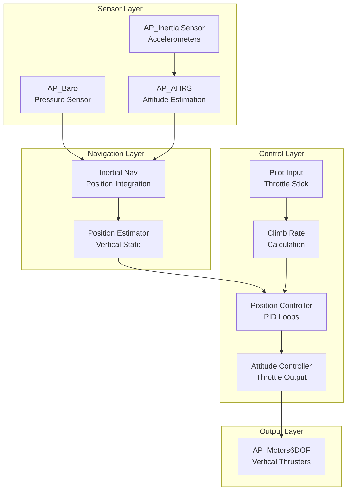
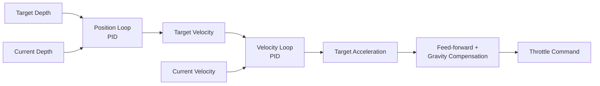

# ArduSub Buoyancy Control Systems


## Table of Contents
- [Overview](#overview)
- [System Architecture](#system-architecture)
- [Neutral Buoyancy Concept](#neutral-buoyancy-concept)
- [Throttle Management](#throttle-management)
- [Altitude Hold Mode](#altitude-hold-mode)
- [Vertical Position Control](#vertical-position-control)
- [Surface and Bottom Detection](#surface-and-bottom-detection)
- [PID Control Loops](#pid-control-loops)
- [Inertia Compensation](#inertia-compensation)
- [Configuration Parameters](#configuration-parameters)
- [Tuning Guidelines](#tuning-guidelines)
- [Troubleshooting](#troubleshooting)

## Overview

The ArduSub buoyancy control system enables precise depth control and vertical positioning for underwater vehicles. Unlike aerial vehicles that must constantly generate thrust to maintain altitude, underwater vehicles can be configured for neutral buoyancy, where the vehicle naturally maintains depth with minimal power consumption.

**Key Features**:
- Neutral buoyancy depth holding with minimal power consumption
- Bidirectional vertical thrust control
- Dynamic surface and bottom detection
- Vertical velocity management with configurable limits
- PID-based depth control with inertia compensation
- Automatic surface avoidance and bottom clearance

**Source Files**: 
- `/ArduSub/mode_althold.cpp` - Altitude hold flight mode implementation
- `/ArduSub/mode_stabilize.cpp` - Manual stabilize mode
- `/ArduSub/Attitude.cpp` - Attitude and throttle control functions
- `/ArduSub/inertia.cpp` - Inertial navigation and position estimation

## System Architecture

The ArduSub buoyancy control system consists of several integrated components working together to maintain depth and vertical position:



### Control Loop Hierarchy

1. **Sensor Fusion** (400Hz): Barometer and IMU data fused through AHRS
2. **Position Estimation** (400Hz): Inertial navigation integrates acceleration to position
3. **Position Control** (100Hz): PID controller generates desired vertical velocity
4. **Attitude Control** (400Hz): Translates velocity commands to motor outputs
5. **Motor Mixing** (400Hz): Distributes thrust across vertical thrusters

## Neutral Buoyancy Concept

### Physical Principles

A neutrally buoyant vehicle has its weight exactly balanced by the buoyant force of displaced water. This allows the vehicle to maintain depth with minimal thrust, conserving power and extending mission duration.

**Buoyancy States**:
- **Positive Buoyancy**: Vehicle floats upward (weight < buoyant force)
- **Neutral Buoyancy**: Vehicle maintains depth (weight = buoyant force)
- **Negative Buoyancy**: Vehicle sinks (weight > buoyant force)

### ArduSub Implementation

ArduSub is designed for **neutrally buoyant or slightly positively buoyant** vehicles. The control system assumes:

1. **Zero thrust maintains depth**: When throttle is centered and no vertical input is given, the vehicle should hold depth naturally
2. **Symmetric thrust capability**: Equal upward and downward thrust available
3. **Small corrections**: PID controller makes small thrust adjustments to compensate for currents, pressure changes, and dynamic effects

> **Note**: Vehicles with significant positive or negative buoyancy will consume excessive power fighting their natural tendency. Proper ballasting is critical for efficient operation.

## Throttle Management

### Bidirectional Thrust Control

Unlike aerial vehicles where throttle ranges from 0% (off) to 100% (full up), underwater vehicles require bidirectional vertical thrust:

- **Upward thrust**: For ascending and counteracting negative buoyancy
- **Downward thrust**: For descending and counteracting positive buoyancy

### Throttle Centering at 0.5

ArduSub uses a **centered throttle convention** where:
- **0.5 (50%)**: Zero vertical thrust - neutral point
- **0.0 to 0.5**: Downward thrust (increasing as value decreases)
- **0.5 to 1.0**: Upward thrust (increasing as value increases)

**Source**: `/ArduSub/mode_althold.cpp:41`
```cpp
// When disarmed, set throttle to neutral (0.5)
attitude_control->set_throttle_out(0.5, true, g.throttle_filt);
```

**Source**: `/ArduSub/mode_stabilize.cpp:63`
```cpp
// Convert pilot input [-1, 1] to throttle [0, 1] with center at 0.5
attitude_control->set_throttle_out((channel_throttle->norm_input() + 1.0f) / 2.0f, false, g.throttle_filt);
```

### Manual vs. Automatic Control

**Stabilize Mode** (Manual):
- Pilot directly controls vertical thrust through throttle stick
- No depth holding - vehicle will drift with natural buoyancy
- Throttle input linearly mapped to motor output
- Suitable for fine maneuvering and when depth hold is not required

**Altitude Hold Mode** (Automatic):
- PID controller automatically adjusts thrust to maintain target depth
- Pilot input commands **climb rate** (vertical velocity) rather than thrust
- Deadband around stick center maintains current depth
- Active compensation for currents, pressure changes, and vehicle motion

## Altitude Hold Mode

Altitude Hold (ALT_HOLD) mode provides automatic depth control, allowing the pilot to command vertical velocity while the autopilot maintains the target depth.

### Mode Initialization

**Source**: `/ArduSub/mode_althold.cpp:4-20`

When entering Altitude Hold mode:

1. **Barometer Check**: Verifies pressure sensor is healthy
   ```cpp
   if(!sub.control_check_barometer()) {
       return false;  // Cannot enter mode without depth sensor
   }
   ```

2. **Speed and Acceleration Limits**: Configures maximum vertical rates
   ```cpp
   position_control->set_max_speed_accel_U_cm(-sub.get_pilot_speed_dn(), 
                                               g.pilot_speed_up, 
                                               g.pilot_accel_z);
   ```
   - `U` axis represents vertical (up) direction in NED frame
   - Separate limits for ascent (`pilot_speed_up`) and descent (`pilot_speed_dn`)
   - Acceleration limit (`pilot_accel_z`) prevents abrupt velocity changes

3. **Controller Initialization**: Resets PID integrators to current state
   ```cpp
   position_control->init_U_controller();
   ```
   - Initializes position target to current depth
   - Resets velocity target to zero
   - Clears PID integral terms to prevent wind-up

### Main Control Loop

**Source**: `/ArduSub/mode_althold.cpp:24-29`

The altitude hold controller runs at **100Hz** (called from main scheduler):

```cpp
void ModeAlthold::run()
{
    run_pre();      // Attitude control (roll, pitch, yaw)
    control_depth(); // Depth control (vertical axis)
    run_post();     // Horizontal translation (forward, lateral)
}
```

### Attitude Control (run_pre)

**Source**: `/ArduSub/mode_althold.cpp:31-98`

Handles horizontal attitude (roll, pitch, yaw) while in altitude hold:

**Disarmed State**:
```cpp
if (!motors.armed()) {
    attitude_control->set_throttle_out(0.5, true, g.throttle_filt);
    attitude_control->relax_attitude_controllers();
    position_control->relax_U_controller(motors.get_throttle_hover());
}
```
- Throttle set to neutral (0.5)
- All controllers relaxed to prevent integral wind-up
- Position controller target set to "hover" throttle estimate

**Armed State**:
- Processes pilot roll/pitch input or MAVLink attitude commands
- Converts to desired lean angles with limits
- Processes yaw input with heading hold logic
- Implements 250ms deceleration period after yaw input stops

### Depth Control Logic

**Source**: `/ArduSub/mode_althold.cpp:106-128`

This is the core depth control function, called at 100Hz:

#### Step 1: Surface Throttle Limiting

```cpp
float distance_to_surface = (g.surface_depth - inertial_nav.get_position_z_up_cm()) * 0.01f;
distance_to_surface = constrain_float(distance_to_surface, 0.0f, 1.0f);
motors.set_max_throttle(g.surface_max_throttle + 
                       (1.0f - g.surface_max_throttle) * distance_to_surface);
```

**Purpose**: Prevents vehicle from breaching surface with excessive upward thrust

**Implementation**:
- Calculates distance to surface in meters (surface_depth is in cm)
- Linearly scales max throttle from `surface_max_throttle` (near surface) to 1.0 (at depth)
- Example: If `surface_max_throttle = 0.2` and vehicle is at surface, max throttle limited to 20%

> **Safety Note**: This prevents propellers from breaking the surface, which can cause loss of thrust, motor damage, and loss of control.

#### Step 2: Pilot Climb Rate Command

```cpp
float target_climb_rate_cm_s = sub.get_pilot_desired_climb_rate(channel_throttle->get_control_in());
target_climb_rate_cm_s = constrain_float(target_climb_rate_cm_s, 
                                          -sub.get_pilot_speed_dn(), 
                                          g.pilot_speed_up);
```

**Source**: `/ArduSub/Attitude.cpp:90-118`

Converts throttle stick position to desired vertical velocity:

**Deadband Implementation**:
```cpp
float mid_stick = channel_throttle->get_control_mid();
float deadband_top = mid_stick + g.throttle_deadzone * gain;
float deadband_bottom = mid_stick - g.throttle_deadzone * gain;
```

- **Below deadband**: Commands descent at rate proportional to stick deflection
- **In deadband**: Commands zero climb rate (hold current depth)
- **Above deadband**: Commands ascent at rate proportional to stick deflection

**Scaling**:
- Maximum ascent rate: `g.pilot_speed_up` (cm/s)
- Maximum descent rate: `sub.get_pilot_speed_dn()` (cm/s)

> **Note**: Separate ascent/descent rates allow asymmetric speed limits, useful if vehicle has more upward or downward thrust capacity.

#### Step 3: Surface and Bottom Handling

```cpp
if (fabsf(target_climb_rate_cm_s) < 0.05f)  {
    if (sub.ap.at_surface) {
        // Prevent target depth from going above surface
        position_control->set_pos_desired_U_cm(MIN(position_control->get_pos_desired_U_cm(), 
                                                    g.surface_depth));
    } else if (sub.ap.at_bottom) {
        // Prevent target depth from going below bottom
        position_control->set_pos_desired_U_cm(MAX(inertial_nav.get_position_z_up_cm() + 10.0f, 
                                                    position_control->get_pos_desired_U_cm()));
    }
}
```

**Purpose**: Automatically maintains safe clearance from surface and bottom when stick is centered

**Surface Detection** (`sub.ap.at_surface`):
- Triggered when pressure indicates depth near surface
- Prevents target from commanding depth above surface level
- Clamps target to `surface_depth` parameter (typically 5-10cm below surface)

**Bottom Detection** (`sub.ap.at_bottom`):
- Triggered when vehicle detects seafloor (requires rangefinder or pressure plateau)
- Sets target to 10cm above current position
- Prevents vehicle from being pushed into bottom by currents

> **Safety**: These checks only apply when stick is centered (no pilot input). Pilot can always override by commanding climb rate.

#### Step 4: Position Controller Update

```cpp
position_control->set_pos_target_U_from_climb_rate_cm(target_climb_rate_cm_s);
position_control->update_U_controller();
```

**Function**: Converts climb rate command to position target and runs PID loop

**set_pos_target_U_from_climb_rate_cm()**:
- Integrates climb rate over time to update position target
- Ensures smooth target changes even with abrupt stick movements
- Applies acceleration limits to prevent aggressive maneuvers

**update_U_controller()**:
- Runs vertical position PID loop
- Calculates error between target and current depth
- Generates thrust command to attitude controller
- Implements feed-forward from target velocity for improved response

## Vertical Position Control

### Control Architecture

The vertical position controller uses a **cascaded PID control architecture** with three loops:



### Position Loop (Outer Loop)

**Controller Type**: Proportional (P-only controller)

**Purpose**: Converts depth error to desired vertical velocity

**Implementation**:
```
velocity_target = Kp_pos × (target_depth - current_depth)
```

**Characteristics**:
- No integral term to prevent drift accumulation
- No derivative term as velocity loop provides damping
- Proportional gain determines how aggressively vehicle approaches target depth
- Output clamped to maximum ascent/descent rates

### Velocity Loop (Inner Loop)

**Controller Type**: Full PID controller

**Purpose**: Converts velocity error to acceleration command (thrust)

**Implementation**:
```
P_term = Kp_vel × velocity_error
I_term = Ki_vel × ∫(velocity_error)dt
D_term = Kd_vel × d(velocity_error)/dt
acceleration_cmd = P_term + I_term + D_term + feedforward
```

**Characteristics**:
- **P term**: Immediate response to velocity errors
- **I term**: Eliminates steady-state errors (current compensation, buoyancy changes)
- **D term**: Provides damping, prevents oscillations
- **Feed-forward**: Improves tracking of velocity commands

### Thrust Mapping

The acceleration command is converted to throttle output through:

1. **Gravity Compensation**: Adds upward thrust to counteract gravity (for non-neutral buoyancy)
2. **Thrust Curve**: Maps acceleration to throttle percentage
3. **Motor Mixing**: Distributes throttle across vertical thrusters

## Surface and Bottom Detection

### Surface Detection System

**Purpose**: Prevents vehicle from breaching surface during ascent

**Detection Method**:
- Primary: Depth from pressure sensor < `surface_depth` parameter
- Secondary: Rapid pressure increase indicating upward movement near surface

**Actions When at Surface**:
1. Clamp maximum upward thrust to `surface_max_throttle`
2. Prevent target depth from going above surface
3. Log surface breach events for mission analysis

**Configuration**:
- `SURFACE_DEPTH`: Depth considered "at surface" (default: 5-10cm)
- `SURFACE_MAX_THROTTLE`: Maximum upward thrust near surface (default: 0.2 = 20%)

### Bottom Detection System

**Purpose**: Prevents vehicle from colliding with seafloor

**Detection Methods**:
1. **Rangefinder**: Direct distance measurement to bottom
2. **Pressure Plateau**: Depth not changing despite downward thrust command
3. **IMU-based**: Unexpected vertical acceleration indicating contact

**Actions When at Bottom**:
1. Set target depth to 10cm above current position
2. Prevent further descent commands
3. Reduce downward thrust to prevent damage

**Automatic Recovery**:
- When pilot commands upward climb rate, bottom detection is overridden
- Vehicle can lift off bottom with positive stick input
- Target depth adjusted upward as vehicle climbs

> **Safety Note**: Bottom detection prevents thruster damage from sediment ingestion and maintains safe clearance during station-keeping near the seafloor.

## PID Control Loops

### Vertical Position PID Controller

The position controller is implemented in the `AC_PosControl` library, with ArduSub-specific configuration.

### PID Gains

**Position Loop Gains** (operates on depth error):
- **PSC_POSZ_P**: Position controller P gain (default: 1.0)
  - Higher values → faster approach to target depth
  - Too high → overshoot and oscillation
  - Units: (cm/s) per cm of error

**Velocity Loop Gains** (operates on vertical velocity error):
- **PSC_VELZ_P**: Velocity controller P gain (default: 5.0)
  - Primary gain for vertical velocity tracking
  - Units: acceleration (cm/s²) per (cm/s) of velocity error

- **PSC_VELZ_I**: Velocity controller I gain (default: 1.0)
  - Eliminates steady-state errors from currents and buoyancy changes
  - Too high → wind-up and oscillation
  - Units: (cm/s²) per (cm/s·s) of accumulated error

- **PSC_VELZ_D**: Velocity controller D gain (default: 0.0)
  - Provides damping against velocity oscillations
  - Usually kept low or zero for underwater vehicles (medium is already damping)
  - Units: (cm/s²) per (cm/s²) of velocity rate of change

- **PSC_VELZ_IMAX**: Integral term limit (default: 400)
  - Prevents integral wind-up during large or sustained errors
  - Units: cm/s (maximum velocity contribution from I term)

- **PSC_VELZ_FILT**: D-term filter cutoff frequency (default: 5 Hz)
  - Low-pass filter on D-term to reject noise
  - Lower values → smoother but slower D-term response

### Feed-Forward Terms

**Velocity Feed-Forward**:
```cpp
ff_velocity = target_velocity × feed_forward_gain
```
- Improves tracking when pilot commands constant climb rate
- Reduces lag in following velocity commands
- Typical range: 0.0 to 1.0

**Acceleration Feed-Forward**:
```cpp
ff_acceleration = target_acceleration
```
- Provides instant thrust response to velocity changes
- Reduces reliance on feedback terms during transients
- Especially important for aggressive maneuvers

### Integral Term Management

**Anti-Windup Mechanisms**:
1. **Integral Clamping**: I-term limited by `PSC_VELZ_IMAX`
2. **Integral Relaxation**: I-term cleared when controllers reset
3. **Conditional Integration**: I-term frozen when:
   - Vehicle disarmed
   - Mode transition occurring
   - Large errors (outside integration range)

**Source**: Position controller manages integral term to prevent:
- Wind-up during sustained errors (e.g., strong currents)
- Overshoot when approaching target depth
- Instability when switching modes

## Inertia Compensation

### Inertial Navigation System

**Source**: `/ArduSub/inertia.cpp:4-26`

The inertial navigation system fuses sensor data to estimate vertical position and velocity:

```cpp
void Sub::read_inertia()
{
    // Update inertial altitude estimates
    inertial_nav.update();
    sub.pos_control.update_estimates();
    
    // Get current altitude
    current_loc.alt = inertial_nav.get_position_z_up_cm();
    
    // Get vertical velocity
    climb_rate = inertial_nav.get_velocity_z_up_cms();
}
```

### Sensor Fusion Process

**Primary Sensors**:
1. **Barometer (Pressure Sensor)**:
   - Provides absolute depth measurement
   - High accuracy but slow update rate (10-50 Hz)
   - Subject to water pressure variations and temperature effects

2. **IMU (Accelerometers)**:
   - Measures vertical acceleration
   - High update rate (400 Hz) enables fast response
   - Subject to drift when integrated to velocity/position

**Fusion Algorithm**:
```
position_estimate = ∫(velocity_estimate)dt
velocity_estimate = ∫(acceleration_measured)dt + barometer_correction
```

- Acceleration integrated to provide high-frequency velocity estimate
- Barometer provides slow correction to prevent velocity drift
- Complementary filter balances high-frequency IMU data with low-frequency barometer data

### Handling Vehicle Dynamics

**Buoyancy Changes**:
- Integral term compensates for slow buoyancy drift (battery consumption, water absorption)
- Position estimate corrected by barometer prevents long-term drift

**Hydrodynamic Effects**:
- Added mass from water acceleration
- Drag forces proportional to velocity squared
- Feed-forward terms partially compensate for known dynamics

**Current Compensation**:
- Vertical currents (upwelling/downwelling) appear as steady-state velocity errors
- Integral term provides constant thrust offset to maintain depth
- Typical I-term values of 10-30% throttle common in strong currents

### Coordinate Frame Conventions

ArduSub uses **NED (North-East-Down) frame** for navigation:
- **Z-axis**: Points downward (positive = deeper)
- **Up direction**: Negative Z

However, depth control uses **Z-up convention** in variable names:
- `get_position_z_up_cm()`: Returns altitude with up=positive
- `set_pos_target_U_cm()`: U-axis represents upward direction

**Conversion**:
```
depth_below_surface = -position_z_up
altitude_above_bottom = position_z_up - bottom_depth
```

## Configuration Parameters

### Speed and Acceleration Limits

| Parameter | Description | Default | Units | Range |
|-----------|-------------|---------|-------|-------|
| **PILOT_SPEED_UP** | Maximum ascent rate | 50 | cm/s | 0-500 |
| **PILOT_SPEED_DN** | Maximum descent rate | 50 | cm/s | 0-500 |
| **PILOT_ACCEL_Z** | Vertical acceleration limit | 50 | cm/s² | 10-500 |

**Usage**:
- Higher speeds enable faster depth changes but reduce precision
- Lower speeds provide smoother, more controlled depth changes
- Acceleration limit prevents abrupt thrust changes

### Throttle Configuration

| Parameter | Description | Default | Units | Range |
|-----------|-------------|---------|-------|-------|
| **THROTTLE_DEADZONE** | Stick deadband for zero climb rate | 30 | PWM units | 0-400 |
| **SURFACE_DEPTH** | Depth considered "at surface" | 50 | cm | 0-100 |
| **SURFACE_MAX_THROTTLE** | Max upward thrust at surface | 0.2 | fraction | 0-1.0 |

### Position Controller Gains

| Parameter | Description | Default | Typical Range |
|-----------|-------------|---------|---------------|
| **PSC_POSZ_P** | Position loop P gain | 1.0 | 0.5-3.0 |
| **PSC_VELZ_P** | Velocity loop P gain | 5.0 | 2.0-10.0 |
| **PSC_VELZ_I** | Velocity loop I gain | 1.0 | 0.1-5.0 |
| **PSC_VELZ_D** | Velocity loop D gain | 0.0 | 0.0-1.0 |
| **PSC_VELZ_IMAX** | Integral wind-up limit | 400 | 100-1000 |
| **PSC_VELZ_FILT** | D-term filter frequency | 5.0 | 2.0-20.0 Hz |

### Buoyancy Configuration

| Parameter | Description | Recommended Setting |
|-----------|-------------|---------------------|
| **Physical Ballasting** | Add/remove weight to achieve neutral buoyancy | ±10g of neutral at operating depth |
| **Hover Throttle** | Expected throttle for neutral hover | 0.5 (auto-learned) |
| **Trim Weights** | Fine adjustment for perfect neutrality | Place symmetrically for balance |

> **Critical**: Proper physical ballasting is more important than PID tuning. A well-balanced vehicle requires minimal control effort and provides better performance.

## Tuning Guidelines

### Pre-Tuning Requirements

Before tuning depth control, ensure:

1. **Vehicle is Properly Ballasted**:
   - Float test: Vehicle should hover at mid-depth with throttle at 50%
   - Neutral or slightly positive buoyancy (1-5% positive acceptable)
   - Trim weights positioned for level attitude

2. **Thrusters are Calibrated**:
   - ESC endpoints calibrated
   - All vertical thrusters producing similar thrust
   - Thrust curve configured for motor/propeller combination

3. **Sensors are Healthy**:
   - Barometer providing stable depth readings
   - IMU calibrated with low vibration levels
   - No pressure sensor errors or glitches

4. **Vehicle is Hydrodynamically Stable**:
   - Center of gravity below center of buoyancy
   - No tendency to pitch or roll at rest
   - Sufficient metacentric height for stability

### Tuning Procedure

#### Step 1: Verify Neutral Buoyancy in Stabilize Mode

**Objective**: Confirm vehicle is properly ballasted before engaging automatic control

**Procedure**:
1. Enter STABILIZE mode (manual control)
2. Arm vehicle and set throttle to 50% (neutral)
3. Observe depth change over 30 seconds

**Expected Behavior**:
- Vehicle maintains depth within ±10cm over 30 seconds
- Minimal drift indicates good ballasting
- Consistent drift indicates buoyancy error (add/remove ballast)

**If vehicle drifts**:
- **Upward drift**: Add ballast weight (vehicle too positively buoyant)
- **Downward drift**: Remove ballast weight (vehicle too negatively buoyant)

> **Note**: Small positive buoyancy (5-10cm/s upward drift) is acceptable and provides a safety margin.

#### Step 2: Test Default Position Gain (PSC_POSZ_P)

**Objective**: Verify position loop provides appropriate velocity commands

**Procedure**:
1. Enter ALT_HOLD mode
2. Set PSC_POSZ_P = 1.0 (default)
3. Command 50cm depth change with stick input
4. Observe response time and overshoot

**Expected Behavior**:
- Vehicle reaches target depth in 2-5 seconds
- Minimal overshoot (<10cm)
- No oscillation around target

**Adjustments**:
- **Response too slow**: Increase PSC_POSZ_P in 0.2 increments
- **Overshoot or oscillation**: Decrease PSC_POSZ_P in 0.2 increments
- **Target range**: 0.5 (gentle) to 3.0 (aggressive)

#### Step 3: Tune Velocity Loop P Gain (PSC_VELZ_P)

**Objective**: Achieve fast velocity tracking without oscillation

**Procedure**:
1. Set PSC_VELZ_P = 3.0 (conservative starting point)
2. Command smooth climb rate with throttle stick
3. Monitor actual velocity vs. commanded velocity in ground station
4. Gradually increase gain until velocity tracking is crisp

**Expected Behavior**:
- Velocity closely follows command with <0.5s lag
- No hunting or oscillation
- Clean step response without overshoot

**Adjustments**:
- **Slow response**: Increase PSC_VELZ_P by 1.0
- **Oscillation/hunting**: Decrease PSC_VELZ_P by 0.5
- **Target range**: 3.0 (soft) to 8.0 (responsive)

**Warning Signs of Too-High P Gain**:
- High-frequency oscillation in depth
- "Jittery" motor output
- Audible thruster hunting noise

#### Step 4: Add Integral Gain (PSC_VELZ_I)

**Objective**: Eliminate steady-state errors from currents and buoyancy drift

**Procedure**:
1. Start with PSC_VELZ_I = 0.5
2. Hold depth in ALT_HOLD mode for 60 seconds
3. Observe steady-state error (depth deviation from target)
4. Increase I gain until steady-state error < 2cm

**Expected Behavior**:
- Vehicle settles exactly on target depth within 10-20 seconds
- No persistent depth offset
- Stable depth hold in presence of vertical currents

**Adjustments**:
- **Persistent depth error**: Increase PSC_VELZ_I by 0.2
- **Slow oscillation**: Decrease PSC_VELZ_I by 0.1
- **Target range**: 0.5 (calm water) to 3.0 (strong currents)

**Warning Signs of Too-High I Gain**:
- Slow oscillation (period >5 seconds)
- Overshoot when approaching target
- "Bouncing" behavior in depth

#### Step 5: Adjust Integral Limit (PSC_VELZ_IMAX)

**Objective**: Prevent excessive integral wind-up while allowing current compensation

**Procedure**:
1. Monitor I-term value during depth hold (log PSC.I)
2. Note maximum I-term value in strong currents
3. Set PSC_VELZ_IMAX to 2× typical I-term value

**Typical Values**:
- **Calm water**: IMAX = 200 (allows ±2 m/s integral velocity)
- **Moderate currents**: IMAX = 400 (default)
- **Strong currents**: IMAX = 800

**Purpose**: Prevents wind-up during sustained errors but allows sufficient authority to compensate for environmental disturbances.

#### Step 6: Add Damping if Needed (PSC_VELZ_D)

**Objective**: Reduce oscillations through derivative damping

**Procedure**:
1. Start with PSC_VELZ_D = 0.0 (default for underwater vehicles)
2. Only add D-term if persistent oscillations remain after P/I tuning
3. Increase in small increments (0.1) while monitoring response

**Expected Behavior**:
- Reduced overshoot on depth changes
- Faster settling to target depth
- Critically damped response

**Adjustments**:
- **Oscillation remains**: Increase D gain by 0.1
- **Sluggish response**: Decrease D gain by 0.05
- **Target range**: 0.0 (most cases) to 0.5 (highly underdamped systems)

> **Note**: Most underwater vehicles do NOT need D gain due to natural damping from water resistance. Only use if oscillations persist after proper P/I tuning.

#### Step 7: Fine-Tune Speed Limits

**Objective**: Set comfortable and safe maximum vertical speeds

**Procedure**:
1. Test maximum ascent rate with full upward stick
2. Test maximum descent rate with full downward stick
3. Verify vehicle feels controllable and responsive

**Recommended Values**:
- **Conservative (precise work)**: PILOT_SPEED_UP/DN = 30 cm/s
- **Standard (general use)**: PILOT_SPEED_UP/DN = 50 cm/s (default)
- **Aggressive (rapid transit)**: PILOT_SPEED_UP/DN = 100 cm/s

**Safety Considerations**:
- Lower speeds near surface to prevent breaching
- Lower speeds near bottom to prevent collisions
- Consider mission requirements (inspection vs. transit)

### Advanced Tuning

#### Feed-Forward Tuning

Feed-forward can improve velocity tracking but is usually not necessary for depth control:

```
PSC_VELZ_FF = (hover_throttle - 0.5) / max_velocity
```

- Typically left at 0.0 for underwater vehicles
- Can improve tracking if non-zero buoyancy compensation needed

#### Acceleration Limit Tuning

**Purpose**: Limits thrust change rate for smooth control

**Procedure**:
1. Start with PILOT_ACCEL_Z = 50 cm/s² (default)
2. Command rapid depth changes and observe smoothness
3. Adjust based on feel and mission requirements

**Recommended Values**:
- **Smooth (inspection)**: 25-50 cm/s²
- **Standard**: 50-100 cm/s² (default range)
- **Aggressive (racing)**: 100-200 cm/s²

#### Throttle Filter Tuning

Throttle filtering smooths motor commands but adds lag:

```
THROTTLE_FILT = 0.0 to 1.0
```

- 0.0 = No filtering (instant response, possible noise)
- 1.0 = Maximum filtering (very smooth, sluggish response)
- Default: 0.5 (compromise)

### Testing and Validation

#### Depth Hold Performance Test

**Objective**: Verify depth hold meets mission requirements

**Procedure**:
1. Enter ALT_HOLD mode at 5m depth
2. Hold depth for 5 minutes without stick input
3. Log depth over time
4. Analyze steady-state error and variance

**Success Criteria**:
- Mean depth error: <5cm
- Depth standard deviation: <2cm
- Maximum excursion: <10cm

#### Step Response Test

**Objective**: Measure control system dynamics

**Procedure**:
1. Hold depth in ALT_HOLD mode
2. Command 1m depth change with quick stick input
3. Record depth profile during transient

**Metrics**:
- **Rise time**: Time to reach 90% of target (target: 2-5s)
- **Overshoot**: Maximum excursion beyond target (target: <10%)
- **Settling time**: Time to stay within ±5cm of target (target: <10s)
- **Steady-state error**: Final offset from target (target: <2cm)

#### Disturbance Rejection Test

**Objective**: Verify controller handles external disturbances

**Procedure**:
1. Hold depth in ALT_HOLD mode
2. Apply manual disturbance (push vehicle up/down)
3. Observe recovery time and stability

**Success Criteria**:
- Returns to target depth within 5 seconds
- No overshoot during recovery
- No sustained oscillation after disturbance

## Troubleshooting

### Common Issues and Solutions

#### Issue: Vehicle Drifts Continuously in ALT_HOLD

**Symptoms**:
- Steady upward or downward drift despite altitude hold mode
- I-term saturates at IMAX limit
- Cannot maintain depth even with high integral gain

**Root Causes**:
1. **Poor buoyancy neutrality**: Vehicle not properly ballasted
2. **Integral limit too low**: IMAX preventing sufficient compensation
3. **Strong vertical currents**: Exceeding vehicle thrust capacity

**Solutions**:
1. Check physical buoyancy in stabilize mode at 50% throttle
2. Add or remove ballast to achieve near-neutral buoyancy
3. Increase PSC_VELZ_IMAX if I-term consistently saturating
4. Verify thrusters producing rated thrust

#### Issue: Oscillation Around Target Depth

**Symptoms**:
- Vehicle bounces up and down around target
- Oscillation period 2-10 seconds
- Worse during depth changes, may damp out when stationary

**Root Causes**:
1. **P gain too high**: Excessive proportional response
2. **I gain too high**: Integral overshoot
3. **Delay in system**: Sensor lag or thruster response delay

**Solutions**:
1. Reduce PSC_VELZ_P by 20-30%
2. Reduce PSC_VELZ_I by 50%
3. Add small D-term (PSC_VELZ_D = 0.2) for damping
4. Reduce PILOT_ACCEL_Z to limit aggressive transients

#### Issue: Slow Response to Depth Commands

**Symptoms**:
- Takes >10 seconds to reach target depth
- "Sluggish" feel to depth control
- Large steady-state errors during transitions

**Root Causes**:
1. **P gain too low**: Insufficient velocity command
2. **Position gain too low**: Small velocity commands for large errors
3. **Speed limits too low**: Clamping commanded velocity

**Solutions**:
1. Increase PSC_VELZ_P by 50%
2. Increase PSC_POSZ_P from 1.0 to 2.0
3. Increase PILOT_SPEED_UP/DN to allow faster climbs/descents
4. Check for thruster output saturation in logs

#### Issue: Vehicle Overshoots Target Depth

**Symptoms**:
- Goes past target by >20cm before settling
- Multiple bounces before stabilizing
- Aggressive depth changes worse than gentle

**Root Causes**:
1. **Acceleration limit too high**: Allowing aggressive maneuvers
2. **P gain too high**: Overaggressive response
3. **Insufficient damping**: No D-term when needed

**Solutions**:
1. Reduce PILOT_ACCEL_Z from 50 to 25 cm/s²
2. Reduce PSC_VELZ_P by 20%
3. Add D-term: PSC_VELZ_D = 0.3
4. Reduce PSC_POSZ_P from 1.0 to 0.7

#### Issue: Depth Jumps or Glitches

**Symptoms**:
- Sudden unexpected depth changes
- Erratic depth readings
- Vehicle responds to non-existent depth errors

**Root Causes**:
1. **Barometer issues**: Bubbles, leaks, or sensor failure
2. **Electrical noise**: Interference with pressure sensor
3. **Water temperature layers**: Thermoclines affecting pressure

**Solutions**:
1. Check barometer for water intrusion or damage
2. Verify pressure sensor mounting and tubing
3. Add shielding to sensor cable if EMI suspected
4. Enable EKF innovations monitoring to detect sensor faults

#### Issue: Cannot Maintain Depth at Surface

**Symptoms**:
- Vehicle breaks surface despite depth hold command
- Unstable control near surface
- Excessive upward thrust at shallow depths

**Root Causes**:
1. **Too positively buoyant**: Requires continuous downward thrust
2. **SURFACE_MAX_THROTTLE too high**: Allowing excessive upward thrust
3. **Swell or waves**: Surface motion causing depth variations

**Solutions**:
1. Add ballast weight to reduce positive buoyancy
2. Reduce SURFACE_MAX_THROTTLE from 0.2 to 0.1
3. Decrease SURFACE_DEPTH to trigger surface mode earlier
4. Use lower PILOT_SPEED_UP near surface

#### Issue: High-Frequency Oscillation or "Jitter"

**Symptoms**:
- Rapid oscillation (>10 Hz)
- Audible thruster "buzzing"
- Visible in motor output logs

**Root Causes**:
1. **D-term too high**: Amplifying sensor noise
2. **Vibration on IMU**: Accelerometer noise
3. **Thruster mechanical resonance**: Motor/prop interaction

**Solutions**:
1. Reduce PSC_VELZ_D to zero
2. Check IMU vibration levels (target: <5 m/s² RMS)
3. Add throttle filtering: THROTTLE_FILT = 0.7
4. Inspect thrusters for damage or debris

### Diagnostic Logs

Enable these logging parameters for debugging depth control issues:

```
LOG_BITMASK = include PSC (Position Controller)
```

**Key Log Fields**:
- **PSC.TPD**: Target depth (position setpoint)
- **PSC.PD**: Actual depth (position)
- **PSC.TVD**: Target vertical velocity
- **PSC.VD**: Actual vertical velocity
- **PSC.TAD**: Target vertical acceleration (thrust command)
- **PSC.P**: P-term contribution
- **PSC.I**: I-term contribution
- **PSC.D**: D-term contribution

**Analysis**:
- Plot TPD vs PD to see tracking error
- Check if I-term saturating at IMAX
- Verify velocity (TVD vs VD) tracking
- Look for oscillations in P/I/D terms

### Safety Recommendations

1. **Always test in shallow water first** (<3m depth) to verify control before deep operations
2. **Have manual override ready**: Practice switching to STABILIZE mode
3. **Set conservative limits initially**: Increase performance after validating safety
4. **Monitor logs regularly**: Check for sensor errors, saturation, or unexpected behavior
5. **Inspect thrusters frequently**: Verify output and listen for abnormal sounds
6. **Check buoyancy before each dive**: Ballast shifts with battery usage and equipment changes

---

## Summary

ArduSub's buoyancy control system provides robust, precise depth holding for underwater vehicles through:

- **Neutral buoyancy operation** minimizing power consumption
- **Bidirectional thrust** with centered throttle at 0.5
- **Cascaded PID control** for position and velocity
- **Automatic surface/bottom avoidance** for safe operation
- **Comprehensive tuning** capability for various vehicle configurations

**Key Success Factors**:
1. Proper physical ballasting (most important)
2. Healthy sensors and calibrated thrusters
3. Conservative initial PID gains
4. Systematic tuning procedure
5. Validation testing before operational use

For additional support, refer to:
- `/ArduSub/mode_althold.cpp` - Implementation source code
- ArduSub documentation wiki - User guides and tutorials
- ArduPilot forums - Community support and examples

---

**Document Version**: 1.0  
**Last Updated**: 2024  
**Applies to**: ArduSub 4.0+  
**Safety Critical**: YES
