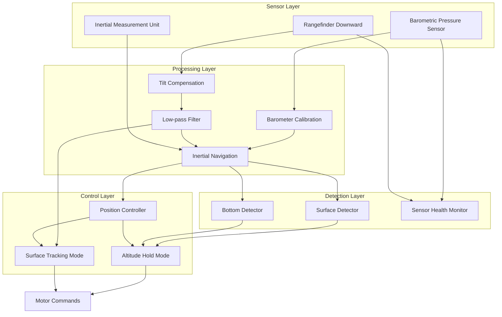
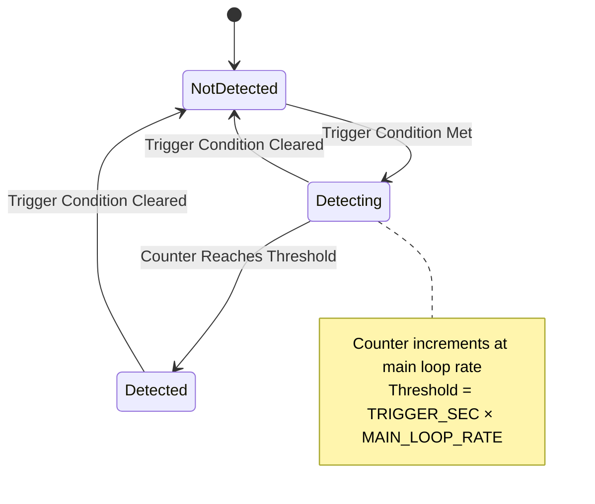
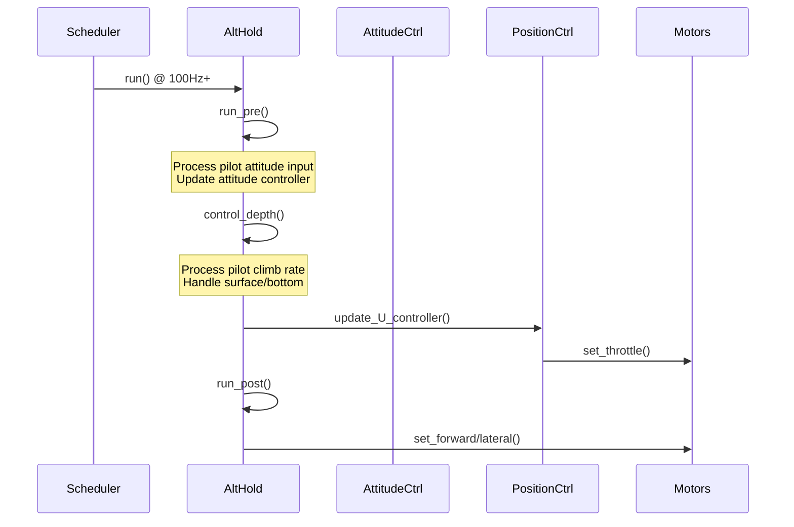
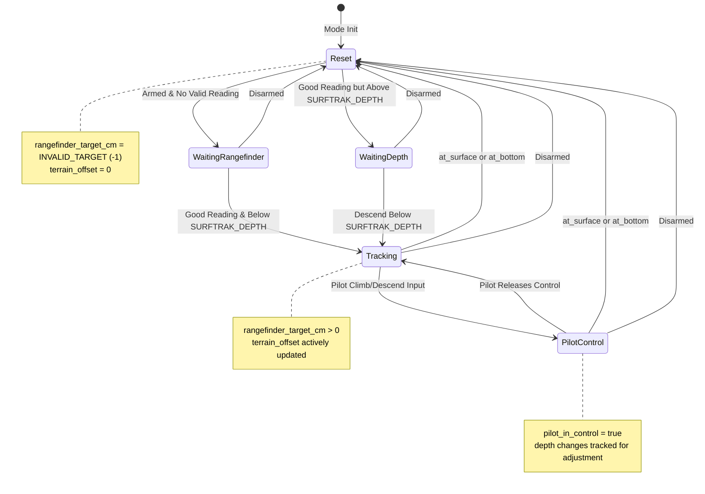
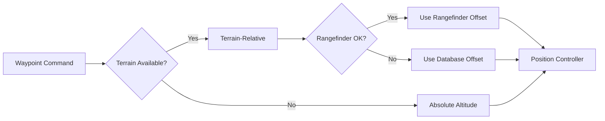
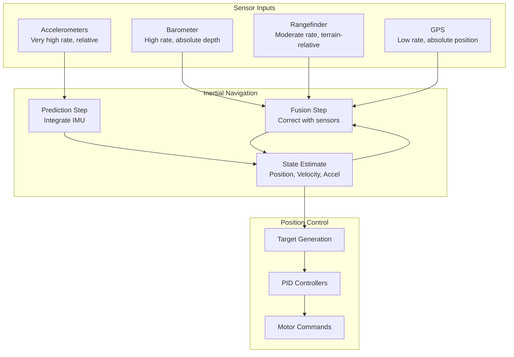

# ArduSub Depth Sensing Systems


## Table of Contents
- [Overview](#overview)
- [System Architecture](#system-architecture)
- [Barometric Depth Sensing](#barometric-depth-sensing)
- [Rangefinder Integration](#rangefinder-integration)
- [Surface and Bottom Detection](#surface-and-bottom-detection)
- [Altitude Hold Control](#altitude-hold-control)
- [Surface Tracking Mode](#surface-tracking-mode)
- [Terrain Following](#terrain-following)
- [Sensor Fusion and Filtering](#sensor-fusion-and-filtering)
- [Configuration Parameters](#configuration-parameters)
- [Troubleshooting](#troubleshooting)

## Overview

The ArduSub depth sensing system provides accurate vertical position estimation and control for underwater vehicles. This system combines multiple sensor inputs including barometric pressure sensors, rangefinders, and inertial navigation to enable precise depth holding, surface tracking, and bottom-following capabilities.

**Source Files**: 
- `/ArduSub/sensors.cpp` - Sensor reading and processing
- `/ArduSub/mode_althold.cpp` - Altitude hold control implementation
- `/ArduSub/mode_surftrak.cpp` - Surface tracking mode
- `/ArduSub/surface_bottom_detector.cpp` - Surface/bottom detection algorithms
- `/ArduSub/terrain.cpp` - Terrain system integration

**Key Features**:
- Barometric depth sensor with automatic calibration
- Rangefinder-based bottom tracking with tilt compensation
- Surface and bottom detection with configurable thresholds
- Integrated position control for depth hold modes
- Terrain-relative navigation support

## System Architecture

The depth sensing system operates in a layered architecture that combines multiple sensor inputs, processes them through filtering algorithms, and provides control outputs for depth-based flight modes.



**Update Rates**:
- Barometer reading: Main loop rate (typically 50-400Hz)
- Rangefinder reading: Main loop rate
- Surface/bottom detection: Main loop rate
- Altitude hold control: 100Hz minimum
- Position controller: Main loop rate

## Barometric Depth Sensing

### Overview

The barometric pressure sensor is the primary depth measurement source for ArduSub. Unlike aerial vehicles where barometers measure altitude above sea level, underwater vehicles use pressure sensors to measure depth below the water surface. The sensor provides high-frequency, accurate depth measurements essential for stable depth control.

**Source**: `/ArduSub/sensors.cpp:read_barometer()`

### Automatic Calibration

The barometer undergoes automatic calibration to compensate for atmospheric pressure variations and ensure accurate depth readings. The calibration algorithm checks if the sensor is reading positive altitude values, which would indicate the vehicle is above water or the sensor requires recalibration.

```cpp
/**
 * @brief Read and calibrate barometric depth sensor
 * 
 * @details Called at main loop rate to update barometer readings.
 *          Automatically recalibrates if positive altitude detected,
 *          as underwater readings should always be negative or zero.
 * 
 * Source: /ArduSub/sensors.cpp:4-16
 */
void Sub::read_barometer()
{
    barometer.update();
    
    // If we are reading a positive altitude, the sensor needs calibration
    // Even a few meters above the water we should have no significant depth reading
    if(barometer.get_altitude() > 0) {
        barometer.update_calibration();
    }

    if (ap.depth_sensor_present) {
        sensor_health.depth = barometer.healthy(depth_sensor_idx);
    }
}
```

**Calibration Logic**:
1. **Normal Operation**: Barometer returns negative values (depth below surface)
2. **Calibration Trigger**: Positive altitude reading indicates sensor drift or atmospheric change
3. **Automatic Correction**: `update_calibration()` resets the reference pressure
4. **Health Monitoring**: Sensor health flag updated for use by control loops

> **Note**: The automatic calibration assumes the vehicle is at or near the surface when positive readings occur. This may not be suitable for rapid depth changes or operation in varying pressure environments.

### Depth Sensor Health Monitoring

The system continuously monitors the depth sensor health status through the `sensor_health.depth` flag. This flag is checked by flight modes before enabling depth-dependent features.

**Health Indicators**:
- `ap.depth_sensor_present`: Indicates if an external depth sensor is configured
- `sensor_health.depth`: Current health status of the depth sensor
- `barometer.healthy(depth_sensor_idx)`: Backend health check for specific sensor instance

### Integration with Inertial Navigation

Barometric depth measurements are integrated into the inertial navigation system (INAV) to provide filtered, high-rate position estimates. The INAV combines barometer readings with accelerometer data to produce smooth vertical position and velocity estimates.

**Key Variables**:
- `barometer.get_altitude()`: Raw depth reading in centimeters (negative for underwater)
- `inertial_nav.get_position_z_up_cm()`: Filtered vertical position estimate
- `g.surface_depth`: Configurable surface depth threshold parameter

## Rangefinder Integration

### Overview

Rangefinders provide distance-to-bottom measurements that enable terrain-relative navigation, bottom tracking, and obstacle avoidance. ArduSub uses downward-facing rangefinders (ROTATION_PITCH_270) to measure the distance from the vehicle to the seafloor or bottom surface.

**Source**: `/ArduSub/sensors.cpp:init_rangefinder()`, `/ArduSub/sensors.cpp:read_rangefinder()`

### Initialization

The rangefinder is initialized during vehicle startup and configured for downward-facing operation with appropriate filtering parameters.

```cpp
/**
 * @brief Initialize rangefinder for bottom tracking
 * 
 * @details Configures rangefinder with downward orientation (ROTATION_PITCH_270),
 *          sets up logging, and enables low-pass filtering for smooth readings.
 * 
 * Source: /ArduSub/sensors.cpp:18-26
 */
void Sub::init_rangefinder()
{
#if AP_RANGEFINDER_ENABLED
    rangefinder.set_log_rfnd_bit(MASK_LOG_CTUN);
    rangefinder.init(ROTATION_PITCH_270);  // Downward facing
    rangefinder_state.alt_filt.set_cutoff_frequency(RANGEFINDER_WPNAV_FILT_HZ);
    rangefinder_state.enabled = rangefinder.has_orientation(ROTATION_PITCH_270);
#endif
}
```

**Configuration**:
- `ROTATION_PITCH_270`: Downward-facing orientation (-90° pitch)
- `RANGEFINDER_WPNAV_FILT_HZ`: Low-pass filter cutoff frequency for waypoint navigation
- Logging enabled for control tuning analysis

### Rangefinder Reading and Processing

The rangefinder reading process includes health checking, tilt compensation, filtering, and terrain offset calculation.

```cpp
/**
 * @brief Read and process rangefinder measurements for bottom tracking
 * 
 * @details Performs health checking based on status, signal quality, and validity count.
 *          Applies tilt compensation to correct for vehicle attitude.
 *          Filters readings through low-pass filter for smooth terrain offset.
 *          Updates navigation libraries with terrain information.
 * 
 * Source: /ArduSub/sensors.cpp:29-78
 */
void Sub::read_rangefinder()
{
#if AP_RANGEFINDER_ENABLED
    rangefinder.update();

    // Signal quality ranges from 0 (worst) to 100 (perfect), -1 means n/a
    int8_t signal_quality_pct = rangefinder.signal_quality_pct_orient(ROTATION_PITCH_270);

    // Health check: status, validity count, and signal quality
    rangefinder_state.alt_healthy =
            (rangefinder.status_orient(ROTATION_PITCH_270) == RangeFinder::Status::Good) &&
            (rangefinder.range_valid_count_orient(ROTATION_PITCH_270) >= RANGEFINDER_HEALTH_MAX) &&
            (signal_quality_pct == -1 || signal_quality_pct >= g.rangefinder_signal_min);

    float temp_alt_m = rangefinder.distance_orient(ROTATION_PITCH_270);

#if RANGEFINDER_TILT_CORRECTION
    // Correct altitude for angle of the rangefinder
    // Uses rotation matrix element c.z (cosine of tilt from vertical)
    // Minimum correction factor of 0.707 (45° tilt limit)
    temp_alt_m = temp_alt_m * MAX(0.707f, ahrs.get_rotation_body_to_ned().c.z);
#endif

    rangefinder_state.alt = temp_alt_m;
    rangefinder_state.inertial_alt_cm = inertial_nav.get_position_z_up_cm();
    rangefinder_state.min = rangefinder.min_distance_orient(ROTATION_PITCH_270);
    rangefinder_state.max = rangefinder.max_distance_orient(ROTATION_PITCH_270);

    // Calculate rangefinder_terrain_offset_cm for terrain-relative navigation
    if (rangefinder_state.alt_healthy) {
        uint32_t now = AP_HAL::millis();
        if (now - rangefinder_state.last_healthy_ms > RANGEFINDER_TIMEOUT_MS) {
            // Reset filter if we haven't used it within the last second
            rangefinder_state.alt_filt.reset(rangefinder_state.alt);
        } else {
            // Apply low-pass filter with 0.05 time constant
            rangefinder_state.alt_filt.apply(rangefinder_state.alt, 0.05f);
        }
        rangefinder_state.last_healthy_ms = now;
        
        // Terrain offset = inertial altitude - filtered rangefinder distance
        rangefinder_state.rangefinder_terrain_offset_cm =
            sub.rangefinder_state.inertial_alt_cm - (sub.rangefinder_state.alt_filt.get() * 100);
    }

    // Send rangefinder altitude and health to waypoint navigation library
    wp_nav.set_rangefinder_terrain_offset_cm(
            rangefinder_state.enabled,
            rangefinder_state.alt_healthy,
            rangefinder_state.rangefinder_terrain_offset_cm);
    
    circle_nav.set_rangefinder_terrain_offset_cm(
            rangefinder_state.enabled && wp_nav.rangefinder_used(),
            rangefinder_state.alt_healthy,
            rangefinder_state.rangefinder_terrain_offset_cm);
#endif  // AP_RANGEFINDER_ENABLED
}
```

### Health Checking Algorithm

The rangefinder health status is determined by three criteria:

1. **Sensor Status Check**: 
   - Status must be `RangeFinder::Status::Good`
   - Indicates the sensor is powered, communicating, and returning valid data

2. **Validity Count Check**:
   - `range_valid_count` must exceed `RANGEFINDER_HEALTH_MAX`
   - Requires multiple consecutive valid readings before trusting the sensor
   - Prevents single-reading glitches from affecting control

3. **Signal Quality Check**:
   - If signal quality is reported (not -1), it must exceed `g.rangefinder_signal_min`
   - Configurable threshold allows tuning for different sensors and environments
   - Typical range: 0-100, where higher values indicate better signal return

**Health Flag Usage**:
```cpp
// Check if rangefinder is healthy and recent
bool Sub::rangefinder_alt_ok() const
{
    uint32_t now = AP_HAL::millis();
    return (rangefinder_state.enabled && 
            rangefinder_state.alt_healthy && 
            now - rangefinder_state.last_healthy_ms < RANGEFINDER_TIMEOUT_MS);
}
```

### Tilt Compensation

When the vehicle is tilted, the rangefinder beam is no longer vertical, causing the measured distance to be longer than the true vertical distance to the bottom. Tilt compensation corrects for this geometric effect.

**Mathematical Basis**:

```
                    ^ Vertical (NED Down)
                    |
                    |
    Vehicle -----> /|
                 /  |
  Rangefinder  /    | True Vertical Distance
     Beam    /      |
           / θ      |
         /__________|
              Bottom

True Vertical Distance = Measured Distance × cos(θ)
```

The rotation matrix element `c.z` provides `cos(θ)` where θ is the angle from vertical. The implementation uses a minimum correction factor of 0.707 (corresponding to 45° tilt) to prevent division by very small numbers at extreme angles.

**Correction Formula**:
```cpp
// c.z is the cosine of the tilt angle from vertical
correction_factor = MAX(0.707f, ahrs.get_rotation_body_to_ned().c.z);
corrected_distance = measured_distance * correction_factor;
```

**Tilt Limits**:
- 0° tilt: correction_factor = 1.0 (no correction needed)
- 45° tilt: correction_factor = 0.707 (41% increase in measured distance)
- >45° tilt: correction clamped to 0.707 to prevent unreliable readings

> **Warning**: At tilt angles greater than 45°, the rangefinder reading becomes increasingly unreliable as the beam may reflect off slopes or miss the bottom entirely. The clamping prevents extreme corrections but does not guarantee accuracy.

### Filtering and Noise Reduction

Rangefinder measurements can be noisy due to water turbidity, suspended particles, uneven terrain, and sensor limitations. A low-pass filter smooths these readings for stable control.

**Filter Implementation**:
- **Filter Type**: Exponential low-pass filter
- **Cutoff Frequency**: `RANGEFINDER_WPNAV_FILT_HZ` (typically 0.25-0.5 Hz)
- **Time Constant**: 0.05 seconds (20 Hz update if loop rate allows)
- **Reset Condition**: Filter resets after `RANGEFINDER_TIMEOUT_MS` (1 second) of no valid readings

**Filter Behavior**:
```cpp
// Initial reading or after timeout - reset filter to current value
rangefinder_state.alt_filt.reset(rangefinder_state.alt);

// Normal operation - apply exponential smoothing
rangefinder_state.alt_filt.apply(rangefinder_state.alt, 0.05f);
```

**Terrain Offset Calculation**:

The terrain offset represents the estimated altitude of the bottom surface in the inertial navigation frame. This allows the position controller to command terrain-relative altitudes.

```
Terrain Offset = Inertial Altitude - Filtered Rangefinder Distance

Example:
  Inertial Altitude: -500 cm (5m below surface)
  Rangefinder Distance: 200 cm (2m to bottom)
  Terrain Offset: -500 - 200 = -700 cm (bottom is 7m below surface)
```

This offset is provided to the waypoint and circle navigation libraries for terrain-following modes.

### Rangefinder State Structure

The `rangefinder_state` structure maintains all rangefinder-related information:

```cpp
struct {
    bool enabled;                           // Rangefinder hardware present and configured
    bool alt_healthy;                       // Current reading is valid and trustworthy
    float alt;                              // Current rangefinder distance in meters
    float inertial_alt_cm;                  // Inertial altitude when reading was taken
    float min;                              // Minimum valid range in meters
    float max;                              // Maximum valid range in meters
    uint32_t last_healthy_ms;               // Timestamp of last valid reading
    LowPassFilterFloat alt_filt;            // Low-pass filter for smoothing
    float rangefinder_terrain_offset_cm;    // Calculated terrain altitude offset
} rangefinder_state;
```

## Surface and Bottom Detection

### Overview

The surface and bottom detection system identifies when the vehicle has reached physical boundaries - either the water surface above or the bottom/seafloor below. These detections trigger protective behaviors in altitude hold modes to prevent the vehicle from continuing to climb or descend beyond safe limits.

**Source**: `/ArduSub/surface_bottom_detector.cpp`

### Detection Architecture

The detection system uses two parallel state machines with hysteresis to prevent rapid state changes:



### Detection Algorithms

The system employs different detection strategies depending on whether an external depth sensor (barometer) is present.

#### Detection with External Depth Sensor (Barometer)

When an external barometric depth sensor is available and healthy, the system uses direct depth measurement for surface detection and motor saturation with velocity for bottom detection.

**Surface Detection Logic**:
```cpp
/**
 * @brief Surface detection using barometric depth sensor
 * 
 * @details Compares current depth to SURFACE_DEPTH parameter.
 *          Includes 5cm hysteresis buffer to prevent oscillation.
 * 
 * Source: /ArduSub/surface_bottom_detector.cpp:27-35
 */
current_depth = barometer.get_altitude(); // cm

if (ap.at_surface) {
    // When already at surface, require 5cm buffer before clearing flag
    set_surfaced(current_depth > g.surface_depth*0.01 - 0.05);
} else {
    // When not at surface, set flag if above surface depth
    set_surfaced(current_depth > g.surface_depth*0.01);
}
```

**Surface Detection Criteria**:
- **Depth Threshold**: `g.surface_depth` parameter (typically -10 to 0 cm)
- **Hysteresis**: 5 cm buffer when already surfaced
- **Update Rate**: Main loop rate (no delay)

**Bottom Detection Logic**:
```cpp
/**
 * @brief Bottom detection using motor saturation and velocity
 * 
 * @details Requires both throttle lower limit and stationary velocity.
 *          Counter must reach threshold before triggering detection.
 * 
 * Source: /ArduSub/surface_bottom_detector.cpp:38-48
 */
// Velocity must be near zero
bool vel_stationary = velocity.z > -0.05 && velocity.z < 0.05;

if (motors.limit.throttle_lower && vel_stationary) {
    // Bottom criteria met - increment the counter
    if (bottom_detector_count < ((float)BOTTOM_DETECTOR_TRIGGER_SEC)*MAIN_LOOP_RATE) {
        bottom_detector_count++;
    } else {
        set_bottomed(true);
    }
} else {
    set_bottomed(false);
}
```

**Bottom Detection Criteria**:
- **Motor Saturation**: `motors.limit.throttle_lower` flag set (motors at minimum)
- **Velocity Check**: Vertical velocity between -0.05 and +0.05 m/s
- **Time Threshold**: `BOTTOM_DETECTOR_TRIGGER_SEC` seconds at main loop rate
- **Reset**: Immediate when conditions no longer met

#### Detection without External Depth Sensor

When no external depth sensor is available, the system relies entirely on motor saturation limits and velocity estimates from the inertial navigation system.

**Surface Detection Logic**:
```cpp
/**
 * @brief Surface detection using motor saturation (no external sensor)
 * 
 * @details Uses throttle upper limit as indication vehicle cannot ascend.
 *          Requires stationary velocity to prevent false detection during maneuvers.
 * 
 * Source: /ArduSub/surface_bottom_detector.cpp:51-59
 */
if (vel_stationary && motors.limit.throttle_upper) {
    // Surface criteria met, increment counter
    if (surface_detector_count < ((float)SURFACE_DETECTOR_TRIGGER_SEC)*MAIN_LOOP_RATE) {
        surface_detector_count++;
    } else {
        set_surfaced(true);
    }
}
```

**Surface Detection Criteria (No External Sensor)**:
- **Motor Saturation**: `motors.limit.throttle_upper` flag set (motors at maximum)
- **Velocity Check**: Vertical velocity between -0.05 and +0.05 m/s
- **Time Threshold**: `SURFACE_DETECTOR_TRIGGER_SEC` seconds at main loop rate
- **Reset**: Immediate when conditions no longer met

**Bottom Detection Logic**: Same as with external sensor (uses throttle_lower limit)

### Detection State Machine

```cpp
/**
 * @brief Main surface and bottom detection update function
 * 
 * @details Called at main loop rate. Implements state machines for both
 *          surface and bottom detection with hysteresis counters.
 * 
 * Source: /ArduSub/surface_bottom_detector.cpp:13-78
 */
void Sub::update_surface_and_bottom_detector()
{
    if (!motors.armed()) {
        set_surfaced(false);
        set_bottomed(false);
        return;
    }

    Vector3f velocity;
    UNUSED_RESULT(ahrs.get_velocity_NED(velocity));

    // Check that we are not moving up or down
    bool vel_stationary = velocity.z > -0.05 && velocity.z < 0.05;

    // Detection logic branches based on sensor availability
    if (ap.depth_sensor_present && sensor_health.depth) {
        // Use external sensor logic
    } else if (vel_stationary) {
        // Use motor saturation logic
    } else {
        // Vehicle moving - reset both detectors
        set_surfaced(false);
        set_bottomed(false);
    }
}
```

### State Setters and Event Logging

State changes trigger event logging for post-flight analysis:

```cpp
/**
 * @brief Set surface detection state
 * 
 * @details Updates ap.at_surface flag, resets counter, and logs events.
 *          Prevents unnecessary updates if state unchanged.
 * 
 * Source: /ArduSub/surface_bottom_detector.cpp:80-97
 */
void Sub::set_surfaced(bool at_surface)
{
    if (ap.at_surface == at_surface) {
        return; // No change
    }

    ap.at_surface = at_surface;
    surface_detector_count = 0;

    if (ap.at_surface) {
        LOGGER_WRITE_EVENT(LogEvent::SURFACED);
    } else {
        LOGGER_WRITE_EVENT(LogEvent::NOT_SURFACED);
    }
}
```

**Logged Events**:
- `LogEvent::SURFACED` - Vehicle has reached the surface
- `LogEvent::NOT_SURFACED` - Vehicle has left the surface
- `LogEvent::BOTTOMED` - Vehicle has reached the bottom
- `LogEvent::NOT_BOTTOMED` - Vehicle has left the bottom

### Detection Parameters

| Parameter | Typical Value | Description |
|-----------|---------------|-------------|
| `BOTTOM_DETECTOR_TRIGGER_SEC` | 1.0 seconds | Time at bottom before detection triggers |
| `SURFACE_DETECTOR_TRIGGER_SEC` | 1.0 seconds | Time at surface before detection triggers |
| `g.surface_depth` | -10 to 0 cm | Depth threshold for surface detection |
| Velocity threshold | ±0.05 m/s | Maximum velocity for stationary check |
| Hysteresis buffer | 5 cm | Depth buffer when already surfaced |

## Altitude Hold Control

### Overview

Altitude Hold (ALT_HOLD) mode maintains a constant depth while allowing the pilot to control horizontal movement and heading. The mode uses the position controller's vertical (U-axis) controller to maintain depth setpoints and respond to pilot climb/descent commands.

**Source**: `/ArduSub/mode_althold.cpp`

### Mode Initialization

```cpp
/**
 * @brief Initialize Altitude Hold mode
 * 
 * @details Checks barometer health, configures position controller limits,
 *          and initializes vertical controller state.
 * 
 * @param ignore_checks If true, skip pre-arm checks
 * @return true if initialization successful, false otherwise
 * 
 * Source: /ArduSub/mode_althold.cpp:4-20
 */
bool ModeAlthold::init(bool ignore_checks) {
    if(!sub.control_check_barometer()) {
        return false;  // Cannot enter mode without healthy barometer
    }

    // Initialize vertical maximum speeds and acceleration
    position_control->set_max_speed_accel_U_cm(
        -sub.get_pilot_speed_dn(),  // Maximum descent rate (negative)
        g.pilot_speed_up,            // Maximum ascent rate (positive)
        g.pilot_accel_z              // Vertical acceleration limit
    );
    
    position_control->set_correction_speed_accel_U_cmss(
        -sub.get_pilot_speed_dn(), 
        g.pilot_speed_up, 
        g.pilot_accel_z
    );

    // Initialize position and desired velocity
    position_control->init_U_controller();

    sub.last_pilot_heading = ahrs.yaw_sensor;

    return true;
}
```

**Initialization Requirements**:
- **Barometer Check**: `control_check_barometer()` must pass
- **Speed Limits**: Configured from parameters `pilot_speed_up`, `pilot_speed_dn`, `pilot_accel_z`
- **Controller State**: Position controller initialized to current depth
- **Heading**: Initial heading stored for heading hold behavior

### Control Loop Structure

The altitude hold mode executes at 100Hz or higher with a three-phase structure:



### Pre-Run Phase: Attitude Control

The pre-run phase handles pilot input for roll, pitch, and yaw control:

```cpp
/**
 * @brief Pre-run phase: attitude control processing
 * 
 * @details Processes pilot input for roll, pitch, and yaw.
 *          Handles both MAVLink attitude commands and RC input.
 *          Implements heading hold when no yaw input provided.
 * 
 * Source: /ArduSub/mode_althold.cpp:31-98
 */
void ModeAlthold::run_pre()
{
    uint32_t tnow = AP_HAL::millis();

    // Update speed limits (may change via parameters)
    position_control->set_max_speed_accel_U_cm(
        -sub.get_pilot_speed_dn(), 
        g.pilot_speed_up, 
        g.pilot_accel_z
    );

    if (!motors.armed()) {
        // Disarmed: set ground idle and relax controllers
        motors.set_desired_spool_state(AP_Motors::DesiredSpoolState::GROUND_IDLE);
        attitude_control->set_throttle_out(0.5, true, g.throttle_filt);
        attitude_control->relax_attitude_controllers();
        position_control->relax_U_controller(motors.get_throttle_hover());
        sub.last_pilot_heading = ahrs.yaw_sensor;
        return;
    }

    motors.set_desired_spool_state(AP_Motors::DesiredSpoolState::THROTTLE_UNLIMITED);

    // Get pilot desired lean angles
    float target_roll, target_pitch;

    // Check for MAVLink attitude target message (valid for 5 seconds)
    if (tnow - sub.set_attitude_target_no_gps.last_message_ms < 5000) {
        // Use MAVLink quaternion attitude command
        float target_yaw;
        Quaternion(sub.set_attitude_target_no_gps.packet.q).to_euler(
            target_roll, target_pitch, target_yaw
        );
        target_roll = degrees(target_roll);
        target_pitch = degrees(target_pitch);
        target_yaw = degrees(target_yaw);
        
        attitude_control->input_euler_angle_roll_pitch_yaw_cd(
            target_roll * 1e2f, 
            target_pitch * 1e2f, 
            target_yaw * 1e2f, 
            true
        );
        return;
    }

    // Use RC input for attitude control
    sub.get_pilot_desired_lean_angles(
        channel_roll->get_control_in(), 
        channel_pitch->get_control_in(), 
        target_roll, 
        target_pitch, 
        attitude_control->get_althold_lean_angle_max_cd()
    );

    // Get pilot's desired yaw rate
    float yaw_input = channel_yaw->pwm_to_angle_dz_trim(
        channel_yaw->get_dead_zone() * sub.gain, 
        channel_yaw->get_radio_trim()
    );
    float target_yaw_rate = sub.get_pilot_desired_yaw_rate(yaw_input);

    // Call attitude controller
    if (!is_zero(target_yaw_rate)) {
        // Pilot providing yaw input: use rate control
        attitude_control->input_euler_angle_roll_pitch_euler_rate_yaw_cd(
            target_roll, target_pitch, target_yaw_rate
        );
        sub.last_pilot_heading = ahrs.yaw_sensor;
        sub.last_pilot_yaw_input_ms = tnow;
    } else {
        // No yaw input: hold heading
        // 250ms delay allows vehicle to decelerate after fast yaw maneuvers
        if (tnow < sub.last_pilot_yaw_input_ms + 250) {
            // Deceleration phase: command zero yaw rate
            attitude_control->input_euler_angle_roll_pitch_euler_rate_yaw_cd(
                target_roll, target_pitch, 0
            );
            sub.last_pilot_heading = ahrs.yaw_sensor;
        } else {
            // Hold absolute heading
            attitude_control->input_euler_angle_roll_pitch_yaw_cd(
                target_roll, target_pitch, sub.last_pilot_heading, true
            );
        }
    }
}
```

**Heading Hold Logic**:
- **Active Yaw Input**: Updates `last_pilot_heading` continuously, uses rate control
- **Yaw Input Released**: 250ms deceleration period with zero rate command
- **After Deceleration**: Absolute heading hold using stored `last_pilot_heading`
- **Purpose**: Prevents "bounce back" from vehicle inertia during fast yaw maneuvers

### Depth Control Phase

The depth control phase processes pilot climb/descent commands and handles surface/bottom boundary conditions:

```cpp
/**
 * @brief Depth control processing
 * 
 * @details Scales maximum throttle near surface to prevent breaching.
 *          Processes pilot climb rate commands with deadzone handling.
 *          Automatically adjusts target depth when at surface or bottom.
 * 
 * Source: /ArduSub/mode_althold.cpp:106-128
 */
void ModeAlthold::control_depth() {
    // Scale throttle near surface (prevent breaking through surface)
    // Returns 0.2f at surface, scales linearly to 1.0f at 1m depth
    float distance_to_surface = (g.surface_depth - inertial_nav.get_position_z_up_cm()) * 0.01f;
    distance_to_surface = constrain_float(distance_to_surface, 0.0f, 1.0f);
    motors.set_max_throttle(g.surface_max_throttle + 
                           (1.0f - g.surface_max_throttle) * distance_to_surface);

    // Get pilot desired climb rate
    float target_climb_rate_cm_s = sub.get_pilot_desired_climb_rate(
        channel_throttle->get_control_in()
    );
    target_climb_rate_cm_s = constrain_float(
        target_climb_rate_cm_s, 
        -sub.get_pilot_speed_dn(), 
        g.pilot_speed_up
    );

    // Handle surface and bottom boundary conditions
    // Deadzone returns 0 when pilot not commanding climb/descent
    if (fabsf(target_climb_rate_cm_s) < 0.05f)  {
        if (sub.ap.at_surface) {
            // At surface: limit target to 5cm below surface
            position_control->set_pos_desired_U_cm(
                MIN(position_control->get_pos_desired_U_cm(), g.surface_depth)
            );
        } else if (sub.ap.at_bottom) {
            // At bottom: set target to 10cm above current position
            position_control->set_pos_desired_U_cm(
                MAX(inertial_nav.get_position_z_up_cm() + 10.0f, 
                    position_control->get_pos_desired_U_cm())
            );
        }
    }

    // Update position target from climb rate
    position_control->set_pos_target_U_from_climb_rate_cm(target_climb_rate_cm_s);
    
    // Run PID controller to generate throttle output
    position_control->update_U_controller();
}
```

**Throttle Scaling Near Surface**:

The maximum throttle is progressively reduced as the vehicle approaches the surface. This prevents the vehicle from breaching the surface due to control overshoot or wave action.

```
Max Throttle = surface_max_throttle + (1.0 - surface_max_throttle) × distance_ratio

Where distance_ratio = constrain((surface_depth - current_depth) / 100, 0, 1)

Example with surface_max_throttle = 0.2:
  At surface (0cm):     Max = 0.2 + (1.0 - 0.2) × 0.0 = 0.20 (20%)
  At -50cm (0.5m deep): Max = 0.2 + (1.0 - 0.2) × 0.5 = 0.60 (60%)
  At -100cm (1m+ deep): Max = 0.2 + (1.0 - 0.2) × 1.0 = 1.00 (100%)
```

**Surface/Bottom Handling**:

When the surface or bottom detectors trigger and the pilot is not commanding vertical movement (deadzone), the controller automatically adjusts the target depth:

- **At Surface**: Caps target depth to `surface_depth` parameter (typically -10cm)
  - Uses `MIN()` to only pull target deeper, never shallower
  - Prevents controller from trying to drive vehicle above surface
  
- **At Bottom**: Sets target to 10cm above current position
  - Uses `MAX()` to only push target higher, never lower
  - Prevents controller from driving vehicle into the bottom
  - 10cm buffer provides clearance for uneven terrain

**Climb Rate Integration**:

When pilot commands climb/descent (outside deadzone), the climb rate is integrated into the position target:
```cpp
position_control->set_pos_target_U_from_climb_rate_cm(target_climb_rate_cm_s);
```

This allows smooth transitions between depth hold and pilot-commanded depth changes. The position controller internally integrates the rate command to update the target position while applying acceleration limits.

### Post-Run Phase: Horizontal Control

```cpp
/**
 * @brief Post-run phase: horizontal motion control
 * 
 * @details Applies pilot forward/lateral commands directly to motors.
 *          Called after attitude and depth control complete.
 * 
 * Source: /ArduSub/mode_althold.cpp:100-104
 */
void ModeAlthold::run_post()
{
    motors.set_forward(channel_forward->norm_input());
    motors.set_lateral(channel_lateral->norm_input());
}
```

The forward and lateral channels directly command vehicle translation without attitude changes. This allows the vehicle to translate horizontally while maintaining attitude and depth.

### Altitude Hold Mode Summary

**Control Loop Flow**:
1. **run_pre()**: Process attitude inputs (roll, pitch, yaw)
2. **control_depth()**: Process depth commands and boundary conditions
3. **run_post()**: Apply horizontal translation commands

**Key Features**:
- Barometer-based depth hold with position controller
- Automatic surface throttle scaling for safety
- Surface/bottom boundary protection
- Heading hold with deceleration logic
- MAVLink attitude command support
- Independent horizontal translation control

## Surface Tracking Mode

### Overview

Surface Tracking (SURFTRAK) mode is an advanced depth control mode that maintains a constant distance from the bottom surface using rangefinder measurements. Unlike Altitude Hold which maintains absolute depth, SURFTRAK enables true terrain-following behavior.

**Source**: `/ArduSub/mode_surftrak.cpp`

**Key Capabilities**:
- Maintain constant altitude above seafloor or terrain
- Automatically adjust for changing bottom topography
- Pilot override with smooth transition back to tracking
- Safety limits for minimum operating depth

### Mode State Machine

SURFTRAK operates with a stateful design that handles initialization, normal tracking, pilot override, and error conditions:



### Mode Initialization

```cpp
/**
 * @brief Initialize Surface Tracking mode
 * 
 * @details Calls parent ModeAlthold::init(), then resets SURFTRAK state.
 *          Provides feedback to pilot about rangefinder status and depth requirements.
 * 
 * @param ignore_checks If true, skip pre-arm checks
 * @return true if initialization successful, false otherwise
 * 
 * Source: /ArduSub/mode_surftrak.cpp:32-49
 */
bool ModeSurftrak::init(bool ignore_checks)
{
    if (!ModeAlthold::init(ignore_checks)) {
        return false;  // Altitude hold init failed (barometer check)
    }

    reset();  // Clear rangefinder target and terrain offset

    // Provide feedback about mode requirements
    if (!sub.rangefinder_alt_ok()) {
        sub.gcs().send_text(MAV_SEVERITY_INFO, 
                           "waiting for a rangefinder reading");
    } else if (sub.inertial_nav.get_position_z_up_cm() >= sub.g.surftrak_depth) {
        sub.gcs().send_text(MAV_SEVERITY_WARNING, 
                           "descend below %f meters to hold range", 
                           sub.g.surftrak_depth * 0.01f);
    }

    return true;
}
```

**Initialization Checks**:
1. **Altitude Hold Requirements**: Barometer health check from parent class
2. **Rangefinder Availability**: Warns if no valid rangefinder reading
3. **Depth Requirement**: Vehicle must be below `SURFTRAK_DEPTH` to engage tracking
4. **State Reset**: Clears any previous tracking targets

### Reset State

```cpp
/**
 * @brief Reset SURFTRAK to initial state
 * 
 * @details Clears rangefinder target and resets terrain offset.
 *          Called during init, disarm, and surface/bottom detection.
 * 
 * Source: /ArduSub/mode_surftrak.cpp:101-107
 */
void ModeSurftrak::reset()
{
    rangefinder_target_cm = INVALID_TARGET;  // -1 indicates no valid target
    
    // Reset the terrain offset in position controller
    sub.pos_control.init_pos_terrain_U_cm(0);
}
```

### Setting Rangefinder Target

The rangefinder target represents the desired distance from the vehicle to the bottom surface. This can be set automatically when tracking begins or manually via scripting.

```cpp
/**
 * @brief Set the rangefinder target distance
 * 
 * @details Validates mode, depth, and range limits before setting target.
 *          Initializes terrain offset for position controller.
 *          Can be called from Lua scripts for advanced control.
 * 
 * @param target_cm Desired distance to bottom in centimeters
 * @return true if target set successfully, false if validation failed
 * 
 * Source: /ArduSub/mode_surftrak.cpp:68-99
 */
bool ModeSurftrak::set_rangefinder_target_cm(float target_cm)
{
    bool success = false;

    // Validation checks
    if (sub.control_mode != Number::SURFTRAK) {
        sub.gcs().send_text(MAV_SEVERITY_WARNING, 
                           "wrong mode, rangefinder target not set");
    } else if (sub.inertial_nav.get_position_z_up_cm() >= sub.g.surftrak_depth) {
        sub.gcs().send_text(MAV_SEVERITY_WARNING, 
                           "descend below %f meters to set rangefinder target", 
                           sub.g.surftrak_depth * 0.01f);
    } else if (target_cm < sub.rangefinder_state.min*100) {
        sub.gcs().send_text(MAV_SEVERITY_WARNING, 
                           "rangefinder target below minimum, ignored");
    } else if (target_cm > sub.rangefinder_state.max*100) {
        sub.gcs().send_text(MAV_SEVERITY_WARNING, 
                           "rangefinder target above maximum, ignored");
    } else {
        success = true;
    }

    if (success) {
        rangefinder_target_cm = target_cm;
        sub.gcs().send_text(MAV_SEVERITY_INFO, 
                           "rangefinder target is %.2f meters", 
                           rangefinder_target_cm * 0.01f);

        // Calculate and initialize terrain offset
        // Terrain offset = current depth - target distance
        auto terrain_offset_cm = sub.inertial_nav.get_position_z_up_cm() - rangefinder_target_cm;
        sub.pos_control.init_pos_terrain_U_cm(terrain_offset_cm);
    } else {
        reset();  // Failed validation, reset to initial state
    }

    return success;
}
```

**Validation Requirements**:
- **Mode Check**: Must be in SURFTRAK mode
- **Depth Check**: Current depth must be below `SURFTRAK_DEPTH` parameter
- **Range Limits**: Target must be within rangefinder min/max distances
- **Feedback**: GCS text messages inform pilot of validation results

**Terrain Offset Calculation**:
```
Terrain Offset = Current Inertial Depth - Rangefinder Target

Example:
  Current depth: -500 cm (5m below surface)
  Target distance: 200 cm (want to be 2m above bottom)
  Terrain offset: -500 - 200 = -700 cm
  
This tells the position controller the bottom is at -700cm in the inertial frame.
```

### Main Control Loop

```cpp
/**
 * @brief Main SURFTRAK control loop
 * 
 * @details Processes pilot climb rate input with special handling for:
 *          - Pilot taking/releasing control
 *          - Surface/bottom boundary conditions
 *          - Normal terrain tracking operation
 * 
 * Called at 100Hz or higher.
 * 
 * Source: /ArduSub/mode_surftrak.cpp:112-146
 */
void ModeSurftrak::control_range() {
    float target_climb_rate_cm_s = sub.get_pilot_desired_climb_rate(
        channel_throttle->get_control_in()
    );
    target_climb_rate_cm_s = constrain_float(
        target_climb_rate_cm_s, 
        -sub.get_pilot_speed_dn(), 
        g.pilot_speed_up
    );

    // Pilot input deadzone returns 0 when stick centered
    if (fabsf(target_climb_rate_cm_s) < 0.05f)  {
        
        if (pilot_in_control) {
            // Pilot just released control - apply depth delta to target
            set_rangefinder_target_cm(
                rangefinder_target_cm + 
                inertial_nav.get_position_z_up_cm() - 
                pilot_control_start_z_cm
            );
            pilot_in_control = false;
        }
        
        if (sub.ap.at_surface) {
            // At surface: limit depth to 5cm below SURFACE_DEPTH and reset
            position_control->set_pos_desired_U_cm(
                MIN(position_control->get_pos_desired_U_cm(), 
                    g.surface_depth - 5.0f)
            );
            reset();
        } else if (sub.ap.at_bottom) {
            // At bottom: set target 10cm above current position and reset
            position_control->set_pos_desired_U_cm(
                MAX(inertial_nav.get_position_z_up_cm() + 10.0f, 
                    position_control->get_pos_desired_U_cm())
            );
            reset();
        } else {
            // Normal operation: update terrain offset from rangefinder
            update_surface_offset();
        }
        
    } else if (HAS_VALID_TARGET && !pilot_in_control) {
        // Pilot taking control - record current depth
        pilot_control_start_z_cm = inertial_nav.get_position_z_up_cm();
        pilot_in_control = true;
    }

    // Set target altitude from climb rate and terrain offset
    position_control->set_pos_target_U_from_climb_rate_cm(target_climb_rate_cm_s);

    // Run PID controllers
    position_control->update_U_controller();
}
```

**Control Flow Logic**:

1. **No Pilot Input (Deadzone)**:
   - **Releasing Control**: If pilot just stopped input, adjust rangefinder target by depth change
   - **At Surface**: Safety limit and reset tracking
   - **At Bottom**: Safety limit and reset tracking
   - **Normal**: Update terrain offset from rangefinder readings

2. **Pilot Commanding Climb/Descent**:
   - **First Input**: Record starting depth in `pilot_control_start_z_cm`
   - **Continuous Input**: Track depth changes while pilot controls
   - **Purpose**: Allows smooth rangefinder target adjustment when pilot releases

### Pilot Override Behavior

The pilot override system tracks depth changes during manual input and applies them to the rangefinder target when control is released. This prevents "bounce back" behavior.

**Without Override Compensation**:
```
Initial: 5m depth, 2m above bottom, target = 2m
Pilot descends to 6m depth (1m above bottom)
Rangefinder reads 1m, but target is still 2m
System tries to climb 1m → unwanted "bounce"
```

**With Override Compensation**:
```
Initial: 5m depth, 2m above bottom, target = 2m
Pilot descends to 6m depth (depth change = -1m)
On release: target = 2m + (-1m) = 1m
New target matches current state → no bounce
```

**Implementation**:
```cpp
// When pilot takes control
pilot_control_start_z_cm = inertial_nav.get_position_z_up_cm();  // e.g., -500cm
pilot_in_control = true;

// Pilot descends...
// Current depth: -600cm (1m deeper)

// When pilot releases control
depth_change = inertial_nav.get_position_z_up_cm() - pilot_control_start_z_cm;
             = -600cm - (-500cm) = -100cm

new_target = rangefinder_target_cm + depth_change;
           = 200cm + (-100cm) = 100cm

// System now tracks 1m above bottom (matching pilot's action)
```

### Surface Offset Update

The core terrain-following logic continuously updates the terrain offset based on rangefinder measurements:

```cpp
/**
 * @brief Update terrain offset from rangefinder readings
 * 
 * @details Checks rangefinder health, initializes target on first reading,
 *          prevents ascending above SURFTRAK_DEPTH, and updates position
 *          controller terrain offset for tracking.
 * 
 * Source: /ArduSub/mode_surftrak.cpp:151-176
 */
void ModeSurftrak::update_surface_offset()
{
    if (sub.rangefinder_alt_ok()) {
        // Get the latest filtered terrain offset
        float rangefinder_terrain_offset_cm = sub.rangefinder_state.rangefinder_terrain_offset_cm;

        // Initialize target on first valid reading
        if (!HAS_VALID_TARGET && 
            sub.rangefinder_state.inertial_alt_cm < sub.g.surftrak_depth) {
            // Set target to current rangefinder distance
            set_rangefinder_target_cm(
                sub.rangefinder_state.inertial_alt_cm - rangefinder_terrain_offset_cm
            );
        }

        if (HAS_VALID_TARGET) {
            // Calculate what depth we'd command with this offset
            float desired_z_cm = rangefinder_terrain_offset_cm + rangefinder_target_cm;
            
            // Prevent ascending above SURFTRAK_DEPTH
            if (desired_z_cm >= sub.g.surftrak_depth) {
                // Adjust offset to keep us below the depth limit
                rangefinder_terrain_offset_cm += sub.g.surftrak_depth - desired_z_cm;
            }

            // Update position controller with terrain offset
            sub.pos_control.set_pos_terrain_target_U_cm(rangefinder_terrain_offset_cm);
        }
    }
}
```

**First Reading Initialization**:
```
If no target set AND depth below SURFTRAK_DEPTH:
  Current inertial altitude: -500 cm
  Terrain offset: -700 cm (bottom is at -700)
  Rangefinder distance: -500 - (-700) = 200 cm
  Set target = 200 cm (maintain current height above bottom)
```

**Depth Limit Enforcement**:
```
Example:
  SURFTRAK_DEPTH = -50 cm (don't go shallower than 0.5m)
  Rangefinder target = 200 cm (want to be 2m above bottom)
  Terrain offset = -200 cm (bottom rising to 2m below surface)
  Desired depth = -200 + 200 = 0 cm (AT SURFACE!)
  
Correction:
  Offset adjustment = -50 - 0 = -50 cm
  New offset = -200 + (-50) = -250 cm
  New desired depth = -250 + 200 = -50 cm (at limit)
  
This prevents breaking the surface when following rising terrain.
```

### SURFTRAK Operational Modes

| State | rangefinder_target_cm | pilot_in_control | Behavior |
|-------|----------------------|------------------|----------|
| Reset/Waiting | -1 (INVALID_TARGET) | false | Waiting for valid rangefinder and depth requirement |
| Initial Lock | Set to current distance | false | Target captured on first valid reading |
| Tracking | > 0 | false | Following terrain, updating offset continuously |
| Pilot Override | > 0 | true | Tracking depth change for target adjustment |
| At Surface | Reset to -1 | false | Safety mode, depth limited |
| At Bottom | Reset to -1 | false | Safety mode, depth limited |

### SURFTRAK vs Altitude Hold Comparison

| Feature | Altitude Hold | Surface Tracking |
|---------|---------------|------------------|
| Reference | Absolute depth (surface) | Relative height (bottom) |
| Sensor | Barometer only | Barometer + Rangefinder |
| Terrain Following | No | Yes |
| Depth Limit | Surface only | Surface + minimum depth |
| Complexity | Simple | Moderate |
| Use Case | Constant depth operations | Inspection, following slopes |

## Terrain Following

### Overview

ArduSub integrates with the AP_Terrain library to support terrain database-based navigation. This enables waypoint navigation relative to the seafloor or lake/river bottom using pre-loaded terrain data.

**Source**: `/ArduSub/terrain.cpp`

### Terrain System Integration

```cpp
/**
 * @brief Update terrain system
 * 
 * @details Updates terrain database and provides height estimate to rangefinder
 *          for power-saving mode. Called from main loop.
 * 
 * Source: /ArduSub/terrain.cpp:4-18
 */
void Sub::terrain_update()
{
#if AP_TERRAIN_AVAILABLE
    terrain.update();

    // Tell the rangefinder our height above terrain for power saving
    float height;
    if (terrain.height_above_terrain(height, true)) {
        rangefinder.set_estimated_terrain_height(height);
    }
#endif
}
```

**Terrain Logging**:
```cpp
/**
 * @brief Log terrain data for post-flight analysis
 * 
 * @details Logs terrain database information at 1Hz.
 *          Only logs if GPS logging is enabled.
 * 
 * Source: /ArduSub/terrain.cpp:22-29
 */
void Sub::terrain_logging()
{
#if AP_TERRAIN_AVAILABLE
    if (should_log(MASK_LOG_GPS)) {
        terrain.log_terrain_data();
    }
#endif
}
```

### Terrain Data Sources

The AP_Terrain system can source terrain/bathymetry data from:

1. **Onboard Terrain Database**: Pre-loaded SRTM or bathymetry data stored on SD card
2. **Ground Station**: Real-time terrain data streamed via MAVLink
3. **Rangefinder**: Live terrain mapping from rangefinder measurements

### Rangefinder Power Saving

The terrain system provides estimated height-above-terrain to the rangefinder driver. Some rangefinder models support power-saving modes when the approximate distance is known:

```cpp
// Estimate provided to rangefinder
rangefinder.set_estimated_terrain_height(height);

// Rangefinder can optimize:
// - Reduce sampling rate when height is large
// - Adjust transmit power based on expected distance
// - Enter low-power mode when out of useful range
```

### Waypoint Navigation with Terrain

When terrain data is available, waypoint navigation can be commanded relative to the bottom:

**Absolute Altitude Waypoint**:
```
Waypoint altitude: -500 cm (5m below surface)
Vehicle maintains 5m depth regardless of bottom depth
```

**Terrain-Relative Waypoint**:
```
Waypoint altitude: 200 cm above terrain
Bottom depth: Varies from -700 to -300 cm
Vehicle maintains 2m above bottom, adjusting depth as terrain changes
```

### Terrain Following in AUTO Mode

During AUTO missions, the waypoint navigation library uses terrain offsets (from rangefinder or terrain database) to adjust commanded altitudes:



## Sensor Fusion and Filtering

### Multi-Sensor Integration Architecture

The depth sensing system fuses data from multiple sources to provide robust vertical position estimates:



### Barometer Fusion

**Update Rate**: Main loop rate (50-400 Hz)

**Characteristics**:
- High update rate suitable for fast control loops
- Absolute depth measurement (relative to surface/calibration point)
- Affected by water temperature and density changes
- Requires calibration at surface

**Integration**:
```cpp
// Barometer provides high-rate depth updates
barometer.update();
float depth_cm = barometer.get_altitude();

// INAV fuses with accelerometer integration
inertial_nav.update(dt);
// Internal fusion of barometer and IMU accelerations
```

### Rangefinder Fusion

**Update Rate**: Main loop rate (50-400 Hz), but filtered to 0.25-0.5 Hz

**Characteristics**:
- Terrain-relative measurement
- Subject to noise from water conditions
- Requires tilt compensation
- Limited by maximum range (typically 50-100m)

**Filtering Strategy**:
```cpp
// Low-pass filter with cutoff based on application
rangefinder_state.alt_filt.set_cutoff_frequency(RANGEFINDER_WPNAV_FILT_HZ);

// Exponential smoothing applied each update
if (rangefinder_state.alt_healthy) {
    rangefinder_state.alt_filt.apply(rangefinder_state.alt, 0.05f);
}

// Timeout handling prevents stale data
if (now - rangefinder_state.last_healthy_ms > RANGEFINDER_TIMEOUT_MS) {
    rangefinder_state.alt_filt.reset(rangefinder_state.alt);
}
```

**Filter Characteristics**:
- **Cutoff Frequency**: 0.25-0.5 Hz (remove high-frequency noise)
- **Phase Lag**: ~200-400ms at cutoff frequency
- **Noise Rejection**: >20dB attenuation above cutoff
- **Timeout**: 1 second before considering data stale

### IMU Integration

**Update Rate**: Typically 1000 Hz (1 kHz)

**Characteristics**:
- Very high update rate for smooth control
- Measures acceleration, integrated to velocity and position
- Subject to drift over time (requires correction from absolute sensors)
- Provides attitude information (roll, pitch, yaw)

**Vertical Axis Integration**:
```cpp
// IMU measures specific force (acceleration - gravity)
Vector3f accel = imu.get_accel();

// Rotate to earth frame using attitude estimate
Vector3f accel_ef = ahrs.get_rotation_body_to_ned() * accel;

// Integrate to velocity (corrected by barometer)
velocity_z += (accel_ef.z - gravity) * dt;

// Integrate to position (corrected by barometer)
position_z += velocity_z * dt;
```

### Sensor Priority and Fallback

The system prioritizes sensors based on availability and health:

**Priority Order**:
1. **Barometer**: Primary depth source (absolute position)
2. **IMU**: High-rate prediction between barometer updates
3. **Rangefinder**: Terrain-relative corrections (when enabled and healthy)
4. **GPS**: Secondary absolute position (low rate, only near surface)

**Fallback Behavior**:
- **Barometer Fail**: Fall back to IMU-only integration (drift will accumulate)
- **Rangefinder Fail**: Continue altitude hold, disable terrain-relative modes
- **IMU Fail**: Critical failure, vehicle cannot maintain stable flight
- **All Sensors Fail**: Emergency failsafe triggers

### Health Monitoring

```cpp
// Continuous health monitoring
struct {
    bool depth;         // Barometer health
    bool rangefinder;   // Rangefinder health (separate from depth)
    bool imu;           // IMU health
    bool position;      // Overall position estimate health
} sensor_health;

// Health checks before mode entry
bool control_check_barometer() {
    return ap.depth_sensor_present && sensor_health.depth;
}

bool rangefinder_alt_ok() {
    return rangefinder_state.enabled && 
           rangefinder_state.alt_healthy && 
           (now - rangefinder_state.last_healthy_ms < RANGEFINDER_TIMEOUT_MS);
}
```

## Configuration Parameters

### Barometer Parameters

| Parameter | Default | Units | Description |
|-----------|---------|-------|-------------|
| `BARO_TYPE` | Auto | - | Barometer sensor type selection |
| `BARO_ALT_OFFSET` | 0 | m | Manual altitude offset adjustment |
| `depth_sensor_idx` | 0 | - | Index of barometer to use for depth |

### Rangefinder Parameters

| Parameter | Default | Units | Description |
|-----------|---------|-------|-------------|
| `RNGFND1_TYPE` | 0 (None) | - | Rangefinder type (0=disabled) |
| `RNGFND1_PIN` | -1 | - | Analog pin for analog rangefinders |
| `RNGFND1_SCALING` | 1.0 | - | Scaling factor for raw readings |
| `RNGFND1_OFFSET` | 0 | cm | Offset added to readings |
| `RNGFND1_MIN_CM` | 20 | cm | Minimum valid range |
| `RNGFND1_MAX_CM` | 700 | cm | Maximum valid range |
| `RNGFND1_ORIENT` | 25 (Down) | - | Mounting orientation |
| `rangefinder_signal_min` | 50 | % | Minimum signal quality threshold |
| `RANGEFINDER_HEALTH_MAX` | 3 | count | Consecutive readings for healthy status |
| `RANGEFINDER_TIMEOUT_MS` | 1000 | ms | Timeout for rangefinder data |
| `RANGEFINDER_WPNAV_FILT_HZ` | 0.25 | Hz | Low-pass filter cutoff frequency |
| `RANGEFINDER_TILT_CORRECTION` | 1 (Enabled) | - | Enable tilt compensation |

### Depth Control Parameters

| Parameter | Default | Units | Description |
|-----------|---------|-------|-------------|
| `pilot_speed_up` | 500 | cm/s | Maximum ascent rate |
| `pilot_speed_dn` | -500 | cm/s | Maximum descent rate |
| `pilot_accel_z` | 100 | cm/s² | Vertical acceleration limit |
| `surface_depth` | -10 | cm | Depth threshold for surface detection |
| `surface_max_throttle` | 0.2 | - | Maximum throttle at surface (0-1) |

### Surface Tracking Parameters

| Parameter | Default | Units | Description |
|-----------|---------|-------|-------------|
| `surftrak_depth` | -50 | cm | Minimum depth for SURFTRAK engagement |
| `rangefinder_target_cm` | -1 | cm | Desired distance to bottom (-1=auto) |

### Surface/Bottom Detection Parameters

| Parameter | Default | Units | Description |
|-----------|---------|-------|-------------|
| `BOTTOM_DETECTOR_TRIGGER_SEC` | 1.0 | s | Time threshold for bottom detection |
| `SURFACE_DETECTOR_TRIGGER_SEC` | 1.0 | s | Time threshold for surface detection |

### Position Controller Parameters

| Parameter | Default | Units | Description |
|-----------|---------|-------|-------------|
| `PSC_POSZ_P` | 1.0 | - | Proportional gain for vertical position |
| `PSC_VELZ_P` | 5.0 | - | Proportional gain for vertical velocity |
| `PSC_VELZ_I` | 0.1 | - | Integral gain for vertical velocity |
| `PSC_VELZ_D` | 0.0 | - | Derivative gain for vertical velocity |
| `PSC_VELZ_IMAX` | 100 | cm/s | Maximum integrator contribution |
| `PSC_VELZ_FLTD` | 5.0 | Hz | Derivative filter cutoff frequency |
| `PSC_VELZ_FLTE` | 5.0 | Hz | Error filter cutoff frequency |
| `PSC_VELZ_FLTT` | 5.0 | Hz | Target filter cutoff frequency |

### Terrain Parameters

| Parameter | Default | Units | Description |
|-----------|---------|-------|-------------|
| `TERRAIN_ENABLE` | 0 (Disabled) | - | Enable terrain database |
| `TERRAIN_SPACING` | 100 | m | Grid spacing for terrain data |
| `TERRAIN_MARGIN` | 10 | m | Safety margin above terrain |

## Troubleshooting

### Common Issues and Solutions

#### Barometer Not Calibrating

**Symptoms**:
- Depth readings show large positive values (above water)
- Depth drifts over time
- Cannot enter Altitude Hold mode

**Causes**:
- Vehicle not at surface during calibration
- Atmospheric pressure changes
- Temperature changes affecting sensor
- Water ingress into pressure sensor

**Solutions**:
```cpp
// Manual calibration at surface
barometer.update_calibration();

// Verify sensor health
if (!barometer.healthy(depth_sensor_idx)) {
    // Check hardware connections
    // Verify sensor type configured correctly
    // Check for water damage
}
```

**Configuration Checks**:
1. Verify `BARO_TYPE` matches installed sensor
2. Ensure pressure sensor is water-pressure sealed
3. Check that depth sensor is oriented correctly
4. Verify no air bubbles trapped in pressure port

#### Rangefinder Intermittent Readings

**Symptoms**:
- `rangefinder_state.alt_healthy` fluctuates
- SURFTRAK mode enters and exits tracking unexpectedly
- GCS shows "waiting for rangefinder reading"

**Causes**:
- Water turbidity affecting signal return
- Suspended particles or marine snow
- Tilted vehicle exceeding 45° correction limit
- Bottom surface too irregular or absorptive
- Signal quality below threshold

**Diagnostic Steps**:
```cpp
// Check rangefinder status
RangeFinder::Status status = rangefinder.status_orient(ROTATION_PITCH_270);
// Expected: RangeFinder::Status::Good

// Check signal quality
int8_t signal_quality = rangefinder.signal_quality_pct_orient(ROTATION_PITCH_270);
// Expected: >= rangefinder_signal_min parameter

// Check validity count
uint8_t valid_count = rangefinder.range_valid_count_orient(ROTATION_PITCH_270);
// Expected: >= RANGEFINDER_HEALTH_MAX (typically 3)
```

**Solutions**:
1. **Reduce Signal Quality Threshold**: Lower `rangefinder_signal_min` parameter
2. **Increase Filter Cutoff**: Raise `RANGEFINDER_WPNAV_FILT_HZ` for faster response
3. **Check Mounting**: Ensure rangefinder faces straight down (ROTATION_PITCH_270)
4. **Verify Range Limits**: Adjust `RNGFND1_MIN_CM` and `RNGFND1_MAX_CM` for environment
5. **Clean Sensor**: Remove marine growth or debris from transducer face

#### Vehicle Won't Enter SURFTRAK Mode

**Symptoms**:
- Mode change rejected
- GCS message: "descend below X meters to hold range"
- GCS message: "waiting for a rangefinder reading"

**Causes**:
- Vehicle above `surftrak_depth` threshold
- No valid rangefinder reading
- Rangefinder not initialized
- Barometer health check failed

**Diagnostic Checklist**:
```cpp
// Check barometer (required for parent AltHold mode)
if (!sub.control_check_barometer()) {
    // Fix: Calibrate barometer at surface
}

// Check rangefinder availability
if (!sub.rangefinder_alt_ok()) {
    // Verify: rangefinder_state.enabled
    // Verify: rangefinder_state.alt_healthy
    // Verify: Last reading within RANGEFINDER_TIMEOUT_MS
}

// Check depth requirement
if (sub.inertial_nav.get_position_z_up_cm() >= sub.g.surftrak_depth) {
    // Fix: Descend below surftrak_depth parameter
    // Typical value: -50cm (0.5m depth)
}
```

**Solutions**:
1. Descend to at least 0.5m depth (or configured `surftrak_depth`)
2. Verify rangefinder is detecting bottom within min/max range
3. Ensure barometer is healthy and calibrated
4. Check that vehicle is armed
5. Verify `RNGFND1_ORIENT` is set to 25 (Downward)

#### Altitude Hold Drifts at Surface

**Symptoms**:
- Vehicle slowly climbs when near surface
- Altitude hold depth drifts shallower over time
- Surface breaching during depth hold

**Causes**:
- Surface detection not triggering
- `surface_depth` parameter too shallow
- `surface_max_throttle` too high
- Waves causing intermittent surface detection

**Solutions**:
```cpp
// Adjust surface depth threshold
g.surface_depth = -20;  // Set to -20cm (20cm below nominal surface)

// Reduce surface throttle limit
g.surface_max_throttle = 0.15;  // Reduce to 15% near surface

// Verify detection is working
if (ap.at_surface) {
    // Surface detector is triggering correctly
    // Check that position_control->set_pos_desired_U_cm() is limiting depth
}
```

**Configuration Recommendations**:
- Set `surface_depth` to -10 to -30 cm depending on wave conditions
- Set `surface_max_throttle` to 0.1-0.2 for gentle surface approach
- Increase `SURFACE_DETECTOR_TRIGGER_SEC` in rough seas to prevent oscillation

#### Bottom Detection Too Sensitive

**Symptoms**:
- `ap.at_bottom` flag sets when not actually at bottom
- Altitude hold stops responding to descent commands prematurely
- Vehicle "bounces" off invisible bottom

**Causes**:
- `BOTTOM_DETECTOR_TRIGGER_SEC` too short
- Motor saturation occurring during maneuvers
- Velocity estimate noise triggering stationary check

**Solutions**:
```cpp
// Increase trigger time
#define BOTTOM_DETECTOR_TRIGGER_SEC 2.0  // Require 2 seconds confirmation

// Check detection criteria
bool vel_stationary = velocity.z > -0.05 && velocity.z < 0.05;
bool throttle_saturated = motors.limit.throttle_lower;

if (vel_stationary && throttle_saturated) {
    // Both conditions must be true for detection
    // If triggering incorrectly, check velocity estimate health
}
```

**Tuning Recommendations**:
- Increase `BOTTOM_DETECTOR_TRIGGER_SEC` to 1.5-2.0 seconds
- Verify motor mixing is correct for frame type
- Check that descent speed limits aren't too low
- Ensure motors can actually reach lower saturation limit

#### Rangefinder Tilt Compensation Issues

**Symptoms**:
- SURFTRAK altitude varies with vehicle attitude
- Depth commands incorrect when vehicle tilted
- Bottom distance readings too large

**Causes**:
- `RANGEFINDER_TILT_CORRECTION` disabled
- AHRS attitude estimate incorrect
- Vehicle exceeding 45° tilt limit

**Diagnostic**:
```cpp
// Check correction factor
float correction = MAX(0.707f, ahrs.get_rotation_body_to_ned().c.z);

// At level: c.z = 1.0, correction = 1.0 (no change)
// At 30°:   c.z = 0.866, correction = 0.866 (13% shorter)
// At 45°:   c.z = 0.707, correction = 0.707 (29% shorter)
// At 60°:   c.z = 0.5, correction = 0.707 (clamped, 29% shorter)

if (correction == 0.707f) {
    // Vehicle is tilted >45°, readings may be unreliable
}
```

**Solutions**:
1. Enable `RANGEFINDER_TILT_CORRECTION` if disabled
2. Verify AHRS attitude calibration is correct
3. Limit vehicle tilt during SURFTRAK operations
4. Check that compass and IMU are calibrated properly

#### Position Controller Oscillations

**Symptoms**:
- Vehicle "bounces" vertically during depth hold
- Depth overshoots target then corrects repeatedly
- High-frequency throttle commands

**Causes**:
- Position or velocity PID gains too high
- Derivative filter too high
- Acceleration limits too aggressive
- Delay in sensor readings

**Tuning Process**:
```cpp
// Reduce P gain first
PSC_VELZ_P = 4.0;  // Reduce from 5.0

// Reduce I gain if integrator windup suspected
PSC_VELZ_I = 0.05;  // Reduce from 0.1

// Lower filter cutoff if noise is issue
PSC_VELZ_FLTE = 2.0;  // Reduce from 5.0 Hz
PSC_VELZ_FLTT = 2.0;

// Reduce acceleration limit
pilot_accel_z = 50;  // Reduce from 100 cm/s²
```

**Systematic Tuning Steps**:
1. Start with low gains (P=1.0, I=0, D=0)
2. Gradually increase P until slight oscillation appears
3. Reduce P by 20-30%
4. Add small I term (0.05-0.1) for steady-state error
5. Verify stable across depth range
6. Test with pilot inputs and surface/bottom conditions

### Logging and Diagnostics

#### Essential Log Messages

**Depth Sensing Logs** (typically 10-50 Hz):
```
BARO: Barometer readings (altitude, pressure, temperature)
PSCN: Position controller output (target, actual, error)
CTUN: Control tuning (throttle in, throttle out, climb rate)
RFND: Rangefinder data (distance, quality, status)
```

**Event Logs** (on state changes):
```
LogEvent::SURFACED         - Surface detection triggered
LogEvent::NOT_SURFACED     - Surface detection cleared
LogEvent::BOTTOMED         - Bottom detection triggered
LogEvent::NOT_BOTTOMED     - Bottom detection cleared
```

#### Diagnostic Ground Control Commands

**Force Barometer Calibration**:
```
MAVLink command: MAV_CMD_PREFLIGHT_CALIBRATION
Param6: 3 (barometer calibration)
```

**Test Motor Output**:
```
MAVLink command: MAV_CMD_DO_MOTOR_TEST
Verify motor saturation detection is working correctly
```

**Parameter Retrieval**:
```
Request all RNGFND* parameters
Request all PSC_* parameters
Request pilot_speed_up, pilot_speed_dn, pilot_accel_z
Request surface_depth, surface_max_throttle
Request surftrak_depth
```

### Performance Verification

#### Expected Performance Metrics

| Metric | Typical Value | Excellent Value | Measurement Method |
|--------|---------------|-----------------|-------------------|
| Depth Hold Precision | ±5 cm | ±2 cm | Std dev of depth in logs |
| Climb Rate Tracking | ±10 cm/s | ±5 cm/s | Command vs actual rate |
| Response Time | 1-2 seconds | <1 second | Step response 63% rise time |
| Overshoot | <10% | <5% | Step response overshoot |
| Settling Time | 3-5 seconds | <3 seconds | Time to ±2% of target |
| Rangefinder Update Rate | 10-50 Hz | 50-100 Hz | RFND log frequency |
| Surface Detection Delay | 1-2 seconds | <1 second | Event log timestamps |

#### Flight Test Procedures

**Barometer Calibration Test**:
1. Power on vehicle at surface
2. Wait 30 seconds for sensor stabilization
3. Check depth reading is -10 to +10 cm
4. Submerge to 1m, verify reading is -90 to -110 cm
5. Return to surface, verify drift is <5 cm

**Altitude Hold Stability Test**:
1. Enter ALT_HOLD mode at 2m depth
2. Release throttle stick (center position)
3. Observe depth hold for 30 seconds
4. Verify drift is <10 cm without pilot input
5. Test with lateral/forward movement

**Rangefinder Validation Test**:
1. Position vehicle at known height above bottom (e.g., 1m)
2. Check RFND log shows distance 90-110 cm
3. Tilt vehicle ±30°, verify tilt compensation working
4. Move to 2m height, verify reading updates correctly
5. Move to >max range, verify sensor reports invalid

**SURFTRAK Tracking Test**:
1. Descend below `surftrak_depth` with ALT_HOLD
2. Switch to SURFTRAK mode
3. Wait for "rangefinder target is X meters" message
4. Slowly ascend/descend over sloped bottom
5. Verify vehicle maintains constant distance to bottom
6. Test pilot override and return to tracking

**Surface/Bottom Detection Test**:
1. Approach surface slowly in ALT_HOLD
2. Verify `at_surface` flag triggers at configured depth
3. Verify vehicle resists further ascent
4. Approach bottom slowly
5. Verify `at_bottom` flag triggers when motors saturate
6. Verify vehicle resists further descent

---

## Summary

The ArduSub depth sensing system provides robust, multi-sensor vertical position control through the integration of barometric pressure sensors, rangefinders, and inertial navigation. The system supports multiple operational modes from simple absolute depth hold to advanced terrain-following flight.

**Key Takeaways**:
- Barometric depth sensor provides primary absolute depth reference
- Rangefinder enables terrain-relative navigation and bottom tracking
- Surface and bottom detection provide safety boundaries
- Altitude Hold mode offers simple, reliable depth control
- Surface Tracking mode enables true terrain-following capabilities
- Sensor fusion and filtering provide smooth, responsive control
- Extensive parameters allow tuning for diverse underwater environments

**Safety Considerations**:
- Always calibrate barometer at surface before operation
- Test depth control in controlled environment before operational use
- Configure `surface_depth` and `surface_max_throttle` for operating conditions
- Verify rangefinder operation before relying on SURFTRAK mode
- Monitor sensor health continuously during operation
- Set appropriate speed and acceleration limits for vehicle and payload

**For Further Information**:
- AP_Baro library documentation for barometer details
- AP_RangeFinder library documentation for rangefinder drivers
- AC_PosControl library documentation for position control algorithms
- ArduSub flight mode documentation for operational procedures

---

**Document Version**: 1.0  
**Last Updated**: 2024  
**Applicable ArduSub Versions**: 4.1+  
**Source Code References**: ArduSub/sensors.cpp, ArduSub/mode_althold.cpp, ArduSub/mode_surftrak.cpp, ArduSub/surface_bottom_detector.cpp, ArduSub/terrain.cpp
