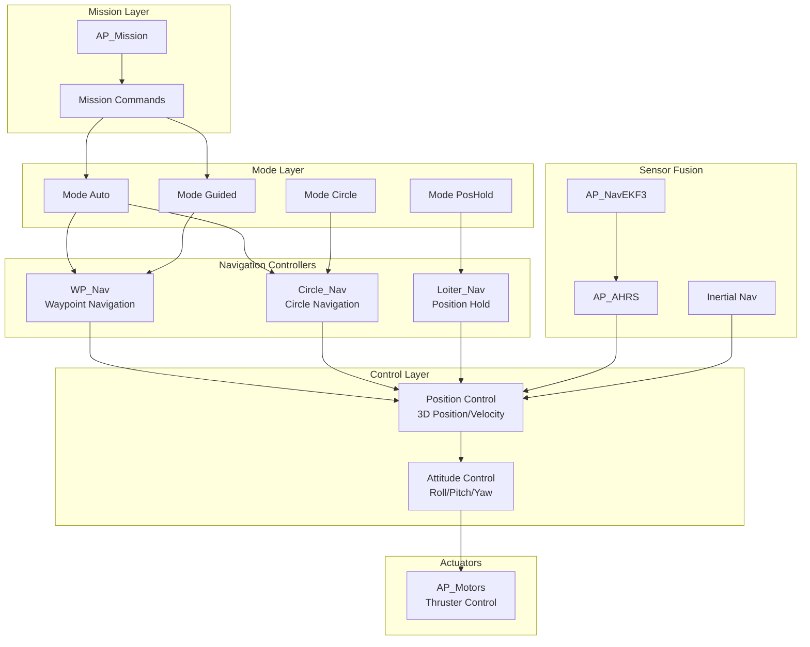
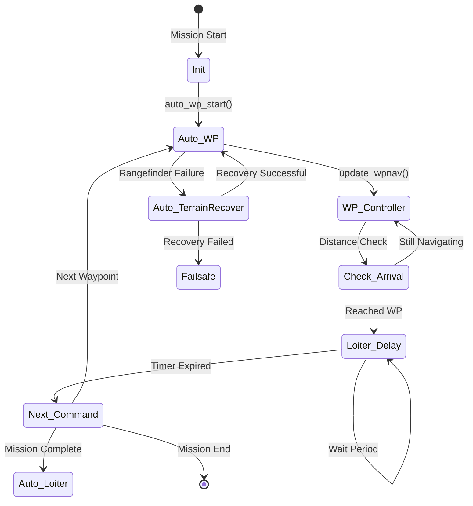
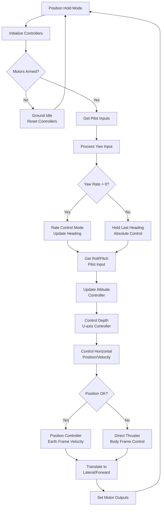
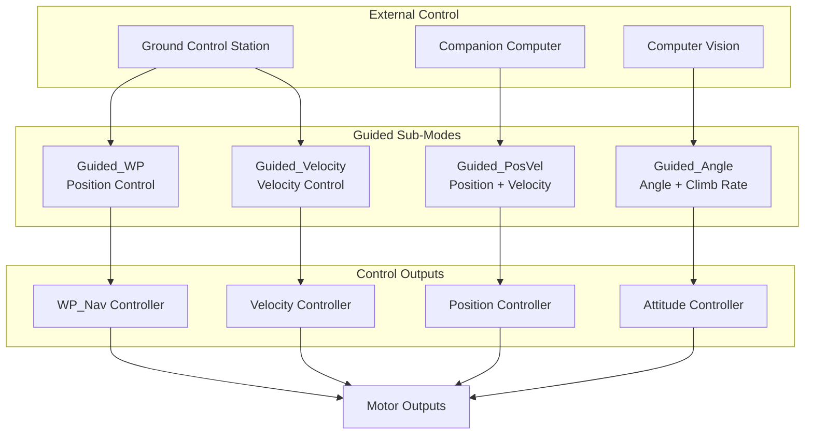
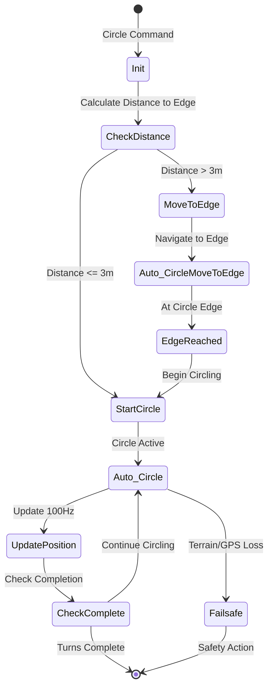

# ArduSub Navigation Algorithms


## Table of Contents

- [Overview](#overview)
- [Architecture](#architecture)
- [Waypoint Navigation](#waypoint-navigation)
- [Position Control Algorithms](#position-control-algorithms)
- [Guided Mode Navigation](#guided-mode-navigation)
- [Circle Navigation](#circle-navigation)
- [Underwater-Specific Adaptations](#underwater-specific-adaptations)
- [Coordinate Systems](#coordinate-systems)
- [Mathematical Foundations](#mathematical-foundations)
- [Performance Characteristics](#performance-characteristics)

## Overview

The ArduSub navigation system implements sophisticated 3D positioning and path-following algorithms specifically adapted for underwater vehicles operating in a neutrally buoyant environment. Unlike aerial vehicles, underwater ROVs must account for water currents, neutral buoyancy characteristics, and the unique operational constraints of submerged navigation.

**Key Features**:
- Full 3D waypoint navigation with depth control
- Real-time position hold with GPS and depth sensor fusion
- Multiple guidance modes (position, velocity, angle)
- Circle/loiter patterns for survey operations
- Terrain-relative navigation using rangefinder
- Mission execution with MAVLink protocol integration

**Source Files**:
- `/ArduSub/mode_auto.cpp` - AUTO mode navigation implementation
- `/ArduSub/mode_guided.cpp` - GUIDED mode control systems
- `/ArduSub/mode_poshold.cpp` - Position hold controller
- `/ArduSub/mode_circle.cpp` - Circle navigation patterns
- `/ArduSub/commands_logic.cpp` - Mission command execution
- `/ArduSub/commands.cpp` - Home position and reference management

## Architecture

### Navigation System Hierarchy



### Control Loop Update Rates

| Component | Update Rate | Purpose |
|-----------|-------------|---------|
| Navigation Controllers | 50-100 Hz | Position and velocity setpoint generation |
| Position Control | 100 Hz | 3D position tracking and velocity control |
| Attitude Control | 400 Hz | Angular stabilization and motor mixing |
| Sensor Fusion (EKF) | 400 Hz | State estimation from IMU, GPS, depth |
| Mission Update | 10 Hz | Command sequencing and verification |

**Source**: `/ArduSub/mode_auto.cpp:36-66`, `/ArduSub/mode_guided.cpp:429-454`

## Waypoint Navigation

### Algorithm Overview

The waypoint navigation system implements a full 3D path-following controller that commands the vehicle through underwater waypoints while managing depth, horizontal position, and heading. The system uses a position-velocity trajectory generator that provides smooth acceleration and deceleration profiles.

**Key Implementation**: `/ArduSub/mode_auto.cpp:69-101`

### Waypoint State Machine



### Waypoint Initialization

The waypoint controller is initialized when a navigation command is received, setting the target position in the North-East-Up (NEU) coordinate frame relative to the EKF origin.

**Source**: `/ArduSub/mode_auto.cpp:69-81`

```cpp
// Initialize waypoint with Vector3f (cm from origin)
void ModeAuto::auto_wp_start(const Vector3f& destination)
{
    sub.auto_mode = Auto_WP;
    
    // Set waypoint destination in NEU coordinates (cm)
    // Returns false only if terrain data unavailable
    sub.wp_nav.set_wp_destination_NEU_cm(destination, false);
    
    // Initialize yaw controller based on WP_YAW_BEHAVIOR
    if (sub.auto_yaw_mode != AUTO_YAW_ROI) {
        set_auto_yaw_mode(get_default_auto_yaw_mode(false));
    }
}
```

**Coordinate Frame**: The system uses NEU (North-East-Up) coordinates with distances in centimeters for precision. The Up axis is positive upward, making depth negative values for underwater operations.

### Waypoint Execution Loop

The waypoint controller runs at 100 Hz, providing smooth trajectory tracking with pilot override capability.

**Source**: `/ArduSub/mode_auto.cpp:105-168`

**Algorithm Steps**:

1. **Safety Check**: Verify motors are armed; if not, reset controllers and exit
2. **Pilot Input Processing**: Check for yaw override from pilot stick input
3. **Trajectory Update**: Call `wp_nav.update_wpnav()` to compute position/velocity targets
4. **Output Translation**: Convert navigation outputs to vehicle lateral/forward commands
5. **Vertical Control**: Update depth controller with position targets
6. **Attitude Command**: Apply attitude setpoints with pilot angle overrides

**Key Parameters**:
- Update rate: 100 Hz minimum
- Pilot yaw override threshold: Non-zero pilot input switches to AUTO_YAW_HOLD mode
- Lean angle limits: Constrained by `sub.aparm.angle_max` parameter

### Horizontal Navigation Control

The horizontal (XY) navigation outputs are transformed from body-frame attitude commands to vehicle-specific thruster commands:

**Source**: `/ArduSub/mode_auto.cpp:142-147`

```cpp
// Navigation controller outputs roll/pitch angles
// Translate to lateral/forward thruster commands
float lateral_out, forward_out;
sub.translate_wpnav_rp(lateral_out, forward_out);

// Apply to motor mixer
motors.set_lateral(lateral_out);   // Side-to-side motion
motors.set_forward(forward_out);   // Forward-backward motion
```

**Underwater Adaptation**: Unlike aerial vehicles that use roll/pitch to generate horizontal forces via lift, ROVs directly command lateral and forward thrusters. The translation function converts the position controller's desired angles into thruster commands.

### Vertical Navigation Control

Depth control uses a dedicated Up-axis controller that manages vertical position and velocity:

**Source**: `/ArduSub/mode_auto.cpp:150-151`

```cpp
// WP_Nav has set the vertical position target
// U-controller manages depth hold and vertical velocity
position_control->update_U_controller();
```

**Implementation Details**:
- Controller operates in the Up (U) axis of NEU frame
- Positive U is upward (surface), negative U is downward (depth)
- Integrates depth sensor (pressure) and inertial measurements
- Compensates for neutral buoyancy and current-induced vertical motion

### Waypoint Arrival Detection

The system detects waypoint arrival based on 3D distance to the target position:

**Source**: `/ArduSub/commands_logic.cpp:433-456`

```cpp
bool Sub::verify_nav_wp(const AP_Mission::Mission_Command& cmd)
{
    // Check if vehicle has reached the waypoint destination
    if (!wp_nav.reached_wp_destination()) {
        return false;
    }
    
    // Trigger arrival notification
    AP_Notify::events.waypoint_complete = 1;
    
    // Start loiter timer if specified (delay at waypoint)
    if (loiter_time == 0) {
        loiter_time = AP_HAL::millis();
    }
    
    // Check if loiter delay has expired
    if (((AP_HAL::millis() - loiter_time) / 1000) >= loiter_time_max) {
        gcs().send_text(MAV_SEVERITY_INFO, "Reached command #%i", cmd.index);
        return true;  // Proceed to next command
    }
    
    return false;  // Continue loitering at waypoint
}
```

**Arrival Criteria**:
- Horizontal distance < acceptance radius (parameter: `WPNAV_RADIUS`)
- Vertical distance < acceptance threshold
- Optional delay period for station-keeping at waypoint

### Mission Command Processing

Mission waypoints are parsed from MAVLink NAV_WAYPOINT commands:

**Source**: `/ArduSub/commands_logic.cpp:224-252`

```cpp
void Sub::do_nav_wp(const AP_Mission::Mission_Command& cmd)
{
    Location target_loc(cmd.content.location);
    
    // Use current lat/lon if not specified (vertical-only waypoint)
    if (target_loc.lat == 0 && target_loc.lng == 0) {
        target_loc.lat = current_loc.lat;
        target_loc.lng = current_loc.lng;
    }
    
    // Use current altitude if not provided
    if (target_loc.alt == 0) {
        int32_t curr_alt;
        if (current_loc.get_alt_cm(target_loc.get_alt_frame(), curr_alt)) {
            target_loc.set_alt_cm(curr_alt, target_loc.get_alt_frame());
        }
    }
    
    // Extract loiter time from mission command parameter
    loiter_time_max = cmd.p1;  // Delay in seconds
    
    // Initialize waypoint navigation
    mode_auto.auto_wp_start(target_loc);
}
```

**MAVLink Integration**:
- Command ID: `MAV_CMD_NAV_WAYPOINT` (16)
- Parameter p1: Loiter time at waypoint (seconds)
- Location: Lat/Lon/Alt with altitude frame specification
- Altitude frames: `ABOVE_HOME` (negative depth), `ABOVE_TERRAIN` (rangefinder-relative)

### Terrain-Following Navigation

For operations near the seafloor, the system supports terrain-relative waypoints using rangefinder data:

**Source**: `/ArduSub/mode_auto.cpp:84-101`

```cpp
bool ModeAuto::auto_wp_start(const Location& dest_loc)
{
    sub.auto_mode = Auto_WP;
    
    // Attempt to set waypoint with terrain-relative altitude
    if (!sub.wp_nav.set_wp_destination_loc(dest_loc)) {
        // Failure only occurs if terrain data is unavailable
        gcs().send_text(MAV_SEVERITY_WARNING, 
                       "Terrain data (rangefinder) not available");
        sub.failsafe_terrain_on_event();
        return false;
    }
    
    // Initialize yaw mode
    if (sub.auto_yaw_mode != AUTO_YAW_ROI) {
        set_auto_yaw_mode(get_default_auto_yaw_mode(false));
    }
    
    return true;
}
```

**Terrain Failsafe**: If rangefinder data is lost during terrain-relative navigation, the system enters a recovery mode that attempts to regain valid terrain measurements before resuming the mission.

### Terrain Recovery Algorithm

When terrain data becomes unavailable, the system implements an automatic recovery procedure:

**Source**: `/ArduSub/mode_auto.cpp:427-469`, `/ArduSub/mode_auto.cpp:474-579`

**Recovery State Machine**:

1. **Failure Detection**: Rangefinder status indicates `OutOfRange` or data loss
2. **Recovery Initiation**: Switch to `Auto_TerrainRecover` mode
3. **Altitude Adjustment**: 
   - If `OutOfRangeLow`: Ascend at default climb rate
   - If `OutOfRangeHigh`: Descend at default descent rate
   - If `Good` readings: Hold current depth
4. **Validation Period**: Require 1.5 seconds of healthy rangefinder data
5. **Resume Mission**: Return to `Auto_Loiter` and resume mission sequence
6. **Timeout Handling**: If recovery not achieved within timeout, trigger terrain failsafe action

**Timeout Value**: `FS_TERRAIN_RECOVER_TIMEOUT_MS` (typically 30 seconds)

## Position Control Algorithms

### Position Hold Mode

Position hold mode provides 3D station-keeping capability, maintaining the vehicle's position against currents while allowing pilot control inputs to command velocity changes.

**Source**: `/ArduSub/mode_poshold.cpp:10-97`

### Position Hold Architecture



### Initialization

Position hold initializes the navigation controller to hold the current 3D position:

**Source**: `/ArduSub/mode_poshold.cpp:10-35`

```cpp
bool ModePoshold::init(bool ignore_checks)
{
    // Require valid position estimate (GPS or other positioning)
    if (!sub.position_ok()) {
        return false;
    }
    
    // Configure horizontal velocity and acceleration limits
    position_control->set_max_speed_accel_NE_cm(g.pilot_speed, g.pilot_accel_z);
    position_control->set_correction_speed_accel_NE_cm(g.pilot_speed, g.pilot_accel_z);
    
    // Configure vertical velocity and acceleration limits
    position_control->set_max_speed_accel_U_cm(
        -sub.get_pilot_speed_dn(),  // Down speed (negative)
        g.pilot_speed_up,            // Up speed (positive)
        g.pilot_accel_z              // Vertical acceleration
    );
    
    // Initialize NE controller at stopping point (smooth deceleration)
    position_control->init_NE_controller_stopping_point();
    
    // Initialize vertical controller at current depth
    position_control->init_U_controller();
    
    // Record initial heading
    sub.last_pilot_heading = ahrs.yaw_sensor;
    
    return true;
}
```

**Parameter Configuration**:
- `g.pilot_speed`: Maximum horizontal velocity (cm/s)
- `g.pilot_speed_up`: Maximum ascent rate (cm/s)
- `sub.get_pilot_speed_dn()`: Maximum descent rate (cm/s)
- `g.pilot_accel_z`: Vertical acceleration limit (cm/s²)

### Horizontal Control Algorithm

The horizontal control system converts pilot stick inputs to earth-frame velocity commands, which the position controller tracks against GPS position:

**Source**: `/ArduSub/mode_poshold.cpp:99-132`

```cpp
void ModePoshold::control_horizontal()
{
    float lateral_out = 0;
    float forward_out = 0;
    
    // Get pilot desired rates in body frame (cm/s)
    Vector2f body_rates_cm_s = {
        sub.get_pilot_desired_horizontal_rate(channel_forward),
        sub.get_pilot_desired_horizontal_rate(channel_lateral)
    };
    
    if (sub.position_ok()) {
        // GPS/positioning available - use position controller
        
        // Check for controller timeout and reinitialize if needed
        if (!position_control->is_active_NE()) {
            position_control->init_NE_controller_stopping_point();
        }
        
        // Transform body-frame rates to earth frame
        auto earth_rates_cm_s = ahrs.body_to_earth2D(body_rates_cm_s);
        
        // Command earth-frame velocity with zero acceleration
        position_control->input_vel_accel_NE_cm(earth_rates_cm_s, {0, 0});
        
        // Run position controller to generate attitude commands
        position_control->update_NE_controller();
        
        // Convert attitude commands to thruster outputs
        sub.translate_pos_control_rp(lateral_out, forward_out);
        
    } else if (g.pilot_speed > 0) {
        // No positioning - allow manual repositioning
        // Direct body-frame control (normalized to pilot_speed)
        forward_out = body_rates_cm_s.x / (float)g.pilot_speed;
        lateral_out = body_rates_cm_s.y / (float)g.pilot_speed;
    }
    
    // Apply thruster commands
    motors.set_forward(forward_out);
    motors.set_lateral(lateral_out);
}
```

**Underwater Adaptation - Current Compensation**: The position controller automatically compensates for water currents by commanding velocity in the earth frame. When the vehicle drifts due to current, the position error increases, and the controller commands higher velocities to return to the setpoint.

### Yaw Control with Deceleration Logic

Position hold implements sophisticated yaw control with deceleration to prevent overshoot:

**Source**: `/ArduSub/mode_poshold.cpp:60-89`

```cpp
// Get pilot's desired yaw rate from joystick input
float target_yaw_rate = sub.get_pilot_desired_yaw_rate(yaw_input);

if (!is_zero(target_yaw_rate)) {
    // Pilot commanding yaw change - use rate control
    attitude_control->input_euler_angle_roll_pitch_euler_rate_yaw_cd(
        target_roll, target_pitch, target_yaw_rate);
    
    // Record new heading and timestamp
    sub.last_pilot_heading = ahrs.yaw_sensor;
    sub.last_pilot_yaw_input_ms = tnow;
    
} else {
    // No pilot yaw input - hold heading
    
    // Deceleration period: 250ms after pilot releases stick
    if (tnow < sub.last_pilot_yaw_input_ms + 250) {
        // Actively decelerate rotation with zero rate command
        target_yaw_rate = 0;
        attitude_control->input_euler_angle_roll_pitch_euler_rate_yaw_cd(
            target_roll, target_pitch, target_yaw_rate);
        
        // Update heading target during deceleration
        sub.last_pilot_heading = ahrs.yaw_sensor;
        
    } else {
        // Deceleration complete - hold absolute heading
        attitude_control->input_euler_angle_roll_pitch_yaw_cd(
            target_roll, target_pitch, sub.last_pilot_heading, true);
    }
}
```

**Rationale**: The 250ms deceleration period accounts for vehicle rotational inertia. When the pilot releases the yaw stick, the vehicle continues rotating briefly. By commanding zero rate during this period and continuously updating the heading target, the system prevents overshoot while maintaining smooth control feel.

## Guided Mode Navigation

Guided mode provides external navigation computer control with multiple sub-modes for different control paradigms. This enables integration with computer vision systems, path planners, and companion computers.

**Source**: `/ArduSub/mode_guided.cpp:32-886`

### Guided Mode Architecture



### Guided Position Control (Guided_WP)

Position control mode commands the vehicle to a specific 3D position with optional yaw target:

**Source**: `/ArduSub/mode_guided.cpp:163-263`

**Command Interface**:

```cpp
// Set position target with optional yaw control
bool guided_set_destination(
    const Vector3f& destination,  // NEU position (cm)
    bool use_yaw,                 // Enable yaw control
    float yaw_cd,                 // Target yaw (centidegrees)
    bool use_yaw_rate,            // Enable yaw rate control
    float yaw_rate_cds,           // Yaw rate (centideg/s)
    bool relative_yaw             // Yaw relative to current
);
```

**Fence Integration**: Guided mode includes geofence checking to reject waypoints outside the defined operational area:

**Source**: `/ArduSub/mode_guided.cpp:166-176`

```cpp
#if AP_FENCE_ENABLED
    // Reject destination if outside the fence
    const Location dest_loc(destination, Location::AltFrame::ABOVE_ORIGIN);
    if (!sub.fence.check_destination_within_fence(dest_loc)) {
        LOGGER_WRITE_ERROR(LogErrorSubsystem::NAVIGATION, 
                          LogErrorCode::DEST_OUTSIDE_FENCE);
        return false;  // NAK sent to GCS
    }
#endif
```

**Safety Feature**: Fence checking prevents the vehicle from accepting dangerous navigation commands that would take it outside safe operating limits.

### Guided Position Control Execution

The position control loop runs at 100 Hz with pilot override capability:

**Source**: `/ArduSub/mode_guided.cpp:456-519`

```cpp
void ModeGuided::guided_pos_control_run()
{
    // Safety check: exit if disarmed
    if (!motors.armed()) {
        motors.set_desired_spool_state(AP_Motors::DesiredSpoolState::GROUND_IDLE);
        attitude_control->set_throttle_out(0, true, g.throttle_filt);
        attitude_control->relax_attitude_controllers();
        sub.wp_nav.wp_and_spline_init_cm();
        return;
    }
    
    // Process pilot yaw override
    float target_yaw_rate = 0;
    if (!sub.failsafe.pilot_input) {
        target_yaw_rate = sub.get_pilot_desired_yaw_rate(
            channel_yaw->get_control_in());
        
        if (!is_zero(target_yaw_rate)) {
            // Pilot overriding yaw - switch to hold mode
            set_auto_yaw_mode(AUTO_YAW_HOLD);
        } else {
            // Restore automatic yaw control
            if (sub.yaw_rate_only) {
                set_auto_yaw_mode(AUTO_YAW_RATE);
            } else {
                set_auto_yaw_mode(AUTO_YAW_LOOK_AT_HEADING);
            }
        }
    }
    
    // Enable full thruster range
    motors.set_desired_spool_state(AP_Motors::DesiredSpoolState::THROTTLE_UNLIMITED);
    
    // Update waypoint navigation controller
    sub.failsafe_terrain_set_status(sub.wp_nav.update_wpnav());
    
    // Translate navigation outputs to thruster commands
    float lateral_out, forward_out;
    sub.translate_wpnav_rp(lateral_out, forward_out);
    motors.set_lateral(lateral_out);
    motors.set_forward(forward_out);
    
    // Update vertical position controller
    position_control->update_U_controller();
    
    // Apply attitude control with yaw mode selection
    if (sub.auto_yaw_mode == AUTO_YAW_HOLD) {
        // Pilot controls yaw rate
        attitude_control->input_euler_angle_roll_pitch_euler_rate_yaw_cd(
            channel_roll->get_control_in(), 
            channel_pitch->get_control_in(), 
            target_yaw_rate);
    } else if (sub.auto_yaw_mode == AUTO_YAW_LOOK_AT_HEADING) {
        // Auto yaw with slew rate limiting
        target_yaw_rate = sub.yaw_look_at_heading_slew * 100.0;
        attitude_control->input_euler_angle_roll_pitch_slew_yaw_cd(
            channel_roll->get_control_in(),
            channel_pitch->get_control_in(),
            get_auto_heading(),
            target_yaw_rate);
    } else {
        // Direct heading control
        attitude_control->input_euler_angle_roll_pitch_yaw_cd(
            channel_roll->get_control_in(),
            channel_pitch->get_control_in(),
            get_auto_heading(),
            true);
    }
}
```

### Guided Velocity Control (Guided_Velocity)

Velocity control mode commands earth-frame velocities, allowing smooth trajectory following without explicit waypoints:

**Source**: `/ArduSub/mode_guided.cpp:266-295`, `/ArduSub/mode_guided.cpp:521-592`

**Command Interface**:

```cpp
// Set velocity target in earth frame (NEU)
void guided_set_velocity(
    const Vector3f& velocity  // NEU velocity (cm/s)
);
```

**Timeout Protection**: Velocity commands timeout after 3 seconds without updates, automatically commanding zero velocity to prevent runaway:

**Source**: `/ArduSub/mode_guided.cpp:556-560`

```cpp
// Set velocity to zero if no updates received for 3 seconds
uint32_t tnow = AP_HAL::millis();
if (tnow - update_time_ms > GUIDED_POSVEL_TIMEOUT_MS && 
    !position_control->get_vel_desired_NEU_cms().is_zero()) {
    position_control->set_vel_desired_NEU_cms(Vector3f(0,0,0));
}
```

**Timeout Value**: `GUIDED_POSVEL_TIMEOUT_MS = 3000` milliseconds

**Safety Rationale**: This timeout prevents the vehicle from continuing to move if communication with the external controller is lost, bringing the vehicle to a controlled stop.

### Guided Position-Velocity Control (Guided_PosVel)

Position-velocity control provides simultaneous position and velocity targets, enabling smooth trajectory tracking with feed-forward velocity:

**Source**: `/ArduSub/mode_guided.cpp:298-369`, `/ArduSub/mode_guided.cpp:594-672`

**Mathematical Foundation**:

The position-velocity controller implements a trajectory tracking algorithm where:
- Position target (p_target) defines the desired 3D location
- Velocity target (v_target) provides feed-forward to reduce tracking lag
- Acceleration is computed internally by the position controller

**Update Equation**:

```
p_target(t+Δt) = p_target(t) + v_target(t) * Δt
```

**Source**: `/ArduSub/mode_guided.cpp:636-643`

```cpp
// Advance position target using velocity target
posvel_pos_target_cm += (posvel_vel_target_cms * position_control->get_dt_s()).topostype();

// Send position and velocity targets to position controller
position_control->input_pos_vel_accel_NE_cm(
    posvel_pos_target_cm.xy(),   // XY position target
    posvel_vel_target_cms.xy(),  // XY velocity target
    Vector2f()                    // Zero acceleration (computed internally)
);

// Vertical axis position-velocity update
float pz = posvel_pos_target_cm.z;
position_control->input_pos_vel_accel_U_cm(
    pz,                          // Z position target
    posvel_vel_target_cms.z,     // Z velocity target
    0                            // Zero acceleration
);
```

**Use Case**: This mode is ideal for path-following applications where a companion computer is generating smooth trajectories. The velocity feed-forward significantly reduces position tracking error compared to position-only control.

### Guided Angle Control (Guided_Angle)

Angle control mode directly commands vehicle attitude (roll/pitch/yaw) and climb rate, bypassing position control:

**Source**: `/ArduSub/mode_guided.cpp:372-387`, `/ArduSub/mode_guided.cpp:674-723`

**Command Interface**:

```cpp
// Set attitude target from quaternion
void guided_set_angle(
    const Quaternion &q,      // Target attitude quaternion
    float climb_rate_cms      // Vertical velocity (cm/s)
);
```

**Quaternion to Euler Conversion**:

**Source**: `/ArduSub/mode_guided.cpp:379-386`

```cpp
// Convert quaternion to euler angles (radians)
q.to_euler(guided_angle_state.roll_cd, 
          guided_angle_state.pitch_cd, 
          guided_angle_state.yaw_cd);

// Convert to centidegrees and wrap yaw
guided_angle_state.roll_cd = degrees(guided_angle_state.roll_cd) * 100.0f;
guided_angle_state.pitch_cd = degrees(guided_angle_state.pitch_cd) * 100.0f;
guided_angle_state.yaw_cd = wrap_180_cd(degrees(guided_angle_state.yaw_cd) * 100.0f);
```

**Angle Limiting**: The controller constrains commanded angles to vehicle limits:

**Source**: `/ArduSub/mode_guided.cpp:689-698`

```cpp
// Constrain desired lean angles
float roll_in = guided_angle_state.roll_cd;
float pitch_in = guided_angle_state.pitch_cd;
float total_in = norm(roll_in, pitch_in);  // Vector magnitude

float angle_max = MIN(attitude_control->get_althold_lean_angle_max_cd(), 
                     sub.aparm.angle_max);

if (total_in > angle_max) {
    float ratio = angle_max / total_in;
    roll_in *= ratio;   // Scale proportionally
    pitch_in *= ratio;
}
```

**Use Case**: Angle control is useful for advanced control systems that compute attitude directly, such as visual servoing or specialized maneuvering algorithms.

## Circle Navigation

Circle navigation enables the vehicle to orbit a specified center point at a defined radius, useful for survey patterns, inspection tasks, and area reconnaissance.

**Source**: `/ArduSub/mode_circle.cpp:8-87`, `/ArduSub/mode_auto.cpp:170-253`

### Circle Navigation Architecture



### Circle Initialization

Circle navigation supports both standalone circle mode and auto-mission circle commands:

**Source**: `/ArduSub/mode_circle.cpp:8-26`

```cpp
bool ModeCircle::init(bool ignore_checks)
{
    // Require valid position estimate
    if (!sub.position_ok()) {
        return false;
    }
    
    // Clear pilot yaw override flag
    sub.circle_pilot_yaw_override = false;
    
    // Configure speed and acceleration limits
    position_control->set_max_speed_accel_NE_cm(
        sub.wp_nav.get_default_speed_NE_cms(),
        sub.wp_nav.get_wp_acceleration_cmss()
    );
    
    // Configure vertical limits
    position_control->set_max_speed_accel_U_cm(
        -sub.get_pilot_speed_dn(),
        g.pilot_speed_up,
        g.pilot_accel_z
    );
    
    // Initialize circle controller at current position
    // Automatically sets center based on current velocity
    sub.circle_nav.init();
    
    return true;
}
```

**Auto-Center Algorithm**: When initialized without explicit center, the circle_nav controller sets the center offset from the current position based on current velocity, creating a smooth entry into the circle.

### Move-to-Edge Algorithm

For mission circles, the system first navigates to the circle edge before beginning orbital motion:

**Source**: `/ArduSub/mode_auto.cpp:170-221`

```cpp
void ModeAuto::auto_circle_movetoedge_start(
    const Location &circle_center,
    float radius_m,
    bool ccw_turn)
{
    // Configure circle parameters
    sub.circle_nav.set_center(circle_center);
    
    // Set radius (convert meters to centimeters)
    if (!is_zero(radius_m)) {
        sub.circle_nav.set_radius_cm(radius_m * 100.0f);
    }
    
    // Set direction: negative rate = counter-clockwise
    float current_rate = sub.circle_nav.get_rate_degs();
    current_rate = ccw_turn ? -fabsf(current_rate) : fabsf(current_rate);
    sub.circle_nav.set_rate_degs(current_rate);
    
    // Find closest point on circle
    Vector3f circle_edge_neu;
    float dist_to_edge;
    sub.circle_nav.get_closest_point_on_circle_NEU_cm(circle_edge_neu, dist_to_edge);
    
    if (dist_to_edge > 300.0f) {  // More than 3 meters from edge
        // Navigate to edge first
        sub.auto_mode = Auto_CircleMoveToEdge;
        
        // Convert to Location with same altitude as circle center
        Location circle_edge(circle_edge_neu, Location::AltFrame::ABOVE_ORIGIN);
        circle_edge.set_alt_cm(circle_center.alt, circle_center.get_alt_frame());
        
        // Use waypoint controller to reach edge
        if (!sub.wp_nav.set_wp_destination_loc(circle_edge)) {
            sub.failsafe_terrain_on_event();
        }
        
        // Yaw behavior depends on starting position
        float dist_to_center = get_horizontal_distance(
            inertial_nav.get_position_xy_cm().topostype(),
            sub.circle_nav.get_center_NEU_cm().xy()
        );
        
        if (dist_to_center > sub.circle_nav.get_radius_cm() && dist_to_center > 500) {
            // Outside circle: point at edge while approaching
            set_auto_yaw_mode(get_default_auto_yaw_mode(false));
        } else {
            // Inside circle: hold yaw to avoid spinning
            set_auto_yaw_mode(AUTO_YAW_HOLD);
        }
    } else {
        // Already near edge, start circling immediately
        auto_circle_start();
    }
}
```

**Distance Threshold**: The 3-meter threshold prevents unnecessary maneuvering when the vehicle is already close to the desired orbit.

### Circle Execution

The circle controller runs at 100 Hz, continuously updating position targets to maintain orbital motion:

**Source**: `/ArduSub/mode_auto.cpp:235-253`, `/ArduSub/mode_circle.cpp:30-86`

```cpp
void ModeAuto::auto_circle_run()
{
    // Update circle navigation controller
    sub.failsafe_terrain_set_status(sub.circle_nav.update_cms());
    
    // Translate circle navigation outputs
    float lateral_out, forward_out;
    sub.translate_circle_nav_rp(lateral_out, forward_out);
    
    // Apply thruster commands
    motors.set_lateral(lateral_out);
    motors.set_forward(forward_out);
    
    // Update vertical position controller
    position_control->update_U_controller();
    
    // Apply attitude control with circle-computed yaw
    attitude_control->input_euler_angle_roll_pitch_yaw_cd(
        channel_roll->get_control_in(),
        channel_pitch->get_control_in(),
        sub.circle_nav.get_yaw_cd(),  // Yaw tangent to circle
        true
    );
}
```

**Circle Yaw Behavior**: By default, the vehicle yaws to face tangent to the circle (direction of travel). In circle mode (not auto), pilot can override yaw control:

**Source**: `/ArduSub/mode_circle.cpp:51-81`

```cpp
// Process pilot yaw input
target_yaw_rate = sub.get_pilot_desired_yaw_rate(channel_yaw->get_control_in());
if (!is_zero(target_yaw_rate)) {
    sub.circle_pilot_yaw_override = true;  // Pilot takes yaw control
}

// Apply attitude control
if (sub.circle_pilot_yaw_override) {
    // Pilot controls yaw rate
    attitude_control->input_euler_angle_roll_pitch_euler_rate_yaw_cd(
        channel_roll->get_control_in(),
        channel_pitch->get_control_in(),
        target_yaw_rate
    );
} else {
    // Auto yaw follows circle tangent
    attitude_control->input_euler_angle_roll_pitch_yaw_cd(
        channel_roll->get_control_in(),
        channel_pitch->get_control_in(),
        sub.circle_nav.get_yaw_cd(),
        true
    );
}
```

### Mission Circle Parameters

Circle commands in missions support configurable parameters:

**Source**: `/ArduSub/commands_logic.cpp:334-371`

```cpp
void Sub::do_circle(const AP_Mission::Mission_Command& cmd)
{
    Location circle_center(cmd.content.location);
    
    // Use current position if center not specified
    if (circle_center.lat == 0 && circle_center.lng == 0) {
        circle_center.lat = current_loc.lat;
        circle_center.lng = current_loc.lng;
    }
    
    // Use current altitude if not specified
    if (circle_center.alt == 0) {
        int32_t curr_alt;
        if (current_loc.get_alt_cm(circle_center.get_alt_frame(), curr_alt)) {
            circle_center.set_alt_cm(curr_alt, circle_center.get_alt_frame());
        }
    }
    
    // Parse radius from command parameters
    // Radius stored in high byte of p1 parameter
    uint16_t circle_radius_m = HIGHBYTE(cmd.p1);
    
    // Check for 10x multiplier flag (bit 0 of type_specific_bits)
    if (cmd.type_specific_bits & (1U << 0)) {
        circle_radius_m *= 10;
    }
    
    // Parse direction: true = counter-clockwise
    const bool circle_direction_ccw = cmd.content.location.loiter_ccw;
    
    // Initiate move to edge and circle
    mode_auto.auto_circle_movetoedge_start(
        circle_center,
        circle_radius_m,
        circle_direction_ccw
    );
}
```

**MAVLink Command**: `MAV_CMD_NAV_LOITER_TURNS` (18)
- Parameter p1: High byte = radius (meters), bit 0 = 10x multiplier
- Location: Circle center (lat/lon/alt)
- loiter_ccw flag: Direction of rotation

### Circle Completion Detection

The system tracks cumulative angle traveled to determine when the specified number of turns is complete:

**Source**: `/ArduSub/commands_logic.cpp:521-549`

```cpp
bool Sub::verify_circle(const AP_Mission::Mission_Command& cmd)
{
    // Check if still moving to edge
    if (auto_mode == Auto_CircleMoveToEdge) {
        if (wp_nav.reached_wp_destination()) {
            // Reached edge, configure circle parameters
            Vector3f circle_center;
            UNUSED_RESULT(cmd.content.location.get_vector_from_origin_NEU_cm(circle_center));
            
            // Use current depth if not specified
            if (is_zero(circle_center.z)) {
                circle_center.z = inertial_nav.get_position_z_up_cm();
            }
            
            // Use current position if lat/lon not specified
            if (cmd.content.location.lat == 0 && cmd.content.location.lng == 0) {
                circle_center.xy() = inertial_nav.get_position_xy_cm();
            }
            
            // Transition to circling
            mode_auto.auto_circle_start();
        }
        return false;  // Not complete yet
    }
    
    // Extract number of turns from command
    const float turns = cmd.get_loiter_turns();
    
    // Check cumulative angle (radians) against target
    // get_angle_total_rad() returns total angle traveled (positive or negative)
    return fabsf(sub.circle_nav.get_angle_total_rad() / M_2PI) >= turns;
}
```

**Angle Tracking**: The circle controller accumulates total rotation angle (positive for clockwise, negative for counter-clockwise) and compares against the target turn count.

## Underwater-Specific Adaptations

ArduSub implements several key adaptations for underwater navigation that differ from aerial vehicle navigation:

### 1. Neutral Buoyancy Compensation

**Challenge**: Underwater vehicles are typically neutrally buoyant, meaning they neither sink nor float naturally. This is fundamentally different from aircraft that must generate lift to stay aloft.

**Implementation**: 
- Vertical controller uses position hold by default rather than throttle control
- No throttle hover point learning (unlike copters)
- Depth is maintained through active position control, not thrust balancing

**Source**: `/ArduSub/mode_poshold.cpp:28-30`, `/ArduSub/mode_auto.cpp:114`

```cpp
// Set neutral throttle point for depth hold
attitude_control->set_throttle_out(0.5f, true, g.throttle_filt);
position_control->relax_U_controller(0.5f);  // 50% = neutral
```

### 2. 3D Movement Without Gravitational Constraint

**Advantage**: ROVs can move freely in 3D space including hovering at any depth and moving vertically without horizontal motion.

**Implementation**:
- Full 6-DOF control (3 translational, 3 rotational)
- Independent X, Y, Z velocity control
- No minimum speed requirements (can hover stationary)
- Vertical movement not coupled to forward motion

**Example - Vertical-Only Waypoints**:

**Source**: `/ArduSub/commands_logic.cpp:228-232`

```cpp
// Support waypoints with only depth change (zero lat/lon)
if (target_loc.lat == 0 && target_loc.lng == 0) {
    // Vertical-only waypoint: maintain current horizontal position
    target_loc.lat = current_loc.lat;
    target_loc.lng = current_loc.lng;
}
```

### 3. Water Current Compensation

**Challenge**: Water currents can be strong relative to vehicle speed and act in 3D (including vertical currents from upwelling/downwelling).

**Implementation**:
- Position control in earth frame automatically compensates for current
- EKF estimates vehicle velocity relative to water vs. ground
- Position error drives increased thrust to counter current
- Velocity control mode allows operator to feel current effects

**Mathematical Representation**:

```
v_ground = v_vehicle + v_current
position_error = target_position - current_position
velocity_command = Kp * position_error + velocity_feedforward
```

The position controller compensates for current by commanding higher vehicle velocity when position error increases due to drift.

### 4. Home Position at Surface

**Unique Requirement**: Home position is always set at the water surface (altitude = 0) regardless of vehicle depth.

**Source**: `/ArduSub/commands.cpp:37-51`

```cpp
bool Sub::set_home_to_current_location(bool lock)
{
    Location temp_loc;
    if (ahrs.get_location(temp_loc)) {
        // Force home to surface level
        // Subtract current depth from altitude
        temp_loc.alt -= barometer.get_altitude() * 100.0f;
        return set_home(temp_loc, lock);
    }
    return false;
}
```

**Rationale**: 
- Allows arming/disarming at any depth
- Mission waypoints with ABOVE_HOME frame are relative to surface
- Consistent across different bodies of water (sea level vs. high-altitude lakes)
- Surface is a natural operational reference point

### 5. Altitude Frame Conventions

ArduSub uses inverted altitude conventions compared to aircraft:

**Source**: `/ArduSub/commands_logic.cpp:11-26`

```cpp
// Validate altitude frame and sign
auto alt_frame = target_loc.get_alt_frame();

if (alt_frame == Location::AltFrame::ABOVE_HOME) {
    // Depth must be negative (below surface)
    if (target_loc.alt > 0) {
        gcs().send_text(MAV_SEVERITY_WARNING, 
                       "Alt above home must be negative");
        return false;
    }
} else if (alt_frame == Location::AltFrame::ABOVE_TERRAIN) {
    // Height above seafloor must be positive
    if (target_loc.alt < 0) {
        gcs().send_text(MAV_SEVERITY_WARNING,
                       "Alt above terrain must be positive");
        return false;
    }
}
```

**Frame Definitions**:
- `ABOVE_HOME`: Distance from surface (negative = depth)
- `ABOVE_TERRAIN`: Distance from seafloor (positive = height)
- `ABOVE_ORIGIN`: Distance from EKF origin (NEU frame, positive Up)

### 6. Rangefinder Terrain Following

Underwater rangefinder (sonar/ping) is used for bottom-tracking navigation:

**Source**: `/ArduSub/mode_auto.cpp:489-540`

**Key Differences from Aerial**:
- Rangefinder points downward (ROTATION_PITCH_270)
- Typical range: 1-50 meters (vs. 1-100m for aerial)
- Used for terrain-relative waypoints (`ABOVE_TERRAIN` frame)
- Recovery algorithm climbs/descends to regain lock

**Failsafe Behavior**: If terrain data is lost during terrain-relative mission:
1. Enter `Auto_TerrainRecover` mode
2. Adjust depth to regain rangefinder lock
3. Require 1.5s of healthy data before resuming
4. Timeout triggers terrain failsafe action if recovery fails

## Coordinate Systems

ArduSub uses multiple coordinate frames for navigation computations:

### Earth Frame (NEU - North-East-Up)

**Definition**: 
- Origin at EKF initialization point (typically first GPS lock)
- North axis aligned with true north
- East axis aligned with true east
- Up axis points toward sky (positive up, negative down)

**Usage**: Primary frame for position control and waypoint navigation

**Units**: Centimeters for position, centimeters/second for velocity

**Source**: `/ArduSub/mode_auto.cpp:74`

```cpp
// Waypoint destination in NEU frame
sub.wp_nav.set_wp_destination_NEU_cm(destination, false);
```

### Body Frame

**Definition**:
- Origin at vehicle center of mass
- Forward axis points toward vehicle front
- Right axis points toward vehicle right side
- Down axis points toward vehicle bottom

**Usage**: Pilot control inputs, thruster commands, sensor measurements

**Transformations**:

**Source**: `/ArduSub/mode_poshold.cpp:116`

```cpp
// Transform body frame rates to earth frame
auto earth_rates_cm_s = ahrs.body_to_earth2D(body_rates_cm_s);
```

**Rotation Matrix**: The AHRS system maintains the rotation matrix **R** that transforms body-frame vectors to earth-frame:

```
v_earth = R * v_body
```

Where **R** is constructed from roll (φ), pitch (θ), yaw (ψ):

```
R = Rz(ψ) * Ry(θ) * Rx(φ)
```

### Geographic Frame (Lat/Lon/Alt)

**Definition**:
- Latitude: degrees north of equator (-90 to +90)
- Longitude: degrees east of prime meridian (-180 to +180)
- Altitude: meters above reference (WGS84 ellipsoid, MSL, or terrain)

**Usage**: Mission waypoints, GCS communication, GPS measurements

**Conversion**: Geographic locations are converted to NEU frame for navigation:

**Source**: `/ArduSub/commands_logic.cpp:227-243`

```cpp
Location target_loc(cmd.content.location);

// Convert to current location if needed
if (target_loc.lat == 0 && target_loc.lng == 0) {
    target_loc.lat = current_loc.lat;
    target_loc.lng = current_loc.lng;
}

// Convert altitude frames
if (target_loc.alt == 0) {
    int32_t curr_alt;
    if (current_loc.get_alt_cm(target_loc.get_alt_frame(), curr_alt)) {
        target_loc.set_alt_cm(curr_alt, target_loc.get_alt_frame());
    }
}
```

### Altitude Frame Reference

**ABOVE_HOME**: Altitude relative to home position (surface)
```
alt_home = alt_current - alt_home_reference
depth = -alt_home  (negative for underwater)
```

**ABOVE_TERRAIN**: Altitude relative to seafloor (from rangefinder)
```
alt_terrain = rangefinder_distance
```

**ABOVE_ORIGIN**: Altitude relative to EKF origin (NEU Up axis)
```
alt_origin = NEU_z_position
```

## Mathematical Foundations

### Position Controller

The position controller implements a cascade control structure:

```
Position Loop → Velocity Loop → Acceleration → Attitude Command
```

**Position to Velocity**:
```
v_cmd = Kp_pos * (p_target - p_current) + v_ff
```

Where:
- `Kp_pos`: Position gain (typically 1.0-2.0)
- `p_target`: Target position (NEU frame)
- `p_current`: Current position (from EKF)
- `v_ff`: Velocity feedforward

**Velocity to Acceleration**:
```
a_cmd = Kp_vel * (v_cmd - v_current) + Ki_vel * ∫(v_error)dt
```

Where:
- `Kp_vel`: Velocity proportional gain
- `Ki_vel`: Velocity integral gain
- `v_current`: Current velocity (from EKF)

**Acceleration to Attitude**:

For horizontal control, desired acceleration is converted to attitude angles:

```
θ_cmd = atan2(a_x, g)  # Pitch from forward acceleration
φ_cmd = atan2(a_y, g)  # Roll from lateral acceleration
```

**Underwater Simplification**: Since ROVs use direct thrust rather than generating force through lift, the acceleration-to-attitude conversion is simplified. The position controller outputs are scaled directly to thruster commands rather than computing lift-generating angles.

### Waypoint Navigation Trajectory

The waypoint navigation controller generates smooth S-curve trajectories:

**Acceleration Phase** (distance from origin to trajectory peak):
```
v(t) = v_max * (1 - cos(π * t / t_accel)) / 2
```

**Constant Velocity Phase**:
```
v(t) = v_max
```

**Deceleration Phase** (distance from trajectory peak to target):
```
v(t) = v_max * (1 + cos(π * (t - t_const) / t_decel)) / 2
```

**Parameters**:
- `v_max`: Maximum velocity (WPNAV_SPEED parameter)
- `a_max`: Maximum acceleration (WPNAV_ACCEL parameter)
- `t_accel = v_max / a_max`
- `t_decel = v_max / a_max`

### Circle Navigation Geometry

The circle navigation controller computes position targets on a circular path:

**Position on Circle** (2D):
```
x(θ) = x_center + r * cos(θ)
y(θ) = y_center + r * sin(θ)
```

**Angular Velocity** (configured rate):
```
ω = rate_deg/s * π/180  # Convert to radians/second
```

**Velocity on Circle** (tangent to radius):
```
v_x = -r * ω * sin(θ)
v_y = r * ω * cos(θ)
v_magnitude = r * ω
```

**Yaw Angle** (tangent to circle):
```
ψ = θ + π/2  # Face tangent direction (90° ahead of radius)
```

### Coordinate Transformations

**Body to Earth Frame** (2D horizontal):
```
[v_north]   [cos(ψ)  -sin(ψ)] [v_forward]
[v_east ] = [sin(ψ)   cos(ψ)] [v_right  ]
```

Where ψ is vehicle yaw angle (heading).

**Earth to Body Frame** (inverse):
```
[v_forward]   [cos(ψ)   sin(ψ)] [v_north]
[v_right  ] = [-sin(ψ)  cos(ψ)] [v_east ]
```

**3D Rotation Matrix** (full attitude):
```
R_body_to_earth = R_z(ψ) * R_y(θ) * R_x(φ)

Where:
R_x(φ) = [1      0         0    ]  # Roll
         [0   cos(φ)  -sin(φ)]
         [0   sin(φ)   cos(φ)]

R_y(θ) = [cos(θ)   0   sin(θ)]  # Pitch
         [0        1      0   ]
         [-sin(θ)  0   cos(θ)]

R_z(ψ) = [cos(ψ)  -sin(ψ)  0]  # Yaw
         [sin(ψ)   cos(ψ)  0]
         [0           0    1]
```

## Performance Characteristics

### Update Rates and Timing

| Navigation System | Update Rate | Latency | Critical Timing |
|-------------------|-------------|---------|-----------------|
| Waypoint Navigation | 50 Hz | 20 ms | Must complete within 20ms budget |
| Position Control | 100 Hz | 10 ms | Must complete within 10ms budget |
| Attitude Control | 400 Hz | 2.5 ms | Hard real-time requirement |
| EKF State Estimation | 400 Hz | 2.5 ms | Synchronized with IMU |
| Mission Update | 10 Hz | 100 ms | Non-critical timing |
| Guided Command Processing | 50 Hz | 20 ms | Affects external control response |

**Source**: `/ArduSub/mode_auto.cpp:36`, `/ArduSub/mode_guided.cpp:429`

### Velocity and Acceleration Limits

Default performance parameters for underwater navigation:

| Parameter | Typical Value | Range | Units |
|-----------|---------------|-------|-------|
| `WPNAV_SPEED` | 50-100 | 20-500 | cm/s |
| `WPNAV_SPEED_UP` | 50 | 10-200 | cm/s |
| `WPNAV_SPEED_DN` | 50 | 10-200 | cm/s |
| `WPNAV_ACCEL` | 100 | 50-500 | cm/s² |
| `WPNAV_ACCEL_Z` | 100 | 50-500 | cm/s² |
| `WPNAV_RADIUS` | 100 | 10-1000 | cm |
| `CIRCLE_RATE` | 10 | -90 to 90 | deg/s |
| `CIRCLE_RADIUS` | 1000 | 100-5000 | cm |

**Source**: `/ArduSub/Parameters.cpp` parameter definitions

### Position Accuracy

Typical position accuracy in ArduSub navigation:

| Condition | Horizontal Accuracy | Vertical Accuracy |
|-----------|---------------------|-------------------|
| GPS (surface) | 1-5 m | N/A |
| GPS (shallow, antenna above water) | 2-10 m | N/A |
| Dead reckoning (DVL) | 0.1-1 m | N/A |
| Depth sensor | N/A | 0.01-0.1 m |
| Rangefinder (terrain) | N/A | 0.05-0.5 m |
| Combined (DVL + depth) | 0.1-1 m | 0.01-0.1 m |

**Note**: Accuracy degrades with current strength and dead-reckoning duration when GPS is unavailable.

### Computational Performance

Navigation algorithm execution times (typical ARM Cortex-M7 @ 216 MHz):

| Function | Execution Time | CPU Usage @ 100Hz |
|----------|----------------|-------------------|
| `update_wpnav()` | 50-100 μs | 0.5-1.0% |
| `update_NE_controller()` | 30-60 μs | 0.3-0.6% |
| `update_U_controller()` | 20-40 μs | 0.2-0.4% |
| `circle_nav.update_cms()` | 40-80 μs | 0.4-0.8% |
| Total navigation overhead | 150-300 μs | 1.5-3.0% |

**Margin**: Navigation algorithms consume approximately 1.5-3% of available CPU at 100 Hz update rate, leaving ample processing capacity for sensor fusion, communication, and control tasks.

---

## Integration Examples

### Example 1: Simple Waypoint Mission

Mission to navigate underwater at 10m depth:

```
MAV_CMD_NAV_WAYPOINT: lat=37.7749, lon=-122.4194, alt=-1000 (ABOVE_HOME)
MAV_CMD_NAV_WAYPOINT: lat=37.7750, lon=-122.4195, alt=-1000 (ABOVE_HOME)
MAV_CMD_NAV_WAYPOINT: lat=37.7751, lon=-122.4194, alt=-500 (ABOVE_HOME)
```

**Execution Flow**:
1. Vehicle navigates to first waypoint at 10m depth
2. Arrives within `WPNAV_RADIUS` (1m default)
3. Proceeds to second waypoint at same depth
4. Ascends to 5m depth at third waypoint
5. Mission complete, enters loiter mode

### Example 2: Terrain-Following Survey

Bottom survey at constant height above seafloor:

```
MAV_CMD_NAV_WAYPOINT: lat=37.7749, lon=-122.4194, alt=300 (ABOVE_TERRAIN)
MAV_CMD_NAV_WAYPOINT: lat=37.7750, lon=-122.4195, alt=300 (ABOVE_TERRAIN)
MAV_CMD_NAV_WAYPOINT: lat=37.7751, lon=-122.4196, alt=300 (ABOVE_TERRAIN)
```

**Execution Flow**:
1. Vehicle maintains 3m altitude above seafloor using rangefinder
2. Automatically adjusts depth as seafloor depth changes
3. If rangefinder fails, enters terrain recovery mode
4. After recovery or timeout, resumes mission or executes failsafe

### Example 3: Circle Survey Pattern

Inspect underwater structure with circular orbit:

```
MAV_CMD_NAV_LOITER_TURNS: center=37.7749,-122.4194,alt=-1000 (ABOVE_HOME)
                          radius=10m, turns=3, direction=CCW
```

**Execution Flow**:
1. Vehicle navigates to circle edge (10m from center)
2. Begins counter-clockwise orbit at 10m depth
3. Completes 3 full circles (1080° total rotation)
4. Proceeds to next mission command

### Example 4: Guided Mode External Control

Companion computer commands position-velocity trajectory:

```cpp
// 50 Hz update loop on companion computer
while (mission_active) {
    // Compute trajectory point
    Vector3f position_target = trajectory.get_position(t);
    Vector3f velocity_target = trajectory.get_velocity(t);
    
    // Send to vehicle via MAVLink SET_POSITION_TARGET_LOCAL_NED
    guided_set_destination_posvel(position_target, velocity_target);
    
    // Wait for next update cycle
    sleep(20ms);
}
```

**Advantages**:
- Smooth trajectory tracking with feed-forward
- Low position error compared to position-only control
- Real-time path replanning capability
- Integrates with vision-based navigation

---

## References

### Source Code Files

- `/ArduSub/mode_auto.cpp` - AUTO mode navigation (lines 10-580)
- `/ArduSub/mode_guided.cpp` - GUIDED mode control (lines 32-886)
- `/ArduSub/mode_poshold.cpp` - Position hold controller (lines 10-133)
- `/ArduSub/mode_circle.cpp` - Circle navigation (lines 8-87)
- `/ArduSub/commands_logic.cpp` - Mission command execution (lines 8-702)
- `/ArduSub/commands.cpp` - Home position management (lines 4-76)

### Related Libraries

- `/libraries/AC_WPNav/` - Waypoint navigation controller
- `/libraries/AC_Circle/` - Circle navigation controller  
- `/libraries/AC_Loiter/` - Loiter/position hold controller
- `/libraries/AC_PosControl/` - Position and velocity control
- `/libraries/AC_AttitudeControl/` - Attitude stabilization
- `/libraries/AP_NavEKF3/` - Extended Kalman Filter state estimation
- `/libraries/AP_AHRS/` - Attitude heading reference system

### MAVLink Protocol

- `MAV_CMD_NAV_WAYPOINT` (16) - Navigate to waypoint
- `MAV_CMD_NAV_LOITER_TURNS` (18) - Circle pattern
- `MAV_CMD_NAV_GUIDED_ENABLE` (92) - Enable guided mode
- `SET_POSITION_TARGET_LOCAL_NED` (84) - Guided position/velocity command
- `SET_ATTITUDE_TARGET` (82) - Guided attitude command

### Parameters

- `WPNAV_*` - Waypoint navigation parameters
- `CIRCLE_*` - Circle navigation parameters
- `PSC_*` - Position controller parameters
- `PILOT_SPEED*` - Pilot velocity limits
- `ANGLE_MAX` - Maximum lean angle

---

**Document Version**: 1.0  
**Last Updated**: 2024  
**Maintained By**: ArduPilot Development Team  
**License**: GPLv3


