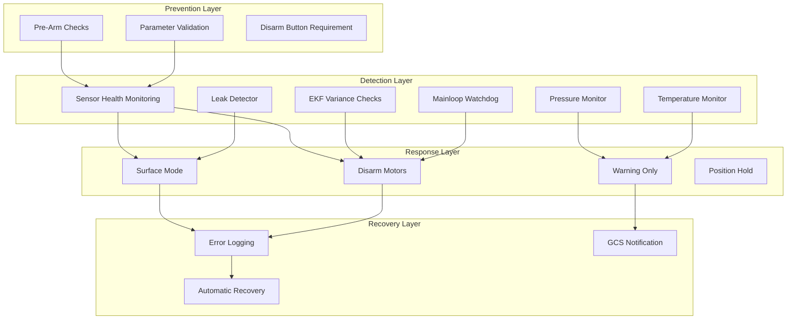
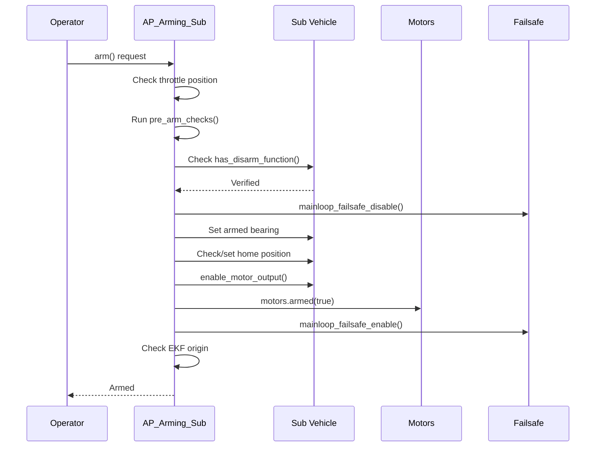
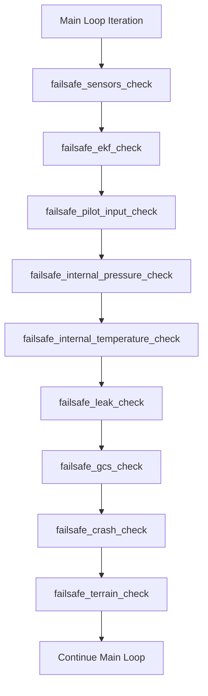

# ArduSub Safety Procedures


## Table of Contents

- [Overview](#overview)
- [Safety Architecture](#safety-architecture)
- [Failsafe Systems](#failsafe-systems)
  - [Mainloop Watchdog Failsafe](#mainloop-watchdog-failsafe)
  - [Sensor Health Failsafe](#sensor-health-failsafe)
  - [EKF Health Failsafe](#ekf-health-failsafe)
  - [Battery Failsafe](#battery-failsafe)
  - [Pilot Input Failsafe](#pilot-input-failsafe)
  - [Internal Pressure Failsafe](#internal-pressure-failsafe)
  - [Internal Temperature Failsafe](#internal-temperature-failsafe)
  - [Leak Detection Failsafe](#leak-detection-failsafe)
  - [GCS Communication Failsafe](#gcs-communication-failsafe)
  - [Crash Detection Failsafe](#crash-detection-failsafe)
  - [Terrain Data Failsafe](#terrain-data-failsafe)
  - [RC Radio Failsafe](#rc-radio-failsafe)
- [Pre-Arm Safety Checks](#pre-arm-safety-checks)
- [Emergency Procedures](#emergency-procedures)
- [Safety-Critical Code Paths](#safety-critical-code-paths)
- [Configuration Parameters](#configuration-parameters)

---

## Overview

ArduSub implements a comprehensive multi-layered safety system designed specifically for underwater remotely operated vehicles (ROVs) and autonomous underwater vehicles (AUVs). The safety architecture addresses unique underwater challenges including:

- **Communication Loss**: Underwater vehicles operate in environments with limited RF propagation
- **Depth Management**: Critical depth sensor monitoring and pressure limit enforcement
- **Leak Detection**: Water intrusion detection with immediate response protocols
- **Buoyancy Control**: Automated surface procedures for emergency situations
- **Navigation Hazards**: EKF health monitoring and terrain awareness

**Source Files**: 
- `/ArduSub/failsafe.cpp` - Failsafe detection and response implementation
- `/ArduSub/AP_Arming_Sub.cpp` - Pre-arm safety checks and arming logic
- `/ArduSub/AP_Arming_Sub.h` - Arming interface definitions
- `/ArduSub/sensors.cpp` - Sensor health monitoring

> **CRITICAL**: This documentation covers safety-critical systems. Any modifications to failsafe logic must be thoroughly tested in controlled environments before deployment.

---

## Safety Architecture

ArduSub's safety system operates on multiple independent layers:



**Design Principles**:
1. **Defense in Depth**: Multiple independent safety layers
2. **Fail-Safe Defaults**: Systems default to safe states on failure
3. **Graceful Degradation**: Progressive response escalation
4. **Operator Override**: Manual control maintained where safe
5. **Comprehensive Logging**: All safety events logged for analysis

---

## Failsafe Systems

### Mainloop Watchdog Failsafe

**Purpose**: Detect and respond to main control loop lockups that could leave the vehicle uncontrolled.

**Detection Mechanism**:
- Interrupt-driven timer check at 1kHz (source: `failsafe.cpp:29`)
- Monitors scheduler tick counter progression
- Triggers if main loop fails to execute for 2 seconds

**Implementation Details**:

```cpp
// Source: ArduSub/failsafe.cpp:29-65
void Sub::mainloop_failsafe_check()
{
    uint32_t tnow = AP_HAL::micros();
    const uint16_t ticks = scheduler.ticks();
    
    if (ticks != failsafe_last_ticks) {
        // Main loop is running normally
        failsafe_last_ticks = ticks;
        failsafe_last_timestamp = tnow;
        return;
    }
    
    // Main loop has not updated scheduler ticks
    if (!in_failsafe && failsafe_enabled && 
        tnow - failsafe_last_timestamp > 2000000) {
        in_failsafe = true;
        motors.output_min();  // Reduce to minimum thrust
        LOGGER_WRITE_ERROR(LogErrorSubsystem::CPU, LogErrorCode::FAILSAFE_OCCURRED);
    }
    
    // Disarm every second while in failsafe
    if (in_failsafe && tnow - failsafe_last_timestamp > 1000000) {
        motors.armed(false);
    }
}
```

**Failsafe Response**:
1. **Immediate**: Motors reduced to minimum output
2. **After 1 second**: Motors disarmed
3. **Continues**: Disarms every second until loop recovers or power cycle

**Enabling/Disabling**:
- Enabled automatically during normal operation (source: `failsafe.cpp:14-18`)
- Disabled during operations with expected delays (e.g., SD card writes)
- Re-enabled after arming sequence completes (source: `AP_Arming_Sub.cpp:163`)

**Recovery**:
- Automatic when scheduler ticks resume
- Error log entry created upon recovery (source: `failsafe.cpp:40`)

> **WARNING**: This failsafe operates at interrupt level and will disarm the vehicle even if the main loop is attempting recovery. This is intentional to prevent runaway conditions.

---

### Sensor Health Failsafe

**Purpose**: Monitor depth sensor health and prevent operation in modes requiring depth control when sensor fails.

**Detection Mechanism**:
- Monitors depth sensor (barometer) health status
- Requires `ap.depth_sensor_present` flag to be set
- Checks `sensor_health.depth` flag updated by barometer driver

**Implementation Details**:

```cpp
// Source: ArduSub/failsafe.cpp:67-98
void Sub::failsafe_sensors_check()
{
    if (!ap.depth_sensor_present) {
        return;  // No depth sensor configured
    }
    
    if (sensor_health.depth) {
        // Sensor healthy - clear failsafe if previously set
        if (failsafe.sensor_health) {
            LOGGER_WRITE_ERROR(LogErrorSubsystem::FAILSAFE_SENSORS, 
                             LogErrorCode::ERROR_RESOLVED);
            failsafe.sensor_health = false;
        }
        return;
    }
    
    // Sensor unhealthy - trigger failsafe once
    if (!failsafe.sensor_health) {
        failsafe.sensor_health = true;
        gcs().send_text(MAV_SEVERITY_CRITICAL, "Depth sensor error!");
        LOGGER_WRITE_ERROR(LogErrorSubsystem::FAILSAFE_SENSORS, 
                         LogErrorCode::BAD_DEPTH);
    }
}
```

**Sensor Health Update** (source: `sensors.cpp:13-15`):
```cpp
// Depth sensor health updated during barometer read
if (ap.depth_sensor_present) {
    sensor_health.depth = barometer.healthy(depth_sensor_idx);
}
```

**Failsafe Response**:
- **If in ALT_HOLD, SURFACE, or GPS-dependent mode**: Automatically switches to MANUAL mode
- **If mode switch fails**: Vehicle is disarmed as safety measure
- **GCS Notification**: Critical severity message sent to ground control

**Affected Flight Modes**:
- ALT_HOLD: Requires depth sensor for altitude holding
- SURFACE: Requires depth sensor for controlled ascent
- All GPS-dependent modes: May require depth for 3D position

**Recovery**:
- Automatic when sensor health is restored
- Error resolved log entry created
- Mode must be manually re-selected by operator

> **NOTE**: Depth sensor failure is considered critical for underwater operations. The system will not allow altitude-dependent autonomous modes without a healthy depth sensor.

---

### EKF Health Failsafe

**Purpose**: Monitor Extended Kalman Filter (EKF) health and prevent operation with poor state estimation.

**Detection Mechanism**:
- Monitors EKF velocity and compass variance
- Compares against configurable threshold (`g.fs_ekf_thresh`)
- Requires 2 consecutive seconds of bad variance to trigger

**Implementation Details**:

```cpp
// Source: ArduSub/failsafe.cpp:100-150
void Sub::failsafe_ekf_check()
{
    if (g.fs_ekf_action == FS_EKF_ACTION_DISABLED) {
        failsafe.ekf = false;
        return;
    }
    
    float posVar, hgtVar, tasVar;
    Vector3f magVar;
    float compass_variance;
    float vel_variance;
    ahrs.get_variances(vel_variance, posVar, hgtVar, magVar, tasVar);
    compass_variance = magVar.length();
    
    // Check if variances are within acceptable limits
    if (compass_variance < g.fs_ekf_thresh && 
        vel_variance < g.fs_ekf_thresh) {
        last_ekf_good_ms = AP_HAL::millis();
        failsafe.ekf = false;
        return;
    }
    
    // Require 2 seconds of bad EKF before triggering
    if (AP_HAL::millis() < last_ekf_good_ms + 2000) {
        return;
    }
    
    // Trigger failsafe once
    if (!failsafe.ekf) {
        failsafe.ekf = true;
        AP_Notify::flags.ekf_bad = true;
        LOGGER_WRITE_ERROR(LogErrorSubsystem::EKFCHECK, 
                         LogErrorCode::EKFCHECK_BAD_VARIANCE);
        gcs().send_text(MAV_SEVERITY_WARNING, "EKF bad");
    }
}
```

**Monitored Parameters**:
- **Velocity Variance**: Indicates quality of velocity estimation
- **Compass Variance**: Indicates heading estimation quality  
- **Position Variance**: Horizontal position uncertainty (retrieved but not used in threshold)
- **Height Variance**: Vertical position uncertainty (retrieved but not used in threshold)

**Failsafe Actions** (configured via `g.fs_ekf_action`):
- **FS_EKF_ACTION_DISABLED**: No action taken (monitoring only)
- **FS_EKF_ACTION_DISARM**: Immediately disarm motors

**Warning Throttling**:
- GCS warnings limited to once every 20 seconds (source: `failsafe.cpp:142`)
- Prevents message flooding during persistent EKF issues

**Recovery**:
- Automatic when variances return below threshold
- `failsafe.ekf` flag cleared
- `AP_Notify::flags.ekf_bad` cleared

> **WARNING**: EKF failures indicate the vehicle's position and velocity estimates are unreliable. Operating with poor EKF health can lead to loss of position control in autonomous modes.

---

### Battery Failsafe

**Purpose**: Monitor battery voltage and capacity, triggering protective actions before complete power loss.

**Detection Mechanism**:
- Monitored by battery library (not shown in provided source)
- Triggers callback to `handle_battery_failsafe()`
- Supports multiple severity levels (warning, critical, capacity)

**Implementation Details**:

```cpp
// Source: ArduSub/failsafe.cpp:152-168
void Sub::handle_battery_failsafe(const char* type_str, const int8_t action)
{
    LOGGER_WRITE_ERROR(LogErrorSubsystem::FAILSAFE_BATT, 
                     LogErrorCode::FAILSAFE_OCCURRED);
    
    switch((Failsafe_Action)action) {
        case Failsafe_Action_Surface:
            set_mode(Mode::Number::SURFACE, ModeReason::BATTERY_FAILSAFE);
            break;
            
        case Failsafe_Action_Disarm:
            arming.disarm(AP_Arming::Method::BATTERYFAILSAFE);
            break;
            
        case Failsafe_Action_Warn:
        case Failsafe_Action_None:
            // Logging only, no mode change
            break;
    }
}
```

**Failsafe Actions**:
- **Failsafe_Action_None**: No action, monitoring only
- **Failsafe_Action_Warn**: Log event and notify GCS
- **Failsafe_Action_Surface**: Switch to SURFACE mode for emergency ascent
- **Failsafe_Action_Disarm**: Immediately disarm motors

**Typical Configuration**:
- **Battery Low**: Failsafe_Action_Warn
- **Battery Critical**: Failsafe_Action_Surface  
- **Battery Capacity**: Failsafe_Action_Surface

**Recovery**:
- No automatic recovery - battery condition must improve manually
- Operator can override mode selection after surface action
- Disarm action requires manual re-arming

> **CRITICAL**: Battery failsafe in SURFACE mode is the recommended configuration for underwater operations. This ensures the vehicle attempts to reach the surface before complete power loss, allowing recovery of the vehicle.

---

### Pilot Input Failsafe

**Purpose**: Detect loss of manual control input from the operator and take protective action.

**Detection Mechanism**:
- Monitors time since last pilot input received
- Configurable timeout period (`g.failsafe_pilot_input_timeout`)
- Updated by manual control message handlers

**Implementation Details**:

```cpp
// Source: ArduSub/failsafe.cpp:170-197
void Sub::failsafe_pilot_input_check()
{
    if (g.failsafe_pilot_input == FS_PILOT_INPUT_DISABLED) {
        failsafe.pilot_input = false;
        return;
    }
    
    // Check if we've received pilot input within timeout period
    if (AP_HAL::millis() < failsafe.last_pilot_input_ms + 
        g.failsafe_pilot_input_timeout * 1000.0f) {
        failsafe.pilot_input = false;
        return;
    }
    
    // Trigger failsafe once
    if (!failsafe.pilot_input) {
        failsafe.pilot_input = true;
        LOGGER_WRITE_ERROR(LogErrorSubsystem::PILOT_INPUT, 
                         LogErrorCode::FAILSAFE_OCCURRED);
        gcs().send_text(MAV_SEVERITY_CRITICAL, "Lost manual control");
        
        set_neutral_controls();  // Zero all control inputs
        
        if (g.failsafe_pilot_input == FS_PILOT_INPUT_DISARM) {
            arming.disarm(AP_Arming::Method::PILOT_INPUT_FAILSAFE);
        }
    }
}
```

**Failsafe Actions** (configured via `g.failsafe_pilot_input`):
- **FS_PILOT_INPUT_DISABLED**: No action taken
- **FS_PILOT_INPUT_DISARM**: Disarm motors

**Neutral Controls**:
- All pilot control inputs set to neutral values
- Prevents last commanded inputs from continuing
- Vehicle will maintain current depth/attitude based on active mode

**Timeout Configuration**:
- Typical value: 2-5 seconds for tethered ROVs
- Longer timeouts for wireless control with expected latency
- Parameter: `g.failsafe_pilot_input_timeout` (seconds)

**Recovery**:
- Automatic when pilot input resumes
- `failsafe.pilot_input` flag cleared
- Controls respond immediately to new inputs
- If disarmed, requires manual re-arming

> **NOTE**: This failsafe is distinct from RC radio failsafe. Pilot input failsafe monitors MAVLink MANUAL_CONTROL messages, while RC failsafe monitors traditional RC receiver signals.

---

### Internal Pressure Failsafe

**Purpose**: Monitor internal electronics enclosure pressure to detect seal failures or leaks before water intrusion.

**Detection Mechanism**:
- Monitors barometer reading (in air, represents internal pressure)
- Compares against maximum threshold (`g.failsafe_pressure_max`)
- Requires 2 consecutive seconds above threshold to trigger

**Implementation Details**:

```cpp
// Source: ArduSub/failsafe.cpp:199-229
void Sub::failsafe_internal_pressure_check()
{
    if (g.failsafe_pressure == FS_PRESS_DISABLED) {
        return;
    }
    
    uint32_t tnow = AP_HAL::millis();
    static uint32_t last_pressure_warn_ms;
    static uint32_t last_pressure_good_ms;
    
    if (barometer.get_pressure(0) < g.failsafe_pressure_max) {
        last_pressure_good_ms = tnow;
        last_pressure_warn_ms = tnow;
        failsafe.internal_pressure = false;
        return;
    }
    
    // 2 seconds above threshold triggers failsafe
    if (tnow > last_pressure_good_ms + 2000) {
        failsafe.internal_pressure = true;
    }
    
    // Warn every 30 seconds
    if (failsafe.internal_pressure && 
        tnow > last_pressure_warn_ms + 30000) {
        last_pressure_warn_ms = tnow;
        gcs().send_text(MAV_SEVERITY_WARNING, "Internal pressure critical!");
    }
}
```

**Failure Modes Detected**:
- **Seal Degradation**: Gradual pressure increase as seals fail
- **Thermal Expansion**: Excessive internal heating causing pressure rise
- **Altitude Changes**: Rapid ascent causing internal overpressure

**Failsafe Response**:
- **Warning only**: No automatic mode change or disarm
- **GCS notification**: Warning every 30 seconds while condition persists
- **Logging**: Failsafe state logged for post-mission analysis

**Configuration**:
- **FS_PRESS_DISABLED**: Pressure monitoring disabled
- **g.failsafe_pressure_max**: Maximum safe internal pressure (Pascal)

**Recovery**:
- Automatic when pressure returns below threshold
- Warning messages stop
- `failsafe.internal_pressure` flag cleared

> **IMPORTANT**: Internal pressure monitoring provides early warning of seal failures. Operators should surface the vehicle and inspect seals when this failsafe triggers to prevent water intrusion and electronics damage.

---

### Internal Temperature Failsafe

**Purpose**: Monitor internal electronics enclosure temperature to detect overheating before component damage.

**Detection Mechanism**:
- Monitors barometer temperature sensor reading
- Compares against maximum threshold (`g.failsafe_temperature_max`)
- Requires 2 consecutive seconds above threshold to trigger

**Implementation Details**:

```cpp
// Source: ArduSub/failsafe.cpp:234-261
void Sub::failsafe_internal_temperature_check()
{
    if (g.failsafe_temperature == FS_TEMP_DISABLED) {
        return;
    }
    
    uint32_t tnow = AP_HAL::millis();
    static uint32_t last_temperature_warn_ms;
    static uint32_t last_temperature_good_ms;
    
    if (barometer.get_temperature(0) < g.failsafe_temperature_max) {
        last_temperature_good_ms = tnow;
        last_temperature_warn_ms = tnow;
        failsafe.internal_temperature = false;
        return;
    }
    
    // 2 seconds above threshold triggers failsafe
    if (tnow > last_temperature_good_ms + 2000) {
        failsafe.internal_temperature = true;
    }
    
    // Warn every 30 seconds
    if (failsafe.internal_temperature && 
        tnow > last_temperature_warn_ms + 30000) {
        last_temperature_warn_ms = tnow;
        gcs().send_text(MAV_SEVERITY_WARNING, 
                       "Internal temperature critical!");
    }
}
```

**Overheating Causes**:
- **Inadequate Cooling**: Insufficient water flow over enclosure
- **High Current Draw**: Motors or electronics drawing excessive power
- **Environmental**: Operating in warm water without adequate heat dissipation
- **Component Failure**: Failed electronics generating excessive heat

**Failsafe Response**:
- **Warning only**: No automatic mode change or disarm
- **GCS notification**: Warning every 30 seconds while condition persists
- **Logging**: Failsafe state logged for analysis

**Configuration**:
- **FS_TEMP_DISABLED**: Temperature monitoring disabled
- **g.failsafe_temperature_max**: Maximum safe internal temperature (°C)

**Recovery**:
- Automatic when temperature returns below threshold
- Warning messages stop
- `failsafe.internal_temperature` flag cleared

**Operator Actions**:
- Reduce motor output to lower power consumption
- Move to cooler water if environmental
- Surface and allow cooling if temperature persists
- Inspect for cooling system blockage

> **WARNING**: Persistent high temperature warnings indicate inadequate thermal management. Continued operation at elevated temperatures can lead to electronic component failure and mission loss.

---

### Leak Detection Failsafe

**Purpose**: Detect water intrusion into electronics enclosure and take immediate action to prevent total loss.

**Detection Mechanism**:
- Monitors leak detector sensor status
- Triggers immediately upon leak detection
- Independent hardware sensor for reliability

**Implementation Details**:

```cpp
// Source: ArduSub/failsafe.cpp:263-302
void Sub::failsafe_leak_check()
{
    bool status = leak_detector.get_status();
    
    // Clear failsafe if dry or disabled
    if (status == false || g.failsafe_leak == FS_LEAK_DISABLED) {
        if (failsafe.leak) {
            LOGGER_WRITE_ERROR(LogErrorSubsystem::FAILSAFE_LEAK, 
                             LogErrorCode::FAILSAFE_RESOLVED);
        }
        AP_Notify::flags.leak_detected = false;
        failsafe.leak = false;
        return;
    }
    
    AP_Notify::flags.leak_detected = status;
    uint32_t tnow = AP_HAL::millis();
    
    // Send warning every 20 seconds
    if (tnow > failsafe.last_leak_warn_ms + 20000) {
        failsafe.last_leak_warn_ms = tnow;
        gcs().send_text(MAV_SEVERITY_CRITICAL, "Leak Detected");
    }
    
    // Trigger failsafe action once
    if (!failsafe.leak) {
        failsafe.leak = true;
        LOGGER_WRITE_ERROR(LogErrorSubsystem::FAILSAFE_LEAK, 
                         LogErrorCode::FAILSAFE_OCCURRED);
        
        // Execute failsafe action if armed
        if (g.failsafe_leak == FS_LEAK_SURFACE && motors.armed()) {
            set_mode(Mode::Number::SURFACE, ModeReason::LEAK_FAILSAFE);
        }
    }
}
```

**Failsafe Actions** (configured via `g.failsafe_leak`):
- **FS_LEAK_DISABLED**: No action, monitoring only
- **FS_LEAK_SURFACE**: Switch to SURFACE mode for immediate ascent

**Visual/Audio Notification**:
- `AP_Notify::flags.leak_detected` triggers LED indicators
- Piezo buzzer activation if configured
- GCS critical severity messages every 20 seconds

**Recovery**:
- Automatic flag clearing when leak detector indicates dry
- Mode selection remains in SURFACE mode (operator must change)
- Requires physical inspection and repair before re-deployment

**Leak Detector Types**:
- Resistive sensors detecting conductivity between probes
- Typically placed at lowest point in electronics enclosure
- Multiple sensors supported for redundancy

> **CRITICAL**: Leak detection is the most critical failsafe for underwater vehicles. The SURFACE mode response is designed to bring the vehicle to the surface before water reaches critical electronics. Once a leak is detected, the vehicle should be retrieved immediately for inspection and repair.

---

### GCS Communication Failsafe

**Purpose**: Detect loss of ground control station (GCS) communication and take protective action.

**Detection Mechanism**:
- Monitors time since last GCS heartbeat message
- Tracks specific GCS system ID (MAV_GCS_SYSID parameter)
- Configurable timeout period (`g.failsafe_gcs_timeout`)

**Implementation Details**:

```cpp
// Source: ArduSub/failsafe.cpp:304-363
void Sub::failsafe_gcs_check()
{
    // Exit if GCS failsafe disabled and not already active
    if (!g.failsafe_gcs && g.failsafe_gcs == FS_GCS_DISABLED) {
        return;
    }
    
    const uint32_t gcs_last_seen_ms = gcs().sysid_mygcs_last_seen_time_ms();
    if (gcs_last_seen_ms == 0) {
        return;  // Never seen GCS, don't failsafe
    }
    
    uint32_t tnow = AP_HAL::millis();
    const uint32_t gcs_timeout_ms = 
        uint32_t(constrain_float(g.failsafe_gcs_timeout * 1000.0f, 
                                 0.0f, UINT32_MAX));
    
    // Check if GCS heartbeat is recent
    if (tnow - gcs_last_seen_ms < gcs_timeout_ms) {
        if (failsafe.gcs) {
            LOGGER_WRITE_ERROR(LogErrorSubsystem::FAILSAFE_GCS, 
                             LogErrorCode::FAILSAFE_RESOLVED);
            GCS_SEND_TEXT(MAV_SEVERITY_WARNING, "GCS Failsafe Cleared");
        }
        failsafe.gcs = false;
        return;
    }
    
    // GCS heartbeat has timed out
    
    // Warn every 30 seconds
    if (tnow - failsafe.last_gcs_warn_ms > 30000) {
        failsafe.last_gcs_warn_ms = tnow;
        gcs().send_text(MAV_SEVERITY_WARNING, 
                       "MYGCS: %u, heartbeat lost", 
                       unsigned(gcs().sysid_gcs()));
    }
    
    // Only trigger once, and only if armed
    if (failsafe.gcs || !motors.armed()) {
        return;
    }
    
    failsafe.gcs = true;
    LOGGER_WRITE_ERROR(LogErrorSubsystem::FAILSAFE_GCS, 
                     LogErrorCode::FAILSAFE_OCCURRED);
    
    // Execute failsafe action
    if (g.failsafe_gcs == FS_GCS_DISARM) {
        arming.disarm(AP_Arming::Method::GCSFAILSAFE);
    } else if (g.failsafe_gcs == FS_GCS_HOLD && motors.armed()) {
        if (!set_mode(Mode::Number::ALT_HOLD, ModeReason::GCS_FAILSAFE)) {
            arming.disarm(AP_Arming::Method::GCS_FAILSAFE_HOLDFAILED);
        }
    } else if (g.failsafe_gcs == FS_GCS_SURFACE && motors.armed()) {
        if (!set_mode(Mode::Number::SURFACE, ModeReason::GCS_FAILSAFE)) {
            arming.disarm(AP_Arming::Method::GCS_FAILSAFE_SURFACEFAILED);
        }
    }
}
```

**Failsafe Actions** (configured via `g.failsafe_gcs`):
- **FS_GCS_DISABLED**: No action taken
- **FS_GCS_HOLD**: Switch to ALT_HOLD mode (maintain depth)
- **FS_GCS_SURFACE**: Switch to SURFACE mode (ascend to surface)
- **FS_GCS_DISARM**: Immediately disarm motors

**Fallback Behavior**:
- If mode switch to ALT_HOLD fails, vehicle is disarmed
- If mode switch to SURFACE fails, vehicle is disarmed
- Ensures safe outcome even if mode transition fails

**Configuration**:
- **g.failsafe_gcs_timeout**: Timeout in seconds (typical: 5-10 seconds)
- **MAV_GCS_SYSID**: System ID of primary ground control station

**Recovery**:
- Automatic when GCS heartbeat resumes
- Mode selection remains (operator can change modes)
- If disarmed, requires manual re-arming

> **NOTE**: GCS failsafe is critical for autonomous operations. For tethered ROV operations, SURFACE mode is recommended. For untethered AUV operations, ALT_HOLD may be preferable to maintain mission depth while attempting to re-establish communications.

---

### Crash Detection Failsafe

**Purpose**: Detect vehicle crashes or inversions and prevent continued motor operation in dangerous orientations.

**Detection Mechanism**:
- Monitors attitude error magnitude
- Requires angle error exceeding 30° beyond maximum
- Requires 2 consecutive seconds above threshold

**Implementation Details**:

```cpp
// Source: ArduSub/failsafe.cpp:365-421
#define CRASH_CHECK_TRIGGER_MS          2000    // 2 seconds
#define CRASH_CHECK_ANGLE_DEVIATION_DEG 30.0f   // 30 degrees

void Sub::failsafe_crash_check()
{
    static uint32_t last_crash_check_pass_ms;
    uint32_t tnow = AP_HAL::millis();
    
    // Return if disarmed or disabled
    if (!motors.armed() || g.fs_crash_check == FS_CRASH_DISABLED) {
        last_crash_check_pass_ms = tnow;
        failsafe.crash = false;
        return;
    }
    
    // Don't check in ACRO or MANUAL modes
    if (control_mode == Mode::Number::ACRO || 
        control_mode == Mode::Number::MANUAL) {
        last_crash_check_pass_ms = tnow;
        failsafe.crash = false;
        return;
    }
    
    // Check for excessive angle error
    const float angle_error = attitude_control.get_att_error_angle_deg();
    if (angle_error <= CRASH_CHECK_ANGLE_DEVIATION_DEG) {
        last_crash_check_pass_ms = tnow;
        failsafe.crash = false;
        return;
    }
    
    // Require 2 seconds of excessive angle error
    if (tnow < last_crash_check_pass_ms + CRASH_CHECK_TRIGGER_MS) {
        return;
    }
    
    // Crash detected - warn every 20 seconds
    if (tnow > failsafe.last_crash_warn_ms + 20000) {
        failsafe.last_crash_warn_ms = tnow;
        gcs().send_text(MAV_SEVERITY_WARNING, "Crash detected");
    }
    
    // Trigger failsafe once
    if (!failsafe.crash) {
        failsafe.crash = true;
        LOGGER_WRITE_ERROR(LogErrorSubsystem::CRASH_CHECK, 
                         LogErrorCode::CRASH_CHECK_CRASH);
        
        if (g.fs_crash_check == FS_CRASH_DISARM) {
            arming.disarm(AP_Arming::Method::CRASH);
        }
    }
}
```

**Crash Indicators**:
- Attitude error exceeding 30° from commanded attitude
- Sustained for 2+ seconds
- Only in stabilized flight modes (STABILIZE, ALT_HOLD, etc.)

**Modes Excluded from Crash Detection**:
- **MANUAL**: Operator has full control, no attitude stabilization
- **ACRO**: Acrobatic mode allows intentional extreme attitudes

**Failsafe Actions** (configured via `g.fs_crash_check`):
- **FS_CRASH_DISABLED**: No crash detection
- **FS_CRASH_DISARM**: Disarm motors immediately

**False Positive Prevention**:
- 2-second persistence requirement prevents transient spikes
- Excluded from manual/acro modes where extreme attitudes expected
- Uses attitude error, not absolute attitude (accounts for mode intent)

**Recovery**:
- No automatic recovery (crash is considered persistent condition)
- Requires manual disarm/rearm cycle
- Vehicle should be inspected for damage before re-arming

> **WARNING**: Crash detection will not prevent the initial crash - it prevents continued motor operation after a crash is detected. The 2-second delay means motors will continue running briefly after impact.

---

### Terrain Data Failsafe

**Purpose**: Detect loss of terrain data during autonomous missions using terrain-relative altitudes.

**Detection Mechanism**:
- Monitors terrain data availability during AUTO/GUIDED modes
- Triggers after 5 seconds of persistent terrain data loss
- Only active when mission uses ALT_ABOVE_TERRAIN frame

**Implementation Details**:

```cpp
// Source: ArduSub/failsafe.cpp:423-500
#define FS_TERRAIN_TIMEOUT_MS 5000  // 5 seconds

void Sub::failsafe_terrain_check()
{
    // Trigger after 5 seconds of failures in AUTO or GUIDED
    bool valid_mode = (control_mode == Mode::Number::AUTO || 
                      control_mode == Mode::Number::GUIDED);
    bool timeout = (failsafe.terrain_last_failure_ms - 
                   failsafe.terrain_first_failure_ms) > FS_TERRAIN_TIMEOUT_MS;
    bool trigger_event = valid_mode && timeout;
    
    // Check for state change
    if (trigger_event != failsafe.terrain) {
        if (trigger_event) {
            gcs().send_text(MAV_SEVERITY_CRITICAL, 
                          "Failsafe terrain triggered");
            failsafe_terrain_on_event();
        } else {
            LOGGER_WRITE_ERROR(LogErrorSubsystem::FAILSAFE_TERRAIN, 
                             LogErrorCode::ERROR_RESOLVED);
            failsafe.terrain = false;
        }
    }
}

void Sub::failsafe_terrain_set_status(bool data_ok)
{
    uint32_t now = AP_HAL::millis();
    
    if (!data_ok) {
        failsafe.terrain_last_failure_ms = now;
        if (failsafe.terrain_first_failure_ms == 0) {
            failsafe.terrain_first_failure_ms = now;
        }
    } else {
        // Clear after 0.1 seconds of successes
        if (now - failsafe.terrain_last_failure_ms > 100) {
            failsafe.terrain_last_failure_ms = 0;
            failsafe.terrain_first_failure_ms = 0;
        }
    }
}

void Sub::failsafe_terrain_on_event()
{
    failsafe.terrain = true;
    LOGGER_WRITE_ERROR(LogErrorSubsystem::FAILSAFE_TERRAIN, 
                     LogErrorCode::FAILSAFE_OCCURRED);
    
    // Attempt automatic recovery with rangefinder
    if (!rangefinder_state.enabled || 
        !sub.mode_auto.auto_terrain_recover_start()) {
        failsafe_terrain_act();  // Recovery failed, take action
    }
}

void Sub::failsafe_terrain_act()
{
    switch (g.failsafe_terrain) {
    case FS_TERRAIN_HOLD:
        if (!set_mode(Mode::Number::POSHOLD, ModeReason::TERRAIN_FAILSAFE)) {
            set_mode(Mode::Number::ALT_HOLD, ModeReason::TERRAIN_FAILSAFE);
        }
        break;
        
    case FS_TERRAIN_SURFACE:
        set_mode(Mode::Number::SURFACE, ModeReason::TERRAIN_FAILSAFE);
        break;
        
    case FS_TERRAIN_DISARM:
    default:
        arming.disarm(AP_Arming::Method::TERRAINFAILSAFE);
    }
}
```

**Terrain Data Sources**:
- Pre-loaded terrain database
- Rangefinder for real-time terrain following
- SRTM elevation data (for surface operations)

**Automatic Recovery**:
- If rangefinder is enabled and healthy, attempts recovery
- Switches to rangefinder-based terrain following
- Falls back to configured action if recovery fails

**Failsafe Actions** (configured via `g.failsafe_terrain`):
- **FS_TERRAIN_HOLD**: Switch to POSHOLD (or ALT_HOLD if POSHOLD unavailable)
- **FS_TERRAIN_SURFACE**: Switch to SURFACE mode
- **FS_TERRAIN_DISARM**: Immediately disarm motors

**Recovery**:
- Automatic when terrain data becomes available again
- Rangefinder recovery allows mission continuation
- Mode change recovery requires operator intervention

> **NOTE**: Terrain failsafe is primarily relevant for surface vehicles or AUVs operating near the bottom. Underwater ROVs typically use absolute depth rather than terrain-relative altitudes.

---

### RC Radio Failsafe

**Purpose**: Detect loss of RC receiver signal and take protective action.

**Detection Mechanism**:
- Monitors RC receiver signal validity
- Triggered by RC library when signal loss detected
- Separate from pilot input (MAVLink) failsafe

**Implementation Details**:

```cpp
// Source: ArduSub/failsafe.cpp:502-554
void Sub::set_failsafe_radio(bool b)
{
    // Only act on changes
    if (failsafe.radio != b) {
        failsafe.radio = b;
        
        if (failsafe.radio == false) {
            failsafe_radio_off_event();  // Signal recovered
        } else {
            failsafe_radio_on_event();   // Signal lost
        }
        
        AP_Notify::flags.failsafe_radio = b;
    }
}

void Sub::failsafe_radio_on_event()
{
    LOGGER_WRITE_ERROR(LogErrorSubsystem::FAILSAFE_RADIO, 
                     LogErrorCode::FAILSAFE_OCCURRED);
    gcs().send_text(MAV_SEVERITY_WARNING, "RC Failsafe");
    
    switch(g.failsafe_throttle) {
    case FS_THR_SURFACE:
        set_mode(Mode::Number::SURFACE, ModeReason::RADIO_FAILSAFE);
        break;
        
    case FS_THR_WARN:
        set_neutral_controls();  // Zero control inputs
        break;
        
    case FS_THR_DISABLED:
        // No action
        break;
    }
}

void Sub::failsafe_radio_off_event()
{
    LOGGER_WRITE_ERROR(LogErrorSubsystem::FAILSAFE_RADIO, 
                     LogErrorCode::FAILSAFE_RESOLVED);
    gcs().send_text(MAV_SEVERITY_WARNING, "Radio Failsafe Cleared");
    // Operator can now override controls
}
```

**Failsafe Actions** (configured via `g.failsafe_throttle`):
- **FS_THR_DISABLED**: No action taken
- **FS_THR_WARN**: Set all controls to neutral, log warning
- **FS_THR_SURFACE**: Switch to SURFACE mode

**RC Signal Detection**:
- Handled by AP_RC library (platform-specific)
- Detects loss of PPM/SBUS/other RC protocols
- Separate timeout from individual channel failsafe values

**Recovery**:
- Automatic when RC signal is restored
- Control immediately returns to operator
- Mode selection remains (SURFACE mode must be manually changed)

**Distinction from Pilot Input Failsafe**:
- **RC Failsafe**: Traditional RC receiver signal loss
- **Pilot Input Failsafe**: MAVLink MANUAL_CONTROL message timeout
- Both can be active simultaneously for different control paths

> **NOTE**: Most modern ArduSub installations use MAVLink for control (joysticks via companion computer), making RC radio failsafe less relevant. However, it remains important for traditional RC-controlled configurations.

---

## Pre-Arm Safety Checks

Pre-arm checks prevent arming the vehicle when unsafe conditions exist. All checks must pass before motors can be armed.

### Disarm Button Requirement

**Purpose**: Ensure operator has a method to disarm motors in emergency situations.

**Implementation** (source: `AP_Arming_Sub.cpp:15-49`):

```cpp
bool AP_Arming_Sub::has_disarm_function() const {
    bool has_shift_function = false;
    
    // Check standard button functions
    for (uint8_t i = 0; i < 16; i++) {
        switch (sub.get_button(i)->function(false)) {
            case JSButton::k_shift:
                has_shift_function = true;
                break;
            case JSButton::k_arm_toggle:
            case JSButton::k_disarm:
                return true;
        }
    }
    
    // Check shift functions if shift button exists
    if (has_shift_function) {
        for (uint8_t i = 0; i < 16; i++) {
            switch (sub.get_button(i)->function(true)) {
                case JSButton::k_arm_toggle:
                case JSButton::k_disarm:
                    return true;
            }
        }
    }
    
    // Check AUX function channels
    if (rc().find_channel_for_option(RC_Channel::AUX_FUNC::MOTOR_ESTOP) || 
        rc().find_channel_for_option(RC_Channel::AUX_FUNC::DISARM) || 
        rc().find_channel_for_option(RC_Channel::AUX_FUNC::ARMDISARM) || 
        rc().find_channel_for_option(RC_Channel::AUX_FUNC::ARM_EMERGENCY_STOP)) {
        return true;
    }
    
    return false;
}
```

**Acceptable Disarm Methods**:
- **Dedicated disarm button**: JSButton::k_disarm
- **Arm/disarm toggle button**: JSButton::k_arm_toggle  
- **Shift + button**: Shifted button functions
- **RC AUX functions**: MOTOR_ESTOP, DISARM, ARMDISARM, ARM_EMERGENCY_STOP

**Check Failure**:
```
"Must assign a disarm or arm_toggle button or disarm aux function"
```

> **CRITICAL**: This check prevents situations where the operator cannot disarm the vehicle in an emergency. All underwater vehicles must have a readily accessible disarm function.

### RC Calibration Checks

**Purpose**: Verify RC channels are properly calibrated before allowing armed operation.

**Implementation** (source: `AP_Arming_Sub.cpp:4-13`):

```cpp
bool AP_Arming_Sub::rc_calibration_checks(bool display_failure)
{
    const RC_Channel *channels[] = {
        sub.channel_roll,
        sub.channel_pitch,
        sub.channel_throttle,
        sub.channel_yaw
    };
    return rc_checks_copter_sub(display_failure, channels);
}
```

**Verified Channels**:
- Roll channel
- Pitch channel
- Throttle channel  
- Yaw channel

**Validation Criteria**:
- Channel minimum/maximum values properly set
- Channel trims within reasonable range
- No reversed channels (unless intentional)
- Sufficient control range

### Inertial Navigation System Checks

**Purpose**: Verify IMU and AHRS are healthy and properly initialized.

**Implementation** (source: `AP_Arming_Sub.cpp:65-82`):

```cpp
bool AP_Arming_Sub::ins_checks(bool display_failure)
{
    // Call parent class checks (IMU calibration, consistency, etc.)
    if (!AP_Arming::ins_checks(display_failure)) {
        return false;
    }
    
    // Additional Sub-specific AHRS checks
    if (check_enabled(Check::INS)) {
        char failure_msg[50] = {};
        if (!AP::ahrs().pre_arm_check(false, failure_msg, 
                                      sizeof(failure_msg))) {
            check_failed(Check::INS, display_failure, 
                        "AHRS: %s", failure_msg);
            return false;
        }
    }
    
    return true;
}
```

**Parent Class Checks** (from AP_Arming):
- IMU calibration completed
- IMU temperature within operating range
- Accelerometer consistency across multiple IMUs
- Gyroscope consistency across multiple IMUs
- IMU sampling rate adequate

**AHRS-Specific Checks**:
- Attitude estimation initialized
- EKF initialized if enabled
- Compass calibration if using compass
- Home position set or EKF origin configured

### Throttle Position Check

**Purpose**: Ensure throttle is centered before arming (configurable).

**Implementation** (source: `AP_Arming_Sub.cpp:95-107`):

```cpp
// Only checked if RC options enabled for throttle check
// and arming position set to WITHIN_THR_TRIM
if (check_enabled(Check::RC) &&
    rc().option_is_enabled(RC_Channels::Option::ARMING_CHECK_THROTTLE) &&
    (sub.g.thr_arming_position == WITHIN_THR_TRIM)) {
    
    if (!sub.channel_throttle->in_trim_dz()) {
       check_failed(Check::RC, true, 
                   "Throttle not centered/close to trim");
       return false;
    }
}
```

**Configuration**:
- Requires RC_OPTIONS bit for ARMING_CHECK_THROTTLE
- Requires THR_ARMING_POSITION = WITHIN_THR_TRIM
- Verifies throttle within deadzone of trim position

**Rationale**:
- Prevents unexpected vehicle motion upon arming
- Ensures operator has neutral control position
- Particularly important for vehicles with non-zero neutral buoyancy

### EKF Origin Check

**Purpose**: Ensure Extended Kalman Filter has a valid origin for position estimation.

**Implementation** (source: `AP_Arming_Sub.cpp:172-178`):

```cpp
// Checked during arming sequence, after motors are armed
if (!sub.ensure_ekf_origin()) {
    gcs().send_text(MAV_SEVERITY_WARNING, 
                   "Compass performance degraded");
    if (check_enabled(Check::PARAMETERS)) {
        check_failed(Check::PARAMETERS, true, 
                    "No world position, check ORIGIN_* parameters");
        return false;
    }
}
```

**Origin Sources**:
- GPS position (if GPS available and healthy)
- Manually set ORIGIN_LAT, ORIGIN_LON, ORIGIN_ALT parameters
- Default (0,0,0) - limited functionality

**Impact of Missing Origin**:
- Compass declination incorrect (WMM tables unavailable)
- Position estimation may be degraded
- Some autonomous modes may not function correctly

> **NOTE**: ArduSub can operate without an EKF origin for depth-only control, but autonomous navigation and compass performance will be compromised.

### Standard Pre-Arm Checks

ArduSub inherits additional pre-arm checks from the AP_Arming base class:

**Sensor Checks**:
- Barometer healthy and calibrated
- Compass healthy and calibrated (if enabled)
- GPS healthy (if required by mode)
- Rangefinder healthy (if enabled)
- Optical flow healthy (if enabled)

**System Checks**:
- Battery voltage above minimum
- Board voltage within operating range
- Safety switch engaged (if configured)
- Logging system functional (if required)

**Configuration Checks**:
- AHRS orientation correct
- Frame type configured
- Motor configuration valid
- Servo ranges configured

**Mission Checks** (if starting in AUTO mode):
- Valid mission loaded
- Mission has at least one command
- Mission doesn't start with unsupported command

---

## Emergency Procedures

### Loss of Depth Sensor

**Symptoms**:
- "Depth sensor error!" message on GCS
- Automatic mode switch to MANUAL
- ALT_HOLD and SURFACE modes unavailable

**Immediate Actions**:
1. **Verify mode switch**: Confirm vehicle is in MANUAL mode
2. **Assess vehicle state**: Check current depth and orientation
3. **Manual depth control**: Use throttle to maintain/change depth manually
4. **Plan ascent**: Prepare for manual ascent to surface

**Continued Operation**:
- MANUAL mode allows continued operation
- ACRO mode available for attitude control
- No altitude-hold or depth-keeping functionality
- Operator must manually control depth continuously

**Troubleshooting** (source: `sensors.cpp:13-15`):
- Depth sensor health updated from barometer
- Check barometer calibration
- Verify no air bubbles in pressure sensor port
- Check for sensor hardware failure

**Recovery**:
- Surface vehicle for inspection
- Recalibrate barometer at surface
- Replace barometer if hardware failure
- Test in shallow water before deep operations

### Loss of Communication

**GCS Communication Loss**:

**Automatic Response** (depends on configuration):
- **FS_GCS = HOLD**: Switch to ALT_HOLD, maintain depth
- **FS_GCS = SURFACE**: Switch to SURFACE, ascend to surface
- **FS_GCS = DISARM**: Motors disarm immediately

**Operator Actions**:
- **If SURFACE mode activated**: Wait for vehicle at surface
- **If ALT_HOLD activated**: Attempt to re-establish communication
- **If unknown**: Assume SURFACE mode, move to last known position

**Re-establishment**:
- Communication resumes automatically when signal restored
- Vehicle remains in failsafe mode until operator changes mode
- Check for communication equipment damage if recurring

**Pilot Input Loss** (MAVLink control):

**Automatic Response**:
- Neutral controls set (vehicle holds attitude/depth per mode)
- **If FS_PILOT_INPUT = DISARM**: Motors disarm after timeout

**Prevention**:
- Regularly monitor communication quality
- Set appropriate timeout for environment (FS_PILOT_INPUT_TIMEOUT)
- Test communication range before operations
- Have alternate control method available

### Loss of Vehicle Control

**Symptoms**:
- Vehicle not responding to control inputs
- Uncommanded motion
- Excessive attitude errors
- "Crash detected" warnings

**Immediate Actions**:
1. **Attempt disarm**: Use designated disarm button/switch
2. **Mode change**: Try switching to MANUAL mode
3. **Emergency stop**: Use AUX function if configured (MOTOR_ESTOP)
4. **Wait for failsafe**: Crash detection will disarm after 2 seconds

**Failsafe Intervention**:
- Crash detection activates if angle error > 30° for 2 seconds
- Automatic disarm if FS_CRASH_CHECK = DISARM
- Mainloop watchdog disarms if control loop locks up

**Recovery**:
1. **Disarm**: Ensure vehicle is fully disarmed
2. **Assess condition**: Check for physical damage or entanglement
3. **Identify cause**: Review logs for failure mode
4. **Test systems**: Verify sensor and control system health
5. **Controlled re-arm**: Test in safe area before resuming operations

### Leak Detection Response

**Automatic Response** (if FS_LEAK = SURFACE):
1. **Immediate notification**: "Leak Detected" critical message
2. **Mode switch**: Automatic switch to SURFACE mode
3. **Ascent begins**: Vehicle ascends to surface
4. **Continued warnings**: Critical message every 20 seconds

**Operator Actions**:
1. **Monitor ascent**: Verify vehicle is ascending normally
2. **Prepare for recovery**: Move to expected surface location
3. **Visual acquisition**: Look for vehicle at surface
4. **Immediate retrieval**: Recover vehicle as quickly as possible
5. **Power off**: Remove power to prevent further water damage

**Post-Leak Procedures**:
1. **Inspect seals**: Check all O-rings and sealing surfaces
2. **Dry electronics**: Immediately rinse with fresh water, dry thoroughly
3. **Damage assessment**: Test electronics for water damage
4. **Repair/replace**: Replace damaged components
5. **Pressure test**: Verify enclosure integrity before re-deployment

> **CRITICAL**: Water intrusion can cause rapid electronics failure. Minutes matter - retrieve the vehicle immediately and power off to minimize damage.

### Emergency Surface Procedure

**When to Emergency Surface**:
- Leak detected
- Battery critically low
- Loss of critical sensors
- Equipment malfunction
- Uncertainty about vehicle state

**Manual Emergency Surface**:
1. **Switch to SURFACE mode**: Use mode selector
2. **Verify ascent**: Check depth decreasing
3. **Monitor attitude**: Ensure vehicle remains upright
4. **Reduce speed if needed**: Lower SURFACE climb rate if unstable

**Automatic Emergency Surface**:
- Triggered by leak, battery, or GCS failsafe
- Vehicle ascends at configured SURFACE rate
- No operator intervention required
- Operator can override mode if needed

**Surface Arrival**:
1. **Switch to MANUAL**: Take manual control at surface
2. **Maintain position**: Use lateral thrust to hold station
3. **Prepare recovery**: Deploy recovery equipment
4. **Disarm**: Disarm motors before physical contact

**Configuration Parameters**:
- **SURFACE_SPEED**: Ascent rate in cm/s (default: 50 cm/s)
- **SURFACE_ANGLE**: Maximum pitch angle during ascent

---

## Safety-Critical Code Paths

### Initialization Sequence

**Arming Sequence** (source: `AP_Arming_Sub.cpp:84-181`):



**Critical Steps**:
1. **Disable mainloop failsafe**: Prevents timeout during initialization
2. **Set initial bearing**: Records heading at arm time
3. **Enable motor output**: HAL layer enables PWM outputs
4. **Arm motors**: Motor library enables output
5. **Re-enable failsafe**: Resumes watchdog monitoring

### Failsafe Detection Loop

**Main Loop Integration** (runs at main loop rate, typically 50Hz):



**Execution Order**:
1. Sensor health (depth sensor)
2. EKF health (variance checks)
3. Pilot input timeout
4. Internal pressure monitoring
5. Internal temperature monitoring
6. Leak detection
7. GCS communication
8. Crash detection
9. Terrain data availability

**Interrupt-Level Checks**:
- **Mainloop watchdog**: Runs at 1kHz from timer interrupt
- **RC failsafe**: Triggered by RC library when signal lost

### Mode Transition Safety

**Mode Switch Validation**:
- Pre-conditions checked before mode allowed
- Depth sensor required for ALT_HOLD, SURFACE
- GPS required for POSHOLD, AUTO, GUIDED (if configured)
- EKF health required for GPS-dependent modes

**Failsafe Mode Transitions**:
- Higher priority failsafes can override lower priority
- Mode switch failures result in disarm (safe default)
- Manual mode always available as fallback

### Motor Output Safety Chain

**Output Path**:
```
Pilot Input/Auto → Mode Logic → Attitude Controller → Motor Mixer → Safety Checks → PWM Output
```

**Safety Gates**:
1. **Armed check**: Motors only output if armed flag set
2. **Failsafe check**: Motor output reduced/disabled in failsafe
3. **Throttle limits**: Software limits prevent excessive thrust
4. **Rate limits**: Prevents sudden motor speed changes
5. **Hardware PWM**: Final hardware-level output limiting

---

## Configuration Parameters

### Failsafe Configuration

| Parameter | Description | Default | Range | Critical |
|-----------|-------------|---------|-------|----------|
| `FS_EKF_ACTION` | EKF failsafe action | Disabled | 0=Disabled, 1=Disarm | Yes |
| `FS_EKF_THRESH` | EKF variance threshold | 0.8 | 0.0-1.0 | Yes |
| `FS_PILOT_INPUT` | Pilot input failsafe | Disabled | 0=Disabled, 1=Disarm | Yes |
| `FS_PILOT_INPUT_TIMEOUT` | Pilot input timeout | 3.0s | 0.1-10.0s | Yes |
| `FS_PRESS_MAX` | Maximum internal pressure | 105000 Pa | 0-200000 Pa | No |
| `FS_TEMP_MAX` | Maximum internal temp | 62°C | 0-100°C | No |
| `FS_LEAK` | Leak failsafe action | Disabled | 0=Disabled, 1=Surface | Yes |
| `FS_GCS` | GCS failsafe action | Disabled | 0=Disabled, 1=Warn, 2=Disarm, 3=Hold, 4=Surface | Yes |
| `FS_GCS_TIMEOUT` | GCS timeout period | 5.0s | 0.1-120.0s | Yes |
| `FS_CRASH_CHECK` | Crash detection | Disabled | 0=Disabled, 1=Disarm | Yes |
| `FS_TERRAIN` | Terrain failsafe action | Disarm | 0=Disarm, 1=Hold, 2=Surface | Yes |
| `FS_THR` | RC throttle failsafe | Disabled | 0=Disabled, 1=Warn, 2=Surface | Yes |

### Recommended Configurations

**Tethered ROV** (operator controlled, reliable communication):
```
FS_EKF_ACTION = 0 (Disabled)
FS_PILOT_INPUT = 1 (Disarm)
FS_PILOT_INPUT_TIMEOUT = 3.0
FS_LEAK = 1 (Surface)
FS_GCS = 4 (Surface)
FS_GCS_TIMEOUT = 5.0
FS_CRASH_CHECK = 1 (Disarm)
```

**Autonomous AUV** (untethered, intermittent communication):
```
FS_EKF_ACTION = 1 (Disarm)
FS_EKF_THRESH = 0.8
FS_PILOT_INPUT = 0 (Disabled)
FS_LEAK = 1 (Surface)
FS_GCS = 3 (Hold)
FS_GCS_TIMEOUT = 30.0
FS_CRASH_CHECK = 1 (Disarm)
FS_TERRAIN = 2 (Surface)
```

**Inspection ROV** (close-range work, high reliability needed):
```
FS_EKF_ACTION = 1 (Disarm)
FS_PILOT_INPUT = 1 (Disarm)
FS_PILOT_INPUT_TIMEOUT = 2.0
FS_PRESS_MAX = 105000
FS_TEMP_MAX = 60
FS_LEAK = 1 (Surface)
FS_GCS = 4 (Surface)
FS_GCS_TIMEOUT = 3.0
FS_CRASH_CHECK = 1 (Disarm)
```

### Arming Check Configuration

| Parameter | Description | Default | Impact |
|-----------|-------------|---------|--------|
| `ARMING_CHECK` | Bitmask of enabled checks | All | Controls which pre-arm checks are enforced |
| `THR_ARMING_POSITION` | Throttle position for arming | Any | 0=Any, 1=Within trim |
| `RC_OPTIONS` | RC options bitmask | 0 | Bit enables throttle arming check |

**ARMING_CHECK Bits**:
- Bit 0: All checks
- Bit 1: Barometer
- Bit 2: Compass
- Bit 3: GPS
- Bit 4: INS (IMU/AHRS)
- Bit 5: Parameters
- Bit 6: RC channels
- Bit 7: Board voltage
- Bit 8: Battery
- Bit 10: Logging
- Bit 11: Safety switch
- Bit 12: GPS configuration

> **WARNING**: Disabling arming checks reduces safety margins. Only disable specific checks when absolutely necessary and with full understanding of the risks.

---

## Testing and Validation

### Failsafe Testing Procedures

**Before Each Mission**:
1. **Test disarm button**: Verify emergency disarm functions
2. **Verify leak detector**: Test with wet probe
3. **Check GCS link**: Verify communication quality
4. **Test mode switches**: Verify all required modes accessible

**Periodic Testing** (monthly or after modifications):
1. **GCS failsafe**: Disconnect GCS, verify configured action
2. **Pilot input failsafe**: Stop sending control, verify timeout
3. **Leak failsafe**: Simulate leak, verify SURFACE mode activation
4. **Depth sensor failsafe**: Cover sensor, verify mode restrictions
5. **Crash detection**: Create attitude error, verify response

**Test Environment**:
- Shallow, controlled environment (< 2m depth)
- Clear water with good visibility
- Tether secured for manual recovery
- Safety divers available if needed

### Safety System Validation

**Pre-Deployment Checklist**:
- [ ] All failsafe parameters configured appropriately
- [ ] Disarm button tested and accessible
- [ ] Leak detector tested and operational
- [ ] Depth sensor calibrated and healthy
- [ ] Communication link tested with margin
- [ ] Battery capacity sufficient for mission + reserve
- [ ] Emergency surface procedure reviewed
- [ ] Recovery equipment prepared

**Post-Mission Review**:
- [ ] Review logs for any failsafe triggers
- [ ] Check internal pressure/temperature trends
- [ ] Verify no water intrusion
- [ ] Inspect seals and pressure housing
- [ ] Test electronics functionality
- [ ] Update maintenance logs

---

## Logging and Diagnostics

### Failsafe Event Logging

All failsafe events are logged with the following information:
- **Subsystem**: Which failsafe triggered (source: LogErrorSubsystem enum)
- **Error Code**: Specific error condition (source: LogErrorCode enum)
- **Timestamp**: Precise timing of event
- **Vehicle State**: Mode, armed status, position

**Log Messages**:
- `LOGGER_WRITE_ERROR(Subsystem, Code)`: Records failsafe event
- Resolution events also logged when failsafe clears

### GCS Telemetry

**Severity Levels**:
- **MAV_SEVERITY_CRITICAL**: Immediate safety threats (leak, sensor loss)
- **MAV_SEVERITY_WARNING**: Important notifications (EKF degraded, timeouts)
- **MAV_SEVERITY_INFO**: Status updates (failsafe cleared)

**Message Throttling**:
- Critical messages repeated at intervals (leak: 20s, pressure: 30s)
- Prevents message flooding while maintaining awareness
- Last message timestamp tracked per failsafe type

### Diagnostic Tools

**Real-Time Monitoring**:
- GCS display of failsafe status flags
- Audio/visual notifications on AP_Notify devices
- LED patterns indicating failsafe conditions

**Post-Flight Analysis**:
- DataFlash log analysis for failsafe triggers
- EKF variance plots over time
- Sensor health trending
- Communication quality metrics

---

## References

### Source Code

- **Primary**: `/ArduSub/failsafe.cpp` - All failsafe detection and response logic
- **Arming**: `/ArduSub/AP_Arming_Sub.cpp`, `/ArduSub/AP_Arming_Sub.h` - Pre-arm checks
- **Sensors**: `/ArduSub/sensors.cpp` - Sensor health monitoring

### Related Documentation

- ArduSub Vehicle Architecture: `/ArduSub/README.md`
- Flight Modes: `/ArduSub/docs/FLIGHT_MODES.md`
- Parameter Reference: [https://www.ardupilot.org/ardusub/](https://www.ardupilot.org/ardusub/)
- MAVLink Protocol: `/libraries/GCS_MAVLink/README.md`

### Safety Standards

- **IEC 61508**: Functional safety of electrical/electronic systems
- **ISO 13849**: Safety of machinery - Safety-related parts of control systems
- **DO-178C**: Software considerations in airborne systems (principles applicable)

---

## Revision History

| Version | Date | Changes | Author |
|---------|------|---------|--------|
| 1.0 | 2024 | Initial comprehensive safety documentation | ArduPilot Team |

---

**Document Classification**: Safety Critical
**Review Required**: Before any modifications to failsafe systems
**Distribution**: All ArduSub developers and operators

---

*This documentation is part of the ArduPilot project and is distributed under the GPLv3 license.*

