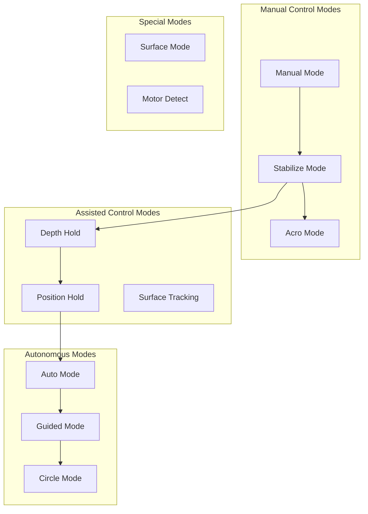

# ArduSub Underwater Operations Guide


## Table of Contents

- [Overview](#overview)
- [Flight Modes](#flight-modes)
- [Joystick Control System](#joystick-control-system)
- [Button Functions](#button-functions)
- [Actuator Control](#actuator-control)
- [Camera and Lighting](#camera-and-lighting)
- [Ground Control Station Integration](#ground-control-station-integration)
- [Mission Planning](#mission-planning)
- [Operational Procedures](#operational-procedures)
- [Troubleshooting](#troubleshooting)

## Overview

ArduSub is a comprehensive autopilot system designed specifically for Remotely Operated Vehicles (ROVs) and Autonomous Underwater Vehicles (AUVs). This guide provides detailed operational procedures for underwater operations including vehicle control, mission planning, and system integration.

**Primary Source Files:**
- `/ArduSub/joystick.cpp` - Joystick and gamepad input handling
- `/ArduSub/mode.cpp` - Flight mode management
- `/ArduSub/mode_*.cpp` - Individual flight mode implementations
- `/ArduSub/actuators.cpp` - Auxiliary actuator control
- `/ArduSub/GCS_MAVLink_Sub.cpp` - Ground control station communication

### Key Capabilities

- **6-DOF Control**: Full six degrees of freedom movement (surge, sway, heave, roll, pitch, yaw)
- **Multiple Flight Modes**: Manual, Stabilize, Acro, Depth Hold, Position Hold, Auto, Guided, Circle
- **32-Button Support**: Extended gamepad control with shift functionality
- **Actuator Integration**: Grippers, lights, cameras, relays up to 6 auxiliary channels
- **MAVLink Communication**: Full ground control station integration
- **Scripting Support**: Custom button behaviors via AP_Scripting

---

## Flight Modes

ArduSub supports multiple flight modes optimized for underwater operations. Each mode provides different levels of pilot control and autopilot assistance. Mode transitions are managed through the flight mode state machine in `/ArduSub/mode.cpp`.

### Flight Mode Architecture



### Mode Descriptions

#### MANUAL Mode
**Source**: `/ArduSub/mode_manual.cpp`

Direct passthrough mode with no stabilization. Pilot inputs directly control thruster outputs.

**Characteristics:**
- No attitude stabilization
- No depth hold
- Minimal autopilot intervention
- Direct motor control from joystick inputs

**Control Mapping:**
```cpp
// Source: mode_manual.cpp:29-34
motors.set_roll(channel_roll->norm_input());
motors.set_pitch(channel_pitch->norm_input());
motors.set_yaw(channel_yaw->norm_input() * g.acro_yaw_p / ACRO_YAW_P);
motors.set_throttle((channel_throttle->norm_input() + 1.0f) / 2.0f);
motors.set_forward(channel_forward->norm_input());
motors.set_lateral(channel_lateral->norm_input());
```

**When to Use:**
- Testing motor configurations
- Emergency manual control
- Situations requiring direct thruster control
- Motor detection and calibration

**Entry Requirements:**
- None (can always enter)

---

#### ACRO Mode
**Source**: `/ArduSub/mode_acro.cpp`

Rate-controlled mode providing angular rate stabilization while maintaining manual depth control.

**Characteristics:**
- Angular rate control on roll, pitch, and yaw axes
- Pilot commands desired rotation rates, not angles
- No depth stabilization
- Exponential input curves for smooth control

**Control Algorithm:**
```cpp
// Source: mode_acro.cpp:30
get_pilot_desired_angle_rates(channel_roll->get_control_in(), 
                             channel_pitch->get_control_in(), 
                             channel_yaw->get_control_in(), 
                             target_roll, target_pitch, target_yaw);

// Source: mode_acro.cpp:33
attitude_control->input_rate_bf_roll_pitch_yaw_cds(target_roll, target_pitch, target_yaw);
```

**Rate Scaling:**
- Controlled by parameters: `ACRO_RP_P` (roll/pitch rate), `ACRO_YAW_P` (yaw rate)
- Expo curves applied via `ACRO_EXPO` parameter (Source: `/ArduSub/mode.cpp:196-199`)
- Default rate limits prevent excessive rotation

**When to Use:**
- Precision maneuvering requiring smooth rate control
- Filming operations where stable rates are needed
- Advanced piloting with rate-based inputs

**Entry Requirements:**
- None (can always enter)

---

#### STABILIZE Mode
**Source**: `/ArduSub/mode_stabilize.cpp`

Angle-controlled mode maintaining level attitude relative to the water surface.

**Characteristics:**
- Attitude stabilization on roll and pitch axes
- Returns to level when controls centered
- Heading hold on yaw axis
- No depth or position hold

**Stabilization Behavior:**
- Roll/pitch inputs command target angles
- Autopilot maintains commanded attitude
- Self-levels when sticks released to center
- Yaw maintains heading unless commanded to rotate

**When to Use:**
- General ROV operations
- When stable platform needed for cameras/sensors
- Learning to operate the vehicle
- Situation awareness in currents

**Entry Requirements:**
- None (can always enter)

---

#### ALT_HOLD (Depth Hold) Mode
**Source**: `/ArduSub/mode_althold.cpp`

Maintains depth using barometric pressure sensor or external depth sensor.

**Characteristics:**
- Automatic depth hold when throttle centered
- Depth changes commanded via throttle stick
- Attitude stabilization included
- Depth rate control for smooth depth changes

**Depth Control:**
- Uses barometric pressure for depth measurement
- Alternative: External depth sensor (e.g., Bar30)
- PID controller maintains target depth
- Throttle commands depth rate when moved from center

**Depth Rate Scaling:**
- Throttle up: Ascend at controlled rate
- Throttle down: Descend at controlled rate
- Throttle centered: Hold current depth
- Rate proportional to stick deflection

**When to Use:**
- Maintaining constant depth during surveys
- Freeing pilot attention from depth management
- Operations requiring hands-free depth hold
- Inspection work at specific depths

**Entry Requirements:**
- Valid barometric/depth sensor readings
- Sensor health check must pass (Source: `/ArduSub/mode.cpp:98-104`)

---

#### POSHOLD (Position Hold) Mode
**Source**: `/ArduSub/mode_poshold.cpp`

Maintains both depth and horizontal position using GPS (surface) or doppler/visual odometry (underwater).

**Characteristics:**
- Full 3D position hold
- Automatically compensates for currents
- Pilot inputs command position changes
- Returns to hold position when sticks released

**Position Estimation:**
- Surface: GPS position
- Underwater: DVL (Doppler Velocity Log), visual odometry, or dead reckoning
- EKF fusion of available positioning sources
- Current compensation via velocity estimation

**Control Behavior:**
- Sticks centered: Hold current 3D position
- Stick inputs: Command velocity in that direction
- Auto-brake when stick released
- Smooth transitions between hold and movement

**When to Use:**
- Station-keeping in currents
- Precision work requiring stable platform
- Hands-free operation during complex tasks
- Survey operations with GPS or DVL

**Entry Requirements:**
- Valid position estimate from EKF
- GPS fix (if at surface) or DVL/visual odometry (if submerged)
- Position accuracy within acceptable limits (Source: `/ArduSub/mode.cpp:89-94`)

---

#### AUTO Mode
**Source**: `/ArduSub/mode_auto.cpp`

Executes pre-planned missions with waypoint navigation.

**Characteristics:**
- Follows uploaded mission waypoints
- Supports 3D waypoint navigation
- Executes mission commands (cameras, actuators, delays)
- Auto-transitions between waypoints

**Mission Commands Supported:**
- NAV_WAYPOINT: Navigate to 3D position
- DO_SET_SERVO: Control auxiliary servos/actuators
- DO_SET_RELAY: Trigger relays
- DO_DIGICAM_CONTROL: Camera triggers
- DELAY: Timed holds at waypoints

**Mission Execution:**
- Mission uploaded via ground station
- Automatic progression through waypoints
- Looping and conditional logic supported
- Failsafe returns to manual control

**When to Use:**
- Autonomous survey missions
- Repeatable inspection patterns
- Long-duration AUV operations
- Pre-planned scientific sampling

**Entry Requirements:**
- Valid mission loaded
- Position estimation available
- All required sensors healthy

---

#### GUIDED Mode
**Source**: `/ArduSub/mode_guided.cpp`

Real-time commanded navigation to dynamically set target positions.

**Characteristics:**
- GCS or companion computer sets target
- Navigate to commanded 3D position
- Position updated in real-time
- Manual override available

**Command Sources:**
- Ground control station click-to-navigate
- Companion computer via MAVLink
- High-level control scripts
- Python or ROS integration

**When to Use:**
- Interactive navigation from GCS
- Companion computer control
- Vision-based following behaviors
- Dynamic mission adaptation

**Entry Requirements:**
- Valid position estimation
- MAVLink connection active

---

#### CIRCLE Mode
**Source**: `/ArduSub/mode_circle.cpp`

Orbits a center point at constant radius and depth.

**Characteristics:**
- Circular path around defined center
- Constant radius and depth
- Adjustable rotation rate
- Camera can point inward or maintain heading

**Parameters:**
- `CIRCLE_RADIUS`: Orbit radius in cm
- `CIRCLE_RATE`: Rotation rate in deg/s
- Center point set when mode entered

**When to Use:**
- Orbital inspection of structures
- 360° imaging of objects
- Circling operations around points of interest

**Entry Requirements:**
- Valid position estimation
- Sufficient operating area

---

#### SURFACE Mode
**Source**: `/ArduSub/mode_surface.cpp`

Automatically ascends to surface.

**Characteristics:**
- Controlled ascent to zero depth
- Maintains attitude during ascent
- Auto-disarm at surface option
- Emergency surface procedure

**When to Use:**
- Emergency surface command
- End of dive operations
- Recovering vehicle to surface

**Entry Requirements:**
- Valid depth sensor

---

#### MOTOR_DETECT Mode
**Source**: `/ArduSub/mode_motordetect.cpp`

Sequentially activates motors to identify motor order and verify correct motor connections.

**Characteristics:**
- Activates one motor at a time
- Systematic motor identification
- Verifies correct frame configuration
- Must be disarmed to enter

**When to Use:**
- Initial vehicle setup
- Troubleshooting motor configuration
- Verifying motor connections after changes

**Entry Requirements:**
- Vehicle must be disarmed
- Motors must not be armed

---

### Mode Transition Logic

**Source**: `/ArduSub/mode.cpp:74-132`

Mode changes are validated through several checks:

1. **Current Mode Check**: Returns immediately if already in requested mode
2. **Mode Validity**: Checks if mode number maps to valid mode object
3. **Position Requirements**: Validates position estimate if mode requires GPS/position
4. **Altitude Requirements**: Validates depth sensor if mode requires altitude
5. **Mode Init**: Calls mode's `init()` function to verify entry conditions
6. **Cleanup**: Exits previous mode and performs necessary cleanup

```cpp
// Source: mode.cpp:74-81
bool Sub::set_mode(Mode::Number mode, ModeReason reason)
{
    // return immediately if we are already in the desired mode
    if (mode == control_mode) {
        control_mode_reason = reason;
        return true;
    }
    
    Mode *new_flightmode = mode_from_mode_num((Mode::Number)mode);
```

**Mode Requirements Validation:**

```cpp
// Source: mode.cpp:89-104
if (new_flightmode->requires_GPS() &&
    !sub.position_ok()) {
    gcs().send_text(MAV_SEVERITY_WARNING, 
                   "Mode change failed: %s requires position", 
                   new_flightmode->name());
    return false;
}

if (!flightmode->requires_altitude() &&
    new_flightmode->requires_altitude() &&
    !sub.control_check_barometer()) {
    gcs().send_text(MAV_SEVERITY_WARNING,
                   "Mode change failed: %s need alt estimate", 
                   new_flightmode->name());
    return false;
}
```

---

## Joystick Control System

ArduSub implements a sophisticated joystick control system supporting gamepads with up to 32 buttons and multiple analog axes. The system provides precise control translation from pilot inputs to vehicle motion.

**Source**: `/ArduSub/joystick.cpp`

### Initialization

**Source**: `/ArduSub/joystick.cpp:24-45`

The joystick system initializes with the following sequence:

1. **Load Default Button Mapping**: Configures standard button functions
2. **Set Initial Mode**: Starts in MANUAL mode for safety
3. **Configure Gain Settings**: Loads pilot gain parameters
4. **Initialize Outputs**: Sets lights, cameras, video switch to safe defaults

```cpp
// Source: joystick.cpp:26-28
default_js_buttons();
set_mode(Mode::Number::MANUAL, ModeReason::RC_COMMAND);
```

### Input Axes

ArduSub supports the following control axes from MANUAL_CONTROL MAVLink messages:

| Axis | Range | Function | Vehicle Motion |
|------|-------|----------|----------------|
| **x** | -1000 to 1000 | Forward/Backward | Surge (fore/aft translation) |
| **y** | -1000 to 1000 | Left/Right | Sway (lateral translation) |
| **z** | 0 to 1000 | Throttle/Vertical | Heave (vertical translation) |
| **r** | -1000 to 1000 | Yaw | Rotation about vertical axis |
| **s** | -1000 to 1000 | Pitch | Rotation about lateral axis |
| **t** | -1000 to 1000 | Roll | Rotation about longitudinal axis |
| **aux1-aux6** | -1000 to 1000 | Auxiliary | Custom mappings |

### Gain System

The pilot gain system provides dynamic sensitivity adjustment during operation.

**Source**: `/ArduSub/joystick.cpp:34-45`, `joystick.cpp:281-323`

**Gain Parameters:**
- `GAIN_DEFAULT`: Default gain value (0.1 to 1.0)
- `MIN_GAIN`: Minimum selectable gain (default: 0.1)
- `MAX_GAIN`: Maximum selectable gain (default: 1.0)
- `NUM_GAIN_SETTINGS`: Number of gain steps (1-10)

**Gain Effects:**
```cpp
// Source: joystick.cpp:58-61
float rpyScale = 0.4*gain; // Roll/Pitch/Yaw scaling: -400 to +400 with full gain
float throttleScale = 0.8*gain*g.throttle_gain; // Throttle: 0-800 times gain
```

**Gain Control:**
- **Gain Toggle**: Switch between 50% and 100% gain
- **Gain Increment**: Step through gain settings upward
- **Gain Decrement**: Step through gain settings downward
- Real-time gain adjustment without mode changes

### Trim System

Trim allows fine adjustment of neutral positions for each axis.

**Source**: `/ArduSub/joystick.cpp:13-17`, `joystick.cpp:325-336`

**Trim Variables:**
```cpp
// Source: joystick.cpp:13-17
int16_t rollTrim = 0;    // Roll trim adjustment (-200 to +200)
int16_t pitchTrim = 0;   // Pitch trim adjustment (-200 to +200)
int16_t zTrim = 0;       // Vertical trim
int16_t xTrim = 0;       // Forward trim
int16_t yTrim = 0;       // Lateral trim
```

**Trim Application:**
- Added to pilot inputs before motor mixing
- Persistent until cleared or reset
- 10-unit steps for fine control
- Range limited to ±200 units

### Input Hold Feature

Input hold "locks" current control inputs, allowing pilot to release sticks while maintaining commanded motion.

**Source**: `/ArduSub/joystick.cpp:337-354`

**Operation:**
```cpp
// Source: joystick.cpp:338-353
if (!motors.armed()) {
    break;  // Only works when armed
}
if (!held) {
    zTrim = abs(z_last-500) > 50 ? z_last-500 : 0;
    xTrim = abs(x_last) > 50 ? x_last : 0;
    yTrim = abs(y_last) > 50 ? y_last : 0;
    bool input_hold_engaged_last = input_hold_engaged;
    input_hold_engaged = zTrim || xTrim || yTrim;
}
```

**Behavior:**
- Captures current stick positions as trim values
- Maintains those inputs when sticks returned to neutral
- Requires all axes near neutral to disengage
- Threshold: 50 units from neutral
- Safety: Only works when armed

**Use Cases:**
- Maintaining constant forward speed during surveys
- Hands-free hover while operating cameras/sensors
- Fatigue reduction on long missions

### Roll-Pitch Toggle Mode

Switches control input interpretation between movement control and attitude control.

**Source**: `/ArduSub/joystick.cpp:591-601`

**Movement Control Mode** (default):
- Forward/backward stick: Surge (forward/back translation)
- Left/right stick: Sway (lateral translation)
- Frame configuration dependent

**Attitude Control Mode**:
- Forward/backward stick: Pitch trim adjustment
- Left/right stick: Roll trim adjustment
- Direct attitude control

```cpp
// Source: joystick.cpp:91-95, 122-130
if (roll_pitch_flag == 1) {
    // attitude mode: adjust roll/pitch trim
    pitchTrim = -x * rpyScale;
    rollTrim  =  y * rpyScale;
} else {
    // maneuver mode: adjust forward and lateral
    RC_Channels::set_override(4, constrain_int16((xTot)*rpyScale+rpyCenter,1100,1900), tnow);
    RC_Channels::set_override(5, constrain_int16((yTot)*rpyScale+rpyCenter,1100,1900), tnow);
}
```

### RC Channel Override Mapping

Joystick inputs are transformed to RC channel overrides for compatibility with standard ArduPilot architecture.

**Source**: `/ArduSub/joystick.cpp:115-133`

| RC Channel | Function | Input Source | Range |
|------------|----------|--------------|-------|
| Channel 0 | Pitch | `s + pitchTrim` | 1100-1900 µs |
| Channel 1 | Roll | `t + rollTrim` | 1100-1900 µs |
| Channel 2 | Throttle | `z + zTrim` | 1100-1900 µs |
| Channel 3 | Yaw | `r` scaled | 1100-1900 µs |
| Channel 4 | Forward | `x + xTrim` | 1100-1900 µs |
| Channel 5 | Lateral | `y + yTrim` | 1100-1900 µs |
| Channel 6 | Camera Pan | Controlled by buttons | 1100-1900 µs |
| Channel 7 | Camera Tilt | Controlled by buttons | 1100-1900 µs |

**Scaling and Constraints:**
```cpp
// Source: joystick.cpp:115-119
RC_Channels::set_override(0, constrain_int16(s + pitchTrim + rpyCenter,1100,1900), tnow);
RC_Channels::set_override(1, constrain_int16(t + rollTrim  + rpyCenter,1100,1900), tnow);
RC_Channels::set_override(2, constrain_int16((zTot)*throttleScale+throttleBase,1100,1900), tnow);
RC_Channels::set_override(3, constrain_int16(r*rpyScale+rpyCenter,1100,1900), tnow);
```

### Camera Control

Camera pan and tilt controlled via dedicated channels.

**Source**: `/ArduSub/joystick.cpp:9-10`, `joystick.cpp:66-67`, `joystick.cpp:196-221`

**Default State:**
```cpp
// Source: joystick.cpp:66-67
cam_tilt = 1500;  // Neutral tilt
cam_pan = 1500;   // Neutral pan
```

**Button Control:**
- **Mount Tilt Up**: `cam_tilt = 1900` (full up rate)
- **Mount Tilt Down**: `cam_tilt = 1100` (full down rate)
- **Mount Pan Right**: `cam_pan = 1900` (pan right rate)
- **Mount Pan Left**: `cam_pan = 1100` (pan left rate)
- **Mount Center**: Commands camera to center position (0, 0, 0)

**Output Channels:**
```cpp
// Source: joystick.cpp:132-133
RC_Channels::set_override(6, cam_pan, tnow);   // Camera pan
RC_Channels::set_override(7, cam_tilt, tnow);  // Camera tilt
```

### Neutral Controls

Safety function to set all control inputs to neutral positions.

**Source**: `/ArduSub/joystick.cpp:817-829`

```cpp
// Source: joystick.cpp:819-824
channel_roll->set_radio_in(channel_roll->get_radio_trim());
channel_pitch->set_radio_in(channel_pitch->get_radio_trim());
channel_yaw->set_radio_in(channel_yaw->get_radio_trim());
channel_throttle->set_radio_in(channel_throttle->get_radio_trim());
channel_forward->set_radio_in(channel_forward->get_radio_trim());
channel_lateral->set_radio_in(channel_lateral->get_radio_trim());
```

**When Called:**
- Mode transitions to Manual or Acro
- Emergency situations
- Initialization sequences
- Preventing uncommanded motion

---

## Button Functions

ArduSub supports up to 32 buttons (16 standard + 16 extended via MANUAL_CONTROL extensions) with configurable functions and shift functionality for dual-purpose buttons.

**Source**: `/ArduSub/joystick.cpp:141-711`

### Button System Architecture

**Button Detection and Processing:**

```cpp
// Source: joystick.cpp:69-88
uint32_t all_buttons = buttons | (buttons2 << 16);  // Combine 32 buttons

// Detect if any shift button is pressed
for (uint8_t i = 0 ; i < 32 ; i++) {
    if ((all_buttons & (1 << i)) && get_button(i)->function() == JSButton::button_function_t::k_shift) {
        shift = true;
    }
}

// Act if button is pressed
for (uint8_t i = 0 ; i < 32 ; i++) {
    if ((all_buttons & (1 << i))) {
        handle_jsbutton_press(i,shift,(buttons_prev & (1 << i)));
    } else if (buttons_prev & (1 << i)) {
        handle_jsbutton_release(i, shift);
    }
}
```

### Button Access

**Source**: `/ArduSub/joystick.cpp:713-786`

Buttons are accessed via parameter indices (BTN_0 through BTN_31):

```cpp
// Source: joystick.cpp:713-786
JSButton* Sub::get_button(uint8_t index)
{
    switch (index) {
    case 0: return &g.jbtn_0;
    case 1: return &g.jbtn_1;
    // ... continues through case 31
    case 31: return &g.jbtn_31;
    default: return &g.jbtn_0;
    }
}
```

### Default Button Mapping

**Source**: `/ArduSub/joystick.cpp:788-815`

Standard 16-button configuration for common gamepads:

| Button | Normal Function | Shift Function |
|--------|----------------|----------------|
| 0 | None | None |
| 1 | Mode: Manual | None |
| 2 | Mode: Depth Hold | None |
| 3 | Mode: Stabilize | None |
| 4 | Disarm | None |
| 5 | **Shift** | None |
| 6 | Arm | None |
| 7 | Mount Center | None |
| 8 | Input Hold Set | None |
| 9 | Mount Tilt Down | Mount Pan Left |
| 10 | Mount Tilt Up | Mount Pan Right |
| 11 | Gain Inc | Trim Pitch Dec |
| 12 | Gain Dec | Trim Pitch Inc |
| 13 | Lights1 Dimmer | Trim Roll Dec |
| 14 | Lights1 Brighter | Trim Roll Inc |
| 15 | None | None |

**Configuration:**
```cpp
// Source: joystick.cpp:790-813
JSButton::button_function_t defaults[16][2] = {
    {JSButton::button_function_t::k_none,                JSButton::button_function_t::k_none},
    {JSButton::button_function_t::k_mode_manual,         JSButton::button_function_t::k_none},
    {JSButton::button_function_t::k_mode_depth_hold,     JSButton::button_function_t::k_none},
    {JSButton::button_function_t::k_mode_stabilize,      JSButton::button_function_t::k_none},
    // ... additional mappings
};
```

### Available Button Functions

#### Arming Functions

**Source**: `/ArduSub/joystick.cpp:145-157`

- **k_arm_toggle**: Toggle armed state (arm if disarmed, disarm if armed)
- **k_arm**: Arm motors (enable motor output)
- **k_disarm**: Disarm motors (disable motor output)

```cpp
// Source: joystick.cpp:145-157
case JSButton::button_function_t::k_arm_toggle:
    if (motors.armed()) {
        arming.disarm(AP_Arming::Method::MAVLINK);
    } else {
        arming.arm(AP_Arming::Method::MAVLINK);
    }
    break;
```

**Safety Notes:**
- Arming checks must pass before arming succeeds
- Disarm always available for emergency shutdown
- Arming state reported to GCS

#### Mode Selection Functions

**Source**: `/ArduSub/joystick.cpp:159-187`

Direct mode selection buttons:

- **k_mode_manual**: Switch to Manual mode (passthrough)
- **k_mode_stabilize**: Switch to Stabilize mode (angle hold)
- **k_mode_depth_hold**: Switch to Depth Hold mode (ALT_HOLD)
- **k_mode_auto**: Switch to Auto mode (mission execution)
- **k_mode_guided**: Switch to Guided mode (GCS commands)
- **k_mode_circle**: Switch to Circle mode (orbit pattern)
- **k_mode_acro**: Switch to Acro mode (rate control)
- **k_mode_poshold**: Switch to Position Hold mode
- **k_mode_surftrak**: Switch to Surface Track mode (requires rangefinder)

```cpp
// Source: joystick.cpp:159-182
case JSButton::button_function_t::k_mode_manual:
    set_mode(Mode::Number::MANUAL, ModeReason::RC_COMMAND);
    break;
case JSButton::button_function_t::k_mode_stabilize:
    set_mode(Mode::Number::STABILIZE, ModeReason::RC_COMMAND);
    break;
// ... additional mode selections
```

#### Camera Mount Functions

**Source**: `/ArduSub/joystick.cpp:189-222`

Camera control functions for pan/tilt mounts:

- **k_mount_center**: Center camera to (0, 0, 0) position
- **k_mount_tilt_up**: Tilt camera up at maximum rate (1900 µs)
- **k_mount_tilt_down**: Tilt camera down at maximum rate (1100 µs)
- **k_mount_pan_right**: Pan camera right at maximum rate (1900 µs)
- **k_mount_pan_left**: Pan camera left at maximum rate (1100 µs)

```cpp
// Source: joystick.cpp:189-194
case JSButton::button_function_t::k_mount_center:
#if HAL_MOUNT_ENABLED
    camera_mount.set_angle_target(0, 0, 0, false);
    camera_mount.set_mode(MAV_MOUNT_MODE_RC_TARGETING);
#endif
    break;
```

**Camera Source Toggle:**
```cpp
// Source: joystick.cpp:204-216
case JSButton::button_function_t::k_camera_source_toggle:
    if (!held) {
        static bool video_toggle = false;
        video_toggle = !video_toggle;
        if (video_toggle) {
            SRV_Channels::set_output_scaled(SRV_Channel::k_video_switch, 1000);
            gcs().send_text(MAV_SEVERITY_INFO,"Video Toggle: Source 2");
        } else {
            SRV_Channels::set_output_scaled(SRV_Channel::k_video_switch, 0.0);
            gcs().send_text(MAV_SEVERITY_INFO,"Video Toggle: Source 1");
        }
    }
    break;
```

#### Lights Functions

**Source**: `/ArduSub/joystick.cpp:223-280`

Two independent light channels with multiple control modes:

**Lights1 Control:**
- **k_lights1_cycle**: Cycle brightness up/down through steps
- **k_lights1_brighter**: Increase brightness by one step
- **k_lights1_dimmer**: Decrease brightness by one step

**Lights2 Control:**
- **k_lights2_cycle**: Cycle brightness up/down through steps
- **k_lights2_brighter**: Increase brightness by one step
- **k_lights2_dimmer**: Decrease brightness by one step

**Step Control:**
```cpp
// Source: joystick.cpp:238-250
case JSButton::button_function_t::k_lights1_brighter:
    if (!held) {
        uint16_t step = 1000.0 / g.lights_steps;
        lights1 = constrain_float(lights1 + step, 0.0, 1000.0);
        SRV_Channels::set_output_scaled(SRV_Channel::k_lights1, lights1);
    }
    break;
```

**Configuration:**
- Parameter `LIGHTS_STEPS`: Number of brightness steps (default: typically 5-10)
- Range: 0.0 (off) to 1000.0 (full brightness)
- Persistent across button presses
- Independent control of two light channels

#### Gain Control Functions

**Source**: `/ArduSub/joystick.cpp:281-323`

Dynamic sensitivity adjustment:

- **k_gain_toggle**: Toggle between 50% and 100% gain
- **k_gain_inc**: Increment gain by one step
- **k_gain_dec**: Decrement gain by one step

```cpp
// Source: joystick.cpp:293-307
case JSButton::button_function_t::k_gain_inc:
    if (!held) {
        g.minGain.set_and_save(constrain_float(g.minGain, 0.10, 0.80));
        g.maxGain.set_and_save(constrain_float(g.maxGain, g.minGain, 1.0));
        g.numGainSettings.set_and_save(constrain_int16(g.numGainSettings, 1, 10));
        
        if (g.numGainSettings == 1) {
            gain = constrain_float(g.gain_default, g.minGain, g.maxGain);
        } else {
            gain = constrain_float(gain + (g.maxGain-g.minGain)/(g.numGainSettings-1), 
                                 g.minGain, g.maxGain);
        }
        gcs().send_text(MAV_SEVERITY_INFO,"#Gain is %2.0f%%",(double)gain*100);
    }
    break;
```

**Gain Feedback:**
- Current gain percentage sent to GCS on change
- Immediate effect on control sensitivity
- Saved to parameters for persistence

#### Trim Functions

**Source**: `/ArduSub/joystick.cpp:325-336`

Fine control position adjustment:

- **k_trim_roll_inc**: Increase roll trim by 10 units
- **k_trim_roll_dec**: Decrease roll trim by 10 units
- **k_trim_pitch_inc**: Increase pitch trim by 10 units
- **k_trim_pitch_dec**: Decrease pitch trim by 10 units

```cpp
// Source: joystick.cpp:325-336
case JSButton::button_function_t::k_trim_roll_inc:
    rollTrim = constrain_float(rollTrim+10,-200,200);
    break;
case JSButton::button_function_t::k_trim_roll_dec:
    rollTrim = constrain_float(rollTrim-10,-200,200);
    break;
```

**Trim Range:** ±200 units with 10-unit steps (41 total positions)

#### Relay Functions

**Source**: `/ArduSub/joystick.cpp:356-420`

Four relay channels (0-3) with multiple control modes:

**Control Modes (per relay):**
- **k_relay_N_on**: Turn relay on (latched)
- **k_relay_N_off**: Turn relay off (latched)
- **k_relay_N_toggle**: Toggle relay state (press to change)
- **k_relay_N_momentary**: On while pressed, off when released

```cpp
// Source: joystick.cpp:356-370
#if AP_RELAY_ENABLED
    case JSButton::button_function_t::k_relay_1_on:
        relay.on(0);
        break;
    case JSButton::button_function_t::k_relay_1_off:
        relay.off(0);
        break;
    case JSButton::button_function_t::k_relay_1_toggle:
        if (!held) {
            relay.toggle(0);
        }
        break;
    case JSButton::button_function_t::k_relay_1_momentary:
        if (!held) {
            relay.on(0);
        }
        break;
#endif
```

**Applications:**
- External equipment control
- Sampling mechanisms
- Sonar/sensor power
- Custom payloads

#### Servo/Actuator Functions

**Source**: `/ArduSub/joystick.cpp:424-589`

Six independent servo/actuator channels with comprehensive control:

**Control Functions (per actuator):**
- **k_servo_N_inc**: Increment position by step
- **k_servo_N_dec**: Decrement position by step
- **k_servo_N_min**: Set to minimum position (latched)
- **k_servo_N_max**: Set to maximum position (latched)
- **k_servo_N_min_toggle**: Toggle between min and center
- **k_servo_N_max_toggle**: Toggle between max and center
- **k_servo_N_center**: Set to center position
- **k_servo_N_min_momentary**: Min while pressed, center when released
- **k_servo_N_max_momentary**: Max while pressed, center when released

```cpp
// Source: joystick.cpp:425-436
#if AP_SERVORELAYEVENTS_ENABLED
    case JSButton::button_function_t::k_servo_1_inc:
        sub.g2.actuators.increase_actuator(0);
        break;
    case JSButton::button_function_t::k_servo_2_inc:
        sub.g2.actuators.increase_actuator(1);
        break;
    // ... continues for servos 3-6
#endif
```

**Release Handling for Momentary:**
```cpp
// Source: joystick.cpp:658-663
case JSButton::button_function_t::k_servo_1_min_momentary:
case JSButton::button_function_t::k_servo_1_max_momentary:
{
    sub.g2.actuators.center_actuator(0);
}
    break;
```

**Applications:**
- Gripper control
- Camera shutters
- Sampling mechanisms
- Tool deployment

#### Special Functions

**Roll-Pitch Toggle:**
**Source**: `/ArduSub/joystick.cpp:591-601`

```cpp
// Source: joystick.cpp:591-601
case JSButton::button_function_t::k_roll_pitch_toggle:
    if (!held) {
        roll_pitch_flag = !roll_pitch_flag;
        if (roll_pitch_flag) {
            gcs().send_text(MAV_SEVERITY_INFO, "#Attitude Control");
        }
        else {
            gcs().send_text(MAV_SEVERITY_INFO, "#Movement Control");
        }
    }
    break;
```

**Input Hold Set:**
**Source**: `/ArduSub/joystick.cpp:337-354`

Captures current stick positions as persistent trim values. See Input Hold Feature section for details.

#### Custom Functions (Placeholders)

**Source**: `/ArduSub/joystick.cpp:603-620`

Six custom button slots for user-defined behaviors:
- **k_custom_1** through **k_custom_6**: Not implemented (available for customization)

```cpp
// Source: joystick.cpp:603-620
case JSButton::button_function_t::k_custom_1:
    // Not implemented
    break;
// ... k_custom_2 through k_custom_6
```

**Usage:**
- Add custom functionality by implementing cases
- Vehicle-specific behaviors
- Research/experimental features

#### Scripting Functions

**Source**: `/ArduSub/joystick.cpp:622-709`, `/ArduSub/script_button.cpp`

Four script-accessible buttons for Lua scripting integration:

- **k_script_1** through **k_script_4**: Trigger script-defined behaviors

```cpp
// Source: joystick.cpp:622-635
#if AP_SCRIPTING_ENABLED
    case JSButton::button_function_t::k_script_1:
        sub.script_buttons[0].press();
        break;
    case JSButton::button_function_t::k_script_2:
        sub.script_buttons[1].press();
        break;
    case JSButton::button_function_t::k_script_3:
        sub.script_buttons[2].press();
        break;
    case JSButton::button_function_t::k_script_4:
        sub.script_buttons[3].press();
        break;
#endif
```

**Button Release Handling:**
```cpp
// Source: joystick.cpp:696-708
#if AP_SCRIPTING_ENABLED
    case JSButton::button_function_t::k_script_1:
        sub.script_buttons[0].release();
        break;
    // ... script_2 through script_4
#endif
```

**Script Button Implementation:**
**Source**: `/ArduSub/script_button.cpp`

```cpp
// Source: script_button.cpp:8-45
void ScriptButton::press()
{
    if (!pressed) {
        pressed = true;
        if (count < std::numeric_limits<uint8_t>::max()) {
            count++;
        }
    }
}

void ScriptButton::release()
{
    pressed = false;
}

bool ScriptButton::is_pressed() const
{
    return pressed;
}

uint8_t ScriptButton::get_and_clear_count()
{
    auto result = get_count();
    clear_count();
    return result;
}
```

**Scripting API Functions:**
- `is_button_pressed(index)`: Check if script button is pressed
- `get_and_clear_button_count(index)`: Get and reset press count

**Use Cases:**
- Custom mission logic
- Advanced automation behaviors
- Integration with companion computers
- Research-specific controls

### Shift Functionality

**Source**: `/ArduSub/joystick.cpp:71-75`

The shift key enables dual-function buttons:

```cpp
// Source: joystick.cpp:71-75
// Detect if any shift button is pressed
for (uint8_t i = 0 ; i < 32 ; i++) {
    if ((all_buttons & (1 << i)) && get_button(i)->function() == JSButton::button_function_t::k_shift) {
        shift = true;
    }
}
```

**Operation:**
- Any button can be configured as a shift button
- Multiple shift buttons supported
- When shift held, buttons use alternate function
- Enables 64 total button functions (32 normal + 32 shifted)

**Example:**
- Button 9: Mount Tilt Down (normal) / Mount Pan Left (shifted)
- Button 10: Mount Tilt Up (normal) / Mount Pan Right (shifted)

### Button Press vs Hold Behavior

**Source**: `/ArduSub/joystick.cpp:80-82`

```cpp
// Source: joystick.cpp:80-82
if ((all_buttons & (1 << i))) {
    handle_jsbutton_press(i,shift,(buttons_prev & (1 << i)));
}
```

The `held` parameter indicates if button was already pressed in previous cycle:
- `held == false`: First detection of press (trigger action)
- `held == true`: Button continues to be held (may ignore or repeat)

**Functions that check `!held`:**
- Toggle functions (prevent rapid toggling)
- Increment/decrement functions (prevent runaway changes)
- Mode changes (single activation per press)

**Functions that work while held:**
- Camera pan/tilt (continuous movement)
- Momentary relay control (on while held)
- Momentary servo control (active while held)

---

## Actuator Control

ArduSub provides comprehensive control of up to 6 auxiliary actuators (servos) for grippers, manipulators, sampling tools, and other mechanisms.

**Source**: `/ArduSub/actuators.cpp`, `/ArduSub/actuators.h`

### Actuator System Architecture

The actuator system manages six independent servo/actuator channels with configurable step sizes, position memory, and smooth control.

**Configuration Constant:**
```cpp
// Source: actuators.h (inferred from usage)
#define ACTUATOR_CHANNELS 6
#define ACTUATOR_DEFAULT_INCREMENT 50  // Default step size in microseconds
```

### Actuator Parameters

Each actuator has a configurable increment step parameter:

**Source**: `/ArduSub/actuators.cpp:6-50`

```cpp
// Source: actuators.cpp:8-48
// @Param: 1_INC
// @DisplayName: Increment step for actuator 1
// @Description:  Initial increment step for changing the actuator's PWM
// @Units: us
// @User: Standard
AP_GROUPINFO("1_INC", 1, Actuators, actuator_increment_step[0], ACTUATOR_DEFAULT_INCREMENT),

// Similar parameters for actuators 2-6
```

**Parameters:**
- `ACT_1_INC` through `ACT_6_INC`: Step size in microseconds for position changes
- Default: 50 µs per step
- Configurable for each actuator independently
- Allows fine-tuning of control sensitivity

### Initialization

**Source**: `/ArduSub/actuators.cpp:58-75`

```cpp
// Source: actuators.cpp:58-75
void Actuators::initialize_actuators() {
    const SRV_Channel::Function first_aux = SRV_Channel::Function::k_actuator1;
    for (int i = 0; i < ACTUATOR_CHANNELS; i++) {
        uint8_t channel_number;
        if (!SRV_Channels::find_channel((SRV_Channel::Function)(first_aux + i), channel_number)) {
            continue;
        }
        SRV_Channel* chan = SRV_Channels::srv_channel(channel_number);
        uint16_t servo_min = chan->get_output_min();
        uint16_t servo_max = chan->get_output_max();
        uint16_t servo_range = servo_max - servo_min;
        
        uint16_t servo_trim = chan->get_trim();
        // set current value to trim
        aux_actuator_value[i] = (servo_trim - servo_min) / static_cast<float>(servo_range);
    }
    update_actuators();
}
```

**Initialization Process:**
1. Locate servo channel assignments for actuator1-actuator6 functions
2. Read servo min, max, and trim values from parameters
3. Calculate servo range
4. Initialize actuator position to trim value (center)
5. Output initial positions

### Actuator Position Control

Actuators maintain normalized position values (0.0 to 1.0) internally, mapped to configured servo PWM ranges.

**Position Storage:**
```cpp
// Internal position storage (inferred from usage)
float aux_actuator_value[ACTUATOR_CHANNELS];  // Range: 0.0 to 1.0
```

**PWM Mapping:**
- 0.0 → Servo minimum PWM (`SERVOn_MIN`)
- 0.5 → Servo trim PWM (`SERVOn_TRIM`)
- 1.0 → Servo maximum PWM (`SERVOn_MAX`)

### Update Function

**Source**: `/ArduSub/actuators.cpp:77-90`

```cpp
// Source: actuators.cpp:77-90
void Actuators::update_actuators() {
    const SRV_Channel::Function first_aux = SRV_Channel::Function::k_actuator1;
    for (int i = 0; i < ACTUATOR_CHANNELS; i++) {
        uint8_t channel_number;
        if (!SRV_Channels::find_channel((SRV_Channel::Function)(first_aux + i), channel_number)) {
            continue;
        }
        SRV_Channel* chan = SRV_Channels::srv_channel(channel_number);
        uint16_t servo_min = chan->get_output_min();
        uint16_t servo_max = chan->get_output_max();
        uint16_t servo_range = servo_max - servo_min;
        chan->set_output_pwm(servo_min + servo_range * aux_actuator_value[i]);
    }
}
```

**Update Process:**
1. Iterate through all six actuator channels
2. Locate assigned servo output channel
3. Read current servo configuration (min/max)
4. Convert normalized position (0.0-1.0) to PWM microseconds
5. Output PWM command to servo channel

### Actuator Control Functions

#### Incremental Control

**Increase Position:**
**Source**: `/ArduSub/actuators.cpp:92-97`

```cpp
// Source: actuators.cpp:92-97
void Actuators::increase_actuator(uint8_t actuator_num) {
    if (actuator_num >= ACTUATOR_CHANNELS) {
        return;
    }
    aux_actuator_value[actuator_num] = constrain_float(
        aux_actuator_value[actuator_num] + actuator_increment_step[actuator_num], 
        0.0f, 1.0f);
}
```

**Decrease Position:**
**Source**: `/ArduSub/actuators.cpp:99-104`

```cpp
// Source: actuators.cpp:99-104
void Actuators::decrease_actuator(uint8_t actuator_num) {
    if (actuator_num >= ACTUATOR_CHANNELS) {
        return;
    }
    aux_actuator_value[actuator_num] = constrain_float(
        aux_actuator_value[actuator_num] - actuator_increment_step[actuator_num], 
        0.0f, 1.0f);
}
```

**Behavior:**
- Step size determined by `ACT_N_INC` parameter
- Automatically constrained to valid range (0.0-1.0)
- Allows fine position control
- Button assignments: `k_servo_N_inc`, `k_servo_N_dec`

#### Limit Positions

**Minimum Position:**
**Source**: `/ArduSub/actuators.cpp:106-111`

```cpp
// Source: actuators.cpp:106-111
void Actuators::min_actuator(uint8_t actuator_num) {
    if (actuator_num >= ACTUATOR_CHANNELS) {
        return;
    }
    aux_actuator_value[actuator_num] = 0;
}
```

**Maximum Position:**
**Source**: `/ArduSub/actuators.cpp:113-118`

```cpp
// Source: actuators.cpp:113-118
void Actuators::max_actuator(uint8_t actuator_num) {
    if (actuator_num >= ACTUATOR_CHANNELS) {
        return;
    }
    aux_actuator_value[actuator_num] = 1;
}
```

**Behavior:**
- Instant movement to limit
- Minimum (0.0) → Servo PWM minimum
- Maximum (1.0) → Servo PWM maximum
- Button assignments: `k_servo_N_min`, `k_servo_N_max`

#### Toggle Functions

**Min Toggle:**
**Source**: `/ArduSub/actuators.cpp:120-129`

```cpp
// Source: actuators.cpp:120-129
void Actuators::min_toggle_actuator(uint8_t actuator_num) {
    if (actuator_num >= ACTUATOR_CHANNELS) {
        return;
    }
    if (aux_actuator_value[actuator_num] < 0.4) {
        aux_actuator_value[actuator_num] = 0.5;
    } else {
        aux_actuator_value[actuator_num] = 0;
    }
}
```

**Max Toggle:**
**Source**: `/ArduSub/actuators.cpp:131-140`

```cpp
// Source: actuators.cpp:131-140
void Actuators::max_toggle_actuator(uint8_t actuator_num) {
    if (actuator_num >= ACTUATOR_CHANNELS) {
        return;
    }
    if (aux_actuator_value[actuator_num] >= 0.6) {
        aux_actuator_value[actuator_num] = 0.5;
    } else {
        aux_actuator_value[actuator_num] = 1;
    }
}
```

**Toggle Logic:**
- **Min Toggle**: 
  - If position < 0.4 → Move to center (0.5)
  - If position ≥ 0.4 → Move to minimum (0.0)
- **Max Toggle**:
  - If position ≥ 0.6 → Move to center (0.5)
  - If position < 0.6 → Move to maximum (1.0)

**Use Case:**
- Binary gripper control (open/closed)
- Two-state mechanisms
- Quick return to center position

#### Center Position

**Source**: `/ArduSub/actuators.cpp:142-147`

```cpp
// Source: actuators.cpp:142-147
void Actuators::center_actuator(uint8_t actuator_num) {
    if (actuator_num >= ACTUATOR_CHANNELS) {
        return;
    }
    aux_actuator_value[actuator_num] = 0.5;
}
```

**Behavior:**
- Sets actuator to mid-range position (0.5)
- Maps to servo trim value
- Useful for neutral position
- Called on momentary button release
- Button assignment: `k_servo_N_center`

### Common Actuator Applications

#### Gripper Control

**Configuration:**
- Assign gripper to actuator channel (e.g., Actuator 1)
- Set `SERVOn_FUNCTION = 51` (k_actuator1)
- Configure `SERVOn_MIN`, `SERVOn_MAX` for gripper range
- Set `ACT_1_INC` for suitable control speed

**Control Options:**
1. **Toggle Control**: Use `k_servo_1_min_toggle` for open/close
2. **Incremental Control**: Use `k_servo_1_inc`/`k_servo_1_dec` for precise positioning
3. **Momentary Control**: Use `k_servo_1_max_momentary` for squeeze-and-release

**Example Button Mapping:**
- Button 10: Gripper Open (`k_servo_1_min`)
- Button 11: Gripper Close (`k_servo_1_max`)
- Button 12: Gripper Toggle (`k_servo_1_min_toggle`)

#### Sample Collection Mechanism

**Configuration:**
- Actuator 2 for sample bottle rotation
- Actuator 3 for sample bottle deployment

**Control Sequence:**
1. Deploy mechanism: Press `k_servo_3_max` button
2. Rotate to sample position: Use `k_servo_2_inc`/`k_servo_2_dec`
3. Collect sample: External trigger via relay
4. Rotate to next position: `k_servo_2_inc`
5. Retract mechanism: Press `k_servo_3_min` button

#### Camera Control

**Pan/Tilt Integration:**
- Camera tilt: Via dedicated camera mount controls (RC channels 6/7)
- Camera shutter: Relay 1 (`k_relay_1_on`) or camera trigger function
- Light control: Lights1/Lights2 channels
- Video source: `k_camera_source_toggle` for dual-camera systems

**Advanced Setup:**
- Actuator 4: Camera focus control
- Actuator 5: Lens zoom control
- Relay 2: Camera power

#### Tool Deployment

**Multi-Tool Setup:**
- Actuator 1: Primary tool deployment arm
- Actuator 2: Tool rotation/positioning
- Actuator 3: Tool activation (e.g., probe extension)
- Relay 1: Tool power/trigger

**Operation:**
1. Deploy arm: `k_servo_1_max_momentary` (hold to extend)
2. Position tool: `k_servo_2_inc`/`k_servo_2_dec`
3. Activate tool: `k_servo_3_max` or `k_relay_1_on`
4. Retract: Release momentary button or `k_servo_1_min`

### Actuator Configuration Parameters

**Per-Actuator Servo Parameters:**

Each actuator uses a servo output channel with standard parameters:

| Parameter | Description | Range | Default |
|-----------|-------------|-------|---------|
| `SERVOn_FUNCTION` | Assigns servo to actuator | 51-56 | 0 (disabled) |
| `SERVOn_MIN` | Minimum PWM | 500-2500 µs | 1000 µs |
| `SERVOn_MAX` | Maximum PWM | 500-2500 µs | 2000 µs |
| `SERVOn_TRIM` | Neutral PWM | 500-2500 µs | 1500 µs |
| `SERVOn_REVERSED` | Reverse direction | 0 or 1 | 0 |
| `ACT_N_INC` | Position increment | 1-200 µs | 50 µs |

**Function Assignments:**
- 51: k_actuator1
- 52: k_actuator2
- 53: k_actuator3
- 54: k_actuator4
- 55: k_actuator5
- 56: k_actuator6

### Actuator Safety Considerations

**Initialization Safety:**
- All actuators initialize to trim (center) position
- No unexpected movement on startup
- Position memory maintained during flight

**Limit Protection:**
- Positions constrained to 0.0-1.0 range
- Cannot command beyond configured servo limits
- Prevents mechanical damage

**Power Loss Handling:**
- Servo position maintained by servo electronics
- Position state lost on reboot (resets to trim)
- Consider mechanical holding for critical applications

**Operational Safety:**
- Test actuator operation on surface before dive
- Verify full range of motion in air
- Ensure no interference with thrusters or tether
- Monitor actuator current draw

### Integration with Mission Commands

Actuators can be controlled via mission commands:

**MAVLink Commands:**
- `MAV_CMD_DO_SET_SERVO`: Set actuator to specific PWM value
- Command format: `DO_SET_SERVO servo_number pwm_value`
- Example: Set actuator 1 to 1800 µs → `DO_SET_SERVO 51 1800`

**Mission Planning:**
```
Waypoint 1: NAV_WAYPOINT (approach sample location)
Waypoint 2: DELAY 5000 (stabilize)
Waypoint 3: DO_SET_SERVO 51 2000 (deploy gripper)
Waypoint 4: DELAY 2000 (allow deployment)
Waypoint 5: DO_SET_SERVO 51 1000 (close gripper)
Waypoint 6: DELAY 1000 (secure sample)
Waypoint 7: NAV_WAYPOINT (return to base)
```

---

## Camera and Lighting

ArduSub provides comprehensive control for underwater cameras, lighting systems, and video sources optimized for ROV operations.

### Camera Mount Control

Camera pan and tilt controlled via RC channels 6 and 7, with both manual rate control and position targeting.

**Source**: `/ArduSub/joystick.cpp:9-10, 66-67, 132-133, 189-222`

#### Control Channels

```cpp
// Source: joystick.cpp:132-133
RC_Channels::set_override(6, cam_pan, tnow);   // Camera pan (Ch 6)
RC_Channels::set_override(7, cam_tilt, tnow);  // Camera tilt (Ch 7)
```

**Channel Mapping:**
- **RC Channel 6**: Camera pan (yaw) axis
- **RC Channel 7**: Camera tilt (pitch) axis
- PWM Range: 1100-1900 µs
- Neutral: 1500 µs (no movement)

#### Rate Control Mode

**Default State:**
```cpp
// Source: joystick.cpp:66-67
cam_tilt = 1500;  // Neutral tilt (no movement)
cam_pan = 1500;   // Neutral pan (no movement)
```

**Rate Commands:**
- 1100 µs: Maximum rate in negative direction (down/left)
- 1500 µs: No movement (neutral)
- 1900 µs: Maximum rate in positive direction (up/right)

**Button Control:**
```cpp
// Source: joystick.cpp:196-221
case JSButton::button_function_t::k_mount_tilt_up:
    cam_tilt = 1900;  // Tilt up at maximum rate
    break;
case JSButton::button_function_t::k_mount_tilt_down:
    cam_tilt = 1100;  // Tilt down at maximum rate
    break;
case JSButton::button_function_t::k_mount_pan_right:
    cam_pan = 1900;   // Pan right at maximum rate
    break;
case JSButton::button_function_t::k_mount_pan_left:
    cam_pan = 1100;   // Pan left at maximum rate
    break;
```

**Rate Control Behavior:**
- Button press: Move at commanded rate
- Button release: Return to neutral (stop movement)
- Continuous movement while button held
- Smooth rate-based control

#### Position Control Mode

**Center Command:**
```cpp
// Source: joystick.cpp:189-194
case JSButton::button_function_t::k_mount_center:
#if HAL_MOUNT_ENABLED
    camera_mount.set_angle_target(0, 0, 0, false);
    // for some reason the call to set_angle_targets changes the mode to mavlink targeting!
    camera_mount.set_mode(MAV_MOUNT_MODE_RC_TARGETING);
#endif
    break;
```

**Position Control Features:**
- Absolute angle targeting: Command specific pan/tilt angles
- Center position: (0°, 0°, 0°) - Camera pointing forward and level
- Mode switching: Position commands via MAVLink, rate control via RC
- Angle feedback: Current mount angles reported in telemetry

**Mount Modes:**
- `MAV_MOUNT_MODE_RC_TARGETING`: RC control mode (rate-based from buttons)
- `MAV_MOUNT_MODE_MAVLINK_TARGETING`: Position control via MAVLink commands
- `MAV_MOUNT_MODE_NEUTRAL`: Mount at neutral position

#### Camera Mount Configuration

**Parameter Setup:**

| Parameter | Description | Typical Value |
|-----------|-------------|---------------|
| `MNT_TYPE` | Mount backend type | 1 (Servo) |
| `MNT_DEFLT_MODE` | Default mount mode | 3 (RC Targeting) |
| `MNT_RC_IN_TILT` | RC input channel for tilt | 7 |
| `MNT_RC_IN_PAN` | RC input channel for pan | 6 |
| `MNT_ANGMIN_TIL` | Minimum tilt angle | -90° |
| `MNT_ANGMAX_TIL` | Maximum tilt angle | 90° |
| `MNT_ANGMIN_PAN` | Minimum pan angle | -180° |
| `MNT_ANGMAX_PAN` | Maximum pan angle | 180° |

**Servo Assignment:**
- Tilt servo function: `SERVOn_FUNCTION = 6` (mount_tilt)
- Pan servo function: `SERVOn_FUNCTION = 7` (mount_pan)

### Video Source Switching

**Source**: `/ArduSub/joystick.cpp:204-216`

ArduSub supports switching between dual video sources (e.g., forward camera and inspection camera).

```cpp
// Source: joystick.cpp:204-216
case JSButton::button_function_t::k_camera_source_toggle:
    if (!held) {
        static bool video_toggle = false;
        video_toggle = !video_toggle;
        if (video_toggle) {
            SRV_Channels::set_output_scaled(SRV_Channel::k_video_switch, 1000);
            gcs().send_text(MAV_SEVERITY_INFO,"Video Toggle: Source 2");
        } else {
            SRV_Channels::set_output_scaled(SRV_Channel::k_video_switch, 0.0);
            gcs().send_text(MAV_SEVERITY_INFO,"Video Toggle: Source 1");
        }
    }
    break;
```

**Video Switch Control:**
- **Source 1**: Output value 0.0 (typically forward camera)
- **Source 2**: Output value 1000.0 (typically downward/inspection camera)
- **Button**: `k_camera_source_toggle` toggles between sources
- **Feedback**: GCS notification shows active source

**Hardware Integration:**
- Servo channel assigned to video switch function
- Electronic video multiplexer controlled by PWM signal
- Instant switching between camera feeds
- Typically paired with video overlay systems

**Configuration:**
- Assign servo output: `SERVOn_FUNCTION = 10` (k_video_switch)
- Hardware: HDMI/analog video switch controlled by servo output
- Integration: Video switcher triggered by PWM thresholds

### Lighting Control

ArduSub provides two independent lighting channels with stepped brightness control.

**Source**: `/ArduSub/joystick.cpp:11-12, 42-43, 223-280`

#### Lights1 Channel

**Initialization:**
```cpp
// Source: joystick.cpp:11, 42
float lights1 = 0;  // Brightness level (0-1000)
SRV_Channels::set_output_scaled(SRV_Channel::k_lights1, 0.0);  // Start with lights off
```

**Control Functions:**

**Cycle Mode:**
```cpp
// Source: joystick.cpp:223-237
case JSButton::button_function_t::k_lights1_cycle:
    if (!held) {
        static bool increasing = true;
        uint16_t step = 1000.0 / g.lights_steps;
        if (increasing) {
            lights1 = constrain_float(lights1 + step, 0.0, 1000.0);
        } else {
            lights1 = constrain_float(lights1 - step, 0.0, 1000.0);
        }
        if (lights1 >= 1000.0 || lights1 <= 0.0) {
            increasing = !increasing;
        }
        SRV_Channels::set_output_scaled(SRV_Channel::k_lights1, lights1);
    }
    break;
```

**Brightness Control:**
```cpp
// Source: joystick.cpp:238-251
case JSButton::button_function_t::k_lights1_brighter:
    if (!held) {
        uint16_t step = 1000.0 / g.lights_steps;
        lights1 = constrain_float(lights1 + step, 0.0, 1000.0);
        SRV_Channels::set_output_scaled(SRV_Channel::k_lights1, lights1);
    }
    break;
case JSButton::button_function_t::k_lights1_dimmer:
    if (!held) {
        uint16_t step = 1000.0 / g.lights_steps;
        lights1 = constrain_float(lights1 - step, 0.0, 1000.0);
        SRV_Channels::set_output_scaled(SRV_Channel::k_lights1, lights1);
    }
    break;
```

**Control Modes:**
1. **Cycle**: Automatically cycles brightness up/down through range
2. **Brighter**: Increases brightness by one step per press
3. **Dimmer**: Decreases brightness by one step per press

**Brightness Levels:**
- Range: 0.0 (off) to 1000.0 (maximum brightness)
- Steps: Determined by `LIGHTS_STEPS` parameter
- Step size: `1000.0 / LIGHTS_STEPS`
- Example: 10 steps → 100.0 units per step → 11 brightness levels

#### Lights2 Channel

**Initialization:**
```cpp
// Source: joystick.cpp:12, 43
float lights2 = 0;  // Brightness level (0-1000)
SRV_Channels::set_output_scaled(SRV_Channel::k_lights2, 0.0);  // Start with lights off
```

**Control Functions:**
Same as Lights1, with independent brightness control:
- `k_lights2_cycle`: Auto-cycling brightness
- `k_lights2_brighter`: Increase brightness
- `k_lights2_dimmer`: Decrease brightness

**Source**: `/ArduSub/joystick.cpp:252-280`

#### Lighting Configuration

**Parameters:**

| Parameter | Description | Default |
|-----------|-------------|---------|
| `LIGHTS_STEPS` | Number of brightness steps | 6 |

**Servo Channel Assignment:**
- Lights1: `SERVOn_FUNCTION = 56` (k_lights1)
- Lights2: `SERVOn_FUNCTION = 57` (k_lights2)

**Hardware Integration:**
- PWM output controls LED brightness controller
- Linear brightness scaling from 0-100%
- Compatible with Blue Robotics Lumen lights and similar
- Can control relay-based on/off lights with threshold

#### Multi-Light Configurations

**Two-Zone Lighting:**
- **Lights1**: Forward illumination
- **Lights2**: Downward/inspection illumination
- Independent control allows optimal lighting for different tasks

**Intensity Management:**
- Reduce intensity in turbid water to minimize backscatter
- High intensity for deep or long-range viewing
- Low intensity for close inspection and battery conservation

**Operational Techniques:**
- **Survey Mode**: Medium intensity on both channels for general visibility
- **Inspection Mode**: High intensity Lights1, off Lights2 for detailed forward viewing
- **Low Visibility**: Minimal intensity to reduce particle reflection
- **Photography**: Adjust both channels for optimal exposure

### Camera Trigger

Camera trigger functionality for capturing still images.

**Button Function:**
```cpp
// Source: joystick.cpp:202-203
case JSButton::button_function_t::k_camera_trigger:
    break;  // Placeholder for camera trigger implementation
```

**Integration Options:**

1. **Via Relay:**
   - Assign relay output to camera shutter
   - Use `k_relay_N_momentary` for timed trigger

2. **Via Servo:**
   - Assign actuator to camera shutter release
   - Use `k_servo_N_max_momentary` for trigger pulse

3. **Via MAVLink:**
   - `MAV_CMD_DO_DIGICAM_CONTROL` command
   - Mission command for waypoint-based photography
   - GCS manual trigger via camera dialog

### Telemetry Feedback

**Source**: `/ArduSub/GCS_MAVLink_Sub.cpp:122-150`

Camera and lighting states reported to GCS:

```cpp
// Source: GCS_MAVLink_Sub.cpp:127-150
CHECK_PAYLOAD_SIZE(NAMED_VALUE_FLOAT);
send_named_float("CamTilt",
                 1 - (SRV_Channels::get_output_norm(SRV_Channel::k_mount_tilt) / 2.0f + 0.5f));

CHECK_PAYLOAD_SIZE(NAMED_VALUE_FLOAT);
send_named_float("CamPan",
                 1 - (SRV_Channels::get_output_norm(SRV_Channel::k_mount_pan) / 2.0f + 0.5f));

CHECK_PAYLOAD_SIZE(NAMED_VALUE_FLOAT);
send_named_float("Lights1",
                 SRV_Channels::get_output_norm(SRV_Channel::k_lights1) / 2.0f + 0.5f);

CHECK_PAYLOAD_SIZE(NAMED_VALUE_FLOAT);
send_named_float("Lights2",
                 SRV_Channels::get_output_norm(SRV_Channel::k_rcin10) / 2.0f + 0.5f);
```

**Telemetry Values:**
- **CamTilt**: Current camera tilt position (normalized)
- **CamPan**: Current camera pan position (normalized)
- **Lights1**: Lights1 brightness level (normalized)
- **Lights2**: Lights2 brightness level (normalized)

**Normalization:**
- Output range: -1.0 to 1.0 (servo output)
- Converted to: 0.0 to 1.0 (display value)
- Real-time updates visible in GCS

### Best Practices

**Camera Operations:**
1. **Pre-Dive Checks:**
   - Test full range of camera pan/tilt motion
   - Verify camera lens is clean and clear
   - Confirm video transmission quality
   - Test camera trigger functionality

2. **In-Water Operations:**
   - Center camera before mode changes
   - Use incremental movements for smooth footage
   - Avoid rapid pan/tilt during filming
   - Monitor camera position indicators

**Lighting Operations:**
1. **Light Management:**
   - Start with low intensity, increase as needed
   - Adjust for water clarity conditions
   - Balance lights to avoid hotspots
   - Consider battery impact of high-intensity lighting

2. **Photography Tips:**
   - Use Lights2 for fill lighting to reduce shadows
   - Reduce backscatter by dimming in turbid water
   - Position lights away from camera optical axis if possible
   - Use burst capture mode for moving subjects

**System Integration:**
1. **Power Budgeting:**
   - High-intensity lights draw significant current
   - Monitor battery voltage during light operation
   - Plan mission duration with lighting loads
   - Consider light duty cycle in mission planning

2. **Thermal Management:**
   - High-power lights generate heat
   - Water cooling is essential for continuous operation
   - Monitor housing temperature if available
   - Allow cooling time between high-intensity periods

---

## Ground Control Station Integration

ArduSub communicates with ground control stations via the MAVLink protocol, providing comprehensive telemetry, command, and control capabilities.

**Source**: `/ArduSub/GCS_MAVLink_Sub.cpp`

### MAVLink Communication

#### Vehicle Type Identification

**Source**: `/ArduSub/GCS_MAVLink_Sub.cpp:6-9`

```cpp
// Source: GCS_MAVLink_Sub.cpp:6-9
MAV_TYPE GCS_Sub::frame_type() const
{
    return MAV_TYPE_SUBMARINE;
}
```

ArduSub identifies itself as `MAV_TYPE_SUBMARINE` to ground control stations, enabling submarine-specific UI elements and control modes.

### System Status Reporting

#### Base Mode

**Source**: `/ArduSub/GCS_MAVLink_Sub.cpp:11-49`

```cpp
// Source: GCS_MAVLink_Sub.cpp:11-49
uint8_t GCS_MAVLINK_Sub::base_mode() const
{
    uint8_t _base_mode = MAV_MODE_FLAG_STABILIZE_ENABLED;
    
    switch (sub.control_mode) {
    case Mode::Number::AUTO:
    case Mode::Number::GUIDED:
    case Mode::Number::CIRCLE:
    case Mode::Number::POSHOLD:
        _base_mode |= MAV_MODE_FLAG_GUIDED_ENABLED;
        break;
    default:
        break;
    }
    
    _base_mode |= MAV_MODE_FLAG_MANUAL_INPUT_ENABLED;
    
    if (sub.motors.armed()) {
        _base_mode |= MAV_MODE_FLAG_SAFETY_ARMED;
    }
    
    _base_mode |= MAV_MODE_FLAG_CUSTOM_MODE_ENABLED;
    
    return _base_mode;
}
```

**Base Mode Flags:**
- `MAV_MODE_FLAG_STABILIZE_ENABLED`: Always set (stabilization available)
- `MAV_MODE_FLAG_GUIDED_ENABLED`: Set in AUTO, GUIDED, CIRCLE, POSHOLD modes
- `MAV_MODE_FLAG_MANUAL_INPUT_ENABLED`: Always set (manual override available)
- `MAV_MODE_FLAG_SAFETY_ARMED`: Set when motors armed
- `MAV_MODE_FLAG_CUSTOM_MODE_ENABLED`: Always set (custom modes used)

#### Custom Mode

**Source**: `/ArduSub/GCS_MAVLink_Sub.cpp:51-54`

```cpp
// Source: GCS_MAVLink_Sub.cpp:51-54
uint32_t GCS_Sub::custom_mode() const
{
    return (uint32_t)sub.control_mode;
}
```

The custom mode directly reflects the ArduSub flight mode number, allowing GCS to display specific mode names.

#### Vehicle System Status

**Source**: `/ArduSub/GCS_MAVLink_Sub.cpp:56-71`

```cpp
// Source: GCS_MAVLink_Sub.cpp:56-71
MAV_STATE GCS_MAVLINK_Sub::vehicle_system_status() const
{
    // set system as critical if any failsafe have triggered
    if (sub.any_failsafe_triggered())  {
        return MAV_STATE_CRITICAL;
    }
    
    if (sub.motors.armed()) {
        return MAV_STATE_ACTIVE;
    }
    if (!sub.ap.initialised) {
        return MAV_STATE_BOOT;
    }
    
    return MAV_STATE_STANDBY;
}
```

**System States:**
- `MAV_STATE_BOOT`: System initializing
- `MAV_STATE_STANDBY`: Disarmed and ready
- `MAV_STATE_ACTIVE`: Armed and operating
- `MAV_STATE_CRITICAL`: Failsafe triggered

### Telemetry Messages

#### Startup Banner

**Source**: `/ArduSub/GCS_MAVLink_Sub.cpp:73-77`

```cpp
// Source: GCS_MAVLink_Sub.cpp:73-77
void GCS_MAVLINK_Sub::send_banner()
{
    GCS_MAVLINK::send_banner();
    send_text(MAV_SEVERITY_INFO, "Frame: %s", sub.motors.get_frame_string());
}
```

Sends frame configuration string to GCS on connection, identifying ROV frame type (e.g., "BlueROV2", "Vectored 6DOF").

#### Navigation Controller Output

**Source**: `/ArduSub/GCS_MAVLink_Sub.cpp:79-92`

```cpp
// Source: GCS_MAVLink_Sub.cpp:79-92
void GCS_MAVLINK_Sub::send_nav_controller_output() const
{
    const Vector3f &targets = sub.attitude_control.get_att_target_euler_cd();
    mavlink_msg_nav_controller_output_send(
        chan,
        targets.x * 1.0e-2f,  // Target roll (degrees)
        targets.y * 1.0e-2f,  // Target pitch (degrees)
        targets.z * 1.0e-2f,  // Target yaw (degrees)
        sub.wp_nav.get_wp_bearing_to_destination_cd() * 1.0e-2f,  // Bearing to waypoint
        MIN(sub.wp_nav.get_wp_distance_to_destination_cm() * 1.0e-2f, UINT16_MAX),  // Distance to waypoint
        sub.pos_control.get_pos_error_U_cm() * 1.0e-2f,  // Altitude error
        0,
        0);
}
```

**Navigation Data:**
- Target attitude angles (roll, pitch, yaw)
- Bearing to current waypoint
- Distance to waypoint (horizontal)
- Altitude/depth error

#### VFR HUD Data

**Source**: `/ArduSub/GCS_MAVLink_Sub.cpp:94-102`

```cpp
// Source: GCS_MAVLink_Sub.cpp:94-97
int16_t GCS_MAVLINK_Sub::vfr_hud_throttle() const
{
    return (int16_t)(sub.motors.get_throttle() * 100);
}

// Source: GCS_MAVLink_Sub.cpp:99-102
float GCS_MAVLINK_Sub::vfr_hud_alt() const
{
    return sub.get_alt_msl();
}
```

**HUD Information:**
- Throttle percentage (0-100%)
- Altitude/depth relative to mean sea level

#### Temperature Sensor Data

**Source**: `/ArduSub/GCS_MAVLink_Sub.cpp:104-120`

```cpp
// Source: GCS_MAVLink_Sub.cpp:104-120
void GCS_MAVLINK_Sub::send_scaled_pressure3()
{
#if AP_TEMPERATURE_SENSOR_ENABLED
    float temperature;
    if (!sub.temperature_sensor.get_temperature(temperature)) {
        return;
    }
    mavlink_msg_scaled_pressure3_send(
        chan,
        AP_HAL::millis(),
        0,
        0,
        temperature * 100,  // Temperature in centidegrees
        0);
#endif
}
```

Sends water temperature data via SCALED_PRESSURE3 message (repurposed for temperature telemetry).

#### Custom Named Values

**Source**: `/ArduSub/GCS_MAVLink_Sub.cpp:122-150`

```cpp
// Source: GCS_MAVLink_Sub.cpp:122-150
bool GCS_MAVLINK_Sub::send_info()
{
    CHECK_PAYLOAD_SIZE(NAMED_VALUE_FLOAT);
    send_named_float("CamTilt",
                     1 - (SRV_Channels::get_output_norm(SRV_Channel::k_mount_tilt) / 2.0f + 0.5f));
    
    CHECK_PAYLOAD_SIZE(NAMED_VALUE_FLOAT);
    send_named_float("CamPan",
                     1 - (SRV_Channels::get_output_norm(SRV_Channel::k_mount_pan) / 2.0f + 0.5f));
    
    CHECK_PAYLOAD_SIZE(NAMED_VALUE_FLOAT);
    send_named_float("TetherTrn",
                     sub.quarter_turn_count/4);
    
    CHECK_PAYLOAD_SIZE(NAMED_VALUE_FLOAT);
    send_named_float("Lights1",
                     SRV_Channels::get_output_norm(SRV_Channel::k_lights1) / 2.0f + 0.5f);
    
    CHECK_PAYLOAD_SIZE(NAMED_VALUE_FLOAT);
    send_named_float("Lights2",
                     SRV_Channels::get_output_norm(SRV_Channel::k_rcin10) / 2.0f + 0.5f);
    
    CHECK_PAYLOAD_SIZE(NAMED_VALUE_FLOAT);
    send_named_float("PilotGain", sub.gain);
    
    CHECK_PAYLOAD_SIZE(NAMED_VALUE_FLOAT);
    send_named_float("InputHold", sub.input_hold_engaged);
    
    // Additional named values...
}
```

**Custom Telemetry Values:**
- **CamTilt**: Camera tilt position (0.0-1.0)
- **CamPan**: Camera pan position (0.0-1.0)
- **TetherTrn**: Tether turn count (rotation tracking)
- **Lights1**: Lights1 brightness (0.0-1.0)
- **Lights2**: Lights2 brightness (0.0-1.0)
- **PilotGain**: Current pilot gain setting (0.0-1.0)
- **InputHold**: Input hold engaged status (0 or 1)

These values enable GCS to display submarine-specific telemetry in real-time.

### Ground Control Station Features

#### Real-Time Monitoring

**Displayed Information:**
1. **Vehicle State:**
   - Flight mode
   - Armed/disarmed status
   - System health
   - Failsafe status

2. **Position & Navigation:**
   - Depth (altitude below surface)
   - Horizontal position (if available)
   - Heading
   - Velocity

3. **Attitude:**
   - Roll angle
   - Pitch angle
   - Yaw angle

4. **Control:**
   - Pilot gain
   - Input hold status
   - Camera positions
   - Light levels

5. **Sensors:**
   - Water temperature
   - Battery voltage/current
   - Leak detection
   - Pressure sensor health

#### Mode Changes via GCS

**MAVLink Mode Change:**
- Command: `MAV_CMD_DO_SET_MODE`
- Parameters: base_mode, custom_mode
- Validation: Same checks as button mode changes
- Feedback: Mode change confirmation or error message

**Supported GCS Mode Commands:**
- Switch to any supported flight mode
- Arm/disarm commands
- Emergency stop
- Return to surface

#### Parameter Management

**Parameter Protocol:**
- Full parameter list available via MAVLink
- Real-time parameter reading and writing
- Parameter file upload/download
- Parameter save to persistent storage

**Common Parameters Adjusted via GCS:**
- Button function assignments (BTN_N_FUNCTION, BTN_N_SFUNCTION)
- Gain settings (GAIN_DEFAULT, MIN_GAIN, MAX_GAIN)
- Light settings (LIGHTS_STEPS)
- Actuator increments (ACT_N_INC)
- PID tuning parameters
- Sensor calibration values

#### Mission Planning & Upload

**Mission Protocol:**
- Mission item upload via MISSION_ITEM_INT messages
- Mission download for review
- Mission clear and partial updates
- Current waypoint tracking
- Mission status feedback

**Supported Mission Items:**
- NAV_WAYPOINT: 3D position targets
- DO_SET_SERVO: Actuator control
- DO_SET_RELAY: Relay control
- DELAY: Timed holds
- DO_DIGICAM_CONTROL: Camera triggers

#### Interactive Commands

**Click-to-Navigate:**
- GUIDED mode position commands
- Right-click on map to set target
- Real-time target position updates
- Smooth transition to commanded position

**Camera Control:**
- Click-to-point camera (if mount supports)
- Region of interest (ROI) commands
- Camera trigger from GCS

**Geofence Management:**
- Upload geofence boundaries
- Cylinder or polygon fences
- Altitude/depth limits
- Real-time fence breach alerts

### Telemetry Rates

**Configurable Stream Rates:**
- `SR0_RAW_SENS`: Raw sensor data rate
- `SR0_EXT_STAT`: Extended status rate
- `SR0_RC_CHAN`: RC channel data rate
- `SR0_POSITION`: Position data rate
- `SR0_EXTRA1`: Attitude data rate
- `SR0_EXTRA2`: VFR HUD data rate
- `SR0_EXTRA3`: Additional data rate

**Typical Settings:**
- Low bandwidth (acoustic modems): 1-2 Hz
- Standard tether (Ethernet): 10-50 Hz
- High-bandwidth: Up to 100 Hz (limited by CPU)

**Bandwidth Management:**
- Reduce rates in low-bandwidth scenarios
- Prioritize critical telemetry (depth, attitude, mode)
- Disable unnecessary streams
- Use MAVLink 2 compression

### Ground Control Station Software

**Compatible GCS:**
1. **QGroundControl**
   - Primary recommended GCS
   - Full ArduSub support
   - Submarine-specific interface
   - Button function configuration
   - Real-time video integration

2. **MAVProxy**
   - Command-line GCS
   - Scripting and automation
   - Telemetry logging
   - Module extensions

3. **Mission Planner**
   - Windows-based GCS
   - Comprehensive parameter editor
   - Mission planning tools
   - Log analysis

4. **Custom Applications**
   - MAVLink libraries available (Python, C++, JavaScript)
   - Build custom interfaces
   - Integration with research platforms
   - ROS/ROS2 integration via mavros

### Companion Computer Integration

**Common Configurations:**
- Raspberry Pi running companion software
- NVIDIA Jetson for vision processing
- Intel NUC for computation

**MAVLink Routing:**
- Autopilot ↔ Companion via serial/UART
- Companion ↔ Surface via Ethernet/tether
- MAVLink message routing and filtering
- Multiple GCS connections

**Companion Capabilities:**
- Vision-based navigation
- Object detection and tracking
- Data logging and storage
- Custom mission behaviors
- High-level control scripts

---

## Mission Planning

ArduSub supports autonomous mission execution for AUV operations and pre-programmed ROV tasks.

### Mission Architecture

**Mission Execution:**
- Pre-loaded waypoint missions
- 3D waypoint navigation (latitude, longitude, depth)
- Mission commands for automation
- Looping and conditional logic
- Failsafe mission abort

**Source**: AUTO mode implementation in `/ArduSub/mode_auto.cpp`

### Mission Structure

#### Waypoint Types

**NAV_WAYPOINT - 3D Position Target**

```
Command: MAV_CMD_NAV_WAYPOINT
Param1: Hold time (seconds) at waypoint
Param2: Acceptance radius (cm) - unused for Sub
Param3: Pass radius (cm) - unused for Sub
Param4: Yaw angle (degrees, 0=North)
Param5: Latitude (degrees * 1e7)
Param6: Longitude (degrees * 1e7)
Param7: Altitude/Depth (meters, negative = below surface)
```

**Example Mission Item:**
```
Waypoint 1: NAV_WAYPOINT
  Hold: 5 seconds
  Yaw: 90° (face east)
  Position: 47.6414°N, -122.1419°W
  Depth: -15 meters (15m below surface)
```

#### Mission Commands

**DO_SET_SERVO - Actuator Control**

```
Command: MAV_CMD_DO_SET_SERVO
Param1: Servo number (51-56 for actuators 1-6)
Param2: PWM value (1000-2000 µs)
Remaining params: Unused
```

**Example - Deploy Gripper:**
```
Command: DO_SET_SERVO
  Servo: 51 (actuator 1)
  PWM: 2000 (maximum position - gripper closed)
```

**DO_SET_RELAY - Relay Control**

```
Command: MAV_CMD_DO_SET_RELAY
Param1: Relay number (0-3)
Param2: Setting (0=off, 1=on)
Remaining params: Unused
```

**Example - Activate Sampling Tool:**
```
Command: DO_SET_RELAY
  Relay: 0
  State: 1 (on)
```

**DO_DIGICAM_CONTROL - Camera Trigger**

```
Command: MAV_CMD_DO_DIGICAM_CONTROL
Param5: 1 to trigger camera
Remaining params: Camera-specific
```

**DELAY - Timed Hold**

```
Command: MAV_CMD_CONDITION_DELAY
Param1: Delay time (seconds)
```

**DO_CHANGE_SPEED - Velocity Control**

```
Command: MAV_CMD_DO_CHANGE_SPEED
Param1: Speed type (0=airspeed, 1=groundspeed)
Param2: Speed (m/s)
Param3: Throttle (percent, -1=no change)
```

### Mission Planning Workflow

#### 1. Pre-Mission Planning

**Site Survey:**
- Review bathymetric charts
- Identify depth constraints
- Note underwater obstacles
- Plan entry/exit points
- Consider current patterns

**Mission Objectives:**
- Define inspection points
- Plan sampling locations
- Determine survey patterns
- Identify photo waypoints
- Set time/battery budget

**Safety Planning:**
- Define abort points
- Plan emergency surface areas
- Check geofence boundaries
- Verify depth limits
- Prepare failsafe responses

#### 2. Mission Creation in GCS

**Waypoint Planning:**
1. Load site map/imagery
2. Place waypoints at target locations
3. Set depth for each waypoint
4. Configure yaw angles for sensor pointing
5. Add hold times for stabilization

**Command Integration:**
1. Insert DO_SET_SERVO before sampling
2. Add DELAY for mechanism deployment
3. Insert DO_DIGICAM_CONTROL for photos
4. Use DO_SET_RELAY for external triggers

**Example Sampling Mission:**
```
WP 0: Home location (launch point)
WP 1: NAV_WAYPOINT - Transit to survey area
WP 2: NAV_WAYPOINT - Descend to survey depth (-20m)
WP 3: NAV_WAYPOINT - Sample location 1
WP 4: DELAY 3 - Stabilize
WP 5: DO_SET_SERVO 51 2000 - Open sampling bottle
WP 6: DELAY 10 - Collect sample
WP 7: DO_SET_SERVO 51 1000 - Close sampling bottle
WP 8: NAV_WAYPOINT - Sample location 2
WP 9: DELAY 3 - Stabilize
WP 10: DO_SET_SERVO 51 2000 - Open sampling bottle
WP 11: DELAY 10 - Collect sample
WP 12: DO_SET_SERVO 51 1000 - Close sampling bottle
WP 13: NAV_WAYPOINT - Ascend to -5m
WP 14: NAV_WAYPOINT - Return to home
```

#### 3. Mission Validation

**Pre-Upload Checks:**
- Verify all waypoints within geofence
- Check depth limits for each waypoint
- Validate actuator servo numbers
- Confirm adequate battery capacity
- Review abort procedures

**Test in SITL:**
- Run mission in Software-In-The-Loop simulation
- Verify waypoint navigation
- Check command execution
- Measure mission duration
- Identify potential issues

#### 4. Mission Upload

**Upload Process:**
1. Connect GCS to vehicle
2. Upload mission via mission protocol
3. Verify upload completion
4. Download mission for verification
5. Set first waypoint as current

**Mission Verification:**
- GCS displays complete mission
- Waypoint count matches
- All commands present
- Parameters correct

#### 5. Mission Execution

**Pre-Mission:**
1. Arm vehicle (pre-arm checks must pass)
2. Switch to AUTO mode via button or GCS
3. Monitor initial waypoint acquisition
4. Verify depth and position control

**During Mission:**
- Monitor waypoint progression
- Watch telemetry for anomalies
- Observe command execution
- Check battery status
- Maintain communication

**Manual Override:**
- Switch to GUIDED for position adjustment
- Use MANUAL/STABILIZE for emergency control
- Pause mission, adjust, resume in AUTO

#### 6. Mission Completion

**End of Mission:**
- Vehicle completes final waypoint
- Remains at last waypoint or returns to home (configurable)
- Switch to manual mode for recovery
- Disarm when safe

**Post-Mission:**
- Download telemetry logs
- Review mission performance
- Verify data collection
- Check actuator operation
- Note any anomalies for next mission

### Advanced Mission Techniques

#### Survey Patterns

**Grid Survey:**
```
WP 1: Corner 1
WP 2: Corner 2 (create first transect)
WP 3: Corner 3 (perpendicular offset)
WP 4: Corner 4 (second transect)
WP 5: Corner 5 (continue pattern)
... continue grid pattern
```

**Perimeter Inspection:**
```
WP 1: Start point
WP 2-N: Points around structure perimeter
WP N+1: Return to start
DO_JUMP to WP 2 for continuous orbit
```

**Depth Profile:**
```
WP 1: Surface position
WP 2: -5m depth
WP 3: Same position, -10m depth
WP 4: Same position, -15m depth
... vertical profile at fixed position
```

#### Conditional Logic

**DO_JUMP Command:**
```
Command: MAV_CMD_DO_JUMP
Param1: Target waypoint number
Param2: Repeat count (-1=infinite, 0=once, N=N times)
```

**Looping Mission:**
```
WP 1-10: Mission waypoints
WP 11: DO_JUMP 2 3 (repeat WPs 2-10 three times)
WP 12: Return home
```

#### Scripting Integration

**Lua Script Triggers:**
```
WP N: NAV_WAYPOINT at trigger location
WP N+1: NAV_SCRIPT_TIME (trigger script)
... script executes custom behavior
```

**Use Cases:**
- Vision-based object tracking
- Adaptive sampling based on sensors
- Complex actuator sequences
- Custom navigation behaviors

### Mission Parameters

**Key Parameters:**

| Parameter | Description | Default |
|-----------|-------------|---------|
| `WP_NAVALT_MIN` | Minimum altitude above terrain | 0 cm |
| `WP_RADIUS` | Waypoint acceptance radius | 200 cm |
| `WP_YAW_BEHAVIOR` | Yaw behavior at waypoints | 0 (never change) |
| `WPNAV_SPEED` | Horizontal waypoint speed | 500 cm/s |
| `WPNAV_SPEED_UP` | Maximum ascent speed | 250 cm/s |
| `WPNAV_SPEED_DN` | Maximum descent speed | 150 cm/s |
| `WPNAV_ACCEL` | Waypoint acceleration | 100 cm/s² |
| `WPNAV_ACCEL_Z` | Vertical acceleration | 100 cm/s² |

### Position Estimation for Missions

**Position Sources:**

1. **Surface Operations:**
   - GPS position when at surface
   - High accuracy for waypoint navigation
   - RTK GPS for cm-level precision

2. **Underwater (No GPS):**
   - Dead reckoning from last GPS fix
   - DVL (Doppler Velocity Log) for velocity
   - Visual odometry from cameras
   - USBL (Ultra-Short Baseline) positioning

3. **Hybrid Approaches:**
   - Surface GPS updates
   - Submerged dead reckoning
   - Periodic surfacing for GPS fix
   - Sensor fusion in EKF

**Position Accuracy Considerations:**
- Drift increases with time underwater
- Current compensation reduces drift
- DVL provides high accuracy when available
- Regular GPS updates recommended for long missions

### Mission Safety

**Failsafe Behaviors:**
- Battery failsafe: Surface or hold position
- Communication loss: Hold or surface (configurable)
- Sensor failure: Abort mission, surface
- Geofence breach: Stop and hold or return

**Emergency Procedures:**
- Manual mode override always available
- Emergency surface via SURFACE mode
- Disarm for emergency stop (caution: will sink if not buoyant)
- Abort mission and hold position

**Mission Boundaries:**
- Set geofence before mission
- Include vertical (depth) limits
- Allow buffer for position uncertainty
- Plan abort locations inside fence

---

## Operational Procedures

### Pre-Dive Procedures

#### System Initialization

**Power-Up Sequence:**
1. Connect batteries (main power and backup if available)
2. Wait for autopilot boot (LED patterns indicate boot status)
3. Connect GCS via tether/radio link
4. Verify telemetry connection
5. Check parameter values
6. Verify sensor health

**Sensor Checks:**
- **IMU**: Accelerometers and gyroscopes healthy
- **Barometer/Depth**: Stable pressure reading
- **Compass**: Calibrated and interference-free
- **Battery**: Voltage and capacity normal
- **Leak Detector**: No leak detected

**Control System Checks:**
1. **Joystick Connection:**
   - Verify MANUAL_CONTROL messages received
   - Test all joystick axes
   - Verify button functions
   - Check shift functionality

2. **Flight Mode Changes:**
   - Test mode transitions (MANUAL → STABILIZE → DEPTH HOLD)
   - Verify mode changes via buttons and GCS
   - Confirm mode displayed correctly

3. **Camera and Lights:**
   - Test camera tilt/pan control
   - Verify video feed
   - Test lights on/off and dimming
   - Check video source switching

4. **Actuators:**
   - Test all actuators through full range
   - Verify gripper operation
   - Check relay outputs
   - Confirm no interference with thrusters

#### Pre-Arming Checks

**Source**: `/ArduSub/AP_Arming_Sub.cpp`

ArduSub performs mandatory pre-arm safety checks before allowing arming:

**Sensor Health:**
- IMU sensors functioning
- Barometer/depth sensor valid
- Compass calibrated (if used)
- Battery voltage adequate

**System Status:**
- No critical failures detected
- Parameters loaded correctly
- Motor outputs configured
- Safety switch off (if required)

**Vehicle Configuration:**
- Frame type configured
- Motor mapping valid
- Control mode valid

**Arming Methods:**
1. **Button**: Press `k_arm` button
2. **GCS**: Arm command via MAVLink
3. **Throttle Stick**: Not applicable for Sub (safety)

**Pre-Arm Failure Messages:**
- GCS displays specific failure reason
- Must resolve issue before arming permitted
- Common issues: sensor cal, battery low, leak detected

#### Functional Tests (In-Air)

**Motor Direction Test:**
1. Enter MOTOR_DETECT mode (disarmed)
2. Each motor pulses in sequence
3. Verify each thruster spins correct direction
4. Check motor order matches frame configuration

**Actuator Test:**
1. Cycle each actuator through full range
2. Verify smooth operation
3. Check no binding or interference
4. Confirm gripper opens/closes correctly

**Trim Adjustment:**
1. In MANUAL or ACRO mode
2. Adjust trim controls for neutral hover
3. Vehicle should maintain position with centered sticks
4. Save trim settings

### In-Water Operations

#### Launch Procedure

**Entry Methods:**
1. **Boat Launch**: Lower via crane or davit
2. **Shore Entry**: Hand-carry or cart to water
3. **Deck Launch**: Slide or lift over side

**In-Water Checklist:**
1. Verify no leaks (check leak detector)
2. Check buoyancy (should float at surface)
3. Verify telemetry connection maintained
4. Test control response on surface
5. Verify GPS fix (if at surface)

#### Initial Descent

**First Dive:**
1. Switch to MANUAL or STABILIZE mode
2. Arm vehicle
3. Gradually increase downward throttle
4. Monitor depth rate
5. Check for leaks continuously
6. Verify control response

**Depth Stabilization:**
1. Switch to DEPTH HOLD (ALT_HOLD) mode
2. Verify depth holds steady
3. Test depth changes with throttle
4. Confirm smooth depth transitions

**Horizontal Movement:**
1. Test forward/backward control
2. Verify lateral (strafe) movement
3. Check yaw response
4. Test diagonal movements

#### Operational Best Practices

**Control Techniques:**

**Smooth Piloting:**
- Use small, gradual stick inputs
- Avoid rapid direction changes
- Plan movements before executing
- Anticipate vehicle inertia

**Gain Management:**
- Start with lower gain for learning
- Increase gain for precision work
- Reduce gain in tight spaces
- Use gain toggle for quick adjustment

**Input Hold Usage:**
- Engage for hands-free transit
- Useful during camera operation
- Remember to disengage before maneuvering
- Practice engagement/disengagement

**Mode Selection:**
- **MANUAL**: Emergency situations only
- **STABILIZE**: General piloting, best for beginners
- **DEPTH HOLD**: Most common operational mode
- **POSITION HOLD**: When available, reduces pilot workload
- **AUTO**: Pre-planned surveys and missions

**Camera Operation:**
- Center camera before mode changes
- Use smooth, slow pan/tilt movements
- Adjust lights for conditions
- Use high lights for distance, low for close inspection

**Tether Management:**
- Monitor tether tension
- Track rotation count (tether turns)
- Rotate opposite direction to unwind
- Avoid sudden direction changes that twist tether

**Battery Management:**
- Monitor battery voltage continuously
- Plan for 20-30% reserve on return
- Account for current/resistance on return journey
- Lights consume significant power

#### Emergency Procedures

**Loss of Control:**
1. Switch to MANUAL mode
2. Center all sticks
3. Assess vehicle behavior
4. If no response: Disarm and surface via buoyancy

**Loss of Video:**
1. Maintain current depth and position
2. Slowly ascend to improve link
3. Return to launch point using telemetry
4. Surface if video not restored

**Leak Detection:**
1. Immediately begin ascent
2. Maintain STABILIZE or DEPTH HOLD
3. Monitor leak sensor and water ingress
4. Surface as quickly as safely possible
5. Disarm and recover immediately

**Tether Entanglement:**
1. Stop all movement
2. Assess entanglement via camera
3. Carefully back away from obstacle
4. Rotate to unwind tether
5. If stuck: May need to surface or send down diver

**Loss of Depth Control:**
1. Switch to MANUAL mode
2. Manually control depth via throttle
3. Use visual references if available
4. Return to surface if uncontrollable

**Battery Critical:**
1. Abort current task immediately
2. Return to launch point via shortest safe route
3. Reduce speed to conserve power
4. Turn off non-essential systems (lights)
5. Surface if risk of power loss

### Post-Dive Procedures

#### Recovery

**Surface Protocol:**
1. Verify position clear for surfacing
2. Switch to SURFACE mode or manually ascend
3. Control ascent rate (avoid rapid surfacing)
4. Disarm at surface
5. Secure vehicle before extraction

**Extraction:**
1. Approach carefully if at sea
2. Secure tether first
3. Lift via crane/davit or hand recover
4. Avoid impact with boat/dock
5. Place in secure location

#### Post-Dive Inspection

**Immediate Checks:**
1. Visual inspection for damage
2. Check for water ingress
3. Verify all panels/hatches secure
4. Inspect thrusters for fouling
5. Check tether for damage

**System Shutdown:**
1. Disarm if not already disarmed
2. Disconnect GCS
3. Power down autopilot
4. Disconnect batteries
5. Remove batteries if storing

#### Maintenance

**After Each Dive:**
- Rinse with fresh water
- Dry external surfaces
- Inspect O-rings and seals
- Check thruster bearings
- Charge batteries

**Periodic Maintenance:**
- Replace sacrificial anodes
- Lubricate moving parts
- Inspect electrical connections
- Update software/firmware
- Recalibrate sensors

**Log Review:**
- Download flight logs
- Review for errors or warnings
- Analyze battery performance
- Check sensor health
- Note any anomalies

### Troubleshooting

#### Common Issues

**Vehicle Won't Arm:**
- Check pre-arm failure messages in GCS
- Verify all sensors healthy
- Check battery voltage adequate
- Ensure leak detector clear
- Verify safety switch (if installed)

**Depth Won't Hold:**
- Check barometer/depth sensor health
- Verify ALT_HOLD parameters
- Inspect for leaks affecting buoyancy
- Check thruster thrust balance
- Review PID tuning

**Uncommanded Movement:**
- Check for current/water movement
- Verify trim settings neutral
- Inspect for asymmetric drag
- Check thruster output balance
- Review input hold status

**Video Issues:**
- Verify power to camera
- Check video cable connections
- Test alternate video source
- Inspect for water in camera housing
- Verify GCS video settings

**Joystick Not Responding:**
- Check MANUAL_CONTROL messages in GCS
- Verify joystick connected to computer
- Check button function parameters
- Test joystick in other applications
- Restart GCS and reconnect

**Lights Not Working:**
- Check light brightness level (may be at zero)
- Verify servo output assignment
- Inspect power connections
- Test with DO_SET_SERVO command
- Check lights parameter settings

---

## Conclusion

This operational guide provides comprehensive coverage of ArduSub underwater vehicle operations. For additional information, consult:

- **ArduSub Documentation**: https://www.ardusub.com
- **ArduPilot Wiki**: https://ardupilot.org/ardusub/
- **Source Code**: https://github.com/ArduPilot/ardupilot/tree/master/ArduSub
- **Support Forum**: https://discuss.ardupilot.org/c/arduSub/

**Safety Reminder**: Always operate underwater vehicles in accordance with local regulations, maintain proper safety equipment, and follow established safety protocols. Never dive alone, and always have emergency procedures in place.

