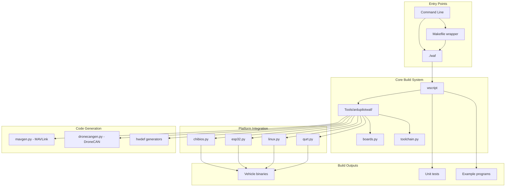

# ArduPilot Build System Documentation


## Table of Contents
- [Overview](#overview)
- [Build System Architecture](#build-system-architecture)
- [Quick Start Guide](#quick-start-guide)
- [Waf Build System Fundamentals](#waf-build-system-fundamentals)
- [Board Configuration](#board-configuration)
- [Cross-Compilation Toolchains](#cross-compilation-toolchains)
- [Feature Flags and Configuration](#feature-flags-and-configuration)
- [SITL Builds](#sitl-builds)
- [Build Optimization](#build-optimization)
- [Firmware Packaging](#firmware-packaging)
- [Docker Build Environment](#docker-build-environment)
- [Troubleshooting](#troubleshooting)
- [Custom Board Porting](#custom-board-porting)
- [CI/CD Integration](#cicd-integration)
- [Build System File Structure](#build-system-file-structure)

## Overview

ArduPilot uses the [Waf build system](https://waf.io/book/), a Python-based meta-build system designed for flexibility and speed. The ArduPilot-specific Waf extensions in `Tools/ardupilotwaf/` provide specialized functionality for:

- **Multi-platform support**: Over 50 autopilot boards across multiple architectures
- **Vehicle-specific builds**: Independent compilation of Copter, Plane, Rover, Sub, AntennaTracker
- **Hardware abstraction**: Platform-specific code generation and linking
- **External integrations**: ChibiOS, ESP-IDF, CMake subprojects, DroneCAN, MAVLink codegen
- **Incremental builds**: Fast rebuilds by tracking dependencies accurately
- **Test infrastructure**: Unit tests, benchmarks, and SITL (Software In The Loop) simulation

**Source Files**: `wscript`, `Makefile`, `Tools/ardupilotwaf/`

**Key Design Principles**:
- Never run `waf` with `sudo` - causes permission and environment problems
- Always call waf from the repository root directory
- Incremental builds are default - cleaning is rarely needed
- Configuration is persistent - only rerun `configure` when changing boards or options

## Build System Architecture

### System Components



### Waf Execution Flow

**Source**: `wscript:76-95`, `Tools/ardupilotwaf/ardupilotwaf.py`

1. **Initialization** (`waf init`): 
   - Loads cached configuration from `build/.cache_wafpickle`
   - Determines board variant from `--board` option or cached value
   - Sets up variant-specific build contexts

2. **Configuration** (`waf configure --board=<board>`):
   - Selects and validates target board
   - Configures toolchain (compiler, linker, archiver)
   - Runs board-specific configuration (hwdef generation for ChibiOS)
   - Detects enabled features and options
   - Saves configuration to cache

3. **Build** (`waf build` or `waf <vehicle>`):
   - Scans source tree for changes
   - Generates dynamic code (MAVLink, DroneCAN, hwdef)
   - Compiles changed sources with parallelization
   - Links vehicle binaries
   - Generates firmware images (.bin, .apj, .hex)

4. **Upload** (`waf --upload`):
   - For embedded boards: Serial bootloader upload
   - For Linux boards: rsync to configured destination

### Program Groups

**Source**: `wscript:245-290`, `BUILD.md:245-290`

ArduPilot organizes build targets into logical groups:

#### Main Groups

| Group | Description | Build Output Location |
|-------|-------------|----------------------|
| **bin** | Vehicle binaries (default) | `build/<board>/bin/` |
| **tools** | Development utilities | `build/<board>/tools/` |
| **examples** | Library usage examples | `build/<board>/examples/` |
| **tests** | Unit tests | `build/<board>/tests/` |
| **benchmarks** | Performance benchmarks | `build/<board>/benchmarks/` |

#### Vehicle Groups

| Group | Description | Example Targets |
|-------|-------------|-----------------|
| **copter** | All multirotor types | `bin/arducopter` |
| **heli** | Helicopter types | `bin/arducopter-heli` |
| **plane** | Fixed-wing and VTOL | `bin/arduplane` |
| **rover** | Ground/surface vehicles | `bin/ardurover` |
| **sub** | Underwater ROVs | `bin/ardusub` |
| **antennatracker** | Antenna tracking | `bin/antennatracker` |
| **AP_Periph** | CAN peripheral firmware | `bin/AP_Periph` |

**Usage Examples**:
```bash
# Build all bin group (default)
./waf

# Build specific vehicle group
./waf copter

# Build multiple groups
./waf --program-group tests --program-group examples

# Build specific target
./waf --targets bin/arducopter
```

## Quick Start Guide

### Prerequisites

**Required Tools**:
- Python 3.6+ (for Waf build system)
- Git (for source and submodule management)
- Platform-specific toolchain (see Cross-Compilation section)

**Getting the Source**:

**Source**: `BUILD.md:3-14`

```bash
# Clone with all submodules
git clone --recursive https://github.com/ArduPilot/ardupilot.git
cd ardupilot

# If already cloned without --recursive
git submodule update --init --recursive
```

### Basic Build Commands

**Source**: `BUILD.md:19-93`

#### Building for Pixhawk/Cube Boards

```bash
# Configure for CubeBlack (Pixhawk 2.1)
./waf configure --board CubeBlack

# Build ArduCopter
./waf copter

# Output: build/CubeBlack/bin/arducopter.apj
```

#### Building for Linux Boards

```bash
# Configure for Raspberry Pi with Navio2
./waf configure --board navio2

# Build ArduPlane
./waf plane

# Output: build/navio2/bin/arduplane
```

#### Building SITL (Software In The Loop)

```bash
# Configure for SITL with debug symbols
./waf configure --board sitl --debug

# Build all vehicles
./waf

# Output: build/sitl/bin/arducopter, arduplane, ardurover, ardusub
```

#### Building for ESP32

```bash
# Configure for ESP32 board (e.g., ESP32-S3)
./waf configure --board esp32s3

# Build copter (static linking required)
./waf --static copter

# Output: build/esp32s3/bin/arducopter.bin
```

### Listing Available Options

**Source**: `BUILD.md:53-78`

```bash
# List all supported boards (50+ boards)
./waf list_boards

# List all build targets
./waf list

# Show all waf options and commands
./waf --help
```

### Common Board Configurations

**Source**: `BUILD.md:64-78`

```bash
./waf configure --board bebop --static    # Parrot Bebop/Bebop2
./waf configure --board edge              # Emlid Edge
./waf configure --board fmuv3             # Pixhawk 2 (FMUv3)
./waf configure --board navio2            # Emlid Navio2
./waf configure --board Pixhawk1          # 3DR Pixhawk 1
./waf configure --board CubeBlack         # Hex/ProfiCNC Cube Black
./waf configure --board Pixracer          # Pixracer
./waf configure --board skyviper-v2450    # SkyViper GPS drone
./waf configure --board MatekH743         # Matek H743 boards
./waf configure --board KakuteH7          # Holybro KakuteH7
```

### Cleaning Build Artifacts

**Source**: `BUILD.md:95-109`, `wscript:54-74`

```bash
# Clean current board (keeps configuration)
./waf clean

# Clean everything including configuration
./waf distclean

# Resync submodules (useful when switching branches)
./waf submodulesync

# Force clean and resync all submodules (preserves esp_idf)
./waf submodule_force_clean
```

> **Note**: Cleaning is rarely necessary due to incremental builds. Clean only when troubleshooting build issues.

## Waf Build System Fundamentals

### Waf Architecture

ArduPilot uses Waf 2.0+ with custom extensions. The build system consists of:

1. **waf executable**: `modules/waf/waf-light` (Git submodule)
2. **waf wrapper**: `./waf` (repository root wrapper script)
3. **Main build script**: `wscript` (defines projects, options, build rules)
4. **ArduPilot extensions**: `Tools/ardupilotwaf/*.py` (platform-specific logic)

**Source**: `BUILD.md:375-388`, `Makefile:1-18`

### Alternative Build Interfaces

#### Direct Waf Usage

```bash
# Use waf directly from submodule
./modules/waf/waf-light configure --board=sitl

# Create shell alias for convenience
alias waf="$PWD/modules/waf/waf-light"
waf configure --board=CubeOrange
```

#### Makefile Wrapper

**Source**: `Makefile:1-110`, `BUILD.md:386-388`

The `Makefile` provides GNU Make interface to Waf:

```bash
# Show makefile help
make -f Makefile help

# Configure and build for specific board
make linux

# Build specific vehicle
make copter

# Combine board and vehicle
make Pixracer-copter

# Run tests
make check          # Run new/modified/failed tests
make check-all      # Run all tests

# Pass flags to waf
make linux WAF_FLAGS="-v"
```

**Makefile Variables**:
- `WAF_BINARY`: Path to waf-light executable
- `WAF_FLAGS`: Additional waf command-line options
- `VEHICLES`: copter, plane, rover, sub, heli

### Build Parallelization

**Source**: `BUILD.md:236-243`, `wscript:236-243`

```bash
# Waf auto-detects CPU cores and parallelizes by default
./waf

# Manually specify parallel jobs
./waf -j8

# Useful for distributed builds (icecc) or resource-constrained systems
./waf -j16  # For icecc distributed compilation
./waf -j2   # Limit on resource-constrained systems
```

### Configuration Persistence

**Source**: `wscript:80-95`

Configuration is saved to `build/.cache_wafpickle` and persists across builds:

```bash
# First time or board change - requires configure
./waf configure --board CubeBlack
./waf copter

# Subsequent builds - configuration remembered
./waf plane    # Uses CubeBlack configuration

# Change board - reconfigure needed
./waf configure --board sitl
./waf copter
```

### Variant Builds

**Source**: `wscript:47-51`, `wscript:94-95`

Each board is a separate build variant with isolated build outputs:

```bash
# Build outputs separated by board
build/
├── CubeBlack/        # CubeBlack variant
│   ├── bin/
│   ├── lib/
│   └── ...
├── sitl/             # SITL variant
│   ├── bin/
│   └── ...
└── .cache_wafpickle  # Cached configuration
```

You can switch between boards without cleaning:

```bash
./waf configure --board CubeBlack
./waf copter

./waf configure --board sitl
./waf copter  # sitl build doesn't affect CubeBlack artifacts
```

## Board Configuration

### Board Detection and Selection

**Source**: `Tools/ardupilotwaf/boards.py:24-39`, `wscript:89-95`

ArduPilot supports 50+ boards across multiple hardware platforms. Boards are Python classes inheriting from the `Board` base class, registered in `_board_classes` dictionary.

```bash
# List all available boards with descriptions
./waf list_boards
```

**Board Categories**:

| Platform | Example Boards | Toolchain | Description |
|----------|---------------|-----------|-------------|
| **ChibiOS** | CubeBlack, Pixhawk1, MatekH743, KakuteH7 | arm-none-eabi-gcc | STM32-based autopilots |
| **Linux** | navio2, edge, bbbmini, erleboard | native gcc | Linux SBC-based |
| **ESP32** | esp32s3, esp32c3, esp32buzz | xtensa-esp32-elf-gcc | ESP32 microcontrollers |
| **SITL** | sitl, sitl_periph_gps | native gcc/clang | Software simulation |
| **QURT** | qurt | hexagon-clang | Qualcomm Snapdragon |

### Board Configuration Process

**Source**: `Tools/ardupilotwaf/boards.py:48-55`, `wscript`

When you run `./waf configure --board <board>`:

1. **Board Class Loading**: `boards.py` instantiates the selected board class
2. **Toolchain Configuration**: Board specifies toolchain (native, arm-none-eabi, xtensa, etc.)
3. **Environment Setup**: Board's `configure()` method sets compiler flags, defines, library paths
4. **Platform-Specific**: Platform modules (chibios.py, linux.py, esp32.py) run additional setup
5. **Feature Detection**: Enable/disable features based on board capabilities and options

### ChibiOS Boards (STM32)

**Source**: `Tools/ardupilotwaf/chibios.py`, `libraries/AP_HAL_ChibiOS/hwdef/`

ChibiOS boards use hardware definition files (hwdef) to describe MCU, peripherals, and pin assignments:

```bash
# ChibiOS board configuration
./waf configure --board CubeOrange

# Hwdef files location
libraries/AP_HAL_ChibiOS/hwdef/CubeOrange/
├── hwdef.dat          # Main hardware definition
├── hwdef-bl.dat       # Bootloader variant (optional)
└── defaults.parm      # Default parameters (optional)
```

**Hwdef Processing**:
1. `chibios_hwdef.py` parses hwdef.dat
2. Generates `hwdef.h` with pin definitions, peripheral config
3. Generates linker scripts for flash/RAM layout
4. Configures ChibiOS RTOS integration
5. Sets up DMA, interrupts, clocks

**Common ChibiOS Configure Options**:
```bash
# Enable bootloader build
./waf configure --board CubeOrange --bootloader

# Specify custom hwdef
./waf configure --board CubeOrange --hwdef custom.dat

# Enable firmware signing
./waf configure --board CubeOrange --signed-fw

# Disable specific features to reduce firmware size
./waf configure --board MatekF405 --disable-scripting
```

### Linux Boards

**Source**: `Tools/ardupilotwaf/linux.py`

Linux boards run ArduPilot as a userspace process on Linux OS:

```bash
# Linux board with rsync upload destination
./waf configure --board navio2 --rsync-dest root@192.168.1.2:/

# Build and upload
./waf copter --upload
```

**Linux Board Configuration**:
- Generates `hwdef.h` via `linux_hwdef.py`
- Loads optional environment variables from `env.py`
- Configures GPIO, SPI, I2C device paths
- Sets up PREEMPT_RT scheduling (if available)

### ESP32 Boards

**Source**: `Tools/ardupilotwaf/esp32.py`

ESP32 uses ESP-IDF (Espressif IoT Development Framework) via CMake integration:

```bash
# Configure ESP32-S3 board
./waf configure --board esp32s3

# Build with static linking (required for ESP32)
./waf --static copter
```

**ESP32 Build Process**:
1. Detects ESP-IDF from `IDF_PATH` environment or vendored `modules/esp_idf`
2. Runs CMake configuration for ESP-IDF project
3. Generates `sdkconfig` from defaults
4. Builds ESP-IDF components via CMake
5. Links ArduPilot with ESP-IDF libraries
6. Generates flashable .bin firmware

**ESP32 Flash Commands**:
```bash
# Flash firmware to connected ESP32
./waf copter --upload

# Or use ESP-IDF flash tool directly
python -m esptool --chip esp32s3 write_flash 0x1000 build/esp32s3/bin/arducopter.bin
```

### SITL Configuration

**Source**: `BUILD.md:76-77`, SITL-specific board class

SITL (Software In The Loop) runs on host computer for simulation:

```bash
# Standard SITL build
./waf configure --board sitl
./waf copter

# SITL with debug symbols (for gdb)
./waf configure --board sitl --debug
./waf copter

# SITL with address sanitizer (detect memory errors)
./waf configure --board sitl --asan
./waf copter

# SITL with coverage instrumentation
./waf configure --board sitl --coverage
./waf copter
```

**SITL Build Features**:
- Full sensor simulation
- MAVLink GCS connection
- Lua scripting support
- All vehicle types
- Parallel builds for all vehicles

### Board-Specific Parameters

**Source**: `libraries/AP_HAL_ChibiOS/hwdef/*/defaults.parm`

Boards can include default parameter files automatically embedded in firmware:

```
# Example: CubeOrange/defaults.parm
COMPASS_AUTO_ROT 2       # Enable compass rotation learning
INS_ACC_BODYFIX 2        # Body-frame accel calibration
```

Default parameters are loaded on first boot or parameter reset.

## Cross-Compilation Toolchains

### Toolchain Selection

**Source**: `Tools/ardupilotwaf/toolchain.py`

ArduPilot automatically selects toolchains based on board class. Manual override:

```bash
# Override default toolchain
./waf configure --board CubeBlack --toolchain arm-none-eabi

# Available toolchains: native, arm-none-eabi, xtensa-esp32-elf, clang
```

### ARM Cortex-M Toolchain (ChibiOS Boards)

**Required for**: CubeBlack, Pixhawk1, MatekH743, and all STM32-based boards

**Toolchain**: `arm-none-eabi-gcc` (GNU Arm Embedded Toolchain)

**Installation**:

**Ubuntu/Debian**:
```bash
sudo apt-get update
sudo apt-get install gcc-arm-none-eabi binutils-arm-none-eabi
```

**macOS** (via Homebrew):
```bash
brew tap osx-cross/arm
brew install arm-gcc-bin
```

**Manual Installation**:
```bash
# Download from ARM developer site
wget https://developer.arm.com/-/media/Files/downloads/gnu-rm/10.3-2021.10/gcc-arm-none-eabi-10.3-2021.10-x86_64-linux.tar.bz2

# Extract
tar xjf gcc-arm-none-eabi-10.3-2021.10-x86_64-linux.tar.bz2

# Add to PATH
export PATH=$PATH:$HOME/gcc-arm-none-eabi-10.3-2021.10/bin
```

**Verify Installation**:
```bash
arm-none-eabi-gcc --version
# Expected: gcc version 10.3.1 or later
```

**Toolchain Components**:
- `arm-none-eabi-gcc`: C compiler
- `arm-none-eabi-g++`: C++ compiler
- `arm-none-eabi-ld`: Linker
- `arm-none-eabi-ar`: Archiver
- `arm-none-eabi-objcopy`: Binary converter
- `arm-none-eabi-size`: Size analysis tool

### Native Toolchain (Linux/SITL)

**Required for**: Linux boards, SITL simulation

**Toolchain**: System GCC or Clang

**Installation**:

**Ubuntu/Debian**:
```bash
sudo apt-get install build-essential g++ gdb
```

**macOS**:
```bash
xcode-select --install  # Install Xcode Command Line Tools
```

**Using Clang** (alternative to GCC):

**Source**: `BUILD.md:172-183`

```bash
# Configure with clang
CXX=clang++ CC=clang ./waf configure --board sitl

# Build
./waf copter
```

### ESP32 Toolchain (Xtensa/RISC-V)

**Required for**: esp32, esp32s3, esp32c3, esp32buzz boards

**Toolchain**: ESP-IDF with xtensa-esp32-elf-gcc or riscv32-esp-elf-gcc

**Installation**:

**Method 1: Use ArduPilot's ESP-IDF submodule** (Recommended):
```bash
# ESP-IDF is included as submodule
git submodule update --init --recursive modules/esp_idf

# Waf automatically uses vendored ESP-IDF
./waf configure --board esp32s3
```

**Method 2: System ESP-IDF**:
```bash
# Install ESP-IDF
git clone -b v4.4 --recursive https://github.com/espressif/esp-idf.git ~/esp-idf
cd ~/esp-idf
./install.sh esp32,esp32s3,esp32c3

# Set environment
. ~/esp-idf/export.sh

# Configure ArduPilot
export IDF_PATH=~/esp-idf
./waf configure --board esp32s3
```

**ESP32 Toolchain Paths**:
- ESP32 (Xtensa): `xtensa-esp32-elf-gcc`
- ESP32-S2/S3 (Xtensa): `xtensa-esp32s3-elf-gcc`
- ESP32-C3 (RISC-V): `riscv32-esp-elf-gcc`

### QURT Toolchain (Qualcomm Snapdragon)

**Required for**: qurt board (Qualcomm Flight platforms)

**Toolchain**: Hexagon SDK with hexagon-clang

**Installation**:
```bash
# Requires Qualcomm Hexagon SDK
# Download from Qualcomm Developer Network
# https://developer.qualcomm.com/software/hexagon-dsp-sdk

# Set HEXAGON_SDK_ROOT environment variable
export HEXAGON_SDK_ROOT=/path/to/Hexagon_SDK

# Configure
./waf configure --board qurt
```

**Source**: `Tools/ardupilotwaf/qurt.py`

### Toolchain Configuration Details

**Source**: `Tools/ardupilotwaf/toolchain.py:1-60`

The toolchain module provides:

1. **Compiler Detection**: `find_gcc()`, `find_gxx()` locate compilers in PATH
2. **Cross-Compilation Setup**: Sets `--target`, `--gcc-toolchain`, `--sysroot` for clang
3. **Tool Discovery**: Finds `AR`, `NM`, `PKGCONFIG` for the target platform
4. **Flag Configuration**: Merges toolchain-specific CFLAGS/CXXFLAGS

**Environment Variables Affecting Toolchain**:
```bash
# Override C compiler
export CC=/usr/bin/gcc-11
./waf configure --board sitl

# Override C++ compiler
export CXX=/usr/bin/g++-11
./waf configure --board sitl

# Override linker
export LD=/usr/bin/ld.gold
./waf configure --board sitl

# Specify cross-compiler prefix
export CROSS=arm-linux-gnueabihf-
./waf configure --board navio2
```

### Compiler Flags

**Source**: Board-specific `configure_env()` methods

Each board configures compiler optimization, warnings, and features:

**Common Flags**:
```python
# Optimization
env.CXXFLAGS += ['-O2']              # Standard optimization
env.CXXFLAGS += ['-Os']              # Size optimization (for resource-constrained boards)

# Warnings
env.CXXFLAGS += ['-Wall', '-Wextra'] # Enable warnings
env.CXXFLAGS += ['-Werror']          # Treat warnings as errors (CI builds)

# Language standard
env.CXXFLAGS += ['-std=gnu++11']     # C++11 with GNU extensions

# Debug
env.CXXFLAGS += ['-g']               # Debug symbols (--debug builds)

# Architecture
env.CXXFLAGS += ['-march=armv7-a']   # ARM Cortex-A
env.CXXFLAGS += ['-mcpu=cortex-m7']  # ARM Cortex-M7
```

**Custom Compiler Flags**:
```bash
# Add custom CXXFLAGS
CXXFLAGS="-DCUSTOM_DEFINE=1" ./waf configure --board sitl

# Add custom CFLAGS
CFLAGS="-O3" ./waf configure --board sitl
```

## Feature Flags and Configuration

### Build-Time Feature Configuration

**Source**: `Tools/scripts/build_options.py`, `wscript:97-100`

ArduPilot features can be enabled/disabled at compile time to:
- Reduce firmware size for flash-constrained boards
- Disable unused functionality
- Enable experimental features
- Customize builds for specific applications

### Available Feature Flags

**Source**: `Tools/scripts/build_options.py:BUILD_OPTIONS`

```bash
# List all available feature options
./waf configure --help | grep enable-

# Common feature flags:
--enable-scripting       # Enable Lua scripting
--disable-scripting      # Disable Lua scripting
--enable-DDS             # Enable DDS/ROS2 support
--enable-networking      # Enable ethernet/networking
--enable-onvif           # Enable ONVIF camera control
--enable-opendroneid     # Enable RemoteID/OpenDroneID
--enable-GPS_MOVING_BASELINE  # Enable GPS moving baseline
--disable-networking     # Disable networking features
--disable-scripting      # Disable scripting to save flash
--enable-ekf-double      # Use double precision in EKF
--enable-benchmarks      # Build benchmark programs
--enable-gtest           # Enable Google Test framework
```

### Feature Flag Examples

**Enabling Features**:
```bash
# Enable Lua scripting (default on capable boards)
./waf configure --board CubeOrange --enable-scripting

# Enable DDS for ROS2 integration
./waf configure --board CubeBlack --enable-DDS

# Enable networking on supported boards
./waf configure --board CubeOrangePlus --enable-networking

# Enable ONVIF camera control
./waf configure --board MatekH743 --enable-onvif

# Enable RemoteID/OpenDroneID
./waf configure --board Pixhawk6X --enable-opendroneid
```

**Disabling Features** (reduce firmware size):
```bash
# Disable scripting to save ~200KB flash
./waf configure --board MatekF405 --disable-scripting

# Disable compass (specialized applications)
./waf configure --board Pixhawk1 --disable-Compass

# Disable multiple features
./waf configure --board MatekF405 \
    --disable-scripting \
    --disable-networking \
    --disable-Compass
```

### Compile-Time Defines

**Source**: `Tools/ardupilotwaf/boards.py:68-143`

Board configuration sets preprocessor defines:

**Common Defines**:
```cpp
// Scripting
#define AP_SCRIPTING_ENABLED 1

// DDS/ROS2
#define AP_DDS_ENABLED 1

// Hardware
#define HAL_BOARD_SUBTYPE HAL_BOARD_SUBTYPE_CHIBIOS_FMUV3

// Features
#define HAL_GCS_ENABLED 1
#define HAL_LOGGING_ENABLED 1

// Lua configuration
#define LUA_32BITS 1
```

**Custom Defines**:
```bash
# Add custom defines via CXXFLAGS
CXXFLAGS="-DCUSTOM_FEATURE=1 -DMAX_RATE=500" ./waf configure --board sitl
```

### Hardware Definition Options (ChibiOS)

**Source**: `libraries/AP_HAL_ChibiOS/hwdef/*/hwdef.dat`

ChibiOS boards define features in hwdef.dat:

```
# Enable DDS in hwdef
define AP_DDS_ENABLED 1

# Disable features to save flash
define HAL_LOGGING_ENABLED 0
define AP_SCRIPTING_ENABLED 0

# Configure hardware
define HAL_STORAGE_SIZE 32768
define HAL_WITH_DSP 1
```

**Hwdef Feature Macros**:
- `AP_SCRIPTING_ENABLED`: Lua scripting support
- `AP_DDS_ENABLED`: DDS/ROS2 support
- `HAL_LOGGING_ENABLED`: DataFlash logging
- `HAL_GCS_ENABLED`: MAVLink ground control
- `HAL_PERIPH_ENABLE_GPS`: GPS for AP_Periph
- `AP_NETWORKING_ENABLED`: Ethernet/networking

### Feature Dependencies

**Source**: Board-specific configuration in `Tools/ardupilotwaf/boards.py`

Some features have dependencies automatically handled:

**Example: ONVIF Camera Control**:
```bash
# Enabling ONVIF automatically:
./waf configure --board CubeOrange --enable-onvif

# Automatically enables:
# - AP_ONVIF library
# - Lua scripting (SCRIPTING_ENABLE_DEFAULT=1)
# - ONVIF_Camera_Control.lua applet (embedded in ROMFS)
```

**Example: DDS/ROS2**:
```bash
# Enabling DDS automatically:
./waf configure --board CubeBlack --enable-DDS

# Automatically enables:
# - AP_DDS library
# - micro-ROS/DDS middleware
# - Network transport layer
```

### Build Option Persistence

Feature flags are saved in build configuration and persist:

```bash
# Initial configure with options
./waf configure --board CubeOrange --enable-scripting --enable-DDS

# Subsequent builds remember options
./waf copter  # Still has scripting and DDS enabled

# Change options - must reconfigure
./waf configure --board CubeOrange --disable-scripting
./waf copter  # Now without scripting
```

## SITL Builds

### SITL Overview

SITL (Software In The Loop) runs ArduPilot natively on your development computer, simulating all sensors and vehicle physics. This enables:
- Rapid development without hardware
- Automated testing in CI/CD
- Multi-vehicle swarm simulation
- Integration with external simulators (Gazebo, RealFlight, X-Plane)

**Source**: BUILD.md sitl examples, SITL board configuration

### Basic SITL Build

```bash
# Standard SITL configuration
./waf configure --board sitl
./waf

# Output: build/sitl/bin/ contains all vehicle binaries
# - arducopter
# - arduplane
# - ardurover
# - ardusub
# - antennatracker
```

### Running SITL

```bash
# Run ArduCopter SITL
build/sitl/bin/arducopter --model quad

# Common command-line options:
--model <type>          # Vehicle model (quad, hexa, plane, rover, etc.)
--home LAT,LON,ALT,HDG  # Starting location
--speedup <N>           # Simulation speed multiplier
--console               # Enable console output
--map                   # Show map display (requires pygame)
--defaults <file>       # Load parameter defaults
```

**SITL Simulation Models**:
```bash
# Multicopter types
--model quad            # Quadcopter X configuration
--model hexa            # Hexacopter
--model octa            # Octocopter
--model coaxcopter      # Coaxial copter

# Fixed-wing
--model plane           # Standard plane
--model quadplane       # VTOL quadplane

# Ground vehicles
--model rover           # Ground rover
--model boat            # Surface boat

# Underwater
--model vectored        # Vectored ROV
```

### SITL with Debugging

**Source**: `BUILD.md:369-372`

```bash
# Build SITL with debug symbols
./waf configure --board sitl --debug
./waf copter

# Run under GDB
gdb --args build/sitl/bin/arducopter --model quad

# Run with valgrind (memory leak detection)
valgrind --leak-check=full build/sitl/bin/arducopter --model quad
```

### SITL with Address Sanitizer

Detect memory errors (buffer overflows, use-after-free):

```bash
# Configure with ASAN
./waf configure --board sitl --asan
./waf copter

# Run normally - crashes with detailed report on memory errors
build/sitl/bin/arducopter --model quad
```

### SITL with Coverage

Generate code coverage reports:

```bash
# Build with coverage instrumentation
./waf configure --board sitl --coverage
./waf copter

# Run tests
./build/sitl/bin/arducopter --model quad
# ... run test scenarios ...
# Exit SITL

# Generate coverage report
gcovr -r . --html --html-details -o coverage.html
```

### SITL Helper Scripts

**Source**: `Tools/autotest/sim_vehicle.py`

ArduPilot provides `sim_vehicle.py` wrapper for easier SITL usage:

```bash
# Run SITL with MAVProxy GCS
Tools/autotest/sim_vehicle.py -v ArduCopter --console --map

# Specify frame type
Tools/autotest/sim_vehicle.py -v ArduCopter -f quad --console

# Set custom location (e.g., specific airport)
Tools/autotest/sim_vehicle.py -v ArduPlane -L KSFO --console

# Wipe parameters and start fresh
Tools/autotest/sim_vehicle.py -v ArduCopter --wipe --console

# Use external simulator (Gazebo)
Tools/autotest/sim_vehicle.py -v ArduCopter -f gazebo-iris --console

# Multiple vehicles (swarm simulation)
Tools/autotest/sim_vehicle.py -v ArduCopter -n 4 --console
```

### SITL External Simulator Integration

**Gazebo** (ROS/Ignition Gazebo):
```bash
# Requires ardupilot_gazebo plugin
Tools/autotest/sim_vehicle.py -v ArduCopter -f gazebo-iris

# Gazebo provides physics, sensors, 3D visualization
```

**RealFlight** (Commercial flight simulator):
```bash
# Requires RealFlight with FlightAxis plugin
Tools/autotest/sim_vehicle.py -v ArduCopter --osd --simpanel --out 127.0.0.1:14550
```

**X-Plane** (Commercial flight simulator):
```bash
Tools/autotest/sim_vehicle.py -v ArduPlane -f xplane --console
```

### SITL Network Configuration

SITL listens for MAVLink connections:

```bash
# Default: TCP 5760, UDP 14550, 14551
# Connect ground station to 127.0.0.1:5760 (TCP) or :14550 (UDP)

# Add additional MAVLink outputs
build/sitl/bin/arducopter --model quad --out 192.168.1.100:14550

# Use specific MAVLink dialect
build/sitl/bin/arducopter --model quad --mavlink-dialect common
```

### SITL Parameter Storage

SITL stores parameters in `eeprom.bin` file in working directory:

```bash
# Parameters saved to eeprom.bin
# Delete to reset parameters
rm eeprom.bin

# Or use parameter reset command in MAVProxy
param set SYSID_THISMAV 1
param set FORMAT_VERSION 0  # Forces parameter reset on next boot
```

### SITL for Automated Testing

**Source**: `Tools/autotest/` directory

```bash
# Run full autotest suite
Tools/autotest/autotest.py

# Run tests for specific vehicle
Tools/autotest/autotest.py ArduCopter

# Run specific test
Tools/autotest/autotest.py ArduCopter.FlyEachFrame
```

## Build Optimization

### Incremental Builds

**Source**: `BUILD.md:102-103`, Waf dependency tracking

Waf performs intelligent incremental builds by tracking:
- Source file modifications (timestamp + content hash)
- Header dependencies (automatic via compiler)
- Configuration changes
- Build option modifications

```bash
# First build - compiles everything
./waf copter
# Time: 3-5 minutes (full build)

# Modify single source file
echo "// comment" >> ArduCopter/mode_stabilize.cpp

# Incremental build - only recompiles affected files
./waf copter
# Time: 5-10 seconds (only mode_stabilize.cpp and linking)
```

**When Incremental Builds Fail**:
Rare cases where incremental build is incorrect:
- Macro definition changes in headers not tracked
- External tool updates (mavgen, dronecangen)
- Submodule updates

**Solution**: Clean and rebuild:
```bash
./waf clean
./waf copter
```

### Parallel Compilation

**Source**: `BUILD.md:236-243`

Waf automatically detects CPU cores and parallelizes compilation:

```bash
# Auto-detect cores (default behavior)
./waf copter
# Uses all available CPU cores

# Manual parallelization control
./waf -j8 copter        # 8 parallel jobs
./waf -j1 copter        # Serial compilation (debugging)
./waf -j16 copter       # High parallelization (icecc distributed builds)
```

**Optimal -j Value**:
- Local builds: Number of CPU cores (auto-detected)
- Distributed builds (icecc): 2-4x number of cores
- Memory-constrained: Reduce -j to prevent OOM

### Build Caching

Waf caches:
1. **Configuration**: `build/.cache_wafpickle` (board selection, options)
2. **Object files**: `build/<board>/` (compiled .o files per source)
3. **Task signatures**: Content hashes to detect changes

**Cache Benefits**:
- Switching git branches preserves builds
- Multiple boards built simultaneously without conflicts
- Fast rebuilds after git pull

**Cache Invalidation**:
```bash
# Waf automatically invalidates cache when:
# - Source files change
# - Headers change
# - Compiler flags change
# - Configuration changes

# Manual cache clearing
./waf clean         # Clear current board object files
./waf distclean     # Clear all caches and configuration
```

### Compilation Database

Generate `compile_commands.json` for IDE integration (clangd, ccls):

```bash
# Configure with compilation database
./waf configure --board sitl --compile-commands

# Generates: compile_commands.json
# Use with:
# - VS Code (clangd extension)
# - Vim/Neovim (coc.nvim, LanguageClient-neovim)
# - Emacs (lsp-mode)
```

### Build Output Verbosity

```bash
# Normal build - shows progress
./waf copter

# Verbose build - shows all compiler commands
./waf -v copter

# Very verbose - shows internal waf operations
./waf -vv copter

# Quiet build - minimal output
./waf --quiet copter
```

### Distributed Compilation (icecc)

For large development teams, use Icecream (icecc) distributed compilation:

```bash
# Install icecc
sudo apt-get install icecc

# Configure for distributed build
./waf configure --board CubeOrange

# Build with high parallelization
./waf -j32 copter

# Icecc automatically distributes compile jobs across network
```

### Link-Time Optimization (LTO)

Some boards enable LTO to reduce firmware size:

```bash
# LTO enabled in board configuration
# Increases link time but reduces firmware size by 10-20%

# Check if LTO is enabled
./waf configure --board CubeBlack
# Look for: -flto in compiler flags
```

### Build Time Profiling

Identify slow compilation units:

```bash
# Time the build
time ./waf copter

# Profile waf execution
./waf --profile copter
# Generates: build/profile.txt

# Analyze slowest tasks
sort -k2 -nr build/profile.txt | head -20
```

## Firmware Packaging

### Firmware Output Formats

ArduPilot generates multiple firmware formats depending on the target board:

**Source**: `Tools/ardupilotwaf/chibios.py:chibios_firmware`, `Tools/ardupilotwaf/esp32.py`

| Format | Extension | Description | Boards |
|--------|-----------|-------------|--------|
| **ELF** | `.elf` | Executable with debug symbols | All boards |
| **Binary** | `.bin` | Raw flash image | All boards |
| **APJ** | `.apj` | JSON-wrapped firmware for bootloader | ChibiOS boards |
| **Intel HEX** | `.hex` | Intel HEX format | ChibiOS boards |
| **ABIN** | `.abin` | Encrypted/signed firmware | ChibiOS with secure boot |

### ChibiOS Firmware Outputs

**Source**: `Tools/ardupilotwaf/chibios.py`

After building for ChibiOS boards:

```bash
./waf configure --board CubeOrange
./waf copter

# Generated files in build/CubeOrange/bin/:
# arducopter.elf        # ELF executable with symbols (for debugging)
# arducopter.bin        # Raw binary for direct flash
# arducopter.apj        # Bootloader-compatible (recommended for upload)
# arducopter.hex        # Intel HEX format
```

### APJ Format (ArduPilot JSON)

**Source**: `Tools/ardupilotwaf/chibios.py:set_app_descriptor`

APJ wraps firmware binary with metadata for ArduPilot bootloader:

```json
{
  "board_id": 140,
  "board_revision": 0,
  "version": "4.5.0-dev",
  "git_hash": "a1b2c3d4",
  "image_size": 1945600,
  "image_maxsize": 2064384,
  "image": "<base64-encoded-binary>"
}
```

**APJ Benefits**:
- Bootloader verifies board compatibility (board_id)
- Prevents flashing wrong firmware to wrong board
- Enables firmware size validation
- Supports secure boot signature verification

**Uploading APJ**:
```bash
# Via waf
./waf copter --upload

# Via Mission Planner / QGroundControl
# Select arducopter.apj file in firmware upload dialog

# Via command-line bootloader tool
python Tools/scripts/uploader.py build/CubeOrange/bin/arducopter.apj
```

### Firmware Signing (Secure Boot)

**Source**: `Tools/ardupilotwaf/chibios.py:sign_firmware`

ChibiOS boards with secure boot support require signed firmware:

```bash
# Configure with firmware signing
./waf configure --board CubeOrange --signed-fw

# Requires signing key (set via environment or hwdef)
export AP_SIGNING_KEY=/path/to/signing_key.dat

# Build generates signed .abin file
./waf copter

# Output: build/CubeOrange/bin/arducopter.abin (signed)
```

**Signed Firmware Process**:
1. Generate public/private key pair (monocypher)
2. Private key used to sign firmware during build
3. Public key hash stored in bootloader
4. Bootloader verifies signature before executing

### Linux Firmware Installation

**Source**: `BUILD.md:140-147`

Linux boards use rsync for deployment:

```bash
# Configure with rsync destination
./waf configure --board navio2 --rsync-dest root@192.168.1.2:/

# Build and upload
./waf copter --upload

# Or use install command for packaging
./waf copter
DESTDIR=/tmp/ardupilot-install ./waf install

# Install structure:
# /tmp/ardupilot-install/
# └── usr/
#     └── bin/
#         ├── arducopter
#         ├── arduplane
#         └── ...
```

**Creating DEB/RPM Packages**:
```bash
# Build for Linux board
./waf configure --board linux
./waf

# Install to staging directory
DESTDIR=/tmp/ardupilot ./waf install

# Create DEB package
fpm -s dir -t deb -n ardupilot -v 4.5.0 -C /tmp/ardupilot \
    usr/bin/arducopter usr/bin/arduplane

# Creates: ardupilot_4.5.0_amd64.deb
```

### ESP32 Firmware Flashing

**Source**: `Tools/ardupilotwaf/esp32.py`

ESP32 boards generate flashable .bin files:

```bash
./waf configure --board esp32s3
./waf copter --upload

# Manual flashing with esptool
python -m esptool --chip esp32s3 --port /dev/ttyUSB0 write_flash \
    0x1000 build/esp32s3/bin/arducopter.bin

# Erase flash before flashing (if issues occur)
python -m esptool --chip esp32s3 --port /dev/ttyUSB0 erase_flash
```

### Bootloader Building

**Source**: `Tools/ardupilotwaf/chibios.py`, hwdef-bl.dat files

ChibiOS boards use ArduPilot bootloader for firmware updates:

```bash
# Build bootloader for specific board
./waf configure --board CubeOrange --bootloader
./waf AP_Bootloader

# Output: build/CubeOrange/bin/AP_Bootloader.elf, .bin, .hex

# Flash bootloader (requires ST-Link, JTAG, or DFU mode)
# WARNING: Incorrect bootloader can brick the board!
```

**Bootloader Functions**:
- Firmware update via USB/Serial
- Board ID verification
- Firmware signature verification (secure boot)
- CAN bootloader support (AP_Periph)

### Firmware Size Analysis

Monitor firmware size to ensure it fits in flash:

```bash
# Build shows firmware size
./waf copter
# Output:
# ...
# Firmware size: 1945600 bytes
# Maximum size: 2064384 bytes
# Margin: 118784 bytes (5.7%)

# Detailed size breakdown
arm-none-eabi-size build/CubeOrange/bin/arducopter.elf
#    text    data     bss     dec     hex filename
# 1945600   12288   89432 2047320  1f3e98 arducopter.elf

# Per-object size analysis
arm-none-eabi-size build/CubeOrange/*.o | sort -k1 -nr | head -20
```

**Reducing Firmware Size**:
```bash
# Disable features to reduce size
./waf configure --board MatekF405 \
    --disable-scripting \
    --disable-networking \
    --disable-Compass

# Use hwdef customization
# Edit libraries/AP_HAL_ChibiOS/hwdef/<board>/hwdef.dat
# Add: define AP_SCRIPTING_ENABLED 0
```

### Firmware Distribution

**Official Firmware Server**: https://firmware.ardupilot.org/

Organized by vehicle and board:
```
firmware.ardupilot.org/
├── Copter/
│   ├── stable/
│   ├── beta/
│   └── latest/
│       ├── CubeOrange/
│       │   ├── arducopter.apj
│       │   └── git-version.txt
│       ├── Pixhawk1/
│       └── ...
├── Plane/
├── Rover/
└── Sub/
```

**Custom Firmware Distribution**:
```bash
# Build all vehicles for a board
./waf configure --board CubeOrange
./waf

# Package firmware with version info
mkdir -p firmware/CubeOrange
cp build/CubeOrange/bin/*.apj firmware/CubeOrange/
git rev-parse HEAD > firmware/CubeOrange/git-version.txt
git describe --tags > firmware/CubeOrange/version.txt

# Create archive
tar czf arducopter-CubeOrange-4.5.0.tar.gz firmware/
```

## Docker Build Environment

**Source**: `BUILD.md:194-214`

Docker provides isolated, reproducible build environment without installing toolchains on host.

### Building Docker Image

```bash
# Build Docker image (one-time setup)
docker build --rm -t ardupilot-dev .

# Uses Dockerfile in repository root
# Installs all required toolchains and dependencies
```

**Dockerfile Contents**:
- Base Ubuntu image
- ARM toolchain (arm-none-eabi-gcc)
- ESP-IDF toolchain
- Python dependencies
- Build tools (make, gcc, git)

### Building with Docker

```bash
# Configure for SITL
docker run --rm -it -v $PWD:/ardupilot ardupilot-dev \
    ./waf configure --board=sitl

# Build ArduCopter
docker run --rm -it -v $PWD:/ardupilot ardupilot-dev \
    ./waf copter

# Build for CubeOrange
docker run --rm -it -v $PWD:/ardupilot ardupilot-dev \
    ./waf configure --board=CubeOrange

docker run --rm -it -v $PWD:/ardupilot ardupilot-dev \
    ./waf copter
```

**Docker Command Breakdown**:
- `--rm`: Remove container after exit
- `-it`: Interactive terminal
- `-v $PWD:/ardupilot`: Mount current directory into container
- `ardupilot-dev`: Image name
- Build outputs appear in host `build/` directory

### Interactive Docker Shell

```bash
# Start bash shell in container
docker run --rm -it -v $PWD:/ardupilot ardupilot-dev bash

# Now inside container - run multiple commands
./waf configure --board=CubeBlack
./waf copter
./waf plane
./waf rover
exit
```

### Docker with USB Device Access

For firmware upload via USB:

```bash
# Pass USB device into container
docker run --rm -it \
    -v $PWD:/ardupilot \
    --device=/dev/ttyACM0 \
    ardupilot-dev \
    ./waf copter --upload

# Find USB device
ls /dev/ttyACM* /dev/ttyUSB*
```

### Docker Compose

Create `docker-compose.yml` for simpler commands:

```yaml
version: '3'
services:
  ardupilot:
    build: .
    image: ardupilot-dev
    volumes:
      - .:/ardupilot
    working_dir: /ardupilot
    stdin_open: true
    tty: true
```

**Usage**:
```bash
# Build image
docker-compose build

# Run commands
docker-compose run ardupilot ./waf configure --board=sitl
docker-compose run ardupilot ./waf copter

# Interactive shell
docker-compose run ardupilot bash
```

### CI/CD Docker Integration

**Source**: `.github/workflows/` (GitHub Actions), Docker CI usage

```yaml
# GitHub Actions example
name: Build ArduPilot
on: [push, pull_request]

jobs:
  build:
    runs-on: ubuntu-latest
    container:
      image: ardupilot/ardupilot-dev-chibios:latest
    steps:
      - uses: actions/checkout@v3
        with:
          submodules: recursive
      - name: Build Copter
        run: |
          ./waf configure --board=CubeOrange
          ./waf copter
      - name: Upload Artifacts
        uses: actions/upload-artifact@v3
        with:
          name: firmware
          path: build/CubeOrange/bin/*.apj
```

### Pre-built ArduPilot Docker Images

ArduPilot provides pre-built Docker images:

```bash
# Pull official image (includes all toolchains)
docker pull ardupilot/ardupilot-dev-chibios:latest

# Use in build
docker run --rm -it -v $PWD:/ardupilot \
    ardupilot/ardupilot-dev-chibios:latest \
    ./waf configure --board=CubeOrange

# ESP32 toolchain image
docker pull ardupilot/ardupilot-dev-esp32:latest
```

## Troubleshooting

### Common Build Issues

#### Issue: "waf: command not found"

**Problem**: Submodules not initialized

**Solution**:
```bash
git submodule update --init --recursive
./waf configure --board=sitl
```

#### Issue: "arm-none-eabi-gcc: command not found"

**Problem**: ARM toolchain not installed or not in PATH

**Solution**:
```bash
# Ubuntu/Debian
sudo apt-get install gcc-arm-none-eabi

# Verify installation
arm-none-eabi-gcc --version

# Check PATH
echo $PATH | grep arm-none-eabi
```

#### Issue: "Board 'XXX' not found"

**Problem**: Board name incorrect or typo

**Solution**:
```bash
# List valid board names (case-sensitive)
./waf list_boards

# Use exact board name
./waf configure --board CubeBlack  # Not cubeclack, not CUBEBLACK
```

#### Issue: "Firmware size exceeds flash capacity"

**Problem**: Firmware too large for board's flash

**Solution**:
```bash
# Disable features to reduce size
./waf configure --board MatekF405 --disable-scripting

# Check current size
arm-none-eabi-size build/MatekF405/bin/arducopter.elf

# Edit hwdef to disable features permanently
# libraries/AP_HAL_ChibiOS/hwdef/MatekF405/hwdef.dat
# Add: define AP_SCRIPTING_ENABLED 0
```

#### Issue: "Permission denied" when running waf

**Problem**: waf wrapper not executable

**Solution**:
```bash
chmod +x waf
./waf configure --board=sitl
```

#### Issue: Build fails with "submodule sync" errors

**Problem**: Submodules out of sync with current branch

**Solution**:
```bash
# Resync submodules
./waf submodulesync

# Or force clean and resync
./waf submodule_force_clean

# Or manual git submodule sync
git submodule sync --recursive
git submodule update --init --recursive
```

#### Issue: Python errors during configuration

**Problem**: Wrong Python version or missing dependencies

**Solution**:
```bash
# Verify Python version (3.6+ required)
python3 --version

# Install Python dependencies
pip3 install --user empy pyserial pymavlink

# Use specific Python version
PYTHON=python3.9 ./waf configure --board=sitl
```

#### Issue: "Library not found" errors during linking

**Problem**: Missing system libraries

**Solution**:
```bash
# Ubuntu/Debian - install development libraries
sudo apt-get install build-essential libtool pkg-config

# For SITL builds
sudo apt-get install libpython3-dev python3-numpy python3-matplotlib

# Check missing library
ldd build/sitl/bin/arducopter  # Shows missing .so files
```

#### Issue: ESP-IDF not found or version mismatch

**Problem**: ESP-IDF environment not configured

**Solution**:
```bash
# Use vendored ESP-IDF submodule
git submodule update --init --recursive modules/esp_idf

# Or set IDF_PATH to system ESP-IDF
export IDF_PATH=~/esp-idf
. $IDF_PATH/export.sh

# Verify ESP-IDF version (4.4 required)
idf.py --version
```

#### Issue: Incremental build produces incorrect binary

**Problem**: Cached build state inconsistent

**Solution**:
```bash
# Clean build for current board
./waf clean
./waf copter

# Or clean everything
./waf distclean
./waf configure --board=CubeOrange
./waf copter
```

#### Issue: "No space left on device" during build

**Problem**: Insufficient disk space for build artifacts

**Solution**:
```bash
# Check disk space
df -h .

# Clean old builds
./waf distclean  # Removes all build artifacts

# Remove unused Docker images
docker system prune -a

# Build artifacts can be several GB per board
```

### Debugging Build Process

#### Verbose Build Output

```bash
# Show all compiler commands
./waf -v copter

# Very verbose - internal waf details
./waf -vv copter
```

#### Configuration Inspection

```bash
# View saved configuration
cat build/.cache_wafpickle  # Binary file - not human readable

# Rebuild configuration from scratch
./waf distclean
./waf configure --board=sitl
```

#### Dependency Inspection

```bash
# Show why a file is being rebuilt
./waf --verbose copter 2>&1 | grep mode_stabilize

# Force rebuild specific file
touch ArduCopter/mode_stabilize.cpp
./waf copter
```

#### Build Performance Analysis

```bash
# Time the build
time ./waf copter

# Profile build tasks
./waf --profile copter
# View profile: sort -k2 -nr build/profile.txt | head -20
```

### Getting Help

**ArduPilot Discord**: https://discord.gg/ardupilot
- #build-issues channel for build problems

**ArduPilot Forum**: https://discuss.ardupilot.org/
- Build Setup and Configuration category

**GitHub Issues**: https://github.com/ArduPilot/ardupilot/issues
- Search existing issues before creating new

**Build System Documentation**: https://ardupilot.org/dev/docs/building-the-code.html

**Waf Book**: https://waf.io/book/

## Custom Board Porting

### Board Porting Overview

Adding a new board to ArduPilot requires creating board-specific configuration files and optionally integrating new hardware drivers.

**Source**: `Tools/ardupilotwaf/boards.py:24-42`, HAL porting guide

### Board Class Creation

**1. Create Board Class** in `Tools/ardupilotwaf/boards.py`:

```python
class MyCustomBoard(Board):
    name = 'MyCustomBoard'  # Board identifier for --board flag
    toolchain = 'arm-none-eabi'  # or 'native', 'xtensa-esp32-elf', etc.
    
    def configure_env(self, cfg, env):
        super(MyCustomBoard, self).configure_env(cfg, env)
        
        # Set board class
        env.BOARD_CLASS = 'ChibiOS'  # or 'Linux', 'ESP32'
        
        # Compiler flags
        env.CXXFLAGS += [
            '-mcpu=cortex-m7',
            '-mfpu=fpv5-d16',
            '-mfloat-abi=hard',
        ]
        
        # Defines
        env.DEFINES += [
            'HAL_BOARD_SUBTYPE_CUSTOM',
        ]
        
        # Libraries
        env.AP_LIBRARIES += [
            # Custom libraries if needed
        ]
```

### ChibiOS Board Porting

**Source**: `libraries/AP_HAL_ChibiOS/hwdef/`, ChibiOS HAL

**2. Create Hardware Definition** at `libraries/AP_HAL_ChibiOS/hwdef/MyCustomBoard/`:

```bash
mkdir -p libraries/AP_HAL_ChibiOS/hwdef/MyCustomBoard
cd libraries/AP_HAL_ChibiOS/hwdef/MyCustomBoard
```

**3. Create `hwdef.dat`**:

```
# MCU Configuration
MCU STM32H743xx
FLASH_SIZE_KB 2048
RAM_SIZE_KB 1024

# Board ID (unique identifier)
APJ_BOARD_ID 1234

# Clock Configuration
OSCILLATOR_HZ 8000000
STM32_HSE_ENABLED TRUE
STM32_LSE_ENABLED TRUE

# USB Configuration
USB_VENDOR 0x0483  # STM VID
USB_PRODUCT 0xdf11  # DFU PID
USB_STRING_MANUFACTURER "MyCompany"
USB_STRING_PRODUCT "MyCustomBoard"

# Serial Ports
SERIAL_ORDER UART7 USART1 USART2 USART3

# UART7 - Console/MAVLink
PA8 UART7_RX UART7
PA15 UART7_TX UART7

# USART1 - GPS
PB7 USART1_RX USART1
PB6 USART1_TX USART1

# SPI1 - IMU
PA5 SPI1_SCK SPI1
PA6 SPI1_MISO SPI1
PA7 SPI1_MOSI SPI1
PD7 IMU1_CS CS

# I2C1 - External sensors
PB8 I2C1_SCL I2C1
PB9 I2C1_SDA I2C1

# PWM Outputs
PE14 TIM1_CH4 TIM1 PWM(1) GPIO(50)
PE13 TIM1_CH3 TIM1 PWM(2) GPIO(51)
PE11 TIM1_CH2 TIM1 PWM(3) GPIO(52)
PE9  TIM1_CH1 TIM1 PWM(4) GPIO(53)

# IMU Configuration
SPIDEV icm42688 SPI1 DEVID1 IMU1_CS MODE3 2*MHZ 16*MHZ

# Compass (I2C)
define HAL_PROBE_EXTERNAL_I2C_COMPASSES

# Barometer
define HAL_BARO_ALLOW_INIT_NO_BARO

# Feature enables
define HAL_LOGGING_ENABLED TRUE
define HAL_GCS_ENABLED TRUE
define AP_SCRIPTING_ENABLED TRUE
```

**4. Optional: Create `hwdef-bl.dat`** for bootloader:

```
# Include main hwdef
include ../MyCustomBoard/hwdef.dat

# Bootloader-specific
define HAL_USE_SERIAL_BOOTLOADER 1
define HAL_BOOTLOADER_BUILD 1

# Minimal feature set
define HAL_LOGGING_ENABLED FALSE
define AP_SCRIPTING_ENABLED FALSE
```

**5. Optional: Create `defaults.parm`** for default parameters:

```
# Default parameters for MyCustomBoard
BATT_MONITOR 4           # Analog voltage/current
BATT_VOLT_PIN 10
BATT_CURR_PIN 11
BATT_VOLT_MULT 10.1
BATT_AMP_PERVLT 17.0

COMPASS_AUTO_ROT 2
INS_ACC_BODYFIX 2
```

### Linux Board Porting

**Source**: `Tools/scripts/linux_hwdef.py`

For Linux-based boards, create board class with Linux-specific configuration:

```python
class MyLinuxBoard(Board):
    name = 'MyLinuxBoard'
    toolchain = 'native'
    
    def configure_env(self, cfg, env):
        super(MyLinuxBoard, self).configure_env(cfg, env)
        
        env.BOARD_CLASS = 'Linux'
        
        # GPIO chip and lines
        env.LINUX_GPIOCHIP = 'gpiochip0'
        
        # SPI/I2C device paths
        env.LINUX_SPI_DEVICE = '/dev/spidev0.0'
        env.LINUX_I2C_DEVICE = '/dev/i2c-1'
```

### Testing New Board

```bash
# Configure for new board
./waf configure --board MyCustomBoard

# Build bootloader (if defined)
./waf AP_Bootloader

# Build main firmware
./waf copter

# Check output
ls -lh build/MyCustomBoard/bin/
```

### Board Validation Checklist

- [ ] Board compiles successfully for all vehicle types
- [ ] Firmware size fits in flash
- [ ] All serial ports enumerated correctly
- [ ] SPI devices detected (IMU, baro, etc.)
- [ ] I2C devices detected (compass, etc.)
- [ ] PWM outputs functional
- [ ] USB connection works
- [ ] Parameter storage works (eeprom/flash)
- [ ] Logging functional (SD card if present)
- [ ] Sensors calibrate correctly
- [ ] No DMA conflicts or resource overlaps

### Contributing Board to ArduPilot

1. **Test thoroughly** on actual hardware
2. **Create pull request** with board files:
   - `Tools/ardupilotwaf/boards.py` (board class)
   - `libraries/AP_HAL_ChibiOS/hwdef/MyBoard/` (hwdef files)
   - Optional: Board documentation in `hwdef/MyBoard/README.md`
3. **Provide hardware** to ArduPilot developers for verification (optional but recommended)
4. **Maintain board** - respond to issues, update for new features

**Board Naming Conventions**:
- Manufacturer name + Model: `MatekH743`, `HolybroKakuteH7`
- Descriptive names for generic: `CubeOrange`, `Pixhawk6X`
- Use PascalCase: `MyBoard`, not `myboard` or `my-board`

## CI/CD Integration

### GitHub Actions Integration

**Source**: `.github/workflows/`, GitHub Actions best practices

ArduPilot uses GitHub Actions for CI/CD. Integrate builds into your workflow:

**Example Workflow** (`.github/workflows/build.yml`):

```yaml
name: Build Firmware

on:
  push:
    branches: [ main, develop ]
  pull_request:
    branches: [ main ]

jobs:
  build-sitl:
    runs-on: ubuntu-latest
    steps:
      - name: Checkout code
        uses: actions/checkout@v3
        with:
          submodules: recursive
      
      - name: Setup Python
        uses: actions/setup-python@v4
        with:
          python-version: '3.10'
      
      - name: Install dependencies
        run: |
          sudo apt-get update
          sudo apt-get install -y build-essential
      
      - name: Configure SITL
        run: ./waf configure --board sitl
      
      - name: Build ArduCopter
        run: ./waf copter
      
      - name: Upload artifact
        uses: actions/upload-artifact@v3
        with:
          name: sitl-firmware
          path: build/sitl/bin/arducopter

  build-chibios:
    runs-on: ubuntu-latest
    strategy:
      matrix:
        board: [CubeOrange, Pixhawk1, MatekH743]
    steps:
      - name: Checkout code
        uses: actions/checkout@v3
        with:
          submodules: recursive
      
      - name: Install ARM toolchain
        run: |
          sudo apt-get update
          sudo apt-get install -y gcc-arm-none-eabi
      
      - name: Configure board
        run: ./waf configure --board ${{ matrix.board }}
      
      - name: Build firmware
        run: ./waf copter
      
      - name: Upload firmware
        uses: actions/upload-artifact@v3
        with:
          name: ${{ matrix.board }}-firmware
          path: build/${{ matrix.board }}/bin/*.apj

  test:
    runs-on: ubuntu-latest
    needs: build-sitl
    steps:
      - name: Checkout code
        uses: actions/checkout@v3
        with:
          submodules: recursive
      
      - name: Download SITL firmware
        uses: actions/download-artifact@v3
        with:
          name: sitl-firmware
          path: build/sitl/bin/
      
      - name: Make executable
        run: chmod +x build/sitl/bin/arducopter
      
      - name: Run tests
        run: Tools/autotest/autotest.py ArduCopter --timeout 3600
```

### Docker-based CI/CD

```yaml
name: Build with Docker

on: [push, pull_request]

jobs:
  build:
    runs-on: ubuntu-latest
    container:
      image: ardupilot/ardupilot-dev-chibios:latest
    strategy:
      matrix:
        board: [CubeBlack, CubeOrange, Pixhawk6X]
        vehicle: [copter, plane, rover]
    steps:
      - uses: actions/checkout@v3
        with:
          submodules: recursive
      
      - name: Build ${{ matrix.vehicle }} for ${{ matrix.board }}
        run: |
          ./waf configure --board ${{ matrix.board }}
          ./waf ${{ matrix.vehicle }}
      
      - name: Upload firmware
        uses: actions/upload-artifact@v3
        with:
          name: ${{ matrix.board }}-${{ matrix.vehicle }}
          path: build/${{ matrix.board }}/bin/*apj
```

### Jenkins Integration

**Example Jenkinsfile**:

```groovy
pipeline {
    agent {
        docker {
            image 'ardupilot/ardupilot-dev-chibios:latest'
        }
    }
    
    stages {
        stage('Checkout') {
            steps {
                checkout scm
                sh 'git submodule update --init --recursive'
            }
        }
        
        stage('Configure') {
            steps {
                sh './waf configure --board CubeOrange'
            }
        }
        
        stage('Build') {
            parallel {
                stage('Copter') {
                    steps {
                        sh './waf copter'
                    }
                }
                stage('Plane') {
                    steps {
                        sh './waf plane'
                    }
                }
                stage('Rover') {
                    steps {
                        sh './waf rover'
                    }
                }
            }
        }
        
        stage('Archive') {
            steps {
                archiveArtifacts artifacts: 'build/**/bin/*.apj', fingerprint: true
            }
        }
        
        stage('Test') {
            steps {
                sh './waf configure --board sitl'
                sh './waf check'
            }
        }
    }
    
    post {
        always {
            junit 'build/sitl/test-results/*.xml'
        }
    }
}
```

### GitLab CI Integration

**Example `.gitlab-ci.yml`**:

```yaml
image: ardupilot/ardupilot-dev-chibios:latest

stages:
  - build
  - test
  - deploy

variables:
  GIT_SUBMODULE_STRATEGY: recursive

build:sitl:
  stage: build
  script:
    - ./waf configure --board sitl
    - ./waf
  artifacts:
    paths:
      - build/sitl/bin/
    expire_in: 1 week

build:chibios:
  stage: build
  parallel:
    matrix:
      - BOARD: [CubeBlack, CubeOrange, Pixhawk1]
  script:
    - ./waf configure --board $BOARD
    - ./waf copter plane rover
  artifacts:
    paths:
      - build/$BOARD/bin/*.apj
    expire_in: 1 month

test:autotest:
  stage: test
  dependencies:
    - build:sitl
  script:
    - chmod +x build/sitl/bin/*
    - Tools/autotest/autotest.py ArduCopter --timeout 3600

deploy:firmware:
  stage: deploy
  only:
    - tags
  script:
    - echo "Deploying firmware to server..."
    - scp build/*/bin/*.apj user@firmware.example.com:/var/www/firmware/
```

### Caching for Faster Builds

**GitHub Actions caching**:

```yaml
- name: Cache waf build
  uses: actions/cache@v3
  with:
    path: |
      build/
      modules/
    key: ${{ runner.os }}-waf-${{ hashFiles('**/wscript', 'Tools/ardupilotwaf/*.py') }}
    restore-keys: |
      ${{ runner.os }}-waf-

- name: Cache submodules
  uses: actions/cache@v3
  with:
    path: modules/
    key: ${{ runner.os }}-submodules-${{ hashFiles('.gitmodules') }}
```

### Automated Testing Integration

```yaml
test:
  stage: test
  script:
    - ./waf configure --board sitl
    - ./waf check-all  # Run all unit tests
    - Tools/autotest/autotest.py ArduCopter --no-clean
    - Tools/autotest/autotest.py ArduPlane --no-clean
    - Tools/autotest/autotest.py Rover --no-clean
  coverage: '/TOTAL.*\s+(\d+%)$/'
  artifacts:
    reports:
      junit: build/sitl/test-results/*.xml
      coverage_report:
        coverage_format: cobertura
        path: coverage.xml
```

### Firmware Release Automation

```yaml
release:
  stage: deploy
  only:
    - tags
  script:
    - |
      for board in CubeBlack CubeOrange Pixhawk1; do
        ./waf configure --board $board
        ./waf copter plane rover sub
        mkdir -p firmware/$board
        cp build/$board/bin/*.apj firmware/$board/
        echo "$CI_COMMIT_TAG" > firmware/$board/version.txt
        echo "$CI_COMMIT_SHA" > firmware/$board/git-hash.txt
      done
    - tar czf firmware-$CI_COMMIT_TAG.tar.gz firmware/
  artifacts:
    paths:
      - firmware-$CI_COMMIT_TAG.tar.gz
```

## Build System File Structure

### Repository Layout

**Source**: Repository root, build system organization

```
ardupilot/
├── wscript                       # Main waf build script
├── waf                           # Waf wrapper script
├── Makefile                      # GNU Make wrapper
├── Dockerfile                    # Docker build environment
├── .gitmodules                   # Submodule definitions
│
├── ArduCopter/                   # Copter vehicle
│   ├── wscript                   # Vehicle-specific build rules
│   ├── *.cpp, *.h                # Source files
│   └── mode_*.cpp                # Flight mode implementations
│
├── ArduPlane/                    # Plane vehicle
├── Rover/                        # Rover vehicle
├── ArduSub/                      # Sub vehicle
├── AntennaTracker/               # Antenna tracker
├── AP_Bootloader/                # Bootloader application
├── AP_Periph/                    # CAN peripheral firmware
│
├── libraries/                    # Shared libraries
│   ├── AP_HAL/                   # Hardware Abstraction Layer
│   ├── AP_HAL_ChibiOS/           # ChibiOS HAL implementation
│   │   └── hwdef/                # Board hardware definitions
│   │       ├── CubeBlack/
│   │       │   ├── hwdef.dat     # Main hwdef
│   │       │   ├── hwdef-bl.dat  # Bootloader hwdef
│   │       │   └── defaults.parm # Default parameters
│   │       └── .../              # 50+ board definitions
│   ├── AP_HAL_Linux/             # Linux HAL implementation
│   ├── AP_HAL_ESP32/             # ESP32 HAL implementation
│   ├── AP_InertialSensor/        # IMU drivers
│   ├── AP_GPS/                   # GPS drivers
│   ├── GCS_MAVLink/              # MAVLink communication
│   └── .../                      # 100+ libraries
│
├── modules/                      # Git submodules
│   ├── waf/                      # Waf build system
│   │   └── waf-light             # Actual waf executable
│   ├── mavlink/                  # MAVLink message definitions
│   ├── DroneCAN/                 # DroneCAN/UAVCAN protocol
│   ├── ChibiOS/                  # ChibiOS RTOS
│   ├── esp_idf/                  # ESP-IDF framework
│   ├── gtest/                    # Google Test
│   └── .../                      # Other dependencies
│
├── Tools/                        # Development tools
│   ├── ardupilotwaf/             # ArduPilot waf extensions
│   │   ├── ardupilotwaf.py       # Core waf extensions
│   │   ├── boards.py             # Board definitions
│   │   ├── toolchain.py          # Toolchain configuration
│   │   ├── chibios.py            # ChibiOS integration
│   │   ├── esp32.py              # ESP32 integration
│   │   ├── linux.py              # Linux integration
│   │   ├── mavgen.py             # MAVLink code generation
│   │   ├── dronecangen.py        # DroneCAN code generation
│   │   ├── cmake.py              # CMake integration
│   │   └── .../                  # More waf extensions
│   │
│   ├── autotest/                 # Automated testing
│   │   ├── autotest.py           # Main test runner
│   │   ├── sim_vehicle.py        # SITL wrapper script
│   │   └── .../                  # Test definitions
│   │
│   ├── scripts/                  # Build and utility scripts
│   │   ├── build_options.py      # Feature flag definitions
│   │   ├── linux_hwdef.py        # Linux hwdef generator
│   │   ├── uploader.py           # Firmware upload tool
│   │   └── .../                  # More scripts
│   │
│   ├── environment_install/      # Environment setup scripts
│   │   ├── install-prereqs-ubuntu.sh
│   │   ├── install-prereqs-mac.sh
│   │   └── .../
│   │
│   └── Replay/                   # Log replay tool
│
└── build/                        # Build outputs (not in git)
    ├── .cache_wafpickle          # Waf configuration cache
    │
    ├── CubeOrange/               # Board-specific build
    │   ├── bin/                  # Final binaries
    │   │   ├── arducopter.elf
    │   │   ├── arducopter.bin
    │   │   ├── arducopter.apj
    │   │   └── ...
    │   ├── lib/                  # Static libraries
    │   ├── *.o                   # Object files
    │   └── hwdef.h               # Generated hardware definitions
    │
    ├── sitl/                     # SITL build variant
    │   └── bin/
    │       ├── arducopter
    │       ├── arduplane
    │       └── ...
    │
    └── .../                      # Other board builds
```

### Key Build System Files

**Core Waf Files**:
- `wscript`: Defines build options, program groups, vehicle builds
- `waf`: Wrapper script that calls `modules/waf/waf-light`
- `modules/waf/waf-light`: Actual Waf build system executable

**ArduPilot Extensions** (`Tools/ardupilotwaf/`):
- `boards.py`: Board class definitions and configuration
- `toolchain.py`: Compiler toolchain detection and setup
- `chibios.py`: ChibiOS RTOS integration and firmware packaging
- `esp32.py`: ESP-IDF CMake integration
- `linux.py`: Linux board configuration
- `mavgen.py`: MAVLink message code generation
- `dronecangen.py`: DroneCAN/UAVCAN code generation
- `ap_library.py`: ArduPilot library build rules

**Hardware Definitions**:
- `libraries/AP_HAL_ChibiOS/hwdef/*/hwdef.dat`: Board pin/peripheral definitions
- `libraries/AP_HAL_ChibiOS/hwdef/scripts/chibios_hwdef.py`: Hwdef parser/generator

**Build Configuration**:
- `Tools/scripts/build_options.py`: Feature flag definitions
- Board-specific `defaults.parm`: Default parameter values
- `.github/workflows/*.yml`: CI/CD definitions

### Build Output Structure

```
build/<board>/
├── bin/                          # Final binaries
│   ├── arduc opter.elf            # ELF with debug symbols
│   ├── arducopter.bin            # Raw binary
│   ├── arducopter.apj            # Bootloader-compatible (recommended)
│   ├── arducopter.hex            # Intel HEX format
│   └── git-version.txt           # Git version information
│
├── lib/                          # Static libraries
│   ├── libAP_HAL.a
│   ├── libAP_Common.a
│   └── ...
│
├── libraries/                    # Library object files
│   ├── AP_HAL/
│   │   ├── HAL.cpp.o
│   │   └── ...
│   └── .../
│
├── ArduCopter/                   # Vehicle object files
│   ├── Copter.cpp.o
│   ├── mode_stabilize.cpp.o
│   └── ...
│
├── hwdef.h                       # Generated hardware definitions
├── *.ld                          # Linker scripts (ChibiOS)
└── compile_commands.json         # Compilation database (if enabled)
```

### Environment and Cache Files

**Configuration Cache**: `build/.cache_wafpickle`
- Binary file storing waf configuration
- Includes board selection, options, tool paths
- Persists across builds
- Regenerated on `./waf configure`

**SITL Storage**: Working directory when running SITL
- `eeprom.bin`: Parameter storage
- `logs/`: DataFlash logs
- `terrain/`: Terrain data cache

### Submodule Organization

**Source**: `.gitmodules`

| Submodule | Purpose | Used By |
|-----------|---------|---------|
| `modules/waf` | Waf build system | All builds |
| `modules/mavlink` | MAVLink protocol | All vehicles |
| `modules/DroneCAN` | DroneCAN/UAVCAN | CAN peripherals |
| `modules/ChibiOS` | ChibiOS RTOS | ChibiOS boards |
| `modules/esp_idf` | ESP-IDF framework | ESP32 boards |
| `modules/gtest` | Google Test | Unit tests |
| `modules/gbenchmark` | Google Benchmark | Benchmarks |
| `modules/littlefs` | LittleFS filesystem | Flash storage |

**Updating Submodules**:
```bash
# Update all submodules to versions in .gitmodules
./waf submodulesync

# Or manually
git submodule sync --recursive
git submodule update --init --recursive

# Update submodule to latest upstream
cd modules/mavlink
git checkout master
git pull
cd ../..
git add modules/mavlink
git commit -m "Update mavlink submodule"
```

---

## Additional Resources

### Documentation
- **ArduPilot Dev Wiki**: https://ardupilot.org/dev/
- **Build Instructions**: https://ardupilot.org/dev/docs/building-the-code.html
- **Waf Book**: https://waf.io/book/
- **ChibiOS Documentation**: http://www.chibios.org/dokuwiki/

### Community
- **ArduPilot Discord**: https://discord.gg/ardupilot
- **Discussion Forum**: https://discuss.ardupilot.org/
- **GitHub Repository**: https://github.com/ArduPilot/ardupilot

### Tools
- **MAVProxy**: Ground control station - https://ardupilot.org/mavproxy/
- **Mission Planner**: Windows GCS - https://ardupilot.org/planner/
- **QGroundControl**: Cross-platform GCS - http://qgroundcontrol.com/

### Related Documentation
- [CONTRIBUTING.md](CONTRIBUTING.md) - Contribution guidelines
- [libraries/AP_HAL/README.md](libraries/AP_HAL/README.md) - HAL documentation
- [Tools/autotest/README.md](Tools/autotest/README.md) - Test framework

---

**Document Version**: 1.0
**Last Updated**: 2024
**Maintained By**: ArduPilot Development Team

For build system questions or issues, please visit the [ArduPilot Discord](https://discord.gg/ardupilot) #build-issues channel or [Discussion Forum](https://discuss.ardupilot.org/).

    