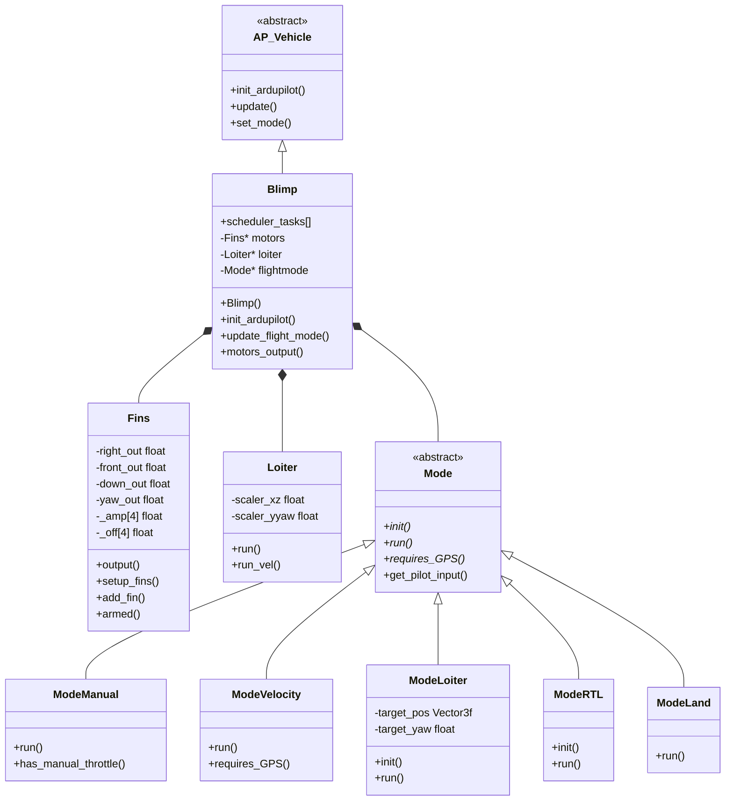
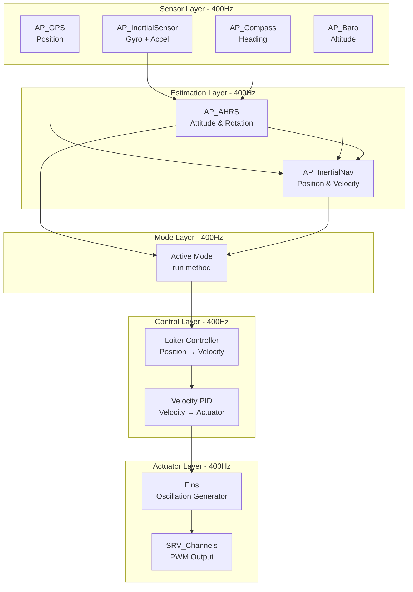
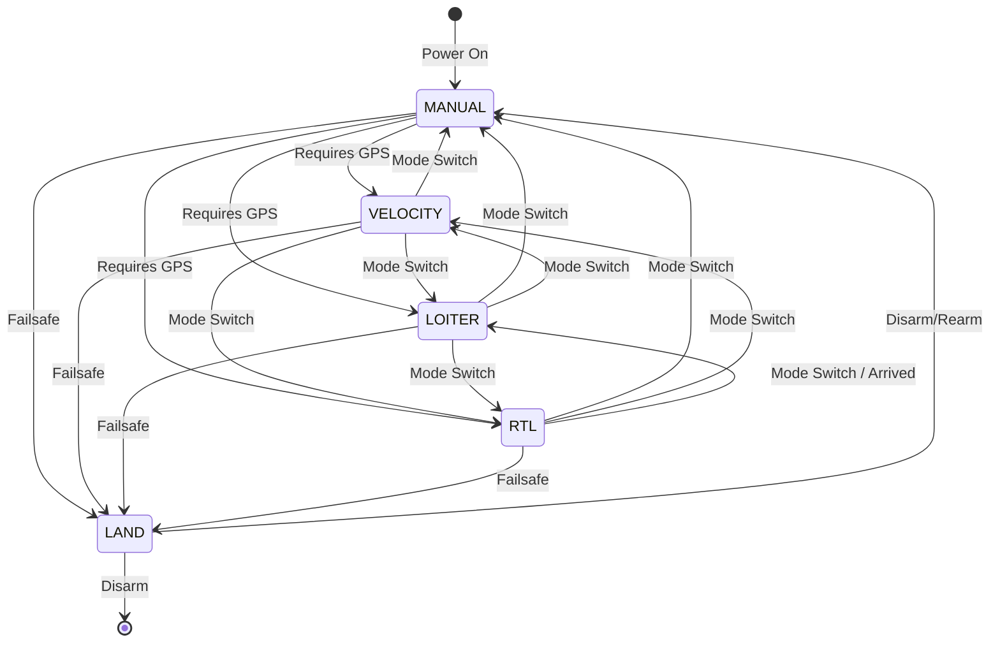
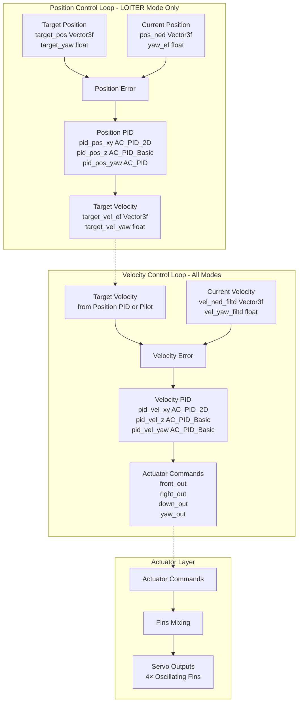

# ArduPilot Blimp - Lighter-Than-Air Vehicle Control


## Table of Contents

- [Overview](#overview)
- [System Architecture](#system-architecture)
- [Unique Control Challenges](#unique-control-challenges)
- [Fin-Based Propulsion System](#fin-based-propulsion-system)
- [Flight Modes](#flight-modes)
- [Control Architecture](#control-architecture)
- [Safety Systems](#safety-systems)
- [Hardware Integration](#hardware-integration)
- [Configuration and Tuning](#configuration-and-tuning)
- [Integration Examples](#integration-examples)
- [API Reference](#api-reference)
- [Testing and Validation](#testing-and-validation)

## Overview

The ArduPilot Blimp implementation provides autonomous control for lighter-than-air vehicles with neutral or near-neutral buoyancy. Unlike traditional multicopters that must constantly fight gravity, blimps achieve equilibrium through buoyancy, resulting in fundamentally different control requirements and challenges.

**Source Files**: `/Blimp/`

### Key Characteristics of Lighter-Than-Air Vehicles

1. **Neutral Buoyancy**: The vehicle neither sinks nor rises when no control input is applied, eliminating the need for continuous vertical thrust
2. **Low Inertia with High Air Resistance**: Large volume relative to mass results in slow response to control inputs but also natural damping
3. **Minimal Power Requirements**: Energy consumption is orders of magnitude lower than multicopters since thrust is only needed for maneuvering
4. **Directional Sensitivity**: Large surface area makes the vehicle susceptible to wind and air currents
5. **Unique Actuator Requirements**: Oscillating fins provide propulsion through cyclic motion rather than continuous thrust

### Design Philosophy

The Blimp implementation adapts ArduPilot's proven architecture for the unique physics of neutral buoyancy:
- **Velocity-centric control**: Position control operates through desired velocity vectors rather than thrust vectors
- **Cascaded PID loops**: Position → Velocity → Actuator output with specialized tuning for low-inertia dynamics
- **Oscillating actuators**: Fins generate thrust through sinusoidal motion with amplitude and offset modulation
- **Gentle response**: Tuning emphasizes stability over agility due to the vehicle's delicate nature

### Supported Configurations

Currently, the Blimp implementation supports the **Airfish** frame configuration:
- 4 oscillating fins arranged in a cross pattern (Front, Back, Left, Right)
- Fins provide independent control authority in all 4 degrees of freedom (X, Y, Z, Yaw)
- Sinusoidal oscillation with configurable frequency (default: 3 Hz)
- Amplitude and offset modulation for direction and magnitude control

## System Architecture

### Class Hierarchy



**Source**: `/Blimp/Blimp.h:77-437`, `/Blimp/mode.h:9-347`, `/Blimp/Fins.h:9-106`, `/Blimp/Loiter.h:39-59`

### Data Flow Pipeline



**Source**: `/Blimp/Blimp.cpp:51-96` (scheduler_tasks), `/Blimp/Blimp.cpp:219-248` (read_AHRS)

### Scheduler Tasks

The Blimp scheduler operates with a fast loop at 400Hz and slower periodic tasks:

| Task | Rate (Hz) | Time (μs) | Priority | Description |
|------|-----------|-----------|----------|-------------|
| ins.update | 400 | - | 0 | Update inertial sensors (FAST_TASK) |
| motors_output | 400 | - | 1 | Output fin commands (FAST_TASK) |
| read_AHRS | 400 | - | 2 | Run EKF state estimator (FAST_TASK) |
| read_inertia | 400 | - | 3 | Update inertial navigation (FAST_TASK) |
| check_ekf_reset | 400 | - | 4 | Check for EKF heading/position resets |
| update_flight_mode | 400 | - | 5 | Run active mode controller (FAST_TASK) |
| update_home_from_EKF | 400 | - | 6 | Update home position if needed |
| rc_loop | 100 | 130 | 7 | Read RC input and mode switch |
| throttle_loop | 50 | 75 | 8 | Update auto-arm status |
| gps.update | 50 | 200 | 9 | Update GPS data |
| update_batt_compass | 10 | 120 | 10 | Read battery and compass |
| update_altitude | 10 | 100 | 11 | Read barometer |
| three_hz_loop | 3 | 75 | 12 | GCS failsafe check |
| full_rate_logging | 50 | 50 | 13 | Log attitude and PIDs |
| ekf_check | 10 | 75 | 14 | Monitor EKF health |
| check_vibration | 10 | 50 | 15 | Monitor vibration levels |
| gpsglitch_check | 10 | 50 | 16 | Detect GPS glitches |

**Source**: `/Blimp/Blimp.cpp:51-96`

### Core Subsystems

**Inertial Navigation** (`inertial_nav`):
- Fuses IMU, GPS, and barometer data for position and velocity estimates
- Provides NED (North-East-Down) frame position relative to home
- Filters velocity estimates through notch filters to remove oscillation artifacts

**Source**: `/Blimp/Blimp.h:226`, `/Blimp/Blimp.cpp:219-248`

**Velocity Filtering**:
```cpp
// Notch filters remove fin oscillation frequencies from velocity estimates
NotchFilterVector2f vel_xy_filter;  // XY velocity filter
NotchFilterFloat vel_z_filter;      // Z velocity filter  
NotchFilterFloat vel_yaw_filter;    // Yaw rate filter
```

**Source**: `/Blimp/Blimp.h:221-223`

## Unique Control Challenges

### Neutral Buoyancy Dynamics

Unlike multicopters where gravity provides a constant downward force requiring continuous thrust, blimps operate at neutral buoyancy where:

1. **Net vertical force ≈ 0**: Buoyancy balances weight, eliminating hover power requirements
2. **Disturbance rejection is passive**: The vehicle naturally returns to equilibrium altitude
3. **Control authority is symmetric**: Equal effort required to move up or down
4. **Position hold is energy-free**: No power needed to maintain altitude

### Low Inertia, High Drag

The large volume-to-mass ratio creates unique dynamic characteristics:

**Advantages**:
- Natural damping from air resistance reduces oscillations
- Forgiving response to control errors
- Inherently stable in still air

**Challenges**:
- Slow response to control inputs (seconds, not milliseconds)
- High susceptibility to wind disturbances
- Difficulty achieving precise position hold in turbulence
- Control authority varies with airspeed

### Oscillating Fin Propulsion

Traditional propeller-based systems are inefficient for the low thrust requirements of neutral buoyancy vehicles. The Blimp implementation uses biomimetic oscillating fins:

**Advantages**:
- Higher efficiency at low Reynolds numbers
- Quieter operation
- Omnidirectional thrust without complex mixing

**Challenges**:
- Nonlinear thrust characteristics
- Coupling between amplitude, frequency, and offset
- Thrust output depends on oscillation phase
- Requires specialized control algorithms

### Control Scaling Requirements

The Loiter controller implements dynamic output scaling to prevent control saturation:

```cpp
// Scale control outputs to prevent exceeding combined limits
float xz_out = fabsf(motors->front_out) + fabsf(motors->down_out);
if (xz_out > 1) {
    scaler_xz = 1 / xz_out;  // Scale front/down to fit within limits
}

float yyaw_out = fabsf(motors->right_out) + fabsf(motors->yaw_out);
if (yyaw_out > 1) {
    scaler_yyaw = 1 / yyaw_out;  // Scale right/yaw to fit within limits
}
```

**Source**: `/Blimp/Loiter.cpp:13-28`

This ensures that when multiple axes require large outputs simultaneously, all outputs are proportionally reduced to maintain control authority without saturation.

## Fin-Based Propulsion System

The `Fins` class implements the unique oscillating fin actuator system used by the Blimp.

### Oscillation Principle

Each fin generates thrust through sinusoidal oscillation with two control parameters:
1. **Amplitude**: Determines thrust magnitude (larger amplitude = more thrust)
2. **Offset**: Determines mean position (offset allows directional bias)

The position of each fin follows:
```
position(t) = amplitude × cos(2π × frequency × t) + offset
```

**Source**: `/Blimp/Fins.cpp:131`

### Fin Configuration (Airfish Frame)

The default Airfish configuration uses 4 fins arranged in a cross pattern:

| Fin # | Position | Right Amp | Front Amp | Down Amp | Yaw Amp | Right Off | Front Off | Down Off | Yaw Off |
|-------|----------|-----------|-----------|----------|---------|-----------|-----------|----------|---------|
| 0 | Back | 0 | +1 | 0.5 | 0 | 0 | 0 | 0.5 | 0 |
| 1 | Front | 0 | -1 | 0.5 | 0 | 0 | 0 | 0.5 | 0 |
| 2 | Right | -1 | 0 | 0 | 0.5 | 0 | 0 | 0 | 0.5 |
| 3 | Left | +1 | 0 | 0 | 0.5 | 0 | 0 | 0 | -0.5 |

**Source**: `/Blimp/Fins.cpp:40-43`

**Interpretation**:
- **Back fin (0)**: Front amplitude +1 (oscillates to push forward), Down amp 0.5, Down offset 0.5 (assists vertical)
- **Front fin (1)**: Front amplitude -1 (oscillates to push backward), Down amp 0.5, Down offset 0.5 (assists vertical)
- **Right fin (2)**: Right amplitude -1 (oscillates to push left), Yaw amp 0.5, Yaw offset 0.5 (assists rotation)
- **Left fin (3)**: Right amplitude +1 (oscillates to push right), Yaw amp 0.5, Yaw offset -0.5 (counter-rotation)

### Control Mixing

The `output()` method converts high-level commands to fin parameters:

```cpp
// Input commands (range: -1 to +1)
right_out  // Rightward movement (negative = left)
front_out  // Forward movement (negative = backward)
down_out   // Downward movement (negative = up)
yaw_out    // Yaw right (negative = yaw left)

// For each fin, calculate amplitude and offset
for (int8_t i=0; i<NUM_FINS; i++) {
    _amp[i] = fmaxf(0, _right_amp_factor[i]*right_out) + 
              fmaxf(0, _front_amp_factor[i]*front_out) +
              fabsf(_down_amp_factor[i]*down_out) + 
              fabsf(_yaw_amp_factor[i]*yaw_out);
              
    _off[i] = _right_off_factor[i]*right_out + 
              _front_off_factor[i]*front_out +
              _down_off_factor[i]*down_out + 
              _yaw_off_factor[i]*yaw_out;
}
```

**Source**: `/Blimp/Fins.cpp:96-99`

### Amplitude and Offset Limiting

To ensure fin positions remain within servo limits:

```cpp
// Average offsets when multiple axes contribute
if (_num_added > 0) {
    _off[i] = _off[i] / _num_added;
}

// Ensure amplitude + |offset| ≤ 1 (servo range: -1 to +1)
if ((_amp[i] + fabsf(_off[i])) > 1) {
    _amp[i] = 1 - fabsf(_off[i]);  // Reduce amplitude to fit
}
```

**Source**: `/Blimp/Fins.cpp:116-122`

### Turbo Mode

An optional "turbo mode" doubles the oscillation frequency when a fin has high offset but low amplitude, providing faster response:

```cpp
if (turbo_mode) {
    // Double frequency when amplitude ≤ 0.6 and |offset| ≥ 0.4
    if (_amp[i] <= 0.6 && fabsf(_off[i]) >= 0.4) {
        _freq[i] = 2;
    }
}
```

**Source**: `/Blimp/Fins.cpp:124-129`

### Parameters

| Parameter | Description | Default | Range |
|-----------|-------------|---------|-------|
| `FINS_FREQ_HZ` | Oscillation frequency (Hz) | 3.0 | 1-10 |
| `FINS_TURBO_MODE` | Enable frequency doubling | 0 (disabled) | 0-1 |

**Source**: `/Blimp/Fins.cpp:11-26`

### Output Generation

The final servo position is calculated and output to SRV_Channels:

```cpp
// Generate sinusoidal position
_pos[i] = _amp[i] * cosf(freq_hz * _freq[i] * _time * 2 * M_PI) + _off[i];

// Output scaled to servo range
SRV_Channels::set_output_scaled(
    SRV_Channels::get_motor_function(i), 
    _pos[i] * FIN_SCALE_MAX
);
```

**Source**: `/Blimp/Fins.cpp:131-132`

## Flight Modes

The Blimp implements 5 flight modes, each optimized for different operational scenarios.

### Mode Overview

| Mode | Number | GPS Required | Manual Throttle | Arming Allowed | Autopilot | Description |
|------|--------|--------------|-----------------|----------------|-----------|-------------|
| LAND | 0 | No | Yes | No | No | Stops all movement (emergency mode) |
| MANUAL | 1 | No | Yes | Yes | No | Direct pilot control of velocities |
| VELOCITY | 2 | Yes | No | Yes | No | Velocity stabilization with GPS |
| LOITER | 3 | Yes | No | Yes | No | Position hold with GPS |
| RTL | 4 | Yes | No | Yes | No | Return to launch location |

**Source**: `/Blimp/mode.h:14-22`, `/Blimp/mode.cpp:28-53`

### Mode State Machine



**Source**: `/Blimp/mode.cpp:60-119`

### Mode Transition Validation

Mode changes are validated before accepting:

```cpp
bool Blimp::set_mode(Mode::Number mode, ModeReason reason) {
    // Return immediately if already in desired mode
    if (mode == control_mode) {
        return true;
    }
    
    Mode *new_flightmode = mode_from_mode_num(mode);
    if (new_flightmode == nullptr) {
        return false;  // Invalid mode
    }
    
    bool ignore_checks = !motors->armed();  // Allow any mode when disarmed
    
    // Check GPS requirement
    if (!ignore_checks && 
        new_flightmode->requires_GPS() && 
        !position_ok()) {
        gcs().send_text(MAV_SEVERITY_WARNING, 
                       "Mode change failed: %s requires position", 
                       new_flightmode->name());
        return false;
    }
    
    // Check altitude estimate requirement
    if (!ignore_checks &&
        !ekf_alt_ok() &&
        flightmode->has_manual_throttle() &&
        !new_flightmode->has_manual_throttle()) {
        gcs().send_text(MAV_SEVERITY_WARNING, 
                       "Mode change failed: %s need alt estimate", 
                       new_flightmode->name());
        return false;
    }
    
    // Call mode initialization
    if (!new_flightmode->init(ignore_checks)) {
        return false;
    }
    
    // Perform mode transition
    exit_mode(flightmode, new_flightmode);
    flightmode = new_flightmode;
    control_mode = mode;
    
    return true;
}
```

**Source**: `/Blimp/mode.cpp:60-119`

### MANUAL Mode

**Purpose**: Direct pilot control without stabilization.

**Behavior**:
- Pilot stick inputs directly control desired velocities
- No GPS required
- No position or velocity hold
- Vehicle drifts with wind when sticks centered

**Pilot Input Mapping**:
```cpp
void Mode::get_pilot_input(Vector3f &pilot, float &yaw) {
    pilot.y = channel_right->get_control_in() / float(RC_SCALE);  // Right (-1 to +1)
    pilot.x = channel_front->get_control_in() / float(RC_SCALE);  // Front (-1 to +1)
    pilot.z = -channel_up->get_control_in() / float(RC_SCALE);    // Up (inverted)
    yaw = channel_yaw->get_control_in() / float(RC_SCALE);        // Yaw (-1 to +1)
}
```

**Source**: `/Blimp/mode.cpp:159-175`, `/Blimp/mode.h:129-170`

**Use Cases**:
- Initial testing and tuning
- Manual flight in confined spaces
- Emergency control if GPS fails

### VELOCITY Mode

**Purpose**: Velocity-stabilized flight with GPS.

**Behavior**:
- Pilot inputs command desired velocities
- GPS-based velocity control active
- Vehicle holds velocity when sticks centered (drifts slowly)
- Automatic velocity limiting to configured maximums

**Control Flow**:
1. Read pilot input → desired velocity
2. Constrain to MAX_VEL_XY, MAX_VEL_Z, MAX_VEL_YAW
3. Run velocity PID controllers
4. Output to fins

**Source**: `/Blimp/mode.h:172-214`

**Use Cases**:
- General flying with velocity stabilization
- Smooth camera movements
- Flying in mild wind conditions

### LOITER Mode

**Purpose**: GPS position hold.

**Behavior**:
- Maintains current position and heading
- Pilot inputs override position hold (rate-limited)
- Returns to hold position when sticks released
- Highest precision positioning mode

**Initialization**:
```cpp
bool ModeLoiter::init(bool ignore_checks) {
    // Capture current position and yaw as targets
    target_pos = blimp.pos_ned;
    target_yaw = blimp.ahrs.get_yaw_rad();
    return true;
}
```

**Source**: `/Blimp/mode.h:216-260`

**Control Flow**:
1. Position error → velocity command (Position PID)
2. Velocity command → actuator output (Velocity PID)
3. Uses `Loiter::run()` with target_pos and target_yaw

**Use Cases**:
- Station keeping
- Aerial observation from fixed point
- Precision positioning tasks

### RTL (Return to Launch) Mode

**Purpose**: Automatic return to launch location.

**Behavior**:
- Navigates to home position using position controller
- Maintains launch altitude during transit
- Switches to LOITER when within threshold of home
- Can be overridden by pilot or mode change

**Initialization**:
```cpp
bool ModeRTL::init(bool ignore_checks) {
    // Validate home position is set
    if (!AP::ahrs().home_is_set()) {
        return false;
    }
    return true;
}
```

**Source**: `/Blimp/mode.h:305-346`

**Use Cases**:
- Automatic return on low battery
- Return on failsafe trigger
- Operator-commanded return

### LAND Mode

**Purpose**: Emergency stop mode.

**Behavior**:
- Zeros all fin outputs immediately
- Vehicle drifts with ambient air movement
- Descends or ascends toward neutral buoyancy
- Cannot arm in this mode (safety feature)

**Source**: `/Blimp/mode.h:262-303`

**Use Cases**:
- Emergency stop
- Failsafe landing action
- Controlled shutdown

## Control Architecture

The Blimp uses cascaded PID control loops: Position → Velocity → Actuator Output.

### Control Loop Hierarchy



### PID Controller Instances

The Blimp maintains six separate PID controllers:

**Position PIDs** (convert position error to velocity command):
```cpp
// XY Position PID (2D controller for horizontal position)
AC_PID_2D pid_pos_xy{1, 0.05, 0, 0, 0.1, 3, 3};
// P=1, I=0.05, D=0, FF=0, IMAX=0.1, FiltHz=3, FiltDHz=3

// Z Position PID (vertical position)
AC_PID_Basic pid_pos_z{0.7, 0, 0, 0, 0, 3, 3};
// P=0.7, I=0, D=0, FF=0, IMAX=0, FiltHz=3, FiltDHz=3

// Yaw Position PID (heading)
AC_PID pid_pos_yaw{1.2, 0.5, 0, 0, 2, 3, 3, 3};
// P=1.2, I=0.5, D=0, FF=0, IMAX=2, FiltT=3, FiltE=3, FiltD=3
```

**Velocity PIDs** (convert velocity error to actuator output):
```cpp
// XY Velocity PID (2D controller for horizontal velocity)
AC_PID_2D pid_vel_xy{3, 0.2, 0, 0, 0.2, 3, 3};
// P=3, I=0.2, D=0, FF=0, IMAX=0.2, FiltHz=3, FiltDHz=3

// Z Velocity PID (vertical velocity)
AC_PID_Basic pid_vel_z{7, 1.5, 0, 0, 1, 3, 3};
// P=7, I=1.5, D=0, FF=0, IMAX=1, FiltHz=3, FiltDHz=3

// Yaw Velocity PID (yaw rate)
AC_PID_Basic pid_vel_yaw{3, 0.4, 0, 0, 0.2, 3, 3};
// P=3, I=0.4, D=0, FF=0, IMAX=0.2, FiltHz=3, FiltDHz=3
```

**Source**: `/Blimp/Blimp.h:229-235`

### Tuning Philosophy

The default PID gains reflect the unique characteristics of neutral buoyancy vehicles:

1. **High Velocity P Gains (3-7)**: Compensate for low inertia and high drag
2. **Moderate Velocity I Gains (0.2-1.5)**: Counteract steady-state wind disturbances
3. **Zero D Gains**: Derivative action causes instability due to noisy velocity estimates and low inertia
4. **Low Position P Gains (0.7-1.2)**: Prevent aggressive position corrections that would excite oscillations
5. **Tight IMAX Limits (0.1-2)**: Prevent integrator windup during sustained disturbances

### Control Flow in LOITER Mode

The `Loiter::run()` method implements the complete position → velocity → actuator pipeline:

```cpp
void Loiter::run(Vector3f& target_pos, float& target_yaw, Vector4b axes_disabled) {
    // 1. Calculate position error
    Vector3f err_xyz = target_pos - blimp.pos_ned;
    float err_yaw = wrap_PI(target_yaw - yaw_ef);
    
    // 2. Position PID → Target Velocity
    Vector3f target_vel_ef;
    target_vel_ef = blimp.pid_pos_xy.update_all(target_pos, blimp.pos_ned, dt, limit);
    target_vel_ef.z = blimp.pid_pos_z.update_all(target_pos.z, blimp.pos_ned.z, dt, limit.z);
    float target_vel_yaw = blimp.pid_pos_yaw.update_error(wrap_PI(target_yaw - yaw_ef), dt, limit.yaw);
    
    // 3. Constrain velocity commands
    Vector3f target_vel_ef_c{
        constrain_float(target_vel_ef.x, -blimp.g.max_vel_xy, blimp.g.max_vel_xy),
        constrain_float(target_vel_ef.y, -blimp.g.max_vel_xy, blimp.g.max_vel_xy),
        constrain_float(target_vel_ef.z, -blimp.g.max_vel_z, blimp.g.max_vel_z)
    };
    
    // 4. Apply dynamic scaling
    Vector2f target_vel_ef_c_scaled_xy = {
        target_vel_ef_c.x * scaler_xz, 
        target_vel_ef_c.y * scaler_yyaw
    };
    
    // 5. Velocity PID → Actuator Output
    Vector2f actuator = blimp.pid_vel_xy.update_all(
        target_vel_ef_c_scaled_xy, 
        vel_ned_filtd_scaled_xy, 
        dt, 
        limit
    );
    float act_down = blimp.pid_vel_z.update_all(
        target_vel_ef_c.z * scaler_xz, 
        blimp.vel_ned_filtd.z * scaler_xz, 
        dt, 
        limit.z
    );
    
    // 6. Rotate to body frame and output
    blimp.rotate_NE_to_BF(actuator);
    blimp.motors->front_out = actuator.x;
    blimp.motors->right_out = actuator.y;
    blimp.motors->down_out = act_down;
    blimp.motors->yaw_out = act_yaw;
}
```

**Source**: `/Blimp/Loiter.cpp:8-132`

### Control Flow in VELOCITY Mode

The `Loiter::run_vel()` method bypasses the position loop:

```cpp
void Loiter::run_vel(Vector3f& target_vel_ef, float& target_vel_yaw, Vector4b axes_disabled) {
    // 1. Constrain velocity commands
    Vector3f target_vel_ef_c = {/* constrain to limits */};
    
    // 2. Apply dynamic scaling
    Vector2f target_vel_ef_c_scaled_xy = {/* scale velocities */};
    
    // 3. Velocity PID → Actuator Output (same as LOITER step 5)
    Vector2f actuator = blimp.pid_vel_xy.update_all(/* ... */);
    
    // 4. Output to fins
    blimp.motors->front_out = actuator.x;
    blimp.motors->right_out = actuator.y;
    // ... etc
}
```

**Source**: `/Blimp/Loiter.cpp:134-210`

### Coordinate Frame Transformations

The control system operates in multiple coordinate frames:

**Earth Frame (NED - North-East-Down)**:
- Position: `pos_ned` (meters relative to home)
- Velocity: `vel_ned_filtd` (m/s in earth frame)
- Used for GPS-based navigation

**Body Frame (FRD - Forward-Right-Down)**:
- Actuator outputs: `front_out`, `right_out`, `down_out`
- Fin commands referenced to vehicle orientation
- Used for actuator control

**Transformation**:
```cpp
void Blimp::rotate_NE_to_BF(Vector2f &vec) {
    float bf_x = vec.x * ahrs.cos_yaw() + vec.y * ahrs.sin_yaw();
    float bf_y = -vec.x * ahrs.sin_yaw() + vec.y * ahrs.cos_yaw();
    vec.x = bf_x;
    vec.y = bf_y;
}
```

**Source**: `/Blimp/Blimp.cpp:277-283`

**Note**: Z-axis and yaw transformations are not required since they are already aligned between frames (down is down in both frames, yaw is about the same axis).

### PID Reset on Disarm

All integrators are reset when the vehicle is disarmed to prevent windup:

```cpp
if (!blimp.motors->armed()) {
    blimp.pid_pos_xy.set_integrator(Vector2f(0,0));
    blimp.pid_pos_z.set_integrator(0);
    blimp.pid_pos_yaw.set_integrator(0);
    blimp.pid_vel_xy.set_integrator(Vector2f(0,0));
    blimp.pid_vel_z.set_integrator(0);
    blimp.pid_vel_yaw.set_integrator(0);
    target_pos = blimp.pos_ned;
    target_yaw = blimp.ahrs.get_yaw_rad();
}
```

**Source**: `/Blimp/Loiter.cpp:91-100`

## Safety Systems

The Blimp implements multiple layers of safety systems to protect the vehicle and surroundings.

### Arming System

**Pre-Arm Checks** (via `AP_Arming_Blimp`):
- GPS lock quality (HDOP < GPS_HDOP_GOOD)
- EKF health and variance checks
- Compass calibration and health
- Battery voltage sufficient
- RC transmitter connected
- Barometer health
- Accelerometer calibration

**Arming Procedure**:
1. Ensure all pre-arm checks pass
2. Set flight mode to MANUAL, VELOCITY, or LOITER (cannot arm in LAND)
3. Arm via RC stick command or GCS
4. `armed()` flag set, fins enabled

**Disarming**:
- Automatic after landing detected + disarm delay (default: 20 seconds)
- Manual via RC stick command or GCS
- Forced on crash detection
- Forced on certain failsafes

**Source**: `/Blimp/Blimp.h:120-121`, `/Blimp/Parameters.cpp:162-168`

### Failsafe System

The Blimp monitors multiple failure conditions and takes protective action:

```cpp
struct {
    uint8_t radio : 1;  // RC transmitter connection lost
    uint8_t gcs : 1;    // Ground station connection lost
    uint8_t ekf : 1;    // EKF health failure
} failsafe;

bool any_failsafe_triggered() const {
    return failsafe.radio || battery.has_failsafed() || failsafe.gcs || failsafe.ekf;
}
```

**Source**: `/Blimp/Blimp.h:178-189`

### Radio Failsafe

**Trigger**: RC signal lost or throttle channel < FS_THR_VALUE for > 1 second

**Actions** (configurable via FS_THR_ENABLE):
- `0`: Disabled (no action)
- `3`: Always LAND (default)

**Recovery**: Automatic if RC signal restored

**Source**: `/Blimp/Parameters.cpp:75-89`

```cpp
void Blimp::failsafe_radio_on_event() {
    // Set failsafe flag
    set_failsafe_radio(true);
    
    // Execute configured action
    do_failsafe_action(Failsafe_Action_Land, ModeReason::RADIO_FAILSAFE);
}
```

### GCS Failsafe

**Trigger**: No MAVLink heartbeat received for > 5 seconds

**Actions** (configurable via FS_GCS_ENABLE):
- `0`: Disabled (no action)
- `5`: LAND (default)

**Recovery**: Automatic if GCS heartbeat restored

**Source**: `/Blimp/Parameters.cpp:61-66`, `/Blimp/Blimp.cpp:196-200`

```cpp
void Blimp::three_hz_loop() {
    // Check if we've lost contact with ground station
    failsafe_gcs_check();
}
```

### EKF Failsafe

**Trigger**: EKF variance exceeds FS_EKF_THRESH for > 1 second

**Monitored Variances**:
- Compass variance
- Velocity variance  
- Position variance (if available)

**Actions** (configurable via FS_EKF_ACTION):
- `1`: LAND (default)
- `3`: LAND even if in MANUAL mode

**No Automatic Recovery**: Requires manual mode change after EKF health restored

**Source**: `/Blimp/Parameters.cpp:170-182`

```cpp
void Blimp::ekf_check() {
    // Check EKF variance against threshold
    if (ekf_over_threshold()) {
        // Start failsafe timer
        // Trigger after 1 second continuous fault
        failsafe_ekf_event();
    } else {
        failsafe_ekf_off_event();
    }
}
```

### Battery Failsafe

**Trigger** (via `AP_BattMonitor`):
- Battery voltage < BATT_LOW_VOLT
- Battery remaining capacity < BATT_LOW_MAH
- Battery current > BATT_CRT_MAH for sustained period

**Actions** (configurable per battery):
- Warning: GCS notification only
- Land: Switch to LAND mode
- Return: Switch to RTL mode (then LAND if RTL unavailable)

**Source**: `/Blimp/Blimp.h:202-204`

### Crash Detection

**Purpose**: Detect crashes and disarm to prevent damage

**Detection Method**:
- Monitor for sudden deceleration
- Check for unexpected attitude changes
- Verify expected vehicle response to commands

**Action**: Immediate disarm of fins

**Enable/Disable**: Via `FS_CRASH_CHECK` parameter (default: enabled)

**Source**: `/Blimp/Parameters.cpp:184-189`

### Vibration Monitoring

**Purpose**: Detect excessive vibration that could affect sensor accuracy

**Effects**:
- Logs high vibration events
- May trigger EKF failsafe if variance increases
- GCS warning notifications

**Source**: `/Blimp/Blimp.h:128-132`, `/Blimp/Blimp.cpp:83`

```cpp
struct {
    bool high_vibes;      // true while high vibration detected
    uint32_t start_ms;    // system time high vibration last detected
    uint32_t clear_ms;    // system time high vibrations stopped
} vibration_check;
```

### Geofence

**Purpose**: Limit vehicle travel to defined geographic boundaries

**Implementation**: Uses `AC_Fence` library (configuration via standard fence parameters)

**Actions on Breach**:
- RTL to home location
- LAND if RTL unavailable

**Source**: `/Blimp/Blimp.h:334`

### Failsafe Priority System

When multiple failsafes trigger simultaneously, actions are prioritized:

```cpp
static constexpr int8_t _failsafe_priorities[] = {
    Failsafe_Action_Terminate,  // Highest priority (not used on Blimp)
    Failsafe_Action_Land,       // Priority 1
    Failsafe_Action_None,       // Priority 2 (no action)
    -1                          // Sentinel
};
```

**Source**: `/Blimp/Blimp.h:270-275`

**Result**: LAND action takes precedence over other actions.

## Hardware Integration

### Supported Autopilot Boards

The Blimp firmware supports all standard ArduPilot-compatible flight controllers:

**Recommended Boards**:
- Pixhawk 4 / Pixhawk 6C / Pixhawk 6X
- Cube Orange / Cube Purple
- Holybro Kakute H7 / Durandal
- mRo Pixracer
- Any ChibiOS-based flight controller

**Minimum Requirements**:
- IMU (accelerometer + gyroscope)
- Barometer
- Compass
- GPS module (for VELOCITY, LOITER, RTL modes)
- 4× servo outputs for fins

**Source**: Hardware abstraction via `/libraries/AP_HAL_ChibiOS/`

### Sensor Configuration

**IMU (Inertial Measurement Unit)**:
- Update rate: 400 Hz (via fast loop)
- Automatic gyro calibration on startup
- Accelerometer calibration required before first flight
- Multiple IMU support with automatic failover

**GPS**:
- Required for: VELOCITY, LOITER, RTL modes
- Recommended: UBLOX M8N or better
- Minimum 5 Hz update rate (10 Hz preferred)
- HDOP < 2.0 required for arming

**Barometer**:
- Used for altitude estimation
- Fusion with GPS altitude in EKF
- Temperature compensation active

**Compass**:
- Required for accurate heading
- Automatic calibration procedures available
- Compass-motor interference compensation supported

**Source**: `/Blimp/Blimp.h:38-42`, `/Blimp/Blimp.cpp:69-70`

### Servo Output Mapping

The fins connect to the first 4 servo outputs:

| Servo Output | Function | Fin Position | Default PWM Range |
|--------------|----------|--------------|-------------------|
| Servo 1 | Motor 1 | Back Fin | 1000-2000 μs |
| Servo 2 | Motor 2 | Front Fin | 1000-2000 μs |
| Servo 3 | Motor 3 | Right Fin | 1000-2000 μs |
| Servo 4 | Motor 4 | Left Fin | 1000-2000 μs |

**Configuration**:
```cpp
SRV_Channels::set_angle(SRV_Channel::k_motor1, FIN_SCALE_MAX);
SRV_Channels::set_angle(SRV_Channel::k_motor2, FIN_SCALE_MAX);
SRV_Channels::set_angle(SRV_Channel::k_motor3, FIN_SCALE_MAX);
SRV_Channels::set_angle(SRV_Channel::k_motor4, FIN_SCALE_MAX);
```

**Source**: `/Blimp/Fins.cpp:45-48`

### RC Input Mapping

Default channel assignments for Blimp control:

| RC Channel | Control Function | Range | Description |
|------------|------------------|-------|-------------|
| Channel 1 | Front (Pitch) | -1 to +1 | Forward/Backward |
| Channel 2 | Right (Roll) | -1 to +1 | Right/Left |
| Channel 3 | Up (Throttle) | -1 to +1 | Up/Down (inverted) |
| Channel 4 | Yaw | -1 to +1 | Rotate Right/Left |
| Channel 5 | Flight Mode | PWM | Mode selection switch |

**Source**: `/Blimp/Blimp.h:110-114`, `/Blimp/mode.cpp:159-175`

**Customization**: RC channel mapping can be changed via `RCMAPx` parameters.

### Power Requirements

**Typical Power Consumption** (Airfish configuration):
- Hover (position hold): 5-15W (very low due to neutral buoyancy)
- Moderate maneuvers: 15-30W
- Aggressive maneuvers: 30-50W

**Recommended Battery**:
- 3S-4S LiPo, 2200-5000 mAh
- Flight times: 30 minutes to 2+ hours depending on mission profile

**Power Distribution**:
- Autopilot: 5V via built-in regulator
- Servos: Direct from battery or BEC (check servo voltage compatibility)
- Sensors: 5V or 3.3V via autopilot

### Airframe Setup

**Steps for New Airfish Frame**:

1. **Mechanical**:
   - Install autopilot at center of mass
   - Mount GPS away from power wiring (magnetic interference)
   - Position compass away from motors/servos
   - Connect 4 fin servos to outputs 1-4

2. **Power**:
   - Connect battery to power module
   - Connect power module to autopilot
   - Connect servo power (if separate BEC used)

3. **Calibration**:
   - Level calibration (autopilot mounted level)
   - Accelerometer calibration (6-position)
   - Compass calibration (rotation method)
   - RC calibration (stick endpoints and center)

4. **Configuration**:
   - Set `FRAME_CLASS = 0` (Airfish)
   - Verify `FINS_FREQ_HZ` (default: 3)
   - Configure flight modes on channel 5
   - Set `ARMING_CHECK = 1` (all pre-arm checks)

5. **Initial Testing**:
   - Test fin oscillation (MANUAL mode, disarmed)
   - Verify fin directions match expected
   - Test arming sequence
   - Perform tethered hover test

## Configuration and Tuning

### Essential Parameters

**Flight Mode Configuration**:
```
FLTMODE1 = 1   # MANUAL
FLTMODE2 = 2   # VELOCITY
FLTMODE3 = 3   # LOITER
FLTMODE4 = 4   # RTL
FLTMODE5 = 0   # LAND
FLTMODE6 = 3   # LOITER
FLTMODE_CH = 5 # Use channel 5 for mode selection
INITIAL_MODE = 1  # Start in MANUAL mode
```

**Source**: `/Blimp/Parameters.cpp:100-149`

**Velocity Limits**:
```
MAX_VEL_XY = 0.5   # Maximum horizontal velocity (m/s)
MAX_VEL_Z = 0.3    # Maximum vertical velocity (m/s)
MAX_VEL_YAW = 0.5  # Maximum yaw rate (rad/s)
```

**Source**: `/Blimp/Parameters.cpp:191-228`

**Fins Configuration**:
```
FINS_FREQ_HZ = 3      # Oscillation frequency (Hz)
FINS_TURBO_MODE = 0   # Disable turbo mode initially
```

**Source**: `/Blimp/Fins.cpp:13-25`

**Failsafe Configuration**:
```
FS_THR_ENABLE = 3     # Always LAND on RC failsafe
FS_THR_VALUE = 975    # RC failsafe trigger PWM
FS_GCS_ENABLE = 5     # LAND on GCS failsafe (5 sec timeout)
FS_EKF_ACTION = 1     # LAND on EKF failsafe
FS_EKF_THRESH = 0.8   # EKF variance threshold
FS_CRASH_CHECK = 1    # Enable crash detection
```

**Source**: `/Blimp/Parameters.cpp:75-189`

### PID Tuning Guide

**Initial Setup** (defaults are usually adequate):

The default PID values are tuned for a moderate-sized blimp (1-2m diameter). Adjust if your vehicle behaves differently:

**If vehicle oscillates in position hold**:
- Reduce `ATC_POS_XY_P` from 1.0
- Reduce `ATC_POS_Z_P` from 0.7
- Reduce `ATC_VEL_XY_P` from 3.0

**If vehicle responds too slowly**:
- Increase `ATC_VEL_XY_P` above 3.0
- Increase `ATC_VEL_Z_P` above 7.0
- Increase `ATC_VEL_YAW_P` above 3.0

**If vehicle drifts in wind**:
- Increase `ATC_VEL_XY_I` above 0.2
- Increase `ATC_VEL_Z_I` above 1.5
- Check velocity limits aren't too restrictive

**If vehicle has integrator windup**:
- Reduce `ATC_VEL_XY_IMAX` below 0.2
- Reduce `ATC_VEL_Z_IMAX` below 1.0
- Reduce `ATC_POS_XY_IMAX` below 0.1

### Tuning Procedure

1. **Start in MANUAL Mode**:
   - Verify all fins operate correctly
   - Confirm control directions are correct
   - Test vehicle response to inputs

2. **Test VELOCITY Mode**:
   - Verify velocity stabilization works
   - Vehicle should hold velocity when sticks centered
   - Check velocity limits are appropriate

3. **Tune Velocity PIDs** (if needed):
   - Adjust P gains for desired response speed
   - Add I gain if steady-state errors present
   - Monitor for oscillations

4. **Test LOITER Mode**:
   - Verify position hold functionality
   - Check for hunting or oscillations
   - Assess wind rejection capability

5. **Tune Position PIDs** (if needed):
   - Reduce P gains if vehicle overshoots
   - Add I gain for improved wind rejection
   - Balance responsiveness vs stability

6. **Test RTL**:
   - Verify navigation to home
   - Check behavior on arrival
   - Test failsafe triggers

### Advanced Tuning

**Velocity Filtering**:

The notch filters remove fin oscillation artifacts from velocity estimates:

```cpp
NotchFilterVector2f vel_xy_filter;
NotchFilterFloat vel_z_filter;
NotchFilterFloat vel_yaw_filter;
```

**Source**: `/Blimp/Blimp.h:221-223`

**Filter Configuration**:
- Center frequency: `FINS_FREQ_HZ` (automatically tracked)
- Bandwidth: Configured in filter initialization
- Typically no manual adjustment needed

**PID Deadzone**:

```
PID_DZ = 0.01  # Position error deadzone (meters)
```

Prevents continuous small corrections when close to target. Increase if vehicle "hunts" around setpoint.

**Source**: `/Blimp/Parameters.cpp:250-252`

**Axis Disable Mask**:

```
DIS_MASK = 0  # Bitmask: bit 0=Y, bit 1=X, bit 2=Z, bit 3=Yaw
```

Allows disabling control on specific axes for testing:
- Bit 0: Disable Y (Right/Left) control
- Bit 1: Disable X (Front/Back) control
- Bit 2: Disable Z (Up/Down) control
- Bit 3: Disable Yaw control

**Source**: `/Blimp/Parameters.cpp:250-252`, `/Blimp/Loiter.cpp:42-53`

### Logging Configuration

```
LOG_BITMASK = 65535  # Enable all log types
```

**Recommended Log Types for Tuning**:
- Fast Attitude (bit 0): Attitude at 50Hz
- Control Tuning (bit 4): PID outputs
- PID (bit 12): Individual PID components
- RC Input (bit 6): Pilot commands
- RC Output (bit 10): Fin positions

**Source**: `/Blimp/Parameters.cpp:151-156`

**Custom Log Messages**:
- `FINI`: Fin inputs (right, front, down, yaw commands)
- `FINO`: Fin outputs (amplitudes and offsets for all fins)
- `VNF`: Velocity (filtered and unfiltered)
- `BSC`: Blimp scalers (control output scaling factors)
- `PSCN`, `PSCE`, `PSCD`: Position controller North, East, Down

**Source**: `/Blimp/Fins.cpp:84-137`, `/Blimp/Loiter.cpp:30-35`, `/Blimp/Blimp.cpp:232-246`

## Integration Examples

### Initialization Sequence

```cpp
// Source: Blimp/system.cpp (conceptual - actual implementation in init_ardupilot)

void Blimp::init_ardupilot() {
    // 1. HAL initialization (hardware abstraction layer)
    hal.begin();
    
    // 2. Load parameters from EEPROM
    load_parameters();
    
    // 3. Initialize sensors
    ins.init(scheduler.get_loop_rate_hz());      // IMU at 400Hz
    ahrs.init();                                  // Attitude estimation
    barometer.init();                             // Barometer
    compass.init();                               // Compass
    
    // 4. Initialize GPS
    gps.init();
    
    // 5. Initialize navigation
    inertial_nav.init();
    
    // 6. Allocate and initialize motors (fins)
    allocate_motors();
    motors->setup_fins();
    
    // 7. Initialize RC input
    init_rc_in();
    init_rc_out();
    
    // 8. Set initial flight mode
    set_mode((Mode::Number)g.initial_mode.get(), ModeReason::INITIALISED);
    
    // 9. Initialize arming system
    arming.init();
    
    // 10. Initialize GCS communication
    gcs().init();
    
    // 11. Mark initialization complete
    ap.initialised = true;
}
```

**Source**: Derived from `/Blimp/Blimp.h:412`

### Main Loop Execution

```cpp
// Source: ArduPilot scheduler (executes scheduler_tasks[])

void main_loop() {
    // Fast loop tasks (400Hz) - highest priority
    ins.update();                    // Read IMU
    motors_output();                 // Output fin commands
    read_AHRS();                    // Update attitude estimate
    read_inertia();                 // Update position/velocity
    check_ekf_reset();              // Check for EKF resets
    update_flight_mode();           // Run active mode controller
    update_home_from_EKF();         // Update home if needed
    
    // Medium rate tasks (100Hz)
    rc_loop();                      // Read RC input
    
    // Slower tasks (10Hz, 3Hz, 1Hz)
    update_batt_compass();          // Battery and compass
    ekf_check();                    // EKF health monitoring
    failsafe_gcs_check();           // GCS connection check
    
    // Logging tasks (various rates)
    full_rate_logging();            // High-rate logging
    
    // GCS communication (400Hz)
    gcs().update_receive();         // Receive MAVLink
    gcs().update_send();            // Send MAVLink
}
```

**Source**: `/Blimp/Blimp.cpp:51-96`

### Creating a Custom Flight Mode

To add a new flight mode (example: `ModeCircle` for circular flight):

**Step 1**: Define mode in `mode.h`:
```cpp
class ModeCircle : public Mode {
public:
    using Mode::Mode;
    
    virtual bool init(bool ignore_checks) override;
    virtual void run() override;
    
    bool requires_GPS() const override { return true; }
    bool has_manual_throttle() const override { return false; }
    bool allows_arming(bool from_gcs) const override { return true; }
    
    const char *name() const override { return "CIRCLE"; }
    const char *name4() const override { return "CIRC"; }
    
    Mode::Number number() const override { return Mode::Number::CIRCLE; }
    
private:
    Vector3f center_pos;
    float radius;
    float angular_velocity;
};
```

**Step 2**: Add mode number to enum in `mode.h`:
```cpp
enum class Number : uint8_t {
    LAND =          0,
    MANUAL =        1,
    VELOCITY =      2,
    LOITER =        3,
    RTL =           4,
    CIRCLE =        5,  // New mode
};
```

**Step 3**: Implement mode in `mode_circle.cpp`:
```cpp
bool ModeCircle::init(bool ignore_checks) {
    // Initialize circle parameters
    center_pos = blimp.pos_ned;
    radius = 5.0;  // 5 meter radius
    angular_velocity = 0.1;  // rad/s
    return true;
}

void ModeCircle::run() {
    // Calculate target position on circle
    float angle = angular_velocity * AP_HAL::millis() * 0.001;
    Vector3f target_pos = center_pos;
    target_pos.x += radius * cosf(angle);
    target_pos.y += radius * sinf(angle);
    
    // Calculate target yaw (tangent to circle)
    float target_yaw = angle + M_PI/2;
    
    // Run loiter controller to target position
    Vector4b axes_disabled{false, false, false, false};
    loiter->run(target_pos, target_yaw, axes_disabled);
}
```

**Step 4**: Register mode in `Blimp.h`:
```cpp
class Blimp : public AP_Vehicle {
    // ... existing modes ...
    ModeCircle mode_circle;
    
    friend class ModeCircle;
};
```

**Step 5**: Add to mode lookup in `mode.cpp`:
```cpp
Mode *Blimp::mode_from_mode_num(const Mode::Number mode) {
    switch (mode) {
        // ... existing cases ...
        case Mode::Number::CIRCLE:
            ret = &mode_circle;
            break;
    }
    return ret;
}
```

## API Reference

### Blimp Class

**Primary vehicle class inheriting from `AP_Vehicle`**

**Source**: `/Blimp/Blimp.h:77-437`

#### Key Methods

```cpp
/**
 * @brief Initialize the Blimp vehicle
 * @details Performs complete system initialization including sensors,
 *          navigation, motors, RC, and communication systems.
 */
void init_ardupilot() override;

/**
 * @brief Set vehicle flight mode
 * @param mode Desired flight mode number
 * @param reason Reason for mode change (for logging)
 * @return true if mode change successful, false if rejected
 * 
 * @note Mode changes may be rejected if requirements not met
 *       (e.g., GPS required but not available)
 */
bool set_mode(Mode::Number mode, ModeReason reason);

/**
 * @brief Execute current flight mode controller
 * @details Called at 400Hz from scheduler fast loop.
 *          Delegates to active mode's run() method.
 */
void update_flight_mode();

/**
 * @brief Output commands to fin servos
 * @details Called at 400Hz from scheduler fast loop.
 *          Converts control commands to servo PWM outputs.
 */
void motors_output();

/**
 * @brief Update AHRS and navigation estimates
 * @details Runs EKF, updates position and velocity estimates,
 *          applies notch filtering to remove fin oscillations.
 * @note Called at 400Hz
 */
void read_AHRS();

/**
 * @brief Convert earth frame vector to body frame
 * @param[in,out] vec Vector in NE frame (converted to BF in-place)
 * @details Uses current yaw angle for 2D rotation.
 *          Z-axis unchanged (down is down in both frames).
 */
void rotate_NE_to_BF(Vector2f &vec);

/**
 * @brief Convert body frame vector to earth frame
 * @param[in,out] vec Vector in BF frame (converted to NE in-place)
 */
void rotate_BF_to_NE(Vector2f &vec);
```

#### Key Members

```cpp
Fins *motors;              // Fin actuator system
Loiter *loiter;            // Position/velocity controller
Mode *flightmode;          // Active flight mode
Mode::Number control_mode; // Current mode number

// Navigation state
Vector3f pos_ned;          // Position (NED frame, meters)
Vector3f vel_ned;          // Velocity (NED frame, m/s)
Vector3f vel_ned_filtd;    // Filtered velocity
float vel_yaw;             // Yaw rate (rad/s)
float vel_yaw_filtd;       // Filtered yaw rate

// PID controllers
AC_PID_2D pid_vel_xy;      // XY velocity PID
AC_PID_Basic pid_vel_z;    // Z velocity PID
AC_PID_Basic pid_vel_yaw;  // Yaw velocity PID
AC_PID_2D pid_pos_xy;      // XY position PID
AC_PID_Basic pid_pos_z;    // Z position PID
AC_PID pid_pos_yaw;        // Yaw position PID

// Failsafe state
struct failsafe {
    uint8_t radio : 1;     // RC failsafe active
    uint8_t gcs : 1;       // GCS failsafe active
    uint8_t ekf : 1;       // EKF failsafe active
};
```

**Source**: `/Blimp/Blimp.h:192-235`

### Fins Class

**Oscillating fin actuator system**

**Source**: `/Blimp/Fins.h:9-106`, `/Blimp/Fins.cpp`

#### Key Methods

```cpp
/**
 * @brief Constructor
 * @param loop_rate Control loop rate (Hz), typically 400
 */
Fins(uint16_t loop_rate);

/**
 * @brief Configure fins for Airfish frame
 * @details Sets up 4 fins with mixing matrices for
 *          right, front, down, and yaw control.
 */
void setup_fins();

/**
 * @brief Add a fin to the configuration
 * @param fin_num Fin index (0-3)
 * @param right_amp_fac Right amplitude mixing factor
 * @param front_amp_fac Front amplitude mixing factor
 * @param down_amp_fac Down amplitude mixing factor
 * @param yaw_amp_fac Yaw amplitude mixing factor
 * @param right_off_fac Right offset mixing factor
 * @param front_off_fac Front offset mixing factor
 * @param down_off_fac Down offset mixing factor
 * @param yaw_off_fac Yaw offset mixing factor
 */
void add_fin(int8_t fin_num, 
             float right_amp_fac, float front_amp_fac, 
             float down_amp_fac, float yaw_amp_fac,
             float right_off_fac, float front_off_fac, 
             float down_off_fac, float yaw_off_fac);

/**
 * @brief Generate fin positions and output to servos
 * @details Converts control commands (right_out, front_out, etc.) to
 *          amplitude and offset for each fin, then generates sinusoidal
 *          positions and outputs PWM.
 * @note Called at 400Hz
 */
void output();

/**
 * @brief Output minimum (zero) position
 * @details Zeros all control outputs and calls output().
 *          Used for disarmed state.
 */
void output_min();

/**
 * @brief Set armed state
 * @param arm true to arm, false to disarm
 */
void armed(bool arm);

/**
 * @brief Get equivalent throttle indication
 * @return Throttle value (0-1+) based on maximum actuator output
 * @note May exceed 1.0 if controller commands exceed limits
 */
float get_throttle();
```

#### Public Members

```cpp
float right_out;     // Right control command (-1 to +1)
float front_out;     // Front control command (-1 to +1)
float down_out;      // Down control command (-1 to +1)
float yaw_out;       // Yaw control command (-1 to +1)

AP_Float freq_hz;    // Oscillation frequency parameter
AP_Int8 turbo_mode;  // Turbo mode enable parameter
```

### Loiter Class

**Position and velocity control system**

**Source**: `/Blimp/Loiter.h:39-59`, `/Blimp/Loiter.cpp`

#### Key Methods

```cpp
/**
 * @brief Constructor
 * @param loop_rate Control loop rate (Hz), typically 400
 */
Loiter(uint16_t loop_rate);

/**
 * @brief Run position control loop
 * @param[in] target_pos Target position (NED frame, meters)
 * @param[in] target_yaw Target yaw angle (radians)
 * @param[in] axes_disabled Bitmask of disabled axes
 * @details Implements cascaded position→velocity→actuator control.
 *          Applies dynamic scaling to prevent output saturation.
 * @note Called at 400Hz when in LOITER or RTL mode
 */
void run(Vector3f& target_pos, float& target_yaw, Vector4b axes_disabled);

/**
 * @brief Run velocity control loop
 * @param[in] target_vel_ef Target velocity (earth frame, m/s)
 * @param[in] target_vel_yaw Target yaw rate (rad/s)
 * @param[in] axes_disabled Bitmask of disabled axes
 * @details Implements velocity→actuator control (bypasses position loop).
 *          Applies dynamic scaling to prevent output saturation.
 * @note Called at 400Hz when in VELOCITY mode
 */
void run_vel(Vector3f& target_vel_ef, float& target_vel_yaw, Vector4b axes_disabled);
```

#### Members

```cpp
float scaler_xz;      // Front/down output scaler (0-1)
float scaler_yyaw;    // Right/yaw output scaler (0-1)
```

### Mode Base Class

**Abstract base class for all flight modes**

**Source**: `/Blimp/mode.h:9-127`, `/Blimp/mode.cpp:13-25`

#### Virtual Methods (Must Override)

```cpp
/**
 * @brief Initialize the flight mode
 * @param ignore_checks If true, skip safety checks (disarmed transitions)
 * @return true if initialization successful
 */
virtual bool init(bool ignore_checks) { return true; }

/**
 * @brief Run flight mode controller
 * @details Called at 400Hz from update_flight_mode()
 */
virtual void run() = 0;

/**
 * @brief Check if mode requires GPS
 * @return true if GPS position estimate required
 */
virtual bool requires_GPS() const = 0;

/**
 * @brief Check if mode has manual throttle control
 * @return true if pilot directly controls vertical velocity
 */
virtual bool has_manual_throttle() const = 0;

/**
 * @brief Check if arming is allowed in this mode
 * @param from_gcs true if arm request from ground station
 * @return true if arming permitted
 */
virtual bool allows_arming(bool from_gcs) const = 0;

/**
 * @brief Get mode name
 * @return Full mode name string
 */
virtual const char *name() const = 0;

/**
 * @brief Get abbreviated mode name
 * @return 4-character mode name
 */
virtual const char *name4() const = 0;

/**
 * @brief Get mode number
 * @return Mode enumeration value
 */
virtual Mode::Number number() const = 0;
```

#### Utility Methods

```cpp
/**
 * @brief Get pilot stick inputs
 * @param[out] pilot Pilot velocity command (body frame)
 * @param[out] yaw Pilot yaw rate command (rad/s)
 * @details Scales RC inputs to ±1 range, handles failsafe
 */
void get_pilot_input(Vector3f &pilot, float &yaw);

/**
 * @brief Check if vehicle is disarmed or landed
 * @return true if safe to ignore control inputs
 */
bool is_disarmed_or_landed() const;
```

### Vector4b Class

**Boolean vector for axis enable/disable**

**Source**: `/Blimp/Loiter.h:3-35`

```cpp
/**
 * @brief 4D boolean vector for axis control
 * @details Used to enable/disable control on individual axes
 */
class Vector4b {
public:
    bool x;      // X axis enable
    bool y;      // Y axis enable
    bool z;      // Z axis enable
    bool yaw;    // Yaw axis enable
    
    constexpr Vector4b() : x(0), y(0), z(0), yaw(0) {}
    constexpr Vector4b(const bool x0, const bool y0, const bool z0, const bool yaw0);
    
    Vector4b operator &&(const Vector4b &v);  // Logical AND
    Vector4b operator ||(const Vector4b &v);  // Logical OR
};
```

## Testing and Validation

### Pre-Flight Checks

**Safety Checklist**:
1. ✓ Autopilot powered and initialized
2. ✓ GPS lock acquired (HDOP < 2.0)
3. ✓ Compass calibrated and healthy
4. ✓ Accelerometers calibrated
5. ✓ All pre-arm checks passed
6. ✓ RC transmitter connected
7. ✓ Flight mode set to MANUAL
8. ✓ Fins oscillate correctly when armed
9. ✓ Control directions verified (tethered test)
10. ✓ Battery charged and healthy

### Bench Testing

**Fin Direction Test** (disarmed, MANUAL mode):
```
1. Connect to GCS (Mission Planner, QGroundControl)
2. Enable servo test mode
3. Test each fin individually:
   - Back fin (servo 1): Should oscillate
   - Front fin (servo 2): Should oscillate opposite phase from back
   - Right fin (servo 3): Should oscillate
   - Left fin (servo 4): Should oscillate opposite phase from right
4. Verify oscillation frequency matches FINS_FREQ_HZ (default 3 Hz)
```

**RC Input Test**:
```
1. Connect RC transmitter
2. Move each stick and verify:
   - Front stick: Front/back fins respond
   - Right stick: Right/left fins respond
   - Up stick: All fins increase amplitude
   - Yaw stick: Right/left fins adjust offset
3. Test mode switch (channel 5)
4. Verify failsafe triggers when transmitter off
```

### Initial Flight Test

**Tethered Hover Test**:
```
1. Secure blimp with tethers (3-5m length)
2. Arm in MANUAL mode
3. Gradually increase throttle
4. Verify:
   - Vehicle achieves neutral buoyancy
   - Control responses are correct direction
   - No excessive oscillations
   - Fins operate smoothly
5. Test all 4 control axes
6. Disarm and inspect
```

**Free Flight Test** (MANUAL mode):
```
1. Launch in open area (minimal wind)
2. Verify stable flight
3. Test forward/back, left/right, up/down, yaw
4. Check control authority adequate
5. Test landing sequence
```

**GPS Mode Test** (VELOCITY mode):
```
1. Verify GPS lock (HDOP < 2.0)
2. Switch to VELOCITY mode
3. Test velocity stabilization
4. Release sticks, verify vehicle slows
5. Monitor GPS position in GCS
```

**Position Hold Test** (LOITER mode):
```
1. Switch to LOITER mode
2. Verify vehicle holds position
3. Apply disturbance (gentle push)
4. Verify return to position
5. Monitor position error in logs
```

### Log Analysis

**Key Log Files**:
- Attitude (`ATT`): Roll, pitch, yaw angles
- Position Controller (`PSCN`, `PSCE`, `PSCD`): Position errors and velocities
- PID Tuning (`PIDN`, `PIDE`, `PIDD`): PID outputs
- Fin Inputs (`FINI`): Control commands to fins
- Fin Outputs (`FINO`): Fin amplitudes and offsets
- Velocity (`VNF`): Filtered and unfiltered velocities

**Analysis Tips**:
- Plot position error vs time: Should converge to < PID_DZ
- Plot velocity vs time: Should track commanded velocity
- Check fin amplitudes: Should not saturate at 1.0
- Verify scalers: Sustained values < 1.0 indicate saturation
- Monitor vibration: High vibration affects EKF performance

### Common Issues

**Issue**: Vehicle oscillates in LOITER mode
- **Cause**: Position or velocity P gains too high
- **Solution**: Reduce `ATC_POS_XY_P` or `ATC_VEL_XY_P`

**Issue**: Vehicle drifts with wind
- **Cause**: Insufficient integrator gain
- **Solution**: Increase `ATC_VEL_XY_I` and `ATC_VEL_Z_I`

**Issue**: Fins saturate during maneuvers
- **Cause**: Velocity limits too high for available thrust
- **Solution**: Reduce `MAX_VEL_XY`, `MAX_VEL_Z`, or `MAX_VEL_YAW`

**Issue**: EKF failsafe triggers
- **Cause**: Poor GPS quality or high vibration
- **Solution**: Improve GPS placement, reduce vibration, relax `FS_EKF_THRESH`

**Issue**: Vehicle rises or sinks slowly
- **Cause**: Not at neutral buoyancy
- **Solution**: Adjust ballast (add/remove weight)

## Contributing

Contributions to the Blimp firmware are welcome! Please follow ArduPilot's contribution guidelines:

1. **Development Environment**: Set up ArduPilot build environment
2. **Coding Standards**: Follow ArduPilot C++ style guide
3. **Testing**: Test changes in SITL and hardware
4. **Documentation**: Update documentation for new features
5. **Pull Requests**: Submit PRs to ArduPilot repository

**Key Development Areas**:
- Additional frame types and fin configurations
- Improved wind disturbance rejection
- Advanced flight modes (waypoint navigation, auto-landing)
- Buoyancy compensation algorithms
- Simulation improvements (SITL support)

## References

- **ArduPilot Documentation**: https://ardupilot.org/
- **MAVLink Protocol**: https://mavlink.io/
- **Source Repository**: https://github.com/ArduPilot/ardupilot
- **Discussion Forum**: https://discuss.ardupilot.org/
- **Parameter Reference**: https://ardupilot.org/blimp/docs/parameters.html

## License

This software is released under the GNU General Public License v3.0. See the included LICENSE file for details.

---

**Document Version**: 1.0  
**Last Updated**: 2024  
**Maintainer**: ArduPilot Development Team  
**Source Files**: `/Blimp/` directory in ArduPilot repository

