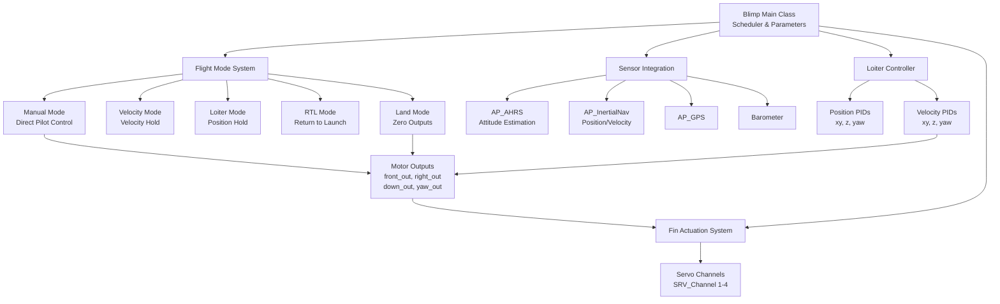
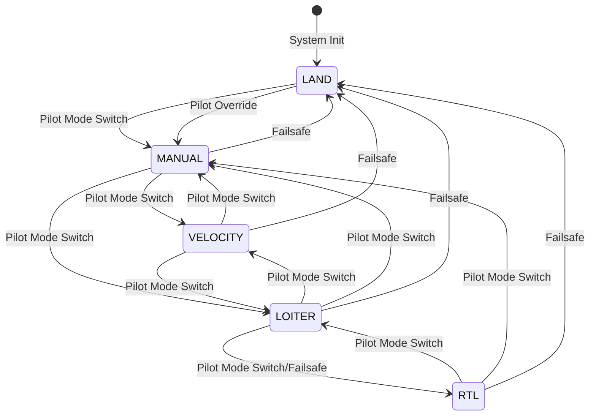
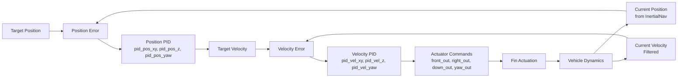

# Blimp

## Overview

The Blimp vehicle represents ArduPilot's lighter-than-air autonomous flight system designed for airships and blimps. Unlike heavier-than-air vehicles (multirotors, fixed-wing aircraft), blimps leverage natural buoyancy for passive altitude hold and require minimal power for station-keeping. The Blimp implementation uses unique sinusoidal fin actuation to generate thrust vectoring, providing gentle and efficient control suitable for slow-moving, low-mass airships. This architecture offers inherent safety advantages, as loss of power results in controlled natural descent rather than catastrophic failure.

## Architecture

The Blimp system follows a modular architecture with clear separation between vehicle management, flight mode control, and actuation systems:


```mermaid
graph TB
    Blimp[Blimp Main Class<br/>Scheduler & Parameters] --> Modes[Flight Mode System]
    Blimp --> Sensors[Sensor Integration]
    Blimp --> Loiter[Loiter Controller]
    Blimp --> Fins[Fin Actuation System]
    
    Modes --> Manual[Manual Mode<br/>Direct Pilot Control]
    Modes --> Velocity[Velocity Mode<br/>Velocity Hold]
    Modes --> LoiterMode[Loiter Mode<br/>Position Hold]
    Modes --> RTL[RTL Mode<br/>Return to Launch]
    Modes --> Land[Land Mode<br/>Zero Outputs]
    
    Sensors --> AHRS[AP_AHRS<br/>Attitude Estimation]
    Sensors --> InertialNav[AP_InertialNav<br/>Position/Velocity]
    Sensors --> GPS[AP_GPS]
    Sensors --> Baro[Barometer]
    
    Loiter --> PosPID[Position PIDs<br/>xy, z, yaw]
    Loiter --> VelPID[Velocity PIDs<br/>xy, z, yaw]
    
    VelPID --> Motors[Motor Outputs<br/>front_out, right_out<br/>down_out, yaw_out]
    Manual --> Motors
    Land --> Motors
    
    Motors --> Fins
    Fins --> Servos[Servo Channels<br/>SRV_Channel 1-4]
```

## Key Components

The Blimp vehicle system comprises the following primary components:

- **Blimp.h/Blimp.cpp**: Main vehicle class implementing the AP_Vehicle interface. Contains the scheduler task array running at 1000Hz, manages vehicle state, initializes all subsystems, and coordinates sensor data flow. Houses the main control loop that calls `update_flight_mode()` every iteration.

- **mode.h/mode.cpp**: Defines the abstract Mode base class and implements the flight mode state machine. Handles mode transitions, safety checks, and mode-specific initialization/termination. The `set_mode()` function validates mode changes and ensures safe transitions.

- **Mode Implementations**:
  - **ModeManual**: Direct pilot stick input mapped to motor outputs with no stabilization or automation
  - **ModeLand**: Safety mode that zeros all motor outputs, allowing natural descent via buoyancy
  - **ModeLoiter**: Position hold mode using lag-limited target position updates to prevent position runaway
  - **ModeVelocity**: Direct velocity control mode for precise speed commands
  - **ModeRTL**: Return To Launch mode, navigates to origin (0,0,0) in NED frame using Loiter controller

- **Fins.h/Fins.cpp**: Implements sinusoidal fin actuation unique to lighter-than-air vehicles. Converts desired acceleration commands into flapping fin movements using cosine wave patterns. Supports configurable frequency (freq_hz), turbo mode (doubles frequency), and per-fin amplitude/offset parameters.

- **Loiter.h/Loiter.cpp**: Core position and velocity controller implementing cascaded PID loops. The `run()` method handles position control by converting position errors to target velocities, then velocity errors to motor commands. The `run_vel()` method provides direct velocity control. Includes coordinate frame transformations (NED to body frame) and integrator management.

- **AP_Arming_Blimp**: Blimp-specific pre-arm and arming checks. Validates sensor health, EKF status, battery level, and vehicle-specific safety conditions before allowing flight.

- **Parameters.h/Parameters.cpp**: Vehicle configuration system with parameter groups for PID gains, velocity/position limits, flight mode channels, failsafe settings, and fin actuation parameters. Uses AP_Param for persistent storage and MAVLink parameter protocol integration.

## Flight Mode System

The Blimp implements five flight modes with a simple state machine architecture:


```mermaid
stateDiagram-v2
    [*] --> LAND: System Init
    LAND --> MANUAL: Pilot Mode Switch
    MANUAL --> VELOCITY: Pilot Mode Switch
    MANUAL --> LOITER: Pilot Mode Switch
    VELOCITY --> MANUAL: Pilot Mode Switch
    VELOCITY --> LOITER: Pilot Mode Switch
    LOITER --> VELOCITY: Pilot Mode Switch
    LOITER --> MANUAL: Pilot Mode Switch
    LOITER --> RTL: Pilot Mode Switch/Failsafe
    RTL --> LOITER: Pilot Mode Switch
    RTL --> MANUAL: Pilot Mode Switch
    LAND --> MANUAL: Pilot Override
    MANUAL --> LAND: Failsafe
    VELOCITY --> LAND: Failsafe
    LOITER --> LAND: Failsafe
    RTL --> LAND: Failsafe
```

### Flight Mode Descriptions

#### MANUAL Mode
Direct pilot control without any stabilization or automation. Pilot stick inputs are directly mapped to motor output commands:
- Roll stick → `right_out` (lateral movement)
- Pitch stick → `front_out` (forward/backward)
- Throttle stick → `down_out` (vertical)
- Yaw stick → `yaw_out` (rotation)

No position hold, no velocity control, no stabilization. Requires constant pilot attention. Best used for initial testing or when precise manual control is needed.

#### LAND Mode
Safety mode that immediately zeros all motor outputs:
- `front_out = 0`
- `right_out = 0`
- `down_out = 0`
- `yaw_out = 0`

The blimp will naturally descend due to gravity (if slightly negatively buoyant) or maintain altitude (if neutrally buoyant). This is the default failsafe mode. All PID integrators are reset when entering this mode.

#### LOITER Mode
Position hold mode using cascaded PID control. Maintains current position or navigates to pilot-commanded positions. Features lag-limited target position updates to prevent sudden position jumps:
- Pilot inputs adjust target position at rate limited by `max_pos_xy`, `max_pos_z`, `max_pos_yaw`
- Position PIDs convert position errors to target velocities
- Velocity PIDs convert velocity errors to motor commands
- Coordinate frame: NED (North-East-Down) unless `simple_mode` is enabled
- Integrator limiting prevents windup during position hold

#### VELOCITY Mode
Direct velocity control without position hold. Pilot stick inputs command target velocities:
- Velocity commands limited by `max_vel_xy`, `max_vel_z`, `max_vel_yaw`
- Velocity PIDs drive motors to achieve commanded rates
- No position feedback loop
- Useful for smooth, controlled movements without position lock
- Vehicle will drift if there's no pilot input (no position hold)

#### RTL (Return To Launch) Mode
Autonomous return to origin position (0,0,0) in NED frame. Implementation is simple:
- Sets target position to `{0, 0, 0}` in NED coordinates
- Calls `Loiter::run()` to navigate to target
- No altitude prioritization or staged approach
- Uses same control loops as Loiter mode
- Will attempt to return regardless of obstacles or wind conditions

### Mode Transition Rules

Mode changes are initiated by pilot RC input (mode channel) or failsafe triggers. The `set_mode()` function in `mode.cpp` handles all transitions:

1. **Pre-conditions**: New mode must be valid enum value
2. **Exit current mode**: Calls `mode->exit()` on current mode
3. **Update mode pointer**: Sets `flightmode` to new mode object
4. **Enter new mode**: Calls `mode->init()` on new mode
5. **State update**: Updates `control_mode` enum and logs transition
6. **Failsafe check**: Forces LAND mode if failsafe conditions active

Safety checks prevent invalid transitions (e.g., cannot exit LAND during critical failsafe).

## Control Algorithms

### Lighter-Than-Air Flight Dynamics

Blimps exhibit fundamentally different dynamics compared to heavier-than-air vehicles:

- **Buoyancy**: Natural lift opposes gravity, reducing power requirements for altitude hold
- **Low Mass**: Minimal inertia means low control authority is sufficient, but also high susceptibility to wind
- **Drag-Dominated**: Aerodynamic drag is primary force resisting motion; thrust primarily overcomes drag rather than providing lift
- **Slow Dynamics**: Response times are typically longer than multirotors due to large volume and low thrust-to-weight ratio
- **Wind Sensitivity**: Large surface area relative to mass makes wind compensation critical

### Cascaded PID Control Architecture

The Loiter controller implements a cascaded control architecture with two control loops:


```mermaid
graph LR
    TargetPos[Target Position] --> PosError[Position Error]
    CurrentPos[Current Position<br/>from InertialNav] --> PosError
    PosError --> PosPID[Position PID<br/>pid_pos_xy, pid_pos_z, pid_pos_yaw]
    PosPID --> TargetVel[Target Velocity]
    
    TargetVel --> VelError[Velocity Error]
    CurrentVel[Current Velocity<br/>Filtered] --> VelError
    VelError --> VelPID[Velocity PID<br/>pid_vel_xy, pid_vel_z, pid_vel_yaw]
    VelPID --> ActuatorCmd[Actuator Commands<br/>front_out, right_out, down_out, yaw_out]
    
    ActuatorCmd --> Fins[Fin Actuation]
    Fins --> Vehicle[Vehicle Dynamics]
    Vehicle --> CurrentPos
    Vehicle --> CurrentVel
```

**Position Control Loop** (`Loiter::run()`):
1. Calculate position error: `pos_error = target_pos - pos_ned`
2. Feed error to position PIDs: `target_vel = pid_pos_*.update(pos_error, dt)`
3. Constrain target velocity: `target_vel` limited by `max_vel_xy`, `max_vel_z`, `max_vel_yaw`
4. Pass target velocity to inner loop

**Velocity Control Loop** (both `run()` and `run_vel()`):
1. Calculate velocity error: `vel_error = target_vel - vel_ned_filtd`
2. Apply velocity scaling: Compensates for anisotropic vehicle dynamics
3. Feed error to velocity PIDs: `actuator = pid_vel_*.update(vel_error, dt)`
4. Transform to body frame: `rotate_NE_to_BF(actuator)` for x/y commands
5. Output to motors: Set `front_out`, `right_out`, `down_out`, `yaw_out`

### PID Controllers

The Blimp uses six PID controllers with integrator limiting:

| Controller | Type | Purpose | Tuning Parameters |
|------------|------|---------|-------------------|
| `pid_pos_xy` | AC_PID_2D | XY position error → target XY velocity | P, I, D, IMAX, FF |
| `pid_pos_z` | AC_PID | Z position error → target Z velocity | P, I, D, IMAX, FF |
| `pid_pos_yaw` | AC_PID | Yaw position error → target yaw rate | P, I, D, IMAX, FF |
| `pid_vel_xy` | AC_PID_2D | XY velocity error → actuator XY | P, I, D, IMAX, FF |
| `pid_vel_z` | AC_PID | Z velocity error → actuator Z | P, I, D, IMAX, FF |
| `pid_vel_yaw` | AC_PID | Yaw velocity error → actuator yaw | P, I, D, IMAX, FF |

**Integrator Management**:
- Integrators reset when disarmed
- Integrator update limited when axis is disabled or zero thrust commanded
- IMAX parameter prevents integrator windup
- Integrators paused during mode transitions

### Coordinate Frames

The Blimp uses two primary coordinate frames:

**NED Frame (North-East-Down)**:
- Primary reference frame for navigation
- X axis: North
- Y axis: East
- Z axis: Down (positive values are below starting point)
- Position and velocity estimates from InertialNav are in NED
- Target positions commanded in NED

**Body Frame**:
- X axis: Forward (front of blimp)
- Y axis: Right
- Z axis: Down
- Motor outputs are in body frame: `front_out` (X), `right_out` (Y), `down_out` (Z)
- Transformation from NED to body frame: `rotate_NE_to_BF()` applies current yaw angle

**Simple Mode**:
- When `g.simple_mode` enabled, pilot inputs remain in NED frame regardless of vehicle yaw
- When disabled, pilot inputs are interpreted in body frame
- Affects how pilot stick commands are translated to target velocities

### Control Loop Rates and Timing

The scheduler runs at 1000 Hz (1 kHz) with the following task priorities:

| Task | Rate | Priority | Purpose |
|------|------|----------|---------|
| ins.update | 1000 Hz | High | IMU sensor updates |
| update_batt_compass | 100 Hz | High | Battery and compass readings |
| read_rangefinder | 100 Hz | High | Altitude sensor |
| update_altitude | 100 Hz | High | Altitude estimation |
| run_nav_updates | 50 Hz | Medium | EKF and position estimation |
| update_flight_mode | 100 Hz | High | Mode-specific control loops |
| update_throttle_hover | 100 Hz | High | Motor output updates |
| Log_Write_Fast | 25 Hz | Medium | High-rate logging |
| update_mount | 50 Hz | Low | Gimbal control |
| gcs_send | 50 Hz | Low | Telemetry streaming |
| gcs_data_stream_send | 50 Hz | Low | MAVLink data streams |

The `update_flight_mode()` task runs at 100 Hz and calls the current mode's `run()` method, which in turn calls the Loiter controller or directly sets motor outputs. This rate is suitable for the slow dynamics of lighter-than-air vehicles.

## Fin Control - Thrust Vectoring for Airships

### Sinusoidal Fin Actuation System

The Blimp uses a unique thrust vectoring approach: sinusoidal fin flapping. Instead of direct thrust output, four fins oscillate in phase-controlled patterns to generate net forces and moments. This approach is biomimetic (inspired by fish swimming) and provides smooth, efficient thrust for low-speed airship control.

### Fin Configuration

Four fins are arranged around the vehicle, each assigned a specific function:

```cpp
// From Fins.cpp setup_fins()
Fin 0 (DOWN):  amp = front,    offset = -down   (vertical + forward component)
Fin 1 (RIGHT): amp = right,    offset = down    (lateral + vertical component)
Fin 2 (UP):    amp = -front,   offset = down    (vertical - forward component)
Fin 3 (LEFT):  amp = -right,   offset = -down   (lateral - vertical component)
```

Each fin's servo position is calculated as:
```
position = amplitude * cos(2π * frequency * time + phase) + offset
```

Where:
- **amplitude**: Determines flapping range, set by desired thrust on that axis
- **offset**: Biases fin angle to produce net force in specific direction
- **frequency**: Oscillation rate (configurable via `freq_hz` parameter)
- **phase**: Relative timing between fins (calculated from actuator commands)

### Actuation Algorithm

The `Fins::output()` method implements the core actuation logic:

1. **Time Update**: Track current time with millisecond resolution
2. **Turbo Mode**: If `turbo_mode` enabled, double the frequency for more aggressive response
3. **Amplitude Calculation**: Set per-fin amplitude based on motor commands:
   - `_amp[0] = motors->front_out` (fin 0 amplitude)
   - `_amp[1] = motors->right_out` (fin 1 amplitude)
   - `_amp[2] = -motors->front_out` (fin 2 opposite to fin 0)
   - `_amp[3] = -motors->right_out` (fin 3 opposite to fin 1)

4. **Offset Calculation**: Set per-fin offset based on vertical/yaw commands:
   - `_off[0] = -motors->down_out + motors->yaw_out`
   - `_off[1] = motors->down_out - motors->yaw_out`
   - `_off[2] = motors->down_out + motors->yaw_out`
   - `_off[3] = -motors->down_out - motors->yaw_out`

5. **Servo Position Calculation**: 
   ```cpp
   _pos[i] = _amp[i] * cosf(2.0f * M_PI * _freq_hz * _time * 0.001f) + _off[i]
   ```

6. **Servo Output**: Write positions to SRV_Channels 1-4 using cork/push pattern for atomic updates

### Fin Actuation Parameters

| Parameter | Description | Default | Range | Units |
|-----------|-------------|---------|-------|-------|
| freq_hz | Fin flapping frequency | 5.0 | 0.1-50 | Hz |
| turbo_mode | Double frequency mode | 0 (disabled) | 0-1 | boolean |
| SERVO1_* | Fin 0 servo configuration | - | - | PWM |
| SERVO2_* | Fin 1 servo configuration | - | - | PWM |
| SERVO3_* | Fin 2 servo configuration | - | - | PWM |
| SERVO4_* | Fin 3 servo configuration | - | - | PWM |

### Cork/Push Pattern for Atomic Outputs

The fin output system uses the SRV_Channels cork/push mechanism to ensure all four fins update simultaneously:

```cpp
SRV_Channels::cork();  // Prevent immediate servo updates
// Set all four servo positions
SRV_Channels::push();  // Commit all changes atomically
```

This prevents timing skew between fins that could cause unwanted moments or vibrations.

## Altitude Hold - Buoyant Vehicle Considerations

### Natural Buoyancy

Unlike powered-lift vehicles (multirotors, planes), blimps use buoyancy as the primary altitude control mechanism:

- **Neutral Buoyancy**: Ideal state where lift equals weight, vehicle maintains altitude with zero power
- **Positive Buoyancy**: Lift exceeds weight, vehicle naturally rises (requires downward thrust to descend)
- **Negative Buoyancy**: Weight exceeds lift, vehicle naturally descends (requires upward thrust to climb)

Most operational blimps are slightly negatively buoyant (1-5% below neutral) for safety - loss of power results in gentle descent rather than uncontrolled ascent.

### Altitude Control Implementation

**Barometer Integration**:
- Primary altitude sensor via `AP_Baro`
- Provides altitude estimate relative to starting point
- Integrated with EKF for fused altitude estimate
- Z-axis of NED frame: positive values are below launch point

**Vertical Control Loop**:
1. Position control: `target_pos.z` → `pid_pos_z` → `target_vel_ef.z`
2. Velocity control: `target_vel_ef.z` → `pid_vel_z` → `down_out`
3. Motor output: `down_out` → fins with vertical offset component
4. Fin actuation: Oscillating fins with vertical bias produce net vertical force

**Key Differences from Powered Lift**:
- **Low Control Authority**: Fins produce much less thrust than propellers; cannot overcome large buoyancy imbalances
- **Slow Response**: Altitude changes are gradual due to low thrust and high drag
- **Passive Stability**: Neutral buoyancy provides natural altitude hold without power
- **Wind Sensitivity**: Vertical wind gusts can cause significant altitude deviations due to large surface area and low mass

### Altitude Control Parameters

| Parameter | Description | Typical Value | Units |
|-----------|-------------|---------------|-------|
| max_vel_z | Maximum vertical velocity | 0.5 | m/s |
| pid_pos_z P, I, D | Position PID gains | Tune per vehicle | - |
| pid_vel_z P, I, D | Velocity PID gains | Tune per vehicle | - |
| dis_mask bit 3 | Disable Z-axis control | 0 (enabled) | bitmask |

## Configuration Parameters

### Position Rate Limits

Control maximum rate of target position change in Loiter mode (prevents sudden jumps):

| Parameter | Description | Default | Range | Units |
|-----------|-------------|---------|-------|-------|
| max_pos_xy | XY position update rate limit | 1.0 | 0.1-10 | m/s |
| max_pos_z | Z position update rate limit | 0.5 | 0.1-5 | m/s |
| max_pos_yaw | Yaw position update rate limit | 45 | 1-180 | deg/s |

### Velocity Limits

Maximum achievable velocities (constrains target velocities):

| Parameter | Description | Default | Range | Units |
|-----------|-------------|---------|-------|-------|
| max_vel_xy | Maximum XY velocity | 2.0 | 0.1-10 | m/s |
| max_vel_z | Maximum Z velocity | 0.5 | 0.1-5 | m/s |
| max_vel_yaw | Maximum yaw rate | 90 | 1-360 | deg/s |

### PID Controller Parameters

Each PID controller has five tunable parameters:

**Position Controllers** (`pid_pos_xy`, `pid_pos_z`, `pid_pos_yaw`):
- **P**: Proportional gain (position error → target velocity)
- **I**: Integral gain (accumulated error → target velocity)
- **D**: Derivative gain (not typically used for outer loop)
- **IMAX**: Maximum integrator contribution (prevents windup)
- **FF**: Feedforward gain (target velocity passthrough)

**Velocity Controllers** (`pid_vel_xy`, `pid_vel_z`, `pid_vel_yaw`):
- **P**: Proportional gain (velocity error → actuator command)
- **I**: Integral gain (accumulated error → actuator command)
- **D**: Derivative gain (velocity error rate → actuator command)
- **IMAX**: Maximum integrator contribution (prevents windup)
- **FF**: Feedforward gain (target acceleration passthrough)

### Fin Actuation Parameters

| Parameter | Description | Default | Range | Units |
|-----------|-------------|---------|-------|-------|
| freq_hz | Fin flapping frequency | 5.0 | 0.1-50 | Hz |
| turbo_mode | Double frequency (aggressive) | 0 | 0-1 | boolean |

### Flight Mode Configuration

| Parameter | Description | Default | Range | Units |
|-----------|-------------|---------|-------|-------|
| simple_mode | Pilot input frame (0=body, 1=NED) | 0 | 0-1 | boolean |
| dis_mask | Axis disable bitmask (bit 0=Y, 1=X, 2=Z, 3=Yaw) | 0 | 0-15 | bitmask |

### Failsafe Parameters

| Parameter | Description | Default | Range | Units |
|-----------|-------------|---------|-------|-------|
| fs_batt_enable | Battery failsafe enable | 0 | 0-1 | boolean |
| fs_batt_voltage | Failsafe voltage threshold | 10.5 | 0-20 | V |
| fs_gcs_enable | GCS failsafe enable | 0 | 0-1 | boolean |
| fs_ekf_action | EKF failsafe action | 1 (LAND) | 0-2 | enum |
| fs_crash_check | Crash detection enable | 1 | 0-1 | boolean |

### Tuning Workflow

1. **Start Conservative**: Begin with low P gains, zero I and D
2. **Tune Velocity Loop First**: Set `pid_vel_*` parameters in VELOCITY mode
   - Increase P until oscillations appear, then reduce by 30%
   - Add I slowly to eliminate steady-state error (watch for windup)
   - Add small D if needed to dampen oscillations
3. **Tune Position Loop**: Set `pid_pos_*` parameters in LOITER mode
   - Increase P until position hold is responsive but not oscillatory
   - Add I cautiously (often unnecessary with good velocity loop)
4. **Adjust Limits**: Set `max_vel_*` and `max_pos_*` to comfortable values
5. **Test Wind Rejection**: Verify performance in outdoor conditions
6. **Fine-Tune**: Iterate parameters based on log analysis

## GCS Integration

### MAVLink Message Handling

The Blimp implements custom MAVLink message handlers in `GCS_MAVLink_Blimp` and `GCS_Blimp` classes:

**Vehicle Identification**:
- **MAV_TYPE**: Reports `MAV_TYPE_AIRSHIP` to ground stations
- **MAV_STATE**: Reports system state:
  - `MAV_STATE_UNINIT`: During boot/initialization
  - `MAV_STATE_STANDBY`: Armed but not flying (Land mode)
  - `MAV_STATE_ACTIVE`: Flying (Manual, Loiter, Velocity, RTL)
  - `MAV_STATE_CRITICAL`: Failsafe active
  - `MAV_STATE_EMERGENCY`: Critical failsafe (battery, EKF failure)

**Telemetry Streaming**:
Configurable data streams sent at various rates:
- **RAW_SENSORS**: IMU, barometer, compass raw data (10 Hz)
- **EXTENDED_STATUS**: Battery, GPS, mode, failsafe status (2 Hz)
- **POSITION**: Global position, local position NED (5 Hz)
- **RC_CHANNELS**: RC input values (5 Hz)
- **RAW_CONTROLLER**: PID outputs, motor commands (10 Hz)
- **ATTITUDE**: Roll, pitch, yaw, rates (10 Hz)

**Command Handling**:
- **MAV_CMD_NAV_TAKEOFF**: Not implemented (blimps don't "takeoff")
- **MAV_CMD_NAV_LAND**: Switches to LAND mode
- **MAV_CMD_NAV_RETURN_TO_LAUNCH**: Switches to RTL mode
- **MAV_CMD_DO_SET_MODE**: Changes flight mode via MAVLink
- **MAV_CMD_DO_REPOSITION**: Updates target position in LOITER mode
- **MAV_CMD_DO_SET_ROI**: Sets region of interest (for camera/gimbal)
- **MAV_CMD_COMPONENT_ARM_DISARM**: Arms or disarms vehicle

**Parameter Protocol**:
- Full parameter list download via `PARAM_REQUEST_LIST`
- Individual parameter read via `PARAM_REQUEST_READ`
- Parameter write via `PARAM_SET` (validated and persisted)
- Parameter value reports via `PARAM_VALUE` messages

**Mission Protocol**:
- Mission upload via `MISSION_ITEM_INT` messages
- Mission download via `MISSION_REQUEST` / `MISSION_ITEM_INT` sequence
- Mission status via `MISSION_CURRENT` and `MISSION_ITEM_REACHED`
- Note: Mission support is limited in Blimp compared to other vehicles

### Status Reporting

**Heartbeat Message** (1 Hz):
- System ID, component ID, type (AIRSHIP), autopilot (ARDUPILOTMEGA)
- Base mode flags: CUSTOM_MODE_ENABLED, GUIDED, STABILIZE, etc.
- Custom mode: Current flight mode number
- System status: STANDBY, ACTIVE, CRITICAL, EMERGENCY

**System Status** (1 Hz):
- Sensor health: MAG, BARO, GPS, INS, AHRS, RC
- Battery voltage, current, remaining percentage
- CPU load percentage
- Communication errors (drop rate)

**Flight Mode Reporting**:
Mode numbers reported in custom_mode field:
- 0: LAND
- 1: MANUAL
- 2: VELOCITY
- 3: LOITER
- 4: RTL

Ground stations decode these to display mode names to the operator.

## Safety Considerations

### Arming Checks (AP_Arming_Blimp)

Pre-arm checks must pass before arming is permitted:

**Mandatory Checks**:
- **Barometer Health**: Barometer must be detected and providing valid readings
- **Compass Health**: At least one compass must be healthy and calibrated
- **GPS Health**: GPS fix with sufficient satellites (if GPS required)
- **EKF Health**: EKF must be initialized and passing innovation checks
- **Battery**: Battery voltage above failsafe threshold
- **RC Calibration**: RC channels calibrated with valid min/max/trim
- **Parameter Validity**: Critical parameters within acceptable ranges

**Warning Checks** (can be overridden):
- **Compass Variance**: Multiple compasses agree within threshold
- **Gyro Calibration**: Gyros recently calibrated
- **Accelerometer Calibration**: Accelerometers calibrated

**Arming Sequence**:
1. Verify all pre-arm checks pass
2. Check RC arming input (stick position or switch)
3. Call `init_arm_motors()` to enable motor outputs
4. Reset PID integrators
5. Log arming event
6. Enable scheduler watchdog

### Failsafe Behavior

Multiple failsafe triggers protect against loss of control:

**Radio Failsafe**:
- **Trigger**: RC signal loss detected for >1 second
- **Action**: Switch to LAND mode (default) or RTL mode (configurable)
- **Recovery**: Resume previous mode when RC signal returns (optional)

**GCS Failsafe**:
- **Trigger**: No MAVLink heartbeat from GCS for >5 seconds
- **Action**: Switch to LAND mode (default) or continue mission
- **Recovery**: No automatic recovery (remains in failsafe mode)

**EKF Failsafe**:
- **Trigger**: EKF variance exceeds threshold or innovation checks fail
- **Action**: Switch to LAND mode immediately
- **Recovery**: Requires EKF reset and re-initialization
- **Critical**: Position control impossible without valid EKF

**Battery Failsafe**:
- **Trigger**: Battery voltage below `fs_batt_voltage` threshold
- **Action**: Switch to LAND mode to preserve battery for controlled descent
- **Two Stages**: Warning level (continue) and critical level (force land)

**Crash Detection**:
- **Trigger**: Large attitude errors, high gyro rates, or low altitude
- **Action**: Disarm motors immediately
- **Purpose**: Prevent damage from continued operation after crash

### Land Mode as Safe Default

LAND mode is the ultimate failsafe state:
- **Zero Outputs**: All motor commands set to zero
- **Natural Descent**: Vehicle descends via gravity (if negatively buoyant)
- **Minimal Risk**: No active control means no risk of control system failure
- **Stable**: Can remain in LAND indefinitely
- **Pilot Override**: Pilot can switch to MANUAL to regain control

This design philosophy prioritizes safety: when in doubt, stop all outputs and rely on natural buoyancy.

### Inherent Safety Advantages of Buoyant Vehicles

Blimps offer several safety benefits compared to heavier-than-air vehicles:

**Loss of Power**:
- Multirotor: Immediate crash
- Airplane: Glide possible but landing challenging
- Blimp: Gentle descent or maintain altitude (minimal risk)

**Sensor Failure**:
- Multirotor: Potential loss of control and crash
- Blimp: Slower dynamics allow time for failsafe activation; natural stability

**Software Failure**:
- Multirotor: Immediate danger
- Blimp: Natural buoyancy provides passive stability; slower dynamics allow recovery

**Collision Tolerance**:
- Blimp envelope absorbs impacts better than rigid airframes
- Lower mass means lower collision energy
- Soft materials reduce injury risk

**Wind Tolerance**:
- Large surface area means high wind sensitivity (disadvantage)
- But slow dynamics and passive stability aid recovery

### Scheduler Watchdog

The scheduler runs a 1 kHz watchdog to detect timing violations:

```cpp
// From scheduler_tasks array
{SCHED_TASK_CLASS(AP_Scheduler, &blimp.scheduler, update_logging, 0.1, 75, 76)}
```

The scheduler monitors loop timing and logs overruns. If a task consistently exceeds its time budget, it's flagged in telemetry. Critical timing violations trigger warnings but don't automatically disarm (operator should investigate logs).

## Testing Procedures

### SITL (Software-In-The-Loop) Simulation

SITL provides a safe environment for testing Blimp code without physical hardware:

**Starting SITL**:
```bash
# Navigate to ArduPilot directory
cd ~/ardupilot

# Launch Blimp SITL with console and map
sim_vehicle.py -v Blimp --console --map

# Alternative: Specify starting location
sim_vehicle.py -v Blimp --console --map -L MyLocation

# Alternative: Enable additional modules
sim_vehicle.py -v Blimp --console --map --custom-location=LAT,LON,ALT,HDG
```

**SITL Console Commands**:
```bash
# Mode changes
mode MANUAL
mode LOITER
mode VELOCITY
mode RTL
mode LAND

# Arm/disarm
arm throttle
disarm

# Set parameters
param set max_vel_xy 3.0
param set pid_vel_xy_P 1.5
param fetch
param show max_vel_*

# Position commands (Loiter/RTL)
guided 10 10 -5  # North 10m, East 10m, Down 5m (NED)

# Simulate RC input
rc 1 1500  # Roll center
rc 2 1500  # Pitch center
rc 3 1500  # Throttle center
rc 4 1500  # Yaw center

# Trigger failsafes
set_param SIM_RC_FAIL 1  # Radio failsafe
```

### Mode Testing Sequences

**MANUAL Mode Test**:
1. Start SITL, arm in MANUAL mode
2. Command RC inputs: `rc 1 1700` (roll right)
3. Observe vehicle response in map
4. Verify direct stick-to-motor mapping (no stabilization)
5. Return sticks to center: `rc 1 1500`
6. Disarm

**VELOCITY Mode Test**:
1. Arm, switch to VELOCITY mode: `mode VELOCITY`
2. Command velocity: `rc 1 1700` (target right velocity)
3. Observe steady velocity hold
4. Command different velocity: `rc 2 1700` (target forward velocity)
5. Center sticks, observe drift (no position hold)
6. Switch to LAND

**LOITER Mode Test**:
1. Arm, takeoff (slight positive throttle to ascend)
2. Switch to LOITER mode: `mode LOITER`
3. Observe position hold (vehicle maintains current position)
4. Command small position change: `rc 1 1600`
5. Observe gradual position update (lag limited)
6. Center sticks, observe tight position hold
7. Check wind rejection: Set SIM_WIND_SPD parameter, observe compensation

**RTL Mode Test**:
1. In LOITER, navigate away from origin: `guided 50 50 -10`
2. Wait for position settle
3. Switch to RTL: `mode RTL`
4. Observe autonomous return to (0,0,0)
5. Monitor distance to home decreasing
6. Vehicle should hover at origin when reached

**Failsafe Test**:
1. Arm in LOITER mode
2. Simulate radio loss: `param set SIM_RC_FAIL 1`
3. Observe automatic switch to LAND mode
4. Verify all motor outputs zero
5. Restore radio: `param set SIM_RC_FAIL 0`
6. Manually switch back to LOITER

### Parameter Tuning Workflow

**Initial Parameter Set** (conservative baseline):
```bash
# Position loop gains
param set pid_pos_xy_P 0.5
param set pid_pos_xy_I 0.0
param set pid_pos_xy_D 0.0
param set pid_pos_z_P 0.3
param set pid_pos_z_I 0.0

# Velocity loop gains
param set pid_vel_xy_P 1.0
param set pid_vel_xy_I 0.1
param set pid_vel_xy_D 0.05
param set pid_vel_z_P 0.8
param set pid_vel_z_I 0.1

# Velocity limits
param set max_vel_xy 2.0
param set max_vel_z 0.5
param set max_vel_yaw 45

# Position rate limits
param set max_pos_xy 1.0
param set max_pos_z 0.3
param set max_pos_yaw 30
```

**Tuning Process**:
1. **Test in VELOCITY mode** to tune velocity loop
2. **Increase pid_vel_xy_P** until oscillations appear
3. **Reduce P gain by 30%** for stability margin
4. **Add pid_vel_xy_I gradually** to eliminate steady-state error
5. **Add pid_vel_xy_D** if oscillations persist
6. **Repeat for Z and yaw axes**
7. **Switch to LOITER mode** to tune position loop
8. **Increase pid_pos_xy_P** until position hold is tight
9. **Monitor for overshoot** - reduce if vehicle overshoots target
10. **Test wind rejection** in simulation (SIM_WIND_SPD)
11. **Adjust IMAX** if integrator windup occurs
12. **Save parameters**: `param set FORMAT_VERSION 1` then reboot

### Log Analysis for Control Loop Performance

**Enable High-Rate Logging**:
```bash
param set LOG_BITMASK 655359  # Log all
param set LOG_FILE_DSRMROT 0  # Keep logs after disarm
```

**Key Log Messages**:
- **PSCN**: North position control (target position, actual position, target velocity, actual velocity)
- **PSCE**: East position control (same fields as PSCN)
- **PSCD**: Down position control (same fields, note sign: positive = down)
- **RATE**: Attitude rates (roll, pitch, yaw rates)
- **MOTB**: Motor outputs (front_out, right_out, down_out, yaw_out)
- **PIDN/PIDE/PIDD**: PID outputs for North, East, Down axes

**Log Analysis Steps**:
1. Download log from SITL: `log list`, `log download <num>`
2. Open in MAVExplorer or Mission Planner
3. Plot PSCN.TPX vs PSCN.PX (target vs actual North position)
4. Look for tracking errors, oscillations, settling time
5. Plot MOTB.FOut (front motor output) to see actuator saturation
6. Check for integrator windup: large I-term values
7. Evaluate step response: command position change, measure settle time
8. Adjust parameters based on observed behavior

### Safe Testing Procedures

**Never Test on Real Hardware Without**:
1. **Proper restraints**: Tether or net to prevent runaway
2. **Clear area**: No obstacles, people, or fragile equipment nearby
3. **Safety observer**: Second person to monitor and cut power if needed
4. **Pre-flight checks**: All arming checks passed, parameters verified
5. **Conservative parameters**: Start with low gains, increase gradually
6. **Failsafe testing**: Verify failsafes work before untethered flight
7. **Weather limits**: Indoor or calm outdoor conditions for initial tests
8. **Battery monitoring**: Full battery, voltage telemetry confirmed

**First Flight Checklist**:
- [ ] SITL testing completed successfully
- [ ] All parameters loaded and verified
- [ ] RC transmitter bound and calibrated
- [ ] Arming checks pass
- [ ] Failsafes tested and working
- [ ] Safety observer present
- [ ] Tether attached securely
- [ ] Clear flight area
- [ ] Motor direction verified
- [ ] Battery fully charged
- [ ] Telemetry link established

## Implementation Notes

### Design Decisions

**Why Sinusoidal Fin Actuation?**

The sinusoidal fin actuation approach was chosen for several reasons:

1. **Biomimetic Efficiency**: Fish and marine animals use oscillating fins for propulsion; this approach mimics proven biological designs
2. **Smooth Forces**: Sinusoidal motion produces smooth thrust without high-frequency vibrations that rigid propellers create
3. **Low Noise**: Oscillating fins are quieter than spinning propellers, important for indoor or urban environments
4. **Fault Tolerance**: Fin failure degrades performance gracefully rather than catastrophic loss
5. **Simple Mechanics**: Standard servos can implement fin actuation; no custom motors needed
6. **Directional Control**: Phase and amplitude modulation of four fins provides full 6-DOF control

**Trade-offs**:
- Lower thrust efficiency than propellers (more complex kinematics)
- Frequency-dependent performance (requires tuning)
- Fin size constraints (must be large enough for effective thrust)

### Lag Limiting in Loiter Mode

The Loiter mode implements lag limiting on target position updates to prevent position runaway:

```cpp
// From mode_loiter.cpp
target_pos.x += constrain_float(pilot_x, -blimp.g.max_pos_xy, blimp.g.max_pos_xy) * dt;
target_pos.y += constrain_float(pilot_y, -blimp.g.max_pos_xy, blimp.g.max_pos_xy) * dt;
```

**Why Lag Limiting?**

Without rate limiting, pilot stick input directly sets absolute target position. This can cause:
- Large position jumps when pilot moves stick quickly
- Aggressive velocity commands that exceed vehicle capabilities
- Overshoot and oscillations
- Potential loss of control in wind conditions

**With Lag Limiting**:
- Target position updates gradually (rate limited by `max_pos_xy`)
- Pilot stick commands target *velocity* of position update
- Smoother vehicle response
- Better handling in wind
- Prevents position integrator windup

This is a critical safety feature for blimps, which have limited thrust authority and cannot make rapid position corrections like multirotors.

### Coordinate Frame Conventions

**NED Frame (Primary)**:
- Origin: Launch location (arming position)
- X axis: North (not magnetic north, but direction at arming)
- Y axis: East
- Z axis: Down (positive values below launch, negative above)
- Right-handed coordinate system
- Position estimates from InertialNav in NED
- Target positions commanded in NED

**Body Frame**:
- Origin: Vehicle center of mass
- X axis: Forward (nose direction)
- Y axis: Right (starboard)
- Z axis: Down
- Right-handed coordinate system
- Motor outputs in body frame
- Rotation from NED to body frame via yaw angle

**Frame Transformations**:
```cpp
// NED to body frame (for X/Y)
void rotate_NE_to_BF(Vector2f& vec) {
    float cos_yaw = cosf(ahrs.yaw);
    float sin_yaw = sinf(ahrs.yaw);
    float x_bf = vec.x * cos_yaw + vec.y * sin_yaw;
    float y_bf = -vec.x * sin_yaw + vec.y * cos_yaw;
    vec.x = x_bf;
    vec.y = y_bf;
}
```

Z axis requires no transformation (down is down in both frames). Yaw is handled separately as angular rate.

### Unit Conventions

**Consistent Units in Code**:
- **Position**: meters (m) in NED frame
- **Velocity**: meters per second (m/s)
- **Acceleration**: meters per second squared (m/s²)
- **Angle**: radians (rad) for internal calculations
- **Angular Rate**: radians per second (rad/s)
- **Time**: seconds (s) with float precision

**Exceptions and Conversions**:
- Some altitude calculations use centimeters (cm) for precision
- MAVLink messages use specific units per protocol (often scaled integers)
- Parameters may use degrees for user convenience (converted to radians internally)
- Log messages often use centimeters for position (scaled for integer storage)

**Always Explicit**:
When reading or modifying code, units should be clear from context or comments. Functions should document expected units for parameters and return values.

## References

### Source Files

Primary Blimp vehicle implementation:
- `Blimp/Blimp.h` (lines 1-400): Main vehicle class definition, scheduler tasks, member variables
- `Blimp/Blimp.cpp` (lines 1-300): Vehicle initialization, scheduler implementation, main loops
- `Blimp/mode.h` (lines 1-200): Mode base class, mode enum, subclass definitions
- `Blimp/mode.cpp` (lines 1-150): Mode state machine, set_mode() logic, mode transitions

Flight mode implementations:
- `Blimp/mode_manual.cpp`: Direct pilot input mode, no stabilization
- `Blimp/mode_land.cpp`: Safety mode, zero all outputs
- `Blimp/mode_loiter.cpp`: Position hold with lag-limited target updates
- `Blimp/mode_velocity.cpp`: Velocity control mode
- `Blimp/mode_rtl.cpp`: Return to launch (0,0,0) navigation

Control system implementation:
- `Blimp/Fins.h` (lines 1-50): Fin actuation class definition
- `Blimp/Fins.cpp` (lines 1-150): Sinusoidal fin control, setup_fins(), output()
- `Blimp/Loiter.h` (lines 1-50): Position/velocity controller class definition
- `Blimp/Loiter.cpp` (lines 1-200): Cascaded PID control, run() and run_vel() methods

Configuration:
- `Blimp/Parameters.h` (lines 1-200): Parameter enumeration, parameter keys
- `Blimp/Parameters.cpp` (lines 1-300): Parameter definitions, var_info arrays, defaults

### Related ArduPilot Libraries

**Sensor and Navigation**:
- `libraries/AP_AHRS/`: Attitude and Heading Reference System, coordinate transforms
- `libraries/AP_InertialNav/`: Inertial navigation, position and velocity estimation
- `libraries/AP_Baro/`: Barometric pressure sensor, altitude estimation
- `libraries/AP_GPS/`: GPS receiver interface, position fixes
- `libraries/AP_Compass/`: Magnetometer interface, heading measurement

**Control**:
- `libraries/AC_PID/`: PID controller implementations (AC_PID, AC_PID_2D, AC_PID_Basic)
- `libraries/Filter/`: Digital filters for sensor data

**Actuation**:
- `libraries/SRV_Channel/`: Servo channel management, PWM output

**Communication**:
- `libraries/GCS_MAVLink/`: MAVLink protocol implementation
- `Blimp/GCS_MAVLink_Blimp.h`: Blimp-specific MAVLink handlers
- `Blimp/GCS_Blimp.h`: Ground control station integration

**Safety**:
- `libraries/AP_Arming/`: Arming checks base class
- `Blimp/AP_Arming_Blimp.h`: Blimp-specific arming checks

**Core**:
- `libraries/AP_HAL/`: Hardware Abstraction Layer
- `libraries/AP_Scheduler/`: Task scheduler
- `libraries/AP_Param/`: Parameter storage and management
- `libraries/AP_Logger/`: Binary logging system

### External Documentation

**ArduPilot Wiki**:
- https://ardupilot.org/dev/ - Developer documentation
- https://ardupilot.org/dev/docs/apmcopter-code-overview.html - Similar vehicle architecture (concepts apply to Blimp)
- https://ardupilot.org/dev/docs/learning-ardupilot-the-example-sketches.html - Code examples

**Flight Control Theory**:
- Cascaded PID control for position/velocity systems
- MAVLink protocol specification: https://mavlink.io/en/
- NED coordinate frame conventions

**SITL Simulation**:
- https://ardupilot.org/dev/docs/sitl-simulator-software-in-the-loop.html - SITL setup guide
- https://ardupilot.org/dev/docs/using-sitl-for-ardupilot-testing.html - SITL testing procedures

**Community Resources**:
- ArduPilot Discourse: https://discuss.ardupilot.org/
- ArduPilot Discord: Development discussions and support
- GitHub repository: https://github.com/ArduPilot/ardupilot

### Related Modules

For understanding the broader ArduPilot ecosystem context:
- `ArduCopter/`: Multirotor implementation (shares control concepts)
- `ArduPlane/`: Fixed-wing implementation (shares navigation concepts)
- `Rover/`: Ground vehicle implementation (shares mode structure)
- `libraries/AP_Vehicle/`: Base vehicle class (common to all vehicle types)

---

**Last Updated**: 2025-01
**ArduPilot Version**: Master branch
**Vehicle Type**: Lighter-than-air autonomous airship
**Maintainer**: ArduPilot Development Team
