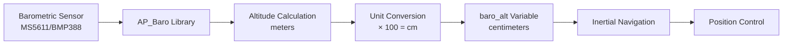
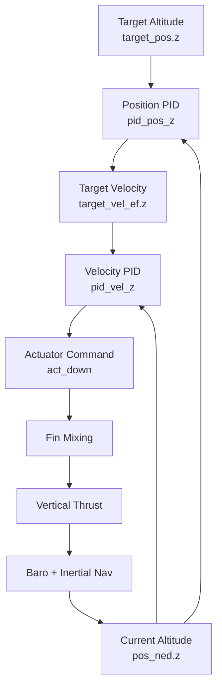

# Buoyancy Management and Altitude Control


## Table of Contents
- [Overview](#overview)
- [Fundamentals of Lighter-Than-Air Physics](#fundamentals-of-lighter-than-air-physics)
- [Altitude Sensing Architecture](#altitude-sensing-architecture)
- [Altitude Control Strategies](#altitude-control-strategies)
- [Atmospheric Compensation](#atmospheric-compensation)
- [Flight Mode Integration](#flight-mode-integration)
- [Operational Considerations](#operational-considerations)
- [Safety and Emergency Procedures](#safety-and-emergency-procedures)
- [Best Practices](#best-practices)

---

## Overview

Lighter-than-air vehicles (blimps) present unique control challenges fundamentally different from traditional multirotors or fixed-wing aircraft. Unlike conventional UAVs that rely on continuous thrust to overcome gravity, blimps operate near **neutral buoyancy**, where the lifting gas (helium or hot air) provides static lift approximately equal to the vehicle's weight. This document details the ArduPilot blimp implementation's approach to buoyancy management, altitude control, and atmospheric compensation.

**Source Files**: `/Blimp/sensors.cpp`, `/Blimp/inertia.cpp`, `/Blimp/Loiter.cpp`

### Key Characteristics of Blimp Flight

1. **Minimal Vertical Thrust Requirements**: Altitude changes are achieved through small thrust corrections rather than continuous anti-gravity thrust
2. **Atmospheric Sensitivity**: Temperature, pressure, and humidity significantly affect buoyancy
3. **Slow Dynamic Response**: Large volume and low density result in gradual altitude changes
4. **Envelope Pressure Effects**: Internal gas pressure varies with altitude and temperature
5. **Position Stability**: Excellent horizontal position hold due to low drag and momentum

---

## Fundamentals of Lighter-Than-Air Physics

### Neutral Buoyancy Principle

A blimp operates on the **Archimedes principle**: the lifting force equals the weight of displaced air. For neutral buoyancy:

```
Buoyant Force (F_b) = Weight of Vehicle (W)
F_b = ρ_air × V_envelope × g
W = m_vehicle × g
```

Where:
- `ρ_air` = density of air (varies with altitude, temperature, pressure)
- `V_envelope` = volume of lifting gas in envelope
- `m_vehicle` = total mass of blimp system
- `g` = gravitational acceleration (9.81 m/s²)

### Buoyancy States

| State | Condition | Behavior | Operational Use |
|-------|-----------|----------|-----------------|
| **Positively Buoyant** | F_b > W | Natural tendency to rise | Indoor flight, low altitude operations |
| **Neutral Buoyant** | F_b ≈ W | Minimal altitude drift | Efficient cruising, long endurance |
| **Negatively Buoyant** | F_b < W | Natural tendency to sink | High altitude operations, landing approaches |

### Gas Expansion and Contraction

Lifting gas volume changes with atmospheric conditions according to the **ideal gas law**:

```
P × V = n × R × T
```

**Temperature Effects**:
- Gas expansion: +1% volume per +2.73°C (warming)
- Gas contraction: -1% volume per -2.73°C (cooling)
- Time constant: 5-15 minutes for thermal equilibration

**Pressure Effects**:
- Lower atmospheric pressure at altitude → gas expansion
- Higher pressure near ground → gas compression
- Rate: ~12% pressure decrease per 1000m altitude gain

---

## Altitude Sensing Architecture

### Barometric Pressure Sensing

The blimp uses the **AP_Baro** library for barometric altitude measurement, which is the primary altitude reference for lighter-than-air vehicles.

**Source**: `/Blimp/sensors.cpp:read_barometer()`

```cpp
// Return barometric altitude in centimeters
void Blimp::read_barometer(void)
{
    barometer.update();
    baro_alt = barometer.get_altitude() * 100.0f;  // Convert meters to centimeters
}
```

### Altitude Measurement Chain



### Inertial Navigation Integration

The barometric altitude is fused with inertial measurements to provide smooth, filtered altitude estimates.

**Source**: `/Blimp/inertia.cpp:read_inertia()`

```cpp
void Blimp::read_inertia()
{
    // Inertial altitude estimates. Use barometer climb rate during high vibrations
    inertial_nav.update(vibration_check.high_vibes);
    
    // Exit immediately if we do not have an altitude estimate
    if (!ahrs.has_status(AP_AHRS::Status::VERT_POS)) {
        return;
    }
    
    // current_loc.alt is alt-above-home, converted from inertial nav's alt-above-ekf-origin
    const int32_t alt_above_origin_cm = inertial_nav.get_position_z_up_cm();
    current_loc.set_alt_cm(alt_above_origin_cm, Location::AltFrame::ABOVE_ORIGIN);
}
```

### Altitude Coordinate Frames

| Frame | Description | Use Case |
|-------|-------------|----------|
| **ABOVE_ORIGIN** | Altitude relative to EKF origin point | Internal navigation calculations |
| **ABOVE_HOME** | Altitude relative to arming location | Pilot display, mission planning |
| **NED (North-East-Down)** | Down is positive (navigation convention) | Control algorithms |
| **Z-Up** | Up is positive (intuitive convention) | User interfaces |

**Coordinate Conversion**: The system uses `pos_ned.z` where negative values indicate altitude gain (NED convention).

### Update Rates

Altitude sensing operates on multiple time scales:

| Component | Update Rate | Source | Purpose |
|-----------|-------------|--------|---------|
| **Barometer Hardware** | 50-100 Hz | AP_Baro backend | Raw pressure sampling |
| **Altitude Calculation** | 10 Hz | `update_altitude()` task | Filtered altitude estimate |
| **Inertial Nav** | 400 Hz | `read_inertia()` FAST_TASK | Sensor fusion |
| **Position Control** | 400 Hz | `update_flight_mode()` | Control loop execution |

**Source**: `/Blimp/Blimp.cpp:scheduler_tasks[]` lines 51-96

---

## Altitude Control Strategies

### Minimal Thrust Philosophy

Unlike multirotors that require continuous thrust to maintain altitude, blimps operate with:
- **~0% thrust** when perfectly neutral buoyant
- **±5-15% thrust** for active altitude control
- **±20-30% thrust** for rapid altitude changes or atmospheric compensation

### Vertical Control Mechanism

Altitude control uses the **down_out** fin command, which modulates vertical thrust through oscillating fin actuators.

**Source**: `/Blimp/Loiter.cpp:run()` lines 114-119

```cpp
if (zero.z) {
    blimp.motors->down_out = 0;
} else if (axes_disabled.z);
else {
    blimp.motors->down_out = act_down;
}
```

### Cascaded PID Control Architecture

The altitude control system uses a **dual-loop cascaded control structure**:



#### Outer Loop: Position Control

**Source**: `/Blimp/Loiter.cpp:run()` lines 60-62

```cpp
if (!axes_disabled.z) {
    target_vel_ef.z = blimp.pid_pos_z.update_all(target_pos.z, blimp.pos_ned.z, dt, limit.z);
}
```

**Function**:
- Compares target altitude to current altitude
- Outputs desired vertical velocity
- Constrained to ±`max_vel_z` (configurable parameter)

#### Inner Loop: Velocity Control

**Source**: `/Blimp/Loiter.cpp:run()` lines 82-84

```cpp
if (!axes_disabled.z) {
    act_down = blimp.pid_vel_z.update_all(target_vel_ef_c.z * scaler_xz, 
                                          blimp.vel_ned_filtd.z * scaler_xz, dt, limit.z);
}
```

**Function**:
- Compares target vertical velocity to filtered actual velocity
- Outputs actuator command (-1.0 to +1.0)
- Includes dynamic scaling factor (`scaler_xz`) to prevent actuator saturation

### Velocity Filtering

To reduce noise and improve control stability, vertical velocity undergoes digital filtering:

**Source**: `/Blimp/Blimp.cpp:read_AHRS()` lines 228-230

```cpp
Vector2f vel_xy_filtd = vel_xy_filter.apply({vel_ned.x, vel_ned.y});
vel_ned_filtd = {vel_xy_filtd.x, vel_xy_filtd.y, vel_z_filter.apply(vel_ned.z)};
```

**Filter Characteristics**:
- Type: Low-pass digital filter
- Purpose: Remove accelerometer noise and vibration effects
- Trade-off: Reduced noise vs. increased phase lag

### PID Deadzone and Limit Handling

**Source**: `/Blimp/Loiter.cpp:run()` lines 48-50

```cpp
if ((fabsf(err_xyz.z) < blimp.g.pid_dz) || !blimp.motors->_armed || 
    (blimp.g.dis_mask & (1<<(3-1)))) {
    zero.z = true;
}
```

**Deadzone Logic**:
- When altitude error < `pid_dz` parameter, PID output is zeroed
- Prevents actuator oscillation around setpoint
- Typical deadzone: 5-20 cm depending on vehicle size
- Integrator is limited but not reset in deadzone

**Integrator Management** (when disarmed):

**Source**: `/Blimp/Loiter.cpp:run()` lines 91-99

```cpp
if (!blimp.motors->armed()) {
    blimp.pid_pos_xy.set_integrator(Vector2f(0,0));
    blimp.pid_pos_z.set_integrator(0);
    blimp.pid_pos_yaw.set_integrator(0);
    blimp.pid_vel_xy.set_integrator(Vector2f(0,0));
    blimp.pid_vel_z.set_integrator(0);
    blimp.pid_vel_yaw.set_integrator(0);
    target_pos = blimp.pos_ned;
    target_yaw = blimp.ahrs.get_yaw_rad();
}
```

**Purpose**: Reset integrators when disarmed to prevent wind-up during pre-flight adjustments.

---

## Atmospheric Compensation

### Temperature Compensation

Temperature changes directly affect buoyancy through gas expansion/contraction. The ArduPilot blimp implementation handles this through:

#### 1. Short-Term Temperature Changes (Minutes)

**Effect**: Gas temperature lags behind ambient temperature
**Compensation Strategy**: Active altitude control compensates automatically
- PID controllers detect altitude drift
- Vertical thrust corrects for buoyancy changes
- No explicit temperature model required

#### 2. Long-Term Temperature Changes (Hours)

**Effect**: Full thermal equilibration changes buoyancy significantly
**Compensation Strategy**: Operator adjustment or auto-trim
- Monitor sustained altitude error trends
- Consider ballast adjustment for multi-hour missions
- Indoor operations: HVAC systems can cause rapid temperature changes

### Barometric Pressure Variations

#### Altitude-Induced Pressure Changes

The International Standard Atmosphere (ISA) model describes pressure variation with altitude:

```
P(h) = P₀ × (1 - 0.0065 × h / 288.15)^5.255
```

Where:
- `P₀` = sea level pressure (101325 Pa)
- `h` = altitude in meters
- Result: ~12 Pa decrease per meter at sea level

**Barometer Implementation**: The AP_Baro library automatically compensates for altitude when calculating altitude from pressure using the barometric formula:

```
h = (T₀ / L) × (1 - (P / P₀)^(R × L / g × M))
```

Where:
- `T₀` = sea level standard temperature (288.15 K)
- `L` = temperature lapse rate (0.0065 K/m)
- `R` = universal gas constant (8.314 J/(mol·K))
- `M` = molar mass of air (0.029 kg/mol)

#### Weather-Induced Pressure Changes

**Source**: Barometric sensor provides absolute pressure measurement

**Compensation**:
1. **Relative Altitude**: System uses altitude *relative to home* position
2. **EKF Origin Reset**: Home altitude is set at arming, establishing reference
3. **Pressure Drift**: Long missions may experience slow altitude drift (~1-5 m/hour)

**Operational Consideration**: 
- Weather fronts can cause 10-30 mbar pressure changes (equivalent to 100-300 m altitude error)
- For precision operations, periodically re-reference altitude to ground
- Mission planning should account for expected pressure trends

### Vibration Compensation

High vibration levels can corrupt barometric measurements due to:
- Pressure sensor resonance effects
- Air turbulence in sensor cavity
- Accelerometer bias errors

**Source**: `/Blimp/inertia.cpp:read_inertia()` line 7

```cpp
// Inertial altitude estimates. Use barometer climb rate during high vibrations
inertial_nav.update(vibration_check.high_vibes);
```

**Compensation Strategy**:
- Normal operation: Barometer provides primary altitude reference
- High vibration detected: Switch to accelerometer-based climb rate
- Hybrid fusion: Barometer for absolute altitude, accelerometer for short-term rate

---

## Flight Mode Integration

### Loiter Mode (Altitude Hold)

**Primary Use Case**: Position and altitude hold with pilot input override

**Source**: `/Blimp/mode_loiter.cpp:run()` lines 18-49

#### Altitude Control Implementation

```cpp
void ModeLoiter::run()
{
    const float dt = blimp.scheduler.get_last_loop_time_s();
    
    Vector3f pilot;
    float pilot_yaw;
    get_pilot_input(pilot, pilot_yaw);
    
    // Scale pilot input by maximum rates and delta time
    pilot.z *= g.max_pos_z * dt;
    
    // Update target altitude with pilot input if within lag limits
    if (fabsf(target_pos.z-blimp.pos_ned.z) < (g.max_pos_z*POS_LAG)) {
        target_pos.z += pilot.z;
    }
    
    // Execute position control including altitude
    blimp.loiter->run(target_pos, target_yaw, Vector4b{false,false,false,false});
}
```

**Altitude Control Features**:
1. **Pilot Override**: Throttle stick adjusts target altitude
2. **Rate Limiting**: Maximum vertical velocity constraint (`max_pos_z`)
3. **Position Lag Protection**: Prevents target from running away (1 second lag limit)
4. **Smooth Integration**: Target altitude updated at 400 Hz

**Parameter**: `max_pos_z` - Maximum vertical velocity (typical: 0.2 - 1.0 m/s)

#### Loiter Altitude Hold Behavior

| Pilot Input | System Response | Altitude Change Rate |
|-------------|-----------------|----------------------|
| Throttle centered | Hold current altitude | 0 m/s (deadzone compensation) |
| Throttle up | Increase target altitude | Proportional to stick, max = `max_pos_z` |
| Throttle down | Decrease target altitude | Proportional to stick, max = `max_pos_z` |
| Stick released | Hold new altitude | Immediate target lock |

### Manual Mode

**Primary Use Case**: Direct pilot control without autonomous stabilization

**Source**: `/Blimp/mode_manual.cpp:run()`

```cpp
void ModeManual::run()
{
    // Get pilot input and pass directly to motors
    Vector3f pilot;
    float pilot_yaw;
    get_pilot_input(pilot, pilot_yaw);
    
    motors->right_out = pilot.y;
    motors->front_out = pilot.x;
    motors->down_out = pilot.z;  // Direct vertical control
    motors->yaw_out = pilot_yaw;
}
```

**Altitude Control**: 
- **No automated altitude hold**
- Pilot directly commands vertical thrust via down_out
- Requires constant pilot attention to maintain altitude
- Useful for: Initial buoyancy tuning, emergency manual override

### Land Mode (Emergency Descent)

**Primary Use Case**: Controlled descent to ground, failsafe landing

**Source**: `/Blimp/mode_land.cpp:run()` lines 7-14

```cpp
void ModeLand::run()
{
    //Stop moving
    motors->right_out = 0;
    motors->front_out = 0;
    motors->yaw_out = 0;
    motors->down_out = 0;  // Zero vertical thrust
}
```

**Descent Strategy for Blimps**:

Unlike multirotors, blimps in LAND mode use **passive descent** rather than active:
1. **Zero all motor outputs** - Remove all active thrust
2. **Rely on negative buoyancy** - Vehicle should be slightly negatively buoyant
3. **Natural descent** - Gravity slowly brings vehicle to ground
4. **Gentle touchdown** - Large volume and drag result in soft landing

**Critical Pre-Flight Requirement**:
> **WARNING**: For safe LAND mode operation, blimp MUST be configured with slight negative buoyancy (5-10% of vehicle weight). Neutral or positive buoyancy will result in vehicle hovering or rising when LAND mode is triggered.

### RTL Mode (Return to Launch)

**Source**: `/Blimp/mode_rtl.cpp`

**Altitude Behavior**:
1. **Maintain current altitude** during horizontal return
2. **Navigate to home position** using position control
3. **Automatic descent** upon reaching home (optional)
4. **Transition to LAND** when altitude/position thresholds met

---

## Operational Considerations

### Pre-Flight Buoyancy Adjustment

Achieving optimal neutral buoyancy is critical for efficient blimp operation:

#### Ballast Adjustment Procedure

1. **Fully inflate envelope** at operating location
2. **Allow thermal equilibration** (15-30 minutes)
3. **Check buoyancy state**:
   - Positive: Add ballast weight
   - Negative: Remove ballast weight
4. **Target**: Slight negative buoyancy (50-200g depending on vehicle size)
5. **Verification**: 
   - In Manual mode, vehicle should descend slowly with zero throttle
   - In Loiter mode, altitude hold should require 5-15% average down_out

#### Environmental Factors to Consider

| Factor | Effect | Compensation |
|--------|--------|--------------|
| **Temperature** | +10°C = ~3% buoyancy increase | Add ballast or reduce gas |
| **Humidity** | Minimal (<1% effect) | Usually negligible |
| **Altitude** | +300m = ~4% buoyancy increase | Re-balance at operation altitude |
| **Payload** | Added mass reduces buoyancy | Remove ballast equivalently |

### Indoor vs. Outdoor Operations

#### Indoor Flight Considerations

**Advantages**:
- No wind disturbances
- Stable temperature (if climate controlled)
- Predictable environment

**Challenges**:
- **HVAC Effects**: Heating/cooling vents can create strong updrafts and downdrafts
- **Thermal Stratification**: Ceiling temperatures can be 5-10°C warmer than floor
- **Altitude Changes**: Ascending to ceiling increases envelope temperature, causing further rise
- **Confined Space**: Limited altitude range for testing control response

**Best Practices**:
- Disable HVAC during flight operations
- Monitor for thermal plumes near lights or heat sources
- Configure aggressive altitude control gains (higher P and D terms)
- Set conservative maximum velocities

#### Outdoor Flight Considerations

**Advantages**:
- Large operating volume
- Realistic wind and turbulence testing
- Natural thermal equilibration

**Challenges**:
- **Wind**: Even light winds (5 m/s) significantly affect position hold
- **Solar Heating**: Direct sunlight can increase envelope temperature 10-20°C
- **Atmospheric Pressure Changes**: Weather systems affect altitude reference
- **Thermals**: Ground heating creates vertical air currents

**Best Practices**:
- Flight only in winds <3 m/s for initial operations
- Morning flights preferred (stable atmosphere)
- Monitor barometric pressure trends
- Use shaded envelope materials or reflective coatings
- Configure conservative position control gains (lower P and D terms)

### Altitude Operating Limits

#### Practical Altitude Constraints

| Limit Type | Typical Value | Determining Factor |
|------------|---------------|-------------------|
| **Minimum** | 0.5 - 2 m AGL | Ground effect, obstacle clearance |
| **Maximum** | 50 - 150 m AGL | Envelope pressure limits, regulatory |
| **Rate Limit** | 0.5 - 2 m/s | Control authority, passenger comfort |

#### Envelope Pressure Monitoring

**Critical Parameter**: Internal envelope pressure (if sensor equipped)

As altitude increases:
- Internal pressure increases relative to atmosphere
- Risk of envelope over-pressurization
- Automatic relief valve activation (if equipped)
- Manual venting may be required

**Monitoring Strategy**:
```cpp
// Theoretical monitoring (not implemented in base ArduPilot Blimp)
if (envelope_pressure_differential > MAX_PRESSURE_DIFF) {
    // Trigger automatic descent
    // Activate pressure relief
    // Alert operator
}
```

> **Note**: Base ArduPilot Blimp implementation does not include envelope pressure monitoring. This is typically handled by:
> - Mechanical over-pressure relief valves
> - Manual monitoring by operator
> - External pressure sensing system (custom integration required)

### Atmospheric Condition Limits

Safe blimp operations require awareness of atmospheric limitations:

#### Wind Limits

| Wind Speed | Operational Status | Recommended Action |
|------------|-------------------|-------------------|
| 0-3 m/s | Normal operations | All flight modes available |
| 3-5 m/s | Marginal conditions | Loiter mode only, avoid Manual |
| 5-8 m/s | High risk | Land immediately |
| >8 m/s | Extreme risk | Do not fly |

**Rationale**: Blimps have large surface area and low mass, making them extremely susceptible to wind. A 5 m/s wind can exert forces exceeding available control authority.

#### Temperature Limits

| Temperature Range | Operational Status | Buoyancy Adjustment |
|------------------|-------------------|---------------------|
| -10°C to 0°C | Cold weather ops | Significant positive buoyancy |
| 0°C to 20°C | Normal operations | Moderate adjustments |
| 20°C to 35°C | Warm weather ops | Increased buoyancy monitoring |
| >35°C | Hot weather ops | Risk of excessive expansion |

**Gas Temperature Lag**: Internal gas temperature lags ambient by 5-15 minutes. Plan for buoyancy changes after temperature transitions.

#### Precipitation

| Condition | Effect | Mitigation |
|-----------|--------|------------|
| **Rain** | Water accumulation adds mass (negative buoyancy) | Monitor descent rate, add ballast pre-flight |
| **Snow** | Accumulation + cold temperature | Significant negative buoyancy risk |
| **Fog/Mist** | Envelope condensation | Minor mass increase, visibility |

**Accumulated Water**: Light rain can add 0.5-2 kg to envelope surface, dramatically affecting buoyancy.

---

## Safety and Emergency Procedures

### Emergency Descent Procedures

#### Scenario 1: Loss of Control Authority

**Symptoms**:
- Actuator commands saturated (100% down_out)
- Altitude still increasing
- Excessive positive buoyancy

**Procedure**:
1. **Activate LAND mode** (mode switch or GCS command)
2. **Manual gas venting** (if manual valve equipped)
3. **Monitor altitude rate** via telemetry
4. **Prepare for drift landing** (wind will carry vehicle)
5. **Track vehicle** with GPS, prepare recovery

**Prevention**: Proper pre-flight ballasting, avoid flights during rapid warming

#### Scenario 2: Uncontrolled Ascent

**Causes**:
- Rapid temperature increase (solar heating, thermal plume)
- Gas leakage causing lighter-than-expected operation
- Loss of ballast

**Immediate Actions**:
1. **Maximum down thrust**: Manual mode, full down input
2. **Activate emergency venting** (if equipped)
3. **Monitor maximum altitude**: Stay below ceiling/cloud base
4. **Prepare for automatic descent**: As gas cools or escapes

**Critical Consideration**: Do NOT panic-vent gas excessively. Vehicle may transition to negative buoyancy and descend rapidly.

#### Scenario 3: Excessive Sink Rate

**Causes**:
- Over-venting during emergency
- Loss of gas through damage
- Rapid cooling
- Water accumulation (precipitation)

**Immediate Actions**:
1. **Maximum up thrust**: Not typical - blimps usually lack strong vertical thrust
2. **Drop ballast** (if expendable ballast system equipped)
3. **Identify impact zone**: Prepare for emergency landing
4. **Alert ground crew**: Emergency recovery

**Damage Mitigation**: Blimps generally have low impact energy due to large drag area. Injuries rare but envelope damage likely.

### Failsafe Modes

#### Radio Failsafe

**Trigger**: Loss of RC signal for >1.5 seconds (configurable)

**Source**: `/Blimp/events.cpp` and failsafe system

**Action**:
- Enter RTL mode (return to launch) if enabled
- OR enter LAND mode (safer for blimps)
- Continue altitude hold during return
- Transition to LAND when home reached or timeout

**Configuration Recommendation**: Set radio failsafe to LAND mode rather than RTL for blimps, as:
- Wind drift during RTL can carry vehicle far from operator
- Immediate landing reduces risk of loss

#### GCS Failsafe

**Trigger**: Loss of telemetry link for configurable duration (default 20s)

**Action**: Same as radio failsafe, but longer timeout allows for temporary link dropouts

#### EKF Failsafe

**Trigger**: Navigation system health degradation

**Source**: `/Blimp/ekf_check.cpp`

**Indicators**:
- GPS loss
- Barometer failure
- IMU inconsistency
- Innovation variance exceeds threshold

**Action**:
- Alert operator (visual/audio notifications)
- Continue operation with degraded performance
- Automatic LAND if health critical

**Altitude Impact**: EKF failure primarily affects horizontal navigation. Altitude control may continue using barometer-only mode.

#### Battery Failsafe

**Trigger**: Battery voltage/capacity below threshold

**Action**:
- Land immediately
- No altitude climbing allowed
- Minimum power descent

**Blimp-Specific Consideration**: Blimps typically have longer endurance than multirotors (1-3 hours common). Battery monitoring less critical for buoyancy (doesn't affect lift), but still essential for control authority.

### Geofence Altitude Limits

**Configuration**: `/Parameters.cpp` - Fence parameters

**Altitude Enforcement**:
```cpp
// Conceptual altitude fence implementation
if (current_alt > fence.max_altitude) {
    // Prevent further climb
    target_pos.z = min(target_pos.z, fence.max_altitude);
    // Alert operator
}

if (current_alt < fence.min_altitude) {
    // Prevent further descent
    target_pos.z = max(target_pos.z, fence.min_altitude);
    // Alert operator
}
```

**Blimp-Specific Configuration**:
- **Maximum Altitude**: Set based on envelope pressure limits (typically 50-150m)
- **Minimum Altitude**: Set for obstacle clearance (5-10m)
- **Action on Breach**: Usually HOLD mode (maintain position), then RTL if breached for >5s

### Arming Safety Checks

**Source**: `/Blimp/AP_Arming_Blimp.cpp`

**Altitude-Related Pre-Arm Checks**:
1. **Barometer Health**: Ensure barometer operational
2. **EKF Altitude Estimate**: Vertical position estimate converged
3. **Home Altitude Set**: Reference altitude established
4. **Ground Level Check**: Vehicle near ground (prevents mid-air arming)

**Best Practice**: Always arm blimp on ground or at stable hover point to establish accurate altitude reference.

---

## Best Practices

### Tuning Altitude Control

#### PID Parameter Tuning Strategy

**Outer Loop (Position Control)** - `pid_pos_z`:

| Parameter | Typical Value | Tuning Guidance |
|-----------|---------------|-----------------|
| **P Gain** | 0.5 - 2.0 | Higher = more aggressive altitude correction |
| **I Gain** | 0.0 - 0.2 | Minimal I needed due to buoyancy compensation |
| **D Gain** | 0.0 - 0.5 | Helps dampen altitude oscillations |
| **IMAX** | 0.5 - 2.0 m/s | Limits integrator wind-up |

**Inner Loop (Velocity Control)** - `pid_vel_z`:

| Parameter | Typical Value | Tuning Guidance |
|-----------|---------------|-----------------|
| **P Gain** | 0.3 - 1.5 | Throttle response to velocity error |
| **I Gain** | 0.1 - 0.5 | Compensates for persistent buoyancy offset |
| **D Gain** | 0.01 - 0.1 | Dampens velocity oscillations |
| **FF** | 0.0 | Feed-forward not typically used |

#### Tuning Procedure

1. **Start Conservative**: Low gains (P=0.5, I=0.05, D=0.0)
2. **Test Altitude Steps**: Command 1m altitude changes in Loiter mode
3. **Increase P Gain**: Until altitude tracking is responsive but not oscillatory
4. **Add I Gain**: To eliminate steady-state error from buoyancy offset
5. **Add D Gain**: If oscillations or overshoot observed
6. **Verify Stability**: Test with rapid pilot inputs, wind disturbances

**Diagnostic Logging**:

**Source**: `/Blimp/Loiter.cpp:run()` lines 128-131

```cpp
AC_PosControl::Write_PSCD(0.0, -target_pos.z * 100.0, -blimp.pos_ned.z * 100.0, 
                          0.0, -target_vel_ef_c.z * 100.0, -blimp.vel_ned_filtd.z * 100.0, 
                          0.0, 0.0, 0.0);
```

**Analysis**: Review PSCD logs to examine:
- Position error (target vs. actual)
- Velocity command vs. actual velocity
- Control loop phase lag
- Steady-state offset (indicates I gain needed)

### Optimizing for Different Vehicle Sizes

| Vehicle Size | Volume | Mass | Recommended Settings |
|--------------|--------|------|---------------------|
| **Small** (2-5 m³) | 2-5 m³ | 1-3 kg | Higher gains, faster response, max_vel_z=0.5 m/s |
| **Medium** (5-20 m³) | 5-20 m³ | 3-10 kg | Moderate gains, max_vel_z=0.3 m/s |
| **Large** (20-100 m³) | 20-100 m³ | 10-50 kg | Lower gains, slow response, max_vel_z=0.2 m/s |
| **Extra Large** (>100 m³) | >100 m³ | >50 kg | Very low gains, very slow, max_vel_z=0.1 m/s |

**Rationale**: Larger envelopes have longer thermal time constants and greater momentum, requiring gentler control.

### Mission Planning Considerations

#### Altitude Profile Design

**Energy Efficient Profile**:
1. **Minimize altitude changes**: Maintain constant altitude when possible
2. **Use winds aloft**: Plan routes to use favorable winds at specific altitudes
3. **Thermal awareness**: Morning flights avoid afternoon thermals

**Sample Mission Altitude Strategy**:
```
Takeoff: Ground to 20m (slow climb, 0.2 m/s)
Cruise: Maintain 20m ± 2m
Waypoint navigation: Hold altitude during horizontal movement
Loiter: 25m (higher altitude for better radio range)
Landing: 25m to ground (slow descent, 0.2 m/s)
```

#### Buoyancy Planning for Missions

**Short Duration (<30 min)**:
- Set neutral buoyancy at mid-mission temperature
- Active control compensates for thermal changes
- Minimal drift expected

**Medium Duration (30-120 min)**:
- Set slight negative buoyancy (5-10%)
- Compensates for gas warming during flight
- Reduces average power consumption

**Long Duration (>120 min)**:
- Consider thermal equilibration effects
- May need manual adjustment mid-mission
- Monitor average actuator usage trends

### Integration with Ground Station

#### Altitude Display Configuration

**QGroundControl / Mission Planner**:
- Display altitude as **ABOVE_HOME** for operator clarity
- Show vertical velocity (climb rate)
- Alert thresholds for:
  - Maximum altitude approach (warning at 80% of limit)
  - Rapid altitude changes (>0.5 m/s unexpected)
  - Sustained altitude error (>2m for >10s)

#### Telemetry Monitoring

**Critical Parameters to Monitor**:

| Parameter | Normal Range | Alert Condition |
|-----------|--------------|-----------------|
| **Altitude (ABOVE_HOME)** | Mission-dependent | Outside ±5m of expected |
| **Vertical Velocity** | ±0.3 m/s | >0.5 m/s sustained |
| **down_out Actuator** | ±30% | >70% sustained (buoyancy misadjustment) |
| **Barometer Health** | Healthy | Degraded or failed |
| **EKF Altitude Variance** | <1.0 | >2.0 (poor altitude estimate) |

### Pre-Flight Checklist

#### Buoyancy and Altitude Systems

- [ ] **Envelope Inspection**: No leaks, tears, or damage
- [ ] **Gas Pressure**: Envelope fully inflated, pressure within limits
- [ ] **Thermal Equilibration**: 15-30 min stabilization at flight site
- [ ] **Buoyancy Test**: Manual mode hover test, check for drift
- [ ] **Ballast Verification**: Slight negative buoyancy confirmed (50-200g)
- [ ] **Barometer Calibration**: Home altitude set correctly
- [ ] **EKF Convergence**: Altitude estimate stable for >30s
- [ ] **Altitude Limits**: Geofence configured appropriately
- [ ] **Failsafe Configuration**: LAND mode enabled and tested
- [ ] **Control Response**: Loiter mode altitude step test (±1m)
- [ ] **Telemetry Confirmation**: Altitude displayed correctly in GCS

### Post-Flight Analysis

#### Altitude Performance Review

**Log Analysis** (using Mission Planner or MAVExplorer):

1. **PSCD Logs** - Position/Velocity control performance:
   ```
   DesAlt: Target altitude
   Alt: Actual altitude
   DesVelZ: Target vertical velocity
   VelZ: Actual vertical velocity
   ```

2. **VNF Logs** - Filtered velocity and position:
   ```
   Source: /Blimp/Blimp.cpp:read_AHRS() lines 233-246
   Z, ZF: Raw and filtered vertical velocity
   PZ: Z position (NED frame)
   ```

3. **BARO Logs** - Raw barometer data:
   ```
   Alt: Barometric altitude (meters)
   Press: Absolute pressure (Pa)
   Temp: Temperature (°C)
   ```

#### Performance Metrics

**Evaluate**:
- **Altitude Tracking Error**: RMS error, maximum error
- **Oscillation Frequency**: Indicates over-tuned gains
- **Steady-State Offset**: Indicates I gain adjustment needed
- **Actuator Saturation**: Frequency of 100% down_out (poor buoyancy trim)
- **Vertical Velocity Noise**: May require filter adjustment

**Target Performance**:
- Altitude tracking: ±0.2m RMS error
- Step response: <5s settling time, <10% overshoot
- Actuator usage: <50% average, <5% time at saturation

---

## Appendix A: Mathematical Foundations

### Barometric Altitude Calculation

The pressure-altitude relationship used by AP_Baro:

```
h = (T₀ / L) × [1 - (P / P₀)^(R×L / (g×M))]
```

Where:
- `h` = altitude (meters above reference)
- `T₀` = 288.15 K (sea level standard temperature)
- `L` = 0.0065 K/m (temperature lapse rate)
- `P` = measured absolute pressure (Pa)
- `P₀` = reference pressure at altitude origin (Pa)
- `R` = 8.314 J/(mol·K) (universal gas constant)
- `g` = 9.81 m/s² (gravitational acceleration)
- `M` = 0.029 kg/mol (molar mass of air)

**Altitude Resolution**: Typical barometers (MS5611, BMP388) provide ~10 cm resolution at sea level.

### Buoyancy Force Calculation

Net vertical force on a blimp:

```
F_net = F_buoyant - W_total
F_buoyant = ρ_air × V_gas × g
W_total = (m_structure + m_gas + m_payload) × g
```

**For neutral buoyancy**:
```
ρ_air × V_gas = m_total
```

**Required helium volume** (at STP):
```
V_helium = m_total / (ρ_air - ρ_helium)
         = m_total / (1.225 - 0.164) kg/m³
         = m_total / 1.061 kg/m³
```

**Example**: 5 kg blimp requires ~4.7 m³ helium at sea level, 15°C.

### Thermal Expansion

Gas volume change with temperature (constant pressure):

```
V₂ = V₁ × (T₂ / T₁)
```

**Example**: 
- Initial: 5 m³ at 15°C (288 K)
- Final: 25°C (298 K)
- New volume: 5 × (298/288) = 5.17 m³ (+3.5%)
- Buoyancy increase: 175g for 5kg vehicle

---

## Appendix B: Troubleshooting Guide

### Altitude Oscillations

**Symptom**: Altitude oscillates around setpoint (±0.5-2m)

**Causes**:
1. **P gain too high**: Reduce `pid_pos_z.P` by 20-30%
2. **Insufficient damping**: Increase `pid_vel_z.D` by 50%
3. **Velocity filter too aggressive**: Reduce filter time constant
4. **Thermal cycling**: HVAC or solar heating causing buoyancy oscillations

**Diagnosis**: Review PSCD logs for oscillation frequency
- High frequency (>0.5 Hz): Control gains too high
- Low frequency (<0.1 Hz): External disturbances (thermal)

### Sustained Altitude Error

**Symptom**: Altitude consistently 0.5-2m off from target

**Causes**:
1. **Buoyancy offset**: Not perfectly neutral buoyant
2. **I gain too low**: Insufficient integral action
3. **Wind loading**: Vertical component of wind (rare)
4. **Barometer drift**: Long-term pressure changes

**Solutions**:
1. Increase `pid_vel_z.I` by 50%
2. Adjust ballast for better neutral buoyancy
3. Check for sustained actuator bias in logs
4. Re-zero altitude reference (land and re-arm)

### Altitude Runaway

**Symptom**: Altitude rapidly increases/decreases, control ineffective

**Causes**:
1. **Extreme buoyancy mismatch**: Over-ballasted or under-ballasted
2. **Control gains inverted**: P gain negative (check signs)
3. **Actuator failure**: Fins not responding
4. **Rapid thermal change**: Sudden heating/cooling

**Emergency Response**:
1. Switch to Manual mode
2. Apply full corrective thrust
3. Manual gas venting if ascending
4. Prepare for emergency landing

**Prevention**: Thorough pre-flight buoyancy testing

### Barometer Malfunction

**Symptom**: Erratic altitude readings, jumps, or freezing

**Causes**:
1. **Sensor contamination**: Dust, moisture in barometer port
2. **Electrical noise**: Poor shielding, grounding
3. **Pressure cavity blockage**: Foam or tape blocking sensor
4. **Hardware failure**: Rare but possible

**Diagnosis**:
1. Check BARO logs for:
   - Sudden jumps (>1m)
   - Unchanging values (frozen)
   - High-frequency noise (>1 Hz)
2. Pre-arm check failures for barometer health

**Resolution**:
1. Clean barometer port (compressed air)
2. Check electrical connections
3. Replace autopilot if hardware fault confirmed
4. Emergency: Fly in Manual mode (no altitude hold)

---

## Appendix C: Related Documentation

### ArduPilot Core Libraries

- **AP_Baro**: `/libraries/AP_Baro/` - Barometric pressure sensing and altitude calculation
- **AP_InertialNav**: `/libraries/AP_InertialNav/` - Inertial navigation and sensor fusion
- **AP_AHRS**: `/libraries/AP_AHRS/` - Attitude and Heading Reference System
- **AP_NavEKF3**: `/libraries/AP_NavEKF3/` - Extended Kalman Filter for position estimation

### Blimp-Specific Files

- **Blimp.cpp**: `/Blimp/Blimp.cpp` - Main vehicle class, scheduler tasks
- **sensors.cpp**: `/Blimp/sensors.cpp` - Barometer reading and unit conversion
- **inertia.cpp**: `/Blimp/inertia.cpp` - Inertial navigation updates
- **Loiter.cpp**: `/Blimp/Loiter.cpp` - Position and altitude control implementation
- **mode_loiter.cpp**: `/Blimp/mode_loiter.cpp` - Loiter flight mode with altitude hold
- **mode_land.cpp**: `/Blimp/mode_land.cpp` - Landing mode implementation

### External References

- **Barometric Altitude**: [ICAO Standard Atmosphere](https://en.wikipedia.org/wiki/International_Standard_Atmosphere)
- **Lighter-Than-Air Physics**: [NASA Airship Design Guide](https://ntrs.nasa.gov/citations/19730064074)
- **PID Tuning**: [ArduPilot PID Tuning Guide](https://ardupilot.org/copter/docs/tuning.html)

---

## Document Revision History

| Version | Date | Author | Changes |
|---------|------|--------|---------|
| 1.0 | 2024 | ArduPilot Documentation Team | Initial comprehensive buoyancy management documentation |

---

**Document Status**: ✅ Complete  
**Safety Review**: Required before operational use  
**Target Audience**: Blimp operators, developers, integrators  
**Maintained By**: ArduPilot Blimp Development Team
