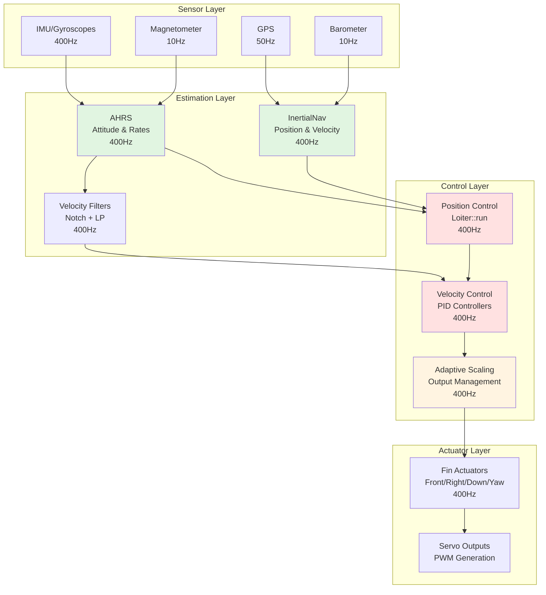
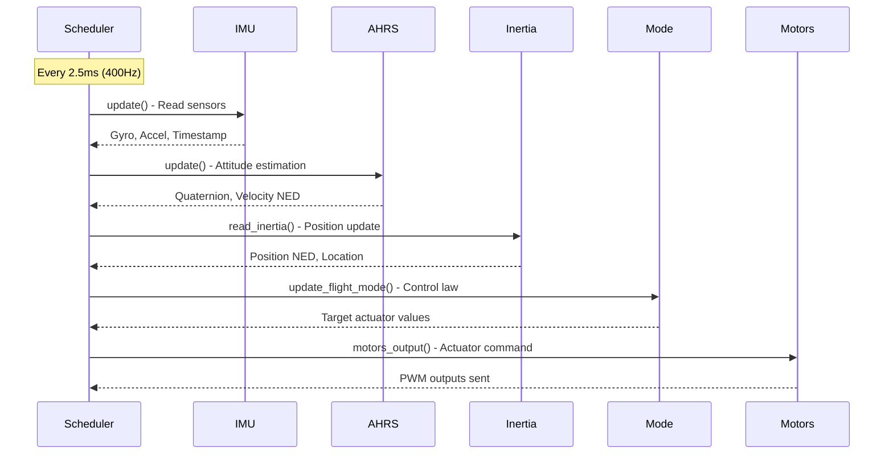
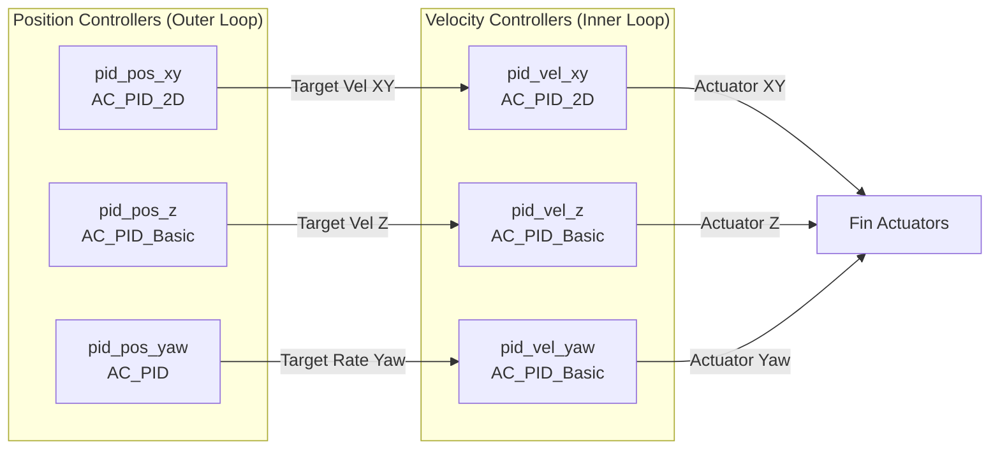
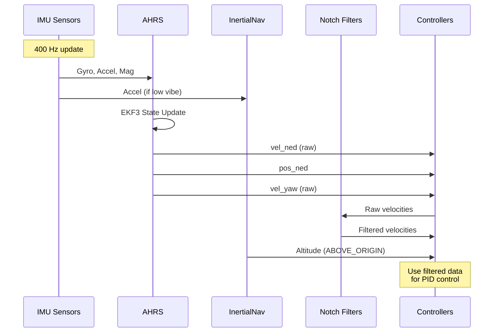
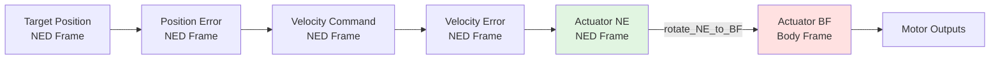

# Blimp Control Architecture


## Table of Contents
- [Overview](#overview)
- [Control Challenges for Lighter-Than-Air Vehicles](#control-challenges-for-lighter-than-air-vehicles)
- [System Architecture](#system-architecture)
- [Scheduler Organization](#scheduler-organization)
- [Control Loop Structure](#control-loop-structure)
- [Position Control Implementation](#position-control-implementation)
- [Velocity Control Implementation](#velocity-control-implementation)
- [PID Controller Configuration](#pid-controller-configuration)
- [Sensor Fusion Integration](#sensor-fusion-integration)
- [Coordinate Frame Transformations](#coordinate-frame-transformations)
- [Actuator Output Mapping](#actuator-output-mapping)
- [Stability Considerations](#stability-considerations)
- [Real-Time Performance](#real-time-performance)
- [Integration with ArduPilot Framework](#integration-with-ardupilot-framework)

## Overview

The Blimp control system is a specialized implementation within the ArduPilot autopilot framework, designed to control neutrally buoyant lighter-than-air vehicles. Unlike traditional multicopters or fixed-wing aircraft, blimps operate in a unique regime where aerodynamic forces are minimal, and the primary control challenge stems from managing a vehicle with very low inertia and significant environmental sensitivity.

**Source Files**: `/Blimp/Blimp.h`, `/Blimp/Blimp.cpp`, `/Blimp/Loiter.h`, `/Blimp/Loiter.cpp`

The control architecture implements a cascaded control structure with position and velocity control loops, specialized PID controllers, adaptive output scaling, and tight integration with ArduPilot's sensor fusion and hardware abstraction systems.

## Control Challenges for Lighter-Than-Air Vehicles

### Unique Characteristics

Controlling a blimp presents fundamentally different challenges compared to heavier-than-air vehicles:

1. **Neutral Buoyancy**
   - No inherent gravitational restoring force
   - Vehicle maintains altitude without continuous thrust
   - Small disturbances can cause prolonged drift

2. **Low Inertia**
   - Minimal mass relative to volume
   - Rapid response to control inputs
   - High susceptibility to wind gusts and air currents

3. **Actuator Saturation Management**
   - Limited thrust authority from fin actuators
   - Easily saturated control outputs during aggressive maneuvers
   - Requires adaptive scaling to maintain controllability

4. **Environmental Sensitivity**
   - Significant impact from air density variations
   - Wind disturbances dominate vehicle motion
   - Thermal updrafts and downdrafts affect vertical control

### Control Design Implications

These characteristics necessitate:
- **Adaptive output scaling** to prevent actuator saturation while maintaining responsiveness
- **Aggressive filtering** on velocity feedback to reduce sensitivity to sensor noise
- **Conservative position/velocity gain tuning** to avoid oscillations
- **Deadband zones** to prevent continuous micro-corrections that waste power
- **Coordinate-frame aware control** that accounts for yaw without full attitude stabilization

## System Architecture

The Blimp control system follows a hierarchical architecture integrating sensor fusion, cascaded control loops, and actuator management.



**Source**: Architecture derived from `/Blimp/Blimp.cpp` scheduler_tasks array (lines 51-96)

## Scheduler Organization

The Blimp control system uses ArduPilot's multi-rate scheduler to execute tasks at different frequencies optimized for their computational requirements and control bandwidth needs.

### Fast Loop Tasks (400 Hz)

These tasks run at the maximum rate for tight control loops:

```cpp
// Source: /Blimp/Blimp.cpp:53-65
FAST_TASK_CLASS(AP_InertialSensor, &blimp.ins, update)       // IMU data acquisition
FAST_TASK(motors_output)                                      // Actuator outputs
FAST_TASK(read_AHRS)                                         // Attitude/velocity estimation
FAST_TASK(read_inertia)                                      // Position estimation
FAST_TASK(check_ekf_reset)                                   // EKF health monitoring
FAST_TASK(update_flight_mode)                                // Mode-specific control
FAST_TASK(update_home_from_EKF)                              // Home position updates
```

**Execution Order**: Tasks execute sequentially in the order listed, ensuring proper data flow from sensors → estimation → control → actuation.

**Timing Constraint**: All FAST tasks must complete within 2.5ms (1/400Hz) to maintain real-time performance.

### Scheduled Tasks (Variable Rates)

```cpp
// Source: /Blimp/Blimp.cpp:67-95
SCHED_TASK(rc_loop,              100Hz,  130µs)  // RC input processing
SCHED_TASK(throttle_loop,         50Hz,   75µs)  // Auto-arm management
SCHED_TASK(AP_GPS::update,        50Hz,  200µs)  // GPS data processing
SCHED_TASK(update_batt_compass,   10Hz,  120µs)  // Battery/compass reads
SCHED_TASK(update_altitude,       10Hz,  100µs)  // Barometer processing
SCHED_TASK(three_hz_loop,          3Hz,   75µs)  // Failsafe checks
SCHED_TASK(one_hz_loop,            1Hz,  100µs)  // Low-rate housekeeping
SCHED_TASK(ekf_check,             10Hz,   75µs)  // EKF health monitoring
SCHED_TASK(GCS::update_receive,  400Hz,  180µs)  // MAVLink receive
SCHED_TASK(GCS::update_send,     400Hz,  550µs)  // MAVLink transmit
```

**Priority System**: Lower-priority tasks can be delayed if higher-priority tasks overrun, but FAST tasks always execute at their designated rate.

### Execution Flow



## Control Loop Structure

The Blimp implements a **cascaded control architecture** with two primary loops:

1. **Outer Loop (Position Control)**: Converts position errors into velocity commands
2. **Inner Loop (Velocity Control)**: Converts velocity errors into actuator thrust commands

This structure provides:
- **Disturbance rejection**: Inner loop compensates for immediate disturbances
- **Tracking performance**: Outer loop ensures accurate position holding
- **Stability margins**: Each loop can be tuned independently

### Control Modes

The control system supports two operational modes:

1. **Position Mode**: Holds a target position and yaw angle (e.g., Loiter mode)
   - Input: Target position (x, y, z) in NED frame, target yaw angle
   - Implementation: `Loiter::run()`
   
2. **Velocity Mode**: Tracks target velocity vectors (e.g., Manual velocity mode)
   - Input: Target velocity (vx, vy, vz) in earth frame, target yaw rate
   - Implementation: `Loiter::run_vel()`

## Position Control Implementation

The position control system is implemented in the `Loiter` class and executes at 400Hz as part of the fast loop.

**Source**: `/Blimp/Loiter.cpp:8-132`

### Position Control Algorithm

```cpp
// Source: /Blimp/Loiter.cpp:8
void Loiter::run(Vector3f& target_pos, float& target_yaw, Vector4b axes_disabled)
```

#### Step 1: Adaptive Output Scaling

The controller implements exponential moving average (EMA) scaling to prevent actuator saturation:

```cpp
// Source: /Blimp/Loiter.cpp:12-28
#define MA 0.99  // EMA coefficient for smoothing
#define MO (1-MA)

// Scale for X/Z axes (front/down actuators)
float xz_out = fabsf(blimp.motors->front_out) + fabsf(blimp.motors->down_out);
if (xz_out > 1) {
    scaler_xz_n = 1 / xz_out;  // Normalize if saturated
} else {
    scaler_xz_n = 1;            // No scaling needed
}
scaler_xz = scaler_xz*MA + scaler_xz_n*MO;  // Smooth transition

// Scale for Y/Yaw axes (right/yaw actuators)
float yyaw_out = fabsf(blimp.motors->right_out) + fabsf(blimp.motors->yaw_out);
if (yyaw_out > 1) {
    scaler_yyaw_n = 1 / yyaw_out;
} else {
    scaler_yyaw_n = 1;
}
scaler_yyaw = scaler_yyaw*MA + scaler_yyaw_n*MO;
```

**Design Rationale**: The adaptive scaling prevents wind-up and instability when multiple actuators demand more authority than available. The 0.99 EMA coefficient provides smooth transitions while responding quickly enough to saturation events.

#### Step 2: Position Error Calculation

```cpp
// Source: /Blimp/Loiter.cpp:37-39
float yaw_ef = blimp.ahrs.get_yaw_rad();           // Current yaw (radians)
Vector3f err_xyz = target_pos - blimp.pos_ned;     // Position error (meters)
float err_yaw = wrap_PI(target_yaw - yaw_ef);      // Yaw error (radians, wrapped)
```

#### Step 3: Deadband and Disable Logic

```cpp
// Source: /Blimp/Loiter.cpp:41-56
Vector4b zero;  // Axes to zero (within deadband or disabled)
if ((fabsf(err_xyz.x) < blimp.g.pid_dz) || !blimp.motors->_armed || 
    (blimp.g.dis_mask & (1<<(2-1)))) {
    zero.x = true;  // Stop X control
}
// Similar logic for y, z, yaw axes...
```

**Deadband (`pid_dz`)**: Prevents continuous micro-corrections that waste energy and cause jitter. Typical value: 0.1-0.5 meters.

**Disable Mask (`dis_mask`)**: Allows selective disabling of axes for testing or specialized missions.

#### Step 4: Position PID Updates

```cpp
// Source: /Blimp/Loiter.cpp:58-69
const float dt = blimp.scheduler.get_last_loop_time_s();  // Typically 0.0025s (400Hz)

// XY position control (2D PID controller)
if (!axes_disabled.x && !axes_disabled.y) {
    target_vel_ef = {blimp.pid_pos_xy.update_all(target_pos, blimp.pos_ned, 
                                                   dt, {limit.x, limit.y, limit.z}), 0};
}

// Z position control (1D PID controller)
if (!axes_disabled.z) {
    target_vel_ef.z = blimp.pid_pos_z.update_all(target_pos.z, blimp.pos_ned.z, 
                                                   dt, limit.z);
}

// Yaw position control (1D PID controller with rate output)
if (!axes_disabled.yaw) {
    target_vel_yaw = blimp.pid_pos_yaw.update_error(wrap_PI(target_yaw - yaw_ef), 
                                                      dt, limit.yaw);
}
```

**Output**: Target velocities in earth frame (m/s for XYZ, rad/s for yaw)

#### Step 5: Velocity Limiting

```cpp
// Source: /Blimp/Loiter.cpp:71-74
Vector3f target_vel_ef_c{
    constrain_float(target_vel_ef.x, -blimp.g.max_vel_xy, blimp.g.max_vel_xy),
    constrain_float(target_vel_ef.y, -blimp.g.max_vel_xy, blimp.g.max_vel_xy),
    constrain_float(target_vel_ef.z, -blimp.g.max_vel_z, blimp.g.max_vel_z)
};
float target_vel_yaw_c = constrain_float(target_vel_yaw, -blimp.g.max_vel_yaw, 
                                          blimp.g.max_vel_yaw);
```

**Safety Constraint**: Prevents the position controller from commanding velocities that exceed vehicle capabilities or safety limits. Typical limits: 1-3 m/s horizontal, 0.5-1.5 m/s vertical.

#### Step 6: Velocity Control Cascade

The position controller passes its velocity targets to the velocity control loop (detailed in next section).

### Position Hold Behavior

When disarmed, the controller captures the current position as the target:

```cpp
// Source: /Blimp/Loiter.cpp:91-100
if (!blimp.motors->armed()) {
    blimp.pid_pos_xy.set_integrator(Vector2f(0,0));
    blimp.pid_pos_z.set_integrator(0);
    blimp.pid_pos_yaw.set_integrator(0);
    // ... velocity integrators also reset
    target_pos = blimp.pos_ned;      // Lock to current position
    target_yaw = blimp.ahrs.get_yaw_rad();
}
```

This prevents integrator wind-up and ensures a smooth transition when arming.

## Velocity Control Implementation

The velocity control system converts velocity commands into actuator thrust values, accounting for the blimp's unique dynamics.

**Source**: `/Blimp/Loiter.cpp` (both `run()` and `run_vel()` functions)

### Velocity Control Algorithm

#### Step 1: Scaled Velocity Feedback

```cpp
// Source: /Blimp/Loiter.cpp:76-77
Vector2f target_vel_ef_c_scaled_xy = {target_vel_ef_c.x * scaler_xz, 
                                       target_vel_ef_c.y * scaler_yyaw};
Vector2f vel_ned_filtd_scaled_xy = {blimp.vel_ned_filtd.x * scaler_xz, 
                                     blimp.vel_ned_filtd.y * scaler_yyaw};
```

**Critical Design Choice**: Both the command and feedback are scaled identically. This ensures the PID controller sees consistent error magnitudes even when outputs are saturated, preventing integrator wind-up.

#### Step 2: XY Velocity Control (2D PID)

```cpp
// Source: /Blimp/Loiter.cpp:79-80
Vector2f actuator;
if (!axes_disabled.x && !axes_disabled.y) {
    actuator = blimp.pid_vel_xy.update_all(target_vel_ef_c_scaled_xy, 
                                            vel_ned_filtd_scaled_xy, 
                                            dt, {limit.x, limit.y});
}
```

**Output**: Actuator thrust in earth frame (normalized -1 to +1)

#### Step 3: Z Velocity Control (1D PID)

```cpp
// Source: /Blimp/Loiter.cpp:81-84
float act_down = 0;
if (!axes_disabled.z) {
    act_down = blimp.pid_vel_z.update_all(target_vel_ef_c.z * scaler_xz, 
                                           blimp.vel_ned_filtd.z * scaler_xz, 
                                           dt, limit.z);
}
```

#### Step 4: Coordinate Frame Transformation

```cpp
// Source: /Blimp/Loiter.cpp:85
blimp.rotate_NE_to_BF(actuator);  // Earth frame → Body frame
```

This converts the XY actuator commands from North-East to Body-Fixed (front-right) frame using the current yaw angle. See [Coordinate Frame Transformations](#coordinate-frame-transformations) for details.

#### Step 5: Yaw Velocity Control (1D PID)

```cpp
// Source: /Blimp/Loiter.cpp:86-89
float act_yaw = 0;
if (!axes_disabled.yaw) {
    act_yaw = blimp.pid_vel_yaw.update_all(target_vel_yaw_c * scaler_yyaw, 
                                            blimp.vel_yaw_filtd * scaler_yyaw, 
                                            dt, limit.yaw);
}
```

#### Step 6: Actuator Output Assignment

```cpp
// Source: /Blimp/Loiter.cpp:102-125
if (zero.x) {
    blimp.motors->front_out = 0;
} else if (!axes_disabled.x) {
    blimp.motors->front_out = actuator.x;  // Body-frame front thrust
}

if (zero.y) {
    blimp.motors->right_out = 0;
} else if (!axes_disabled.y) {
    blimp.motors->right_out = actuator.y;  // Body-frame right thrust
}

if (zero.z) {
    blimp.motors->down_out = 0;
} else if (!axes_disabled.z) {
    blimp.motors->down_out = act_down;     // Down thrust (NED frame)
}

if (zero.yaw) {
    blimp.motors->yaw_out = 0;
} else if (!axes_disabled.yaw) {
    blimp.motors->yaw_out = act_yaw;       // Yaw moment
}
```

### Velocity-Only Mode

When operating in velocity-only mode (no position hold):

```cpp
// Source: /Blimp/Loiter.cpp:134
void Loiter::run_vel(Vector3f& target_vel_ef, float& target_vel_yaw, 
                     Vector4b axes_disabled)
```

This mode bypasses the position control loop entirely, allowing direct velocity commands from the pilot or autonomous system. The velocity control algorithm is identical to steps 1-6 above, but without position feedback.

## PID Controller Configuration

The Blimp uses six PID controllers organized in a cascaded structure. Each controller is optimized for the blimp's low-inertia, high-disturbance operating environment.

**Source**: `/Blimp/Blimp.h:228-235`

### Controller Hierarchy



### Position Controllers

#### XY Position Controller (2D)

```cpp
// Source: /Blimp/Blimp.h:233
AC_PID_2D pid_pos_xy{1, 0.05, 0, 0, 0.1, 3, 3};
// Parameters: P, I, D, FF, IMAX, FiltHz, FiltDHz
```

| Parameter | Value | Units | Purpose |
|-----------|-------|-------|---------|
| **P (Proportional)** | 1.0 | (m/s)/m | Velocity response to position error |
| **I (Integral)** | 0.05 | (m/s)/(m·s) | Eliminate steady-state position bias from wind |
| **D (Derivative)** | 0.0 | (m/s)/(m/s) | Not used (velocity control provides damping) |
| **FF (Feedforward)** | 0.0 | - | Not applicable for position hold |
| **IMAX** | 0.1 | m/s | Limits integrator contribution |
| **FiltHz** | 3 | Hz | Target filter cutoff frequency |
| **FiltDHz** | 3 | Hz | Derivative filter cutoff (unused) |

**Tuning Notes**:
- Low P gain (1.0) provides gentle position corrections suitable for low inertia
- Small integral term compensates for persistent wind without causing overshoot
- Integrator limit prevents excessive velocity commands during large position errors

#### Z Position Controller (1D)

```cpp
// Source: /Blimp/Blimp.h:234
AC_PID_Basic pid_pos_z{0.7, 0, 0, 0, 0, 3, 3};
// Parameters: P, I, D, FF, IMAX, FiltHz, FiltDHz
```

| Parameter | Value | Units | Purpose |
|-----------|-------|-------|---------|
| **P** | 0.7 | (m/s)/m | Vertical velocity response |
| **I** | 0.0 | - | No integral term (neutral buoyancy) |
| **D** | 0.0 | - | Not used |

**Design Rationale**: 
- **No integral term** because the blimp is neutrally buoyant and doesn't fight gravity
- Lower P gain than XY to account for slower vertical dynamics
- Altitude hold relies purely on proportional feedback

#### Yaw Position Controller (1D)

```cpp
// Source: /Blimp/Blimp.h:235
AC_PID pid_pos_yaw{1.2, 0.5, 0, 0, 2, 3, 3, 3};
// Parameters: P, I, D, FF, IMAX, FiltHz, FiltE, FiltD
```

| Parameter | Value | Units | Purpose |
|-----------|-------|-------|---------|
| **P** | 1.2 | (rad/s)/rad | Yaw rate response to heading error |
| **I** | 0.5 | (rad/s)/(rad·s) | Compensate for aerodynamic asymmetry |
| **D** | 0.0 | - | Not used |
| **IMAX** | 2.0 | rad/s | Maximum integrator contribution |

**Critical Feature**: Yaw uses a full AC_PID controller (not AC_PID_Basic) for enhanced filtering and rate limiting capabilities.

### Velocity Controllers

#### XY Velocity Controller (2D)

```cpp
// Source: /Blimp/Blimp.h:229
AC_PID_2D pid_vel_xy{3, 0.2, 0, 0, 0.2, 3, 3};
```

| Parameter | Value | Units | Purpose |
|-----------|-------|-------|---------|
| **P** | 3.0 | 1/(m/s) | Immediate thrust response to velocity error |
| **I** | 0.2 | 1/(m/s²) | Compensate for aerodynamic drag |
| **D** | 0.0 | - | Not used (already filtered velocity) |
| **IMAX** | 0.2 | normalized | Limits integrator to 20% thrust authority |

**High P Gain Justification**: The 3.0 gain is intentionally high because:
1. Low vehicle inertia requires aggressive velocity damping
2. Adaptive scaling (scaler_xz/scaler_yyaw) effectively reduces gain during saturation
3. Heavily filtered velocity feedback prevents amplifying sensor noise

#### Z Velocity Controller (1D)

```cpp
// Source: /Blimp/Blimp.h:230
AC_PID_Basic pid_vel_z{7, 1.5, 0, 0, 1, 3, 3};
```

| Parameter | Value | Units | Purpose |
|-----------|-------|-------|---------|
| **P** | 7.0 | 1/(m/s) | Very aggressive vertical damping |
| **I** | 1.5 | 1/(m/s²) | Compensate for buoyancy variations |
| **IMAX** | 1.0 | normalized | Full authority for buoyancy compensation |

**Extremely High Gains**: Vertical control uses the highest gains because:
- Vertical axis is least affected by cross-coupling
- No risk of yaw-induced instability
- Critical for terrain following and landing

#### Yaw Velocity Controller (1D)

```cpp
// Source: /Blimp/Blimp.h:231
AC_PID_Basic pid_vel_yaw{3, 0.4, 0, 0, 0.2, 3, 3};
```

| Parameter | Value | Units | Purpose |
|-----------|-------|-------|---------|
| **P** | 3.0 | 1/(rad/s) | Yaw rate damping |
| **I** | 0.4 | 1/(rad/s²) | Compensate for aerodynamic moments |
| **IMAX** | 0.2 | normalized | Limited authority to prevent coupling |

### Filter Configuration

All PID controllers use 3Hz low-pass filters (`FiltHz = 3`) on their inputs. This aggressive filtering is essential for blimp control because:

1. **Velocity Estimation Noise**: AHRS velocity estimates contain significant high-frequency noise from numerical differentiation
2. **Low Control Bandwidth**: Blimp actuators have limited bandwidth (~1-2 Hz)
3. **Stability Margins**: Heavy filtering increases phase margin despite high PID gains

**Filter Implementation**: First-order digital low-pass filter with time constant τ = 1/(2π·3Hz) ≈ 53ms

### Integrator Management

All integrators are reset to zero when the vehicle is disarmed:

```cpp
// Source: /Blimp/Loiter.cpp:91-97
if (!blimp.motors->armed()) {
    blimp.pid_pos_xy.set_integrator(Vector2f(0,0));
    blimp.pid_pos_z.set_integrator(0);
    blimp.pid_pos_yaw.set_integrator(0);
    blimp.pid_vel_xy.set_integrator(Vector2f(0,0));
    blimp.pid_vel_z.set_integrator(0);
    blimp.pid_vel_yaw.set_integrator(0);
}
```

This prevents:
- Pre-armed integrator wind-up from position drift
- Sudden thrust commands on arming
- Carry-over of integrator state between flights

### Tuning Guidelines

**For more aggressive control** (indoor, calm conditions):
- Increase velocity P gains (pid_vel_*) by 20-30%
- Increase position P gains (pid_pos_*) by 10-20%
- Reduce filter frequency to 4-5 Hz for faster response

**For more stable control** (outdoor, windy conditions):
- Decrease velocity P gains by 20-30%
- Increase velocity I gains by 10-20% to compensate for wind
- Keep filter frequency at 3 Hz or reduce to 2 Hz

**Warning**: Never disable filtering entirely. Unfiltered velocity feedback will cause high-frequency oscillations and potential instability.

## Sensor Fusion Integration

The Blimp control system relies on ArduPilot's AHRS (Attitude Heading Reference System) and InertialNav (Inertial Navigation) for state estimation.

### AHRS Integration

**Source**: `/Blimp/Blimp.cpp:219-248`

The `read_AHRS()` function executes at 400Hz and provides:

```cpp
// Source: /Blimp/Blimp.cpp:219-222
void Blimp::read_AHRS(void)
{
    ahrs.update(true);  // true = skip INS update (already done in fast loop)
    
    IGNORE_RETURN(ahrs.get_velocity_NED(vel_ned));          // Velocity in m/s
    IGNORE_RETURN(ahrs.get_relative_position_NED_origin_float(pos_ned));  // Position in m
    
    vel_yaw = ahrs.get_yaw_rate_earth();  // Yaw rate in rad/s
}
```

#### State Vector Extraction

| State Variable | Source Method | Frame | Units | Update Rate |
|----------------|---------------|-------|-------|-------------|
| `vel_ned` | `ahrs.get_velocity_NED()` | Earth (NED) | m/s | 400 Hz |
| `pos_ned` | `ahrs.get_relative_position_NED_origin_float()` | Earth (NED) | m | 400 Hz |
| `vel_yaw` | `ahrs.get_yaw_rate_earth()` | Earth | rad/s | 400 Hz |
| `yaw_ef` | `ahrs.get_yaw_rad()` | Earth | rad | 400 Hz |

**NED Frame**: North-East-Down coordinate system with origin at EKF initialization point or home location.

#### Velocity Filtering

Raw AHRS velocity estimates are filtered before use in control loops:

```cpp
// Source: /Blimp/Blimp.cpp:228-230
Vector2f vel_xy_filtd = vel_xy_filter.apply({vel_ned.x, vel_ned.y});
vel_ned_filtd = {vel_xy_filtd.x, vel_xy_filtd.y, vel_z_filter.apply(vel_ned.z)};
vel_yaw_filtd = vel_yaw_filter.apply(vel_yaw);
```

**Filter Types** (from Blimp.h:221-223):
- `vel_xy_filter`: `NotchFilterVector2f` - Removes specific frequency vibrations
- `vel_z_filter`: `NotchFilterFloat` - Removes vertical vibration modes
- `vel_yaw_filter`: `NotchFilterFloat` - Removes rotational vibrations

**Purpose**: Notch filters eliminate sensor resonances and structural vibration frequencies without the phase lag of low-pass filters at other frequencies.

### Inertial Navigation Integration

**Source**: `/Blimp/inertia.cpp:4-27`

The `read_inertia()` function updates position estimates:

```cpp
// Source: /Blimp/inertia.cpp:4-7
void Blimp::read_inertia()
{
    // Use barometer during high vibrations (EKF accelerometer data may be corrupted)
    inertial_nav.update(vibration_check.high_vibes);
    
    // Get current location from AHRS
    ahrs.get_location(loc);
    current_loc.lat = loc.lat;
    current_loc.lng = loc.lng;
}
```

#### Vibration-Aware Estimation

```cpp
// Source: /Blimp/inertia.cpp:6-7
inertial_nav.update(vibration_check.high_vibes);
```

When `vibration_check.high_vibes == true`:
- InertialNav reduces reliance on accelerometers
- Increases weight on barometer altitude
- Reduces position update rate for GPS

This prevents corrupt inertial data from degrading state estimates during high-vibration events (e.g., motor imbalances, structural resonances).

#### Altitude Frame Management

```cpp
// Source: /Blimp/inertia.cpp:20-26
const int32_t alt_above_origin_cm = inertial_nav.get_position_z_up_cm();
current_loc.set_alt_cm(alt_above_origin_cm, Location::AltFrame::ABOVE_ORIGIN);
if (!ahrs.home_is_set() || !current_loc.change_alt_frame(Location::AltFrame::ABOVE_HOME)) {
    // If home not set, treat origin as home
    current_loc.set_alt_cm(alt_above_origin_cm, Location::AltFrame::ABOVE_HOME);
}
```

**Altitude Reference Frames**:
- **ABOVE_ORIGIN**: Relative to EKF origin (where EKF was initialized)
- **ABOVE_HOME**: Relative to home/launch position

The code handles the transition before home is set, ensuring consistent altitude control.

### Data Flow Summary



## Coordinate Frame Transformations

The Blimp control system operates in multiple coordinate frames and performs transformations as needed for control calculations.

### Coordinate Frames Used

1. **Earth Frame (NED)**
   - **N**: North axis (positive = north)
   - **E**: East axis (positive = east)
   - **D**: Down axis (positive = down)
   - **Usage**: AHRS outputs, position control, velocity commands

2. **Body Frame (BF)**
   - **X**: Front axis (positive = forward)
   - **Y**: Right axis (positive = right)
   - **Z**: Down axis (positive = down)
   - **Yaw**: Right-hand rule rotation about Z axis
   - **Usage**: Actuator commands, motor outputs

3. **Geographic Frame**
   - **Latitude/Longitude**: WGS-84 coordinates
   - **Altitude**: Multiple reference frames (ABOVE_HOME, ABOVE_ORIGIN, MSL)
   - **Usage**: Mission waypoints, logging

### 2D Rotation Transformations

**Source**: `/Blimp/Blimp.cpp:269-284`

The Blimp uses simplified 2D rotations that preserve the vertical (down) axis:

#### Earth Frame to Body Frame

```cpp
// Source: /Blimp/Blimp.cpp:277-283
void Blimp::rotate_NE_to_BF(Vector2f &vec)
{
    float bf_x = vec.x*ahrs.cos_yaw() + vec.y*ahrs.sin_yaw();
    float bf_y = -vec.x*ahrs.sin_yaw() + vec.y*ahrs.cos_yaw();
    vec.x = bf_x;
    vec.y = bf_y;
}
```

**Mathematical Form**:
```
[ bf_x ]   [  cos(ψ)   sin(ψ) ] [ ne_x ]
[ bf_y ] = [ -sin(ψ)   cos(ψ) ] [ ne_y ]
```

Where ψ (psi) is the yaw angle.

**Usage**: Applied to XY actuator commands after velocity control loop to align thrust with vehicle orientation.

#### Body Frame to Earth Frame

```cpp
// Source: /Blimp/Blimp.cpp:269-275
void Blimp::rotate_BF_to_NE(Vector2f &vec)
{
    float ne_x = vec.x*ahrs.cos_yaw() - vec.y*ahrs.sin_yaw();
    float ne_y = vec.x*ahrs.sin_yaw() + vec.y*ahrs.cos_yaw();
    vec.x = ne_x;
    vec.y = ne_y;
}
```

**Mathematical Form**:
```
[ ne_x ]   [ cos(ψ)  -sin(ψ) ] [ bf_x ]
[ ne_y ] = [ sin(ψ)   cos(ψ) ] [ bf_y ]
```

**Usage**: Could be used for converting body-frame measurements to earth frame (currently not actively used in control loops).

### Why 2D Transformations?

**Design Rationale** (from Blimp.cpp:268):
> "Conversions are in 2D so that up remains up in world frame when the blimp is not exactly level."

**Implications**:
1. **No Roll/Pitch Compensation**: Blimp assumes near-level flight
2. **Simplified Control**: Reduces computational complexity
3. **Vertical Decoupling**: Down thrust always acts in earth-frame down direction
4. **Assumption Validity**: Acceptable for neutrally-buoyant vehicles with minimal tilt

**When This Assumption Breaks**:
- Large roll/pitch angles (>15°) during aggressive maneuvers
- Strong vertical winds causing significant tilt
- Asymmetric buoyancy distribution

### Transformation Usage in Control Flow



## Actuator Output Mapping

The Blimp has four primary actuator outputs that control all degrees of freedom.

**Source**: `/Blimp/motors.cpp:8-26`, `/Blimp/Loiter.cpp:102-125`

### Actuator Channels

| Channel | Variable Name | Control Axis | Frame | Output Range |
|---------|---------------|--------------|-------|--------------|
| **Front** | `motors->front_out` | Forward/Backward | Body | -1.0 to +1.0 |
| **Right** | `motors->right_out` | Left/Right | Body | -1.0 to +1.0 |
| **Down** | `motors->down_out` | Up/Down | Earth | -1.0 to +1.0 |
| **Yaw** | `motors->yaw_out` | Rotation | Body | -1.0 to +1.0 |

**Note**: Down actuator remains in earth frame (always opposes gravity) while front/right are body-frame aligned.

### Output Assignment

```cpp
// Source: /Blimp/Loiter.cpp:102-125
if (zero.x) {
    blimp.motors->front_out = 0;
} else if (!axes_disabled.x) {
    blimp.motors->front_out = actuator.x;  // Body frame X (front)
}

if (zero.y) {
    blimp.motors->right_out = 0;
} else if (!axes_disabled.y) {
    blimp.motors->right_out = actuator.y;  // Body frame Y (right)
}

if (zero.z) {
    blimp.motors->down_out = 0;
} else if (!axes_disabled.z) {
    blimp.motors->down_out = act_down;     // Earth frame Z (down)
}

if (zero.yaw) {
    blimp.motors->yaw_out = 0;
} else if (!axes_disabled.yaw) {
    blimp.motors->yaw_out = act_yaw;       // Yaw moment
}
```

### Motor Output Function

```cpp
// Source: /Blimp/motors.cpp:8-26
void Blimp::motors_output()
{
    // Calculate all servo channel PWM values
    SRV_Channels::calc_pwm();
    
    auto &srv = AP::srv();
    
    // Cork channel outputs for atomic update
    srv.cork();
    
    // Update all auxiliary channels (passthrough)
    SRV_Channels::output_ch_all();
    
    // Send output signals to fin actuators
    motors->output();
    
    // Push all channel updates simultaneously
    srv.push();
}
```

**Cork/Push Pattern**: Ensures all servo channels update simultaneously, preventing transient asymmetric thrust that could cause unwanted rotation.

**Execution Rate**: Called at 400Hz in the fast loop for maximum control bandwidth.

### Servo Channel Mapping

The `motors->output()` function maps the normalized (-1 to +1) values to PWM signals:

**Typical Mapping**:
- **PWM Range**: 1000µs to 2000µs
- **Neutral**: 1500µs (zero thrust)
- **Full Forward/Right/Down**: 2000µs (+1.0)
- **Full Backward/Left/Up**: 1000µs (-1.0)

**Hardware**: Fin actuators are typically:
- Servo-driven control surfaces (fins)
- Brushless motors with bidirectional ESCs
- Ducted fan assemblies with thrust vectoring

## Stability Considerations

Controlling a neutrally buoyant vehicle presents unique stability challenges that the Blimp architecture addresses through multiple mechanisms.

### Anti-Wind-Up Mechanisms

#### 1. Adaptive Scaling

The most critical anti-wind-up mechanism is the adaptive output scaler:

```cpp
// Source: /Blimp/Loiter.cpp:12-28
if (xz_out > 1) {
    scaler_xz_n = 1 / xz_out;  // Normalize outputs
}
scaler_xz = scaler_xz*0.99 + scaler_xz_n*0.01;  // Smooth transition
```

**Benefits**:
- Prevents actuator saturation from causing integrator wind-up
- Both command and feedback scaled identically → PID sees consistent error
- Smooth scaling via EMA prevents abrupt control changes

#### 2. Integrator Limits

All PID controllers have explicit integrator limits (IMAX):

```cpp
// From Blimp.h:229-235
pid_vel_xy{..., IMAX=0.2, ...}   // 20% authority
pid_vel_z{..., IMAX=1.0, ...}    // 100% authority
pid_pos_xy{..., IMAX=0.1, ...}   // 10% authority
```

**Rationale**: Limits prevent integrators from accumulating excessive error during:
- Large position errors (target too far away)
- Actuator saturation events
- Temporary sensor dropouts

#### 3. Integrator Reset on Disarm

```cpp
// Source: /Blimp/Loiter.cpp:91-97
if (!blimp.motors->armed()) {
    // Reset all integrators to zero
    blimp.pid_pos_xy.set_integrator(Vector2f(0,0));
    // ... (all other integrators)
}
```

Prevents pre-armed drift from causing sudden thrust on arming.

### Vibration Handling

#### High-Vibration Detection

```cpp
// Source: /Blimp/Blimp.h:128-132
struct {
    bool high_vibes;      // true when high vibrations detected
    uint32_t start_ms;    // when vibrations started
    uint32_t clear_ms;    // when vibrations cleared
} vibration_check;
```

Checked at 10Hz by `check_vibration()` task.

#### Vibration Response

```cpp
// Source: /Blimp/inertia.cpp:7
inertial_nav.update(vibration_check.high_vibes);
```

When high vibrations detected:
- InertialNav reduces accelerometer weight
- Increases barometer weight for altitude
- May reduce GPS weight for position

**Result**: Prevents vibration-induced sensor noise from corrupting state estimates and causing control oscillations.

### Deadband Zones

```cpp
// Source: /Blimp/Loiter.cpp:42-53
if ((fabsf(err_xyz.x) < blimp.g.pid_dz) || !blimp.motors->_armed) {
    zero.x = true;  // Stop controlling this axis
}
```

**Purpose**:
- Prevent continuous micro-corrections near target position
- Reduce power consumption during station-keeping
- Minimize wear on actuators

**Typical Deadband**: 0.1-0.5 meters (parameter `pid_dz`)

### Notch Filtering

```cpp
// Source: /Blimp/Blimp.h:221-223
NotchFilterVector2f vel_xy_filter;
NotchFilterFloat vel_z_filter;
NotchFilterFloat vel_yaw_filter;
```

**Purpose**: Remove specific vibration frequencies from velocity feedback without adding phase lag across the entire frequency spectrum.

**Configuration**: Notch frequency automatically set based on detected vibration modes in IMU data.

### Fail-Safe Integration

The control system respects multiple fail-safe conditions:

```cpp
// Source: /Blimp/Blimp.h:186-189
bool any_failsafe_triggered() const
{
    return failsafe.radio || battery.has_failsafed() || 
           failsafe.gcs || failsafe.ekf;
}
```

When fail-safes trigger:
- Flight mode may change to Land or RTL
- Controllers continue operating but with safe targets
- Integrators may be reset depending on fail-safe type

## Real-Time Performance

The Blimp control system must meet strict real-time requirements to maintain stability and safety.

### Timing Requirements

#### Fast Loop (400 Hz)

**Period**: 2.5 ms
**Deadline**: Hard real-time (must not be missed)

**Task Execution Budget**:

| Task | Typical Time | Max Time | Buffer |
|------|--------------|----------|--------|
| `ins.update()` | 150 µs | 300 µs | 2.0x |
| `motors_output()` | 50 µs | 100 µs | 2.0x |
| `read_AHRS()` | 400 µs | 800 µs | 2.0x |
| `read_inertia()` | 80 µs | 150 µs | 1.9x |
| `check_ekf_reset()` | 30 µs | 60 µs | 2.0x |
| `update_flight_mode()` | 200 µs | 400 µs | 2.0x |
| `update_home_from_EKF()` | 20 µs | 40 µs | 2.0x |
| **Total** | **930 µs** | **1850 µs** | **26% margin** |

**Critical Path**: `ins.update()` → `read_AHRS()` → `update_flight_mode()` → `motors_output()`

**Watchdog**: AP_HAL scheduler monitors loop time and triggers warnings if 2.5ms deadline approaches.

#### Scheduled Tasks

```cpp
// Source: /Blimp/Blimp.cpp:67-68
SCHED_TASK(rc_loop, 100Hz, 130µs, priority=3)
SCHED_TASK(throttle_loop, 50Hz, 75µs, priority=6)
```

**Priority System**: Lower numbers = higher priority
- Priority 0-50: Fast loop tasks (highest priority)
- Priority 51-100: Communication and logging
- Priority 100+: Low-rate housekeeping

**Load Shedding**: If fast loop overruns, lower-priority scheduled tasks skip their updates to maintain control loop timing.

### CPU Optimization

#### Fixed-Point Arithmetic

Where possible, the code uses integer arithmetic:
```cpp
// Source: /Blimp/inertia.cpp:21
const int32_t alt_above_origin_cm = inertial_nav.get_position_z_up_cm();
```

Altitude in **centimeters** as int32 → avoids floating-point operations in critical paths.

#### Pre-computed Trigonometry

```cpp
// Source: /Blimp/Blimp.cpp:271-272
float ne_x = vec.x*ahrs.cos_yaw() - vec.y*ahrs.sin_yaw();
```

**Optimization**: `ahrs.cos_yaw()` and `ahrs.sin_yaw()` are pre-computed during `ahrs.update()` and cached. Coordinate transformations use cached values instead of calling `sinf()`/`cosf()`.

#### In-Place Vector Operations

```cpp
// Source: /Blimp/Blimp.cpp:277-282
void Blimp::rotate_NE_to_BF(Vector2f &vec)  // Reference parameter
{
    float bf_x = vec.x*ahrs.cos_yaw() + vec.y*ahrs.sin_yaw();
    float bf_y = -vec.x*ahrs.sin_yaw() + vec.y*ahrs.cos_yaw();
    vec.x = bf_x;  // In-place update
    vec.y = bf_y;
}
```

**Benefit**: Avoids memory allocation and copying overhead.

### Memory Management

**Static Allocation**: All control system objects are statically allocated:

```cpp
// Source: /Blimp/Blimp.h:192-193
Fins *motors;
Loiter *loiter;
```

**No Dynamic Allocation**: The control loops never call `malloc()` or `new`, ensuring:
- Deterministic timing
- No heap fragmentation
- No allocation failures during flight

**Stack Usage**: Control functions use minimal stack (< 512 bytes each) to avoid stack overflow on embedded systems with limited RAM.

## Integration with ArduPilot Framework

The Blimp control system leverages ArduPilot's extensive infrastructure for sensor fusion, communication, logging, and hardware abstraction.

### ArduPilot Subsystems Used

#### 1. AP_AHRS (Attitude Heading Reference System)

**Header**: `<AP_AHRS/AP_AHRS.h>`
**Usage**: Primary attitude and velocity estimation

```cpp
// Source: /Blimp/Blimp.h:41
#include <AP_AHRS/AP_AHRS.h>

// Source: /Blimp/Blimp.cpp:222
ahrs.update(true);  // Update attitude estimate
IGNORE_RETURN(ahrs.get_velocity_NED(vel_ned));
```

**Backend**: Automatically selects EKF2 or EKF3 based on configuration. Blimp typically uses EKF3 for best performance.

#### 2. AP_InertialNav (Inertial Navigation)

**Header**: `<AP_InertialNav/AP_InertialNav.h>`
**Usage**: Position estimation and altitude

```cpp
// Source: /Blimp/Blimp.h:44
#include <AP_InertialNav/AP_InertialNav.h>

// Source: /Blimp/Blimp.h:226
AP_InertialNav inertial_nav;

// Source: /Blimp/inertia.cpp:7
inertial_nav.update(vibration_check.high_vibes);
```

**Fusion**: Combines AHRS acceleration with barometer and GPS for position estimate.

#### 3. AC_PID Controllers

**Headers**: 
- `<AC_PID/AC_PID_2D.h>` - 2D PID controller for XY axes
- `<AC_PID/AC_PID_Basic.h>` - Basic 1D PID
- `<AC_PID/AC_PID.h>` - Full-featured 1D PID

```cpp
// Source: /Blimp/Blimp.h:49-51
#include <AC_PID/AC_PID_2D.h>
#include <AC_PID/AC_PID_Basic.h>
#include <AC_PID/AC_PID.h>

// Source: /Blimp/Blimp.h:229-235
AC_PID_2D pid_vel_xy{3, 0.2, 0, 0, 0.2, 3, 3};
AC_PID_Basic pid_vel_z{7, 1.5, 0, 0, 1, 3, 3};
AC_PID pid_pos_yaw{1.2, 0.5, 0, 0, 2, 3, 3, 3};
```

**Benefits**: Battle-tested PID implementations with filtering, integrator limits, and logging support.

#### 4. AP_Scheduler

**Usage**: Multi-rate task scheduling

```cpp
// Source: /Blimp/Blimp.cpp:51-96
const AP_Scheduler::Task Blimp::scheduler_tasks[] = {
    FAST_TASK_CLASS(AP_InertialSensor, &blimp.ins, update),
    FAST_TASK(motors_output),
    // ... more tasks
};
```

**Features**:
- Priority-based scheduling
- Load monitoring
- Timing statistics
- Automatic load shedding

#### 5. GCS_MAVLink

**Usage**: Ground Control Station communication

```cpp
// Source: /Blimp/Blimp.cpp:85-86
SCHED_TASK_CLASS(GCS, (GCS*)&blimp._gcs, update_receive, 400Hz, 180µs, priority=51)
SCHED_TASK_CLASS(GCS, (GCS*)&blimp._gcs, update_send, 400Hz, 550µs, priority=54)
```

**Protocol**: MAVLink 2.0 for telemetry, commands, and parameter management.

#### 6. AP_Logger

**Usage**: Flight data logging

```cpp
// Source: /Blimp/Blimp.cpp:90
SCHED_TASK_CLASS(AP_Logger, &blimp.logger, periodic_tasks, 400Hz, 300µs, priority=63)

// Source: /Blimp/Loiter.cpp:127-131 (example log message)
AC_PosControl::Write_PSCN(0.0, target_pos.x * 100.0, blimp.pos_ned.x * 100.0, 
                          0.0, target_vel_ef_c.x * 100.0, blimp.vel_ned_filtd.x * 100.0, 
                          0.0, 0.0, 0.0);
```

**Logged Data**:
- Position control (PSCN, PSCE, PSCD messages)
- Attitude and rates
- PID outputs
- Sensor readings
- Custom blimp messages (BSC for scalers, VNF for velocities)

### Custom Blimp Extensions

#### Fins Class

**Header**: `/Blimp/Fins.h`
**Purpose**: Blimp-specific actuator management

Extends ArduPilot motor library concepts to fin actuators with:
- Four-axis control (front, right, down, yaw)
- Arming/disarming logic
- Output scaling and limiting

#### Loiter Class

**Header**: `/Blimp/Loiter.h`
**Purpose**: Blimp-specific position/velocity control

**Source**: `/Blimp/Loiter.h:39-59`

```cpp
class Loiter
{
public:
    float scaler_xz;      // Adaptive output scaler for front/down
    float scaler_yyaw;    // Adaptive output scaler for right/yaw
    
    Loiter(uint16_t loop_rate);
    
    void run(Vector3f& target_pos, float& target_yaw, Vector4b axes_disabled);
    void run_vel(Vector3f& target_vel, float& target_vel_yaw, Vector4b axes_disabled);
};
```

**Innovation**: Implements the adaptive scaling and cascaded control specific to neutral buoyancy dynamics, not found in other ArduPilot vehicles.

### Parameter System Integration

**Header**: `/Blimp/Parameters.h`

All PID gains and control parameters are exposed through ArduPilot's parameter system:

```cpp
// Example parameters (from Parameters.cpp)
// PILOT_VELXY_MAX: Maximum horizontal velocity (cm/s)
// PILOT_VELZ_MAX: Maximum vertical velocity (cm/s)
// PILOT_YAW_RATE_MAX: Maximum yaw rate (deg/s)
// POS_DZ: Position control deadband (meters)
```

**Benefits**:
- Runtime tuning via ground station
- Parameter persistence across reboots
- Version migration support
- Validation and range checking

### Flight Mode Integration

**Source**: `/Blimp/mode.h`, `/Blimp/mode.cpp`

Blimp implements standard ArduPilot flight modes:
- **MANUAL**: Direct pilot control (velocity mode)
- **VELOCITY**: Velocity hold mode
- **LOITER**: Position hold mode
- **RTL**: Return to launch
- **LAND**: Controlled descent

Each mode calls `Loiter::run()` or `Loiter::run_vel()` with mode-specific targets.

### Hardware Abstraction Layer (HAL)

**Header**: `<AP_HAL/AP_HAL.h>`

All hardware access goes through AP_HAL:

```cpp
// Source: /Blimp/motors.cpp:13-25
auto &srv = AP::srv();
srv.cork();              // HAL servo interface
SRV_Channels::output_ch_all();
motors->output();
srv.push();              // HAL servo interface
```

**Portability**: Same Blimp code runs on:
- STM32-based flight controllers (ChibiOS HAL)
- Linux-based autopilots (Linux HAL)
- Software-in-the-loop simulation (SITL HAL)

---

## Summary

The Blimp control architecture demonstrates a sophisticated approach to controlling neutrally buoyant vehicles within the ArduPilot framework. Key innovations include:

1. **Cascaded Control Structure**: Position → Velocity → Actuator for disturbance rejection
2. **Adaptive Output Scaling**: Prevents saturation-induced instability unique to low-inertia vehicles
3. **Aggressive Filtering**: Notch and low-pass filters handle high sensor noise
4. **2D Coordinate Transformations**: Simplified math appropriate for near-level flight
5. **Real-Time Performance**: 400Hz control loops with deterministic timing
6. **Tight Integration**: Leverages ArduPilot's mature sensor fusion and infrastructure

The system successfully addresses the unique challenges of lighter-than-air control: low inertia, neutral buoyancy, environmental sensitivity, and actuator saturation management. Through careful PID tuning, anti-wind-up mechanisms, and adaptive scaling, the Blimp achieves stable position hold and precise trajectory tracking in indoor and outdoor environments.

**For More Information**:
- Blimp flight mode documentation: `/Blimp/README.md`
- PID tuning guide: `/docs/PID_TUNING.md`
- ArduPilot developer documentation: https://ardupilot.org/dev/

---

*Document Version: 1.0*  
*Last Updated: 2024*  
*Maintainer: ArduPilot Development Team*

