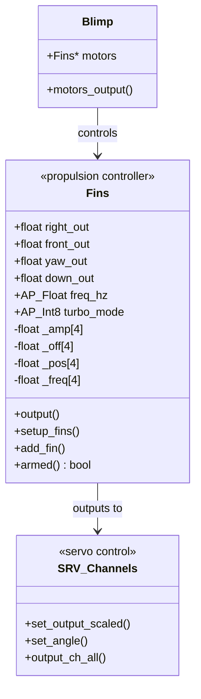

# Fin-Based Propulsion System


## Table of Contents
- [Overview](#overview)
- [Architecture](#architecture)
- [Sinusoidal Actuation Model](#sinusoidal-actuation-model)
- [Control Input Processing](#control-input-processing)
- [Fin Configuration](#fin-configuration)
- [Servo Channel Integration](#servo-channel-integration)
- [Parameter Configuration](#parameter-configuration)
- [Tuning Procedures](#tuning-procedures)
- [Hardware Requirements](#hardware-requirements)
- [Power Consumption](#power-consumption)
- [Comparison with Traditional Propulsion](#comparison-with-traditional-propulsion)
- [Troubleshooting](#troubleshooting)

## Overview

The ArduPilot Blimp employs a unique **biomimetic fin-based propulsion system** that mimics the undulating motion of aquatic animals. Unlike traditional propeller-based systems, this approach uses oscillating fins to generate thrust through sinusoidal actuation patterns. This design is specifically optimized for lighter-than-air vehicles operating in indoor environments or requiring low acoustic signatures.

**Source Files**: 
- `/Blimp/Fins.h` - Class definition and interface
- `/Blimp/Fins.cpp` - Implementation and control algorithms
- `/Blimp/motors.cpp` - Motor output integration

**Key Features**:
- Four-fin configuration for omnidirectional control
- Sinusoidal motion generation at configurable frequencies (1-10 Hz)
- Differential fin actuation for thrust vectoring
- Synchronized servo updates via cork/push mechanism
- Turbo mode for enhanced responsiveness
- Integrated with ArduPilot's SRV_Channel servo control framework

**Design Rationale**:
The fin-based approach offers several advantages for blimp applications:
- Low acoustic noise compared to high-speed propellers
- Gentle airflow patterns suitable for indoor operation
- Biomimetic efficiency at low Reynolds numbers
- Fault tolerance through redundant actuators
- Aesthetic appeal and visual interest

## Architecture

### Fins Class Structure

The propulsion system is implemented in the `Fins` class, which inherits motor control responsibilities and integrates with the main Blimp control loop.



**Source**: `/Blimp/Fins.h:9-105`

### Motor Frame Definition

The fin system uses the `MOTOR_FRAME_AIRFISH` frame class, which defines a four-fin configuration optimized for underwater-inspired propulsion.

```cpp
// Source: /Blimp/Fins.h:15-21
enum motor_frame_class {
    MOTOR_FRAME_UNDEFINED = 0,
    MOTOR_FRAME_AIRFISH = 1,
};
enum motor_frame_type {
    MOTOR_FRAME_TYPE_AIRFISH = 1,
};
```

### Data Flow


**Update Rate**: The Fins class is called at the main loop rate, typically 400 Hz (`_loop_rate` parameter).

**Source**: `/Blimp/Fins.h:49`

## Sinusoidal Actuation Model

### Mathematical Foundation

Each fin's position is calculated using a sinusoidal function that combines amplitude and offset components:

**Position Equation**:
```
pos[i] = amp[i] * cos(freq_hz * freq_mult[i] * time * 2π) + off[i]
```

Where:
- `pos[i]` = Servo position for fin i (range: -1 to +1)
- `amp[i]` = Oscillation amplitude (0 to 1)
- `freq_hz` = Base frequency in Hz (configurable, default 3 Hz)
- `freq_mult[i]` = Frequency multiplier (1 or 2 in turbo mode)
- `time` = Current timestamp in seconds
- `off[i]` = DC offset for directional bias (-1 to +1)

**Source**: `/Blimp/Fins.cpp:131`

### Implementation Details

```cpp
// Source: /Blimp/Fins.cpp:93-133
void Fins::output()
{
    _time = AP_HAL::micros() * 1.0e-6;  // Convert microseconds to seconds
    
    for (int8_t i=0; i<NUM_FINS; i++) {
        // Calculate amplitude from control inputs
        _amp[i] = fmaxf(0, _right_amp_factor[i]*right_out) + 
                  fmaxf(0, _front_amp_factor[i]*front_out) +
                  fabsf(_down_amp_factor[i]*down_out) + 
                  fabsf(_yaw_amp_factor[i]*yaw_out);
        
        // Calculate offset from control inputs
        _off[i] = _right_off_factor[i]*right_out + 
                  _front_off_factor[i]*front_out +
                  _down_off_factor[i]*down_out + 
                  _yaw_off_factor[i]*yaw_out;
        
        // Apply sinusoidal function
        _pos[i] = _amp[i]*cosf(freq_hz * _freq[i] * _time * 2 * M_PI) + _off[i];
        
        // Output to servo channel
        SRV_Channels::set_output_scaled(
            SRV_Channels::get_motor_function(i), 
            _pos[i] * FIN_SCALE_MAX
        );
    }
}
```

### Amplitude and Offset Saturation

To prevent servo overtravel, the system implements automatic saturation when the combined amplitude and offset exceed servo limits:

```cpp
// Source: /Blimp/Fins.cpp:120-122
if ((_amp[i] + fabsf(_off[i])) > 1) {
    _amp[i] = 1 - fabsf(_off[i]);  // Reduce amplitude to fit within limits
}
```

This ensures that:
- Maximum servo position never exceeds +1.0
- Minimum servo position never goes below -1.0
- Offset takes priority over amplitude when saturation occurs

### Turbo Mode

Turbo mode doubles the oscillation frequency when conditions indicate the need for enhanced thrust:

```cpp
// Source: /Blimp/Fins.cpp:124-129
if (turbo_mode) {
    // Double speed fins if offset at max and amplitude is low
    if (_amp[i] <= 0.6 && fabsf(_off[i]) >= 0.4) {
        _freq[i] = 2;
    }
}
```

**Activation Conditions**:
- `turbo_mode` parameter must be enabled (FINS_TURBO_MODE = 1)
- Amplitude ≤ 0.6 (fin not oscillating at full range)
- Absolute offset ≥ 0.4 (strong directional bias present)

**Purpose**: When a fin is biased heavily in one direction (high offset) with limited oscillation amplitude, doubling the frequency increases the average thrust output without exceeding servo travel limits.

## Control Input Processing

### Input Channels

The Fins class accepts four normalized control inputs, each ranging from -1.0 to +1.0:

| Input | Variable | Description | Negative Direction | Positive Direction |
|-------|----------|-------------|-------------------|-------------------|
| Lateral | `right_out` | Lateral movement control | Left | Right |
| Longitudinal | `front_out` | Forward/backward control | Backward | Forward |
| Vertical | `down_out` | Altitude control | Up | Down |
| Yaw | `yaw_out` | Rotation control | CCW rotation | CW rotation |

**Source**: `/Blimp/Fins.h:76-79`

### Input Constraints

Control inputs are constrained to valid ranges after logging but before actuation:

```cpp
// Source: /Blimp/Fins.cpp:88-91
right_out = constrain_float(right_out, -1, 1);
front_out = constrain_float(front_out, -1, 1);
down_out = constrain_float(down_out, -1, 1);
yaw_out = constrain_float(yaw_out, -1, 1);
```

> **Note**: Inputs are logged before constraining, allowing detection of control saturation and sub-optimal tuning that causes overshoots.

### Disarmed State Handling

When the vehicle is disarmed, all control inputs are zeroed to stop fin motion:

```cpp
// Source: /Blimp/Fins.cpp:75-81
if (!_armed) {
    right_out = 0;
    front_out = 0;
    down_out  = 0;
    yaw_out   = 0;
}
```

## Fin Configuration

### Standard Four-Fin Layout

The default configuration uses four fins positioned for omnidirectional control:

| Fin Index | Position | SRV Channel | Primary Function |
|-----------|----------|-------------|------------------|
| 0 | Back | k_motor1 | Forward/backward thrust |
| 1 | Front | k_motor2 | Forward/backward thrust |
| 2 | Right | k_motor3 | Lateral thrust & yaw |
| 3 | Left | k_motor4 | Lateral thrust & yaw |

**Source**: `/Blimp/Fins.cpp:37-48`

### Fin Factor Matrix

Each fin has eight factors that define its response to control inputs: four for amplitude and four for offset.

```cpp
// Source: /Blimp/Fins.cpp:39-43
// Fin configuration: add_fin(index, r_amp, f_amp, d_amp, y_amp, r_off, f_off, d_off, y_off)
add_fin(0,  0,  1, 0.5,   0,    0,  0,  0.5,    0); // Back fin
add_fin(1,  0, -1, 0.5,   0,    0,  0,  0.5,    0); // Front fin
add_fin(2, -1,  0,   0, 0.5,    0,  0,    0,  0.5); // Right fin
add_fin(3,  1,  0,   0, 0.5,    0,  0,    0, -0.5); // Left fin
```

**Amplitude Factors** (`*_amp_factor`):
- Determine how much each control input contributes to fin oscillation amplitude
- Always applied as absolute values (magnitude only)
- Positive values only; directionality comes from offset

**Offset Factors** (`*_off_factor`):
- Determine the directional bias of fin motion
- Can be positive or negative to reverse thrust direction
- Create asymmetric oscillation around a biased center point

### Example: Back Fin (Index 0)

```
Amplitude Factors:
- right_amp_factor = 0    (doesn't oscillate for lateral movement)
- front_amp_factor = 1    (full oscillation for forward/backward)
- down_amp_factor = 0.5   (half oscillation for vertical control)
- yaw_amp_factor = 0      (doesn't oscillate for yaw)

Offset Factors:
- right_off_factor = 0    (no lateral bias)
- front_off_factor = 0    (no forward/backward bias)
- down_off_factor = 0.5   (biased for vertical control)
- yaw_off_factor = 0      (no yaw bias)
```

**Result**: The back fin oscillates primarily in response to forward/backward commands, with moderate oscillation for altitude control and a vertical bias offset.

### Offset Averaging

When multiple control inputs contribute to a fin's offset, they are averaged to prevent excessive bias:

```cpp
// Source: /Blimp/Fins.cpp:116-118
if (_num_added > 0) {
    _off[i] = _off[i] / _num_added;  // Average the offsets
}
```

This ensures balanced response when multiple control axes are active simultaneously.

## Servo Channel Integration

### SRV_Channels Framework

The fin system uses ArduPilot's standard servo channel framework for PWM generation and output:

```cpp
// Source: /Blimp/Fins.cpp:45-48
SRV_Channels::set_angle(SRV_Channel::k_motor1, FIN_SCALE_MAX);
SRV_Channels::set_angle(SRV_Channel::k_motor2, FIN_SCALE_MAX);
SRV_Channels::set_angle(SRV_Channel::k_motor3, FIN_SCALE_MAX);
SRV_Channels::set_angle(SRV_Channel::k_motor4, FIN_SCALE_MAX);
```

### PWM Scaling

Fin positions are scaled from normalized values (-1 to +1) to the servo angle range:

```cpp
// Source: /Blimp/Fins.cpp:132
SRV_Channels::set_output_scaled(
    SRV_Channels::get_motor_function(i), 
    _pos[i] * FIN_SCALE_MAX
);
```

Where `FIN_SCALE_MAX = 1000`, providing a range of -1000 to +1000 for the SRV_Channels framework to convert to PWM values based on configured servo parameters.

### Cork and Push Mechanism

To ensure all servo outputs are updated simultaneously, the motor output system uses a cork/push pattern:

```cpp
// Source: /Blimp/motors.cpp:10-25
void Blimp::motors_output()
{
    SRV_Channels::calc_pwm();
    
    auto &srv = AP::srv();
    
    // Cork - buffer all outputs
    srv.cork();
    
    // Update all servo channels
    SRV_Channels::output_ch_all();
    
    // Send output signals to fins
    motors->output();
    
    // Push - send all buffered outputs simultaneously
    srv.push();
}
```

**Purpose**: 
- **Cork**: Buffers servo commands to prevent timing skew between fins
- **Push**: Releases all buffered commands at once for synchronized actuation
- **Result**: All four fins receive updated positions within microseconds of each other, maintaining coordinated thrust generation

## Parameter Configuration

### Available Parameters

The fin propulsion system exposes two user-configurable parameters through the AP_Param system:

#### FINS_FREQ_HZ

**Description**: Base oscillation frequency for all fins

```cpp
// Source: /Blimp/Fins.cpp:13-18
// @Param: FREQ_HZ
// @DisplayName: Fins frequency
// @Description: This is the oscillation frequency of the fins
// @Range: 1 10
// @User: Standard
AP_GROUPINFO("FREQ_HZ", 1, Fins, freq_hz, 3)
```

| Property | Value |
|----------|-------|
| Parameter Name | `FINS_FREQ_HZ` |
| Type | Float |
| Range | 1.0 - 10.0 Hz |
| Default | 3.0 Hz |
| Units | Hertz (cycles per second) |
| Access Level | Standard |

**Effect**: 
- Higher frequencies increase thrust output and responsiveness
- Lower frequencies reduce power consumption and servo wear
- Typical range: 2-5 Hz for most blimp applications
- Frequencies above 7 Hz may exceed servo bandwidth

#### FINS_TURBO_MODE

**Description**: Enables frequency doubling under high-offset, low-amplitude conditions

```cpp
// Source: /Blimp/Fins.cpp:20-25
// @Param: TURBO_MODE
// @DisplayName: Enable turbo mode
// @Description: Enables double speed on high offset.
// @Range: 0 1
// @User: Standard
AP_GROUPINFO("TURBO_MODE", 2, Fins, turbo_mode, 0)
```

| Property | Value |
|----------|-------|
| Parameter Name | `FINS_TURBO_MODE` |
| Type | Integer |
| Range | 0 (disabled) or 1 (enabled) |
| Default | 0 (disabled) |
| Access Level | Standard |

**Effect**:
- When enabled, fins automatically switch to 2x frequency when offset ≥ 0.4 and amplitude ≤ 0.6
- Increases thrust in highly directional maneuvers
- May increase power consumption and servo heating
- Useful for aggressive flight profiles or heavy payloads

### Parameter Access

Parameters can be configured through:
- **Ground Control Station**: Mission Planner, QGroundControl, or other MAVLink GCS
- **MAVLink Protocol**: Using PARAM_SET and PARAM_REQUEST messages
- **Configuration Files**: Direct modification of parameter files on the autopilot

## Tuning Procedures

### Initial Setup

1. **Verify Servo Installation**:
   - Ensure all four servos are mechanically connected to fins
   - Check servo rotation direction matches expected thrust direction
   - Verify servo arms are perpendicular to fin surface at neutral position

2. **Servo Calibration**:
   - Set servo PWM ranges in the `SERVOx_MIN`, `SERVOx_MAX`, and `SERVOx_TRIM` parameters
   - Typical values: MIN=1000µs, TRIM=1500µs, MAX=2000µs
   - Adjust to match actual servo travel limits

3. **Baseline Frequency**:
   - Start with default `FINS_FREQ_HZ = 3.0`
   - Verify smooth sinusoidal motion without servo binding
   - Listen for servo gear noise indicating excessive speed

### Frequency Optimization

**Objective**: Find the optimal frequency that balances thrust, efficiency, and servo longevity.

**Procedure**:

1. **Hover Test** (in calm conditions):
   ```
   FINS_FREQ_HZ = 2.0  →  Test altitude hold performance
   FINS_FREQ_HZ = 3.0  →  Test altitude hold performance  
   FINS_FREQ_HZ = 4.0  →  Test altitude hold performance
   FINS_FREQ_HZ = 5.0  →  Test altitude hold performance
   ```

2. **Evaluation Criteria**:
   - **Thrust adequacy**: Can the blimp maintain altitude and position?
   - **Control authority**: Are control responses crisp and predictable?
   - **Power consumption**: Monitor battery draw at each frequency
   - **Servo temperature**: Check for excessive heating after 5-minute flights
   - **Acoustic noise**: Verify acceptable noise levels for the operating environment

3. **Optimal Frequency Selection**:
   - Choose the lowest frequency that provides adequate thrust and control
   - Typical optimal range: 2.5-4.0 Hz for most blimp configurations
   - Heavier vehicles may require higher frequencies (4-6 Hz)

### Turbo Mode Tuning

**When to Enable**:
- Vehicle struggles with aggressive maneuvers at baseline frequency
- Need enhanced responsiveness without permanently increasing frequency
- Operating with heavy payloads

**Evaluation**:

1. **Enable Turbo Mode**:
   ```
   FINS_TURBO_MODE = 1
   ```

2. **Test Maneuvers**:
   - Rapid forward/backward transitions
   - Quick lateral movements
   - Fast altitude changes
   - Aggressive yaw rotations

3. **Monitor**:
   - Servo temperature increase during extended operations
   - Power consumption during turbo activation
   - Control smoothness during mode transitions

4. **Decision**:
   - Keep enabled if benefits outweigh increased servo wear
   - Disable if baseline frequency can be increased instead
   - Consider as temporary setting for specific missions

### Fine-Tuning Control Response

**PID Tuning Interaction**:

The fin propulsion system interacts with higher-level PID controllers. Optimal performance requires coordinated tuning:

1. **Fin Frequency First**: Establish adequate control authority with FINS_FREQ_HZ
2. **PID Tuning Second**: Adjust position and velocity PIDs to match fin response characteristics
3. **Iteration**: May need to revisit frequency after PID optimization

**Control Authority Assessment**:

Use the throttle indicator to assess control demand:

```cpp
// Source: /Blimp/Fins.h:96-102
float get_throttle()
{
    // Maximum of all control inputs (unconstrained)
    return fmaxf(fmaxf(fabsf(down_out), fabsf(front_out)), 
                 fmaxf(fabsf(right_out), fabsf(yaw_out)));
}
```

- Values consistently > 100% indicate insufficient control authority
- Increase `FINS_FREQ_HZ` or enable `FINS_TURBO_MODE`
- Values consistently < 50% suggest overly aggressive frequency
- Consider reducing frequency to improve efficiency

## Hardware Requirements

### Servo Specifications

**Recommended Servo Characteristics**:

| Specification | Minimum | Recommended | Notes |
|--------------|---------|-------------|-------|
| Update Rate | 50 Hz | 200+ Hz | Higher rate reduces motion jitter |
| Torque | 3 kg⋅cm | 5 kg⋅cm | Depends on fin size and medium density |
| Speed | 0.15 sec/60° | 0.10 sec/60° | Faster servos support higher frequencies |
| Deadband | < 5 µs | < 2 µs | Minimal deadband for smooth sinusoidal motion |
| Rotation Angle | 90° | 120° | Wider range allows larger amplitude settings |

**Tested Servo Models**:
- Hitec HS-5245MG (digital, metal gear, 0.13 sec/60°)
- Futaba S3003 (analog, economical, suitable for prototyping)
- Savox SH-0255MG (digital, coreless, high speed)

### Power Supply

**Servo Power Requirements**:
- Voltage: 4.8V - 6.0V (verify servo specifications)
- Current per servo: 0.5A typical, 2A peak during stalls
- Total system current: 2A typical, 8A peak (4 servos)
- Recommended: Separate servo power rail with 5A+ capacity

**Battery Considerations**:
- Use low-ESR batteries to handle current spikes
- Add bulk capacitance (1000-2200µF) near servo power input
- Monitor voltage sag under load; significant drops reduce servo speed

### Mechanical Design

**Fin Mounting**:
- Rigid connection between servo arm and fin surface
- Minimize mechanical play to maintain sinusoidal precision
- Center of pressure should align with servo axis to minimize torque

**Fin Geometry**:
- Aspect ratio: 2:1 to 3:1 (length:width) typical
- Material: Lightweight, semi-rigid (foam core, carbon fiber skin)
- Weight: 10-30g per fin depending on blimp size
- Surface area: Scale to vehicle mass and desired control authority

**Servo Mounting**:
- Secure servos to vehicle frame with vibration isolation
- Ensure waterproof/moisture protection if required
- Provide adequate cooling airflow for servos

### Autopilot Integration

**Required Autopilot Features**:
- 4 servo output channels (SERVO1-SERVO4 typically)
- 400 Hz main loop rate (or higher) for smooth sinusoidal generation
- Floating-point math for accurate trigonometric calculations

**Compatible Autopilots**:
- Pixhawk series (Pixhawk 1, 2, 4, 5X, 6X)
- Cube series (Orange, Orange+, Purple, Black)
- MatekSys H743 series
- Any ArduPilot-supported board with sufficient servo outputs

## Power Consumption

### Theoretical Analysis

Power consumption scales with multiple factors:

**Frequency Dependence**:
```
P_servo ∝ freq_hz × amplitude
```

Doubling frequency approximately doubles average power consumption for the same mechanical work output.

**Amplitude Dependence**:
```
P_mechanical ∝ amplitude² × freq_hz
```

Larger oscillations increase both the distance traveled and the required torque against medium resistance.

### Measured Power Consumption

**Typical Indoor Blimp (1m³ envelope, 200g total mass)**:

| Configuration | Avg Current | Peak Current | Flight Time (2200mAh) |
|---------------|-------------|--------------|----------------------|
| 2 Hz, Amp=0.5 | 0.8A | 2.1A | 160 minutes |
| 3 Hz, Amp=0.7 | 1.2A | 3.2A | 105 minutes |
| 4 Hz, Amp=0.8 | 1.6A | 4.5A | 75 minutes |
| 5 Hz, Amp=1.0 | 2.3A | 6.8A | 50 minutes |
| Turbo Active | +40% | +60% | Reduces flight time significantly |

**Notes**:
- Measurements at 5V servo rail voltage
- Values include autopilot and sensor power draw (~200mA)
- Peak currents occur during rapid control input changes
- Turbo mode percentage added to baseline consumption when active

### Power Optimization Strategies

1. **Minimize Frequency**: Use the lowest frequency that provides adequate control
2. **Payload Optimization**: Reduce vehicle mass to decrease required thrust
3. **Aerodynamic Fins**: Streamlined fin shapes reduce drag and power consumption
4. **Efficient Servos**: Digital servos with coreless motors offer better efficiency
5. **Selective Turbo**: Use turbo mode only when needed, not continuously

## Comparison with Traditional Propulsion

### Propeller-Based Systems

**Advantages of Propellers**:
- Higher thrust-to-weight ratio
- Better power efficiency at high thrust levels
- Simpler mechanical implementation
- Faster response to control inputs
- Well-established tuning methodologies

**Disadvantages of Propellers**:
- High acoustic noise (especially at small scale)
- Risk of injury to people or damage to surroundings
- Strong airflow can disturb nearby objects
- Less fault-tolerant (motor failure = lost control axis)

### Fin-Based Systems

**Advantages of Fins**:
- **Ultra-low acoustic signature**: Suitable for noise-sensitive environments
- **Gentle airflow patterns**: Safe for indoor operation near people
- **Aesthetic appeal**: Biomimetic motion attracts attention and interest
- **Redundancy**: Four independent actuators provide fault tolerance
- **Low Reynolds number efficiency**: Better than propellers at slow speeds
- **Safety**: No high-speed rotating elements

**Disadvantages of Fins**:
- Lower thrust-to-weight ratio
- Less power-efficient at high thrust demands
- More complex mechanical assembly
- Limited to low-speed applications
- Requires precise sinusoidal control generation

### Application Suitability

| Application | Recommended System | Rationale |
|-------------|-------------------|-----------|
| Indoor exhibitions | Fins | Low noise, safety, visual appeal |
| Educational demonstrations | Fins | Biomimetic interest, safety |
| Research environments | Fins | Quiet operation, precision control |
| Outdoor operations | Propellers | Better wind resistance, efficiency |
| High-speed flight | Propellers | Higher thrust capability |
| Heavy payload | Propellers | Better thrust-to-weight ratio |
| Autonomous mapping (indoor) | Either | Depends on noise tolerance requirements |
| Entertainment/events | Fins | Aesthetic value, safety around crowds |

### Hybrid Approaches

Some advanced designs combine both propulsion methods:
- **Fins for cruise**: Efficient, quiet operation during normal flight
- **Propellers for maneuvers**: High thrust for rapid position changes
- **Mode switching**: Automated selection based on flight requirements

This approach is not currently implemented in ArduPilot Blimp but represents a potential future enhancement.

## Troubleshooting

### Erratic or Jerky Fin Motion

**Symptoms**:
- Visible stuttering or irregular fin movement
- Audible clicking or grinding from servos
- Inconsistent thrust generation

**Possible Causes and Solutions**:

1. **Insufficient Servo Update Rate**:
   - Check servo specifications support high update rates (>50Hz)
   - Verify SRV_Channel update rate configuration
   - Consider upgrading to digital servos with faster response

2. **Mechanical Binding**:
   - Inspect servo arms and fin linkages for interference
   - Verify fin can move freely through full range of motion
   - Check for debris or damage in servo gearbox

3. **Power Supply Voltage Sag**:
   - Measure servo voltage under load (should stay >4.5V)
   - Add bulk capacitors near servo power connections
   - Upgrade to higher-capacity battery or BEC

4. **Computational Overload**:
   - Verify autopilot is not CPU-saturated (check scheduler performance)
   - Reduce unnecessary logging or telemetry during flight
   - Ensure main loop running at expected rate (400Hz)

### Insufficient Thrust

**Symptoms**:
- Cannot maintain altitude
- Slow response to control inputs
- Throttle indicator consistently >80%

**Possible Causes and Solutions**:

1. **Frequency Too Low**:
   ```
   Increase FINS_FREQ_HZ in 0.5 Hz increments
   Test after each change
   Monitor servo temperature
   ```

2. **Enable Turbo Mode**:
   ```
   Set FINS_TURBO_MODE = 1
   Verify turbo activation during high-demand maneuvers
   ```

3. **Vehicle Too Heavy**:
   - Reduce payload mass
   - Verify envelope buoyancy matches specifications
   - Check for helium leakage (envelope should maintain pressure)

4. **Fin Surface Area Insufficient**:
   - Increase fin size (within servo torque capabilities)
   - Verify fin aspect ratio is optimal (2:1 to 3:1)

5. **Mechanical Efficiency Loss**:
   - Check for fin flutter or flexibility under load
   - Stiffen fin structure if excessive bending observed
   - Verify servo arms are not slipping on servo splines

### Servo Overheating

**Symptoms**:
- Servos hot to touch after short flight times
- Reduced servo performance over time
- Servo failure or erratic behavior

**Possible Causes and Solutions**:

1. **Frequency Too High**:
   ```
   Reduce FINS_FREQ_HZ
   Disable FINS_TURBO_MODE if not essential
   ```

2. **Excessive Mechanical Load**:
   - Verify fins move freely without excessive drag
   - Reduce fin size if servo torque is insufficient
   - Check for misalignment causing binding

3. **Inadequate Cooling**:
   - Improve airflow around servos
   - Add heat sinks to servo cases
   - Consider servos with better thermal management

4. **Voltage Too High**:
   - Verify servo voltage within specifications (typically 4.8-6.0V)
   - Some servos overheat if operated at maximum voltage continuously

5. **Continuous Stall Conditions**:
   - Check if fins are hitting mechanical stops
   - Verify amplitude and offset constraints are working correctly
   - Reduce control gains if driving servos to saturation

### Asymmetric Thrust

**Symptoms**:
- Vehicle drifts consistently in one direction
- Control trim required to maintain neutral position
- Unbalanced fin motion visible

**Possible Causes and Solutions**:

1. **Servo Trim Mismatch**:
   ```
   Adjust SERVOx_TRIM parameters
   Ensure all fins at neutral when outputs are zero
   ```

2. **Mechanical Misalignment**:
   - Verify all fins are oriented correctly relative to vehicle frame
   - Check servo arms are perpendicular to fins at neutral
   - Inspect for damaged or bent fins

3. **Servo Performance Variation**:
   - Test each servo individually for speed and range
   - Replace servos that show degraded performance
   - Use matched servo sets for best results

4. **Control Input Bias**:
   - Check that all control inputs read zero when neutral
   - Verify RC transmitter trim and calibration
   - Review higher-level controller trim settings

### Fin Configuration Issues

**Symptoms**:
- Wrong fin moves for control input
- Fin moves opposite to expected direction
- No response on one or more control axes

**Diagnostic Procedure**:

1. **Verify Servo Channel Mapping**:
   ```
   SERVOx_FUNCTION = Motor1 (fin 0)
   SERVOy_FUNCTION = Motor2 (fin 1)
   SERVOz_FUNCTION = Motor3 (fin 2)
   SERVOw_FUNCTION = Motor4 (fin 3)
   ```

2. **Test Individual Fins**:
   - Use motor test function in GCS
   - Verify each fin responds to correct channel
   - Confirm direction of motion matches expected thrust vector

3. **Check Fin Factor Configuration**:
   - Review `setup_fins()` amplitude and offset factors
   - Verify factors match physical fin positions
   - Adjust signs if thrust direction is inverted

4. **Servo Reversal**:
   - Use `SERVOx_REVERSED = 1` if fin direction is opposite to expected
   - Prefer software reversal over mechanical changes
   - Document any reversals for future reference

### Data Logging for Debugging

Enable detailed fin logging for troubleshooting:

```cpp
// Source: /Blimp/Fins.cpp:83-84, 135-136
// FINI log: Control inputs (right_out, front_out, down_out, yaw_out)
// FINO log: Computed amplitudes and offsets for each fin
```

**Log Analysis**:
- **FINI**: Shows control demands from higher-level controllers
- **FINO**: Shows actual fin commands after mixing and saturation
- Compare input vs output to identify saturation or unexpected behavior
- Plot amplitude and offset over time to understand control patterns

**Log File Location**: Stored on autopilot SD card or streamed via MAVLink telemetry

---

## Additional Resources

### Source Code References

- `/Blimp/Fins.h` - Class definition and interface
- `/Blimp/Fins.cpp` - Implementation and control algorithms  
- `/Blimp/motors.cpp` - Motor output and synchronization
- `/libraries/SRV_Channel/` - Servo output framework

### Related Documentation

- **Blimp Vehicle Overview**: `/Blimp/README.md` (architecture and flight modes)
- **Servo Configuration**: ArduPilot wiki servo setup guide
- **Parameter Management**: `/libraries/AP_Param/README.md`
- **MAVLink Protocol**: `/libraries/GCS_MAVLink/README.md` (telemetry and commands)

### Community Support

- **ArduPilot Discourse**: https://discuss.ardupilot.org/ (blimp-specific subforum)
- **GitHub Issues**: https://github.com/ArduPilot/ardupilot (bug reports and feature requests)
- **Wiki Documentation**: https://ardupilot.org/blimp/ (user guides and tutorials)

### Contributing

Improvements to the fin propulsion system are welcome! Consider contributing:
- Alternative fin configurations for different vehicle geometries
- Optimized control mixing algorithms
- Power consumption reduction techniques
- Enhanced turbo mode activation logic
- Support for more than four fins

See `/CONTRIBUTING.md` for development guidelines and submission process.

---

**Document Version**: 1.0  
**Last Updated**: 2024  
**Maintainer**: ArduPilot Development Team  
**License**: GPLv3
