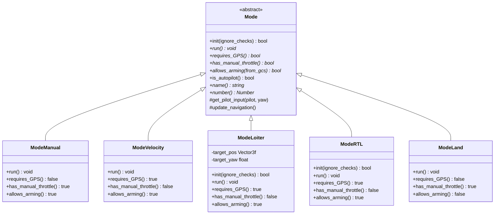
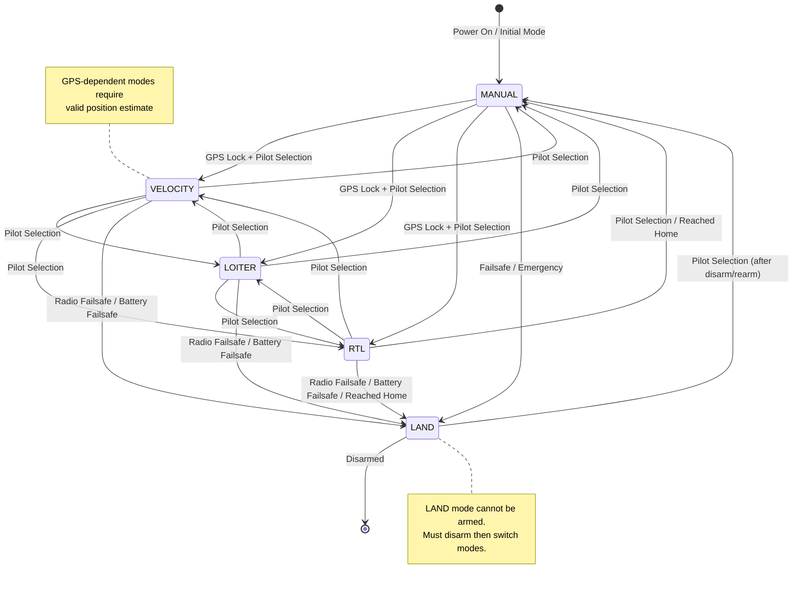
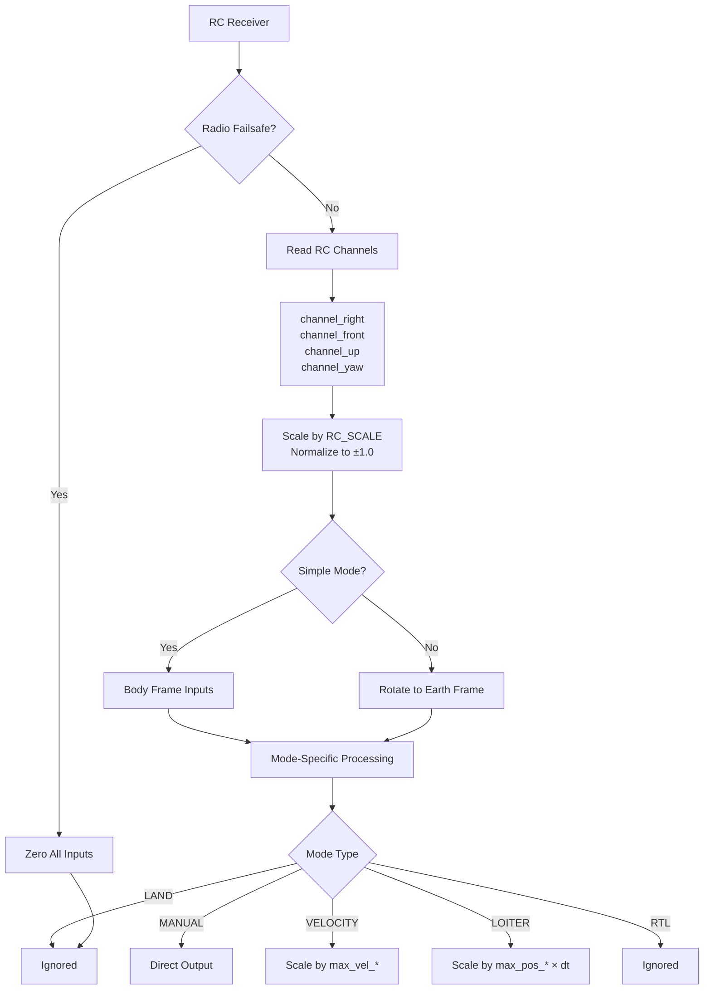
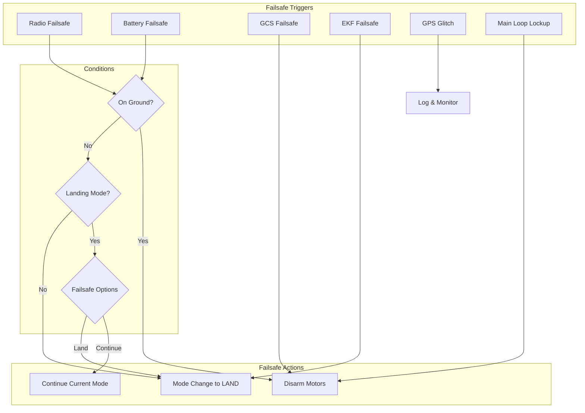
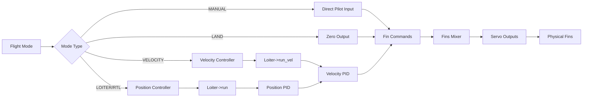

# Blimp Flight Modes Documentation


## Table of Contents
- [Overview](#overview)
- [Flight Mode Architecture](#flight-mode-architecture)
- [Mode Transition State Machine](#mode-transition-state-machine)
- [Individual Flight Modes](#individual-flight-modes)
  - [MANUAL Mode](#manual-mode)
  - [VELOCITY Mode](#velocity-mode)
  - [LOITER Mode](#loiter-mode)
  - [RTL Mode](#rtl-mode)
  - [LAND Mode](#land-mode)
- [Mode Comparison Table](#mode-comparison-table)
- [Pilot Input Handling](#pilot-input-handling)
- [Parameter Dependencies](#parameter-dependencies)
- [Safety and Failsafe Interactions](#safety-and-failsafe-interactions)
- [GPS Dependencies](#gps-dependencies)
- [Integration with Fin-Based Propulsion](#integration-with-fin-based-propulsion)
- [Usage Scenarios](#usage-scenarios)

---

## Overview

The ArduPilot Blimp firmware provides **5 distinct flight modes** specifically designed for lighter-than-air vehicles with neutral buoyancy characteristics. Unlike multicopters or fixed-wing aircraft, blimps operate in a unique control environment where:

- **Neutral buoyancy** eliminates the need for continuous thrust to maintain altitude
- **Low inertia and high drag** result in slow, gentle control responses
- **Fin-based propulsion** provides directional control without traditional rotor thrust vectoring
- **Position hold** leverages natural stability rather than aggressive correction

**Available Flight Modes:**

| Mode Number | Mode Name | Description | GPS Required |
|------------|-----------|-------------|--------------|
| 0 | LAND | Emergency stop - halts all movement | No |
| 1 | MANUAL | Direct pilot control with no stabilization | No |
| 2 | VELOCITY | Velocity-controlled flight with GPS stabilization | Yes |
| 3 | LOITER | Position hold with pilot-adjustable target | Yes |
| 4 | RTL | Return to Launch location (0,0,0 in NED frame) | Yes |

**Source Files:**
- Primary mode definitions: `/Blimp/mode.h`
- Mode switching logic: `/Blimp/mode.cpp:28-53` (Blimp::mode_from_mode_num)
- Mode implementations: `/Blimp/mode_*.cpp`

---

## Flight Mode Architecture

The Blimp flight mode system is built on an object-oriented architecture with a base `Mode` class and specific implementations for each flight mode.

### Class Hierarchy



**Source:** `/Blimp/mode.h:9-346`

### Mode Base Class Properties

Each mode implementation must define:

1. **`requires_GPS()`**: Whether the mode needs valid position estimation
2. **`has_manual_throttle()`**: Whether pilot directly controls thrust
3. **`allows_arming()`**: Whether the vehicle can be armed in this mode
4. **`is_autopilot()`**: Whether the mode is autonomous
5. **`run()`**: Main control loop executed at scheduler frequency
6. **`init()`**: Initialization when entering the mode (optional override)

---

## Mode Transition State Machine

The mode switching system includes safety checks and validation before allowing transitions.

### State Transition Diagram



**Source:** `/Blimp/mode.cpp:56-119` (Blimp::set_mode)

### Mode Transition Logic

The `set_mode()` function implements comprehensive safety checks:

**1. Pre-Transition Validation** (`/Blimp/mode.cpp:60-83`):
```cpp
// Check if mode requires GPS and position is valid
if (!ignore_checks && 
    new_flightmode->requires_GPS() && 
    !blimp.position_ok()) {
    // Reject transition, send warning
    return false;
}
```

**2. Altitude Estimation Check** (`/Blimp/mode.cpp:87-94`):
```cpp
// Prevent switching from manual to automated throttle without altitude estimate
if (!ignore_checks &&
    !blimp.ekf_alt_ok() &&
    flightmode->has_manual_throttle() &&
    !new_flightmode->has_manual_throttle()) {
    // Reject transition
    return false;
}
```

**3. Mode Initialization** (`/Blimp/mode.cpp:96-100`):
- Each mode's `init()` method is called with `ignore_checks` parameter
- If armed, checks are enforced; if disarmed, transitions are permissive
- Failure to initialize results in transition rejection

**4. State Update and Logging** (`/Blimp/mode.cpp:102-118`):
- Previous mode cleanup via `exit_mode()`
- Update global flight mode state
- Log mode change with reason (pilot, failsafe, GCS, etc.)
- Send heartbeat to ground station
- Update notification system

### Mode Transition Blocking Conditions

| Condition | Blocked Transitions | Source |
|-----------|---------------------|--------|
| No GPS lock | Any → GPS-dependent modes | mode.cpp:77-83 |
| No altitude estimate | Manual throttle → Auto throttle | mode.cpp:87-94 |
| Currently in LAND | Cannot arm in LAND mode | mode.h:279-282 |
| Radio failsafe active | GCS mode changes blocked (optional) | mode.cpp:124-128 |
| Invalid mode number | All transitions to that mode | mode.cpp:70-73 |

---

## Individual Flight Modes

### MANUAL Mode

**Mode Number:** 1  
**Source:** `/Blimp/mode_manual.cpp`

#### Overview

MANUAL mode provides direct, unassisted pilot control over all four degrees of freedom. Pilot stick inputs are directly mapped to fin actuator commands without any stabilization, GPS assistance, or automated corrections.

#### Control Behavior

In MANUAL mode, the control loop is extremely simple:

```cpp
void ModeManual::run()
{
    Vector3f pilot;
    float pilot_yaw;
    get_pilot_input(pilot, pilot_yaw);  // Read RC inputs (-1.0 to +1.0)
    
    motors->right_out = pilot.y;   // Right/left movement
    motors->front_out = pilot.x;   // Forward/back movement  
    motors->yaw_out = pilot_yaw;   // Yaw rotation
    motors->down_out = pilot.z;    // Up/down movement
}
```

**Source:** `/Blimp/mode_manual.cpp:7-16`

#### Characteristics

| Property | Value | Explanation |
|----------|-------|-------------|
| **GPS Required** | No | No position estimation needed |
| **Manual Throttle** | Yes | Direct pilot control of thrust |
| **Allows Arming** | Yes | Can arm in this mode |
| **Autopilot** | No | Fully manual control |
| **Stabilization** | None | No attitude or position hold |

**Source:** `/Blimp/mode.h:136-153`

#### Input Scaling

Pilot inputs are normalized to ±1.0 range:
- **Right stick**: `channel_right->get_control_in() / RC_SCALE` → `motors->right_out`
- **Front stick**: `channel_front->get_control_in() / RC_SCALE` → `motors->front_out`
- **Up stick**: `-channel_up->get_control_in() / RC_SCALE` → `motors->down_out` (inverted)
- **Yaw stick**: `channel_yaw->get_control_in() / RC_SCALE` → `motors->yaw_out`

**Source:** `/Blimp/mode.cpp:159-175`

#### When to Use MANUAL Mode

- **Initial flight testing** when tuning is incomplete
- **Emergency situations** when automated systems malfunction
- **Direct control requirement** for specific maneuvers
- **Non-GPS environment** such as indoor operations

#### Safety Considerations

⚠️ **Warning:** MANUAL mode provides NO stability assistance. The blimp will drift with wind and requires constant pilot correction.

- No altitude hold - buoyancy changes require manual compensation
- No position hold - wind drift must be manually corrected
- No automatic failsafe recovery - pilot must maintain control
- Radio failsafe will trigger transition to LAND mode

---

### VELOCITY Mode

**Mode Number:** 2  
**Source:** `/Blimp/mode_velocity.cpp`

#### Overview

VELOCITY mode allows the pilot to command desired velocities in all axes rather than direct thrust outputs. The flight controller automatically adjusts fin outputs to achieve and maintain the commanded velocity using GPS and inertial measurements.

#### Control Behavior

The velocity control loop converts pilot stick positions to target velocities:

```cpp
void ModeVelocity::run()
{
    Vector3f target_vel;
    float target_vel_yaw;
    get_pilot_input(target_vel, target_vel_yaw);  // Get normalized inputs
    
    // Scale inputs by maximum velocity parameters
    target_vel.x *= g.max_vel_xy;      // Forward/back velocity (m/s)
    target_vel.y *= g.max_vel_xy;      // Right/left velocity (m/s)
    target_vel.z *= g.max_vel_z;       // Up/down velocity (m/s)
    target_vel_yaw *= g.max_vel_yaw;   // Yaw rate (rad/s)
    
    // Rotate from body frame to earth frame if not in simple mode
    if (g.simple_mode == 0) {
        blimp.rotate_BF_to_NE(target_vel.xy());
    }
    
    // Command to velocity controller
    blimp.loiter->run_vel(target_vel, target_vel_yaw, Vector4b{false,false,false,false});
}
```

**Source:** `/Blimp/mode_velocity.cpp:9-24`

#### Characteristics

| Property | Value | Explanation |
|----------|-------|-------------|
| **GPS Required** | Yes | Velocity feedback requires position estimation |
| **Manual Throttle** | No | Controller manages thrust automatically |
| **Allows Arming** | Yes | Can arm in this mode |
| **Autopilot** | No | Pilot commands velocity |
| **Stabilization** | Full velocity feedback control |

**Source:** `/Blimp/mode.h:179-211`

#### Parameter Dependencies

| Parameter | Description | Impact on VELOCITY Mode |
|-----------|-------------|-------------------------|
| **`max_vel_xy`** | Maximum horizontal velocity (m/s) | Full stick deflection = max_vel_xy m/s |
| **`max_vel_z`** | Maximum vertical velocity (m/s) | Full vertical stick = max_vel_z m/s |
| **`max_vel_yaw`** | Maximum yaw rate (rad/s) | Full yaw stick = max_vel_yaw rad/s |
| **`simple_mode`** | 0=body frame, 1=earth frame | Controls whether inputs rotate with blimp heading |

**Source:** `/Blimp/Parameters.h:243-248`

#### Frame of Reference

**When `simple_mode = 0` (Body Frame)**:
- Forward stick moves forward relative to blimp's current heading
- Right stick moves right relative to blimp's current heading
- Inputs are rotated from body frame to NED (North-East-Down) frame

**When `simple_mode = 1` (Earth Frame)**:
- Forward stick always moves North
- Right stick always moves East
- No rotation applied - simpler for beginners

**Source:** `/Blimp/mode_velocity.cpp:16-19`

#### When to Use VELOCITY Mode

- **Precision maneuvering** when exact velocity control is needed
- **Windy conditions** where velocity control helps compensate
- **Beginner pilots** using simple_mode for easier orientation
- **Testing velocity controllers** during tuning

#### Velocity Controller Integration

VELOCITY mode delegates to the Loiter controller's velocity interface:
- `loiter->run_vel()` implements closed-loop velocity control
- Uses GPS velocity and inertial measurements for feedback
- PID controllers: `pid_vel_xy`, `pid_vel_z`, `pid_vel_yaw`
- Outputs commanded accelerations to fin allocation

**Source:** `/Blimp/Loiter.cpp` (velocity controller implementation)

---

### LOITER Mode

**Mode Number:** 3  
**Source:** `/Blimp/mode_loiter.cpp`

#### Overview

LOITER mode provides GPS-based position hold with the ability for the pilot to adjust the target position. The blimp will automatically maintain its current position when sticks are centered, and pilot inputs command position changes rather than direct velocity commands.

#### Control Behavior

LOITER mode maintains a target position that can be nudged by pilot input:

```cpp
bool ModeLoiter::init(bool ignore_checks)
{
    // Capture current position as initial target
    target_pos = blimp.pos_ned;           // Current NED position
    target_yaw = blimp.ahrs.get_yaw_rad(); // Current heading
    return true;
}

void ModeLoiter::run()
{
    const float dt = blimp.scheduler.get_last_loop_time_s();
    
    Vector3f pilot;
    float pilot_yaw;
    get_pilot_input(pilot, pilot_yaw);
    
    // Scale inputs by maximum position rate and timestep
    pilot.x *= g.max_pos_xy * dt;   // Position change in meters
    pilot.y *= g.max_pos_xy * dt;
    pilot.z *= g.max_pos_z * dt;
    pilot_yaw *= g.max_pos_yaw * dt; // Yaw change in radians
    
    // Rotate body-frame inputs to earth frame if not in simple mode
    if (g.simple_mode == 0) {
        blimp.rotate_BF_to_NE(pilot.xy());
    }
    
    // Update target position with lag limiting
    if (fabsf(target_pos.x - blimp.pos_ned.x) < (g.max_pos_xy * POS_LAG)) {
        target_pos.x += pilot.x;
    }
    if (fabsf(target_pos.y - blimp.pos_ned.y) < (g.max_pos_xy * POS_LAG)) {
        target_pos.y += pilot.y;
    }
    if (fabsf(target_pos.z - blimp.pos_ned.z) < (g.max_pos_z * POS_LAG)) {
        target_pos.z += pilot.z;
    }
    if (fabsf(wrap_PI(target_yaw - ahrs.get_yaw_rad())) < (g.max_pos_yaw * POS_LAG)) {
        target_yaw = wrap_PI(target_yaw + pilot_yaw);
    }
    
    // Command position controller
    blimp.loiter->run(target_pos, target_yaw, Vector4b{false,false,false,false});
}
```

**Source:** `/Blimp/mode_loiter.cpp:9-49`

#### Characteristics

| Property | Value | Explanation |
|----------|-------|-------------|
| **GPS Required** | Yes | Position hold requires position estimation |
| **Manual Throttle** | No | Controller manages thrust automatically |
| **Allows Arming** | Yes | Can arm in this mode |
| **Autopilot** | No | Pilot adjusts target position |
| **Stabilization** | Full position feedback control |

**Source:** `/Blimp/mode.h:223-256`

#### Position Lag Limiting

A unique feature of LOITER mode is **position lag limiting** (`POS_LAG = 1` second):

```cpp
#define POS_LAG 1  // seconds
```

The target position is only updated if the blimp is within `max_pos_xy * POS_LAG` meters of the target. This prevents the target from running away if the blimp cannot keep up due to:
- Strong wind conditions
- Low battery reducing available thrust
- Controller tuning issues
- Physical limitations of the vehicle

**Source:** `/Blimp/mode_loiter.cpp:7,35-46`

#### Parameter Dependencies

| Parameter | Description | Impact on LOITER Mode |
|-----------|-------------|------------------------|
| **`max_pos_xy`** | Maximum horizontal position change rate (m/s) | Full stick = target moves at max_pos_xy m/s |
| **`max_pos_z`** | Maximum vertical position change rate (m/s) | Full vertical stick = target moves at max_pos_z m/s |
| **`max_pos_yaw`** | Maximum yaw change rate (rad/s) | Full yaw stick = target rotates at max_pos_yaw rad/s |
| **`simple_mode`** | 0=body frame, 1=earth frame | Controls input frame of reference |

**Source:** `/Blimp/Parameters.h:246-248`

#### When to Use LOITER Mode

- **Station keeping** for observation or photography
- **Precision positioning** when specific GPS coordinates needed
- **Hands-off hovering** when pilot needs to manage other tasks
- **Stable platform** for sensor operations
- **Safe mode** for less experienced pilots

#### Position Controller Integration

LOITER mode uses the position control interface:
- `loiter->run()` implements cascaded position → velocity → acceleration control
- Position errors fed to `pid_pos_xy`, `pid_pos_z`, `pid_pos_yaw` controllers
- Velocity commands then processed by velocity controllers
- Final output: commanded fin deflections

**Source:** `/Blimp/Loiter.cpp` (position controller implementation)

---

### RTL Mode

**Mode Number:** 4  
**Source:** `/Blimp/mode_rtl.cpp`

#### Overview

RTL (Return To Launch) mode commands the blimp to autonomously navigate back to the launch location. For the Blimp implementation, "launch" is defined as the origin of the NED (North-East-Down) coordinate frame: position (0, 0, 0) with yaw = 0.

#### Control Behavior

RTL mode implementation is straightforward - it commands the position controller to return to the origin:

```cpp
bool ModeRTL::init(bool ignore_checks)
{
    return true;  // No special initialization required
}

void ModeRTL::run()
{
    Vector3f target_pos = {0, 0, 0};  // Origin in NED frame
    float target_yaw = 0;              // North heading
    
    blimp.loiter->run(target_pos, target_yaw, Vector4b{false,false,false,false});
}
```

**Source:** `/Blimp/mode_rtl.cpp:9-20`

#### Characteristics

| Property | Value | Explanation |
|----------|-------|-------------|
| **GPS Required** | Yes | Navigation requires position estimation |
| **Manual Throttle** | No | Fully autonomous control |
| **Allows Arming** | Yes | Can arm in this mode |
| **Autopilot** | Yes (TODO marker) | Autonomous navigation |
| **Stabilization** | Full position control to origin |

**Source:** `/Blimp/mode.h:315-345`

#### RTL Behavior Details

**Target Position:**
- The blimp will navigate to NED coordinates (0, 0, 0)
- This corresponds to the location where the EKF origin was set
- Typically set at arming location or first GPS lock

**Target Altitude:**
- Current implementation: Returns to Z=0 (launch altitude)
- No altitude ramping or intermediate waypoints
- Direct path to origin

**Target Heading:**
- Commands yaw = 0 radians (North)
- Blimp will point North upon arrival

**Pilot Override:**
- RTL mode continues running even with stick inputs
- To override, pilot must actively switch to another mode
- Unlike LOITER, pilot inputs do NOT modify the target position

#### Parameter Dependencies

While RTL mode itself doesn't use many parameters, the underlying position controller uses:

| Parameter | Description | Relevance to RTL |
|-----------|-------------|------------------|
| **`max_vel_xy`** | Maximum horizontal velocity | Limits speed during return |
| **`max_vel_z`** | Maximum vertical velocity | Limits climb/descent rate |
| **Position PID gains** | pid_pos_xy, pid_pos_z | Control responsiveness during return |
| **Velocity PID gains** | pid_vel_xy, pid_vel_z | Inner loop stability |

**Source:** `/Blimp/Parameters.h:96-102,243-248`

#### When to Use RTL Mode

- **Lost visual contact** with the blimp
- **Low battery** requiring return to launch
- **Failsafe condition** (automatically triggered)
- **End of mission** automated return
- **Pre-programmed return** via mode switch

#### RTL Completion Behavior

**Current Implementation:** The mode continues commanding return to (0,0,0) indefinitely. The blimp will:
1. Navigate to the origin coordinates
2. Maintain position hold at the origin
3. Continue holding position until mode change or disarm

**No Automatic Landing:** Unlike multicopter RTL, there is no automatic descent or landing sequence. The pilot or ground station must:
- Monitor position arrival
- Manually switch to LAND mode
- Or disarm after verifying safe position

#### Future Enhancements

Potential improvements noted in code:
- Configurable RTL altitude profiles
- Intermediate waypoints for obstacle avoidance
- Automatic landing sequence after arrival
- RTL radius tolerance for "arrival" detection
- Configurable loiter time before landing

---

### LAND Mode

**Mode Number:** 0  
**Source:** `/Blimp/mode_land.cpp`

#### Overview

LAND mode is the emergency stop mode for the Blimp. It immediately commands all fin outputs to zero, causing the vehicle to stop all active movement and rely on its neutral buoyancy. This is NOT a traditional "landing" mode but rather a safe shutdown of propulsion.

#### Control Behavior

LAND mode implementation is the simplest of all modes:

```cpp
void ModeLand::run()
{
    // Stop all movement - zero all fin commands
    motors->right_out = 0;
    motors->front_out = 0;
    motors->yaw_out = 0;
    motors->down_out = 0;
}
```

**Source:** `/Blimp/mode_land.cpp:7-14`

The vehicle will:
- Immediately stop all fin actuation
- Coast to a stop based on drag characteristics
- Drift with ambient air currents
- Maintain altitude due to neutral buoyancy (no descent required)

#### Characteristics

| Property | Value | Explanation |
|----------|-------|-------------|
| **GPS Required** | No | Simple motor stop, no positioning needed |
| **Manual Throttle** | Yes | Fins can be manually commanded (but aren't) |
| **Allows Arming** | **No** | Cannot arm while in LAND mode |
| **Autopilot** | No | Not autonomous - just stops motors |
| **Stabilization** | None | All control outputs zeroed |

**Source:** `/Blimp/mode.h:269-303`

#### Failsafe Integration

LAND mode is the primary failsafe response mode:

```cpp
void Blimp::set_mode_land_failsafe(ModeReason reason)
{
    set_mode(Mode::Number::LAND, reason);
    
    // Alert pilot to mode change
    AP_Notify::events.failsafe_mode_change = 1;
}
```

**Source:** `/Blimp/mode_land.cpp:16-24`

This function is called when:
- **Radio failsafe** is triggered (loss of RC signal)
- **Battery failsafe** reaches critical level
- **GCS failsafe** timeout occurs (optionally)
- **Manual failsafe trigger** from ground station

#### Arming Restrictions

⚠️ **Critical:** LAND mode does NOT allow arming (`allows_arming() returns false`).

To recover from LAND mode:
1. Ensure vehicle is safe and stable
2. Switch to MANUAL or another allowed mode
3. Re-arm the vehicle if it was disarmed
4. Resume normal operations

This prevents accidental arming while in the emergency stop state.

**Source:** `/Blimp/mode.h:279-282`

#### When LAND Mode is Triggered

**Automatic Triggers:**

1. **Radio Failsafe** (`/Blimp/events.cpp:15-55`):
   - Loss of RC signal for configured timeout period
   - Parameter: `failsafe_throttle` (FS_THR_ENABLE)
   - When set to `FS_THR_ENABLED_ALWAYS_LAND`, triggers LAND mode
   - Exception: Will disarm instead if already on ground

2. **Battery Failsafe** (`/Blimp/events.cpp:66-90`):
   - Critical battery level reached
   - Parameters: `BATT_LOW_VOLT`, `BATT_CRT_VOLT`, `BATT_FS_CRT_ACT`
   - Action depends on failsafe configuration
   - Exception: Will disarm instead if on ground

3. **Ground Station Failsafe** (`/Blimp/events.cpp:92-126`):
   - Loss of GCS heartbeat messages
   - Parameter: `failsafe_gcs` (FS_GCS_ENABLE)
   - Timeout: `g2.fs_gcs_timeout` seconds
   - Current implementation: Disarms rather than landing

**Manual Triggers:**
- Pilot mode switch selection
- GCS mode change command
- Emergency stop command

#### Difference from Multicopter LAND

Unlike multicopter or fixed-wing implementations, Blimp LAND mode:

| Aspect | Multicopter LAND | Blimp LAND |
|--------|------------------|------------|
| **Primary Action** | Controlled descent to ground | Stop all movement |
| **Vertical Movement** | Active downward thrust | Neutral buoyancy (no movement) |
| **Horizontal Control** | Position hold during descent | No control (drift allowed) |
| **Ground Detection** | Yes, disarms on contact | No, relies on pilot |
| **Duration** | Until ground contact | Indefinite until mode change |

The Blimp's neutral buoyancy eliminates the need for controlled descent - it will simply float in place.

#### When to Use LAND Mode

**Emergency Situations:**
- Loss of control authority
- Unexpected vehicle behavior
- Safety concern requiring immediate stop
- Testing emergency stop procedures

**Normal Operations:**
- Preparing for manual vehicle recovery
- Shutting down operations in confined space
- Allowing vehicle to drift to safe recovery position

#### Recovery from LAND Mode

**Standard Recovery Procedure:**
```
1. Verify vehicle is stable and safe
2. Check systems status (GPS, battery, sensors)
3. Switch to MANUAL mode (no GPS required)
4. If disarmed, re-arm the vehicle
5. Verify control authority with small inputs
6. Transition to desired flight mode
```

**After Failsafe Recovery:**
```
1. Wait for failsafe condition to clear:
   - Radio: Signal restored
   - Battery: Still above critical (if not disarmed)
   - GCS: Heartbeat restored
2. System will log FAILSAFE_RESOLVED
3. Pilot can then switch modes normally
4. Vehicle does NOT automatically exit LAND mode
```

**Source:** `/Blimp/events.cpp:57-64` (radio failsafe clear)

---

## Mode Comparison Table

### Flight Mode Quick Reference

| Mode | GPS | Manual Throttle | Arming | Auto | Pilot Input Effect | Failsafe Use |
|------|-----|----------------|--------|------|-------------------|--------------|
| **MANUAL** | ❌ | ✅ | ✅ | ❌ | Direct fin control | No |
| **VELOCITY** | ✅ | ❌ | ✅ | ❌ | Velocity commands | No |
| **LOITER** | ✅ | ❌ | ✅ | ❌ | Position adjustment | No |
| **RTL** | ✅ | ❌ | ✅ | ✅ | No effect (override by switching) | Yes |
| **LAND** | ❌ | ✅ | ❌ | ❌ | No effect (zeros all outputs) | **Primary** |

### Control Architecture Comparison

| Mode | Control Loop | Controller Type | Input Frame | Output |
|------|--------------|-----------------|-------------|--------|
| **MANUAL** | Open-loop | None (pass-through) | Body frame | Fin commands |
| **VELOCITY** | Closed-loop | Velocity PID | Body or Earth | Velocity error → Fin commands |
| **LOITER** | Cascaded | Position → Velocity PID | Body or Earth | Position error → Velocity → Fins |
| **RTL** | Cascaded | Position → Velocity PID | Earth (fixed target) | Position error → Velocity → Fins |
| **LAND** | Open-loop | None (zero output) | N/A | Zero all fins |

### Parameter Sensitivity Matrix

| Parameter | MANUAL | VELOCITY | LOITER | RTL | LAND |
|-----------|--------|----------|--------|-----|------|
| **`max_vel_xy`** | - | ✅✅✅ | ✅✅ | ✅ | - |
| **`max_vel_z`** | - | ✅✅✅ | ✅✅ | ✅ | - |
| **`max_vel_yaw`** | - | ✅✅✅ | ✅ | - | - |
| **`max_pos_xy`** | - | - | ✅✅✅ | ✅ | - |
| **`max_pos_z`** | - | - | ✅✅✅ | ✅ | - |
| **`max_pos_yaw`** | - | - | ✅✅✅ | - | - |
| **`simple_mode`** | - | ✅✅ | ✅✅ | - | - |
| **`pid_vel_*`** | - | ✅✅ | ✅ | ✅ | - |
| **`pid_pos_*`** | - | - | ✅✅ | ✅✅ | - |

**Legend:** 
- ✅✅✅ = Critical parameter, directly affects pilot inputs
- ✅✅ = Important parameter, affects control behavior
- ✅ = Used indirectly through controller cascade
- \- = Not used in this mode

---

## Pilot Input Handling

All flight modes share common pilot input processing implemented in the base `Mode` class.

### Input Processing Pipeline



### Input Scaling Function

```cpp
void Mode::get_pilot_input(Vector3f &pilot, float &yaw)
{
    // Radio failsafe check - zero all inputs if no RC
    if (blimp.failsafe.radio || !rc().has_ever_seen_rc_input()) {
        pilot.y = 0;
        pilot.x = 0;
        pilot.z = 0;
        yaw = 0;
        return;
    }
    
    // Fetch pilot inputs from RC channels and normalize
    pilot.y = channel_right->get_control_in() / float(RC_SCALE);  // Right/left
    pilot.x = channel_front->get_control_in() / float(RC_SCALE);  // Forward/back
    pilot.z = -channel_up->get_control_in() / float(RC_SCALE);    // Up/down (inverted)
    yaw = channel_yaw->get_control_in() / float(RC_SCALE);        // Yaw rotation
}
```

**Source:** `/Blimp/mode.cpp:159-175`

**Note:** The up/down channel is inverted (`-channel_up`) because traditionally throttle channels are "higher value = up" but the internal convention uses positive Z as down (NED frame).

### RC Channel Mapping

| Control Axis | RC Channel | Parameter | Input Range | Output Range | Mode Usage |
|--------------|-----------|-----------|-------------|--------------|------------|
| **Right/Left** | `channel_right` | RCMAP_ROLL | 1000-2000 µs | -1.0 to +1.0 | All modes |
| **Forward/Back** | `channel_front` | RCMAP_PITCH | 1000-2000 µs | -1.0 to +1.0 | All modes |
| **Up/Down** | `channel_up` | RCMAP_THROTTLE | 1000-2000 µs | +1.0 to -1.0 | All modes |
| **Yaw** | `channel_yaw` | RCMAP_YAW | 1000-2000 µs | -1.0 to +1.0 | All modes |

**Source:** `/Blimp/RC_Channel_Blimp.h` (RC channel definitions)

### Simple Mode vs Body Frame

The `simple_mode` parameter fundamentally changes how pilot inputs are interpreted:

**`simple_mode = 0` (Body Frame - Default):**
```cpp
// Inputs relative to blimp's current heading
// Forward stick = move in blimp's forward direction
// Right stick = move in blimp's right direction
if (g.simple_mode == 0) {
    blimp.rotate_BF_to_NE(pilot.xy());  // Rotate body frame to earth frame
}
```

**`simple_mode = 1` (Earth Frame - Simplified):**
```cpp
// Inputs relative to compass directions
// Forward stick = always move North
// Right stick = always move East
// No rotation applied - pilot doesn't need to track heading
```

**Source:** `/Blimp/mode_velocity.cpp:16-19`, `/Blimp/mode_loiter.cpp:30-33`

**When to Use Simple Mode:**
- Beginner pilots who struggle with orientation
- Operations where cardinal direction control is preferred
- Situations with limited visual reference
- Training scenarios

**When to Use Body Frame:**
- Experienced pilots who prefer intuitive control
- Aerobatic or precision maneuvering
- Following a path or target
- Most normal operations

---

## Parameter Dependencies

### Critical Parameters for Flight Modes

#### Velocity Limit Parameters

**`max_vel_xy`** - Maximum Horizontal Velocity (m/s)
- **Default:** (Check vehicle parameters)
- **Used by:** VELOCITY, LOITER, RTL
- **Effect:** 
  - VELOCITY: Full stick deflection commands this velocity
  - LOITER: Underlying velocity limit for position control
  - RTL: Maximum speed during return navigation
- **Tuning:** Set based on vehicle capability and desired responsiveness. Too high may cause instability; too low reduces maneuverability.

**`max_vel_z`** - Maximum Vertical Velocity (m/s)
- **Default:** (Check vehicle parameters)
- **Used by:** VELOCITY, LOITER, RTL
- **Effect:** Similar to max_vel_xy but for altitude control
- **Note:** For neutrally buoyant vehicles, vertical movement is typically slower than horizontal due to buoyancy compensation requirements.

**`max_vel_yaw`** - Maximum Yaw Rate (rad/s)
- **Default:** (Check vehicle parameters)
- **Used by:** VELOCITY, LOITER
- **Effect:** Controls rotation rate responsiveness
- **Tuning:** Balance between responsive turning and heading stability

**Source:** `/Blimp/Parameters.h:243-245`

#### Position Change Rate Parameters

**`max_pos_xy`** - Maximum Horizontal Position Rate (m/s)
- **Default:** (Check vehicle parameters)
- **Used by:** LOITER, RTL (indirectly)
- **Effect:** In LOITER mode, full stick moves target position at this rate
- **Relationship:** Should typically be ≤ `max_vel_xy` to ensure target is achievable

**`max_pos_z`** - Maximum Vertical Position Rate (m/s)
- **Default:** (Check vehicle parameters)
- **Used by:** LOITER, RTL (indirectly)
- **Effect:** Controls altitude target change rate in LOITER

**`max_pos_yaw`** - Maximum Yaw Change Rate (rad/s)
- **Default:** (Check vehicle parameters)
- **Used by:** LOITER
- **Effect:** Controls heading target change rate

**Source:** `/Blimp/Parameters.h:246-248`

#### Control Mode Parameters

**`simple_mode`** - Input Frame Selection
- **Type:** AP_Int8
- **Values:** 
  - 0 = Body frame (inputs relative to vehicle heading)
  - 1 = Earth frame (inputs relative to North/East)
- **Used by:** VELOCITY, LOITER
- **Default:** 0 (body frame)

**Source:** `/Blimp/Parameters.h:250`

#### PID Controller Parameters

**Position Controllers:**
- **`pid_pos_xy`** - Horizontal position PID gains (P, I, D, FF)
- **`pid_pos_z`** - Vertical position PID gains
- **`pid_pos_yaw`** - Yaw position PID gains

**Velocity Controllers:**
- **`pid_vel_xy`** - Horizontal velocity PID gains
- **`pid_vel_z`** - Vertical velocity PID gains
- **`pid_vel_yaw`** - Yaw rate PID gains

**Source:** `/Blimp/Parameters.h:97-102`

**Control Cascade:**
```
Position Error → pid_pos_* → Velocity Command → pid_vel_* → Acceleration Command → Fin Allocation
```

#### Disarm and Safety Parameters

**`disarm_delay`** - Auto-disarm delay after landing (seconds)
- **Default:** (Check vehicle parameters)
- **Effect:** Time before automatic disarm in LAND mode
- **Source:** `/Blimp/Parameters.h:236`

**`dis_mask`** - Disable function mask
- **Type:** AP_Int16 (bitmask)
- **Effect:** Can disable certain automatic behaviors
- **Source:** `/Blimp/Parameters.h:251`

---

## Safety and Failsafe Interactions

### Failsafe System Overview

The Blimp implements multiple layers of failsafe protection to ensure safe operations in various failure scenarios.



### Radio Failsafe

**Trigger Condition:**
- Loss of RC signal for configured timeout period
- Parameter: `failsafe_throttle` (FS_THR_ENABLE)
- Detection: `failsafe.radio` flag set to true

**Response Actions:**

1. **If on ground** (`should_disarm_on_failsafe()` returns true):
   ```
   - Immediate disarm
   - GCS message: "Radio Failsafe - Disarming"
   - No mode change
   ```

2. **If in LAND mode already:**
   ```
   - Continue landing
   - GCS message: "Radio Failsafe - Continuing Landing"
   - Especially if battery failsafe also active
   ```

3. **If in flight:**
   ```
   - Switch to LAND mode
   - GCS message: "Radio Failsafe"
   - Vehicle stops all movement and drifts
   ```

**Source:** `/Blimp/events.cpp:15-55`

**Recovery:**
```cpp
void Blimp::failsafe_radio_off_event()
{
    // Log resolution
    LOGGER_WRITE_ERROR(LogErrorSubsystem::FAILSAFE_RADIO, LogErrorCode::FAILSAFE_RESOLVED);
    gcs().send_text(MAV_SEVERITY_WARNING, "Radio Failsafe Cleared");
    
    // Pilot can now override and change modes
    // Vehicle does NOT automatically return to previous mode
}
```

**Source:** `/Blimp/events.cpp:57-64`

### Battery Failsafe

**Trigger Conditions:**
- Low battery voltage: `BATT_LOW_VOLT` threshold
- Critical battery voltage: `BATT_CRT_VOLT` threshold
- Low battery capacity: `BATT_LOW_MAH` threshold
- Critical battery capacity: `BATT_CRT_MAH` threshold

**Response Actions:**

Depends on configured action parameters:
- `BATT_FS_LOW_ACT` - Action for low battery
- `BATT_FS_CRT_ACT` - Action for critical battery

**Possible Actions:**
1. **None** - Warning only
2. **Land** - Switch to LAND mode
3. **RTL** - Return to launch
4. **SmartRTL** - Not implemented for Blimp
5. **Terminate** - Immediate disarm

**Implementation:**
```cpp
void Blimp::handle_battery_failsafe(const char *type_str, const int8_t action)
{
    Failsafe_Action desired_action = (Failsafe_Action)action;
    
    if (should_disarm_on_failsafe()) {
        // On ground - disarm immediately
        arming.disarm(AP_Arming::Method::BATTERYFAILSAFE);
        desired_action = Failsafe_Action_None;
    } else if (flightmode->is_landing() && 
               failsafe_option(FailsafeOption::CONTINUE_IF_LANDING)) {
        // Allow landing to continue
        desired_action = Failsafe_Action_Land;
    }
    
    do_failsafe_action(desired_action, ModeReason::BATTERY_FAILSAFE);
}
```

**Source:** `/Blimp/events.cpp:66-90`

### GCS Failsafe

**Trigger Condition:**
- No heartbeat from ground station for `g2.fs_gcs_timeout` seconds
- Parameter: `failsafe_gcs` (FS_GCS_ENABLE)
- Only monitors specific sysid set by `gcs().sysid_mygcs()`

**Response Action:**
```cpp
void Blimp::failsafe_gcs_check()
{
    if (last_gcs_update_ms > gcs_timeout_ms && !failsafe.gcs) {
        // New GCS failsafe event
        set_failsafe_gcs(true);
        arming.disarm(AP_Arming::Method::GCSFAILSAFE);
        // TODO: Should call failsafe_gcs_on_event() for mode change
    }
}
```

**Current Behavior:** Disarms the vehicle rather than changing to LAND mode.

**Source:** `/Blimp/events.cpp:92-126`

### EKF and GPS Failsafes

**GPS Glitch Detection:**
```cpp
void Blimp::gpsglitch_check()
{
    const bool gps_glitching = AP::ahrs().has_status(AP_AHRS::Status::GPS_GLITCHING);
    
    if (ap.gps_glitching != gps_glitching) {
        if (gps_glitching) {
            LOGGER_WRITE_ERROR(LogErrorSubsystem::GPS, LogErrorCode::GPS_GLITCH);
            gcs().send_text(MAV_SEVERITY_CRITICAL, "GPS Glitch");
        } else {
            LOGGER_WRITE_ERROR(LogErrorSubsystem::GPS, LogErrorCode::ERROR_RESOLVED);
            gcs().send_text(MAV_SEVERITY_CRITICAL, "GPS Glitch cleared");
        }
    }
}
```

**Current Behavior:** Logs and alerts only. Does not automatically change modes.

**Source:** `/Blimp/events.cpp:161-178`

**EKF Failsafe:**
- Parameter: `fs_ekf_action` - Action to take on EKF failure
- Parameter: `fs_ekf_thresh` - EKF variance threshold
- Typical action: Switch to LAND mode or disarm

### Main Loop Lockup Failsafe

**Protection Against Software Failures:**

```cpp
void Blimp::failsafe_check()
{
    // Called from 1kHz interrupt
    uint32_t tnow = AP_HAL::micros();
    const uint16_t ticks = scheduler.ticks();
    
    if (ticks != failsafe_last_ticks) {
        // Main loop is running normally
        failsafe_last_ticks = ticks;
        failsafe_last_timestamp = tnow;
        return;
    }
    
    if (!in_failsafe && failsafe_enabled && 
        tnow - failsafe_last_timestamp > 2000000) {
        // Main loop frozen for 2 seconds - emergency action
        in_failsafe = true;
        if (motors->armed()) {
            motors->output_min();  // Reduce to minimum output
        }
        LOGGER_WRITE_ERROR(LogErrorSubsystem::CPU, LogErrorCode::FAILSAFE_OCCURRED);
    }
    
    if (failsafe_enabled && in_failsafe && 
        tnow - failsafe_last_timestamp > 1000000) {
        // Disarm every second while locked up
        if (motors->armed()) {
            motors->armed(false);
            motors->output();
        }
    }
}
```

**Source:** `/Blimp/failsafe.cpp:35-73`

This critical safety feature protects against software crashes or infinite loops.

### Failsafe Option Flags

Parameter: `g2.fs_options` (FS_OPTIONS bitmask)

**Options:**
- `CONTINUE_IF_LANDING` - Allow current landing to complete during failsafe

**Usage:**
```cpp
bool Blimp::failsafe_option(FailsafeOption opt) const
{
    return (g2.fs_options & (uint32_t)opt);
}
```

**Source:** `/Blimp/events.cpp:10-13`

### Mode Switching During Failsafe

Some mode changes can be blocked during failsafe:

```cpp
#ifdef DISALLOW_GCS_MODE_CHANGE_DURING_RC_FAILSAFE
if (reason == ModeReason::GCS_COMMAND && blimp.failsafe.radio) {
    // Don't allow GCS mode changes while in radio failsafe
    return false;
}
#endif
```

**Source:** `/Blimp/mode.cpp:124-128`

### Failsafe Testing Recommendations

**Safe Testing Procedures:**

1. **Radio Failsafe Test:**
   ```
   - Start in MANUAL mode at low altitude
   - Verify FS_THR_ENABLE configured for LAND
   - Turn off transmitter
   - Verify mode change to LAND
   - Verify GCS warning message
   - Turn on transmitter - verify "Failsafe Cleared"
   - Switch back to MANUAL
   ```

2. **Battery Failsafe Test:**
   ```
   - Configure BATT_LOW_VOLT above current voltage
   - Arm and enter VELOCITY mode
   - Wait for failsafe trigger
   - Verify appropriate action taken
   - Land and adjust parameters back to normal
   ```

3. **GCS Failsafe Test:**
   ```
   - Configure FS_GCS_ENABLE and timeout
   - Disconnect GCS
   - Verify disarm after timeout
   - Reconnect and verify recovery
   ```

---

## GPS Dependencies

### GPS-Dependent Modes

Three flight modes require GPS position estimation:

| Mode | GPS Requirement | Fallback Behavior |
|------|-----------------|-------------------|
| **VELOCITY** | `requires_GPS() = true` | Cannot enter without position_ok() |
| **LOITER** | `requires_GPS() = true` | Cannot enter without position_ok() |
| **RTL** | `requires_GPS() = true` | Cannot enter without position_ok() |

**Source:** Mode class definitions in `/Blimp/mode.h`

### Position Estimation Requirements

**`position_ok()` Check:**

The mode switching logic verifies position availability:

```cpp
if (!ignore_checks &&
    new_flightmode->requires_GPS() &&
    !blimp.position_ok()) {
    gcs().send_text(MAV_SEVERITY_WARNING, 
                    "Mode change failed: %s requires position", 
                    new_flightmode->name());
    LOGGER_WRITE_ERROR(LogErrorSubsystem::FLIGHT_MODE, LogErrorCode(mode));
    return false;
}
```

**Source:** `/Blimp/mode.cpp:77-83`

**`position_ok()` typically requires:**
- Valid GPS fix (3D fix with sufficient satellites)
- EKF healthy and initialized
- Position variance below configured thresholds
- AHRS providing valid position estimates

### GPS Signal Loss Behavior

**Scenario: GPS signal lost while in GPS-dependent mode**

Current implementation:
1. Mode continues operating with last known position
2. EKF attempts to maintain position estimate using IMU dead-reckoning
3. Position accuracy degrades over time
4. If EKF variance exceeds thresholds:
   - EKF failsafe may trigger (depends on `fs_ekf_action`)
   - Typical action: Switch to LAND mode
5. Pilot can manually switch to MANUAL or LAND at any time

**GPS Glitch vs GPS Loss:**
- **GPS Glitch:** Temporary bad data, AHRS filters it out
- **GPS Loss:** No GPS data, EKF relies on IMU integration

**Source:** `/Blimp/events.cpp:161-178` (GPS glitch detection)

### GPS Performance Requirements

**For reliable GPS-mode operation:**

1. **Satellite Count:** Minimum 6-8 satellites for good accuracy
2. **HDOP:** < 2.0 for precision operations (parameter: `gps_hdop_good`)
3. **Update Rate:** 5-10 Hz preferred for smooth control
4. **Position Accuracy:** < 2m for LOITER stability

**Parameter:** `gps_hdop_good` - GPS HDOP value threshold for "good" position

**Source:** `/Blimp/Parameters.h:214`

### EKF Altitude Check

An additional check prevents mode changes that could be unsafe:

```cpp
if (!ignore_checks &&
    !blimp.ekf_alt_ok() &&
    flightmode->has_manual_throttle() &&
    !new_flightmode->has_manual_throttle()) {
    gcs().send_text(MAV_SEVERITY_WARNING, 
                    "Mode change failed: %s need alt estimate", 
                    new_flightmode->name());
    return false;
}
```

**Source:** `/Blimp/mode.cpp:87-94`

This prevents switching from modes with manual throttle control (MANUAL, LAND) to automated altitude control (VELOCITY, LOITER, RTL) without a valid altitude estimate.

### Indoor / Non-GPS Operation

**For operations without GPS:**

Only use non-GPS modes:
- **MANUAL**: Full manual control
- **LAND**: Emergency stop

**Alternative positioning sources (if implemented):**
- Optical flow sensors
- Motion capture systems
- External positioning systems via MAVLink

Check `position_ok()` implementation for supported alternative sources.

---

## Integration with Fin-Based Propulsion

The Blimp uses a unique fin-based propulsion system rather than traditional rotors.

### Fin Output Allocation

**Four Independent Fin Axes:**

| Output Channel | Control Axis | Range | Positive Direction |
|----------------|--------------|-------|-------------------|
| `motors->right_out` | Lateral (sway) | -1.0 to +1.0 | Right |
| `motors->front_out` | Longitudinal (surge) | -1.0 to +1.0 | Forward |
| `motors->down_out` | Vertical (heave) | -1.0 to +1.0 | Down |
| `motors->yaw_out` | Yaw (rotation) | -1.0 to +1.0 | Clockwise |

**Source:** `/Blimp/mode_manual.cpp:12-15`, `/Blimp/Fins.h`

### Control Flow from Modes to Actuators



### Loiter Controller Interface

**Position Control:**
```cpp
blimp.loiter->run(target_pos, target_yaw, Vector4b{false,false,false,false});
```

**Velocity Control:**
```cpp
blimp.loiter->run_vel(target_vel, target_vel_yaw, Vector4b{false,false,false,false});
```

The `Vector4b` parameter appears to be fin disable flags (currently all false).

**Source:** `/Blimp/mode_loiter.cpp:48`, `/Blimp/mode_velocity.cpp:23`

### Neutral Buoyancy Considerations

**Unlike Multicopters:**
- **No hover throttle** required - neutral buoyancy provides free altitude hold
- **No motor saturation** issues from maintaining altitude
- **Slower dynamics** due to drag-dominated behavior
- **Different control authority** - fins effective only with airspeed

**Control Implications:**
1. **Altitude control** doesn't fight gravity - only trims buoyancy errors
2. **Horizontal movement** requires sustained fin deflection, not impulse
3. **Stopping** relies on drag rather than opposing thrust
4. **Wind resistance** is significant due to large surface area

### Fin Effectiveness

**Speed-Dependent Control Authority:**
- At zero airspeed: Fins have minimal effect
- With forward motion: Fins generate control forces proportional to velocity²
- Cross-coupled effects: Yaw generates lateral forces, forward motion enables turning

**Implications for Flight Modes:**
- MANUAL: Pilot must understand velocity-dependent control
- VELOCITY: Controller must account for nonlinear fin effectiveness
- LOITER: Position hold requires continuous small movements
- RTL: May need to approach target with velocity for final correction

---

## Usage Scenarios

### Scenario 1: First Flight and Basic Testing

**Recommended Sequence:**

```
1. Pre-Flight Setup:
   - Set initial_mode = MANUAL (parameter)
   - Configure flight_mode1-6 for mode switch
   - Set conservative parameter values:
     * max_vel_xy = 2.0 m/s
     * max_vel_z = 0.5 m/s
     * simple_mode = 1 (earth frame for easier control)
   
2. Initial Power-On:
   - Vehicle starts in MANUAL mode
   - Verify RC control response
   - Check GPS lock acquired
   
3. Manual Flight Test:
   - Arm in MANUAL mode
   - Test each control axis independently
   - Verify control directions correct
   - Practice basic maneuvering
   - Land and disarm
   
4. GPS Mode Testing:
   - Arm in MANUAL mode
   - Verify GPS lock and good HDOP
   - Switch to VELOCITY mode in flight
   - Test gentle stick inputs
   - Verify velocity control working
   - Return to MANUAL and land
   
5. Position Hold Testing:
   - Arm and take off in MANUAL
   - Switch to LOITER mode
   - Release sticks - verify holds position
   - Test small position adjustments
   - Return to MANUAL and land
```

### Scenario 2: Autonomous Operations

**Mission Profile:**

```
1. Takeoff:
   - Manual takeoff in MANUAL mode
   - Verify systems healthy
   
2. Transit to Operations Area:
   - Switch to VELOCITY mode
   - Pilot flies to target area using velocity control
   - GPS provides navigation reference
   
3. Station Keeping:
   - Switch to LOITER mode
   - Vehicle maintains position autonomously
   - Pilot makes small position adjustments as needed
   - Perform observation/sensing mission
   
4. Return Home:
   - Switch to RTL mode
   - Vehicle autonomously returns to (0,0,0)
   - Monitor progress
   - Switch to LOITER near home
   
5. Landing:
   - Switch to MANUAL mode for precise landing control
   - Manual landing at desired location
   - Disarm
```

### Scenario 3: Emergency Procedures

**Radio Link Loss:**

```
1. Immediate Response:
   - Radio failsafe triggers
   - Vehicle automatically switches to LAND mode
   - All fins zero - vehicle stops moving
   
2. Recovery Actions:
   - Restore radio link
   - System logs "Radio Failsafe Cleared"
   - Vehicle remains in LAND mode (does not auto-recover)
   
3. Resume Operations:
   - Pilot switches to MANUAL mode
   - Assess vehicle state and position
   - Verify control authority
   - Continue mission or return home
```

**Low Battery:**

```
1. Warning Phase:
   - GCS displays low battery warning
   - BATT_LOW_VOLT threshold reached
   - Pilot should initiate return
   
2. Critical Phase:
   - BATT_CRT_VOLT threshold reached
   - Battery failsafe action triggered (typically LAND)
   - Vehicle enters LAND mode
   
3. Response:
   - If safe position: Allow vehicle to stop in LAND mode
   - If unsafe position: Override to MANUAL, quickly navigate to safe area
   - Land as soon as possible
   - Disarm immediately after touchdown
```

**GPS Signal Loss:**

```
1. GPS Glitch Detected:
   - "GPS Glitch" message on GCS
   - EKF continues with degraded accuracy
   - Vehicle remains in current mode
   
2. Immediate Action:
   - Switch to MANUAL mode (doesn't require GPS)
   - Maintain control using visual reference
   - Navigate to safe landing area
   
3. If GPS Loss Prolonged:
   - EKF variance increases
   - May trigger EKF failsafe
   - Automatic switch to LAND mode possible
   - Be prepared to take manual control
```

### Scenario 4: Indoor / Non-GPS Operations

**Configuration:**

```
1. Parameter Setup:
   - Set flight_mode options to MANUAL and LAND only
   - Disable GPS failsafes (optional, for testing)
   - Reduce control gains for confined space
   
2. Operations:
   - Operate exclusively in MANUAL mode
   - No GPS-dependent modes available
   - Pilot provides all stabilization
   - Reduced performance but safe operation
   
3. Safety:
   - Maintain conservative speeds
   - Ensure adequate operating space
   - Have spotter for obstacle awareness
   - Emergency stop available via LAND mode switch
```

### Scenario 5: Tuning and Development

**PID Tuning Workflow:**

```
1. Start with MANUAL Mode:
   - Verify vehicle is controllable
   - Assess basic flight characteristics
   - No PID loops active for baseline
   
2. Velocity Controller Tuning:
   - Switch to VELOCITY mode
   - Start with low gains (conservative)
   - Make small stick inputs
   - Observe velocity tracking
   - Incrementally increase gains:
     * P gain first for responsiveness
     * D gain for damping oscillations
     * I gain last for steady-state tracking
   
3. Position Controller Tuning:
   - Switch to LOITER mode
   - Start with low position gains
   - Observe position hold quality
   - Tune cascade from outer to inner loop
   - Test position step responses
   
4. Validation:
   - Test RTL mode (uses same controllers)
   - Verify return navigation
   - Check arrival accuracy
   - Confirm stable position hold at origin
```

---

## Appendix: Source File Reference

### Mode Implementation Files

| File Path | Description | Lines of Code |
|-----------|-------------|---------------|
| `/Blimp/mode.h` | Mode class definitions | 347 |
| `/Blimp/mode.cpp` | Mode switching and base class implementation | 194 |
| `/Blimp/mode_manual.cpp` | MANUAL mode implementation | 17 |
| `/Blimp/mode_velocity.cpp` | VELOCITY mode implementation | 25 |
| `/Blimp/mode_loiter.cpp` | LOITER mode implementation | 50 |
| `/Blimp/mode_rtl.cpp` | RTL mode implementation | 21 |
| `/Blimp/mode_land.cpp` | LAND mode implementation | 24 |

### Related System Files

| File Path | Description |
|-----------|-------------|
| `/Blimp/Parameters.h` | Parameter definitions including mode parameters |
| `/Blimp/Parameters.cpp` | Parameter value initialization |
| `/Blimp/failsafe.cpp` | Main loop lockup failsafe |
| `/Blimp/events.cpp` | Radio, battery, GCS failsafe handling |
| `/Blimp/Loiter.h` | Position and velocity controller interface |
| `/Blimp/Loiter.cpp` | Position and velocity controller implementation |
| `/Blimp/Fins.h` | Fin-based actuator definitions |
| `/Blimp/Fins.cpp` | Fin mixing and output |
| `/Blimp/Blimp.cpp` | Main vehicle class |
| `/Blimp/Blimp.h` | Main vehicle class header |

### Parameter Quick Reference

| Parameter Name | Type | Location | Description |
|----------------|------|----------|-------------|
| `flight_mode1-6` | AP_Int8 | Parameters.h:224-229 | Mode assignments for switch positions |
| `flight_mode_chan` | AP_Int8 | Parameters.h:230 | RC channel for mode switching |
| `initial_mode` | AP_Int8 | Parameters.h:231 | Mode to start in after power-on |
| `max_vel_xy` | AP_Float | Parameters.h:243 | Maximum horizontal velocity |
| `max_vel_z` | AP_Float | Parameters.h:244 | Maximum vertical velocity |
| `max_vel_yaw` | AP_Float | Parameters.h:245 | Maximum yaw rate |
| `max_pos_xy` | AP_Float | Parameters.h:246 | Maximum horizontal position rate |
| `max_pos_z` | AP_Float | Parameters.h:247 | Maximum vertical position rate |
| `max_pos_yaw` | AP_Float | Parameters.h:248 | Maximum yaw change rate |
| `simple_mode` | AP_Int8 | Parameters.h:250 | Body frame (0) or earth frame (1) |
| `failsafe_throttle` | AP_Int8 | Parameters.h:218 | Radio failsafe behavior |
| `failsafe_gcs` | AP_Int8 | Parameters.h:213 | GCS failsafe behavior |
| `fs_ekf_action` | AP_Int8 | Parameters.h:238 | EKF failsafe action |
| `fs_ekf_thresh` | AP_Float | Parameters.h:240 | EKF variance threshold |

---

## Document Revision History

| Version | Date | Author | Changes |
|---------|------|--------|---------|
| 1.0 | 2024 | ArduPilot Documentation Team | Initial comprehensive documentation |

---

## Additional Resources

- **ArduPilot Documentation:** https://ardupilot.org/
- **Blimp Main README:** `/Blimp/README.md`
- **Parameter Full List:** Use ground station parameter editor
- **Community Support:** https://discuss.ardupilot.org/
- **GitHub Repository:** https://github.com/ArduPilot/ardupilot

---

**End of Flight Modes Documentation**
