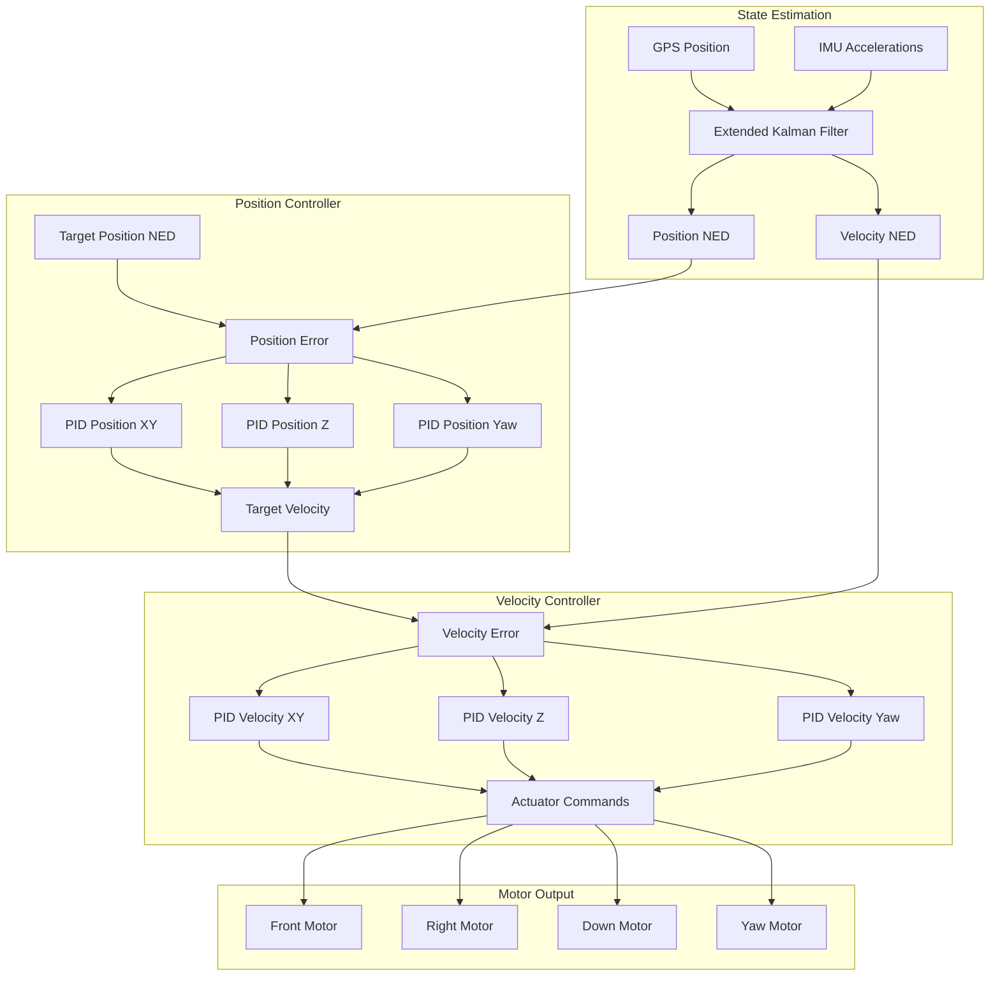
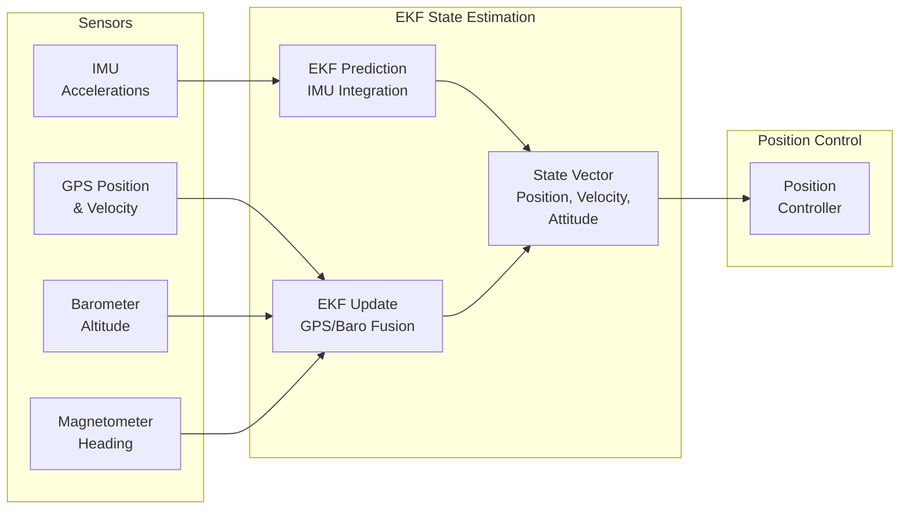

# Blimp Position Control System


## Table of Contents
- [Overview](#overview)
- [Position Control Challenges](#position-control-challenges)
- [System Architecture](#system-architecture)
- [Loiter Class Implementation](#loiter-class-implementation)
- [Control Algorithms](#control-algorithms)
- [GPS and EKF Integration](#gps-and-ekf-integration)
- [Coordinate Systems](#coordinate-systems)
- [Configuration Parameters](#configuration-parameters)
- [Tuning Guide](#tuning-guide)
- [Safety Considerations](#safety-considerations)
- [Troubleshooting](#troubleshooting)

## Overview

The Blimp position control system provides precision position hold capabilities for neutrally buoyant lighter-than-air vehicles operating with limited control authority. Unlike traditional multirotor or fixed-wing aircraft, blimps face unique challenges due to their large inertia, limited thrust capacity, and significant wind susceptibility.

**Source Files**: 
- `/Blimp/Loiter.h` - Loiter class interface and Vector4b control flags
- `/Blimp/Loiter.cpp` - Position and velocity control implementation
- `/Blimp/mode_loiter.cpp` - Loiter flight mode integration
- `/Blimp/commands.cpp` - Home position management
- `/Blimp/ekf_check.cpp` - EKF health monitoring

**Key Features**:
- Cascade position-to-velocity control architecture
- Adaptive control authority scaling for saturation management
- Per-axis enable/disable control flags
- Integration with Extended Kalman Filter (EKF) for position estimation
- GPS-based position feedback with reliability handling
- Wind disturbance rejection through integral action
- Home position management for return-to-launch capabilities

## Position Control Challenges

### Neutrally Buoyant Vehicle Dynamics

Blimps present unique control challenges compared to other aerial vehicles:

1. **Large Inertia**: Blimps have significant mass and rotational inertia, making rapid position corrections difficult

2. **Limited Control Authority**: Fin-based actuation provides limited thrust, especially in lateral and vertical axes

3. **Wind Susceptibility**: Large surface area makes blimps highly susceptible to wind disturbances

4. **Asymmetric Dynamics**: Control authority varies significantly between axes due to vehicle geometry

5. **Slow Response**: Time constants are typically measured in seconds rather than milliseconds

### Control Authority Limitations

The position control system must operate within strict actuator limits:

```
Typical Control Authority:
- Forward/Backward (X-axis): Moderate authority via main thrusters
- Left/Right (Y-axis): Limited authority via differential thrust
- Up/Down (Z-axis): Very limited authority via buoyancy and vertical fins
- Yaw: Moderate authority via differential tail fins
```

**Source**: `/Blimp/Loiter.cpp:13-28` - Scaler computation based on actuator saturation

## System Architecture

### Control Cascade Overview

The position control system implements a two-stage cascade control architecture:



### Data Flow

1. **Position Estimation**: GPS and IMU data fused in EKF to produce position and velocity estimates in NED frame
2. **Position Control**: Position error drives position PIDs to generate target velocities
3. **Velocity Control**: Velocity error drives velocity PIDs to generate actuator commands
4. **Actuator Mapping**: Commands transformed from NED to body frame and mapped to individual motors
5. **Saturation Handling**: Adaptive scalers detect and compensate for actuator saturation

## Loiter Class Implementation

### Vector4b Control Flags

The `Vector4b` class provides per-axis boolean control flags for fine-grained control authority management.

**Source**: `/Blimp/Loiter.h:3-35`

```cpp
class Vector4b
{
public:
    bool    x;      // Forward/backward axis control enable
    bool    y;      // Left/right axis control enable
    bool    z;      // Up/down axis control enable
    bool    yaw;    // Yaw rotation control enable
};
```

**Logical Operations**:
- `&&` operator: Logical AND across all axes (line 23-26)
- `||` operator: Logical OR across all axes (line 29-32)

**Use Cases**:
1. **Axis Disabling**: Allow external systems to disable specific control axes
2. **Zero Command Logic**: Prevent integrator windup when errors are within deadzone
3. **Disarm Protection**: Disable all outputs when vehicle is disarmed

### Loiter Class Structure

**Source**: `/Blimp/Loiter.h:39-59`

```cpp
class Loiter
{
public:
    float scaler_xz;     // Adaptive scaler for X and Z axes
    float scaler_yyaw;   // Adaptive scaler for Y and Yaw axes
    
    // Run position-based Loiter controller
    void run(Vector3f& target_pos, float& target_yaw, Vector4b axes_disabled);
    
    // Run velocity-based Loiter controller  
    void run_vel(Vector3f& target_vel, float& target_vel_yaw, Vector4b axes_disabled);
};
```

**Adaptive Scalers**:
The scalers (`scaler_xz`, `scaler_yyaw`) implement control authority compensation:
- Detect when actuator commands exceed saturation (> 1.0)
- Scale commands down to prevent saturation
- Apply exponential moving average filter for smooth transitions
- Separate scalers for coupled axes (XZ share thrust axis, Y-Yaw coupled in lateral dynamics)

### Position Control Method

**Source**: `/Blimp/Loiter.cpp:8-132`

The `run()` method implements the complete position control loop:

#### 1. Adaptive Scaler Computation

```cpp
// Source: Loiter.cpp:12-19
float xz_out = fabsf(blimp.motors->front_out) + fabsf(blimp.motors->down_out);
if (xz_out > 1) {
    scaler_xz_n = 1 / xz_out;  // Normalize to prevent saturation
} else {
    scaler_xz_n = 1;
}
scaler_xz = scaler_xz*MA + scaler_xz_n*MO;  // Exponential moving average
```

**Filter Parameters**:
- `MA = 0.99`: Moving average weight for previous value
- `MO = 0.01`: Weight for new measurement
- Time constant: ~100 loop iterations to reach 63% of step change

**Purpose**: 
- Prevent actuator saturation by preemptively scaling control commands
- Maintain control authority during aggressive maneuvers
- Provide smooth transitions to avoid control discontinuities

#### 2. Position Error Calculation

```cpp
// Source: Loiter.cpp:37-39
float yaw_ef = blimp.ahrs.get_yaw_rad();
Vector3f err_xyz = target_pos - blimp.pos_ned;
float err_yaw = wrap_PI(target_yaw - yaw_ef);
```

**Coordinate Frame**: 
- Position error computed in earth-fixed NED (North-East-Down) frame
- Yaw error wrapped to [-π, π] range

#### 3. Deadzone and Safety Logic

```cpp
// Source: Loiter.cpp:41-53
Vector4b zero;
if ((fabsf(err_xyz.x) < blimp.g.pid_dz) || !blimp.motors->_armed || 
    (blimp.g.dis_mask & (1<<(2-1)))) {
    zero.x = true;
}
```

**Zero Command Conditions**:
1. Position error within deadzone (`pid_dz` parameter)
2. Motors disarmed (safety protection)
3. Axis explicitly disabled via `dis_mask` parameter

**Purpose**:
- Prevent integrator windup near target position
- Ensure safe behavior when disarmed
- Allow per-axis control disabling for testing

#### 4. Position-to-Velocity Conversion

```cpp
// Source: Loiter.cpp:58-69
Vector3f target_vel_ef;
if (!axes_disabled.x && !axes_disabled.y) {
    target_vel_ef = {blimp.pid_pos_xy.update_all(target_pos, blimp.pos_ned, 
                     dt, {(float)limit.x, (float)limit.y, (float)limit.z}), 0};
}
if (!axes_disabled.z) {
    target_vel_ef.z = blimp.pid_pos_z.update_all(target_pos.z, blimp.pos_ned.z, 
                                                   dt, limit.z);
}
```

**PID Controllers**:
- `pid_pos_xy`: 2D horizontal position controller (P+I+D)
- `pid_pos_z`: Vertical position controller (P+I+D)
- `pid_pos_yaw`: Yaw position controller (P+I+D)

**Output**: Target velocity in m/s (XY), m/s (Z), rad/s (Yaw)

#### 5. Velocity Limiting

```cpp
// Source: Loiter.cpp:71-74
Vector3f target_vel_ef_c{
    constrain_float(target_vel_ef.x, -blimp.g.max_vel_xy, blimp.g.max_vel_xy),
    constrain_float(target_vel_ef.y, -blimp.g.max_vel_xy, blimp.g.max_vel_xy),
    constrain_float(target_vel_ef.z, -blimp.g.max_vel_z, blimp.g.max_vel_z)
};
float target_vel_yaw_c = constrain_float(target_vel_yaw, 
                                          -blimp.g.max_vel_yaw, blimp.g.max_vel_yaw);
```

**Maximum Velocities**:
- `max_vel_xy`: Maximum horizontal velocity (m/s)
- `max_vel_z`: Maximum vertical velocity (m/s)
- `max_vel_yaw`: Maximum yaw rate (rad/s)

**Purpose**: 
- Prevent excessive velocities that exceed control authority
- Ensure smooth, predictable motion
- Protect against wind-up of position controller

#### 6. Scaler Application

```cpp
// Source: Loiter.cpp:76-77
Vector2f target_vel_ef_c_scaled_xy = {target_vel_ef_c.x * scaler_xz, 
                                       target_vel_ef_c.y * scaler_yyaw};
Vector2f vel_ned_filtd_scaled_xy = {blimp.vel_ned_filtd.x * scaler_xz, 
                                     blimp.vel_ned_filtd.y * scaler_yyaw};
```

**Scaler Feedback**:
- Both target and actual velocities scaled by same factor
- Maintains correct error signal while preventing saturation
- Gracefully degrades performance under saturation conditions

#### 7. Velocity Control

```cpp
// Source: Loiter.cpp:79-89
Vector2f actuator;
if (!axes_disabled.x && !axes_disabled.y) {
    actuator = blimp.pid_vel_xy.update_all(target_vel_ef_c_scaled_xy, 
                                            vel_ned_filtd_scaled_xy, dt, 
                                            {(float)limit.x, (float)limit.y});
}
float act_down = 0;
if (!axes_disabled.z) {
    act_down = blimp.pid_vel_z.update_all(target_vel_ef_c.z * scaler_xz, 
                                           blimp.vel_ned_filtd.z * scaler_xz, 
                                           dt, limit.z);
}
blimp.rotate_NE_to_BF(actuator);  // Transform to body frame
```

**Velocity PID Controllers**:
- `pid_vel_xy`: 2D horizontal velocity controller
- `pid_vel_z`: Vertical velocity controller
- `pid_vel_yaw`: Yaw rate controller

**Coordinate Transform**:
- Velocity control computed in NED frame
- `rotate_NE_to_BF()` transforms XY actuator commands to body frame
- Body frame commands match motor orientation

#### 8. Integrator Reset on Disarm

```cpp
// Source: Loiter.cpp:91-100
if (!blimp.motors->armed()) {
    blimp.pid_pos_xy.set_integrator(Vector2f(0,0));
    blimp.pid_pos_z.set_integrator(0);
    blimp.pid_pos_yaw.set_integrator(0);
    blimp.pid_vel_xy.set_integrator(Vector2f(0,0));
    blimp.pid_vel_z.set_integrator(0);
    blimp.pid_vel_yaw.set_integrator(0);
    target_pos = blimp.pos_ned;  // Reset target to current position
    target_yaw = blimp.ahrs.get_yaw_rad();
}
```

**Purpose**:
- Prevent integrator wind-up while disarmed
- Reset targets to current state for smooth arming
- Ensure predictable behavior on next arm

#### 9. Motor Output Assignment

```cpp
// Source: Loiter.cpp:102-125
if (zero.x) {
    blimp.motors->front_out = 0;
} else if (axes_disabled.x);
else {
    blimp.motors->front_out = actuator.x;
}
// Similar logic for right_out, down_out, yaw_out
```

**Output Logic**:
1. If in deadzone (`zero` flag): Output 0
2. Else if axis disabled: No change to output
3. Else: Apply computed actuator command

### Velocity Control Method

**Source**: `/Blimp/Loiter.cpp:134-210`

The `run_vel()` method provides direct velocity control without the position control outer loop:

```cpp
void Loiter::run_vel(Vector3f& target_vel_ef, float& target_vel_yaw, 
                     Vector4b axes_disabled)
```

**Differences from Position Control**:
- No position PIDs (skips outer control loop)
- Direct velocity command input
- Same velocity limiting and saturation handling
- Same adaptive scaler application
- Useful for manual velocity control modes

**Common Use Cases**:
1. Manual flight modes with velocity stick scaling
2. Autonomous velocity tracking (e.g., follow-me mode)
3. Wind compensation testing
4. Direct velocity command from companion computer

## Control Algorithms

### Cascade Control Architecture

The position control system implements a classic cascade control structure:

**Outer Loop (Position Control)**:
- **Input**: Target position (m) in NED frame
- **Feedback**: Current position from EKF (m)
- **Output**: Target velocity (m/s)
- **Update Rate**: Main loop rate (typically 50-100 Hz)

**Inner Loop (Velocity Control)**:
- **Input**: Target velocity (m/s) from position controller
- **Feedback**: Current velocity from EKF (m/s)
- **Output**: Motor commands (normalized -1 to 1)
- **Update Rate**: Main loop rate (same as position loop)

**Benefits of Cascade Control**:
1. **Separation of Concerns**: Position tracking separated from velocity regulation
2. **Improved Disturbance Rejection**: Inner loop rejects velocity disturbances before they affect position
3. **Better Stability**: Inner loop can be tuned for fast response, outer loop for smooth position hold
4. **Velocity Limiting**: Natural point to limit velocity for safety

### PID Controller Implementation

Each axis uses a PID (Proportional-Integral-Derivative) controller:

**Position PID**:
```
target_velocity = Kp_pos * position_error 
                + Ki_pos * ∫position_error dt  
                + Kd_pos * d(position_error)/dt
```

**Velocity PID**:
```
motor_command = Kp_vel * velocity_error 
              + Ki_vel * ∫velocity_error dt  
              + Kd_vel * d(velocity_error)/dt
```

**Integral Limits**:
- Integrator limited to prevent wind-up
- Reset when disarmed or axis disabled
- Limited when error within deadzone

### Control Authority Compensation

The adaptive scaler mechanism prevents actuator saturation:

**Scaler Computation** (Source: `/Blimp/Loiter.cpp:12-28`):

```
actuator_sum = |front_out| + |down_out|  // For XZ scaler
if actuator_sum > 1.0:
    scaler_new = 1.0 / actuator_sum
else:
    scaler_new = 1.0

scaler = 0.99 * scaler_old + 0.01 * scaler_new  // Exponential filter
```

**Application**:
- Target and actual velocities both multiplied by scaler
- Preserves error signal while reducing magnitude
- Allows control to continue operating smoothly under saturation

**Benefits**:
1. Prevents integrator wind-up during saturation
2. Maintains control loop stability
3. Provides graceful degradation of performance
4. Separate scalers for independent axis groups

### Coordinate Frame Transformations

**NED to Body Frame Rotation** (Source: `/Blimp/Loiter.cpp:85`):

```
actuator_body = rotate_NE_to_BF(actuator_ned)
```

**Transformation Matrix**:
```
[actuator_forward]   [cos(yaw)  sin(yaw)] [actuator_north]
[actuator_right  ] = [-sin(yaw) cos(yaw)] [actuator_east ]
```

**Purpose**:
- Velocity control computed in stable earth-fixed frame
- Motor commands applied in body frame
- Rotation matrix uses current yaw angle from AHRS

## GPS and EKF Integration

### Position Estimation Pipeline

The position control system relies on the Extended Kalman Filter (EKF) for state estimation:



### EKF State Vector

The EKF maintains a comprehensive state estimate including:

- **Position**: 3D position in NED frame relative to EKF origin (m)
- **Velocity**: 3D velocity in NED frame (m/s)
- **Attitude**: Quaternion representing vehicle orientation
- **Gyro Bias**: IMU gyroscope bias estimates (rad/s)
- **Accel Bias**: IMU accelerometer bias estimates (m/s²)
- **Wind Velocity**: Estimated wind velocity (m/s) [if enabled]
- **Magnetic Field**: Earth and body magnetic field estimates

**Position Control Usage**:
- `blimp.pos_ned`: Current position estimate from EKF
- `blimp.vel_ned_filtd`: Filtered velocity estimate from EKF

### GPS Integration

**Position Measurement Update**:
- GPS provides position measurements relative to EKF origin
- Measurement noise model accounts for GPS accuracy (HDOP/VDOP)
- Position fusion weighted by GPS satellite count and accuracy metrics

**Velocity Measurement Update**:
- GPS velocity provides direct velocity measurements (when available)
- Doppler velocity generally more accurate than position differencing
- Helps constrain IMU drift between position updates

### Home Position Management

**Source**: `/Blimp/commands.cpp:4-73`

The home position serves as a reference for return-to-launch (RTL) operations:

#### Setting Home from EKF

```cpp
// Source: commands.cpp:4-20
void Blimp::update_home_from_EKF()
{
    if (ahrs.home_is_set()) {
        return;  // Don't update if already set
    }
    
    if (motors->armed()) {
        set_home_to_current_location_inflight();
    } else {
        set_home_to_current_location(false);
    }
}
```

**Home Setting Logic**:
1. Check if home already set (once-set protection)
2. If armed: Set home horizontally to GPS, vertically to EKF origin
3. If disarmed: Set home to current GPS location

#### In-Flight Home Setting

```cpp
// Source: commands.cpp:23-34
void Blimp::set_home_to_current_location_inflight()
{
    Location temp_loc;
    Location ekf_origin;
    if (ahrs.get_location(temp_loc) && ahrs.get_origin(ekf_origin)) {
        temp_loc.alt = ekf_origin.alt;  // Use EKF origin altitude
        set_home(temp_loc, false);
    }
}
```

**Altitude Handling**:
- Horizontal position from current GPS location
- Altitude from EKF origin (prevents altitude jumps)
- Ensures consistent altitude reference throughout flight

#### Home Position Validation

```cpp
// Source: commands.cpp:54-73
bool Blimp::set_home(const Location& loc, bool lock)
{
    Location ekf_origin;
    if (!ahrs.get_origin(ekf_origin)) {
        return false;  // EKF origin must be set first
    }
    
    if (!ahrs.set_home(loc)) {
        return false;
    }
    
    if (lock) {
        ahrs.lock_home();  // Prevent further updates
    }
    
    return true;
}
```

**Validation Requirements**:
1. EKF origin must be initialized
2. AHRS must accept home location
3. Optional locking prevents inadvertent updates

### EKF Health Monitoring

**Source**: `/Blimp/ekf_check.cpp:29-100`

The EKF health monitoring system detects and responds to navigation failures:

#### Variance Threshold Checking

```cpp
// Source: ekf_check.cpp:103-135
bool Blimp::ekf_over_threshold()
{
    float position_variance, vel_variance, height_variance, tas_variance;
    Vector3f mag_variance;
    ahrs.get_variances(vel_variance, position_variance, height_variance, 
                       mag_variance, tas_variance);
    
    const float mag_max = fmaxf(fmaxf(mag_variance.x, mag_variance.y), 
                                 mag_variance.z);
    
    // Check if two or more variances exceed threshold
    uint8_t over_thresh_count = 0;
    if (mag_max >= g.fs_ekf_thresh) over_thresh_count++;
    if (vel_variance >= (2.0f * g.fs_ekf_thresh)) over_thresh_count += 2;
    else if (vel_variance >= g.fs_ekf_thresh) over_thresh_count++;
    
    if ((position_variance >= g.fs_ekf_thresh && over_thresh_count >= 1) || 
        over_thresh_count >= 2) {
        return true;
    }
    
    return false;
}
```

**Variance Checks**:
- **Magnetometer Variance**: Maximum of X, Y, Z components
- **Velocity Variance**: Double-weighted if exceeds 2× threshold
- **Position Variance**: Must be high with at least one other variance high
- **Threshold**: Configured via `FS_EKF_THRESH` parameter

#### Failsafe State Machine

```cpp
// Source: ekf_check.cpp:29-100
void Blimp::ekf_check()
{
    // Called at 10 Hz
    
    if (ekf_over_threshold() || !is_navigating) {
        ekf_check_state.fail_count++;
        
        if (ekf_check_state.fail_count == (EKF_CHECK_ITERATIONS_MAX-2)) {
            ahrs.request_yaw_reset();  // Attempt yaw reset recovery
        }
        
        if (ekf_check_state.fail_count == (EKF_CHECK_ITERATIONS_MAX-1)) {
            ahrs.check_lane_switch();  // Attempt lane switch recovery
        }
        
        if (ekf_check_state.fail_count >= EKF_CHECK_ITERATIONS_MAX) {
            ekf_check_state.bad_variance = true;
            failsafe_ekf_event();  // Trigger failsafe
        }
    } else {
        if (ekf_check_state.fail_count > 0) {
            ekf_check_state.fail_count--;  // Recover gradually
        }
    }
}
```

**Failsafe Logic**:
1. **Iteration Counting**: Bad variance must persist for 10 iterations (1 second at 10 Hz)
2. **Recovery Attempts**:
   - At iteration 8: Request yaw reset to resolve compass issues
   - At iteration 9: Request EKF lane switch to try alternate EKF
3. **Failsafe Trigger**: At iteration 10, declare EKF failure and trigger failsafe
4. **Graceful Recovery**: Gradually decrement counter when variance returns to normal

**Failsafe Actions** (Source: `/Blimp/ekf_check.cpp:139-163`):
```cpp
void Blimp::failsafe_ekf_event()
{
    if (failsafe.ekf) return;  // Already in failsafe
    
    failsafe.ekf = true;
    
    if (!blimp.flightmode->requires_GPS() && 
        (g.fs_ekf_action != FS_EKF_ACTION_LAND_EVEN_MANUAL)) {
        return;  // Mode doesn't require GPS, no action needed
    }
    
    switch (g.fs_ekf_action) {
        case FS_EKF_ACTION_LAND:
        case FS_EKF_ACTION_LAND_EVEN_MANUAL:
        default:
            set_mode_land_failsafe(ModeReason::EKF_FAILSAFE);
            break;
    }
}
```

**Failsafe Actions**:
- **Land Mode**: Most conservative action, immediately land the vehicle
- **Mode-Dependent**: If current mode doesn't require GPS, may skip failsafe
- **Configurable**: `FS_EKF_ACTION` parameter selects action

### EKF Reset Handling

**Source**: `/Blimp/ekf_check.cpp:178-194`

```cpp
void Blimp::check_ekf_reset()
{
    // Check for yaw reset
    float yaw_angle_change_rad;
    uint32_t new_ekfYawReset_ms = ahrs.getLastYawResetAngle(yaw_angle_change_rad);
    if (new_ekfYawReset_ms != ekfYawReset_ms) {
        ekfYawReset_ms = new_ekfYawReset_ms;
        // Yaw reset detected - target heading will be adjusted
    }
    
    // Check for EKF primary core change
    if ((ahrs.get_primary_core_index() != ekf_primary_core) && 
        (ahrs.get_primary_core_index() != -1)) {
        ekf_primary_core = ahrs.get_primary_core_index();
        // EKF switched to different core
    }
}
```

**Reset Types**:
1. **Yaw Reset**: Compass realignment, target heading automatically adjusted
2. **Primary Core Switch**: EKF switches between multiple independent EKF instances
3. **Position Reset**: Handled automatically by position controller (not explicitly checked here)

### Vibration Monitoring

**Source**: `/Blimp/ekf_check.cpp:197-259`

High vibrations can corrupt IMU data and degrade EKF performance:

```cpp
void Blimp::check_vibration()
{
    // Check for positive vertical velocity and position innovations
    Vector3f vel_innovation, pos_innovation;
    ahrs.get_innovations(vel_innovation, pos_innovation, ...);
    bool innov_velD_posD_positive = is_positive(vel_innovation.z) && 
                                     is_positive(pos_innovation.z);
    
    // Check if vertical velocity variance >= 1.0
    float vel_variance;
    ahrs.get_variances(vel_variance, ...);
    
    // If both conditions persist for 1 second
    if (innov_velD_posD_positive && (vel_variance >= 1.0f)) {
        vibration_check.high_vibes = true;
        // EKF switches to vibration-resistant gains
    }
}
```

**Vibration Detection**:
- **Innovation Check**: Vertical velocity and position innovations both positive
- **Variance Check**: Vertical velocity variance ≥ 1.0
- **Persistence**: Conditions must persist for 1 second
- **Recovery**: Automatically clears after 15 seconds of normal operation

**EKF Response**:
- Switches to vibration-resistant gains
- Reduces reliance on accelerometer vertical channel
- Increases weight on barometer altitude
- Notifies ground station of compensation status

## Coordinate Systems

### North-East-Down (NED) Frame

The primary coordinate system for position control:

**Definition**:
- **North (X)**: Points towards true north
- **East (Y)**: Points towards east
- **Down (Z)**: Points down towards earth center (positive down)

**Origin**:
- Set at EKF initialization (typically first GPS lock location)
- Remains fixed for duration of flight
- Home position expressed relative to this origin

**Usage in Position Control**:
```cpp
// Source: Loiter.cpp:38-39
Vector3f err_xyz = target_pos - blimp.pos_ned;  // Position error in NED
```

**Units**:
- Position: meters (m)
- Velocity: meters per second (m/s)

### Body Frame

The vehicle-fixed coordinate system:

**Definition**:
- **Forward (X)**: Points out the front of the vehicle
- **Right (Y)**: Points out the right side of the vehicle
- **Down (Z)**: Points down through the vehicle bottom

**Motor Mapping**:
- `front_out`: Forward thrust (body X-axis)
- `right_out`: Right thrust (body Y-axis)
- `down_out`: Down thrust (body Z-axis)
- `yaw_out`: Yaw moment about body Z-axis

**Frame Rotation**:
```cpp
// Source: Loiter.cpp:85
blimp.rotate_NE_to_BF(actuator);  // NED to Body Frame
```

Transformation uses current yaw angle:
```
actuator_body_x = actuator_ned_x * cos(yaw) + actuator_ned_y * sin(yaw)
actuator_body_y = -actuator_ned_x * sin(yaw) + actuator_ned_y * cos(yaw)
```

### Coordinate System Conversions

**Position from GPS to NED**:
1. GPS provides latitude, longitude, altitude (LLA)
2. EKF converts LLA to ECEF (Earth-Centered Earth-Fixed)
3. ECEF converted to NED relative to EKF origin
4. Result: `blimp.pos_ned` in meters

**Velocity from GPS to NED**:
1. GPS provides velocity in North, East, Down (already NED)
2. Or GPS provides velocity in ECEF, converted to NED
3. Result: `blimp.vel_ned` in m/s

**Attitude Representation**:
- AHRS maintains attitude as quaternion
- Yaw extracted for NED-to-body rotation: `ahrs.get_yaw_rad()`
- Full rotation matrix available for 3D transformations

## Configuration Parameters

### Position Control Parameters

**Position PID Gains**:

| Parameter | Description | Typical Range | Units |
|-----------|-------------|---------------|-------|
| `POSZ_P` | Vertical position P gain | 1.0 - 5.0 | 1/s |
| `POSZ_I` | Vertical position I gain | 0.1 - 1.0 | 1/s² |
| `POSZ_D` | Vertical position D gain | 0.0 - 0.5 | s |
| `POSXY_P` | Horizontal position P gain | 0.5 - 3.0 | 1/s |
| `POSXY_I` | Horizontal position I gain | 0.05 - 0.5 | 1/s² |
| `POSXY_D` | Horizontal position D gain | 0.0 - 0.3 | s |
| `POS_YAW_P` | Yaw position P gain | 1.0 - 5.0 | 1/s |
| `POS_YAW_I` | Yaw position I gain | 0.1 - 1.0 | 1/s² |

### Velocity Control Parameters

**Velocity PID Gains**:

| Parameter | Description | Typical Range | Units |
|-----------|-------------|---------------|-------|
| `VELZ_P` | Vertical velocity P gain | 1.0 - 10.0 | unitless |
| `VELZ_I` | Vertical velocity I gain | 0.5 - 5.0 | 1/s |
| `VELZ_D` | Vertical velocity D gain | 0.0 - 1.0 | s |
| `VELXY_P` | Horizontal velocity P gain | 0.5 - 5.0 | unitless |
| `VELXY_I` | Horizontal velocity I gain | 0.2 - 2.0 | 1/s |
| `VELXY_D` | Horizontal velocity D gain | 0.0 - 0.5 | s |
| `VEL_YAW_P` | Yaw rate P gain | 1.0 - 10.0 | unitless |
| `VEL_YAW_I` | Yaw rate I gain | 0.5 - 5.0 | 1/s |

### Velocity Limits

**Source**: `/Blimp/Loiter.cpp:71-74`

| Parameter | Description | Typical Range | Units |
|-----------|-------------|---------------|-------|
| `MAX_VEL_XY` | Maximum horizontal velocity | 0.1 - 2.0 | m/s |
| `MAX_VEL_Z` | Maximum vertical velocity | 0.05 - 1.0 | m/s |
| `MAX_VEL_YAW` | Maximum yaw rate | 0.1 - 1.0 | rad/s |

**Note**: Blimp velocity limits are significantly lower than multirotor limits due to limited control authority.

### Control Behavior Parameters

| Parameter | Description | Typical Range | Units |
|-----------|-------------|---------------|-------|
| `PID_DZ` | Position deadzone | 0.01 - 0.5 | m |
| `MAX_POS_XY` | Maximum position rate (pilot input) | 0.1 - 1.0 | m/s |
| `MAX_POS_Z` | Maximum altitude rate (pilot input) | 0.05 - 0.5 | m/s |
| `MAX_POS_YAW` | Maximum yaw rate (pilot input) | 0.1 - 1.0 | rad/s |
| `SIMPLE_MODE` | 0=body frame, 1=earth frame pilot input | 0 or 1 | boolean |

**Source**: `/Blimp/mode_loiter.cpp:25-28`

### EKF and Failsafe Parameters

| Parameter | Description | Typical Range | Units |
|-----------|-------------|---------------|-------|
| `FS_EKF_THRESH` | EKF variance threshold for failsafe | 0.5 - 2.0 | unitless |
| `FS_EKF_ACTION` | Action on EKF failsafe (0=Land) | 0 | enum |
| `FS_VIBE_ENABLED` | Enable vibration failsafe | 0 or 1 | boolean |

**Source**: `/Blimp/ekf_check.cpp:41, 151, 223`

### Axis Disable Mask

| Parameter | Description | Bit Mask |
|-----------|-------------|----------|
| `DIS_MASK` | Axis disable bitmask | bit 0: Y-axis<br/>bit 1: X-axis<br/>bit 2: Z-axis<br/>bit 3: Yaw-axis |

**Source**: `/Blimp/Loiter.cpp:42-52`

**Example**: `DIS_MASK = 0b0101` (decimal 5) disables Y and Z axes

## Tuning Guide

### Initial Setup

1. **Verify Sensor Health**:
   - Confirm GPS 3D fix with HDOP < 2.0
   - Check IMU calibration (accelerometer, gyroscope)
   - Verify compass calibration and declination
   - Ensure barometer reading correct altitude

2. **Set Conservative Limits**:
   ```
   MAX_VEL_XY = 0.3    # Start with low velocity limit
   MAX_VEL_Z = 0.1
   MAX_VEL_YAW = 0.2
   PID_DZ = 0.1        # Larger deadzone initially
   ```

3. **Initialize PID Gains** (Starting Point):
   ```
   # Position Controllers
   POSZ_P = 1.0
   POSZ_I = 0.1
   POSZ_D = 0.0
   POSXY_P = 1.0
   POSXY_I = 0.1
   POSXY_D = 0.0
   
   # Velocity Controllers
   VELZ_P = 2.0
   VELZ_I = 1.0
   VELXY_P = 1.5
   VELXY_I = 0.5
   VEL_YAW_P = 2.0
   VEL_YAW_I = 1.0
   ```

### Velocity Controller Tuning

**Tune velocity controllers first** (inner loop must be stable before tuning outer loop):

1. **Disable Position Control**:
   - Set `POSXY_P = 0`, `POSZ_P = 0`, `POS_YAW_P = 0`
   - Manually command velocity using pilot sticks

2. **Tune Proportional Gain**:
   - Increase `VELXY_P` until vehicle responds promptly to velocity commands
   - Look for overshoot or oscillation - back off 20% if seen
   - Typical value: 1.5 - 3.0 for blimps

3. **Tune Integral Gain**:
   - Increase `VELXY_I` until vehicle maintains commanded velocity in wind
   - Too high: slow oscillations (period of several seconds)
   - Typical value: 0.5 - 2.0

4. **Tune Derivative Gain** (optional):
   - Usually left at 0 for blimps due to slow dynamics
   - Can add small D term (0.1 - 0.3) if velocity noise is low

5. **Repeat for Z and Yaw**:
   - Tune `VELZ_P`, `VELZ_I` for vertical velocity control
   - Tune `VEL_YAW_P`, `VEL_YAW_I` for yaw rate control

### Position Controller Tuning

**After velocity controllers are stable**, tune position controllers:

1. **Re-enable Position Control**:
   - Set `POSXY_P = 1.0`, `POSZ_P = 1.0`, `POS_YAW_P = 1.0`

2. **Tune Proportional Gain**:
   - Increase `POSXY_P` until position hold is tight (< 0.5m error)
   - Look for position oscillations - back off if seen
   - Remember: Output is velocity, not motor command (less aggressive than attitude control)
   - Typical value: 0.8 - 2.0 for blimps

3. **Tune Integral Gain**:
   - Increase `POSXY_I` to eliminate steady-state position error
   - Helps vehicle return to exact position after wind gust
   - Too high: very slow position oscillation
   - Typical value: 0.1 - 0.5

4. **Verify Saturation Handling**:
   - Command large position step (2-3 meters)
   - Monitor scaler values in log: `BSC.xz`, `BSC.yyaw`
   - Scalers should smoothly reduce to prevent saturation
   - If scalers drop below 0.5 frequently, reduce gains or increase velocity limits

### Advanced Tuning

**Asymmetric Gains**:

Blimps often have very different control authority on different axes:

```
# If Z-axis is weak:
POSZ_P = 0.5    # Reduce to prevent overshoot with weak actuator
VELZ_P = 1.0    # Lower than XY

# If yaw is strong:
POS_YAW_P = 2.0  # Can be more aggressive
VEL_YAW_P = 5.0
```

**Deadzone Tuning**:

```
PID_DZ = 0.05   # Smaller deadzone for tighter position hold
                # But increases motor activity and energy use

PID_DZ = 0.2    # Larger deadzone for energy efficiency
                # But allows more position drift
```

**Velocity Limit Tuning**:

```
# Increase limits as confidence grows:
MAX_VEL_XY = 0.5   # After initial tuning
MAX_VEL_XY = 1.0   # For experienced pilots
MAX_VEL_XY = 1.5   # Maximum for most blimps

# Always maintain:
MAX_VEL_Z < MAX_VEL_XY / 2  # Vertical typically weakest axis
```

### Tuning Verification

**Flight Test Checklist**:

1. **Position Hold Accuracy**:
   - [ ] Maintains position within 0.5m in calm air
   - [ ] Returns to position after manual displacement
   - [ ] Holds position in light wind (< 5 m/s)

2. **Smooth Transitions**:
   - [ ] No overshoot when approaching target position
   - [ ] No oscillations around target position
   - [ ] Smooth velocity changes during large position changes

3. **Disturbance Rejection**:
   - [ ] Recovers from wind gust within 5-10 seconds
   - [ ] Maintains position near obstacles (test carefully)
   - [ ] No integrator wind-up (growing oscillations)

4. **Saturation Behavior**:
   - [ ] Scalers prevent actuator saturation
   - [ ] Vehicle doesn't become unstable when saturated
   - [ ] Position control degrades gracefully, not catastrophically

**Log Analysis**:

Monitor these log messages for tuning validation:

```
PSCN: Position/Velocity North axis (target vs actual)
PSCE: Position/Velocity East axis (target vs actual)
PSCD: Position/Velocity Down axis (target vs actual)
BSC:  Adaptive scaler values (xz, yyaw)
XKF1: EKF position and velocity estimates
XKF4: EKF velocity variance
```

**Good Tuning Indicators**:
- Actual position tracks target position with minimal lag
- Actual velocity closely matches target velocity
- Scalers remain near 1.0 most of the time
- EKF variance stays low (< 0.5)

**Poor Tuning Indicators**:
- Large position error even in calm conditions
- Oscillations in position or velocity
- Scalers frequently drop below 0.8
- Growing oscillations over time (instability)

## Safety Considerations

### Pre-Flight Checks

**GPS Health**:
- [ ] GPS has 3D fix (at least 6 satellites)
- [ ] HDOP < 2.0 (horizontal dilution of precision)
- [ ] Home position set successfully
- [ ] GPS altitude reading reasonable

**EKF Health**:
- [ ] EKF origin initialized
- [ ] Position and velocity variances < 0.5
- [ ] No "EKF variance" warnings on GCS
- [ ] Compass heading reasonable (within 10° of GPS heading while moving)

**Control System**:
- [ ] All PIDs initialized
- [ ] Integrators reset (zero after arming)
- [ ] Velocity limits configured
- [ ] Deadzone appropriate for environment

### Arming Checks

The position control system performs several safety checks before allowing arm:

1. **GPS Check**:
   - Must have GPS lock
   - HDOP below threshold
   - Home position set

2. **EKF Check**:
   - Origin initialized
   - Variances below limits
   - Not in EKF failsafe

3. **Position Valid**:
   - `ekf_has_relative_position()` returns true OR
   - `ekf_has_absolute_position()` returns true

**Source**: `/Blimp/ekf_check.cpp:51`

### In-Flight Monitoring

**Continuous Monitoring**:
- Monitor position hold accuracy (should be < 1m)
- Watch for EKF variance warnings
- Check GPS satellite count (should remain > 6)
- Monitor battery level (position control uses significant power)

**Warning Signs**:
- Vehicle drifts continuously in one direction (wind, or I gain too low)
- Position oscillations (gains too high)
- "EKF variance" message on GCS (EKF health degraded)
- Large position errors (> 2m) that don't improve

### Failsafe Behavior

**EKF Failsafe** (Source: `/Blimp/ekf_check.cpp:139-163`):
- **Trigger**: EKF variance exceeds threshold for 1 second
- **Action**: Immediately switch to LAND mode
- **Recovery**: Automatically clears when variance returns to normal

**GPS Loss**:
- Position control will attempt to continue using EKF dead-reckoning
- Accuracy degrades over time without GPS updates
- EKF failsafe will trigger after ~10-30 seconds (depends on IMU quality)

**Vibration Failsafe** (Source: `/Blimp/ekf_check.cpp:197-259`):
- **Trigger**: High vibrations detected for 1 second
- **Action**: EKF switches to vibration-resistant mode
- **Effect**: Position control continues, but with reduced accuracy
- **Recovery**: Automatically clears after 15 seconds of normal vibration

### Emergency Procedures

**Loss of Position Control**:
1. **Immediate**: Switch to manual mode if possible
2. **If EKF failsafe active**: Allow automatic landing
3. **If drifting**: Manually fly away from obstacles
4. **If oscillating**: Reduce altitude and land

**GPS Jamming/Interference**:
1. GPS performance may degrade near metal structures, power lines
2. Position control accuracy will suffer
3. If persistent: Move away from interference source or land

**High Wind Conditions**:
1. Position control may saturate actuators (scalers drop)
2. Position hold accuracy degrades
3. May not be able to make progress into wind
4. Consider landing if cannot maintain position

### Parameter Safety Limits

**Do NOT exceed these limits** without extensive testing:

```
# Position controller maximums:
POSXY_P < 5.0     # Higher values can cause instability
POSZ_P < 5.0
POS_YAW_P < 10.0

# Velocity controller maximums:
VELXY_P < 10.0    # Higher values can cause motor saturation
VELZ_P < 10.0
VEL_YAW_P < 20.0

# Velocity limits (blimps):
MAX_VEL_XY < 3.0  # Beyond 3 m/s, most blimps lose effectiveness
MAX_VEL_Z < 1.5   # Vertical control is typically weakest
MAX_VEL_YAW < 2.0 # 2 rad/s ≈ 115°/s, very fast for blimps
```

### Data Logging

**Essential Logs for Safety Analysis**:

```
# Position and velocity
PSCN, PSCE, PSCD: Position/velocity target and actual
XKF1: EKF position and velocity
GPS:  GPS raw measurements

# Control health
BSC:  Adaptive scaler values
XKF4: EKF variances
XKF2: EKF innovations

# Failsafe events
ERR:  Error messages (EKF failsafe, etc.)
EV:   Events (mode changes, arming, etc.)
```

**Log Review After Each Flight**:
- Check for EKF variance spikes
- Look for actuator saturation events
- Verify position hold accuracy
- Review any error messages

## Troubleshooting

### Position Hold Issues

**Problem**: Vehicle drifts in one direction

**Possible Causes**:
1. **Wind**: Integral gain too low to compensate
   - **Solution**: Increase `POSXY_I` by 20-50%
   
2. **Trim**: Vehicle not neutrally balanced
   - **Solution**: Physically adjust vehicle balance
   
3. **EKF bias**: Velocity estimate has bias
   - **Solution**: Recalibrate accelerometers, improve GPS reception

**Problem**: Vehicle oscillates around target position

**Possible Causes**:
1. **P gain too high**: Position controller too aggressive
   - **Solution**: Reduce `POSXY_P` by 20-30%
   
2. **Velocity controller unstable**: Inner loop oscillating
   - **Solution**: Reduce `VELXY_P` first, then retune position controller

3. **Velocity noise**: Noisy velocity estimate triggers D term
   - **Solution**: Reduce or eliminate `VELXY_D`

**Problem**: Slow response to position commands

**Possible Causes**:
1. **P gain too low**: Not generating enough velocity command
   - **Solution**: Increase `POSXY_P` by 20-30%
   
2. **Velocity limit too low**: Position controller saturating limit
   - **Solution**: Increase `MAX_VEL_XY`
   
3. **Velocity controller sluggish**: Inner loop not responding
   - **Solution**: Tune velocity controller first

### EKF and GPS Issues

**Problem**: "EKF variance" warnings

**Possible Causes**:
1. **GPS quality poor**: Low satellite count, high HDOP
   - **Solution**: Wait for better GPS lock, move away from obstructions
   
2. **Compass calibration**: Magnetometer interference or poor calibration
   - **Solution**: Recalibrate compass away from metal objects
   
3. **Vibration**: High vibrations corrupting IMU data
   - **Solution**: Improve vibration isolation, reduce motor vibration
   
4. **EKF tuning**: EKF parameters not optimal for vehicle
   - **Solution**: Review EKF parameters (advanced topic)

**Problem**: Position jumps suddenly

**Possible Causes**:
1. **GPS glitch**: Temporary GPS error
   - **Action**: EKF should filter this out automatically
   
2. **EKF reset**: EKF performed yaw or position reset
   - **Action**: Check logs for reset events (EV message)
   
3. **EKF core switch**: Switched between multiple EKF instances
   - **Action**: Check logs for primary core change

**Problem**: Position drifts over time even with GPS

**Possible Causes**:
1. **GPS offset**: Antenna not at vehicle CG
   - **Solution**: Update `GPS_POS_X`, `GPS_POS_Y`, `GPS_POS_Z` parameters
   
2. **IMU calibration**: Accelerometer or gyro bias
   - **Solution**: Recalibrate IMUs
   
3. **EKF not converged**: EKF still learning biases after arming
   - **Solution**: Allow longer GPS lock time before arming (30+ seconds)

### Velocity Control Issues

**Problem**: Vehicle cannot reach commanded velocity

**Possible Causes**:
1. **Insufficient thrust**: Motors at maximum output
   - **Solution**: Reduce velocity limits or improve thrust capacity
   - **Check**: Log scalers - if frequently < 0.7, control authority insufficient
   
2. **Wind**: Fighting strong headwind
   - **Solution**: Reduce velocity command or avoid flight in high wind

3. **I term saturated**: Integrator wound up
   - **Solution**: Increase integral limit or reduce I gain

**Problem**: Velocity oscillates rapidly

**Possible Causes**:
1. **P gain too high**: Creating high-frequency oscillation
   - **Solution**: Reduce `VELXY_P` by 30-50%
   
2. **D gain too high**: Amplifying velocity noise
   - **Solution**: Reduce or eliminate `VELXY_D`

### Logging and Diagnostics

**Enable Extended Logging**:
```
LOG_BITMASK = 655359  # Enable all logs (for debugging)
```

**Key Log Messages for Troubleshooting**:

1. **Position Error Analysis**:
   ```
   PSCN.DPN: Desired position North
   PSCN.PN:  Actual position North
   Error = DPN - PN
   ```

2. **Velocity Tracking**:
   ```
   PSCN.DVN: Desired velocity North
   PSCN.VN:  Actual velocity North  
   Error = DVN - VN
   ```

3. **Control Saturation**:
   ```
   BSC.xz:   Scaler for X and Z axes (should be near 1.0)
   BSC.yyaw: Scaler for Y and Yaw axes (should be near 1.0)
   ```

4. **EKF Health**:
   ```
   XKF4.SV: Velocity variance (should be < 0.5)
   XKF4.SP: Position variance (should be < 0.5)
   XKF4.SMX/Y/Z: Magnetometer variance (should be < 0.5)
   ```

**Using MAVProxy for Live Monitoring**:
```python
# Monitor position hold
graph PSCN.DPN PSCN.PN PSCE.DPE PSCE.PE

# Monitor EKF health
graph XKF4.SV XKF4.SP

# Monitor scalers
graph BSC.xz BSC.yyaw
```

### Common Parameter Issues

**Problem**: Vehicle very sluggish, takes long time to reach target

**Check These Parameters**:
```
POSXY_P too low (< 0.5)    -> Increase to 1.0-2.0
VELXY_P too low (< 1.0)    -> Increase to 2.0-3.0
MAX_VEL_XY too low (< 0.2) -> Increase to 0.5-1.0
```

**Problem**: Vehicle very aggressive, overshoots targets

**Check These Parameters**:
```
POSXY_P too high (> 3.0)   -> Reduce to 1.0-2.0
VELXY_P too high (> 5.0)   -> Reduce to 2.0-3.0
MAX_VEL_XY too high (> 2.0) -> Reduce to 0.5-1.0
```

**Problem**: Vehicle won't hold position in slightest wind

**Check These Parameters**:
```
POSXY_I too low (< 0.05)   -> Increase to 0.2-0.5
VELXY_I too low (< 0.2)    -> Increase to 0.5-2.0
PID_DZ too large (> 0.3)   -> Reduce to 0.05-0.1
```

## References

### Source Code References

- `/Blimp/Loiter.h` - Loiter class interface
- `/Blimp/Loiter.cpp` - Position and velocity control algorithms
- `/Blimp/mode_loiter.cpp` - Loiter flight mode implementation
- `/Blimp/commands.cpp` - Home position management functions
- `/Blimp/ekf_check.cpp` - EKF health monitoring and failsafe logic

### Related Documentation

- **Blimp Architecture**: `/Blimp/README.md`
- **Flight Modes**: `/Blimp/docs/flight_modes.md`
- **EKF Documentation**: `/libraries/AP_NavEKF3/README.md`
- **AHRS Documentation**: `/libraries/AP_AHRS/README.md`
- **PID Controller**: `/libraries/AC_PID/README.md`

### External References

- ArduPilot Wiki: https://ardupilot.org/
- Extended Kalman Filter Theory: https://en.wikipedia.org/wiki/Extended_Kalman_filter
- PID Controller Tuning: https://en.wikipedia.org/wiki/PID_controller

---

**Document Version**: 1.0  
**Last Updated**: 2024  
**Maintainer**: ArduPilot Blimp Development Team
