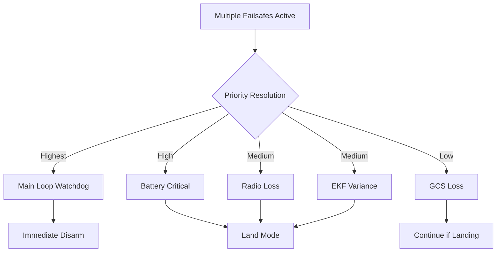
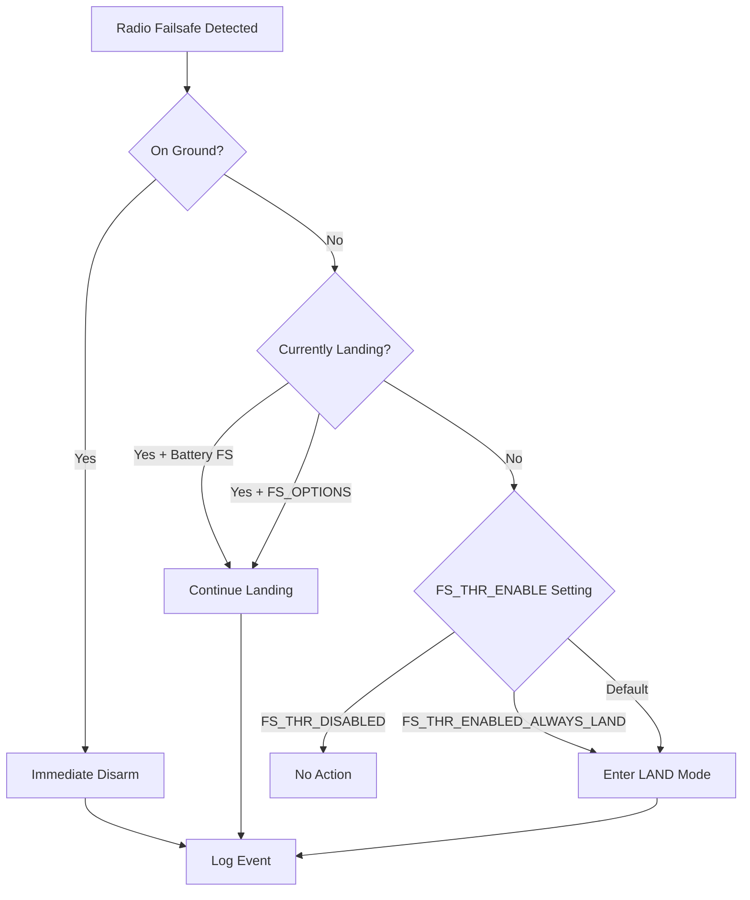
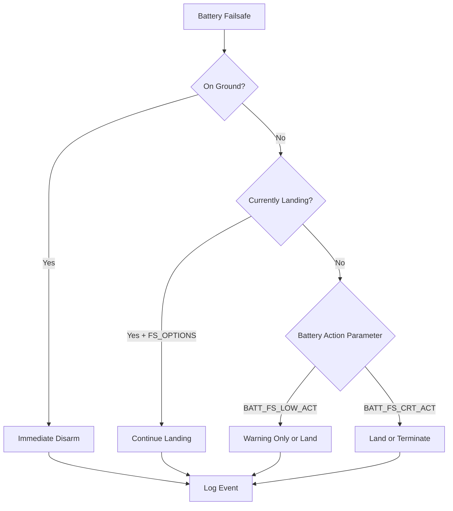
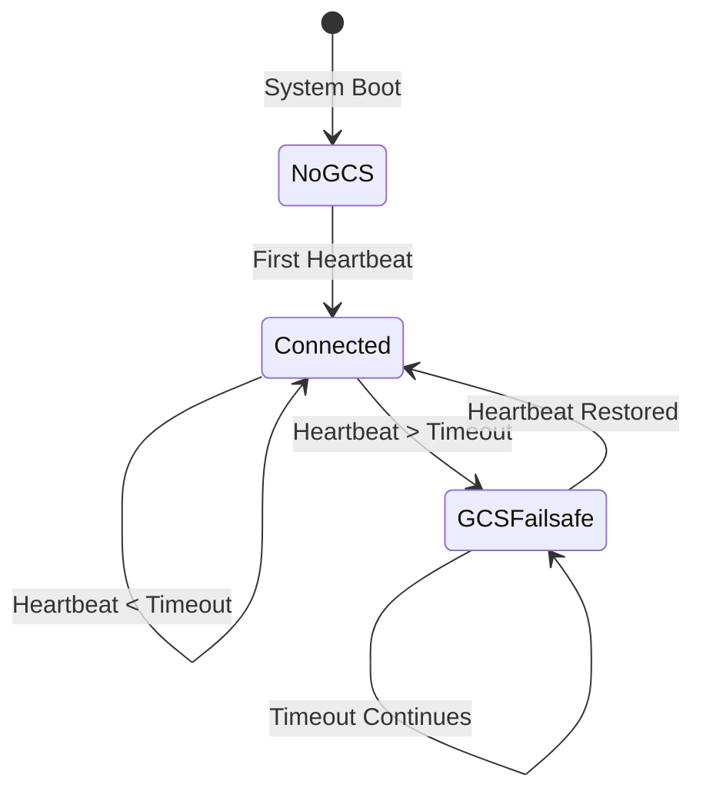
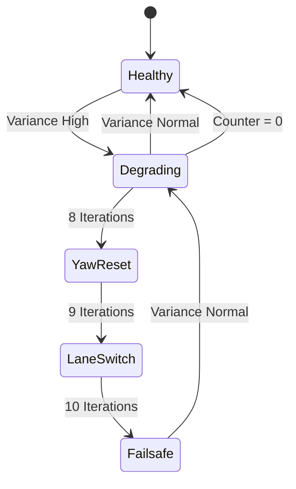
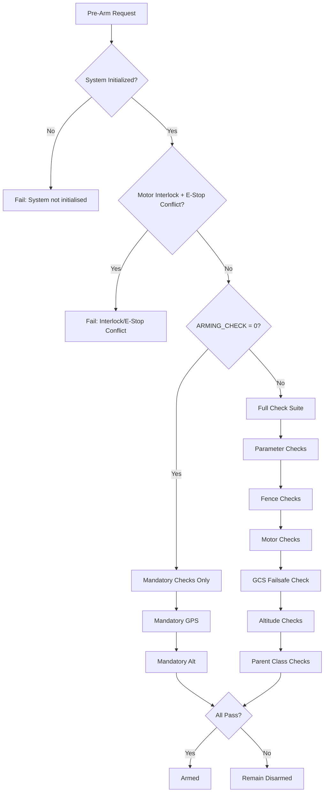
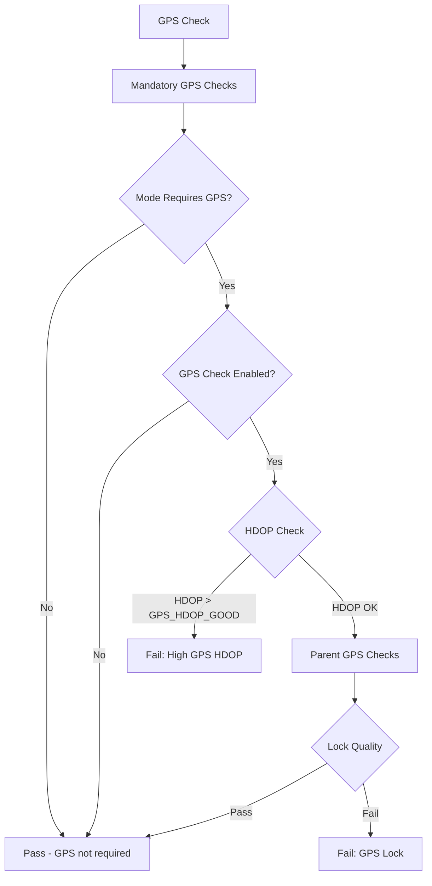

# Blimp Safety Systems Documentation


## Table of Contents
- [Overview](#overview)
- [Safety Architecture](#safety-architecture)
- [Main Loop Watchdog](#main-loop-watchdog)
- [Radio Failsafe System](#radio-failsafe-system)
- [Battery Failsafe System](#battery-failsafe-system)
- [GCS Failsafe System](#gcs-failsafe-system)
- [EKF Variance Monitoring](#ekf-variance-monitoring)
- [GPS Glitch Detection](#gps-glitch-detection)
- [Vibration Detection](#vibration-detection)
- [Arming System](#arming-system)
- [Emergency Actions](#emergency-actions)
- [Safety Best Practices](#safety-best-practices)

---

## Overview

The Blimp vehicle implements a comprehensive multi-layered safety system designed specifically for lighter-than-air vehicles. Unlike traditional multicopters or fixed-wing aircraft, blimps present unique safety challenges due to their buoyancy characteristics, slow response dynamics, and potential for uncontrolled ascent.

**Source Files**: 
- `/Blimp/failsafe.cpp` - Main loop watchdog
- `/Blimp/events.cpp` - Failsafe event handlers
- `/Blimp/AP_Arming_Blimp.cpp` - Arming checks
- `/Blimp/ekf_check.cpp` - EKF health monitoring
- `/Blimp/radio.cpp` - Radio failsafe detection

**Key Safety Considerations for Lighter-Than-Air Vehicles**:
- Buoyancy can cause uncontrolled ascent if thrust is lost
- Slow response to control inputs requires early failsafe detection
- Indoor operation presents unique challenges (GPS-denied environments)
- Envelope integrity considerations for pressure-stabilized designs
- Controlled descent requires coordinated thrust reduction
- Battery depletion can leave vehicle airborne without power

**Safety System Objectives**:
1. Detect system failures before they become critical
2. Provide graduated response based on failure severity
3. Maintain controlled flight during degraded operations
4. Execute safe landing or controlled descent when necessary
5. Log all safety events for post-incident analysis

---

## Safety Architecture

The Blimp safety system implements a hierarchical failsafe architecture with multiple independent monitoring layers.

### Failsafe Priority Hierarchy

When multiple failsafes trigger simultaneously, the system follows this priority order:



### Safety System Components

| Component | Monitoring Rate | Detection Time | Action | Source |
|-----------|----------------|----------------|--------|--------|
| Main Loop Watchdog | 1 kHz | 2 seconds | Disarm motors | `failsafe.cpp:36` |
| Radio Failsafe | Main loop | 500ms (2s with override) | Land or Disarm | `radio.cpp:54` |
| Battery Failsafe | Main loop | Instantaneous | Land or Disarm | `events.cpp:66` |
| GCS Failsafe | Main loop | Configurable (default 5s) | Disarm | `events.cpp:92` |
| EKF Variance | 10 Hz | 1 second (10 iterations) | Land | `ekf_check.cpp:29` |
| GPS Glitch | Main loop | Instantaneous | Warning only | `events.cpp:161` |
| Vibration | 10 Hz | 1 second sustained | Compensation mode | `ekf_check.cpp:197` |

---

## Main Loop Watchdog

**Purpose**: Detects scheduler stalls and main loop lockups that could prevent normal flight control processing.

**Source**: `/Blimp/failsafe.cpp:36-73`

### Operation Principle

The main loop watchdog operates at 1 kHz from a timer interrupt, independent of the main scheduler. It monitors the scheduler tick counter to detect if the main loop has stopped executing.

```cpp
/**
 * @brief Main loop watchdog - monitors for scheduler stalls
 * @details Called from core timer interrupt at 1kHz
 * @timing Interrupt context, must execute quickly
 * @source failsafe.cpp:35
 */
void Blimp::failsafe_check()
```

### Detection Logic

1. **Normal Operation**: Scheduler ticks increment every main loop iteration
   - Watchdog updates `failsafe_last_timestamp` when ticks change
   - `in_failsafe` flag remains false

2. **Stall Detection**: If ticks don't change for 2 seconds:
   - Sets `in_failsafe = true`
   - Reduces motors to minimum output (not immediate disarm to allow logging)
   - Logs: `LogErrorSubsystem::CPU, LogErrorCode::FAILSAFE_OCCURRED`

3. **Progressive Disarm**: After 1 additional second of stall:
   - Disarms motors every second until main loop recovers
   - Continues logging failure state

### Recovery

When the main loop resumes:
- `in_failsafe` flag cleared automatically
- Normal operation restored
- Logs: `LogErrorSubsystem::CPU, LogErrorCode::FAILSAFE_RESOLVED`

### Enable/Disable Control

```cpp
// Enable watchdog (called during normal operations)
failsafe_enable()  // Source: failsafe.cpp:18

// Disable temporarily (called before intentional delays)
failsafe_disable() // Source: failsafe.cpp:27
```

> **Warning**: The watchdog should only be disabled during intentional blocking operations (e.g., parameter saves, EEPROM writes). Leaving it disabled during flight is unsafe.

### Timing Constants

| Parameter | Value | Description |
|-----------|-------|-------------|
| Detection Threshold | 2,000,000 μs (2 sec) | Time before failsafe triggers |
| Disarm Interval | 1,000,000 μs (1 sec) | Repeated disarm attempts |
| Monitoring Rate | 1 kHz | Timer interrupt frequency |

---

## Radio Failsafe System

**Purpose**: Detects loss of RC transmitter signal or low throttle conditions indicating pilot distress.

**Sources**: 
- Detection: `/Blimp/radio.cpp:54-95`
- Event Handling: `/Blimp/events.cpp:15-64`
- State Management: `/Blimp/AP_State.cpp:18-41`

### Two-Stage Detection

The radio failsafe uses two independent detection mechanisms:

#### 1. No RC Input Detection

**Trigger Conditions**:
- No RC input received for 500ms (normal operation)
- No RC input for 2000ms (when RC_OVERRIDE active)
- Failsafe throttle enabled (`g.failsafe_throttle != FS_THR_DISABLED`)
- Motors armed OR RC input previously seen

**Source**: `radio.cpp:76-94`

```cpp
// Timeout values
const uint32_t FS_RADIO_TIMEOUT_MS = 500;
const uint32_t FS_RADIO_RC_OVERRIDE_TIMEOUT_MS = 2000;
```

#### 2. Low Throttle Detection (Throttle-Zero Debounce)

**Trigger Conditions**:
- Throttle PWM < `g.failsafe_throttle_value` (default ~900-950 PWM)
- Three consecutive low readings (debounce counter)
- Not already in failsafe mode
- RC input has been seen or motors armed

**Source**: `radio.cpp:98-134`

```cpp
#define FS_COUNTER 3  // Requires 3 consecutive low throttle readings
```

**Debounce Logic**:
- Low throttle increments `failsafe.radio_counter`
- Good throttle decrements counter
- Failsafe triggers when counter >= FS_COUNTER
- Prevents false triggers from momentary glitches

### Radio Failsafe Actions

**Source**: `events.cpp:15-55`

When radio failsafe triggers, the action depends on vehicle state and configuration:



**Configuration Parameter**: `FS_THR_ENABLE`
- `0` (FS_THR_DISABLED): Failsafe disabled
- `1` (FS_THR_ENABLED_ALWAYS_LAND): Always land on radio loss

**Advanced Options**: `FS_OPTIONS` bitmask
- `FailsafeOption::CONTINUE_IF_LANDING`: Don't interrupt landing sequence

### Radio Failsafe Recovery

**Source**: `events.cpp:58-64`

When radio contact is regained:
- Failsafe flag cleared automatically
- Pilot regains manual control (roll, pitch, yaw, throttle)
- Flight mode can be changed via mode switch
- Logs: `LogErrorSubsystem::FAILSAFE_RADIO, LogErrorCode::FAILSAFE_RESOLVED`
- GCS notification: "Radio Failsafe Cleared"

> **Note**: Recovery is automatic and immediate. The pilot must actively take control.

### Throttle Zero Flag

**Purpose**: Indicates pilot intent to shut down or vehicle on ground.

**Source**: `radio.cpp:141-156`

```cpp
#define THROTTLE_ZERO_DEBOUNCE_TIME_MS 400
```

**Detection Logic**:
- Throttle control > 0: Immediately clear throttle_zero flag
- Throttle control = 0 for >400ms: Set throttle_zero flag
- Used to determine landing state and safe-to-disarm conditions

---

## Battery Failsafe System

**Purpose**: Monitors battery voltage and capacity to prevent mid-air power loss.

**Source**: `/Blimp/events.cpp:66-90`

### Battery Monitoring

The battery failsafe system integrates with the ArduPilot battery monitoring library (`AP_BattMonitor`), which provides:
- Real-time voltage monitoring
- Current sensing and consumed capacity tracking
- Multiple battery support
- Configurable warning and critical thresholds

### Failsafe Trigger Conditions

Battery failsafe triggers when `battery.has_failsafed()` returns true, which occurs when:
- Voltage drops below critical threshold (`BATT_LOW_VOLT`)
- Remaining capacity below critical threshold (`BATT_LOW_MAH`)
- Battery failsafe action configured (`BATT_FS_LOW_ACT`, `BATT_FS_CRT_ACT`)

### Failsafe Actions

**Source**: `events.cpp:66-90`

```cpp
void Blimp::handle_battery_failsafe(const char *type_str, const int8_t action)
```

Actions are determined by battery configuration parameters:



**Battery Failsafe Actions** (`Failsafe_Action` enum):
- `Failsafe_Action_None`: Log only, no action
- `Failsafe_Action_Land`: Enter LAND mode, controlled descent
- `Failsafe_Action_Terminate`: Immediate motor disarm (危险!)

### Special Considerations for Blimps

**Buoyancy Implications**:
- Battery depletion leaves blimp airborne without control authority
- Unlike multicopters, blimp won't naturally descend without power
- Early landing critical to prevent uncontrolled ascent
- Battery capacity planning must account for safe landing time

**Recommended Configuration**:
```
BATT_LOW_VOLT    = 3.5V per cell (warning threshold)
BATT_CRT_VOLT    = 3.3V per cell (critical threshold)
BATT_FS_LOW_ACT  = 2 (Land - warning action)
BATT_FS_CRT_ACT  = 2 (Land - critical action)
```

> **Warning**: Never use `Terminate` action for battery failsafe on blimps. This will leave the vehicle airborne without control.

### Battery Failsafe Priority

When battery failsafe triggers during radio failsafe:
- Battery failsafe takes priority (higher severity)
- Landing sequence continues uninterrupted
- GCS notification: "Radio + Battery Failsafe - Continuing Landing"

**Source**: `events.cpp:39-42`

---

## GCS Failsafe System

**Purpose**: Detects loss of ground control station (GCS) telemetry connection.

**Source**: `/Blimp/events.cpp:92-126`

### Detection Logic

```cpp
void Blimp::failsafe_gcs_check()
```

**Monitoring**:
- Tracks time since last heartbeat from primary GCS
- Uses `gcs().sysid_mygcs_last_seen_time_ms()` timestamp
- Checks against configurable timeout: `g2.fs_gcs_timeout` (default 5 seconds)

**Trigger Conditions**:
- GCS failsafe enabled (`g.failsafe_gcs != FS_GCS_DISABLED`)
- GCS connection previously established (not during initial boot)
- Time since last heartbeat > `fs_gcs_timeout`

### GCS Failsafe State Machine



### Current Implementation

**Source**: `events.cpp:110-125`

The current Blimp GCS failsafe implementation uses a simplified approach:

- **Failsafe Trigger**: Immediate motor disarm
- **Recovery**: Automatic when GCS reconnects
- **Method**: `arming.disarm(AP_Arming::Method::GCSFAILSAFE)`

```cpp
if (last_gcs_update_ms > gcs_timeout_ms && !failsafe.gcs) {
    // New GCS failsafe event
    set_failsafe_gcs(true);
    arming.disarm(AP_Arming::Method::GCSFAILSAFE);
}
```

> **Note**: The comment indicates this is a placeholder implementation. A full `failsafe_gcs_on_event()` function may be implemented in future versions with more sophisticated actions.

### Configuration

**Parameters**:
- `FS_GCS_ENABLE`: Enable/disable GCS failsafe (0=Disabled, 1=Enabled)
- `FS_GCS_TIMEOUT`: Timeout in seconds before triggering (default 5.0s, range 0-120s)

**State Management**: `AP_State.cpp:45-51`

### Indoor vs. Outdoor Considerations

**Outdoor Operation (GPS Available)**:
- GCS failsafe less critical with GPS-guided landing capability
- Telemetry loss is recoverable condition
- Consider increasing timeout to 10-15 seconds

**Indoor Operation (GPS-Denied)**:
- GCS provides only control link
- Loss of GCS may require immediate disarm
- Shorter timeout (3-5 seconds) recommended

---

## EKF Variance Monitoring

**Purpose**: Monitors Extended Kalman Filter (EKF) health to detect navigation system degradation.

**Source**: `/Blimp/ekf_check.cpp:29-175`

### EKF Health Monitoring

The EKF variance monitor detects when the navigation solution becomes unreliable by tracking estimation uncertainty.

```cpp
/**
 * @brief Check EKF variance against thresholds
 * @details Called at 10Hz from main scheduler
 * @timing 100ms period
 * @source ekf_check.cpp:29
 */
void Blimp::ekf_check()
```

### Variance Sources Monitored

The EKF provides variance estimates for multiple state components:

| Variance Type | Description | Critical Indicator |
|--------------|-------------|-------------------|
| `position_variance` | Position estimate uncertainty | GPS quality degradation |
| `vel_variance` | Velocity estimate uncertainty | IMU/GPS fusion issues |
| `height_variance` | Altitude estimate uncertainty | Barometer problems |
| `mag_variance` | Magnetic field uncertainty | Compass interference |
| `tas_variance` | True airspeed uncertainty | Airspeed sensor (if used) |

**Source**: `ekf_check.cpp:111-113`

```cpp
ahrs.get_variances(vel_variance, position_variance, height_variance, 
                   mag_variance, tas_variance);
```

### Threshold Detection Logic

**Configuration**: `FS_EKF_THRESH` parameter (default 0.8)

**Detection Algorithm** (`ekf_check.cpp:103-135`):

1. Calculate maximum compass variance: `mag_max = max(mag_variance.x, mag_variance.y, mag_variance.z)`

2. Count variances over threshold:
   - Compass: `mag_max >= FS_EKF_THRESH`
   - Velocity: `vel_variance >= FS_EKF_THRESH` (or `>= 2.0 * FS_EKF_THRESH` without optical flow)
   - Position: `position_variance >= FS_EKF_THRESH`

3. Trigger when:
   - Two or more variances exceed threshold, OR
   - Velocity variance exceeds 2× threshold (indicating severe problems)

```cpp
if ((position_variance >= g.fs_ekf_thresh && over_thresh_count >= 1) || 
    over_thresh_count >= 2) {
    return true;  // EKF over threshold
}
```

### Progressive Response

The system uses a debounced approach to prevent false triggers:

```cpp
#define EKF_CHECK_ITERATIONS_MAX 10  // 1 second at 10Hz
```

**State Machine**:



**Source**: `ekf_check.cpp:52-80`

**Recovery Attempts**:
1. **Iteration 8**: Request yaw reset (`ahrs.request_yaw_reset()`)
   - Attempts to resolve compass-related issues
2. **Iteration 9**: Attempt lane switch (`ahrs.check_lane_switch()`)
   - Switches to alternate EKF core if available
3. **Iteration 10**: Trigger failsafe if still degraded

### EKF Failsafe Actions

**Source**: `ekf_check.cpp:138-163`

```cpp
void Blimp::failsafe_ekf_event()
```

**Action Logic**:
- If current mode doesn't require GPS: No action (unless `FS_EKF_ACTION_LAND_EVEN_MANUAL`)
- Otherwise: Enter LAND mode based on `FS_EKF_ACTION` parameter

**Configuration**: `FS_EKF_ACTION`
- `0` (FS_EKF_ACTION_LAND): Land only in GPS-dependent modes
- `1` (FS_EKF_ACTION_LAND_EVEN_MANUAL): Land in all modes

### EKF Core Switching

**Purpose**: Automatically switches to healthier EKF core when primary degrades.

**Source**: `ekf_check.cpp:188-193`

```cpp
void Blimp::check_ekf_reset()
{
    // Monitor for EKF primary core changes
    if ((ahrs.get_primary_core_index() != ekf_primary_core) && 
        (ahrs.get_primary_core_index() != -1)) {
        ekf_primary_core = ahrs.get_primary_core_index();
        LOGGER_WRITE_ERROR(LogErrorSubsystem::EKF_PRIMARY, LogErrorCode(ekf_primary_core));
        gcs().send_text(MAV_SEVERITY_WARNING, "EKF primary changed:%d", ekf_primary_core);
    }
}
```

**Logged Events**:
- `LogEvent::EKF_YAW_RESET`: Yaw reference was reset
- `LogErrorSubsystem::EKF_PRIMARY`: Primary core switched

### Navigation Status Checks

The failsafe also verifies the EKF is actively navigating:

```cpp
bool is_navigating = ekf_has_relative_position() || ekf_has_absolute_position();
```

Failsafe triggers if:
- Variances exceed thresholds, OR
- EKF loses position solution entirely

---

## GPS Glitch Detection

**Purpose**: Detects sudden GPS position jumps that indicate receiver problems.

**Source**: `/Blimp/events.cpp:161-177`

### Detection

GPS glitch detection is handled by the AHRS/EKF layer:

```cpp
void Blimp::gpsglitch_check()
{
    const bool gps_glitching = AP::ahrs().has_status(AP_AHRS::Status::GPS_GLITCHING);
}
```

**Glitch Indicators**:
- Sudden position jump inconsistent with velocity
- Position measurement rejected by EKF innovation checks
- GPS receiver reports sudden jumps without velocity change

### Actions

GPS glitch detection is **informational only** - it does not trigger failsafe actions:
- Logs event: `LogErrorSubsystem::GPS, LogErrorCode::GPS_GLITCH`
- GCS notification: "GPS Glitch" or "GPS Glitch cleared"
- AP_Notify flags updated for LED/buzzer indication

> **Note**: The EKF automatically rejects glitchy GPS readings and continues using inertial navigation during glitches. Actual failsafe (if needed) triggers via EKF variance monitoring.

---

## Vibration Detection

**Purpose**: Detects high vibrations that can corrupt inertial navigation, especially altitude hold.

**Source**: `/Blimp/ekf_check.cpp:197-259`

### Vibration Impact on Blimps

Unlike multicopters, blimps typically experience low vibration due to:
- Slower rotor speeds (ducted fans or slow propellers)
- Soft mounting of electronics within envelope
- Generally benign vibration environment

However, vibration can still occur from:
- Motor imbalances
- Damaged or imbalanced propellers
- Resonance with envelope structure
- Hard mounting of flight controller

### Detection Algorithm

**Source**: `ekf_check.cpp:197-259`

```cpp
void Blimp::check_vibration()
```

**Trigger Conditions** (all must be true for 1 second):
1. `FS_VIBE_ENABLE != 0` (vibration detection enabled)
2. Motors armed
3. Vertical velocity innovation positive (`vel_innovation.z > 0`)
4. Vertical position innovation positive (`pos_innovation.z > 0`)
5. Vertical velocity variance >= 1.0

**Physical Interpretation**:
- Positive innovations mean EKF estimates < GPS measurements
- Indicates vibration causing IMU to under-report upward acceleration
- Results in altitude estimation errors

### Compensation Mode

When high vibrations detected:
- Enters "vibration compensation" mode
- EKF automatically adjusts gains to be more resistant to vibration
- GCS notification: "Vibration compensation ON"
- Logs: `LogErrorSubsystem::FAILSAFE_VIBE, LogErrorCode::FAILSAFE_OCCURRED`

**Recovery**:
- Automatic after 15 seconds of normal conditions
- GCS notification: "Vibration compensation OFF"
- Logs: `LogErrorSubsystem::FAILSAFE_VIBE, LogErrorCode::FAILSAFE_RESOLVED`

> **Note**: This is not a true "failsafe" but an adaptive filter mode. Flight continues normally with adjusted EKF parameters.

---

## Arming System

**Purpose**: Comprehensive pre-flight validation to prevent arming with unsafe conditions.

**Sources**: 
- `/Blimp/AP_Arming_Blimp.h` - Class definition
- `/Blimp/AP_Arming_Blimp.cpp` - Implementation

### Arming Philosophy

The blimp arming system follows defense-in-depth principles:
- **Pre-arm checks**: Comprehensive system validation (can be partially bypassed)
- **Mandatory checks**: Critical safety checks (cannot be bypassed)
- **Arm checks**: Final validation just before arming

### Pre-Arm Check Categories

**Source**: `AP_Arming_Blimp.cpp:12-48`

```cpp
bool AP_Arming_Blimp::run_pre_arm_checks(bool display_failure)
```

**Check Sequence**:



### Individual Check Details

#### 1. System Initialization Check

**Purpose**: Ensure HAL and core systems ready

**Source**: `AP_Arming_Blimp.cpp:19-22`

```cpp
if (!hal.scheduler->is_system_initialized()) {
    check_failed(display_failure, "System not initialised");
    return false;
}
```

**Validates**: Scheduler, HAL initialization complete

#### 2. RC Switch Conflict Check

**Purpose**: Prevent conflicting motor control switches

**Source**: `AP_Arming_Blimp.cpp:24-30`

```cpp
if (rc().find_channel_for_option(RC_Channel::AUX_FUNC::MOTOR_INTERLOCK) &&
    rc().find_channel_for_option(RC_Channel::AUX_FUNC::MOTOR_ESTOP)) {
    check_failed(display_failure, "Interlock/E-Stop Conflict");
    return false;
}
```

**Validates**: Motor Interlock and Emergency Stop not both assigned

> **Critical**: Using both switches simultaneously creates ambiguous motor control state.

#### 3. Parameter Checks

**Purpose**: Validate failsafe and control parameters

**Source**: `AP_Arming_Blimp.cpp:112-128`

```cpp
bool AP_Arming_Blimp::parameter_checks(bool display_failure)
```

**Throttle Failsafe Validation**:
- If `FS_THR_ENABLE` != 0:
  - `channel_up->get_radio_min()` must be > `FS_THR_VALUE + 10`
  - `FS_THR_VALUE` must be >= 910 PWM
- Prevents false failsafe triggers from normal throttle range

**Example Configuration**:
```
RC3_MIN = 1000      // Throttle channel minimum
FS_THR_VALUE = 950  // Failsafe trigger point
Margin: 1000 > 950+10 ✓ Valid
```

#### 4. Motor Checks

**Purpose**: Verify motor initialization and configuration

**Source**: `AP_Arming_Blimp.cpp:131-145`

```cpp
bool AP_Arming_Blimp::motor_checks(bool display_failure)
{
    if (!blimp.motors->initialised_ok()) {
        check_failed(display_failure, "Check firmware or FRAME_CLASS");
        return false;
    }
    return true;
}
```

**Validates**:
- Motor library initialization successful
- Frame class configured correctly
- Motor mixing matrix valid

#### 5. GCS Failsafe Check

**Purpose**: Ensure GCS failsafe not already active

**Source**: `AP_Arming_Blimp.cpp:240-247`

```cpp
bool AP_Arming_Blimp::gcs_failsafe_check(bool display_failure)
{
    if (blimp.failsafe.gcs) {
        check_failed(display_failure, "GCS failsafe on");
        return false;
    }
    return true;
}
```

**Prevents**: Arming while GCS connection lost

#### 6. Barometer Checks

**Purpose**: Validate altitude estimation system

**Source**: `AP_Arming_Blimp.cpp:50-72`

```cpp
bool AP_Arming_Blimp::barometer_checks(bool display_failure)
```

**Altitude Disparity Check**:
- When using barometric reference (not GPS relative altitude)
- Compares EKF altitude vs. barometer reading
- Maximum allowed disparity: `PREARM_MAX_ALT_DISPARITY_CM` (typically 200cm = 2m)

```cpp
if (fabsf(blimp.inertial_nav.get_position_z_up_cm() - blimp.baro_alt) > 
    PREARM_MAX_ALT_DISPARITY_CM) {
    check_failed(Check::BARO, display_failure, "Altitude disparity");
    return false;
}
```

**Physical Meaning**: EKF and barometer must agree on altitude within 2 meters.

#### 7. Inertial Sensor Checks

**Purpose**: Validate IMU and EKF attitude estimation

**Source**: `AP_Arming_Blimp.cpp:74-88`

```cpp
bool AP_Arming_Blimp::ins_checks(bool display_failure)
```

**EKF Attitude Validation**:
```cpp
bool AP_Arming_Blimp::pre_arm_ekf_attitude_check()
{
    return AP::ahrs().has_status(AP_AHRS::Status::ATTITUDE_VALID);
}
```

**Validates**:
- Parent class IMU checks (calibration, health)
- EKF attitude solution converged
- Gyro biases stabilized

**Common Failure**: EKF attitude not converged if vehicle moved before initialization complete.

#### 8. GPS Checks

**Purpose**: Validate GPS quality for GPS-dependent modes

**Source**: `AP_Arming_Blimp.cpp:153-193`

```cpp
bool AP_Arming_Blimp::gps_checks(bool display_failure)
```

**Check Logic**:



**Mandatory GPS Checks** (`AP_Arming_Blimp.cpp:202-236`):
- AHRS initialization complete
- Position estimate available (if mode requires GPS)
- No GPS glitching (from EKF filter status)

**Optional GPS Checks**:
- HDOP < `GPS_HDOP_GOOD` parameter (default 1.4)
- Parent class checks: Fix type, satellite count, accuracy

#### 9. Altitude Checks

**Purpose**: Ensure altitude estimate available for non-manual modes

**Source**: `AP_Arming_Blimp.cpp:250-259`

```cpp
bool AP_Arming_Blimp::alt_checks(bool display_failure)
{
    if (!blimp.flightmode->has_manual_throttle() && !blimp.ekf_alt_ok()) {
        check_failed(display_failure, "Need Alt Estimate");
        return false;
    }
    return true;
}
```

**Validates**: Altitude estimate available for altitude-controlled modes

#### 10. Battery Voltage Checks

**Purpose**: Prevent arming with depleted battery

**Source**: `AP_Arming_Blimp.cpp:90-110`

```cpp
bool AP_Arming_Blimp::board_voltage_checks(bool display_failure)
```

**Checks**:
- Battery not in failsafe state (`!battery.has_failsafed()`)
- Parent class battery checks (minimum voltage, capacity)
- Board voltage within acceptable range

### Mandatory Checks (Cannot Be Bypassed)

**Purpose**: Critical safety checks that run even when `ARMING_CHECK = 0`

**Source**: `AP_Arming_Blimp.cpp:270-282`

```cpp
bool AP_Arming_Blimp::mandatory_checks(bool display_failure)
{
    bool result = mandatory_gps_checks(display_failure);
    result &= alt_checks(display_failure);
    return result & AP_Arming::mandatory_checks(display_failure);
}
```

**Mandatory Items**:
1. AHRS pre-arm checks
2. Position estimate (for GPS modes)
3. GPS not glitching
4. Altitude estimate (for altitude-controlled modes)
5. Parent class mandatory checks (accel calibration, etc.)

> **Important**: These checks cannot be bypassed, even with `ARMING_CHECK = 0` or forced arming.

### Arming Sequence

**Source**: `AP_Arming_Blimp.cpp:290-371`

```cpp
bool AP_Arming_Blimp::arm(const AP_Arming::Method method, const bool do_arming_checks)
```

**Execution Flow**:

1. **Entry Guard**: Prevent recursive calls
2. **Already Armed Check**: Return success if already armed
3. **Parent Arm Checks**: Run AP_Arming base class checks
4. **Logging**: Enable logger vehicle armed state
5. **Notification**: Set AP_Notify armed flag (LEDs, buzzer)
6. **Home Position**:
   - If home not set: Reset EKF height datum, set arming altitude = 0
   - If home unlocked: Set home to current location, record arming altitude
7. **HAL Notification**: `hal.util->set_soft_armed(true)`
8. **Motor Enable**: `motors->armed(true)`
9. **Event Logging**: Log flight mode and arming event
10. **Arming Delay**: Set `ap.in_arming_delay = true` for safety delay

**Arming Methods**:
- `AP_Arming::Method::RUDDER`: Rudder stick arming (if enabled)
- `AP_Arming::Method::MAVLINK`: GCS command
- `AP_Arming::Method::SWITCH`: RC switch

### Disarming Sequence

**Source**: `AP_Arming_Blimp.cpp:374-418`

```cpp
bool AP_Arming_Blimp::disarm(const AP_Arming::Method method, bool do_disarm_checks)
```

**Rudder Disarm Conditions**:
```cpp
if (method == AP_Arming::Method::RUDDER) {
    if (!blimp.flightmode->has_manual_throttle() && !blimp.ap.land_complete) {
        return false;  // Don't allow rudder disarm in air in auto modes
    }
}
```

**Disarm Sequence**:
1. **Already Disarmed Check**: Return if not armed
2. **Parent Disarm Checks**: Safety validation
3. **Compass Calibration**: Save EKF-learned offsets (if enabled)
4. **Motor Disable**: `motors->armed(false)`
5. **Logger Update**: `AP::logger().set_vehicle_armed(false)`
6. **HAL Notification**: `hal.util->set_soft_armed(false)`
7. **Clear Arming Delay**: `ap.in_arming_delay = false`

**Compass Learning**:
```cpp
if (compass.get_learn_type() == Compass::LearnType::COPY_FROM_EKF) {
    for (uint8_t i=0; i<COMPASS_MAX_INSTANCES; i++) {
        Vector3f magOffsets;
        if (ahrs.getMagOffsets(i, magOffsets)) {
            compass.set_and_save_offsets(i, magOffsets);
        }
    }
}
```

---

## Emergency Actions

**Purpose**: Execute safe vehicle shutdown in failsafe conditions.

**Source**: `/Blimp/events.cpp:143-158`

### Failsafe Action Types

```cpp
enum Failsafe_Action {
    Failsafe_Action_None = 0,
    Failsafe_Action_Land = 1,
    Failsafe_Action_Terminate = 4
};
```

### Action Execution

**Source**: `events.cpp:143-158`

```cpp
void Blimp::do_failsafe_action(Failsafe_Action action, ModeReason reason)
{
    switch (action) {
    case Failsafe_Action_None:
        return;  // No action required
    
    case Failsafe_Action_Land:
        set_mode_land_failsafe(reason);  // Enter LAND mode
        break;
    
    case Failsafe_Action_Terminate:
        arming.disarm(AP_Arming::Method::FAILSAFE_ACTION_TERMINATE);
        break;
    }
}
```

### Action 1: Land Mode (Controlled Descent)

**Purpose**: Execute controlled descent to safe landing

**Characteristics**:
- Enters LAND flight mode
- Maintains attitude control during descent
- Reduces altitude at controlled rate
- Motors remain armed until ground contact
- Allows pilot override if RC recovered

**Mode Reason Codes**:
- `ModeReason::RADIO_FAILSAFE`
- `ModeReason::BATTERY_FAILSAFE`
- `ModeReason::EKF_FAILSAFE`

**Blimp-Specific Considerations**:
- Controlled descent critical for lighter-than-air vehicles
- Must maintain downward thrust against buoyancy
- Landing sequence may need valve actuation (if implemented)
- Ground effect detection challenging without ground proximity sensors

### Action 2: Terminate (Emergency Motor Stop)

**Purpose**: Immediate motor disarm in critical situations

**Characteristics**:
- Immediately disarms all motors
- No controlled descent
- Vehicle becomes free-floating (blimps) or falls (multicopters)
- Used only in dire emergencies

**Trigger Methods**:
```cpp
arming.disarm(AP_Arming::Method::FAILSAFE_ACTION_TERMINATE);
arming.disarm(AP_Arming::Method::RADIOFAILSAFE);
arming.disarm(AP_Arming::Method::BATTERYFAILSAFE);
arming.disarm(AP_Arming::Method::GCSFAILSAFE);
```

> **Warning**: For blimps, TERMINATE action leaves vehicle airborne without control. Use only as last resort (e.g., collision avoidance, uncontrolled ascent toward obstacles).

### Conditional Disarm Logic

**Source**: `events.cpp:128-140`

```cpp
bool Blimp::should_disarm_on_failsafe()
{
    // Disarm immediately if in arming delay
    if (ap.in_arming_delay) {
        return true;
    }
    
    // Check mode-specific conditions
    switch (control_mode) {
    case Mode::Number::MANUAL:
    default:
        return ap.land_complete;  // Disarm only if on ground
    }
}
```

**Logic**:
- During arming delay: Immediate disarm (motor spool-up not complete)
- MANUAL mode: Disarm only if landed (`ap.land_complete`)
- Other modes: Mode-specific logic

### Motor Output Reduction

**Source**: `failsafe.cpp:56-60`

Before disarming in main loop watchdog failsafe:

```cpp
if (motors->armed()) {
    motors->output_min();  // Reduce to minimum thrust
}
```

**Purpose**: 
- Allow time for logging the failure before complete shutdown
- Maintain some control authority momentarily
- Gradual power reduction vs. immediate cutoff

---

## Safety Best Practices

### Pre-Flight Checklist

**Essential Steps**:

1. **Parameter Validation**
   - [ ] Verify all failsafe thresholds configured
   - [ ] Confirm `FS_THR_VALUE` < RC min throttle
   - [ ] Set appropriate `FS_EKF_THRESH` (0.6-1.0)
   - [ ] Configure battery failsafe thresholds

2. **System Health**
   - [ ] Complete all pre-arm checks
   - [ ] Verify GPS HDOP < 1.4 (outdoor ops)
   - [ ] Confirm EKF attitude valid
   - [ ] Check barometer altitude reasonable

3. **Envelope Integrity** (Pressure-Stabilized Blimps)
   - [ ] Visual inspection for tears or punctures
   - [ ] Verify envelope pressure within limits
   - [ ] Check valve operation (if equipped)
   - [ ] Confirm buoyancy appropriate for battery weight

4. **Environmental Assessment**
   - [ ] Check wind conditions (blimps sensitive to wind)
   - [ ] Verify operating area clear of obstacles
   - [ ] Assess ceiling height (indoor ops)
   - [ ] Confirm emergency landing zones available

5. **Communication Links**
   - [ ] Verify RC transmitter range
   - [ ] Test all RC channel responses
   - [ ] Confirm telemetry connection
   - [ ] Set GCS failsafe timeout appropriately

### Indoor Operation Guidelines

**GPS-Denied Environment Challenges**:
- No GPS position hold capability
- Limited to manual or optical flow-based modes
- GCS loss more critical (no autonomous recovery)

**Recommended Configuration**:
```
FS_EKF_THRESH = 0.0     # Disable EKF failsafe (no GPS expected)
FS_GCS_ENABLE = 1       # Enable GCS failsafe
FS_GCS_TIMEOUT = 3.0    # Short timeout (3 seconds)
FS_THR_ENABLE = 1       # Enable radio failsafe
```

**Safety Procedures**:
- Maintain visual line of sight at all times
- Keep altitude well below ceiling (minimum 2m clearance)
- Avoid flying near HVAC vents (air currents)
- Have ground crew ready to manually capture if needed
- Practice manual recovery procedures

### Outdoor Operation Guidelines

**GPS-Enabled Environment**:
- Full navigation capability available
- Can use GPS-dependent modes (LOITER, AUTO, etc.)
- More autonomous failsafe recovery options

**Recommended Configuration**:
```
FS_EKF_THRESH = 0.8     # Standard EKF failsafe threshold
FS_GCS_ENABLE = 0       # Optional (can continue with GPS)
FS_THR_ENABLE = 1       # Enable radio failsafe
BATT_FS_LOW_ACT = 2     # Land on low battery
BATT_FS_CRT_ACT = 2     # Land on critical battery
```

**Environmental Considerations**:
- **Wind Limits**: Blimps highly sensitive to wind
  - Limit operations to < 5 m/s (11 mph) for most designs
  - Monitor wind gusts, not just average wind speed
- **Thermal Activity**: Avoid midday operations in summer (thermals)
- **Obstacle Clearance**: Maintain generous margins (slow maneuvering)

### Battery Management

**Critical for Lighter-Than-Air Vehicles**:

Blimps face unique battery challenges:
- Battery depletion leaves vehicle airborne without control
- Unlike multicopters, won't naturally descend
- Must maintain power for controlled descent

**Capacity Planning**:
```
Flight Time Budget:
- Primary mission: 60%
- Reserve for failsafe landing: 20%
- Safety margin: 20%

Example: 10Ah battery, 2A hover current
- Total time: 300 minutes (5 hours)
- Mission time: 180 minutes (3 hours)
- Reserve: 60 minutes
- Safety: 60 minutes
```

**Monitoring**:
- Use current sensor, not just voltage (voltage sags under load)
- Set `BATT_LOW_MAH` to trigger with 25% remaining
- Set `BATT_CRT_MAH` to trigger with 15% remaining
- Never fly below 10% remaining capacity

### Logging and Post-Flight Analysis

**Critical Events to Review**:

| Event | Log Subsystem | Error Code | Significance |
|-------|--------------|------------|--------------|
| Main loop stall | CPU | FAILSAFE_OCCURRED | Critical - investigate immediately |
| Radio failsafe | FAILSAFE_RADIO | FAILSAFE_OCCURRED | Check RC system, interference |
| Battery failsafe | FAILSAFE_BATT | FAILSAFE_OCCURRED | Verify capacity planning |
| EKF variance | EKFCHECK | BAD_VARIANCE | Check vibration, GPS quality |
| GPS glitch | GPS | GPS_GLITCH | Investigate GPS quality, multipath |
| Vibration comp | FAILSAFE_VIBE | FAILSAFE_OCCURRED | Check prop balance, mounting |

**Analysis Tools**:
- MAVExplorer: Interactive log analysis
- Mission Planner: Basic log review
- DataFlash log plots: Time-series analysis

**Key Parameters to Plot**:
- Battery voltage and current
- EKF variances (velocity, position, compass)
- GPS HDOP and satellite count
- Vibration levels (IMU clipping, accelerometer)
- Mode changes and failsafe events

### Emergency Procedures

#### Uncontrolled Ascent

**Scenario**: Vehicle ascends despite pilot input or low throttle command.

**Likely Causes**:
- Excess buoyancy (battery lighter than expected)
- Thrust vectoring error
- Control surface failure

**Response**:
1. **Immediate**: Full downward thrust
2. **If unresponsive**: Emergency land mode (disarm motors)
3. **Ground crew**: Prepare to capture manually if within reach
4. **Document**: Altitude, rate of ascent, battery level

> **Note**: For outdoor ops, uncontrolled ascent can result in vehicle loss. Indoor ops limit maximum altitude.

#### Radio Loss in GPS-Denied Environment

**Scenario**: RC link lost indoors without GPS position hold.

**Vehicle Response**:
- Radio failsafe triggers after 500ms
- Enters LAND mode (descends at controlled rate)
- No lateral position hold without optical flow

**Pilot Actions**:
1. **Attempt reconnection**: Power cycle transmitter, check antenna
2. **GCS override**: Use telemetry link if available
3. **Manual capture**: Ground crew intercept if accessible
4. **Allow failsafe landing**: Vehicle will descend and disarm

#### Battery Critical During Flight

**Scenario**: Battery reaches critical level mid-flight.

**Vehicle Response**:
- Battery failsafe triggers
- Enters LAND mode immediately
- GCS notification sent

**Pilot Actions**:
1. **Do not override**: Allow automatic landing
2. **Clear landing area**: Ensure safe descent path
3. **Monitor descent**: Watch for obstacles
4. **Post-landing**: Immediately disconnect battery to prevent over-discharge

#### EKF Failure

**Scenario**: Navigation system loses reliability due to sensor issues.

**Vehicle Response**:
- EKF variance monitoring triggers after 1 second
- Attempts yaw reset and lane switching
- If unresolved, enters LAND mode
- Position hold capability degraded

**Pilot Actions**:
1. **Switch to manual mode**: If comfortable with manual control
2. **Land immediately**: Find nearest safe landing spot
3. **Avoid GPS-dependent modes**: Don't use LOITER, AUTO, etc.
4. **Post-flight**: Analyze logs for root cause (GPS, compass, vibration)

### Failsafe Testing

**Ground Testing (REQUIRED before first flight)**:

1. **Radio Failsafe Test**:
   ```
   1. Arm vehicle on ground
   2. Throttle up slightly (10-20%)
   3. Turn off transmitter
   4. Verify: Motors reduce to minimum after 500ms
   5. Verify: GCS shows "Radio Failsafe" message
   6. Turn on transmitter
   7. Verify: "Radio Failsafe Cleared" message
   8. Disarm
   ```

2. **Battery Failsafe Test**:
   ```
   1. Set BATT_LOW_VOLT to value above current voltage
   2. Arm vehicle on ground
   3. Verify: Battery failsafe triggers immediately
   4. Verify: Vehicle attempts to land (stays on ground)
   5. Restore normal BATT_LOW_VOLT value
   6. Disarm and reboot
   ```

3. **GCS Failsafe Test**:
   ```
   1. Enable FS_GCS_ENABLE = 1
   2. Set FS_GCS_TIMEOUT = 5.0
   3. Arm vehicle on ground
   4. Disconnect telemetry
   5. Verify: GCS failsafe triggers after 5 seconds
   6. Verify: Vehicle disarms
   7. Reconnect telemetry
   ```

4. **Throttle Zero Detection**:
   ```
   1. Arm vehicle on ground
   2. Hold throttle at zero for >400ms
   3. Verify: ap.throttle_zero flag set (check logs)
   4. Raise throttle
   5. Verify: Flag clears immediately
   ```

**Flight Testing (After ground tests pass)**:

1. **Controlled Radio Failsafe**:
   - Test at safe altitude with spotter
   - Trigger failsafe, observe landing behavior
   - Recover RC before ground contact
   - Verify logs show proper sequence

2. **Battery Failsafe Simulation**:
   - Monitor voltage throughout flight
   - Land with >30% capacity remaining
   - Analyze voltage sag characteristics
   - Adjust thresholds based on actual performance

> **Safety**: Always test with:
> - Experienced pilot
> - Visual spotter
> - Safe altitude (minimum 5m)
> - Clear landing area
> - Calm wind conditions

### Maintenance and Monitoring

**Regular Inspections**:

| Item | Frequency | Check |
|------|-----------|-------|
| Battery capacity | Every flight | Monitor mAh consumed vs. flight time |
| Vibration levels | Weekly | Review logs for IMU clipping |
| GPS performance | Weekly | Check HDOP, satellite count trends |
| Compass calibration | Monthly | Verify offsets haven't drifted |
| RC system | Monthly | Range test, channel trim check |
| Firmware | As needed | Update to stable releases only |

**Log Review Schedule**:
- **After every flight**: Quick scan for errors/warnings
- **Weekly**: Detailed analysis of trends (battery, vibration, GPS)
- **After any anomaly**: Comprehensive analysis before next flight

**Preventive Maintenance**:
1. **Propeller balance**: Check monthly, replace if worn
2. **Motor condition**: Listen for bearing noise, check smoothness
3. **Battery health**: Cycle test quarterly, retire at 80% capacity
4. **Wiring inspection**: Check for chafing, secure connections
5. **Envelope condition**: Inspect for leaks, patch as needed

### Safety Documentation

**Flight Log Requirements**:

Maintain written records for each flight:
- Date, time, location
- Environmental conditions (wind, temperature)
- Battery capacity used
- Flight duration
- Any anomalies or warnings
- Failsafe events (if any)
- Corrective actions taken

**Incident Reporting**:

After any safety event:
1. **Preserve logs**: Download immediately, make backups
2. **Document conditions**: Photos, witness statements, environmental data
3. **Root cause analysis**: Use logs to determine failure mode
4. **Corrective actions**: Implement fixes before next flight
5. **Update procedures**: Revise checklists if needed

### Regulatory Compliance

**Safety Considerations for Different Jurisdictions**:

Many regulations treat blimps differently from multicopters:
- May have different altitude restrictions
- Indoor operation may have specific requirements
- Commercial use may require special certification
- Public operation may need additional insurance

**Recommended Practices**:
- Maintain thorough safety documentation
- Log all flights and incidents
- Implement manufacturer safety recommendations
- Follow local aviation authority guidelines
- Consider third-party liability insurance

---

## Appendix A: Parameter Quick Reference

### Critical Safety Parameters

| Parameter | Default | Range | Description |
|-----------|---------|-------|-------------|
| `FS_THR_ENABLE` | 0 | 0-1 | Enable radio throttle failsafe |
| `FS_THR_VALUE` | 950 | 910-2200 | PWM value indicating radio loss |
| `FS_GCS_ENABLE` | 0 | 0-1 | Enable GCS heartbeat failsafe |
| `FS_GCS_TIMEOUT` | 5.0 | 0-120 | GCS timeout in seconds |
| `FS_EKF_THRESH` | 0.8 | 0-10 | EKF variance threshold |
| `FS_EKF_ACTION` | 1 | 0-1 | EKF failsafe action |
| `FS_VIBE_ENABLE` | 0 | 0-1 | Enable vibration failsafe |
| `FS_OPTIONS` | 0 | bitmask | Failsafe behavior options |
| `BATT_LOW_VOLT` | 10.5 | 0-100 | Low battery voltage threshold |
| `BATT_CRT_VOLT` | 10.0 | 0-100 | Critical battery voltage |
| `BATT_LOW_MAH` | 0 | 0-50000 | Low capacity warning (mAh) |
| `BATT_CRT_MAH` | 0 | 0-50000 | Critical capacity (mAh) |
| `BATT_FS_LOW_ACT` | 0 | 0-4 | Low battery action |
| `BATT_FS_CRT_ACT` | 0 | 0-4 | Critical battery action |
| `ARMING_CHECK` | 1 | 0-262143 | Bitmask of pre-arm checks |
| `GPS_HDOP_GOOD` | 140 | 100-900 | HDOP threshold (x100) |

### Recommended Configurations

**Conservative (Beginner)**:
```
FS_THR_ENABLE = 1
FS_THR_VALUE = 950
FS_GCS_ENABLE = 1
FS_GCS_TIMEOUT = 5.0
FS_EKF_THRESH = 0.6
FS_EKF_ACTION = 1
BATT_FS_LOW_ACT = 2 (Land)
BATT_FS_CRT_ACT = 2 (Land)
ARMING_CHECK = 1 (All checks)
```

**Moderate (Experienced)**:
```
FS_THR_ENABLE = 1
FS_THR_VALUE = 950
FS_GCS_ENABLE = 0
FS_EKF_THRESH = 0.8
FS_EKF_ACTION = 0
BATT_FS_LOW_ACT = 2 (Land)
BATT_FS_CRT_ACT = 2 (Land)
ARMING_CHECK = 1
```

**Indoor (GPS-Denied)**:
```
FS_THR_ENABLE = 1
FS_THR_VALUE = 950
FS_GCS_ENABLE = 1
FS_GCS_TIMEOUT = 3.0
FS_EKF_THRESH = 0.0 (Disabled)
BATT_FS_LOW_ACT = 2 (Land)
BATT_FS_CRT_ACT = 2 (Land)
ARMING_CHECK = 1
```

---

## Appendix B: Failsafe Event Codes

### Logger Error Subsystems

| Subsystem | Code | Description |
|-----------|------|-------------|
| CPU | 1 | Main loop watchdog |
| RADIO | 2 | RC radio system |
| FAILSAFE_RADIO | 3 | Radio failsafe events |
| FAILSAFE_BATT | 4 | Battery failsafe events |
| FAILSAFE_EKFINAV | 8 | EKF/navigation failsafe |
| FAILSAFE_VIBE | 15 | Vibration failsafe |
| EKFCHECK | 21 | EKF variance check |
| EKF_PRIMARY | 22 | EKF primary core change |
| GPS | 9 | GPS subsystem |

### Logger Error Codes

| Code | Description |
|------|-------------|
| FAILSAFE_OCCURRED | Failsafe condition triggered |
| FAILSAFE_RESOLVED | Failsafe condition cleared |
| EKFCHECK_BAD_VARIANCE | EKF variance exceeded threshold |
| EKFCHECK_VARIANCE_CLEARED | EKF variance returned to normal |
| GPS_GLITCH | GPS position glitch detected |
| ERROR_RESOLVED | Generic error cleared |
| RADIO_LATE_FRAME | Radio frame timeout |

### Logger Events

| Event | Description |
|-------|-------------|
| AUTO_ARMED | Vehicle automatically armed |
| EKF_ALT_RESET | EKF altitude datum reset |
| EKF_YAW_RESET | EKF yaw reference reset |

---

## Appendix C: State Flags

### Failsafe State Structure

**Source**: Various state management files

```cpp
struct {
    uint8_t radio       : 1;  // Radio failsafe active
    uint8_t gcs         : 1;  // GCS failsafe active
    uint8_t ekf         : 1;  // EKF failsafe active
    uint8_t radio_counter;     // Radio debounce counter (0-3)
} failsafe;
```

### AP State Flags

**Source**: `AP_State.cpp`, various files

```cpp
struct {
    uint8_t pre_arm_check       : 1;  // Pre-arm checks passed
    uint8_t auto_armed          : 1;  // Auto-armed (throttle raised)
    uint8_t land_complete       : 1;  // Vehicle on ground
    uint8_t throttle_zero       : 1;  // Throttle at zero (debounced)
    uint8_t new_radio_frame     : 1;  // New RC data this loop
    uint8_t in_arming_delay     : 1;  // Within arming delay period
    uint8_t gps_glitching       : 1;  // GPS glitch detected
} ap;
```

### AP_Notify Flags

**Purpose**: Drive external indicators (LEDs, buzzers)

```cpp
AP_Notify::flags.armed              // Motors armed
AP_Notify::flags.pre_arm_check      // Pre-arm passed
AP_Notify::flags.pre_arm_gps_check  // GPS checks passed
AP_Notify::flags.failsafe_radio     // Radio failsafe
AP_Notify::flags.failsafe_gcs       // GCS failsafe
AP_Notify::flags.ekf_bad            // EKF variance bad
```

---

## Appendix D: Function Call Reference

### Failsafe Management Functions

| Function | Source File | Called From | Frequency |
|----------|-------------|-------------|-----------|
| `failsafe_check()` | failsafe.cpp:36 | Timer interrupt | 1 kHz |
| `failsafe_enable()` | failsafe.cpp:18 | Initialization | Once |
| `failsafe_disable()` | failsafe.cpp:27 | Before delays | As needed |
| `failsafe_radio_on_event()` | events.cpp:15 | State change | Event |
| `failsafe_radio_off_event()` | events.cpp:58 | State change | Event |
| `handle_battery_failsafe()` | events.cpp:66 | Battery monitor | Event |
| `failsafe_gcs_check()` | events.cpp:92 | Main loop | ~10 Hz |
| `failsafe_ekf_event()` | ekf_check.cpp:139 | EKF monitor | Event |
| `failsafe_ekf_off_event()` | ekf_check.cpp:166 | EKF monitor | Event |

### Arming Functions

| Function | Source File | Purpose |
|----------|-------------|---------|
| `pre_arm_checks()` | AP_Arming_Blimp.cpp:3 | Pre-arm validation wrapper |
| `run_pre_arm_checks()` | AP_Arming_Blimp.cpp:12 | Actual pre-arm checks |
| `mandatory_checks()` | AP_Arming_Blimp.cpp:270 | Cannot-bypass checks |
| `arm()` | AP_Arming_Blimp.cpp:290 | Arm motors |
| `disarm()` | AP_Arming_Blimp.cpp:374 | Disarm motors |
| `arm_checks()` | AP_Arming_Blimp.cpp:264 | Final arm validation |

### State Management Functions

| Function | Source File | Purpose |
|----------|-------------|---------|
| `set_auto_armed()` | AP_State.cpp:4 | Set auto-armed flag |
| `set_failsafe_radio()` | AP_State.cpp:18 | Update radio failsafe state |
| `set_failsafe_gcs()` | AP_State.cpp:45 | Update GCS failsafe state |
| `should_disarm_on_failsafe()` | events.cpp:128 | Check if should disarm |
| `do_failsafe_action()` | events.cpp:143 | Execute failsafe action |

---

## Appendix E: Timing Specifications

### Monitoring Frequencies

| System | Frequency | Period | Context |
|--------|-----------|--------|---------|
| Main loop watchdog | 1000 Hz | 1 ms | Timer interrupt |
| EKF variance check | 10 Hz | 100 ms | Main loop |
| Vibration check | 10 Hz | 100 ms | Main loop |
| Radio input | 50-100 Hz | 10-20 ms | Main loop |
| GCS failsafe check | ~10 Hz | ~100 ms | Main loop |
| GPS glitch check | Main loop | Variable | Main loop |

### Detection Timeouts

| Event | Timeout | Debounce | Notes |
|-------|---------|----------|-------|
| Main loop stall | 2000 ms | None | Immediate |
| Radio loss (normal) | 500 ms | None | No RC frames |
| Radio loss (override) | 2000 ms | None | With RC_OVERRIDE |
| Radio low throttle | ~30-100 ms | 3 frames | Debounced |
| GCS heartbeat loss | Configurable (5s default) | None | Parameter-based |
| EKF variance high | 1000 ms | 10 iterations | Progressive |
| Throttle zero | 400 ms | Time-based | Prevents false triggers |

### Action Timing

| Action | Timing | Notes |
|--------|--------|-------|
| Motor output minimum | Immediate | On watchdog failsafe |
| Motor disarm | 1 second after watchdog | Repeated |
| Land mode entry | Immediate | On most failsafes |
| Vibration compensation | 1 second sustained | Entry delay |
| Vibration compensation off | 15 seconds normal | Exit delay |

---

## Conclusion

The Blimp safety system implements a comprehensive, multi-layered approach to detect and respond to system failures. Understanding these systems is critical for safe operation of lighter-than-air vehicles, which present unique challenges due to their buoyancy and slow dynamics.

**Key Takeaways**:

1. **Defense in Depth**: Multiple independent monitoring systems
2. **Progressive Response**: Graduated actions based on severity
3. **Blimp-Specific**: Designed for lighter-than-air characteristics
4. **Logged Events**: Comprehensive recording for analysis
5. **Configurable**: Adjustable thresholds for different operations

**Before Every Flight**:
- Review safety parameters
- Complete all pre-arm checks
- Test failsafe systems (ground tests)
- Verify battery capacity
- Assess environmental conditions

**Continuous Improvement**:
- Analyze logs after every flight
- Document all anomalies
- Update procedures based on experience
- Stay current with firmware updates
- Share learnings with community

For questions or issues related to safety systems, consult:
- ArduPilot documentation: https://ardupilot.org
- ArduPilot forum: https://discuss.ardupilot.org
- GitHub issues: https://github.com/ArduPilot/ardupilot/issues

---

**Document Version**: 1.0  
**Last Updated**: 2024  
**Applies to**: ArduPilot Blimp 4.5+  
**Safety Classification**: Critical System Documentation  
**Review Frequency**: After any firmware update or safety system modification

**Contributors**:  
- Based on source code analysis of ArduPilot Blimp vehicle code
- Safety practices derived from multi-year operational experience
- Community feedback and incident analysis

---

*This documentation is provided as-is for educational and safety purposes. Always follow local regulations and manufacturer guidelines. When in doubt, consult with experienced operators and conduct thorough ground testing before flight operations.*

