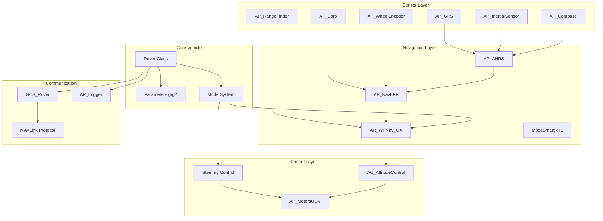
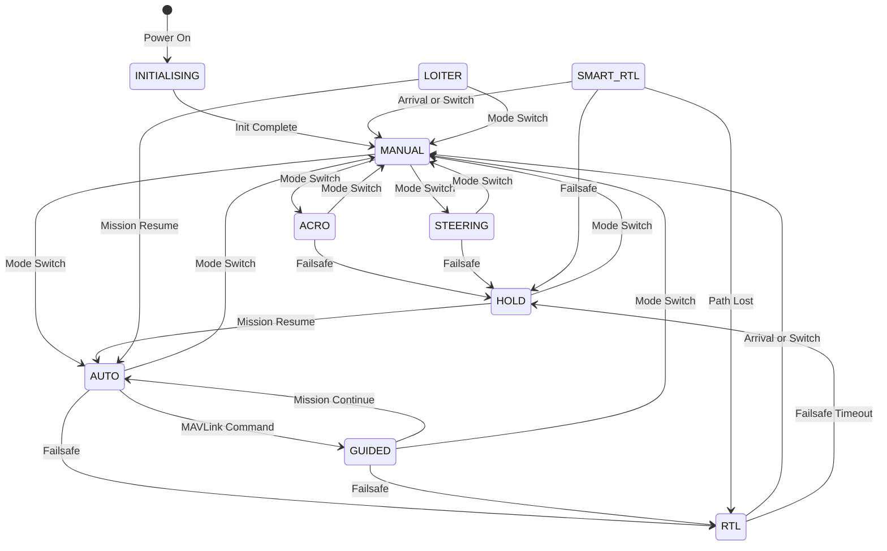
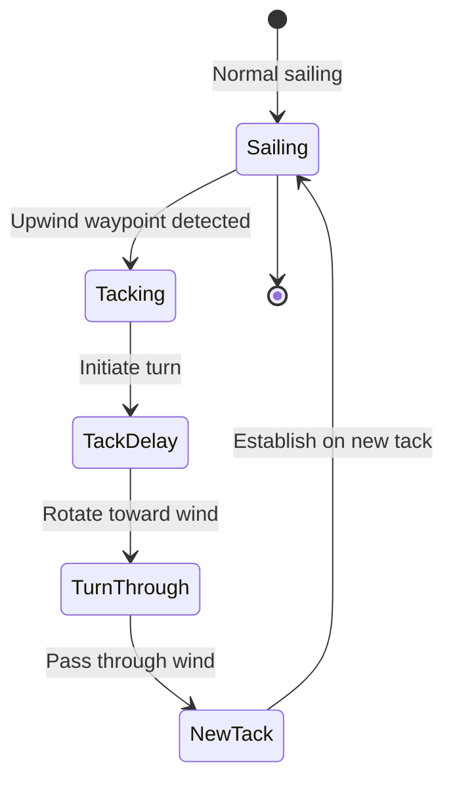

# ArduRover

 

## Table of Contents

- [Overview](#overview)
- [System Architecture](#system-architecture)
- [Navigation Modes](#navigation-modes)
- [Steering and Throttle Control](#steering-and-throttle-control)
- [Sensor Integration](#sensor-integration)
- [Autonomous Navigation](#autonomous-navigation)
- [Sailboat Support](#sailboat-support)
- [Safety Systems](#safety-systems)
- [Communication](#communication)
- [Configuration and Tuning](#configuration-and-tuning)
- [Development](#development)

## Overview

ArduRover is the ground vehicle firmware for the ArduPilot autopilot system, providing sophisticated autonomous navigation and control for wheeled vehicles, tracked vehicles, sailboats, and balance bots. Originally derived from ArduPlane, it has evolved into a mature, feature-rich system supporting a wide variety of ground-based platforms.

**Source Files**: `Rover/Rover.h`, `Rover/Rover.cpp`

### Supported Vehicle Types

- **Wheeled Vehicles**: Ackermann steering (car-like), skid-steering (differential drive)
- **Tracked Vehicles**: Tank-style steering with independent track control
- **Sailboats**: Wind-powered vessels with motor assist capabilities
- **Balance Bots**: Two-wheeled self-balancing robots
- **Boats**: Surface vessels with rudder and throttle control

### Key Features

- 13 navigation modes including manual control, autonomous missions, and intelligent return-to-launch
- Advanced path planning with obstacle avoidance
- Sophisticated steering control supporting multiple vehicle geometries
- Comprehensive sensor fusion using AP_AHRS and Extended Kalman Filter (EKF)
- Waypoint navigation with mission planning support
- Geofencing and rally point capabilities
- Sailboat-specific tacking and wind navigation
- MAVLink communication protocol integration
- Extensive parameter configuration system

### Maintainers

- Randy Mackay
- Grant Morphett

**Original Authors**: Doug Weibel, Jose Julio, Jordi Munoz, Jason Short, Andrew Tridgell, Randy Mackay, Pat Hickey, John Arne Birkeland, Olivier Adler, Jean-Louis Naudin, Grant Morphett

## System Architecture

### Main Rover Class

The `Rover` class (defined in `Rover.h`) serves as the central vehicle state container, inheriting from `AP_Vehicle`. It encapsulates all vehicle-specific subsystems, sensors, and control logic.

**Source**: `Rover/Rover.h:77`



### Scheduler and Main Loop

ArduRover uses the AP_Scheduler framework to execute tasks at precise rates. The scheduler table defines all periodic operations with their execution frequency, expected duration, and priority.

**Source**: `Rover/Rover.cpp:69-141`

#### Scheduler Task Table

The main loop scheduler runs critical tasks at rates from 1 Hz to 400 Hz:

| Task | Rate (Hz) | Duration (μs) | Priority | Purpose |
|------|-----------|---------------|----------|---------|
| `read_radio` | 50 | 200 | 3 | Read RC receiver input |
| `ahrs_update` | 400 | 400 | 6 | Update attitude estimation |
| `read_rangefinders` | 50 | 200 | 9 | Update proximity sensors |
| `update_current_mode` | 400 | 200 | 12 | Execute active mode logic |
| `set_servos` | 400 | 200 | 15 | Output motor/servo commands |
| `update_compass` | 10 | 200 | 39 | Update compass readings |
| `gcs_failsafe_check` | 10 | 200 | 81 | Monitor GCS connection |
| `fence_check` | 10 | 200 | 84 | Check geofence boundaries |
| `ekf_check` | 10 | 100 | 87 | Monitor EKF health |
| `crash_check` | 10 | 200 | 123 | Detect vehicle crash |

**Note**: Tasks are ordered by priority (lower number = higher priority). The 400 Hz tasks (`ahrs_update`, `update_current_mode`, `set_servos`) form the core control loop.

### Initialization Sequence

Vehicle initialization follows a strict sequence to ensure all subsystems are properly configured before arming.

**Source**: `Rover/system.cpp:8-150`

1. **Notification System**: Initialize LED/buzzer notifications
2. **Battery Monitor**: Configure battery sensors and failsafe thresholds
3. **Sensors**: Initialize barometer, compass, GPS, rangefinders
4. **Inertial Sensors**: Calibrate and initialize IMU
5. **Motor Control**: Configure motor outputs and servo ranges
6. **RC Input**: Setup RC channels and deadzone
7. **Wheel Encoders**: Initialize odometry sensors
8. **Navigation Systems**: Configure mission planner and SmartRTL
9. **Mode Initialization**: Set initial driving mode
10. **Scheduler**: Start main loop task execution

### Parameter System

ArduRover uses the AP_Param library for persistent parameter storage with two parameter groups:

- **Parameters g**: Core vehicle parameters (speeds, failsafe settings, modes)
- **ParametersG2**: Extended parameters for newer features (motors, navigation, sensors)

**Source**: `Rover/Rover.h:125-126`, `Rover/Parameters.cpp:9`

## Navigation Modes

ArduRover implements 13 distinct navigation modes, each optimized for specific operational requirements. Modes are organized into manual control, assisted control, and autonomous navigation categories.

**Source**: `Rover/mode.h:14-32`

### Mode Overview

| Mode | Number | Type | RC Required | Position Required | Description |
|------|--------|------|-------------|-------------------|-------------|
| **MANUAL** | 0 | Manual | Yes | No | Direct RC passthrough control |
| **ACRO** | 1 | Manual | Yes | No | Rate-controlled steering |
| **STEERING** | 3 | Assisted | Yes | No | Speed and heading control |
| **HOLD** | 4 | Autonomous | No | Yes | Maintain current position |
| **LOITER** | 5 | Autonomous | No | Yes | Circle around a point |
| **FOLLOW** | 6 | Autonomous | No | Yes | Follow another vehicle |
| **SIMPLE** | 7 | Assisted | Yes | No | Simplified heading control |
| **DOCK** | 8 | Autonomous | No | Yes | Precision docking maneuvers |
| **CIRCLE** | 9 | Autonomous | No | Yes | Circle at specified radius |
| **AUTO** | 10 | Autonomous | No | Yes | Execute waypoint missions |
| **RTL** | 11 | Autonomous | No | Yes | Return to launch location |
| **SMART_RTL** | 12 | Autonomous | No | Yes | Retrace path home intelligently |
| **GUIDED** | 15 | Autonomous | No | Yes | External computer control |



### Mode Detailed Descriptions

#### MANUAL (Mode 0)

Direct passthrough of pilot RC inputs to motors and servos. No stabilization or autonomous control is active.

**Source**: `Rover/mode_manual.cpp`

- **RC Input**: Required for all control
- **Position Estimate**: Not required
- **Arming**: Can be armed/disarmed from transmitter
- **Failsafe Behavior**: Triggers failsafe action (typically HOLD or RTL)

**Use Cases**: 
- Initial vehicle testing
- Manual control in confined spaces
- Recovery from autonomous mode issues

#### ACRO (Mode 1)

Rate-controlled steering mode where pilot stick input directly controls turn rate rather than steering angle.

**Source**: `Rover/mode_acro.cpp`

- **RC Input**: Required, throttle and steering
- **Turn Rate Control**: Steering stick position maps to desired turn rate (deg/s)
- **Throttle**: Direct throttle control without speed regulation
- **Position Estimate**: Not required

**Configuration Parameters**:
- `ACRO_TURN_RATE`: Maximum turn rate in deg/s (default: 180)

#### STEERING (Mode 3)

Assisted driving mode with speed control and heading hold. Pilot controls desired speed and heading.

**Source**: `Rover/mode_steering.cpp`

- **Speed Control**: Throttle stick sets target speed, controller maintains it
- **Heading Hold**: Steering stick sets heading, vehicle maintains it when centered
- **Position Estimate**: Not required (uses heading from compass/IMU)

**Configuration Parameters**:
- `CRUISE_SPEED`: Target cruise speed in m/s
- `CRUISE_THROTTLE`: Base throttle percentage

#### HOLD (Mode 4)

Maintains current position using GPS and steering/throttle control. Vehicle will actively resist external forces.

**Source**: `Rover/mode_hold.cpp`

- **Position Lock**: Uses GPS position at mode entry
- **Active Control**: Continuously adjusts steering/throttle to maintain position
- **Position Estimate**: Required (GPS + EKF)
- **Heading**: Maintains heading at mode entry

**Failsafe Behavior**: Common failsafe destination mode

#### LOITER (Mode 5)

Circles around a specified point at a configurable radius. Useful for persistent area monitoring.

**Source**: `Rover/mode_loiter.cpp`

- **Circle Center**: Set at mode entry or commanded via MAVLink
- **Radius**: Configurable via `WP_RADIUS` parameter
- **Direction**: Clockwise or counter-clockwise
- **Position Estimate**: Required

**Configuration Parameters**:
- `WP_RADIUS`: Loiter circle radius in meters

#### FOLLOW (Mode 6)

Follows another vehicle equipped with a MAVLink telemetry link. Maintains specified distance and bearing offset.

**Source**: Requires `MODE_FOLLOW_ENABLED` feature flag

- **Lead Vehicle**: Receives position via MAVLink GLOBAL_POSITION_INT
- **Follow Distance**: Configurable separation distance
- **Follow Angle**: Bearing offset from lead vehicle
- **Position Estimate**: Required for both vehicles

**Configuration Parameters**:
- `FOLL_ENABLE`: Enable follow mode
- `FOLL_DIST_MAX`: Maximum follow distance in meters
- `FOLL_OFS_X/Y`: Position offset from lead vehicle

#### SIMPLE (Mode 7)

Simplified control mode where steering inputs are relative to the vehicle's launch heading rather than current heading.

**Source**: `Rover/mode_simple.cpp`

- **Heading Reference**: Forward direction relative to initial heading
- **Intuitive Control**: "Up" on stick always moves toward launch heading
- **Yaw Compensation**: Automatically accounts for vehicle rotation
- **Position Estimate**: Not required

**Source**: `Rover/Rover.h:449` - `simple_sin_yaw` stores heading transformation

#### DOCK (Mode 8)

Precision docking mode using AprilTag or IR beacon for close-range navigation to a docking station.

**Source**: Requires `MODE_DOCK_ENABLED` and `AC_PRECLAND_ENABLED`

- **Visual Servoing**: Uses precision landing sensors for final approach
- **Multi-Stage**: Long-range GPS navigation transitioning to precision docking
- **Automatic**: Fully autonomous from command to docked
- **Position Estimate**: Required (GPS + vision sensor)

**Source**: `Rover/precision_landing.cpp` for sensor integration

#### CIRCLE (Mode 9)

Similar to LOITER but with additional configuration options for automated circular patterns.

**Source**: Part of loiter implementation

- **Configurable Speed**: Circle rate can be adjusted
- **Radius Control**: Precise radius maintenance
- **Position Estimate**: Required

#### AUTO (Mode 10)

Executes predefined waypoint missions loaded from ground control station. Supports complex mission commands.

**Source**: `Rover/mode_auto.cpp`

- **Mission Execution**: Follows uploaded mission commands
- **Waypoint Navigation**: Uses AR_WPNav for path following
- **Mission Commands Supported**:
  - NAV_WAYPOINT: Navigate to waypoint
  - NAV_RETURN_TO_LAUNCH: Return home
  - DO_CHANGE_SPEED: Adjust target speed
  - DO_SET_SERVO: Control servo outputs
  - DO_SET_RELAY: Control relay outputs
  - CONDITION_DELAY: Wait for specified time
  - CONDITION_DISTANCE: Wait until distance traveled

- **Position Estimate**: Required
- **Arming**: Cannot be armed from transmitter

**Source**: `Rover/mode_auto.cpp` for mode implementation, `AP_Mission` library for mission handling

**Configuration Parameters**:
- `WP_SPEED`: Default waypoint navigation speed
- `WP_RADIUS`: Waypoint completion radius
- `WP_OVERSHOOT`: How far to overshoot waypoints on tight turns

#### RTL - Return to Launch (Mode 11)

Returns vehicle to launch location (or rally point) via straight-line navigation.

**Source**: `Rover/mode_rtl.cpp`

- **Home Location**: Returns to GPS location where vehicle was armed
- **Rally Points**: Can optionally use closest rally point instead
- **Direct Path**: Navigates in straight line to destination
- **Completion**: Switches to HOLD upon arrival
- **Position Estimate**: Required

**Configuration Parameters**:
- `RTL_SPEED`: Return speed in m/s (uses CRUISE_SPEED if 0)
- `WP_RADIUS`: Arrival detection radius

**Failsafe Behavior**: Common failsafe destination mode

#### SMART_RTL - Smart Return to Launch (Mode 12)

Intelligently retraces the vehicle's path back to launch, avoiding obstacles encountered on outbound journey.

**Source**: `Rover/mode_smartrtl.cpp`, `AP_SmartRTL` library

- **Path Recording**: Continuously saves breadcrumb trail during operation
- **Path Following**: Retraces recorded path in reverse
- **Memory Limited**: Stores limited number of points (configurable)
- **Fallback**: Switches to RTL if path data unavailable
- **Position Estimate**: Required

**How It Works**:
1. **Path Recording**: Saves position points at regular intervals during all modes
2. **Simplification**: Removes unnecessary points to conserve memory (Douglas-Peucker algorithm)
3. **Return**: When activated, follows saved points in reverse order
4. **Cleanup**: Clears path upon reaching home

**Configuration Parameters**:
- `SRTL_POINTS`: Maximum number of path points (0-500)
- `SRTL_ACCURACY`: Path simplification accuracy in meters

**Source**: Scheduler saves positions at 3 Hz via `mode_smartrtl.save_position()` (Rover.cpp:121)

#### GUIDED (Mode 15)

Accepts real-time navigation commands from external computer or GCS via MAVLink. Enables sophisticated autonomous behaviors.

**Source**: `Rover/mode_guided.cpp`

- **External Control**: Commands via MAVLink protocol
- **Supported Commands**:
  - SET_POSITION_TARGET_GLOBAL_INT: Navigate to lat/lon/alt
  - SET_POSITION_TARGET_LOCAL_NED: Navigate in local frame
  - SET_ATTITUDE_TARGET: Direct steering/throttle control
  - DO_REPOSITION: Move to new position

- **Position Estimate**: Required
- **Real-Time**: Accepts continuous command updates

**Use Cases**:
- Companion computer control
- Computer vision-based navigation
- ROS/DroneKit integration
- Custom autonomous behaviors via scripting

**Source**: `AP_ExternalControl_Rover` for scripting interface (Rover.h:49, 152-154)

### Mode Transitions

Mode changes can be triggered by:

1. **RC Mode Switch**: Pilot selects mode via configured RC channel (`MODE_CH` parameter)
2. **GCS Command**: Ground station sends MAVLink SET_MODE command
3. **Failsafe**: Automatic transition to failsafe mode (HOLD or RTL)
4. **Mission Command**: AUTO mode can trigger GUIDED or RTL
5. **Geofence**: Fence breach triggers configured action mode
6. **Scripting**: Lua scripts can request mode changes

**Source**: `Rover/system.cpp:390-396` - `set_mode()` functions handle all transitions

**Mode Change Validation**:
- Position estimate required for autonomous modes (checked in `mode.cpp:24-41`)
- Velocity estimate validated for navigation modes
- EKF health checked before mode entry
- Arming state affects mode availability

## Steering and Throttle Control

ArduRover supports multiple steering geometries and throttle control strategies, automatically adapting to the configured vehicle frame type.

**Source**: `Rover/Steering.cpp`, `AR_Motors` library

### Vehicle Frame Types

**Source**: `Rover.h:445` - `get_frame_type()`, `AR_Motors/AP_MotorsUGV.h`

The frame type determines how steering and throttle commands are translated to motor outputs:

1. **Undefined** (0): Motors not configured
2. **Ackermann Steering** (1): Car-like steering with front wheel angle
3. **Skid Steering** (2): Differential drive (tank steering)
4. **Omni** (3): Omnidirectional with mecanum/omni wheels
5. **Torque Vectoring** (4): Independent wheel speed control
6. **Walking Robot** (5): Multi-legged robot control

**Configuration**: Set via `FRAME_TYPE` parameter in g2 parameter group

### Ackermann Steering

Car-like steering geometry with steerable front wheels and driven rear (or all) wheels.

**Mathematical Model**:

The Ackermann steering geometry requires different steering angles for inside and outside wheels during turns to avoid tire scrub:

```
tan(δ_inside) = L / (R - W/2)
tan(δ_outside) = L / (R + W/2)

Where:
  δ = steering angle
  L = wheelbase length
  R = turn radius
  W = track width (axle width)
```

**Configuration Parameters**:
- `ATC_STR_RAT_MAX`: Maximum steering angle (degrees)
- `ATC_STR_ANG_P`: Steering angle controller P gain
- `WHEELBASE`: Distance between front and rear axles (meters)
- `TRACK_WIDTH`: Distance between left and right wheels (meters)

**Source**: `libraries/AR_AttitudeControl/AR_AttitudeControl.cpp` for steering calculations

### Skid Steering

Differential drive where left and right wheel speeds create rotation. Used for tracked vehicles and differential drive robots.

**Control Equations**:

```
left_motor = throttle - steering
right_motor = throttle + steering

turn_rate = (right_speed - left_speed) / track_width
```

**Advantages**:
- Zero turn radius capability
- Simple mechanical design
- Robust for rough terrain

**Configuration Parameters**:
- `SKID_STEER_OUT`: Enable skid steering output
- `MOT_THST_EXPO`: Throttle expo curve for non-linear response
- `ATC_TURN_MAX_G`: Maximum lateral acceleration during turns

### Throttle Control Strategies

#### Speed Control

Closed-loop speed controller maintains desired velocity using wheel encoders, GPS, or optical flow.

**Source**: `mode.cpp:180-183` - `calc_throttle()`, `AR_AttitudeControl` library

**PID Control Loop**:
```
error = target_speed - current_speed
throttle = Kp * error + Ki * integral(error) + Kd * derivative(error) + FF * target_speed
```

**Configuration Parameters**:
- `CRUISE_SPEED`: Target cruise speed (m/s)
- `CRUISE_THROTTLE`: Feed-forward throttle estimate (%)
- `ATC_SPEED_P/I/D`: Speed controller PID gains
- `ATC_SPEED_FF`: Speed controller feedforward gain

#### Throttle Curves and Limiting

**Slew Rate Limiting**: Prevents aggressive throttle changes that could cause wheel slip

**Source**: `AR_MotorsUGV::output()` applies slew limiting

**Configuration Parameters**:
- `MOT_SLEWRATE`: Maximum throttle change per second (%)
- `MOT_SPD_SCA_BASE`: Throttle to speed scaling base
- `MOT_THR_MIN`: Minimum throttle when armed (%)
- `MOT_THR_MAX`: Maximum throttle (%)

### Cruise Learning

Automatic calibration of the relationship between throttle and vehicle speed. Improves speed control accuracy.

**Source**: `Rover/cruise_learn.cpp`

**Learning Process**:
1. **Activation**: Hold throttle steady in MANUAL or ACRO mode
2. **Data Collection**: Records throttle and resulting speed over 2-second filter window
3. **Calibration**: Updates `CRUISE_THROTTLE` and `CRUISE_SPEED` parameters
4. **Logging**: Records cruise learning events to dataflash log

**Source**: `Rover/cruise_learn.cpp:307-310` - learning functions, scheduler runs at 50 Hz (Rover.cpp:137)

**Configuration**:
- Automatic when driving at steady throttle
- Requires wheel encoders or GPS velocity
- Updates stored in `CRUISE_SPEED` and `CRUISE_THROTTLE` parameters

### Balance Bot Control

Two-wheeled self-balancing robot support with active pitch stabilization.

**Source**: `Rover/balance_bot.cpp`

**Control Strategy**:
- **Pitch Control**: Maintains upright balance using IMU pitch angle
- **Velocity Control**: Tilts forward/backward to achieve desired speed
- **Steering**: Differential wheel speeds for rotation

**Source**: `Rover/balance_bot.cpp:295-296` - `balancebot_pitch_control()` and `is_balancebot()` check

**Configuration Parameters**:
- `BAL_PITCH_MAX`: Maximum pitch angle during motion
- Requires `FRAME_TYPE` configured for balance bot

### Steering Input Types

Multiple pilot input interpretation modes for different operator preferences.

**Source**: `Rover/mode.cpp:70-100`, `Parameters.cpp:84-89`

**PILOT_STEER_TYPE Parameter Options**:

1. **Default (0)**: Steering direction reverses when backing up
   - Forward: right stick = right turn
   - Reverse: right stick = left turn (intuitive backing)

2. **Two Paddles (1)**: Each stick controls one side independently
   - Left stick = left side motors
   - Right stick = right side motors
   - Tank-style control

3. **Direction Reversed When Backing Up (2)**: Same as Default

4. **Direction Unchanged When Backing Up (3)**: Steering direction constant
   - Right stick always means right turn, regardless of direction

**Source**: `mode.cpp:72-99` - `get_pilot_input()` implements steering type logic

## Sensor Integration

ArduRover integrates data from multiple sensor types to provide robust state estimation and environmental awareness.

**Source**: `Rover/sensors.cpp`, `Rover/system.cpp:8-150`

### Primary Sensors

#### GPS Navigation

**Source**: `AP_GPS` library, initialized in `system.cpp:66-67`

- **Supported Protocols**: 
  - u-blox (UBX)
  - NMEA
  - SBF (Septentrio)
  - GSOF (Trimble)
  - ERB (SwiftNav)
  - MAVLink GPS
  - MSP GPS
  - NOVA (NovAtel)

- **Features**:
  - Multi-GPS support (blending up to 2 GPS units)
  - RTK corrections via RTCM injection
  - GPS-for-yaw (dual GPS heading)
  - Automatic GPS switching on failure

- **Update Rate**: 50 Hz scheduler task (Rover.cpp:81)

**Configuration Parameters**:
- `GPS_TYPE`: GPS protocol selection
- `GPS_GNSS_MODE`: GNSS constellation selection (GPS, GLONASS, Galileo, BeiDou)
- `GPS_AUTO_SWITCH`: Automatic GPS switching threshold
- `GPS_BLEND_MASK`: GPS blending control

**Source**: Processes GPS updates in scheduler at 50 Hz

#### Inertial Measurement Unit (IMU)

**Source**: `AP_InertialSensor` library, `system.cpp:69`

- **Sensors**: 3-axis accelerometer and 3-axis gyroscope
- **Sample Rate**: 1000+ Hz raw sampling, 400 Hz to AHRS
- **Filtering**: Notch filters for motor noise rejection
- **Calibration**: Accelerometer calibration, gyro offset learning

**Scheduler Integration**: 
- Periodic updates at 400 Hz (Rover.cpp:129)
- IMU data logged via MASK_LOG_IMU bit

**Configuration Parameters**:
- `INS_GYRO_FILTER`: Gyro low-pass filter frequency (Hz)
- `INS_ACCEL_FILTER`: Accelerometer low-pass filter frequency (Hz)
- `INS_USE`: Select which IMU to use (for redundant IMU systems)

#### Compass (Magnetometer)

**Source**: `AP_Compass` library, `system.cpp:38-39`

- **Purpose**: Heading reference for navigation
- **Update Rate**: 10 Hz (Rover.cpp:91)
- **Calibration**: Offsets and scaling calibration required
- **Redundancy**: Supports multiple compass units with health monitoring

**Configuration Parameters**:
- `COMPASS_ENABLE`: Enable/disable compass
- `COMPASS_USE`: Select active compass (for redundancy)
- `COMPASS_AUTO_ROT`: Automatic compass orientation detection
- `COMPASS_DEC`: Manual magnetic declination (if GPS not available)

**Source**: `sensors.cpp:371` - `update_compass()` runs at 10 Hz

#### Barometer

**Source**: `AP_Baro` library, `system.cpp:28, 62-63`

- **Purpose**: Altitude estimation (less critical for ground vehicles)
- **Update Rate**: 10 Hz (Rover.cpp:82)
- **Integration**: Provides altitude data to EKF for 3D navigation
- **Calibration**: Ground level calibration on boot

### Odometry and Wheel Encoders

**Source**: `AP_WheelEncoder` library, `Rover/sensors.cpp:372`

Wheel encoders provide accurate short-term velocity and distance estimation, crucial for GPS-denied environments.

**Features**:
- **Dual Encoder Support**: Independent left/right wheel tracking
- **EKF Integration**: Fused with GPS for improved position estimation
- **Distance Tracking**: Accumulated distance per wheel
- **Health Monitoring**: Detects encoder failures

**Update Rate**: 50 Hz (Rover.cpp:90)

**Source**: `sensors.cpp:373-409` - `update_wheel_encoder()` implementation

**Encoder Processing**:
```cpp
// Rover/sensors.cpp:384-398
// Updates each wheel encoder and sends data to EKF
for (uint8_t i = 0; i < num_encoders; i++) {
    // Get distance traveled in radians
    float delta_angle = encoder.get_delta_angle(i);
    
    // Send to EKF for velocity estimation
    ahrs.writeWheelOdom(delta_angle, ...);
}
```

**Configuration Parameters**:
- `WENC_TYPE`: Encoder type (quadrature, etc.)
- `WENC_CPR`: Counts per revolution
- `WENC_RADIUS`: Wheel radius in meters
- `WENC_POS_X/Y/Z`: Encoder position relative to vehicle center

### Rangefinders (Proximity Sensors)

**Source**: `AP_RangeFinder` library, `Rover/sensors.cpp:374-375`

Rangefinders detect obstacles for collision avoidance and depth measurement (for boats).

**Supported Sensor Types**:
- Analog voltage sensors
- MaxBotix I2C/Serial
- Lightware I2C/Serial
- TeraRanger I2C
- Benewake TFmini/TFmini Plus
- Lanbao CM8JL65
- Leddar One
- uLanding Radar

**Update Rate**: 50 Hz (Rover.cpp:74)

**Source**: `sensors.cpp:375-399` - `read_rangefinders()` and logging

**Use Cases**:
- **Obstacle Detection**: Simple collision avoidance
- **Object Avoidance**: Path planning around obstacles
- **Depth Measurement**: Water depth for boats (DPTH log messages)

**Configuration Parameters**:
- `RNGFND1_TYPE`: Rangefinder sensor type
- `RNGFND1_ORIENT`: Sensor mounting orientation
- `RNGFND1_MIN_CM`: Minimum reliable range
- `RNGFND1_MAX_CM`: Maximum detection range
- `RNGFND1_STOP_PIN`: Digital pin for emergency stop signal

### Optical Flow

**Source**: `AP_OpticalFlow` library, enabled with `AP_OPTICALFLOW_ENABLED`

Optical flow sensors track ground texture movement for velocity estimation when GPS is unavailable.

**Features**:
- **Ground Velocity**: Estimates X/Y velocity from ground texture
- **Indoor Navigation**: Enables GPS-denied operation
- **Complementary**: Works with rangefinder for scale determination

**Update Rate**: 200 Hz (Rover.cpp:77)

**Configuration Parameters**:
- `FLOW_TYPE`: Optical flow sensor type
- `FLOW_ORIENT_YAW`: Sensor yaw orientation (degrees)

### Sensor Fusion - AHRS and EKF

#### Attitude Heading Reference System (AHRS)

**Source**: `AP_AHRS` library, updated at 400 Hz (Rover.cpp:72)

AHRS combines IMU, compass, GPS data to estimate vehicle attitude and heading.

**Provides**:
- Roll, pitch, yaw angles
- Angular rates
- Earth frame transformations
- Gravity vector estimation

**Source**: `Rover.cpp:287` - `ahrs_update()` called at 400 Hz main loop rate

**Configuration**:
- `AHRS_EKF_TYPE`: Select EKF version (EKF2, EKF3, DCM fallback)
- `AHRS_GPS_USE`: GPS usage for velocity/position

#### Extended Kalman Filter (EKF)

**Source**: `AP_NavEKF2`, `AP_NavEKF3` libraries

The EKF fuses all sensor inputs (GPS, IMU, compass, wheel encoders, optical flow) into optimal state estimate.

**State Vector Includes**:
- Position (North, East, Down)
- Velocity (N, E, D)
- Attitude quaternion
- Gyro biases
- Accelerometer biases
- Wind velocity (for sailboats)
- Magnetic field

**Health Monitoring**: EKF health checked at 10 Hz (Rover.cpp:120)

**Source**: `Rover/ekf_check.cpp:313-317` - EKF health monitoring

**EKF Health Checks**:
```cpp
// Rover/ekf_check.cpp:314-327
bool Rover::ekf_over_threshold() {
    // Check velocity and position variance against thresholds
    // Returns true if EKF estimates are unreliable
    return (velVariance >= threshold) || (posVariance >= threshold);
}
```

**Configuration Parameters**:
- `EKF3_ENABLE`: Enable EKF3
- `EKF3_IMU_MASK`: Select which IMUs to use
- `EKF3_GPS_TYPE`: GPS fusion mode
- `EKF3_SRC1_POSXY/VELXY/YAW`: Primary source for position/velocity/yaw

**EKF Failsafe**: 
- Monitors variance thresholds (FS_EKF_THRESH parameter)
- Triggers failsafe action if EKF unhealthy for extended period
- See [Safety Systems](#safety-systems) section

## Autonomous Navigation

ArduRover's autonomous navigation system integrates waypoint following, path planning, and obstacle avoidance for sophisticated unmanned operations.

### Waypoint Navigation (AR_WPNav)

**Source**: `AR_WPNav_OA` library (AR_WPNav with Obstacle Avoidance)

The waypoint navigation library calculates steering and speed commands to reach target locations while respecting vehicle dynamics.

**Key Algorithms**:

1. **L1 Controller**: Geometric path following algorithm
   ```
   L1 = desired_turn_radius
   eta = atan2(crosstrack_error, lookahead_distance)
   lateral_acceleration = 2 * speed^2 * sin(eta) / L1
   ```

2. **Pure Pursuit**: Alternative path following method using lookahead point on path

3. **Pivot Turn**: Rotate in place before forward motion (configurable)

**Features**:
- **Lookahead Distance**: Dynamic adjustment based on speed
- **Crosstrack Correction**: Actively corrects for path deviations
- **Speed Scaling**: Slows for sharp corners
- **Overshoot Handling**: Configurable overshoot on turns

**Configuration Parameters**:
- `WP_RADIUS`: Waypoint completion radius (meters)
- `WP_SPEED`: Target waypoint navigation speed (m/s)
- `WP_OVERSHOOT`: Overshoot distance on corners (meters)
- `WP_PIVOT_ANGLE`: Angle threshold for pivot turns (degrees)
- `WP_PIVOT_RATE`: Pivot turn rate (deg/s)

**Source**: Navigation calculations in `AR_WPNav::update()` called from mode update functions

### Mission Planning

**Source**: `AP_Mission` library, initialized in `system.cpp:127`

Missions consist of sequences of commands defining autonomous behavior:

**Supported Mission Commands**:

| Command | ID | Description |
|---------|----| ------------|
| NAV_WAYPOINT | 16 | Navigate to waypoint coordinate |
| NAV_LOITER_UNLIM | 17 | Loiter at location indefinitely |
| NAV_LOITER_TIME | 19 | Loiter for specified time (seconds) |
| NAV_RETURN_TO_LAUNCH | 20 | Return to home location |
| NAV_LOITER_TURNS | 18 | Complete specified number of circles |
| NAV_GUIDED_ENABLE | 92 | Enable/disable guided mode |
| NAV_SET_YAW_SPEED | 213 | Set heading and speed |
| DO_JUMP | 177 | Jump to mission item (loop) |
| DO_CHANGE_SPEED | 178 | Change target speed |
| DO_SET_HOME | 179 | Set new home location |
| DO_SET_SERVO | 183 | Control servo output |
| DO_SET_RELAY | 181 | Control relay output |
| DO_REPEAT_SERVO | 184 | Repeat servo sequence |
| DO_REPEAT_RELAY | 182 | Repeat relay sequence |
| DO_DIGICAM_CONTROL | 203 | Trigger camera |
| DO_MOUNT_CONTROL | 205 | Point camera mount |
| CONDITION_DELAY | 112 | Wait for time (seconds) |
| CONDITION_DISTANCE | 114 | Wait until distance traveled |

**Mission Storage**: Missions stored in non-volatile memory, survives power cycles

**Mission Monitoring**: Progress logged to dataflash (MASK_LOG_CMD)

### Path Planning and Obstacle Avoidance

**Source**: `AP_OAPathPlanner` library (Object Avoidance), enabled with `AP_OAPATHPLANNER_ENABLED`

Advanced path planning adjusts routes dynamically to avoid detected obstacles.

**Algorithms**:

1. **Dijkstra**: Graph-based path finding through obstacle field
2. **Bendyruler**: Dynamic path bending around immediate obstacles

**Object Detection Sources**:
- Rangefinders (proximity sensors)
- MAVLink OBSTACLE_DISTANCE messages
- Proximity sensors (360° LIDAR)

**Configuration Parameters**:
- `OA_TYPE`: Obstacle avoidance algorithm (0=Disabled, 1=BendyRuler, 2=Dijkstra)
- `OA_LOOKAHEAD`: Lookahead distance for detection (meters)
- `OA_MARGIN_MAX`: Maximum distance around obstacles (meters)

**Integration**: AR_WPNav_OA combines waypoint navigation with obstacle avoidance

### Geofence

**Source**: `AC_Fence` library, enabled with `AP_FENCE_ENABLED`

Geofences define virtual boundaries that trigger actions when breached.

**Fence Types**:

1. **Circular Fence**: Radius around home location
2. **Polygon Fence**: Arbitrary polygon boundary (up to 84 vertices)
3. **Min/Max Altitude**: Vertical limits (for vehicles with altitude control)

**Fence Actions**:
- **Report Only**: Log breach but continue mission
- **Hold**: Stop vehicle at breach point
- **RTL**: Return to launch
- **SmartRTL**: Retrace path home

**Health Monitoring**: Checked at 10 Hz (Rover.cpp:118)

**Configuration Parameters**:
- `FENCE_ENABLE`: Enable geofence system
- `FENCE_TYPE`: Fence type mask (1=circle, 2=polygon, 4=altitude)
- `FENCE_ACTION`: Action on breach
- `FENCE_RADIUS`: Circular fence radius (meters)
- `FENCE_MARGIN`: Distance from fence to trigger (meters)

**Source**: `fence.cpp:326-329` - fence checking implementation

### Rally Points

**Source**: `AP_Rally` library, `AP_Rally_Rover` class

Rally points provide alternative return locations, automatically selecting the closest point.

**Features**:
- Multiple rally point storage
- Automatic closest point selection in RTL
- Stored in non-volatile memory
- Uploaded via ground station

**Configuration Parameters**:
- `RALLY_TOTAL`: Number of rally points stored
- `RALLY_LIMIT_KM`: Maximum distance from home for rally points

## Sailboat Support

ArduRover includes sophisticated sailboat-specific features for wind-powered navigation with optional motor assist.

**Source**: `Rover/sailboat.h`, `Rover/sailboat.cpp`

### Wind Sensing

**Source**: `AP_WindVane` library, updated at 20 Hz (Rover.cpp:89)

Wind vane provides apparent wind speed and direction for sail control and navigation.

**Supported Wind Sensors**:
- Analog voltage wind vane (potentiometer)
- Modern Devices wind sensor
- NMEA wind data
- Sitl simulated wind
- RPM-based wind speed sensor

**Configuration Parameters**:
- `WNDVN_TYPE`: Wind vane sensor type
- `WNDVN_DIR_PIN`: Analog pin for wind direction
- `WNDVN_SPEED_PIN`: Analog pin for wind speed
- `WNDVN_SPEED_MIN`: Minimum wind speed (m/s)

### Sail Control

Mainsail position is controlled via RC output channel, adjusted based on apparent wind angle.

**Source**: `sailboat.cpp:39` - `get_throttle_and_set_mainsail()`

**Sail Angle Calculation**:

```cpp
// Simplified sail control logic
if (abs(apparent_wind_angle) < no_go_angle) {
    // In irons - sail ineffective
    sail_angle = 0;  // Feather sail
} else {
    // Scale sail angle based on wind angle
    sail_angle = constrain(
        map(apparent_wind_angle, no_go_angle, 90°, 
            sail_angle_min, sail_angle_ideal)
    );
}
```

**Configuration Parameters**:
- `SAIL_ENABLE`: Enable sailboat features
- `SAIL_ANGLE_MIN`: Minimum sail angle (degrees)
- `SAIL_ANGLE_MAX`: Maximum sail angle (degrees)
- `SAIL_ANGLE_IDEAL`: Ideal sail angle for reaching (degrees)
- `SAIL_NO_GO`: No-go zone angle (degrees, typically 45°)

**Source**: Sail parameters defined in `sailboat.h:100-108`

### Tacking Logic

Tacking is the maneuver to sail upwind by zigzagging through the wind's no-go zone.

**Source**: `sailboat.h:44-64` - tacking methods

**Tacking Modes**:

1. **Manual Tack (ACRO Mode)**: 
   - Pilot triggers tack via auxiliary switch
   - Vehicle rotates through wind to opposite tack
   - `handle_tack_request_acro()` manages manual tack

2. **Autonomous Tack (AUTO/GUIDED)**:
   - Automatic when waypoint is upwind
   - Zigzag pattern toward destination
   - `handle_tack_request_auto()` manages autonomous tack

**Tacking Process**:


**Tack Assist**: Motor can assist tack in light wind conditions

**Source**: `sailboat.cpp:95-98` - `motor_assist_tack()` for motor assist logic

**Configuration Parameters**:
- `SAIL_XTRACK_MAX`: Maximum crosstrack error during tacking (meters)
- `LOIT_RADIUS`: Loiter radius for sailboat (typically larger than powered)

### Motor Policies

Sailboats can have auxiliary motors with configurable usage policies.

**Source**: `sailboat.h:66-74` - `UseMotor` enum and `set_motor_state()`

**Motor Usage Modes**:

1. **Never (0)**: Pure sailing, motor disabled
2. **Assist (1)**: Motor assists in specific situations:
   - Tacking in light wind
   - Wind speed below threshold
   - Return to launch (RTL)
3. **Always (2)**: Motor always available (motor-sailer mode)

**Motor Assist Conditions**:
- **Low Wind**: When wind speed < `SAIL_WNDSPD_MIN`
- **Tack Assist**: During tacks if `tack_assist` flag set
- **No-Go Zone**: When attempting to sail too close to wind

**Configuration Parameters**:
- `SAIL_USE_MOTOR`: Motor usage policy (0=Never, 1=Assist, 2=Always)
- `SAIL_WNDSPD_MIN`: Minimum wind speed before motor assist (m/s)

### Heel Angle Limiting

Safety feature to prevent excessive heel (lean) in strong winds by feathering the sail.

**Configuration Parameters**:
- `SAIL_HEEL_MAX`: Maximum acceptable heel angle (degrees)

### Wind-Based Navigation

Sailboat navigation automatically adjusts routes to account for wind direction and no-go zones.

**Source**: `sailboat.h:59-63` - `use_indirect_route()` and `calc_heading()`

**Smart Routing**:
- Detects when waypoint is upwind (within no-go zone)
- Automatically plans tacking route
- Calculates optimal heading to make progress toward waypoint
- Adjusts course based on wind shifts

**Algorithm**:
```cpp
// Simplified upwind navigation
if (waypoint_in_no_go_zone(desired_heading)) {
    // Calculate best tack angle
    if (port_tack_better) {
        heading = wind_direction - optimal_tack_angle;
    } else {
        heading = wind_direction + optimal_tack_angle;
    }
}
```

## Safety Systems

ArduRover implements multiple layers of safety systems to prevent damage and ensure safe operation.

### Arming System

**Source**: `AP_Arming_Rover` class, `Rover.h:149`

Arming checks verify vehicle safety before allowing motor operation.

**Pre-Arm Checks** (performed before arming allowed):
- **RC Calibration**: RC channels properly calibrated
- **Compass Health**: Compass connected and initialized
- **GPS Lock**: Sufficient GPS satellites for navigation modes
- **INS Calibration**: Accelerometer calibration complete
- **Battery**: Battery voltage above minimum threshold
- **Geofence**: Fence loaded correctly if enabled
- **Parameter Validation**: Critical parameters within valid ranges
- **EKF Health**: EKF initialized and converged

**Arming Methods**:
1. **RC Stick**: Rudder right + throttle down (configurable)
2. **Auxiliary Switch**: Dedicated arm/disarm switch
3. **MAVLink**: Ground station arm command
4. **Auto-Arm**: Automatic arming in AUTO mode (if configured)

**Configuration Parameters**:
- `ARMING_CHECK`: Bitmask of checks to perform
- `ARMING_REQUIRE`: Require specific conditions (e.g., GPS lock)

### Failsafe System

**Source**: `Rover/failsafe.cpp`, parameters in `Parameters.cpp:91-148`

Failsafes detect abnormal conditions and take protective actions.

**Failsafe Types**:

#### 1. RC Throttle Failsafe

Triggers when RC signal is lost or throttle channel drops below threshold.

**Detection**: Throttle PWM < `FS_THR_VALUE` for `FS_TIMEOUT` seconds

**Configuration**:
- `FS_THR_ENABLE`: Enable throttle failsafe (0=Disabled, 1=Enabled, 2=Continue mission)
- `FS_THR_VALUE`: PWM threshold (default: 910)
- `FS_TIMEOUT`: Persistence time before trigger (seconds, default: 1.5)

**Source**: Checked in `radio.cpp:368` - `radio_failsafe_check()`

#### 2. GCS Failsafe

Triggers when ground control station telemetry link is lost.

**Detection**: No MAVLink heartbeat received for `FS_TIMEOUT` seconds

**Configuration**:
- `FS_GCS_ENABLE`: Enable GCS failsafe (0=Disabled, 1=Enabled, 2=Continue mission)

**Source**: Checked at 10 Hz (Rover.cpp:116) in `gcs_failsafe_check()`

#### 3. EKF Failsafe

Triggers when Extended Kalman Filter reports unhealthy state estimate.

**Detection**: EKF variance exceeds `FS_EKF_THRESH` threshold

**Configuration**:
- `FS_EKF_ACTION`: Action to take (0=Disabled, 1=Hold, 2=ReportOnly)
- `FS_EKF_THRESH`: Variance threshold (0.6=Strict, 0.8=Default, 1.0=Relaxed)

**Source**: `Rover/ekf_check.cpp:313-317` - EKF health monitoring at 10 Hz

**EKF Failsafe Logic**:
```cpp
// ekf_check.cpp:314-327
if (ekf_over_threshold()) {
    if (failsafe_timer > threshold_duration) {
        trigger_ekf_failsafe();
    }
} else {
    // EKF recovered
    clear_ekf_failsafe();
}
```

#### 4. Battery Failsafe

Triggers at critical battery voltage or remaining capacity levels.

**Detection Levels**:
- **Low Battery**: Warning to pilot
- **Critical Battery**: Triggers failsafe action
- **Capacity**: Based on consumed mAh

**Configuration**:
- `BATT_LOW_VOLT`: Low battery voltage threshold (V)
- `BATT_CRT_VOLT`: Critical battery voltage threshold (V)
- `BATT_LOW_MAH`: Low battery capacity threshold (mAh)
- `BATT_CRT_MAH`: Critical battery capacity threshold (mAh)
- `BATT_FS_LOW_ACT`: Low battery action
- `BATT_FS_CRT_ACT`: Critical battery action

**Source**: `Rover/failsafe.cpp:321` - `handle_battery_failsafe()` callback

#### 5. Crash Detection

Detects vehicle crash or roll-over and takes protective action.

**Detection Criteria**:
- Sudden deceleration (impact detection)
- Excessive roll/pitch angle
- Loss of control authority

**Configuration**:
- `FS_CRASH_CHECK`: Crash detection action (0=Disabled, 1=Hold, 2=HoldAndDisarm)

**Source**: Checked at 10 Hz (Rover.cpp:136) in `crash_check()`

### Failsafe Actions

**Source**: `Rover.h:409-417` - `FailsafeAction` enum

When failsafe triggers, vehicle performs configured action:

| Action | Value | Behavior |
|--------|-------|----------|
| **None** | 0 | Continue current operation |
| **RTL** | 1 | Return to launch location |
| **Hold** | 2 | Stop and maintain position |
| **SmartRTL** | 3 | Retrace path home, fallback to RTL |
| **SmartRTL_Hold** | 4 | Retrace path home, fallback to Hold |
| **Terminate** | 5 | Immediate motor shutdown |
| **Loiter_Hold** | 6 | Loiter if possible, otherwise Hold |

**Failsafe Priority**: Higher priority failsafes override lower priority

**Source**: `Rover.h:423-431` - `_failsafe_priorities[]` defines precedence

**Priority Order** (highest to lowest):
1. Terminate
2. Hold
3. RTL
4. SmartRTL_Hold
5. SmartRTL
6. None

### Geofence Breach Handling

**Source**: `fence.cpp:327` - `fence_check()` function

When vehicle breaches geofence boundary:

1. **Detection**: Geofence breach detected at 10 Hz check rate
2. **Action**: Configured `FENCE_ACTION` executed
3. **Recovery**: Once inside fence, normal operation resumes (if configured)

**Fence Actions**:
- **Report Only (0)**: Log breach, continue operation
- **RTL (1)**: Return to launch
- **Hold (2)**: Stop at breach location
- **SmartRTL (3)**: Retrace path home
- **Brake (4)**: Emergency brake (immediate stop)

### Emergency Stop

RC input or digital pin can trigger immediate motor shutdown for emergency situations.

**Triggers**:
- RC auxiliary channel assigned to "Emergency Stop" function
- Digital pin configured as emergency stop input
- MAVLink command

**Behavior**: Immediate disarm, requires manual re-arming

## Communication

ArduRover communicates with ground control stations, companion computers, and other vehicles using industry-standard protocols.

### MAVLink Protocol

**Source**: `GCS_MAVLink_Rover`, `GCS_Rover` classes (Rover.h:67-68, 167-168)

MAVLink (Micro Air Vehicle Link) is the primary communication protocol.

**Supported MAVLink Features**:
- **Telemetry Streaming**: Configurable data streams to GCS
- **Mission Upload/Download**: Waypoint mission synchronization
- **Parameter Management**: Read/write parameter values
- **Command Handling**: Real-time vehicle commands
- **Log Download**: Download dataflash logs via MAVLink
- **Fence Upload/Download**: Geofence boundary transfer
- **Rally Point Upload/Download**: Rally point synchronization

**Update Rate**: 
- Receive: 400 Hz (Rover.cpp:96)
- Send: 400 Hz (Rover.cpp:97)

**Message Streams**:

| Stream | Contents | Typical Rate |
|--------|----------|--------------|
| **RAW_SENSORS** | IMU, compass, barometer | 2 Hz |
| **EXTENDED_STATUS** | Mode, battery, arming | 2 Hz |
| **RC_CHANNELS** | RC input values | 2 Hz |
| **POSITION** | GPS position, altitude | 2 Hz |
| **EXTRA1** | Attitude | 4 Hz |
| **EXTRA2** | VFR_HUD | 4 Hz |
| **EXTRA3** | AHRS, system status | 2 Hz |

**Configuration Parameters**:
- `SRx_RAW_SENS`: Raw sensors stream rate
- `SRx_EXT_STAT`: Extended status stream rate
- `SRx_POSITION`: Position stream rate
- (x = telemetry port number, e.g., SR1_, SR2_)

**Source**: GCS message handling and stream configuration in `GCS_Common.cpp`

### Telemetry Ports

Multiple telemetry ports support simultaneous connections to ground station, companion computer, and other devices.

**Serial Port Assignment**:
- `SERIAL1_*`: Telemetry 1 (default GCS)
- `SERIAL2_*`: Telemetry 2 (second GCS or companion)
- `SERIAL3_*`: GPS port
- `SERIAL4_*`: GPS 2 or additional telemetry
- `SERIAL5_*`: Additional telemetry

**Configuration Parameters**:
- `SERIALx_PROTOCOL`: Port protocol (MAVLink1, MAVLink2, GPS, etc.)
- `SERIALx_BAUD`: Baud rate for serial communication

**Source**: Serial ports configured in `system.cpp:31` - `gcs().setup_uarts()`

### External Control Interfaces

#### Scripting (Lua)

**Source**: `AP_Scripting` library, enabled with `AP_SCRIPTING_ENABLED`

Lua scripting allows custom behaviors and autonomous routines.

**Exposed Methods** (Rover.h:271-286):
```cpp
// Scripting API exposed by Rover class
set_target_location()         // Set navigation target
set_target_velocity_NED()     // Set velocity in NED frame
set_steering_and_throttle()   // Direct control
set_desired_turn_rate_and_speed()  // Rate and speed
set_desired_speed()           // Speed only
nav_scripting_enable()        // Enable scripting navigation
nav_script_time()             // Get script timing
```

**Use Cases**:
- Custom autonomous behaviors
- Sensor-triggered actions
- Advanced navigation algorithms
- Integration with custom hardware

#### Companion Computer Control

**Source**: `AP_ExternalControl_Rover` class (Rover.h:48-49, 152-154)

Companion computers (e.g., Raspberry Pi, NVIDIA Jetson) can directly control vehicle via MAVLink SET_POSITION_TARGET and similar commands.

**Control Methods**:
- **Position Control**: Navigate to specific locations
- **Velocity Control**: Set velocity vectors
- **Attitude Control**: Direct steering/throttle (Guided mode)

**Typical Applications**:
- Computer vision navigation
- ROS integration
- AI/ML-based control
- Custom path planning

### Logging System

**Source**: `AP_Logger` library

Comprehensive logging to onboard storage (SD card or dataflash) for post-flight analysis.

**Log Types** (configured via `LOG_BITMASK` parameter):

| Bit | Log Type | Contents |
|-----|----------|----------|
| 0 | Fast Attitude | Attitude at fast rate |
| 1 | Medium Attitude | Attitude at medium rate |
| 2 | GPS | GPS position and velocity |
| 3 | Performance | Scheduler performance |
| 4 | Throttle | Throttle commands |
| 5 | Navigation | Navigation targets |
| 7 | IMU | Inertial measurement data |
| 8 | Mission | Mission command execution |
| 9 | Battery | Battery monitoring |
| 10 | Rangefinder | Rangefinder distances |
| 11 | Compass | Compass readings |
| 13 | Steering | Steering commands |
| 14 | RC | RC input/output |

**Key Log Messages**:
- **PARM**: Parameter values
- **MSG**: Text messages
- **ATT**: Attitude (roll/pitch/yaw)
- **POS**: Position (lat/lon/alt)
- **NKF**: EKF state estimates
- **STEER**: Steering control data
- **THR**: Throttle control data
- **WENC**: Wheel encoder data
- **RFND**: Rangefinder readings
- **DPTH**: Depth (for boats)
- **SAIL**: Sailboat-specific data

**Source**: Logging tasks run at 10-50 Hz (Rover.cpp:93-94, 127)

## Configuration and Tuning

Comprehensive parameter system allows extensive customization of vehicle behavior.

### Essential Setup Parameters

#### Vehicle Frame Configuration

**Frame Type**:
- `FRAME_TYPE`: Vehicle geometry (Ackermann, Skid, Omni, etc.)
- `FRAME_CLASS`: Vehicle class (ground, boat, balancebot)

#### Steering Configuration

**Ackermann Steering**:
- `WHEELBASE`: Front to rear axle distance (meters)
- `TRACK_WIDTH`: Left to right wheel distance (meters)
- `ATC_STR_RAT_MAX`: Maximum steering angle (degrees)
- `ATC_STR_ANG_P`: Steering angle P gain
- `ATC_STR_RAT_P/I/D/FF`: Steering rate PID gains

**Skid Steering**:
- `SKID_STEER_OUT`: Enable skid steering
- `ATC_TURN_MAX_G`: Maximum lateral acceleration

#### Speed and Throttle Tuning

**Basic Speed Control**:
- `CRUISE_SPEED`: Target cruise speed (m/s)
- `CRUISE_THROTTLE`: Expected throttle for cruise speed (%)
- `ATC_SPEED_P/I/D/FF`: Speed controller PID and feedforward gains

**Throttle Limits**:
- `MOT_THR_MIN`: Minimum throttle when armed (%)
- `MOT_THR_MAX`: Maximum throttle limit (%)
- `MOT_SLEWRATE`: Maximum throttle change rate (%/s)

**Turn Speed Reduction**:
- `ATC_TURN_MAX_G`: Maximum lateral acceleration in turns
- Vehicle automatically slows for sharp corners

#### Navigation Tuning

**Waypoint Navigation**:
- `WP_SPEED`: Waypoint navigation speed (m/s, 0=use CRUISE_SPEED)
- `WP_RADIUS`: Waypoint completion radius (meters)
- `WP_OVERSHOOT`: Corner cutting overshoot distance (meters)
- `WP_PIVOT_ANGLE`: Angle for pivot turns (degrees, 0=disabled)
- `WP_PIVOT_RATE`: Pivot turn rate (deg/s)

**Return to Launch**:
- `RTL_SPEED`: RTL travel speed (m/s, 0=use CRUISE_SPEED)

**Smart RTL**:
- `SRTL_POINTS`: Maximum path points to store (0-500)
- `SRTL_ACCURACY`: Path simplification accuracy (meters)

### Mode Configuration

**Mode Selection**:
- `MODE_CH`: RC channel for mode selection
- `MODE1` through `MODE6`: Mode assigned to each switch position
- `INITIAL_MODE`: Mode to enter on boot

**Mode Availability**:
Each mode requires specific conditions:
- Position-based modes need GPS lock and EKF health
- Manual modes always available
- Check `requires_position()` in mode definitions

### Sensor Calibration

#### Compass Calibration

**Required for**: All navigation modes using heading

**Procedure**:
1. Connect ground station
2. Select "Compass Calibration"
3. Rotate vehicle in all axes
4. Save calibration offsets

**Parameters**:
- `COMPASS_OFS_X/Y/Z`: Compass offset corrections
- `COMPASS_DIA_X/Y/Z`: Compass diagonal corrections
- `COMPASS_ODI_X/Y/Z`: Compass off-diagonal corrections

#### Accelerometer Calibration

**Required for**: Accurate attitude estimation

**Procedure**:
1. Place vehicle in 6 orientations (level, nose up/down, left/right, inverted)
2. Follow ground station calibration prompts
3. Save calibration

**Parameters**:
- `INS_ACCOFFS_X/Y/Z`: Accelerometer offset corrections
- `INS_ACCSCAL_X/Y/Z`: Accelerometer scale factors

#### RC Calibration

**Required for**: Manual control modes

**Procedure**:
1. Center all RC sticks and switches
2. Move each stick to extremes
3. Record min/center/max values

**Parameters**:
- `RCx_MIN/TRIM/MAX`: RC channel calibration values
- `RCx_REVERSED`: Reverse channel direction if needed

### Advanced Tuning

#### PID Tuning

Multiple PID controllers require tuning for optimal performance:

**Steering Rate Controller**:
- `ATC_STR_RAT_P`: Proportional gain (how aggressively to steer)
- `ATC_STR_RAT_I`: Integral gain (correct persistent errors)
- `ATC_STR_RAT_D`: Derivative gain (dampen oscillations)
- `ATC_STR_RAT_FF`: Feedforward (predictive steering)
- `ATC_STR_RAT_FILT`: Derivative filter frequency (Hz)

**Speed Controller**:
- `ATC_SPEED_P`: Proportional gain (throttle response to speed error)
- `ATC_SPEED_I`: Integral gain (correct speed droop)
- `ATC_SPEED_D`: Derivative gain (smooth acceleration)
- `ATC_SPEED_FF`: Feedforward (predictive throttle)

**Tuning Process**:
1. Start with low gains (reduce defaults by 50%)
2. Increase P gain until oscillation appears, then reduce slightly
3. Add D gain to dampen oscillations if needed
4. Add I gain to eliminate steady-state error
5. Increase FF gain for better tracking
6. Test in various conditions

#### Wheel Rate Control

For precise odometry and wheel slip detection:

**Parameters**:
- `WENC_TYPE`: Encoder type
- `WENC_CPR`: Encoder counts per revolution
- `WENC_RADIUS`: Wheel radius (meters)
- `ATC_WHEEL_RATE_P/I/D/FF`: Wheel rate controller gains

### Failsafe Configuration

**RC Failsafe**:
- `FS_THR_ENABLE`: Enable throttle failsafe
- `FS_THR_VALUE`: PWM threshold for trigger (default 910)
- `FS_TIMEOUT`: Delay before action (seconds)
- `FS_ACTION`: Action to take (Hold, RTL, SmartRTL, etc.)

**GCS Failsafe**:
- `FS_GCS_ENABLE`: Enable GCS failsafe
- Uses same `FS_TIMEOUT` and `FS_ACTION` parameters

**EKF Failsafe**:
- `FS_EKF_ACTION`: EKF failsafe action
- `FS_EKF_THRESH`: Variance threshold (0.6-1.0)

**Battery Failsafe**:
- `BATT_LOW_VOLT/MAH`: Low battery thresholds
- `BATT_CRT_VOLT/MAH`: Critical battery thresholds
- `BATT_FS_LOW_ACT`: Low battery action
- `BATT_FS_CRT_ACT`: Critical battery action

### Parameter Management

**Parameter Storage**: Non-volatile EEPROM, persists across power cycles

**Parameter Operations**:
- **Backup**: Download full parameter list to file
- **Restore**: Upload parameter file to vehicle
- **Reset**: Factory reset via `FORMAT_VERSION` increment
- **Compare**: Compare current vs. saved parameters

**GCS PID Tuning**:
- `GCS_PID_MASK`: Select which PIDs to stream for real-time tuning
- Enables live PID_TUNING messages during operation

## Development

### Building ArduRover

**Build System**: Waf-based build system

**Supported Platforms**:
- Linux (Ubuntu, Debian)
- macOS
- Windows (WSL or Cygwin)

**Build Commands**:
```bash
# Configure for specific board
./waf configure --board=CubeOrange

# Build Rover firmware
./waf rover

# Build and upload
./waf --upload rover
```

**Common Boards**:
- `Pixhawk1`: Original Pixhawk
- `Pixhawk4`: Pixhawk 4
- `CubeOrange`: CubePilot Orange
- `MatekF405`: Matek F405
- `SITL`: Software-in-the-loop simulation

### Software-in-the-Loop (SITL) Simulation

**Purpose**: Test ArduRover without hardware

**Starting SITL**:
```bash
# Basic SITL
sim_vehicle.py -v Rover

# With specific location
sim_vehicle.py -v Rover -L CMAC

# With specific frame type
sim_vehicle.py -v Rover --frame rover-skid

# With MAVProxy and map
sim_vehicle.py -v Rover --map --console
```

**Supported Frames**:
- `rover`: Default rover (Ackermann-like)
- `rover-skid`: Skid-steering rover
- `sailboat`: Sailboat with motor
- `balancebot`: Two-wheeled balance bot

**Testing Missions**:
1. Upload mission via MAVProxy or Mission Planner
2. Arm vehicle: `arm throttle`
3. Switch to AUTO: `mode auto`
4. Monitor progress in map display

### Autotest Framework

**Source**: `Tools/autotest/rover.py`

Automated testing ensures code changes don't break existing functionality.

**Running Autotests**:
```bash
# Run all Rover tests
./Tools/autotest/autotest.py run.Rover

# Run specific test
./Tools/autotest/autotest.py run.Rover.DriveRTL
```

**Test Categories**:
- **Basic**: Arm/disarm, mode changes
- **Navigation**: Waypoint following, RTL
- **Failsafe**: RC loss, battery failsafe
- **Fence**: Geofence breach handling
- **Scripting**: Lua script functionality

### Code Structure

**Main Vehicle Directory**: `Rover/`

| File | Purpose |
|------|---------|
| `Rover.h` | Main class definition |
| `Rover.cpp` | Constructor, scheduler table |
| `mode.h / mode.cpp` | Mode base class |
| `mode_*.cpp` | Individual mode implementations |
| `system.cpp` | Initialization and setup |
| `sensors.cpp` | Sensor reading and processing |
| `Steering.cpp` | Motor output and steering |
| `failsafe.cpp` | Failsafe detection and handling |
| `cruise_learn.cpp` | Cruise speed learning |
| `ekf_check.cpp` | EKF health monitoring |
| `crash_check.cpp` | Crash detection |
| `Parameters.cpp` | Parameter definitions |
| `GCS_Mavlink_Rover.cpp` | MAVLink message handlers |

**Key Libraries**:
- `AP_HAL/`: Hardware abstraction layer
- `AP_AHRS/`: Attitude/heading estimation
- `AP_NavEKF*/`: Extended Kalman Filters
- `AR_AttitudeControl/`: Attitude controller
- `AR_WPNav/`: Waypoint navigation
- `AR_Motors/`: Motor/servo output
- `AP_Mission/`: Mission command handling
- `GCS_MAVLink/`: MAVLink protocol
- `AP_Logger/`: Dataflash logging

### Contributing

**Development Resources**:
- **Documentation**: https://ardupilot.org/dev/
- **Discourse Forum**: https://discuss.ardupilot.org/
- **GitHub**: https://github.com/ArduPilot/ardupilot
- **Discord**: https://ardupilot.org/discord

**Contribution Process**:
1. Fork ArduPilot repository
2. Create feature branch
3. Implement changes with tests
4. Run autotest suite
5. Submit pull request
6. Address review feedback

**Coding Standards**:
- Follow existing code style
- Document all public APIs
- Include Doxygen comments
- Add autotest coverage for new features
- Maintain backward compatibility

**Testing Requirements**:
- SITL testing of new features
- Autotest coverage for critical paths
- Hardware testing on target boards
- Documentation updates

---

## License

ArduRover is licensed under the GNU General Public License v3.0. See LICENSE for details.

## Support

For support, visit:
- **Documentation**: https://ardupilot.org/rover/
- **Forum**: https://discuss.ardupilot.org/c/ardupit/rover
- **Wiki**: https://ardupilot.org/rover/

## Acknowledgments

ArduRover is the result of contributions from hundreds of developers worldwide. Special thanks to the ArduPilot development team and the global community of users, testers, and contributors who make this project possible.
