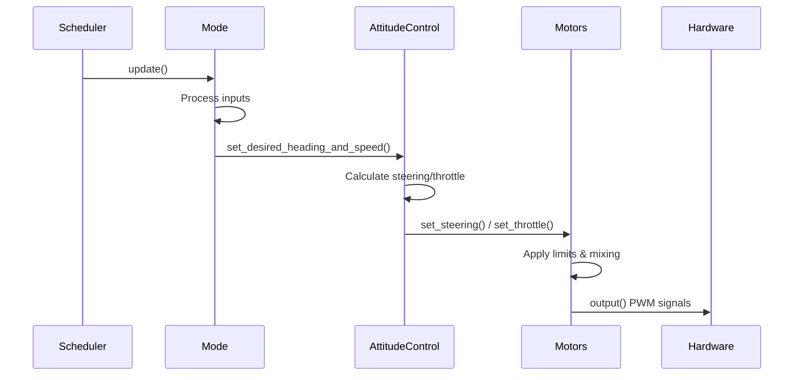
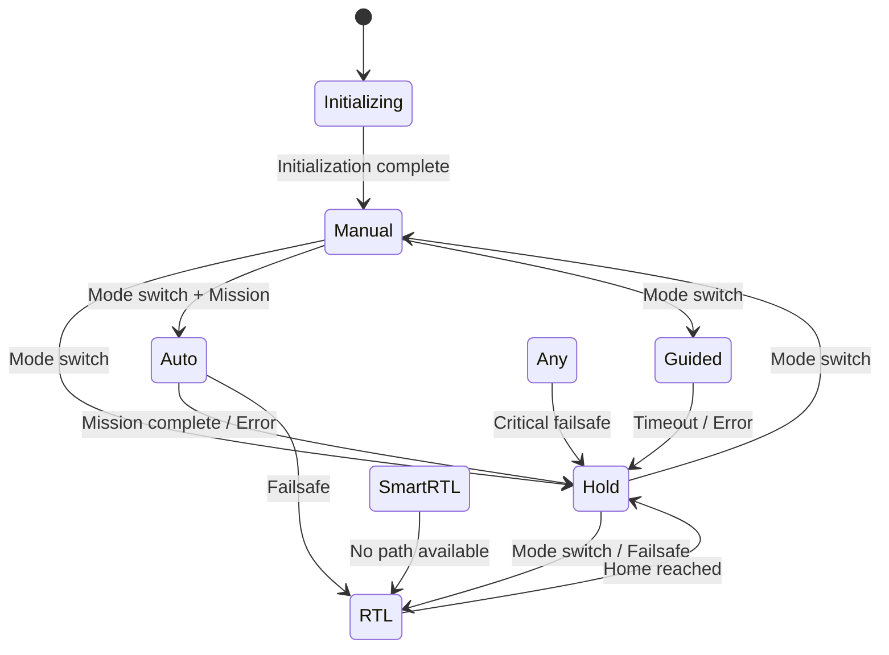
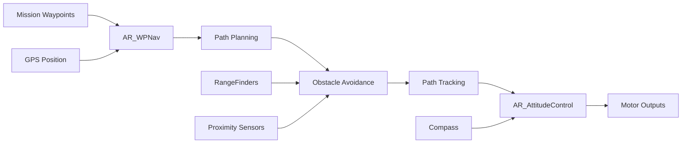
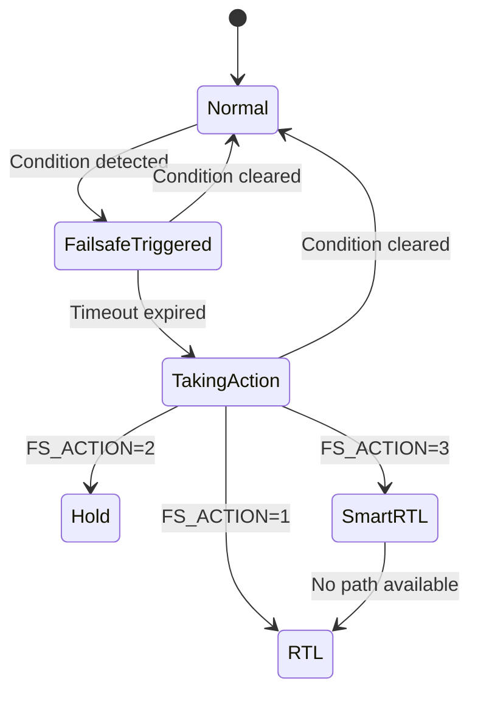

# ArduRover - Ground Vehicle Control System

## Overview

ArduRover is the ground vehicle control module of the ArduPilot autopilot system, providing comprehensive autonomous and manual control for wheeled rovers, tracked vehicles, and boats. The system implements a sophisticated mode-based architecture with 13 flight modes, support for multiple steering configurations (Ackermann and skid-steering), differential drive motor control, advanced waypoint navigation with obstacle avoidance, and comprehensive safety systems including geofencing and failsafes.

ArduRover supports diverse vehicle types including differential-drive rovers, Ackermann-steered vehicles, skid-steered vehicles, balance bots, walking robots, and boats (including sailboats). The architecture is designed for both manual operation and full autonomous navigation with mission support.

## Architecture


```mermaid
graph TB
    Rover[Rover Main Class] --> Scheduler[AP_Scheduler<br/>Task Management]
    Rover --> Modes[Mode System<br/>13 Flight Modes]
    Rover --> Motors[AR_Motors<br/>Motor Control]
    Rover --> Navigation[AR_WPNav<br/>Waypoint Navigation]
    Rover --> Safety[Safety Systems]
    Rover --> GCS[GCS_Rover<br/>MAVLink Communication]
    
    Modes --> Manual[Manual Mode]
    Modes --> Acro[Acro Mode]
    Modes --> Steering[Steering Mode]
    Modes --> Hold[Hold Mode]
    Modes --> Loiter[Loiter Mode]
    Modes --> Follow[Follow Mode]
    Modes --> Simple[Simple Mode]
    Modes --> Dock[Dock Mode]
    Modes --> Circle[Circle Mode]
    Modes --> Auto[Auto Mode]
    Modes --> RTL[RTL Mode]
    Modes --> SmartRTL[SmartRTL Mode]
    Modes --> Guided[Guided Mode]
    
    Motors --> SteeringControl[Steering Control<br/>Ackermann/Skid]
    Motors --> ThrottleControl[Throttle Control<br/>Differential Drive]
    
    Navigation --> PathFollowing[Path Following]
    Navigation --> ObstacleAvoidance[Obstacle Avoidance]
    
    Safety --> Failsafe[Failsafe System]
    Safety --> Fence[Geofencing]
    Safety --> Arming[Arming Checks]
```

## Key Components

### Rover Class (Rover.h, Rover.cpp)
- **Purpose**: Main vehicle class containing all rover-specific state and subsystems
- **Lifecycle**: Constructor → initialization → scheduler loop → shutdown
- **Thread Safety**: Uses WITH_SEMAPHORE patterns for thread-safe access to shared resources
- **Key Responsibilities**:
  - Vehicle state management (position, velocity, attitude)
  - Mode management and transitions
  - Sensor integration (GPS, IMU, compass, rangefinders)
  - Motor output coordination
  - Failsafe monitoring and response
  - MAVLink communication handling

### Mode System (mode.h, mode.cpp, mode_*.cpp)
- **Purpose**: Implements the flight mode architecture for different vehicle control behaviors
- **Lifecycle**: Mode selection → enter() → update() loop → exit()
- **Base Class**: Mode class provides common functionality and interface
- **Mode Numbers**: Enum class Mode::Number defines unique identifiers for each mode

### AR_Motors Integration (libraries/AR_Motors/)
- **Purpose**: Motor output control for ground vehicles with support for multiple drive configurations
- **Key Features**:
  - Differential drive control (left/right motor mixing)
  - Ackermann steering geometry
  - Skid-steering support
  - Throttle limiting and slew rate control
  - Reversing logic for backing up
  - Balance bot pitch control
  - Walking robot actuator control (roll, pitch, height)

### AR_WPNav Integration (libraries/AR_WPNav/)
- **Purpose**: Waypoint navigation with path following and obstacle avoidance
- **Key Features**:
  - Waypoint-to-waypoint navigation
  - Path following with configurable tracking
  - Speed profile management
  - Obstacle avoidance integration
  - Turn radius management for smooth cornering

### AR_AttitudeControl Integration (libraries/AR_AttitudeControl/)
- **Purpose**: Steering and speed control for ground vehicles
- **Key Features**:
  - Steering controller (converts desired heading to steering output)
  - Speed controller (maintains target speed with PID control)
  - Lateral acceleration limiting
  - Turn rate control

## Component Interactions

The Rover architecture follows a hierarchical control flow:

1. **Scheduler** calls mode update() at main loop rate (typically 50Hz)
2. **Mode** processes pilot input or autonomous commands and sets desired heading/speed
3. **AR_AttitudeControl** converts heading/speed targets to steering and throttle commands
4. **AR_Motors** applies motor mixing and outputs PWM signals to ESCs/servos
5. **Safety systems** monitor for failsafe conditions and can override mode commands


```mermaid
sequenceDiagram
    participant Scheduler
    participant Mode
    participant AttitudeControl
    participant Motors
    participant Hardware
    
    Scheduler->>Mode: update()
    Mode->>Mode: Process inputs
    Mode->>AttitudeControl: set_desired_heading_and_speed()
    AttitudeControl->>AttitudeControl: Calculate steering/throttle
    AttitudeControl->>Motors: set_steering() / set_throttle()
    Motors->>Motors: Apply limits & mixing
    Motors->>Hardware: output() PWM signals
```

## Flight Mode System

ArduRover implements 13 distinct flight modes, each providing different levels of pilot control and autonomous behavior.

### Mode Architecture

All modes inherit from the base `Mode` class which provides:
- Common pilot input decoding methods
- Steering and throttle calculation helpers
- Navigation support functions
- Standardized enter/exit lifecycle

### Mode Descriptions

#### Manual Mode (Mode 0)
- **Control**: Direct pilot control of steering and throttle
- **Description**: Raw RC input passed directly to motors with optional expo curve
- **Requires Position**: No
- **Use Cases**: Line-of-sight operation, learning vehicle behavior, testing
- **Special Features**: 
  - Manual steering expo (MANUAL_STR_EXPO parameter)
  - Direct throttle pass-through
  - Sailboat mainsail control
  - Walking robot support (roll, pitch, height control)

**Source**: Rover/mode_manual.cpp

#### Acro Mode (Mode 1)
- **Control**: Pilot controls turn rate and speed
- **Description**: Rate-controlled mode where steering input controls turn rate rather than heading
- **Requires Position**: No (velocity estimate for non-skid-steer)
- **Use Cases**: Responsive maneuvering, racing, advanced piloting
- **Special Features**:
  - Configurable maximum turn rate
  - Speed control with throttle input
  - Sailboat tacking support

**Source**: Rover/mode_acro.cpp

#### Steering Mode (Mode 3)
- **Control**: Pilot controls heading and speed
- **Description**: Stabilized mode where steering maintains a heading, throttle controls speed
- **Requires Position**: Yes
- **Use Cases**: Long-distance driving, maintaining straight lines
- **Special Features**:
  - Heading hold when steering centered
  - Ground speed control (not throttle percentage)

**Source**: Rover/mode_steering.cpp

#### Hold Mode (Mode 4)
- **Control**: Vehicle holds position
- **Description**: Actively maintains current position using GPS and compass
- **Requires Position**: Yes
- **Use Cases**: Pausing during missions, failsafe action, stable platform
- **Special Features**:
  - For wheeled vehicles: Brakes and holds position
  - For boats: Uses loiter controller to maintain position

**Source**: Rover/mode_hold.cpp

#### Loiter Mode (Mode 5)
- **Control**: Vehicle loiters around a point
- **Description**: Maintains position within a defined radius, primarily for boats
- **Requires Position**: Yes
- **Use Cases**: Station-keeping for boats, waiting at waypoints
- **Special Features**:
  - Configurable loiter radius
  - Face-into-wind option for boats
  - Continuous circular motion for momentum

**Source**: Rover/mode_loiter.cpp

#### Follow Mode (Mode 6)
- **Control**: Vehicle follows another vehicle
- **Description**: Maintains offset position relative to a lead vehicle
- **Requires Position**: Yes
- **Use Cases**: Convoy operations, leader-follower systems
- **Configuration**: Requires AP_Follow library enabled

**Source**: Rover/mode_follow.cpp

#### Simple Mode (Mode 7)
- **Control**: Simplified user control with heading relative to arming location
- **Description**: Steering input is relative to vehicle's heading at arm time, not current heading
- **Requires Position**: Yes
- **Use Cases**: Easier control for new pilots, intuitive "forward means away" behavior

**Source**: Rover/mode_simple.cpp

#### Dock Mode (Mode 8)
- **Control**: Autonomous docking to a visual target
- **Description**: Uses precision landing sensors to approach and dock with a target
- **Requires Position**: Yes
- **Configuration**: Requires MODE_DOCK_ENABLED
- **Use Cases**: Autonomous docking, precision approach to charging stations

**Source**: Rover/mode_dock.cpp

#### Circle Mode (Mode 9)
- **Control**: Vehicle drives in a circle
- **Description**: Continuously circles around a center point at defined radius
- **Requires Position**: Yes
- **Use Cases**: Surveillance, demonstration, sensor coverage patterns

**Source**: Rover/mode_circle.cpp

#### Auto Mode (Mode 10)
- **Control**: Executes mission commands from mission planner
- **Description**: Full autonomous mode executing uploaded waypoint missions
- **Requires Position**: Yes
- **Use Cases**: Autonomous missions, waypoint navigation, survey patterns
- **Special Features**:
  - Mission command execution (NAV_WAYPOINT, DO_SET_SPEED, etc.)
  - Speed profile management
  - Waypoint switching logic
  - Resume mission on mode re-entry (MIS_RESTART parameter)
  - Change detection (reloads mission if changed during flight)

**Key Submodes**:
- WP: Waypoint navigation
- HeadingAndSpeed: Drive at heading and speed
- RTL: Return to launch
- Loiter: Station-keeping
- Guided: External control within Auto
- Stop: Vehicle stopped

**Source**: Rover/mode_auto.cpp

#### RTL Mode (Mode 11)
- **Control**: Returns to launch location
- **Description**: Autonomous return to arming location or rally point
- **Requires Position**: Yes
- **Use Cases**: Failsafe return, end of mission, manual return command
- **Special Features**:
  - Configurable RTL speed (RTL_SPEED parameter)
  - Rally point support (can return to nearest rally point)
  - Automatic loiter after reaching home (boats)

**Source**: Rover/mode_rtl.cpp

#### SmartRTL Mode (Mode 12)
- **Control**: Returns via path traveled
- **Description**: Returns home by backtracking the path taken to current location
- **Requires Position**: Yes
- **Use Cases**: Safe return through known terrain, avoiding obstacles encountered on outbound trip
- **Special Features**:
  - Path recording and simplification
  - Falls back to RTL if path not available
  - Configurable path point storage

**Source**: Rover/mode_smart_rtl.cpp

#### Guided Mode (Mode 15)
- **Control**: External control via GCS or companion computer
- **Description**: Allows real-time waypoint and velocity commands from ground station
- **Requires Position**: Yes
- **Use Cases**: GCS-commanded navigation, companion computer control, dynamic missions
- **Special Features**:
  - Set target location via MAVLink
  - Set target velocity via MAVLink
  - Set target heading and speed
  - Timeout protection (reverts to Hold if no commands received)

**Source**: Rover/mode_guided.cpp

### Mode Transition State Machine


```mermaid
stateDiagram-v2
    [*] --> Initializing
    Initializing --> Manual : Initialization complete
    Manual --> Hold : Mode switch
    Manual --> Auto : Mode switch + Mission
    Manual --> Guided : Mode switch
    Hold --> Manual : Mode switch
    Hold --> RTL : Mode switch / Failsafe
    Auto --> Hold : Mission complete / Error
    Auto --> RTL : Failsafe
    Guided --> Hold : Timeout / Error
    RTL --> Hold : Home reached
    SmartRTL --> RTL : No path available
    Any --> Hold : Critical failsafe
```

## Steering Control Mechanisms

ArduRover supports multiple steering configurations to accommodate different vehicle types. The steering control is managed by the AR_Motors library with configuration determined by vehicle parameters.

### Ackermann Steering

Ackermann steering is used for car-like vehicles with a single steerable front axle (or rear axle).

**Characteristics**:
- Front wheels turn at different angles for proper cornering geometry
- Inner wheel turns more sharply than outer wheel
- Defined turn radius based on wheelbase and steering angle
- Single steering servo controls both front wheels (or separate servos mechanically linked)

**Configuration Parameters**:
- `STEER2SRV_P`, `STEER2SRV_I`, `STEER2SRV_D`: PID gains for steering controller
- `ATC_STR_RAT_MAX`: Maximum steering rate (deg/s)
- `ATC_STR_ANG_P`: Proportional gain for steering angle control
- `TURN_RADIUS`: Minimum turning radius (meters)

**Control Algorithm**:
1. Desired heading is calculated by mode
2. AR_AttitudeControl computes required steering angle using heading error
3. Steering angle is limited by turn radius and lateral acceleration limits
4. Output is sent to steering servo

**Coordinate Frames**: Steering angles are in vehicle body frame, with positive values turning right (clockwise from above).

**Source**: libraries/AR_Motors/AP_MotorsUGV.cpp, Rover/Steering.cpp

### Skid Steering

Skid steering is used for tracked vehicles and vehicles where left and right sides are driven independently.

**Characteristics**:
- No dedicated steering mechanism
- Turning achieved by driving left and right sides at different speeds
- Can pivot turn (rotate in place) by driving sides in opposite directions
- Higher power consumption during turns due to tire scrubbing

**Configuration Parameters**:
- `SKID_STEER_OUT`: Enable skid steering output (1)
- `MOT_THR_MIN`, `MOT_THR_MAX`: Motor output range
- `PIVOT_TURN_ANGLE`: Angle error threshold for pivot turns (degrees)
- `PIVOT_TURN_RATE`: Maximum pivot turn rate (deg/s)

**Control Algorithm**:
1. Desired heading/turn rate calculated by mode
2. Turn rate converted to differential thrust
3. Left motor = base_throttle - turn_throttle
4. Right motor = base_throttle + turn_throttle
5. Outputs scaled to configured min/max range

**Pivot Turn Logic**:
- Activated when heading error > PIVOT_TURN_ANGLE parameter (default 60°)
- Vehicle rotates in place by driving motors in opposite directions
- More efficient for large heading corrections
- Speed is set to zero during pivot turns

**Coordinate Frames**: Differential thrust is calculated in body frame. Positive turn rate = clockwise rotation.

**Source**: libraries/AR_Motors/AP_MotorsUGV.cpp

### Steering Output Calculation

The base Mode class provides several steering calculation methods:

**calc_steering_to_heading()**:
- Calculates steering output to achieve desired heading
- Uses proportional controller on heading error
- Applies maximum turn rate limits
- Heading error wrapped to ±180 degrees

**calc_steering_from_turn_rate()**:
- Directly sets steering based on desired turn rate (rad/s)
- Used in Acro mode for rate control
- Turn rate limited by ATC_STR_RAT_MAX

**calc_steering_from_lateral_acceleration()**:
- Calculates steering for desired lateral acceleration
- Accounts for vehicle speed and wheelbase geometry
- Used for path following to maintain smooth turns

**Source**: Rover/mode.cpp

## Motor Control System

The motor control system manages throttle, steering, and auxiliary outputs for ground vehicles.

### Differential Drive

For vehicles with independent left/right motors (skid-steer or differential drive):

**Motor Mixing**:
```
left_motor = throttle - steering
right_motor = throttle + steering
```

**Throttle Management**:
- Base throttle from pilot input or autonomous controller
- Scaled by MOT_THR_MIN and MOT_THR_MAX parameters
- Slew rate limiting for smooth acceleration (MOT_SLEWRATE)
- Dead zone handling for motor startup

**Reversing Logic**:
- Full support for reversing (negative throttle)
- Steering direction automatically inverts when reversing
- Separate reverse throttle limits if configured

### Throttle Control

**Speed Control Mode** (used in Auto, Guided, RTL, SmartRTL):
- Target speed set in m/s
- PID controller maintains speed using GPS velocity feedback
- Speed controller: `calc_throttle(target_speed)`
- Handles acceleration/deceleration profiles
- Respects configured speed limits

**Direct Throttle Mode** (Manual, Acro):
- Pilot throttle stick position mapped directly to motor output
- Optional throttle expo curve
- No closed-loop speed control

**Braking**:
- Active braking when stopping (motors driven in reverse briefly)
- Brake percentage configurable
- Used in Hold mode to maintain position

**Source**: Rover/mode.cpp, libraries/AR_Motors/AP_MotorsUGV.cpp

### Special Vehicle Types

**Balance Bots**:
- Pitch control maintains vehicle upright
- Throttle input affects target pitch angle
- Balance controller runs in `balancebot_pitch_control()`
- Requires IMU for pitch angle feedback

**Walking Robots**:
- Additional control outputs for roll, pitch, walking height
- Separate channels for leg actuators
- Coordinated gait control

**Boats and Sailboats**:
- Motor control for propulsion
- Rudder control for steering
- Sailboat: Additional mainsail control output
- Wind vane integration for sailing

**Source**: Rover/mode_manual.cpp, libraries/AR_Motors/AP_MotorsUGV.cpp

## Waypoint Navigation System

ArduRover uses the AR_WPNav library for autonomous waypoint navigation.

### Navigation Architecture


```mermaid
graph LR
    Mission[Mission Waypoints] --> WPNav[AR_WPNav]
    WPNav --> PathPlanning[Path Planning]
    PathPlanning --> Avoidance[Obstacle Avoidance]
    Avoidance --> Tracking[Path Tracking]
    Tracking --> AttCtrl[AR_AttitudeControl]
    AttCtrl --> Motors[Motor Outputs]
    
    GPS[GPS Position] --> WPNav
    Compass[Compass] --> AttCtrl
    RangeFinder[RangeFinders] --> Avoidance
    Proximity[Proximity Sensors] --> Avoidance
```

### Path Following Algorithm

**Waypoint Tracking**:
1. Load target waypoint from mission
2. Calculate distance and bearing to waypoint
3. Compute cross-track error (distance from desired path)
4. Calculate desired heading to minimize cross-track error
5. Send desired heading to attitude controller

**Waypoint Acceptance**:
- Waypoint considered reached when within WP_RADIUS (meters)
- For boats: May transition to loiter instead of stopping
- Fast waypoints: Switched earlier for smooth path (NAVL1_PERIOD affects timing)

**Speed Profiles**:
- Cruise speed (CRUISE_SPEED or WP_SPEED parameter)
- Deceleration near waypoints for accuracy
- Cornering speed reduction based on turn angle
- Acceleration limiting for smooth starts

**Source**: libraries/AR_WPNav/AR_WPNav.cpp, Rover/mode_auto.cpp

### Obstacle Avoidance

Integration with object avoidance libraries:

**AC_Avoid**:
- Proximity sensor integration
- Fence avoidance
- Dynamic speed reduction near obstacles
- Steering adjustments to avoid detected objects

**Avoidance Behavior**:
- Bendy ruler algorithm finds path around obstacles
- Maintains safe margin from detected objects
- Can temporarily deviate from desired path
- Resumes direct path when obstacles cleared

**Configuration**:
- AVOID_ENABLE: Enable avoidance features
- AVOID_MARGIN: Minimum distance to obstacles (meters)
- AVOID_BEHAVE: Avoidance behavior selection

**Source**: libraries/AR_WPNav/AR_WPNav_OA.cpp, libraries/AC_Avoidance/AC_Avoid.cpp

### Mission Command Support

ArduRover supports standard MAVLink mission commands:

**Navigation Commands**:
- NAV_WAYPOINT: Navigate to waypoint
- NAV_RETURN_TO_LAUNCH: Return home
- NAV_LOITER_UNLIM: Loiter indefinitely
- NAV_LOITER_TIME: Loiter for specified time
- NAV_GUIDED_ENABLE: Enter guided mode within mission

**Conditional Commands**:
- CONDITION_DELAY: Wait for time
- CONDITION_DISTANCE: Wait until distance from waypoint
- CONDITION_YAW: Rotate to heading

**DO Commands**:
- DO_SET_SPEED: Change target speed
- DO_SET_HOME: Set home position
- DO_SET_REVERSE: Enable/disable reverse driving
- DO_DIGICAM_CONTROL: Trigger camera
- DO_SET_RELAY: Control relay outputs
- DO_SET_SERVO: Set servo PWM

**Source**: Rover/mode_auto.cpp, libraries/AP_Mission/AP_Mission.cpp

## Configuration Parameters

ArduRover has extensive configuration parameters organized into functional groups.

### Core Parameters (Parameters.h, Parameters.cpp)

**Mode and Initial Setup**:
| Parameter | Description | Default | Range | Units |
|-----------|-------------|---------|-------|-------|
| INITIAL_MODE | Mode on startup | 0 (Manual) | 0-15 | - |
| MODE1-MODE6 | Flight mode switches | Various | 0-15 | - |

**Steering Configuration**:
| Parameter | Description | Default | Range | Units |
|-----------|-------------|---------|-------|-------|
| STEER2SRV_P | Steering P gain | 1.0 | 0.1-5.0 | - |
| STEER2SRV_I | Steering I gain | 0.2 | 0-2.0 | - |
| STEER2SRV_D | Steering D gain | 0.0 | 0-1.0 | - |
| STEER2SRV_IMAX | Steering integrator max | 1.0 | 0-1.0 | - |
| ATC_STR_RAT_MAX | Max steering rate | 180 | 10-360 | deg/s |
| ATC_STR_ANG_P | Steering angle P gain | 1.5 | 0.1-5.0 | - |

**Throttle/Speed Configuration**:
| Parameter | Description | Default | Range | Units |
|-----------|-------------|---------|-------|-------|
| CRUISE_SPEED | Default cruise speed | 2.0 | 0-100 | m/s |
| CRUISE_THROTTLE | Cruise throttle level | 50 | 0-100 | % |
| MOT_THR_MIN | Minimum throttle | 0 | 0-100 | % |
| MOT_THR_MAX | Maximum throttle | 100 | 0-100 | % |
| MOT_SLEWRATE | Throttle slew rate | 100 | 0-1000 | %/s |
| SPEED_TURN_GAIN | Speed reduction in turns | 50 | 0-100 | % |

**Navigation Configuration**:
| Parameter | Description | Default | Range | Units |
|-----------|-------------|---------|-------|-------|
| WP_RADIUS | Waypoint acceptance radius | 2.0 | 0-1000 | m |
| WP_OVERSHOOT | Waypoint overshoot distance | 2.0 | 0-10 | m |
| WP_SPEED | Speed in Auto mode | 0 (uses CRUISE_SPEED) | 0-100 | m/s |
| RTL_SPEED | Speed in RTL mode | 0 (uses CRUISE_SPEED) | 0-100 | m/s |
| TURN_RADIUS | Minimum turn radius | 0 (auto) | 0-1000 | m |
| PIVOT_TURN_ANGLE | Pivot turn angle threshold | 60 | 0-360 | deg |
| PIVOT_TURN_RATE | Maximum pivot turn rate | 90 | 0-360 | deg/s |

**Vehicle Configuration**:
| Parameter | Description | Default | Range | Units |
|-----------|-------------|---------|-------|-------|
| SKID_STEER_OUT | Enable skid steering | 0 | 0-1 | - |
| FRAME_TYPE | Vehicle frame type | 0 (Undefined) | 0-3 | - |
| BAL_PITCH_MAX | Balance bot max pitch | 2.0 | 0-5 | deg |

**Failsafe Configuration**:
| Parameter | Description | Default | Range | Units |
|-----------|-------------|---------|-------|-------|
| FS_ACTION | Failsafe action | 1 (RTL) | 0-4 | - |
| FS_TIMEOUT | Failsafe timeout | 1.5 | 0-10 | s |
| FS_THR_ENABLE | Throttle failsafe enable | 1 | 0-2 | - |
| FS_THR_VALUE | Throttle failsafe PWM value | 910 | 910-1100 | μs |
| FS_GCS_ENABLE | GCS failsafe enable | 0 | 0-2 | - |
| FS_GCS_TIMEOUT | GCS heartbeat timeout | 5.0 | 1-120 | s |
| FS_EKF_ACTION | EKF failsafe action | 1 (RTL) | 0-2 | - |
| FS_EKF_THRESH | EKF variance threshold | 0.8 | 0-1 | - |
| FS_CRASH_CHECK | Crash detection enable | 0 | 0-2 | - |

**Geofencing Configuration**:
| Parameter | Description | Default | Range | Units |
|-----------|-------------|---------|-------|-------|
| FENCE_ENABLE | Enable geofence | 0 | 0-1 | - |
| FENCE_TYPE | Fence type bitmask | 3 (Max alt + circle) | 0-15 | - |
| FENCE_RADIUS | Circular fence radius | 300 | 0-10000 | m |
| FENCE_ACTION | Breach action | 1 (RTL) | 0-4 | - |
| FENCE_MARGIN | Margin to fence | 10 | 1-100 | m |

**Source**: Rover/Parameters.h, Rover/Parameters.cpp

### Parameter Groups (ParametersG2)

Extended parameters in g2 structure:
- AR_AttitudeControl parameters (attitude_control)
- AR_Motors parameters (motors)
- AR_WPNav parameters (wp_nav)
- RC_Channels parameters (rc_channels)
- Mission parameters (mission)
- Fence parameters (fence)
- Proximity sensor parameters (proximity)
- Avoidance parameters (avoid)
- Beacon parameters (beacon)
- Visual odometry parameters (visual_odom)
- Sailboat parameters (sailboat)

**Source**: Rover/Parameters.h

## Safety Systems

ArduRover implements multiple layers of safety protection for autonomous and manual operation.

### Failsafe System

The failsafe system monitors for various failure conditions and takes protective action.

**Failsafe Types**:

1. **RC Failsafe** (FAILSAFE_EVENT_THROTTLE):
   - Triggered when RC signal lost or throttle PWM below FS_THR_VALUE
   - Detection: RC input drops below threshold for FS_TIMEOUT seconds
   - Configurable actions: Hold, RTL, SmartRTL, Continue Mission

2. **GCS Failsafe** (FAILSAFE_EVENT_GCS):
   - Triggered when heartbeat from ground station not received
   - Timeout: FS_GCS_TIMEOUT parameter (default 5 seconds)
   - Separate enable: FS_GCS_ENABLE parameter

3. **EKF Failsafe** (FAILSAFE_EVENT_EKF):
   - Triggered when EKF variance exceeds threshold (poor position estimate)
   - Threshold: FS_EKF_THRESH parameter (default 0.8)
   - Actions: Hold, disarm, or continue based on FS_EKF_ACTION

4. **Battery Failsafe**:
   - Low battery voltage/capacity triggers protective action
   - Configurable voltage and capacity thresholds
   - Actions: Warning, RTL, or Land (Hold for rovers)

5. **Crash Detection**:
   - Detects vehicle stuck or collision
   - Based on desired vs actual velocity mismatch
   - FS_CRASH_CHECK enables detection
   - Automatic disarm after crash detected

**Failsafe Action Options** (FS_ACTION parameter):
- 0: None (no action, continue current mode)
- 1: RTL (return to launch)
- 2: Hold (stop and maintain position)
- 3: SmartRTL (return via recorded path)
- 4: SmartRTL_Hold (SmartRTL, fallback to Hold if no path)

**Failsafe State Machine**:

```mermaid
stateDiagram-v2
    [*] --> Normal
    Normal --> FailsafeTriggered : Condition detected
    FailsafeTriggered --> TakingAction : Timeout expired
    TakingAction --> RTL : FS_ACTION=1
    TakingAction --> Hold : FS_ACTION=2
    TakingAction --> SmartRTL : FS_ACTION=3
    SmartRTL --> RTL : No path available
    FailsafeTriggered --> Normal : Condition cleared
    TakingAction --> Normal : Condition cleared
```

**Failsafe Priority**:
- Multiple simultaneous failsafes possible
- Battery failsafe has highest priority
- EKF failsafe can trigger even in manual modes
- Failsafes accumulate (bit flags) until conditions cleared

**Source**: Rover/failsafe.cpp, Rover/Rover.h

### Geofencing

The fence system prevents the vehicle from leaving a defined area or exceeding altitude limits.

**Fence Types** (FENCE_TYPE bitmask):
- Bit 0: Circular fence (FENCE_RADIUS around home)
- Bit 1: Altitude limit (FENCE_ALT_MAX)
- Bit 2: Polygon fence (custom shape defined via mission planner)

**Breach Actions** (FENCE_ACTION):
- 0: Report only (no action)
- 1: RTL (return to launch)
- 2: Hold (stop at breach point)
- 3: SmartRTL
- 4: Brake and disarm

**Fence Behavior**:
- Enabled with FENCE_ENABLE parameter
- Can be toggled via RC channel or GCS command
- Pre-arm check ensures vehicle starts inside fence
- Margin applied (FENCE_MARGIN) to allow smooth approach to boundary
- Multiple breaches: Most restrictive action taken

**Source**: Rover/fence.cpp, libraries/AC_Fence/AC_Fence.cpp

### Arming System

Pre-flight safety checks before allowing motor operation.

**Pre-Arm Checks** (must pass before arming allowed):
- EKF healthy (position estimate valid)
- Compass calibrated and healthy
- GPS lock with sufficient accuracy (if required by mode)
- Battery voltage sufficient
- Gyro/accelerometer calibrated
- Geofence checks (vehicle inside fence if enabled)
- RC calibration valid
- Safety switch engaged (if configured)
- Logging started successfully

**Arming Checks** (checked when arming attempted):
- Vehicle in allowed mode (Manual, Acro, Steering typically allowed)
- No failsafe conditions active
- Vehicle not moving (if ARMING_CHECK includes motion check)
- Parameter checks passed

**Arming Methods**:
- RC stick command (throttle down, rudder right for 2 seconds)
- GCS MAVLink command
- Auxiliary switch

**Disarming**:
- Manual: RC stick command (throttle down, rudder left)
- Automatic: After landing timeout
- Forced: Failsafe conditions (crash, EKF failure, battery critical)
- Geofence breach (if configured)

**Source**: Rover/AP_Arming_Rover.cpp, libraries/AP_Arming/AP_Arming.cpp

## GCS Integration

ArduRover integrates with ground control stations via MAVLink protocol.

### MAVLink Communication

**Message Handling**:
- GCS_Rover class implements rover-specific MAVLink handlers
- Inherits from GCS_MAVLINK base class
- Supports multiple simultaneous GCS connections
- Telemetry streaming at configurable rates

**Key MAVLink Messages Sent**:
- HEARTBEAT: Vehicle status and mode
- SYS_STATUS: System health, battery, sensors
- GPS_RAW_INT: GPS position and velocity
- ATTITUDE: Vehicle attitude (roll, pitch, yaw)
- GLOBAL_POSITION_INT: Fused position estimate
- VFR_HUD: Airspeed, groundspeed, heading
- NAV_CONTROLLER_OUTPUT: Navigation status, crosstrack error
- MISSION_CURRENT: Current mission item
- SERVO_OUTPUT_RAW: Motor/servo outputs

**Key MAVLink Commands Received**:
- CMD_NAV_WAYPOINT: Go to waypoint
- CMD_DO_SET_MODE: Change flight mode
- CMD_DO_SET_HOME: Set home position
- CMD_DO_REPOSITION: Change target position in Guided
- CMD_COMPONENT_ARM_DISARM: Arm/disarm motors
- CMD_MISSION_START: Start mission
- CMD_DO_SET_SPEED: Change target speed

**Streaming Rates**:
- Configurable per stream type (SR0_*, SR1_*, etc. parameters)
- Stream types: RAW_SENSORS, EXTENDED_STATUS, RC_CHANNELS, POSITION, EXTRA1, EXTRA2, EXTRA3
- Bandwidth management for telemetry links

**Source**: Rover/GCS_Rover.cpp, Rover/GCS_MAVLink_Rover.cpp

### Rover-Specific MAVLink Extensions

**Custom Handling**:
- Rover mode reporting via HEARTBEAT custom_mode field
- Ground vehicle specific state reporting
- Steering and throttle output reporting
- Waypoint switching notifications
- Geofence breach reporting

**Parameter Protocol**:
- Full parameter list download
- Individual parameter get/set
- Parameter file upload/download
- Default parameter values

**Mission Protocol**:
- Mission upload/download
- Mission count and items
- Mission current item
- Mission reached notification
- Mission item reached acknowledgment

**Source**: Rover/GCS_MAVLink_Rover.cpp, libraries/GCS_MAVLink/GCS_Common.cpp

## Testing and Development

### SITL (Software In The Loop) Testing

SITL allows testing ArduRover without physical hardware.

**Starting SITL Simulation**:

```bash
# Basic rover simulation
sim_vehicle.py -v Rover --console --map

# Specific vehicle frame
sim_vehicle.py -v Rover -f rover --console --map

# Skid-steer rover
sim_vehicle.py -v Rover -f rover-skid --console --map

# Boat simulation
sim_vehicle.py -v Rover -f boat --console --map

# Sailboat simulation
sim_vehicle.py -v Rover -f sailboat --console --map

# Balance bot simulation
sim_vehicle.py -v Rover -f balancebot --console --map
```

**SITL Features**:
- Physics-based simulation of ground vehicle dynamics
- Simulated GPS, compass, IMU sensors
- Realistic steering and throttle response
- Obstacle simulation support
- Scripted test scenarios

**Testing Flight Modes**:

```bash
# Connect to SITL
# In MAVProxy console:

# Test Manual mode
mode MANUAL
rc 1 1500  # Center steering
rc 3 1700  # Forward throttle

# Test Auto mode with mission
wp load test_mission.txt
mode AUTO
arm throttle

# Test RTL
mode RTL

# Test guided mode
mode GUIDED
guided lat lon  # Navigate to position

# Test failsafe
rc 3 900  # Trigger throttle failsafe
```

**Automated Testing**:

ArduRover includes comprehensive automated test suites in Tools/autotest/:

```bash
# Run all Rover tests
./Tools/autotest/autotest.py Rover

# Run specific test
./Tools/autotest/autotest.py Rover.DriveRTL

# Available Rover test scenarios:
# - DriveSquare: Navigate square pattern
# - DriveMaxDistRTL: Test maximum RTL distance
# - DriveRTL: Test return to launch
# - DriveInCircle: Test circle mode
# - DriveStick: Test manual control
# - DriveGuidedWP: Test guided waypoints
# - DriveMissionDo: Test mission commands
# - DriveGCSfailsafe: Test GCS failsafe
# - DriveEncoders: Test wheel encoder integration
# - SkidSteer: Test skid-steering configuration
# - DockTest: Test docking mode
# - Sprayer: Test sprayer integration
```

**Test Parameters**:
- Tests automatically configure parameters for specific scenarios
- Test missions in Tools/autotest/missions/
- Expected behavior defined in test scripts
- Timeout detection for hung tests

**Source**: Tools/autotest/rover.py

### Hardware Testing

**Safe Testing Procedures**:

1. **Initial Setup**:
   - Ensure vehicle on blocks or wheels free
   - Connect battery with vehicle disarmed
   - Verify RC connection and failsafe configured
   - Set INITIAL_MODE to Manual (0)

2. **Motor Direction Test**:
   - Arm in Manual mode
   - Apply slight throttle, verify forward motion
   - Apply left steering, verify left turn
   - For skid-steer: Verify differential motor response

3. **Compass Calibration**:
   ```bash
   # In MAVProxy:
   magcal
   # Rotate vehicle through all orientations
   ```

4. **Mode Testing Sequence**:
   - Manual: Verify direct control
   - Hold: Verify vehicle stops and holds position
   - Steering: Verify heading hold works
   - Guided: Send waypoint via GCS, verify navigation
   - Auto: Load simple mission, verify waypoint navigation

5. **Failsafe Testing**:
   - With vehicle in safe area
   - Turn off transmitter, verify failsafe action
   - Restore transmitter, verify recovery

**Safety Checklist**:
- [ ] RC failsafe configured and tested
- [ ] Geofence enabled with appropriate radius
- [ ] Battery failsafe thresholds set
- [ ] Arming checks enabled (ARMING_CHECK)
- [ ] Test area clear of obstacles and people
- [ ] E-stop method available (RC mode switch to Manual)
- [ ] Vehicle can be physically stopped if needed

**Source**: Tools/autotest/rover.py, Rover/mode.cpp

## Implementation Notes

### Design Decisions

**Mode-Based Architecture**:
- Rationale: Provides clear separation of control behaviors, easier to maintain and extend
- Trade-offs: Some code duplication across modes vs. complexity of unified control
- Alternative considered: Single unified controller with behavior flags (rejected for clarity)

**Differential Drive Priority**:
- Designed primarily for differential drive and skid-steer vehicles
- Ackermann steering supported but with some mode limitations
- Rationale: Differential drive provides omnidirectional capability useful for rovers

**Speed Control vs. Throttle Control**:
- Autonomous modes use closed-loop speed control (m/s)
- Manual modes use direct throttle control (%)
- Rationale: Speed control provides predictable autonomous behavior, throttle control gives pilot direct feel

**Coordinate Frame Conventions**:
- Position: Earth frame (latitude/longitude/altitude)
- Velocity: Earth frame NED (North-East-Down)
- Heading: 0° = North, increases clockwise
- Steering: Body frame, positive = right turn
- Units explicitly documented in code (meters, m/s, degrees, radians)

**Path Following Algorithm**:
- L1 navigation controller adapted from fixed-wing
- Modified for ground vehicle constraints (no altitude)
- Cross-track error correction with configurable aggressiveness
- Lookahead distance based on speed and turn rate

### Known Limitations

**Current Constraints**:
- Reverse driving in Auto mode requires DO_SET_REVERSE mission command
- Some modes (Loiter, Circle) primarily designed for boats, limited use for wheeled vehicles
- Balance bot support experimental, requires careful tuning
- Sailboat support requires appropriate wind vane sensor

**Performance Considerations**:
- Main loop rate: 50Hz (configurable via SCHED_LOOP_RATE)
- Attitude control runs at main loop rate
- Navigation updates at main loop rate
- GPS updates typically 5-10Hz
- Steering servo update rate determined by servo hardware

**Resource Usage**:
- Flash memory: ~1.2MB for typical Rover build
- RAM usage: ~200KB during operation
- CPU load: ~30-50% on F4/F7 processors at 50Hz
- Log write rate: Depends on log bitmask, typically 50-100KB/s

### Future Improvements

Areas for potential enhancement (documented, not implemented):
- Advanced path planning with terrain awareness
- Improved traction control for slippery surfaces
- Convoy mode improvements for multi-vehicle coordination
- Enhanced obstacle avoidance with machine learning
- Improved reverse driving support in all modes
- Better support for omnidirectional vehicles (mecanum wheels)

## References

### Source Files

**Vehicle Core**:
- `Rover/Rover.h` - Main Rover class definition
- `Rover/Rover.cpp` - Rover class implementation and initialization
- `Rover/system.cpp` - System-level functions and scheduler
- `Rover/Steering.cpp` - Servo output control

**Mode System**:
- `Rover/mode.h` - Mode base class and mode declarations
- `Rover/mode.cpp` - Mode base class implementation and common functions
- `Rover/mode_manual.cpp` - Manual mode (direct pilot control)
- `Rover/mode_acro.cpp` - Acro mode (rate control)
- `Rover/mode_steering.cpp` - Steering mode (heading hold)
- `Rover/mode_hold.cpp` - Hold mode (position hold)
- `Rover/mode_loiter.cpp` - Loiter mode (station keeping)
- `Rover/mode_follow.cpp` - Follow mode (follow another vehicle)
- `Rover/mode_simple.cpp` - Simple mode (simplified control)
- `Rover/mode_dock.cpp` - Dock mode (precision docking)
- `Rover/mode_circle.cpp` - Circle mode (drive in circles)
- `Rover/mode_auto.cpp` - Auto mode (mission execution)
- `Rover/mode_rtl.cpp` - RTL mode (return to launch)
- `Rover/mode_smart_rtl.cpp` - SmartRTL mode (return via path)
- `Rover/mode_guided.cpp` - Guided mode (GCS control)

**Safety Systems**:
- `Rover/failsafe.cpp` - Failsafe detection and handling
- `Rover/fence.cpp` - Geofence integration
- `Rover/AP_Arming_Rover.cpp` - Rover-specific arming checks
- `Rover/crash_check.cpp` - Crash detection

**Configuration**:
- `Rover/Parameters.h` - Parameter declarations
- `Rover/Parameters.cpp` - Parameter definitions and defaults
- `Rover/config.h` - Build configuration
- `Rover/defines.h` - Constant definitions

**Communication**:
- `Rover/GCS_Rover.h` - GCS interface definition
- `Rover/GCS_Rover.cpp` - GCS interface implementation
- `Rover/GCS_MAVLink_Rover.h` - MAVLink handler definitions
- `Rover/GCS_MAVLink_Rover.cpp` - MAVLink message handlers

**RC Input**:
- `Rover/RC_Channel_Rover.h` - RC channel definitions
- `Rover/RC_Channel_Rover.cpp` - RC channel handling

**Special Features**:
- `Rover/sailboat.h`, `Rover/sailboat.cpp` - Sailboat-specific code
- `Rover/AP_Rally.h`, `Rover/AP_Rally.cpp` - Rally point support

### Related Libraries

**Motor Control**:
- `libraries/AR_Motors/` - Ground vehicle motor library
  - Differential drive implementation
  - Skid-steering support
  - Motor output limiting and slew rate control
  - Balance bot pitch control

**Navigation**:
- `libraries/AR_WPNav/` - Waypoint navigation for ground vehicles
  - Path planning and tracking
  - Obstacle avoidance integration
  - Speed profile management

**Attitude Control**:
- `libraries/AR_AttitudeControl/` - Steering and speed control
  - Steering controllers (heading, turn rate, lateral acceleration)
  - Speed controller with PID
  - Cross-track error correction

**Core Systems**:
- `libraries/AP_AHRS/` - Attitude and heading reference system
- `libraries/AP_GPS/` - GPS interface
- `libraries/AP_Compass/` - Compass/magnetometer interface
- `libraries/AP_InertialSensor/` - IMU interface
- `libraries/AP_Mission/` - Mission management
- `libraries/AP_Arming/` - Arming system base
- `libraries/GCS_MAVLink/` - MAVLink protocol implementation
- `libraries/AC_Fence/` - Geofencing
- `libraries/AC_Avoidance/` - Obstacle avoidance
- `libraries/AP_SmartRTL/` - Smart RTL path recording

**Sensors**:
- `libraries/AP_RangeFinder/` - Range finder/lidar support
- `libraries/AP_Proximity/` - Proximity sensor integration
- `libraries/AP_Beacon/` - Beacon positioning
- `libraries/AP_OpticalFlow/` - Optical flow sensors
- `libraries/AP_WheelEncoder/` - Wheel encoder support

**Utilities**:
- `libraries/AP_Scheduler/` - Task scheduler
- `libraries/AP_Logger/` - Data logging
- `libraries/AP_Param/` - Parameter storage
- `libraries/RC_Channel/` - RC input processing
- `libraries/AP_SerialManager/` - Serial port management

### External Documentation

- ArduPilot Wiki: https://ardupilot.org/rover/
- ArduPilot Developer Documentation: https://ardupilot.org/dev/
- MAVLink Protocol: https://mavlink.io/en/
- Parameter Documentation: https://ardupilot.org/rover/docs/parameters.html
- Mission Command Reference: https://mavlink.io/en/messages/common.html#mav_commands

### Community Resources

- ArduPilot Discourse Forum: https://discuss.ardupilot.org/c/ground-rovers/
- GitHub Repository: https://github.com/ArduPilot/ardupilot
- GitHub Issues (Rover): https://github.com/ArduPilot/ardupilot/labels/Rover
- Developer Chat: https://ardupilot.org/discord

### Testing Resources

- Autotest Framework: `Tools/autotest/rover.py`
- Test Missions: `Tools/autotest/missions/`
- SITL Documentation: https://ardupilot.org/dev/docs/sitl-simulator-software-in-the-loop.html
- MAVProxy Documentation: https://ardupilot.org/mavproxy/

---

**Document Version**: 1.0  
**Last Updated**: 2025  
**Maintainer**: ArduPilot Development Team  
**License**: GPLv3
