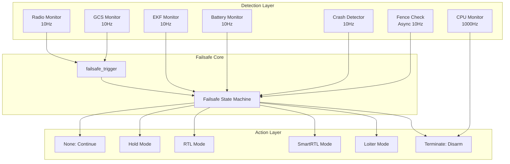
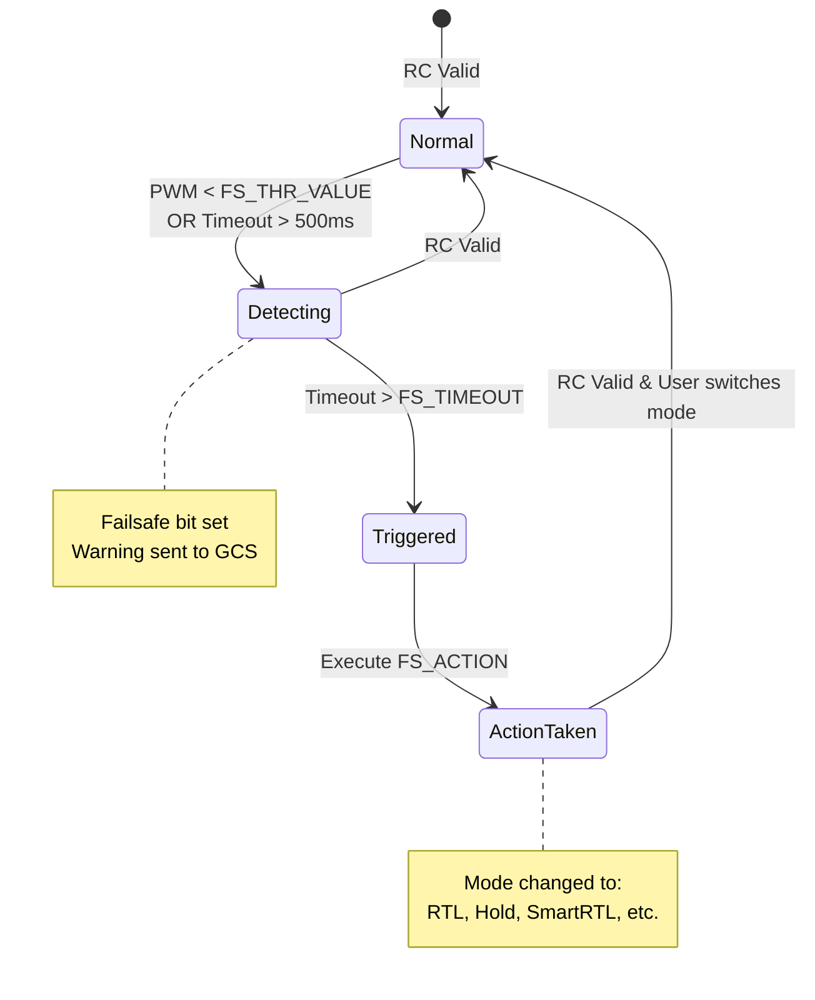
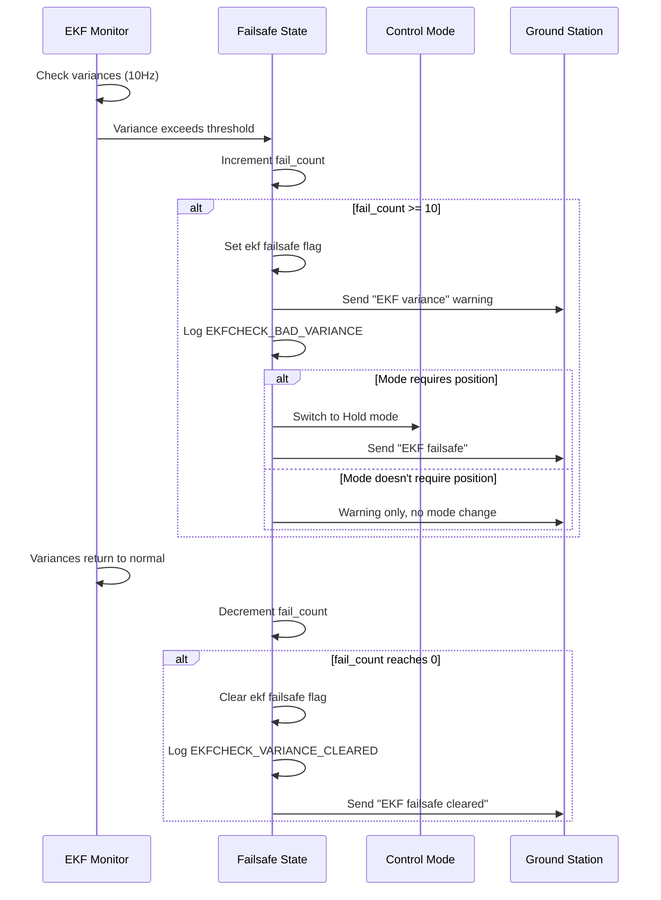
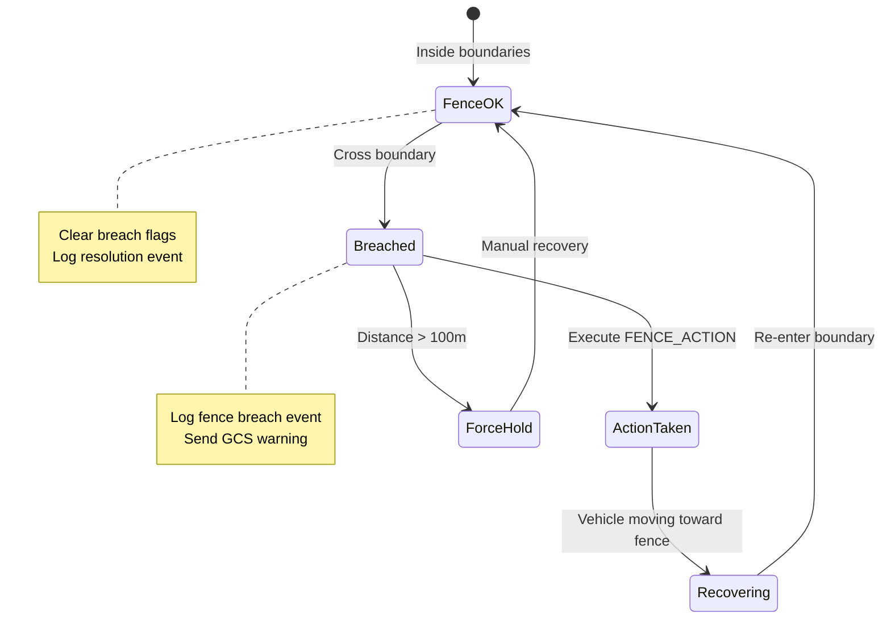
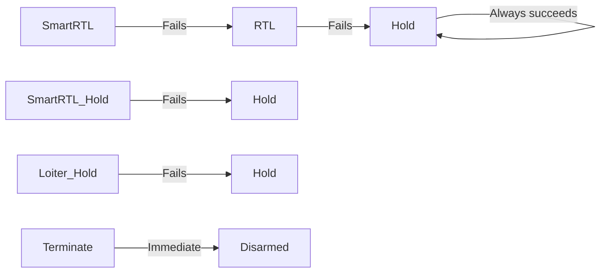
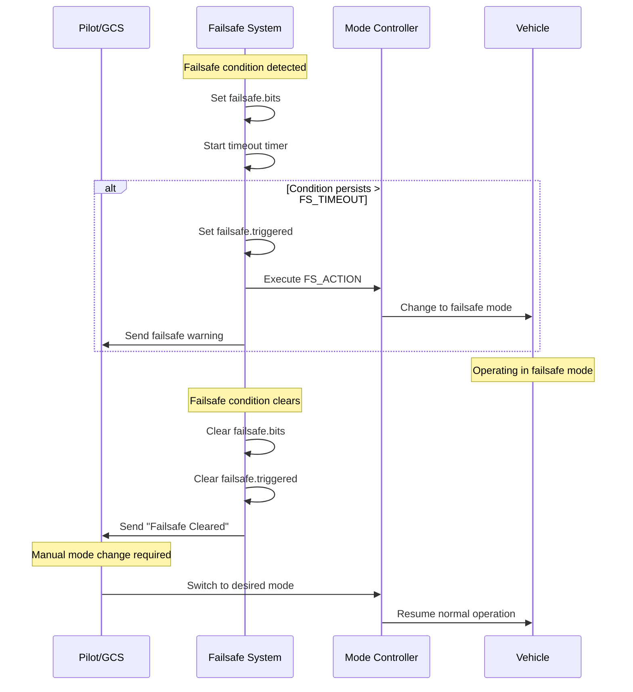

# ArduRover Failsafe Systems

 

## Table of Contents
- [Overview](#overview)
- [Failsafe Architecture](#failsafe-architecture)
- [Failsafe Types](#failsafe-types)
  - [Radio Loss Failsafe](#radio-loss-failsafe)
  - [GCS Failsafe](#gcs-failsafe)
  - [EKF Failsafe](#ekf-failsafe)
  - [Battery Failsafe](#battery-failsafe)
  - [Geofence Breach](#geofence-breach)
  - [Crash Detection](#crash-detection)
  - [CPU Lockup Failsafe](#cpu-lockup-failsafe)
- [Failsafe Actions](#failsafe-actions)
- [Failsafe Priority and Cascading](#failsafe-priority-and-cascading)
- [Configuration Guidelines](#configuration-guidelines)
- [Recovery Procedures](#recovery-procedures)
- [Safety Considerations](#safety-considerations)
- [Testing and Validation](#testing-and-validation)

## Overview

**Purpose**: The ArduRover failsafe system provides multiple layers of safety protection to detect and respond to failure conditions during ground vehicle operations.

**Source Files**:
- `/Rover/failsafe.cpp` - Core failsafe logic and action execution
- `/Rover/ekf_check.cpp` - Extended Kalman Filter health monitoring
- `/Rover/crash_check.cpp` - Crash and block detection
- `/Rover/fence.cpp` - Geofence breach handling
- `/Rover/radio.cpp` - Radio/RC link monitoring
- `/Rover/Rover.cpp` - GCS link monitoring
- `/Rover/AP_Arming_Rover.cpp` - Pre-arm safety checks

**Key Design Principles**:
1. **Defense in Depth**: Multiple independent failsafe mechanisms
2. **Graduated Response**: Actions proportional to severity
3. **Automatic Recovery**: Failsafes clear when conditions improve
4. **Priority Handling**: Critical failsafes override less critical ones
5. **Safe Defaults**: Conservative failsafe behavior out of the box

## Failsafe Architecture

### System Overview

ArduRover implements a centralized failsafe management system that monitors multiple subsystems and triggers appropriate actions when failures are detected.



### Failsafe State Structure

**Source**: `/Rover/Rover.h:197-204`

```cpp
struct {
    uint8_t bits;               // bit flags of failsafes that have started
    uint32_t start_time;        // start time of the earliest failsafe
    uint8_t triggered;          // bit flags of failsafes that have triggered an action
    uint32_t last_valid_rc_ms;  // system time of most recent RC input from pilot
    bool ekf;                   // EKF failsafe state
} failsafe;
```

**State Fields**:
- `bits`: Bitmask of active failsafe conditions (not yet triggered actions)
- `start_time`: Millisecond timestamp when first failsafe condition began
- `triggered`: Bitmask of failsafes that have executed actions
- `last_valid_rc_ms`: Last valid RC input timestamp (used for timeout detection)
- `ekf`: EKF-specific failsafe flag

### Failsafe Event Flags

**Source**: `/Rover/defines.h:8-10`

```cpp
#define FAILSAFE_EVENT_THROTTLE (1<<0)  // Radio/RC loss
#define FAILSAFE_EVENT_GCS      (1<<1)  // Ground Control Station loss
```

## Failsafe Types

### Radio Loss Failsafe

**Purpose**: Detect loss of RC transmitter signal and take protective action.

**Detection Logic**: `/Rover/radio.cpp:77-91`

The radio failsafe monitors two conditions:
1. **PWM Value Check**: Throttle channel PWM drops below `FS_THR_VALUE` parameter
2. **Timeout Check**: No valid RC input received for >500ms

```cpp
bool failed = pwm < static_cast<uint16_t>(g.fs_throttle_value);
if (AP_HAL::millis() - failsafe.last_valid_rc_ms > 500) {
    failed = true;
}
```

**Update Rate**: Called every main loop cycle (typically 50Hz)

**Parameters**:
- `FS_THR_ENABLE`: Radio failsafe enable/disable
  - `0`: Disabled
  - `1`: Enabled (default)
  - `2`: Enabled, continue mission in Auto mode
  - **Source**: `/Rover/Parameters.cpp` - `FS_THR_ENABLE`
  
- `FS_THR_VALUE`: Throttle PWM value below which failsafe triggers
  - **Default**: 910 PWM
  - **Range**: Typically 800-1000 PWM
  - **Configuration**: Set below normal throttle range
  - **Source**: `/Rover/Parameters.cpp` - `FS_THR_VALUE`

**Behavior**:
1. **Detection Phase**: When PWM < threshold or timeout, failsafe bit is set
2. **Timeout Phase**: Waits `FS_TIMEOUT` seconds before triggering action
3. **Action Phase**: Executes action defined by `FS_ACTION` parameter
4. **Recovery**: Automatically clears when valid RC signal returns

**State Diagram**:



**Testing Procedure**:
1. Power on vehicle in a safe area
2. Arm vehicle in Manual mode
3. Turn off RC transmitter or move throttle stick to minimum
4. Observe vehicle executes configured failsafe action
5. Turn on transmitter to verify recovery

> **Warning**: Always test in a safe environment with adequate space for failsafe action execution.

---

### GCS Failsafe

**Purpose**: Detect loss of Ground Control Station (GCS) telemetry link and take protective action.

**Detection Logic**: `/Rover/Rover.cpp` - `gcs_failsafe_check()`

The GCS failsafe monitors the heartbeat message from the primary GCS:

```cpp
const uint32_t gcs_last_seen_ms = gcs().sysid_mygcs_last_seen_time_ms();
const uint32_t last_gcs_update_ms = millis() - gcs_last_seen_ms;
const uint32_t gcs_timeout_ms = uint32_t(g2.fs_gcs_timeout * 1000.0f);

const bool do_failsafe = last_gcs_update_ms >= gcs_timeout_ms;
```

**Update Rate**: 10Hz (called from main scheduler)

**Parameters**:
- `FS_GCS_ENABLE`: GCS failsafe enable/disable
  - `0`: Disabled (default)
  - `1`: Enabled
  - `2`: Enabled, continue mission in Auto mode
  - **Source**: `/Rover/Parameters.cpp` - `FS_GCS_ENABLE`
  
- `FS_GCS_TIMEOUT`: Time in seconds without GCS heartbeat before triggering
  - **Default**: 5 seconds
  - **Range**: 2-120 seconds
  - **Recommendation**: Set to 2-3x expected heartbeat interval
  - **Source**: `/Rover/Parameters.cpp` - `FS_GCS_TIMEOUT`

**Behavior**:
1. **Initialization**: Failsafe never triggers if GCS has never been seen
2. **Detection**: Monitors time since last MAVLink HEARTBEAT from primary GCS
3. **Timeout**: Triggers when `last_seen_time` exceeds `FS_GCS_TIMEOUT`
4. **Action**: Executes action defined by `FS_ACTION` parameter
5. **Recovery**: Clears when GCS heartbeat resumes

**Special Cases**:
- **Continue Mission Mode**: If `FS_GCS_ENABLE=2` and vehicle is in Auto mode, mission continues
- **Multiple GCS**: Only monitors the primary GCS (set by `SYSID_MYGCS` parameter)

**Use Cases**:
- **Long Range Operations**: Prevents vehicle from continuing indefinitely after telemetry loss
- **Failsafe Redundancy**: Complements RC failsafe for autonomous missions
- **Return Home**: Configured with RTL action to bring vehicle back on link loss

---

### EKF Failsafe

**Purpose**: Detect Extended Kalman Filter estimation failures and prevent operation with unreliable navigation.

**Detection Logic**: `/Rover/ekf_check.cpp:27-84`

The EKF failsafe monitors multiple variance metrics and position estimate validity:

**Variance Monitoring**: `/Rover/ekf_check.cpp:87-126`

```cpp
// Get variances from AHRS/EKF
float position_variance, vel_variance, height_variance, tas_variance;
Vector3f mag_variance;
ahrs.get_variances(vel_variance, position_variance, height_variance, mag_variance, tas_variance);

// Count how many variances exceed threshold
uint8_t over_thresh_count = 0;
if (mag_variance.length() >= g.fs_ekf_thresh) over_thresh_count++;
if (vel_variance >= g.fs_ekf_thresh) over_thresh_count++;
if (position_variance >= g.fs_ekf_thresh) over_thresh_count++;

// Special handling for velocity without optical flow
if (!optflow_healthy && (vel_variance >= (2.0f * g.fs_ekf_thresh))) {
    over_thresh_count += 2;  // Weight velocity variance higher
}

// Trigger if two or more variances are over threshold
return (over_thresh_count >= 2);
```

**Fail Counter Logic**: `/Rover/ekf_check.cpp:45-65`

The EKF failsafe uses a counter-based approach to avoid false triggers:

1. **Detection**: Each 100ms cycle (10Hz) where variances exceed threshold increments counter
2. **Threshold**: Counter must reach `EKF_CHECK_ITERATIONS_MAX` (10) = 1 second of bad data
3. **Recovery**: Counter decrements when variances return to normal
4. **Trigger**: Failsafe triggers when counter reaches maximum
5. **Clear**: Failsafe clears when counter returns to zero

**Update Rate**: 10Hz (called from scheduler)

**Constants**:
- `EKF_CHECK_ITERATIONS_MAX`: 10 iterations (1 second at 10Hz)
- `EKF_CHECK_WARNING_TIME`: 30 seconds between warning messages

**Parameters**:
- `FS_EKF_ACTION`: Action to take on EKF failsafe
  - `0`: Disabled - no action taken
  - `1`: Hold mode (default)
  - `2`: Report only - log error but don't change mode
  - **Source**: `/Rover/Parameters.cpp` - `FS_EKF_ACTION`
  
- `FS_EKF_THRESH`: Variance threshold for triggering
  - **Default**: 0.8
  - **Range**: 0.0-1.0 (0 disables)
  - **Tuning**: Lower = more sensitive, Higher = more tolerant
  - **Source**: `/Rover/Parameters.cpp` - `FS_EKF_THRESH`

**Monitored Variances**:
1. **Position Variance**: Horizontal position estimate uncertainty
2. **Velocity Variance**: Velocity estimate uncertainty
3. **Compass Variance**: Magnetometer/heading estimate uncertainty
4. **Height Variance**: Altitude estimate uncertainty (informational)
5. **Airspeed Variance**: True airspeed uncertainty (not applicable to rovers)

**Position Estimate Check**: `/Rover/ekf_check.cpp:129-147`

Independent of variance, the failsafe also checks position estimate validity:

**When Disarmed**:
- Accepts predicted or actual horizontal absolute position
- Accepts predicted or actual horizontal relative position

**When Armed**:
- Requires actual (non-predicted) horizontal position
- Must not be in constant position mode (GPS denied fallback)

**Behavior**: `/Rover/ekf_check.cpp:150-181`



**Mode-Specific Handling**:
- **Position-Required Modes**: Auto, Guided, RTL, SmartRTL, Loiter → Switch to Hold
- **Position-Optional Modes**: Manual, Acro, Steering, Hold → No action

**Recovery**:
1. Variances must return below threshold for 1 second (fail counter reaches zero)
2. Automatic recovery notification sent to GCS
3. User must manually switch back to desired mode

**Pre-Arm Check**: `/Rover/AP_Arming_Rover.cpp:58-62`

```cpp
// Check for ekf failsafe during pre-arm
if (rover.failsafe.ekf) {
    check_failed(display_failure, "EKF failsafe");
    return false;
}
```

Vehicle cannot arm if EKF failsafe is active.

---

### Battery Failsafe

**Purpose**: Monitor battery voltage and capacity to prevent deep discharge and ensure safe return.

**Detection Logic**: Battery monitor subsystem (`AP_BattMonitor`) with rover-specific handler

**Handler**: `/Rover/failsafe.cpp:117-155`

```cpp
void Rover::handle_battery_failsafe(const char* type_str, const int8_t action)
{
    switch ((FailsafeAction)action) {
        case FailsafeAction::None:
            break;
        case FailsafeAction::SmartRTL:
            if (set_mode(mode_smartrtl, ModeReason::BATTERY_FAILSAFE)) break;
            FALLTHROUGH;
        case FailsafeAction::RTL:
            if (set_mode(mode_rtl, ModeReason::BATTERY_FAILSAFE)) break;
            FALLTHROUGH;
        case FailsafeAction::Hold:
            set_mode(mode_hold, ModeReason::BATTERY_FAILSAFE);
            break;
        // ... additional actions
    }
}
```

**Failsafe Levels**:

ArduRover supports multi-stage battery failsafes through the battery monitor library:

1. **Low Battery Warning**: Voltage/capacity warning level
2. **Critical Battery**: First failsafe action trigger
3. **Emergency Battery**: Second failsafe action trigger (more severe)

**Parameters** (per battery instance):

- `BATT_LOW_VOLT`: Low battery voltage warning
  - **Default**: 10.5V (3S LiPo)
  - **Purpose**: Warning only, no action
  
- `BATT_CRT_VOLT`: Critical battery voltage
  - **Default**: 10.0V (3S LiPo)
  - **Purpose**: Triggers `BATT_FS_CRT_ACT` action
  
- `BATT_LOW_MAH`: Low battery capacity warning (mAh remaining)
  - **Purpose**: Warning based on consumed capacity
  
- `BATT_CRT_MAH`: Critical battery capacity (mAh remaining)
  - **Purpose**: Triggers failsafe action

**Actions** (configured per level):

- `BATT_FS_LOW_ACT`: Action for low battery condition
  - Options: None, RTL, Hold, SmartRTL, Terminate, Loiter
  
- `BATT_FS_CRT_ACT`: Action for critical battery condition
  - Options: None, RTL, Hold, SmartRTL, Terminate, Loiter
  - **Common**: RTL or Land (Hold for rovers)

**Behavior**:
1. **Continuous Monitoring**: Battery monitor updates at 10Hz
2. **Voltage-Based**: Compares battery voltage against thresholds
3. **Capacity-Based**: Tracks consumed capacity vs total capacity
4. **Trigger Once**: Each level triggers only once per flight/drive
5. **No Auto-Recovery**: Battery failsafes do not automatically clear

**Multi-Battery Support**:
- Monitors all enabled battery instances
- Triggers on first battery to reach threshold
- Reports which battery triggered failsafe

**Configuration Example** (3S LiPo):
```
BATT_LOW_VOLT = 10.5      # Warning at 3.5V/cell
BATT_CRT_VOLT = 10.0      # Critical at 3.33V/cell
BATT_FS_LOW_ACT = 0       # No action on low
BATT_FS_CRT_ACT = 2       # RTL on critical
```

**Configuration Example** (Capacity-Based):
```
BATT_CAPACITY = 5000      # 5000mAh total
BATT_LOW_MAH = 1000       # Warning at 1000mAh remaining
BATT_CRT_MAH = 500        # Critical at 500mAh remaining
BATT_FS_CRT_ACT = 2       # RTL on critical
```

---

### Geofence Breach

**Purpose**: Prevent vehicle from leaving defined operational area and ensure compliance with geographic boundaries.

**Detection Logic**: `/Rover/fence.cpp:6-87`

**Architecture**:

The fence system uses a two-stage checking approach:
1. **Async Check**: High-rate (10Hz) fence boundary checking in timer callback
2. **Main Loop Action**: Main loop picks up breach flags and executes actions

**Async Fence Checking**: `/Rover/fence.cpp:6-28`

```cpp
void Rover::fence_checks_async()
{
    // Run at 10Hz
    if (!AP_HAL::timeout_expired(fence_breaches.last_check_ms, now, 100U)) {
        return;
    }
    
    // Wait for main loop to process previous breaches
    if (fence_breaches.have_updates) {
        return;
    }
    
    // Check for new breaches
    fence_breaches.new_breaches = fence.check();
    fence_breaches.have_updates = true;  // Signal to main loop
}
```

**Main Loop Action Execution**: `/Rover/fence.cpp:31-87`

```cpp
void Rover::fence_check()
{
    // Only process new breaches
    if (!fence_breaches.have_updates) return;
    
    // Only act when armed
    if (!arming.is_armed()) return;
    
    if (fence_breaches.new_breaches) {
        // Check distance from fence
        if (fence.get_breach_distance(fence_breaches.new_breaches) <= AC_FENCE_GIVE_UP_DISTANCE) {
            // Within 100m: Execute configured action
            switch ((FailsafeAction)fence.get_action()) {
                case FailsafeAction::RTL:
                case FailsafeAction::Hold:
                // ... other actions
            }
        } else {
            // > 100m outside: Force to HOLD regardless of configuration
            set_mode(mode_hold, ModeReason::FENCE_BREACHED);
        }
    }
}
```

**Fence Types**:

1. **Maximum Altitude**: Ceiling limit (not commonly used for rovers)
2. **Circle Fence**: Cylindrical boundary centered on home/rally point
3. **Inclusion Fence**: Polygon fence - vehicle must stay inside
4. **Exclusion Fence**: Polygon fence - vehicle must stay outside
5. **Minimum Altitude**: Floor limit (not applicable to rovers)

**Parameters**:

- `FENCE_ENABLE`: Enable/disable fencing
  - `0`: Disabled
  - `1`: Enabled
  - **Requires**: GPS lock and EKF position estimate
  
- `FENCE_TYPE`: Bitmask of enabled fence types
  - `1`: Maximum altitude
  - `2`: Circle fence
  - `4`: Inclusion fence
  - `8`: Exclusion fence
  
- `FENCE_ACTION`: Action on fence breach
  - `0`: None (report only)
  - `1`: RTL
  - `2`: Hold (default)
  - `3`: SmartRTL
  - `4`: SmartRTL or Hold
  - `5`: Loiter or Hold
  - `6`: Terminate (disarm)
  
- `FENCE_RADIUS`: Circle fence radius (meters)
  - **Default**: 300m
  - **Range**: 30m - 10,000m
  
- `FENCE_MARGIN`: Distance from fence for pre-arm warning
  - **Default**: 2m
  - **Purpose**: Prevent immediate breach after arming

**Breach Distance Threshold**:

`AC_FENCE_GIVE_UP_DISTANCE = 100m`

- **Within 100m**: Executes `FENCE_ACTION` (attempt recovery)
- **Beyond 100m**: Forces Hold mode (assume fence cannot be recovered)

**Behavior States**:



**Pre-Arm Checks**:
- Fence enabled but no GPS lock → Arming blocked
- Vehicle outside fence at arm time → Arming blocked (if FENCE_MARGIN violated)
- Fence requires valid position estimate

**Recovery**:
- Automatic when vehicle re-enters fence boundary
- Logs `ERROR_RESOLVED` event
- User may need to manually switch back to desired mode

---

### Crash Detection

**Purpose**: Detect vehicle crash or blockage and take protective action to prevent damage.

**Detection Logic**: `/Rover/crash_check.cpp:11-65`

**Update Rate**: 10Hz (called from scheduler)

**Detection Methods**:

**Method 1: Pitch/Roll Angle Crash Detection**

```cpp
// Source: /Rover/crash_check.cpp:23-25
if ((g2.crash_angle != 0) && 
    ((fabsf(ahrs.get_pitch_rad()) > radians(g2.crash_angle)) || 
     (fabsf(ahrs.get_roll_rad()) > radians(g2.crash_angle)))) {
    crashed = true;
}
```

**Triggers When**:
- Pitch or roll angle exceeds `CRASH_ANGLE` parameter
- Immediate crash detection (no delay)
- **Use Case**: Rollover detection, tip-over scenarios

**Method 2: Blocked/Stalled Detection**

```cpp
// Source: /Rover/crash_check.cpp:30-44
// Constants
const float CRASH_CHECK_THROTTLE_MIN = 5.0f;   // 5% throttle minimum
const float CRASH_CHECK_VEL_MIN = 0.08f;       // 0.08 m/s velocity minimum
const uint16_t CRASH_CHECK_TRIGGER_SEC = 2;    // 2 second trigger time

// Detection logic
if ((ahrs.groundspeed() >= CRASH_CHECK_VEL_MIN) ||    // Vehicle moving
    (fabsf(ahrs.get_gyro().z) >= CRASH_CHECK_VEL_MIN) || // Vehicle turning
    (fabsf(g2.motors.get_throttle()) < CRASH_CHECK_THROTTLE_MIN)) { // Low throttle
    crash_counter = 0;  // Reset counter
    return;
}

// Vehicle is static with throttle applied
crash_counter++;
if (crash_counter >= (CRASH_CHECK_TRIGGER_SEC * 10)) {  // 2 seconds at 10Hz
    crashed = true;
}
```

**Triggers When**:
- Throttle > 5% applied
- Ground speed < 0.08 m/s (essentially stopped)
- Yaw rate < 0.08 rad/s (not turning)
- Condition persists for 2 seconds

**Use Case**: Vehicle stuck on obstacle, wheels blocked, mechanical failure

**Parameters**:

- `FS_CRASH_CHECK`: Enable crash checking
  - `0`: Disabled
  - `1`: Hold mode on crash (default for regular rovers)
  - `2`: Hold and Disarm on crash
  - **Source**: `/Rover/Parameters.cpp` - `FS_CRASH_CHECK`
  
- `CRASH_ANGLE`: Crash detection angle threshold
  - **Default**: 0 (disabled)
  - **Range**: 0-60 degrees
  - **Recommendation**: 30-45 degrees for typical rovers
  - **Source**: `/Rover/Parameters.cpp` - `CRASH_ANGLE`

**Behavior by Vehicle Type**:

**Regular Rovers** (`FS_CRASH_CHECK=1`):
```cpp
// Source: /Rover/crash_check.cpp:56-58
GCS_SEND_TEXT(MAV_SEVERITY_EMERGENCY, "Crash: Going to HOLD");
set_mode(mode_hold, ModeReason::CRASH_FAILSAFE);
if (g.fs_crash_check == FS_CRASH_HOLD_AND_DISARM) {
    arming.disarm(AP_Arming::Method::CRASH);
}
```

**Balance Bots** (always disarms):
```cpp
// Source: /Rover/crash_check.cpp:51-54
GCS_SEND_TEXT(MAV_SEVERITY_EMERGENCY, "Crash: Disarming");
arming.disarm(AP_Arming::Method::CRASH);
```

**When Crash Detection Runs**:

```cpp
// Source: /Rover/crash_check.cpp:17-20
// Exit immediately if:
if (!arming.is_armed() ||                              // Not armed
    g.fs_crash_check == FS_CRASH_DISABLE ||           // Disabled
    ((!control_mode->is_autopilot_mode()) &&          // In manual mode
     (!is_balancebot()))) {                            // (unless balance bot)
    crash_counter = 0;
    return;
}
```

**Crash detection only runs when**:
1. Vehicle is armed
2. `FS_CRASH_CHECK` is enabled
3. In autopilot mode (Auto, Guided, RTL, etc.) OR vehicle is a balance bot

**Configuration Guidelines**:

**For Outdoor Rovers**:
```
FS_CRASH_CHECK = 1        # Hold on crash
CRASH_ANGLE = 45          # Detect severe rollovers
```

**For Balance Bots**:
```
FS_CRASH_CHECK = 2        # Disarm on crash
CRASH_ANGLE = 30          # More sensitive angle
```

**For Competition/Racing**:
```
FS_CRASH_CHECK = 0        # Disabled - avoid false triggers
```

**Logging**:
- Crash events logged to dataflash with `LogErrorSubsystem::CRASH_CHECK`
- Error code: `LogErrorCode::CRASH_CHECK_CRASH`

---

### CPU Lockup Failsafe

**Purpose**: Detect main loop lockup or CPU hang and immediately disarm to prevent unpredictable behavior.

**Detection Logic**: `/Rover/failsafe.cpp:18-42`

**Architecture**:

This is the most critical failsafe, running at 1000Hz from a timer interrupt completely independent of the main loop.

```cpp
void Rover::failsafe_check()
{
    static uint16_t last_ticks;
    static uint32_t last_timestamp;
    const uint32_t tnow = AP_HAL::micros();
    
    const uint16_t ticks = scheduler.ticks();
    if (ticks != last_ticks) {
        // Main loop is running normally
        last_ticks = ticks;
        last_timestamp = tnow;
        return;
    }
    
    // Main loop hasn't incremented tick counter
    if (tnow - last_timestamp > 200000) {  // 200ms = 0.2 seconds
        // Main loop lockup detected
        if (arming.is_armed()) {
            arming.disarm(AP_Arming::Method::CPUFAILSAFE);
        }
    }
}
```

**Trigger Conditions**:
1. **Tick Counter Stall**: Main scheduler tick counter stops incrementing
2. **Timeout Duration**: Counter static for >200ms (0.2 seconds)
3. **Armed Requirement**: Only disarms if vehicle is armed

**Update Rate**: 1000Hz (1ms interval) from timer interrupt

**Response**: Immediate disarm via `AP_Arming::Method::CPUFAILSAFE`

**Cannot Be Disabled**: This failsafe has no configuration parameter and always runs

**Causes of CPU Lockup**:
- Infinite loop in code
- Hardware fault
- Interrupt storm
- DMA failure
- Memory corruption
- Flash erase blocking

**Recovery**:
1. Vehicle disarms immediately
2. Reboot required to restore operation
3. Check dataflash logs for error indicators before lockup
4. Investigate software or hardware issues

> **Note**: CPU lockup failsafe triggers before log entry can be written. Check logs for events immediately preceding the lockup.

---

## Failsafe Actions

ArduRover supports seven distinct failsafe actions that can be configured for different failsafe types.

**Action Enumeration**: `/Rover/Rover.h`

```cpp
enum class FailsafeAction: int8_t {
    None          = 0,  // No action, continue current mode
    RTL           = 1,  // Return to launch
    Hold          = 2,  // Stop and hold position
    SmartRTL      = 3,  // Return via recorded path
    SmartRTL_Hold = 4,  // SmartRTL with Hold fallback
    Terminate     = 5,  // Immediate disarm
    Loiter_Hold   = 6,  // Loiter with Hold fallback
};
```

### Action Descriptions

#### 0: None

**Behavior**: No mode change, continue current operation

**Use Cases**:
- Monitoring only (report failsafe but don't interrupt mission)
- Manual override scenarios
- Testing failsafe detection without actions

**Applicable To**: All failsafe types except CPU lockup

#### 1: RTL (Return To Launch)

**Behavior**: Switch to RTL mode and navigate back to home position

**RTL Mode Operation**:
1. Calculate path to home location
2. Navigate at `WP_SPEED` speed
3. Stop at home with `WP_RADIUS` accuracy
4. Remain in Hold at home location

**Requirements**:
- Valid home position set
- GPS lock and position estimate
- RTL mode must be available

**Fallback**: If RTL cannot be entered (no position, mode unavailable), falls through to next action in hierarchy

**Use Cases**:
- Long range missions
- Loss of control link
- Battery low - return before complete discharge

#### 2: Hold

**Behavior**: Stop vehicle immediately and hold current position

**Hold Mode Operation**:
1. Immediate stop (zero throttle, brake if configured)
2. Maintain heading
3. No autonomous movement

**Requirements**: None (always available)

**Use Cases**:
- Safe default action
- Operations in confined areas
- When return home is not desired

#### 3: SmartRTL

**Behavior**: Return to launch following recorded path in reverse

**SmartRTL Mode Operation**:
1. Uses path recording from SmartRTL library
2. Follows exact path taken from home (in reverse)
3. Falls back to RTL if path not available
4. Falls back to Hold if RTL not available

**Requirements**:
- SmartRTL path recorded during mission
- Path points stored in memory
- GPS lock and position estimate

**Advantages**:
- Retraces known-good path
- Avoids obstacles encountered on outbound trip
- More reliable than straight-line RTL in complex terrain

**Use Cases**:
- Off-road navigation
- Obstacle-rich environments
- Missions through narrow passages

#### 4: SmartRTL_Hold

**Behavior**: Attempt SmartRTL, fallback to Hold if unavailable

**Fallback Sequence**:
```
SmartRTL → Hold (if SmartRTL path not available)
```

**Use Cases**:
- Conservative failsafe approach
- Prefer path-based return but ensure vehicle stops if unavailable
- Operations where RTL straight-line path may be problematic

#### 5: Terminate

**Behavior**: Immediate disarm of motors

**Operation**:
- Cuts all motor power instantly
- Vehicle stops immediately (no controlled deceleration)
- Requires manual intervention to re-arm

**Use Cases**:
- Critical battery failure
- Dangerous situation requiring immediate shutdown
- Geofence breach in restricted area
- Advanced Failsafe System (AFS) termination

> **Warning**: Terminate will cause vehicle to stop without braking. Only use when immediate shutdown is safer than continued operation.

#### 6: Loiter_Hold

**Behavior**: Attempt Loiter mode, fallback to Hold if unavailable

**Fallback Sequence**:
```
Loiter → Hold (if position not available)
```

**Loiter Mode Operation**:
- Maintain current position with active station-keeping
- Counteract drift using GPS feedback
- More active than Hold mode

**Use Cases**:
- When precise position hold needed
- Failsafe with GPS-based position maintenance
- Alternative to Hold for position-critical operations

### Action Execution Logic

**Source**: `/Rover/failsafe.cpp:83-113`

```cpp
switch ((FailsafeAction)g.fs_action.get()) {
    case FailsafeAction::None:
        break;
    
    case FailsafeAction::SmartRTL:
        if (set_mode(mode_smartrtl, ModeReason::FAILSAFE)) {
            break;  // Success
        }
        FALLTHROUGH;  // SmartRTL failed, try RTL
    
    case FailsafeAction::RTL:
        if (set_mode(mode_rtl, ModeReason::FAILSAFE)) {
            break;  // Success
        }
        FALLTHROUGH;  // RTL failed, try Hold
    
    case FailsafeAction::Hold:
        set_mode(mode_hold, ModeReason::FAILSAFE);  // Always succeeds
        break;
    
    case FailsafeAction::SmartRTL_Hold:
        if (!set_mode(mode_smartrtl, ModeReason::FAILSAFE)) {
            set_mode(mode_hold, ModeReason::FAILSAFE);
        }
        break;
    
    case FailsafeAction::Loiter_Hold:
        if (!set_mode(mode_loiter, ModeReason::FAILSAFE)) {
            set_mode(mode_hold, ModeReason::FAILSAFE);
        }
        break;
    
    case FailsafeAction::Terminate:
        arming.disarm(AP_Arming::Method::FAILSAFE_ACTION_TERMINATE);
        break;
}
```

**Fallback Hierarchy**:



### Action Selection Guidelines

| Scenario | Recommended Action | Rationale |
|----------|-------------------|-----------|
| **Long Range Open Terrain** | RTL | Direct path home efficient and safe |
| **Complex Terrain / Obstacles** | SmartRTL | Retraces known-good path |
| **Indoor / GPS-Denied** | Hold | Position modes unavailable |
| **Confined Area** | Hold | Prevent unexpected navigation |
| **Critical Battery** | RTL or SmartRTL | Must return before power loss |
| **Geofence Breach** | RTL or Hold | Return to boundary or stop |
| **EKF Failure** | Hold | Don't navigate with bad position |
| **RC Loss (Mission Active)** | Continue Mission | Complete autonomous task |
| **RC Loss (Manual Mode)** | Hold or RTL | Operator intervention lost |

---

## Failsafe Priority and Cascading

### Priority System

ArduRover implements a priority-based failsafe system where more critical conditions override less critical ones.

**Priority Array**: `/Rover/Rover.h`

```cpp
static constexpr int8_t _failsafe_priorities[] = {
    (int8_t)FailsafeAction::Terminate,      // Highest priority
    (int8_t)FailsafeAction::None,
    (int8_t)FailsafeAction::Loiter_Hold,
    (int8_t)FailsafeAction::SmartRTL_Hold,
    (int8_t)FailsafeAction::RTL,
    (int8_t)FailsafeAction::SmartRTL,
    (int8_t)FailsafeAction::Hold             // Lowest priority
};
```

**Battery Failsafe Priority**:

The battery monitor uses this priority array to determine which action takes precedence when multiple battery conditions exist:

```cpp
// Source: /Rover/Rover.h:220-221
AP_BattMonitor battery{MASK_LOG_CURRENT,
                       FUNCTOR_BIND_MEMBER(&Rover::handle_battery_failsafe, void, const char*, const int8_t),
                       _failsafe_priorities};
```

### Cascading Behavior

**Multiple Simultaneous Failsafes**:

When multiple failsafes trigger simultaneously, the system behavior depends on the specific combinations:

**Failsafe State Tracking**: `/Rover/failsafe.cpp:47-64`

```cpp
void Rover::failsafe_trigger(uint8_t failsafe_type, const char* type_str, bool on)
{
    uint8_t old_bits = failsafe.bits;
    if (on) {
        failsafe.bits |= failsafe_type;  // Set bit for this failsafe
    } else {
        failsafe.bits &= ~failsafe_type;  // Clear bit for this failsafe
    }
    
    if (old_bits == 0 && failsafe.bits != 0) {
        // First failsafe started - record start time
        failsafe.start_time = millis();
    }
    
    if (failsafe.triggered != 0 && failsafe.bits == 0) {
        // All failsafes cleared
        GCS_SEND_TEXT(MAV_SEVERITY_INFO, "%s Failsafe Cleared", type_str);
    }
    
    // Only keep triggered flags for active failsafes
    failsafe.triggered &= failsafe.bits;
}
```

**Timeout-Based Triggering**: `/Rover/failsafe.cpp:66-114`

The system uses a timeout mechanism to avoid immediate action on transient failures:

```cpp
// Trigger action if:
if ((failsafe.triggered == 0) &&              // Not yet triggered
    (failsafe.bits != 0) &&                   // Failsafe conditions exist
    (millis() - failsafe.start_time > g.fs_timeout * 1000) &&  // Timeout exceeded
    (control_mode != &mode_rtl) &&            // Not already in RTL
    ((control_mode != &mode_hold || (g2.fs_options & Failsafe_Option_Active_In_Hold)))) {
    
    failsafe.triggered = failsafe.bits;
    GCS_SEND_TEXT(MAV_SEVERITY_WARNING, "%s Failsafe", type_str);
    
    // Execute action based on FS_ACTION parameter
}
```

**Key Timeout Behaviors**:

1. **FS_TIMEOUT** parameter (default 1.5 seconds)
   - Prevents immediate failsafe action on brief glitches
   - Must persist for full timeout before action triggers
   
2. **Mode Protection**:
   - Won't trigger if already in RTL mode
   - Won't trigger in Hold mode unless `FS_OPTIONS` bit 0 set
   
3. **Continue Mission Exception**:
   - RC failsafe with `FS_THR_ENABLE=2` in Auto mode → continues mission
   - GCS failsafe with `FS_GCS_ENABLE=2` in Auto mode → continues mission

### Special Case: Continue Mission

**Source**: `/Rover/failsafe.cpp:77-82`

```cpp
if ((control_mode == &mode_auto) &&
    ((failsafe_type == FAILSAFE_EVENT_THROTTLE && g.fs_throttle_enabled == FS_THR_ENABLED_CONTINUE_MISSION) ||
     (failsafe_type == FAILSAFE_EVENT_GCS && g.fs_gcs_enabled == FS_GCS_ENABLED_CONTINUE_MISSION))) {
    // Continue with mission in auto mode
    GCS_SEND_TEXT(MAV_SEVERITY_WARNING, "Failsafe - Continuing Auto Mode");
}
```

**When to Use Continue Mission**:
- Long autonomous missions where RC/GCS link is expected to drop
- Pre-planned routes that must complete
- Situations where return-home is less safe than continuing

> **Warning**: Use Continue Mission mode only when mission completion is safer than immediate failsafe action. Vehicle will continue executing waypoints without operator oversight.

### Failsafe Interaction Matrix

| Primary Failsafe | Secondary Failsafe | Behavior |
|------------------|-------------------|----------|
| **RC Loss** | EKF Failure | EKF takes precedence (Hold), RC action deferred |
| **RC Loss** | Battery Critical | Both trigger, higher priority action executes |
| **GCS Loss** | RC Loss | Both tracked in `bits`, RC typically handles action |
| **Fence Breach** | Any other | Fence action executes independent of other failsafes |
| **Crash Detect** | Any other | Crash immediately forces Hold/Disarm |
| **CPU Lockup** | Any other | CPU lockup immediately disarms, overrides all |

### Recovery Sequence



---

## Configuration Guidelines

### Basic Configuration

**Minimum Recommended Configuration** (Conservative):

```
# Radio Failsafe
FS_THR_ENABLE = 1          # Enabled
FS_THR_VALUE = 910         # Below normal range
FS_ACTION = 2              # Hold
FS_TIMEOUT = 1.5           # 1.5 second delay

# GCS Failsafe  
FS_GCS_ENABLE = 0          # Disabled (enable for autonomous missions)
FS_GCS_TIMEOUT = 5         # 5 seconds

# EKF Failsafe
FS_EKF_ACTION = 1          # Hold
FS_EKF_THRESH = 0.8        # Standard threshold

# Battery Failsafe (3S LiPo example)
BATT_CRT_VOLT = 10.0       # 3.33V/cell
BATT_FS_CRT_ACT = 2        # RTL

# Crash Detection
FS_CRASH_CHECK = 1         # Hold on crash
CRASH_ANGLE = 0            # Disabled (enable if needed)

# Fence
FENCE_ENABLE = 1           # Enabled
FENCE_TYPE = 2             # Circle fence
FENCE_RADIUS = 300         # 300m radius
FENCE_ACTION = 2           # Hold
```

### Scenario-Based Configurations

#### Long Range Autonomous Mission

```
# Prioritize mission completion and return home
FS_THR_ENABLE = 2          # Continue mission on RC loss
FS_GCS_ENABLE = 2          # Continue mission on GCS loss
FS_ACTION = 3              # SmartRTL (return via safe path)
FS_TIMEOUT = 3.0           # Longer delay (avoid false triggers)

BATT_CRT_VOLT = 10.5       # Earlier warning for long return
BATT_FS_CRT_ACT = 3        # SmartRTL on battery critical

FENCE_ENABLE = 1
FENCE_TYPE = 6             # Circle + Inclusion fence
FENCE_ACTION = 3           # SmartRTL on breach

FS_EKF_ACTION = 1          # Hold on EKF fail (don't navigate)
```

#### Short Range / Line of Sight

```
# Immediate response to pilot loss
FS_THR_ENABLE = 1          # Immediate action on RC loss
FS_ACTION = 2              # Hold (stay in sight)
FS_TIMEOUT = 1.0           # Quick response

FS_GCS_ENABLE = 0          # Not needed for LOS
BATT_FS_CRT_ACT = 2        # Hold on battery critical

FENCE_ENABLE = 1
FENCE_RADIUS = 100         # Small boundary
FENCE_ACTION = 2           # Hold

FS_CRASH_CHECK = 1         # Hold on crash
```

#### Competition / Racing

```
# Minimize automated interventions
FS_THR_ENABLE = 1
FS_ACTION = 0              # None (report only)
FS_TIMEOUT = 2.0           # High tolerance

FS_GCS_ENABLE = 0          # Disabled
FS_EKF_ACTION = 0          # Disabled
BATT_FS_CRT_ACT = 0        # Warning only

FENCE_ENABLE = 0           # Disabled (or minimal)
FS_CRASH_CHECK = 0         # Disabled
```

#### Balance Bot

```
# Aggressive failsafes for unstable platform
FS_THR_ENABLE = 1
FS_ACTION = 2              # Hold
FS_TIMEOUT = 0.5           # Fast response

FS_CRASH_CHECK = 2         # Disarm on crash (critical)
CRASH_ANGLE = 30           # Sensitive angle detection

BATT_FS_CRT_ACT = 5        # Terminate (safe shutdown)
```

### Parameter Tuning

#### FS_TIMEOUT Tuning

**Purpose**: Prevent false failsafe triggers from brief communication glitches

**Default**: 1.5 seconds

**Tuning Guidelines**:
- **Shorter (0.5-1.0s)**: Fast response, higher false positive rate
  - Use for: Balance bots, high-risk operations, critical safety
- **Standard (1.5-2.0s)**: Balanced approach (recommended)
  - Use for: General operations, most rovers
- **Longer (2.0-5.0s)**: Tolerant of brief dropouts, slower response
  - Use for: Long range with marginal links, racing, competition

**Test Procedure**:
1. Monitor link quality in typical operating environment
2. Note frequency and duration of brief dropouts
3. Set FS_TIMEOUT > typical dropout duration but < acceptable response time
4. Verify with controlled failsafe tests

#### FS_THR_VALUE Tuning

**Purpose**: Detect RC receiver failsafe or transmitter power-off

**Default**: 910 PWM

**Tuning Guidelines**:
1. Power on transmitter and receiver
2. Check throttle channel PWM range:
   - Minimum stick: ~1000 PWM
   - Maximum stick: ~2000 PWM
3. Turn off transmitter, check failsafe PWM value
4. Set FS_THR_VALUE 20-50 PWM below failsafe value
5. Verify setting doesn't trigger at minimum throttle stick

**Example**:
```
Normal throttle range: 1000-2000 PWM
Receiver failsafe value: 900 PWM
Set FS_THR_VALUE = 880 PWM
```

#### FS_EKF_THRESH Tuning

**Purpose**: Balance false triggers vs detection sensitivity

**Default**: 0.8

**Tuning Guidelines**:
- **Lower (0.5-0.7)**: More sensitive, earlier detection
  - Use for: Safety-critical operations, indoor, GPS-challenged
- **Standard (0.8)**: Recommended for most applications
- **Higher (0.9-1.2)**: More tolerant, fewer false triggers
  - Use for: Known intermittent GPS, temporary obstructions

**Monitoring**:
1. Review EKF variance logs during typical operations
2. Check: `EKF.VN` (velocity north), `EKF.VE` (velocity east), `EKF.VD` (velocity down)
3. Check: `EKF.PN` (position north), `EKF.PE` (position east)
4. Set threshold above normal variances but below true failure levels

#### FENCE_RADIUS Tuning

**Purpose**: Define safe operating boundary

**Considerations**:
1. **Legal Requirements**: Comply with local regulations
2. **Operating Area**: Account for terrain and obstacles
3. **Return Distance**: Ensure vehicle can return from edge
4. **GPS Accuracy**: Add margin for position error (typically 2-5m)

**Example Calculation**:
```
Available area: 500m radius
GPS accuracy: ±3m
RTL safety margin: 50m
Set FENCE_RADIUS = 450m
```

#### BATT_CRT_VOLT Tuning by Chemistry

**LiPo Batteries** (most common):
- **Storage**: 3.85V/cell
- **Normal minimum**: 3.5V/cell
- **Critical**: 3.3V/cell
- **Damage threshold**: 3.0V/cell

**Example (3S LiPo)**:
```
BATT_LOW_VOLT = 10.5V    # 3.5V/cell (warning)
BATT_CRT_VOLT = 10.0V    # 3.33V/cell (failsafe)
```

**LiFePO4 Batteries**:
- **Normal minimum**: 2.8V/cell
- **Critical**: 2.5V/cell

**Example (4S LiFePO4)**:
```
BATT_LOW_VOLT = 11.2V    # 2.8V/cell
BATT_CRT_VOLT = 10.0V    # 2.5V/cell
```

---

## Recovery Procedures

### Radio Failsafe Recovery

**Symptom**: Vehicle in Hold/RTL mode, "Radio Failsafe" message displayed

**Recovery Steps**:
1. **Restore RC Link**:
   - Turn on transmitter if powered off
   - Move closer to vehicle
   - Check antenna orientation
   - Verify transmitter battery

2. **Verify Link Restored**:
   - Check GCS shows "Radio Failsafe Cleared"
   - Confirm RC input values updating
   - Observe throttle channel PWM > FS_THR_VALUE

3. **Resume Control**:
   - Manually switch to desired mode (Manual, Steering, Auto)
   - Verify vehicle responds to inputs
   - Monitor for recurring failsafes

**If Recovery Fails**:
- Vehicle remains in failsafe mode (RTL/Hold)
- Check FS_OPTIONS parameter
- Verify mode switch channel functioning
- May need to wait for RTL completion

### GCS Failsafe Recovery

**Symptom**: Vehicle in Hold/RTL mode, "GCS Failsafe" message in logs

**Recovery Steps**:
1. **Restore Telemetry**:
   - Check GCS connection status
   - Verify telemetry radio powered
   - Move GCS closer or improve link
   - Check for interference

2. **Verify Heartbeat Restored**:
   - Monitor telemetry reconnection
   - Check "GCS Failsafe Cleared" message
   - Confirm bi-directional communication

3. **Resume Mission**:
   - If in Auto mode with Continue Mission enabled, no action needed
   - Otherwise, manually command mode change
   - Resume waypoint mission if applicable

### EKF Failsafe Recovery

**Symptom**: "EKF failsafe" warning, vehicle in Hold mode

**Recovery Steps**:
1. **Identify Root Cause**:
   - Check GPS satellites (need 6+ for 3D fix)
   - Verify compass not interfered with (move away from metal, power lines)
   - Check for vibration causing IMU errors
   - Review magnetometer health

2. **Allow EKF to Recover**:
   - Stop vehicle motion (already in Hold)
   - Wait 10-30 seconds for EKF to re-initialize
   - Monitor "EKF failsafe cleared" message

3. **Resume Operation**:
   - Verify position estimate stable
   - Check EKF variances in GCS
   - Manually switch to desired mode
   - Consider returning to launch if problem persists

**If EKF Cannot Recover**:
- Switch to non-position mode (Manual, Acro)
- Manually drive vehicle to safe location
- Land/stop vehicle
- Investigate GPS/compass/IMU hardware issues

### Crash Detection Recovery

**Symptom**: Vehicle suddenly stops, "Crash: Going to HOLD" or "Crash: Disarming" message

**Recovery Steps**:
1. **Assess Vehicle State**:
   - Check for physical damage
   - Verify vehicle orientation (upright?)
   - Inspect for obstructions or entanglement

2. **Clear Obstruction**:
   - Remove any blocking objects
   - Ensure wheels/tracks free to move
   - Verify vehicle on stable ground

3. **Reset and Resume**:
   - If disarmed: Re-arm vehicle (may require safety switch cycle)
   - If in Hold: Check crash detection conditions cleared
   - Switch to Manual mode for testing
   - Verify normal operation before resuming autonomous mode

**Prevent Recurrence**:
- Review dataflash logs for crash cause
- Adjust `CRASH_ANGLE` if false trigger
- Tune throttle/steering for terrain
- Enable obstacle avoidance if available

### Fence Breach Recovery

**Symptom**: Vehicle in Hold/RTL, "Fence Breach" warning

**Recovery Steps**:
1. **Verify Fence Status**:
   - Check vehicle position relative to fence
   - Determine which fence type breached
   - Confirm breach distance

2. **Automatic Recovery**:
   - If `FENCE_ACTION=RTL/SmartRTL`, vehicle returns automatically
   - Monitor progress back to safe area
   - Fence clears when vehicle re-enters boundary

3. **Manual Recovery** (if >100m outside fence):
   - Vehicle forced to Hold mode
   - Manually switch to Manual or Acro mode
   - Drive vehicle back inside fence boundary
   - Fence breach clears upon re-entry

4. **Resume Operation**:
   - Wait for "Fence Breach Cleared" message
   - Manually switch to desired mode
   - Review fence configuration if breach unexpected

### Battery Failsafe Recovery

**Symptom**: Vehicle switching to RTL/Hold, "Battery Critical" warning

**Critical - Time Sensitive**:

1. **Immediate Action**:
   - If vehicle in RTL, allow it to return home
   - If vehicle in Hold, assess distance to home
   - Do NOT interrupt return if far from home

2. **Assess Battery State**:
   - Check remaining voltage
   - Estimate time to complete return
   - Monitor for battery sag under load

3. **Decision Point**:
   - **Sufficient power**: Allow RTL to complete
   - **Insufficient power**: 
     - Stop vehicle immediately (switch to Hold)
     - Manually drive shortest path to recovery point
     - Reduce speed to minimize current draw

4. **Land/Stop**:
   - Stop vehicle before battery voltage reaches damage threshold
   - Disarm to prevent deep discharge
   - Recover vehicle and replace/recharge battery

> **Critical**: Never continue operation after battery failsafe. Deep discharge damages batteries and creates fire risk.

---

## Safety Considerations

### Pre-Flight/Pre-Drive Checks

**Failsafe System Verification**:

1. **RC Failsafe Test**:
   - Arm vehicle in safe area
   - Turn off transmitter
   - Verify failsafe action executes
   - Turn on transmitter, verify recovery
   - Disarm vehicle

2. **Battery Monitor Check**:
   - Verify battery voltage reading accurate
   - Check BATT_CAPACITY matches actual battery
   - Confirm failsafe thresholds appropriate for charge state

3. **GPS/EKF Check**:
   - Verify GPS satellite count (8+ recommended)
   - Check HDOP < 2.0
   - Confirm EKF position estimate good (pre-arm check passes)

4. **Fence Check**:
   - Verify fence enabled if required
   - Confirm vehicle inside fence before arming
   - Check fence visualization in GCS

5. **Mode Availability**:
   - Verify RTL mode can be entered (requires GPS)
   - Check SmartRTL path recording if using SmartRTL failsafe
   - Confirm mode switch channel functioning

### Operational Safety

**During Mission**:

1. **Monitor Telemetry**:
   - Battery voltage and remaining capacity
   - GPS satellite count and HDOP
   - EKF variance levels
   - Link quality (RC and GCS)

2. **Maintain Safe Margins**:
   - Battery: Land/return with 20% minimum remaining
   - Distance: Stay within reliable RC/GCS range
   - Fence: Avoid operating near boundaries

3. **Prepare for Failsafe**:
   - Know expected failsafe behavior for your configuration
   - Have manual override ready (mode switch)
   - Monitor for failsafe warnings

4. **Environmental Awareness**:
   - Avoid metal structures (compass interference)
   - Avoid radio interference sources
   - Check for GPS-denied areas (tunnels, buildings, trees)

### Multi-Failsafe Scenarios

**Simultaneous RC and GCS Loss**:
- **Common Cause**: Vehicle exceeds radio range
- **Behavior**: RC failsafe triggers (typically first to timeout)
- **Action**: Configured FS_ACTION executes (usually RTL)
- **Recovery**: Vehicle returns to range, links restore

**EKF Failure + Battery Critical**:
- **Critical Situation**: Cannot navigate to home, battery dying
- **Behavior**: EKF forces Hold, cannot execute RTL
- **Action**: Vehicle stops in place
- **Response**: Manual recovery required immediately

**Crash Detection + Any Other Failsafe**:
- **Behavior**: Crash detection overrides other failsafes
- **Action**: Immediate Hold or Disarm
- **Response**: Investigate crash, clear obstruction, resume carefully

### Emergency Procedures

#### Runaway Vehicle

**Symptoms**: Vehicle not responding to inputs, accelerating unexpectedly

**Actions**:
1. **Immediate**:
   - Switch to Manual mode (simplest mode)
   - If no response, trigger RC failsafe (turn off transmitter)
   - Move mode switch through all positions

2. **Last Resort**:
   - Use geofence to trigger Hold
   - Wait for battery depletion (if safe)
   - Physical intervention if necessary and safe

#### Lost Vehicle

**Symptoms**: Vehicle out of sight, no telemetry

**Actions**:
1. **If RC failsafe active**: Vehicle should be executing RTL
2. **Move to expected location**: Home position or RTL arrival point
3. **Use GPS coordinates**: Check last known position in logs
4. **Activate audible beacon**: If equipped (via auxiliary function)
5. **Review dataflash log**: After recovery, determine cause

#### Multiple Sensor Failures

**Symptoms**: Multiple failsafe warnings, unstable behavior

**Actions**:
1. **Switch to simplest mode**: Manual or Acro (no sensor dependencies)
2. **Stop vehicle**: Immediate Hold if automated
3. **Do not continue mission**: Return manually or recover vehicle
4. **Perform post-flight analysis**: Check for hardware failures

### Advanced Failsafe System (AFS)

**Purpose**: Additional failsafe layer for critical applications

**Enabled by**: `AP_ROVER_ADVANCED_FAILSAFE_ENABLED` compile flag

**Features**: `/Rover/afs_rover.cpp`
- GCS-commanded termination
- Geofence integration with termination option
- Additional monitoring layers

**Usage**: Typically for commercial or safety-critical applications requiring external termination capability

**Configuration**: Requires AFS-specific parameters and hardware integration

---

## Testing and Validation

### Ground Testing Procedure

**Test 1: RC Failsafe**

1. **Setup**:
   - Arm vehicle in safe area (no obstacles, room to move)
   - Configure `FS_ACTION=2` (Hold)
   - Set `FS_TIMEOUT=1.5`

2. **Execute**:
   - Drive vehicle forward at slow speed
   - Turn off RC transmitter
   - Start timer

3. **Expected Behavior**:
   - Vehicle continues for ~1.5 seconds
   - Vehicle stops (Hold mode)
   - "Radio Failsafe" message displayed
   - RC inputs frozen

4. **Recovery Test**:
   - Turn on transmitter
   - "Radio Failsafe Cleared" message appears
   - Manually switch to Manual mode
   - Verify vehicle responds to inputs

5. **Pass Criteria**:
   - Failsafe triggers within ±0.5s of FS_TIMEOUT
   - Vehicle stops completely
   - Recovery restores control

**Test 2: GCS Failsafe**

1. **Setup**:
   - Enable `FS_GCS_ENABLE=1`
   - Set `FS_GCS_TIMEOUT=5`
   - Arm vehicle with telemetry connected

2. **Execute**:
   - Drive vehicle in Auto or Guided mode
   - Disconnect telemetry or block signal
   - Monitor for failsafe trigger

3. **Expected Behavior**:
   - After ~5 seconds, "GCS Failsafe" triggered
   - Vehicle executes configured action
   - Telemetry loss logged

4. **Recovery Test**:
   - Restore telemetry connection
   - Verify "GCS Failsafe Cleared"
   - Manually resume operation

**Test 3: EKF Failsafe (Simulation)**

> **Note**: True EKF failure difficult to simulate safely. Use mission planner simulation or parameter injection.

1. **Log Review Method**:
   - Review historical logs for EKF variance levels
   - Tune `FS_EKF_THRESH` based on observed variances
   - Ensure threshold above normal operation but below failure levels

2. **GPS Denial Method** (use with extreme caution):
   - Cover GPS antenna temporarily
   - Observe EKF variance increase
   - Verify failsafe triggers if threshold exceeded
   - Immediately restore GPS

**Test 4: Battery Failsafe**

1. **Bench Test**:
   - Connect vehicle with depleted battery (near BATT_CRT_VOLT)
   - Arm vehicle
   - Failsafe should trigger immediately or after brief delay

2. **Flight Test** (controlled):
   - Temporarily set BATT_CRT_VOLT higher than current voltage
   - Arm and observe failsafe trigger
   - Reset BATT_CRT_VOLT to proper value

**Test 5: Geofence**

1. **Setup**:
   - Enable fence with small radius (50m)
   - Set `FENCE_ACTION=2` (Hold)
   - Arm vehicle inside fence

2. **Execute**:
   - Drive vehicle toward fence boundary
   - Cross boundary

3. **Expected Behavior**:
   - "Fence Breach" warning as boundary crossed
   - Vehicle immediately stops (Hold mode)
   - Fence breach logged

4. **Recovery**:
   - Manually drive back inside fence
   - "Fence Breach Cleared" message
   - Resume normal operation

**Test 6: Crash Detection**

1. **Setup**:
   - Enable `FS_CRASH_CHECK=1`
   - Arm vehicle

2. **Execute**:
   - Drive vehicle into soft obstacle (foam, cardboard)
   - Allow vehicle to push against obstacle with throttle applied
   - Wait 2+ seconds

3. **Expected Behavior**:
   - After 2 seconds: "Crash: Going to HOLD"
   - Vehicle disarms throttle
   - Logs crash detection event

4. **Recovery**:
   - Remove obstacle
   - Disarm and re-arm
   - Test normal operation

### SITL Testing

**Software-In-The-Loop Simulation** for safe failsafe testing:

```bash
# Start SITL with Rover
sim_vehicle.py -v Rover

# In MAVProxy or Mission Planner:

# Test RC failsafe
set FS_THR_ENABLE 1
arm throttle
param set RC3_MIN 1500  # Force failsafe condition

# Test GCS failsafe
set FS_GCS_ENABLE 1
set FS_GCS_TIMEOUT 5
# Wait 5+ seconds without heartbeat

# Test battery failsafe
set BATT_CRT_VOLT 20  # Above current voltage
# Observe immediate trigger

# Test geofence
fence enable
fence radius 50
# Fly outside radius
```

### Validation Checklist

**Pre-Deployment Validation**:

- [ ] RC failsafe tested with actual transmitter
- [ ] Battery failsafe thresholds verified with real battery
- [ ] Geofence boundaries tested in operating area
- [ ] EKF monitoring parameters appropriate for GPS environment
- [ ] Mode fallback sequence tested (SmartRTL→RTL→Hold)
- [ ] Recovery procedures documented and understood
- [ ] Emergency procedures practiced
- [ ] All failsafe parameters logged for reference

**Periodic Re-Validation** (recommended every 3-6 months or after firmware update):

- [ ] RC failsafe timing still accurate
- [ ] Battery voltage calibration current
- [ ] Fence boundaries appropriate for operations
- [ ] No firmware changes affecting failsafe behavior
- [ ] Dataflash logs reviewed for unexpected failsafe triggers

---

## Troubleshooting

### Failsafe Not Triggering

**Symptom**: Expected failsafe doesn't activate

**Checks**:
1. Verify failsafe enabled (`FS_THR_ENABLE`, `FS_GCS_ENABLE`, etc.)
2. Check FS_TIMEOUT not too long
3. Confirm condition actually meets trigger threshold
4. Review dataflash logs for failsafe state bits
5. Verify vehicle armed (most failsafes require armed state)

### False Failsafe Triggers

**Symptom**: Failsafe activates unexpectedly during normal operation

**Causes and Solutions**:

**RC Failsafe**:
- `FS_THR_VALUE` set too high → Lower threshold
- Intermittent RC connection → Improve antennas, check interference
- `FS_TIMEOUT` too short → Increase timeout (2-3 seconds)

**EKF Failsafe**:
- `FS_EKF_THRESH` too low → Increase threshold (try 1.0)
- GPS multipath/interference → Improve GPS antenna placement
- Vibration affecting IMU → Improve vibration isolation

**GCS Failsafe**:
- `FS_GCS_TIMEOUT` too short → Increase timeout
- Intermittent telemetry → Check radio, antennas
- Multiple GCS causing heartbeat gaps → Configure SYSID_MYGCS

**Crash Detection**:
- `CRASH_ANGLE` too sensitive → Increase angle threshold
- Trigger on normal stops → Disable in manual modes (already default)
- Terrain causing brief blocks → Increase trigger time (modify source)

### Failsafe Not Clearing

**Symptom**: Failsafe remains active after condition resolves

**Checks**:
1. Verify condition actually cleared (check raw values)
2. Review failsafe state bits in logs
3. Check if multiple failsafes active (only clears when all clear)
4. Some failsafes require manual reset (battery)
5. EKF failsafe requires variance below threshold for 1 second

### Wrong Failsafe Action Executing

**Symptom**: Unexpected mode change on failsafe

**Checks**:
1. Verify correct parameter for failsafe type:
   - RC/GCS → `FS_ACTION`
   - Battery → `BATT_FS_CRT_ACT` / `BATT_FS_LOW_ACT`
   - Fence → `FENCE_ACTION`
   - EKF → `FS_EKF_ACTION`
2. Check fallback logic (SmartRTL falls back to RTL, RTL to Hold)
3. Verify mode availability (needs GPS for position modes)
4. Review mode reason in logs (indicates which failsafe triggered)

---

## References

### Source Code Files

- **Core Failsafe**: `/Rover/failsafe.cpp`
- **EKF Monitoring**: `/Rover/ekf_check.cpp`
- **Crash Detection**: `/Rover/crash_check.cpp`
- **Geofence**: `/Rover/fence.cpp`
- **RC Failsafe**: `/Rover/radio.cpp`
- **GCS Failsafe**: `/Rover/Rover.cpp`
- **Arming Checks**: `/Rover/AP_Arming_Rover.cpp`
- **Definitions**: `/Rover/Rover.h`, `/Rover/defines.h`
- **Parameters**: `/Rover/Parameters.cpp`

### Key Parameters Reference

| Parameter | Default | Range | Description |
|-----------|---------|-------|-------------|
| `FS_ACTION` | 2 (Hold) | 0-6 | Primary failsafe action (RC/GCS) |
| `FS_TIMEOUT` | 1.5s | 0.0-10.0s | Delay before triggering failsafe |
| `FS_THR_ENABLE` | 1 | 0-2 | RC failsafe mode |
| `FS_THR_VALUE` | 910 PWM | 800-1100 | RC failsafe trigger threshold |
| `FS_GCS_ENABLE` | 0 | 0-2 | GCS failsafe mode |
| `FS_GCS_TIMEOUT` | 5s | 2-120s | GCS heartbeat timeout |
| `FS_EKF_ACTION` | 1 | 0-2 | EKF failsafe action |
| `FS_EKF_THRESH` | 0.8 | 0.0-1.5 | EKF variance threshold |
| `FS_CRASH_CHECK` | 0 | 0-2 | Crash detection mode |
| `FS_OPTIONS` | 0 | bitmask | Failsafe option flags |
| `CRASH_ANGLE` | 0 | 0-60° | Crash angle threshold |
| `FENCE_ENABLE` | 0 | 0-1 | Enable geofence |
| `FENCE_ACTION` | 2 | 0-6 | Fence breach action |
| `BATT_CRT_VOLT` | 0.0V | 0.0-50.0V | Critical battery voltage |
| `BATT_FS_CRT_ACT` | 0 | 0-6 | Battery failsafe action |

### Related Documentation

- **ArduRover Mode Documentation**: `/Rover/README.md`
- **Battery Monitor**: `/libraries/AP_BattMonitor/README.md`
- **EKF Documentation**: `/libraries/AP_NavEKF3/README.md`
- **Fence Library**: `/libraries/AC_Fence/README.md`
- **ArduPilot Failsafe Wiki**: https://ardupilot.org/rover/docs/rover-failsafes.html

---

## Document Information

**Version**: 1.0  
**Last Updated**: 2024  
**Applicable Firmware**: ArduRover 4.x+  
**Status**: Complete  

**Maintainers**: ArduPilot Development Team  
**Safety Review**: Required for all modifications to failsafe systems  

**Change History**:
- v1.0: Initial comprehensive documentation covering all Rover failsafe systems

---

**End of ArduRover Failsafe Documentation**

> **Important**: Failsafe systems are safety-critical. Always test failsafe behavior in a controlled environment before operational deployment. Regular testing and validation of failsafe systems is essential for safe vehicle operation.
