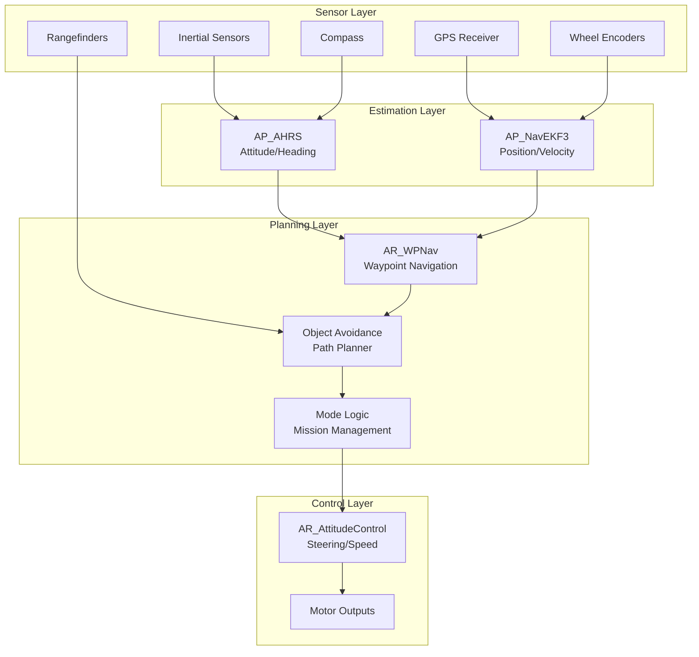
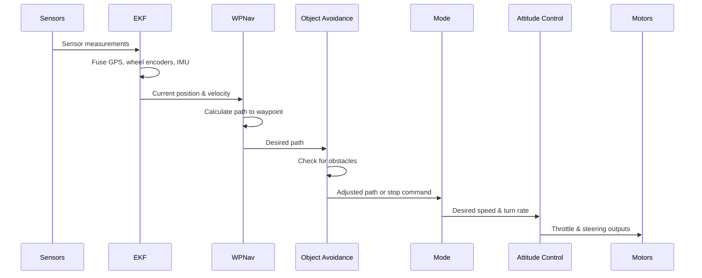
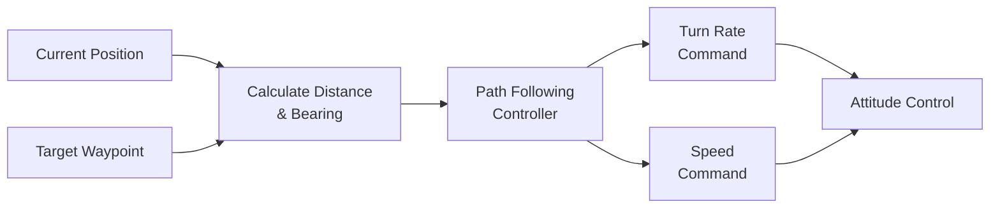
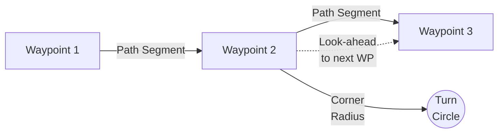
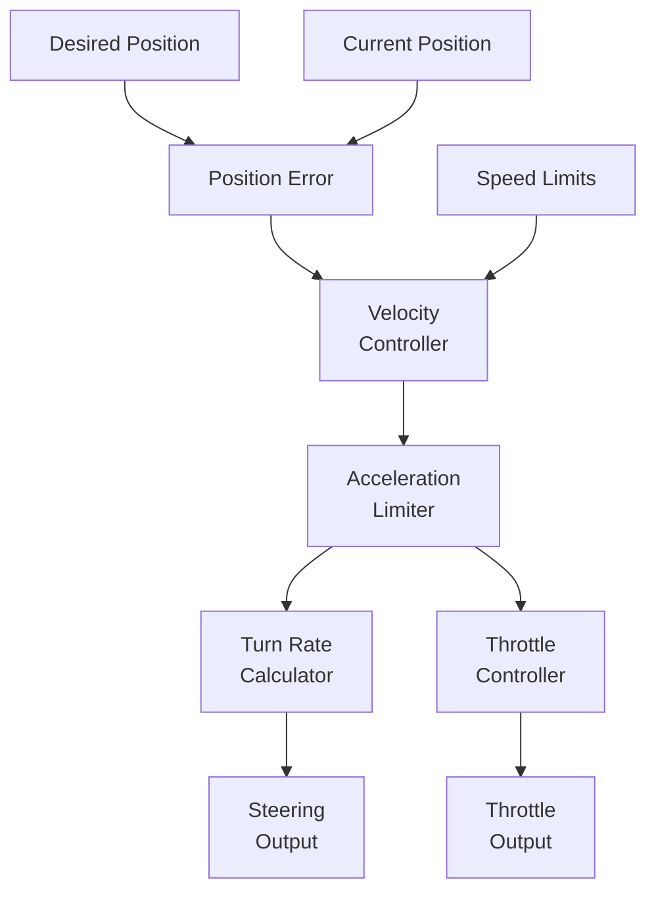
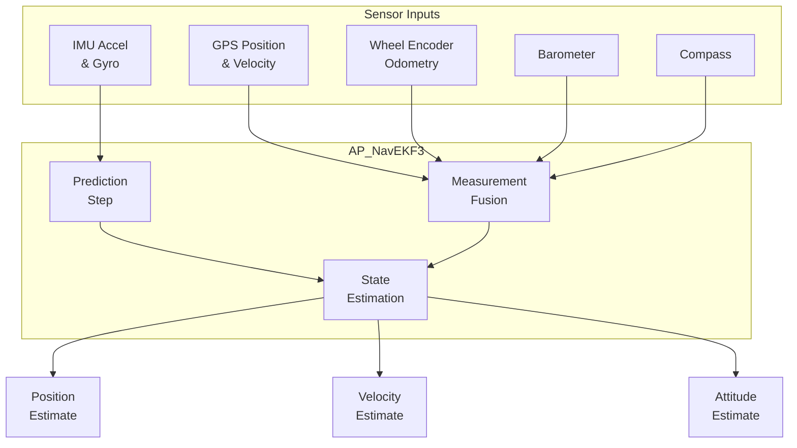
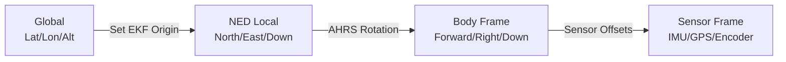
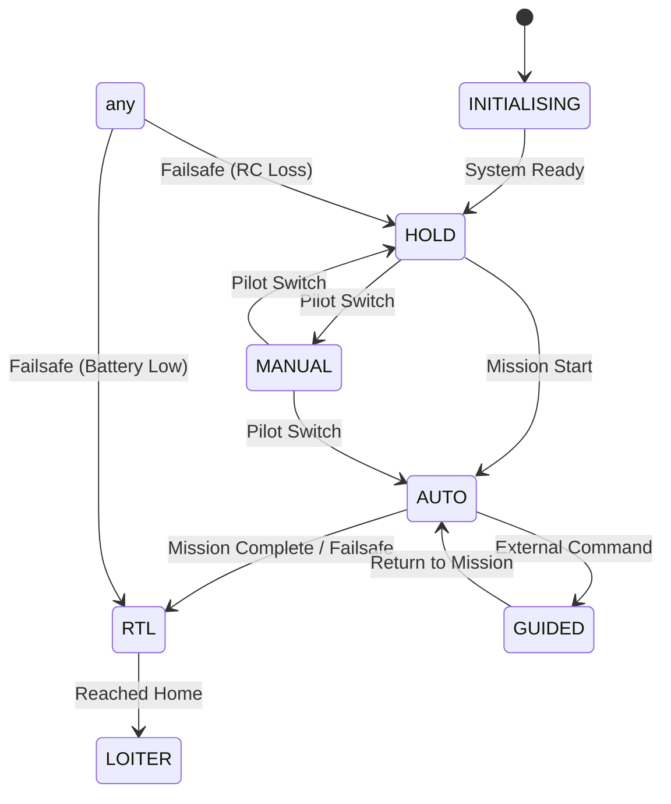
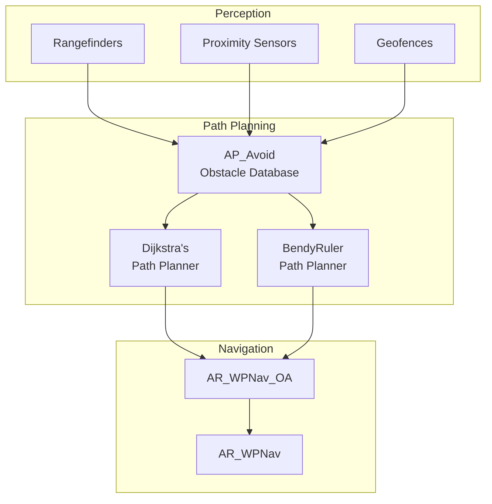
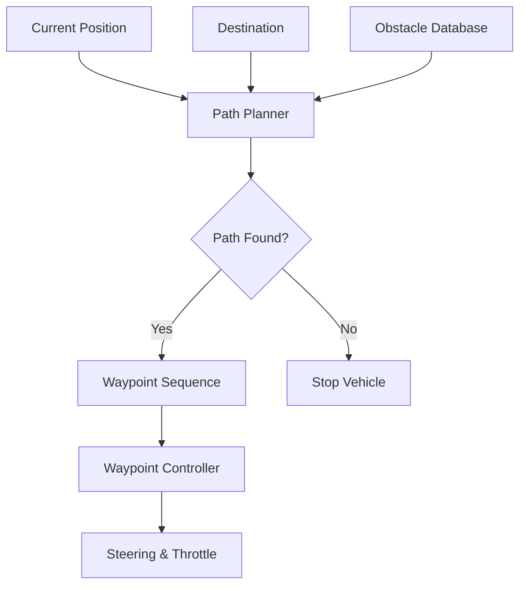

# ArduRover Navigation System


## Table of Contents
- [Overview](#overview)
- [System Architecture](#system-architecture)
- [Waypoint Navigation](#waypoint-navigation)
- [Position Control](#position-control)
- [Sensor Fusion](#sensor-fusion)
- [Coordinate Systems](#coordinate-systems)
- [Navigation Modes](#navigation-modes)
- [Object Avoidance Integration](#object-avoidance-integration)
- [Path Planning](#path-planning)
- [Configuration Parameters](#configuration-parameters)
- [Testing and Validation](#testing-and-validation)

## Overview

The ArduRover navigation system provides autonomous waypoint navigation, position control, and path following capabilities for ground and surface vehicles. The system integrates data from multiple sensors including GPS, wheel encoders, compass, and rangefinders to provide accurate position estimation and control.

**Source Files**: 
- `/Rover/mode.cpp`, `/Rover/mode.h` - Mode management and navigation commands
- `/libraries/AR_WPNav/` - Waypoint navigation library
- `/Rover/sensors.cpp` - Sensor integration and processing
- `/libraries/AP_AHRS/` - Attitude and Heading Reference System
- `/libraries/AP_NavEKF3/` - Extended Kalman Filter for state estimation

### Key Features

- **Waypoint Navigation**: Precise path following with look-ahead control
- **Position Control**: Closed-loop position and velocity control
- **Sensor Fusion**: Integration of GPS, wheel encoders, and IMU data
- **Object Avoidance**: Real-time obstacle detection and path replanning
- **Multiple Navigation Modes**: Auto, Guided, Loiter, RTL, SmartRTL, Circle, Dock
- **Path Planning**: Dijkstra's and BendyRuler path planners for obstacle avoidance
- **Coordinate System Management**: NED (North-East-Down) frame transformations

## System Architecture

The navigation system follows a layered architecture with clear separation between sensing, estimation, planning, and control layers.

### High-Level Architecture



**Source**: Architecture derived from `Rover/mode.h`, `Rover/mode.cpp`, and library integration patterns.

### Navigation Data Flow



**Source**: Sequence flow from `AR_WPNav_OA::update()` and `Mode::navigate_to_waypoint()`.

### Component Responsibilities

| Component | Primary Responsibility | Source Files |
|-----------|------------------------|--------------|
| **Mode** | High-level mission logic, mode transitions | `Rover/mode.h`, `Rover/mode.cpp` |
| **AR_WPNav** | Waypoint path following, turn rate calculation | `libraries/AR_WPNav/AR_WPNav.cpp` |
| **AR_WPNav_OA** | Object avoidance integration with waypoint navigation | `libraries/AR_WPNav/AR_WPNav_OA.cpp` |
| **AP_AHRS** | Attitude and heading estimation | `libraries/AP_AHRS/AP_AHRS.cpp` |
| **AP_NavEKF3** | Position and velocity estimation via Kalman filtering | `libraries/AP_NavEKF3/AP_NavEKF3_core.cpp` |
| **AR_AttitudeControl** | Low-level steering and speed control | `libraries/AR_AttitudeControl/` |
| **AP_OAPathPlanner** | Path planning around obstacles | `libraries/AP_OAPathPlanner/` |

## Waypoint Navigation

The AR_WPNav library provides the core waypoint navigation functionality, calculating desired turn rates and speeds to follow a path between waypoints.

### Waypoint Navigation Pipeline



**Source**: Based on `AR_WPNav::update()` and `Mode::navigate_to_waypoint()`.

### Core Navigation Methods

#### navigate_to_waypoint()
```cpp
// Source: Rover/mode.cpp:165
void Mode::navigate_to_waypoint()
```

High-level navigation function that:
1. Retrieves desired turn rate from AR_WPNav
2. Applies object avoidance constraints
3. Calls steering controller with turn rate command
4. Handles special cases (e.g., avoidance at low speed)

**Usage Pattern**:
```cpp
// Called in autonomous modes (Auto, Guided, RTL, etc.)
void ModeAuto::update() {
    navigate_to_waypoint();
    calc_throttle(target_speed, avoidance_enabled);
}
```

#### set_desired_location()
```cpp
// Source: Rover/mode.cpp:249
bool Mode::set_desired_location(const Location &destination, 
                                Location next_destination = Location())
```

Sets the target waypoint for navigation:
- **destination**: Target location in lat/lon/alt
- **next_destination**: Optional next waypoint for smooth cornering
- **Returns**: true if waypoint was set successfully

**Implementation Details**:
- Delegates to `AR_WPNav::set_desired_location()`
- Initializes distance tracking: `_distance_to_destination`
- Resets reached flag: `_reached_destination = false`
- Validates EKF origin and position estimate

**Source**: `Rover/mode.cpp:249-260`

### Waypoint Tracking Algorithm

The AR_WPNav library uses a **path following controller** rather than simple "point-to-point" navigation:

1. **Path Definition**: Creates a straight-line path from origin to destination
2. **Lateral Tracking**: Calculates cross-track error (perpendicular distance from path)
3. **Look-Ahead**: Projects a look-ahead point along the path
4. **Turn Rate Calculation**: Computes turn rate to track toward look-ahead point
5. **Speed Management**: Adjusts speed based on turn sharpness and proximity to waypoint

**Key Parameters**:
- `WP_SPEED`: Default navigation speed (m/s)
- `WP_RADIUS`: Waypoint acceptance radius (meters)
- `WP_OVERSHOOT`: Maximum overshoot allowed (meters)
- `TURN_RADIUS`: Minimum turning radius (meters)

**Source**: Parameter usage derived from `AR_WPNav` implementation.

### Cornering Behavior

When `next_destination` is provided, the navigation system implements intelligent cornering:



**Cornering Logic**:
1. As vehicle approaches waypoint within `WP_RADIUS`
2. System calculates turn circle to align with next segment
3. Speed is reduced based on turn sharpness: `v = sqrt(lat_accel_max * turn_radius)`
4. Vehicle cuts corner smoothly rather than stopping at waypoint

**Source**: Cornering behavior from AR_WPNav path tracking implementation.

### Distance and Bearing Calculations

```cpp
// Source: Rover/mode.cpp:213-228
float Mode::wp_bearing() const {
    return g2.wp_nav.wp_bearing_cd() * 0.01f;
}

float Mode::nav_bearing() const {
    return g2.wp_nav.nav_bearing_cd() * 0.01f;
}

float Mode::crosstrack_error() const {
    return g2.wp_nav.crosstrack_error();
}
```

**Navigation Metrics**:
- **wp_bearing**: Bearing (degrees) from current position to destination waypoint
- **nav_bearing**: Instantaneous bearing to track back to desired path (handles cross-track correction)
- **crosstrack_error**: Perpendicular distance (meters) from vehicle to desired path
- **get_desired_lat_accel**: Lateral acceleration command (m/s²) from path tracker

**Reporting**: These values are sent to ground station via `NAV_CONTROLLER_OUTPUT` MAVLink message for telemetry and monitoring.

## Position Control

Position control manages the vehicle's movement toward desired positions while respecting kinematic and dynamic constraints.

### Position Control Architecture



**Source**: Control flow from `Mode::calc_throttle()` and attitude control integration.

### Steering Control Methods

#### calc_steering_from_turn_rate()
```cpp
// Source: Rover/mode.cpp:468
void Mode::calc_steering_from_turn_rate(float turn_rate)
```

Converts a desired turn rate (rad/s) into steering output:
- **Input**: `turn_rate` - Desired turn rate in radians/sec (positive = right turn)
- **Processing**: Calls `AR_AttitudeControl::get_steering_out_rate()`
- **Output**: Steering command in range -4500 to +4500

**Usage**:
```cpp
// Get turn rate from waypoint controller
float desired_turn_rate_rads = g2.wp_nav.get_turn_rate_rads();
calc_steering_from_turn_rate(desired_turn_rate_rads);
```

**Source**: `Rover/mode.cpp:466-476`

#### calc_steering_from_lateral_acceleration()
```cpp
// Source: Rover/mode.cpp:481
void Mode::calc_steering_from_lateral_acceleration(float lat_accel, bool reversed)
```

Converts desired lateral acceleration into steering output:
- **Input**: `lat_accel` - Lateral acceleration in m/s² (positive = right)
- **Input**: `reversed` - True if vehicle is backing up
- **Processing**: Constrains to maximum G-force limits
- **Output**: Steering command via attitude controller

**Physics**: For Ackermann steering:
```
steering_angle = atan(lat_accel * wheelbase / velocity²)
```

**Source**: `Rover/mode.cpp:478-492`

#### calc_steering_to_heading()
```cpp
// Source: Rover/mode.cpp:496
void Mode::calc_steering_to_heading(float desired_heading_cd, 
                                   float rate_max_degs = 0.0f)
```

Commands vehicle to turn toward a specific heading:
- **Input**: `desired_heading_cd` - Target heading in centi-degrees (0-36000)
- **Input**: `rate_max_degs` - Maximum turn rate limit (deg/s), 0 = use default
- **Processing**: Heading controller with rate limiting
- **Output**: Steering command

**Control Law**: Proportional controller with rate limiting:
```
heading_error = wrap_180(desired_heading - current_heading)
turn_rate = constrain(Kp * heading_error, -rate_max, rate_max)
```

**Source**: `Rover/mode.cpp:494-505`

### Throttle Control

#### calc_throttle()
```cpp
// Source: Rover/mode.cpp:287
void Mode::calc_throttle(float target_speed, bool avoidance_enabled)
```

Calculates and applies throttle output to achieve target speed:

**Processing Steps**:
1. **Acceleration Limiting**: Applies configured acceleration limits
2. **Object Avoidance**: Reduces speed if obstacles detected (when enabled)
3. **Speed Controller**: PID control to match desired speed
4. **Stop Controller**: Special logic for controlled stops
5. **Balance Bot**: Additional pitch control for two-wheeled vehicles
6. **Sailboat**: Mainsail and throttle coordination

**Key Features**:
- Respects motor throttle limits (`MOT_THR_MIN`, `MOT_THR_MAX`)
- Handles forward and reverse operation
- Integrates with fence/avoidance system
- Sailboat-specific wind-based throttle control

**Source**: `Rover/mode.cpp:287-330`

### Speed Management

#### get_speed_default()
```cpp
// Source: Rover/mode.cpp:263
float Mode::get_speed_default(bool rtl) const
```

Returns appropriate default speed for current mode:
- **RTL modes**: Returns `RTL_SPEED` if configured, otherwise `WP_SPEED`
- **Other autopilot modes**: Returns `WP_SPEED`
- **Units**: meters per second

**Source**: `Rover/mode.cpp:262-270`

#### calc_speed_nudge()
```cpp
// Source: Rover/mode.cpp:387
float Mode::calc_speed_nudge(float target_speed, bool reversed)
```

Allows pilot to adjust autonomous mode speed via throttle stick:
- Reads pilot throttle input
- Converts to speed adjustment relative to cruise speed
- Maintains direction consistency (prevents conflicting inputs)
- Returns adjusted target speed

**Typical Use**: In Auto or Guided modes, pilot can speed up or slow down the vehicle while maintaining autonomous heading control.

**Source**: `Rover/mode.cpp:384-418`

### Controlled Stop

#### stop_vehicle()
```cpp
// Source: Rover/mode.cpp:333
bool Mode::stop_vehicle()
```

Performs a controlled deceleration to a complete stop:

**Stop Sequence**:
1. Applies deceleration-limited braking via `get_throttle_out_stop()`
2. Maintains zero turn rate (no steering input)
3. For balance bots, maintains pitch stability during stop
4. Relaxes sailboat sails to reduce propulsion
5. Returns `true` when vehicle velocity reaches zero

**Safety Note**: This function is critical for failsafe responses and must complete reliably even in degraded conditions.

**Source**: `Rover/mode.cpp:332-362`

## Sensor Fusion

The navigation system integrates data from multiple sensors through the Extended Kalman Filter (EKF) to provide robust position and velocity estimates.

### Sensor Integration Architecture



**Source**: EKF architecture from AP_NavEKF3 library integration.

### Wheel Encoder Integration

Wheel encoders provide critical odometry data, especially useful when GPS is unavailable or unreliable (indoors, under bridges, urban canyons).

#### update_wheel_encoder()
```cpp
// Source: Rover/sensors.cpp:12
void Rover::update_wheel_encoder()
```

**Processing Flow**:

1. **Update Encoder Readings**: Calls `g2.wheel_encoder.update()` to read sensor data
2. **Distance Tracking**: Stores cumulative distance for GCS telemetry
3. **Delta Calculations**: Computes angular change and time interval since last reading
4. **EKF Integration**: Sends data to EKF via `ahrs.EKF3.writeWheelOdom()`

**Wheel Odometry Data Structure**:
```cpp
// Parameters sent to EKF
float delta_angle;      // Change in wheel angle (radians)
float delta_time;       // Time interval (seconds)
uint32_t timestamp_ms;  // Measurement timestamp
Vector3f pos_offset;    // Wheel position relative to IMU (meters)
float wheel_radius;     // Wheel radius (meters)
```

**Source**: `Rover/sensors.cpp:12-79`

#### EKF Wheel Odometry Processing

The EKF uses wheel encoder data to:
- Estimate forward velocity more accurately than GPS alone
- Maintain position estimate during GPS dropout
- Detect wheel slip by comparing with accelerometer-based estimates
- Improve heading estimate through differential wheel speeds (skid-steer)

**Timing**: Wheel encoder data is sent to EKF at up to 50Hz, alternating between multiple sensors to maintain real-time performance.

**Configuration Parameters**:
- `WENC_TYPE`: Encoder type (quadrature, PPM, etc.)
- `WENC_CPR`: Counts per revolution
- `WENC_RADIUS`: Wheel radius in meters
- `WENC_POS_X`, `WENC_POS_Y`, `WENC_POS_Z`: Sensor position offset

**Source**: Implementation in `Rover/sensors.cpp:39-78`

### GPS Integration

GPS provides absolute position measurements in the global coordinate frame.

**GPS Data Used by Navigation**:
- **Position**: Latitude, longitude, altitude
- **Velocity**: 3D velocity vector (North, East, Down)
- **Heading**: Course over ground (when moving)
- **Quality Metrics**: HDOP, satellite count, fix type

**EKF GPS Fusion**:
- GPS position measurements correct for drift in IMU-integrated position
- Velocity measurements improve acceleration bias estimation
- Heading-from-velocity aids compass calibration
- Multiple GPS receivers can be blended for redundancy

**Configuration**:
- `GPS_TYPE`: GPS receiver type
- `GPS_AUTO_SWITCH`: Automatic switching between GPS receivers
- `EK3_GPS_TYPE`: How EKF uses GPS (0=use 3D velocity, 1=use 2D velocity, 2=use position only)

### IMU and Compass

**Inertial Measurement Unit (IMU)**:
- **Accelerometers**: Measure linear acceleration in body frame
- **Gyroscopes**: Measure angular velocity (roll, pitch, yaw rates)
- **Update Rate**: Typically 400Hz for fast response
- **Integration**: Provides high-rate attitude and acceleration inputs to EKF

**Compass (Magnetometer)**:
- **Purpose**: Absolute heading reference
- **Challenge**: Subject to magnetic interference from motors, batteries
- **Calibration**: Requires careful calibration procedure
- **Fusion**: EKF blends compass, GPS heading, and gyro integration

**Source**: Compass update in `Rover/sensors.cpp:6-9`

### Rangefinder Integration

```cpp
// Source: Rover/sensors.cpp:83
void Rover::read_rangefinders(void)
```

Rangefinders are used for:
- **Terrain Following**: Maintaining constant height above ground
- **Obstacle Detection**: Feeding object avoidance system
- **Landing/Docking**: Precision distance measurement for final approach

**Sensor Types Supported**:
- Lidar (laser rangefinders)
- Ultrasonic sensors
- Radar altimeters

**Source**: `Rover/sensors.cpp:82-90`

### Sensor Fusion Quality Indicators

The EKF provides health and quality metrics:

```cpp
// EKF status check (used in Mode::enter())
nav_filter_status filt_status;
rover.ahrs.get_filter_status(filt_status);

// Position estimate quality
bool position_ok = rover.ekf_position_ok() && !rover.failsafe.ekf;

// Velocity estimate quality
bool velocity_ok = filt_status.flags.horiz_vel;
```

**Health Checks**:
- **Origin Set**: EKF has established a local NED origin
- **Position Flags**: Horizontal and vertical position estimates valid
- **Velocity Flags**: Horizontal velocity estimate valid
- **EKF Failsafe**: No critical EKF errors detected

**Source**: EKF health checks from `Rover/mode.cpp:27-40`

### Sensor Failover and Redundancy

**GPS Failover**:
- Primary GPS failure → Switch to secondary GPS
- All GPS failure → Rely on wheel encoders and IMU (dead reckoning)

**Wheel Encoder Failover**:
- Multiple wheel encoders alternately provide data
- EKF detects inconsistencies (wheel slip) and adjusts weights

**IMU Redundancy**:
- Multiple IMUs can run in parallel
- EKF detects IMU failures and switches to backup

## Coordinate Systems

Understanding coordinate system conventions is critical for navigation system integration.

### Coordinate Frames



#### 1. Global Frame (WGS84)
- **Coordinates**: Latitude (degrees), Longitude (degrees), Altitude MSL (meters)
- **Usage**: Waypoint definitions, mission planning, GPS measurements
- **Convention**: Latitude positive north, longitude positive east, altitude above mean sea level

#### 2. NED Local Frame (North-East-Down)
- **Origin**: Set by EKF at arming or first valid position fix
- **Axes**: 
  - North: +X axis (points toward true/magnetic north based on config)
  - East: +Y axis
  - Down: +Z axis (positive downward)
- **Usage**: All EKF state estimation, path planning, position control
- **Units**: Meters

#### 3. Body Frame
- **Origin**: Vehicle center of gravity (CG)
- **Axes**:
  - Forward: +X axis (along vehicle longitudinal axis)
  - Right: +Y axis (perpendicular to vehicle, positive right)
  - Down: +Z axis (perpendicular to vehicle bottom)
- **Usage**: Sensor mounting offsets, control outputs, IMU measurements
- **Rotation**: Defined by roll, pitch, yaw (Euler angles) or quaternion

### Coordinate Transformations

#### Location to NED Position
```cpp
// Convert global lat/lon to local NED position
Location destination;  // In lat/lon/alt
Vector2f dest_NE = destination.get_distance_NE(origin);
float dest_down = -(destination.alt - origin.alt) * 0.01f;  // cm to m
```

#### Body to NED Rotation
```cpp
// Rotate body-frame vector to NED frame
Vector3f body_vector;  // In body frame
Vector3f ned_vector = ahrs.body_to_earth(body_vector);
```

#### Heading Conventions
- **Heading**: Measured clockwise from north (0° = north, 90° = east, 180° = south, 270° = west)
- **Internal Representation**: Often in centi-degrees (0 to 36000) for integer precision
- **Conversion**: `heading_degrees = heading_cd * 0.01f`

**Source**: Coordinate conventions used throughout AR_WPNav and Mode classes.

### Sensor Position Offsets

Sensors must be configured with their position relative to the vehicle's IMU:

**Configuration Parameters**:
- `GPS_POS_X`, `GPS_POS_Y`, `GPS_POS_Z`: GPS antenna position offset (meters)
- `WENC_POS_X`, `WENC_POS_Y`, `WENC_POS_Z`: Wheel encoder position offset (meters)

**Effect on Navigation**:
- EKF accounts for lever arm effects during vehicle rotation
- Improves position accuracy during aggressive maneuvers
- Critical for skid-steer vehicles with widely spaced encoders

**Source**: Position offset usage in `Rover/sensors.cpp:76`

## Navigation Modes

ArduRover supports multiple navigation modes with different behaviors and use cases.

### Mode Overview

| Mode | Autonomous | Position Required | Description |
|------|------------|-------------------|-------------|
| **MANUAL** | No | No | Direct pilot control, no stabilization |
| **ACRO** | No | No | Rate-controlled steering and throttle |
| **STEERING** | No | Velocity | Pilot steering with speed control |
| **HOLD** | Yes | No | Hold current position (stops motors) |
| **LOITER** | Yes | Yes | Hold position, return if drifting |
| **AUTO** | Yes | Yes | Follow mission waypoints |
| **GUIDED** | Yes | Yes | Navigate to GCS/companion computer target |
| **RTL** | Yes | Yes | Return to launch location |
| **SMART_RTL** | Yes | Yes | Return via recorded path |
| **CIRCLE** | Yes | Yes | Circle around a point |
| **FOLLOW** | Yes | Yes | Follow another vehicle |
| **SIMPLE** | No | No | Simplified steering relative to initial heading |
| **DOCK** | Yes | Yes | Autonomous docking to marker |

**Source**: Mode definitions from `Rover/mode.h:14-32`

### Mode State Machine



**Mode Transition Rules**:
- Transitions require valid position/velocity if destination mode needs them
- Arming prevented in certain modes (RTL, SmartRTL, Initialising)
- Failsafes can override pilot mode selection

**Source**: Mode transition logic from `Rover/mode.cpp:22-55`

### Autonomous Mode Details

#### AUTO Mode
**Purpose**: Execute a pre-programmed mission consisting of waypoint sequences and commands.

**Sub-Modes** (Source: `Rover/mode.h:308-317`):
- `WP`: Navigate to waypoint
- `HeadingAndSpeed`: Turn to heading and maintain speed
- `RTL`: Return to launch (within Auto)
- `Loiter`: Loiter at current location
- `Guided`: External navigation control
- `Stop`: Controlled stop
- `NavScriptTime`: Lua script navigation control
- `Circle`: Circle around point

**Mission Commands Supported**:
- `NAV_WAYPOINT`: Navigate to waypoint
- `NAV_LOITER_UNLIM`: Loiter indefinitely
- `NAV_LOITER_TIME`: Loiter for specified time
- `NAV_RETURN_TO_LAUNCH`: Return home
- `DO_CHANGE_SPEED`: Adjust navigation speed
- `DO_SET_REVERSE`: Enable/disable reverse driving
- `NAV_SET_YAW_SPEED`: Turn to heading at specific speed

**Source**: Auto mode implementation in `Rover/mode.h:243-407`

#### GUIDED Mode
**Purpose**: Navigate to targets provided by ground station or companion computer in real-time.

**Control Options** (Source: `Rover/mode.h:571-578`):
- `WP`: Waypoint navigation
- `HeadingAndSpeed`: Heading and speed control
- `TurnRateAndSpeed`: Turn rate and speed control
- `Loiter`: Position hold
- `SteeringAndThrottle`: Direct control from scripts
- `Stop`: Commanded stop

**Guided Limits**:
```cpp
// Source: Rover/mode.h:607-612
struct {
    uint32_t timeout_ms;    // Maximum time in Guided mode
    float horiz_max;        // Maximum distance from start point
    uint32_t start_time_ms; // Mode entry timestamp
    Location start_loc;     // Starting location
} limit;
```

**Usage**: Enables companion computer control for vision-based navigation, precision docking, or dynamic obstacle avoidance.

**Source**: Guided mode in `Rover/mode.h:509-613`

#### LOITER Mode
**Purpose**: Maintain current position, correcting for drift.

**Behavior**:
1. On entry, captures current location as loiter center
2. Continuously calculates position error from loiter center
3. Commands movement to return to center if drifting beyond threshold
4. Slowly reduces speed to zero as vehicle reaches center

**Source**: `Rover/mode.h:634-664`

#### RTL (Return To Launch) Mode
**Purpose**: Automatically navigate back to the launch location (arming point).

**Return Sequence**:
1. Calculate path from current position to launch location
2. Navigate to launch location using waypoint controller
3. Upon arrival, switch to loitering at launch location
4. Optionally disarm after configured timeout

**Speed**: Uses `RTL_SPEED` parameter if configured, otherwise uses `WP_SPEED`.

**Source**: `Rover/mode.h:690-723`

#### SMART_RTL Mode
**Purpose**: Return to launch by retracing the outbound path (breadcrumb trail).

**Smart Return States** (Source: `Rover/mode.h:757-762`):
- `WaitForPathCleanup`: Initialize path from saved points
- `PathFollow`: Follow recorded path in reverse
- `StopAtHome`: Arrived at home, loitering
- `Failure`: Path unavailable, mode failed

**Advantages**:
- Avoids obstacles encountered on outbound journey
- More reliable in complex environments (urban, forest)
- Uses less memory than full mission recording

**Path Recording**: Continuously saves position points during normal operation, maintaining a circular buffer.

**Source**: `Rover/mode.h:725-767`

#### CIRCLE Mode
**Purpose**: Drive in a circle around a configured center point.

**Configuration** (Source: `Rover/mode.h:453-460`):
```cpp
AP_Float radius;       // Circle radius (meters)
AP_Float speed;        // Speed around circle (m/s)
AP_Int8 direction;     // 0=clockwise, 1=counter-clockwise
```

**Circle Phases**:
1. **Drive to Edge**: Navigate from current position to circle edge
2. **Circling**: Maintain circular path at constant radius and speed

**Speed Limiting**: Maximum speed limited by: `v_max = sqrt(lat_accel_max * radius)`

**Source**: `Rover/mode.h:409-507`

#### DOCK Mode
**Purpose**: Autonomous docking to an AprilTag or visual marker.

**Docking Configuration** (Source: `Rover/mode.h:902-906`):
```cpp
AP_Float speed;             // Approach speed (m/s)
AP_Float desired_dir;       // Desired approach direction (degrees)
AP_Int8 hdg_corr_enable;    // Enable heading correction
AP_Float hdg_corr_weight;   // Heading correction weighting
AP_Float stopping_dist;     // Stop distance from target (m)
```

**Docking Sequence**:
1. Detect dock target via camera/sensor
2. Calculate relative position and heading to dock
3. Navigate toward dock with heading correction
4. Apply slowdown as approaching dock
5. Stop at configured stopping distance
6. Transition to loiter or disarm

**Source**: `Rover/mode.h:876-926`

### Mode Entry Requirements

```cpp
// Source: Rover/mode.cpp:22-55
bool Mode::enter() {
    // Check position estimate if required
    if (requires_position() && !position_ok) {
        return false;
    }
    
    // Check velocity estimate if required
    if (requires_velocity() && !velocity_ok) {
        return false;
    }
    
    // Call mode-specific entry function
    return _enter();
}
```

**Position/Velocity Requirements**:
- **Position Required**: Auto, Guided, RTL, SmartRTL, Loiter, Circle, Dock, Follow
- **Velocity Required**: Steering, Acro (non-skid-steer)
- **Neither Required**: Manual, Hold

**Source**: `Rover/mode.cpp:22-55`, `Rover/mode.h:88-89`

## Object Avoidance Integration

The navigation system integrates with the AP_OAPathPlanner library to enable real-time obstacle avoidance.

### Object Avoidance Architecture



**Source**: Object avoidance flow from `AR_WPNav_OA.cpp:26-150`

### AR_WPNav_OA Integration

The `AR_WPNav_OA` class extends `AR_WPNav` to integrate object avoidance:

```cpp
// Source: libraries/AR_WPNav/AR_WPNav_OA.h:5
class AR_WPNav_OA : public AR_WPNav {
    // Inherits all waypoint navigation functionality
    // Adds object avoidance path planning
};
```

### Object Avoidance Update Cycle

```cpp
// Source: AR_WPNav_OA.cpp:26
void AR_WPNav_OA::update(float dt)
```

**Processing Steps**:

1. **Validate Preconditions**:
   - Vehicle is armed
   - Destination is set and valid
   - Position estimate available
   - Forward speed available

2. **Backup Original Path**:
   - Store `_origin`, `_destination`, `_next_destination`
   - Allows restoration if avoidance deactivates

3. **Call Path Planner**:
   ```cpp
   // Source: AR_WPNav_OA.cpp:55-63
   AP_OAPathPlanner::OA_RetState oa_retstate = 
       oa->mission_avoidance(current_loc,
                            _origin_oabak,
                            _destination_oabak,
                            _next_destination_oabak,
                            oa_origin_new,
                            oa_destination_new,
                            oa_next_destination_new,
                            dest_to_next_dest_clear,
                            path_planner_used);
   ```

4. **Process Path Planner Result**:

   **OA_NOT_REQUIRED** (Source: AR_WPNav_OA.cpp:67-78):
   - No obstacles detected on path
   - Restore original destination if OA was previously active
   - Deactivate object avoidance mode

   **OA_PROCESSING** (Source: AR_WPNav_OA.cpp:80-85):
   - Path planner still calculating path
   - Command vehicle to stop until path ready

   **OA_ERROR** (Source: AR_WPNav_OA.cpp:80-85):
   - Path planner encountered error
   - Command vehicle to stop for safety

   **OA_SUCCESS** (Source: AR_WPNav_OA.cpp:87-133):
   - Valid avoidance path calculated
   - Update navigation destination to avoidance path waypoint
   - Behavior depends on path planner used:
     - **Dijkstra's**: Set new waypoint if changed
     - **BendyRuler**: Fast-update waypoint tracking

5. **Update Distance and Bearing**:
   ```cpp
   // Source: AR_WPNav_OA.cpp:136
   update_oa_distance_and_bearing_to_destination();
   ```

6. **Call Parent Update**:
   ```cpp
   // Source: AR_WPNav_OA.cpp:149
   AR_WPNav::update(dt);  // Normal waypoint navigation with OA destination
   ```

### Path Planner Algorithms

#### Dijkstra's Algorithm
**Use Case**: Complex environments with many obstacles, mission waypoint navigation.

**Characteristics**:
- Calculates optimal path through obstacle grid
- Updates path only when necessary (destination changed significantly)
- Higher computational cost, suitable for slower update rates
- Guarantees shortest obstacle-free path if one exists

**Configuration**: Enabled via `OA_TYPE` = Dijkstra's

#### BendyRuler Algorithm
**Use Case**: Fast-moving vehicles, dynamic obstacle avoidance, Guided mode.

**Characteristics**:
- Fast, reactive algorithm
- Projects "look-ahead" point and bends path around obstacles
- Updates every cycle, suitable for high-rate control (e.g., 10Hz)
- Lower computational cost than Dijkstra's
- May not find optimal path in complex mazes

**Configuration**: Enabled via `OA_TYPE` = BendyRuler

**Source**: Algorithm selection in `AR_WPNav_OA.cpp:89-132`

### Obstacle Avoidance Behavior

#### Normal Navigation
```
Vehicle --> Waypoint
```
Direct path from current position to destination.

#### Avoidance Active
```
Vehicle --> OA_Destination --> Waypoint
```
Vehicle navigates to intermediate avoidance waypoint, which is continuously updated to route around obstacles.

### Avoidance State Variables

```cpp
// Source: AR_WPNav_OA.h:35-44
bool _oa_active;                        // True when avoidance is active
Location _origin_oabak;                 // Backup of original origin
Location _destination_oabak;            // Backup of original destination
Location _next_destination_oabak;       // Backup of next destination
Location _oa_origin;                    // Current OA intermediate origin
Location _oa_destination;               // Current OA intermediate destination
float _oa_distance_to_destination;      // Distance to OA waypoint
float _oa_wp_bearing_cd;                // Bearing to OA waypoint
```

### Low-Speed Avoidance Behavior

```cpp
// Source: Rover/mode.cpp:455-459
#if AP_AVOIDANCE_ENABLED
if (g2.avoid.limits_active() && 
    (fabsf(attitude_control.get_desired_speed()) <= attitude_control.get_stop_speed())) {
    desired_turn_rate_rads = 0.0f;  // Don't turn at very low speed
}
#endif
```

**Rationale**: At very low speeds, steering commands are ineffective and can cause instability. Instead, vehicle stops and waits for obstacle to clear.

**Source**: `Rover/mode.cpp:455-459`

### Avoidance Speed Adjustment

```cpp
// Source: Rover/mode.cpp:294-295
g2.avoid.adjust_speed(0.0f, 0.5f * attitude_control.get_decel_max(), 
                     ahrs.get_yaw_rad(), target_speed, rover.G_Dt);
```

Speed is reduced when obstacles are detected:
- Uses half of maximum deceleration capability
- Considers vehicle heading relative to obstacle
- Allows time to plan and execute avoidance maneuver

**Source**: `Rover/mode.cpp:292-302`

## Path Planning

Path planning algorithms calculate collision-free paths from the current position to the destination.

### Path Planning Overview



### Obstacle Database

The `AP_Avoid` library maintains a dynamic database of obstacles from multiple sources:

**Obstacle Sources**:
1. **Rangefinders**: Direct distance measurements in multiple directions
2. **Proximity Sensors**: 360° obstacle detection (e.g., lidar)
3. **Geofences**: Pre-defined keep-out zones and boundaries
4. **ADS-B**: Other aircraft positions (for aerial rovers)

**Database Update**: Obstacles are continuously added, updated, and aged out as sensor data arrives.

### Dijkstra's Path Planning

**Algorithm Overview**:
1. Discretize environment into occupancy grid (e.g., 10m cells)
2. Mark cells with obstacles as occupied
3. Apply graph search from current position to destination:
   - Explore neighboring cells
   - Calculate cost (distance + penalty for proximity to obstacles)
   - Expand lowest-cost cells first
4. Reconstruct path by backtracking from destination to start
5. Smooth path to reduce waypoint count

**Grid Resolution**: Configurable via `OA_MARGIN_MAX` parameter (obstacle margin).

**Path Updates**: Recomputes path only when:
- Destination changes significantly (> 1 grid cell)
- New obstacles block current path
- Vehicle deviates from path

**Computational Cost**: O(N log N) where N = number of grid cells searched. Typically 10-50ms for moderate environments.

### BendyRuler Path Planning

**Algorithm Overview**:
1. Calculate direct bearing to destination ("ruler")
2. Project look-ahead point along bearing (distance depends on speed)
3. Check for obstacles along path to look-ahead point
4. If obstacles detected:
   - "Bend" the path to one side to avoid obstacle
   - Choose bend direction based on obstacle position and free space
5. Update look-ahead point to bent position
6. Calculate turn rate to track toward look-ahead point

**Update Rate**: Every cycle (10-20Hz typical).

**Advantages**:
- Fast, reactive to dynamic obstacles
- Smooth paths suitable for high-speed vehicles
- Low computational cost

**Limitations**:
- May not find path in complex mazes
- Can get stuck in local minima (U-shaped obstacles)

### Path Following vs. Path Planning

**Path Planning**: High-level algorithm that generates waypoint sequence
**Path Following**: Low-level controller that tracks a given path

```
Path Planning (1-10 Hz)
    ↓
Waypoint Sequence
    ↓
Path Following Controller (20-50 Hz)
    ↓
Turn Rate Command
    ↓
Steering Controller (50-400 Hz)
    ↓
Motor Outputs
```

This separation allows:
- Path planner to focus on strategic obstacle avoidance
- Path follower to handle smooth, stable trajectory tracking
- Steering controller to react to disturbances at high rate

## Configuration Parameters

### Waypoint Navigation Parameters

| Parameter | Default | Units | Description |
|-----------|---------|-------|-------------|
| `WP_SPEED` | 2.0 | m/s | Target speed in autonomous modes |
| `WP_RADIUS` | 2.0 | m | Waypoint acceptance radius |
| `WP_OVERSHOOT` | 2.0 | m | Maximum allowed waypoint overshoot |
| `TURN_RADIUS` | 0.9 | m | Minimum vehicle turning radius (0 = disable) |
| `TURN_MAX_G` | 0.2 | G | Maximum lateral acceleration in turns |
| `CRUISE_SPEED` | 2.0 | m/s | Target speed for MANUAL/ACRO modes |
| `CRUISE_THROTTLE` | 50 | % | Throttle for CRUISE_SPEED (used for speed scaling) |

**Source**: Parameter usage throughout AR_WPNav and Mode classes.

### Navigation Speed Parameters

| Parameter | Default | Units | Description |
|-----------|---------|-------|-------------|
| `SPEED_MAX` | 0 | m/s | Maximum vehicle speed (0 = auto-calculate) |
| `RTL_SPEED` | 0 | m/s | RTL mode speed (0 = use WP_SPEED) |
| `MOT_SPD_SCA_BASE` | 0.0 | m/s | Speed above which steering scales (0 = no scaling) |
| `ACCEL_MAX` | 0.0 | m/s² | Maximum acceleration (0 = no limit) |
| `DECEL_MAX` | 0.0 | m/s² | Maximum deceleration (0 = no limit) |

### Position Control Parameters

| Parameter | Default | Units | Description |
|-----------|---------|-------|-------------|
| `ATC_STR_RAT_FF` | 0.2 | none | Steering rate feed-forward |
| `ATC_STR_RAT_P` | 0.2 | none | Steering rate proportional gain |
| `ATC_STR_RAT_I` | 0.2 | none | Steering rate integral gain |
| `ATC_STR_RAT_D` | 0.0 | none | Steering rate derivative gain |
| `ATC_SPEED_P` | 0.2 | none | Speed controller proportional gain |
| `ATC_SPEED_I` | 0.2 | none | Speed controller integral gain |
| `ATC_SPEED_D` | 0.0 | none | Speed controller derivative gain |

### Wheel Encoder Parameters

| Parameter | Default | Description |
|-----------|---------|-------------|
| `WENC_TYPE` | 0 | Encoder type (0=None, 1=Quadrature) |
| `WENC_CPR` | 0 | Encoder counts per revolution |
| `WENC_RADIUS` | 0.0 | Wheel radius in meters |
| `WENC_POS_X` | 0.0 | Encoder X position offset (meters) |
| `WENC_POS_Y` | 0.0 | Encoder Y position offset (meters) |
| `WENC_POS_Z` | 0.0 | Encoder Z position offset (meters) |

**Source**: Wheel encoder configuration from `Rover/sensors.cpp` implementation.

### Object Avoidance Parameters

| Parameter | Default | Description |
|-----------|---------|-------------|
| `OA_TYPE` | 0 | Avoidance type (0=Disabled, 1=BendyRuler, 2=Dijkstra) |
| `OA_MARGIN_MAX` | 5.0 | Maximum distance from obstacle to remain (meters) |
| `OA_DB_SIZE` | 10 | Dijkstra's obstacle database size |
| `OA_DB_EXPIRE` | 10 | Obstacle expiry time (seconds) |
| `AVOID_ENABLE` | 0 | Avoidance bitmask (bit 0=fences, bit 1=proximity, bit 2=beacons) |
| `AVOID_MARGIN` | 2.0 | Vehicle margin from obstacles (meters) |

### EKF Parameters

| Parameter | Default | Description |
|-----------|---------|-------------|
| `EK3_ENABLE` | 1 | Enable EKF3 |
| `EK3_GPS_TYPE` | 0 | GPS mode (0=3D vel, 1=2D vel, 2=pos only, 3=no GPS) |
| `EK3_POSNE_M_NSE` | 0.5 | GPS position measurement noise (meters) |
| `EK3_VELD_M_NSE` | 0.5 | GPS velocity measurement noise (m/s) |
| `EK3_WENC_TYPE` | 0 | Wheel encoder type (0=none, 1=odometry) |
| `EK3_DRAG_BCOEF_X` | 0.0 | Ballistic coefficient for X drag |
| `EK3_DRAG_BCOEF_Y` | 0.0 | Ballistic coefficient for Y drag |

## Testing and Validation

### Simulation Testing (SITL)

The Software-In-The-Loop (SITL) simulator allows testing navigation algorithms before deployment:

```bash
# Start SITL with default rover
sim_vehicle.py -v Rover --console --map

# Load test mission
wp load missions/test_waypoints.txt

# Switch to AUTO mode and arm
mode AUTO
arm throttle
```

**Navigation Testing Scenarios**:
1. **Waypoint Navigation**: Simple waypoint sequences, verify path tracking
2. **Cornering**: Multi-waypoint missions, check smooth cornering
3. **Object Avoidance**: Place obstacles (FENCE_ENABLE), verify avoidance behavior
4. **GPS Dropout**: Simulate GPS loss, verify wheel encoder dead reckoning
5. **Mode Transitions**: Test transitions between modes during mission
6. **Failsafe**: Trigger failsafes (battery, RC loss), verify RTL behavior

**SITL Physics Models**:
- Ackermann steering (car-like)
- Skid steering (tank-like)
- Omni directional (mecanum wheels)
- Balance bot (two-wheeled balancing)
- Boat (with wind and current)

**Source**: SITL testing via Tools/autotest framework.

### Hardware-In-The-Loop (HIL) Testing

HIL connects flight controller hardware to simulator:
- Tests actual sensor timing and processing
- Validates real-time performance
- Catches hardware-specific issues

### Autotest Framework

Automated test suite for continuous integration:

```python
# Example autotest scenario
def drive_mission(self):
    """Test basic mission navigation."""
    self.load_mission("test_mission.txt")
    self.change_mode("AUTO")
    self.arm_vehicle()
    self.wait_waypoint(1, 4)  # Wait to reach waypoint 4
    self.wait_distance_to_home(3, 5)  # Within 5m of home
    self.disarm_vehicle()
```

**Test Coverage**:
- Mode functionality (HOLD, AUTO, GUIDED, RTL, etc.)
- Mission execution (waypoints, commands, logic)
- Failsafe behavior (RC loss, battery, EKF, fence)
- Sensor integration (GPS, encoders, rangefinders)
- Performance (timing, accuracy, stability)

**Source**: Tools/autotest/arducopter.py, Tools/autotest/rover.py

### Real-World Validation

**Navigation Accuracy Testing**:
1. **Static Positioning**: Verify GPS accuracy at known surveyed point
2. **Straight Line**: Drive straight path, measure deviation
3. **Waypoint Accuracy**: Navigate to surveyed waypoints, measure arrival position
4. **Repeatability**: Multiple runs of same mission, compare paths
5. **Wheel Encoder Calibration**: Drive known distance, compare encoder reading

**Performance Metrics**:
- **Cross-Track Error**: RMS deviation from desired path (typical: <1m)
- **Waypoint Arrival Accuracy**: Distance from waypoint at "reached" (typical: <2m)
- **Position Drift**: Position error growth during GPS dropout (typical: <5% of distance)
- **Heading Accuracy**: RMS heading error during straight driving (typical: <5°)

### Tuning Procedures

**Speed Controller Tuning**:
1. Set `CRUISE_SPEED` to desired speed
2. Drive in STEERING mode, adjust `CRUISE_THROTTLE` until speed maintained
3. Increase `ATC_SPEED_P` until speed oscillates, then reduce by 50%
4. Add `ATC_SPEED_I` to eliminate steady-state error
5. Verify speed response time <2 seconds

**Steering Controller Tuning**:
1. Drive straight in STEERING mode
2. Increase `ATC_STR_RAT_P` until steering oscillates, reduce by 50%
3. Add `ATC_STR_RAT_I` if vehicle drifts off heading
4. Tune `ATC_STR_RAT_FF` to reduce lag in turns
5. Verify heading holds within ±5° in straight driving

**Waypoint Navigation Tuning**:
1. Set `TURN_RADIUS` to minimum physical turning radius
2. Set `TURN_MAX_G` to comfortable lateral acceleration
3. Adjust `WP_RADIUS` based on desired accuracy (larger = less overshoot)
4. Tune `WP_OVERSHOOT` to acceptable overshoot distance
5. Verify smooth cornering and acceptable tracking error

### Logging and Diagnostics

**Key Log Messages**:
- **ATT**: Attitude (roll, pitch, yaw)
- **POSO**: Position (lat, lon, alt)
- **CTRL**: Control outputs (steering, throttle, turn rate)
- **NTUN**: Navigation tuning (desired vs. actual position, speed)
- **WPD**: Waypoint distance and bearing
- **EKF3**: EKF state and innovations

**Analysis Tools**:
- MAVProxy: Real-time monitoring and plotting
- Mission Planner: Log review and graphing
- UAV Log Viewer: Advanced log analysis
- Custom Python scripts: Batch processing and statistics

**Diagnostic Checks**:
- EKF innovations (should be small, <3 sigma)
- Control saturation (steering/throttle should not saturate continuously)
- Cross-track error (should converge to near zero)
- Speed tracking (actual speed should match desired)

## Troubleshooting

### Common Navigation Issues

**Vehicle Won't Enter AUTO/GUIDED Mode**:
- **Cause**: EKF not providing valid position estimate
- **Check**: `EKF_POS_HORIZ_ABS` log message, GPS lock status
- **Fix**: Wait for GPS 3D fix, calibrate compass, check EKF parameters

**Vehicle Drives Past Waypoints**:
- **Cause**: `WP_RADIUS` too small, speed too high, poor GPS accuracy
- **Check**: `WPD` log messages, actual waypoint arrival distance
- **Fix**: Increase `WP_RADIUS`, reduce `WP_SPEED`, improve GPS reception

**Erratic Navigation, Circling**:
- **Cause**: Poor compass calibration, GPS/compass alignment, EKF issues
- **Check**: `MAG` vs. `GPS heading`, EKF innovations
- **Fix**: Recalibrate compass, check `COMPASS_ORIENT`, adjust `EK3_MAG_NOISE`

**Slow Response in Autonomous Modes**:
- **Cause**: Low controller gains, high acceleration limits, low speed setting
- **Check**: `NTUN` desired vs. actual speed, `CTRL` steering saturation
- **Fix**: Increase `ATC_SPEED_P`, `ATC_STR_RAT_P`, reduce `ACCEL_MAX`

**Object Avoidance Not Working**:
- **Cause**: `OA_TYPE` disabled, no obstacle sensors, insufficient margin
- **Check**: `OA_TYPE` parameter, rangefinder data, `AVOID_ENABLE`
- **Fix**: Enable object avoidance, configure sensors, adjust `AVOID_MARGIN`

**Position Drift During GPS Loss**:
- **Cause**: No wheel encoders, poor wheel encoder calibration, wheel slip
- **Check**: `EKF3` position innovations during GPS dropout
- **Fix**: Install wheel encoders, calibrate `WENC_CPR` and `WENC_RADIUS`

## References

### Source Code

- **Rover Modes**: `Rover/mode.h`, `Rover/mode.cpp`, `Rover/mode_*.cpp`
- **Waypoint Navigation**: `libraries/AR_WPNav/AR_WPNav.cpp`, `libraries/AR_WPNav/AR_WPNav_OA.cpp`
- **Attitude Control**: `libraries/AR_AttitudeControl/AR_AttitudeControl.cpp`
- **Sensor Integration**: `Rover/sensors.cpp`, `libraries/AP_NavEKF3/`
- **Object Avoidance**: `libraries/AP_OAPathPlanner/`, `libraries/AP_Avoidance/`

### Documentation

- ArduPilot Wiki: https://ardupilot.org/rover/
- Developer Documentation: https://ardupilot.org/dev/
- MAVLink Protocol: https://mavlink.io/en/
- Parameter Reference: https://ardupilot.org/rover/docs/parameters.html

### Related Documents

- `/Rover/README.md` - ArduRover system architecture
- `/libraries/AP_HAL/README.md` - Hardware abstraction layer
- `/libraries/AP_AHRS/README.md` - Attitude estimation
- `/libraries/AP_NavEKF3/README.md` - Extended Kalman Filter
- `/docs/COORDINATE_SYSTEMS.md` - Coordinate frame conventions

---

**Document Version**: 1.0  
**Last Updated**: 2024  
**Author**: ArduPilot Development Team  
**License**: GPLv3  
