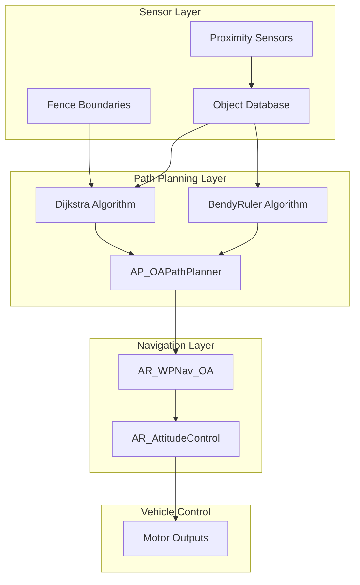
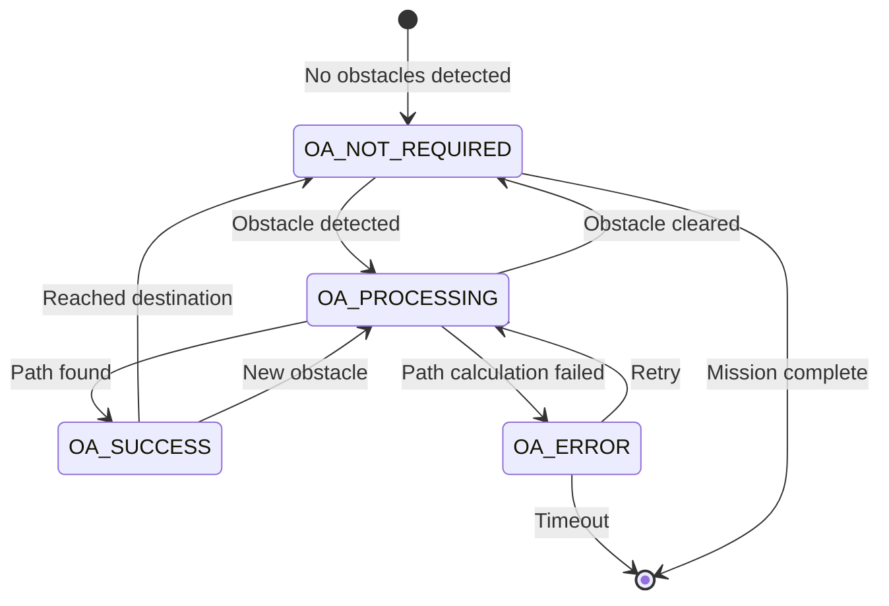
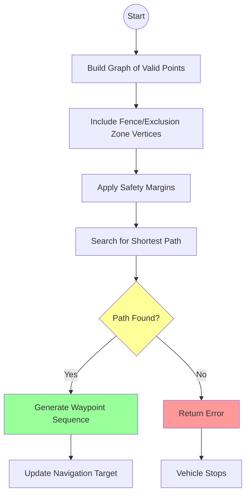
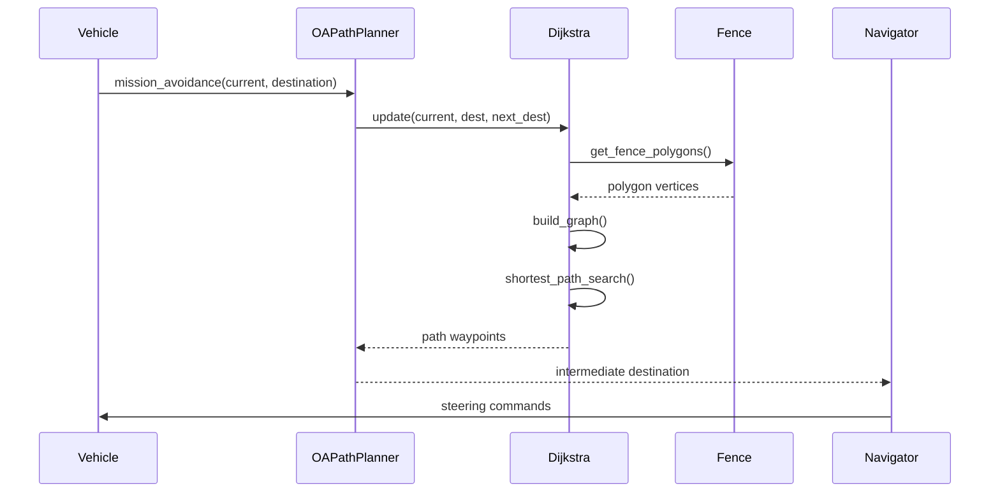
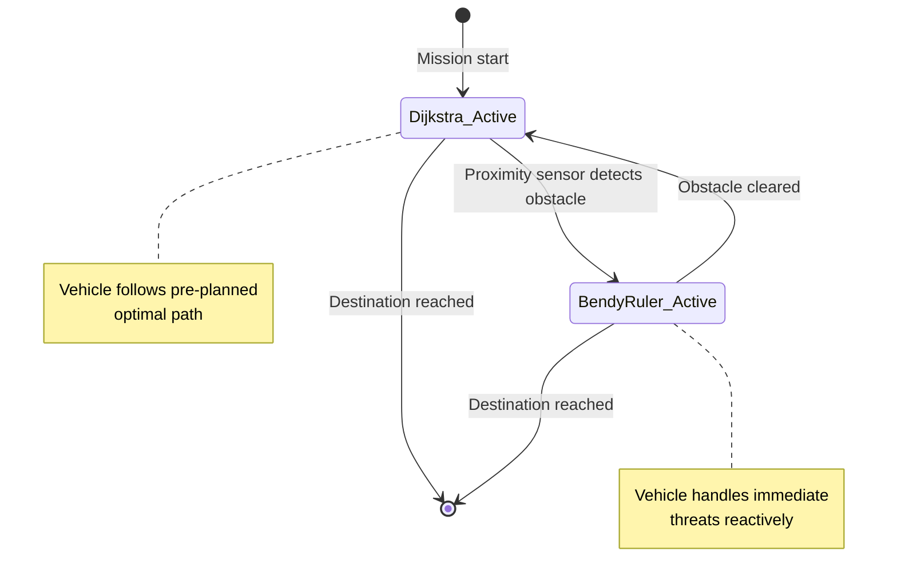
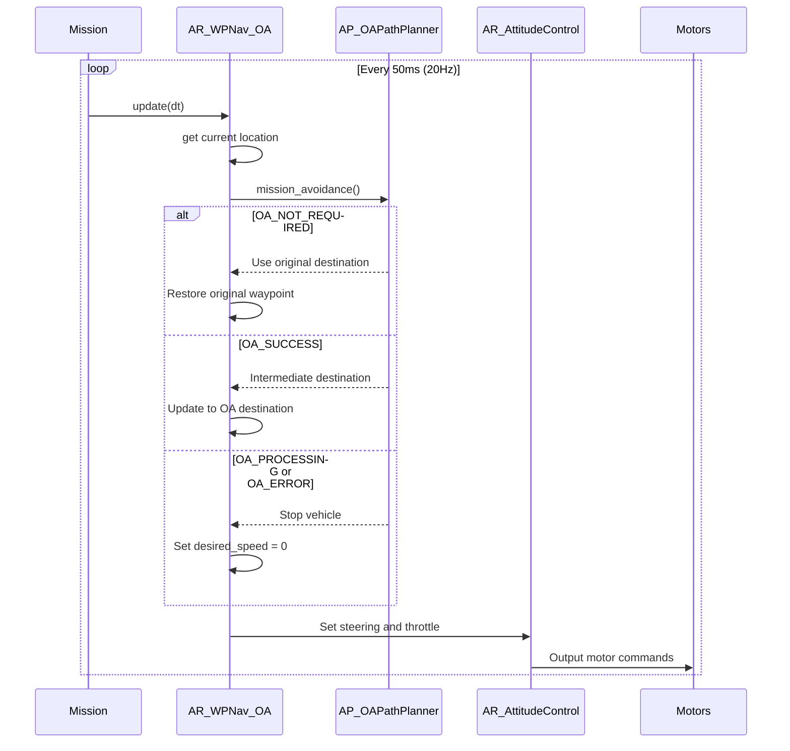
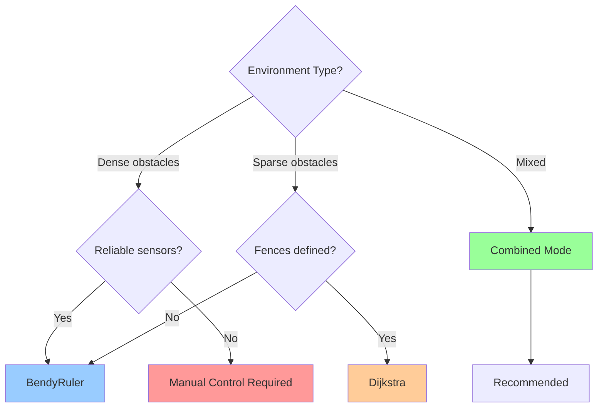
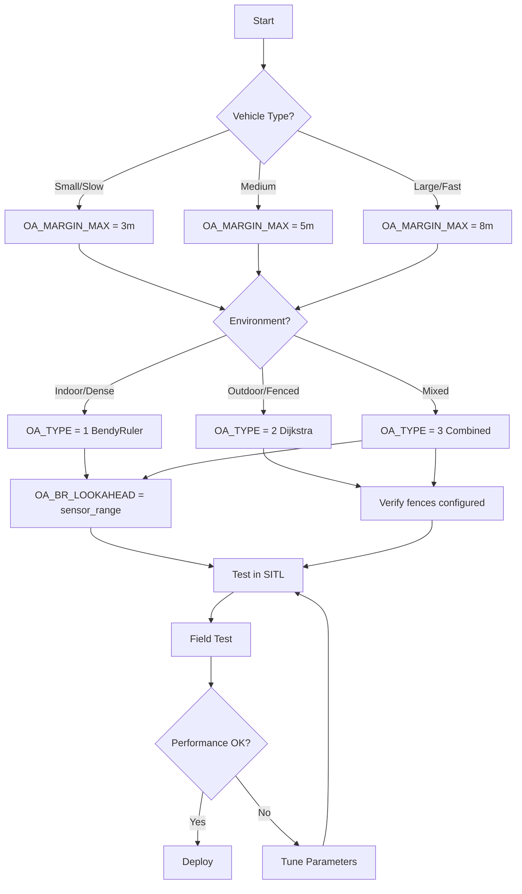
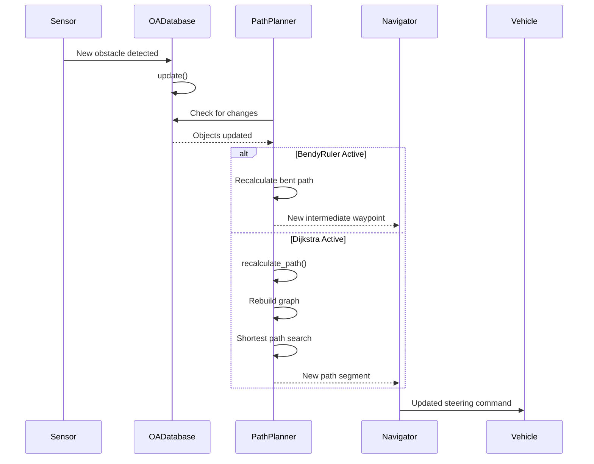

# ArduRover Path Planning and Obstacle Avoidance


## Table of Contents
- [Overview](#overview)
- [Path Planning Architecture](#path-planning-architecture)
- [BendyRuler Algorithm](#bendyruler-algorithm)
- [Dijkstra Algorithm](#dijkstra-algorithm)
- [Combined Mode Strategy](#combined-mode-strategy)
- [Waypoint Navigation Integration](#waypoint-navigation-integration)
- [Algorithm Selection Guide](#algorithm-selection-guide)
- [Configuration Parameters](#configuration-parameters)
- [Dynamic Replanning](#dynamic-replanning)
- [Performance Considerations](#performance-considerations)
- [Troubleshooting](#troubleshooting)

## Overview

ArduRover's path planning system provides autonomous obstacle avoidance capabilities for ground vehicles navigating complex environments. The system integrates two complementary algorithms—**BendyRuler** for real-time local obstacle avoidance and **Dijkstra's algorithm** for global optimal path finding—to enable robust navigation around static obstacles (fences, exclusion zones) and dynamic obstacles detected by proximity sensors.

**Key Capabilities:**
- Real-time obstacle detection and avoidance using proximity sensors
- Pre-planned paths around known fence boundaries and exclusion zones
- Smooth path generation that respects vehicle dynamics
- Dynamic replanning when new obstacles are encountered
- Seamless integration with mission waypoint navigation

**Source Files:**
- `/libraries/AC_Avoidance/AP_OAPathPlanner.h` - Main path planner interface
- `/libraries/AC_Avoidance/AP_OAPathPlanner.cpp` - Path planner implementation
- `/libraries/AC_Avoidance/AP_OABendyRuler.cpp` - BendyRuler algorithm
- `/libraries/AC_Avoidance/AP_OADijkstra.cpp` - Dijkstra's algorithm
- `/libraries/AR_WPNav/AR_WPNav_OA.h` - Rover waypoint navigation with OA
- `/libraries/AR_WPNav/AR_WPNav_OA.cpp` - Rover OA integration

## Path Planning Architecture

### System Components



### Thread Architecture

The path planning system operates in a dedicated background thread to prevent blocking the main control loop:

```cpp
// Source: /libraries/AC_Avoidance/AP_OAPathPlanner.cpp:167
if (!hal.scheduler->thread_create(FUNCTOR_BIND_MEMBER(&AP_OAPathPlanner::avoidance_thread, void),
                                  "avoidance",
                                  8192, AP_HAL::Scheduler::PRIORITY_IO, -1)) {
    return false;
}
```

**Thread Characteristics:**
- **Thread Name**: `avoidance`
- **Stack Size**: 8192 bytes
- **Priority**: `PRIORITY_IO` (low priority, uses spare CPU cycles)
- **Update Rate**: 1 Hz (configurable via `OA_UPDATE_MS`)
- **Timeout**: 3 seconds (`OA_TIMEOUT_MS`)

### State Machine



**Return States (Source: `/libraries/AC_Avoidance/AP_OAPathPlanner.h:39`)**:
- `OA_NOT_REQUIRED` (0): Object avoidance is not currently needed
- `OA_PROCESSING` (1): Computing alternative path (vehicle should slow/stop)
- `OA_ERROR` (2): Error during calculation (vehicle stops)
- `OA_SUCCESS` (3): Alternative path computed and available

## BendyRuler Algorithm

### Algorithm Overview

BendyRuler is a **reactive local obstacle avoidance algorithm** designed for real-time avoidance of obstacles detected by proximity sensors (lidar, sonar, etc.). It operates by "bending" the direct path to the destination around obstacles, similar to bending a ruler around an obstruction.

**Characteristics:**
- **Response Time**: Very fast (operates at sensor update rates)
- **Lookahead Distance**: Configurable (default 5-30 meters)
- **Planning Horizon**: Local (only considers nearby obstacles)
- **Computational Cost**: Low (simple geometric calculations)
- **Best For**: Dynamic obstacles, cluttered environments, real-time response

### How BendyRuler Works


**Algorithm Steps:**

1. **Obstacle Detection**: Analyzes proximity sensor data to identify obstacles within the lookahead distance
2. **Safety Margin Application**: Expands obstacle boundaries by the configured margin (`OA_MARGIN_MAX`)
3. **Path Bending**: Calculates lateral offset needed to clear obstacles while progressing toward destination
4. **Intermediate Point Generation**: Creates a temporary waypoint that avoids obstacles
5. **Continuous Update**: Recalculates path every update cycle as sensor data refreshes

### BendyRuler Types

**Source**: `/libraries/AC_Avoidance/AP_OAPathPlanner.h:49`

```cpp
enum OAPathPlannerUsed : uint8_t {
    None = 0,
    BendyRulerHorizontal,   // Used by ground vehicles and surface vessels
    BendyRulerVertical,     // Used by aerial vehicles (Copter)
    Dijkstras
};
```

**For Rovers**: Only `BendyRulerHorizontal` is applicable, which operates in the 2D ground plane.

### BendyRuler Configuration

**Primary Parameters** (Source: `/libraries/AC_Avoidance/AP_OABendyRuler.cpp:var_info[]`):

| Parameter | Description | Default | Range | Units |
|-----------|-------------|---------|-------|-------|
| `OA_BR_LOOKAHEAD` | Lookahead distance for obstacle detection | 15 | 1-100 | meters |
| `OA_BR_CONT_RATIO` | Proportion of lookahead distance used for path smoothing | 0.7 | 0.1-1.0 | ratio |
| `OA_BR_CONT_ANGLE` | Maximum angle change for path continuity | 30 | 0-90 | degrees |
| `OA_MARGIN_MAX` | Maximum avoidance margin | 5 | 0.1-100 | meters |

### When to Use BendyRuler

**✅ Ideal Situations:**
- Dense obstacle fields with frequently changing layout
- Moving obstacles (people, vehicles, animals)
- Indoor navigation where sensor range covers environment
- Situations requiring immediate reactive avoidance
- When computational resources are limited

**❌ Not Recommended For:**
- Sparse static obstacles (Dijkstra more efficient)
- Environments with complex fence boundaries
- Long-distance navigation with known obstacles
- Situations where optimal path length is critical

### BendyRuler Integration Example

```cpp
// Source: /libraries/AC_Avoidance/AP_OAPathPlanner.cpp:314
case OA_PATHPLAN_BENDYRULER: {
    if (_oabendyruler == nullptr) {
        continue;
    }
    _oabendyruler->set_config(_margin_max);
    
    AP_OABendyRuler::OABendyType bendy_type;
    if (_oabendyruler->update(avoidance_request2.current_loc, 
                             avoidance_request2.destination, 
                             avoidance_request2.ground_speed_vec, 
                             origin_new, 
                             destination_new, 
                             bendy_type, 
                             false)) {
        res = OA_SUCCESS;
    }
    path_planner_used = map_bendytype_to_pathplannerused(bendy_type);
    break;
}
```

## Dijkstra Algorithm

### Algorithm Overview

Dijkstra's algorithm is a **global path planning algorithm** that computes the optimal (shortest) path from the vehicle's current position to the destination while avoiding static obstacles like fence boundaries and exclusion zones. It builds a graph of possible paths and uses classic shortest-path search.

**Characteristics:**
- **Response Time**: Moderate (1 Hz updates, 3-second timeout)
- **Planning Horizon**: Global (entire mission area)
- **Computational Cost**: Moderate to high (graph search)
- **Path Quality**: Optimal (shortest safe path)
- **Best For**: Static obstacles, fences, known exclusion zones, optimal routing

### How Dijkstra Works



### Graph Construction

Dijkstra's algorithm builds a navigation graph from:

1. **Fence Boundaries**: Vertices from inclusion/exclusion fence polygons
2. **Vehicle Position**: Current location as start node
3. **Destination**: Target waypoint as goal node
4. **Safety Margins**: Expanded obstacle boundaries (`OA_MARGIN_MAX`)

**Connectivity Rules:**
- Edges connect nodes that have line-of-sight (no fence intersection)
- Edge weights are Euclidean distances between nodes
- Invalid edges (crossing fences) are excluded from graph

### Path Finding Process



### Dijkstra States

**Source**: `/libraries/AC_Avoidance/AP_OAPathPlanner.cpp:341`

```cpp
switch (dijkstra_state) {
case AP_OADijkstra::DIJKSTRA_STATE_NOT_REQUIRED:
    res = OA_NOT_REQUIRED;
    break;
case AP_OADijkstra::DIJKSTRA_STATE_ERROR:
    res = OA_ERROR;
    break;
case AP_OADijkstra::DIJKSTRA_STATE_SUCCESS:
    res = OA_SUCCESS;
    break;
}
```

### Dijkstra Configuration

**Primary Parameters**:

| Parameter | Description | Impact |
|-----------|-------------|--------|
| `OA_MARGIN_MAX` | Fence avoidance margin | Larger values keep vehicle farther from fences but may reduce passable areas |
| `OA_OPTIONS` bit 1 | Log Dijkstra points | Enables logging of graph nodes and computed paths for debugging |
| `OA_OPTIONS` bit 2 | Fast waypoints (Copter only) | Not applicable to Rover |

**Configuration Example:**
```cpp
// Source: /libraries/AC_Avoidance/AP_OAPathPlanner.cpp:333
_oadijkstra->set_fence_margin(_margin_max);
const AP_OADijkstra::AP_OADijkstra_State dijkstra_state = 
    _oadijkstra->update(avoidance_request2.current_loc,
                       avoidance_request2.destination,
                       avoidance_request2.next_destination,
                       origin_new,
                       destination_new,
                       next_destination_new,
                       dest_to_next_dest_clear);
```

### When to Use Dijkstra

**✅ Ideal Situations:**
- Well-defined fence boundaries
- Static exclusion zones (buildings, hazards)
- Long-distance navigation where path efficiency matters
- Open areas with sparse obstacles
- Missions requiring repeatable paths

**❌ Not Recommended For:**
- Highly dynamic environments
- Dense obstacle fields detected only by proximity sensors
- Situations requiring sub-second response times
- Environments without pre-defined fence boundaries

## Combined Mode Strategy

### Hybrid Approach Overview

The **Dijkstra + BendyRuler combined mode** (`OA_PATHPLAN_DJIKSTRA_BENDYRULER`) provides the best of both algorithms by using Dijkstra for global path planning and BendyRuler for immediate reactive obstacle avoidance.

**Operation Philosophy:**
- **Dijkstra** handles the strategic routing around known static obstacles
- **BendyRuler** handles tactical avoidance of dynamic obstacles detected by sensors
- Automatic switching based on obstacle proximity

### Switching Logic



**Source**: `/libraries/AC_Avoidance/AP_OAPathPlanner.cpp:357`

```cpp
case OA_PATHPLAN_DJIKSTRA_BENDYRULER: {
    if ((_oabendyruler == nullptr) || _oadijkstra == nullptr) {
        continue;
    } 
    _oabendyruler->set_config(_margin_max);
    AP_OABendyRuler::OABendyType bendy_type;
    
    // Try BendyRuler first for immediate obstacles
    if (_oabendyruler->update(avoidance_request2.current_loc, 
                             avoidance_request2.destination, 
                             avoidance_request2.ground_speed_vec, 
                             origin_new, 
                             destination_new, 
                             bendy_type, 
                             proximity_only)) {
        // Detected obstacle by proximity sensor - use BendyRuler
        proximity_only = false;
        res = OA_SUCCESS;
        path_planner_used = map_bendytype_to_pathplannerused(bendy_type);
        break;
    } else {
        // Cleared all obstacles - trigger Dijkstra recalculation
        if (proximity_only == false) {
            _oadijkstra->recalculate_path();
        }
        proximity_only = true;
    }
    
    // Use Dijkstra for global path planning
    _oadijkstra->set_fence_margin(_margin_max);
    const AP_OADijkstra::AP_OADijkstra_State dijkstra_state = 
        _oadijkstra->update(avoidance_request2.current_loc,
                           avoidance_request2.destination,
                           avoidance_request2.next_destination,
                           origin_new,
                           destination_new,
                           next_destination_new,
                           dest_to_next_dest_clear);
    // ... handle dijkstra_state ...
}
```

### Behavioral States

| State | Active Algorithm | Vehicle Behavior | Trigger |
|-------|-----------------|------------------|---------|
| **Nominal** | Dijkstra | Follows pre-planned optimal path | No proximity obstacles |
| **Reactive** | BendyRuler | Deviates to avoid immediate obstacle | Proximity sensor detection |
| **Recovery** | Dijkstra | Recalculates path from deviated position | Obstacle cleared |

### Combined Mode Benefits

**✅ Advantages:**
- **Best path efficiency**: Dijkstra provides optimal routing
- **Safety**: BendyRuler handles unexpected obstacles
- **Robustness**: Graceful degradation if one algorithm fails
- **Flexibility**: Adapts to both static and dynamic environments

**⚠️ Considerations:**
- **Higher CPU usage**: Both algorithms run simultaneously
- **More complex tuning**: Must configure two parameter sets
- **Memory overhead**: Both algorithms loaded in memory

### Transition Handling

When transitioning between algorithms, the system ensures smooth paths:

1. **BendyRuler → Dijkstra**: 
   - Dijkstra recalculates from current (deviated) position
   - Prevents vehicle from snapping back to original path
   
2. **Dijkstra → BendyRuler**:
   - BendyRuler uses Dijkstra's destination as target
   - Maintains mission continuity

## Waypoint Navigation Integration

### AR_WPNav_OA Architecture

The `AR_WPNav_OA` class extends the base `AR_WPNav` waypoint navigator to integrate object avoidance seamlessly into mission execution.

**Class Hierarchy:**
```
AR_WPNav (base waypoint navigation)
    └── AR_WPNav_OA (adds object avoidance)
```

**Source**: `/libraries/AR_WPNav/AR_WPNav_OA.h:5`

### Update Cycle Integration



### Destination Backup and Restore

The system maintains backup copies of the original mission waypoints to enable proper restoration when avoidance is no longer needed:

**Source**: `/libraries/AR_WPNav/AR_WPNav_OA.cpp:44`

```cpp
// backup _origin, _destination and _next_destination when not doing oa
if (!_oa_active) {
    _origin_oabak = _origin;
    _destination_oabak = _destination;
    _next_destination_oabak = _next_destination;
}
```

**Restoration** (Source: `/libraries/AR_WPNav/AR_WPNav_OA.cpp:68`):
```cpp
case AP_OAPathPlanner::OA_NOT_REQUIRED:
    if (_oa_active) {
        // object avoidance has become inactive so reset target to original destination
        if (!AR_WPNav::set_desired_location(_destination_oabak)) {
            INTERNAL_ERROR(AP_InternalError::error_t::flow_of_control);
            stop_vehicle = true;
        }
        _oa_active = false;
    }
    break;
```

### Avoidance State Management

**Member Variables** (Source: `/libraries/AR_WPNav/AR_WPNav_OA.h:36`):

```cpp
bool _oa_active;                    // true if using alternative destination
Location _origin_oabak;             // backup of original origin
Location _destination_oabak;        // backup of original destination  
Location _next_destination_oabak;   // backup of next waypoint
Location _oa_origin;                // intermediate origin during avoidance
Location _oa_destination;           // intermediate destination during avoidance
Location _oa_next_destination;      // intermediate next destination
float _oa_distance_to_destination;  // distance to OA destination (meters)
float _oa_wp_bearing_cd;            // bearing to OA destination (centidegrees)
```

### Algorithm-Specific Handling

Different path planners require different update strategies:

**Dijkstra** (Source: `/libraries/AR_WPNav/AR_WPNav_OA.cpp:99`):
```cpp
case AP_OAPathPlanner::OAPathPlannerUsed::Dijkstras:
    // Action only needed if path planner just became active or destination changed
    if (!_oa_active || !oa_destination_new.same_latlon_as(_oa_destination)) {
        if (AR_WPNav::set_desired_location(oa_destination_new)) {
            _oa_active = true;
            _oa_origin = oa_origin_new;
            _oa_destination = oa_destination_new;
        } else {
            INTERNAL_ERROR(AP_InternalError::error_t::flow_of_control);
            stop_vehicle = true;
        }
    }
    break;
```

**BendyRuler** (Source: `/libraries/AR_WPNav/AR_WPNav_OA.cpp:115`):
```cpp
case AP_OAPathPlanner::OAPathPlannerUsed::BendyRulerHorizontal:
    // Use fast update method for frequent destination changes
    if (!_oa_active || !oa_destination_new.same_latlon_as(_oa_destination)) {
        if (AR_WPNav::set_desired_location_expect_fast_update(oa_destination_new)) {
            _oa_active = true;
            _oa_origin = oa_origin_new;
            _oa_destination = oa_destination_new;
        } else {
            INTERNAL_ERROR(AP_InternalError::error_t::flow_of_control);
            stop_vehicle = true;
        }
    }
    break;
```

> **Note**: BendyRuler uses `set_desired_location_expect_fast_update()` because it updates destinations more frequently than Dijkstra.

### Mission Completion Detection

```cpp
// Source: /libraries/AR_WPNav/AR_WPNav_OA.cpp:167
bool AR_WPNav_OA::reached_destination() const
{
    // object avoidance should always be deactivated before reaching final destination
    if (_oa_active) {
        return false;
    }
    
    return AR_WPNav::reached_destination();
}
```

The vehicle does not consider a waypoint "reached" while object avoidance is active, ensuring mission waypoints are approached from the correct direction and with proper clearance.

## Algorithm Selection Guide

### Decision Matrix



### Selection Criteria

| Factor | BendyRuler | Dijkstra | Combined |
|--------|-----------|----------|----------|
| **Static fences** | ❌ Not aware | ✅ Optimal routing | ✅ Optimal routing |
| **Dynamic obstacles** | ✅ Real-time response | ❌ Not detected | ✅ Real-time response |
| **Path optimality** | ⚠️ Suboptimal | ✅ Optimal | ✅ Optimal |
| **Computational cost** | ✅ Low | ⚠️ Moderate | ❌ High |
| **Setup complexity** | ✅ Simple | ⚠️ Requires fences | ⚠️ Most complex |
| **Response time** | ✅ < 100ms | ⚠️ ~1 second | ✅ < 100ms (reactive) |
| **Memory usage** | ✅ Low | ⚠️ Moderate | ❌ Highest |

### Application Examples

#### Warehouse Automation
**Recommended**: BendyRuler or Combined
- **Environment**: Indoor, structured, dynamic (people, forklifts)
- **Rationale**: Need fast reaction to moving obstacles; static layout can be handled by BendyRuler's short lookahead

#### Agricultural Field Navigation
**Recommended**: Dijkstra or Combined
- **Environment**: Outdoor, fences defining field boundaries, few dynamic obstacles
- **Rationale**: Efficient routing around field edges and exclusion zones; occasional animal/equipment avoidance

#### Search and Rescue
**Recommended**: BendyRuler
- **Environment**: Unknown terrain, no pre-defined boundaries, complex obstacles
- **Rationale**: Must react to unpredictable obstacles; no fence data available; exploration mode

#### Construction Site Monitoring
**Recommended**: Combined
- **Environment**: Dynamic (equipment, personnel) with static boundaries (site perimeter)
- **Rationale**: Benefits from both optimal routing and reactive avoidance

## Configuration Parameters

### Primary Parameters

**OA_TYPE** - Path Planning Algorithm Selection

**Source**: `/libraries/AC_Avoidance/AP_OAPathPlanner.cpp:40`

| Value | Mode | Description |
|-------|------|-------------|
| 0 | Disabled | No path planning (manual avoidance only) |
| 1 | BendyRuler | Local reactive avoidance only |
| 2 | Dijkstra | Global path planning around fences |
| 3 | Dijkstra + BendyRuler | Hybrid mode (recommended for most applications) |

**Configuration Example:**
```
OA_TYPE = 3  # Enable both algorithms for maximum capability
```

---

**OA_MARGIN_MAX** - Maximum Avoidance Margin

**Source**: `/libraries/AC_Avoidance/AP_OAPathPlanner.cpp:49`

- **Description**: Obstacles farther than this distance from the vehicle are ignored; also defines minimum clearance from fences
- **Units**: meters
- **Range**: 0.1 to 100
- **Default**: 5.0
- **Increment**: 1.0

**Tuning Guidance:**
- **Smaller values** (2-3m): Tight spaces, precise navigation, confident in sensor accuracy
- **Default values** (5m): General purpose, good safety margin
- **Larger values** (8-15m): High-speed operation, conservative safety, large vehicles

**Example:**
```
OA_MARGIN_MAX = 5.0  # 5 meter safety margin
```

---

**OA_OPTIONS** - Recovery Behavior Options

**Source**: `/libraries/AC_Avoidance/AP_OAPathPlanner.cpp:62`

**Bitmask Flags**:

| Bit | Flag Name | Description | Recommended |
|-----|-----------|-------------|-------------|
| 0 (1) | WP_RESET | Reset waypoint origin to present location after avoidance | Rover: ✅ Yes |
| 1 (2) | LOG_DIJKSTRA_POINTS | Log Dijkstra graph nodes and paths for debugging | Testing: ✅ Yes |
| 2 (4) | FAST_WAYPOINTS | Allow fast waypoint updates (Copter only) | Rover: ❌ Not applicable |

**Example Configurations:**
```
OA_OPTIONS = 1   # Basic operation with waypoint reset (Rover default)
OA_OPTIONS = 3   # Enable waypoint reset + Dijkstra logging (debugging)
```

---

### BendyRuler Specific Parameters

**OA_BR_LOOKAHEAD** - Obstacle Detection Lookahead Distance

- **Description**: Maximum distance BendyRuler looks ahead for obstacles
- **Units**: meters
- **Range**: 1 to 100
- **Default**: 15
- **Impact**: 
  - Larger values provide earlier avoidance initiation but may route unnecessarily
  - Smaller values provide tighter paths but may initiate avoidance late

**Tuning Process:**
1. Start with default (15m)
2. If vehicle reacts too late: increase by 5m increments
3. If vehicle avoids too early: decrease by 5m increments
4. Match to sensor maximum reliable range

```
OA_BR_LOOKAHEAD = 15  # 15 meter lookahead (default)
```

---

**OA_BR_CONT_RATIO** - Path Continuity Ratio

- **Description**: Proportion of lookahead distance used for smooth path generation
- **Units**: ratio (0.0 to 1.0)
- **Default**: 0.7
- **Impact**:
  - Higher values: smoother, more gradual paths
  - Lower values: tighter, more aggressive avoidance

```
OA_BR_CONT_RATIO = 0.7  # 70% of lookahead used for smoothing
```

---

**OA_BR_CONT_ANGLE** - Maximum Path Angle Change

- **Description**: Maximum allowed heading change for path continuity
- **Units**: degrees
- **Range**: 0 to 90
- **Default**: 30
- **Impact**:
  - Larger values: vehicle can make sharper turns around obstacles
  - Smaller values: vehicle paths are more conservative

```
OA_BR_CONT_ANGLE = 30  # Maximum 30 degree heading changes
```

---

### Database Parameters

**OA_DB_OUTPUT** - Dynamic Object Database Logging

- **Description**: Controls logging of detected dynamic objects
- **Values**: 0 (disabled), 1 (enabled)
- **Usage**: Enable for debugging proximity sensor detections

```
OA_DB_OUTPUT = 1  # Enable object database logging
```

---

### Parameter Configuration Workflow



## Dynamic Replanning

### Replanning Triggers

The path planning system automatically triggers replanning when:

1. **New Obstacle Detected**: Proximity sensor identifies previously unknown obstacle
2. **Fence Configuration Changed**: User modifies fence boundaries
3. **Destination Updated**: Mission provides new waypoint
4. **Avoidance Mode Transition**: Switching between BendyRuler and Dijkstra in combined mode
5. **Recovery from Deviation**: Vehicle cleared immediate obstacles and needs to rejoin optimal path

### Replanning Process



### Recalculation in Combined Mode

**Source**: `/libraries/AC_Avoidance/AP_OAPathPlanner.cpp:372`

```cpp
// cleared all obstacles, trigger Dijkstra's to calculate path 
// based on current deviated position  
#if AP_FENCE_ENABLED
if (proximity_only == false) {
    _oadijkstra->recalculate_path();
}
#endif
```

When BendyRuler clears all obstacles in combined mode, Dijkstra recalculates the path from the vehicle's current (potentially deviated) position to smoothly rejoin the optimal route.

### Update Rates and Timing

| Component | Update Rate | Timeout | Notes |
|-----------|-------------|---------|-------|
| **Avoidance Thread** | 1 Hz (1000ms) | - | Background thread updates path |
| **Object Database** | 20 Hz (50ms) | - | Processes sensor data queue |
| **Result Validity** | - | 3 seconds | Results older than 3s discarded |
| **Activation Grace** | - | 3 seconds | Initial activation timeout allowance |

**Source**: `/libraries/AC_Avoidance/AP_OAPathPlanner.cpp:34`

```cpp
static constexpr int16_t OA_UPDATE_MS = 1000;    // path planning updates run at 1hz
static constexpr int16_t OA_TIMEOUT_MS = 3000;   // results over 3 seconds old are ignored
```

### Path Smoothing and Continuity

To prevent jerky vehicle motion during replanning:

**BendyRuler Smoothing:**
- Uses `OA_BR_CONT_RATIO` to blend new path with previous trajectory
- Limits heading changes to `OA_BR_CONT_ANGLE` maximum
- Continuously updates at sensor rate for smooth response

**Dijkstra Smoothing:**
- Generates waypoint sequence along optimal path
- Vehicle follows waypoints using standard waypoint navigation
- Inherent smoothing from waypoint following controller

### Handling Replanning Delays

**Source**: `/libraries/AR_WPNav/AR_WPNav_OA.cpp:80`

```cpp
case AP_OAPathPlanner::OA_PROCESSING:
case AP_OAPathPlanner::OA_ERROR:
    // during processing or in case of error, slow vehicle to a stop
    stop_vehicle = true;
    _oa_active = false;
    break;
```

While the path planner is computing a new path (or encounters an error), the vehicle:
1. Decelerates to a complete stop
2. Maintains current heading
3. Waits for valid path before resuming motion

This ensures safe behavior during computation-intensive replanning operations.

### Replanning Failure Recovery

If Dijkstra cannot find a valid path (e.g., destination surrounded by fences):

```cpp
// Source: /libraries/AC_Avoidance/AP_OAPathPlanner.cpp:248
if (timed_out) {
    return OA_ERROR;
}
```

**Error Response:**
1. Return `OA_ERROR` state to navigation
2. Vehicle stops (as shown above)
3. GCS receives error notification
4. Operator must intervene (change destination or modify fences)

## Performance Considerations

### CPU Usage

**Computational Profiles:**

| Algorithm | CPU Usage | Priority | Thread | Stack Size |
|-----------|-----------|----------|--------|------------|
| BendyRuler | Low (1-2%) | PRIORITY_IO | avoidance | 8192 bytes |
| Dijkstra | Moderate (5-15%) | PRIORITY_IO | avoidance | 8192 bytes |
| Combined | Moderate-High (7-17%) | PRIORITY_IO | avoidance | 8192 bytes |

**Source**: `/libraries/AC_Avoidance/AP_OAPathPlanner.cpp:169`

```cpp
if (!hal.scheduler->thread_create(FUNCTOR_BIND_MEMBER(&AP_OAPathPlanner::avoidance_thread, void),
                                  "avoidance",
                                  8192, AP_HAL::Scheduler::PRIORITY_IO, -1)) {
    return false;
}
```

The avoidance thread runs at `PRIORITY_IO` (low priority), ensuring it uses only spare CPU cycles and does not interfere with flight-critical control loops.

### Memory Usage

**Approximate RAM Requirements:**

| Component | RAM Usage | Notes |
|-----------|-----------|-------|
| AP_OAPathPlanner base | ~500 bytes | State variables, semaphores |
| AP_OABendyRuler | ~1-2 KB | Proximity sensor processing |
| AP_OADijkstra | ~5-10 KB | Graph nodes, adjacency lists |
| AP_OADatabase | ~2-4 KB | Dynamic object tracking |
| **Total (Combined)** | **~10-17 KB** | Depends on number of fence points |

**Memory Optimization:**
- Algorithms allocated only if enabled (`NEW_NOTHROW` checks for allocation failure)
- Dijkstra graph size scales with number of fence vertices
- Object database size configurable via `OA_DB_SIZE` parameter

### Real-Time Constraints

**Timing Requirements:**

1. **Main Thread** (400 Hz vehicle control):
   - `mission_avoidance()` call: ~50-200 µs
   - Semaphore protected, non-blocking
   - Returns cached result from background thread

2. **Avoidance Thread** (1 Hz):
   - BendyRuler update: ~1-5 ms
   - Dijkstra update: ~10-50 ms (depends on graph complexity)
   - Combined mode: ~15-60 ms

**Watchdog Protection:**
- 3-second timeout prevents indefinite waiting
- Processing status indicates ongoing computation
- Vehicle stops if timeout exceeded

### Sensor Data Processing

**Object Database Queue** (Source: `/libraries/AC_Avoidance/AP_OAPathPlanner.cpp:273`):

```cpp
// if database queue needs attention, service it faster
if (_oadatabase.process_queue()) {
    hal.scheduler->delay(1);
} else {
    hal.scheduler->delay(20);
}
```

The avoidance thread prioritizes sensor data processing:
- **Queue not empty**: 1ms delay (1000 Hz effective processing)
- **Queue empty**: 20ms delay (50 Hz polling rate)

This adaptive rate ensures timely sensor data integration without excessive CPU usage.

### Scalability Limits

**Dijkstra Graph Complexity:**

| Fence Vertices | Graph Nodes | Edges (approx) | Update Time |
|----------------|-------------|----------------|-------------|
| 10 | 12 | 50-70 | 5-10 ms |
| 50 | 52 | 1000-1500 | 20-40 ms |
| 100 | 102 | 4000-5000 | 50-100 ms |
| 200+ | - | - | May exceed timeout ⚠️ |

**Recommendation**: Keep total fence vertices below 100 for reliable performance. Use simpler polygon approximations for complex boundaries.

### SITL Performance

**Software-In-The-Loop Simulation:**
- Path planning performance typically faster than real hardware
- Use SITL for algorithm tuning and parameter selection
- Test under realistic CPU constraints before field deployment

```bash
# Launch SITL with typical Rover configuration
sim_vehicle.py -v Rover -f rover --console --map

# Enable path planning
param set OA_TYPE 3
param set OA_MARGIN_MAX 5
param set OA_BR_LOOKAHEAD 15

# Add test fence
fence enable
fence list
# ... define fence points ...
```

## Troubleshooting

### Common Issues and Solutions

#### Issue: Vehicle Stops Unexpectedly During Mission

**Symptoms:**
- Vehicle halts while navigating toward waypoint
- No obvious obstacles in path
- GCS shows "Object Avoidance Processing" or "Object Avoidance Error"

**Diagnostic Steps:**
1. Check parameter `OA_TYPE` - ensure it's not 0 (disabled)
2. Verify `OA_MARGIN_MAX` is not excessively large (creating artificial obstacles)
3. Review fence configuration - ensure fences are not blocking valid paths
4. Check proximity sensor functionality and coverage

**Source Reference**: `/libraries/AR_WPNav/AR_WPNav_OA.cpp:80`

```cpp
case AP_OAPathPlanner::OA_PROCESSING:
case AP_OAPathPlanner::OA_ERROR:
    // during processing or in case of error, slow vehicle to a stop
    stop_vehicle = true;
    _oa_active = false;
    break;
```

**Solutions:**
- **Timeout errors**: Reduce fence complexity (fewer vertices)
- **Processing delays**: Lower `OA_MARGIN_MAX` to reduce search space
- **False obstacles**: Check proximity sensor for false positives
- **Invalid fences**: Verify fences don't create impossible-to-navigate areas

---

#### Issue: Vehicle Takes Inefficient Paths

**Symptoms:**
- Vehicle makes large detours around small obstacles
- Path is much longer than necessary
- Excessive avoidance of fences

**Diagnostic Steps:**
1. Check `OA_MARGIN_MAX` - may be too large
2. Review `OA_BR_LOOKAHEAD` - excessively long lookahead causes early avoidance
3. Verify algorithm selection - BendyRuler alone may be suboptimal for static obstacles

**Solutions:**
```
# Reduce safety margins
OA_MARGIN_MAX = 3.0  # From default 5.0

# Tighten BendyRuler lookahead
OA_BR_LOOKAHEAD = 10  # From default 15

# Use Dijkstra for optimal routing around static obstacles
OA_TYPE = 2  # Or 3 for combined mode
```

---

#### Issue: Pre-Arm Check Failure "OA requires reboot"

**Symptoms:**
- Cannot arm vehicle
- GCS displays "BendyRuler OA requires reboot" or "Dijkstra OA requires reboot"

**Root Cause**: Algorithm failed to initialize (memory allocation failure or configuration error)

**Source Reference**: `/libraries/AC_Avoidance/AP_OAPathPlanner.cpp:124`

```cpp
bool AP_OAPathPlanner::pre_arm_check(char *failure_msg, uint8_t failure_msg_len) const
{
    switch (_type) {
    case OA_PATHPLAN_BENDYRULER:
        if (_oabendyruler == nullptr) {
            hal.util->snprintf(failure_msg, failure_msg_len, "BendyRuler OA requires reboot");
            return false;
        }
        break;
    // ... similar checks for Dijkstra ...
    }
    return true;
}
```

**Solutions:**
1. Reboot the autopilot (power cycle)
2. If issue persists, check available RAM (may need to disable other features)
3. Verify parameter configuration is valid
4. Check for firmware version compatibility

---

#### Issue: Jerky or Oscillating Vehicle Motion

**Symptoms:**
- Vehicle path oscillates left/right
- Frequent direction changes
- Unstable behavior near obstacles

**Diagnostic Steps:**
1. Review `OA_BR_CONT_ANGLE` - may be too large
2. Check `OA_BR_CONT_RATIO` - may be too low
3. Verify proximity sensor data quality (fluctuations cause path changes)
4. Check vehicle control tuning (steering controller oscillation)

**Solutions:**
```
# Smooth out path changes
OA_BR_CONT_RATIO = 0.8  # Increase from default 0.7
OA_BR_CONT_ANGLE = 20   # Decrease from default 30

# Use Dijkstra for smoother paths with static obstacles
OA_TYPE = 2
```

Additionally, review steering controller tuning (`ATC_STR_*` parameters) to ensure stable tracking.

---

#### Issue: Vehicle Ignores Fences

**Symptoms:**
- Vehicle drives through fence boundaries
- Dijkstra path planning does not route around fences
- No avoidance behavior near fence lines

**Diagnostic Steps:**
1. Verify fence is enabled: `FENCE_ENABLE = 1`
2. Check fence type includes `FENCE_TYPE` bit 1 (inclusion/exclusion fences)
3. Confirm fence points are properly defined and closed polygons
4. Ensure `OA_TYPE` includes Dijkstra (values 2 or 3)

**Solutions:**
```bash
# Enable fence
param set FENCE_ENABLE 1

# Set fence type to inclusion fence
param set FENCE_TYPE 3  # Bits 0 and 1 (inclusion + exclusion)

# Ensure Dijkstra is active
param set OA_TYPE 2  # Or 3 for combined

# Verify fence points
fence list
```

**Note**: BendyRuler mode (`OA_TYPE = 1`) does NOT use fence data—it only avoids obstacles detected by proximity sensors.

---

#### Issue: Dijkstra Logging Not Working

**Symptoms:**
- `OA_OPTIONS` bit 1 set, but no Dijkstra graph logged
- Cannot debug path planning decisions

**Solutions:**
```
# Enable Dijkstra point logging
OA_OPTIONS = 2  # Or 3 to also enable waypoint reset

# Verify logging is enabled
LOG_BITMASK = <ensure bit for avoidance logging enabled>

# Check dataflash for OA logs
# Use MAVExplorer or Mission Planner to view logged graphs
```

---

### Debug Logging

**Enable Comprehensive Logging:**

```
# Main avoidance parameters
OA_OPTIONS = 3      # Enable WP reset + Dijkstra logging
OA_DB_OUTPUT = 1    # Log object database

# Ensure adequate logging
LOG_BACKEND_TYPE = 1  # File logging
LOG_DISARMED = 1     # Log before arming for testing
```

**Key Log Messages:**

| Message Type | Content | Use Case |
|--------------|---------|----------|
| `OA` | Path planner state, destination updates | General avoidance behavior |
| `OASP` | Dijkstra graph nodes and paths | Algorithm debugging |
| `OADB` | Dynamic object database entries | Sensor-based obstacle detection |

---

### Parameter Verification Checklist

Before field operation, verify:

- [ ] `OA_TYPE` matches environment (1=BendyRuler, 2=Dijkstra, 3=Combined)
- [ ] `OA_MARGIN_MAX` appropriate for vehicle size and speed
- [ ] `OA_BR_LOOKAHEAD` matches proximity sensor range
- [ ] `FENCE_ENABLE` set if using Dijkstra
- [ ] Fence polygons properly defined and closed
- [ ] Pre-arm checks pass
- [ ] Test mission in SITL before field deployment

---

### Testing Recommendations

**Progressive Testing Approach:**

1. **SITL Simulation**:
   - Test with simple fence configurations
   - Verify path generation visually
   - Experiment with parameters safely

2. **Controlled Field Test**:
   - Low speed (`CRUISE_SPEED = 1 m/s`)
   - Simple obstacles
   - Manual override ready
   - Clear escape paths

3. **Realistic Environment**:
   - Gradually increase speed
   - Complex obstacle arrangements
   - Extended missions
   - Monitor performance and logs

4. **Operational Deployment**:
   - Full mission profiles
   - Normal operating speeds
   - Continuous monitoring

---

## Additional Resources

### Related Documentation
- **Rover Mode Documentation**: `/Rover/docs/` (flight mode system)
- **Fence Configuration**: `/libraries/AC_Fence/` (fence setup and management)
- **Proximity Sensors**: `/libraries/AP_Proximity/` (sensor drivers and configuration)
- **Waypoint Navigation**: `/libraries/AR_WPNav/` (base waypoint navigation)

### Code References
- **AP_OAPathPlanner**: `/libraries/AC_Avoidance/AP_OAPathPlanner.{h,cpp}`
- **BendyRuler**: `/libraries/AC_Avoidance/AP_OABendyRuler.{h,cpp}`
- **Dijkstra**: `/libraries/AC_Avoidance/AP_OADijkstra.{h,cpp}`
- **Object Database**: `/libraries/AC_Avoidance/AP_OADatabase.{h,cpp}`
- **Rover Navigation**: `/libraries/AR_WPNav/AR_WPNav_OA.{h,cpp}`

### Community Resources
- ArduPilot Forums: https://discuss.ardupilot.org/
- Wiki: https://ardupilot.org/rover/docs/rover-object-avoidance.html
- GitHub Issues: https://github.com/ArduPilot/ardupilot/issues

---

**Document Version**: 1.0  
**Last Updated**: Generated for ArduPilot documentation initiative  
**Author**: ArduPilot Development Team  
**License**: GPLv3
