# ArduPilot Safety-Critical Systems Documentation


## Table of Contents

- [Overview](#overview)
- [Safety-Critical Code Paths](#safety-critical-code-paths)
- [Failsafe Systems](#failsafe-systems)
- [Arming System and Pre-Flight Validation](#arming-system-and-pre-flight-validation)
- [Flight Mode Safety](#flight-mode-safety)
- [EKF Health Monitoring](#ekf-health-monitoring)
- [Geofence and Terrain Safety](#geofence-and-terrain-safety)
- [Motor Control Safety](#motor-control-safety)
- [Crash Detection and Recovery](#crash-detection-and-recovery)
- [Thread Safety and Concurrency](#thread-safety-and-concurrency)
- [Resource Constraints](#resource-constraints)
- [Error Handling Patterns](#error-handling-patterns)
- [Safety Testing and Validation](#safety-testing-and-validation)
- [Contributing to Safety-Critical Code](#contributing-to-safety-critical-code)
- [Incident Reporting and Analysis](#incident-reporting-and-analysis)

---

## Overview

### Purpose

This document provides comprehensive documentation for all safety-critical systems within the ArduPilot autopilot software. Safety-critical code is defined as any code whose failure or incorrect behavior could result in:

- Loss of vehicle control
- Injury to personnel
- Property damage
- Violation of airspace regulations
- Unpredictable vehicle behavior in emergency situations

### Safety Philosophy

ArduPilot implements defense-in-depth safety through multiple layers:

1. **Prevention**: Pre-arm checks prevent unsafe conditions before flight
2. **Detection**: Continuous monitoring detects anomalies during flight
3. **Mitigation**: Failsafe actions automatically respond to detected problems
4. **Recovery**: Graceful degradation and fallback mechanisms
5. **Isolation**: Safety-critical functions isolated from non-critical code
6. **Verification**: Comprehensive testing and validation procedures

### Scope of Safety-Critical Systems

The following systems are classified as safety-critical and receive enhanced documentation, testing, and review:

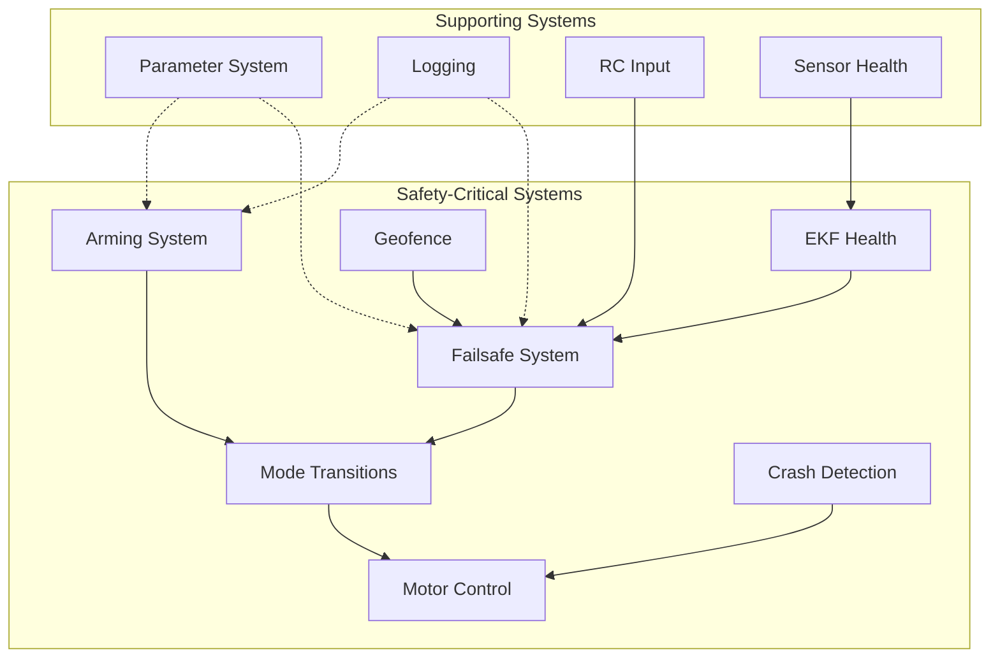

### Documentation Standards for Safety-Critical Code

All safety-critical code must include:

```cpp
/**
 * @safety CRITICAL: [Description of safety implications]
 * @failsafe [Trigger conditions and actions]
 * @recovery [Recovery mechanisms]
 * @thread_safety [Thread safety guarantees]
 * @timing [Real-time constraints]
 * @error_handling [Error detection and response]
 */
```

---

## Safety-Critical Code Paths

### Primary Safety-Critical File Locations

The following files contain safety-critical code and require 100% documentation coverage:

#### 1. Arming System
**Location**: `/libraries/AP_Arming/`

**Key Files**:
- `AP_Arming.h` - Base arming check interface
- `AP_Arming.cpp` - Common pre-arm check implementations
- `AP_Arming_Copter.cpp` - Copter-specific arming checks
- `AP_Arming_Plane.cpp` - Plane-specific arming checks
- `AP_Arming_Rover.cpp` - Rover-specific arming checks
- `AP_Arming_Sub.cpp` - Sub-specific arming checks

**Safety Responsibilities**:
- Verify vehicle configuration is safe for flight
- Check sensor health and calibration status
- Validate control surfaces and motor configuration
- Ensure GPS position lock (when required)
- Verify battery voltage and capacity
- Confirm RC link is active and calibrated
- Check for parameter consistency

#### 2. Failsafe Handlers
**Locations**: `failsafe.cpp` across all vehicle types

**Key Files**:
- `/ArduCopter/failsafe.cpp` - Copter failsafe logic
- `/ArduPlane/failsafe.cpp` - Plane failsafe logic
- `/Rover/failsafe.cpp` - Rover failsafe logic
- `/ArduSub/failsafe.cpp` - Sub failsafe logic
- `/libraries/AP_Arming/AP_Arming_FailSafe.cpp` - Shared failsafe utilities

**Safety Responsibilities**:
- Detect RC signal loss
- Monitor battery critical levels
- Detect GCS communication loss
- Handle terrain altitude violations
- Trigger appropriate recovery actions

#### 3. Mode Transition Logic
**Locations**: `mode.cpp`, `control_modes.cpp` across vehicle types

**Key Files**:
- `/ArduCopter/mode.cpp` - Copter mode management
- `/ArduPlane/mode.cpp` - Plane mode management
- `/Rover/mode.cpp` - Rover mode management
- All `mode_*.cpp` files - Individual mode implementations

**Safety Responsibilities**:
- Validate mode transition requests
- Enforce mode transition safety rules
- Handle invalid mode requests gracefully
- Ensure vehicle state consistency during transitions
- Prevent unsafe mode combinations

#### 4. EKF Health Monitoring
**Locations**: `ekf_check.cpp` across vehicle types

**Key Files**:
- `/ArduCopter/ekf_check.cpp` - Copter EKF monitoring
- `/ArduPlane/ekf_check.cpp` - Plane EKF monitoring
- `/libraries/AP_NavEKF2/` - EKF2 implementation
- `/libraries/AP_NavEKF3/` - EKF3 implementation

**Safety Responsibilities**:
- Monitor EKF innovation sequence variance
- Detect GPS glitches and position jumps
- Trigger EKF failsafe on health degradation
- Manage fallback to DCM or secondary EKF
- Log EKF health metrics for post-flight analysis

#### 5. Motor Output and Safety Limits
**Location**: `/libraries/AP_Motors/`

**Key Files**:
- `AP_Motors_Class.h` - Base motor interface
- `AP_MotorsMatrix.cpp` - Multicopter motor mixing
- `AP_MotorsTri.cpp` - Tricopter motor control
- `AP_MotorsHeli.cpp` - Helicopter collective/cyclic
- `AP_MotorsSingle.cpp` - Single rotor helicopters
- `SRV_Channel.cpp` - Servo output management

**Safety Responsibilities**:
- Enforce motor spin minimums when armed
- Implement motor output limiting during saturation
- Handle motor output during emergency stop
- Validate motor mixing calculations
- Prevent motor commands when disarmed

#### 6. Crash Detection
**Locations**: `crash_check.cpp` across vehicle types

**Key Files**:
- `/ArduCopter/crash_check.cpp` - Copter crash detection
- `/ArduPlane/crash_check.cpp` - Plane crash detection

**Safety Responsibilities**:
- Detect uncontrolled descent
- Identify impact events
- Trigger emergency disarm after crash
- Log crash telemetry data
- Prevent motor restart after detected crash

#### 7. Geofence Violations
**Locations**: `fence.cpp` across vehicle types

**Key Files**:
- `/ArduCopter/fence.cpp` - Copter fence handling
- `/ArduPlane/fence.cpp` - Plane fence handling
- `/Rover/fence.cpp` - Rover fence handling
- `/libraries/AC_Fence/` - Fence library implementation

**Safety Responsibilities**:
- Monitor altitude floor and ceiling violations
- Detect horizontal boundary breaches
- Enforce polygon inclusion/exclusion zones
- Trigger appropriate fence actions (RTL, Land, Brake)
- Handle fence recovery after boundary cleared

---

## Failsafe Systems

### Failsafe Architecture

ArduPilot implements a priority-based failsafe system where higher-priority failsafes override lower-priority ones.

#### Failsafe Priority Hierarchy

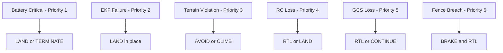

### 1. Radio (RC) Failsafe

**Source Files**: 
- `/ArduCopter/radio.cpp` - RC input processing
- `/ArduCopter/failsafe.cpp:failsafe_radio_on_event()`
- `/ArduPlane/servos.cpp:throttle_suppressed()`

**Trigger Conditions**:
- No valid RC pulses received for `FS_TIMEOUT` seconds (default: 1.5s)
- Throttle value drops below `FS_THR_VALUE` (if enabled)
- SBUS/FPort signal loss flag set

**Actions**:
```cpp
/**
 * @safety CRITICAL: Radio failsafe handler
 * @failsafe Triggers: RC signal loss, throttle below threshold
 * @failsafe Actions: RTL, LAND, CONTINUE, SMARTRTL (copter)
 * @recovery Automatic recovery when RC signal restored
 * @thread_safety Called from main loop only
 */
void Copter::failsafe_radio_on_event()
{
    // Higher priority failsafes take precedence
    if (failsafe.battery || failsafe.ekf) {
        return;
    }
    
    // Execute configured action based on FS_THR_ENABLE parameter
    switch (g.failsafe_throttle) {
        case FS_THR_ENABLED_ALWAYS_RTL:
        case FS_THR_ENABLED_CONTINUE_MISSION:
        case FS_THR_ENABLED_ALWAYS_LAND:
        case FS_THR_ENABLED_ALWAYS_SMARTRTL_OR_RTL:
        case FS_THR_ENABLED_ALWAYS_SMARTRTL_OR_LAND:
            // Action implementation
            break;
    }
}
```

**Configuration Parameters**:
- `FS_THR_ENABLE` - Enable/disable RC failsafe (0=Disabled, 1=Enabled)
- `FS_THR_VALUE` - PWM value below which failsafe triggers (typically 975)
- `FS_OPTIONS` - Failsafe behavior options bitfield
- `FS_TIMEOUT` - Time before failsafe triggers (default: 1.5s)

**Recovery Behavior**:
- Automatic recovery when RC signal restored for >1 second
- Returns to mode active before failsafe (if safe)
- Logs failsafe event with timestamp and recovery time

### 2. Battery Failsafe

**Source Files**:
- `/libraries/AP_BattMonitor/AP_BattMonitor.cpp` - Battery monitoring
- `/ArduCopter/failsafe.cpp:failsafe_battery_event()`
- `/ArduPlane/failsafe.cpp:check_long_failsafe()`

**Trigger Conditions**:
- Battery voltage drops below `BATT_LOW_VOLT` (Low battery warning)
- Battery voltage drops below `BATT_CRT_VOLT` (Critical battery)
- Battery capacity used exceeds `BATT_LOW_MAH` (Low capacity warning)
- Battery capacity used exceeds `BATT_CRT_MAH` (Critical capacity)

**Actions**:

```cpp
/**
 * @safety CRITICAL: Battery failsafe handler
 * @failsafe Triggers: Voltage/capacity below critical thresholds
 * @failsafe Actions: RTL (low), LAND (critical), TERMINATE (emergency)
 * @failsafe Priority: Highest - overrides all other failsafes
 * @recovery No automatic recovery - manual intervention required
 * @thread_safety Called from 10Hz battery monitor task
 */
void Copter::failsafe_battery_event(void)
{
    // Critical battery always forces LAND
    if (failsafe.battery_critical) {
        set_mode_land_with_pause(ModeReason::BATTERY_FAILSAFE);
        return;
    }
    
    // Low battery triggers configured action
    if (failsafe.battery_low) {
        switch (g.failsafe_battery_enabled) {
            case FS_BATT_RTL:
                set_mode(Mode::Number::RTL, ModeReason::BATTERY_FAILSAFE);
                break;
            case FS_BATT_LAND:
                set_mode_land_with_pause(ModeReason::BATTERY_FAILSAFE);
                break;
            case FS_BATT_SMARTRTL:
                set_mode_smartrtl_or_land(ModeReason::BATTERY_FAILSAFE);
                break;
        }
    }
}
```

**Configuration Parameters**:
- `BATT_LOW_VOLT` - Low battery voltage threshold (default: 10.5V for 3S LiPo)
- `BATT_CRT_VOLT` - Critical battery voltage threshold (default: 10.0V for 3S LiPo)
- `BATT_LOW_MAH` - Low battery capacity threshold (mAh)
- `BATT_CRT_MAH` - Critical battery capacity threshold (mAh)
- `BATT_FS_LOW_ACT` - Action on low battery (0=None, 1=Land, 2=RTL, 3=SmartRTL)
- `BATT_FS_CRT_ACT` - Action on critical battery (0=None, 1=Land, 2=RTL, 3=SmartRTL, 4=Terminate)

**Recovery Behavior**:
- NO automatic recovery from battery failsafe
- Manual mode change allowed but failsafe remains active
- Warning messages continue until battery replaced/recharged

### 3. EKF Failsafe

**Source Files**:
- `/ArduCopter/ekf_check.cpp` - EKF health monitoring
- `/libraries/AP_NavEKF2/AP_NavEKF2_core.cpp` - EKF2 implementation
- `/libraries/AP_NavEKF3/AP_NavEKF3_core.cpp` - EKF3 implementation
- `/libraries/AP_AHRS/AP_AHRS.cpp:check_ekf_status()`

**Trigger Conditions**:
- Innovation sequence variance exceeds thresholds
- Position reset exceeds configured limits
- EKF reports unhealthy status for >1 second
- GPS glitch or position jump detected

**Variance Thresholds**:
```cpp
/**
 * @safety CRITICAL: EKF variance monitoring
 * @note Default variance threshold: 1.0
 * @warning Lower thresholds increase false positives
 * @warning Higher thresholds delay failure detection
 */
#define EKF_VARIANCE_THRESHOLD 1.0f
#define EKF_POSITION_RESET_LIMIT 5.0f  // meters
```

**Actions**:

```cpp
/**
 * @safety CRITICAL: EKF failsafe handler
 * @failsafe Triggers: EKF variance exceeds threshold, position reset
 * @failsafe Actions: LAND in place (copter), attempt DCM fallback
 * @failsafe Priority: High - second only to battery critical
 * @recovery Automatic recovery when EKF health restored
 * @thread_safety Called from main loop EKF check task
 */
void Copter::failsafe_ekf_event(void)
{
    // Trigger EKF failsafe
    if (!failsafe.ekf) {
        failsafe.ekf = true;
        Log_Write_Error(LogErrorSubsystem::EKFCHECK, LogErrorCode::EKFCHECK_BAD_VARIANCE);
        
        // Land immediately in place
        if (motors->armed()) {
            set_mode_land_with_pause(ModeReason::EKF_FAILSAFE);
        }
    }
}
```

**Configuration Parameters**:
- `FS_EKF_ACTION` - Action on EKF failure (1=Land, 2=AltHold, 3=Land even in manual mode)
- `FS_EKF_THRESH` - EKF variance threshold (default: 0.8)
- `EKF_CHECK_SCALE` - Scale factor for EKF variance checks (default: 100%)

**Recovery Behavior**:
- Automatic recovery when EKF health restored for >10 seconds
- Returns to previous mode if recovery successful
- Falls back to DCM if available and EKF permanently failed

### 4. GPS Failsafe

**Source Files**:
- `/libraries/AP_GPS/AP_GPS.cpp` - GPS health monitoring
- `/ArduCopter/failsafe.cpp:failsafe_gps_check()`
- `/ArduPlane/failsafe.cpp:check_gps()`

**Trigger Conditions**:
- GPS reports no fix (GPS_FIXTYPE == NO_FIX)
- Horizontal dilution of precision (HDOP) exceeds `GPS_HDOP_GOOD`
- Number of satellites below minimum (`GPS_MIN_SATS`)
- GPS position glitch detected by EKF

**Actions**:
- **Copter**: Switch to non-GPS mode (AltHold, Land) or trigger RC failsafe behavior
- **Plane**: Continue mission using dead reckoning or trigger RTL
- **Rover**: Stop or switch to manual control

**Configuration Parameters**:
- `FS_GPS_ENABLE` - Enable GPS failsafe (0=Disabled, 1=Land, 2=AltHold, 3=Land even in manual)
- `GPS_MIN_SATS` - Minimum number of satellites required (default: 6)
- `GPS_HDOP_GOOD` - Maximum acceptable HDOP value (default: 200 = 2.0)

### 5. GCS (Ground Control Station) Failsafe

**Source Files**:
- `/libraries/GCS_MAVLink/GCS.cpp` - MAVLink heartbeat monitoring
- `/ArduCopter/failsafe.cpp:failsafe_gcs_check()`

**Trigger Conditions**:
- No MAVLink HEARTBEAT messages received for `FS_GCS_TIMEOUT` seconds
- GCS_FAILSAFE parameter enabled and timeout exceeded

**Actions**:

```cpp
/**
 * @safety CRITICAL: GCS failsafe handler
 * @failsafe Triggers: No GCS heartbeat for configured timeout
 * @failsafe Actions: RTL, LAND, CONTINUE mission, SMARTRTL
 * @failsafe Priority: Lower than RC/Battery/EKF
 * @recovery Automatic recovery when GCS heartbeat restored
 * @note Only active when GCS_FAILSAFE parameter enabled
 */
void Copter::failsafe_gcs_check(void)
{
    if (g.failsafe_gcs == FS_GCS_DISABLED) {
        return;
    }
    
    uint32_t last_gcs_ms = gcs().sysid_myggcs().last_heartbeat_ms;
    uint32_t gcs_timeout_ms = g2.fs_gcs_timeout * 1000;
    
    if ((AP_HAL::millis() - last_gcs_ms) > gcs_timeout_ms) {
        failsafe_gcs_on_event();
    }
}
```

**Configuration Parameters**:
- `FS_GCS_ENABLE` - Enable GCS failsafe (0=Disabled, 1=Enabled)
- `FS_GCS_TIMEOUT` - GCS heartbeat timeout in seconds (default: 5s)

**Recovery Behavior**:
- Automatic recovery when GCS heartbeat restored
- Continues mission or returns to previous mode based on configuration

### 6. Terrain Altitude Failsafe

**Source Files**:
- `/libraries/AP_Terrain/AP_Terrain.cpp` - Terrain database
- `/ArduCopter/failsafe.cpp:terrain_failsafe()`
- `/ArduPlane/altitude.cpp:adjust_altitude_target()`

**Trigger Conditions**:
- Terrain data unavailable when required by flight mode
- Terrain clearance below minimum (`TERRAIN_MARGIN`)
- Range finder disagreement with terrain database

**Actions**:
- **Copter**: RTL or LAND
- **Plane**: Climb to safe altitude and RTL

**Configuration Parameters**:
- `TERRAIN_ENABLE` - Enable terrain following (0=Disabled, 1=Enabled)
- `TERRAIN_MARGIN` - Minimum terrain clearance (meters)
- `TERRAIN_OFS_MAX` - Maximum terrain database offset

### Failsafe State Machine

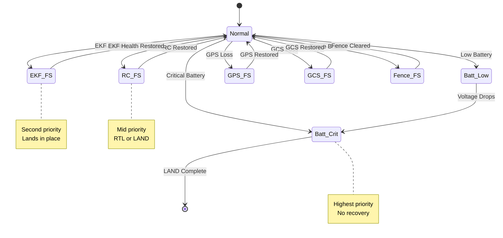

---

## Arming System and Pre-Flight Validation

### Overview

The arming system prevents vehicle operation when safety-critical conditions are not met. All pre-arm checks must pass before the vehicle can be armed.

**Source Files**: `/libraries/AP_Arming/`

### Arming Check Architecture

```mermaid
graph LR
    REQUEST[Arm Request] --> MANDATORY[Mandatory Checks]
    MANDATORY --> SENSOR[Sensor Checks]
    SENSOR --> GPS_CHK[GPS Checks]
    GPS_CHK --> BARO_CHK[Barometer Checks]
    BARO_CHK --> COMPASS_CHK[Compass Checks]
    COMPASS_CHK --> INS_CHK[Inertial Checks]
    INS_CHK --> RC_CHK[RC Checks]
    RC_CHK --> BOARD_CHK[Board Voltage]
    BOARD_CHK --> BATTERY_CHK[Battery Checks]
    BATTERY_CHK --> FENCE_CHK[Fence Checks]
    FENCE_CHK --> MISSION_CHK[Mission Checks]
    MISSION_CHK --> RANGEFINDER_CHK[Rangefinder]
    RANGEFINDER_CHK --> SUCCESS{All Pass?}
    SUCCESS -->|Yes| ARMED[Vehicle Armed]
    SUCCESS -->|No| FAIL[Arm Denied]
    FAIL --> LOG[Log Failure Reason]
```

### Mandatory Pre-Arm Checks

#### 1. Hardware Configuration Checks

**Source**: `AP_Arming.cpp:hardware_checks()`

```cpp
/**
 * @safety CRITICAL: Hardware configuration validation
 * @pre Board voltage stable, sensors initialized
 * @return true if all hardware checks pass
 * @error_handling Logs specific failure reason for each check
 */
bool AP_Arming::hardware_checks(bool display_failure)
{
    // Check board voltage is within acceptable range
    if (!check_board_voltage(display_failure)) {
        return false;
    }
    
    // Verify safety switch state (if configured)
    if (!check_safety_switch(display_failure)) {
        return false;
    }
    
    // Check servo rail voltage for aircraft with servos
    if (!check_servo_voltage(display_failure)) {
        return false;
    }
    
    return true;
}
```

**Checks Performed**:
- Board voltage between `BRD_VOLT_MIN` and `BRD_VOLT_MAX`
- Safety switch pressed (if `BRD_SAFETYENABLE` = 1)
- Servo rail voltage adequate for servo operation

#### 2. Sensor Health Checks

**Source**: `AP_Arming.cpp:ins_checks()`, `compass_checks()`, `gps_checks()`

```cpp
/**
 * @safety CRITICAL: Inertial sensor validation
 * @failsafe Triggers: Accelerometer/gyro out of calibration
 * @return true if IMU calibrated and healthy
 * @note Checks all configured IMU backends
 */
bool AP_Arming::ins_checks(bool display_failure)
{
    const AP_InertialSensor &ins = AP::ins();
    
    // Check IMU is healthy
    if (!ins.get_gyro_health_all()) {
        check_failed(display_failure, "Gyros not healthy");
        return false;
    }
    
    if (!ins.get_accel_health_all()) {
        check_failed(display_failure, "Accels not healthy");
        return false;
    }
    
    // Check gyro calibration
    if (!ins.gyro_calibrated_ok_all()) {
        check_failed(display_failure, "Gyros not calibrated");
        return false;
    }
    
    // Check accelerometer calibration
    if (ins.get_accel_count() > 0) {
        for (uint8_t i=0; i<ins.get_accel_count(); i++) {
            const Vector3f &offsets = ins.get_accel_offsets(i);
            if (offsets.length() > AP_ARMING_ACCEL_ERROR_THRESHOLD) {
                check_failed(display_failure, "Accel %u offsets too high", i);
                return false;
            }
        }
    }
    
    // Check for excessive vibration
    Vector3f accel_vibe = ins.get_vibration_levels();
    if (accel_vibe.length() > AP_ARMING_ACCEL_VIBE_THRESHOLD) {
        check_failed(display_failure, "High vibration: %.1f", accel_vibe.length());
        return false;
    }
    
    return true;
}
```

**IMU Check Criteria**:
- All configured gyros reporting healthy
- All configured accelerometers reporting healthy
- Gyros calibrated (startup calibration complete)
- Accelerometer offsets within limits (< 3.0 m/s²)
- Vibration levels acceptable (< 30 m/s² clipping threshold)
- No excessive sensor inconsistency between IMUs

**Compass Check Criteria**:

```cpp
/**
 * @safety CRITICAL: Compass calibration and health validation
 * @failsafe Triggers: Compass uncalibrated, unhealthy, or inconsistent
 * @return true if all enabled compasses pass checks
 * @warning Large metal objects near compass cause failures
 */
bool AP_Arming::compass_checks(bool display_failure)
{
    Compass &compass = AP::compass();
    
    // Check compass is enabled and configured
    if (!compass.use_for_yaw()) {
        return true;  // No compass required for this mode
    }
    
    // Check compass health
    if (!compass.healthy()) {
        check_failed(display_failure, "Compass not healthy");
        return false;
    }
    
    // Check compass calibration
    if (!compass.configured()) {
        check_failed(display_failure, "Compass not calibrated");
        return false;
    }
    
    // Check compass offsets are within reasonable range
    for (uint8_t i=0; i<compass.get_count(); i++) {
        const Vector3f &offsets = compass.get_offsets(i);
        if (offsets.length() > AP_ARMING_COMPASS_OFFSETS_MAX) {
            check_failed(display_failure, "Compass %u offsets too high", i);
            return false;
        }
    }
    
    // Check compass-to-inertial consistency
    if (compass.get_count() > 1) {
        if (!compass.consistent()) {
            check_failed(display_failure, "Compasses inconsistent");
            return false;
        }
    }
    
    return true;
}
```

- All enabled compasses reporting healthy
- Compass calibration completed (offsets calculated)
- Compass offsets reasonable (< 600 for internal compass)
- Multiple compasses are consistent with each other
- Primary compass selected and configured

**GPS Check Criteria**:

```cpp
/**
 * @safety CRITICAL: GPS fix quality validation
 * @failsafe Triggers: Insufficient GPS fix for position-based modes
 * @return true if GPS meets requirements for flight mode
 * @note Requirements vary by vehicle type and flight mode
 */
bool AP_Arming::gps_checks(bool display_failure)
{
    const AP_GPS &gps = AP::gps();
    
    // Check if GPS is required for current mode
    if (!mode_requires_gps(control_mode)) {
        return true;
    }
    
    // Check GPS has 3D fix
    if (gps.status() < AP_GPS::GPS_OK_FIX_3D) {
        check_failed(display_failure, "GPS: Need 3D Fix");
        return false;
    }
    
    // Check sufficient satellites
    if (gps.num_sats() < gps_num_sats_min) {
        check_failed(display_failure, "GPS: Need %d sats (have %d)", 
                    gps_num_sats_min, gps.num_sats());
        return false;
    }
    
    // Check HDOP is acceptable
    float hdop = gps.get_hdop();
    if (hdop > gps_hdop_max) {
        check_failed(display_failure, "GPS: HDOP %.1f too high (need < %.1f)",
                    hdop/100.0f, gps_hdop_max/100.0f);
        return false;
    }
    
    // Check home position is set
    if (!AP::ahrs().home_is_set()) {
        check_failed(display_failure, "GPS: Waiting for home");
        return false;
    }
    
    return true;
}
```

- GPS has 3D fix (GPS_OK_FIX_3D or better)
- Sufficient satellite count (≥ `GPS_MIN_SATS`, default 6)
- Acceptable horizontal dilution of precision (HDOP < 2.0)
- Home position set (required for RTL failsafe)
- GPS velocity accuracy sufficient for flight mode

**Barometer Check Criteria**:
- At least one barometer healthy
- Barometer altitude readings consistent between sensors
- No excessive altitude drift during pre-arm period

#### 3. RC Input Checks

**Source**: `AP_Arming.cpp:rc_checks()`

```cpp
/**
 * @safety CRITICAL: RC input validation
 * @failsafe Triggers: RC not calibrated, failsafe active, invalid inputs
 * @return true if RC meets safety requirements
 * @warning Prevents arming during RC failsafe condition
 */
bool AP_Arming::rc_checks(bool display_failure)
{
    const RC_Channel *rc = RC_Channels::rc_channel(0);
    
    // Check RC is receiving valid input
    if (!rc->has_valid_input()) {
        check_failed(display_failure, "RC not receiving valid input");
        return false;
    }
    
    // Check RC is calibrated
    if (!RC_Channels::calibrated()) {
        check_failed(display_failure, "RC not calibrated");
        return false;
    }
    
    // Check RC failsafe is not active
    if (failsafe.radio) {
        check_failed(display_failure, "RC failsafe active");
        return false;
    }
    
    // Check throttle is at minimum
    if (channel_throttle->get_control_in() > 0) {
        check_failed(display_failure, "Throttle not at minimum");
        return false;
    }
    
    return true;
}
```

**Checks Performed**:
- RC receiver is receiving valid signal
- All required RC channels calibrated (min/max/trim set)
- RC failsafe is not currently active
- Throttle stick at minimum position
- Mode switch in valid position

#### 4. Battery Checks

**Source**: `AP_Arming.cpp:battery_checks()`

```cpp
/**
 * @safety CRITICAL: Battery state validation before flight
 * @failsafe Triggers: Low voltage, low capacity, unhealthy battery
 * @return true if battery has sufficient charge for flight
 * @warning Prevents takeoff with insufficient battery
 */
bool AP_Arming::battery_checks(bool display_failure)
{
    const AP_BattMonitor &battery = AP::battery();
    
    // Check battery monitoring is configured
    if (!battery.num_instances()) {
        return true;  // No battery monitoring configured
    }
    
    // Check battery voltage is above minimum
    if (battery.has_failsafed()) {
        check_failed(display_failure, "Battery failsafe active");
        return false;
    }
    
    // Check battery capacity if monitoring enabled
    if (battery.has_current()) {
        float capacity_remaining_pct = battery.capacity_remaining_pct();
        if (capacity_remaining_pct < arming_min_capacity_pct) {
            check_failed(display_failure, "Battery %.0f%% < %d%%", 
                        capacity_remaining_pct, arming_min_capacity_pct);
            return false;
        }
    }
    
    // Check battery voltage
    float voltage = battery.voltage();
    if (voltage < arming_min_voltage) {
        check_failed(display_failure, "Battery %.2fV < %.2fV",
                    voltage, arming_min_voltage);
        return false;
    }
    
    return true;
}
```

**Checks Performed**:
- Battery voltage above minimum for arming (`ARMING_MIN_VOLT`)
- Battery capacity above minimum percentage (`ARMING_MIN_PCT`)
- No battery failsafe currently active
- Battery temperature within acceptable range (if monitored)

### Arming Configuration Parameters

| Parameter | Description | Default | Range |
|-----------|-------------|---------|-------|
| `ARMING_CHECK` | Bitmask of enabled checks | 1 (all) | 0-65535 |
| `ARMING_ACCTHRESH` | Accelerometer error threshold | 0.75 m/s² | 0.25-3.0 |
| `ARMING_MIN_VOLT` | Minimum battery voltage | 0V (disabled) | 0-50V |
| `ARMING_MIN_VOLT2` | Minimum second battery voltage | 0V (disabled) | 0-50V |
| `ARMING_MIS_ITEMS` | Require valid mission items | 0 (disabled) | 0-1 |
| `ARMING_RUDDER` | Rudder arming behavior | 2 (enabled) | 0-2 |

### ARMING_CHECK Bitmask Values

```cpp
// Source: AP_Arming.h
enum class ArmingCheckMask : uint32_t {
    NONE            = 0,
    ALL             = (1U << 0),
    BARO            = (1U << 1),
    COMPASS         = (1U << 2),
    GPS             = (1U << 3),
    INS             = (1U << 4),
    PARAMETERS      = (1U << 5),
    RC_CHANNELS     = (1U << 6),
    BOARD_VOLTAGE   = (1U << 7),
    BATTERY         = (1U << 8),
    AIRSPEED        = (1U << 9),
    LOGGING         = (1U << 10),
    SWITCH_POS      = (1U << 11),
    GPS_CONFIG      = (1U << 12),
    SYSTEM          = (1U << 13),
    MISSION         = (1U << 14),
    RANGEFINDER     = (1U << 15),
    CAMERA          = (1U << 16),
    AUX_AUTH        = (1U << 17),
    VISION          = (1U << 18),
    FFT             = (1U << 19),
};
```

### Arming State Machine

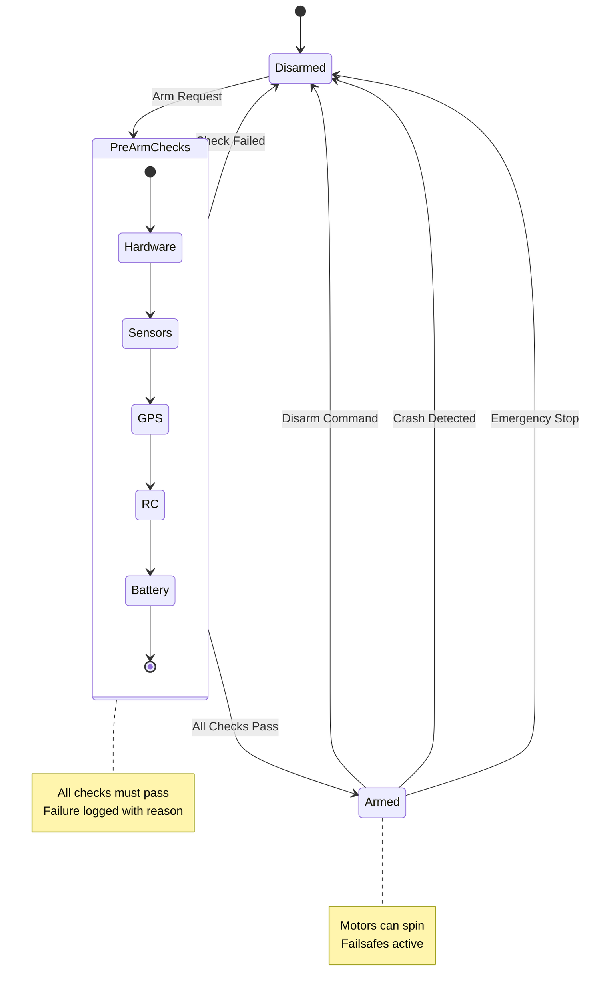

---

## Flight Mode Safety

### Overview

Flight modes have different safety characteristics and requirements. Mode transitions are subject to safety validation to prevent unsafe state changes.

**Source Files**: `mode.cpp`, `mode_*.cpp` across vehicle types

### Mode Safety Classification

| Mode | Safety Level | GPS Required | Failsafe Recovery | Manual Control |
|------|-------------|--------------|-------------------|----------------|
| **STABILIZE** | Manual | No | N/A | Full |
| **ACRO** | Manual | No | N/A | Full |
| **ALT_HOLD** | Assisted | No | Yes | Throttle automated |
| **AUTO** | Autonomous | Yes | Yes | Override available |
| **GUIDED** | Autonomous | Yes | Yes | GCS controlled |
| **LOITER** | Assisted | Yes | Yes | Position hold |
| **RTL** | Failsafe | Yes | N/A | Limited override |
| **LAND** | Failsafe | No | N/A | Limited override |
| **BRAKE** | Assisted | Yes | Yes | Auto-stop |
| **SMART_RTL** | Failsafe | Yes | N/A | Path retracing |
| **CIRCLE** | Autonomous | Yes | Yes | Circular path |
| **POSHOLD** | Assisted | Yes | Yes | Drift compensation |
| **FLIP** | Acrobatic | No | Yes | Automated flip |
| **AUTOTUNE** | Calibration | Yes | Yes | PID tuning |

### Mode Transition Safety Rules

**Source**: `Copter::set_mode()`, `Plane::set_mode()`, `mode.cpp`

```cpp
/**
 * @safety CRITICAL: Mode transition validation
 * @failsafe Prevents unsafe mode changes
 * @return true if mode change allowed, false if rejected
 * @thread_safety Must hold mode_switch_mutex during execution
 * @error_handling Logs rejected transitions with reason
 */
bool Copter::set_mode(Mode::Number mode, ModeReason reason)
{
    // Prevent mode change during critical phases
    if (in_landing_sequence() && mode != Mode::Number::LAND) {
        gcs().send_text(MAV_SEVERITY_WARNING, "Mode change denied: landing");
        return false;
    }
    
    // Check mode requires GPS and GPS not available
    if (mode_requires_GPS(mode) && !position_ok()) {
        gcs().send_text(MAV_SEVERITY_WARNING, "Mode requires position estimate");
        return false;
    }
    
    // Check altitude required for mode
    if (mode_requires_altitude(mode) && !altitude_ok()) {
        gcs().send_text(MAV_SEVERITY_WARNING, "Mode requires altitude estimate");
        return false;
    }
    
    // Prevent switching out of failsafe modes unless recovery complete
    if (flightmode->is_failsafe() && !failsafe_cleared()) {
        if (mode != Mode::Number::LAND && mode != Mode::Number::RTL) {
            gcs().send_text(MAV_SEVERITY_WARNING, "Failsafe active");
            return false;
        }
    }
    
    // Execute mode change
    Mode *new_mode = mode_from_mode_num(mode);
    if (new_mode == nullptr) {
        return false;
    }
    
    // Call mode exit handler
    flightmode->exit();
    
    // Update mode
    flightmode = new_mode;
    control_mode = mode;
    control_mode_reason = reason;
    
    // Call mode init handler
    if (!flightmode->init(false)) {
        // Init failed, fall back to safe mode
        set_mode(Mode::Number::LAND, ModeReason::UNKNOWN);
        return false;
    }
    
    // Log mode change
    Log_Write_Mode(control_mode, control_mode_reason);
    
    return true;
}
```

**Transition Rules**:
1. **GPS-dependent modes** require valid position estimate
2. **Landing sequence** prevents mode changes except to LAND
3. **Failsafe modes** restrict transitions until failsafe cleared
4. **Mode init failure** triggers fallback to LAND mode
5. **Mid-air mode changes** only to safer or equivalent modes

### Mode-Specific Safety Constraints

#### RTL (Return to Launch) Mode Safety

**Source**: `/ArduCopter/mode_rtl.cpp`

```cpp
/**
 * @safety CRITICAL: Return to launch mode
 * @failsafe Primary recovery mode for most failsafes
 * @note Requires GPS fix and home position set
 * @warning RTL altitude must clear obstacles in path
 */
class ModeRTL : public Mode
{
public:
    bool init(bool ignore_checks) override
    {
        // Verify GPS is available
        if (!copter.position_ok() && !ignore_checks) {
            return false;
        }
        
        // Verify home position is set
        if (!AP::ahrs().home_is_set()) {
            return false;
        }
        
        // Calculate RTL path and verify altitude clearance
        rtl_path_planned = wp_nav->set_wp_destination(rally_point_or_home());
        
        // Set initial RTL state
        set_state(RTL_STATE_CLIMB);
        
        return true;
    }
    
    void run() override
    {
        switch (state) {
            case RTL_STATE_CLIMB:
                // Climb to RTL altitude
                climb_return_run();
                break;
            case RTL_STATE_RETURN:
                // Return to home
                return_run();
                break;
            case RTL_STATE_DESCEND:
                // Descend above home
                descent_run();
                break;
            case RTL_STATE_LAND:
                // Final landing
                land_run();
                break;
        }
    }
};
```

**Safety Features**:
- Climbs to safe altitude (`RTL_ALT`) before returning
- Uses rally points if closer than home
- Terrain following available with `RTL_TERRAIN`
- Automatic land at home position
- Cone of descent to prevent drifting during final approach

**Configuration**:
- `RTL_ALT` - Return altitude in cm (default: 1500cm = 15m)
- `RTL_ALT_FINAL` - Final altitude before landing (default: 0)
- `RTL_LOIT_TIME` - Loiter time at home before landing (default: 5000ms)
- `RTL_CLIMB_MIN` - Minimum climb before return (default: 0)
- `RTL_SPEED` - Horizontal speed during return (default: 0 = WP_SPEED)
- `RTL_CONE_SLOPE` - Cone slope for descent (default: 3.0)

#### LAND Mode Safety

**Source**: `/ArduCopter/mode_land.cpp`

```cpp
/**
 * @safety CRITICAL: Autonomous landing mode
 * @failsafe Used by multiple failsafe scenarios
 * @note Continues landing even if mode change requested
 * @warning Disarms automatically after landing detected
 */
class ModeLand : public Mode
{
public:
    void run() override
    {
        // Land detector
        land_run_vertical_control();
        land_run_horizontal_control();
        
        // Check for landing completion
        if (ap.land_complete) {
            // Disarm after landing if in failsafe
            if (copter.failsafe.radio || copter.failsafe.battery || 
                copter.failsafe.ekf) {
                copter.arming.disarm(AP_Arming::Method::LANDED);
            }
        }
    }
    
    /**
     * @safety CRITICAL: Landing detection
     * @note Uses multiple sensors to confirm landing
     * @timing Called at main loop rate (400Hz typical)
     */
    void land_run_vertical_control()
    {
        // Reduce throttle gradually
        float descent_rate = get_pilot_desired_climb_rate_cms();
        if (descent_rate == 0.0f) {
            descent_rate = -land_speed_cms;
        }
        
        // Limit descent rate near ground
        if (rangefinder_alt_ok() && rangefinder_state.alt_cm < 200) {
            descent_rate = constrain_float(descent_rate, 
                                          -LAND_SPEED_FINAL, 0.0f);
        }
        
        // Run position controller
        pos_control->set_vel_desired_z_cms(descent_rate);
        pos_control->update_z_controller();
    }
};
```

**Landing Detection Criteria**:
- Descent rate below threshold for 1 second
- Motor throttle at minimum for 0.5 seconds
- Vertical velocity < 20 cm/s
- Rangefinder shows ground contact (if available)
- No significant lateral movement

**Configuration**:
- `LAND_SPEED` - Landing descent rate in cm/s (default: 50 cm/s)
- `LAND_SPEED_HIGH` - Initial descent rate above 10m (default: 0 = WPNAV_SPEED_DN)
- `LAND_REPOSITION` - Enable position correction during descent
- `LAND_ALT_LOW` - Altitude to switch to final descent (default: 1000cm)

#### AUTO Mode Safety

**Source**: `/ArduCopter/mode_auto.cpp`, `/libraries/AP_Mission/`

```cpp
/**
 * @safety CRITICAL: Autonomous mission execution
 * @failsafe Includes geofence checks and mission validation
 * @note Pilot can override with RC input if configured
 * @warning Mission must be validated before AUTO arming
 */
class ModeAuto : public Mode
{
public:
    bool init(bool ignore_checks) override
    {
        // Verify mission is loaded and valid
        if (!copter.mission.num_commands()) {
            return false;
        }
        
        // Start or resume mission
        if (!mission.start_or_resume()) {
            return false;
        }
        
        return true;
    }
    
    /**
     * @safety CRITICAL: Mission command execution
     * @failsafe Each command validated before execution
     * @note Invalid commands cause mission to hold or RTL
     */
    void run() override
    {
        // Update mission state machine
        mission.update();
        
        // Check for mission completion
        if (!mission.get_current_nav_cmd(cmd)) {
            // No valid nav command, hold position
            set_mode(Mode::Number::LOITER, ModeReason::MISSION_END);
            return;
        }
        
        // Execute current mission command
        switch (cmd.id) {
            case MAV_CMD_NAV_WAYPOINT:
                do_nav_wp(cmd);
                break;
            case MAV_CMD_NAV_LAND:
                do_land(cmd);
                break;
            case MAV_CMD_NAV_TAKEOFF:
                do_nav_takeoff(cmd);
                break;
            // Additional commands...
        }
    }
};
```

**Mission Validation**:
- All waypoints within geofence boundaries
- Takeoff altitude sufficient for mission
- Rally points configured if `RTL_ALT_TYPE = RALLY`
- No invalid or unsupported commands
- Sequential command IDs without gaps

**Safety Limits**:
- `WP_YAW_BEHAVIOR` - Controls yaw during waypoints
- `WPNAV_SPEED` - Maximum horizontal speed (cm/s)
- `WPNAV_SPEED_UP` - Maximum climb rate (cm/s)
- `WPNAV_SPEED_DN` - Maximum descent rate (cm/s)
- `WPNAV_ACCEL` - Maximum horizontal acceleration (cm/s²)
- `WPNAV_ACCEL_Z` - Maximum vertical acceleration (cm/s²)

---

## EKF Health Monitoring

### Overview

The Extended Kalman Filter (EKF) provides position, velocity, and attitude estimates by fusing multiple sensor inputs. EKF health monitoring is critical for detecting navigation system failures.

**Source Files**:
- `/libraries/AP_NavEKF2/AP_NavEKF2_core.cpp`
- `/libraries/AP_NavEKF3/AP_NavEKF3_core.cpp`
- `/ArduCopter/ekf_check.cpp`
- `/ArduPlane/ekf_check.cpp`

### EKF Architecture

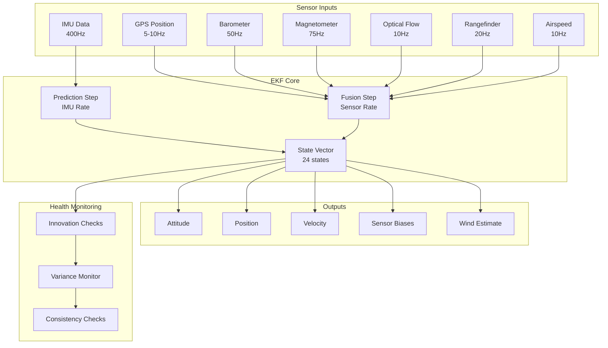

### EKF State Vector

**Source**: `AP_NavEKF3_core.h`

```cpp
/**
 * @brief EKF3 state vector components
 * @note Total 24 states tracked by the filter
 */
struct state_elements {
    Quaternion  quat;           // States 0-3: Attitude quaternion
    Vector3f    velocity;       // States 4-6: Velocity (NED frame, m/s)
    Vector3f    position;       // States 7-9: Position (NED frame, m)
    Vector3f    gyro_bias;      // States 10-12: Gyro bias (rad/s)
    Vector3f    gyro_scale;     // States 13-15: Gyro scale factor
    float       accel_zbias;    // State 16: Accel Z bias (m/s²)
    Vector3f    earth_magfield; // States 17-19: Earth magnetic field (Gauss)
    Vector3f    body_magfield;  // States 20-22: Body magnetic field (Gauss)
    Vector2f    wind_vel;       // States 23-24: Wind velocity NE (m/s)
};
```

### Innovation Sequence Monitoring

**Innovation** = Difference between sensor measurement and EKF prediction

```cpp
/**
 * @safety CRITICAL: Innovation sequence monitoring
 * @failsafe Triggers EKF failsafe if innovation exceeds threshold
 * @timing Called every EKF update cycle (typically 10Hz)
 * @note Monitors GPS, baro, magnetometer innovations
 */
void NavEKF3_core::checkInnovations()
{
    // Check GPS position innovation
    float gps_pos_innov = norm(gps_pos_innov_vec.x, gps_pos_innov_vec.y);
    if (gps_pos_innov > frontend->_gpsHorizPosNoise * 5.0f) {
        tasTimeout_ms = imuSampleTime_ms + 5000;  // Reject GPS for 5 seconds
    }
    
    // Check GPS velocity innovation
    float gps_vel_innov = gps_vel_innov_vec.length();
    if (gps_vel_innov > frontend->_gpsHorizVelNoise * 5.0f) {
        velTimeout_ms = imuSampleTime_ms + 5000;
    }
    
    // Check barometer innovation
    if (fabsf(baro_innov) > frontend->_baroAltNoise * 5.0f) {
        hgtTimeout_ms = imuSampleTime_ms + 5000;
    }
    
    // Check magnetometer innovation
    float mag_innov = mag_innov_vec.length();
    if (mag_innov > frontend->_magNoise * 5.0f) {
        magTimeout_ms = imuSampleTime_ms + 10000;  // 10 second timeout
    }
}
```

### Variance Thresholds

**Source**: `ekf_check.cpp`

```cpp
/**
 * @safety CRITICAL: EKF variance threshold checking
 * @failsafe Triggers if variance exceeds configured thresholds
 * @return true if all variances within acceptable limits
 * @thread_safety Called from main loop
 */
bool Copter::ekf_over_threshold()
{
    float posVar, hgtVar, tasVar;
    Vector3f magVar;
    float compass_variance;
    float vel_variance;
    
    // Get current EKF variances
    AP::ahrs_navekf().get_variances(vel_variance, posVar, hgtVar,
                                     magVar, tasVar);
    
    // Check position variance (horizontal)
    const float pos_threshold = sq(g2.fs_ekf_thresh);
    if (posVar > pos_threshold) {
        return true;  // Over threshold
    }
    
    // Check velocity variance
    if (vel_variance > pos_threshold) {
        return true;
    }
    
    // Check compass variance
    compass_variance = magVar.length();
    if (compass_variance > pos_threshold) {
        return true;
    }
    
    return false;  // All variances acceptable
}
```

**Default Variance Thresholds**:
- Position variance: 0.8 m² (configurable via `FS_EKF_THRESH`)
- Velocity variance: 0.8 (m/s)²
- Compass variance: 0.8
- Height variance: monitored but not used for failsafe trigger

### EKF Failsafe Actions

```cpp
/**
 * @safety CRITICAL: EKF failsafe trigger
 * @failsafe Actions: LAND (copter), controlled descent (plane)
 * @recovery Automatic recovery when EKF health restored
 * @timing Requires sustained variance exceedance (1 second)
 */
void Copter::failsafe_ekf_event()
{
    // Set failsafe flag
    failsafe.ekf = true;
    
    // Log event
    Log_Write_Error(LogErrorSubsystem::EKFCHECK,
                   LogErrorCode::EKFCHECK_BAD_VARIANCE);
    
    // Determine appropriate action based on flight mode and altitude
    if (flightmode->mode_number() == Mode::Number::LAND) {
        // Already landing, continue
        return;
    }
    
    // Check configuration
    switch ((FS_EKF_Action)g2.fs_ekf_action.get()) {
        case FS_EKF_ACTION_LAND:
            set_mode_land_with_pause(ModeReason::EKF_FAILSAFE);
            break;
            
        case FS_EKF_ACTION_ALTHOLD:
            set_mode(Mode::Number::ALT_HOLD, ModeReason::EKF_FAILSAFE);
            break;
            
        case FS_EKF_ACTION_LAND_EVEN_STABILIZE:
            // Force land even if in manual mode
            set_mode(Mode::Number::LAND, ModeReason::EKF_FAILSAFE);
            break;
    }
}
```

### EKF Source Selection and Fallback

**Source**: `AP_AHRS.cpp`

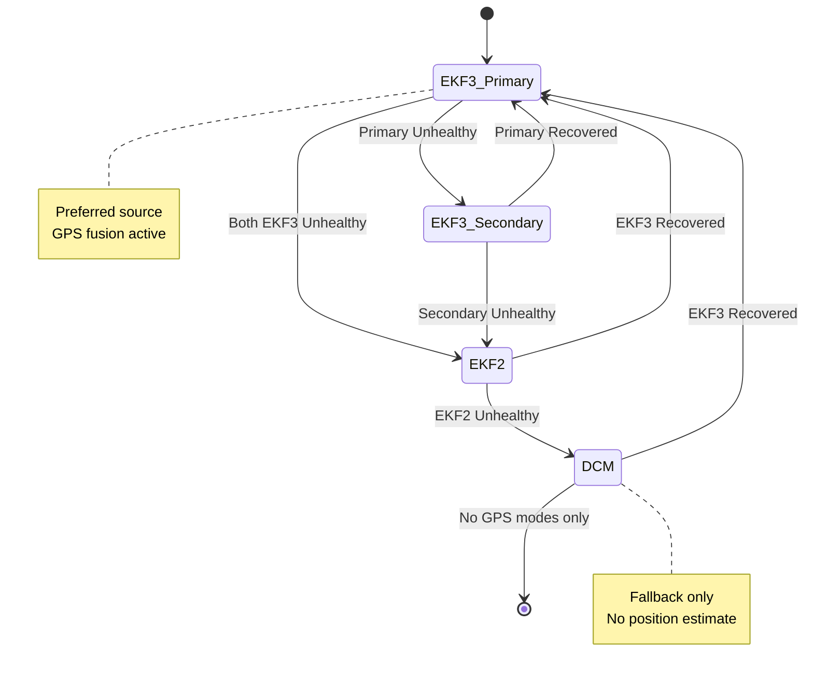

**Configuration**:
- `AHRS_EKF_TYPE` - EKF type selection (2=EKF2, 3=EKF3)
- `EK3_ENABLE` - Enable EKF3 (0=Disabled, 1=Enabled)
- `EK2_ENABLE` - Enable EKF2 (0=Disabled, 1=Enabled)
- `FS_EKF_ACTION` - Action on EKF failsafe
- `FS_EKF_THRESH` - Variance threshold for failsafe

---

## Geofence and Terrain Safety

### Overview

Geofence systems prevent vehicles from leaving designated safe zones. Terrain following ensures safe clearance above ground.

**Source Files**:
- `/libraries/AC_Fence/AC_Fence.cpp`
- `/ArduCopter/fence.cpp`
- `/ArduPlane/fence.cpp`
- `/libraries/AP_Terrain/AP_Terrain.cpp`

### Geofence Types

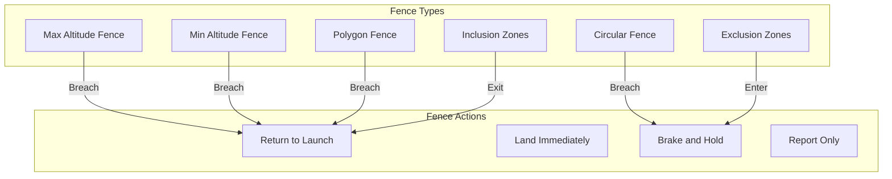

### Altitude Fences

**Source**: `AC_Fence.cpp:check_fence_alt()`

```cpp
/**
 * @safety CRITICAL: Altitude fence monitoring
 * @failsafe Triggers on altitude floor or ceiling breach
 * @timing Called at 10Hz from main loop
 * @note Uses barometric altitude (not GPS altitude)
 */
void AC_Fence::check_fence_alt()
{
    // Get current altitude above home
    float alt_above_home_m;
    if (!AP::ahrs().get_relative_position_D_home(alt_above_home_m)) {
        // No altitude estimate available
        return;
    }
    alt_above_home_m = -alt_above_home_m;  // Convert down to up
    
    // Check maximum altitude fence
    if ((_enabled_fences & AC_FENCE_TYPE_ALT_MAX) && 
        alt_above_home_m > _alt_max) {
        
        record_breach(AC_FENCE_TYPE_ALT_MAX);
        
        // Trigger fence action
        if (_action != AC_FENCE_ACTION_REPORT_ONLY) {
            trigger_fence_action();
        }
    }
    
    // Check minimum altitude fence (avoid ground)
    if ((_enabled_fences & AC_FENCE_TYPE_ALT_MIN) && 
        alt_above_home_m < _alt_min) {
        
        record_breach(AC_FENCE_TYPE_ALT_MIN);
        trigger_fence_action();
    }
}
```

**Configuration**:
- `FENCE_ALT_MAX` - Maximum altitude above home (meters)
- `FENCE_ALT_MIN` - Minimum altitude above home (meters)
- `FENCE_ACTION` - Action on breach (0=Report, 1=RTL, 2=Land, 3=SmartRTL, 4=Brake, 5=SmartRTL or Land)
- `FENCE_MARGIN` - Distance margin for breach detection (meters)

### Circular and Polygon Fences

**Source**: `AC_Fence.cpp:check_fence_polygon()`

```cpp
/**
 * @safety CRITICAL: Polygon fence boundary checking
 * @failsafe Triggers on inclusion zone exit or exclusion zone entry
 * @note Uses GPS horizontal position
 * @thread_safety Read-only access to fence points
 */
void AC_Fence::check_fence_polygon()
{
    Vector2f position;
    if (!AP::ahrs().get_relative_position_NE_home(position)) {
        // No position estimate
        return;
    }
    
    // Check inclusion polygons (must stay inside)
    for (uint8_t i = 0; i < _num_inclusion_polygons; i++) {
        if (!Polygon_outside(position, _inclusion_polygons[i])) {
            continue;  // Inside inclusion zone, OK
        }
        
        // Outside inclusion zone - breach
        record_breach(AC_FENCE_TYPE_POLYGON);
        trigger_fence_action();
        return;
    }
    
    // Check exclusion polygons (must stay outside)
    for (uint8_t i = 0; i < _num_exclusion_polygons; i++) {
        if (Polygon_outside(position, _exclusion_polygons[i])) {
            continue;  // Outside exclusion zone, OK
        }
        
        // Inside exclusion zone - breach
        record_breach(AC_FENCE_TYPE_POLYGON);
        trigger_fence_action();
        return;
    }
}
```

**Fence Loading**:
- Fences uploaded via MAVLink FENCE_POINT messages
- Stored in EEPROM for persistence
- Maximum fence points limited by available memory (typically 84 points)

### Fence Recovery

```cpp
/**
 * @safety CRITICAL: Fence breach recovery
 * @recovery Automatic fence clear when back inside boundaries
 * @note Some actions (LAND) do not allow recovery
 */
void AC_Fence::check_fence_recovery()
{
    if (!_breached) {
        return;  // No breach active
    }
    
    // Check if fence action allows recovery
    if (_action == AC_FENCE_ACTION_LAND) {
        return;  // Landing cannot be canceled
    }
    
    // Check all fences
    bool all_clear = true;
    if (!check_fence_alt()) all_clear = false;
    if (!check_fence_circle()) all_clear = false;
    if (!check_fence_polygon()) all_clear = false;
    
    if (all_clear && (AP_HAL::millis() - _breach_time_ms > 1000)) {
        // Clear breach after 1 second inside boundaries
        clear_breach(AC_FENCE_TYPE_ALL);
        gcs().send_text(MAV_SEVERITY_INFO, "Fence breach cleared");
    }
}
```

### Terrain Following Safety

**Source**: `AP_Terrain.cpp`

```cpp
/**
 * @safety CRITICAL: Terrain altitude monitoring
 * @failsafe Triggers if terrain clearance below minimum
 * @note Requires terrain database or rangefinder
 * @warning GPS altitude alone insufficient for terrain following
 */
float AP_Terrain::height_above_terrain(bool &have_terrain_data)
{
    Vector3f pos;
    if (!AP::ahrs().get_relative_position_NED_origin(pos)) {
        have_terrain_data = false;
        return 0.0f;
    }
    
    // Get terrain altitude at current location
    float terrain_alt;
    if (!height_terrain(terrain_alt)) {
        have_terrain_data = false;
        return 0.0f;
    }
    
    // Calculate height above terrain
    float height = (-pos.z) - terrain_alt;
    have_terrain_data = true;
    
    return height;
}
```

**Terrain Data Sources**:
1. **SRTM Database**: Downloaded terrain tiles (90m resolution)
2. **Rangefinder**: Real-time ground distance measurement
3. **GPS + Barometer**: Fusion for height above terrain

**Configuration**:
- `TERRAIN_ENABLE` - Enable terrain database (0=Disabled, 1=Enabled)
- `TERRAIN_SPACING` - Grid spacing for terrain data (meters)
- `TERRAIN_MARGIN` - Minimum clearance above terrain (meters)
- `TERRAIN_OFS_MAX` - Maximum expected terrain offset (meters)

---

## Motor Control Safety

### Overview

Motor control safety systems prevent unintended motor operation and enforce output limiting to maintain vehicle controllability.

**Source Files**:
- `/libraries/AP_Motors/AP_Motors_Class.cpp`
- `/libraries/AP_Motors/AP_MotorsMatrix.cpp`
- `/libraries/SRV_Channel/SRV_Channel.cpp`

### Motor Safety State Machine

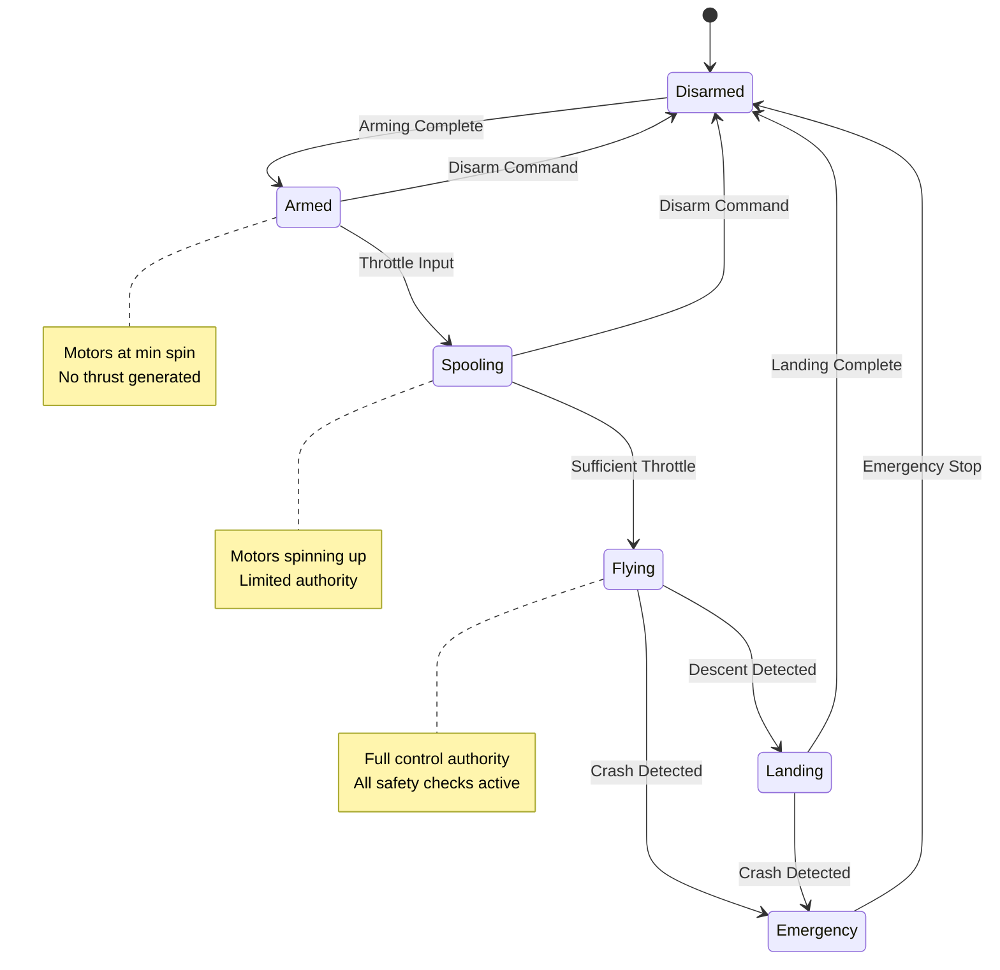

### Motor Arming Safety

**Source**: `AP_Motors_Class.cpp:armed()`

```cpp
/**
 * @safety CRITICAL: Motor arming control
 * @failsafe Prevents motor start when unsafe
 * @thread_safety Must be called from main thread only
 * @note Motors spin at MOT_SPIN_MIN when armed
 */
void AP_Motors::armed(bool arm)
{
    if (_armed == arm) {
        return;  // No change
    }
    
    _armed = arm;
    
    if (_armed) {
        // Set motor spool state to ground idle
        set_desired_spool_state(DesiredSpoolState::GROUND_IDLE);
        
        // Enable motor output
        hal.rcout->force_safety_off();
        
        // Reset motor integrators
        for (uint8_t i = 0; i < AP_MOTORS_MAX_NUM_MOTORS; i++) {
            _thrust_rpyt_out[i] = 0.0f;
        }
        
    } else {
        // Immediately stop all motors
        set_desired_spool_state(DesiredSpoolState::SHUT_DOWN);
        output_motor_mask(0.0f, 0xFFFF);  // Zero all motors
        
        // Re-enable safety switch if configured
        if (_enable_safety) {
            hal.rcout->force_safety_on();
        }
    }
}
```

**MOT_SPIN Parameters**:
- `MOT_SPIN_MIN` - Minimum throttle when armed (0.0-1.0, default: 0.15)
- `MOT_SPIN_MAX` - Maximum throttle output (0.0-1.0, default: 0.95)
- `MOT_SPIN_ARM` - Motor spin when armed but not flying (0.0-1.0, default: 0.10)
- `MOT_BAT_VOLT_MAX` - Battery voltage for maximum thrust (Volts)
- `MOT_BAT_VOLT_MIN` - Battery voltage for minimum thrust (Volts)
- `MOT_THST_EXPO` - Throttle curve exponent (0.0-1.0, default: 0.65)

### Motor Output Limiting

**Source**: `AP_MotorsMatrix.cpp:output_armed_stabilizing()`

```cpp
/**
 * @safety CRITICAL: Motor saturation limiting
 * @note Prevents loss of control authority during saturation
 * @timing Called at motor output rate (typically 400Hz)
 * @warning Limit flags indicate reduced control authority
 */
void AP_MotorsMatrix::output_armed_stabilizing()
{
    // Calculate desired motor outputs from RPYT
    output_rpyt_to_motors();
    
    // Check for saturation
    float throttle_thrust_best_rpy = 0.0f;
    limit.roll_pitch = false;
    limit.yaw = false;
    limit.throttle_lower = false;
    limit.throttle_upper = false;
    
    // Find if any motor is saturated
    float motor_min = 1.0f;
    float motor_max = 0.0f;
    for (uint8_t i = 0; i < _num_motors; i++) {
        if (_motor_enabled[i]) {
            motor_min = MIN(motor_min, _thrust_rpyt_out[i]);
            motor_max = MAX(motor_max, _thrust_rpyt_out[i]);
        }
    }
    
    // Apply saturation limiting
    if (motor_max > 1.0f) {
        // Scale all motors to keep within limits
        float scale = 1.0f / motor_max;
        for (uint8_t i = 0; i < _num_motors; i++) {
            _thrust_rpyt_out[i] *= scale;
        }
        limit.throttle_upper = true;
    }
    
    if (motor_min < 0.0f) {
        // Increase all motors to keep above zero
        float offset = -motor_min;
        for (uint8_t i = 0; i < _num_motors; i++) {
            _thrust_rpyt_out[i] += offset;
        }
        limit.throttle_lower = true;
    }
    
    // Output to motors
    output_motor_thrust();
}
```

**Saturation Handling**:
1. **Upper Saturation**: Scale all outputs proportionally to prevent exceeding maximum
2. **Lower Saturation**: Lift all outputs to maintain minimum motor speed
3. **Authority Loss**: Set limit flags to inform attitude controller
4. **Priority**: Yaw authority reduced first, then roll/pitch

### Emergency Motor Stop

**Source**: `AP_Motors_Class.cpp:emergency_stop()`

```cpp
/**
 * @safety CRITICAL: Emergency motor shutdown
 * @warning Causes immediate loss of control - use only in emergencies
 * @thread_safety Can be called from any context
 * @note Does not disarm - manual disarm still required
 */
void AP_Motors::emergency_stop()
{
    // Set emergency stop flag
    _emergency_stop = true;
    
    // Immediately set all motors to zero
    for (uint8_t i = 0; i < AP_MOTORS_MAX_NUM_MOTORS; i++) {
        if (_motor_enabled[i]) {
            hal.rcout->write(pgm_read_byte(&_motor_to_channel_map[i]), 
                           get_pwm_output_min());
        }
    }
    
    // Log emergency stop event
    Log_Write_Error(LogErrorSubsystem::MOTOR, 
                   LogErrorCode::MOTOR_EMERGENCY_STOP);
}
```

**Triggering Conditions**:
- Crash detection threshold exceeded
- Pilot motor interlock switch disabled
- Critical failsafe with TERMINATE action
- Ground control station emergency stop command

### Motor Test Safety

**Source**: `AP_Motors_Class.cpp:output_test()`

```cpp
/**
 * @safety CRITICAL: Motor test mode safety
 * @warning Only allowed when disarmed and on ground
 * @note Individual motor control for configuration verification
 * @timing 2-second timeout per motor test
 */
void AP_Motors::output_test(uint8_t motor_seq, int16_t pwm)
{
    // Safety checks
    if (_armed) {
        return;  // Cannot test while armed
    }
    
    if (motor_seq >= AP_MOTORS_MAX_NUM_MOTORS) {
        return;  // Invalid motor number
    }
    
    if (!_motor_enabled[motor_seq]) {
        return;  // Motor not configured
    }
    
    // Enable test output for specified motor only
    hal.rcout->write(pgm_read_byte(&_motor_to_channel_map[motor_seq]), pwm);
    
    // Set test timeout
    _test_timeout_ms = AP_HAL::millis() + 2000;
}
```

**Motor Test Safety**:
- Only available when disarmed
- 2-second timeout per motor
- Requires throttle at zero
- Tests one motor at a time
- Limited to configurable maximum throttle

---

## Crash Detection and Recovery

### Overview

Crash detection systems automatically detect vehicle crashes and trigger appropriate safety responses including motor shutdown and logging.

**Source Files**:
- `/ArduCopter/crash_check.cpp`
- `/ArduPlane/crash_check.cpp`

### Crash Detection Algorithms

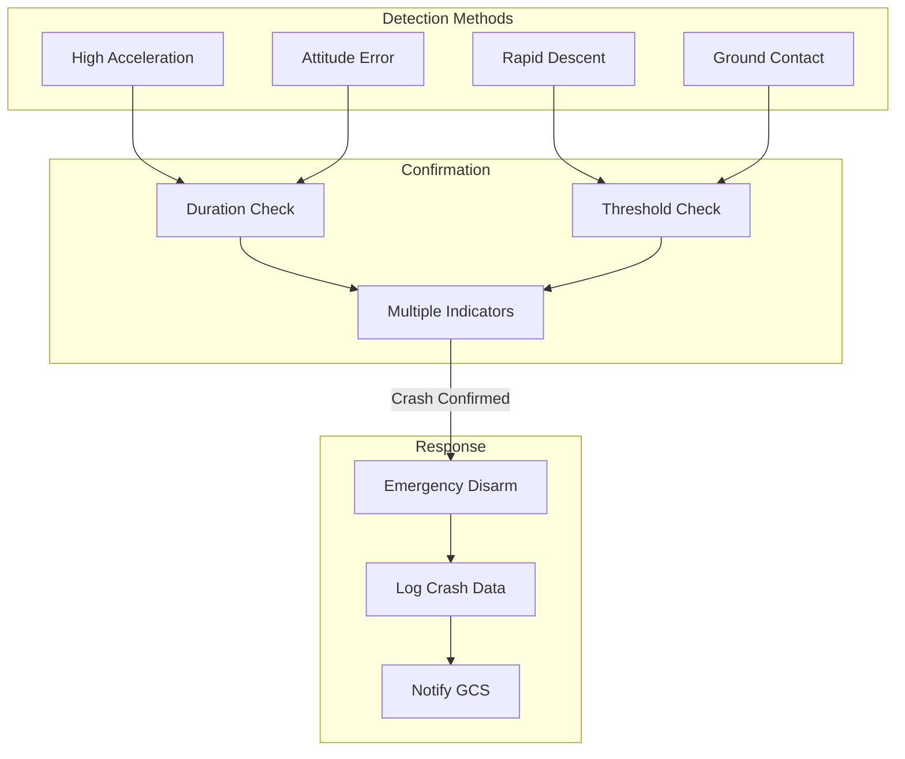

### Parachute Deployment (if configured)

```cpp
/**
 * @safety CRITICAL: Automatic parachute deployment
 * @warning One-time deployment - cannot be reset in flight
 * @note Requires external parachute hardware
 */
void Copter::parachute_check()
{
    if (!parachute.enabled()) {
        return;
    }
    
    // Check for crash conditions warranting parachute
    if (_crash_counter > 20) {  // 0.2 seconds sustained
        // Deploy parachute
        parachute.release();
        
        // Log deployment
        Log_Write_Error(LogErrorSubsystem::PARACHUTE,
                       LogErrorCode::PARACHUTE_RELEASED);
        
        // Disarm motors
        arming.disarm(AP_Arming::Method::CRASH);
    }
}
```

---

## Thread Safety and Concurrency

### Overview

ArduPilot uses a cooperative multitasking scheduler with shared resource protection through semaphores and atomic operations.

**Source Files**:
- `/libraries/AP_HAL/Scheduler.h`
- `/libraries/AP_HAL/Semaphores.h`
- `/libraries/AP_HAL/Util.h`

### Scheduler Architecture

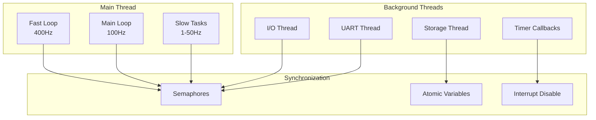

### Critical Section Protection

```cpp
/**
 * @safety CRITICAL: Sensor data access requires semaphore
 * @thread_safety Must hold _backend_sem during sensor reads
 * @concurrency Prevents race conditions between main loop and backends
 * @timing Maximum semaphore hold time: 100μs
 */
bool AP_InertialSensor::get_accel(Vector3f &accel, uint8_t instance)
{
    // Take semaphore
    if (!_backend_sem->take(HAL_SEMAPHORE_BLOCK_FOREVER)) {
        return false;
    }
    
    // Access shared sensor data
    accel = _accel[instance];
    bool healthy = _accel_healthy[instance];
    
    // Release semaphore
    _backend_sem->give();
    
    return healthy;
}
```

**Semaphore Types**:
- **Blocking**: Wait indefinitely for access (`HAL_SEMAPHORE_BLOCK_FOREVER`)
- **Timeout**: Wait for specified time (`timeout_ms`)
- **Non-blocking**: Return immediately if unavailable (`0`)

### Atomic Operations

```cpp
/**
 * @safety CRITICAL: Atomic flag updates
 * @thread_safety Lock-free atomic operations
 * @note Used for simple boolean flags and counters
 */
class AP_HAL::Util {
public:
    // Atomic compare-and-swap
    bool cas(volatile uint32_t *ptr, uint32_t oldval, uint32_t newval);
    
    // Atomic increment
    uint32_t atomic_fetch_add(volatile uint32_t *ptr, uint32_t val);
    
    // Memory barriers
    void memory_barrier();
};
```

**Usage Example**:
```cpp
// Atomic failsafe flag update
hal.util->memory_barrier();
_failsafe_active.store(true, std::memory_order_release);
```

### Interrupt Context Safety

```cpp
/**
 * @safety CRITICAL: Timer callback from interrupt context
 * @interrupt Called at 1kHz from hardware timer
 * @timing Must complete in <100μs
 * @warning Cannot use semaphores or blocking operations
 * @note Only atomic operations and ISR-safe functions allowed
 */
void AP_InertialSensor::timer_update()
{
    // Called from ISR - must be fast and lock-free
    
    // Read sensor via SPI (DMA safe)
    _backends[0]->read_sensor();
    
    // Update sample counter (atomic)
    _sample_count++;
    
    // Set data ready flag (atomic)
    _data_ready.store(true, std::memory_order_release);
}
```

**ISR Safety Rules**:
1. No semaphores or mutex locks
2. No memory allocation
3. No blocking operations
4. Keep execution time minimal (<100μs)
5. Use atomic operations for shared data
6. Defer complex processing to thread context

### DMA-Safe Memory

```cpp
/**
 * @safety CRITICAL: DMA buffer allocation
 * @memory Must use DMA-safe memory region (CCM or DMA heap)
 * @note Some MCUs have cache that conflicts with DMA
 * @warning Stack and regular heap may not be DMA-safe
 */
void AP_HAL::UARTDriver::begin(uint32_t baud)
{
    // Allocate DMA-safe buffer
    _rx_buffer = (uint8_t*)hal.util->malloc_type(buffer_size, 
                                                  AP_HAL::Util::MEM_DMA_SAFE);
    
    // Configure DMA controller
    dma_setup(_rx_buffer, buffer_size);
}
```

**DMA-Safe Regions**:
- CCM (Core-Coupled Memory) on STM32F4
- SRAM1/SRAM2 on STM32F7/H7 (cache-coherent)
- Special DMA heap allocated at startup

---

## Resource Constraints

### Overview

Real-time autopilot systems operate under strict resource constraints including timing, memory, stack depth, and CPU utilization.

### Timing Constraints

**Source**: Scheduler task tables in vehicle `Copter.cpp`, `Plane.cpp`

```cpp
/**
 * @safety CRITICAL: Main scheduler task table
 * @timing Each task must complete within allocated time slice
 * @note Tasks are prioritized by rate - faster tasks run first
 * @warning Overrun tasks are logged and may be skipped
 */
const AP_Scheduler::Task Copter::scheduler_tasks[] = {
    // Rate (Hz), Function, Expected duration (μs), Priority
    SCHED_TASK(rc_loop,              100,    130,  3),
    SCHED_TASK(throttle_loop,         50,     75,  6),
    SCHED_TASK_CLASS(AP_GPS, &copter.gps, update, 50, 200, 9),
    SCHED_TASK(update_batt_compass,   10,    120, 15),
    SCHED_TASK(read_aux_all,          10,     50, 18),
    SCHED_TASK(arm_motors_check,      10,     50, 21),
    SCHED_TASK(update_alt,            10,    100, 24),
    SCHED_TASK(run_nav_updates,       50,    100, 27),
    SCHED_TASK(update_throttle_hover, 100,    90, 30),
    SCHED_TASK(three_hz_loop,          3,     75, 33),
    SCHED_TASK(check_dynamic_flight,   3,     75, 36),
    SCHED_TASK(update_mount,          50,     75, 39),
    SCHED_TASK(update_trigger,        50,     75, 42),
    SCHED_TASK(update_GPS,            50,    200, 45),
    SCHED_TASK(update_batt_compass,   10,    120, 48),
    SCHED_TASK(read_rangefinder,      20,    100, 51),
    SCHED_TASK(update_altitude,       10,    100, 54),
    SCHED_TASK(run_camera_mount,      50,     75, 57),
    SCHED_TASK(ten_hz_logging_loop,   10,    350, 60),
    SCHED_TASK(fifty_hz_logging_loop, 50,    110, 63),
    SCHED_TASK(full_rate_logging_loop,400,    100, 66),
    SCHED_TASK(perf_update,           0.1,    75, 69),
    SCHED_TASK(read_receiver_rssi,    10,     75, 72),
    SCHED_TASK(update_mount,          50,     75, 75),
    SCHED_TASK(update_trigger,        50,     75, 78),
    SCHED_TASK(gcs_check_input,      400,    180, 81),
    SCHED_TASK(gcs_send_heartbeat,     1,    110, 84),
    SCHED_TASK(gcs_send_deferred,     50,    550, 87),
    SCHED_TASK(gcs_data_stream_send,  50,    550, 90),
    SCHED_TASK(update_mount,          50,     75, 93),
    SCHED_TASK(update_trigger,        50,     75, 96),
    SCHED_TASK(one_hz_loop,            1,    100, 99),
    SCHED_TASK(ekf_check,             10,     75,102),
    SCHED_TASK(landinggear_update,    10,     75,105),
    SCHED_TASK(lost_vehicle_check,     0.5,    50,108),
    SCHED_TASK(gcs_send_text,         10,     50,111),
    SCHED_TASK_CLASS(GCS, (GCS*)&copter._gcs, update_send, 400, 550, 114),
    SCHED_TASK_CLASS(AP_Baro, &copter.barometer, accumulate, 50, 90, 117),
    SCHED_TASK(update_notify,         50,     90,120),
    SCHED_TASK(one_hz_loop,            1,    100,123),
    SCHED_TASK(compass_cal_update,   100,    100,126),
    SCHED_TASK(accel_cal_update,      10,    100,129),
    SCHED_TASK(terrain_update,        10,    100,132),
};
```

**Timing Requirements**:
- Fast loop (400Hz): IMU read, attitude control - must complete in 2.5ms
- Main loop (100Hz): Mode updates, navigation - must complete in 10ms
- Slow loops (1-50Hz): Logging, telemetry - budget varies by task
- Overruns logged and monitored for performance degradation

### Memory Constraints

**Available Memory by Platform**:

| Platform | RAM | Flash | Stack | Heap |
|----------|-----|-------|-------|------|
| **Pixhawk 1 (STM32F4)** | 192KB | 1MB | 8KB | ~80KB |
| **Pixhawk 2 (STM32F4)** | 256KB | 2MB | 8KB | ~120KB |
| **Pixhawk 4 (STM32F7)** | 512KB | 2MB | 16KB | ~256KB |
| **Pixhawk 6 (STM32H7)** | 1MB | 2MB | 32KB | ~512KB |
| **Linux (BBB, RPi)** | >512MB | >4GB | 8MB | >256MB |

**Memory Allocation Rules**:
```cpp
/**
 * @safety CRITICAL: Memory allocation constraints
 * @memory Dynamic allocation discouraged in flight-critical code
 * @note Most structures allocated statically at compile time
 * @warning Heap fragmentation can cause allocation failures
 */

// PREFERRED: Static allocation
static AP_InertialSensor ins;
static AP_GPS gps;

// ACCEPTABLE: Startup allocation (in init() functions)
void AP_Module::init() {
    _buffer = (uint8_t*)calloc(BUFFER_SIZE, sizeof(uint8_t));
    if (_buffer == nullptr) {
        AP_HAL::panic("Failed to allocate buffer");
    }
}

// AVOID: Runtime allocation in flight-critical paths
void update() {
    // DON'T DO THIS
    uint8_t *temp = (uint8_t*)malloc(100);  // May fail or fragment heap!
}
```

### Stack Depth Constraints

```cpp
/**
 * @safety CRITICAL: Stack usage monitoring
 * @stack Maximum stack depth varies by thread
 * @warning Stack overflow causes immediate crash
 * @note Recursive functions generally avoided
 */

// Check stack usage
void check_stack() {
    uint32_t stack_free = hal.util->available_memory();
    if (stack_free < MIN_STACK_FREE) {
        Log_Write_Error(LogErrorSubsystem::CPU, 
                       LogErrorCode::LOW_STACK);
    }
}
```

**Stack Limits**:
- Main thread: 8KB-32KB depending on platform
- I/O thread: 2KB-4KB
- Storage thread: 2KB
- Deep recursion avoided - maximum depth typically 3-4 levels

### CPU Utilization

```cpp
/**
 * @safety CRITICAL: CPU load monitoring
 * @timing Target: <80% CPU utilization
 * @warning >90% CPU causes scheduler delays
 * @note Measured via scheduler statistics
 */
void Copter::perf_update()
{
    // Update CPU load statistics
    uint32_t cpu_load_pct = scheduler.get_cpu_load_pct();
    
    if (cpu_load_pct > 90) {
        Log_Write_Error(LogErrorSubsystem::CPU,
                       LogErrorCode::HIGH_CPU_LOAD);
        gcs().send_text(MAV_SEVERITY_WARNING, 
                       "CPU load high: %u%%", cpu_load_pct);
    }
}
```

**CPU Budget Guidelines**:
- Target: 70-80% average CPU load
- Warning: >85% sustained load
- Critical: >90% - may cause scheduler delays
- Reserve: 10-20% for burst processing and failsafes

---

## Error Handling Patterns

### Overview

Consistent error handling patterns ensure failures are detected, logged, and handled gracefully throughout the codebase.

### Error Detection and Reporting

```cpp
/**
 * @safety CRITICAL: Error logging subsystem
 * @note Errors logged to onboard dataflash and telemetry
 * @thread_safety Error logging is thread-safe
 */
enum class LogErrorSubsystem : uint8_t {
    MAIN            = 1,
    RADIO           = 2,
    COMPASS         = 3,
    OPTFLOW         = 4,
    FAILSAFE_RADIO  = 5,
    FAILSAFE_BATT   = 6,
    FAILSAFE_GPS    = 7,
    FAILSAFE_GCS    = 8,
    FAILSAFE_FENCE  = 9,
    FLIGHT_MODE     = 10,
    GPS             = 11,
    CRASH_CHECK     = 12,
    FLIP            = 13,
    AUTOTUNE        = 14,
    PARACHUTE       = 15,
    EKFCHECK        = 16,
    FAILSAFE_EKFINAV= 17,
    BARO            = 18,
    CPU             = 19,
    FAILSAFE_ADSB   = 20,
    TERRAIN         = 21,
    NAVIGATION      = 22,
    FAILSAFE_TERRAIN= 23,
    EKFCORE         = 24,
    FAILSAFE_EKFVEL = 25,
    MOTOR           = 26,
};
```

### Error Recovery Strategies

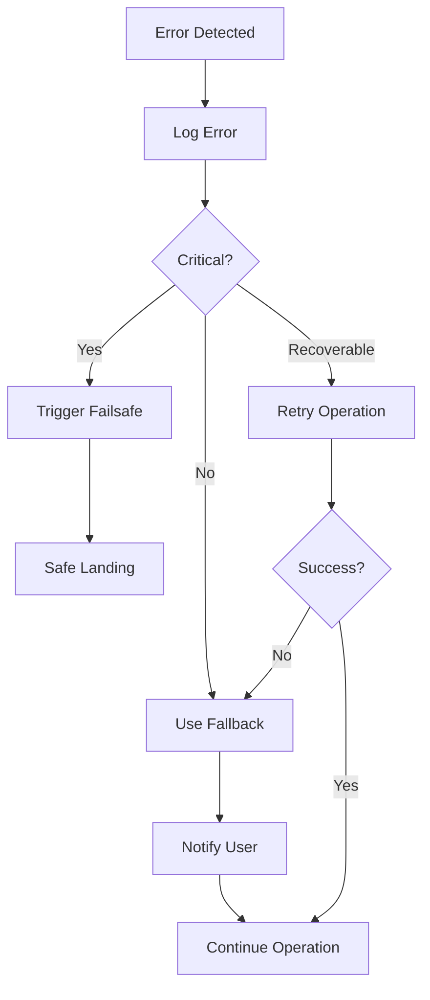

### Graceful Degradation

```cpp
/**
 * @safety CRITICAL: Sensor fallback strategy
 * @error_handling Uses secondary sensors when primary fails
 * @note Logs sensor switching events
 */
void AP_AHRS::update()
{
    // Try primary EKF
    if (_ekf3.healthy()) {
        _active_ekf_type = EKFType::THREE;
        return;
    }
    
    // Fall back to EKF2
    if (_ekf2.healthy()) {
        _active_ekf_type = EKFType::TWO;
        Log_Write_Error(LogErrorSubsystem::EKFCORE,
                       LogErrorCode::FALLBACK_TO_EKF2);
        return;
    }
    
    // Fall back to DCM
    _active_ekf_type = EKFType::NONE;
    Log_Write_Error(LogErrorSubsystem::EKFCORE,
                   LogErrorCode::FALLBACK_TO_DCM);
}
```

---

## Safety Testing and Validation

### Overview

Comprehensive testing validates safety-critical systems before release.

### Testing Hierarchy

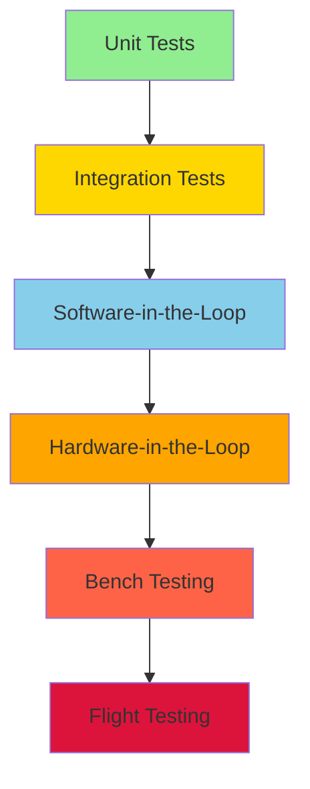

### Automated Test Suite

**Source**: `/libraries/*/tests/`, `/Tools/autotest/`

```bash
# Run all unit tests
./waf tests

# Run SITL autotest
./Tools/autotest/autotest.py build.ArduCopter test.ArduCopter

# Run specific failsafe tests
./Tools/autotest/autotest.py test.ArduCopter.Failsafe
```

### Safety-Critical Test Cases

**Failsafe Tests** (`/Tools/autotest/arducopter.py`):
- Radio failsafe triggering and recovery
- Battery failsafe at multiple voltage thresholds
- GPS failsafe and mode transitions
- EKF failsafe with variance injection
- Fence breach detection and recovery
- Multiple simultaneous failsafes (priority testing)

**Arming Tests**:
- All pre-arm check failures
- Sensor calibration requirements
- RC input validation
- Battery state verification
- GPS fix requirements

**Mode Transition Tests**:
- Legal and illegal transitions
- Failsafe mode overrides
- Position estimate requirements
- Landing sequence protection

### Hardware-in-the-Loop Testing

**HIL Simulation Features**:
- Real autopilot hardware with simulated sensors
- Failsafe injection capabilities
- Sensor noise and failure simulation
- Communication link simulation
- Battery discharge modeling

---

## Contributing to Safety-Critical Code

### Code Review Requirements

**Safety-critical code changes require**:
1. Detailed description of safety implications
2. Test plan covering all error paths
3. Verification in SITL and HIL environments
4. Review by core safety team member
5. Documentation updates
6. Regression test additions

### Documentation Requirements

All safety-critical functions must include:
```cpp
/**
 * @safety CRITICAL: [Safety implications]
 * @failsafe [Trigger conditions]
 * @recovery [Recovery mechanisms]
 * @thread_safety [Thread safety guarantees]
 * @timing [Real-time constraints]
 * @error_handling [Error detection and response]
 * @testing [Test coverage]
 */
```

### Testing Checklist

Before submitting safety-critical changes:
- [ ] Unit tests added/updated
- [ ] SITL autotest passes
- [ ] Manual SITL testing completed
- [ ] HIL testing performed (if hardware available)
- [ ] Bench testing completed
- [ ] Test flight completed and logged
- [ ] Documentation updated
- [ ] Changelog entry added

---

## Incident Reporting and Analysis

### Incident Classification

| Severity | Description | Example | Response Time |
|----------|-------------|---------|---------------|
| **Critical** | Safety of flight compromised | Mid-air failure, crash | Immediate |
| **Major** | Degraded safety margins | Failsafe false trigger | 24 hours |
| **Minor** | Nuisance but not safety impact | Log message error | 1 week |
| **Cosmetic** | No operational impact | UI glitch | 1 month |

### Incident Report Template

```markdown
## Incident Report

**Date**: YYYY-MM-DD
**Severity**: Critical/Major/Minor/Cosmetic
**Vehicle**: ArduCopter/ArduPlane/Rover/Sub
**Version**: X.Y.Z

### Description
[What happened]

### Expected Behavior
[What should have happened]

### Actual Behavior
[What actually happened]

### Logs
- Dataflash log: [link or attachment]
- Telemetry log: [link or attachment]
- GCS screenshots: [if applicable]

### Environmental Conditions
- Location: [GPS coordinates]
- Weather: [conditions]
- Altitude: [MSL and AGL]
- Flight mode: [mode at time of incident]

### Safety Impact
[Describe safety implications]

### Root Cause Analysis
[Analysis of logs and code]

### Recommended Actions
[Proposed fixes or workarounds]
```

### Post-Incident Analysis Process

1. **Immediate Response**: Secure logs and vehicle state
2. **Log Analysis**: Review dataflash and telemetry logs
3. **Code Review**: Examine relevant code paths
4. **Reproduction**: Attempt to reproduce in SITL/HIL
5. **Root Cause**: Determine underlying cause
6. **Fix Development**: Implement and test solution
7. **Regression Prevention**: Add automated test
8. **Documentation**: Update safety documentation
9. **User Notification**: Alert users if widespread issue

---

## References

### Key Source Files

**Safety-Critical File Summary**:
```
/libraries/AP_Arming/          - Pre-arm checks and arming logic
/*/failsafe.cpp                - Vehicle-specific failsafe handlers
/*/mode.cpp, mode_*.cpp        - Flight mode implementations
/*/ekf_check.cpp               - EKF health monitoring
/*/crash_check.cpp             - Crash detection algorithms
/libraries/AC_Fence/           - Geofence implementation
/libraries/AP_Motors/          - Motor control and safety
/libraries/AP_Mission/         - Mission validation and execution
/libraries/AP_NavEKF2/         - EKF2 state estimation
/libraries/AP_NavEKF3/         - EKF3 state estimation
/libraries/AP_Terrain/         - Terrain following safety
```

### External Safety Standards

ArduPilot safety systems designed with reference to:
- **DO-178C**: Software considerations in airborne systems
- **DO-254**: Hardware considerations in airborne systems
- **MIL-STD-882E**: System safety program requirements
- **ARP4761**: Guidelines for conducting safety assessments

### Community Resources

- **Forums**: https://discuss.ardupilot.org/
- **Wiki**: https://ardupilot.org/copter/
- **Safety Page**: https://ardupilot.org/copter/docs/safety.html
- **Issue Tracker**: https://github.com/ArduPilot/ardupilot/issues
- **Discord**: https://ardupilot.org/discord

---

## Glossary

**AHRS**: Attitude Heading Reference System - provides vehicle orientation
**DCM**: Direction Cosine Matrix - backup attitude algorithm
**EKF**: Extended Kalman Filter - sensor fusion algorithm
**GCS**: Ground Control Station - software for vehicle monitoring/control
**HDOP**: Horizontal Dilution of Precision - GPS accuracy metric
**IMU**: Inertial Measurement Unit - accelerometers and gyroscopes
**MAVLink**: Micro Air Vehicle Link - communication protocol
**NED**: North-East-Down coordinate frame (Z-axis points down)
**RTL**: Return to Launch - autonomous return and landing mode
**SITL**: Software In The Loop - simulation environment

---

**Document Version**: 1.0  
**Last Updated**: 2024  
**Maintained By**: ArduPilot Development Team  
**License**: GPLv3

---

**SAFETY NOTICE**: This documentation describes safety-critical systems. Any modifications to the code covered in this document must follow the safety review process outlined in the "Contributing to Safety-Critical Code" section. Improper changes can result in loss of vehicle control, injury, or death.

