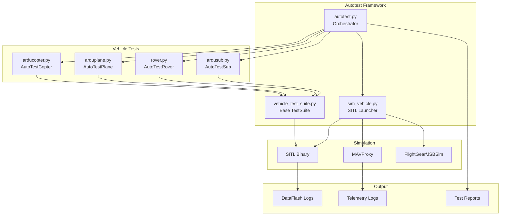
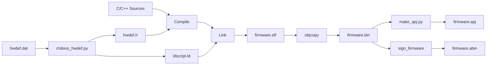
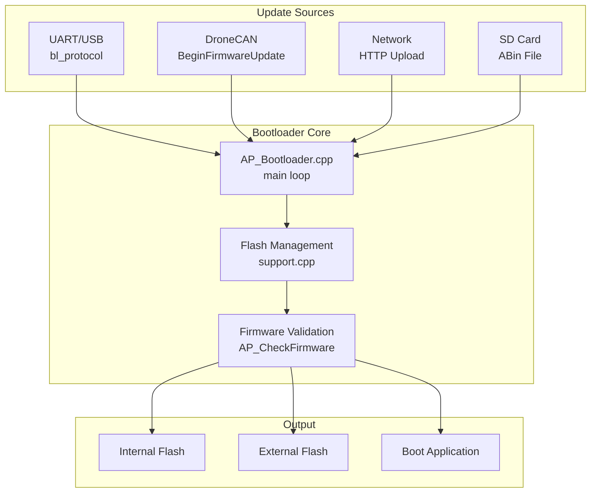
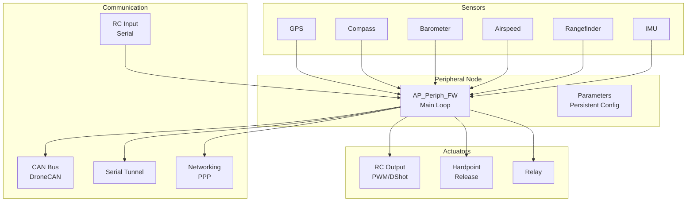
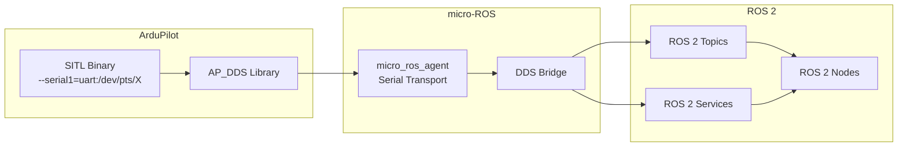

# ArduPilot Development Tools


## Table of Contents
- [Overview](#overview)
- [Quick Start for Developers](#quick-start-for-developers)
- [Tool Categories](#tool-categories)
  - [Testing and Simulation](#testing-and-simulation)
  - [Build System](#build-system)
  - [Environment Setup](#environment-setup)
  - [Analysis and Debugging](#analysis-and-debugging)
  - [Hardware Tools](#hardware-tools)
  - [Communication and Integration](#communication-and-integration)
  - [Development Utilities](#development-utilities)
- [Detailed Tool Documentation](#detailed-tool-documentation)
- [Dependencies and Prerequisites](#dependencies-and-prerequisites)
- [CI/CD Integration](#cicd-integration)
- [Contributing](#contributing)

## Overview

The **Tools/** directory is the central collection of development, testing, build, and deployment utilities for the ArduPilot autopilot software. This comprehensive toolkit enables developers to build firmware, run automated tests, analyze flight logs, debug issues, manage hardware, and integrate with external systems.

**Purpose**: Support the complete ArduPilot development lifecycle from environment setup through firmware deployment and post-flight analysis.

**Source Location**: `/Tools/`

**Key Capabilities**:
- **Automated Testing**: SITL (Software In The Loop) simulation and comprehensive test suites for all vehicle types
- **Build Management**: Waf-based build system with cross-platform support and firmware packaging
- **Development Environment**: Cross-platform installation scripts for dependencies and toolchains
- **Log Analysis**: Replay and debugging tools for DataFlash log files
- **Hardware Support**: Bootloader and peripheral firmware for DroneCAN devices
- **CI/CD Integration**: Continuous integration tools and automated reporting

## Quick Start for Developers

### Setting Up Your Development Environment

**Choose your platform and run the appropriate installer:**

```bash
# Ubuntu/Debian
Tools/environment_install/install-prereqs-ubuntu.sh -y

# macOS
Tools/environment_install/install-prereqs-mac.sh -y

# Arch Linux
Tools/environment_install/install-prereqs-arch.sh -y

# Windows (PowerShell as Administrator)
Tools/environment_install/install-prereqs-windows.ps1
```

**Source**: `Tools/environment_install/`

These scripts install:
- Python 3 and required packages (pymavlink, MAVProxy, empy==3.3.4)
- ARM GCC cross-compiler (gcc-arm-none-eabi-10-2020-q4-major)
- Build tools (ccache, git, waf dependencies)
- Platform-specific development packages

### Running Your First SITL Simulation

```bash
# Launch ArduCopter in SITL with MAVProxy
Tools/autotest/sim_vehicle.py -v ArduCopter --console --map

# Launch ArduPlane
Tools/autotest/sim_vehicle.py -v ArduPlane --console --map

# Launch with custom parameters
Tools/autotest/sim_vehicle.py -v ArduCopter -L CMAC --console
```

**Source**: `Tools/autotest/sim_vehicle.py`

**Key Options**:
- `-v VEHICLE`: Vehicle type (ArduCopter, ArduPlane, Rover, ArduSub, AntennaTracker, Blimp)
- `-L LOCATION`: Starting location from `Tools/autotest/locations.txt`
- `--console`: Start MAVProxy console
- `--map`: Display map window
- `--speedup N`: Simulation speedup factor (default: 1)

### Building Firmware

```bash
# Configure for a specific board
./waf configure --board Pixhawk1

# Build all targets for the configured board
./waf

# Build specific vehicle
./waf copter

# Build for SITL
./waf configure --board sitl --debug
./waf
```

**Source**: Build system integration via `Tools/ardupilotwaf/`

### Running Automated Tests

```bash
# Run all ArduCopter tests
Tools/autotest/autotest.py --vehicle ArduCopter

# Run specific test
Tools/autotest/autotest.py --vehicle ArduCopter --test Fly.ArmFeatures

# Run with custom speedup
Tools/autotest/autotest.py --vehicle ArduPlane --speedup 10
```

**Source**: `Tools/autotest/autotest.py`

## Tool Categories

### Testing and Simulation

#### Autotest Framework (SITL Testing)

**Location**: `Tools/autotest/`

**Purpose**: Comprehensive SITL (Software In The Loop) simulation and automated testing infrastructure for all ArduPilot vehicles.

**Key Components**:

| Component | Description | Source File |
|-----------|-------------|-------------|
| **autotest.py** | Main test orchestrator and CI driver | `Tools/autotest/autotest.py` |
| **sim_vehicle.py** | SITL launcher with MAVProxy integration | `Tools/autotest/sim_vehicle.py` |
| **vehicle_test_suite.py** | Base TestSuite class with MAVLink helpers | `Tools/autotest/vehicle_test_suite.py` |
| **Vehicle Test Suites** | Per-vehicle test implementations | `arducopter.py`, `arduplane.py`, `rover.py`, `ardusub.py` |

**Architecture**:



**Capabilities**:
- **Automated Test Execution**: Build → Simulate → Test → Report workflow
- **MAVLink Integration**: Full MAVLink protocol testing via pymavlink
- **Mission Testing**: Upload/download missions, fence, rally points
- **Mode Testing**: Exercise all flight modes with entry/exit validation
- **Failsafe Testing**: Radio loss, battery, GPS, EKF health monitoring
- **Sensor Simulation**: IMU, GPS, barometer, compass, rangefinder
- **Multi-vehicle Testing**: Swarm/formation testing support
- **CI Integration**: JUnit XML output, web reports, artifact collection

**Test Suite Examples**:

```python
# Source: Tools/autotest/arducopter.py
class AutoTestCopter(vehicle_test_suite.TestSuite):
    """Comprehensive ArduCopter test suite with 90+ test scenarios"""
    
    def tests(self):
        return [
            self.ArmFeatures,           # Pre-arm and arming checks
            self.Takeoff,                # Guided takeoff
            self.StabilizeTest,          # Stabilize mode
            self.AltHoldTest,            # Altitude hold mode
            self.Loiter,                 # Position hold mode
            self.RTL,                    # Return to launch
            self.AutoTest,               # Auto mission execution
            self.FailsafeRadio,          # Radio failsafe
            self.FailsafeBattery,        # Battery failsafe
            self.FailsafeEKF,            # EKF failsafe
            # ... 80+ more tests
        ]
```

**Mission Fixtures**: `Tools/autotest/ArduCopter_Tests/`, `ArduPlane_Tests/`, `ArduRover_Tests/`, `ArduSub_Tests/`
- Standard QGC WPL mission files for deterministic test scenarios
- Geofence and rally point test fixtures

**Metadata Extraction**: `Tools/autotest/param_metadata/` and `logger_metadata/`
- **param_metadata**: Extracts `@Param` annotations and generates documentation
  - Outputs: `apm.pdef.json`, `apm.pdef.xml`, `Parameters.rst`, `Parameters.md`
- **logger_metadata**: Extracts log message definitions
  - Outputs: `LogMessages.html`, `LogMessages.md`, `LogMessages.rst`

**CI Utilities**:
- `bisect-helper.py`: Git bisect automation for autotest regressions
- `check_autotest_speedup.py`: Speedup optimization testing
- `test_build_options.py`: Build option coverage and binary size analysis
- `test_param_upgrade.py`: Parameter migration validation

**Dependencies**: pymavlink, pexpect, numpy, lxml, Jinja2, psutil, matplotlib

**Example Usage**:

```bash
# Run all copter tests with 10x speedup
Tools/autotest/autotest.py --vehicle ArduCopter --speedup 10

# Run specific test with debug output
Tools/autotest/autotest.py --vehicle ArduPlane --test Fly.AutoLand --debug

# Generate test report
Tools/autotest/autotest.py --vehicle Rover --speedup 5 --junit
```

#### Replay - Log Analysis and Debugging

**Location**: `Tools/Replay/`

**Purpose**: Offline log replay and validation toolset for analyzing DataFlash binary logs, re-executing EKF algorithms, and validating estimation accuracy.

**Architecture**: Mixed C++/Python collection that deserializes DataFlash logs and re-injects sensor data into AP-layer estimators.

**Key Components**:

| Component | Type | Description | Source |
|-----------|------|-------------|--------|
| **Replay.cpp** | C++ | Main replay application and vehicle | `Tools/Replay/Replay.cpp` |
| **LogReader** | C++ | DataFlash log parser and message router | `Tools/Replay/LogReader.cpp` |
| **DataFlashFileReader** | C++ | Platform-independent binary log reader | `Tools/Replay/DataFlashFileReader.cpp` |
| **MsgHandler** | C++ | Message field extraction and parsing | `Tools/Replay/MsgHandler.cpp` |
| **CheckLogs.py** | Python | Automated replay validation | `Tools/Replay/CheckLogs.py` |
| **check_replay.py** | Python | Field-by-field log comparison | `Tools/Replay/check_replay.py` |
| **check_replay_branch.py** | Python | Branch-level regression testing | `Tools/Replay/check_replay_branch.py` |

**Capabilities**:
- **EKF Replay**: Re-run EKF2 or EKF3 algorithms on recorded sensor data
- **Accuracy Validation**: Compare replay outputs to original flight logs
- **Regression Testing**: Detect EKF changes affecting estimation accuracy
- **Parameter Testing**: Replay with modified parameters
- **Debugging**: Step through EKF state evolution with GDB

**Building Replay**:

```bash
# Build Replay.elf for SITL
cd Tools/Replay
make

# Or use waf
./waf configure --board sitl --debug
./waf replay
```

**Source**: `Tools/Replay/Makefile`

**Usage Examples**:

```bash
# Replay a single log
./Tools/Replay/Replay.elf mylog.BIN

# Replay with EKF3 only
./Tools/Replay/Replay.elf --force-ekf3 mylog.BIN

# Replay with modified parameters
./Tools/Replay/Replay.elf --parm EK3_ENABLE=1 mylog.BIN

# Check replay accuracy
python Tools/Replay/check_replay.py mylog.BIN

# Validate all test logs
python Tools/Replay/CheckLogs.py --logdir testlogs --tolerance-euler 3
```

**Replay Validation**:

The `check_replay.py` tool compares replay output to original logs:
- Reads baseline frames (counter < 100)
- Compares all subsequent frames field-by-field
- Configurable accuracy thresholds
- Returns boolean pass/fail for CI integration

**Source**: `Tools/Replay/check_replay.py`

**CI Integration**:

```bash
# Branch-level regression check
python Tools/Replay/check_replay_branch.py master my-feature-branch
```

This tool:
1. Checks out master branch
2. Runs autotest to generate reference logs
3. Builds Replay
4. Replays all logs and validates outputs
5. Reports any regressions

**Source**: `Tools/Replay/check_replay_branch.py`

**Dependencies**: pymavlink, gitpython, gnuplot (optional for plotting)

#### Simulation Support Tools

**FilterTestTool** - `Tools/FilterTestTool/`
- Offline IMU filter design and tuning
- Log parser for IMU data extraction
- Interactive Matplotlib UI for filter visualization
- Biquad and DigitalLPF implementations
- Generates suggested INS_* parameter values

**Simulink Integration** - `Tools/simulink/`
- MATLAB/Simulink ArduCopter system identification
- Controller validation pipeline
- Requires MATLAB, Simulink, and Ardupilog package

**FlightGear Integration** - `Tools/autotest/`
- `fg_plane_view.sh` / `fg_plane_view.bat`: Fixed-wing visualization
- `fg_quad_view.sh` / `fg_quad_view.bat`: Multicopter visualization
- Aircraft models in `Tools/autotest/aircraft/`

**JSBSim Integration** - `Tools/autotest/jsb_sim/`
- JSBSim flight dynamics models
- Aircraft configurations and runscripts

**Vicon Integration** - `Tools/Vicon/`
- `vicon_mavlink.py`: Vicon motion capture gateway
- Emits VISION_POSITION_ESTIMATE and synthetic GPS
- Dependencies: pyvicon, pymavlink

**Pozyx UWB Positioning** - `Tools/Pozyx/`
- Arduino sketch bridging Pozyx UWB to ArduPilot
- 3D positioning and ranging support
- Binary telemetry over SoftwareSerial

### Build System

#### Ardupilotwaf - Waf Build Extensions

**Location**: `Tools/ardupilotwaf/`

**Purpose**: ArduPilot-specific Waf toolset implementing dynamic source generation, cross-compilation, platform-specific packaging, and post-link processing.

**Architecture**: Collection of Python modules that extend Waf with ArduPilot build semantics.

**Key Modules**:

| Module | Purpose | Key Functions |
|--------|---------|---------------|
| **boards.py** | Board configuration and detection | Board class hierarchy, feature flags |
| **chibios.py** | ChibiOS platform support | hwdef processing, firmware packaging, signing |
| **linux.py** | Linux HAL support | hwdef generation, dynamic sources |
| **esp32.py** | ESP32/ESP-IDF integration | CMake bridge, IDF configuration |
| **cmake.py** | Generic CMake integration | CMake configure/build tasks |
| **toolchain.py** | Compiler selection | GCC/Clang configuration, cross-compilation |
| **git_submodule.py** | Git submodule management | Safe submodule updates as Waf tasks |
| **mavgen.py** | MAVLink code generation | MAVLink XML → C headers |
| **dronecangen.py** | DroneCAN code generation | UAVCAN DSDL → C headers |
| **ap_library.py** | Library partitioning | Common vs vehicle-dependent sources |
| **embed.py** | Resource embedding | Binary files → C arrays |
| **static_linking.py** | Static library support | Library dependency resolution |

**ChibiOS Firmware Build Pipeline**:



**Board Configuration**:

Boards are defined in `libraries/AP_HAL_ChibiOS/hwdef/` with `hwdef.dat` files:

```python
# Example: Pixhawk4 board configuration
# Source: libraries/AP_HAL_ChibiOS/hwdef/Pixhawk4/hwdef.dat

MCU STM32F7xx STM32F765xx
FLASH_SIZE_KB 2048
RAM_SIZE_KB 512

# Serial ports
SERIAL_ORDER OTG1 USART2 USART3 UART4 UART8 USART1

# SPI devices
SPIDEV ms5611 SPI1 DEVID1
SPIDEV mpu9250 SPI1 DEVID2

# Features
define HAL_STORAGE_SIZE 16384
define HAL_WITH_DSP 1
```

**Feature Flags**: `Tools/ardupilotwaf/ap_library.py`
- `HAL_*` flags control hardware features
- `AP_*_ENABLED` flags control software features
- Build-time feature detection via `build_options.py`

**Firmware Packaging**:

The build system produces multiple firmware formats:

| Format | Description | Use Case | Source |
|--------|-------------|----------|--------|
| **.elf** | ELF executable with debug symbols | GDB debugging | waf output |
| **.bin** | Raw binary flash image | DFU upload, manufacturing | objcopy |
| **.apj** | JSON metadata + zlib compressed binary | Ground station upload | `make_apj.py` |
| **.abin** | Signed binary with header | Secure boot | `signing/` |
| **.hex** | Intel HEX format | Bootloader prepending | `make_intel_hex.py` |

**Signing Support**: `Tools/ardupilotwaf/chibios.py`, `Tools/scripts/signing/`
- Ed25519 signature generation via monocypher
- Public key embedding in bootloader
- Secure firmware validation

**Build Examples**:

```bash
# Configure for Pixhawk4
./waf configure --board Pixhawk4

# Build all vehicles
./waf

# Build specific vehicle
./waf copter

# Build with debug symbols
./waf configure --board Pixhawk4 --debug
./waf copter

# Upload firmware
./waf copter --upload

# Clean build
./waf clean
./waf configure --board Pixhawk4
./waf
```

**Custom Board Creation**:

```bash
# Create new board from template
python Tools/scripts/create_OEM_board.py \
  --board Pixhawk4 \
  --new-board MyCustomBoard \
  --manufacturer MyCompany
```

**Source**: `Tools/scripts/create_OEM_board.py`

#### Build Scripts and Utilities

**Location**: `Tools/scripts/`

**Build Orchestration**:

| Script | Purpose | Usage |
|--------|---------|-------|
| **build_binaries.py** | Main firmware packager | Builds multiple tags, creates manifests |
| **build_ci.sh** | CI build wrapper | Opinionated CI build configuration |
| **build_autotest.sh** | Autotest build wrapper | Build for SITL testing |
| **build_bootloaders.py** | Bootloader builder | Builds all bootloader variants |
| **build_peripherals.py** | AP_Periph firmware builder | Builds DroneCAN peripherals |
| **build_examples.py** | Example builder | Builds all example sketches |
| **build_all.sh** | Build all vehicles | Convenience wrapper |

**Binary Packaging**:

```bash
# Build release binaries for all boards
python Tools/scripts/build_binaries.py --vehicle copter

# Build with signing
python Tools/scripts/build_binaries.py --vehicle copter --signed

# Generate manifest
python Tools/scripts/generate_manifest.py buildlogs/copter/
```

**Source**: `Tools/scripts/build_binaries.py`, `generate_manifest.py`

**Firmware Conversion Tools**:

```bash
# Create APJ file
python Tools/scripts/make_apj.py \
  --board Pixhawk4 \
  --vehicle ArduCopter \
  --version 4.3.0 \
  firmware.bin firmware.apj

# Create Intel HEX
python Tools/scripts/make_intel_hex.py \
  --offset 0x08008000 \
  firmware.bin firmware.hex

# Extract parameter defaults from binary
python Tools/scripts/extract_param_defaults.py firmware.bin
```

### Environment Setup

#### Cross-Platform Installation Scripts

**Location**: `Tools/environment_install/`

**Purpose**: Bootstrap development environments with dependencies, toolchains, and build tools.

**Platform Support**:

| Platform | Script | Package Manager |
|----------|--------|-----------------|
| **Ubuntu/Debian** | `install-prereqs-ubuntu.sh` | apt |
| **macOS** | `install-prereqs-mac.sh` | Homebrew |
| **Arch Linux** | `install-prereqs-arch.sh` | pacman |
| **openSUSE Tumbleweed** | `install-prereqs-openSUSE-Tumbleweed.sh` | zypper |
| **Alpine Linux** | `install-prereqs-alpine.sh` | apk |
| **Windows** | `install-prereqs-windows.ps1` | Cygwin |

**Ubuntu Installation Details** - `install-prereqs-ubuntu.sh`:

```bash
# Interactive installation
Tools/environment_install/install-prereqs-ubuntu.sh

# Non-interactive (CI mode)
ASSUME_YES=1 Tools/environment_install/install-prereqs-ubuntu.sh

# Skip specific components
SKIP_AP_EXT_LIB=1 SKIP_AP_GRAPHIC_ENV=1 \
  Tools/environment_install/install-prereqs-ubuntu.sh
```

**Installed Components**:
- **Base**: build-essential, git, ccache, lsb-release
- **Python**: python3, python3-pip, python3-dev
- **SITL**: python3-numpy, python3-matplotlib, python3-serial
- **ARM Toolchain**: gcc-arm-none-eabi-10-2020-q4-major (downloaded to `/opt/`)
- **Optional**: ROS, Gazebo, MAVProxy

**Environment Variables**: Appends to `~/.bashrc`:
- `PATH`: Adds ARM toolchain and ccache wrappers
- `CCACHE_DIR`: Configures ccache directory
- Completion scripts for bash/zsh

**Source**: `Tools/environment_install/install-prereqs-ubuntu.sh`

**macOS Installation Details** - `install-prereqs-mac.sh`:

```bash
# Install with Homebrew
Tools/environment_install/install-prereqs-mac.sh

# Specify Python version via pyenv
PYENV_VERSION=3.10.4 Tools/environment_install/install-prereqs-mac.sh
```

**Installed Components**:
- **Homebrew packages**: coreutils, gawk, wget, ccache
- **Xcode Command Line Tools**: Required for compilation
- **pyenv** (optional): Python version management
- **Python packages**: empy==3.3.4, pymavlink, MAVProxy
- **ARM Toolchain**: gcc-arm-none-eabi-10-2020-q4-major

**Source**: `Tools/environment_install/install-prereqs-mac.sh`

**Windows Installation** - `install-prereqs-windows.ps1`:

Installs via PowerShell (Run as Administrator):
- **Cygwin**: Complete POSIX environment
- **Python 3.9**: Cygwin python39 package
- **MAVProxy**: Windows installer
- **ARM Toolchain**: Windows gcc-arm-none-eabi installer

**Source**: `Tools/environment_install/install-prereqs-windows.ps1`

**ROS Integration** - `install-ROS-ubuntu.sh`:

```bash
# Install ROS Noetic with MAVROS
Tools/environment_install/install-ROS-ubuntu.sh --package desktop-full

# Install with ArduPilot workspace
Tools/environment_install/install-ROS-ubuntu.sh --setup-workspace
```

**Capabilities**:
- ROS Noetic repository setup
- MAVROS installation with GeographicLib data
- Optional ArduPilot ROS workspace creation (`~/ardupilot-ws`)
- Optional ArduPilot Gazebo workspace (`~/ardupilot_gz_ws`)

**Source**: `Tools/environment_install/install-ROS-ubuntu.sh`

**Python Dependencies**:

Common Python packages installed across platforms:
```
empy==3.3.4              # MAVLink code generation
pymavlink                # MAVLink protocol library
pymavproxy / MAVProxy    # Ground control station
pexpect                  # SITL automation
pyserial                 # Serial communication
numpy                    # Numerical computing
matplotlib               # Plotting
lxml                     # XML parsing
future                   # Python 2/3 compatibility
```

### Analysis and Debugging

#### Debugging Tools

**Location**: `Tools/debug/`

**Crash Debugger** - `crash_debugger.py`

Automated crash dump analysis from serial output:

```bash
# Capture crash dump and symbolicate
python Tools/debug/crash_debugger.py --port /dev/ttyUSB0 --elf build/Pixhawk4/bin/arducopter
```

**Capabilities**:
- Captures HardFault register dumps via serial
- Automatic stack unwinding
- Symbol resolution using ARM GDB
- Integration with CrashDebug for full debugging

**Source**: `Tools/debug/crash_debugger.py`

**GDB Integration** - `gdb_crashdump.sh`

```bash
# Debug crash dump with GDB
Tools/debug/gdb_crashdump.sh build/Pixhawk4/bin/arducopter.elf crashdump.txt
```

**OpenOCD Configurations** - `Tools/debug/`

Predefined OpenOCD configurations for various debug probes:
- STLink v2/v3
- J-Link
- Black Magic Probe
- CMSIS-DAP

**Source**: `Tools/debug/*.cfg`

#### Diagnostic Utilities

**Location**: `Tools/scripts/`

**Decoder Tools**:

| Tool | Purpose | Usage |
|------|---------|-------|
| **decode_devid.py** | Decode sensor device IDs | `decode_devid.py 0x12345678` |
| **decode_ICSR.py** | Decode Cortex-M ICSR register | `decode_ICSR.py 0x00400000` |
| **decode_watchdog.py** | Decode watchdog reset messages | `decode_watchdog.py log.BIN` |
| **firmware_version_decoder.py** | Extract version from ELF | `firmware_version_decoder.py firmware.elf` |

**MAVLink Message Analysis**:

| Tool | Purpose |
|------|---------|
| **du32_change.py** | Track DU32 parameter changes |
| **powr_change.py** | Track power state changes |
| **sensor_status_change.py** | Track sensor health changes |
| **solution_status_change.py** | Track GPS solution changes |

**Usage**:
```bash
# Analyze power state changes in log
python Tools/scripts/powr_change.py flight.tlog

# Track sensor health transitions
python Tools/scripts/sensor_status_change.py flight.BIN
```

**Parameter Tools**:

```bash
# Annotate parameter file with descriptions
python Tools/scripts/annotate_params.py params.param

# Validate parameter file against metadata
python Tools/scripts/param_check.py params.param

# Check all vehicle parameter files
python Tools/scripts/param_check_all.py
```

**Source**: `Tools/scripts/param_*.py`

#### Code Quality Tools

**Location**: `Tools/scripts/`, `Tools/CodeStyle/`

**Style Checking**:

```bash
# Run astyle on modified files
python Tools/scripts/run_astyle.py

# Check Python code with flake8
python Tools/scripts/run_flake8.py

# Run Lua linter
bash Tools/scripts/run_luacheck.sh
```

**Source**: `Tools/scripts/run_*.py`, `Tools/CodeStyle/`

**Code Coverage**:

```bash
# Generate coverage report
python Tools/scripts/run_coverage.py --vehicle copter
```

Produces LCOV/HTML coverage reports using gcov/lcov.

**Source**: `Tools/scripts/run_coverage.py`

**Lua Scripting Validation**:

```bash
# Run lua-language-server checks
python Tools/scripts/run_lua_language_check.py libraries/AP_Scripting/examples/
```

**Source**: `Tools/scripts/run_lua_language_check.py`

### Hardware Tools

#### AP_Bootloader - ChibiOS Bootloader

**Location**: `Tools/AP_Bootloader/`

**Purpose**: Bootloader implementation for STM32-based autopilots with support for multiple firmware update methods.

**Architecture**:



**Key Features**:

| Feature | Description | Source |
|---------|-------------|--------|
| **UART Protocol** | PX4-compatible bootloader protocol | `bl_protocol.cpp` |
| **DroneCAN Upload** | Firmware update via CAN bus | `can.cpp` |
| **Network Upload** | HTTP upload with embedded web UI | `network.cpp` |
| **SD Card Flashing** | ABin file automatic flashing | `flash_from_sd.cpp` |
| **Secure Boot** | Ed25519 signature verification | `support.cpp` |
| **Multi-Flash** | Internal + external flash support | `support.cpp` |

**Building Bootloaders**:

```bash
# Build bootloader for specific board
./waf configure --board Pixhawk4 --bootloader
./waf bootloader

# Build all bootloaders
python Tools/scripts/build_bootloaders.py

# Output location
ls build/Pixhawk4/bin/AP_Bootloader.elf
ls build/Pixhawk4/bin/AP_Bootloader.bin
```

**Source**: `Tools/AP_Bootloader/README.md`

**Bootloader Protocols**:

**1. UART/USB Protocol** - `bl_protocol.cpp`

PX4-compatible protocol for ground station uploads:
- `GET_SYNC`: Bootloader detection
- `CHIP_ERASE`: Erase flash sectors
- `PROG_MULTI`: Program flash pages
- `GET_CRC`: Verify programmed data
- `BOOT`: Jump to application

**2. DroneCAN Protocol** - `can.cpp`

```c
// Firmware update sequence
1. Send uavcan.protocol.file.BeginFirmwareUpdate
2. Node enters bootloader mode
3. File transfer via uavcan.protocol.file.Read
4. Automatic validation and boot
```

**3. Network Protocol** - `network.cpp`

HTTP-based upload with web UI:
- `GET /`: Serve `Web/index.html` UI
- `POST /upload`: Multipart firmware upload
- `GET /bootloader_status.html`: JSON status
- `POST /reboot`: Trigger reboot

**Source**: `Tools/AP_Bootloader/Web/`

**4. SD Card Flashing** - `flash_from_sd.cpp`

Automatic flashing from FAT filesystem:
```
1. Mount SD card at boot
2. Search for *.abin files
3. Verify MD5 checksum
4. Flash to internal/external flash
5. Rename to *.bak on success
```

**ABin File Format**:
- 32-char ASCII hex MD5 header
- Binary payload
- Automatic alignment and padding

**Secure Boot**:

```bash
# Generate signing keys
python Tools/scripts/signing/generate_keys.py signing_keys/

# Build secure bootloader with public key
./waf configure --board Pixhawk4 --bootloader --signed
./waf bootloader

# Sign firmware
python Tools/scripts/signing/make_secure_fw.py \
  --key signing_keys/private_key.dat \
  --board Pixhawk4 \
  firmware.bin firmware.abin
```

**Source**: `Tools/scripts/signing/`

**Board Types**: `Tools/AP_Bootloader/board_types.txt`
- Registry of board IDs (0-65535)
- Prevents board ID conflicts
- Used for upload validation

#### AP_Periph - DroneCAN Peripheral Firmware

**Location**: `Tools/AP_Periph/`

**Purpose**: Firmware for DroneCAN peripheral nodes (GPS, compass, barometer, rangefinder, ESC, etc.).

**Architecture**:



**Supported Peripherals**:

| Peripheral Type | Description | Source |
|----------------|-------------|--------|
| **GPS** | GPS receiver with RTK support | `gps.cpp` |
| **Compass** | Magnetometer | `compass.cpp` |
| **Barometer** | Pressure/altitude sensor | `baro.cpp` |
| **Airspeed** | Differential pressure sensor | `airspeed.cpp` |
| **Rangefinder** | Distance sensor | `rangefinder.cpp` |
| **IMU** | Inertial measurement unit | `imu.cpp` |
| **Battery Monitor** | Voltage/current sensing | `battery.cpp` |
| **RC Input** | RC receiver | `rc_in.cpp` |
| **RC Output** | Servo/ESC control | `rc_out.cpp` |
| **ADS-B** | ADS-B receiver | `adsb.cpp` |
| **Proximity** | 360° obstacle detection | `proximity.cpp` |

**Building AP_Periph**:

```bash
# Build for specific peripheral board
./waf configure --board Periph_GPS
./waf AP_Periph

# Build all peripheral variants
python Tools/scripts/build_peripherals.py

# Output location
ls build/Periph_GPS/bin/AP_Periph.apj
```

**CAN Communication** - `can.cpp`:

```c
// Peripheral broadcasts DroneCAN messages
- uavcan.equipment.gnss.Fix2
- uavcan.equipment.ahrs.MagneticFieldStrength2
- uavcan.equipment.air_data.StaticPressure
- uavcan.equipment.air_data.StaticTemperature
- uavcan.equipment.range_sensor.Measurement
// ... and more
```

**ESC Telemetry Support**:

| ESC Protocol | Description | Source |
|-------------|-------------|--------|
| **APD ESC** | APD HV Pro telemetry | `esc_apd_telem.cpp` |
| **Hobbywing** | Hobbywing Platinum ESC | `hwing_esc.cpp` |

UART-based ESC telemetry parsing with CRC validation and engineering unit conversion.

**Serial Tunneling** - `serial_tunnel.cpp`:

Bidirectional serial-over-DroneCAN for:
- GPS configuration
- Sensor calibration
- Debugging
- Firmware updates

**Networking Support** - `networking.cpp`, `networking_passthru.cpp`:

- PPP backend for IP connectivity
- IP address acquisition via DHCP
- Bootloader handoff for network configuration
- Web UI via embedded server

**Source**: `Tools/AP_Periph/Web/scripts/pppgw_webui.lua`

**Configuration**: `Tools/AP_Periph/Parameters.cpp`

Persistent parameters via AP_Param:
- CAN node ID and bitrate
- Sensor calibration
- Output mappings
- Network configuration

**Documentation**: `Tools/AP_Periph/README.md`, `ReleaseNotes.txt`

### Communication and Integration

#### MAVProxy Modules

**Location**: `Tools/mavproxy_modules/`

**Purpose**: Custom MAVProxy plugins for ArduPilot development and calibration.

**Available Modules**:

| Module | Purpose | Usage |
|--------|---------|-------|
| **magcal_graph** | Magnetometer calibration visualization | Interactive wx GUI with matplotlib |
| **sitl_calibration** | SITL sensor calibration | Automated calibration in simulation |

**Installation**:

```bash
# MAVProxy loads modules from Tools/mavproxy_modules/ automatically
mavproxy.py --master=/dev/ttyUSB0 --load-module=magcal_graph
```

**Dependencies**: pymavlink, matplotlib, wxPython

#### ROS 2 Integration

**Location**: `Tools/ros2/`

**Purpose**: ROS 2 packaging, launch infrastructure, and DDS/micro-ROS integration for ArduPilot SITL.

**Architecture**:



**Packages**:

**1. ardupilot_sitl** - `Tools/ros2/ardupilot_sitl/`

ROS 2 package that builds and launches ArduPilot SITL:

```bash
# Build ArduPilot SITL via colcon
cd ~/ros2_ws
colcon build --packages-select ardupilot_sitl

# Launch SITL with DDS over serial
ros2 launch ardupilot_sitl sitl_dds_serial.launch.py
```

**Features**:
- CMake integration with waf build system
- Launch file factories for SITL, MAVProxy, micro-ROS agent
- Virtual serial port creation (socat)
- Parameter file management
- SITL binary installation

**Source**: `Tools/ros2/ardupilot_sitl/CMakeLists.txt`

**2. ardupilot_msgs** - `Tools/ros2/ardupilot_msgs/`

ROS 2 message and service definitions:

**Messages**:
- `GlobalPosition.msg`: GPS position
- `Rc.msg`: RC input channels
- `Status.msg`: Vehicle status
- `Airspeed.msg`: Airspeed measurements

**Services**:
- `ArmMotors.srv`: Arm/disarm vehicle
- `ModeSwitch.srv`: Change flight mode
- `Takeoff.srv`: Guided takeoff

**Source**: `Tools/ros2/ardupilot_msgs/msg/`, `Tools/ros2/ardupilot_msgs/srv/`

**3. ardupilot_dds_tests** - `Tools/ros2/ardupilot_dds_tests/`

Integration tests and examples:

```python
# Example: Copter takeoff node
#!/usr/bin/env python3
import rclpy
from ardupilot_msgs.srv import ArmMotors, ModeSwitch, Takeoff

# Source: Tools/ros2/ardupilot_dds_tests/ardupilot_dds_tests/copter_takeoff.py
```

**Test Infrastructure**:
- pytest-based integration tests
- launch_testing fixtures
- Automated SITL/DDS/MAVProxy orchestration
- CI smoke tests

**Source**: `Tools/ros2/ardupilot_dds_tests/test/`

**Quick Start**:

```bash
# Install ROS 2 workspace
mkdir -p ~/ros2_ws/src
cd ~/ros2_ws/src
git clone https://github.com/ArduPilot/ardupilot.git
cd ~/ros2_ws

# Build
source /opt/ros/humble/setup.bash
colcon build --packages-select ardupilot_sitl ardupilot_msgs ardupilot_dds_tests

# Run tests
source install/setup.bash
colcon test --packages-select ardupilot_dds_tests
colcon test-result --all --verbose
```

**Source**: `Tools/ros2/README.md`

**Launch Examples**:

```bash
# Launch SITL with DDS over serial
ros2 launch ardupilot_sitl sitl_dds_serial.launch.py

# Launch with MAVProxy
ros2 launch ardupilot_sitl sitl_mavproxy.launch.py

# Launch components individually
ros2 launch ardupilot_sitl virtual_ports.launch.py
ros2 launch ardupilot_sitl micro_ros_agent.launch.py transport:=serial
ros2 launch ardupilot_sitl sitl.launch.py vehicle:=copter
```

### Development Utilities

#### Helper Scripts

**Location**: `Tools/scripts/`

**Repository Scripts**:

| Category | Scripts |
|----------|---------|
| **Build** | `build_*.py`, `build_*.sh` |
| **Packaging** | `make_apj.py`, `make_intel_hex.py`, `make_abin.sh` |
| **Signing** | `signing/generate_keys.py`, `signing/make_secure_*.py` |
| **Parameters** | `annotate_params.py`, `param_check*.py`, `extract_param_defaults.py` |
| **Diagnostics** | `decode_*.py`, `*_change.py` |
| **Simulation** | `runcoptertest.py`, `runplanetest.py`, `runfliptest.py` |
| **Testing** | `test_build_options.py`, `build_tests/*.py` |

**CAN Tools** - `Tools/scripts/CAN/`

```bash
# Setup virtual CAN interface
bash Tools/scripts/CAN/vcan_setup.sh

# Playback CAN log
python Tools/scripts/CAN/CAN_playback.py can_log.txt vcan0

# Monitor CAN traffic
python Tools/scripts/CAN/can_monitor.py can0
```

**Git Tools** - `Tools/gittools/`

```bash
# Sync submodules safely
bash Tools/gittools/submodule-sync.sh

# Get library paths
bash Tools/gittools/path-libraries.sh

# Pre-commit hook (optional flake8)
cp Tools/gittools/pre-commit.py .git/hooks/pre-commit
```

**Completion Scripts** - `Tools/completion/`

```bash
# Enable bash completion
source Tools/completion/completion.bash

# Enable zsh completion
source Tools/completion/completion.zsh
```

**Camera/Gimbal Tools** - `Tools/cameras_gimbals/`

- `siyi-download.py`: SIYI camera firmware downloader
- `xfrobot-download.py`: XFRobot gimbal firmware
- `xacti-config`: Xacti camera UVC configuration tool

**Geotag Tool** - `Tools/geotag/`

```bash
# Geotag JPEG images from flight log
bash Tools/geotag/geotag.sh flight.BIN *.JPG
```

Uses MAVLink log GPS data to add geolocation EXIF tags.

**Vagrant** - `Tools/vagrant/`

Vagrant VM provisioning for SITL development:

```bash
cd Tools/vagrant
vagrant up
vagrant ssh
```

**Terrain Tools** - `Tools/terrain-tools/`

Jupyter notebook for projecting rangefinder data into geodetic points.

**Linux HAL Essentials** - `Tools/Linux_HAL_Essentials/`

BeagleBone PRU provisioning:
- Device tree overlays
- PRU firmware
- RCInput setup

### CI/CD Integration

#### Continuous Integration Tools

**GitHub Actions Integration**:

The autotest framework supports CI environment detection:

```python
# Source: Tools/autotest/vehicle_test_suite.py
if 'GITHUB_ACTIONS' in os.environ:
    # CI-specific behaviors
    - Extended timeouts
    - Artifact collection
    - JUnit XML output
```

**Build CI** - `Tools/scripts/build_ci.sh`

Opinionated CI build script:
```bash
#!/bin/bash
# Run in GitHub Actions or other CI
bash Tools/scripts/build_ci.sh
```

**Autotest CI** - `Tools/scripts/build_autotest.sh`

Build SITL for testing:
```bash
#!/bin/bash
bash Tools/scripts/build_autotest.sh
```

**Test Output Formats**:

| Format | Purpose | Output Location |
|--------|---------|-----------------|
| **JUnit XML** | Test result integration | `junit.xml` |
| **Web Report** | Human-readable results | `buildlogs/web/` |
| **GPX/KML** | Flight path visualization | `*.gpx`, `*.kml` |
| **DataFlash Logs** | Detailed telemetry | `*.BIN` |
| **Telemetry Logs** | MAVLink messages | `*.tlog` |

**Artifact Collection**:

```python
# Tools/autotest/autotest.py collects:
- Build logs (buildlogs/)
- Test logs (*.BIN, *.tlog)
- Core dumps (if crashes occur)
- Test reports (JUnit XML, HTML)
- Flight paths (GPX, KML)
```

**Coverage Reports** - `Tools/scripts/run_coverage.py`

```bash
# Generate code coverage report
python Tools/scripts/run_coverage.py --vehicle copter

# Output: coverage/index.html
```

**Build Size Tracking** - `Tools/scripts/build_tests/`

```bash
# Compare binary sizes between branches
python Tools/scripts/size_compare_branches.py master feature-branch

# Check build option impacts
python Tools/scripts/test_build_options.py
```

**Static HTML Reports** - `Tools/scripts/build_sizes/`

Interactive JavaScript-based firmware size reports.

## Detailed Tool Documentation

### Tool Dependency Matrix

| Tool Category | Python | C/C++ | ARM GCC | MAVLink | ChibiOS | ROS 2 |
|---------------|--------|-------|---------|---------|---------|-------|
| **autotest** | ✓ | - | - | ✓ | - | - |
| **Replay** | ✓ | ✓ | - | ✓ | - | - |
| **ardupilotwaf** | ✓ | - | ✓ | - | ✓ | - |
| **AP_Bootloader** | - | ✓ | ✓ | - | ✓ | - |
| **AP_Periph** | - | ✓ | ✓ | - | ✓ | - |
| **ros2** | ✓ | - | - | ✓ | - | ✓ |
| **scripts** | ✓ | - | ✓ | ✓ | - | - |

### Tool Selection Guide

**I want to...**

| Goal | Tool | Command |
|------|------|---------|
| **Test my code changes** | autotest | `Tools/autotest/autotest.py --vehicle ArduCopter` |
| **Debug a flight log** | Replay | `Tools/Replay/Replay.elf flight.BIN` |
| **Build firmware** | waf + ardupilotwaf | `./waf configure --board Pixhawk4; ./waf copter` |
| **Setup development environment** | environment_install | `Tools/environment_install/install-prereqs-ubuntu.sh` |
| **Validate parameters** | scripts/param_check | `python Tools/scripts/param_check.py params.param` |
| **Create custom board** | scripts/create_OEM_board | `python Tools/scripts/create_OEM_board.py` |
| **Debug crash dump** | debug/crash_debugger | `python Tools/debug/crash_debugger.py` |
| **Integrate with ROS 2** | ros2 | `ros2 launch ardupilot_sitl sitl_dds_serial.launch.py` |
| **Analyze EKF accuracy** | Replay + check_replay | `python Tools/Replay/check_replay.py flight.BIN` |
| **Build bootloader** | AP_Bootloader | `./waf configure --board Pixhawk4 --bootloader` |

## Dependencies and Prerequisites

### System Requirements

**Minimum**:
- **OS**: Ubuntu 20.04+ / macOS 12+ / Windows 10+ (with Cygwin)
- **RAM**: 4 GB (8 GB recommended for SITL)
- **Disk**: 10 GB free space
- **CPU**: Multi-core processor (4+ cores recommended)

**Network**:
- Internet connection required for:
  - Package installation
  - Toolchain downloads
  - Git submodule updates
  - ROS 2 dependencies

### Core Dependencies

**Python Packages**:
```
# Essential
pymavlink>=2.4.8          # MAVLink protocol
empy==3.3.4               # Template engine for code generation
future                    # Python 2/3 compatibility

# SITL/Testing
pexpect                   # Automated testing
ptyprocess               # Pseudo-terminal handling
pyserial                  # Serial communication

# Analysis
numpy                     # Numerical computing
matplotlib                # Plotting
scipy                     # Scientific computing

# Build/Packaging
lxml                      # XML parsing
intelhex                  # Intel HEX format
Jinja2                    # Template engine
pyelftools                # ELF file parsing

# Optional
dronecan                  # DroneCAN protocol
pymavproxy / MAVProxy     # Ground control station
```

**System Packages** (Ubuntu/Debian):
```bash
# Build essentials
build-essential git ccache cmake

# Python development
python3 python3-pip python3-dev python3-venv

# Libraries
libxml2-dev libxslt-dev libtool pkg-config

# Optional: Graphics for SITL
python3-matplotlib python3-tk

# Optional: Coverage tools
lcov genhtml gcovr
```

**ARM Toolchain**:
- **Version**: gcc-arm-none-eabi-10-2020-q4-major
- **Install Location**: `/opt/gcc-arm-none-eabi-*`
- **Download**: https://developer.arm.com/tools-and-software/open-source-software/developer-tools/gnu-toolchain/gnu-rm/downloads

### Optional Dependencies

**ROS 2** (for ROS integration):
- ROS 2 Humble Hawksbill
- ament_cmake, colcon
- micro_ros_agent
- geographic_msgs, tf2_msgs

**Simulation**:
- FlightGear (aircraft visualization)
- JSBSim (flight dynamics)
- Gazebo (3D simulation)
- Webots (robotics simulator)

**Hardware Development**:
- OpenOCD (debugging)
- arm-none-eabi-gdb (ARM debugging)
- STLink / J-Link drivers

**Documentation Generation**:
- Doxygen
- Sphinx
- breathe (Doxygen-Sphinx bridge)

## Contributing

### Adding New Tools

**Directory Structure**:
```
Tools/
└── my_new_tool/
    ├── README.md              # Tool documentation
    ├── my_tool.py             # Main tool script
    ├── requirements.txt       # Python dependencies
    └── tests/                 # Tool-specific tests
        └── test_my_tool.py
```

**Documentation Requirements**:
- Clear purpose and usage examples
- Dependency listing
- Integration points with existing tools
- Example output

### Tool Development Guidelines

**Python Tools**:
```python
#!/usr/bin/env python3
"""
Tool Name - Brief description

Usage:
    python my_tool.py --option value

Source: Tools/my_tool/my_tool.py
"""

import argparse
import sys

def main():
    parser = argparse.ArgumentParser(description="Tool description")
    parser.add_argument('--option', help='Option description')
    args = parser.parse_args()
    
    # Tool implementation
    
if __name__ == '__main__':
    main()
```

**Bash Tools**:
```bash
#!/usr/bin/env bash
# Tool Name - Brief description
#
# Usage: bash my_tool.sh [options]
#
# Source: Tools/my_tool/my_tool.sh

set -e  # Exit on error
set -u  # Exit on undefined variable

# Script implementation
```

**Code Quality**:
- Follow existing code style (flake8 for Python, astyle for C++)
- Include error handling and validation
- Add docstrings and comments
- Write tests where applicable
- Update this README.md

### Testing New Tools

**Unit Tests**:
```python
# Tools/my_tool/tests/test_my_tool.py
import unittest
from my_tool import main_function

class TestMyTool(unittest.TestCase):
    def test_basic_functionality(self):
        result = main_function(test_input)
        self.assertEqual(result, expected_output)
```

**Integration with Autotest**:
```python
# Tools/autotest/examples.py
def test_my_tool(self):
    """Test my_tool integration"""
    self.progress("Testing my_tool")
    result = self.run_cmd(["python", "Tools/my_tool/my_tool.py", "--option", "value"])
    if result.returncode != 0:
        raise NotAchievedException("my_tool failed")
```

### Submitting Tools

**Pull Request Checklist**:
- [ ] Tool is in appropriate Tools/ subdirectory
- [ ] README.md includes tool documentation
- [ ] Dependencies listed in requirements.txt or documented
- [ ] Tests included (if applicable)
- [ ] Tools/README.md updated with tool description
- [ ] Code follows ArduPilot style guidelines
- [ ] Works on Ubuntu Linux (minimum requirement)
- [ ] Cross-platform compatibility documented

### Getting Help

**Resources**:
- **Documentation**: https://ardupilot.org/dev/
- **Forums**: https://discuss.ardupilot.org/
- **Discord**: ArduPilot Discord server
- **GitHub Issues**: https://github.com/ArduPilot/ardupilot/issues

**Asking Questions**:
1. Check existing documentation and README files
2. Search forums and GitHub issues
3. Provide full error messages and command output
4. Include system information (OS, Python version, etc.)
5. Show what you've already tried

### Reporting Tool Issues

**Issue Template**:
```
Tool Name: [e.g., autotest, Replay]
OS: [e.g., Ubuntu 22.04]
Python Version: [e.g., 3.10.4]
ArduPilot Branch: [e.g., master, Copter-4.3]

Command:
```bash
[exact command that failed]
```

Output:
```
[complete error output]
```

Expected Behavior:
[what should happen]

Actual Behavior:
[what actually happens]
```

---

## Quick Reference Card

### Most Common Commands

```bash
# Environment Setup
Tools/environment_install/install-prereqs-ubuntu.sh -y

# Run SITL
Tools/autotest/sim_vehicle.py -v ArduCopter --console --map

# Build Firmware
./waf configure --board Pixhawk4
./waf copter

# Run Tests
Tools/autotest/autotest.py --vehicle ArduCopter

# Replay Log
Tools/Replay/Replay.elf flight.BIN

# Check Parameters
python Tools/scripts/param_check.py params.param

# Build Bootloader
./waf configure --board Pixhawk4 --bootloader
./waf bootloader

# ROS 2 Launch
ros2 launch ardupilot_sitl sitl_dds_serial.launch.py
```

### Directory Quick Links

| Directory | Purpose |
|-----------|---------|
| `autotest/` | SITL testing framework |
| `Replay/` | Log analysis tool |
| `ardupilotwaf/` | Build system extensions |
| `environment_install/` | Setup scripts |
| `scripts/` | Build and utility scripts |
| `AP_Bootloader/` | Bootloader firmware |
| `AP_Periph/` | Peripheral firmware |
| `ros2/` | ROS 2 integration |
| `debug/` | Debugging tools |
| `completion/` | Shell completion |

---

**Document Version**: 1.0  
**Last Updated**: 2024  
**Maintained By**: ArduPilot Development Team  
**Source**: `/Tools/README.md`

For the latest updates, see the [ArduPilot GitHub repository](https://github.com/ArduPilot/ardupilot).

