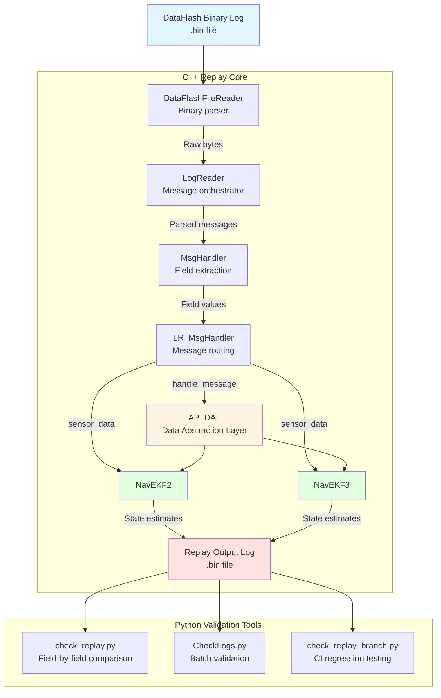
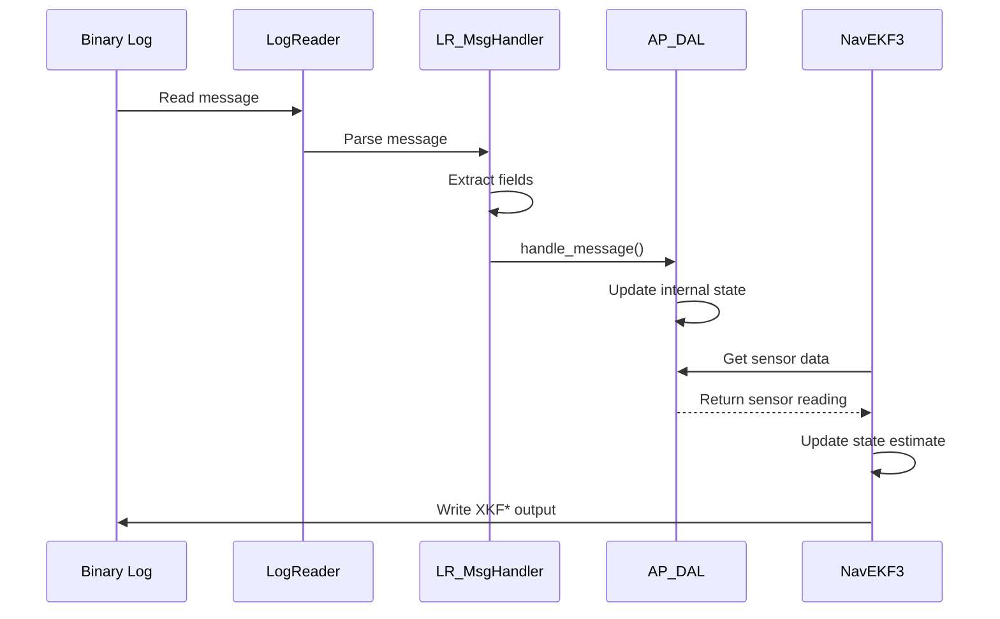

# ArduPilot Log Replay System

## Overview

The ArduPilot Replay system is an offline log analysis and algorithm development tool that reads DataFlash binary logs and reconstructs vehicle state by replaying sensor data through the navigation and estimation algorithms. Replay enables developers to test and debug EKF (Extended Kalman Filter), AHRS (Attitude and Heading Reference System), and other sensor fusion algorithms without requiring physical hardware or real-time simulation.

**Primary Use Cases:**
- **Algorithm Development**: Test modifications to EKF2/EKF3 state estimation algorithms using recorded flight data
- **Bug Diagnosis**: Debug sensor fusion issues by replaying problematic logs with enhanced logging
- **Parameter Tuning**: Validate parameter changes against historical flight data
- **Regression Testing**: Verify algorithm changes don't introduce errors by comparing replay outputs
- **Education**: Understand how sensor data flows through the navigation stack

**Key Advantages over SITL:**
- Uses real sensor data from actual flights (no physics simulation approximations)
- Faster than real-time execution (no timing constraints)
- Deterministic and repeatable results
- Minimal setup required (just log files and compiled Replay binary)
- Lower resource requirements (no physics simulation overhead)

## Architecture

The Replay system consists of C++ components for log parsing and message routing, plus Python validation utilities for automated testing and result comparison.



**Data Flow Explanation:**

1. **DataFlashFileReader** reads binary log file, parses 3-byte message headers, identifies LOG_FORMAT_MSG entries, and populates format definitions
2. **LogReader** orchestrates message-by-message replay, maintaining message parsers for all known formats
3. **MsgHandler** extracts individual field values from binary messages using format definitions
4. **LR_MsgHandler** routes messages to appropriate subsystems:
   - Sensor messages → AP_DAL (Data Abstraction Layer)
   - DAL messages → EKF adapters
   - Navigation messages → EKF2/EKF3 state estimators
5. **EKF algorithms** process replayed sensor data and generate state estimates
6. **Output logging** captures EKF outputs for comparison with original log
7. **Validation tools** compare replay outputs to original flight data to detect algorithm regressions

## Key Components

### DataFlashFileReader

**Purpose**: Platform-independent binary log file parser

**Source**: `Tools/Replay/DataFlashFileReader.{h,cpp}`

**Responsibilities**:
- Open and read DataFlash binary log files
- Parse 3-byte message headers (0xA3, 0x95 sync bytes + message type)
- Detect and parse LOG_FORMAT_MSG entries to populate format definitions
- Maintain statistics (bytes read, message counts, packet counts)
- Provide progress tracking via `get_percent_read()`

**Key Methods**:
- `open_log(const char *logfile)`: Open binary log file for reading
- `update()`: Read and process next message from log
- `handle_log_format_msg(const struct log_Format &f)`: Virtual callback for format definitions
- `handle_msg(const struct log_Format &f, uint8_t *msg)`: Virtual callback for log messages
- `get_percent_read()`: Returns percentage of log file processed (0.0 to 100.0)

**Lifecycle**: Constructed → open_log() → repeated update() calls → destructor closes file

### MsgHandler

**Purpose**: Extract typed field values from binary log messages

**Source**: `Tools/Replay/MsgHandler.{h,cpp}`

**Responsibilities**:
- Parse log_Format::format string into field definitions (label, type, offset)
- Map single-character type codes ('f'=float, 'I'=uint32, 'h'=int16, etc.) to byte sizes
- Provide type-safe field extraction from binary message buffers
- Build high-level structures (Location, Vector3f) from message fields

**Key Methods**:
- `field_value<R>(uint8_t *msg, const char *label, R &ret)`: Extract field by label
- `require_field_*()`: Extract field or abort if not found
- `location_from_msg()`: Build Location from lat/lon/alt fields
- `attitude_from_msg()`: Build attitude Vector3f from roll/pitch/yaw
- `ground_vel_from_msg()`: Build velocity Vector3f from speed/course/vz

**Field Type Mapping** (partial list):
- `'f'`: float (4 bytes)
- `'I'`: uint32_t (4 bytes)
- `'i'`: int32_t (4 bytes)
- `'H'`: uint16_t (2 bytes)
- `'h'`: int16_t (2 bytes)
- `'B'`: uint8_t (1 byte)
- `'b'`: int8_t (1 byte)
- `'d'`: double (8 bytes)
- `'n'`: char[4] (4-character string)
- `'N'`: char[16] (16-character string)

### LogReader

**Purpose**: High-level message orchestration and routing

**Source**: `Tools/Replay/LogReader.{h,cpp}`

**Responsibilities**:
- Inherit from DataFlashFileReader to parse log files
- Instantiate message-specific LR_MsgHandler subclasses for each format
- Route messages to appropriate handlers based on message type
- Write raw blocks to AP::logger() for output log generation
- Manage parameter loading and user parameter overrides
- Detect vehicle type from log metadata

**Key Methods**:
- `handle_log_format_msg(const struct log_Format &f)`: Create handler for new format
- `handle_msg(const struct log_Format &f, uint8_t *msg)`: Route message to handler
- `check_user_param(const char *name)`: Check if user overrode parameter
- `set_parameter(const char *name, float value)`: Set parameter for replay

**Message Handler Registration**: Maps format names to LR_MsgHandler subclasses via static registry

### LR_MsgHandler

**Purpose**: Message-specific parsing and routing to AP subsystems

**Source**: `Tools/Replay/LR_MsgHandler.{h,cpp}`

**Responsibilities**:
- Implement message-specific field extraction logic
- Route messages to AP_DAL via `AP::dal().handle_message()`
- Route messages to EKF adapters (NavEKF2/NavEKF3)
- Handle parameter messages (PARM, PARM2)
- Process sensor messages (IMU, GPS, BARO, MAG, etc.)
- Process navigation outputs (AHRS2, POS, EKF messages)

**Handler Hierarchy**:
- `LR_MsgHandler`: Base class with common extraction methods
- `LR_MsgHandler_*`: Subclasses for specific message types (e.g., LR_MsgHandler_GPS, LR_MsgHandler_IMU)
- `LR_MsgHandler_EKF*`: Specialized handlers for EKF output messages

**Message Categories**:
- **Sensor inputs**: IMU, GPS, BARO, MAG, ARSP (airspeed), RFND (rangefinder), OF (optical flow)
- **Parameters**: PARM, PARM2 (parameter values)
- **Vehicle state**: ATT (attitude), POS (position), RATE (angular rates)
- **EKF outputs**: XKF*/NKF* messages (EKF3/EKF2 state estimates)
- **Mission**: CMD (mission commands), CTRL (control modes)

### Replay and ReplayVehicle

**Purpose**: Main application and vehicle abstraction

**Source**: `Tools/Replay/Replay.{h,cpp}`

**Responsibilities**:
- Parse command-line arguments and configuration files
- Instantiate ReplayVehicle with EKF2/EKF3 instances
- Load parameter files and apply user overrides
- Initialize AP_Param system for parameter storage
- Write format descriptors (FMT/FMTU) to output log
- Run main replay loop via LogReader.update()
- Display progress indicator (if --progress specified)

**ReplayVehicle**: Minimal AP_Vehicle implementation providing:
- Parameter storage (AP_Param integration)
- EKF2 and EKF3 instances
- Fixed-wing parameters (AP_FixedWing aparm)
- Servo channel management (SRV_Channels)
- Stub scheduler (no background tasks during replay)

**Command-Line Options**:
- `--parm NAME=VALUE` or `-p NAME=VALUE`: Override specific parameter
- `--param-file FILE`: Load parameters from file
- `--force-ekf2`: Force EKF2 usage regardless of log content
- `--force-ekf3`: Force EKF3 usage regardless of log content
- `--progress`: Display progress bar during replay
- `--check-generate`: Generate reference "checked" log for validation
- `--check LOG`: Validate replay output against checked log

### Python Validation Tools

#### check_replay.py

**Purpose**: Field-by-field comparison of replay outputs

**Source**: `Tools/Replay/check_replay.py`

**Algorithm**:
1. Read replay output log using pymavlink
2. Store first 100 instances of each EKF message type as baseline (core < 100)
3. Compare subsequent instances (core >= 100) to baseline (core - 100)
4. Report mismatches in any field (excluding timestamp and configurable ignores)
5. Return success/failure for CI integration

**Key Function**:
```python
check_log(logfile, progress=print, ekf2_only=False, ekf3_only=False, 
          verbose=False, accuracy=0.0, ignores=set())
```

**Parameters**:
- `logfile`: Path to replay output .bin file
- `ekf2_only`: Only validate EKF2 messages (NKF*)
- `ekf3_only`: Only validate EKF3 messages (XKF*)
- `verbose`: Print per-message-type statistics
- `accuracy`: Allow percentage difference (e.g., 0.1 = 0.1% tolerance)
- `ignores`: Set of "MessageType.FieldName" strings to skip

**EKF Message Types**:
- **EKF2**: NKF1, NKF2, NKF3, NKF4, NKF5, NKF0, NKQ, NKY0, NKY1
- **EKF3**: XKF1, XKF2, XKF3, XKF4, XKF0, XKFS, XKQ, XKFD, XKV1, XKV2, XKY0, XKY1

**Usage Example**:
```bash
# Basic validation
./check_replay.py output.bin

# EKF3-only validation with 0.5% tolerance
./check_replay.py --ekf3-only --accuracy 0.5 output.bin

# Ignore specific noisy fields
./check_replay.py --ignore-field XKF1.VN --ignore-field XKF1.VE output.bin
```

#### CheckLogs.py

**Purpose**: Batch validation and HTML report generation

**Source**: `Tools/Replay/CheckLogs.py`

**Features**:
- Run Replay on multiple log files in a directory
- Generate reference "checked" logs (--create-checked-logs)
- Compare replay outputs to checked logs with configurable tolerances
- Generate HTML report with color-coded results
- Integrate git commit information into reports

**Key Functions**:
- `run_replay(logfile, opts)`: Execute Replay.elf with --check option
- `get_log_list(opts)`: Find all *-checked.bin files in --logdir
- `create_checked_logs(opts)`: Generate reference logs from originals
- `check_logs(opts)`: Batch validate and write replay_results.txt
- `create_html_results(opts)`: Parse results and generate HTML report

**Tolerances** (command-line configurable):
- `--tolerance-euler`: Euler angle tolerance in degrees (default: 3°)
- `--tolerance-pos`: Position tolerance in meters (default: 2m)
- `--tolerance-vel`: Velocity tolerance in m/s (default: 2 m/s)

**HTML Report Format**:
- Per-log results in table: filename, roll error, pitch error, yaw error, pos error, vel error
- Color coding: Green (pass), Red (exceeds tolerance or "FPE" = floating point exception)
- Git commit hash and description embedded in report

**Usage Example**:
```bash
# Create reference logs from testlogs/ directory
./CheckLogs.py --create-checked-logs --logdir testlogs/

# Validate all checked logs and generate HTML report
./CheckLogs.py --logdir testlogs/

# Custom tolerances
./CheckLogs.py --tolerance-euler 1.5 --tolerance-pos 1.0 --logdir testlogs/
```

#### check_replay_branch.py

**Purpose**: CI/CD integration for branch-level regression testing

**Source**: `Tools/Replay/check_replay_branch.py`

**Workflow**:
1. Use gitpython to find repository root
2. Verify git working tree is clean
3. Checkout master branch
4. Run autotest to generate fresh log files
5. Build Replay tool (./waf replay)
6. Execute Replay on discovered logs
7. Validate outputs using check_replay.check_log()
8. Report success/failure for CI pipeline

**Class**: `CheckReplayBranch` orchestrator with methods:
- `find_logs()`: Discover log files from autotest runs
- `build_replay()`: Compile Replay tool
- `run_replay_on_logs()`: Execute Replay on all discovered logs
- `validate_outputs()`: Compare outputs to baselines

**Usage**: Typically invoked from CI scripts, not interactive use

## Usage Patterns

### Basic Log Replay

Replay a single log file and examine EKF outputs:

```bash
# Build Replay tool (one-time setup)
cd Tools/Replay
make

# Replay a log file
./Replay.elf /path/to/flight.bin

# Output log created in current directory: flight.bin.replay.bin
```

The output log contains:
- Original sensor messages (IMU, GPS, BARO, etc.)
- Replayed EKF state estimates (XKF*/NKF* messages)
- Additional diagnostic logging enabled during replay

### Parameter Override

Test algorithm behavior with modified parameters without reflashing vehicle:

```bash
# Override single parameter
./Replay.elf --parm EK3_IMU_MASK=3 flight.bin

# Override multiple parameters
./Replay.elf -p EK3_IMU_MASK=3 -p EK3_MAG_CAL=5 flight.bin

# Load parameter file
./Replay.elf --param-file custom_params.parm flight.bin
```

**Parameter File Format** (same as Mission Planner .parm files):
```
EK3_IMU_MASK,3
EK3_MAG_CAL,5
EK3_FLOW_DELAY,10
```

### Force EKF Version

Override automatic EKF selection from log:

```bash
# Force EKF3 usage
./Replay.elf --force-ekf3 flight.bin

# Force EKF2 usage (legacy logs)
./Replay.elf --force-ekf2 flight.bin
```

### Progress Tracking

Display progress for large log files:

```bash
# Show percentage and message counts
./Replay.elf --progress flight.bin

# Output format:
# Processing: 45% | 125000/280000 messages | 1200 msg/sec
```

### Generate Reference Validation Log

Create baseline for regression testing:

```bash
# Generate checked log
./Replay.elf --check-generate flight.bin

# Creates: flight-checked.bin
```

### Validate Replay Output

Compare replay output to reference:

```bash
# Validate with default tolerances
./Replay.elf --check flight-checked.bin

# Exit code: 0 = pass, non-zero = fail
```

### Batch Validation

Process multiple logs with Python tools:

```bash
# Validate directory of logs
cd Tools/Replay
./check_replay.py /path/to/logs/*.bin

# Generate HTML report
./CheckLogs.py --logdir /path/to/logs/
# Creates: replay_results.html
```

### EKF-Specific Validation

Focus validation on specific EKF version:

```bash
# Only validate EKF3 outputs
./check_replay.py --ekf3-only flight.bin.replay.bin

# Only validate EKF2 outputs
./check_replay.py --ekf2-only flight.bin.replay.bin
```

## Build Process

### Using Makefile (Recommended for Development)

The Makefile provides a simple wrapper around waf:

```bash
cd Tools/Replay
make

# Creates: Replay.elf in Tools/Replay/
```

**Makefile Actions**:
1. Configure waf: `../../modules/waf/waf-light configure --board sitl --debug --disable-scripting`
2. Build Replay: `../../modules/waf/waf-light build --target tool/Replay`
3. Copy binary: `cp ../../build/sitl/tool/Replay Replay.elf`

**Configuration Options**:
- `--board sitl`: Build for Software-In-The-Loop platform (x86/x86_64)
- `--debug`: Include debug symbols for gdb
- `--disable-scripting`: Reduce binary size (scripting not needed for replay)

### Using waf Directly

For advanced build configurations:

```bash
# From repository root
./waf configure --board sitl
./waf replay

# Binary location: build/sitl/tool/Replay
```

### Build Dependencies

**Required**:
- GCC/G++ compiler (C++11 or later)
- Python 3 (for waf build system)
- ArduPilot libraries (automatically included via waf)

**Optional** (for validation tools):
- pymavlink: `pip3 install pymavlink`
- gitpython: `pip3 install gitpython`
- gnuplot: `sudo apt-get install gnuplot` (for plotit.sh)

### Clean Build

Remove build artifacts and rebuild:

```bash
cd Tools/Replay
make clean
make

# Or with waf:
cd ../../
./waf clean
./waf replay
```

## Algorithm Development Workflow

### Iterative EKF Development

Replay enables rapid iteration on EKF algorithms without hardware:

**Workflow**:

1. **Collect Baseline Log**
   ```bash
   # Fly vehicle and download log
   # Copy to development machine
   cp /path/to/original.bin ~/ardupilot/logs/baseline.bin
   ```

2. **Generate Reference Output**
   ```bash
   cd ~/ardupilot/Tools/Replay
   make
   ./Replay.elf --check-generate ~/logs/baseline.bin
   # Creates: baseline-checked.bin
   ```

3. **Modify EKF Algorithm**
   ```bash
   # Edit EKF source code
   vim ../../libraries/AP_NavEKF3/AP_NavEKF3_Predict.cpp
   
   # Example: Modify process noise tuning
   # Change line 145: processNoise[i] *= 1.5f; // Increase gyro noise
   ```

4. **Rebuild and Test**
   ```bash
   # Rebuild Replay with changes
   make
   
   # Replay with modified algorithm
   ./Replay.elf ~/logs/baseline.bin
   # Creates: baseline.bin.replay.bin
   ```

5. **Validate Changes**
   ```bash
   # Compare to reference
   ./check_replay.py --accuracy 1.0 baseline.bin.replay.bin
   
   # Expected output:
   # Processing log baseline.bin.replay.bin
   # Mismatch in field XKF1.VN: 1.234 1.245
   # Processed 5000/5000 messages, 5 errors
   ```

6. **Analyze Differences**
   ```bash
   # Extract specific fields for plotting
   # Use MAVExplorer or custom scripts
   mavlogdump.py --types XKF1 --format csv baseline-checked.bin > reference.csv
   mavlogdump.py --types XKF1 --format csv baseline.bin.replay.bin > modified.csv
   
   # Plot in gnuplot, MATLAB, Python, etc.
   ```

7. **Iterate**
   - Refine algorithm based on analysis
   - Repeat steps 3-6 until desired behavior achieved
   - Test on multiple logs covering different flight scenarios

**Advantages**:
- Fast iteration (seconds to minutes vs. hours of flight testing)
- Deterministic results (same input always produces same output)
- No hardware risk (no vehicles crashed during development)
- Easy comparison (automated validation detects regressions)

### Parameter Tuning Workflow

Test parameter changes without reflashing:

```bash
# Baseline replay
./Replay.elf baseline.bin

# Test parameter change
./Replay.elf --parm EK3_MAG_CAL=5 baseline.bin

# Compare outputs
./check_replay.py --accuracy 2.0 baseline.bin.replay.bin

# If better, update parameter file for flight testing
echo "EK3_MAG_CAL,5" >> custom_params.parm
```

### Multi-Log Regression Testing

Validate algorithm changes across diverse scenarios:

```bash
# Collect representative logs
mkdir -p testlogs
cp hover_flight.bin testlogs/
cp aggressive_acro.bin testlogs/
cp long_cruise.bin testlogs/
cp windy_conditions.bin testlogs/

# Generate reference outputs (before algorithm changes)
cd Tools/Replay
./CheckLogs.py --create-checked-logs --logdir ../../testlogs/

# Make algorithm changes
# vim ../../libraries/AP_NavEKF3/...

# Rebuild
make

# Run regression tests
./CheckLogs.py --logdir ../../testlogs/

# Review HTML report
firefox replay_results.html
```

### Debugging EKF Issues

Replay with enhanced logging to diagnose problems:

```bash
# Replay with verbose EKF logging
./Replay.elf problematic_flight.bin

# Output log has additional EKF diagnostic messages
# Analyze with MAVProxy or MAVExplorer
mavproxy.py --master problematic_flight.bin.replay.bin

# In MAVProxy console:
MAV> ekf3 show_variances
MAV> ekf3 show_innovations
MAV> graph XKF1.VN XKF1.VE  # Plot velocity innovations
```

**Common Debug Patterns**:
- Innovation spikes → Sensor glitch or model mismatch
- Covariance growth → Insufficient sensor data or poor excitation
- State divergence → Incorrect process noise or measurement noise
- Lane switching → Conflicting sensor inputs (check IMU/compass/GPS)

## Replay vs SITL Comparison

### When to Use Replay

**Advantages**:
- **Real sensor data**: Actual IMU noise, GPS multipath, compass interference
- **Fast execution**: No real-time constraints, runs as fast as CPU allows
- **Deterministic**: Same log always produces identical output (for debugging)
- **Minimal setup**: Just compiled binary and log file
- **Resource efficient**: No physics simulation overhead

**Best For**:
- Debugging specific flights where issues occurred
- EKF algorithm development and tuning
- Regression testing with real-world data
- Analyzing sensor calibration issues
- Understanding how algorithms responded to actual conditions

**Limitations**:
- Cannot test control outputs (motor commands not replayed)
- Cannot simulate "what if" scenarios (log is fixed)
- Limited to sensors present in original log
- No vehicle dynamics feedback loop

### When to Use SITL

**Advantages**:
- **Full vehicle simulation**: Control loops tested end-to-end
- **Scenario flexibility**: Test any flight profile, environment, failure mode
- **Interactive**: Modify flight in real-time via RC or GCS
- **Sensor simulation**: Add/remove sensors, inject faults
- **Hardware-in-loop ready**: Connect physical autopilots

**Best For**:
- Testing new flight modes and control logic
- Validating mission planning and autonomous behaviors
- Failure mode testing (GPS loss, compass failure, etc.)
- Pre-flight verification of parameter changes
- Developer learning and experimentation

**Limitations**:
- Sensor models approximate reality (no real-world noise characteristics)
- Physics simulation has fidelity limits
- Slower than real-time for complex scenarios
- Requires more setup (physics engine, vehicle model)

### Complementary Usage

**Recommended Workflow**:
1. **SITL**: Develop and test new features in simulation
2. **Flight Test**: Collect real-world data on actual hardware
3. **Replay**: Debug issues found in flight using real sensor data
4. **SITL**: Verify fixes in simulation before next flight
5. **Flight Test**: Confirm fixes on hardware

**Example Scenario - EKF Tuning**:
- Use **SITL** to test EKF parameter ranges and verify stability
- Fly test vehicle and download logs
- Use **Replay** to fine-tune parameters with real sensor characteristics
- Validate in **SITL** with tuned parameters
- Flight test final configuration

## DAL (Data Abstraction Layer) Integration

### DAL Purpose

The Data Abstraction Layer (`AP_DAL`) provides a standardized interface between log messages and navigation algorithms, enabling:
- **Message routing**: Consistent message handling between live flight and replay
- **State synchronization**: Ensures EKF sees identical data during replay
- **Sensor abstraction**: Unified interface for IMU, GPS, compass, etc.

### DAL Message Flow in Replay



### DAL Message Types

**Sensor Messages Handled**:
- `IMU`: Inertial measurement unit (accel, gyro)
- `GPS`: Position, velocity, satellites
- `BARO`: Barometric pressure, altitude
- `MAG`: Magnetometer readings
- `ARSP`: Airspeed sensor
- `RFND`: Rangefinder distance
- `OF`: Optical flow velocity
- `VIBE`: Vibration metrics

**Vehicle State Messages**:
- `ATT`: Attitude (roll, pitch, yaw)
- `POS`: Position (lat, lon, alt)
- `RATE`: Angular rates (gyro-derived)

**Configuration Messages**:
- `PARM`: Parameter values
- `MSG`: Text messages and events
- `EV`: Timing events

### DAL API During Replay

EKF algorithms access sensor data through DAL:

```cpp
// In NavEKF3 during replay
const auto &dal = AP::dal();

// Get IMU data
const auto &imu = dal.ins();
Vector3f accel = imu.get_accel(imu_index);
Vector3f gyro = imu.get_gyro(imu_index);

// Get GPS data
const auto &gps = dal.gps();
if (gps.status(gps_index) >= AP_GPS::GPS_OK_FIX_3D) {
    Location loc = gps.location(gps_index);
    Vector3f vel = gps.velocity(gps_index);
}

// Get barometer data
const auto &baro = dal.baro();
float pressure = baro.get_pressure(baro_index);
float altitude = baro.get_altitude(baro_index);
```

### Logging Differences: Live vs Replay

**Live Flight**:
- Sensors → HAL drivers → AP libraries → DAL → EKF → Logger
- Real-time execution with timing constraints
- Logger captures sensor inputs and EKF outputs

**Replay**:
- Binary log → LogReader → DAL → EKF → Logger (replay output)
- No timing constraints (runs as fast as possible)
- DAL populated from log messages, not live sensors
- EKF operates identically to live flight (same code paths)

**Key Insight**: DAL abstraction allows EKF code to be identical in both live flight and replay, ensuring validation accuracy.

## Common Log Analysis Workflows

### Workflow 1: Investigate EKF Innovation Spikes

**Scenario**: Large innovation spike during flight caused EKF failsafe

```bash
# Step 1: Replay with full logging
cd Tools/Replay
./Replay.elf --progress flight_with_spike.bin

# Step 2: Load in MAVExplorer for analysis
mavexplorer.py flight_with_spike.bin.replay.bin

# Step 3: In MAVExplorer, plot innovations
graph XKF4.SV XKF4.SP XKF4.SH XKF4.SMX XKF4.SMY XKF4.SMZ

# Step 4: Identify time of spike, correlate with sensor data
graph GPS.NSats BARO.Alt MAG.MagX MAG.MagY MAG.MagZ

# Step 5: Replay with parameter adjustments
./Replay.elf --parm EK3_MAG_CAL=0 flight_with_spike.bin  # Disable compass

# Step 6: Compare replay outputs
./check_replay.py --accuracy 1.0 flight_with_spike.bin.replay.bin
```

### Workflow 2: Validate EKF3 Algorithm Change

**Scenario**: Modified EKF3 covariance prediction, need to verify on test flights

```bash
# Collect diverse test logs
logs/
  hover.bin
  forward_flight.bin
  aggressive_maneuver.bin
  high_vibration.bin

# Generate pre-modification references
cd Tools/Replay
./CheckLogs.py --create-checked-logs --logdir ../../logs/

# Make EKF3 code changes
vim ../../libraries/AP_NavEKF3/AP_NavEKF3_Predict.cpp

# Rebuild Replay
make

# Run batch validation
./CheckLogs.py --tolerance-euler 2.0 --tolerance-pos 1.5 --logdir ../../logs/

# Review HTML report for regressions
firefox replay_results.html

# If any failures, investigate specific log
./Replay.elf ../../logs/high_vibration.bin
./check_replay.py --verbose --ekf3-only high_vibration.bin.replay.bin
```

### Workflow 3: Parameter Optimization for Specific Vehicle

**Scenario**: Tuning EKF3 for large octocopter with heavy vibration

```bash
# Baseline replay
./Replay.elf octo_flight.bin
mv octo_flight.bin.replay.bin octo_baseline.bin

# Test parameter variations
for imu_mask in 1 3 7; do
  for gyr_noise in 0.015 0.025 0.035; do
    echo "Testing IMU_MASK=$imu_mask GYR_NOISE=$gyr_noise"
    ./Replay.elf --parm EK3_IMU_MASK=$imu_mask \
                 --parm EK3_GYRO_P_NSE=$gyr_noise \
                 octo_flight.bin
    mv octo_flight.bin.replay.bin octo_${imu_mask}_${gyr_noise}.bin
  done
done

# Analyze all outputs
for log in octo_*.bin; do
  echo "Checking $log"
  ./check_replay.py --accuracy 5.0 $log
done

# Select best configuration based on innovation RMS
# (manual analysis or custom script)
```

### Workflow 4: Diagnose GPS Glitch Impact

**Scenario**: GPS reported bad HDOP mid-flight, understand EKF response

```bash
# Replay with detailed GPS logging
./Replay.elf gps_glitch.bin

# Load in MAVProxy for interactive analysis
mavproxy.py --master gps_glitch.bin.replay.bin

# In MAVProxy:
MAV> graph GPS.NSats GPS.HDop GPS.Spd
MAV> graph XKF1.VN XKF1.VE  # EKF velocity estimates
MAV> graph XKF4.SV          # Velocity innovation variance

# Test with GPS measurement noise adjustment
./Replay.elf --parm EK3_POSNE_M_NSE=5.0 gps_glitch.bin

# Compare EKF behavior
./check_replay.py --ignore-field XKF1.VN --ignore-field XKF1.VE \
                  gps_glitch.bin.replay.bin
```

### Workflow 5: Understand Compass Calibration Issue

**Scenario**: Compass interference suspected, analyze calibration quality

```bash
# Replay with default calibration
./Replay.elf --progress compass_issue.bin

# Test without compass
./Replay.elf --parm EK3_MAG_CAL=0 compass_issue.bin

# Compare heading estimates
mavlogdump.py --types XKF1 --format csv compass_issue.bin.replay.bin > with_mag.csv
./Replay.elf --parm EK3_MAG_CAL=0 compass_issue.bin
mavlogdump.py --types XKF1 --format csv compass_issue.bin.replay.bin > without_mag.csv

# Analyze heading difference (external tool)
python3 analyze_heading_diff.py with_mag.csv without_mag.csv

# If compass bad, validate EKF using only GPS/accel
./check_replay.py --accuracy 3.0 --ignore-field XKF1.YAW \
                  compass_issue.bin.replay.bin
```

## Helper Scripts and Utilities

### plotit.sh

**Purpose**: Quick visualization of Replay output data files

**Source**: `Tools/Replay/plotit.sh`

**Usage**:
```bash
# Replay outputs plot.dat or plot2.dat (if present in code)
./Replay.elf flight.bin

# Visualize with gnuplot
./plotit.sh

# Generates: _plot.gnu gnuplot script and displays plot
```

**Customization**: Edit Replay.cpp to output custom data to plot.dat:
```cpp
// In Replay.cpp, add to loop():
FILE *plot = fopen("plot.dat", "a");
fprintf(plot, "%f %f %f\n", 
        AP::dal().ins().get_accel(0).x,
        AP::dal().ins().get_accel(0).y,
        AP::dal().ins().get_accel(0).z);
fclose(plot);
```

### MAVLogDump Integration

Extract specific message types for external analysis:

```bash
# Install pymavlink
pip3 install pymavlink

# Extract EKF3 messages to CSV
mavlogdump.py --types XKF1,XKF2,XKF3,XKF4 --format csv flight.bin.replay.bin > ekf_data.csv

# Extract GPS data
mavlogdump.py --types GPS --format csv flight.bin.replay.bin > gps_data.csv

# Parse in Python/MATLAB/R for custom analysis
```

### Custom Validation Scripts

**Example**: Check if EKF lane switched during replay

```python
#!/usr/bin/env python3
from pymavlink import mavutil

def check_lane_switch(logfile):
    mlog = mavutil.mavlink_connection(logfile)
    prev_lane = None
    
    while True:
        m = mlog.recv_match(type='XKFS')
        if m is None:
            break
        if prev_lane is not None and m.Primary != prev_lane:
            print(f"Lane switch at {m.TimeUS}: {prev_lane} -> {m.Primary}")
        prev_lane = m.Primary
    
if __name__ == '__main__':
    import sys
    check_lane_switch(sys.argv[1])
```

**Usage**:
```bash
python3 check_lane_switch.py flight.bin.replay.bin
```

### Batch Processing Script

**Example**: Replay all logs in directory with consistent parameters

```bash
#!/bin/bash
LOGDIR="$1"
PARAMS="--parm EK3_IMU_MASK=3 --parm EK3_MAG_CAL=5"

for log in "$LOGDIR"/*.bin; do
    echo "Processing $log"
    ./Replay.elf $PARAMS "$log"
    ./check_replay.py --accuracy 1.0 "${log}.replay.bin"
done
```

## Troubleshooting

### Common Issues and Solutions

#### Issue: Replay.elf not found after make

**Symptoms**: `bash: ./Replay.elf: No such file or directory`

**Causes**:
- Build failed but make didn't report error
- Wrong working directory

**Solutions**:
```bash
# Check build log
cd Tools/Replay
make 2>&1 | tee build.log

# Verify binary exists
ls -lh Replay.elf

# If missing, try waf directly
cd ../../
./waf configure --board sitl
./waf replay
cp build/sitl/tool/Replay Tools/Replay/Replay.elf
```

#### Issue: "Parameter X not found" during replay

**Symptoms**: Replay exits with parameter error

**Causes**:
- Log from different vehicle type than Replay configured for
- Parameter name typo in --parm argument
- Parameter removed in current codebase version

**Solutions**:
```bash
# Check parameter exists in log
mavlogdump.py --types PARM flight.bin | grep PARAM_NAME

# Use correct parameter name (case-sensitive)
./Replay.elf --parm EK3_IMU_MASK=3 flight.bin  # Correct
./Replay.elf --parm ek3_imu_mask=3 flight.bin  # Wrong - case matters

# Skip parameter errors (dangerous - only for debugging)
# Requires code modification in Replay.cpp
```

#### Issue: Replay output differs from original flight

**Symptoms**: check_replay.py reports many mismatches

**Expected Behavior**: Small differences are normal due to:
- Floating point rounding differences
- Compiler optimization differences
- Log timing resolution (messages rounded to nearest logged timestamp)

**Acceptable Tolerances**:
- Euler angles: ±3° typical, ±1° excellent
- Position: ±2m typical, ±0.5m excellent
- Velocity: ±2 m/s typical, ±0.5 m/s excellent

**Investigate if**:
- Differences grow over time (integration error)
- Sudden jumps not in original log (state reset)
- Entire message types missing (handler not implemented)

**Solutions**:
```bash
# Use accuracy tolerance
./check_replay.py --accuracy 1.0 flight.bin.replay.bin  # 1% tolerance

# Ignore known noisy fields
./check_replay.py --ignore-field XKF1.IVT flight.bin.replay.bin

# Verbose output to identify problematic fields
./check_replay.py --verbose flight.bin.replay.bin
```

#### Issue: "Floating Point Exception" (FPE) in output

**Symptoms**: CheckLogs.py HTML report shows "FPE" in results

**Causes**:
- Division by zero in EKF math
- Invalid sqrt() argument (negative number)
- NaN propagation from bad sensor data

**Solutions**:
```bash
# Run Replay under gdb to catch FPE
gdb --args ./Replay.elf problematic.bin
(gdb) catch signal SIGFPE
(gdb) run
# When it crashes:
(gdb) backtrace
(gdb) print variable_name

# Common fixes:
# - Add zero-check before division
# - Clamp sensor inputs to valid ranges
# - Initialize variables to prevent NaN
```

#### Issue: Replay runs very slowly

**Symptoms**: Taking hours to replay a 10-minute log

**Causes**:
- Debug symbols enabled (expected)
- Large log file (millions of messages)
- printf/logging overhead

**Solutions**:
```bash
# Progress monitoring (minimal overhead)
./Replay.elf --progress flight.bin

# Disable debug build (faster but harder to debug)
cd ../../
./waf configure --board sitl  # Without --debug
./waf replay

# Profile to find bottleneck
perf record ./Replay.elf flight.bin
perf report
```

#### Issue: Missing messages in replay output

**Symptoms**: Output log smaller than expected, message types missing

**Causes**:
- Message handler not implemented for that message type
- Message filtered out intentionally
- Format descriptor missing from log

**Solutions**:
```bash
# List message types in original log
mavlogdump.py --types FMT flight.bin

# List message types in replay output
mavlogdump.py --types FMT flight.bin.replay.bin

# Compare to identify missing types
diff <(mavlogdump.py --types FMT flight.bin | cut -d, -f1) \
     <(mavlogdump.py --types FMT flight.bin.replay.bin | cut -d, -f1)

# To add handler: Edit LR_MsgHandler.cpp
# See existing handlers for examples
```

#### Issue: Cannot load replay output in MAVProxy/Mission Planner

**Symptoms**: "Invalid log format" error

**Causes**:
- Replay crashed mid-execution (incomplete log)
- Filesystem corruption
- Wrong file specified

**Solutions**:
```bash
# Verify log file integrity
file flight.bin.replay.bin
# Should report: "data" or "binary"

# Check file size
ls -lh flight.bin.replay.bin
# Should be > 0 bytes

# Verify with pymavlink
python3 -c "from pymavlink import mavutil; \
            mlog = mavutil.mavlink_connection('flight.bin.replay.bin'); \
            print('Valid log' if mlog else 'Invalid')"

# If corrupt, re-run Replay
rm flight.bin.replay.bin
./Replay.elf flight.bin
```

### Getting Help

**Resources**:
- ArduPilot Forum: https://discuss.ardupilot.org/c/development
- Discord: Development channels
- GitHub Issues: https://github.com/ArduPilot/ardupilot/issues

**When Reporting Issues**:
- Include ArduPilot version/commit: `git log -1 --oneline`
- Provide log file or describe log contents
- Specify Replay command-line used
- Include error messages or unexpected output
- Note OS and compiler version

## Source Code Reference

### Core Components

| Component | Source Files | Purpose |
|-----------|--------------|---------|
| Main Application | `Replay.{h,cpp}` | Command-line parsing, initialization, main loop |
| Vehicle Abstraction | `Replay.h` (ReplayVehicle) | Minimal AP_Vehicle for parameter and EKF integration |
| Log Parser | `DataFlashFileReader.{h,cpp}` | Binary log reading and format parsing |
| Message Orchestrator | `LogReader.{h,cpp}` | Message routing and handler management |
| Field Extractor | `MsgHandler.{h,cpp}` | Type-safe field extraction from binary messages |
| Message Handlers | `LR_MsgHandler.{h,cpp}` | Message-specific parsing and DAL routing |
| Parameters | `Parameters.h` | AP_Param variable declarations |
| Vehicle Type | `VehicleType.h` | Vehicle type enumeration |

### Validation Tools

| Tool | Source File | Purpose |
|------|-------------|---------|
| Field Comparison | `check_replay.py` | Validate replay output field-by-field |
| Batch Validation | `CheckLogs.py` | Process multiple logs and generate HTML report |
| CI Integration | `check_replay_branch.py` | Automated regression testing for CI/CD |

### Build System

| Component | Source File | Purpose |
|-----------|-------------|---------|
| Makefile Wrapper | `Makefile` | Simplified build interface |
| WAF Integration | `../../wscript` (references) | Full ArduPilot build configuration |

### Helper Scripts

| Script | Source File | Purpose |
|--------|-------------|---------|
| Plotting | `plotit.sh` | Gnuplot visualization of plot.dat |
| Examples | `examples/rewrite-RFND-values-to-floats.py` | Log message conversion utilities |

### ArduPilot Library Dependencies

Replay links against these ArduPilot libraries:

| Library | Purpose in Replay |
|---------|-------------------|
| AP_HAL | Hardware abstraction (SITL implementation) |
| AP_Logger | Log format definitions and message structures |
| AP_Param | Parameter storage and retrieval |
| AP_DAL | Data abstraction layer for EKF integration |
| AP_NavEKF2 | EKF2 state estimation algorithm |
| AP_NavEKF3 | EKF3 state estimation algorithm |
| AP_AHRS | Attitude and heading reference system |
| AP_InertialSensor | IMU data structures and processing |
| AP_GPS | GPS data structures and processing |
| AP_Baro | Barometer data structures |
| AP_Compass | Magnetometer data structures |
| AP_Math | Vector, matrix, and quaternion math |

**Note**: Replay does not include control, motor, or output libraries since it only processes sensor inputs and navigation algorithms.

## Related Documentation

- **AP_Logger**: `libraries/AP_Logger/README.md` - Binary logging system
- **AP_NavEKF3**: `libraries/AP_NavEKF3/README.md` - EKF3 algorithm details
- **AP_DAL**: `libraries/AP_DAL/README.md` - Data abstraction layer architecture
- **Autotest**: `Tools/autotest/README.md` - SITL testing framework
- **Parameter System**: `libraries/AP_Param/README.md` - Parameter storage and management

## Further Reading

**External Resources**:
- ArduPilot Dev Wiki: https://ardupilot.org/dev/docs/using-replay.html
- MAVLink Protocol: https://mavlink.io/
- EKF Theory: https://ardupilot.org/dev/docs/extended-kalman-filter.html
- Log Analysis Guide: https://ardupilot.org/copter/docs/common-logs.html

**Academic References**:
- Kalman, R.E. (1960). "A New Approach to Linear Filtering and Prediction Problems"
- Pratt, P. (2014). "NavEKF: Precision Navigation Using a Multi-State Extended Kalman Filter"

---

**Last Updated**: 2025-01-01  
**Maintainer**: ArduPilot Development Team  
**License**: GPLv3+
