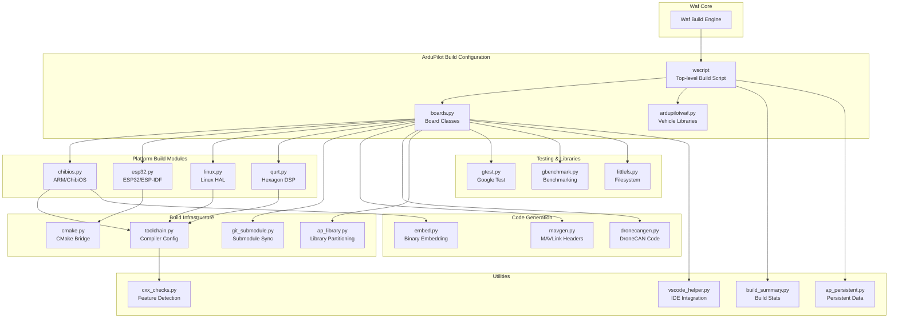
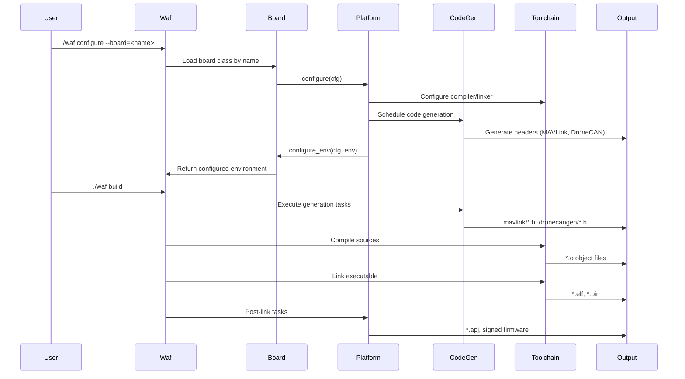
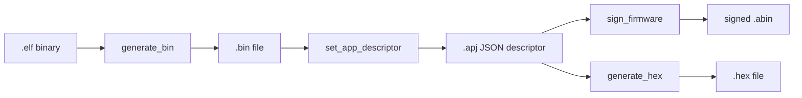
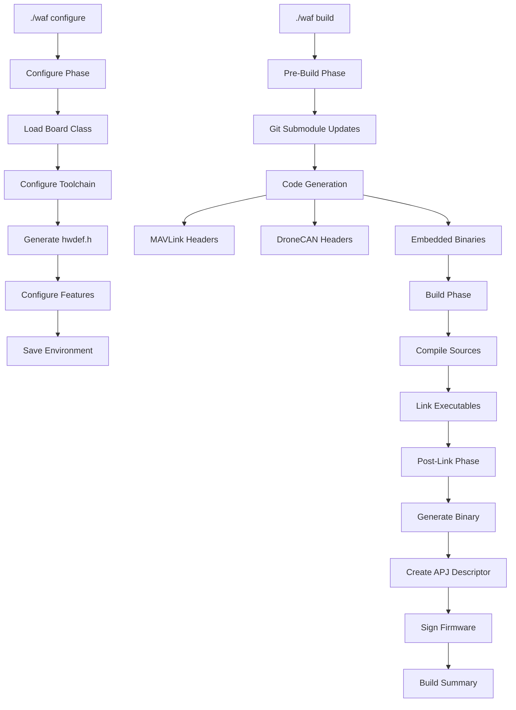
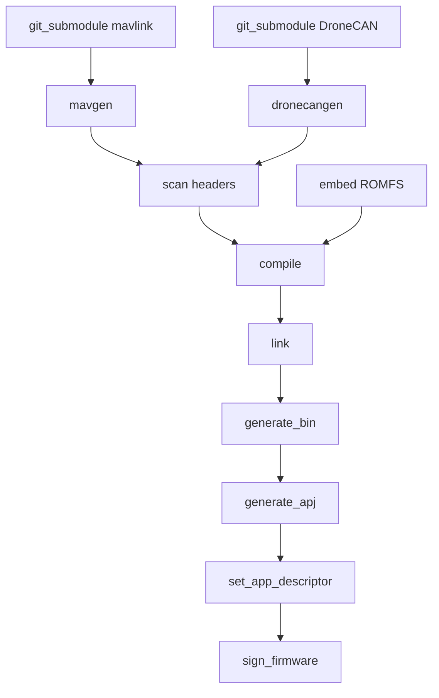

# ArduPilot Waf Build System Internals

## Overview

The **Tools/ardupilotwaf/** directory contains ArduPilot's custom Waf toolset—a collection of Python modules that extend the Waf build system with ArduPilot-specific semantics. These modules implement platform-specific build logic, code generation tasks, toolchain configuration, board definitions, and build customization hooks that transform Waf's general-purpose build capabilities into a comprehensive firmware build infrastructure for the ArduPilot autopilot.

Waf (https://waf.io) is a Python-based meta-build system similar to CMake or autotools. ArduPilot uses Waf as its foundation and layers custom Python modules (this directory) to handle the complexity of building firmware for multiple vehicle types (Copter, Plane, Rover, Sub, etc.) across diverse hardware platforms (ARM Cortex-M, Linux, ESP32, Qualcomm Hexagon DSP) with different toolchains, RTOSes (ChibiOS, Linux kernel, ESP-IDF), and peripheral configurations.

**Key responsibilities of the ardupilotwaf modules**:
- **Board definition and configuration**: Platform-specific compiler flags, feature selection, hardware definitions
- **Vehicle library management**: Dynamic library lists based on vehicle type and feature enablement
- **Code generation orchestration**: MAVLink protocol headers, DroneCAN/UAVCAN interfaces, embedded binaries
- **Multi-platform toolchain support**: ARM bare-metal, Linux native/cross, ESP32 Xtensa, QURT DSP
- **Build task choreography**: Configure → generate → compile → link → post-process chains with dependency ordering
- **RTOS integration**: ChibiOS build system, ESP-IDF CMake bridge, Linux HAL generation
- **Firmware packaging**: Binary generation, JSON descriptors (.apj), signing, bootloader integration
- **Development tool integration**: Google Test, Google Benchmark, VS Code helpers, build summaries

Source: Tools/ardupilotwaf/*.py

## Architecture



### Build System Data Flow



## Key Components

### Core Build Orchestration

#### ardupilotwaf.py
**Purpose**: Defines vehicle-specific library lists and build configuration decorators

**Responsibilities**:
- Maintains COMMON_VEHICLE_DEPENDENT_LIBRARIES list (~100 libraries used across vehicles)
- Defines vehicle-specific library lists (COPTER_LIBRARIES, PLANE_LIBRARIES, etc.)
- Provides build helper functions and decorators
- Manages SOURCE_EXTS patterns for source file discovery

**Key Data Structures**:
```python
# Common libraries used across all vehicles with vehicle-specific features
COMMON_VEHICLE_DEPENDENT_LIBRARIES = [
    'AP_AHRS', 'AP_Airspeed', 'AP_Baro', 'AP_BattMonitor',
    'AP_Camera', 'AP_Compass', 'AP_GPS', 'AP_InertialSensor',
    'AP_Mission', 'AP_NavEKF2', 'AP_NavEKF3', 'GCS_MAVLink',
    # ... ~100 libraries total
]

# Vehicle-specific additional libraries
COPTER_LIBRARIES = [
    'AC_AttitudeControl', 'AC_PosControl', 'AC_WPNav',
    'AP_Motors', # ... multicopter-specific
]
```

Source: Tools/ardupilotwaf/ardupilotwaf.py:22-100

#### boards.py
**Purpose**: Implements the board class system with metaclass registration for platform abstraction

**Responsibilities**:
- Defines Board base class with configuration hooks
- Implements BoardMeta metaclass for automatic board registration
- Manages board-specific environment configuration
- Coordinates feature enablement (scripting, DDS, OpenDroneID, CAN)
- Integrates hwdef system for hardware definitions

**Board Registration Pattern**:
```python
# Metaclass automatically registers board classes
class BoardMeta(type):
    def __init__(cls, name, bases, dct):
        super(BoardMeta, cls).__init__(name, bases, dct)
        if cls.abstract:
            return
        board_name = getattr(cls, 'name', name)
        _board_classes[board_name] = cls  # Auto-registration

# Base board class with configuration contract
class Board:
    abstract = True
    
    def configure(self, cfg):
        """Configure phase: setup toolchain, environment, features"""
        cfg.env.TOOLCHAIN = cfg.options.toolchain or self.toolchain
        self.configure_env(cfg, env)
    
    def configure_env(self, cfg, env):
        """Platform-specific environment setup - override in subclasses"""
        pass
    
    def build(self, bld):
        """Build phase: register tasks, libraries, post-link hooks"""
        pass
```

**Feature Configuration Example**:
```python
# Boards can enable features based on hwdef or command-line options
if cfg.options.enable_scripting:
    env.DEFINES.update(AP_SCRIPTING_ENABLED=1)

# DDS support detection from hwdef.h
with open(env.BUILDROOT + "/hwdef.h", 'r') as file:
    if "#define AP_DDS_ENABLED 1" in file.read():
        cfg.env.OPTIONS['enable_DDS'] = True
```

Source: Tools/ardupilotwaf/boards.py:24-150

#### ap_library.py
**Purpose**: Partitions library sources into common vs vehicle-dependent objects to optimize incremental builds

**Responsibilities**:
- Scans source files for vehicle-specific macros (APM_BUILD_TYPE, APM_BUILD_DIRECTORY)
- Separates compilation: common objects shared across vehicles, vehicle-dependent recompiled per vehicle
- Enforces header hygiene: prevents vehicle-dependent macros in common library headers
- Provides ap_stlib() and ap_library() waf helpers

**Vehicle-Dependency Detection**:
```python
def _depends_on_vehicle(bld, source_node):
    """Scan source for vehicle-specific macros"""
    content = source_node.read()
    # Strip comments to avoid false positives
    content = strip_comments(content)
    
    # Check for vehicle dependency macros
    macros = [
        'APM_BUILD_TYPE', 'APM_BUILD_DIRECTORY',
        'APM_BUILD_COPTER', 'APM_BUILD_PLANE', # etc.
    ]
    for macro in macros:
        if re.search(r'\b' + macro + r'\b', content):
            return True
    return False
```

**Build Optimization**:
- Common objects: Compiled once, linked into all vehicles
- Vehicle-dependent objects: Recompiled for each vehicle type
- Result: Faster incremental builds when modifying vehicle-specific code

**Header Validation**:
```python
@feature('ap_library_check_headers')
def ap_library_check_headers(self):
    """Enforce that common library headers don't use vehicle macros"""
    # Validates header files don't leak vehicle-specific behavior
    # Ensures ABI compatibility across vehicles
```

Source: Tools/ardupilotwaf/ap_library.py

### Platform-Specific Build Modules

#### chibios.py
**Purpose**: Complete ChibiOS RTOS integration for ARM Cortex-M microcontrollers

**Responsibilities**:
- Executes chibios_hwdef.py to generate hardware definition headers and linker scripts from .hwdef files
- Configures ARM bare-metal toolchain (arm-none-eabi-gcc)
- Injects ChibiOS include paths dynamically from build artifacts
- Implements firmware post-processing pipeline: .elf → .bin, .hex, .apj descriptor, signing
- Manages bootloader integration and flash layout
- Handles firmware upload via uploader.py with WSL2 support

**Hardware Definition Generation**:
```python
def configure(cfg):
    """Generate hwdef.h and linker scripts from board .hwdef files"""
    # Find hwdef files: hwdef.dat + optional hwdef-bl.dat (bootloader)
    hwdef_script = 'libraries/AP_HAL_ChibiOS/hwdef/scripts/chibios_hwdef.py'
    
    # Execute hwdef processor
    subprocess.check_call([
        cfg.env.PYTHON, hwdef_script,
        '--hwdef', hwdef_file,
        '--outdir', cfg.env.BUILDROOT
    ])
    
    # Generates:
    # - hwdef.h: Feature defines, pin assignments, peripheral config
    # - ldscript.ld: Memory layout for flash/RAM regions
```

**Firmware Build Pipeline**:


**Firmware Packaging Tasks**:
```python
@feature('chibios_firmware')
def chibios_firmware(self):
    """Chain post-link tasks"""
    # Task 1: Generate .bin from .elf
    bin_task = self.create_task('generate_bin',
        src=elf_node, tgt=bin_node)
    
    # Task 2: Create .apj descriptor (JSON metadata)
    apj_task = self.create_task('generate_apj',
        src=bin_node, tgt=apj_node)
    
    # Task 3: Set firmware descriptor in binary
    desc_task = self.create_task('set_app_descriptor',
        src=apj_node, tgt=bin_node)
    
    # Task 4: Optional signing with monocypher
    if self.env.AP_SIGNED_FIRMWARE:
        sign_task = self.create_task('sign_firmware',
            src=bin_node, tgt=abin_node)
```

**Dynamic Include Path Loading**:
```python
@feature('ch_ap_library', 'ch_ap_program')
@before_method('process_source')
def ch_dynamic_env(self):
    """Load ChibiOS include paths from build artifacts"""
    # ChibiOS make system generates include_dirs file
    include_dirs = load_from_file('modules/ChibiOS/include_dirs')
    self.env.append_value('INCLUDES', include_dirs)
```

Source: Tools/ardupilotwaf/chibios.py:1-150

#### esp32.py
**Purpose**: ESP-IDF integration via CMake bridge for ESP32 Xtensa/RISC-V targets

**Responsibilities**:
- Detects ESP-IDF installation (environment or bundled modules/esp_idf)
- Bridges Waf build to ESP-IDF's CMake-based build system
- Manages sdkconfig (ESP-IDF configuration) generation and validation
- Extracts compiler include paths from ESP-IDF CMake outputs
- Provides flash targets for ESP32 programming

**ESP-IDF Configuration**:
```python
def configure(cfg):
    """Setup ESP-IDF environment"""
    # Find IDF_PATH
    idf_path = os.environ.get('IDF_PATH') or \
               cfg.srcnode.find_dir('modules/esp_idf').abspath()
    cfg.env.IDF_PATH = idf_path
    
    # Configure ESP-IDF project via CMake
    cfg.cmake(
        name='esp32',
        srcdir=idf_path,
        blddir=cfg.bldnode.make_node('esp-idf_build')
    )
```

**Build Integration**:
```python
@feature('esp32_firmware')
def esp32_firmware(self):
    """Integrate ESP-IDF CMake build"""
    # Task 1: Generate/validate sdkconfig
    sdkconfig_task = self.create_task('clean_sdkconfig')
    
    # Task 2: Run CMake configure
    cmake_task = self.create_task('cmake_configure',
        depends_on=sdkconfig_task)
    
    # Task 3: Load generated include paths
    load_task = self.create_task('load_generated_includes',
        depends_on=cmake_task)
    
    # Task 4: CMake build (delegates to idf.py)
    build_task = self.create_task('cmake_build',
        depends_on=load_task)
```

Source: Tools/ardupilotwaf/esp32.py

#### linux.py
**Purpose**: Linux HAL build support with hwdef generation

**Responsibilities**:
- Generates AP_HAL_Linux hwdef.h from board configuration
- Loads optional environment variable overrides from env.py
- Configures native or cross-compilation toolchains
- Manages Linux-specific dynamic source generation

**Linux HAL Configuration**:
```python
def configure(cfg):
    """Setup Linux HAL build"""
    # Generate hwdef.h for Linux boards
    hwdef = linux_hwdef.LinuxHWDef(
        board=cfg.env.BOARD,
        outdir=cfg.env.BUILDROOT
    )
    hwdef.generate()
    
    # Load optional env.py overrides
    if os.path.exists('env.py'):
        load_env_vars(cfg.env)
```

**Dynamic Environment Hook**:
```python
@feature('linux_dynamic_env')
def linux_dynamic_env(self):
    """Route subprocess output to stdout for progress visibility"""
    def wrapped_exec(*args, **kwargs):
        kwargs['stdout'] = sys.stdout
        return self.original_exec(*args, **kwargs)
    self.exec_command = wrapped_exec
```

Source: Tools/ardupilotwaf/linux.py

#### qurt.py
**Purpose**: Qualcomm Hexagon DSP build support for Snapdragon Flight

**Responsibilities**:
- Configures Hexagon SDK toolchain
- Manages QURT RTOS integration
- Handles DSP-specific compiler flags and linking

Source: Tools/ardupilotwaf/qurt.py

### Build Infrastructure Modules

#### toolchain.py
**Purpose**: Compiler and toolchain detection, configuration, and selection

**Responsibilities**:
- Selects toolchain based on cfg.env.TOOLCHAIN (native, arm-none-eabi, clang)
- Detects compiler binaries (gcc, g++, clang, clang++)
- Configures cross-compilation parameters (--target, --gcc-toolchain, --sysroot for clang)
- Locates build tools (ar, nm, pkg-config)
- Sets up compiler and linker flags

**Toolchain Selection**:
```python
@conf
def configure(cfg):
    """Configure compiler based on env.TOOLCHAIN"""
    toolchain = cfg.env.TOOLCHAIN
    
    if toolchain == 'arm-none-eabi':
        # ARM bare-metal cross-compiler
        cfg.env.CC = cfg.find_program('arm-none-eabi-gcc')
        cfg.env.CXX = cfg.find_program('arm-none-eabi-g++')
        cfg.env.AR = cfg.find_program('arm-none-eabi-ar')
    
    elif toolchain == 'native':
        # Host compiler
        cfg.load('compiler_c compiler_cxx')
    
    elif toolchain == 'clang':
        # Clang with cross-compilation support
        cfg.find_clang()
        cfg.env.CLANG_FLAGS = [
            '--target=' + target_triple,
            '--gcc-toolchain=' + gcc_path,
            '--sysroot=' + sysroot
        ]
```

**Cross-Compilation Configuration**:
- Manages --target triple for architecture specification
- Handles GCC toolchain path for clang cross-compilation
- Configures sysroot for header/library search paths

Source: Tools/ardupilotwaf/toolchain.py

#### cmake.py
**Purpose**: Generic CMake integration for external projects

**Responsibilities**:
- Provides bld.cmake() configuration method
- Implements cmake_configure_task to run CMake configuration
- Implements cmake_build_task to execute CMake build
- Manages cache invalidation and incremental builds
- Discovers generated files for Waf dependency tracking

**CMake Integration Pattern**:
```python
@conf
def cmake(bld, name, srcdir, blddir):
    """Register CMake external project"""
    config = CMakeConfig(name, srcdir, blddir)
    bld.cmake_configs[name] = config
    
    # Create configuration task
    cfg_task = bld.create_task('cmake_configure',
        outputs=[blddir / 'CMakeCache.txt'])
    
    # Create build task (always runs)
    build_task = bld.create_task('cmake_build',
        depends_on=cfg_task, always_run=True)
    
    return config

class cmake_configure_task(Task.Task):
    def run(self):
        # Remove stale cache
        os.remove('CMakeCache.txt')
        # Run CMake configure
        return self.exec_command([
            'cmake', self.config.srcdir,
            '-B', self.config.blddir,
            # ... options
        ])

class cmake_build_task(Task.Task):
    always_run = True
    def run(self):
        # Run CMake build
        return self.exec_command([
            'cmake', '--build', self.config.blddir
        ])
```

**Use Cases**:
- Google Benchmark integration (gbenchmark.py)
- ESP-IDF project build (esp32.py)
- External library builds requiring CMake

Source: Tools/ardupilotwaf/cmake.py

#### git_submodule.py
**Purpose**: Safe git submodule initialization and updates as Waf tasks

**Responsibilities**:
- Schedules submodule updates as proper build dependencies
- Detects missing or divergent submodules via 'git submodule status'
- Verifies fast-forward updates using git merge-base
- Prevents duplicate update tasks (caches by submodule path)
- Orders submodule updates before dynamic source generation

**Submodule Update Safety**:
```python
@conf
def git_submodule(bld, path):
    """Schedule safe submodule update"""
    # Check submodule status
    status = subprocess.check_output([
        'git', 'submodule', 'status', '--', path
    ]).decode('utf-8')
    
    if status.startswith('-'):
        # Missing submodule - needs init
        needs_update = True
    elif status.startswith('+'):
        # Diverged submodule - check if fast-forward
        needs_update = verify_fast_forward(path)
    else:
        needs_update = False
    
    if needs_update:
        # Create update task
        task = bld.create_task('update_submodule',
            path=path)
        # Cache to prevent duplicates
        bld.submodule_tasks[path] = task

class update_submodule(Task.Task):
    def run(self):
        return self.exec_command([
            'git', 'submodule', 'update',
            '--recursive', '--init', '--', self.path
        ])
```

**Build Ordering**:
```python
# Submodules updated before code generation
bld.add_group('git_submodules')  # Group 1
bld.add_group('dynamic_sources')  # Group 2
bld.add_group('build')            # Group 3
```

Source: Tools/ardupilotwaf/git_submodule.py

### Code Generation Modules

#### mavgen.py
**Purpose**: MAVLink protocol header generation from XML definitions

**Responsibilities**:
- Parses MAVLink XML message definitions
- Generates C header files via pymavlink
- Scans XML includes for dependency tracking
- Updates generated file signatures for Waf caching

**MAVLink Generation**:
```python
@feature('mavgen')
@before_method('process_source')
def process_mavgen(self):
    """Setup MAVLink generation task"""
    xml_node = self.bld.srcnode.find_node(self.source)
    output_dir = self.bld.bldnode.find_or_declare(self.output_dir)
    
    task = self.create_task('mavgen',
        src=xml_node, output_dir=output_dir)

class mavgen(Task.Task):
    color = 'BLUE'
    before = 'cxx c'  # Generate before compilation
    
    def scan(self):
        """Scan XML for <include> dependencies"""
        tree = et.parse(self.inputs[0].abspath())
        includes = tree.findall('.//include')
        # Return dependency nodes
        return include_nodes, []
    
    def run(self):
        """Execute pymavlink generator"""
        from pymavlink.generator import mavgen
        
        options.language = 'C'
        options.wire_protocol = '2.0'
        options.output = self.output_dir
        
        return mavgen.mavgen(options, [xml_path])
    
    def post_run(self):
        """Update signatures of generated headers"""
        for header in self.output_dir.ant_glob("*.h **/*.h"):
            header.sig = self.cache_sig
```

**Generated Outputs**:
- `mavlink/*.h`: Message packing/unpacking functions
- `mavlink/protocol.h`: Protocol constants
- `mavlink/<message_name>.h`: Per-message structures

Source: Tools/ardupilotwaf/mavgen.py:1-98

#### dronecangen.py
**Purpose**: DroneCAN/UAVCAN code generation from DSDL definitions

**Responsibilities**:
- Processes UAVCAN DSDL (Data Structure Description Language) files
- Generates C header files via dronecan_dsdlc
- Manages multi-namespace DSDL directory structures
- Tracks DSDL file dependencies for incremental regeneration

**DroneCAN Generation**:
```python
@feature('dronecangen')
def process_dronecangen(self):
    """Setup DroneCAN generation task"""
    # DSDL sources: modules/DroneCAN/DSDL/
    dsdl_dirs = self.to_nodes(self.source)
    output_dir = self.bld.bldnode.find_or_declare(self.output_dir)
    
    task = self.create_task('dronecangen',
        src=dsdl_dirs, output_dir=output_dir)

class dronecangen(Task.Task):
    def run(self):
        """Execute dronecan_dsdlc generator"""
        return self.exec_command([
            self.env.PYTHON,
            'dronecan_dsdlc',
            '--outdir', self.output_dir,
            '--', *self.dsdl_paths
        ])
```

**DSDL Structure**:
- `uavcan/*.uavcan`: Standard UAVCAN messages
- `dronecan/*.uavcan`: DroneCAN extensions
- `ardupilot/*.uavcan`: ArduPilot custom messages

Source: Tools/ardupilotwaf/dronecangen.py

#### embed.py
**Purpose**: Binary file embedding into firmware as byte arrays

**Responsibilities**:
- Converts binary files (fonts, splash screens, defaults) into C arrays
- Generates .cpp files with embedded data
- Enables access to resources without filesystem

**Binary Embedding**:
```python
@feature('embed')
def process_embed(self):
    """Embed binary files as C arrays"""
    for binary_path in self.embed_files:
        src_node = self.path.find_resource(binary_path)
        tgt_node = self.path.find_or_declare(binary_path + '.cpp')
        
        task = self.create_task('embed',
            src=src_node, tgt=tgt_node)

class embed(Task.Task):
    def run(self):
        """Convert binary to C array"""
        with open(self.inputs[0].abspath(), 'rb') as f:
            data = f.read()
        
        # Generate C++ code
        output = f'''
// Auto-generated from {self.inputs[0].name}
const unsigned char embedded_data[] = {{
    {', '.join(f'0x{b:02x}' for b in data)}
}};
const unsigned int embedded_data_len = {len(data)};
'''
        self.outputs[0].write(output)
```

**Use Cases**:
- OSD fonts embedded in firmware
- Default parameter files
- Splash screen images
- ROMFS filesystem images

Source: Tools/ardupilotwaf/embed.py

### Testing and Library Integration

#### gtest.py
**Purpose**: Google Test framework integration

**Responsibilities**:
- Detects and initializes gtest submodule
- Registers libgtest static library with waf
- Provides consistent gtest include paths and library references

**GTest Integration**:
```python
def configure(cfg):
    """Setup Google Test"""
    cfg.env.HAS_GTEST = True
    cfg.env.append_value('GIT_SUBMODULES', 'gtest')

@conf
def libgtest(bld, **kw):
    """Register gtest library"""
    gtest_src = bld.srcnode.find_dir('modules/gtest/src')
    
    bld.stlib(
        source='gtest-all.cc',
        target='gtest',
        includes=[gtest_src, gtest_src.parent],
        export_includes=[gtest_src.parent],
        **kw
    )
```

**Test Executable Pattern**:
```python
# In vehicle wscript
bld.program(
    source='tests/test_example.cpp',
    target='test_example',
    use='gtest ap_library',
    features='test'
)
```

Source: Tools/ardupilotwaf/gtest.py

#### gbenchmark.py
**Purpose**: Google Benchmark framework integration via CMake

**Responsibilities**:
- Configures Google Benchmark CMake build
- Installs benchmark library to per-variant prefix
- Injects include paths and library paths into waf environment
- Enforces task ordering (wait for benchmark install before compilation)

**Benchmark Integration**:
```python
def configure(cfg):
    """Configure Google Benchmark via CMake"""
    # Install to variant-specific prefix
    prefix = cfg.bldnode.make_node('gbenchmark_install')
    cfg.env.GBENCHMARK_PREFIX = prefix.abspath()
    
    # Configure CMake
    cfg.cmake(
        name='gbenchmark',
        srcdir='modules/gbenchmark',
        cmake_vars={
            'CMAKE_INSTALL_PREFIX': prefix,
            'BENCHMARK_ENABLE_TESTING': 'OFF'
        }
    )

@feature('append_gbenchmark_use')
def append_gbenchmark_use(self):
    """Add gbenchmark to use list"""
    self.use = self.to_list(self.use) + ['gbenchmark']
    
    # Inject paths from installation
    self.env.INCLUDES_GBENCHMARK = [prefix + '/include']
    self.env.LIBPATH_GBENCHMARK = [prefix + '/lib']
    self.env.LIB_GBENCHMARK = ['benchmark']
```

Source: Tools/ardupilotwaf/gbenchmark.py

#### littlefs.py
**Purpose**: LittleFS embedded filesystem integration

**Responsibilities**:
- Registers littlefs submodule
- Provides curated littlefs source list with appropriate compiler flags
- Defines LFS_NO_* macros to disable unneeded features

**LittleFS Configuration**:
```python
@conf
def littlefs(bld):
    """Register littlefs library"""
    bld.stlib(
        source=['lfs.c', 'lfs_util.c'],
        target='littlefs',
        includes=['modules/littlefs'],
        cflags=['-Wno-missing-field-initializers'],
        defines=[
            'LFS_NO_DEBUG',
            'LFS_NO_WARN',
            'LFS_NO_ERROR'
        ]
    )
```

Source: Tools/ardupilotwaf/littlefs.py

### Utility Modules

#### build_summary.py
**Purpose**: Post-build statistics and firmware size reporting

**Responsibilities**:
- Analyzes compiled binary sizes
- Reports flash/RAM usage by section (.text, .data, .bss)
- Calculates per-library size contributions
- Warns if approaching memory limits

**Build Summary Output**:
```
Build Summary:
  Target: ArduCopter
  Board: CubeOrange
  
Memory Usage:
  Flash: 1,234,567 / 2,097,152 bytes (58.9%)
  RAM:     123,456 /   524,288 bytes (23.5%)
  
Sections:
  .text:   1,100,000 bytes (code)
  .data:      50,000 bytes (initialized data)
  .bss:       73,456 bytes (uninitialized data)
  
Top Libraries by Size:
  GCS_MAVLink: 234 KB
  AP_NavEKF3:  187 KB
  AP_Motors:   145 KB
```

Source: Tools/ardupilotwaf/build_summary.py

#### ap_persistent.py
**Purpose**: Persistent build data storage across waf invocations

**Responsibilities**:
- Saves/loads build configuration between configure and build phases
- Caches expensive computations (dependency scans, feature detection)
- Enables incremental build optimizations

Source: Tools/ardupilotwaf/ap_persistent.py

#### cxx_checks.py
**Purpose**: C++ compiler feature detection

**Responsibilities**:
- Tests compiler support for C++ standards (C++11, C++14, C++17)
- Detects availability of compiler builtins
- Checks for specific library functions
- Sets feature flags based on detection results

**Feature Detection**:
```python
def configure(cfg):
    """Detect C++ features"""
    # Check C++ standard support
    cfg.check_cxx(
        fragment='int main() { auto x = 42; }',
        features='cxx11',
        define_name='HAS_CXX11'
    )
    
    # Check for builtin functions
    cfg.check_cc(
        fragment='int main() { __builtin_popcount(0); }',
        define_name='HAVE_BUILTIN_POPCOUNT'
    )
```

Source: Tools/ardupilotwaf/cxx_checks.py

#### static_linking.py
**Purpose**: Static library handling and link order management

**Responsibilities**:
- Manages static library dependencies
- Resolves link order for circular dependencies
- Handles whole-archive linking when needed

Source: Tools/ardupilotwaf/static_linking.py

#### vscode_helper.py
**Purpose**: Visual Studio Code integration

**Responsibilities**:
- Generates compile_commands.json for IntelliSense
- Creates .vscode/c_cpp_properties.json with include paths
- Enables VSCode C++ extension features

**VSCode Configuration Generation**:
```python
def generate_vscode_config(bld):
    """Generate VSCode C++ configuration"""
    config = {
        'configurations': [{
            'name': bld.env.BOARD,
            'includePath': bld.env.INCLUDES,
            'defines': [f'{k}={v}' for k, v in bld.env.DEFINES.items()],
            'compilerPath': bld.env.CXX,
            'cStandard': 'c11',
            'cppStandard': 'c++17'
        }]
    }
    
    with open('.vscode/c_cpp_properties.json', 'w') as f:
        json.dump(config, f, indent=4)
```

Source: Tools/ardupilotwaf/vscode_helper.py

## Build Customization Guide

### Adding a New Board

To add a new hardware board to the build system:

**Step 1: Create Board Class**

Create a new board class inheriting from an appropriate platform base:

```python
# In boards.py or platform-specific module
from . import Board

class my_new_board(Board):
    name = 'my_board'
    toolchain = 'arm-none-eabi'  # or 'native', 'clang'
    
    def configure_env(self, cfg, env):
        """Board-specific configuration"""
        # Set board class
        env.BOARD_CLASS = 'ChibiOS'  # or 'Linux', 'ESP32'
        
        # Configure features
        env.DEFINES.update(
            HAL_BOARD_NAME='"MyBoard"',
            # Feature flags
        )
        
        # Add board-specific libraries
        env.AP_LIBRARIES += ['board_specific_lib']
        
        # Set memory layout (for embedded targets)
        env.FLASH_SIZE = 2 * 1024 * 1024  # 2 MB
        env.RAM_SIZE = 512 * 1024         # 512 KB
```

**Step 2: For ChibiOS Boards - Create hwdef**

Create hardware definition file at `libraries/AP_HAL_ChibiOS/hwdef/my_board/hwdef.dat`:

```
# MCU and clock configuration
MCU STM32F7xx STM32F767xx
FLASH_SIZE_KB 2048
RAM_SIZE_KB 512
OSCILLATOR_HZ 8000000

# Pin assignments
PA0 UART1_TX UART1
PA1 UART1_RX UART1

PB0 SPI1_SCK SPI1
PB1 SPI1_MISO SPI1
PB2 SPI1_MOSI SPI1

# Sensor configuration
SPIDEV icm20689 SPI1 DEVID1 MPU_CS MODE3 1*MHZ 8*MHZ

IMU Invensense SPI:icm20689 ROTATION_ROLL_180

# Feature enables
define HAL_COMPASS_DEFAULT HAL_COMPASS_ICM20948
define HAL_BARO_DEFAULT HAL_BARO_BMP280
```

**Step 3: Build Configuration**

Configure and build for the new board:

```bash
./waf configure --board=my_board
./waf copter  # or plane, rover, sub
```

### Adding a New Platform

To support a completely new platform (e.g., new RTOS or architecture):

**Step 1: Create Platform Module**

Create `Tools/ardupilotwaf/my_platform.py`:

```python
# encoding: utf-8
"""Waf tool for MyPlatform build"""

from waflib import Errors, Task
from waflib.TaskGen import feature, before_method, after_method

def configure(cfg):
    """Platform configuration phase"""
    # Find platform-specific tools
    cfg.find_program('my-platform-gcc', var='CC')
    cfg.find_program('my-platform-g++', var='CXX')
    
    # Setup environment
    cfg.env.PLATFORM_SPECIFIC_VAR = 'value'

def build(bld):
    """Platform build phase setup"""
    # Register platform-specific build hooks
    pass

@feature('my_platform_program')
@after_method('apply_link')
def my_platform_postlink(self):
    """Post-link processing"""
    # Convert .elf to platform-specific format
    task = self.create_task('my_platform_binary',
        src=self.link_task.outputs[0])
    
class my_platform_binary(Task.Task):
    """Generate platform-specific binary format"""
    def run(self):
        # Implement conversion
        pass
```

**Step 2: Create Board Base Class**

```python
# In boards.py
class MyPlatformBoard(Board):
    abstract = True
    toolchain = 'my-platform-gcc'
    
    def configure(self, cfg):
        super(MyPlatformBoard, self).configure(cfg)
        cfg.load('my_platform')
    
    def configure_env(self, cfg, env):
        env.BOARD_CLASS = 'MyPlatform'
        # Platform-specific defaults
    
    def build(self, bld):
        super(MyPlatformBoard, self).build(bld)
        bld.load('my_platform')
```

### Adding Custom Code Generators

To add a new code generation step (e.g., for a new protocol):

**Step 1: Create Generator Module**

Create `Tools/ardupilotwaf/my_generator.py`:

```python
from waflib import Task, Logs
from waflib.TaskGen import feature, before_method

class my_generator(Task.Task):
    """Generate code from custom input files"""
    color = 'PINK'
    before = 'cxx c'  # Run before compilation
    
    def scan(self):
        """Return input file dependencies"""
        # Parse input files and return dependency nodes
        return dependency_nodes, []
    
    def run(self):
        """Execute generation"""
        input_file = self.inputs[0].abspath()
        output_dir = self.env.OUTPUT_DIR
        
        # Run generator tool
        return self.exec_command([
            self.env.PYTHON,
            'my_generator_tool.py',
            '--input', input_file,
            '--output', output_dir
        ])
    
    def post_run(self):
        """Update generated file signatures for caching"""
        super(my_generator, self).post_run()
        for generated in self.output_dir.ant_glob("*.h *.cpp"):
            generated.sig = self.cache_sig

@feature('my_generator')
@before_method('process_source')
def process_my_generator(self):
    """Setup generator task"""
    if not hasattr(self, 'output_dir'):
        self.bld.fatal('my_generator: missing option output_dir')
    
    input_nodes = self.to_nodes(self.source)
    output_dir = self.bld.bldnode.find_or_declare(self.output_dir)
    
    task = self.create_task('my_generator',
        src=input_nodes, output_dir=output_dir)
    task.env['OUTPUT_DIR'] = output_dir.abspath()

def configure(cfg):
    """Configure generator"""
    cfg.find_program('python3', var='PYTHON')
```

**Step 2: Use in Build**

```python
# In vehicle wscript
def build(bld):
    # Generate code
    bld(
        features='my_generator',
        source='protocol/definitions.txt',
        output_dir='protocol/generated'
    )
    
    # Use generated code
    bld.ap_stlib(
        source=['main.cpp'],
        includes=['build/protocol/generated'],
        ...
    )
```

### Extending Feature Configuration

To add a new compile-time feature flag:

**Step 1: Add Command-Line Option**

```python
# In wscript options()
def options(opt):
    opt.add_option('--enable-my-feature',
        action='store_true',
        default=False,
        help='Enable my custom feature')
```

**Step 2: Process in Board Configuration**

```python
# In boards.py Board.configure()
if cfg.options.enable_my_feature:
    env.DEFINES.update(
        MY_FEATURE_ENABLED=1
    )
    # Add feature-specific libraries
    env.AP_LIBRARIES += ['MyFeature']
else:
    env.DEFINES.update(
        MY_FEATURE_ENABLED=0
    )
```

**Step 3: Use in Code**

```cpp
#if MY_FEATURE_ENABLED
    // Feature implementation
#endif
```

## Feature Flag System

ArduPilot uses compile-time feature flags to enable/disable functionality at build time, optimizing firmware size and RAM usage for resource-constrained hardware.

### Feature Flag Categories

#### HAL Feature Flags
Control Hardware Abstraction Layer features (defined in hwdef.h or defaults.h):

```cpp
// Storage backends
#define HAL_WITH_RAMTRON 1          // RAMTRON FRAM support
#define HAL_WITH_FLASH_STORAGE 1    // Flash storage support

// Communication protocols
#define HAL_GCS_ENABLED 1           // Ground Control Station support
#define HAL_MAVLINK_BINDINGS 1      // MAVLink message bindings

// Peripheral support
#define HAL_COMPASS_DEFAULT HAL_COMPASS_ICM20948
#define HAL_BARO_DEFAULT HAL_BARO_MS5611
```

#### AP Feature Flags
Control ArduPilot library features (AP_*_ENABLED pattern):

```cpp
// Navigation systems
#define AP_AHRS_ENABLED 1
#define AP_NAVEKF2_AVAILABLE 1
#define AP_NAVEKF3_AVAILABLE 1

// Sensors
#define AP_COMPASS_ENABLED 1
#define AP_BARO_ENABLED 1
#define AP_GPS_ENABLED 1
#define AP_RANGEFINDER_ENABLED 1

// Subsystems
#define AP_SCRIPTING_ENABLED 0      // Lua scripting
#define AP_DDS_ENABLED 0            // ROS2/DDS support
#define AP_CAMERA_ENABLED 1         // Camera trigger
#define AP_MOUNT_ENABLED 1          // Gimbal support
```

### Feature Flag Configuration Methods

#### Method 1: Command-Line Options
```bash
./waf configure --board=CubeOrange \
    --enable-scripting \
    --enable-DDS \
    --enable-opendroneid
```

#### Method 2: hwdef.dat Configuration
```
# In board hwdef.dat
define AP_SCRIPTING_ENABLED 1
define AP_CAMERA_ENABLED 1
define HAL_MOUNT_ENABLED 1

# Disable unused features
define AP_OPENDRONEID_ENABLED 0
```

#### Method 3: defaults.h Override
```cpp
// In AP_HAL_*/defaults.h
#ifndef AP_SCRIPTING_ENABLED
#define AP_SCRIPTING_ENABLED 0  // Default disabled
#endif
```

### Feature Flag Resolution Order

1. **hwdef.dat** - Board hardware definition (highest priority)
2. **Command-line options** - User-specified at configure time
3. **defaults.h** - Platform defaults
4. **Library defaults** - Feature-specific defaults in library headers

### Build Size Optimization

Feature flags significantly impact firmware size:

```
Feature                    Flash Impact
AP_SCRIPTING_ENABLED=1    +120 KB
AP_DDS_ENABLED=1          +80 KB
AP_CAMERA_ENABLED=1       +15 KB
AP_MOUNT_ENABLED=1        +20 KB
AP_SMARTAUDIO_ENABLED=1   +5 KB
```

Disable unused features for size-constrained boards:
```bash
./waf configure --board=MatekF405 \
    --disable-scripting \
    --no-gcs  # Minimal build without GCS
```

## Build Phase Documentation

The waf build system operates in distinct phases with explicit dependency ordering managed through decorators and task groups.

### Build Phase Overview



### Configure Phase

**Purpose**: Detect tools, select board, configure environment

**Key Operations**:
1. Load board class from `_board_classes` registry
2. Detect and configure toolchain (gcc, clang, arm-none-eabi)
3. Generate hardware definitions (hwdef.h, linker scripts)
4. Configure features based on options and hwdef
5. Setup library lists based on vehicle type
6. Save environment to build directory

**Example Configure Hook**:
```python
def configure(cfg):
    """Top-level configure from wscript"""
    # Select board
    board_name = cfg.options.board
    board_class = get_board_class(board_name)
    board = board_class()
    
    # Configure board
    board.configure(cfg)
    
    # Save for build phase
    cfg.env.BOARD = board_name
```

### Pre-Build Phase (Dynamic Sources)

**Purpose**: Generate source files before compilation

**Task Groups**:
1. **git_submodules** - Initialize/update submodules
2. **dynamic_sources** - Code generation tasks

**Ordering Example**:
```python
def build(bld):
    # Create task groups for ordering
    bld.add_group('git_submodules')
    bld.add_group('dynamic_sources')
    bld.add_group('build')
    
    # Submodule updates (group 1)
    bld.git_submodule('modules/mavlink')
    
    # Code generation (group 2)
    bld(features='mavgen',
        source='mavlink/ardupilotmega.xml',
        output_dir='mavlink/generated')
    
    # Compilation (group 3)
    bld.ap_stlib(source='...', ...)
```

**Code Generation Coordination**:
```python
# mavgen.py - MAVLink generation
@feature('mavgen')
@before_method('process_source')  # Before source file discovery
def process_mavgen(self):
    task = self.create_task('mavgen', ...)

class mavgen(Task.Task):
    before = 'cxx c'  # Before compiler tasks
```

### Build Phase

**Purpose**: Compile sources and link executables

**Compilation Flow**:
1. Source discovery: Find .c, .cpp, .S files
2. Dependency scanning: Extract #include dependencies
3. Parallel compilation: Compile object files (.o)
4. Vehicle-dependent vs common object separation
5. Static library creation: Combine objects into .a archives
6. Final link: Link libraries into executable

**Vehicle-Dependent Compilation**:
```python
# ap_library.py separates objects
@feature('ap_library')
def process_ap_library(self):
    """Separate common vs vehicle-dependent objects"""
    common_objects = []
    vehicle_objects = []
    
    for source in self.source:
        if _depends_on_vehicle(self.bld, source):
            vehicle_objects.append(source)
        else:
            common_objects.append(source)
    
    # Common objects compiled once
    self.create_compiled_task('cxx', common_objects)
    
    # Vehicle objects compiled per vehicle
    for vehicle in ['copter', 'plane', 'rover']:
        self.create_compiled_task('cxx', vehicle_objects,
            defines=['APM_BUILD_' + vehicle.upper()])
```

### Post-Link Phase

**Purpose**: Process executables into final firmware format

**ChibiOS Post-Link Pipeline**:
```python
@feature('chibios_firmware')
@after_method('apply_link')
def chibios_firmware(self):
    """Chain post-link tasks"""
    elf = self.link_task.outputs[0]
    
    # Task 1: Generate .bin
    bin_task = self.create_task('generate_bin',
        src=elf, tgt=elf.change_ext('.bin'))
    
    # Task 2: Create .apj descriptor
    apj_task = self.create_task('generate_apj',
        src=bin_task.outputs[0],
        tgt=elf.change_ext('.apj'))
    apj_task.set_run_after(bin_task)
    
    # Task 3: Embed descriptor
    desc_task = self.create_task('set_app_descriptor',
        src=apj_task.outputs[0],
        tgt=bin_task.outputs[0])
    desc_task.set_run_after(apj_task)
    
    # Task 4: Optional signing
    if self.env.AP_SIGNED_FIRMWARE:
        sign_task = self.create_task('sign_firmware',
            src=desc_task.outputs[0],
            tgt=elf.change_ext('.abin'))
        sign_task.set_run_after(desc_task)
```

### Task Ordering Decorators

Waf uses decorators to control task execution order:

#### @feature
Marks a function as a feature handler for TaskGen:
```python
@feature('my_feature')
def process_my_feature(self):
    """Executed when TaskGen has 'my_feature' in features list"""
    pass
```

#### @before_method / @after_method
Controls relative ordering of feature handlers:
```python
@feature('generate_code')
@before_method('process_source')  # Run before source processing
def generate_code(self):
    pass

@feature('post_build')
@after_method('apply_link')  # Run after linking
def post_build(self):
    pass
```

#### Task.before / Task.after
Controls task execution order:
```python
class my_task(Task.Task):
    before = ['cxx', 'c']      # Run before compilation
    after = ['git_submodule']   # Run after submodule update
```

### Dependency Graph Example



## Integration with ArduPilot Build System

### Top-Level Build Script Integration

The modules in Tools/ardupilotwaf/ are loaded and used by the top-level `wscript` file at the repository root:

```python
# wscript (repository root)
def options(opt):
    """Define command-line options"""
    opt.load('ardupilotwaf')  # Load ardupilotwaf modules
    opt.load('boards')
    
    opt.add_option('--board',
        action='store',
        default='sitl',
        help='Target board')

def configure(cfg):
    """Configure phase"""
    cfg.load('ardupilotwaf')
    cfg.load('boards')
    cfg.load('toolchain')
    
    # Select and configure board
    board = get_board(cfg.options.board)
    board.configure(cfg)

def build(bld):
    """Build phase"""
    bld.load('ardupilotwaf')
    
    # Build vehicles
    bld.recurse('ArduCopter')
    bld.recurse('ArduPlane')
    # ...
```

### Vehicle Build Scripts

Each vehicle directory has its own wscript that uses the build infrastructure:

```python
# ArduCopter/wscript
def build(bld):
    """Build ArduCopter"""
    # Vehicle-specific sources
    vehicle_sources = bld.path.ant_glob('*.cpp')
    
    # Use ap_program helper from ardupilotwaf
    bld.ap_program(
        program_name='arducopter',
        program_groups=['bin', 'copter'],
        use='copter_libs'
    )
    
    # Libraries
    bld.ap_stlib(
        name='copter_libs',
        ap_vehicle='Copter',
        ap_libraries=bld.env.AP_LIBRARIES +
                     COPTER_LIBRARIES,  # From ardupilotwaf.py
        source=vehicle_sources
    )
```

### Build Commands

Common build commands using the waf system:

```bash
# Configure for a board
./waf configure --board=CubeOrange

# Build all vehicles
./waf

# Build specific vehicle
./waf copter
./waf plane
./waf rover

# Clean build
./waf clean

# Clean and reconfigure
./waf distclean

# List available boards
./waf list_boards

# Upload firmware
./waf --upload copter

# Build with options
./waf configure --board=Pixhawk4 --enable-scripting
./waf copter
```

## Common Customization Patterns

### Pattern 1: Board-Specific Feature Override

```python
class my_custom_board(ChibiOSBoard):
    name = 'my_custom'
    
    def configure_env(self, cfg, env):
        super(my_custom_board, self).configure_env(cfg, env)
        
        # Override default features
        env.DEFINES['AP_RANGEFINDER_ENABLED'] = 1
        env.DEFINES['AP_CAMERA_ENABLED'] = 0
        
        # Add custom library
        env.AP_LIBRARIES += ['MyCustomLib']
```

### Pattern 2: Custom Post-Link Task

```python
class my_post_link_task(Task.Task):
    """Custom firmware processing"""
    def run(self):
        # Process binary
        input_bin = self.inputs[0].abspath()
        output_bin = self.outputs[0].abspath()
        # ... custom processing
        return 0

@feature('my_custom_firmware')
@after_method('apply_link')
def my_custom_firmware(self):
    """Add custom post-link processing"""
    elf = self.link_task.outputs[0]
    
    task = self.create_task('my_post_link_task',
        src=elf, tgt=elf.change_ext('.custom'))
```

### Pattern 3: Conditional Library Inclusion

```python
def build(bld):
    """Conditionally include libraries"""
    libraries = bld.env.AP_LIBRARIES[:]
    
    # Add libraries based on feature flags
    if bld.env.DEFINES.get('AP_CAMERA_ENABLED', 0):
        libraries += ['AP_Camera']
    
    if bld.env.DEFINES.get('AP_MOUNT_ENABLED', 0):
        libraries += ['AP_Mount']
    
    bld.ap_stlib(
        ap_libraries=libraries,
        ...
    )
```

### Pattern 4: External Tool Integration

```python
class run_external_tool(Task.Task):
    """Run external processing tool"""
    def run(self):
        tool_path = self.env.EXTERNAL_TOOL
        input_file = self.inputs[0].abspath()
        
        return self.exec_command([
            tool_path,
            '--input', input_file,
            '--output', self.outputs[0].abspath()
        ])

def configure(cfg):
    """Find external tool"""
    cfg.find_program('my_tool', var='EXTERNAL_TOOL')
```

## Cross-References

### Related Documentation
- **Top-level build guide**: `BUILD.md` - User-facing build instructions
- **Board definitions**: `libraries/AP_HAL_ChibiOS/hwdef/README.md` - hwdef syntax reference
- **Waf documentation**: https://waf.io/book/ - Upstream waf documentation

### Related Source Files
- **Top-level build**: `wscript` - Main build orchestration script
- **Vehicle builds**: `ArduCopter/wscript`, `ArduPlane/wscript`, etc.
- **Board definitions**: `libraries/AP_HAL_ChibiOS/hwdef/*/hwdef.dat`
- **Build options**: `build_options.py` - Feature flag definitions

### Module Dependency Map

| Module | Depends On | Used By |
|--------|-----------|---------|
| boards.py | waflib, chibios_hwdef | wscript, platform modules |
| ardupilotwaf.py | waflib | wscript, vehicle wscripts |
| toolchain.py | waflib | boards.py, platform modules |
| chibios.py | boards.py, toolchain.py, embed.py | ChibiOS board classes |
| esp32.py | boards.py, cmake.py | ESP32 board classes |
| linux.py | boards.py, toolchain.py | Linux board classes |
| cmake.py | waflib | esp32.py, gbenchmark.py |
| git_submodule.py | waflib | wscript |
| mavgen.py | waflib, pymavlink | wscript, vehicle wscripts |
| dronecangen.py | waflib, dronecan_dsdlc | wscript (when CAN enabled) |
| ap_library.py | waflib, ardupilotwaf.py | vehicle wscripts |
| gtest.py | git_submodule.py | test builds |
| gbenchmark.py | cmake.py, git_submodule.py | benchmark builds |

## Best Practices

### Build System Development

1. **Use decorators for task ordering**: Prefer @before_method/@after_method over manual ordering
2. **Cache expensive operations**: Use ap_persistent.py for cross-invocation data
3. **Validate inputs early**: Check required options in @feature handlers before creating tasks
4. **Handle missing dependencies gracefully**: Check for tool availability in configure phase
5. **Update signatures**: Call post_run() to update generated file signatures for caching

### Platform Support

1. **Inherit from existing platforms**: Extend ChibiOSBoard, LinuxBoard, etc. when possible
2. **Document platform-specific quirks**: Add comments for unusual toolchain requirements
3. **Test incremental builds**: Ensure generated headers don't cause unnecessary rebuilds
4. **Provide clear error messages**: Use cfg.fatal() with actionable error descriptions

### Code Generation

1. **Track all dependencies**: Implement scan() method to return all input files
2. **Use deterministic signatures**: Ensure generated content is reproducible
3. **Generate to build directory**: Never write to source tree
4. **Update file timestamps**: Touch generated files to invalidate stale object files

### Feature Flags

1. **Default to disabled**: New features should default to 0 unless essential
2. **Document interactions**: Note when features require other features
3. **Respect hwdef**: hwdef.dat overrides should take precedence
4. **Provide size estimates**: Document flash/RAM cost in comments

## Troubleshooting

### Common Build Issues

**Issue**: `AttributeError: 'module' object has no attribute 'X'`
- **Cause**: Missing waf decorator or method
- **Solution**: Ensure @conf decorator on module-level functions

**Issue**: Generated headers not found during compilation
- **Cause**: Code generation tasks not ordered before compilation
- **Solution**: Use `before = 'cxx c'` in Task class or @before_method('process_source')

**Issue**: Submodule checkout fails
- **Cause**: Diverged submodule or network issues
- **Solution**: Manually update: `git submodule update --recursive --init`

**Issue**: Build hangs or times out
- **Cause**: Cyclic task dependencies or blocking subprocess
- **Solution**: Review task ordering, ensure subprocess.communicate() used correctly

**Issue**: Incremental build rebuilds everything
- **Cause**: Unstable generated file signatures
- **Solution**: Ensure generated content is deterministic, update signatures in post_run()

### Debug Techniques

**Enable verbose output**:
```bash
./waf configure --verbose
./waf build --verbose
```

**Show task execution**:
```bash
./waf build -v  # Show commands
./waf build -vv # Show all task details
```

**Inspect build environment**:
```python
# In wscript or module
def build(bld):
    from pprint import pprint
    pprint(bld.env.get_merged_dict())
```

**Debug task ordering**:
```bash
./waf build --zones=task_gen  # Show task generation
```

## Conclusion

The ardupilotwaf modules provide a comprehensive, extensible build infrastructure that handles the complexity of building ArduPilot firmware across multiple platforms, vehicle types, and hardware configurations. Understanding this architecture enables developers to:

- Add support for new hardware platforms
- Integrate custom code generators
- Optimize build performance
- Implement platform-specific features
- Debug build issues effectively

The modular design allows each platform and feature to be developed independently while maintaining consistent build semantics across the entire ArduPilot ecosystem.

Source: Tools/ardupilotwaf/*.py
