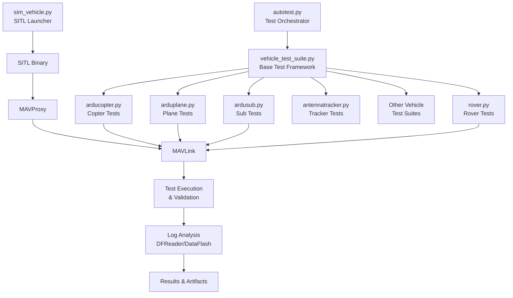
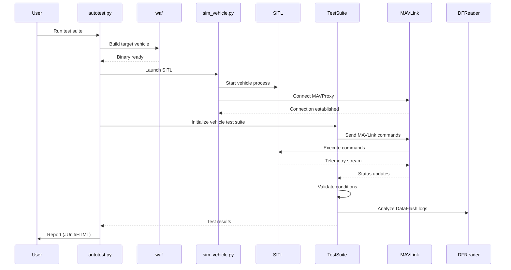

# ArduPilot SITL Autotest Framework

## Overview

The ArduPilot autotest framework is a comprehensive SITL (Software In The Loop) testing system that validates vehicle firmware through automated flight tests, mode transitions, failsafe scenarios, and mission execution. The framework orchestrates building firmware, launching simulated vehicles, executing test scenarios via MAVLink commands, and collecting/analyzing telemetry logs and data logs to verify correct behavior.

This testing infrastructure serves as the primary quality assurance mechanism for ArduPilot, running continuously in CI/CD pipelines and enabling developers to validate changes locally before submission.

## Architecture

### System Components

The autotest framework consists of four primary architectural layers:



### Component Responsibilities

#### autotest.py - Test Orchestrator
Central command-line interface and test execution coordinator that:
- Drives waf builds for target boards (SITL, Linux, Pixhawk, etc.)
- Invokes vehicle-specific test suites
- Manages test discovery via `tester_class_map` dictionary
- Collects logs and telemetry artifacts
- Converts telemetry to GPX/KML formats (mavtogpx/gpsbabel)
- Generates JUnit XML and HTML reports
- Implements timeout enforcement (SIGALRM) and lockfile coordination
- Provides run_step/run_specific_test dispatch mechanisms

Source: `Tools/autotest/autotest.py`

#### vehicle_test_suite.py - Base Test Framework
Authoritative TestSuite base class providing core testing infrastructure:
- **Lifecycle Management**: start_SITL, stop_SITL, reboot_sitl
- **MAVLink Session**: pymavlink integration, message handling, and hooks
- **Polling Utilities**: WaitAndMaintain pattern for condition validation
- **Mission Helpers**: upload_mission, download_mission, clear_mission
- **Fence/Rally Helpers**: upload_fences, upload_rally_points
- **Parameter Utilities**: set_parameter, get_parameter, load_parameters
- **Log Parsing**: DFReader integration for binary log analysis
- **Domain Exceptions**: WaitModeTimeout, NotAchievedException, etc.
- **Validation Methods**: wait_altitude, wait_groundspeed, wait_heading, wait_mode

All vehicle test suites inherit from this base class and implement vehicle-specific test methods.

Source: `Tools/autotest/vehicle_test_suite.py`

#### sim_vehicle.py - SITL Launch Orchestrator
Multi-platform SITL orchestration script that:
- Handles command-line parsing (optparse) for SITL configuration
- Integrates with waf configure/build system
- Spawns MAVProxy with appropriate vehicle-specific modules
- Supports DroneCAN/peripheral simulation
- Manages swarm/multi-vehicle scenarios (swarminit.txt, locations.txt)
- Launches external visualizers (FlightGear, scrimmage)
- Handles terminal/window launching for debugging
- Configures simulation parameters (frame type, speedup, location)

Source: `Tools/autotest/sim_vehicle.py`

#### Vehicle Test Suite Modules
Per-vehicle test implementations that define comprehensive test scenarios:

- **arducopter.py** - AutoTestCopter: Multicopter test catalogue including flight modes, autotune, precision landing, optical flow, obstacle avoidance
- **arduplane.py** - AutoTestPlane: Fixed-wing tests including TECS, L1 navigation, terrain following, autoland, quadplane modes
- **rover.py** - AutoTestRover: Ground vehicle tests with steering algorithms, waypoint navigation, pivot turns
- **ardusub.py** - AutoTestSub: Underwater vehicle tests with depth hold, joystick control, buoyancy management
- **antennatracker.py** - AutoTestTracker: Antenna pointing and tracking algorithms
- **helicopter.py** - Helicopter-specific tests including autorotation
- **quadplane.py** - VTOL-specific test scenarios
- **balancebot.py** - Balance bot tests with wheel encoders
- **sailboat.py** - Sailboat-specific navigation tests
- **blimp.py** - Lighter-than-air vehicle tests

Each module implements:
- `tests()` method returning list of callable test scenarios
- Vehicle-specific setup (SITL_START_LOCATION, default parameters)
- Test methods using TestSuite helpers (change_mode, set_rc, wait_*, arm_vehicle)

### Test Execution Flow



## Adding New Tests

### Step-by-Step Guide for Test Development

#### 1. Identify the Target Vehicle

Determine which vehicle test suite your test belongs to:
- **Copter**: `arducopter.py` (AutoTestCopter)
- **Plane**: `arduplane.py` (AutoTestPlane)
- **Rover**: `rover.py` (AutoTestRover)
- **Sub**: `ardusub.py` (AutoTestSub)
- **Tracker**: `antennatracker.py` (AutoTestTracker)
- **Other**: helicopter.py, quadplane.py, balancebot.py, sailboat.py, blimp.py

#### 2. Create Test Method

Add a new test method to the appropriate vehicle test suite class. Follow this structure:

```python
def TestYourFeatureName(self):
    """Brief description of what this test validates."""
    
    # Test setup
    self.progress("Starting YourFeatureName test")
    self.change_mode("GUIDED")  # Set appropriate initial mode
    self.wait_ready_to_arm()
    self.arm_vehicle()
    
    # Execute test scenario
    self.takeoff(alt_min=20)
    
    # Test-specific actions
    # Use TestSuite helpers: set_rc, set_parameter, run_cmd, etc.
    self.set_rc(3, 1500)  # Throttle
    self.wait_altitude(19, 21, relative=True, timeout=30)
    
    # Validate expected behavior
    self.progress("Validating feature behavior")
    # Add assertions or wait_* methods to verify correctness
    
    # Cleanup
    self.change_mode("RTL")
    self.wait_disarmed(timeout=90)
    
    self.progress("YourFeatureName test complete")
```

#### 3. Register Test in tests() Method

Add your test to the vehicle's `tests()` method to make it discoverable:

```python
def tests(self):
    '''Return list of test instances'''
    ret = super(AutoTestCopter, self).tests()
    ret.extend([
        # ... existing tests ...
        
        Test(self.TestYourFeatureName,
             "YourFeatureName",
             "Brief description",
             timeout=300),  # Timeout in seconds
    ])
    return ret
```

#### 4. Test Method Best Practices

**Use Descriptive Names**: Test method names should clearly indicate what is being tested (e.g., `TestRTLSpeed`, `TestBatteryFailsafe`, `TestAutoMission`)

**Progress Messages**: Use `self.progress("message")` to provide status updates visible in test output

**Exception Handling**: Inherit from vehicle_test_suite exceptions:
- `NotAchievedException`: Test condition not met
- `AutoTestTimeoutException`: Timeout occurred
- `PreconditionFailedException`: Test prerequisites not satisfied

**Cleanup**: Always include cleanup code to return vehicle to safe state (land/disarm)

**Timeouts**: Specify reasonable timeout values in wait_* methods to prevent indefinite hangs

**Parameter Safety**: If modifying parameters, restore original values:
```python
old_value = self.get_parameter("PARAM_NAME")
try:
    self.set_parameter("PARAM_NAME", new_value)
    # ... test code ...
finally:
    self.set_parameter("PARAM_NAME", old_value)
```

#### 5. Common TestSuite Helper Methods

**Mode Control**:
- `self.change_mode(mode_name)` - Change flight mode
- `self.wait_mode(mode_name, timeout=30)` - Wait for mode transition

**Arming/Disarming**:
- `self.arm_vehicle()` - Arm the vehicle
- `self.disarm_vehicle()` - Disarm the vehicle  
- `self.wait_ready_to_arm(timeout=120)` - Wait for pre-arm checks
- `self.wait_disarmed(timeout=30)` - Wait for disarm

**RC Control**:
- `self.set_rc(channel, pwm)` - Set RC input (channel 1-16, PWM 1000-2000)
- `self.set_rc_from_map(dict)` - Set multiple RC channels from dictionary

**Altitude Control**:
- `self.wait_altitude(min, max, relative=True, timeout=30)` - Wait for altitude range
- `self.takeoff(alt_min=30, mode="STABILIZE")` - Execute takeoff

**Position/Navigation**:
- `self.wait_location(target_loc, accuracy=5, timeout=30)` - Wait to reach location
- `self.wait_distance(distance, accuracy=2, timeout=90)` - Wait for distance from home
- `self.wait_groundspeed(min, max, timeout=30)` - Wait for groundspeed range

**Attitude**:
- `self.wait_roll(min, max, timeout=30)` - Wait for roll angle range (degrees)
- `self.wait_pitch(min, max, timeout=30)` - Wait for pitch angle range (degrees)
- `self.wait_heading(heading, accuracy=5, timeout=30)` - Wait for heading (degrees)

**Parameters**:
- `self.set_parameter(name, value)` - Set parameter value
- `self.get_parameter(name)` - Get current parameter value
- `self.load_parameters(filename)` - Load parameters from file

**Mission Control**:
- `self.upload_simple_relhome_mission(items)` - Upload waypoint mission
- `self.wait_waypoint(wpnum, timeout=60)` - Wait to reach waypoint
- `self.clear_mission()` - Clear mission

**Message Handling**:
- `self.mav.recv_match(type='MSG_TYPE', blocking=True, timeout=5)` - Receive specific message
- `self.assert_receive_message(msgtype, timeout=5)` - Assert message received

**Commands**:
- `self.run_cmd(command, p1, p2, ..., timeout=10)` - Send MAV_CMD_* command
- `self.run_cmd_int(command, p1, p2, ..., timeout=10)` - Send MAV_CMD_* as _INT

#### 6. Example Test Implementation

Complete example showing flight mode test with failsafe validation:

```python
def TestBatteryFailsafe(self):
    """Test battery failsafe triggers RTL correctly."""
    
    self.progress("Testing battery failsafe behavior")
    
    # Save original parameters
    orig_fs_batt_enable = self.get_parameter("BATT_FS_LOW_ACT")
    orig_fs_batt_voltage = self.get_parameter("BATT_LOW_VOLT")
    
    try:
        # Configure failsafe
        self.set_parameter("BATT_FS_LOW_ACT", 2)  # RTL
        self.set_parameter("BATT_LOW_VOLT", 10.5)
        
        # Takeoff and establish flight
        self.change_mode("GUIDED")
        self.wait_ready_to_arm()
        self.arm_vehicle()
        self.takeoff(alt_min=20)
        
        # Simulate battery voltage drop
        self.set_parameter("SIM_BATT_VOLTAGE", 10.0)
        
        # Verify failsafe triggers RTL mode
        self.wait_mode("RTL", timeout=30)
        self.progress("Battery failsafe correctly triggered RTL")
        
        # Verify vehicle returns home
        self.wait_distance(0, 5, timeout=120)
        
        # Wait for landing
        self.wait_disarmed(timeout=90)
        
    finally:
        # Restore original parameters
        self.set_parameter("BATT_FS_LOW_ACT", orig_fs_batt_enable)
        self.set_parameter("BATT_LOW_VOLT", orig_fs_batt_voltage)
        self.set_parameter("SIM_BATT_VOLTAGE", 12.6)
    
    self.progress("Battery failsafe test complete")
```

## SITL Configuration and Setup

### Environment Setup

#### Prerequisites

Install required packages for SITL development:

```bash
# Ubuntu/Debian
Tools/environment_install/install-prereqs-ubuntu.sh -y

# macOS
Tools/environment_install/install-prereqs-mac.sh -y

# Arch Linux
Tools/environment_install/install-prereqs-arch.sh -y
```

Key dependencies:
- Python 3.6+ with pymavlink, pexpect, numpy
- MAVProxy
- waf build system
- GCC toolchain for SITL compilation

#### Initial Build

Build SITL binary for your target vehicle:

```bash
# Build ArduCopter SITL
./waf configure --board sitl
./waf copter

# Build ArduPlane SITL
./waf plane

# Build Rover SITL
./waf rover

# Build ArduSub SITL
./waf sub
```

Binaries are generated in `build/sitl/bin/` directory.

### Using sim_vehicle.py

#### Basic SITL Launch

Launch SITL with default configuration:

```bash
# Launch Copter SITL
Tools/autotest/sim_vehicle.py -v ArduCopter

# Launch Plane SITL
Tools/autotest/sim_vehicle.py -v ArduPlane

# Launch Rover SITL
Tools/autotest/sim_vehicle.py -v Rover

# Launch Sub SITL
Tools/autotest/sim_vehicle.py -v ArduSub
```

This starts the SITL binary and MAVProxy with default parameters.

#### Common sim_vehicle.py Options

**Frame Type** (vehicle-specific):
```bash
# Copter frames
sim_vehicle.py -v ArduCopter --frame quad      # Quadcopter (default)
sim_vehicle.py -v ArduCopter --frame X         # X-configuration
sim_vehicle.py -v ArduCopter --frame hexa      # Hexacopter
sim_vehicle.py -v ArduCopter --frame octa      # Octocopter
sim_vehicle.py -v ArduCopter --frame heli      # Helicopter

# Plane frames  
sim_vehicle.py -v ArduPlane --frame plane      # Fixed-wing
sim_vehicle.py -v ArduPlane --frame quadplane  # VTOL quadplane
```

**Simulation Speed**:
```bash
# Run at 10x realtime (faster testing)
sim_vehicle.py -v ArduCopter --speedup 10

# Run at realtime (1x) for accurate timing
sim_vehicle.py -v ArduCopter --speedup 1
```

**Starting Location**:
```bash
# Use predefined location from locations.txt
sim_vehicle.py -v ArduCopter -L CMAC  # Canberra Model Aircraft Club

# Custom latitude,longitude,altitude,heading
sim_vehicle.py -v ArduCopter -L 51.477,-0.461,20,270  # Custom location
```

**Console and Map**:
```bash
# Launch with map and console
sim_vehicle.py -v ArduCopter --map --console

# No MAVProxy console (use external GCS)
sim_vehicle.py -v ArduCopter --no-mavproxy
```

**Debug and Development**:
```bash
# Enable GDB debugging
sim_vehicle.py -v ArduCopter --gdb

# Enable Valgrind memory checking
sim_vehicle.py -v ArduCopter --valgrind

# Wipe EEPROM (reset parameters)
sim_vehicle.py -v ArduCopter -w

# Fresh start (wipe + rebuild)
sim_vehicle.py -v ArduCopter --waf-configure-args="--board sitl" -w
```

**Custom Parameters**:
```bash
# Load custom parameter file
sim_vehicle.py -v ArduCopter --add-param-file=myparams.parm

# Add custom default parameters
sim_vehicle.py -v ArduCopter --defaults=Tools/autotest/default_params/copter.parm
```

### Parameter Configuration

#### Loading Parameter Files

Parameters can be loaded via MAVProxy after SITL starts:

```
# In MAVProxy console
param load Tools/autotest/default_params/copter.parm
param set PARAM_NAME value
param show PARAM_NAME
```

#### Simulation-Specific Parameters

Key SIM_* parameters for testing:

```
SIM_SPEEDUP      # Simulation speed multiplier (default 1)
SIM_BATT_VOLTAGE # Simulated battery voltage
SIM_GPS_DISABLE  # Disable GPS simulation (test GPS failsafe)
SIM_GPS_GLITCH_X # GPS position glitch (meters)
SIM_GPS_DELAY    # GPS update delay (ms)
SIM_RC_FAIL      # Simulate RC failure
SIM_WIND_SPD     # Wind speed (m/s)
SIM_WIND_DIR     # Wind direction (degrees)
SIM_DRIFT_SPEED  # Simulated drift speed
SIM_ENGINE_FAIL  # Engine failure simulation
```

### Mission Files and Test Fixtures

Pre-defined mission files for testing are located in vehicle-specific directories:

```
Tools/autotest/Generic_Missions/      # Generic mission templates
Tools/autotest/ArduCopter_Tests/      # Copter-specific missions
Tools/autotest/ArduPlane_Tests/       # Plane-specific missions
Tools/autotest/ArduRover_Tests/       # Rover-specific missions
Tools/autotest/ArduSub_Tests/         # Sub-specific missions
```

Mission file format: QGroundControl WPL format (.txt)
```
QGC WPL 110
0	1	0	16	0	0	0	0	-35.362938	149.165085	584.000000	1
1	0	0	22	0.000000	0.000000	0.000000	0.000000	-35.361354	149.165085	50.000000	1
...
```

Load mission in tests:
```python
self.upload_simple_relhome_mission([
    (mavutil.mavlink.MAV_CMD_NAV_WAYPOINT, 0, 0, 0, 0, 50, 100, 0),
    (mavutil.mavlink.MAV_CMD_NAV_RETURN_TO_LAUNCH, 0, 0, 0, 0, 0, 0, 0),
])
```

## Test Execution Commands

### Running Full Test Suites

#### Complete Vehicle Test Suite

Run all tests for a specific vehicle:

```bash
# Run all Copter tests
Tools/autotest/autotest.py build.ArduCopter test.ArduCopter

# Run all Plane tests
Tools/autotest/autotest.py build.ArduPlane test.ArduPlane

# Run all Rover tests
Tools/autotest/autotest.py build.Rover test.Rover

# Run all Sub tests
Tools/autotest/autotest.py build.ArduSub test.ArduSub
```

This builds the vehicle firmware and executes all registered tests.

#### Build Only

Build vehicle without running tests:

```bash
Tools/autotest/autotest.py build.ArduCopter
Tools/autotest/autotest.py build.ArduPlane
```

#### Test Only (Skip Build)

Run tests using existing binary:

```bash
Tools/autotest/autotest.py test.ArduCopter
Tools/autotest/autotest.py test.ArduPlane
```

### Running Individual Tests

#### Single Test Execution

Run a specific test by name:

```bash
# Copter test example
Tools/autotest/autotest.py test.ArduCopter.TestRTL

# Plane test example
Tools/autotest/autotest.py test.ArduPlane.TestAutoMission

# Rover test example  
Tools/autotest/autotest.py test.Rover.TestSimpleNavigation
```

Format: `test.<VehicleName>.<TestMethodName>`

#### Pattern Matching

Run tests matching a pattern:

```bash
# Run all tests containing "Failsafe"
Tools/autotest/autotest.py test.ArduCopter.*Failsafe*

# Run all navigation tests
Tools/autotest/autotest.py test.ArduPlane.*Nav*
```

### Test Execution Options

#### Speedup Factor

Control simulation speed for faster testing:

```bash
# 10x speedup (default for most tests)
Tools/autotest/autotest.py --speedup=10 test.ArduCopter

# Realtime (1x) for timing-sensitive tests
Tools/autotest/autotest.py --speedup=1 test.ArduCopter.TestPrecisionLanding

# Maximum speedup (200x)
Tools/autotest/autotest.py --speedup=200 test.ArduCopter
```

#### Frame Type

Specify vehicle frame for testing:

```bash
# Test with hexacopter frame
Tools/autotest/autotest.py --frame=hexa test.ArduCopter

# Test quadplane configuration
Tools/autotest/autotest.py --frame=quadplane test.ArduPlane
```

#### Logging and Debug

Control output verbosity and logging:

```bash
# Verbose output
Tools/autotest/autotest.py -v test.ArduCopter

# Debug mode with detailed MAVLink messages
Tools/autotest/autotest.py --debug test.ArduCopter

# Retain logs even on success
Tools/autotest/autotest.py --keep-logs test.ArduCopter
```

#### Retry Failed Tests

Automatically retry failed tests:

```bash
# Retry failed tests once
Tools/autotest/autotest.py --retry=1 test.ArduCopter

# Retry failed tests three times
Tools/autotest/autotest.py --retry=3 test.ArduCopter
```

### Test Output and Artifacts

#### Log Files Location

Test artifacts are stored in buildlogs directory:

```
../buildlogs/
├── ArduCopter-test.tlog        # Telemetry log (MAVLink messages)
├── ArduCopter-test.log         # Test framework log
├── 00000001.BIN                # DataFlash binary log
├── terrain/                    # Terrain data cache
└── <test_name>/                # Test-specific artifacts
```

Environment variable `BUILDLOGS` can override default location:
```bash
export BUILDLOGS=/path/to/logs
```

#### JUnit XML Output

Tests generate JUnit XML for CI integration:

```bash
# JUnit output written to junit.xml
Tools/autotest/autotest.py --junit test.ArduCopter
```

#### HTML Report Generation

Generate HTML test report:

```bash
Tools/autotest/autotest.py --html-report test.ArduCopter
# Report written to ../buildlogs/autotest-report.html
```

### Using run_mission.py for Simple Tests

For basic mission execution testing without full test framework:

```bash
cd Tools/autotest

# Run a simple mission
python3 run_mission.py --vehicle=ArduCopter \
                       --mission=Generic_Missions/CMAC-circuit.txt \
                       --frame=quad
```

This script:
1. Builds and starts SITL
2. Uploads the specified mission
3. Arms and sets AUTO mode
4. Waits for mission completion and disarm
5. Reports success/failure

Useful for quick validation of mission files.

## CI Integration

### GitHub Actions Workflow

ArduPilot uses GitHub Actions for automated testing on every pull request. Test execution is defined in workflow files.

#### Workflow Structure

Example workflow: `.github/workflows/test_sitl_copter.yml`

```yaml
name: test copter

on:
  push:
    paths-ignore:
      - '**.md'
      - 'Tools/environment_install/**'
  pull_request:
  workflow_dispatch:

concurrency:
  group: ci-${{github.workflow}}-${{ github.ref }}
  cancel-in-progress: true

jobs:
  build:
    runs-on: ubuntu-22.04
    container: ardupilot/ardupilot-dev-base:v0.1.3
    steps:
      - uses: actions/checkout@v4
        with:
          submodules: 'recursive'
      
      - name: Build copter
        run: |
          ./waf configure --board sitl --debug
          ./waf build --target bin/arducopter

  autotest:
    needs: build
    runs-on: ubuntu-22.04
    container:
      image: ardupilot/ardupilot-dev-base:v0.1.3
      options: --privileged
    strategy:
      fail-fast: false
      matrix:
        config: [
          sitltest-copter-tests1a,
          sitltest-copter-tests1b,
          sitltest-copter-tests2a,
        ]
    steps:
      - uses: actions/checkout@v4
        with:
          submodules: 'recursive'
      
      - name: Test ${{matrix.config}}
        env:
          CI_BUILD_TARGET: ${{matrix.config}}
        run: |
          Tools/scripts/build_ci.sh
      
      - name: Archive buildlog artifacts
        uses: actions/upload-artifact@v4
        if: failure()
        with:
          name: fail-${{matrix.config}}
          path: |
            /tmp/buildlogs
            logs/
          retention-days: 14
```

#### Test Matrix Strategy

Tests are divided into multiple jobs for parallel execution:

- `sitltest-copter-tests1a` - Basic flight modes, arming checks
- `sitltest-copter-tests1b` - Navigation, waypoint tests  
- `sitltest-copter-tests1c` - Advanced features, sensors
- `sitltest-copter-tests1d` - Precision landing, optical flow
- `sitltest-copter-tests1e` - Scripting, customization
- `sitltest-copter-tests2a` - Failsafes, safety systems
- `sitltest-copter-tests2b` - Performance, stress tests

Matrix strategy benefits:
- Parallel execution reduces total CI time
- Isolated failures don't block other test groups
- Easier identification of failing test categories

#### CI Build Script

`Tools/scripts/build_ci.sh` orchestrates CI test execution:

```bash
#!/bin/bash
# Simplified example of CI execution flow

case "$CI_BUILD_TARGET" in
    sitltest-copter-tests1a)
        python3 Tools/autotest/autotest.py \
            build.ArduCopter \
            test.ArduCopter.TestRTL \
            test.ArduCopter.TestLoiter \
            test.ArduCopter.TestStabilize
        ;;
    sitltest-copter-tests1b)
        python3 Tools/autotest/autotest.py \
            build.ArduCopter \
            test.ArduCopter.TestAutoMission \
            test.ArduCopter.TestGuidedMode
        ;;
    *)
        echo "Unknown target: $CI_BUILD_TARGET"
        exit 1
        ;;
esac
```

#### Container Requirements

CI runs in Docker containers with required dependencies:

- Base image: `ardupilot/ardupilot-dev-base:v0.1.3`
- Includes: Python 3, pymavlink, MAVProxy, build tools
- Privileged mode required for SITL process management
- ptrace capability needed for debugging features

#### Artifact Collection

On test failure, CI automatically archives:
- Build logs (`/tmp/buildlogs`)
- Telemetry logs (`logs/*.tlog`)
- DataFlash logs (`logs/*.BIN`)
- Core dumps (`ap-*.core`)
- Stack traces (`dumpstack.sh_*`)

Artifacts retained for 14 days for debugging failed tests.

#### Problem Matchers

GitHub Actions problem matchers highlight issues in CI logs:

- `gcc.json` - Compilation warnings/errors
- `python.json` - Python exceptions
- `autotestwarn.json` - Test framework warnings
- `autotestfail.json` - Test failures

These create annotations in the GitHub UI for quick issue identification.

### Local CI Simulation

Test the same configuration that runs in CI:

```bash
# Run CI test group locally
export CI_BUILD_TARGET=sitltest-copter-tests1a
Tools/scripts/build_ci.sh

# Run with Docker (exact CI environment)
docker run --rm -it \
    -v $PWD:/ardupilot \
    --privileged \
    ardupilot/ardupilot-dev-base:v0.1.3 \
    bash -c "cd /ardupilot && Tools/scripts/build_ci.sh"
```

## Test Debugging

### Common Test Failures and Solutions

#### Test Timeout Issues

**Symptom**: Test exceeds timeout and fails with `AutoTestTimeoutException`

**Common Causes**:
- Vehicle not responding to commands (check MAVLink connection)
- Insufficient speedup factor (simulation running too slow)
- Test expectations unrealistic for current vehicle state
- Infinite loop in test logic

**Solutions**:
```bash
# Increase speedup for faster simulation
Tools/autotest/autotest.py --speedup=20 test.ArduCopter.TestName

# Run with verbose output to see progress
Tools/autotest/autotest.py -v test.ArduCopter.TestName

# Check telemetry log for vehicle state
mavlogdump.py ../buildlogs/ArduCopter-test.tlog
```

#### Mode Change Failures

**Symptom**: `WaitModeTimeout` or mode transition rejected

**Common Causes**:
- Pre-arm checks not satisfied
- Invalid mode transition (not allowed from current mode)
- Parameter misconfiguration preventing mode
- GPS lock not achieved

**Solutions**:
```python
# Ensure pre-arm checks pass
self.wait_ready_to_arm(timeout=120)

# Check current mode before transition
current_mode = self.get_mode()
self.progress(f"Current mode: {current_mode}")

# Verify GPS fix
self.wait_ekf_happy(timeout=60)

# Check parameter requirements
self.progress(f"GPS_TYPE: {self.get_parameter('GPS_TYPE')}")
```

#### Altitude/Position Not Achieved

**Symptom**: `NotAchievedException` in wait_altitude or wait_location

**Common Causes**:
- Insufficient time allowed (too short timeout)
- Wind/disturbance parameters interfering
- EKF not converged
- Control limits preventing achievement

**Solutions**:
```python
# Use wider tolerance for windy conditions
self.wait_altitude(min_alt - 2, max_alt + 2, timeout=60)

# Check wind parameters
wind_speed = self.get_parameter("SIM_WIND_SPD")
if wind_speed > 5:
    self.progress("High wind speed may affect test")

# Verify EKF health
self.wait_ekf_happy(timeout=30)

# Check control authority
self.progress(f"THR_MAX: {self.get_parameter('THR_MAX')}")
```

#### Arming Failures

**Symptom**: Vehicle refuses to arm, `arm_vehicle()` fails

**Common Causes**:
- Pre-arm checks failing (GPS, compass, gyro calibration)
- Safety switch not bypassed in SITL
- Geofence active and preventing arm
- Battery failsafe threshold

**Solutions**:
```python
# Get detailed arming failure reason
try:
    self.arm_vehicle()
except Exception as e:
    self.progress(f"Arming failed: {e}")
    # Check specific arming checks
    self.wait_ekf_happy(timeout=60)
    self.wait_gps_fix_type_gte(3, timeout=60)

# Bypass specific checks for testing
self.set_parameter("ARMING_CHECK", 0)  # Disable all (use with caution)
self.set_parameter("SIM_BATT_VOLTAGE", 12.6)  # Ensure good battery
```

### Log Analysis for Debugging

#### Telemetry Log Analysis (tlog)

Telemetry logs contain all MAVLink messages exchanged during test:

```bash
# View all messages
mavlogdump.py ../buildlogs/ArduCopter-test.tlog

# Filter specific message types
mavlogdump.py --types=GLOBAL_POSITION_INT ../buildlogs/ArduCopter-test.tlog

# Show only mode changes
mavlogdump.py --types=HEARTBEAT ../buildlogs/ArduCopter-test.tlog | grep "custom_mode"

# Extract GPS data
mavlogdump.py --types=GPS_RAW_INT ../buildlogs/ArduCopter-test.tlog

# Generate KML for visualization
mavtogpx.py ../buildlogs/ArduCopter-test.tlog
# Creates ArduCopter-test.gpx, convert to KML with gpsbabel
```

#### DataFlash Binary Log Analysis (BIN)

Binary logs contain high-rate vehicle data:

```bash
# Convert BIN to text format
mavlogdump.py --format=arducopter ../buildlogs/00000001.BIN > flight.log

# Plot specific parameters
mavgraph.py ../buildlogs/00000001.BIN "ATT.Roll" "ATT.Pitch"

# Analyze with Mission Planner log review tool (Windows)
# Or UAVLogViewer (cross-platform): https://plot.ardupilot.org
```

#### DFReader in Tests

Access log data programmatically in tests:

```python
from pymavlink import mavutil, DFReader

# In test method
dfreader = self.dfreader_for_current_onboard_log()

# Find specific log messages
messages = dfreader.recv_match(type='IMU', blocking=False)
for msg in messages:
    self.progress(f"IMU: AccX={msg.AccX}, AccY={msg.AccY}, AccZ={msg.AccZ}")

# Analyze vibration levels
imu_msgs = []
while True:
    m = dfreader.recv_match(type='IMU', blocking=False)
    if m is None:
        break
    imu_msgs.append(m)

avg_accx = sum(m.AccX for m in imu_msgs) / len(imu_msgs)
self.progress(f"Average AccX: {avg_accx}")

# Check for EKF innovations
ekf_msgs = dfreader.recv_match(type='NKF1', blocking=False, condition='NKF1.C==0')
```

### Interactive Debugging

#### Running Tests with GDB

Debug SITL process with GDB:

```bash
# Launch SITL with GDB attached
Tools/autotest/sim_vehicle.py -v ArduCopter --gdb

# In GDB prompt:
# (gdb) break Copter::set_mode
# (gdb) continue
# (gdb) backtrace
```

#### Running Tests with Valgrind

Detect memory leaks and errors:

```bash
# Run with Valgrind
Tools/autotest/sim_vehicle.py -v ArduCopter --valgrind

# Valgrind output in terminal shows memory issues
# --leak-check=full for detailed leak reports
```

#### MAVProxy Console Interaction

When running tests interactively, use MAVProxy for debugging:

```
# Monitor specific parameters
watch BATT_VOLTAGE
watch GPS_STATUS

# Force mode changes
mode STABILIZE
mode LAND

# Set parameters
param set LOG_DISARMED 1
param show *EKF*

# Check status
status
arm check

# View messages
messages

# Set RC overrides
rc 3 1500  # Throttle mid
```

### Adding Debug Output to Tests

#### Progress Messages

Use `self.progress()` liberally for test status:

```python
def TestMyFeature(self):
    self.progress("Starting MyFeature test")
    
    self.change_mode("GUIDED")
    self.progress("Changed to GUIDED mode")
    
    self.arm_vehicle()
    self.progress("Vehicle armed successfully")
    
    # Diagnostic information
    altitude = self.get_altitude(relative=True)
    self.progress(f"Current altitude: {altitude}m")
```

#### Telemetry Monitoring

Monitor specific MAVLink messages:

```python
# Wait for and examine message
msg = self.mav.recv_match(type='GLOBAL_POSITION_INT', blocking=True, timeout=5)
if msg:
    self.progress(f"Position: lat={msg.lat/1e7}, lon={msg.lon/1e7}, alt={msg.alt/1000}m")

# Assert specific message received
self.assert_receive_message('COMMAND_ACK', timeout=5)

# Check message field values
self.assert_received_message_field_values('VFR_HUD', {
    'airspeed': (10, 15),  # Range check
}, timeout=10)
```

#### Parameter Inspection

Log parameter values for debugging:

```python
# Dump all parameters matching pattern
params = self.get_parameters()
for name, value in params.items():
    if 'EKF' in name:
        self.progress(f"{name} = {value}")

# Specific parameters
self.progress(f"ARMING_CHECK: {self.get_parameter('ARMING_CHECK')}")
self.progress(f"GPS_TYPE: {self.get_parameter('GPS_TYPE')}")
```

### Troubleshooting Common Issues

#### Issue: Test Framework Hangs

**Symptoms**: Test never completes, no timeout

**Solutions**:
- Check for infinite loops in test logic
- Verify timeout parameters in wait_* methods
- Use `--timeout` flag for autotest.py
- Check system resources (CPU, memory)

```bash
# Set global test timeout
Tools/autotest/autotest.py --timeout=600 test.ArduCopter.TestName
```

#### Issue: SITL Process Crashes

**Symptoms**: Segmentation fault, abort signal

**Solutions**:
- Run with Valgrind to detect memory errors
- Check recent code changes for null pointer dereferences
- Review core dump with GDB
- Enable debug symbols in build

```bash
# Build with debug symbols
./waf configure --board sitl --debug
./waf copter

# Analyze core dump
gdb build/sitl/bin/arducopter ap-*.core
(gdb) backtrace full
```

#### Issue: Inconsistent Test Results

**Symptoms**: Test passes sometimes, fails other times

**Solutions**:
- Reduce speedup factor for more stable simulation
- Increase timeouts to account for system load
- Check for race conditions in test logic
- Review timing-sensitive operations

```bash
# Run with lower speedup for consistency
Tools/autotest/autotest.py --speedup=5 test.ArduCopter.TestName

# Run multiple times to identify flaky tests
for i in {1..10}; do
    Tools/autotest/autotest.py test.ArduCopter.TestName || echo "Failed on run $i"
done
```

## Test Scenario Examples

### Flight Mode Tests

#### Basic Stabilize Mode Test

```python
def TestStabilize(self):
    """Test STABILIZE mode maintains attitude control."""
    
    self.progress("Testing STABILIZE mode")
    
    # Setup
    self.change_mode("STABILIZE")
    self.wait_ready_to_arm()
    self.arm_vehicle()
    
    # Throttle up to hover
    self.set_rc(3, 1500)  # Mid throttle
    self.delay_sim_time(5)
    
    # Apply roll input
    self.set_rc(1, 1700)  # Right roll
    self.wait_roll(5, 15, timeout=5)
    self.progress("Roll input accepted")
    
    # Center sticks
    self.set_rc(1, 1500)
    self.wait_roll(-2, 2, timeout=5)
    self.progress("Returned to level")
    
    # Apply pitch input
    self.set_rc(2, 1300)  # Forward pitch
    self.wait_pitch(-15, -5, timeout=5)
    self.progress("Pitch input accepted")
    
    # Center sticks
    self.set_rc(2, 1500)
    self.wait_pitch(-2, 2, timeout=5)
    self.progress("Returned to level")
    
    # Land
    self.set_rc(3, 1000)
    self.wait_disarmed(timeout=30)
    
    self.progress("STABILIZE mode test complete")
```

#### Guided Mode Waypoint Test

```python
def TestGuidedMode(self):
    """Test GUIDED mode waypoint navigation."""
    
    self.progress("Testing GUIDED mode")
    
    # Takeoff
    self.change_mode("GUIDED")
    self.wait_ready_to_arm()
    self.arm_vehicle()
    self.user_takeoff(alt_min=20)
    
    # Get home position
    home = self.mav.location()
    self.progress(f"Home: {home.lat}, {home.lng}")
    
    # Send guided waypoint 100m North
    target = self.offset_location_ne(home, 100, 0)
    self.run_cmd_int(
        mavutil.mavlink.MAV_CMD_NAV_WAYPOINT,
        0, 0, 0, 0,
        int(target.lat * 1e7),
        int(target.lng * 1e7),
        50  # 50m altitude
    )
    
    # Wait to reach waypoint
    self.wait_location(target, accuracy=5, timeout=60)
    self.progress("Reached guided waypoint")
    
    # Return to launch
    self.change_mode("RTL")
    self.wait_distance(0, 5, timeout=90)
    self.wait_disarmed(timeout=60)
    
    self.progress("GUIDED mode test complete")
```

### Failsafe Tests

#### GPS Failsafe Test

```python
def TestGPSFailsafe(self):
    """Test GPS failsafe triggers LAND mode."""
    
    self.progress("Testing GPS failsafe")
    
    # Configure GPS failsafe to LAND
    self.set_parameter("FS_GPS_ENABLE", 1)  # Enable GPS failsafe
    self.set_parameter("GPS_TYPE", 1)  # Ensure GPS enabled
    
    # Takeoff
    self.change_mode("LOITER")
    self.wait_ready_to_arm()
    self.arm_vehicle()
    self.takeoff(alt_min=20)
    
    # Simulate GPS loss
    self.progress("Disabling GPS")
    self.set_parameter("SIM_GPS_DISABLE", 1)
    
    # Verify failsafe triggers LAND mode
    self.wait_mode("LAND", timeout=30)
    self.progress("GPS failsafe correctly triggered LAND mode")
    
    # Verify vehicle lands
    self.wait_altitude(0, 3, relative=True, timeout=60)
    self.wait_disarmed(timeout=30)
    
    # Restore GPS
    self.set_parameter("SIM_GPS_DISABLE", 0)
    
    self.progress("GPS failsafe test complete")
```

#### RC Failsafe Test

```python
def TestRCFailsafe(self):
    """Test RC failsafe triggers configured action."""
    
    self.progress("Testing RC failsafe")
    
    # Configure RC failsafe to RTL
    self.set_parameter("FS_THR_ENABLE", 1)  # Enable throttle failsafe
    self.set_parameter("FS_THR_VALUE", 975)  # Failsafe PWM threshold
    
    # Takeoff
    self.change_mode("LOITER")
    self.wait_ready_to_arm()
    self.arm_vehicle()
    self.takeoff(alt_min=20)
    
    # Simulate RC loss
    self.progress("Simulating RC failure")
    self.set_parameter("SIM_RC_FAIL", 1)
    
    # Verify failsafe triggers RTL
    self.wait_mode("RTL", timeout=30)
    self.progress("RC failsafe correctly triggered RTL")
    
    # Verify vehicle returns home
    self.wait_distance(0, 5, timeout=120)
    self.wait_disarmed(timeout=60)
    
    # Restore RC
    self.set_parameter("SIM_RC_FAIL", 0)
    
    self.progress("RC failsafe test complete")
```

### Mission Execution Tests

#### Simple AUTO Mission Test

```python
def TestAutoMission(self):
    """Test AUTO mode mission execution."""
    
    self.progress("Testing AUTO mission")
    
    # Upload simple mission
    self.upload_simple_relhome_mission([
        (mavutil.mavlink.MAV_CMD_NAV_TAKEOFF, 0, 0, 0, 0, 0, 0, 20),
        (mavutil.mavlink.MAV_CMD_NAV_WAYPOINT, 0, 0, 0, 0, 50, 100, 0),
        (mavutil.mavlink.MAV_CMD_NAV_WAYPOINT, 0, 0, 0, 0, 100, 100, 0),
        (mavutil.mavlink.MAV_CMD_NAV_WAYPOINT, 0, 0, 0, 0, 100, 0, 0),
        (mavutil.mavlink.MAV_CMD_NAV_RETURN_TO_LAUNCH, 0, 0, 0, 0, 0, 0, 0),
    ])
    
    # Start mission
    self.change_mode("AUTO")
    self.wait_ready_to_arm()
    self.arm_vehicle()
    
    # Wait for takeoff
    self.wait_altitude(19, 21, relative=True, timeout=30)
    self.progress("Takeoff complete")
    
    # Monitor waypoint progress
    for wpnum in range(1, 5):
        self.wait_waypoint(wpnum, timeout=90)
        self.progress(f"Reached waypoint {wpnum}")
    
    # Wait for RTL and landing
    self.wait_mode("RTL", timeout=30)
    self.wait_distance(0, 5, timeout=120)
    self.wait_disarmed(timeout=60)
    
    self.progress("AUTO mission test complete")
```

#### Conditional Mission Command Test

```python
def TestConditionalMission(self):
    """Test conditional mission commands (delays, distance, yaw)."""
    
    self.progress("Testing conditional mission commands")
    
    # Upload mission with conditional commands
    self.upload_simple_relhome_mission([
        (mavutil.mavlink.MAV_CMD_NAV_TAKEOFF, 0, 0, 0, 0, 0, 0, 20),
        (mavutil.mavlink.MAV_CMD_NAV_WAYPOINT, 0, 0, 0, 0, 50, 0, 0),
        (mavutil.mavlink.MAV_CMD_CONDITION_DELAY, 5, 0, 0, 0, 0, 0, 0),  # Wait 5 seconds
        (mavutil.mavlink.MAV_CMD_NAV_WAYPOINT, 0, 0, 0, 0, 50, 50, 0),
        (mavutil.mavlink.MAV_CMD_CONDITION_YAW, 90, 10, 1, 0, 0, 0, 0),  # Yaw 90° at 10°/s
        (mavutil.mavlink.MAV_CMD_NAV_WAYPOINT, 0, 0, 0, 0, 0, 50, 0),
        (mavutil.mavlink.MAV_CMD_NAV_RETURN_TO_LAUNCH, 0, 0, 0, 0, 0, 0, 0),
    ])
    
    # Start mission
    self.change_mode("AUTO")
    self.wait_ready_to_arm()
    self.arm_vehicle()
    
    # Monitor mission execution
    self.wait_waypoint(1, timeout=60)
    self.progress("Reached WP1")
    
    # Verify delay occurred
    start_time = self.get_sim_time()
    self.wait_waypoint(2, timeout=60)
    elapsed = self.get_sim_time() - start_time
    if elapsed < 5:
        raise NotAchievedException(f"Delay too short: {elapsed}s")
    self.progress(f"Delay executed: {elapsed}s")
    
    # Verify yaw command
    self.wait_heading(85, 95, timeout=30)
    self.progress("Yaw command executed")
    
    # Complete mission
    self.wait_mode("RTL", timeout=60)
    self.wait_disarmed(timeout=90)
    
    self.progress("Conditional mission test complete")
```

### Sensor and Hardware Tests

#### Compass Calibration Test

```python
def TestCompassCalibration(self):
    """Test compass calibration procedure."""
    
    self.progress("Testing compass calibration")
    
    # Initiate calibration
    self.run_cmd(
        mavutil.mavlink.MAV_CMD_DO_START_MAG_CAL,
        0,  # Bitmask of compasses to calibrate
        0,  # Retry on failure
        1,  # Autosave on success
        0,  # Delay in ms
        0, 0, 0
    )
    
    # Simulate vehicle rotation for calibration
    # In SITL, use SIM parameters to simulate compass readings
    self.progress("Simulating vehicle rotation")
    
    for rotation in range(0, 360, 45):
        self.set_parameter("SIM_ACC_RND", 0.1)
        self.delay_sim_time(2)
    
    # Wait for calibration completion
    self.wait_statustext("CalComplete", timeout=120)
    self.progress("Calibration completed")
    
    # Verify calibration offsets updated
    compass_ofs_x = self.get_parameter("COMPASS_OFS_X")
    self.progress(f"Compass offset X: {compass_ofs_x}")
    
    self.progress("Compass calibration test complete")
```

#### IMU Consistency Check Test

```python
def TestIMUConsistency(self):
    """Test IMU consistency checking and failover."""
    
    self.progress("Testing IMU consistency")
    
    # Enable IMU consistency check
    self.set_parameter("INS_ACC_BODYFIX", 2)  # Enable consistency checking
    
    # Takeoff
    self.change_mode("LOITER")
    self.wait_ready_to_arm()
    self.arm_vehicle()
    self.takeoff(alt_min=20)
    
    # Inject IMU error on IMU1
    self.progress("Injecting IMU1 error")
    self.set_parameter("SIM_ACC1_BIAS_X", 5)  # 5 m/s² bias
    
    # Verify vehicle detects inconsistency
    self.wait_statustext("IMU1 inconsistent", timeout=30)
    self.progress("IMU inconsistency detected")
    
    # Verify vehicle continues flying (failover to IMU2)
    self.wait_altitude(18, 22, relative=True, timeout=30)
    self.progress("Vehicle stable on backup IMU")
    
    # Clear error and land
    self.set_parameter("SIM_ACC1_BIAS_X", 0)
    self.change_mode("LAND")
    self.wait_disarmed(timeout=60)
    
    self.progress("IMU consistency test complete")
```

### Performance and Stress Tests

#### High Wind Test

```python
def TestHighWind(self):
    """Test vehicle control in high wind conditions."""
    
    self.progress("Testing high wind performance")
    
    # Configure high wind
    self.set_parameter("SIM_WIND_SPD", 15)  # 15 m/s wind
    self.set_parameter("SIM_WIND_DIR", 45)  # 45° direction
    self.set_parameter("SIM_WIND_TURB", 5)  # Turbulence
    
    # Takeoff in wind
    self.change_mode("LOITER")
    self.wait_ready_to_arm()
    self.arm_vehicle()
    self.takeoff(alt_min=20)
    
    # Test position hold in wind
    home = self.mav.location()
    self.delay_sim_time(30)
    
    # Verify position maintained within tolerance
    current = self.mav.location()
    distance = self.get_distance(home, current)
    if distance > 10:
        raise NotAchievedException(f"Drifted {distance}m in wind")
    self.progress(f"Position maintained: {distance}m drift")
    
    # Test waypoint navigation in wind
    target = self.offset_location_ne(home, 100, 0)
    self.run_cmd_int(
        mavutil.mavlink.MAV_CMD_NAV_WAYPOINT,
        0, 0, 0, 0,
        int(target.lat * 1e7),
        int(target.lng * 1e7),
        20
    )
    
    self.wait_location(target, accuracy=10, timeout=120)
    self.progress("Waypoint reached in high wind")
    
    # Land in wind
    self.change_mode("LAND")
    self.wait_disarmed(timeout=90)
    
    # Clear wind
    self.set_parameter("SIM_WIND_SPD", 0)
    
    self.progress("High wind test complete")
```

#### Extended Duration Test

```python
def TestExtendedFlight(self):
    """Test vehicle stability over extended flight duration."""
    
    self.progress("Testing extended flight duration")
    
    # Takeoff
    self.change_mode("LOITER")
    self.wait_ready_to_arm()
    self.arm_vehicle()
    self.takeoff(alt_min=20)
    
    # Monitor for 10 simulated minutes
    start_time = self.get_sim_time()
    duration = 600  # 10 minutes
    
    while self.get_sim_time() - start_time < duration:
        # Verify altitude maintained
        altitude = self.get_altitude(relative=True)
        if altitude < 15 or altitude > 25:
            raise NotAchievedException(f"Altitude deviation: {altitude}m")
        
        # Check for errors
        self.check_ekf_status()
        
        # Progress every simulated minute
        if int(self.get_sim_time() - start_time) % 60 == 0:
            elapsed = int(self.get_sim_time() - start_time)
            self.progress(f"Extended flight: {elapsed}s elapsed")
        
        self.delay_sim_time(10)
    
    self.progress("Extended flight duration completed")
    
    # Land
    self.change_mode("LAND")
    self.wait_disarmed(timeout=60)
    
    self.progress("Extended duration test complete")
```

### Advanced Integration Tests

#### Precision Landing Test

```python
def TestPrecisionLanding(self):
    """Test precision landing with IR-LOCK beacon."""
    
    self.progress("Testing precision landing")
    
    # Configure precision landing
    self.set_parameter("PLND_ENABLED", 1)
    self.set_parameter("PLND_TYPE", 2)  # IR-LOCK
    self.set_parameter("SIM_PLD_ENABLE", 1)  # Enable simulated beacon
    self.reboot_sitl()
    
    # Takeoff away from beacon
    self.change_mode("GUIDED")
    self.wait_ready_to_arm()
    self.arm_vehicle()
    self.user_takeoff(alt_min=20)
    
    # Navigate to beacon area
    home = self.mav.location()
    beacon_loc = self.offset_location_ne(home, 10, 10)
    self.run_cmd_int(
        mavutil.mavlink.MAV_CMD_NAV_WAYPOINT,
        0, 0, 0, 0,
        int(beacon_loc.lat * 1e7),
        int(beacon_loc.lng * 1e7),
        20
    )
    
    self.wait_location(beacon_loc, accuracy=5, timeout=60)
    self.progress("Arrived at beacon area")
    
    # Initiate precision land
    self.change_mode("LAND")
    
    # Verify beacon acquired
    self.wait_statustext("PrecLand: Target Acquired", timeout=30)
    self.progress("Beacon acquired")
    
    # Wait for landing
    self.wait_disarmed(timeout=90)
    
    # Verify landing accuracy
    final_pos = self.mav.location()
    # Beacon is at home in SITL
    accuracy = self.get_distance(home, final_pos)
    if accuracy > 2:
        raise NotAchievedException(f"Landing accuracy {accuracy}m exceeds 2m")
    self.progress(f"Precision landing accuracy: {accuracy}m")
    
    self.progress("Precision landing test complete")
```

#### Obstacle Avoidance Test

```python
def TestObstacleAvoidance(self):
    """Test obstacle avoidance with proximity sensors."""
    
    self.progress("Testing obstacle avoidance")
    
    # Configure proximity sensor
    self.set_parameter("PRX_TYPE", 2)  # Simulated proximity
    self.set_parameter("AVOID_ENABLE", 3)  # Enable avoidance
    self.set_parameter("AVOID_MARGIN", 2)  # 2m margin
    self.reboot_sitl()
    
    # Takeoff
    self.change_mode("LOITER")
    self.wait_ready_to_arm()
    self.arm_vehicle()
    self.takeoff(alt_min=10)
    
    # Simulate obstacle ahead
    self.set_parameter("SIM_SONAR_DIST", 5)  # Obstacle at 5m
    
    # Try to fly forward
    self.change_mode("GUIDED")
    home = self.mav.location()
    target = self.offset_location_ne(home, 20, 0)
    self.run_cmd_int(
        mavutil.mavlink.MAV_CMD_NAV_WAYPOINT,
        0, 0, 0, 0,
        int(target.lat * 1e7),
        int(target.lng * 1e7),
        10
    )
    
    # Verify avoidance stops vehicle
    self.delay_sim_time(10)
    current = self.mav.location()
    distance_moved = self.get_distance(home, current)
    if distance_moved > 10:
        raise NotAchievedException("Vehicle did not stop for obstacle")
    self.progress("Obstacle avoidance stopped vehicle")
    
    # Clear obstacle
    self.set_parameter("SIM_SONAR_DIST", 100)
    
    # Verify vehicle resumes
    self.wait_location(target, accuracy=5, timeout=60)
    self.progress("Vehicle resumed after obstacle cleared")
    
    # Land
    self.change_mode("LAND")
    self.wait_disarmed(timeout=60)
    
    self.progress("Obstacle avoidance test complete")
```

## Best Practices and Guidelines

### Test Design Principles

#### Keep Tests Focused and Atomic

Each test should validate one specific feature or behavior:
- ✅ Good: `TestRTLSpeed` - Tests RTL mode returns at configured speed
- ❌ Bad: `TestAllModes` - Tests multiple unrelated features

Benefits:
- Easier to identify failures
- Simpler debugging
- Better test maintenance
- Clearer test documentation

#### Make Tests Deterministic

Ensure tests produce consistent results:
- Use fixed random seeds for reproducibility
- Avoid timing dependencies where possible
- Set explicit parameter values (don't rely on defaults)
- Clear state between tests

```python
# Set parameters explicitly
self.set_parameter("RTL_ALT", 2000)  # Explicit RTL altitude
self.set_parameter("WPNAV_SPEED", 500)  # Explicit navigation speed

# Don't assume parameter values
# self.change_mode("AUTO")  # Might fail if RTL_ALT not set
```

#### Include Cleanup Code

Always return vehicle to safe state:

```python
def TestMyFeature(self):
    try:
        # Test code
        self.change_mode("GUIDED")
        self.arm_vehicle()
        # ... test actions ...
    finally:
        # Cleanup always executes
        try:
            self.disarm_vehicle()
        except Exception:
            pass
        self.change_mode("STABILIZE")
```

#### Use Appropriate Timeouts

Set realistic timeouts based on expected operation duration:

```python
# Short timeout for quick operations
self.wait_mode("STABILIZE", timeout=5)

# Medium timeout for normal navigation
self.wait_location(target, timeout=60)

# Long timeout for extended operations
self.wait_distance(0, 5, timeout=120)  # RTL from far away
```

### Test Maintenance

#### Document Test Purpose

Every test should have a clear docstring:

```python
def TestBatteryFailsafe(self):
    """
    Test battery voltage failsafe triggers RTL mode.
    
    Verifies:
    - Failsafe triggers when voltage drops below threshold
    - Vehicle transitions to RTL mode
    - Vehicle returns home successfully
    
    Parameters tested: BATT_FS_LOW_ACT, BATT_LOW_VOLT
    """
```

#### Keep Tests Independent

Tests should not depend on execution order:
- Don't rely on state from previous tests
- Reset parameters modified during test
- Reboot SITL if needed for clean state

```python
def TestFeatureA(self):
    # Save and restore parameters
    orig_value = self.get_parameter("PARAM_NAME")
    try:
        self.set_parameter("PARAM_NAME", new_value)
        # Test code
    finally:
        self.set_parameter("PARAM_NAME", orig_value)
```

#### Handle Test Preconditions

Verify preconditions before main test logic:

```python
def TestGPSNavigation(self):
    # Verify GPS available
    if self.get_parameter("GPS_TYPE") == 0:
        raise PreconditionFailedException("GPS not configured")
    
    # Verify EKF working
    self.wait_ekf_happy(timeout=60)
    
    # Proceed with test
    # ...
```

### Performance Considerations

#### Optimize Simulation Speed

Use appropriate speedup for test type:

```python
# Fast tests can use high speedup
def TestQuickArm(self):
    # Suitable for speedup=20
    pass

# Precision tests need lower speedup
def TestPrecisionLanding(self):
    # Needs speedup=1 or 2 for accuracy
    pass
```

#### Minimize Test Duration

Keep tests as short as possible while maintaining validity:
- Use relative waypoints (shorter distances)
- Skip unnecessary delays
- Use appropriate wait conditions (don't over-wait)

```python
# Efficient approach
self.wait_altitude(19, 21, relative=True, timeout=30)

# Inefficient approach
self.delay_sim_time(30)  # Fixed delay, might be too long or short
```

### Safety and Stability

#### Validate Safety Systems

Always test that safety systems work as expected:
- Failsafes trigger correctly
- Arming checks prevent unsafe operation
- Geofences are enforced
- Emergency stops function

#### Test Error Recovery

Verify vehicle recovers from error conditions:
- GPS glitches
- Compass interference
- Motor failures
- Communication loss

## Additional Resources

### Source Code References

- **Test Framework**: `Tools/autotest/vehicle_test_suite.py`
- **Orchestrator**: `Tools/autotest/autotest.py`
- **SITL Launcher**: `Tools/autotest/sim_vehicle.py`
- **Copter Tests**: `Tools/autotest/arducopter.py`
- **Plane Tests**: `Tools/autotest/arduplane.py`
- **Rover Tests**: `Tools/autotest/rover.py`
- **Sub Tests**: `Tools/autotest/ardusub.py`

### External Documentation

- **ArduPilot Development Wiki**: https://ardupilot.org/dev/
- **SITL Simulator**: https://ardupilot.org/dev/docs/sitl-simulator-software-in-the-loop.html
- **MAVLink Protocol**: https://mavlink.io/en/
- **MAVProxy Documentation**: https://ardupilot.org/mavproxy/

### Related Tools

- **Mission Planner**: Ground control station with log analysis
- **QGroundControl**: Cross-platform ground control
- **MAVExplorer**: Advanced log analysis tool
- **UAVLogViewer**: Web-based log visualization (https://plot.ardupilot.org)

### Community Support

- **ArduPilot Discourse**: https://discuss.ardupilot.org/
- **Discord**: ArduPilot Discord server
- **GitHub Issues**: https://github.com/ArduPilot/ardupilot/issues

## Contributing Tests

### Submission Guidelines

When contributing new tests:

1. **Follow Naming Conventions**: Use descriptive test names with `Test` prefix
2. **Add Documentation**: Include docstring explaining test purpose
3. **Test Locally**: Verify test passes consistently before submission
4. **Update CI**: Add test to appropriate CI matrix if needed
5. **PR Description**: Explain what the test validates and why it's needed

### Code Review Checklist

Before submitting test PR:

- [ ] Test has clear, descriptive name
- [ ] Docstring explains test purpose and coverage
- [ ] Test passes locally (run 3+ times for consistency)
- [ ] Test uses appropriate timeouts
- [ ] Cleanup code handles failures gracefully
- [ ] Parameters are restored after test
- [ ] Progress messages aid debugging
- [ ] Test follows existing patterns in vehicle suite

### Test Quality Standards

High-quality tests should:
- Execute in reasonable time (< 300 seconds typical)
- Produce deterministic results
- Clearly indicate failure reason
- Not interfere with other tests
- Handle edge cases appropriately
- Include appropriate validation checks

---

**Document Version**: 1.0  
**Last Updated**: 2025  
**Maintained by**: ArduPilot Development Team

For questions or issues with the test framework, please open an issue on GitHub or ask on the ArduPilot Discourse forum.

