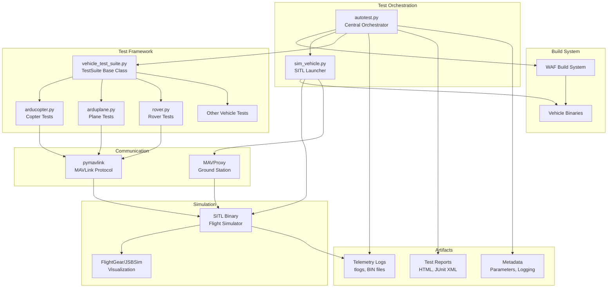
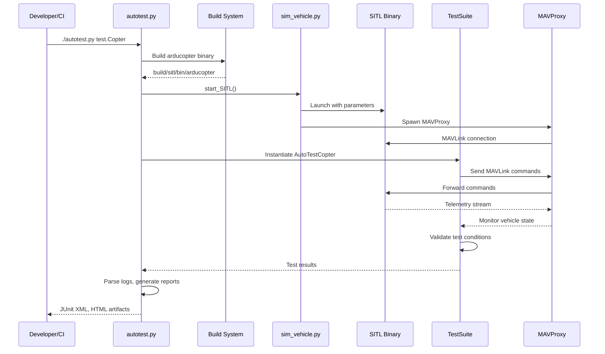
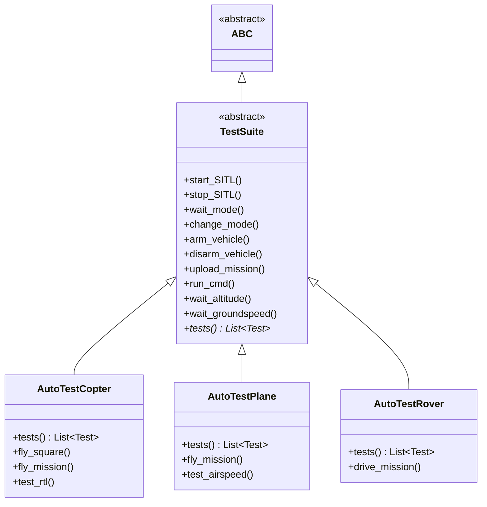

# ArduPilot Autotest Framework


## Table of Contents

- [Overview](#overview)
- [Architecture](#architecture)
  - [System Components](#system-components)
  - [Data Flow](#data-flow)
  - [Test Execution Pipeline](#test-execution-pipeline)
- [Core Components](#core-components)
  - [autotest.py - Test Orchestrator](#autotestpy---test-orchestrator)
  - [sim_vehicle.py - SITL Launcher](#sim_vehiclepy---sitl-launcher)
  - [vehicle_test_suite.py - Base Framework](#vehicle_test_suitepy---base-framework)
- [Vehicle Test Suites](#vehicle-test-suites)
  - [ArduCopter Tests](#arducopter-tests)
  - [ArduPlane Tests](#arduplane-tests)
  - [Rover Tests](#rover-tests)
  - [Other Vehicle Tests](#other-vehicle-tests)
- [Test Fixtures and Assets](#test-fixtures-and-assets)
- [Getting Started](#getting-started)
  - [Prerequisites](#prerequisites)
  - [Environment Setup](#environment-setup)
- [Running Tests](#running-tests)
  - [Running Full Test Suite](#running-full-test-suite)
  - [Running Specific Tests](#running-specific-tests)
  - [Running Tests Locally](#running-tests-locally)
- [CI/CD Integration](#cicd-integration)
- [Writing New Tests](#writing-new-tests)
- [Debugging Failed Tests](#debugging-failed-tests)
- [Log Analysis and Reporting](#log-analysis-and-reporting)
- [Metadata Extraction](#metadata-extraction)
- [Dependencies](#dependencies)
- [Troubleshooting](#troubleshooting)
- [Best Practices](#best-practices)

## Overview

The ArduPilot autotest framework is a comprehensive SITL (Software In The Loop) testing infrastructure that provides automated regression testing, vehicle simulation, and continuous integration capabilities for the ArduPilot autopilot software suite. This framework enables developers to:

- **Test flight control algorithms** without physical hardware
- **Validate mission execution** across all vehicle types
- **Verify parameter changes** and failsafe behavior
- **Perform regression testing** to prevent code regressions
- **Generate compliance reports** for safety-critical systems
- **Extract and validate metadata** for parameters and logging

**Source Files**: `Tools/autotest/`

The framework integrates multiple subsystems including the WAF build system, MAVProxy ground control software, FlightGear/JSBSim visualization, pymavlink communication libraries, and vehicle-specific test suites to create a complete simulation→test→report pipeline.

### Key Features

- **Multi-Vehicle Support**: ArduCopter, ArduPlane (including QuadPlane), Rover, ArduSub, AntennaTracker, Blimp, Helicopter, Sailboat, BalanceBot
- **Automated Build Integration**: Integrates with WAF to build binaries before testing
- **Mission Testing**: Upload, execute, and validate mission waypoint files
- **Failsafe Testing**: Trigger and verify failsafe responses (battery, GPS, radio loss)
- **Log Analysis**: Automated analysis of DataFlash logs with FFT and statistical tools
- **CI/CD Ready**: JUnit XML output, timeout handling, and artifact collection for continuous integration
- **Swarm Testing**: Multi-vehicle simulation with offset positioning
- **Visualization**: FlightGear and JSBSim integration for visual debugging
- **Metadata Pipelines**: Automated extraction of parameter and logging documentation from source code

## Architecture

### System Components

The autotest framework consists of several interconnected components that work together to provide comprehensive testing capabilities:



**Component Roles**:

| Component | Purpose | Source File | Key Responsibilities |
|-----------|---------|-------------|---------------------|
| **autotest.py** | Central orchestrator | `Tools/autotest/autotest.py` | Build coordination, test execution, log conversion, report generation, timeout management |
| **sim_vehicle.py** | SITL launcher | `Tools/autotest/sim_vehicle.py` | WAF build invocation, MAVProxy spawning, parameter loading, swarm orchestration |
| **vehicle_test_suite.py** | Base test framework | `Tools/autotest/vehicle_test_suite.py` | SITL lifecycle, MAVLink session management, mission/fence/rally helpers, wait utilities |
| **Vehicle test modules** | Vehicle-specific tests | `arducopter.py`, `arduplane.py`, etc. | Test case definitions, vehicle mode testing, sensor simulation, flight profiles |
| **MAVProxy** | Ground control software | External dependency | Command interface, telemetry streaming, module extensions |
| **pymavlink** | MAVLink protocol library | `modules/mavlink/pymavlink/` | Message encoding/decoding, log parsing (DFReader), GPS conversion |
| **SITL Binary** | Flight simulator | `build/sitl/bin/arducopter`, etc. | Sensor simulation, physics model, control algorithms |

### Data Flow

The typical test execution follows this data flow:



### Test Execution Pipeline

A complete autotest run executes through the following pipeline stages:

1. **Build Phase**: Compile vehicle binaries using WAF for the SITL board
2. **Initialization Phase**: Start SITL process, launch MAVProxy, load parameters
3. **Test Phase**: Execute test cases sequentially, monitor telemetry, validate conditions
4. **Collection Phase**: Stop SITL, collect telemetry logs (tlogs), DataFlash logs (BIN files)
5. **Analysis Phase**: Parse logs with DFReader, convert to GPX/KML, run FFT analysis
6. **Report Phase**: Generate HTML reports, JUnit XML for CI, extract test artifacts

**Source**: `autotest.py:run_step()`

## Core Components

### autotest.py - Test Orchestrator

**Location**: `Tools/autotest/autotest.py`

The central command-line orchestrator that drives the entire testing pipeline. It provides the high-level automation for build→simulate→test→report workflows.

#### Key Functions

```python
# Source: autotest.py:43-45
def buildlogs_dirpath():
    """Return BUILDLOGS directory path."""
    return os.getenv("BUILDLOGS", util.reltopdir("../buildlogs"))
```

**Primary Responsibilities**:

- **Build Orchestration**: Invokes WAF to compile vehicle binaries before testing
- **Test Dispatch**: Maps test names to TestSuite classes via `tester_class_map`
- **Timeout Management**: Enforces test timeouts with SIGALRM handlers
- **Log Management**: Collects telemetry logs, DataFlash logs, and build artifacts
- **Report Generation**: Produces static HTML reports and JUnit XML for CI
- **GPS Conversion**: Converts telemetry logs to GPX/KML using mavtogpx

#### Test Class Mapping

The orchestrator maintains a mapping between test names and TestSuite implementations:

```python
# Source: autotest.py:343-365
tester_class_map = {
    "test.Blimp": blimp.AutoTestBlimp,
    "test.Copter": arducopter.AutoTestCopter,
    "test.CopterTests1a": arducopter.AutoTestCopterTests1a,  # 8m43s
    "test.CopterTests1b": arducopter.AutoTestCopterTests1b,  # 8m5s
    "test.CopterTests1c": arducopter.AutoTestCopterTests1c,  # 5m17s
    "test.CopterTests1d": arducopter.AutoTestCopterTests1d,  # 8m20s
    "test.CopterTests1e": arducopter.AutoTestCopterTests1e,  # 8m32s
    "test.CopterTests2a": arducopter.AutoTestCopterTests2a,  # 8m23s
    "test.CopterTests2b": arducopter.AutoTestCopterTests2b,  # 8m18s
    "test.Plane": arduplane.AutoTestPlane,
    "test.QuadPlane": quadplane.AutoTestQuadPlane,
    "test.Rover": rover.AutoTestRover,
    "test.Sub": ardusub.AutoTestSub,
    "test.Tracker": antennatracker.AutoTestTracker,
    # ... additional mappings
}
```

> **Note**: Copter tests are split into multiple sub-suites (Tests1a-1e, Tests2a-2b) to parallelize execution in CI and reduce overall testing time.

#### Binary Path Resolution

The framework resolves vehicle binaries based on test names:

```python
# Source: autotest.py:265-292
__bin_names = {
    "Copter": "arducopter",
    "Plane": "arduplane",
    "Rover": "ardurover",
    "Tracker": "antennatracker",
    "Helicopter": "arducopter-heli",
    "QuadPlane": "arduplane",
    "Sub": "ardusub",
    "Blimp": "blimp",
    "BalanceBot": "ardurover",
    "Sailboat": "ardurover",
    # ...
}
```

**Binary Path**: `build/{config}/bin/{binary_name}`

#### Usage Examples

```bash
# Run complete ArduCopter test suite
./Tools/autotest/autotest.py test.Copter

# Run specific test from suite
./Tools/autotest/autotest.py test.Copter.ArmFeatures

# Run ArduPlane tests
./Tools/autotest/autotest.py test.Plane

# Run with build step
./Tools/autotest/autotest.py --build test.Copter

# Skip specific test steps
./Tools/autotest/autotest.py --skip=test.Copter.LandingCommands test.Copter
```

### sim_vehicle.py - SITL Launcher

**Location**: `Tools/autotest/sim_vehicle.py`

A comprehensive SITL orchestration tool that handles multi-platform simulation startup, MAVProxy spawning, and parameter management. This tool can be used independently for manual testing or invoked programmatically by the test framework.

#### Key Features

- **Multi-platform support**: Linux, macOS, Windows (Cygwin)
- **WAF integration**: Automatic build configuration and compilation
- **MAVProxy spawning**: Launches ground control station with appropriate modules
- **Parameter loading**: Applies default parameters from files
- **Swarm support**: Multi-vehicle simulation with position offsets
- **Frame selection**: Supports all vehicle frames (quad, plane, rover, etc.)
- **DroneCAN peripherals**: Simulates CAN-connected devices
- **Console/map windows**: Opens terminal and map displays

#### Command-Line Interface

**Source**: `sim_vehicle.py:1-50`

```bash
# Basic usage - launch ArduCopter SITL
./Tools/autotest/sim_vehicle.py -v ArduCopter

# Launch with specific frame type
./Tools/autotest/sim_vehicle.py -v ArduCopter -f quad

# Launch ArduPlane QuadPlane
./Tools/autotest/sim_vehicle.py -v ArduPlane -f quadplane

# Launch at specific location
./Tools/autotest/sim_vehicle.py -v ArduCopter -L CMAC

# Launch with custom parameters
./Tools/autotest/sim_vehicle.py -v ArduCopter --add-param-file=custom.parm

# Launch with console and map
./Tools/autotest/sim_vehicle.py -v ArduCopter --console --map

# Launch with increased speedup
./Tools/autotest/sim_vehicle.py -v ArduCopter --speedup=10

# Launch swarm of 3 vehicles
./Tools/autotest/sim_vehicle.py -v ArduCopter -n 3

# Launch with DroneCAN peripheral
./Tools/autotest/sim_vehicle.py -v ArduCopter --dronecan-periph
```

#### Key Locations

The framework includes predefined test locations:

**Source**: `Tools/autotest/locations.txt`

```
# Format: NAME=lat,lon,alt,heading
CMAC=-35.362938,149.165085,584.000000,270.0
AVC_plane=40.072842,-105.230575,1586.0,0.0
UBCEHALL=49.26505,−123.24690,60.0,270.0
# ... additional locations
```

#### Swarm Configuration

**Source**: `Tools/autotest/swarminit.txt`

Multi-vehicle simulations use offset positioning defined in `swarminit.txt` to separate vehicles spatially while sharing the same environment.

#### Integration with Test Framework

The TestSuite base class uses `sim_vehicle.py` functionality programmatically:

```python
# Source: vehicle_test_suite.py (SITL lifecycle methods)
def start_SITL(self, **kwargs):
    """Start SITL instance for vehicle testing"""
    # Builds binary if needed, launches SITL, starts MAVProxy
    
def stop_SITL(self):
    """Stop SITL and MAVProxy processes"""
    # Gracefully shuts down simulation
```

### vehicle_test_suite.py - Base Framework

**Location**: `Tools/autotest/vehicle_test_suite.py`

The authoritative base class for all vehicle test suites. This module provides the TestSuite abstract base class with comprehensive utilities for SITL lifecycle management, MAVLink communication, mission handling, and test validation.

#### Class Hierarchy



#### Key Methods

**SITL Lifecycle Management**:

```python
# Source: vehicle_test_suite.py
def start_SITL(self, **kwargs):
    """Initialize and start SITL simulation
    
    Responsibilities:
    - Compile binary if not present
    - Launch SITL process with physics model
    - Start MAVProxy ground station
    - Establish MAVLink connection
    - Load default parameters
    """

def stop_SITL(self):
    """Gracefully stop SITL and cleanup resources"""

def reboot_sitl(self):
    """Restart SITL to test boot behavior"""
```

**MAVLink Session Management**:

```python
# Source: vehicle_test_suite.py
def get_sim_time(self):
    """Get current simulation timestamp"""
    
def poll_message(self, message_type, timeout=60):
    """Wait for specific MAVLink message"""
    
def assert_receive_message(self, message_type, timeout=1):
    """Assert that message arrives within timeout"""
```

**Mode Control**:

```python
# Source: vehicle_test_suite.py
def change_mode(self, mode, timeout=60):
    """Change flight mode and verify transition"""
    
def wait_mode(self, mode, timeout=60):
    """Wait for vehicle to enter specific mode"""
```

**Arming/Disarming**:

```python
# Source: vehicle_test_suite.py
def arm_vehicle(self, timeout=20):
    """Arm vehicle and wait for armed state"""
    
def disarm_vehicle(self, timeout=60, force=False):
    """Disarm vehicle"""
    
def wait_ready_to_arm(self, timeout=None):
    """Wait for all arming checks to pass"""
```

**Mission Management**:

```python
# Source: vehicle_test_suite.py
def upload_mission_from_filepath(self, filepath):
    """Upload mission from QGC WPL file"""
    
def download_mission(self):
    """Download current mission from vehicle"""
    
def clear_mission(self):
    """Clear all mission items"""
```

**Fence and Rally Points**:

```python
# Source: vehicle_test_suite.py
def upload_fences_from_filepath(self, filepath):
    """Upload geofence from file"""
    
def upload_rally_points_from_filepath(self, filepath):
    """Upload rally point locations"""
```

**Wait and Validation Utilities**:

```python
# Source: vehicle_test_suite.py
def wait_altitude(self, alt_min, alt_max, timeout=30, relative=False):
    """Wait for altitude in specified range"""
    
def wait_groundspeed(self, speed_min, speed_max, timeout=30):
    """Wait for groundspeed in range"""
    
def wait_roll(self, roll, accuracy, timeout=30):
    """Wait for roll angle"""
    
def wait_pitch(self, pitch, accuracy, timeout=30):
    """Wait for pitch angle"""
    
def wait_heading(self, heading, accuracy=5, timeout=30):
    """Wait for compass heading"""
    
def wait_distance(self, distance, accuracy=5, timeout=30):
    """Wait to reach distance from waypoint"""
```

**Parameter Management**:

```python
# Source: vehicle_test_suite.py
def set_parameter(self, name, value, retries=10):
    """Set parameter and verify"""
    
def get_parameter(self, name, retries=3):
    """Get parameter value"""
    
def set_parameters(self, param_dict):
    """Set multiple parameters"""
```

**RC Input Control**:

```python
# Source: vehicle_test_suite.py
def set_rc(self, channel, pwm):
    """Set RC channel PWM value (1000-2000)"""
    
def set_rc_default(self):
    """Reset all RC channels to defaults"""
```

**MAVLink Command Execution**:

```python
# Source: vehicle_test_suite.py
def run_cmd(self, command, p1, p2, p3, p4, x, y, z, 
            want_result=mavutil.mavlink.MAV_RESULT_ACCEPTED,
            timeout=10):
    """Send MAV_CMD_* command and verify result"""
    
def run_cmd_int(self, command, p1, p2, p3, p4, x, y, z,
                want_result=mavutil.mavlink.MAV_RESULT_ACCEPTED,
                timeout=10):
    """Send command with integer coordinates"""
```

#### Exception Hierarchy

**Source**: `vehicle_test_suite.py:109-150`

```python
class ErrorException(Exception):
    """Base class for test exceptions"""

class AutoTestTimeoutException(ErrorException):
    """Test operation exceeded timeout"""

class WaitModeTimeout(AutoTestTimeoutException):
    """Failed to achieve mode change"""

class WaitAltitudeTimeout(AutoTestTimeoutException):
    """Failed to reach altitude range"""

class WaitGroundSpeedTimeout(AutoTestTimeoutException):
    """Failed to reach groundspeed range"""

class NotAchievedException(ErrorException):
    """Test condition not achieved"""

class PreconditionFailedException(ErrorException):
    """Test precondition failed"""
```

#### WaitAndMaintain Pattern

The framework provides a powerful pattern for waiting while maintaining conditions:

```python
# Source: vehicle_test_suite.py
class WaitAndMaintainArmed(WaitAndMaintain):
    """Wait for condition while ensuring vehicle stays armed"""
    
# Usage in tests:
def fly_mission(self):
    self.wait_and_maintain_armed(
        WaitAndMaintainArmed(self),
        timeout=300
    )
```

## Vehicle Test Suites

### ArduCopter Tests

**Location**: `Tools/autotest/arducopter.py`

The most comprehensive test suite covering multirotor and helicopter configurations. This module contains 100+ individual test cases validating flight modes, sensor handling, mission execution, and failsafe responses.

#### Test Organization

The copter tests are split into multiple sub-suites for CI parallelization:

| Suite | Duration | Focus Areas | Source Class |
|-------|----------|-------------|--------------|
| **CopterTests1a** | ~8m43s | Basic flight modes, arming, takeoff | `AutoTestCopterTests1a` |
| **CopterTests1b** | ~8m5s | Guided mode, position control | `AutoTestCopterTests1b` |
| **CopterTests1c** | ~5m17s | Loiter, circle, brake modes | `AutoTestCopterTests1c` |
| **CopterTests1d** | ~8m20s | Mission execution, RTL | `AutoTestCopterTests1d` |
| **CopterTests1e** | ~8m32s | Failsafes, geofence | `AutoTestCopterTests1e` |
| **CopterTests2a** | ~8m23s | Advanced flight modes | `AutoTestCopterTests2a` |
| **CopterTests2b** | ~8m18s | Sensor testing, EKF | `AutoTestCopterTests2b` |

#### Sample Test Cases

```python
# Source: arducopter.py
class AutoTestCopter(vehicle_test_suite.TestSuite):
    
    def ArmFeatures(self):
        """Test arming with various sensor configurations"""
        # Tests: GPS required, IMU consistency, battery checks
        
    def SimpleArmingAndTakeoff(self):
        """Basic arming, takeoff, hover, land sequence"""
        
    def FlySquare(self):
        """Fly square pattern using RC input"""
        # Validates: Position hold, RC control, navigation
        
    def RTL(self):
        """Return-to-Launch functionality"""
        # Tests: RTL mode, altitude maintenance, landing
        
    def AutoMission(self):
        """Upload and execute AUTO mission"""
        # Validates: Mission upload, waypoint navigation, AUTO mode
        
    def GuidedMode(self):
        """Test GUIDED mode position commands"""
        # Tests: SET_POSITION_TARGET_GLOBAL_INT
        
    def Loiter(self):
        """LOITER mode position hold"""
        
    def Circle(self):
        """CIRCLE mode testing"""
        
    def Flip(self):
        """Acrobatic flip maneuver"""
        
    def BatteryFailsafe(self):
        """Trigger low battery failsafe"""
        # Tests: Battery monitor, failsafe actions (RTL/LAND)
        
    def GPSGlitchLoiter(self):
        """GPS glitch detection in LOITER"""
        # Validates: EKF GPS health monitoring
        
    def MotorFailure(self):
        """Simulate motor failure"""
        # Tests: Motor failure detection and compensation
```

#### Default Configuration

**Source**: `arducopter.py:36-41`

```python
SITL_START_LOCATION = mavutil.location(
    -35.362938,  # Latitude
    149.165085,  # Longitude
    584.0805053710938,  # Altitude (m)
    270  # Heading (degrees)
)
```

#### Mode Testing

The suite validates all copter flight modes:

**Armable Modes**:
- STABILIZE, ACRO, ALT_HOLD, GUIDED_NOGPS (no position required)
- GUIDED, LOITER, POSHOLD, DRIFT, THROW (position required)

**Not Armable**:
- AUTO, AUTOTUNE, BRAKE, CIRCLE, FLIP, LAND, RTL, SMART_RTL, AVOID_ADSB, FOLLOW

### ArduPlane Tests

**Location**: `Tools/autotest/arduplane.py`

Comprehensive testing for fixed-wing aircraft including VTOL QuadPlane configurations, auto-landing, terrain following, and advanced navigation.

#### Test Organization

| Suite | Focus Areas | Source Class |
|-------|-------------|--------------|
| **PlaneTests1a** | Basic flight, modes, navigation | `AutoTestPlaneTests1a` |
| **PlaneTests1b** | Advanced features, terrain | `AutoTestPlaneTests1b` |
| **QuadPlane** | VTOL transitions, Q-modes | `AutoTestQuadPlane` |

#### Sample Test Cases

```python
# Source: arduplane.py
class AutoTestPlane(vehicle_test_suite.TestSuite):
    
    def TestFlaps(self):
        """Flap operation in different flight phases"""
        
    def ThrottleFailsafe(self):
        """Throttle failsafe triggering and recovery"""
        
    def TestAutoLand(self):
        """Automated landing approach and touchdown"""
        # Validates: DO_LAND_START, glideslope, flare
        
    def NeedEKFToArm(self):
        """Verify EKF health required for arming"""
        
    def FenceFloorEnabledLanding(self):
        """Geofence floor during landing"""
        
    def TerrainMission(self):
        """Mission execution with terrain following"""
        # Tests: AMSL vs terrain-relative altitudes
```

#### QuadPlane-Specific Tests

**Source**: `Tools/autotest/quadplane.py`

```python
class AutoTestQuadPlane(vehicle_test_suite.TestSuite):
    
    def FwdTransition(self):
        """Forward transition from hover to fixed-wing"""
        
    def BackTransition(self):
        """Back transition from fixed-wing to hover"""
        
    def QLoiter(self):
        """QuadPlane QLOITER mode"""
        
    def QRTLMission(self):
        """QRTL return and landing"""
```

### Rover Tests

**Location**: `Tools/autotest/rover.py`

Ground vehicle testing including skid-steer, steering+throttle, and balance bot configurations.

```python
# Source: rover.py
class AutoTestRover(vehicle_test_suite.TestSuite):
    
    def DriveSquare(self):
        """Drive square pattern using RC"""
        
    def DriveMaxRCIN(self):
        """Test RC input limits"""
        
    def MAVProxyMissionLoad(self):
        """Load mission via MAVProxy"""
        
    def Sprayer(self):
        """Sprayer activation testing"""
        
    def FixedYawCalibration(self):
        """Compass calibration for rover"""
```

#### Specialized Rover Tests

**BalanceBot**: `Tools/autotest/balancebot.py`
```python
class AutoTestBalanceBot(vehicle_test_suite.TestSuite):
    def TestWheelEncoder(self):
        """Wheel encoder integration"""
```

**Sailboat**: `Tools/autotest/sailboat.py`
```python
class AutoTestSailboat(vehicle_test_suite.TestSuite):
    def SailboatMotor(self):
        """Motor-assisted sailing"""
```

### Other Vehicle Tests

#### ArduSub (ROV/AUV)

**Location**: `Tools/autotest/ardusub.py`

```python
class AutoTestSub(vehicle_test_suite.TestSuite):
    def DiveMission(self):
        """Underwater waypoint navigation"""
    
    def RangeFinderBuiltIn(self):
        """Depth sensor integration"""
```

#### AntennaTracker

**Location**: `Tools/autotest/antennatracker.py`

```python
class AutoTestTracker(vehicle_test_suite.TestSuite):
    def TrackVehicle(self):
        """Track moving vehicle"""
```

#### Blimp

**Location**: `Tools/autotest/blimp.py`

```python
class AutoTestBlimp(vehicle_test_suite.TestSuite):
    def BlimpMotors(self):
        """Multi-vector thrust control"""
```

#### Helicopter

**Location**: `Tools/autotest/helicopter.py`

```python
class AutoTestHelicopter(vehicle_test_suite.TestSuite):
    def AutoRotation(self):
        """Autorotation landing"""
```

## Test Fixtures and Assets

### Mission Files

Mission files use the QGC (QGroundControl) WPL format with the following structure:

**Format**: `QGC WPL 110` header followed by tab-separated waypoint definitions

**Location**: `Tools/autotest/Generic_Missions/`, vehicle-specific `ArduCopter_Tests/`, etc.

#### Mission File Format

```
QGC WPL 110
0	1	0	16	0	0	0	0	-35.362938	149.165085	584.090000	1
1	0	3	22	15.000000	0.000000	0.000000	0.000000	-35.363661	149.165085	100.000000	1
2	0	3	16	0.000000	0.000000	0.000000	0.000000	-35.363661	149.166085	100.000000	1
```

**Field Description**:
- Column 0: Waypoint index
- Column 1: Current waypoint flag (0 or 1)
- Column 2: Coordinate frame (MAV_FRAME)
- Column 3: Command (MAV_CMD)
- Columns 4-7: Parameters (command-specific)
- Columns 8-10: Latitude, Longitude, Altitude
- Column 11: Autocontinue flag

#### Available Mission Fixtures

| Directory | Purpose | Contents |
|-----------|---------|----------|
| `Generic_Missions/` | Cross-vehicle missions | Basic waypoint patterns, RTL sequences |
| `ArduCopter_Tests/` | Copter-specific | Auto missions, loiter patterns, complex maneuvers |
| `ArduPlane_Tests/` | Plane-specific | Long-range missions, auto-landing approaches |
| `ArduRover_Tests/` | Rover-specific | Terrain navigation, obstacle avoidance paths |
| `ArduSub_Tests/` | Sub-specific | Underwater surveys, depth changes |

### Parameter Files

Default parameter files provide baseline vehicle configurations:

**Location**: `Tools/autotest/default_params/`

```bash
# Example parameter file structure
AHRS_ORIENTATION,0  # Board orientation
ARMING_CHECK,1      # Enable all arming checks
BATT_MONITOR,4      # Battery monitoring enabled
EK3_ENABLE,1        # EKF3 enabled
FLTMODE1,0          # Flight mode channel 1
```

### Aircraft Models

**Location**: `Tools/autotest/aircraft/`, `Tools/autotest/models/`

FlightGear and JSBSim aircraft definitions for visualization:

- `aircraft/`: FlightGear aircraft XML configurations
- `jsb_sim/`: JSBSim runscript templates
- `models/`: JSON vehicle model mappings

### Swarm Configuration

**Location**: `Tools/autotest/swarminit.txt`

Defines position offsets for multi-vehicle simulation:

```
# Format: vehicle_number,north_offset,east_offset,altitude_offset
1,0,10,0
2,0,20,0
3,0,30,0
```

## Getting Started

### Prerequisites

#### System Requirements

- **Operating System**: Linux (Ubuntu 20.04+), macOS (10.15+), Windows (WSL2 or Cygwin)
- **Python**: 3.6 or later
- **Disk Space**: 5GB minimum for source, builds, and logs
- **Memory**: 4GB RAM minimum, 8GB recommended for parallel testing
- **CPU**: Multi-core recommended for faster builds and simulation

#### Required Software

**Build Tools**:
```bash
# Ubuntu/Debian
sudo apt-get install git gcc g++ make gawk python3-dev python3-pip

# macOS
brew install gcc make python3
```

**Python Dependencies** (installed via pip):
- pymavlink (MAVLink protocol library)
- pexpect (Process control and automation)
- numpy (Numerical operations for log analysis)
- lxml (XML parsing for metadata)
- matplotlib (Optional: plotting)

**External Tools**:
- MAVProxy: Ground control station software
- gpsbabel: GPS format conversion (optional)
- valgrind: Memory debugging (optional)
- gdb: Source-level debugging (optional)

### Environment Setup

#### Clone Repository

```bash
# Clone ArduPilot with submodules
git clone --recurse-submodules https://github.com/ArduPilot/ardupilot.git
cd ardupilot

# Update submodules if already cloned
git submodule update --init --recursive
```

#### Install Dependencies

The ArduPilot repository includes automated installation scripts:

```bash
# Ubuntu/Debian
Tools/environment_install/install-prereqs-ubuntu.sh -y

# macOS
Tools/environment_install/install-prereqs-mac.sh -y

# Arch Linux
Tools/environment_install/install-prereqs-arch.sh -y
```

**Manual Installation**:

```bash
# Install Python dependencies
pip3 install --user pymavlink MAVProxy pexpect

# Install additional autotest dependencies
pip3 install --user empy pyserial numpy lxml pexpect geocoder
```

#### Configure WAF

```bash
# Configure for SITL build
./waf configure --board sitl

# Verify configuration
./waf list_boards  # Shows all available boards
```

#### Build SITL Binaries

```bash
# Build all vehicles
./waf build

# Build specific vehicle
./waf --target bin/arducopter

# Clean and rebuild
./waf clean
./waf build
```

## Running Tests

### Running Full Test Suite

Execute complete test suite for a vehicle:

```bash
# From repository root
cd Tools/autotest

# Run complete ArduCopter test suite (~45 minutes)
./autotest.py test.Copter

# Run complete ArduPlane test suite (~30 minutes)
./autotest.py test.Plane

# Run all vehicle tests (several hours)
./autotest.py test.Copter test.Plane test.Rover test.Sub
```

**Output**: Results written to `../buildlogs/` directory

### Running Specific Tests

Execute individual test cases:

```bash
# Run specific test case
./autotest.py test.Copter.ArmFeatures

# Run multiple specific tests
./autotest.py test.Copter.ArmFeatures test.Copter.RTL

# Run QuadPlane transition tests
./autotest.py test.QuadPlane.FwdTransition
```

### Running Tests Locally

#### Interactive SITL Session

For manual testing and development:

```bash
# Launch ArduCopter SITL with console and map
Tools/autotest/sim_vehicle.py -v ArduCopter --console --map

# Launch ArduPlane with specific frame
Tools/autotest/sim_vehicle.py -v ArduPlane -f quadplane --console

# Launch at custom location
Tools/autotest/sim_vehicle.py -v ArduCopter -L CMAC --console

# Launch with custom parameters
Tools/autotest/sim_vehicle.py -v ArduCopter --add-param-file=my_params.parm
```

**MAVProxy Commands** (in console):

```
mode GUIDED          # Change to GUIDED mode
arm throttle         # Arm vehicle
takeoff 10           # Takeoff to 10m altitude
wp load mission.txt  # Load mission file
mode AUTO            # Start mission execution
mode RTL             # Return to launch
disarm               # Disarm vehicle
```

#### Quick Mission Test

Use the simplified mission runner:

```bash
# Run specific mission file
Tools/autotest/run_mission.py ArduCopter copter_mission.txt

# This script:
# 1. Starts SITL
# 2. Uploads mission
# 3. Arms and starts AUTO mode
# 4. Waits for mission completion and disarm
```

### Test Execution Options

```bash
# Build before testing
./autotest.py --build test.Copter

# Skip specific tests
./autotest.py --skip=ArmFeatures test.Copter

# Set simulation speedup (default 100x)
./autotest.py --speedup=50 test.Copter

# Set test timeout (seconds)
./autotest.py --timeout=3600 test.Copter

# Keep test logs on success
./autotest.py --keep-logs test.Copter

# Run with valgrind memory checking
./autotest.py --valgrind test.Copter

# Debug with gdb
./autotest.py --gdb test.Copter

# Generate JUnit XML output
./autotest.py --junit test.Copter
```

### Test Output and Artifacts

**Log Directory Structure**: `../buildlogs/`

```
buildlogs/
├── ArduCopter_Tests/          # Per-test subdirectories
│   ├── ArmFeatures/
│   │   ├── flight.tlog        # Telemetry log
│   │   ├── 00000001.BIN       # DataFlash log
│   │   ├── terrain/           # Terrain data
│   │   └── logs/              # SITL stdout/stderr
│   └── RTL/
├── SITL_test_results.html     # Web report
├── junit.xml                   # JUnit XML for CI
├── *.tlog                      # Telemetry logs
├── *.tlog.gpx                  # GPS tracks (GPX format)
├── *.tlog.kml                  # GPS tracks (KML format)
└── *.tlog.kmz                  # Compressed KML
```

**Log Files**:
- `.tlog`: MAVLink telemetry log (binary format)
- `.BIN`: DataFlash log (autopilot internal logging)
- `.gpx/.kml/.kmz`: GPS track visualization formats
- `.html`: Test execution report with pass/fail status

## CI/CD Integration

### GitHub Actions Integration

The autotest framework integrates with GitHub Actions for continuous integration testing.

**Workflow Structure**:

```yaml
# .github/workflows/test_copter.yml example
name: test copter

on: [push, pull_request]

jobs:
  build:
    runs-on: ubuntu-20.04
    container: ardupilot/ardupilot-dev-base:latest
    
    steps:
      - uses: actions/checkout@v2
        with:
          submodules: 'recursive'
          
      - name: Build SITL
        run: |
          ./waf configure --board sitl
          ./waf build --target bin/arducopter
          
      - name: Run Tests
        run: |
          Tools/autotest/autotest.py --junit test.CopterTests1a
          
      - name: Archive Results
        uses: actions/upload-artifact@v2
        if: always()
        with:
          name: buildlogs
          path: ../buildlogs/
          
      - name: Publish Test Results
        uses: EnricoMi/publish-unit-test-result-action@v1
        if: always()
        with:
          files: ../buildlogs/junit.xml
```

### Test Parallelization

Copter tests are split into sub-suites for parallel CI execution:

```yaml
strategy:
  matrix:
    test_suite: 
      - CopterTests1a
      - CopterTests1b
      - CopterTests1c
      - CopterTests1d
      - CopterTests1e
      - CopterTests2a
      - CopterTests2b

steps:
  - name: Run Test Suite
    run: Tools/autotest/autotest.py test.${{ matrix.test_suite }}
```

### JUnit XML Output

```bash
# Generate JUnit XML for CI consumption
./autotest.py --junit test.Copter

# Output: ../buildlogs/junit.xml
```

**JUnit Format**:
```xml
<testsuites>
  <testsuite name="test.Copter" tests="25" failures="0" errors="0" time="2156.23">
    <testcase name="ArmFeatures" classname="test.Copter" time="45.12"/>
    <testcase name="RTL" classname="test.Copter" time="98.45"/>
    <!-- ... -->
  </testsuite>
</testsuites>
```

### Docker Integration

**Pre-built Container**:

```bash
# Pull official ArduPilot dev container
docker pull ardupilot/ardupilot-dev-base:latest

# Run tests in container
docker run --rm -v $PWD:/ardupilot ardupilot/ardupilot-dev-base:latest \
  bash -c "cd /ardupilot && Tools/autotest/autotest.py test.Copter"
```

### Bisect Helper

**Source**: `Tools/autotest/bisect-helper.py`

Automated git-bisect for regression identification:

```bash
# Find commit that broke test
Tools/autotest/bisect-helper.py --autotest test.Copter.ArmFeatures

# Find build breakage
Tools/autotest/bisect-helper.py --build
```

## Writing New Tests

### Test Development Workflow

1. **Create Test Method**: Add method to vehicle test suite class
2. **Implement Test Logic**: Use TestSuite helper methods
3. **Register Test**: Add to `tests()` method return list
4. **Run Locally**: Execute specific test for validation
5. **Submit PR**: Include test in pull request

### Test Method Template

```python
# Location: Tools/autotest/arducopter.py (or other vehicle)

def MyNewTest(self):
    """Test description explaining what is validated
    
    This test verifies [specific functionality] by:
    1. Setting up initial conditions
    2. Executing test actions
    3. Validating expected outcomes
    """
    
    # Setup: Configure parameters
    self.set_parameter("PARAM_NAME", value)
    
    # Setup: Change mode
    self.change_mode("GUIDED")
    
    # Setup: Arm vehicle
    self.wait_ready_to_arm()
    self.arm_vehicle()
    
    # Action: Takeoff
    self.takeoff(10)  # 10 meters
    
    # Action: Execute test-specific commands
    self.run_cmd(
        mavutil.mavlink.MAV_CMD_DO_SET_MODE,
        mavutil.mavlink.MAV_MODE_FLAG_CUSTOM_MODE_ENABLED,
        0, 0, 0, 0, 0, 0
    )
    
    # Validation: Check vehicle state
    self.wait_altitude(9, 11, relative=True, timeout=30)
    self.wait_mode("LOITER", timeout=10)
    
    # Cleanup: Land and disarm
    self.change_mode("LAND")
    self.wait_disarmed(timeout=60)
    
    self.progress("MyNewTest completed successfully")
```

### Registering Tests

Add test to the `tests()` method:

```python
def tests(self):
    """Return list of all tests"""
    return [
        # Existing tests...
        self.ArmFeatures,
        self.RTL,
        
        # Add your new test
        self.MyNewTest,
        
        # More tests...
    ]
```

**Alternative Registration** (with metadata):

```python
from vehicle_test_suite import Test

def tests(self):
    return [
        Test("MyNewTest", 
             "Test description", 
             self.MyNewTest,
             timeout=300),  # Custom timeout
    ]
```

### Common Test Patterns

#### Pattern: Mode Transition Test

```python
def TestModeTransition(self):
    """Validate mode changes and state transitions"""
    self.change_mode("STABILIZE")
    self.wait_ready_to_arm()
    self.arm_vehicle()
    
    # Test valid transitions
    self.change_mode("ALT_HOLD")
    self.change_mode("LOITER")
    self.change_mode("RTL")
    
    self.disarm_vehicle()
```

#### Pattern: Mission Execution

```python
def TestCustomMission(self):
    """Execute mission from file and validate completion"""
    # Upload mission
    self.upload_mission_from_filepath(
        "ArduCopter_Tests/my_mission.txt"
    )
    
    # Arm and start mission
    self.change_mode("AUTO")
    self.wait_ready_to_arm()
    self.arm_vehicle()
    
    # Wait for mission completion
    self.wait_waypoint(1, 5, timeout=300)  # Reach waypoint 5
    
    # Validate mission completed
    self.wait_disarmed(timeout=120)
```

#### Pattern: Failsafe Testing

```python
def TestCustomFailsafe(self):
    """Trigger failsafe condition and validate response"""
    self.change_mode("LOITER")
    self.arm_vehicle()
    self.takeoff(10)
    
    # Trigger failsafe (example: GPS loss)
    self.set_parameter("SIM_GPS_DISABLE", 1)
    
    # Validate failsafe response
    self.wait_mode("LAND", timeout=10)
    
    # Restore and verify recovery
    self.set_parameter("SIM_GPS_DISABLE", 0)
    self.wait_disarmed()
```

#### Pattern: Sensor Validation

```python
def TestSensorReading(self):
    """Validate sensor data within expected ranges"""
    # Wait for sensor initialization
    self.wait_ready_to_arm()
    
    # Check IMU data
    m = self.mav.recv_match(type='RAW_IMU', blocking=True, timeout=5)
    if m is None:
        raise NotAchievedException("No RAW_IMU message received")
    
    # Validate accelerometer reading (should be ~1g on ground)
    accel_z = m.zacc / 1000.0  # Convert to m/s^2
    if abs(accel_z - 9.81) > 2.0:
        raise NotAchievedException(
            f"Unexpected Z accel: {accel_z} (expected ~9.81)"
        )
```

### Testing Best Practices

1. **Descriptive Names**: Use clear, self-documenting test method names
2. **Documentation**: Include docstring explaining test purpose
3. **Isolation**: Each test should be independent and not rely on other tests
4. **Cleanup**: Always land/disarm at test end, even on failure (use try/finally)
5. **Progress Messages**: Use `self.progress("message")` to log test stages
6. **Timeouts**: Set appropriate timeouts for all wait operations
7. **Validation**: Assert expected conditions explicitly, don't assume success
8. **Parameter Resets**: Reset parameters to defaults if modified

### Debugging Test Failures

```python
def TestWithDebugging(self):
    """Example test with debugging aids"""
    
    try:
        self.change_mode("GUIDED")
        self.arm_vehicle()
        
        # Add progress messages
        self.progress("Armed successfully, taking off")
        
        self.takeoff(10)
        
        # Add parameter logging
        self.progress(f"BATT_VOLT: {self.get_parameter('BATT_VOLT')}")
        
        # Validate with clear error messages
        alt = self.get_altitude(relative=True)
        if alt < 9:
            raise NotAchievedException(
                f"Altitude too low: {alt}m (expected 10m)"
            )
            
    except Exception as e:
        self.progress(f"Test failed: {e}")
        # Dump vehicle state for debugging
        self.progress(f"Mode: {self.get_mode()}")
        self.progress(f"Armed: {self.get_armed()}")
        raise
    finally:
        # Ensure cleanup happens
        if self.get_armed():
            self.disarm_vehicle(force=True)
```

## Debugging Failed Tests

### Local Debugging Workflow

#### Step 1: Run Test Locally

```bash
# Run failing test
./Tools/autotest/autotest.py test.Copter.FailingTest --keep-logs

# Output logs location
ls ../buildlogs/ArduCopter_Tests/FailingTest/
```

#### Step 2: Review Logs

**Telemetry Log (tlog)**:
```bash
# Analyze with MAVExplorer
mavexplorer.py ../buildlogs/ArduCopter_Tests/FailingTest/flight.tlog

# Plot specific messages
graph ATTITUDE.roll ATTITUDE.pitch
graph VFR_HUD.alt GPS_RAW_INT.alt
```

**DataFlash Log (BIN)**:
```bash
# Convert to text format
./Tools/DataFlash_Logs/mavlogdump.py --format csv --types ATT,POS \
  ../buildlogs/00000001.BIN > log.csv

# Analyze with MAVExplorer
mavexplorer.py ../buildlogs/00000001.BIN
```

#### Step 3: Increase Verbosity

```bash
# Run with MAVProxy console for real-time monitoring
Tools/autotest/sim_vehicle.py -v ArduCopter --console

# In MAVProxy, manually execute test steps
mode GUIDED
arm throttle
# ... etc
```

### GDB Debugging

For crashes or hangs:

```bash
# Launch with GDB
./Tools/autotest/autotest.py --gdb test.Copter.FailingTest

# In GDB:
# (gdb) run
# (gdb) bt          # Backtrace on crash
# (gdb) print var   # Inspect variables
```

**Set Breakpoint**:
```bash
# Launch SITL under GDB manually
gdb --args ./build/sitl/bin/arducopter -S --model quad --speedup 1 \
  --defaults Tools/autotest/default_params/copter.parm

# In GDB:
(gdb) break Copter::arm_checks
(gdb) run
(gdb) next
(gdb) print variable_name
```

### Valgrind Memory Analysis

Detect memory leaks and errors:

```bash
# Run with Valgrind
./Tools/autotest/autotest.py --valgrind test.Copter.FailingTest

# Valgrind output in buildlogs/
cat ../buildlogs/ArduCopter_Tests/FailingTest/logs/valgrind.log
```

### Test Speedup Adjustment

Sometimes tests fail due to timing issues at high speedup:

```bash
# Reduce speedup factor
./Tools/autotest/autotest.py --speedup=10 test.Copter.FailingTest

# Or launch SITL manually with speedup=1 for real-time
Tools/autotest/sim_vehicle.py -v ArduCopter --speedup=1
```

### Common Failure Modes

| Symptom | Likely Cause | Solution |
|---------|--------------|----------|
| Timeout waiting for arm | Arming checks failing | Check EKF status, GPS fix, parameters |
| Vehicle drifts in LOITER | EKF initialization issue | Increase wait time before arming |
| Altitude overshoot | Physics model mismatch | Adjust test altitude tolerances |
| Mode change rejected | Invalid mode transition | Check pre-conditions for target mode |
| Mission upload fails | Invalid waypoint format | Validate mission file format |
| Crash on takeoff | Motor configuration issue | Check frame type, motor assignments |

## Log Analysis and Reporting

### DataFlash Log Analysis

**DFReader Integration**:

```python
# Source: vehicle_test_suite.py
from pymavlink import DFReader

def analyze_log(self, logfile):
    """Analyze DataFlash log"""
    dfreader = DFReader.DFReader_binary(logfile)
    
    while True:
        msg = dfreader.recv_match()
        if msg is None:
            break
        if msg.get_type() == 'ATT':
            # Process attitude messages
            roll = msg.Roll
            pitch = msg.Pitch
            # ...
```

### FFT Analysis

**Source**: `Tools/autotest/arducopter.py` (various FFT test methods)

The framework includes FFT (Fast Fourier Transform) analysis for vibration detection:

```python
def TestFFT(self):
    """Analyze vibration spectrum"""
    # Enable FFT logging
    self.set_parameter("FFT_ENABLE", 1)
    self.set_parameter("INS_LOG_BAT_MASK", 3)
    
    # Perform flight
    self.takeoff_and_hover()
    
    # Download and analyze log
    dfreader = self.dfreader_for_current_onboard_log()
    
    # Extract FFT data
    fft_data = self.extract_fft_data(dfreader)
    
    # Validate vibration levels
    if fft_data['peak_freq'] > threshold:
        raise NotAchievedException("Excessive vibration detected")
```

### GPX/KML Conversion

**Source**: `autotest.py:207-226`

Automatic conversion of telemetry to GPS track formats:

```bash
# Conversion happens automatically after test run
# Manual conversion:
mavtogpx.py --nofixcheck flight.tlog

# Converts to:
# - flight.tlog.gpx (GPS Exchange Format)
# - flight.tlog.kml (Keyhole Markup Language)
# - flight.tlog.kmz (Compressed KML for Google Earth)
```

### HTML Report Generation

**Source**: `autotest.py` (report generation functions)

Generates static HTML report with test results:

**Output**: `../buildlogs/SITL_test_results.html`

**Report Includes**:
- Test suite summary (pass/fail counts)
- Individual test results with timestamps
- Test duration statistics
- Links to log files
- Embedded Google Earth tracks (KML)

### Report Customization

Add custom metrics to reports by extending TestSuite:

```python
def custom_test_with_metrics(self):
    """Test that reports custom metrics"""
    start_time = self.get_sim_time()
    
    # Execute test...
    
    end_time = self.get_sim_time()
    duration = end_time - start_time
    
    # Record custom metric
    self.test_metrics['transition_time'] = duration
```

## Metadata Extraction

### Parameter Metadata

**Source**: `Tools/autotest/param_metadata/`

Automated extraction of parameter documentation from source code annotations.

#### Extraction Pipeline

```bash
# Extract parameters for all vehicles
Tools/autotest/autotest.py build.Parameters

# Extract for specific vehicle
Tools/autotest/param_metadata/param_parse.py --vehicle ArduCopter
```

**Source Annotation Example**:

```cpp
// @Param: PARAM_NAME
// @DisplayName: Human Readable Name
// @Description: Detailed parameter description
// @Range: 0 100
// @Units: m/s
// @Increment: 0.1
// @User: Standard
```

#### Output Formats

**Generated Files** (in repository root):

```
Parameters/
├── apm.pdef.json     # JSON format (machine-readable)
├── Parameters.rst    # ReStructuredText (documentation)
├── Parameters.html   # HTML reference
├── Parameters.md     # Markdown format
└── Parameters.xml    # XML format
```

**Emitters** (`param_metadata/*.py`):
- `rstemit.py`: ReStructuredText generation
- `htmlemit.py`: HTML documentation
- `xmlemit.py`: XML format
- `mdemit.py`: Markdown output
- `ednemit.py`: EDN format

### Logger Metadata

**Source**: `Tools/autotest/logger_metadata/`

Extracts logging message definitions from source code.

#### Extraction

```bash
# Extract logging metadata
cd Tools/autotest/logger_metadata
python3 parse.py
```

**Source Annotation Example**:

```cpp
// @LoggerMessage: ATT
// @Description: Attitude information
// @Field: TimeUS: Time since system startup
// @Field: DesRoll: Desired roll
// @Field: Roll: Achieved roll
// @Field: DesPitch: Desired pitch
// @Field: Pitch: Achieved pitch
```

#### Output Formats

```
LoggerMetadata/
├── LogMessages.html   # HTML reference
├── LogMessages.md     # Markdown format
├── LogMessages.rst    # ReStructuredText
└── LogMessages.xml    # XML format
```

## Dependencies

### Python Dependencies

**Core Dependencies** (required):

```txt
pymavlink>=2.4.0      # MAVLink protocol library
MAVProxy>=1.8.0       # Ground control station
pexpect>=4.8.0        # Process automation
empy>=3.3.0           # Template engine for code generation
pyserial>=3.5         # Serial port communication
```

**Test Framework Dependencies**:

```txt
numpy>=1.19.0         # Numerical operations for log analysis
lxml>=4.6.0           # XML parsing for metadata
matplotlib>=3.3.0     # Plotting (optional)
psutil>=5.8.0         # Process management
geocoder>=1.38.0      # Geocoding utilities
```

**Metadata Pipeline Dependencies**:

```txt
jinja2>=2.11.0        # Template rendering
edn_format>=0.7.0     # EDN format support
pytz>=2021.1          # Timezone handling
```

### External Dependencies

**MAVProxy**: Ground control station software
```bash
pip3 install --user MAVProxy
```

**gpsbabel**: GPS format conversion (optional)
```bash
# Ubuntu/Debian
sudo apt-get install gpsbabel

# macOS
brew install gpsbabel
```

**FlightGear**: 3D visualization (optional)
```bash
# Ubuntu/Debian
sudo apt-get install flightgear

# macOS
brew install --cask flightgear
```

**JSBSim**: Flight dynamics model (optional)
```bash
# Ubuntu/Debian
sudo apt-get install jsbsim

# macOS
brew install jsbsim
```

**Valgrind**: Memory debugging (optional, Linux only)
```bash
sudo apt-get install valgrind
```

### ArduPilot Submodules

**Required Submodules**:

```bash
# Update all submodules
git submodule update --init --recursive
```

| Submodule | Purpose | Location |
|-----------|---------|----------|
| **mavlink** | MAVLink protocol definitions | `modules/mavlink/` |
| **gtest** | Google Test framework | `modules/gtest/` |
| **uavcan** | UAVCANv0 library | `modules/uavcan/` |
| **DroneCAN** | DroneCAN protocol | `modules/DroneCAN/` |
| **libcanard** | CANard library | `modules/libcanard/` |
| **Micro-CDR** | Micro XRCE-DDS serialization | `modules/Micro-XRCE-DDS-Client/` |

## Troubleshooting

### Build Failures

**Problem**: WAF configure fails

```bash
# Solution: Clean and reconfigure
./waf distclean
./waf configure --board sitl
```

**Problem**: Compiler not found

```bash
# Solution: Install build tools
sudo apt-get install gcc g++ make

# Verify installation
gcc --version
```

**Problem**: Submodule errors

```bash
# Solution: Update submodules
git submodule update --init --recursive

# Force clean submodules
git submodule foreach --recursive git clean -xfd
git submodule update --init --recursive
```

### SITL Launch Failures

**Problem**: "Address already in use"

```bash
# Solution: Kill existing SITL processes
killall arducopter
killall arduplaneapap
killall mavproxy.py

# Or use pkill
pkill -f arducopter
```

**Problem**: MAVProxy fails to start

```bash
# Solution: Reinstall MAVProxy
pip3 uninstall MAVProxy
pip3 install --user MAVProxy

# Verify installation
mavproxy.py --version
```

**Problem**: Port conflicts

```bash
# Solution: Specify custom ports
Tools/autotest/sim_vehicle.py -v ArduCopter --out=127.0.0.1:14550
```

### Test Execution Issues

**Problem**: Tests timeout immediately

```bash
# Possible cause: System too slow for default speedup
# Solution: Reduce speedup
./autotest.py --speedup=10 test.Copter

# Or check system load
top
# If CPU maxed, close other applications
```

**Problem**: "EKF not healthy" preventing arm

```bash
# Solution: Increase initialization wait time
# In test code:
self.wait_seconds(30)  # Wait longer for EKF initialization
```

**Problem**: GPS fix not acquired

```bash
# Solution: Check SIM_GPS parameters
Tools/autotest/sim_vehicle.py -v ArduCopter --console

# In MAVProxy:
param show SIM_GPS*
param set SIM_GPS_TYPE 1  # Ensure GPS enabled
```

### Log Analysis Issues

**Problem**: Cannot open log files

```bash
# Check file permissions
ls -l ../buildlogs/

# Fix permissions
chmod 644 ../buildlogs/*.tlog
```

**Problem**: mavexplorer crashes

```bash
# Solution: Install missing dependencies
pip3 install --user matplotlib wxpython

# Or use command-line tools
mavlogdump.py --format csv logfile.tlog
```

### Permission Issues

**Problem**: Permission denied errors

```bash
# Solution: Fix script permissions
chmod +x Tools/autotest/autotest.py
chmod +x Tools/autotest/sim_vehicle.py

# Or run with python3 explicitly
python3 Tools/autotest/autotest.py test.Copter
```

### Platform-Specific Issues

**macOS**: "Operation not permitted"

```bash
# Grant Terminal full disk access in System Preferences > Security & Privacy
```

**Windows/Cygwin**: "fork: Resource temporarily unavailable"

```bash
# Increase Cygwin heap size
# Add to ~/.bashrc:
export CYGWIN="winsymlinks:native"
```

**Linux**: Shared memory errors

```bash
# Increase shared memory limits
sudo sysctl -w kernel.shmmax=134217728
sudo sysctl -w kernel.shmall=134217728
```

## Best Practices

### Test Development

1. **Start Simple**: Begin with basic test, add complexity incrementally
2. **Use Fixtures**: Leverage existing mission files and parameter sets
3. **Test Locally First**: Validate test passes consistently before submitting PR
4. **Document Thoroughly**: Explain test purpose, expected behavior, and validation criteria
5. **Handle Cleanup**: Use try/finally to ensure vehicle is disarmed/landed
6. **Set Reasonable Timeouts**: Allow enough time for operations at various speedups
7. **Validate Explicitly**: Don't assume success; check actual vehicle state
8. **Use Progress Messages**: Log test stages for easier debugging

### Continuous Integration

1. **Keep Tests Fast**: Target <5 minutes per test for quick CI feedback
2. **Make Tests Deterministic**: Avoid random failures due to timing
3. **Parallelize**: Split large suites into sub-suites for parallel execution
4. **Monitor Flaky Tests**: Track and fix tests that fail intermittently
5. **Preserve Artifacts**: Always upload logs, even on success
6. **Use Descriptive Names**: Enable easy identification in CI dashboards

### Performance Optimization

1. **Use Appropriate Speedup**: Balance speed vs. timing accuracy
2. **Minimize I/O**: Reduce log verbosity for faster execution
3. **Batch Operations**: Group parameter sets instead of individual sets
4. **Reuse SITL**: Start SITL once for multiple related tests
5. **Skip Unnecessary Steps**: Use `--skip` to bypass unneeded tests during development

### Safety and Reliability

1. **Test Failsafes**: Regularly validate failsafe triggers and responses
2. **Validate Arming Checks**: Ensure safety checks work correctly
3. **Test Edge Cases**: Don't just test happy paths
4. **Verify Parameter Limits**: Ensure parameters are bounded correctly
5. **Document Safety-Critical Tests**: Mark tests that validate safety features

### Maintenance

1. **Keep Up-to-Date**: Regularly update dependencies and submodules
2. **Review CI Logs**: Monitor for warnings and deprecation notices
3. **Refactor Common Patterns**: Extract repeated code into helper methods
4. **Update Documentation**: Keep test documentation synchronized with code
5. **Clean Build Artifacts**: Periodically clean `../buildlogs/` and `build/`

---

## Additional Resources

### Documentation

- **ArduPilot Wiki**: https://ardupilot.org/dev/
- **SITL Guide**: https://ardupilot.org/dev/docs/sitl-simulator-software-in-the-loop.html
- **MAVLink Protocol**: https://mavlink.io/en/
- **MAVProxy Documentation**: https://ardupilot.org/mavproxy/

### Community

- **Discussion Forum**: https://discuss.ardupilot.org/
- **Discord**: https://ardupilot.org/discord
- **GitHub Issues**: https://github.com/ArduPilot/ardupilot/issues

### Related Tools

- **Mission Planner**: Windows ground control station
- **QGroundControl**: Cross-platform ground control station
- **APM Planner 2**: Alternative ground control station

---

**Maintainers**: ArduPilot Development Team  
**License**: GPLv3  
**Last Updated**: 2024  

For questions or issues with the autotest framework, please visit the [ArduPilot forum](https://discuss.ardupilot.org/) or file an issue on [GitHub](https://github.com/ArduPilot/ardupilot/issues).

