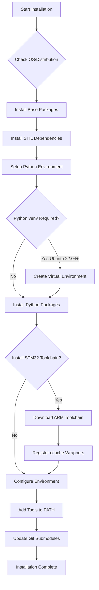
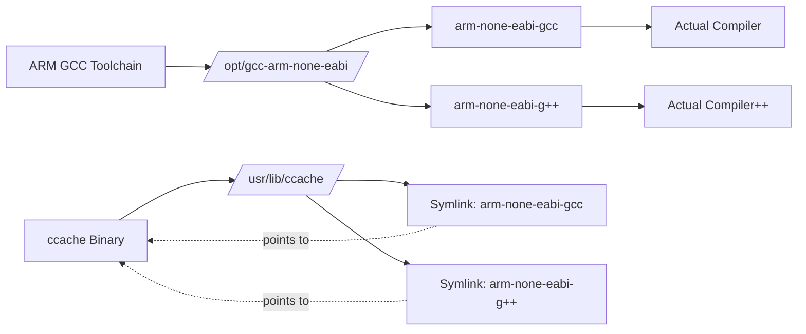

# ArduPilot Development Environment Setup

## Overview

This directory contains automated installation scripts for setting up a complete ArduPilot development environment across multiple operating systems. These scripts install all necessary dependencies including ARM cross-compilation toolchains, Python packages, build tools, SITL simulation libraries, and optional ROS integration. The scripts support both interactive and non-interactive (CI/CD) installation modes.

**Supported Platforms:**
- Ubuntu 20.04 (Focal), 22.04 (Jammy), 24.04 (Noble), and compatible distributions (Linux Mint, Debian, elementary OS)
- macOS with Homebrew
- Windows via Cygwin or WSL
- Arch Linux
- Alpine Linux (minimal/Docker)
- openSUSE Tumbleweed

## Quick Start

### Ubuntu / Debian / Linux Mint

```bash
cd ardupilot
Tools/environment_install/install-prereqs-ubuntu.sh -y
```

The `-y` flag assumes "yes" to all prompts for automated installation. Omit for interactive mode.

### macOS

```bash
cd ardupilot
Tools/environment_install/install-prereqs-mac.sh -y
```

### Windows (Cygwin)

Run in PowerShell as Administrator:
```powershell
cd ardupilot
.\Tools\environment_install\install-prereqs-windows.ps1
```

### Windows (WSL - Windows Subsystem for Linux)

Install WSL with Ubuntu, then follow Ubuntu instructions above.

### Arch Linux

```bash
cd ardupilot
Tools/environment_install/install-prereqs-arch.sh -y
```

### Alpine Linux (Docker)

```bash
cd ardupilot
Tools/environment_install/install-prereqs-alpine.sh
```

### openSUSE Tumbleweed

```bash
cd ardupilot
Tools/environment_install/install-prereqs-openSUSE-Tumbleweed.sh -y
```

## Architecture

### Installation Flow



### Toolchain Registration with ccache



## Detailed Component Documentation

### install-prereqs-ubuntu.sh

**Purpose**: Complete development environment setup for Ubuntu/Debian-based distributions.

**Source**: `Tools/environment_install/install-prereqs-ubuntu.sh`

**Supported Distributions**:
- Ubuntu: focal (20.04), jammy (22.04), noble (24.04), oracular, plucky
- Debian: bookworm, bullseye
- Linux Mint: Automatic translation to Ubuntu equivalents
- elementary OS: Automatic translation

**Command-Line Options**:
- `-y`: Assume yes to all prompts (non-interactive mode)
- `-q`: Quiet mode (minimize output)

**Environment Variables**:
- `SKIP_AP_EXT_ENV=1`: Skip optional Python packages (pygame, intelhex)
- `SKIP_AP_GRAPHIC_ENV=1`: Skip graphical packages (matplotlib, opencv, wxPython)
- `SKIP_AP_COV_ENV=1`: Skip coverage tools (lcov, gcovr)
- `SKIP_AP_COMPLETION_ENV=1`: Skip bash completion setup
- `SKIP_AP_GIT_CHECK=1`: Skip git submodule update
- `DO_AP_STM_ENV=1`: Automatically install STM32 toolchain without prompt
- `DO_PYTHON_VENV_ENV=1`: Automatically activate venv in shell profile

**Package Categories Installed**:

1. **Base Packages** (Source: Lines 186):
   - `build-essential`: Core C/C++ compilation tools
   - `ccache`: Compiler cache for faster rebuilds
   - `g++`: C++ compiler
   - `gawk`: Text processing (required by waf)
   - `git`: Version control
   - `make`, `wget`: Build tools
   - `valgrind`: Memory debugging
   - `screen`: Terminal multiplexer
   - `python3-pexpect`: Process automation
   - `astyle`: Code formatting

2. **Python Packages** (Source: Lines 187-188):
   - `future`, `lxml`: Python compatibility libraries
   - `pymavlink`: MAVLink protocol library
   - `MAVProxy`: Ground control station
   - `pyserial`: Serial port communication
   - `geocoder`: Geolocation services
   - `empy==3.3.4`: Template processor (pinned version for waf compatibility)
   - `ptyprocess`: Pseudoterminal utilities
   - `dronecan`: DroneCAN/UAVCAN protocol
   - `flake8`: Python linting
   - `junitparser`: Test result parsing
   - `wsproto`, `tabulate`: MAVProxy dependencies

3. **SITL Simulation Packages** (Source: Lines 206-224):
   - `libsfml-dev`, `libsfml-*`: SFML library (graphics/audio for simulation)
   - `libcsfml-dev`, `libcsfml-*`: C bindings for SFML
   - `python3-matplotlib`: Plotting library
   - `python3-scipy`: Scientific computing
   - `python3-opencv`: Computer vision
   - `python3-yaml`: YAML configuration parsing
   - `python3-wxgtk4.0`: GUI framework for MAVProxy
   - `xterm`, `xfonts-base`: Terminal emulator for debugging

4. **ARM Cross-Compilation** (Source: Lines 194):
   - `g++-arm-linux-gnueabihf`: ARM Linux cross-compiler
   - `pkg-config-arm-linux-gnueabihf`: Cross-compilation pkg-config

5. **Coverage Tools** (Source: Lines 228):
   - `lcov`: Line coverage visualization
   - `gcovr`: Coverage report generation

**ARM Toolchain Installation**:

The script installs the official ArduPilot ARM toolchain for STM32 board compilation (Source: Lines 232-277):

- **Toolchain Version**: `gcc-arm-none-eabi-10-2020-q4-major`
- **Installation Location**: `/opt/gcc-arm-none-eabi-10-2020-q4-major/`
- **Supported Architectures**:
  - `x86_64`: Intel/AMD 64-bit (most desktops/laptops)
  - `aarch64`: ARM 64-bit (Raspberry Pi 4, Apple Silicon via Rosetta)
- **Download Source**: `https://firmware.ardupilot.org/Tools/STM32-tools/`

After installation, the script creates symbolic links to enable ccache acceleration for ARM compilation (Source: Lines 252-254, 272-274):
```bash
sudo ln -s -f /usr/bin/ccache /usr/lib/ccache/arm-none-eabi-g++
sudo ln -s -f /usr/bin/ccache /usr/lib/ccache/arm-none-eabi-gcc
```

**Python Virtual Environment** (Ubuntu 22.04+):

On Ubuntu 22.04 (Jammy) and later, Python packages are installed in a virtual environment to comply with PEP 668 (Source: Lines 420-452):

- **Location**: `$HOME/venv-ardupilot`
- **Created with**: `python3 -m venv --system-site-packages $HOME/venv-ardupilot`
- **System-site-packages**: Enabled to access system-installed packages like numpy, scipy
- **Activation**: `source $HOME/venv-ardupilot/bin/activate`
- **Auto-activation**: Optionally added to `.profile` or `.ardupilot_env`

**User Permissions** (Source: Lines 292-293):
```bash
sudo usermod -a -G dialout $USER
```
Adds user to `dialout` group for serial port access (required for uploading firmware and connecting to flight controllers).

**Conflicting Package Removal** (Source: Lines 496-503):

The script removes packages that interfere with firmware uploading:
- `modemmanager`: Interferes with serial port communication to flight controllers
- `brltty`: Braille display software that claims USB serial devices

**PATH Configuration** (Source: Lines 510-557):

The script offers to add the following to your PATH (stored in `.profile`, `.bashrc`, or `.ardupilot_env`):
1. ARM toolchain: `/opt/gcc-arm-none-eabi-10-2020-q4-major/bin`
2. ArduPilot tools: `<ardupilot>/Tools/autotest`
3. Bash completion: `<ardupilot>/Tools/completion/completion.bash`
4. ccache: `/usr/lib/ccache` (prepended for compiler acceleration)

**Docker Detection** (Source: Lines 404-416):

The script detects Docker/container environments and adjusts configuration:
- Environment variables written to `.ardupilot_env` instead of `.profile`
- `.ardupilot_env` sourced from `.bashrc` for Docker
- No interactive prompts in Docker environments

**Usage Examples**:

Interactive installation with all components:
```bash
./Tools/environment_install/install-prereqs-ubuntu.sh
```

Non-interactive installation for CI/CD:
```bash
./Tools/environment_install/install-prereqs-ubuntu.sh -y
```

Skip graphical environment (headless server):
```bash
SKIP_AP_GRAPHIC_ENV=1 ./Tools/environment_install/install-prereqs-ubuntu.sh -y
```

Install STM32 toolchain automatically:
```bash
DO_AP_STM_ENV=1 ./Tools/environment_install/install-prereqs-ubuntu.sh -y
```

### install-prereqs-mac.sh

**Purpose**: Development environment setup for macOS using Homebrew.

**Source**: `Tools/environment_install/install-prereqs-mac.sh`

**Prerequisites**:
- macOS 10.15 (Catalina) or later recommended
- Xcode Command Line Tools
- Homebrew package manager (script will install if missing)

**Command-Line Options**:
- `-y`: Assume yes to all prompts (non-interactive mode)

**Shell Support**:
The script detects your shell and configures appropriately (Source: Lines 11-20):
- **bash**: Uses `.bash_profile` and `completion.bash`
- **zsh**: Uses `.zshrc` and `completion.zsh`

**Installation Steps**:

1. **Homebrew Installation** (Source: Lines 41-47):
   ```bash
   /usr/bin/env bash -c "$(curl -fsSL https://raw.githubusercontent.com/Homebrew/install/HEAD/install.sh)"
   ```

2. **Xcode Command Line Tools** (Source: Lines 50-59):
   ```bash
   xcode-select --install
   ```

3. **Core Utilities** (Source: Lines 108-109):
   - `gawk`: GNU awk (macOS awk lacks features)
   - `coreutils`: GNU core utilities (provides `grealpath`)
   - `wget`: File downloading

4. **Python Management via pyenv** (Optional, Source: Lines 112-142):
   - Installs `pyenv` version manager
   - Pins to pyenv v2.3.12
   - Installs Python 3.10.4 with framework support (required for some packages)
   - Configures shell initialization

5. **ccache** (Source: Lines 149-158):
   - Installed via Homebrew
   - PATH configured to `/usr/local/opt/ccache/libexec`

6. **ARM STM32 Toolchain** (Source: Lines 62-85):
   - **Version**: `gcc-arm-none-eabi-10-2020-q4-major`
   - **Installation Location**: `/opt/gcc-arm-none-eabi-10-2020-q4-major/`
   - **Download Source**: `https://firmware.ardupilot.org/Tools/STM32-tools/gcc-arm-none-eabi-10-2020-q4-major-mac.tar.bz2`
   - **ccache Registration** (Source: Lines 80-83):
     ```bash
     sudo ln -s -f /usr/local/bin/ccache /usr/local/opt/ccache/libexec/arm-none-eabi-g++
     sudo ln -s -f /usr/local/bin/ccache /usr/local/opt/ccache/libexec/arm-none-eabi-gcc
     ```

7. **Python Packages** (Source: Lines 164-176):
   - Installed via pip3
   - Same core packages as Ubuntu (pymavlink, MAVProxy, etc.)
   - `wxPython`: GUI framework (takes ~30 minutes to compile on macOS)
   - `gnureadline`: Better readline support for Python

**macOS-Specific Considerations**:

- **GitHub Actions Conflicts** (Source: Lines 100-105):
  The script removes conflicting Python symlinks created by GitHub Actions in `/usr/local/bin` to prevent Homebrew upgrade failures.

- **Realpath Alternative** (Source: Lines 180-181):
  macOS `realpath` is replaced with GNU `grealpath` from coreutils.

**Usage Examples**:

Interactive installation:
```bash
./Tools/environment_install/install-prereqs-mac.sh
```

Non-interactive installation:
```bash
./Tools/environment_install/install-prereqs-mac.sh -y
```

Skip graphical environment:
```bash
SKIP_AP_GRAPHIC_ENV=1 ./Tools/environment_install/install-prereqs-mac.sh -y
```

### install-prereqs-windows.ps1

**Purpose**: Development environment setup for native Windows using Cygwin.

**Source**: `Tools/environment_install/install-prereqs-windows.ps1`

**Prerequisites**:
- Windows 10 or later
- PowerShell 5.1 or later
- Administrator privileges
- Internet connection

**Components Installed**:

1. **MAVProxy** (Source: Lines 7-8):
   - Latest Windows installer from `https://firmware.ardupilot.org/Tools/MAVProxy/`
   - Silent installation: `MAVProxySetup-latest.exe /SILENT`

2. **Cygwin x64** (Source: Lines 10-11, 16-17):
   - Base installation: `C:\cygwin64`
   - Mirror: `http://cygwin.mirror.constant.com`
   - **Packages Installed**:
     - `autoconf`, `automake`: Build system tools
     - `ccache`: Compiler cache
     - `cygwin32-gcc-g++`: 32-bit cross-compiler
     - `gcc-g++=7.4.0-1`, `gcc-core=7.4.0-1`: Pinned GCC version for compatibility
     - `git`: Version control
     - `libtool`, `make`, `gawk`: Build tools
     - `libexpat-devel`, `libxml2-devel`, `libxslt-devel`: XML libraries
     - `python39`, `python39-devel`, `python39-pip`: Python 3.9
     - `python39-future`, `python39-lxml`: Python libraries
     - `procps-ng`: Process utilities
     - `zip`, `gdb`, `ddd`: Development tools
     - `xterm`: Terminal emulator

3. **Python Packages in Cygwin** (Source: Lines 19-20):
   ```bash
   python3.9 -m pip install empy==3.3.4 pyserial pymavlink intelhex dronecan pexpect
   ```

4. **ARM GCC Toolchain** (Source: Lines 13-14, 22-23):
   - **Version**: `gcc-arm-none-eabi-10-2020-q4-major`
   - Windows native installer (not Cygwin-based)
   - Silent installation: `/S /P /R` flags

**Usage**:

Run in PowerShell as Administrator:
```powershell
cd ardupilot
.\Tools\environment_install\install-prereqs-windows.ps1
```

**Post-Installation**:

After installation, use Cygwin terminal for ArduPilot development:
1. Launch `C:\cygwin64\bin\mintty.exe`
2. Navigate to ArduPilot directory (Windows drives mapped as `/cygdrive/c/`, etc.)
3. Build firmware using waf

**Alternative: Windows Subsystem for Linux (WSL)**:

WSL2 with Ubuntu is the recommended Windows development environment. Follow Ubuntu setup instructions after installing WSL:

```powershell
#### Install WSL with Ubuntu
wsl --install -d Ubuntu-22.04
```

Then inside WSL:
```bash
./Tools/environment_install/install-prereqs-ubuntu.sh -y
```

### install-prereqs-arch.sh

**Purpose**: Development environment setup for Arch Linux.

**Source**: `Tools/environment_install/install-prereqs-arch.sh`

**Command-Line Options**:
- `-y`: Assume yes to all prompts (non-interactive mode)
- `-q`: Quiet mode

**Package Categories**:

1. **Base Packages** (Source: Line 25):
   - `base-devel`: Arch meta-package (gcc, make, autoconf, etc.)
   - `ccache`: Compiler cache
   - `git`: Version control
   - `gsfonts`: Ghostscript fonts
   - `tk`: Tk GUI toolkit
   - `wget`: File downloading
   - `gcc`: C compiler

2. **SITL Packages** (Source: Line 26):
   - `python-pip`, `python-setuptools`, `python-wheel`: Python packaging
   - `python-wxpython`: GUI framework
   - `opencv`: Computer vision library
   - `python-numpy`, `python-scipy`: Scientific computing

3. **PX4 Packages** (Source: Line 27):
   - `lib32-glibc`: 32-bit library support
   - `zip`, `zlib`, `ncurses`: Utilities and libraries

4. **Python Packages** (Source: Line 29):
   - Same core packages as Ubuntu
   - Installed in virtual environment (see below)

**Python Virtual Environment** (Source: Lines 58-72):

Arch Linux requires virtual environment for Python packages:
- **Creation**: `python3 -m venv --system-site-packages $HOME/venv-ardupilot`
- **System-site-packages**: Enabled to access pacman-installed packages
- **Activation**: `source $HOME/venv-ardupilot/bin/activate`
- **Optional auto-activation** in `.bashrc`

**ARM Toolchain Installation** (Source: Lines 86-117):

- **Version**: `gcc-arm-none-eabi-10-2020-q4-major-x86_64-linux.tar.bz2`
- **Checksum Verification** (Source: Lines 90-105):
  ```bash
  ARM_TARBALL_CHECKSUM="21134caa478bbf5352e239fbc6e2da3038f8d2207e089efc96c3b55f1edcd618"
  ```
  Script verifies SHA256 checksum before extraction
- **Installation Location**: `/opt/gcc-arm-none-eabi-10-2020-q4-major/`

**ccache Configuration** (Source: Lines 76-84):

Symbolic links created in `/usr/lib/ccache/`:
```bash
sudo ln -s /usr/bin/ccache arm-none-eabi-g++
sudo ln -s /usr/bin/ccache arm-none-eabi-gcc
```

**User Permissions** (Source: Line 54):
```bash
sudo usermod -a -G uucp "$USER"
```
Adds user to `uucp` group (Arch equivalent of `dialout`) for serial port access.

**Usage Examples**:

Interactive installation:
```bash
./Tools/environment_install/install-prereqs-arch.sh
```

Non-interactive installation:
```bash
./Tools/environment_install/install-prereqs-arch.sh -y
```

### install-prereqs-alpine.sh

**Purpose**: Minimal development environment setup for Alpine Linux, primarily for Docker containers.

**Source**: `Tools/environment_install/install-prereqs-alpine.sh`

**Warning**: This script is not fully tested (Source: Lines 6-8).

**Packages Installed** (Source: Lines 11-20):

- `linux-headers`: Kernel headers for compilation
- `g++`: C++ compiler
- `python3`: Python interpreter
- `py-future`: Python future library
- `py-pip`: Python package installer
- `libxml2-dev`, `libxslt-dev`: XML processing libraries
- `git`: Version control

**Python Packages** (Source: Line 22):
```bash
python3 -m pip install --user --no-deps --no-cache-dir empy==3.3.4 pexpect ptyprocess --break-system-packages
```

- `--user`: Install to user directory
- `--no-deps`: Skip dependencies (provided by system packages)
- `--no-cache-dir`: Minimize Docker layer size
- `--break-system-packages`: Override PEP 668 protection (acceptable in containers)

**Use Cases**:

- Docker-based CI/CD pipelines
- Lightweight SITL simulation containers
- Minimal build environments

**Docker Example**:

```dockerfile
FROM alpine:latest
COPY Tools/environment_install/install-prereqs-alpine.sh /tmp/
RUN /tmp/install-prereqs-alpine.sh
```

### install-prereqs-openSUSE-Tumbleweed.sh

**Purpose**: Development environment setup for openSUSE Tumbleweed (rolling release).

**Source**: `Tools/environment_install/install-prereqs-openSUSE-Tumbleweed.sh`

**Command-Line Options**:
- `-y`: Assume yes to all prompts
- `-q`: Quiet mode

**Package Manager**: `zypper` with `--no-recommends` flag (Source: Lines 34-37)

**Package Categories**:

1. **Base Packages** (Source: Line 59):
   - `patterns-devel-base-devel_basis`: Development tools meta-pattern
   - `ccache`: Compiler cache
   - `git`, `axel`: Version control and downloading
   - `valgrind`, `screen`: Development utilities
   - `gcc-c++`: C++ compiler
   - `xterm`: Terminal emulator
   - `free-ttf-fonts`: Fonts
   - `sfml2-devel`: SFML library for SITL
   - `zip`, `rsync`: Utilities
   - `glibc-devel-static`: Static C library

2. **SITL Packages** (Source: Line 60):
   - Python packages with version-specific naming (e.g., `python311-pip`)
   - Dynamically determined based on active Python version
   - `wxPython`, `opencv`, `numpy`, `scipy`, `matplotlib`: Scientific/GUI packages

3. **Python Packages** (Source: Lines 62-63):
   - Core ArduPilot packages
   - Installed in virtual environment

**Python Virtual Environment** (Source: Lines 91-108):

- **Location**: `$HOME/venv-ardupilot`
- **Activation**: `source $HOME/venv-ardupilot/bin/activate`
- **Configuration**: `.profile` or `.bashrc`

**Dual ARM Toolchains** (Source: Lines 65-72, 126-142):

openSUSE script installs TWO ARM toolchains:

1. **ARM None-EABI** (bare metal):
   - **Version**: `gcc-arm-none-eabi-10-2020-q4-major-x86_64-linux.tar.bz2`
   - **Use**: STM32 board compilation
   - **Location**: `/opt/gcc-arm-none-eabi-10-2020-q4-major/`

2. **ARM Linux GNUEABIHF**:
   - **Version**: `gcc-linaro-7.5.0-2019.12-x86_64_arm-linux-gnueabihf`
   - **Use**: Linux ARM targets (e.g., BeagleBone, older Raspberry Pi)
   - **Location**: `/opt/gcc-linaro-7.5.0-2019.12-x86_64_arm-linux-gnueabihf/`

**ccache Configuration** (Source: Lines 114-124):

- Symbolic links in `/usr/lib64/ccache/`
- Advanced ccache settings:
  ```bash
  ccache --set-config sloppiness=file_macro,locale,time_macros
  ccache --set-config ignore_options="--specs=nano.specs --specs=nosys.specs"
  ```
  These settings improve cache hit rates for embedded compilation.

**User Permissions** (Source: Line 87):
```bash
sudo usermod -a -G dialout "$USER"
```

**Conflicting Packages** (Source: Lines 144-151):

Removes `ModemManager` and `brltty` (same as Ubuntu script).

**Usage Examples**:

Interactive installation:
```bash
./Tools/environment_install/install-prereqs-openSUSE-Tumbleweed.sh -y
```

### install-ROS-ubuntu.sh

**Purpose**: Install ROS 1 (Robot Operating System) with MAVROS for ArduPilot integration.

**Source**: `Tools/environment_install/install-ROS-ubuntu.sh`

**Supported ROS Distributions**:
- **ROS Noetic**: Ubuntu 20.04 (Focal) only
- **ROS 2**: Not currently supported by this script

**Command-Line Options**:
- `-p | --package <name>`: Specify ROS packages to install (can be used multiple times)
- `-h | --help`: Display usage information

**Default Installation**: `desktop-full` (Source: Lines 114-116)

**Base Package Options**:
- `ros-base`: Minimal ROS installation (no GUI tools)
- `desktop`: ROS with rqt and rviz visualization
- `desktop-full`: Complete ROS with simulators and additional tools

**Installation Components**:

1. **ROS Repository Setup** (Source: Lines 146-156):
   ```bash
   sudo sh -c 'echo "deb http://packages.ros.org/ros/ubuntu $(lsb_release -sc) main" > /etc/apt/sources.list.d/ros-latest.list'
   sudo apt-key adv --keyserver 'hkp://keyserver.ubuntu.com:80' --recv-key C1CF6E31E6BADE8868B172B4F42ED6FBAB17C654
   ```

2. **MAVROS** (MAVLink-ROS Bridge) (Source: Lines 175-179):
   - `ros-noetic-mavros`: MAVROS core
   - Geographic datasets installation:
     ```bash
     wget https://raw.githubusercontent.com/mavlink/mavros/master/mavros/scripts/install_geographiclib_datasets.sh
     sudo bash ./install_geographiclib_datasets.sh
     ```

3. **rosdep** (Dependency Manager) (Source: Lines 190-202):
   ```bash
   sudo apt install python3-rosdep
   sudo rosdep init
   rosdep update
   ```

4. **ROS Development Tools** (Source: Line 216):
   - `python3-rosinstall`: ROS package installation tool
   - `python3-rosinstall-generator`: Generate rosinstall files
   - `python3-wstool`: Workspace management
   - `python3-catkin-tools`: Build system

5. **ArduPilot-ROS Workspace** (Optional, Source: Lines 218-239):
   - **Location**: `$HOME/ardupilot-ws`
   - **Contains**: `ardupilot_ros` package
   - Initialized with `catkin init`
   - Built with `catkin build`

6. **Gazebo Integration** (Optional, Source: Lines 242-263):
   - **Location**: `$HOME/ardupilot_gz_ws`
   - **Component**: `ardupilot_gazebo` plugin
   - **Dependencies**: `gz-garden`, `rapidjson-dev`
   - **Build**: CMake-based
   - **Environment**: `GZ_SIM_SYSTEM_PLUGIN_PATH` and `GZ_SIM_RESOURCE_PATH` configured

**Environment Configuration** (Source: Lines 206-212):

Optional configuration added to `.bashrc`:
```bash
ROS_HOSTNAME=$HOSTNAME.local
ROS_MASTER_URI=http://$HOSTNAME.local:11311
source /opt/ros/noetic/setup.bash
source $HOME/ardupilot-ws/devel/setup.bash
```

**Usage Examples**:

Install default (desktop-full):
```bash
./Tools/environment_install/install-ROS-ubuntu.sh
```

Install minimal ROS:
```bash
./Tools/environment_install/install-ROS-ubuntu.sh -p ros-base
```

Install desktop with additional packages:
```bash
./Tools/environment_install/install-ROS-ubuntu.sh -p desktop -p ros-noetic-gazebo-ros-pkgs
```

**ROS with ArduPilot Workflow**:

After installation:
1. Source ROS environment: `source ~/ardupilot-ws/devel/setup.bash`
2. Launch SITL: `sim_vehicle.py -v ArduCopter --console --map`
3. In another terminal, launch MAVROS:
   ```bash
   roslaunch mavros apm.launch fcu_url:=udp://:14550@
   ```
4. Use ROS tools to interact with ArduPilot via MAVLink

### APM_install.sh

**Purpose**: Simple script to clone ArduPilot repository and configure for SITL in Cygwin environment.

**Source**: `Tools/environment_install/APM_install.sh`

**Operations**:

1. **Clone Repository** (Source: Line 5):
   ```bash
   git clone git://github.com/ArduPilot/ardupilot.git
   ```

2. **Initialize Submodules** (Source: Lines 6-7):
   ```bash
   cd ./ardupilot
   git submodule update --init --recursive
   ```

3. **Configure for SITL** (Source: Line 8):
   ```bash
   ./modules/waf/waf-light configure --board=sitl
   ```

**Usage Context**:

This script is typically used after running `install-prereqs-windows.ps1` in Cygwin environment:

```bash
#### In Cygwin terminal
cd /cygdrive/c/Users/YourName/
./APM_install.sh
```

**Alternative for Existing Repository**:

If you already have ArduPilot cloned:
```bash
cd ardupilot
git submodule update --init --recursive
./waf configure --board=sitl
```

## IDE Setup Guides

### Visual Studio Code

**Recommended Extensions**:

1. **C/C++ (Microsoft)** - `ms-vscode.cpptools`
   - IntelliSense for C/C++ code navigation
   - Debugging support with gdb

2. **Python** - `ms-python.python`
   - Python IntelliSense and debugging
   - Required for Python-based tools (sim_vehicle.py, autotest)

3. **Cortex-Debug** - `marus25.cortex-debug`
   - ARM Cortex-M debugging
   - Integrates with OpenOCD and Black Magic Probe
   - Essential for on-target STM32 debugging

4. **GitLens** - `eamodio.gitlens`
   - Enhanced git integration
   - Blame annotations and repository insights

5. **Doxygen Documentation Generator** - `cschlosser.doxdocgen`
   - Auto-generate Doxygen comment blocks

**Workspace Configuration**:

Create `.vscode/c_cpp_properties.json` in ArduPilot root:

```json
{
    "configurations": [
        {
            "name": "Linux",
            "includePath": [
                "${workspaceFolder}/**",
                "/opt/gcc-arm-none-eabi-10-2020-q4-major/arm-none-eabi/include"
            ],
            "defines": [
                "HAL_BOARD_SITL=3"
            ],
            "compilerPath": "/usr/bin/g++",
            "cStandard": "gnu11",
            "cppStandard": "gnu++14",
            "intelliSenseMode": "linux-gcc-x64",
            "configurationProvider": "ms-vscode.makefile-tools"
        }
    ],
    "version": 4
}
```

**Launch Configuration for Debugging**:

Create `.vscode/launch.json`:

```json
{
    "version": "0.2.0",
    "configurations": [
        {
            "name": "Debug SITL (GDB)",
            "type": "cppdbg",
            "request": "launch",
            "program": "${workspaceFolder}/build/sitl/bin/arducopter",
            "args": [
                "-S",
                "--model", "quad",
                "--speedup", "1",
                "--defaults", "Tools/autotest/default_params/copter.parm"
            ],
            "stopAtEntry": false,
            "cwd": "${workspaceFolder}",
            "environment": [],
            "externalConsole": false,
            "MIMode": "gdb",
            "setupCommands": [
                {
                    "description": "Enable pretty-printing for gdb",
                    "text": "-enable-pretty-printing",
                    "ignoreFailures": true
                }
            ],
            "preLaunchTask": "build",
            "miDebuggerPath": "/usr/bin/gdb"
        }
    ]
}
```

**Tasks Configuration**:

Create `.vscode/tasks.json`:

```json
{
    "version": "2.0.0",
    "tasks": [
        {
            "label": "build",
            "type": "shell",
            "command": "./waf",
            "args": ["copter"],
            "group": {
                "kind": "build",
                "isDefault": true
            },
            "problemMatcher": ["$gcc"],
            "presentation": {
                "reveal": "always",
                "panel": "shared"
            }
        },
        {
            "label": "configure",
            "type": "shell",
            "command": "./waf",
            "args": ["configure", "--board=sitl"],
            "problemMatcher": []
        }
    ]
}
```

**Usage**:

1. Open ArduPilot folder: `File` → `Open Folder` → Select `ardupilot`
2. Install recommended extensions when prompted
3. Build: `Ctrl+Shift+B` (or `Cmd+Shift+B` on macOS)
4. Debug: `F5` (starts SITL with debugger attached)

### CLion

**Prerequisites**:
- CLion 2021.3 or later
- ARM Embedded GCC plugin (optional, for STM32 development)

**Project Setup**:

1. **Open as CMake Project** (via waf wrapper):

   Create `CMakeLists.txt` in ArduPilot root:
   ```cmake
   cmake_minimum_required(VERSION 3.16)
   project(ArduPilot)
   
   set(CMAKE_CXX_STANDARD 14)
   
   # Add all source directories
   include_directories(
       libraries
       libraries/AP_HAL
       libraries/AP_HAL_Linux
       build/sitl/libraries
   )
   
   # Recursively find all source files
   file(GLOB_RECURSE SOURCES
       "libraries/*.cpp"
       "libraries/*.c"
       "ArduCopter/*.cpp"
   )
   
   add_executable(arducopter ${SOURCES})
   ```

2. **Configure Toolchains**:
   
   `File` → `Settings` → `Build, Execution, Deployment` → `Toolchains`
   
   Add toolchain:
   - **Name**: ARM GCC
   - **CMake**: System CMake
   - **Make**: System Make
   - **C Compiler**: `/opt/gcc-arm-none-eabi-10-2020-q4-major/bin/arm-none-eabi-gcc`
   - **C++ Compiler**: `/opt/gcc-arm-none-eabi-10-2020-q4-major/bin/arm-none-eabi-g++`

3. **External Tools for waf**:

   `File` → `Settings` → `Tools` → `External Tools` → `+`
   
   **Configure SITL**:
   - Name: `waf configure`
   - Program: `$ProjectFileDir$/waf`
   - Arguments: `configure --board=sitl`
   - Working directory: `$ProjectFileDir$`
   
   **Build Copter**:
   - Name: `waf copter`
   - Program: `$ProjectFileDir$/waf`
   - Arguments: `copter`
   - Working directory: `$ProjectFileDir$`

4. **Run/Debug Configuration**:

   `Run` → `Edit Configurations` → `+` → `CMake Application`
   
   - **Name**: SITL Copter
   - **Target**: arducopter
   - **Executable**: `build/sitl/bin/arducopter`
   - **Program arguments**: `-S --model quad --speedup 1 --defaults Tools/autotest/default_params/copter.parm`
   - **Working directory**: `$ProjectFileDir$`

**Embedded Debugging (STM32)**:

1. Install **ARM Embedded GCC** plugin
2. Configure OpenOCD:
   - `Run` → `Edit Configurations` → `+` → `OpenOCD Download & Run`
   - **Executable**: `build/<board>/bin/arducopter.elf`
   - **Board config file**: Select appropriate OpenOCD board config
   - **GDB**: `/opt/gcc-arm-none-eabi-10-2020-q4-major/bin/arm-none-eabi-gdb`

**Usage**:

1. Open project: `File` → `Open` → Select `ardupilot` folder
2. Reload CMake project if needed
3. Build via external tool: `Tools` → `External Tools` → `waf copter`
4. Run/Debug: Select configuration and click Run (Shift+F10) or Debug (Shift+F9)

## Configuration and Optimization

### ccache (Compiler Cache)

**Purpose**: Dramatically speed up recompilation by caching compiler outputs.

**Installation**: Included in all platform installation scripts.

**Configuration**:

Check current settings:
```bash
ccache -s
```

Recommended configuration for ArduPilot development:
```bash
#### Set maximum cache size (default 5GB)
ccache -M 10G

#### Enable compression to save disk space
ccache --set-config compression=true

#### Increase sloppiness for better hit rates
ccache --set-config sloppiness=file_macro,locale,time_macros

#### Ignore certain compiler flags (openSUSE example)
ccache --set-config ignore_options="--specs=nano.specs --specs=nosys.specs"
```

**Usage**:

ccache is automatically used when compiling if:
1. `/usr/lib/ccache` (or `/usr/local/opt/ccache/libexec` on macOS) is in PATH before other compiler locations
2. Symbolic links exist for compilers (created by installation scripts)

**Verification**:

```bash
#### Verify ccache is being used
which arm-none-eabi-gcc
#### Should show: /usr/lib/ccache/arm-none-eabi-gcc

#### Check cache statistics
ccache -s
```

**Statistics Interpretation**:

```bash
cache directory                     /home/user/.ccache
primary config                      /home/user/.ccache/ccache.conf
secondary config      (readonly)    /etc/ccache.conf
cache hit (direct)                 15234   # Served from cache
cache hit (preprocessed)            2341   # Served after preprocessing
cache miss                          4567   # Had to compile
```

**Cache Management**:

```bash
#### Clear cache
ccache -C

#### Show configuration
ccache -p

#### Zero statistics
ccache -z
```

### Python Virtual Environment Management

**Ubuntu 22.04+ and Arch Linux**:

Activate venv:
```bash
source $HOME/venv-ardupilot/bin/activate
```

Deactivate venv:
```bash
deactivate
```

Install additional packages:
```bash
#### Ensure venv is activated
source $HOME/venv-ardupilot/bin/activate
pip install package-name
```

**Verify venv is active**:
```bash
which python3
#### Should show: /home/user/venv-ardupilot/bin/python3
```

**System-site-packages Access**:

The venv is created with `--system-site-packages` flag, allowing access to system-installed packages:
```bash
python3 -c "import numpy; print(numpy.__file__)"
#### May show system path: /usr/lib/python3/dist-packages/numpy/__init__.py
```

### PATH Configuration

**Verify correct PATH ordering**:

```bash
echo $PATH | tr ':' '\n'
```

Expected order:
1. `/usr/lib/ccache` or `/usr/local/opt/ccache/libexec` (ccache first)
2. `/opt/gcc-arm-none-eabi-10-2020-q4-major/bin` (ARM toolchain)
3. `<ardupilot>/Tools/autotest` (ArduPilot tools)
4. System paths (`/usr/bin`, etc.)

**Manual PATH configuration**:

If installation script didn't configure PATH, add to `.profile` or `.bashrc`:

```bash
#### ARM toolchain
export PATH=/opt/gcc-arm-none-eabi-10-2020-q4-major/bin:$PATH

#### ArduPilot tools
export PATH=$HOME/ardupilot/Tools/autotest:$PATH

#### ccache (must be before other compilers)
export PATH=/usr/lib/ccache:$PATH

#### Python venv (optional auto-activation)
source $HOME/venv-ardupilot/bin/activate
```

## Troubleshooting

### Common Issues and Solutions

#### Issue: "Permission denied" on serial ports

**Symptom**:
```
Failed to connect to /dev/ttyUSB0: Permission denied
```

**Cause**: User not in `dialout` (Ubuntu) or `uucp` (Arch) group.

**Solution**:
```bash
#### Ubuntu/Debian
sudo usermod -a -G dialout $USER

#### Arch Linux
sudo usermod -a -G uucp $USER

#### Log out and log back in for group change to take effect
```

**Verification**:
```bash
groups | grep -E 'dialout|uucp'
```

#### Issue: modemmanager interfering with flight controller

**Symptom**: Flight controller disconnects randomly or fails to upload firmware.

**Cause**: ModemManager probes serial devices and disrupts communication.

**Solution**:
```bash
#### Ubuntu/Debian
sudo apt-get remove modemmanager

#### openSUSE
sudo zypper rm ModemManager

#### Verify removal
ps aux | grep -i modem
```

#### Issue: ARM toolchain not found

**Symptom**:
```
arm-none-eabi-gcc: command not found
```

**Cause**: Toolchain not in PATH or not installed.

**Solution**:
```bash
#### Verify installation
ls /opt/gcc-arm-none-eabi-10-2020-q4-major/bin/

#### If exists, add to PATH
export PATH=/opt/gcc-arm-none-eabi-10-2020-q4-major/bin:$PATH

#### Make permanent (add to .profile or .bashrc)
echo 'export PATH=/opt/gcc-arm-none-eabi-10-2020-q4-major/bin:$PATH' >> ~/.profile

#### If not installed, run installation script with STM32 toolchain option
DO_AP_STM_ENV=1 ./Tools/environment_install/install-prereqs-ubuntu.sh -y
```

#### Issue: ccache not accelerating builds

**Symptom**: Build times don't improve on subsequent compilations.

**Cause**: ccache not in PATH before real compilers, or cache disabled.

**Solution**:
```bash
#### Verify ccache is found first
which arm-none-eabi-gcc
#### Should show: /usr/lib/ccache/arm-none-eabi-gcc
#### Not: /opt/gcc-arm-none-eabi-.../bin/arm-none-eabi-gcc

#### If wrong, adjust PATH
export PATH=/usr/lib/ccache:$PATH

#### Verify symbolic links exist
ls -l /usr/lib/ccache/arm-none-eabi-*

#### If missing, create links
sudo ln -s $(which ccache) /usr/lib/ccache/arm-none-eabi-gcc
sudo ln -s $(which ccache) /usr/lib/ccache/arm-none-eabi-g++

#### Check ccache is enabled
ccache -s
```

#### Issue: Python packages conflict with system packages (Ubuntu 22.04+)

**Symptom**:
```
error: externally-managed-environment
```

**Cause**: PEP 668 prevents system-wide pip installations on Ubuntu 22.04+.

**Solution**: Use virtual environment (should be created automatically by installation script):
```bash
#### Check if venv exists
ls $HOME/venv-ardupilot

#### If not, create manually
python3 -m venv --system-site-packages $HOME/venv-ardupilot

#### Activate
source $HOME/venv-ardupilot/bin/activate

#### Install packages
pip install pymavlink MAVProxy
```

#### Issue: SITL fails to start with "cannot open shared object file"

**Symptom**:
```
error while loading shared libraries: libsfml-graphics.so.2.5: cannot open shared object file
```

**Cause**: SFML libraries not installed or wrong version.

**Solution**:
```bash
#### Ubuntu - Reinstall SFML
sudo apt install --reinstall libsfml-dev libsfml-graphics2.5

#### Verify library exists
ldconfig -p | grep sfml

#### If still missing, add library path
export LD_LIBRARY_PATH=/usr/lib/x86_64-linux-gnu:$LD_LIBRARY_PATH
```

#### Issue: Git submodule update fails

**Symptom**:
```
fatal: unable to access 'https://github.com/...': Failed to connect
```

**Cause**: Network issues, firewall, or proxy configuration.

**Solutions**:

1. **Switch to SSH URLs**:
   ```bash
   git config --global url."git@github.com:".insteadOf "https://github.com/"
   ```

2. **Use shallow clone** (faster, less data):
   ```bash
   git submodule update --init --recursive --depth 1
   ```

3. **Configure proxy** (if behind corporate firewall):
   ```bash
   git config --global http.proxy http://proxy.example.com:8080
   ```

#### Issue: Build fails with "waf: command not found"

**Symptom**:
```
./waf: No such file or directory
```

**Cause**: Not in ArduPilot root directory, or submodules not initialized.

**Solution**:
```bash
#### Navigate to ArduPilot root
cd ardupilot

#### Initialize waf submodule
git submodule update --init --recursive modules/waf

#### Verify waf exists
ls -l waf
```

#### Issue: macOS Homebrew installation conflicts

**Symptom**: Homebrew fails to install or upgrade packages due to Python conflicts.

**Cause**: GitHub Actions or other tools created conflicting symlinks in `/usr/local/bin`.

**Solution**: Remove conflicting Python links (done automatically by macOS installation script):
```bash
find /usr/local/bin -lname '*/Library/Frameworks/Python.framework/*' -delete
brew update
```

#### Issue: Windows Cygwin - ARM toolchain not recognized

**Symptom**: In Cygwin, `arm-none-eabi-gcc` not found despite installation.

**Cause**: Windows ARM toolchain installed to Windows path, not accessible in Cygwin path.

**Solution**:

Add Windows toolchain to Cygwin PATH in `~/.bashrc`:
```bash
export PATH="/cygdrive/c/Program Files (x86)/GNU Arm Embedded Toolchain/10 2020-q4-major/bin:$PATH"
```

Or use WSL instead (recommended).

#### Issue: ROS installation fails on Ubuntu 22.04

**Symptom**: ROS script exits with "Currently only ROS1 is supported."

**Cause**: ROS 1 (Noetic) only supports Ubuntu 20.04. Ubuntu 22.04 requires ROS 2.

**Solution**: Use Ubuntu 20.04 for ROS 1, or migrate to ROS 2 (not covered by this script).

#### Issue: Virtual environment activation doesn't persist

**Symptom**: After closing terminal, `python3` doesn't point to venv.

**Cause**: Activation line not added to shell profile.

**Solution**:

Add to `.bashrc` or `.profile`:
```bash
source $HOME/venv-ardupilot/bin/activate
```

Or activate manually each session:
```bash
source $HOME/venv-ardupilot/bin/activate
```

## Docker Development Environment

### ArduPilot Official Docker Images

ArduPilot provides pre-built Docker images with complete development environment:

```bash
#### Pull latest image
docker pull ardupilot/ardupilot-dev-base:latest

#### Run interactive container
docker run -it --rm -v $(pwd):/ardupilot ardupilot/ardupilot-dev-base:latest bash

#### Inside container
cd /ardupilot
./waf configure --board=sitl
./waf copter
```

### Custom Dockerfile

Create `Dockerfile` in ArduPilot root for customized environment:

```dockerfile
FROM ubuntu:22.04

#### Prevent interactive prompts
ENV DEBIAN_FRONTEND=noninteractive

#### Copy and run installation script
COPY Tools/environment_install/install-prereqs-ubuntu.sh /tmp/
RUN /tmp/install-prereqs-ubuntu.sh -y && \
    rm /tmp/install-prereqs-ubuntu.sh

#### Set up ArduPilot user
RUN useradd -m -s /bin/bash ardupilot && \
    usermod -a -G dialout ardupilot

USER ardupilot
WORKDIR /home/ardupilot

#### Clone ArduPilot (or mount as volume)
RUN git clone --recursive https://github.com/ArduPilot/ardupilot.git

#### Configure for SITL
WORKDIR /home/ardupilot/ardupilot
RUN ./waf configure --board=sitl

CMD ["/bin/bash"]
```

Build and run:
```bash
#### Build image
docker build -t ardupilot-dev .

#### Run container with source code mounted
docker run -it --rm \
    -v $(pwd):/home/ardupilot/ardupilot \
    ardupilot-dev \
    bash

#### Run SITL in container (with network access)
docker run -it --rm \
    --network=host \
    -v $(pwd):/home/ardupilot/ardupilot \
    ardupilot-dev \
    Tools/autotest/sim_vehicle.py -v ArduCopter
```

### Docker Compose for Multi-Container Setup

Create `docker-compose.yml`:

```yaml
version: '3.8'

services:
  ardupilot:
    image: ardupilot/ardupilot-dev-base:latest
    volumes:
      - .:/ardupilot
    working_dir: /ardupilot
    command: bash -c "./waf configure --board=sitl && ./waf copter"
    
  sitl:
    image: ardupilot/ardupilot-dev-base:latest
    volumes:
      - .:/ardupilot
    working_dir: /ardupilot
    network_mode: host
    command: Tools/autotest/sim_vehicle.py -v ArduCopter --console --map
    
  mavproxy:
    image: ardupilot/ardupilot-dev-base:latest
    network_mode: host
    command: mavproxy.py --master=udp:127.0.0.1:14550
```

Usage:
```bash
#### Build firmware
docker-compose run ardupilot

#### Run SITL
docker-compose up sitl
```

### CI/CD Docker Usage

GitHub Actions example:

```yaml
name: Build Firmware
on: [push, pull_request]

jobs:
  build:
    runs-on: ubuntu-latest
    container:
      image: ardupilot/ardupilot-dev-base:latest
    steps:
      - uses: actions/checkout@v3
        with:
          submodules: recursive
      
      - name: Configure
        run: ./waf configure --board=sitl
      
      - name: Build
        run: ./waf copter
```

## Platform-Specific Notes

### Ubuntu / Debian

- **Recommended Versions**: Ubuntu 22.04 LTS (Jammy) or 24.04 LTS (Noble)
- **End of Life**: Ubuntu 18.04 (Bionic) no longer supported
- **Python venv**: Required on 22.04+ due to PEP 668
- **SFML Versions**: Automatically detected and installed (2.5 or 2.6)

### macOS

- **Minimum Version**: macOS 10.15 (Catalina)
- **Apple Silicon**: Supported via Rosetta 2 for ARM toolchain
- **Homebrew**: Required - installed automatically if missing
- **pyenv**: Optional but recommended for Python version management
- **Build Time**: wxPython takes ~30 minutes to compile on first install

### Windows

- **Recommended**: WSL2 with Ubuntu (native Linux experience)
- **Cygwin**: Supported but slower than WSL
- **Native Windows**: Not officially supported (use WSL)
- **ARM Toolchain**: Windows .exe installer, not Cygwin package

### Arch Linux

- **Rolling Release**: May require script updates for package changes
- **Python venv**: Required for all Python packages
- **AUR**: Some ArduPilot users maintain AUR packages (not official)

### Alpine Linux

- **Primary Use**: Docker containers, CI/CD
- **Not Recommended**: For desktop development (minimal package set)
- **No ARM Toolchain**: Script doesn't install cross-compilers

### openSUSE Tumbleweed

- **Rolling Release**: Cutting-edge packages
- **Dual Toolchains**: Both ARM none-eabi and ARM Linux installed
- **ccache Advanced Config**: Pre-configured with optimal settings
- **Python**: Version-specific package names (automatically detected)

## Additional Resources

### Documentation

- **ArduPilot Dev Wiki**: https://ardupilot.org/dev/
- **Building ArduPilot**: https://ardupilot.org/dev/docs/building-the-code.html
- **SITL Setup**: https://ardupilot.org/dev/docs/sitl-simulator-software-in-the-loop.html
- **Hardware Debugging**: https://ardupilot.org/dev/docs/debugging.html

### Community Support

- **ArduPilot Discuss Forum**: https://discuss.ardupilot.org/
- **Discord**: https://ardupilot.org/discord
- **GitHub Issues**: https://github.com/ArduPilot/ardupilot/issues

### Toolchain Information

- **ARM GCC**: https://developer.arm.com/tools-and-software/open-source-software/developer-tools/gnu-toolchain/gnu-rm
- **ArduPilot Firmware Server**: https://firmware.ardupilot.org/Tools/STM32-tools/

### Related Scripts

- **Check Prerequisites**: `Tools/scripts/check_env.sh` - Verify environment setup
- **Build Scripts**: `Tools/scripts/` - Various helper scripts
- **Autotest**: `Tools/autotest/` - Comprehensive testing framework

## License

These installation scripts are part of ArduPilot and are licensed under GPL v3.

## Contributing

Report issues or suggest improvements:
- **GitHub Issues**: https://github.com/ArduPilot/ardupilot/issues
- **Pull Requests**: https://github.com/ArduPilot/ardupilot/pulls
- Label: `Tools` and `environment_install`

When reporting issues, include:
- Operating system and version
- Script name and command used
- Complete error output
- Relevant log excerpts

