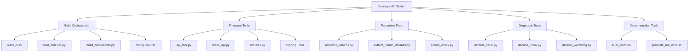

# Tools/scripts

## Overview

The `Tools/scripts` directory contains a comprehensive collection of developer utilities, CI/CD orchestration scripts, build and packaging tools, firmware manipulation utilities, parameter management tools, diagnostic helpers, and simulation drivers used throughout ArduPilot development and continuous integration workflows. These scripts automate complex build processes, validate configurations, generate documentation, manipulate firmware files, and provide essential diagnostic capabilities for developers and automated build systems.

## Architecture



## Key Components

### Build System Orchestration
- **build_ci.sh**: Master CI build script that orchestrates testing, building, and packaging for all vehicle types and board configurations
- **build_binaries.py**: Automated firmware binary builder for all vehicle types across all supported boards
- **build_bootloaders.py**: Bootloader compilation script for all hardware definitions with optional secure boot signing
- **configure-ci.sh**: CI environment setup script that installs toolchains, dependencies, and build tools
- **build_docs.sh**: Master documentation generation orchestrator that builds all vehicle and library API documentation

### Firmware Packaging and Manipulation
- **apj_tool.py**: Multi-format firmware file manipulation utility supporting .apj, .px4, and .abin formats
- **make_apj.py**: Simple wrapper to create ArduPilot JSON (.apj) firmware files from binary images
- **make_intel_hex.py**: Intel HEX format generator for firmware files
- **bin2hex.py**: Binary to Intel HEX converter with address offset support
- **elf_diff.py**: ELF binary comparison tool for analyzing firmware differences

### Parameter Management
- **annotate_params.py**: Parameter file annotator that fetches online documentation and adds inline comments
- **extract_param_defaults.py**: Extract default parameter values from binary log files
- **param_check.py**: Parameter validation tool that checks ranges, bitmasks, and consistency
- **param_parse.py**: Parameter file parser and manipulation library

### Board Configuration
- **board_list.py**: Dynamic board discovery and listing utility used by build scripts
- **build_options.py**: Feature flag and build option management for conditional compilation

### Diagnostic and Debug Tools
- **decode_devid.py**: Device ID decoder for interpreting numeric sensor identifiers (compass, IMU, barometer types)
- **decode_ICSR.py**: ARM Cortex-M ICSR (Interrupt Control and State Register) decoder for crash analysis
- **decode_watchdog.py**: Watchdog reset reason decoder for diagnosing system resets
- **decode_fault.py**: ARM fault status register decoder for detailed crash diagnostics
- **size_compare_branches.py**: Binary size comparison tool for analyzing memory usage across branches

### Documentation Generation
- **build_docs.sh**: Orchestrates complete Doxygen documentation generation for all components
- **generate_lua_docs.sh**: Generates Markdown documentation for AP_Scripting Lua API using lua-language-server
- **build_log_message_documentation.sh**: Creates comprehensive log message format documentation

### Simulation and Testing
- **runcoptertest.py**: Automated multicopter simulation test runner for SITL validation
- **runplanetest.py**: Fixed-wing simulation test orchestrator
- **run_examples.sh**: Runs example sketches in SITL for validation
- **run_in_terminal_window.py**: Terminal window manager for automated testing

### Firmware Signing and Security
- **Signing/** subdirectory: Contains firmware signing tools for secure boot and update verification
  - Sign bootloaders and firmware images with cryptographic keys
  - Generate and validate firmware signatures
  - Support for manufacturer-specific signing workflows

### Manifest and Metadata Generation
- **generate_manifest.py**: Creates firmware manifest files with board metadata, branding, and capabilities
- **gen_stable.py**: Generates stable firmware version metadata for releases

### Code Quality and Analysis
- **check_code_style.sh**: Code style validator and formatter checker
- **format_log_file.py**: Binary log file formatter and converter
- **python_compact.py**: Python code compactor for embedded environments
- **remove_board.py**: Board definition cleanup and removal utility

### Miscellaneous Utilities
- **pretty_diff_firmware.sh**: Human-readable firmware difference viewer
- **board_defaults.py**: Board-specific default parameter extractor
- **build_bootloader_iofirmware.py**: IO processor firmware builder for specialized boards
- **build_one.sh**: Single-board build wrapper for quick iteration
- **dfu-upload**: Device Firmware Update (DFU) upload utility
- **install-hooks.sh**: Git hooks installer for development workflow automation

## Usage Patterns

### Build System Orchestration

#### Operation 1: Running Complete CI Build Pipeline
```bash
# Configure CI environment (install toolchains and dependencies)
./Tools/scripts/configure-ci.sh

# Run specific CI build target
export CI_BUILD_TARGET=sitltest-copter
./Tools/scripts/build_ci.sh

# Available CI_BUILD_TARGET values:
# - sitltest-copter: Multicopter SITL tests
# - sitltest-plane: Fixed-wing SITL tests
# - sitltest-rover: Ground vehicle SITL tests
# - sitltest-sub: Underwater vehicle SITL tests
# - build: Build all vehicle types for testing
# - linux: Linux board builds
# - build_bootloaders: All bootloader builds
# - build_binaries: Complete firmware release builds
```

#### Operation 2: Building Firmware Binaries for Release
```bash
# Build all firmware binaries for all boards and vehicle types
python3 ./Tools/scripts/build_binaries.py

# Build specific vehicle type
python3 ./Tools/scripts/build_binaries.py --vehicle=ArduCopter

# Build specific board
python3 ./Tools/scripts/build_binaries.py --board=Pixhawk1

# Build with custom features disabled
python3 ./Tools/scripts/build_binaries.py --vehicle=ArduPlane --board=MatekH743 \
    --extra-hwdef="define HAL_MINIMIZE_FEATURES 1"

# The script automatically:
# - Discovers all boards from hwdef files
# - Compiles firmware for all vehicle types
# - Generates .apj firmware packages
# - Creates firmware manifest files
# - Organizes output in build/<board>/bin/
```

#### Operation 3: Building Bootloaders
```bash
# Build all bootloaders for all boards
python3 ./Tools/scripts/build_bootloaders.py

# Build with secure boot signing
python3 ./Tools/scripts/build_bootloaders.py --signing-key=keys/signing_key.dat

# Build for specific board pattern
python3 ./Tools/scripts/build_bootloaders.py --pattern=Pixhawk*

# Bootloaders are written to build/bootloader/
```

#### Operation 4: Generating Complete Documentation
```bash
# Build all vehicle and library API documentation
./Tools/scripts/build_docs.sh

# Documentation output written to docs/ directory
# - docs/libraries/html/index.html - Library API documentation
# - docs/arducopter/html/index.html - Copter-specific documentation
# - docs/arduplane/html/index.html - Plane-specific documentation
# - docs/apmrover2/html/index.html - Rover-specific documentation
# - docs/ardusub/html/index.html - Sub-specific documentation

# Generate Lua scripting API documentation
./Tools/scripts/generate_lua_docs.sh
# Output: libraries/AP_Scripting/docs/ScriptingDocs.md
```

### Firmware Packaging and Manipulation

#### Operation 1: Creating APJ Firmware Files
```bash
# Create .apj file from binary
python3 ./Tools/scripts/make_apj.py \
    --board-id 9 \
    --board-name "Pixhawk1" \
    --description "ArduCopter firmware" \
    --image build/Pixhawk1/bin/arducopter.bin \
    --output build/Pixhawk1/bin/arducopter.apj

# The .apj format wraps the binary in JSON with metadata:
# - Board identification
# - Firmware version
# - Git hash
# - Build date
# - CRC32 checksum
```

#### Operation 2: Manipulating APJ Files with apj_tool.py
```bash
# Display APJ file information
python3 ./Tools/scripts/apj_tool.py --info firmware.apj

# Extract binary from APJ file
python3 ./Tools/scripts/apj_tool.py --extract firmware.apj --output firmware.bin

# Convert between formats
python3 ./Tools/scripts/apj_tool.py --input firmware.apj --output firmware.px4

# Verify APJ file integrity
python3 ./Tools/scripts/apj_tool.py --verify firmware.apj

# Supported formats:
# - .apj: ArduPilot JSON format (JSON wrapper with base64 image)
# - .px4: PX4 firmware format (binary with header)
# - .abin: ArduPilot binary format
```

#### Operation 3: Converting Binary to Intel HEX
```bash
# Convert binary to Intel HEX format for bootloader/programmer use
python3 ./Tools/scripts/bin2hex.py \
    --input build/Pixhawk1/bin/arducopter.bin \
    --output build/Pixhawk1/bin/arducopter.hex \
    --offset 0x08000000

# Intel HEX format commonly used for:
# - STM32 DFU programming
# - JTAG/SWD flash tools
# - Custom bootloaders
```

### Parameter Management

#### Operation 1: Annotating Parameter Files with Documentation
```bash
# Fetch online parameter documentation and add inline comments
python3 ./Tools/scripts/annotate_params.py \
    --vehicle=ArduCopter \
    --input-file=my_copter.param \
    --output-file=my_copter_annotated.param

# Example output:
# # PARAM_NAME: Parameter Display Name
# # Description: This parameter controls...
# # Units: meters
# # Range: 0 100
# PARAM_NAME,50.0

# The script fetches parameter metadata from:
# https://autotest.ardupilot.org/Parameters/<Vehicle>/apm.pdef.xml
```

#### Operation 2: Extracting Default Parameters from Logs
```bash
# Extract all parameter defaults from a binary log
python3 ./Tools/scripts/extract_param_defaults.py \
    --logfile flight.bin \
    --output defaults.param

# Extract parameters for specific subsystem
python3 ./Tools/scripts/extract_param_defaults.py \
    --logfile flight.bin \
    --filter "COMPASS_*" \
    --output compass_defaults.param

# Output formats:
# - .param: Standard parameter file format
# - .md: Markdown table format for documentation
# - JSON: Machine-readable format
```

#### Operation 3: Validating Parameter Files
```bash
# Validate parameter file against metadata
python3 ./Tools/scripts/param_check.py \
    --vehicle=ArduCopter \
    --param-file=my_config.param

# The validator checks:
# - Parameter existence (detects typos/deprecated params)
# - Value ranges (min/max violations)
# - Bitmask validity (invalid bit combinations)
# - Type correctness (integer vs float)

# Example output:
# ERROR: COMPASS_ORIENT value 50 exceeds maximum 42
# WARNING: Parameter SERIAL1_PROTOCOL deprecated, use SERIAL1_BAUD
# ERROR: Unknown parameter TYPO_PARAM
```

### Board Configuration and Discovery

#### Operation 1: Listing Available Boards
```bash
# List all boards with their hwdef locations
python3 ./Tools/scripts/board_list.py

# Filter by board name pattern
python3 ./Tools/scripts/board_list.py --pattern="Pixhawk*"

# Show board capabilities and features
python3 ./Tools/scripts/board_list.py --verbose

# Example output:
# Pixhawk1: libraries/AP_HAL_ChibiOS/hwdef/Pixhawk1
# Pixhawk4: libraries/AP_HAL_ChibiOS/hwdef/Pixhawk4
# CubeOrange: libraries/AP_HAL_ChibiOS/hwdef/CubeOrange
```

#### Operation 2: Extracting Board Default Parameters
```bash
# Extract default parameters defined in board hwdef
python3 ./Tools/scripts/board_defaults.py \
    --board=Pixhawk1 \
    --output=pixhawk1_defaults.param

# Board defaults include:
# - Hardware-specific parameter overrides
# - Sensor orientation defaults
# - Serial port configurations
# - Feature enable/disable flags
```

### Diagnostic and Debug Tools

#### Operation 1: Decoding Device IDs from Logs
```bash
# Decode numeric device ID to human-readable sensor name
python3 ./Tools/scripts/decode_devid.py 0x1D2041

# Example output:
# Device Type: DEVTYPE_HMC5883 (Compass)
# Bus Type: I2C
# Bus Number: 1
# Address: 0x1E
# Sensor: HMC5883L Magnetometer

# Useful for:
# - Identifying sensors in log files
# - Debugging sensor detection issues
# - Verifying I2C/SPI bus assignments
```

#### Operation 2: Decoding ARM Fault Registers
```bash
# Decode ICSR (Interrupt Control and State Register)
python3 ./Tools/scripts/decode_ICSR.py 0x00400803

# Example output:
# VECTACTIVE: 3 (HardFault)
# VECTPENDING: 0 (None)
# ISRPENDING: 1 (Interrupt pending)
# PENDSTCLR: 0
# PENDSTSET: 0

# Decode watchdog reset reason
python3 ./Tools/scripts/decode_watchdog.py crash_dump.txt

# Decode detailed fault information
python3 ./Tools/scripts/decode_fault.py \
    --cfsr 0x00020000 \
    --hfsr 0x40000000 \
    --mmfar 0x20001000

# Output identifies:
# - Fault type (hard fault, memory fault, bus fault, usage fault)
# - Fault address
# - Specific fault condition
# - Stack frame information
```

#### Operation 3: Comparing Binary Sizes Across Branches
```bash
# Compare binary sizes between git branches
python3 ./Tools/scripts/size_compare_branches.py \
    --branch1=master \
    --branch2=my-feature \
    --board=Pixhawk1 \
    --vehicle=ArduCopter

# Example output:
# Section      | master    | my-feature | Difference
# ---------------------------------------------------
# .text        | 512,345   | 514,123    | +1,778 bytes
# .data        | 4,567     | 4,567      | 0 bytes
# .bss         | 23,456    | 23,890     | +434 bytes
# ---------------------------------------------------
# TOTAL        | 540,368   | 542,580    | +2,212 bytes
#
# Flash usage: 87.3% (+0.4%)
```

### Simulation and Testing

#### Operation 1: Running Automated Copter Tests
```bash
# Run complete ArduCopter SITL test suite
python3 ./Tools/scripts/runcoptertest.py

# Run specific test
python3 ./Tools/scripts/runcoptertest.py --test=AutoTest.ArmFeatures

# Run with custom timeout
python3 ./Tools/scripts/runcoptertest.py --timeout=600

# Common test categories:
# - AutoTest.ArmFeatures: Arming checks
# - AutoTest.AutoTune: Autotune validation
# - AutoTest.FlightModes: Mode transition tests
# - AutoTest.Failsafe: Failsafe behavior verification
```

#### Operation 2: Running Plane SITL Tests
```bash
# Run ArduPlane test suite
python3 ./Tools/scripts/runplanetest.py

# Run tests with valgrind memory checking
python3 ./Tools/scripts/runplanetest.py --valgrind

# Enable debug output
python3 ./Tools/scripts/runplanetest.py --debug
```

#### Operation 3: Running Example Sketches
```bash
# Compile and run all example programs in SITL
./Tools/scripts/run_examples.sh

# Run specific example
./Tools/scripts/run_examples.sh --example=libraries/AP_GPS/examples/GPS_AUTO_test

# Examples validate:
# - Library functionality in isolation
# - API usage patterns
# - Hardware abstraction layer
```

### Firmware Signing and Security

#### Operation 1: Signing Bootloaders for Secure Boot
```bash
# Generate signing keys (one-time setup)
cd Tools/scripts/signing
./generate_keys.sh --output=manufacturer_keys/

# Sign bootloader with manufacturer key
python3 ./Tools/scripts/build_bootloaders.py \
    --signing-key=manufacturer_keys/signing_key.dat \
    --board=Pixhawk4

# The signed bootloader:
# - Verifies firmware signatures before execution
# - Prevents unsigned firmware from running
# - Enables secure firmware update workflow
```

#### Operation 2: Signing Firmware Images
```bash
# Sign firmware binary for secure boot
cd Tools/scripts/signing
./sign_firmware.py \
    --firmware=../../build/Pixhawk4/bin/arducopter.bin \
    --key=manufacturer_keys/signing_key.dat \
    --output=../../build/Pixhawk4/bin/arducopter_signed.bin

# Create signed APJ package
python3 ../make_apj.py \
    --board-id 50 \
    --board-name "Pixhawk4" \
    --image ../../build/Pixhawk4/bin/arducopter_signed.bin \
    --output ../../build/Pixhawk4/bin/arducopter_signed.apj
```

### Manifest and Metadata Generation

#### Operation 1: Generating Firmware Manifests
```bash
# Create firmware manifest for firmware server
python3 ./Tools/scripts/generate_manifest.py \
    --base-dir=build/ \
    --output=manifest.json

# Manifest includes:
# - Board identifications and names
# - Manufacturer and brand information
# - Firmware versions and git hashes
# - Download URLs and file sizes
# - Platform capabilities and features

# Example manifest.json structure:
# {
#   "firmware": [
#     {
#       "board_id": 9,
#       "board_name": "Pixhawk1",
#       "manufacturer": "3DR",
#       "brand_name": "Pixhawk",
#       "vehicletype": "ArduCopter",
#       "firmware_version": "4.5.0",
#       "git_sha": "a1b2c3d4",
#       "url": "https://firmware.ardupilot.org/...",
#       "size": 1048576
#     }
#   ]
# }
```

#### Operation 2: Generating Stable Release Metadata
```bash
# Generate version metadata for stable release
python3 ./Tools/scripts/gen_stable.py \
    --version=4.5.0 \
    --git-hash=$(git rev-parse HEAD)

# Creates stable release tracking information for:
# - Firmware servers
# - Ground control stations
# - Update checkers
# - Release notes automation
```

## Integration Guide

### Adding This Directory to CI/CD Pipeline

#### Step 1: Configure CI Environment
```yaml
# Example GitHub Actions workflow
name: Build ArduPilot
on: [push, pull_request]

jobs:
  build:
    runs-on: ubuntu-20.04
    steps:
      - uses: actions/checkout@v2
        with:
          submodules: recursive
      
      - name: Configure CI Environment
        run: ./Tools/scripts/configure-ci.sh
      
      - name: Run CI Build
        env:
          CI_BUILD_TARGET: sitltest-copter
        run: ./Tools/scripts/build_ci.sh
```

#### Step 2: Integrate Build Scripts into Release Pipeline
```bash
#!/bin/bash
# Example release build script

# Build all firmware binaries
python3 ./Tools/scripts/build_binaries.py --all-vehicles

# Generate firmware manifests
python3 ./Tools/scripts/generate_manifest.py \
    --base-dir=build/ \
    --output=build/manifest.json

# Sign firmware (if secure boot enabled)
for board in build/*/; do
    if [ -f "${board}/bin/arducopter.bin" ]; then
        ./Tools/scripts/signing/sign_firmware.py \
            --firmware="${board}/bin/arducopter.bin" \
            --key=keys/release_key.dat \
            --output="${board}/bin/arducopter_signed.apj"
    fi
done

# Upload to firmware server
rsync -avz build/ firmware-server:/var/www/firmware/
```

#### Step 3: Integrate Parameter Validation into Development Workflow
```bash
# Add as git pre-commit hook
cat > .git/hooks/pre-commit << 'EOF'
#!/bin/bash
# Validate any changed parameter files

changed_params=$(git diff --cached --name-only --diff-filter=ACM | grep '\.param$')

if [ -n "$changed_params" ]; then
    echo "Validating parameter files..."
    for param_file in $changed_params; do
        python3 ./Tools/scripts/param_check.py \
            --vehicle=ArduCopter \
            --param-file="$param_file" || exit 1
    done
    echo "Parameter validation passed"
fi
EOF

chmod +x .git/hooks/pre-commit
```

#### Step 4: Automate Documentation Generation
```bash
# Add to CI pipeline for documentation builds
- name: Generate Documentation
  run: |
    ./Tools/scripts/build_docs.sh
    ./Tools/scripts/generate_lua_docs.sh
    
- name: Deploy Documentation
  run: |
    rsync -avz docs/ doc-server:/var/www/docs/
```

### Using Scripts for Hardware Manufacturer Integration

#### Adding a New Board Definition
```bash
# 1. Create hwdef files
mkdir -p libraries/AP_HAL_ChibiOS/hwdef/MyNewBoard
cat > libraries/AP_HAL_ChibiOS/hwdef/MyNewBoard/hwdef.dat << 'EOF'
# Hardware definition for MyNewBoard
# Based on STM32H743
include ../CubeOrange/hwdef.dat

# Override board-specific settings
define HAL_BOARD_ID 999
EOF

# 2. Verify board discovery
python3 ./Tools/scripts/board_list.py --pattern="MyNewBoard"

# 3. Build bootloader
python3 ./Tools/scripts/build_bootloaders.py --pattern="MyNewBoard"

# 4. Build firmware
./waf configure --board=MyNewBoard
./waf copter

# 5. Generate APJ package
python3 ./Tools/scripts/make_apj.py \
    --board-id 999 \
    --board-name "MyNewBoard" \
    --image build/MyNewBoard/bin/arducopter.bin \
    --output build/MyNewBoard/bin/arducopter.apj
```

### Diagnostic Workflow for Crash Analysis

```bash
# Complete crash analysis workflow

# 1. Extract device IDs from crash log
grep "devid" crash.log | while read line; do
    devid=$(echo "$line" | grep -oP '0x[0-9A-Fa-f]+')
    echo "Device: $devid"
    python3 ./Tools/scripts/decode_devid.py "$devid"
done

# 2. Decode fault registers
python3 ./Tools/scripts/decode_ICSR.py <ICSR_value>
python3 ./Tools/scripts/decode_watchdog.py crash.log
python3 ./Tools/scripts/decode_fault.py \
    --cfsr <CFSR_value> \
    --hfsr <HFSR_value>

# 3. Extract and analyze parameters
python3 ./Tools/scripts/extract_param_defaults.py \
    --logfile crash.bin \
    --output crash_params.param

python3 ./Tools/scripts/param_check.py \
    --vehicle=ArduCopter \
    --param-file=crash_params.param
```

## Safety Considerations

### Critical Build Scripts

**build_binaries.py and build_bootloaders.py** are safety-critical scripts that generate flight firmware:
- Always verify git hash and version information in generated binaries
- Test firmware thoroughly in SITL before hardware deployment
- Use signed firmware for production deployments when secure boot is available
- Never deploy firmware built with debug flags to flight hardware

### Parameter Validation

**Parameter management scripts affect flight safety**:
- Always validate parameter files with `param_check.py` before uploading to vehicles
- Invalid parameter values can cause unstable flight or crashes
- Pay special attention to parameters affecting:
  - PID tuning (rate and attitude controllers)
  - Failsafe thresholds and actions
  - Battery monitoring and warnings
  - Compass and GPS configuration
  - Motor output scaling and mixing

### Firmware Signing

**Secure boot and firmware signing prevent unauthorized firmware**:
- Protect signing keys with appropriate access controls
- Use hardware security modules (HSM) for production key storage
- Maintain key backups in secure offline storage
- Revoke compromised keys immediately
- Test signed firmware boot process thoroughly before deployment

### CI/CD Pipeline Safety

**Automated builds and tests must not compromise safety**:
- Run SITL tests in isolated environments
- Validate all tests pass before merging to stable branches
- Maintain separate CI pipelines for development and release builds
- Implement approval gates for firmware signing and release
- Monitor build system for compromise or tampering

## Testing

### Unit Testing Build Scripts

Location: `Tools/scripts/tests/` (if present)

```bash
# Run build script unit tests
cd Tools/scripts
python3 -m pytest tests/

# Test specific script
python3 -m pytest tests/test_apj_tool.py

# Test with coverage
python3 -m pytest --cov=. tests/
```

### SITL Testing of Build Outputs

```bash
# Build firmware and test in SITL
./waf configure --board=SITL
./waf copter
./Tools/autotest/sim_vehicle.py -v ArduCopter --console --map

# Run automated test suite
export CI_BUILD_TARGET=sitltest-copter
./Tools/scripts/build_ci.sh

# Verify firmware boots and parameters load
```

### Validation Testing for Parameter Scripts

```bash
# Test parameter annotation
python3 ./Tools/scripts/annotate_params.py \
    --vehicle=ArduCopter \
    --input-file=test_params.param \
    --output-file=test_annotated.param

# Verify annotations added correctly
diff test_params.param test_annotated.param

# Test parameter extraction
python3 ./Tools/scripts/extract_param_defaults.py \
    --logfile=test_data/test_flight.bin \
    --output=extracted.param

# Validate extracted parameters
python3 ./Tools/scripts/param_check.py \
    --vehicle=ArduCopter \
    --param-file=extracted.param
```

### Firmware Manipulation Testing

```bash
# Test APJ creation and verification
python3 ./Tools/scripts/make_apj.py \
    --board-id 9 \
    --board-name "Pixhawk1" \
    --image test_firmware.bin \
    --output test_firmware.apj

# Verify APJ integrity
python3 ./Tools/scripts/apj_tool.py --verify test_firmware.apj

# Test format conversion
python3 ./Tools/scripts/apj_tool.py \
    --input test_firmware.apj \
    --output test_firmware.px4

# Test Intel HEX conversion
python3 ./Tools/scripts/bin2hex.py \
    --input test_firmware.bin \
    --output test_firmware.hex \
    --offset 0x08000000
```

## Implementation Notes

### Design Decisions

**Why Python for Most Utilities**: Python chosen for its:
- Excellent cross-platform compatibility
- Rich standard library for file and data manipulation
- Easy integration with existing ArduPilot Python infrastructure (pymavlink)
- Rapid development and maintenance
- Clear, readable code for community contributions

**Why Bash for CI Orchestration**: Shell scripts used for CI because:
- Direct integration with Unix build tools
- Simple process management and piping
- Standard availability on all CI platforms
- Minimal dependencies
- Easy to debug and modify

**Modular Script Architecture**: Scripts designed as independent utilities that:
- Perform single, well-defined tasks
- Accept standard input formats
- Produce parseable output
- Can be composed in pipelines
- Are testable in isolation

### Build System Integration

The scripts integrate with the waf-based build system:
- `board_list.py` discovers boards by scanning hwdef directories
- `build_options.py` maps feature flags to conditional compilation
- `generate_manifest.py` reads build outputs to create metadata
- Build scripts invoke waf internally with appropriate configurations

### Parameter System Architecture

Parameter scripts interact with multiple representations:
- `.param` files: Human-editable text format (NAME,value)
- `.pdef.xml`: Auto-generated documentation with metadata
- Binary logs: MAVLink PARAM_VALUE messages
- EEPROM storage: Packed binary format on vehicle

The scripts provide conversion and validation between these formats.

### Firmware Format Ecosystem

Multiple firmware formats exist for historical and compatibility reasons:
- `.apj`: Modern ArduPilot format (JSON + base64 image)
- `.px4`: Legacy PX4 format (binary with header)
- `.abin`: Raw ArduPilot binary
- `.hex`: Intel HEX for programmers and bootloaders

Scripts provide conversion tools to support all formats.

### Known Limitations

**Build Scripts**:
- `build_binaries.py` requires significant disk space (multi-GB for all boards)
- Parallel builds limited by system memory and CPU cores
- Some boards require specific toolchain versions

**Parameter Scripts**:
- `annotate_params.py` requires internet connectivity to fetch documentation
- Parameter validation assumes current firmware version
- Deprecated parameters may not be detected immediately

**Diagnostic Tools**:
- Device ID decoding requires up-to-date sensor database
- Fault decoding specific to ARM Cortex-M architecture
- Crash analysis tools assume standard stack frame layout

### Future Enhancements

Potential improvements identified:
- Add progress bars for long-running build operations
- Implement parallel parameter validation
- Enhance firmware diff tool with binary analysis
- Add automated security scanning for firmware images
- Expand diagnostic tools for additional architectures
- Create unified firmware management CLI tool

## Script Reference Summary

### Most Commonly Used Scripts

| Script | Purpose | Frequency |
|--------|---------|-----------|
| build_ci.sh | CI pipeline orchestration | Every CI run |
| build_binaries.py | Release firmware builds | Each release |
| build_docs.sh | Documentation generation | Daily/per commit |
| param_check.py | Parameter validation | Per parameter change |
| board_list.py | Board discovery | Multiple times per build |
| apj_tool.py | Firmware manipulation | Per firmware operation |
| decode_devid.py | Sensor identification | During debugging |

### Script Dependencies

Most scripts require:
- Python 3.6 or newer
- pymavlink library (`pip3 install pymavlink`)
- Access to ArduPilot repository root
- Appropriate build tools (for build scripts)

Specific requirements documented in individual script help:
```bash
python3 ./Tools/scripts/<script_name>.py --help
```

## References

### Source Files
Primary scripts documented in this README:
- `Tools/scripts/build_ci.sh` - CI orchestration master script
- `Tools/scripts/build_binaries.py` - Firmware build automation
- `Tools/scripts/build_bootloaders.py` - Bootloader compilation
- `Tools/scripts/configure-ci.sh` - CI environment setup
- `Tools/scripts/build_docs.sh` - Documentation generation orchestrator
- `Tools/scripts/generate_lua_docs.sh` - Lua API documentation
- `Tools/scripts/apj_tool.py` - Firmware format manipulation
- `Tools/scripts/make_apj.py` - APJ creation utility
- `Tools/scripts/bin2hex.py` - Intel HEX converter
- `Tools/scripts/annotate_params.py` - Parameter documentation
- `Tools/scripts/extract_param_defaults.py` - Log parameter extraction
- `Tools/scripts/param_check.py` - Parameter validation
- `Tools/scripts/board_list.py` - Board discovery
- `Tools/scripts/decode_devid.py` - Device ID decoder
- `Tools/scripts/decode_ICSR.py` - ARM ICSR decoder
- `Tools/scripts/decode_watchdog.py` - Watchdog analyzer
- `Tools/scripts/generate_manifest.py` - Manifest generator
- `Tools/scripts/size_compare_branches.py` - Binary size comparison

Complete script listing: See `Tools/scripts/` directory contents

### Related Modules
- **Tools/autotest/**: SITL testing framework and test scenarios
- **Tools/ardupilotwaf/**: Build system implementation (waf modules)
- **Tools/environment_install/**: Development environment setup scripts
- **docs/**: Documentation generation configuration and scripts
- **libraries/AP_HAL_ChibiOS/hwdef/**: Board hardware definitions

### External Documentation
- ArduPilot Developer Documentation: https://ardupilot.org/dev/
- Build System Documentation: See `BUILD.md` in repository root
- Parameter Documentation: https://ardupilot.org/copter/docs/parameters.html
- Firmware Server: https://firmware.ardupilot.org/
- MAVLink Protocol: https://mavlink.io/

### Build System Architecture
- waf Build System: https://waf.io/
- Board Definition System: `libraries/AP_HAL_ChibiOS/hwdef/README.md`
- Feature Flags: `libraries/AP_HAL_ChibiOS/hwdef/common/defaults.h`

### CI/CD Integration Examples
- GitHub Actions Workflows: `.github/workflows/`
- Discourse Build Server: https://discuss.ardupilot.org/c/development-team/build-server
- Autotest Results: https://autotest.ardupilot.org/

## Contributing

When adding new scripts to this directory:

1. **Follow Existing Patterns**: Use similar structure and command-line arguments as existing scripts
2. **Add Help Text**: Implement `--help` with clear usage documentation
3. **Handle Errors Gracefully**: Provide informative error messages
4. **Document Integration**: Update this README with usage examples
5. **Add Tests**: Create unit tests for new functionality
6. **Use Standard Libraries**: Prefer Python standard library over external dependencies
7. **Support Automation**: Design for non-interactive CI/CD use

### Script Template

```python
#!/usr/bin/env python3
"""
Brief description of script purpose.

This script performs X by doing Y, useful for Z workflows.
"""

import argparse
import sys

def main():
    parser = argparse.ArgumentParser(
        description="Tool description"
    )
    parser.add_argument(
        '--input',
        required=True,
        help='Input file path'
    )
    parser.add_argument(
        '--output',
        required=True,
        help='Output file path'
    )
    parser.add_argument(
        '--verbose',
        action='store_true',
        help='Enable verbose output'
    )
    
    args = parser.parse_args()
    
    try:
        # Implementation here
        pass
    except Exception as e:
        print(f"Error: {e}", file=sys.stderr)
        return 1
    
    return 0

if __name__ == '__main__':
    sys.exit(main())
```

## Troubleshooting

### Common Issues

**Issue**: `build_binaries.py` fails with "No boards found"
- **Solution**: Ensure you're running from ArduPilot repository root
- **Solution**: Check that `libraries/AP_HAL_ChibiOS/hwdef/` directory exists
- **Solution**: Update git submodules: `git submodule update --init --recursive`

**Issue**: Parameter scripts fail to fetch documentation
- **Solution**: Check internet connectivity
- **Solution**: Verify access to https://autotest.ardupilot.org/
- **Solution**: Use cached parameter metadata if available

**Issue**: APJ creation fails with "Invalid board ID"
- **Solution**: Check board ID matches hwdef definition
- **Solution**: Verify binary file exists and is readable
- **Solution**: Ensure sufficient disk space for output

**Issue**: Documentation build fails
- **Solution**: Install Doxygen: `sudo apt-get install doxygen graphviz`
- **Solution**: Check `docs/` directory has build scripts
- **Solution**: Verify write permissions on output directory

**Issue**: Diagnostic scripts produce "Unknown device"
- **Solution**: Update device ID database (may require code update)
- **Solution**: Check if device ID is valid hexadecimal
- **Solution**: Consult sensor documentation for device type

### Getting Help

- Check script help: `python3 <script>.py --help`
- Review script source code for detailed implementation
- Search ArduPilot forums: https://discuss.ardupilot.org/
- Join developer Discord: https://ardupilot.org/discord
- Review CI logs for build issues: https://github.com/ArduPilot/ardupilot/actions

