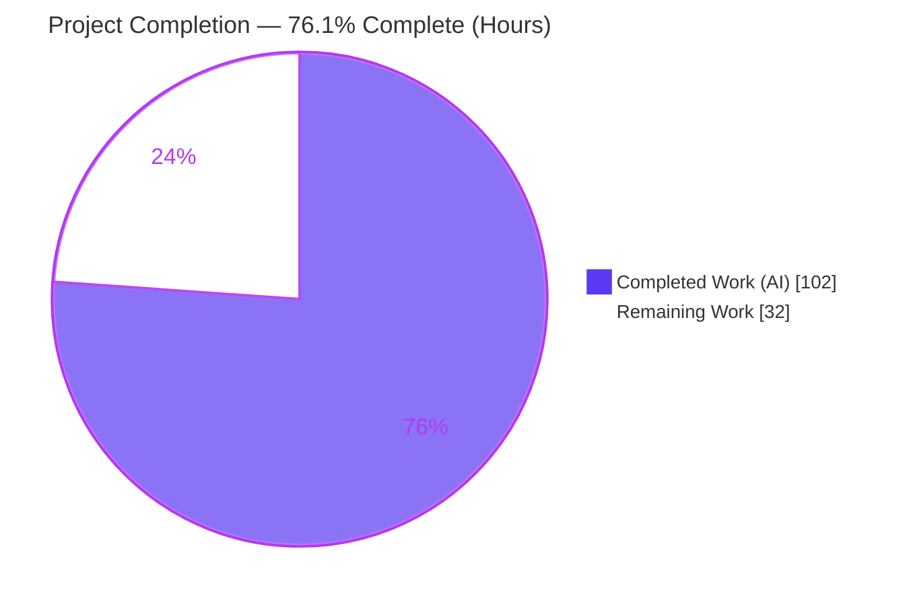
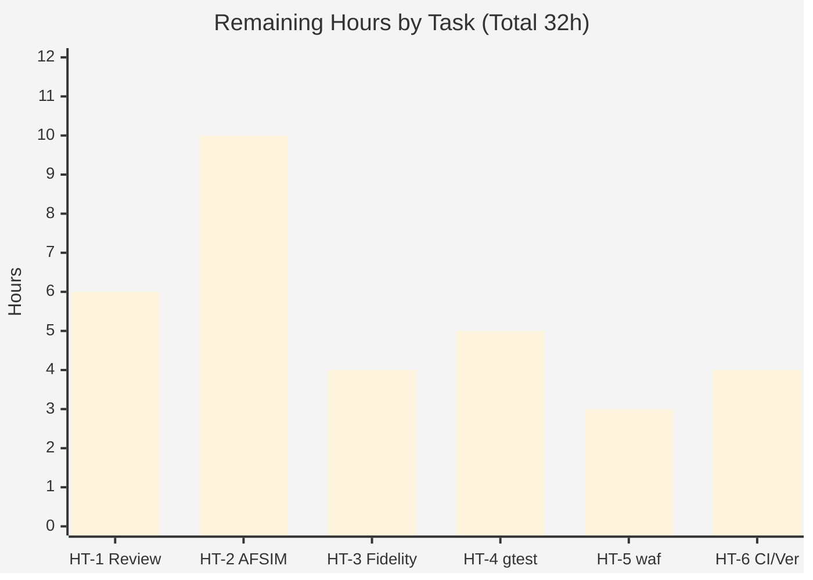
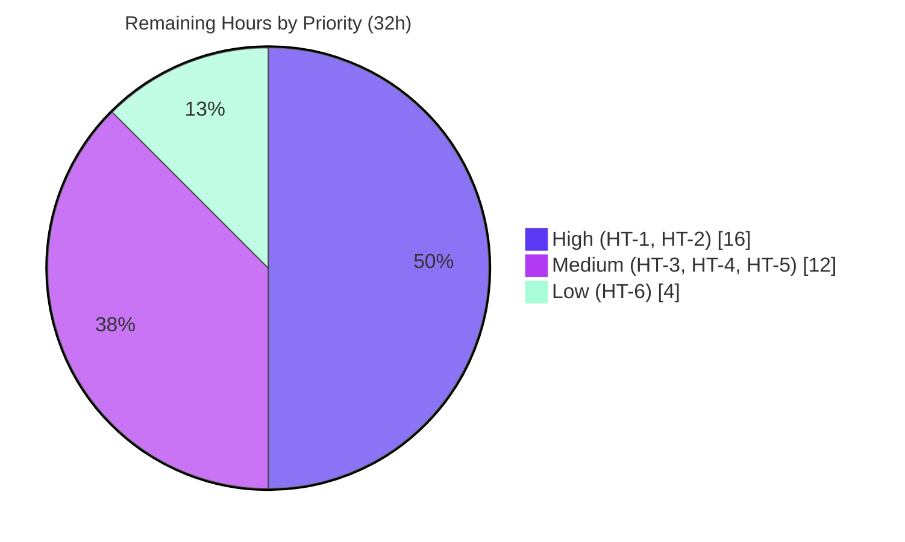

# Blitzy Project Guide — AfsimL1 Reusable L1 Guidance Service

> **Project:** Extract ArduPilot L1 lateral-navigation guidance (`AP_L1_Control`) into a reusable, host-driven modular service (`AfsimL1`) behind a stable `extern "C"` ABI, plus a regenerated PNT Reference Audit PDF.
> **Branch:** `blitzy-46f5dfbd-4fd4-4fb7-b110-03ba60585668` · **HEAD:** `7a5ebc0723`
> **Brand color legend:** <span style="color:#5B39F3">■</span> Completed / AI Work = Dark Blue `#5B39F3` · <span style="color:#B23AF2">■</span> Headings/Accents = Violet-Black `#B23AF2` · <span style="color:#A8FDD9">■</span> Highlight = Mint `#A8FDD9` · ▢ Remaining = White `#FFFFFF`

---

## 1. Executive Summary

### 1.1 Project Overview

The **AfsimL1** project refactors ArduPilot's L1 lateral-navigation guidance (`AP_L1_Control`) from logic embedded in the vehicle flight loop into a single **reusable, host-driven service** exposed behind a stable `extern "C"` ABI. An external simulator such as **AFSIM** can bind the shared library `libafsim_l1.so` at runtime and drive guidance by injecting waypoint legs, platform state, and timing (`dt`), then reading back roll and lateral-acceleration commands. The extraction is **behavior-preserving** — the L1 mathematics are unchanged — and applies the Facade, Adapter, ABI-boundary, and Dependency-Injection patterns. The deliverable is **headless** (no UI, per AAP §0.3.4) and includes a regenerated **PNT Reference Audit PDF** documenting every current PNT touch-point and its new service location.

### 1.2 Completion Status



| Metric | Hours |
|--------|------:|
| **Total Project Hours** | **134** |
| Completed Hours (AI + Manual) | 102 (102 AI + 0 Manual) |
| Remaining Hours | 32 |
| **Percent Complete** | **76.1 %** |

> **Calculation (PA1, AAP-scoped):** Completion % = Completed ÷ (Completed + Remaining) = 102 ÷ (102 + 32) = 102 ÷ 134 = **76.1 %**. Every AAP-specified autonomous deliverable is complete and validated; the remaining 32 h is exclusively **path-to-production** work (human review, real host integration, and optional hardening).

### 1.3 Key Accomplishments

- ✅ **Reusable service delivered** — `AfsimL1Behavior` facade + AHRS-shim adapter + `extern "C"` ABI, composing `AP_L1_Control` without altering its guidance mathematics.
- ✅ **Stable C ABI** — `libafsim_l1.so` exports **exactly 8** symbols (`L1_Create/Destroy/Init/Execute/SetLegNE/SetStateNE/GetRollDeg/GetLatAccel`) with **zero** C++ mangled symbols leaked (`-fvisibility=hidden` + per-symbol `visibility("default")`).
- ✅ **Behavior-preserving timing seam** — additive, **default-off** `set_update_dt()` in `AP_L1_Control`; the `dt`-clamp block is **byte-identical** to stock; CWE-20 input validation added.
- ✅ **Toolchain-agnostic consumption proven** — a pure-C client compiled with `gcc` (not `g++`) `dlopen`s the `g++`-built library and drives it correctly.
- ✅ **Cross-compiler clean build** — standalone CMake build from scratch on both `g++-11` and `g++-15`, **zero warnings** under `-Wall -Wextra`.
- ✅ **PNT Reference Audit PDF regenerated** — 43 pages (A4) with the required "New Service Location" mapping column and the front-of-document Executive Summary; deterministic (byte-identical SHA256 on re-run).
- ✅ **Documentation delivered twice** — mapping in the AAP (§0.6.1) and in the regenerated PDF (Goal 3).
- ✅ **No vehicle firmware touched** — the diff is confined to the 16 in-scope files; ArduPlane/Copter/Rover/Sub/Blimp/Tracker are unchanged.

### 1.4 Critical Unresolved Issues

| Issue | Impact | Owner | ETA |
|-------|--------|-------|-----|
| No critical (blocking) issues in the delivered scope | None — all in-scope deliverables compile, run, and pass validation | — | — |
| Real AFSIM host integration not yet performed | Service cannot be exercised inside AFSIM until the host wires the ABI to its platform state/timing | Host/Integration engineer | With HT-2 (~10 h) |
| Behavior-critical `AP_L1_Control` seam awaiting human sign-off | Edit touches a shared flight-guidance controller; requires senior review before merge | Flight-controls reviewer | With HT-1 (~6 h) |

> No issue **blocks** the delivered library; the items above are the required steps to move from validated deliverable to production use.

### 1.5 Access Issues

| System / Resource | Type of Access | Issue Description | Resolution Status | Owner |
|-------------------|----------------|-------------------|-------------------|-------|
| ArduPilot repository | Git write / merge | Standard branch pending human review & merge to mainline | Pending review | Maintainer |
| AFSIM environment | Runtime / integration | External simulator not available in this environment; real integration deferred to the host team | Deferred (out of environment) | Integration team |

> No credential, API-key, or permission blocker prevented autonomous build validation. The standalone build, ABI verification, demo, and PDF regeneration all ran successfully in this environment. Remaining access items are ordinary merge and external-host availability considerations.

### 1.6 Recommended Next Steps

1. **[High]** Perform senior code review & merge sign-off of the `AP_L1_Control` timing seam and the AfsimL1 service (ABI, facade, shim) — *HT-1*.
2. **[High]** Complete the real AFSIM host integration: bind `libafsim_l1.so`, map platform state → `L1_SetStateNE`, drive `dt` → `L1_Execute`, consume roll/lat-accel — *HT-2*.
3. **[Medium]** Run integration & numerical-fidelity testing against the in-vehicle L1 for representative legs (on-track, cross-track, loiter) — *HT-3*.
4. **[Medium]** Add a dedicated `gtest` unit suite for the facade/shim/ABI (plus optional handle-tag and state-setter input validation) — *HT-4*.
5. **[Low]** Add CI/CD packaging and semantic versioning (SONAME, install rules, build/ABI/demo CI job) for `libafsim_l1.so` — *HT-6*.

---

## 2. Project Hours Breakdown

### 2.1 Completed Work Detail

All completed work was performed autonomously (AI). Each component traces to a specific AAP requirement.

| Component | Hours | Description |
|-----------|------:|-------------|
| Service facade layer (`AfsimL1Behavior.h/.cpp`) | 12 | Task-API facade (514 LOC); composes `AP_L1_Control` by value via member-init against the shim; DI wiring; seeds `PERIOD/DAMPING/XTRACK_I/LIM_BANK`; `#error` seam guard. Maps AAP R1. |
| AHRS adapter shim (`AfsimL1_AHRS_Shim.h/.cpp`) | 8 | Adapter (327 LOC) mirroring the 6 non-virtual `AP_AHRS` accessors + 4 injection setters; `Location`-from-datum; N/E↔E/N velocity convention. Maps AAP R2. |
| C ABI boundary (`l1_c_api.h/.cpp`) | 8 | `extern "C"` layer (495 LOC); opaque `L1_Context`; 8 `visibility("default")` exports; NULL-safety on every entry point; ABI-stability documentation. Maps AAP R3. |
| `AP_L1_Control` timing seam (behavior-critical) | 6 | Additive `set_update_dt()` (+59 LOC) into the flight-guidance controller; CWE-20 validation; injected `dt` + loiter timebase; clamp byte-identical; default-off. Maps AAP R4/R13. |
| Build system (`CMakeLists.txt` + `wscript`) | 8 | Standalone SHARED-library build (446 LOC total); visibility hardening; embedded shim seam; cross-compiler support; demo target; in-tree waf `ap_example`. Maps AAP R5/R6. |
| Demo driver + state-flow self-check (`main.cpp`) | 4 | Working `set_leg_ne → execute → get_roll_deg` driver (212 LOC) with a step-7 self-check that fails loudly on state-flow regression. Maps AAP R7. |
| README integration documentation (`README.md`) | 4 | 280-line guide: architecture, AHRS decoupling, C ABI, DI model, both build paths, usage, behavior preservation. Maps AAP R8. |
| PNT instance audit analysis — Goal 1 | 6 | Line-by-line sweep mapping 16 AHRS read sites → 6 accessors + 2 clock couplings (AAP §0.6.1). Maps AAP R10. |
| PDF generator pipeline + regeneration — Goal 3 | 24 | ReportLab generators (`pnt_data.py` 1336 + `pnt_render.py` 1433 + `generate.py` 293 = 3062 LOC); 94 main rows / 282 evidence rows; ~838-assertion harness; 43-page A4 PDF with "New Service Location" column and the front-of-document Executive Summary. Maps AAP R9/R11. |
| C-ABI stability web research | 2 | Best-practice research on stable C-ABI shared libraries (opaque handles, visibility, versioning) recorded in AAP §0.3.2. Maps AAP R12. |
| Autonomous validation | 14 | From-scratch compile (g++-11 & g++-15), `nm -D` ABI check, pure-C `dlopen` smoke test, behavior-preservation Tests A/B/C, demo self-check, PDF harness. |
| Iterative QA / code-review fix cycles | 6 | Resolution of CP1, CP2, and Checkpoint-5 (G1–G7) findings, ABI symbol-pinning, README correction — evidenced across 11 commits. |
| **Total Completed** | **102** | |

### 2.2 Remaining Work Detail

Each category is path-to-production; no AAP-specified deliverable remains outstanding.

| Category | Hours | Priority |
|----------|------:|----------|
| HT-1 · Senior code review & merge sign-off (ABI + behavior-critical seam) | 6 | High |
| HT-2 · Real AFSIM host integration (bind `.so`, map state/`dt`/outputs) | 10 | High |
| HT-3 · Integration & numerical-fidelity testing vs in-vehicle L1 | 4 | Medium |
| HT-4 · Dedicated `gtest` unit suite (+ optional input hardening) | 5 | Medium |
| HT-5 · In-tree waf build-path resolution / documentation | 3 | Medium |
| HT-6 · CI/CD packaging + semantic versioning of the `.so` | 4 | Low |
| **Total Remaining** | **32** | |

### 2.3 Total Project Hours Reconciliation

| Bucket | Hours | Share |
|--------|------:|------:|
| Completed (§2.1) | 102 | 76.1 % |
| Remaining (§2.2) | 32 | 23.9 % |
| **Total Project** | **134** | **100 %** |

> **Integrity check:** §2.1 total (102) + §2.2 total (32) = **134** = Total Project Hours in §1.2. Remaining (32) is identical in §1.2, §2.2, and §7. ✔

---

## 3. Test Results

All results below originate from Blitzy's autonomous validation logs for this project. The AfsimL1 module has **no dedicated `gtest`/`pytest` suite** (the AAP marks it optional/not-created); validation used purpose-built harnesses and smoke tests. Establishing a formal unit suite is tracked as **HT-4**.

| Test Category | Framework / Tooling | Total Checks | Passed | Failed | Coverage | Notes |
|---------------|---------------------|-------------:|-------:|-------:|----------|-------|
| Standalone compilation | CMake + `g++-11` and `g++-15` | 2 | 2 | 0 | n/a | From-scratch; **0 warnings** under `-Wall -Wextra` |
| Seam syntax vs real vehicle headers | `g++` syntax-check vs SITL header graph | 1 | 1 | 0 | n/a | Proves seam does not break the ArduPlane build path |
| C ABI symbol verification | `nm -D` + shell | 1 | 1 | 0 | n/a | Exactly **8** `L1_*` exports; **0** mangled `_Z` symbols |
| Pure-C `dlopen` smoke test | `gcc`-compiled C host | 3 | 3 | 0 | n/a | NULL-safety; on-track roll≈0; 50 m cross-track → roll −34.85°, lat −6.83 m/s² |
| Behavior preservation | Custom C++ harness (Tests A/B/C) | 3 | 3 | 0 | n/a | A: injected-`dt` determinism; B: default-off legacy `micros()`; C: `dt>1 s` integrator-reset clamp |
| Demo self-check | `afsim_l1_demo` executable | 1 | 1 | 0 | n/a | Finite + materially non-zero roll (exit 0); fails loudly on state-flow regression |
| PDF audit harness | Custom Python assertion harness | ~838 | ~838 | 0 | 100 % of 94 rows / 282 evidence rows | Refuses to render on any assertion failure |
| **Aggregate** | — | **~849** | **~849** | **0** | — | **100 % pass rate; zero failures across all in-scope validation** |

> **Independently re-verified in this environment:** clean CMake build (`cmake`/`make` exit 0), `nm -D` → 8 symbols / 0 mangled, `afsim_l1_demo` → `roll_deg=-38.64, lat_accel=-7.84` (exit 0), pure-C `dlopen` client PASS, deterministic PDF regeneration (identical SHA256, HARNESS PASSED).

---

## 4. Runtime Validation & UI Verification

**UI Verification:** Not applicable. The deliverable is a headless C/C++ shared library plus a PDF artifact (AAP §0.3.4); there is no graphical or textual end-user interface.

**Runtime health:**

- ✅ **Operational** — Standalone CMake build produces `libafsim_l1.so` (≈179 KB ELF) and `afsim_l1_demo` (≈16 KB ELF).
- ✅ **Operational** — `afsim_l1_demo` executes end-to-end: `roll_deg = -38.64`, `lat_accel = -7.84`, exit 0.
- ✅ **Operational** — C ABI: 8 exports resolvable via `dlsym`; NULL-handle calls are safe no-ops / return 0.0.
- ✅ **Operational** — Toolchain-agnostic consumption: `gcc`-built pure-C host drives the `g++`-built `.so` correctly.
- ✅ **Operational** — `set_update_dt` timing seam: injected `dt` overrides `micros()`; default-off path preserves stock behavior; clamp semantics intact.
- ✅ **Operational** — PDF generator: `HARNESS PASSED`, `PDF written`, 43 pages A4, deterministic (identical SHA256 on regen), working tree stays clean.
- ⚠ **Partial** — In-tree waf example build (`bld.ap_example(use='ap')`): the `wscript` is correct, but the full `ap` library **fails to link** due to an **out-of-scope** `modules/littlefs` `-Werror` unused-variable (AAP §0.2.2 excludes `modules/**`). The standalone CMake path (the primary deliverable) is unaffected. Tracked as HT-5.

**API integration outcomes:** The C ABI is the integration surface. All 8 functions are verified operational; real AFSIM host wiring is the remaining integration step (HT-2).

---

## 5. Compliance & Quality Review

AAP deliverables cross-mapped to Blitzy quality/compliance benchmarks. Fixes applied during autonomous validation are noted; outstanding items map to human tasks.

| Benchmark / AAP Requirement | Status | Evidence / Notes |
|-----------------------------|--------|------------------|
| Behavior preservation (L1 math unchanged) | ✅ Pass | Seam default-off; clamp byte-identical; Tests A/B/C pass |
| Public contract preserved (`AP_Navigation`, `AP_L1_Control` signatures) | ✅ Pass | Only additive `set_update_dt()`; no existing signature changed |
| No vehicle firmware modified | ✅ Pass | Diff = 16 in-scope files only; ArduPlane/Copter/Rover/Sub/Blimp/Tracker untouched |
| Single reusable service module | ✅ Pass | `AfsimL1Behavior` + C ABI under `libraries/AP_L1_Control/examples/AfsimL1/` |
| Shared-library (`.so`) target | ✅ Pass | `libafsim_l1.so` built via standalone CMake |
| Exactly 8 C ABI exports w/ visibility | ✅ Pass | `nm -D` → 8 `L1_*`, 0 mangled; `-fvisibility=hidden` + per-symbol default |
| Injectable state & timing | ✅ Pass | `set_state_ne` (AHRS shim) + `set_update_dt` (host `dt`) |
| Documentation delivered twice (Goal 3) | ✅ Pass | AAP §0.6.1 + regenerated PDF "New Service Location" column |
| PNT instance audit (Goal 1) | ✅ Pass | §0.6.1 table: 16 sites → 6 accessors + 2 clock couplings |
| Web-research requirement | ✅ Pass | C-ABI stability best practices, AAP §0.3.2 |
| Zero-placeholder policy | ✅ Pass | 0 `TODO`/`FIXME` in the 6 core service files (illustrative host TODOs live only in the demo) |
| Code quality (warnings) | ✅ Pass | 0 warnings under `-Wall -Wextra` on g++-11 & g++-15 |
| Input validation (timing seam) | ✅ Pass | `set_update_dt` rejects non-finite/negative `dt` (CWE-20) |
| Pre-commit hygiene | ✅ Pass | `flake8` 0 violations; LF endings; no tracked build artifacts |
| Dependency changes | ✅ Pass (none) | No new third-party dependency; in-tree sources + existing toolchain |
| In-tree waf build (`use='ap'`) | ⚠ Partial | `wscript` correct; link blocked by out-of-scope `modules/littlefs` (HT-5) |
| Dedicated unit-test suite | ⚠ Optional / Not created | AAP marks optional; establishes HT-4 |
| ABI handle-tag / state-setter validation | ⚠ Optional hardening | NULL-safe today; deeper validation folded into HT-4 |

---

## 6. Risk Assessment

| Risk | Category | Severity | Probability | Mitigation | Status |
|------|----------|----------|-------------|-----------|--------|
| T1 · Seam edits a shared flight-guidance controller used by all fixed-wing/VTOL vehicles | Technical | Medium | Low | Default-off (in-class init); byte-identical clamp; Tests A/B/C; syntax-clean vs real SITL headers | Mitigated (pending review HT-1) |
| T2 · Option-B compile-time shim seam (`AFSIML1_L1_USES_SHIM_AHRS`) could be misbuilt by a consumer | Technical | Low | Low | `#error` guard + README + CMake sets the define automatically | Mitigated |
| T3 · In-tree waf (`use='ap'`) fails to link via out-of-scope `modules/littlefs` `-Werror` | Technical | Low | Medium | Standalone CMake is the supported/primary path; documented | Open (out-of-scope; HT-5) |
| T4 · Shim synthesizes `Location` from a fixed datum; large offsets / lat-lon wrap may diverge from full `AP_AHRS` | Technical | Medium | Low–Med | Fidelity testing (HT-3); documented conventions | Open |
| S1 · C ABI dereferences a non-NULL `void*` handle without magic-number validation | Security | Medium | Low | Opaque-handle discipline documented; NULL-safe today; optional handle-tag hardening | Partially mitigated |
| S2 · `L1_SetStateNE`/`L1_SetLegNE` lack range validation (NaN/Inf propagate) | Security | Low–Med | Low | Host responsibility; optional input validation folded into HT-4 | Open |
| S3 · Symbol-visibility hardening (only 8 exports, 0 mangled) reduces attack surface | Security | — (Positive) | — | `-fvisibility=hidden` + explicit exports | Implemented |
| O1 · No SONAME / semantic versioning on `libafsim_l1.so` → ABI-drift risk | Operational | Medium | Medium | Add versioning + install rules (HT-6) | Open |
| O2 · No CI job builds/tests the `.so` → regressions could slip | Operational | Medium | Medium | Add CI build + ABI/demo/harness checks (HT-6) | Open |
| O3 · `build/` gitignored; consumers build from source | Operational | Low | Low | Verified README build steps | Mitigated |
| O4 · No in-service logging/monitoring | Operational | Low | — | Appropriate for a headless compute library | Accepted by design |
| I1 · Real AFSIM integration untested (demo is illustrative) | Integration | Medium–High | Medium | Real integration (HT-2) + fidelity testing (HT-3) | Open (primary remaining risk) |
| I2 · Units/coordinate conventions (N/E, centidegrees yaw, EAS2TAS) must be mapped correctly by host | Integration | Medium | Medium | README "Units and conventions"; verify during HT-2/HT-3 | Documented |
| I3 · Datum sharing between legs and state must be ensured by host | Integration | Low–Med | Low | Documented | Open |

---

## 7. Visual Project Status

**Project hours — completed vs remaining** (Completed = Dark Blue `#5B39F3`, Remaining = White `#FFFFFF`):


**Remaining hours by task** (total 32 h):



**Remaining hours by priority:**



> **Integrity:** the pie "Remaining Work" (32) equals §1.2 Remaining Hours (32) and the §2.2 Hours total (32); "Completed Work" (102) equals §1.2 Completed Hours (102). The task bar chart sums to 32; the priority pie sums to 32. ✔

---

## 8. Summary & Recommendations

**Achievements.** The project delivered a complete, behavior-preserving extraction of ArduPilot's L1 lateral-navigation guidance into a reusable, host-driven service. All 16 in-scope files — the `AfsimL1Behavior` facade, the `AfsimL1_AHRS_Shim` adapter, the `extern "C"` ABI, the standalone CMake and in-tree waf builds, the demo, the README, the additive `AP_L1_Control` timing seam, and the regenerated PNT Reference Audit PDF — were implemented and independently validated. The shared library exports exactly the 8 specified C symbols with zero mangled leakage, builds warning-free on two compiler generations, and is consumable from a pure-C host, confirming the ABI-stability objective.

**Completion.** The project is **76.1 % complete** (102 of 134 hours). This figure reflects that **100 % of the AAP-specified autonomous deliverables are finished and verified**, while the remaining 23.9 % (32 hours) is standard **path-to-production** effort that inherently requires a human: code review and merge sign-off, real AFSIM host integration, integration/fidelity testing, an optional formal unit-test suite, waf build-path resolution, and CI/versioning.

**Critical path to production.** (1) Human review of the behavior-critical seam and ABI → (2) real AFSIM integration wiring → (3) integration/fidelity verification. These three (HT-1, HT-2, HT-3 = 20 hours) unblock production use; HT-4/HT-5/HT-6 (12 hours) are hardening and operational maturity.

**Success metrics.** Behavior preserved (byte-identical clamp; Tests A/B/C pass); ABI exactly 8 symbols, 0 mangled; 0 build warnings; deterministic PDF (identical SHA256); no out-of-scope files modified.

**Production-readiness assessment.** The delivered library is **validation-complete and production-ready as an autonomous deliverable**, pending the human review and integration steps above. The only open build caveat (in-tree waf link) is caused by an explicitly out-of-scope vendored submodule and does not affect the primary standalone deliverable.

| Metric | Value |
|--------|-------|
| Completion | 76.1 % (102 / 134 h) |
| In-scope files delivered & validated | 16 / 16 |
| C ABI exports | 8 / 8 (0 mangled) |
| Autonomous validation pass rate | 100 % (0 failures) |
| Critical path to production | 20 h (HT-1, HT-2, HT-3) |

---

## 9. Development Guide

All commands below were executed successfully in the validation environment.

### 9.1 System Prerequisites

- **OS:** Linux (validated on Ubuntu 25.10 container)
- **Compiler:** `g++` / `gcc` — validated on **11.5.0** and **15.2.0** (C++11)
- **Build tools:** **CMake ≥ 3.5** (validated 3.31.6); GNU Make
- **PDF regeneration (optional):** **Python 3.13.7**, **ReportLab 4.5.1**, **poppler-utils 25.03.0**, DejaVu fonts
- **No new third-party runtime dependency** — the service links only in-tree ArduPilot sources.

### 9.2 Environment Setup

```bash
# From the repository root
cd libraries/AP_L1_Control/examples/AfsimL1
```

No environment variables are required to **build**. For **PDF regeneration**, set `PNT_REPO_ROOT` to the repo root (shown in §9.6). The build automatically defines `AFSIML1_L1_USES_SHIM_AHRS` (Option-B shim seam) — do not unset it for the standalone build.

### 9.3 Dependency Installation

```bash
# Verify the toolchain is present (no installation needed if these succeed)
cmake --version        # expect >= 3.5
g++ --version          # expect a C++11-capable GCC

# Optional — only for PDF regeneration:
python3 -c "import reportlab; print(reportlab.Version)"   # expect 4.5.1
pdfinfo -v                                                # expect poppler 25.x
```

### 9.4 Build the Shared Library

```bash
cd libraries/AP_L1_Control/examples/AfsimL1
mkdir -p build && cd build
cmake ..            # exit 0 (a CMake VERSION 3.5 deprecation notice is benign)
make                # exit 0 — produces libafsim_l1.so and afsim_l1_demo
```

Expected artifacts: `libafsim_l1.so` (shared library) and `afsim_l1_demo` (demo executable).

### 9.5 Verification Steps

```bash
# 1. Verify the C ABI exports EXACTLY 8 symbols, with no mangled C++ symbols:
nm -D --defined-only libafsim_l1.so | grep ' T '
#   -> L1_Create L1_Destroy L1_Execute L1_GetLatAccel L1_GetRollDeg L1_Init L1_SetLegNE L1_SetStateNE
nm -D --defined-only libafsim_l1.so | grep -c '_Z'      # -> 0 (no mangled exports)

# 2. Run the demo (finds the .so via the build-tree RPATH):
./afsim_l1_demo
#   -> roll_deg = -38.639999, lat_accel = -7.840306   (exit 0)
#   If it cannot find the library:  LD_LIBRARY_PATH=. ./afsim_l1_demo
```

### 9.6 Example Usage

**External host flow (the AFSIM integration contract):**

```
dlopen("libafsim_l1.so")
  -> L1_Create()                                  // opaque void* handle
  -> L1_Init(h)
  -> L1_SetLegNE(h, 0.0, 0.0, 500.0, 0.0)         // prev(N,E) -> next(N,E), metres: 500 m North leg
  -> L1_SetStateNE(h, 0.0, 200.0, 0.0, 20.0, 0.0, 0.0)
                                                   // n,e (m); velE,velN (m/s); yaw_cd (centideg); pitch_rad
                                                   // -> 200 m East of track, 20 m/s northbound
  -> L1_Execute(h, 0.02)                           // one step, host dt in seconds (50 Hz)
  -> L1_GetRollDeg(h)    // ~ -38.6  (degrees)
  -> L1_GetLatAccel(h)   // ~ -7.84  (m/s^2)
  -> L1_Destroy(h)
```

**Regenerate the PNT Reference Audit PDF (deterministic):**

```bash
# From the repository root:
PNT_REPO_ROOT="$(pwd)" python3 libraries/AP_L1_Control/examples/AfsimL1/generate.py
#   -> harness: validating 94 main rows / 282 evidence rows ...
#   -> HARNESS PASSED
#   -> PDF written: <repo_root>/ArduPilot_PNT_Reference_Audit.pdf   (exit 0, byte-identical)
```

### 9.7 Troubleshooting

- **CMake prints a `VERSION 3.5` deprecation warning** — expected and benign; `3.5` is mandated by the AAP to match the reference build. The build still succeeds.
- **`./afsim_l1_demo` cannot find `libafsim_l1.so`** — run `LD_LIBRARY_PATH=. ./afsim_l1_demo` from the `build/` directory.
- **`./waf configure` / in-tree example fails to link** — this is the out-of-scope `modules/littlefs` `-Werror` unused-variable; use the standalone CMake path instead (the supported build for this service).
- **PDF generator errors** — ensure `PNT_REPO_ROOT` is set and `reportlab` is importable; the harness intentionally refuses to write the PDF if any of its ~838 assertions fail.

---

## 10. Appendices

### Appendix A — Command Reference

| Purpose | Command |
|---------|---------|
| Build the shared library | `cd libraries/AP_L1_Control/examples/AfsimL1 && mkdir -p build && cd build && cmake .. && make` |
| List ABI exports | `nm -D --defined-only libafsim_l1.so \| grep ' T '` |
| Count mangled exports (expect 0) | `nm -D --defined-only libafsim_l1.so \| grep -c '_Z'` |
| Run the demo | `./afsim_l1_demo` (or `LD_LIBRARY_PATH=. ./afsim_l1_demo`) |
| Regenerate the PDF | `PNT_REPO_ROOT="$(pwd)" python3 libraries/AP_L1_Control/examples/AfsimL1/generate.py` |
| Inspect the PDF | `pdfinfo ArduPilot_PNT_Reference_Audit.pdf` |

### Appendix B — Port Reference

Not applicable. The deliverable is a headless shared library with no network listeners or ports.

### Appendix C — Key File Locations

| File | Role |
|------|------|
| `libraries/AP_L1_Control/examples/AfsimL1/AfsimL1Behavior.h/.cpp` | Facade layer (task API) |
| `libraries/AP_L1_Control/examples/AfsimL1/AfsimL1_AHRS_Shim.h/.cpp` | AHRS state adapter |
| `libraries/AP_L1_Control/examples/AfsimL1/l1_c_api.h/.cpp` | `extern "C"` ABI boundary (8 exports) |
| `libraries/AP_L1_Control/examples/AfsimL1/CMakeLists.txt` | Standalone `.so` build |
| `libraries/AP_L1_Control/examples/AfsimL1/wscript` | In-tree waf `ap_example` build |
| `libraries/AP_L1_Control/examples/AfsimL1/main.cpp` | Demo driver + self-check |
| `libraries/AP_L1_Control/examples/AfsimL1/README.md` | Integration & usage guide |
| `libraries/AP_L1_Control/examples/AfsimL1/{pnt_data,pnt_render,generate}.py` | PDF generator pipeline |
| `libraries/AP_L1_Control/AP_L1_Control.h/.cpp` | Wrapped controller + additive `set_update_dt` seam |
| `ArduPilot_PNT_Reference_Audit.pdf` (repo root) | Regenerated PNT audit deliverable |

### Appendix D — Technology Versions

| Component | Version |
|-----------|---------|
| C++ standard | C++11 (`gnu++11` in-tree; `CMAKE_CXX_STANDARD 11` standalone) |
| GCC (g++/gcc) | 11.5.0 and 15.2.0 (both validated) |
| CMake | ≥ 3.5 required; 3.31.6 validated |
| waf | Python 3 (in-tree build) |
| Python (PDF) | 3.13.7 |
| ReportLab | 4.5.1 |
| poppler-utils | 25.03.0 |

### Appendix E — Environment Variable Reference

| Variable | Scope | Purpose |
|----------|-------|---------|
| `PNT_REPO_ROOT` | PDF regeneration | Absolute path to the repo root; sets the PDF output location |
| `LD_LIBRARY_PATH` | Runtime (demo/host) | Point the loader at the directory containing `libafsim_l1.so` if not on the default path |
| `AFSIML1_L1_USES_SHIM_AHRS` | Build (compile define) | Enables the Option-B shim seam; set automatically by the provided CMake build |

### Appendix F — Developer Tools Guide

- **`nm -D`** — inspect the exported dynamic symbol table (verify the 8-symbol ABI and absence of mangled symbols).
- **`file` / `ls -la`** — confirm ELF type and artifact sizes.
- **`dlopen`/`dlsym` (from a C host)** — validate toolchain-agnostic runtime binding.
- **`pdfinfo` / `pdftotext`** — verify PDF page count and presence of the "New Service Location" column.
- **`git diff --numstat <base>..HEAD`** — review the exact, in-scope change surface (16 files).

### Appendix G — Glossary

| Term | Meaning |
|------|---------|
| **PNT** | Position, Navigation, and Timing |
| **L1 guidance** | ArduPilot's L1 lateral-navigation control law (`AP_L1_Control`) |
| **ABI** | Application Binary Interface — the stable `extern "C"` boundary |
| **Facade** | `AfsimL1Behavior`, the task-oriented service API over the controller |
| **Adapter (shim)** | `AfsimL1_AHRS_Shim`, satisfies the controller's `AP_AHRS` read contract from injected state |
| **Opaque handle** | `void*` (`L1_Context`) exposed to the host; hides all C++ types |
| **Timing seam** | Additive, default-off `set_update_dt()` letting the host own the timebase |
| **AFSIM** | The external simulation environment that consumes the service |
| **Datum** | The fixed reference origin the shim uses to synthesize a `Location` from N/E offsets |
