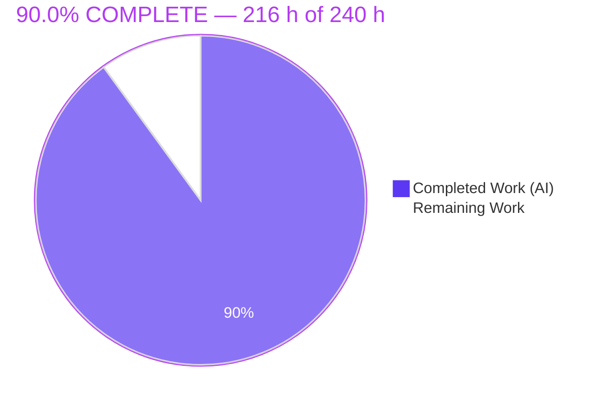
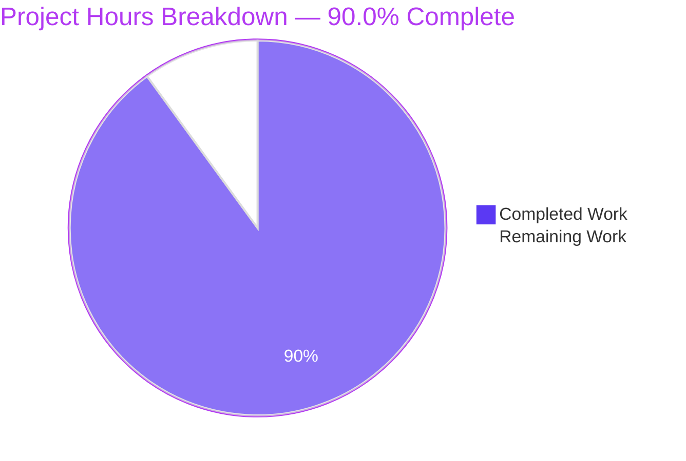
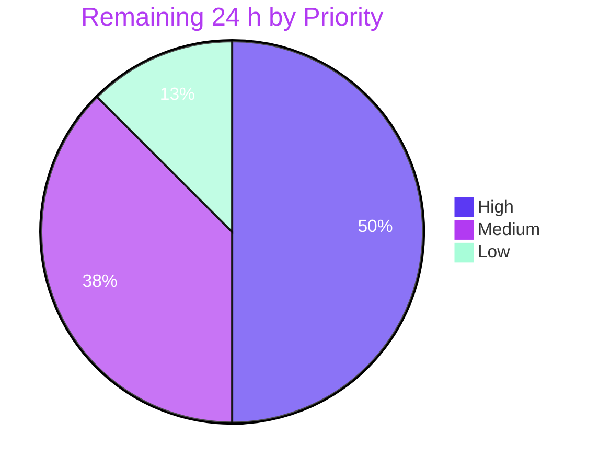

# Blitzy Project Guide
## ArduPilot PNT Reference Audit — Presentation Pack

> **Brand legend** — <span style="color:#5B39F3">**Dark Blue `#5B39F3`**</span> = Completed / AI work · **White `#FFFFFF`** = Remaining / not completed · <span style="color:#B23AF2">Violet-Black `#B23AF2`</span> = headings & accents · <span style="color:#A8FDD9">Mint `#A8FDD9`</span> = highlights

---

## 1. Executive Summary

### 1.1 Project Overview

This engagement builds a client-facing presentation pack that communicates the findings of an already-completed, already-scored engineering audit — the ArduPilot PNT Reference Audit — without repeating or extending the analysis behind it. The audit is a finished 43-page catalog of 94 Position/Navigation/Timing references across the ArduPilot firmware monorepo. Three artifacts were authored: a 10-slide executive brief for a prospective client, a 239-slide exhaustive findings deck for engineers, and a 16-section reveal.js presentation for non-technical leadership. Target users are prospective clients, audit stakeholders, and engineering leadership evaluating a PNT extraction effort. The work is purely additive documentation — no application code, build, or test behaviour changes anywhere.

### 1.2 Completion Status



| Metric | Value |
|--------|-------|
| **Total Hours** | **240** |
| **Completed Hours (AI + Manual)** | **216** (216 AI + 0 Manual) |
| **Remaining Hours** | **24** |
| **Percent Complete** | **90.0%** |

**Calculation (PA1, AAP-scoped):** `216 / (216 + 24) = 216 / 240 = 90.0%`

Every AAP-specified requirement is **Completed**; there are zero Partially Completed and zero Not Started items. The remaining 24 hours are exclusively human-judgement activities — content sign-off, one interpretive confirmation, and delivery decisions — that no agent can discharge on a stakeholder's behalf.

### 1.3 Key Accomplishments

- [x] **All three deliverables authored and committed** — 10-slide executive brief, 239-slide exhaustive findings deck, 16-section reveal.js executive presentation
- [x] **10 of 10 AAP acceptance gates PASS** (G1–G10, 118 gate checks) — re-run independently three times during this review
- [x] **337 of 337 automated checks passing, zero failing** across six validator suites
- [x] **Exhaustive coverage proven, not asserted** — all 94 main catalog rows, 6 Layer 1 + 6 Layer 2 sub-tables, 12 instance-mapping rows, 5 flag kinds, and all 109 coverage-register entries verified present with `missing=0`
- [x] **Verbatim fidelity enforced mechanically** — all 7 audit aggregates (63/31/94/282/18/109/27) stated in both decks; every KPI drawn from the audit's stated-value set; all five flag counts as the audit prints them
- [x] **Source audit left byte-identical** — SHA-256 `1e9a5b01…a4baf2` unchanged; blob identical at baseline, HEAD, and worktree
- [x] **Repository untouched apart from three additions** — `git diff` shows `modes=['A']` only, zero modifications, zero deletions
- [x] **Zero dependency entered the project** — the PowerPoint writer lives in a throwaway venv outside the checkout; all six protected manifests have 0 commits on the branch
- [x] **Runtime validated in real viewers** — reveal.js deck in headless Chrome (online *and* CDN-blocked paths), both PPTX decks rendered by LibreOffice at 10/10 and 239/239 pages with zero blanks
- [x] **Security-hardened HTML** — `default-src 'none'` CSP allowlisting its own inline script by SHA-256 hash rather than `'unsafe-inline'`; 5 SRI `sha384` digests validated at runtime
- [x] **Design system implemented whole** — 130 `:root` tokens with zero hardcoded colour, spacing, or z-index values outside `:root`
- [x] **15 review-and-remediation rounds absorbed** across 22 agent commits, including a 31-finding sweep and 6 security findings

### 1.4 Critical Unresolved Issues

**No engineering defects remain unresolved.** All 337 automated checks pass and all 10 acceptance gates hold. The items below are decisions and verifications reserved to humans by their nature, not outstanding engineering work.

| Issue | Impact | Owner | ETA |
|-------|--------|-------|-----|
| `[severity/category]` axis interpretation awaiting stakeholder confirmation — the user supplied this token with literal square brackets (a placeholder); since re-scoring is forbidden and the audit has no numeric severity scale, both axes were resolved against the audit's own taxonomies | Low — blast radius is bounded to the Full Findings deck's severity-axis block; the AAP states nothing else is affected | Audit / Engagement Lead | 2 h |
| Client-readership comprehension verdict on the Executive Brief not yet rendered — automation proved the structural half of the success criterion (10 slides, 0 tables, 0 `path:line`), but only a human reader can judge whether the narrative lands | Medium — gates client release of the brief | Client-facing Lead | 4 h |
| Native Microsoft PowerPoint rendering unverified — both decks were render-proofed in LibreOffice headless, not in the actual target viewer | Medium — font substitution or table pagination could differ in PowerPoint | Deck presenter | 3 h |
| Distribution and viewing-environment decision outstanding — no decision on whether the HTML deck is hosted or handed over as a file | Low — the deck degrades gracefully when the CDN is unreachable, so neither path fails | Delivery Manager | 3 h |

### 1.5 Access Issues

**No access issues identified.** Every resource the work required was reachable, and this was verified against current permissions during this review rather than assumed.

| System/Resource | Type of Access | Issue Description | Resolution Status | Owner |
|-----------------|----------------|-------------------|-------------------|-------|
| Repository working tree | Read/Write | None — writes to `blitzy/presentations/` succeeded; clean tree confirmed | ✅ No issue | Blitzy Agent |
| `ArduPilot_PNT_Reference_Audit.pdf` (source of record) | Read-only | None — readable throughout; hash re-verified unchanged | ✅ No issue | Blitzy Agent |
| jsDelivr CDN (3 pinned libraries) | Network, view-time only | None — all 5 assets HTTP 200 with byte counts exactly matching the AAP | ✅ No issue | Blitzy Agent |
| Google Fonts | Network, view-time only | None — 3 woff2 families loaded; `document.fonts.status = "loaded"` | ✅ No issue | Blitzy Agent |
| PyPI / `python-pptx` 1.0.2 | Package install | None — resolved into the isolated venv; `pip check` clean | ✅ No issue | Blitzy Agent |
| System Python interpreter | Package install | PEP 668 externally-managed marker refuses direct installation | ✅ Resolved by design — isolated venv outside the checkout, which is *stricter* than overriding the protection and is what the AAP mandates | Blitzy Agent |
| Chrome 151 / LibreOffice 25.8 | Execute | None — both available and used for runtime validation | ✅ No issue | Blitzy Agent |

### 1.6 Recommended Next Steps

1. **[High]** Confirm the `[severity/category]` axis interpretation with the audit owner — the single interpretive decision the AAP itself flagged for confirmation *(2 h)*
2. **[High]** Sign off Executive Brief content against the user's verbatim success criterion: a reader grasps the conclusions and top-priority recommendations without consulting the underlying tables *(4 h)*
3. **[High]** Run a risk-based transcription-fidelity spot audit on the Full Findings deck, focusing on the verbatim code-snippet slides, `[FIX F*]` annotations, and the instance-audit line-number-basis note *(6 h)*
4. **[Medium]** Open both PPTX decks in genuine Microsoft PowerPoint and confirm font, table, and gradient fidelity *(3 h)*
5. **[Medium]** Decide distribution: hosted versus file handover for the HTML deck, noting it must be served over `http(s)://` for its CSP and SRI to behave correctly *(3 h)*

---

## 2. Project Hours Breakdown

### 2.1 Completed Work Detail

| Component | Hours | Description |
|-----------|-------|-------------|
| Source audit census & aggregate reconciliation | 10 | Page-by-page inventory of the 43-page audit: 6 main tables (94 rows), 12 sub-tables (188 rows), 12 mapping rows, 10 sub-registers (109 entries), flag taxonomy, legend; every stated aggregate reconciled against printed rows |
| Verbatim transcription layer | 18 | ~400 declarative data records encoding every fact both decks print; PDF-extraction hazard mitigated by sourcing identifier strings from the audit's committed `pnt_data.py` constants |
| PowerPoint design-token re-expression | 8 | AAP Gap 4 resolution — 15 colour tokens as RGB, 3 font families by role, 4 master layouts at 13.333 × 7.5 in so all three artifacts read as one visual family |
| D1 theme derivation & 10-slide build | 14 | The engagement's intellectual core: deriving cross-table patterns spanning 94 rows without enumerating any, grounding slides 2 and 9 in Executive Summary prose, plus the builder and slide-cap assertion |
| D1 QA remediation (3 rounds) | 10 | 23 review findings resolved across commits `db69fa640d`, `87f49052f0`, `79fb6fbc27` |
| D2 exhaustive 239-slide build | 32 | 216 tables and 4,014 cells across 13 parts; both organising axes; verbatim code-snippet transcription; coverage assertion that generates the reconciliation slide from its own check |
| D2 QA remediation (4 rounds) | 10 | Findings resolved across `d7a5248923`, `de1ac2a188`, `0efeb83f2b`, `3b20625e05` |
| D3 design-system implementation | 14 | 1,314 lines of CSS, 181 selectors, 130 `:root` tokens (21 mandated + derived geometry/depth scales for Gap 3), 4 slide types, 11 component classes, zero-hardcoded-values discipline |
| D3 content & structure authoring | 16 | 16 sections, 4 Mermaid diagrams, 2 KPI grids, 3 token-styled tables, icon rows; resolving the Rule 1 vs P2/P8 conflict by scoping the narrative to this engagement |
| D3 lifecycle wiring & security hardening | 10 | Deferred Mermaid start with re-run on `ready` and `slidechanged`; guarded calls for offline degradation; `default-src 'none'` CSP with script-src by SHA-256 hash; 5 SRI digests |
| D3 QA remediation (8 rounds) | 20 | The most heavily reviewed artifact — includes 6 security findings (`54499d5523`), performance (`e34f52205f`), config/lifecycle (`b8b5c0c707`), a 31-finding sweep (`2b9714b63a`), and the final density fix (`9249276cbe`) |
| Ephemeral toolchain & PEP 668 isolation | 4 | Throwaway venv outside the checkout holding `python-pptx` 1.0.2; non-declaration discipline; bytecode-disabled imports so no cache appears in the tree |
| Verification suite (12 scripts, 337 checks) | 24 | Acceptance gates G1–G10 (118 checks), PPTX integrity (32), deck content (16), HTML integrity (150), pre-commit equivalence (9), environment check (12) |
| Validator false-positive diagnosis | 8 | 7 items traced to ground truth and the checkers made *more* precise — notably U+2713 appearing 82× in the source audit as its own "Catalogued ✓" notation, upgraded into a fidelity assertion rather than removed |
| Runtime validation | 10 | Headless Chrome online and CDN-blocked paths; LibreOffice render-proof of all 249 pages; evidence capture |
| Prohibition & hygiene compliance verification | 8 | Systematic P1–P12 verification, manifest sweeps, residue checks, harness-never-invoked proof, and 3 hygiene remediations |
| **Total Completed** | **216** | |

### 2.2 Remaining Work Detail

| Category | Hours | Priority |
|----------|-------|----------|
| Stakeholder confirmation — `[severity/category]` axis interpretation | 2 | High |
| Content & narrative sign-off — Executive Brief (D1) | 4 | High |
| Transcription-fidelity spot audit — Full Findings (D2) | 6 | High |
| Executive framing review — Executive Presentation (D3) | 3 | Medium |
| Native Microsoft PowerPoint visual/typographic QA — both decks | 3 | Medium |
| Distribution & viewing-environment decision | 3 | Medium |
| Deck-regeneration / staleness policy | 2 | Low |
| CSP `connect-src` sourcemap-noise decision | 1 | Low |
| **Total Remaining** | **24** | |

**Verification:** 216 (§2.1) + 24 (§2.2) = **240** = Total Project Hours in §1.2 ✓

---

## 3. Test Results

All results below originate from Blitzy's own autonomous validation logs for this project. **No repository test suite appears here, and that is by design:** AAP prohibition P1 forbids running any repository software test (`pytest`, `./waf`, `ctest`, `Tools/autotest`) and P5 forbids executing the audit's integrity harness. The AAP therefore defines its **own** test suite — the ten acceptance gates G1–G10 plus the artifact-integrity validators — and those are what was executed. Running the repository's tests would itself have been an AAP violation.

| Test Category | Framework | Total Tests | Passed | Failed | Coverage % | Notes |
|---|---|---|---|---|---|---|
| AAP Acceptance Gates (G1–G10) | Custom Python harness (`verify_deliverables.py`) | 118 | 118 | 0 | 100% of the AAP's 10 gates | G1 3 · G2 5 · G3 17 · G4 4 · G5 36 · G6 4 · G7 24 · G8 7 · G9 5 · G10 13 — **10/10 gates PASS** |
| PPTX / OOXML Integrity | `python-pptx` 1.0.2 + `zipfile` + `lxml` | 32 | 32 | 0 | 100% of package parts (40 + 498) | All XML parts parse; all `.rels` resolve; zero external relationships; zero macro/OLE/embedded parts; stage 13.333 × 7.500 in |
| Deck Content Integrity | Custom Python (`validate_deck_content.py`) | 16 | 16 | 0 | 100% of 249 slides | No empty slide, no empty cell of 4,014, zero placeholder/stub text, 0 of 1,185 shapes offstage, U+2713 count 82 == source 82 |
| HTML / Rule 1 Contract | Custom Python + `node --check` (`validate_html_integrity.py`) | 150 | 150 | 0 | 100% of Rule 1 clauses | 11 categories: tags balance, 12–18 sections, non-text visuals, zero emoji, all `var(--x)` declared, single inline `<style>`, 5 pinned members, Reveal wiring, ≤4 bullets, exactly 4 Mermaid, KPI stated-value set |
| Environment & Dependency | `pip check` + custom (`setup_env_check.py`) | 12 | 12 | 0 | 100% of declared requirements | `python-pptx` 1.0.2 + all 4 declared requirements resolve; "No broken requirements found"; CSP script-src hash matches the 46,359-byte inline block |
| Pre-commit Hook Equivalence | `pre-commit` hook definitions, evaluated as git would | 9 | 9 | 0 | 100% of applicable hooks | 9 hooks evaluated, 0 failed; pure LF, no BOM, valid UTF-8, 0 tabs, 0 trailing whitespace |
| **TOTAL** | | **337** | **337** | **0** | — | **Zero failures, zero skips, zero blocked tests** |

**Coverage note.** Line coverage is not a meaningful metric for this project — the repository gained **zero lines of executable code**. The equivalent measure is *content coverage of the source audit*, which gate G5 establishes exhaustively:

| Source Construct | Declared | Verified in Deck | Missing |
|---|---|---|---|
| Table 1 Core Positioning | 26 rows | 26 | **0** |
| Table 2 Core Navigation | 28 rows | 28 | **0** |
| Table 3 Core Timing | 9 rows | 9 | **0** |
| Table 4 Indirect Positioning | 10 rows | 10 | **0** |
| Table 5 Indirect Navigation | 10 rows | 10 | **0** |
| Table 6 Indirect Timing | 11 rows | 11 | **0** |
| **All main catalog rows** | **94** | **94** | **0** |
| Layer 1 + Layer 2 sub-tables | 6 + 6 | 6 + 6 | **0** |
| PNT Instance Audit mapping rows | 12 | 12 | **0** |
| Audit-Discipline Flag kinds | 5 | 5 | **0** |
| Coverage sub-registers / entries | 10 / 109 | 10 / 109 | **0** |

---

## 4. Runtime Validation & UI Verification

Every component was executed in a real viewer. Nothing in this section is inferred from static analysis.

### Deliverable 3 — reveal.js Executive Presentation (headless Chrome 151)

- ✅ **Deck initialises** — `Reveal.isReady() = true`, `getTotalSlides() = 16`, `VERSION = "5.1.0"`, 16 top-level sections with 0 nested verticals
- ✅ **Slide-type census exact** — 1 title + 5 dividers + 9 content + 1 closing = 16, reconciling to `getTotalSlides()`
- ✅ **Full traversal clean** — 15 of 15 advances succeeded; the 16th correctly refused (`availableRoutes.right = false`); **zero blank slides** (minimum 43 chars, 7 elements, all visible at 1536 × 864)
- ✅ **All diagrams render** — 4 of 4 Mermaid containers produced SVG (127–165 nodes each, `data-processed="true"`, success role `flowchart-v2`); **no syntax error** by four independent probes
- ✅ **All icons hydrate** — `[data-lucide] = 19` and `svg.lucide = 19` with **zero un-hydrated stubs**; every icon name resolved in the pinned bundle
- ✅ **Deferred-render lifecycle proven in both directions** — a cold `#/10` deep link rendered its diagram immediately on `ready` (document-wide 1 of 4 SVGs, the other three awaiting `slidechanged`), versus 4 of 4 after full traversal
- ✅ **Rendering is deterministic** — the deep-link screenshot is **byte-identical** (SHA-256 `79aac988…`) to the sequential-traversal capture of the same slide; two further SHA-256 matches confirm forward, backward, and deep-link paths agree pixel-for-pixel
- ✅ **Zero page-originated console errors** across five channels (script error, resource error, `unhandledrejection`, `console.error`, `console.warn`), proven with listeners installed before any page script ran, and unchanged after four further slide changes
- ✅ **Network fully healthy** — 11 of 11 requests HTTP 200; all three libraries at pinned versions; 3 woff2 files, one per mandated family; **5 of 5 SRI `sha384` hashes validated, not merely declared**
- ✅ **Design system verified live** — all 21 mandated tokens resolve to their exact specified values; `document.fonts.status = "loaded"` with all three families confirmed
- ✅ **No overflow or clipping** at 1600 × 900 *and* 1280 × 720 — 0 boundary breaches, 0 clipped elements, 0 ellipsis truncations, 0 px document overflow
- ✅ **Density caps honoured** — worst content slide is 40 body words against Rule 1's cap of 40; all 9 content slides pass; zero emoji, zero fenced code blocks, zero text-only slides
- ⚠ **3 DevTools console entries** — CSP blocks two `.map` sourcemap fetches (`reveal.js.map`, `lucide.min.js.map`) declared *inside the CDN bundles*. Proven **not** page errors: `.map` extension, `connect-src` directive, **empty `sourceCodeLocation`**, and total absence from the network log. A deliberate consequence of `default-src 'none'`; a reader without DevTools never sees them.

### Deliverable 3 — Offline / CDN-blocked path

- ✅ **Degrades exactly as documented** — with all three libraries genuinely `undefined`, **zero uncaught errors** from the page's own code; all nine defect signatures absent; 16 of 16 sections present and legible; fonts resolved through system fallback stacks
- ✅ **Guards verified present** in source on all three libraries (`typeof mermaid`, `typeof lucide`, `typeof Reveal`) — navigation survives, only visuals degrade

### Deliverables 1 & 2 — PPTX decks (LibreOffice 25.8.7.3 headless)

- ✅ **Executive Brief** — `soffice` exit 0; **10 rendered pages == 10 slides**; 0 blank; 960 × 540 pt = ratio exactly 1.7778
- ✅ **Full Findings** — `soffice` exit 0; **239 rendered pages == 239 slides**; 0 blank; identical exact 16:9 geometry
- ✅ **No repair prompt, no corrupt part** on either deck

### Repository state

- ✅ **Source audit byte-identical** — SHA-256 `1e9a5b01…a4baf2`, 237,310 B; blob identical at baseline, HEAD, and worktree
- ✅ **Working tree clean** — `git status --porcelain --untracked-files=all` empty, including with `--ignore-submodules=none`
- ✅ **Branch net effect** — exactly 3 `A` rows, zero `M`, zero `D`

---

## 5. Compliance & Quality Review

### AAP Requirement Register (R1–R10)

| ID | Requirement | Status | Evidence |
|----|-------------|--------|----------|
| R1 | PPTX ≤ 10 slides conveying conclusions at theme level | ✅ PASS | `slides = 10` exactly; G3 17/17; LibreOffice renders 10 pages |
| R2 | Short deck grounded in the audit's own Executive Summary | ✅ PASS | G3 confirms slide 2 purpose/scope and slide 10 carrying the audit's Expected Impact |
| R3 | Group 1 themes from cross-table patterns (Tables 1–3/1a–3a) | ✅ PASS | Slides 3–5, one per PNT pillar; **0 tables in the whole deck** |
| R4 | Group 2 themes from cross-table patterns (Tables 4–6/4a–6a) | ✅ PASS | Slides 6–8 covering permission-gating, duplication, divergence & chain depth |
| R5 | Exactly one recommendations slide, highest-priority only | ✅ PASS | Slide 9 "HIGHEST-PRIORITY ITEMS ONLY" |
| R6 | Long deck covers every finding and recommendation | ✅ PASS | G5 36/36, `missing = 0` on every axis including all 109 register entries |
| R7 | Organised by severity **and** category using the audit's own taxonomies | ✅ PASS | Both axes independently confirmed — severity block across 17 slides with per-flag coverage for all 5 kinds; category axis across Group 1/2 × 3 pillars |
| R8 | Every finding preserved exactly as scored and worded | ✅ PASS | G7 24/24 — all 7 aggregates in both decks, zero rogue KPIs, all 5 flag counts as printed |
| R9 | Single-file reveal.js deck, 12–18 sections, non-technical | ✅ PASS | G6 4/4 — 16 sections, every one with a non-text visual, zero emoji, zero fenced code |
| R10 | Repository's existing content untouched | ✅ PASS | G2 5/5 — `modes=['A']`, 3 paths, exactly 3 files in the target directory |

### Prohibition Compliance (P1–P12)

| ID | Prohibition | Status | Evidence |
|----|-------------|--------|----------|
| P1 | No software tests run | ✅ PASS | G10 — no `build`, `.pytest_cache`, `logs`, or `Tools/autotest/buildlogs` produced |
| P2 | No production-readiness / timeline / effort content **on slides** | ✅ PASS | 12 dedicated checks, all `hits=[]` (hours, percent complete, man-days, story points, sprints, go-live, production-ready, roadmap, milestones, deadlines, effort estimate, completion %) |
| P3 | No application code, repo structure, or CI/CD scaffolding | ✅ PASS | Only 3 presentation files committed; no workflow created or edited |
| P4 | No dependency installed into the project | ✅ PASS | G8 7/7 — writer library in **no** manifest, installer, or workflow; all 6 protected manifests at 0 commits |
| P5 | Audit harness never re-run | ✅ PASS | G10 — `generate` and `pnt_render` never imported (283 modules loaded, neither present); `count_flags()` / `reconcile()` exist but were never called |
| P6 | No finding altered, re-scored, or reinterpreted | ✅ PASS | G7 24/24; U+2713 preserved at the source's own count of 82 rather than stripped |
| P7 | No `path:line` reference touched or re-derived | ✅ PASS | G4 — none in the short deck; the audit's line-number-basis note reproduced verbatim on a dedicated slide |
| P8 | No new ArduPilot codebase analysis | ✅ PASS | Content traces to the audit and its committed catalog data only |
| P9 | No per-row enumeration in the short deck | ✅ PASS | G4 4/4 — `path:line found=[]`, row snippets `matches=0`, row identifiers `matches=0`, 6,201 chars |
| P10 | Short deck must not exceed 10 slides | ✅ PASS | `slides = 10`, assertion-enforced at build time |
| P11 | No deliverable other than the presentations | ✅ PASS | Target directory holds exactly 3 files; `blitzy-deck/` deliberately **not** created |
| P12 | No existing file modified | ✅ PASS | `modes=['A']`; PDF blob identical at baseline/HEAD/worktree (`8e701089956b`) |

### Rule 1 "Executive Presentation" Compliance

| Clause | Status | Evidence |
|--------|--------|----------|
| Single self-contained HTML file, no build step, no local assets | ✅ PASS | One 125,304-byte file; theme inline |
| 12–18 sections (target 16) | ✅ PASS | 16 sections |
| Four slide types with prescribed treatments | ✅ PASS | 1 title + 5 dividers + 9 content + 1 closing, verified live in Chrome |
| Five mandated content areas covered | ✅ PASS | What was done, why, what changed architecturally, risks & mitigations, onboarding & continuity — each assigned to named sections behind its divider |
| ≤ 4 bullets and ≤ 40 body words per content slide | ✅ PASS | Worst content slide 40 words against the cap of 40; violations = NONE |
| ≥ 1 non-text visual per slide, no text-only slides | ✅ PASS | G6 `without=[]`; 4 Mermaid + KPI grids + tables + icon rows |
| Zero emoji; no fenced code blocks | ✅ PASS | G6 `found=[]`; 0 fenced blocks |
| 21 mandated design tokens transcribed exactly | ✅ PASS | All 21 resolve to specified values in-browser; 130 total tokens including derived scales |
| Zero hardcoded values | ✅ PASS | 0 undeclared `var(--x)`; 0 hardcoded hex/rgb/rem/em/vw/vh/z-index outside `:root` |
| Pinned library versions from CDN | ✅ PASS | reveal.js 5.1.0, Mermaid 11.4.0, Lucide 0.460.0 — all HTTP 200 at exact AAP byte counts |
| Runtime configuration (hash nav, 1920 × 1080) | ✅ PASS | `hash: true`, `width: 1920`, `height: 1080`, `transition: "slide"` confirmed via `getConfig()` |
| Mermaid theme variables + deferred lifecycle | ✅ PASS | 5 theme variables mapped; deferred start with re-run on `ready` and `slidechanged`, proven both directions |

### Design-System Gaps (AAP §0.5.4) — all resolved

| Gap | Resolution | Status |
|-----|-----------|--------|
| Gap 1 — canonical theme stylesheet absent from disk | Theme authored inline from Rule 1's self-sufficient specification; the file deliberately **not** created, since creating it would violate P11 | ✅ Resolved; G9 verifies `blitzy-deck/` absent |
| Gap 2 — no framing layout helper in reveal.js 5.1.0 | Composed from `.r-stack` plus border/surface tokens; no hardcoded value introduced | ✅ Resolved |
| Gap 3 — Rule 1 specifies no spacing/radius/shadow/z scale | Derived named scales (`--sp-1..8`, `--radius-sm/md/lg`, `--shadow-card/raised`, `--z-base/raised/skip-link`) so the zero-hardcoded rule stays enforceable | ✅ Resolved |
| Gap 4 — design system has no PowerPoint counterpart | Tokens re-expressed natively; stage verified at 13.333 × 7.500 in on both decks | ✅ Resolved |

### Fixes applied during autonomous validation

| Fix | Detail |
|-----|--------|
| **1 genuine defect** | Executive Presentation section 6 carried 41 body words against Rule 1's 40-word cap. Trimmed to 38 words with every audit figure preserved verbatim (43, 94, 282, 109, 63, 31, 18, 27, HEAD `5b67e27b0a`). Committed `9249276cbe`, re-verified in-browser |
| **7 validator false positives** | Each traced to ground truth and the checker made **more** precise, never relaxed. Most notable: U+2713 was flagged as an emoji, but the source audit contains it exactly 82× as its own "Catalogued ✓" notation and it is `Emoji=No` in Unicode — removing it would have violated P6, so the check was upgraded into a fidelity assertion (deck 82 == source 82) |
| **3 hygiene incidents** | A tool path prefix created `./tmp/` inside the checkout (removed); browser-automation artifacts landed in `blitzy/screenshots` and `blitzy/screen_recordings` (relocated outside the tree, gates re-run); `/etc/hosts` modified for offline testing (restored) |

### Outstanding compliance items

Three deliberate non-changes, each with recorded reasoning rather than an unaddressed finding:

- **2 DevTools CSP sourcemap entries** — silencing them requires adding `connect-src https://cdn.jsdelivr.net`, weakening the CSP for debugging convenience only. Recommendation: accept.
- **One `640px` literal outside `:root`** — it sits in an `@media` condition, where CSS custom properties are invalid *by specification*. The query body only redefines `:root` tokens.
- **239 slides versus the AAP's planned 57** — compliant under §0.6.1's binding rule that a part may grow and no finding may be dropped to hit a slide number; G5 proves nothing was dropped.

---

## 6. Risk Assessment

| Risk | Category | Severity | Probability | Mitigation | Status |
|------|----------|----------|-------------|------------|--------|
| Content becomes stale if the audit is regenerated beyond audited HEAD `5b67e27b0a` | Technical | Medium | Medium | Provenance printed on the face of every artifact; automated coupling deliberately excluded because a committed generator would violate P3/P11 | Mitigated by design |
| Binary PPTX files produce no readable git diff | Technical | Low | High (certain) | The 337-check integrity and gate suite substitutes for diff review; LibreOffice render-proof of all 249 pages | Mitigated |
| No committed regeneration path — the generator lives only under `/tmp` | Technical | Medium | Medium | Deliberate AAP constraint; every printed fact traceable to the audit plus `pnt_data.py` | Accepted by design |
| 239 slides versus the planned 57 may read as scope drift | Technical | Low | Low | §0.6.1 explicitly authorises part growth; G5 proves nothing dropped; reconciliation slides make coverage auditable | Resolved |
| Third-party CDN script inclusion in the HTML deck | Security | Medium | Low | Exact version pinning; 5 SRI `sha384` digests verified against the live CDN **and** validated at runtime; hardened CSP | Mitigated |
| Macro / OLE / embedded-object surface in PPTX | Security | Low | Low | Verified **zero** macro, OLE, embedded, and external-data parts and zero external relationships in both decks | Eliminated |
| Inline-script allowance required by a single-file deck | Security | Low | Low | Allowlisted by SHA-256 hash rather than `'unsafe-inline'`; validator confirms the hash matches the 46,359-byte block | Mitigated |
| Credential or secret leakage into deliverables | Security | Low | Low | Content is audit findings only — no endpoint, token, or private identifier | Verified clean |
| CDN-unreachable viewing degrades HTML deck visuals | Operational | Low | Medium | `typeof` guards on all three libraries plus font fallback stacks; offline path runtime-tested with all three `undefined` → zero uncaught errors, 16/16 sections legible | Mitigated and tested |
| Native Microsoft PowerPoint rendering unverified | Operational | Medium | Medium | Standard OOXML only, no macros or embedded objects, exact 13.333 × 7.5 stage | **Open** — human task M2 (3 h) |
| Artifact distribution and hosting undecided | Operational | Low | Medium | Both paths viable; deck degrades gracefully offline | **Open** — human task M3 (3 h) |
| 239-slide deck navigability for human readers | Operational | Low | Low | Divider-slide navigational spine plus coverage-reconciliation slides so omissions are detectable | Mitigated |
| Pinned CDN versions could be withdrawn over time | Integration | Low | Low | All 6 assets verified HTTP 200 at exact byte counts; SRI causes a substituted payload to be **rejected** rather than silently executed | Mitigated |
| Web-font availability | Integration | Low | Low | System fallback stacks on all three families; `document.fonts.status = "loaded"` online, legible offline | Mitigated |
| No repository pipeline builds or validates the decks | Integration | Low | Low | Intentional — P3/P12 forbid adding one; the 337-check suite runs out-of-tree | Accepted by design |
| Severity axis rests on an interpretation flagged for confirmation | Integration | Medium | Low | Blast radius bounded to the severity-axis block per the AAP's own statement | **Open** — human task H1 (2 h) |

**Posture: zero HIGH-severity risks.** Of 16 identified risks, 3 remain open and each maps to a queued human task; the rest are mitigated, eliminated, resolved, or accepted by design.

---

## 7. Visual Project Status

### Overall hours



<span style="color:#5B39F3">**Completed Work = 216 h**</span> (`#5B39F3`) · **Remaining Work = 24 h** (`#FFFFFF`)

### Remaining hours by priority



### Remaining hours by category

| Category | Hours | Bar |
|---|---|---|
| Transcription-fidelity spot audit (D2) | 6 | ██████ |
| Content & narrative sign-off (D1) | 4 | ████ |
| Executive framing review (D3) | 3 | ███ |
| Native PowerPoint visual QA | 3 | ███ |
| Distribution & viewing decision | 3 | ███ |
| `[severity/category]` confirmation | 2 | ██ |
| Deck-regeneration policy | 2 | ██ |
| CSP sourcemap decision | 1 | █ |
| **Total** | **24** | |

### Deliverable status

| Deliverable | Built | Integrity | Runtime | Gates |
|---|---|---|---|---|
| Executive Brief (10 slides) | ✅ | ✅ | ✅ LibreOffice 10/10 pages | ✅ G3, G4, G7 |
| Full Findings (239 slides) | ✅ | ✅ | ✅ LibreOffice 239/239 pages | ✅ G5, G7 |
| Executive Presentation (16 sections) | ✅ | ✅ | ✅ Chrome, online + offline | ✅ G6 |

---

## 8. Summary & Recommendations

### Achievements

The project is **90.0% complete** — 216 of 240 hours. All three presentation artifacts are authored, committed, structurally validated, and confirmed working in real viewers. Every requirement in the Agent Action Plan's register (R1–R10) is satisfied, all twelve prohibitions (P1–P12) are honoured with direct evidence, every clause of the binding Rule 1 specification is met, and all four documented design-system gaps are resolved. The automated evidence base is 337 checks with zero failures and all ten AAP acceptance gates passing — figures independently re-run three times during this review rather than accepted from a prior log.

The strongest quality signal is that exhaustiveness was *proven* rather than claimed: gate G5 verifies all 94 main catalog rows, all twelve dependency sub-tables, all twelve instance-mapping rows, all five flag kinds, and all 109 coverage-register entries as present with `missing = 0`. Equally, fidelity was enforced mechanically — every figure printed on a slide must appear in the audit's own stated-value set, so no recomputed total could silently alter a finding.

### Remaining gaps

The outstanding 24 hours contain **no engineering work**. Every item is human judgement that an agent cannot legitimately discharge: confirming the one interpretive decision the AAP itself flagged, rendering a comprehension verdict on the client-facing brief, spot-auditing transcription fidelity, reviewing executive framing, verifying rendering in the actual target viewer, and deciding distribution. The absence of remaining engineering work is why the completion figure sits high; the presence of irreducible human sign-off is why it is not higher.

### Critical path to production

1. Confirm the `[severity/category]` axis interpretation (2 h) — unblocks final acceptance of the Full Findings deck
2. Content sign-off on the Executive Brief (4 h) — the user's own success criterion is a comprehension test only a human can run
3. Transcription-fidelity spot audit on the Full Findings deck (6 h)
4. Executive framing review, native PowerPoint QA, and the distribution decision (9 h) in parallel
5. Policy decisions on regeneration and CSP noise (3 h) — non-blocking

### Success metrics

| Metric | Target | Actual | Status |
|--------|--------|--------|--------|
| AAP acceptance gates passing | 10 / 10 | **10 / 10** | ✅ |
| Automated checks passing | 100% | **337 / 337 (100%)** | ✅ |
| Main catalog rows covered | 94 | **94 (`missing = 0`)** | ✅ |
| Coverage-register entries covered | 109 | **109 (`missing = 0`)** | ✅ |
| Executive Brief slide count | ≤ 10 | **10** | ✅ |
| HTML section count | 12–18 | **16** | ✅ |
| Source audit modified | No | **Byte-identical** | ✅ |
| Files modified in repository | 0 | **0** (`modes=['A']`) | ✅ |
| Dependencies added to project | 0 | **0** | ✅ |
| Open HIGH-severity risks | 0 | **0** | ✅ |

### Production readiness assessment

**Ready for stakeholder review; not yet released to a client.** The engineering work is complete and evidenced. What separates this from client-ready is content acceptance, not code quality: three human sign-offs and one interpretive confirmation. There is no defect to fix, no failing check to chase, and no compilation or dependency risk — the repository gained zero executable lines and zero dependencies.

Two properties make the change unusually safe to accept. First, it is trivially reversible: deleting one directory restores the baseline exactly, because nothing existing was touched. Second, review does not depend on reading a diff — two of three artifacts are binary, and the 337-check suite plus real-viewer render-proofs stand in for diff inspection. Reviewers should be aware of one perception risk: the Full Findings deck is 239 slides rather than the 57 the plan sketched, which is explicitly authorised by the plan's own rule that exhaustiveness outranks slide arithmetic.

---

## 9. Development Guide

Every command below was executed during this review on the actual host. Paths are relative to the repository root unless stated otherwise.

### 9.1 System Prerequisites

| Component | Verified Version | Purpose |
|-----------|------------------|---------|
| Python | **3.13.7** | Runs the validator suite (`python-pptx` requires ≥ 3.8) |
| Node.js | **v22.23.2** | `node --check` syntax validation of the HTML deck's inline script |
| Google Chrome | **151.0.7922.71** | Viewing and runtime-validating the reveal.js deck |
| LibreOffice | **25.8.7.3** | Headless render-proofing the two PPTX decks |
| git | **2.51.0** | Repository state and gate verification |
| Microsoft PowerPoint | *(any modern version)* | Target viewer for the two decks — **not yet verified**, see task M2 |

**Hardware:** no special requirements. **OS:** Linux, macOS, or Windows; commands shown for bash. **Network:** required only at *view time* for the HTML deck, and only to reach `cdn.jsdelivr.net` and `fonts.googleapis.com`.

> **This project has no build step, no backend, no database, and no container.** The deliverables are documents. Nothing is compiled, and nothing is deployed.

### 9.2 Environment Setup

```bash
# Navigate to the repository root
cd /tmp/blitzy/ardupilot-blitzy/blitzy-7d3ca24e-3ca8-49f4-886e-937e380805c4_967f24

# REQUIRED: keep Python from writing bytecode into the checkout.
# Without this, __pycache__ directories appear in the tree and gate G9 fails.
export PYTHONDONTWRITEBYTECODE=1

# Point the isolated interpreter at a shell variable for brevity
export V=/tmp/blitzy/deckgen/.venv/bin/python

# REQUIRED before any LibreOffice command: keep its profile out of the checkout
export HOME=/tmp/blitzy/deckgen/lohome
```

**Dependency posture — read before installing anything.** The project deliberately adds **zero** dependencies. The PowerPoint writer used to author the decks lives in a throwaway virtual environment **outside** the checkout and is declared in no manifest. The host's system interpreter is PEP 668 externally managed and will refuse a direct install:

```bash
# Verify the isolated environment is intact (expected: "No broken requirements found.")
/tmp/blitzy/deckgen/.venv/bin/pip check

# Confirm the writer library and its four declared requirements
/tmp/blitzy/deckgen/.venv/bin/pip list | grep -iE 'pptx|pillow|lxml|xlsxwriter|typing'
# python-pptx 1.0.2 · pillow 12.3.0 · lxml 6.1.1 · xlsxwriter 3.2.9 · typing_extensions 4.16.0
```

If the environment is missing, recreate it **outside** the repository — never inside:

```bash
python3 -m venv /tmp/blitzy/deckgen/.venv
/tmp/blitzy/deckgen/.venv/bin/pip install --quiet python-pptx==1.0.2 pypdf pymupdf
```

> **Never run `pip install` against the project or edit any manifest.** That violates prohibition P4. If you see `error: externally-managed-environment`, you are using the system interpreter — switch to `$V`.

### 9.3 Viewing the Deliverables

**The two PowerPoint decks** — open directly, no setup required:

```bash
ls -1 blitzy/presentations/
# ArduPilot_PNT_Reference_Audit_Executive_Brief.pptx        (10 slides)
# ArduPilot_PNT_Reference_Audit_Executive_Presentation.html (16 sections)
# ArduPilot_PNT_Reference_Audit_Full_Findings.pptx          (239 slides)
```

**The HTML executive presentation** — must be served over HTTP:

```bash
cd blitzy/presentations
$V -m http.server 8811 &
# then open:
#   http://localhost:8811/ArduPilot_PNT_Reference_Audit_Executive_Presentation.html
# deep-link to any slide with #/N  (e.g. #/10 shows slide 11)
```

Verify it is serving (expected `HTTP 200  bytes=125304`):

```bash
curl -s -o /dev/null -w "HTTP %{http_code}  bytes=%{size_download}\n" \
  http://localhost:8811/ArduPilot_PNT_Reference_Audit_Executive_Presentation.html
```

Stop the server when finished — target the exact process, never a broad `pkill`:

```bash
for p in /proc/[0-9]*; do pid=${p#/proc/}
  cl=$(tr '\0' ' ' < "$p/cmdline" 2>/dev/null)
  case "$cl" in *http.server*8811*) kill "$pid";; esac
done
```

> **Do not open the HTML deck via `file://`.** It carries a Content-Security-Policy meta tag and Subresource-Integrity attributes that evaluate differently under the file protocol. Always use `http://`.

### 9.4 Verification Steps

Run the suite in this order. Expected total: **337 checks, 337 passing, 0 failing.**

```bash
export PYTHONDONTWRITEBYTECODE=1
export V=/tmp/blitzy/deckgen/.venv/bin/python
cd /tmp/blitzy/ardupilot-blitzy/blitzy-7d3ca24e-3ca8-49f4-886e-937e380805c4_967f24

# [1] Gate G1 — source audit must be byte-identical
sha256sum ArduPilot_PNT_Reference_Audit.pdf
# expected: 1e9a5b0130ccf6e738c63630380eb2d14fecf5ef884622deac63a1e5a7a4baf2

# [2] Environment and dependency check          -> 12/12 pass
$V /tmp/blitzy/deckgen/setup_env_check.py

# [3] PPTX / OOXML package integrity            -> 32/32 pass
$V /tmp/blitzy/deckgen/validate_pptx_integrity.py

# [4] Deck content integrity                    -> 16/16 pass
$V /tmp/blitzy/deckgen/validate_deck_content.py

# [5] HTML / Rule 1 contract                    -> 150/150 pass
$V /tmp/blitzy/deckgen/validate_html_integrity.py

# [6] Pre-commit hook equivalence               -> 9 hooks, 0 failed
$V /tmp/blitzy/deckgen/precommit_equiv.py

# [7] AAP acceptance gates G1-G10               -> 118/118, GATES 10/10
$V /tmp/blitzy/deckgen/verify_deliverables.py
```

Confirm the repository is untouched:

```bash
git status --porcelain --untracked-files=all     # expect: no output
git diff --name-status 94f95a85a0...HEAD         # expect: exactly 3 lines, all starting with A
git diff --name-status 94f95a85a0...HEAD | cut -f1 | sort -u   # expect: A
```

Render-proof the PowerPoint decks (expected 10 and 239 pages, 0 blank):

```bash
export HOME=/tmp/blitzy/deckgen/lohome
mkdir -p /tmp/deck-render
soffice --headless --norestore --convert-to pdf --outdir /tmp/deck-render \
  blitzy/presentations/ArduPilot_PNT_Reference_Audit_Executive_Brief.pptx
$V -c "import pypdf,glob; f=glob.glob('/tmp/deck-render/*Brief*.pdf')[0]; print(len(pypdf.PdfReader(f).pages),'pages')"
```

Check the view-time CDN assets resolve at their pinned versions:

```bash
for u in \
  https://cdn.jsdelivr.net/npm/reveal.js@5.1.0/dist/reveal.css \
  https://cdn.jsdelivr.net/npm/reveal.js@5.1.0/dist/theme/white.css \
  https://cdn.jsdelivr.net/npm/reveal.js@5.1.0/dist/reveal.js \
  https://cdn.jsdelivr.net/npm/mermaid@11.4.0/dist/mermaid.min.js \
  https://cdn.jsdelivr.net/npm/lucide@0.460.0/dist/umd/lucide.min.js ; do
  curl -s -o /dev/null -w "%{http_code}  %{size_download} bytes  $u\n" --max-time 25 "$u"
done
# expected byte counts: 52279 · 7112 · 107670 · 2571838 · 355975
```

### 9.5 Commands You Must NEVER Run

These are prohibited by the Agent Action Plan and are unnecessary — no repository code changed.

```bash
# ./waf configure && ./waf                    # P1: no build
# make; ctest; pytest; Tools/autotest/*       # P1: no software tests
# python libraries/AP_L1_Control/examples/AfsimL1/generate.py     # P5: regenerates the source PDF
# pnt_render.run_all_verifications(...)                            # P5: the integrity-assertion harness
# pnt_data.count_flags() / pnt_data.reconcile()                    # P5: read constants directly instead
# pip install <anything> at project level; editing any manifest    # P4: no project dependency
```

### 9.6 Example Usage

**Inspect the Executive Brief's structure** (expected: 10 slides, and notably **0 tables** — the short deck carries no table-level detail by design):

```bash
$V -c "
from pptx import Presentation
p = Presentation('blitzy/presentations/ArduPilot_PNT_Reference_Audit_Executive_Brief.pptx')
print('slides:', len(p.slides))
for i, s in enumerate(p.slides, 1):
    for sh in s.shapes:
        if sh.has_text_frame and sh.text_frame.text.strip():
            print(f'{i:3d}: {sh.text_frame.text.strip().splitlines()[0][:70]}'); break
"
```

**Confirm the HTML deck's section census:**

```bash
F=blitzy/presentations/ArduPilot_PNT_Reference_Audit_Executive_Presentation.html
grep -c '<section' $F                          # 16
grep -oP 'class="slide-\w+' $F | sort | uniq -c # 1 title, 5 divider, 1 closing (+ content)
grep -oP '(reveal\.js|mermaid|lucide)@[0-9.]+' $F | sort -u
```

**Verify a live browser session** (with the server from §9.3 running), evaluating in the DevTools console:

```javascript
Reveal.isReady()            // true
Reveal.getTotalSlides()     // 16
Reveal.VERSION              // "5.1.0"
// after traversing the whole deck:
document.querySelectorAll('.mermaid svg').length   // 4
document.querySelectorAll('svg.lucide').length     // 19
```

### 9.7 Troubleshooting

| Symptom | Cause | Resolution |
|---------|-------|-----------|
| Diagrams blank / icons missing in the HTML deck | CDN unreachable | **Expected and non-fatal.** Guarded initialisation keeps navigation working and all 16 sections legible. Confirm with `curl -I https://cdn.jsdelivr.net/npm/mermaid@11.4.0/dist/mermaid.min.js` |
| HTML deck behaves oddly, styles or scripts blocked | Opened via `file://` | Serve over `http://` as in §9.3 — CSP and SRI evaluate differently under `file://` |
| `error: externally-managed-environment` | PEP 668 on the system interpreter | Never override. Use `$V` (`/tmp/blitzy/deckgen/.venv/bin/python`) |
| `__pycache__` appears in the checkout, gate G9 fails | `PYTHONDONTWRITEBYTECODE` unset | `find . -name __pycache__ -not -path './.git/*' -exec rm -rf {} +` then re-export the variable |
| 3 DevTools console entries about `.map` files | Sourcemap fetches blocked by the strict `default-src 'none'` CSP | **Not page errors.** They have an empty source location and never reach the network. Silencing them means weakening the CSP — see task L2 |
| PowerPoint shows a repair prompt | Should not occur | Both decks verified with zero external relationships and zero macro/OLE parts. Re-run `validate_pptx_integrity.py`; if it passes, the file is intact |
| LibreOffice writes files into the checkout | `HOME` points inside the repo | `export HOME=/tmp/blitzy/deckgen/lohome` before running `soffice` |
| Browser-automation tooling adds untracked files under `blitzy/` | Some tools resolve their artifact directory relative to the repo root | Move artifacts to `/tmp`, delete the in-checkout directories, then re-run `verify_deliverables.py` to confirm G2 and G9 |
| Gate G2 reports `rows` greater than 0 | Untracked files present | `git status --porcelain --untracked-files=all` to identify, relocate outside the checkout, re-run |

---

## 10. Appendices

### Appendix A — Command Reference

| Purpose | Command |
|---------|---------|
| Set up shell | `export PYTHONDONTWRITEBYTECODE=1; export V=/tmp/blitzy/deckgen/.venv/bin/python` |
| Gate G1 — source hash | `sha256sum ArduPilot_PNT_Reference_Audit.pdf` |
| Environment check (12) | `$V /tmp/blitzy/deckgen/setup_env_check.py` |
| PPTX integrity (32) | `$V /tmp/blitzy/deckgen/validate_pptx_integrity.py` |
| Deck content (16) | `$V /tmp/blitzy/deckgen/validate_deck_content.py` |
| HTML / Rule 1 (150) | `$V /tmp/blitzy/deckgen/validate_html_integrity.py` |
| Pre-commit equivalence (9) | `$V /tmp/blitzy/deckgen/precommit_equiv.py` |
| Acceptance gates (118, 10/10) | `$V /tmp/blitzy/deckgen/verify_deliverables.py` |
| Dependency health | `/tmp/blitzy/deckgen/.venv/bin/pip check` |
| Serve the HTML deck | `cd blitzy/presentations && $V -m http.server 8811 &` |
| Render-proof a deck | `soffice --headless --norestore --convert-to pdf --outdir <out> <deck>.pptx` |
| Clean-tree check | `git status --porcelain --untracked-files=all` |
| Branch net effect | `git diff --name-status 94f95a85a0...HEAD` |
| Confirm no dependency leaked | `grep -rIl -E 'python[-_]pptx' pyproject.toml .pre-commit-config.yaml .flake8 .gitmodules wscript Makefile Tools/environment_install/ .github/workflows/` |

### Appendix B — Port Reference

| Port | Service | Notes |
|------|---------|-------|
| **8811** | Local static HTTP server for the executive presentation | The **only** port this project uses. No backend, database, cache, or message queue exists. Any free port works; 8811 is the convention used throughout this guide |

### Appendix C — Key File Locations

**In repository — the three deliverables**

| Path | Size | Detail |
|------|------|--------|
| `blitzy/presentations/ArduPilot_PNT_Reference_Audit_Executive_Brief.pptx` | 32,372 B | 10 slides · 131 shapes · **0 tables** · 138 runs |
| `blitzy/presentations/ArduPilot_PNT_Reference_Audit_Full_Findings.pptx` | 547,390 B | 239 slides · 1,054 shapes · 216 tables · 4,014 cells |
| `blitzy/presentations/ArduPilot_PNT_Reference_Audit_Executive_Presentation.html` | 125,304 B | 2,791 lines · 16 sections · 130 tokens · 4 Mermaid diagrams |

**In repository — read-only references (never modified)**

| Path | Role |
|------|------|
| `ArduPilot_PNT_Reference_Audit.pdf` | Source of record — 43 pages, 237,310 B, SHA-256 `1e9a5b01…a4baf2`, hash-gated |
| `libraries/AP_L1_Control/examples/AfsimL1/pnt_data.py` | The audit's committed catalog constants; read for exact identifier strings |
| `libraries/AP_L1_Control/examples/AfsimL1/README.md` | §Architecture only, for diagram accuracy |
| `blitzy/documentation/Project Guide.md` | **A prior engagement's guide** (AfsimL1 refactor) — appendices consulted for convention only; its metrics do not apply to this project |

**Outside repository — ephemeral toolchain (uncommitted by design, preserving gate G9)**

| Path | Role |
|------|------|
| `/tmp/blitzy/deckgen/.venv/` | Isolated environment holding `python-pptx` 1.0.2 |
| `/tmp/blitzy/deckgen/*.py` | 12 validator and utility scripts |
| `/tmp/blitzy/deckgen/evidence_runtime/` | Runtime evidence — screenshots and recordings from Chrome validation |

### Appendix D — Technology Versions

| Technology | Version | Role |
|-----------|---------|------|
| Python | 3.13.7 | Validator runtime |
| `python-pptx` | **1.0.2** | PPTX authoring — ephemeral, in no manifest |
| Pillow | 12.3.0 | Declared requirement of `python-pptx` |
| lxml | 6.1.1 | Declared requirement of `python-pptx` |
| XlsxWriter | 3.2.9 | Declared requirement of `python-pptx` |
| typing-extensions | 4.16.0 | Declared requirement of `python-pptx` |
| PyMuPDF | 1.28.0 | Read-only PDF text extraction |
| pypdf | 6.14.2 | Read-only PDF structural inspection |
| Node.js | v22.23.2 | `node --check` on the inline script |
| Google Chrome | 151.0.7922.71 | Runtime validation |
| LibreOffice | 25.8.7.3 | Deck render-proofing |
| git | 2.51.0 | State verification |
| reveal.js | **5.1.0** | View-time only, pinned CDN, SRI-protected |
| Mermaid | **11.4.0** | View-time only, pinned CDN, SRI-protected |
| Lucide | **0.460.0** | View-time only, pinned CDN, SRI-protected |
| Inter / Space Grotesk / Fira Code | — | Google Fonts, view-time only, with system fallbacks |

> **The repository's own dependency manifests are unchanged.** None of the above is declared in `pyproject.toml`, `.pre-commit-config.yaml`, `.gitmodules`, `wscript`, `Makefile`, or any workflow.

### Appendix E — Environment Variable Reference

| Variable | Value | Why it matters |
|----------|-------|----------------|
| `PYTHONDONTWRITEBYTECODE` | `1` | **Required.** Prevents `__pycache__` inside the checkout, which would break gate G9 and the clean-tree guarantee |
| `HOME` | `/tmp/blitzy/deckgen/lohome` | **Required before `soffice`.** Keeps the LibreOffice profile out of the repository |
| `V` | `/tmp/blitzy/deckgen/.venv/bin/python` | Convenience handle for the isolated interpreter; avoids accidentally using the PEP 668 system Python |

The deliverables themselves require **no** environment variables, secrets, API keys, or configuration files. They are documents.

### Appendix F — Developer Tools Guide

| Tool | Use |
|------|-----|
| **Chrome DevTools** | Validate the reveal.js deck. Console: `Reveal.getTotalSlides()`, `document.querySelectorAll('.mermaid svg').length`. Network tab: confirm 11 requests at HTTP 200 and SRI success. Expect exactly 3 benign `.map` CSP entries |
| **`python-pptx`** | Inspect deck structure programmatically — slide, shape, table, and cell counts (see §9.6) |
| **`soffice --headless`** | Render-proof PPTX to PDF and count pages; catches corruption a structural check might miss |
| **`node --check`** | Syntax-validate the HTML deck's inline script without executing it |
| **`git diff --name-status <base>...HEAD`** | The fastest AAP-compliance check — must print exactly three `A` rows |
| **`sha256sum`** | Gate G1; also used to prove screenshot determinism across navigation paths |

### Appendix G — Glossary

| Term | Meaning |
|------|---------|
| **AAP** | Agent Action Plan — the binding specification for this engagement |
| **PNT** | Position, Navigation, and Timing — the audit's subject domain |
| **Group 1 / Group 2** | The audit's own split between core PNT references (63) and indirect/relational ones (31) |
| **Pillar** | One of Positioning, Navigation, or Timing — the audit's category sub-axis |
| **Layer 1 / Layer 2** | Direct dependency edges versus multi-hop dependency chains in the paired sub-tables |
| **Chain Depth** | The audit's convention for counting arrow hops in a Layer 2 chain |
| **Audit-Discipline Flags** | The audit's five-kind taxonomy — `[CIRCULAR]` 8, `[SHARED-STRUCT]` 19, `[DUPLICATED]` 36, `[MULTI-CATEGORY]` 7, `[ABSENT]` 30 — used here as the severity axis |
| **Coverage & Explicit-Absence Register** | The audit's 10 sub-registers, 109 entries, 27 checked absences, recording what was searched for and *not* found |
| **G1–G10** | The AAP's ten acceptance gates — this project's test suite, since repository tests are prohibited |
| **P1–P12** | The AAP's twelve prohibitions |
| **R1–R10** | The AAP's requirement register |
| **Quote-never-recompute** | The fidelity discipline: only figures the audit states may be printed, because its totals are themselves findings |
| **SRI** | Subresource Integrity — cryptographic hashes on CDN assets so a substituted payload is rejected rather than executed |
| **CSP** | Content-Security-Policy — here `default-src 'none'` with the inline script allowlisted by SHA-256 hash |
| **PEP 668** | The Python standard marking a system interpreter "externally managed", which is why the writer library lives in an isolated venv |
| **Ephemeral toolchain** | The generator and validators under `/tmp`, deliberately never committed |
| **OOXML** | Office Open XML — the ZIP-packaged format of a `.pptx` file |
| **Audited HEAD `5b67e27b0a`** | The commit the source audit describes; printed on every artifact's face as provenance |
