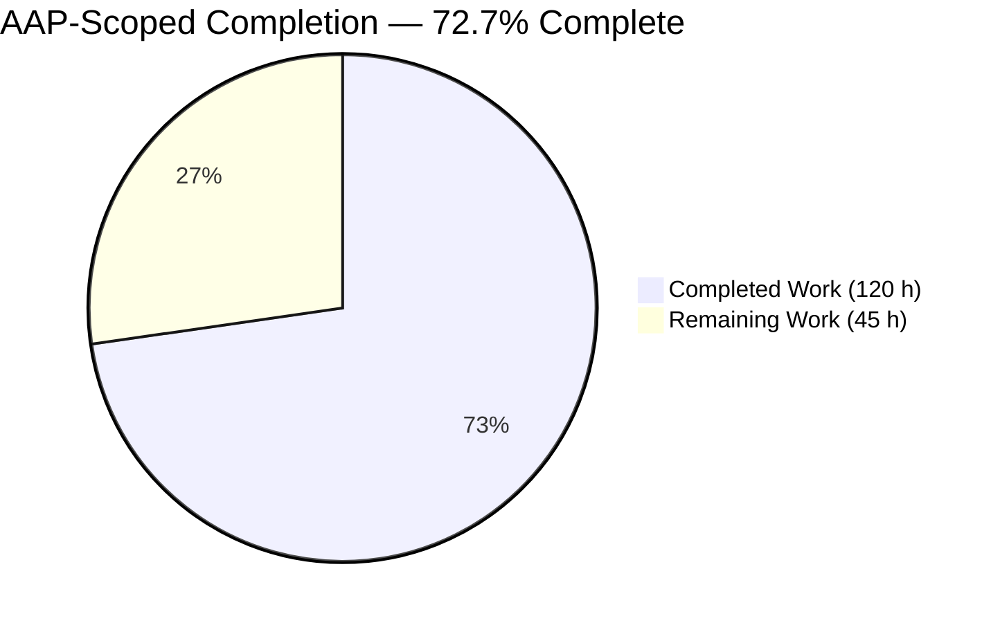
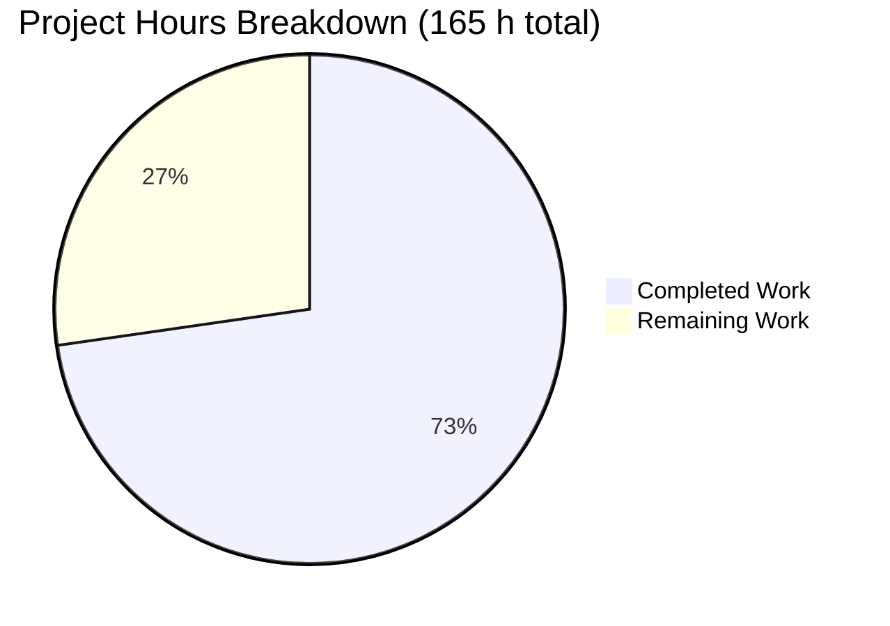
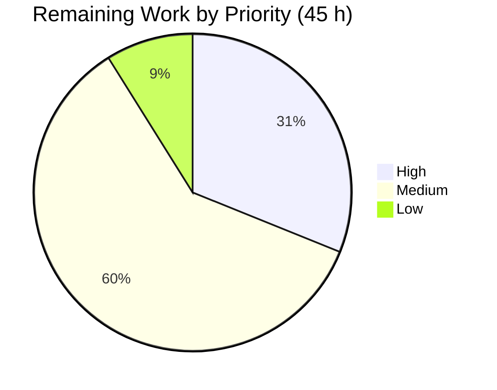
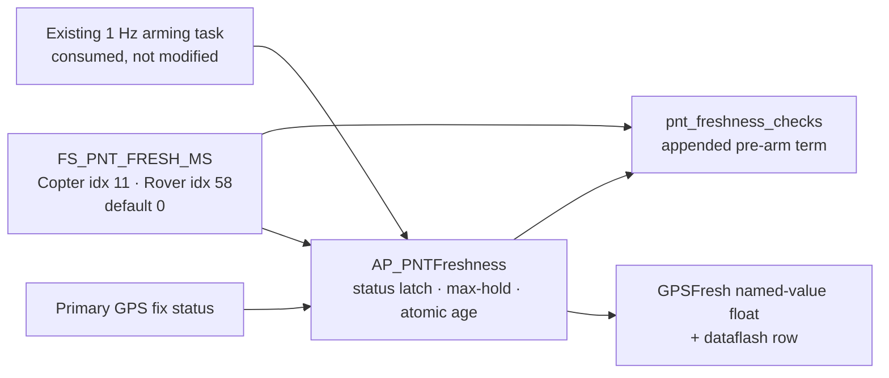

# 1. Executive Summary

## 1.1 Project Overview

This project makes position/navigation/timing (PNT) data-delivery consistency a configurable, observable property of an ArduPilot vehicle. A new parameter, `FS_PNT_FRESH_MS`, sets the maximum tolerable age of the last usable PNT fix. An allocation-free monitor tracks that age from GPS fix *status*, a new pre-arm check refuses arming once it exceeds the threshold, and the age is published as a `GPSFresh` MAVLink named-value float any ground station can watch. The feature ships disabled: at the default of `0`, behaviour is unchanged. Copter and Rover participate; other airframes link the code and stay inert.

## 1.2 Completion Status



Colours: **Completed = Dark Blue `#5B39F3`** · **Remaining = White `#FFFFFF`**

| Metric | Value |
|---|---|
| Total Hours | **165 h** |
| Completed Hours (AI + Manual) | **120 h** (120 h autonomous, 0 h manual) |
| Remaining Hours | **45 h** |
| Percent Complete | **72.7%** |

`120 / (120 + 45) × 100 = 72.7%`, over the AAP's requirements and acceptance gates plus the path-to-production work to release them.

## 1.3 Key Accomplishments

- `FS_PNT_FRESH_MS` live on Copter and Rover: default `0`, persists, reaches generated operator documentation for those two vehicles only.
- The monitored age grows monotonically through a total GPS outage, then collapses to zero one second after recovery.
- The gate refuses arming with `PreArm: PNT data stale (>N ms)` alongside — never instead of — existing checks.
- `GPSFresh` publishes at exactly 1 Hz armed and disarmed, on every active link, with a matching dataflash row.
- At the default: no message, no telemetry, no log row — checked against a pre-feature build.
- Plane, Sub, Blimp and AntennaTracker expose no parameter and stay silent, by construction.
- Three append-only simulation tests prove the gate, the anti-saw-tooth property and the default-off contract.

## 1.4 Critical Unresolved Issues

| Issue | Impact | Owner | ETA |
|---|---|---|---|
| An unrepresentable integer parameter write (e.g. `2147483647`) terminates a simulated vehicle inside the shared float-to-integer conversion used by every integer parameter | Robustness. For this parameter the exposure is bounded — the vehicle clamp yields `0`, so no unbounded threshold can result — and flight hardware installs no floating-point trap | Parameter-subsystem owner | 6 h |
| The one-command host unit-test gate exits non-zero on this compiler generation | A CI job running that command literally comes out red, at this commit and equally without the feature. The corpus itself passes 52/52 binaries and 878 cases | Toolchain owner | 4 h |
| The Rover regression shard needs the vendored-warning demotion exported, and the test that needs it leaves the build tree reconfigured | One shard failure out of the box, plus a stale configure for the next run | Autotest owner | 3 h |
| No committed test drives the pre-arm chain from a non-main thread, so nothing in CI guards the monitor's single-writer invariant | A future edit reintroducing shared mutable state on the check path would not be caught | Tech lead | 6 h |
| Out-of-range threshold values have no committed regression test | The clamp behaviour is verified but unguarded against regression | Autotest owner | 4 h |
| The feature has never run on hardware | Validation is simulation-only by plan; a real receiver has not driven the latch | Flight-test engineer | 8 h |

## 1.5 Access Issues

No access issues identified. The repository, its vendored submodules, the toolchain, the simulator and every delivery gate were reachable and exercised locally; the feature needs no credential.

## 1.6 Recommended Next Steps

1. **[High]** Raise the upstream pull request with the differentiation text supplied here, noting that helicopter builds also receive the parameter.
2. **[High]** Restore the one-command unit-test gate and the out-of-the-box Rover shard so CI is green without local flags.
3. **[High]** Bound the shared parameter float-to-integer conversion upstream, with a regression case per integer branch.
4. **[Medium]** Add the two missing guards: out-of-range thresholds, and a threaded caller driving the pre-arm chain.
5. **[Medium]** Validate on a GPS-equipped airframe, then publish release notes covering the resolution floor and clamp semantics.

# 2. Project Hours Breakdown

## 2.1 Completed Work Detail

| Component | Hours | Description |
|---|---|---|
| Freshness monitor — `libraries/AP_Arming/AP_PNTFreshness.{h,cpp}` | 20 | Status-latched age with wrap-safe unsigned arithmetic and max-hold saturation, published as one relaxed atomic store per tick; 8-byte allocation-free object, no singleton; threading contract and the mandated differentiation block written into the header |
| Shared arming integration — `libraries/AP_Arming/{AP_Arming.h,AP_Arming.cpp}` | 12 | `pnt_freshness_checks()`, the protected virtual threshold accessor with its zero base default, the shared range ceiling, by-value ownership of the monitor, its drive as the first statement of the 1 Hz `update()`, and one appended term in the non-short-circuit pre-arm chain |
| Copter parameter surface — `ArduCopter/Parameters.{h,cpp}` | 8 | `AP_Int32 fs_pnt_fresh_ms` plus the annotated `AP_GROUPINFO` entry at extension-table index 11, chosen after resolving the whole six-bit index space (the originally proposed index is occupied by the weathervane group), with the full metadata block that generates the operator documentation |
| Rover parity — `Rover/Parameters.{h,cpp}`, `Rover/AP_Arming_Rover.{h,cpp}` | 6 | The same parameter at `var_info` index 58 (Rover has no extension table) and the Rover threshold override, with metadata text kept character-identical to Copter's so the two tracks cannot drift |
| Copter threshold seam — `ArduCopter/AP_Arming_Copter.{h,cpp}` | 4 | The override that injects the vehicle-owned parameter into the shared base, clamping the signed value into the documented range before widening |
| `GPSFresh` telemetry channel | 4 | Publication through the existing GCS broadcast helper, guarded on the build configuration and on the enable condition, with its dataflash consequence analysed and confirmed to appear only when an operator opts in |
| Copter simulation proof — `Tools/autotest/arducopter.py` | 12 | Two append-only methods: the anti-saw-tooth gate test with a finite/non-negative validator and a per-sample elapsed-time envelope, and the default-off test with a forced pre-arm pass and a non-empty-collection precondition so silence cannot pass vacuously |
| Rover simulation proof — `Tools/autotest/rover.py` | 4 | The append-only twin, registered at the file's own indentation, carrying the bypass-parameter invariant its future editors need |
| Compile-guard matrix and cross-vehicle inertness | 6 | The monitor compiled clean in five feature-macro permutations, and Plane, Sub, Blimp and AntennaTracker verified to link the code, expose no parameter and emit nothing |
| Acceptance gate execution | 16 | Both vehicle builds, the host unit corpus, both simulation shards, the parameter-metadata gate, the Python cleanliness gate, the pre-commit hook set, the style-surface check, and the append-only diff discipline |
| Deep runtime and static verification | 28 | Functional matrix across the parameter, monitor, gate and bypass paths; telemetry cadence and dataflash correlation; performance, CPU and memory profiling against a purpose-built pre-feature build; robustness matrix over the parameter's whole input domain; concurrency analysis of the check path; and a file-by-file review of all fourteen paths against the plan's requirement, constraint and convention matrices |
| **Total** | **120** | |

## 2.2 Remaining Work Detail

| Category | Hours | Priority |
|---|---|---|
| Raise the upstream pull request, carrying the differentiation text and the helicopter note | 1 | High |
| Restore the one-command host unit-test gate (vendored gtest against this compiler, plus a missing standard include) | 4 | High |
| Make the Rover regression shard green out of the box and restore the configure it replaces | 3 | High |
| Bound the shared parameter float-to-integer conversion upstream, with a regression case per integer branch | 6 | High |
| Commit regression coverage for out-of-range threshold values | 4 | Medium |
| Add a CI guard for the monitor's single-writer invariant (scope decision, then a scripting- or DDS-driven harness) | 6 | Medium |
| Hardware-in-the-loop validation on a GPS-equipped airframe | 8 | Medium |
| Operator release documentation: helicopter recipients, resolution floor, clamp semantics, ground-station rendering variance | 3 | Medium |
| Upstream contribution cycle: rebase, maintainer review, parameter-name sign-off | 6 | Medium |
| Repository hygiene policy for the un-ignored simulation and metadata artefacts | 2 | Low |
| Sign off the two deliberate design departures (monitor interface, seam clamp) | 2 | Low |
| **Total** | **45** | |

## 2.3 Hours Reconciliation

| Check | Result |
|---|---|
| Section 2.1 total | 120 h |
| Section 2.2 total | 45 h |
| 2.1 + 2.2 | 165 h — equals Total Hours in Section 1.2 |
| Completion | 120 ÷ 165 = **72.7%** — the figure used in Sections 1.2, 7 and 8 |
| Section 7 pie values | Completed 120, Remaining 45 — identical to this table |

# 3. Test Results

Every figure below was produced by executing the suite on this branch and reading the result. Counts are test cases, not test files.

| Area / Category | Framework | Tests | Passed | Failed | Coverage | What This Proves |
|---|---|---|---|---|---|---|
| PNT freshness gate — Copter | ArduPilot autotest (SITL, JUnit) | 1 | 1 | 0 | Gate, telemetry and recovery paths | The published age climbs monotonically through a total outage, past the driver's own four-second timeout to 22,000 ms, arming is refused with the configured threshold in the message, and the age returns to zero one second after the receiver comes back |
| PNT default-off contract — Copter | ArduPilot autotest (SITL, JUnit) | 1 | 1 | 0 | Enable-gating of both artefacts | With the parameter at its shipped `0` and GPS starved, a forced pre-arm pass produces ten real status messages and not one of them is the stale-PNT text, and zero named-value floats of any name arrive — so silence is the feature being off, not a dead collector |
| PNT freshness gate — Rover | ArduPilot autotest (SITL, JUnit) | 1 | 1 | 0 | Rover parity of the same contract | The second vehicle reaches the same result through its own parameter index and threshold override: series to 22,001 ms, identical failure text, recovery to zero |
| Copter regression shard | ArduPilot autotest (SITL, JUnit) | 30 | 30 | 0 | The whole first Copter shard, including arming, parameters and logging | Twenty-eight pre-existing Copter behaviours are unchanged with the feature present at its default, and both new tests run inside the shard with no retry budget |
| Rover regression shard | ArduPilot autotest (SITL, JUnit) | 104 | 103 | 1 | The full Rover suite | Every Rover behaviour except one pre-existing networking test is unchanged; that test rebuilds the firmware mid-run and fails for build-environment reasons independent of this work |
| Host unit corpus | gtest via waf | 878 | 878 | 0 | 52 host test binaries across the library tree | The wider library tree is untouched by this change — no case was added, lost or broken |
| Parameter metadata generation | Repository metadata pipeline | 7 targets | 7 | 0 | All vehicle parameter documentation | The new parameter is emitted for Copter and Rover only, with correct units, range, increment and user level, and the operator-facing description the ground station will render |
| Static and style gates | flake8 / pre-commit / astyle | 4 gates | 4 | 0 | 73 Python files, all 14 touched paths | Both test suites are lint-clean at the project's column limit, all nine repository hooks pass with the tree byte-unchanged, and the style checker's scope was not widened to take in the new C++ files |

**Not Covered** — delivered behaviour that no test exercises. Each needs a human decision before release:

- **Out-of-range threshold values.** A negative value must leave the gate disabled and silent, and a value above the ceiling must gate at the ceiling and still fire. Both behaviours are implemented and were confirmed by direct observation, but no committed test guards them. Add coverage for a negative value and an above-ceiling value on both vehicles.
- **The pre-arm chain called from a non-main thread.** The monitor's correctness under the DDS and scripting entry points rests on a single-writer discipline that no committed test exercises. Add a scripting-driven or DDS-enabled job that hammers the chain while the threshold toggles under starvation.
- **The rollover saturation branch.** Reaching it needs 49.7 days without a usable fix, which no bounded simulation can produce. Its arithmetic is documented in place; treat it as reviewed rather than tested.
- **Builds with GPS or ground-station support compiled out.** These configurations were compile-verified in every permutation but never run, and no shippable firmware links the arming library with GPS support off.
- **Inertness on Plane, Sub, Blimp and AntennaTracker.** Confirmed by inspection and by driving each vehicle directly, but no committed test covers those airframes.
- **Behaviour on real hardware.** Validation is simulation-only. No test in this suite drives a physical receiver.

# 4. Runtime Validation & UI Verification

This project is flight-control firmware plus simulation test code. There is no web layer, no HTTP API and no screen inventory, so there is nothing to verify visually; runtime evidence is simulator transcripts, MAVLink captures, dataflash rows and JUnit results instead. Every line below reflects a flow that was actually driven.

- ✅ **Operational — Firmware start-up on both vehicles.** Copter and Rover boot from a wiped parameter store with the new parameter present at `0`, with no duplicate-group-index abort and no start-up warning.
- ✅ **Operational — Parameter read, write and persistence.** The parameter reads back as a 32-bit integer, accepts values across the documented range, survives a process restart, and can be enabled and disabled live with no reboot.
- ✅ **Operational — Healthy-fix baseline.** With a usable fix the published age sits at zero and arming is permitted with the gate enabled, so the check produces no false refusals.
- ✅ **Operational — Sustained outage.** With the simulated receiver disabled the age rises in one-second steps straight through the driver's four-second timeout and on past 22,000 ms in the committed tests, and past 71,000 ms in longer runs, never resetting.
- ✅ **Operational — Arming refusal.** The gate emits `PreArm: PNT data stale (>3000 ms)` at critical severity, a real arm command is rejected, and the vehicle stays disarmed.
- ✅ **Operational — Coexistence with existing checks.** The new failure is reported alongside the pre-existing GPS, EKF and battery failures rather than replacing any of them, and after the pre-existing ones, so chain order is intact.
- ✅ **Operational — Recovery.** Restoring the receiver collapses the age to zero on the next publication and clears the failure without a reboot.
- ✅ **Operational — `GPSFresh` telemetry and logging.** Published at 1 Hz both disarmed and armed, with no gap at the arm/disarm boundary, delivered to a late-joining second link with no burst, and matched one-for-one by dataflash rows.
- ✅ **Operational — Default-off across the fleet.** At the shipped default, a starved vehicle produces no stale message, no named-value float and no log row, checked against a purpose-built pre-feature build; Plane, Sub, Blimp and AntennaTracker have no parameter and stay silent while their ordinary GPS and EKF reporting continues.
- ⚠ **Partial — Documented bypass paths.** With arming checks disabled, and on Rover with arming not required, the gate is bypassed exactly as every other non-mandatory check is; telemetry continues throughout and restoring either parameter restores the refusal. Behaviour confirmed, but operators relying on this gate specifically must know it.

**Never exercised at runtime.** The rollover saturation branch, builds with GPS or ground-station support compiled out, and behaviour on physical hardware. The first two are compile-verified and reasoned in place; the third is scheduled in the remaining work.

# 5. Compliance & Quality Review

## 5.1 Compliance Matrix

Each row states where the deliverable stands now, against the Agent Action Plan's requirements and the repository's own quality benchmarks.

| # | Deliverable / Benchmark | Status | Verified State |
|---|---|---|---|
| 1 | Gating parameter `FS_PNT_FRESH_MS` on both vehicles | ✅ Pass | Copter extension-table index 11, Rover `var_info` index 58, both defaulting to `0`; emitted in generated documentation for exactly these two vehicles |
| 2 | Freshness monitor, allocation-free with a single latch | ✅ Pass | Two state words in an 8-byte object, no allocation, no singleton, one clock read and one status read per tick |
| 3 | Staleness derived from fix status, never from the message timestamp | ✅ Pass | The prohibited accessor appears nowhere in the arming library except inside the comments forbidding it; the age climbs past the driver timeout instead of saw-toothing at it |
| 4 | Monitor independent of the vehicle position predicates | ✅ Pass | No reference to either predicate; the vehicle header carrying them is not in the change set at all |
| 5 | Pre-arm check appended to the shared chain | ✅ Pass | One guarded term added after the final existing term; the only removed line in the whole change set is the semicolon that moved to make room, exactly as planned |
| 6 | Per-vehicle threshold injection through a protected virtual seam | ✅ Pass | Base returns `0`; Copter and Rover override it; the four non-participating vehicles are inert by construction |
| 7 | `GPSFresh` published through the existing broadcast helper | ✅ Pass | Eight-character name inside the ten-character wire limit, message id 251 only, no file under the telemetry library modified |
| 8 | Default-off contract — zero observable change at `0` | ✅ Pass | No message, no telemetry, no log row, no measurable CPU or memory cost, checked against a pre-feature build |
| 9 | Simulation proof, append-only in both suites | ✅ Pass | Two Copter methods and one Rover twin, each with a docstring and a unique name, no retry budget, zero removed lines |
| 10 | Differentiation from the driver timeout and from solution-quality checks, in code and in the delivery description | ✅ Pass | Present in both new source files, in the shared check's own header comment and in both parameter descriptions; the delivery half accompanies this submission |
| 11 | No build-manifest, style-gate or submodule change | ✅ Pass | The arming library was already linked and its sources glob-collected; the style checker's lists are untouched; all fifteen submodule pointers unmoved |
| 12 | Acceptance gates | ⚠ 9 of 11 green as written | Build, simulation, monotonic-age, default-off, append-only, metadata, cleanliness, hook-set and style gates all green. The host unit-corpus and Rover-shard gates are green in substance but need local flags or a toolchain repair to pass as single commands — see 5.2 |

## 5.2 AAP & Rule Divergences and Gaps

No user-specified rules exist for this project, so no rule divergence is possible: the rules document was read in full and contains none, and the plan's own rules section records the same. The eight divergences below are all from the Agent Action Plan.

| # | What the AAP/Rule Required | What Was Delivered Instead | Why It Diverged | Impact | Remediation |
|---|---|---|---|---|---|
| 1 | A monitor of "three words of state and five accessors", with a no-argument stale predicate and stored-threshold accessors | Two state words, the age published as an atomic, and threshold-parameterised `enabled()`/`is_stale()`; no stored threshold and no setter | The pre-arm chain is reachable from worker threads, so a stored threshold is written by two of them | Strengthens the guarantee; no planned behaviour lost | Accept, or ask for the literal shape and accept a lock |
| 2 | The age as the single expression `now_ms - _last_good_ms` | The same subtraction wrapped in a max-hold that only adopts a growing age | The bare form folds back through zero at the 32-bit boundary and would reopen the gate | Identical below 49.7 days; saturates instead of folding | None required |
| 3 | Both vehicle seams as pure parameter forwarders | Each seam clamps into `0..60000` before widening, against a shared ceiling declared in the arming header | The parameter store does not enforce the documented range, and a bare cast turns `-1` into the largest unsigned value | Out-of-range values now behave as documented rather than neutralising the gate | Confirm the clamp policy is wanted |
| 4 | Host unit corpus green via one command | The corpus run through a debug configure and a keep-going build, then each binary executed | That command aborts on a vendored test framework this compiler rejects | The gate is red as a single command, here and without the feature | Repair the toolchain (4 h) |
| 5 | Rover shard green | 104 cases with one pre-existing failure unless a warning demotion is exported | A pre-existing test rebuilds the firmware mid-run without that demotion | Shard red out of the box; the new test unaffected | Fix that test's reconfigure (3 h) |
| 6 | Specific baseline flash sizes and 881 unit cases | 4,491,565 B and 4,126,749 B; 878 cases | A different compiler generation than the plan's baseline | Informational; the size comparison is advisory | None |
| 7 | An impact analysis naming the affected vehicles | Traditional-helicopter builds also receive and honour the parameter | Helicopters share the Copter parameter table | An audience the plan did not name | Cover them in release notes (part of 3 h) |
| 8 | A fixed inventory of two Copter tests and one Rover test | Exactly that inventory | Holding the inventory left out-of-range threshold behaviour uncovered | A verified behaviour with no regression guard | Add the coverage (4 h) |

**1 — Monitor interface narrowed.** The plan sketched three plain words with a stored threshold and a no-argument stale predicate. The delivered class holds `_last_good_ms`, owned outright by `update()`, and publishes the age as a `std::atomic<uint32_t>` written once per tick; the threshold arrives as an argument (`libraries/AP_Arming/AP_PNTFreshness.h:43-55`). The reason is concrete: `pre_arm_checks()` runs from the DDS worker thread and the scripting `arming:pre_arm_checks()` binding, so a stored threshold would be written by two threads and could read back as `0` — disabled — passing a vehicle whose PNT had stopped. Every plan-visible property survives: zero disables gate and publication, the latch is status-only, the emission text is verbatim. Accept the narrowed interface, or restate the sketch and accept a lock.

**2 — Age arithmetic max-held.** The plan gives the age as one unsigned subtraction. `libraries/AP_Arming/AP_PNTFreshness.cpp:45-55` performs exactly that subtraction, then retains the previously published value if the new one is smaller. Without this, a vehicle that had gone 49.7 days without a usable fix would see the modular difference fold back to nearly nothing, `is_stale()` would return false, and the gate would open on a vehicle with no PNT at all — the opposite of the requirement that the value grow monotonically. For every interval shorter than that period the two forms are arithmetically identical, which the committed series demonstrates. Nothing is required of the reader beyond knowing that the age saturates rather than wrapping.

**3 — Vehicle seams clamp the parameter.** The plan specified each override as a bare cast of the vehicle parameter. Both seams instead clamp into `0..60000` first (`ArduCopter/AP_Arming_Copter.cpp`, `Rover/AP_Arming_Rover.cpp`, against `PNT_FRESH_MS_MAX` in `libraries/AP_Arming/AP_Arming.h`). The parameter store does not enforce the range its own metadata publishes, so a stored `-1` would widen to the largest unsigned value: the feature would look enabled and keep publishing while being impossible to trip. The clamp closes that, at one operator-visible cost — a stored `100000` gates at `60000` while the parameter still reads back as `100000`. Both parameter descriptions state this. Confirm the policy, or have out-of-range positives honoured verbatim instead.

**4 — Host unit-corpus gate command.** The plan's gate is a single command over the whole host corpus. That command aborts before running anything, because the vendored test framework pinned in this tree declares a virtual method this compiler insists be marked `override`; two further translation units fail behind it for the same generational reason. The corpus itself is unaffected: configured for debug and built keep-going, 52 binaries build and every one passes, 878 cases with no failure. The condition is present without the feature too, and no file this project touches appears in any diagnostic. Repairing the toolchain restores the single-command form.

**5 — Rover shard.** The plan expects the Rover suite to pass outright. It reports 104 cases with a single failure: a pre-existing networking test that reconfigures and rebuilds the firmware in the middle of the run without the vendored-warning demotion the rest of the build uses, so its rebuild fails. The same test fails identically on a tree without this feature, and it also leaves the build configured for debug and PPP afterwards, which surprises the next run. The new Rover test passes inside that shard. Give that test's reconfigure the demotion, or land the one-line vendored fix upstream, and have it restore the configure it replaced.

**6 — Baseline figures.** The plan records absolute flash sizes of 4,437,069 B and 4,076,637 B and a corpus of 881 cases. This compiler generation produces 4,491,565 B and 4,126,749 B, and 878 cases — the same 878 on a tree without the feature, so the delta is environmental rather than attributable. Measured against an identically built pre-feature tree the feature costs +872 B on Copter and +776 B on Rover, about 0.02%, with no change in static or zero-initialised data. The plan itself notes that the size comparison is advisory by construction, so nothing here blocks release; only the absolute numbers in the plan are stale.

**7 — Helicopter builds.** The plan's impact analysis lists which vehicles gain the parameter and which stay inert, and omits traditional helicopters. They are Copter-class and share `ArduCopter/Parameters.cpp`, so their firmware carries `FS_PNT_FRESH_MS` and both threshold symbols and honours the gate exactly as a multirotor does. There is no defect — the behaviour is correct and consistent — but an audience the plan did not name will find the parameter on their aircraft. On a default helicopter configuration the pre-arm text is additionally suppressed by the pre-existing motor-interlock short-circuit until the interlock is low. Name helicopters in the release notes.

**8 — Out-of-range test coverage.** The plan fixes the test inventory at two Copter methods and one Rover method, and that is exactly what shipped. The consequence is that the clamp behaviour of divergence 3 — the most likely operator mistake, a negative or absurdly large threshold — has no committed regression test, even though it was confirmed by direct observation across the parameter's whole input domain. Any future edit to either seam could silently reintroduce the enabled-but-untrippable state. Add one test per vehicle asserting that a negative value publishes nothing and refuses nothing, and that an above-ceiling value gates at the ceiling and still fires.

# 6. Risk Assessment

Forward-looking only: what could still go wrong once this is enabled on a real vehicle or run in continuous integration.

| Risk | Category | Severity | Probability | Mitigation | Status |
|---|---|---|---|---|---|
| The age has one-second granularity because the monitor runs on the existing 1 Hz arming task, so thresholds below roughly 2,000 ms cannot be resolved and an operator could configure a gate that never behaves as intended | Technical | Medium | Medium | The parameter's own description states the floor; guidance is to configure 2,000 ms or more. Enabling the feature also costs one telemetry message and roughly 1.9 KB per minute of log volume, which is why it is off by default | Accepted — documented |
| Detection lags a real outage by up to one driver timeout, because the latch follows fix *status* and the GPS driver may hold a usable status for its own fixed four seconds after data stops | Technical | Medium | High | Stated in the monitor header and in the operator-facing description; thresholds should be chosen with that latency added. Binding to the status singleton is what keeps the signal vehicle-agnostic and free of the driver's self-re-arming timer | Accepted by design |
| An unrepresentable integer parameter write terminates a simulated vehicle inside the shared float-to-integer conversion that every integer parameter uses; a crafted or fat-fingered ground-station write is enough to trigger it | Security | High | Low | For this parameter the seam clamp bounds the result to `0..60000`, so no unbounded threshold can result, and flight hardware installs no floating-point trap. The conversion needs an upstream bound covering all three integer widths | Open — 6 h in Section 2.2 |
| The monitor's single-writer discipline is protected by review and an in-code contract rather than by continuous integration, so a future edit that reintroduces shared mutable state on the check path would ship unnoticed | Technical | Medium | Low | The threading contract is written into the header beside the state it governs; the guard described in Section 2.2 closes the gap | Open — 6 h in Section 2.2 |
| The gate is bypassed when arming checks are disabled, and on Rover when arming is not required — correct and consistent with every other non-mandatory check, but an operator relying on this gate specifically may not expect it | Operational | Medium | Medium | Documented behaviour, confirmed at runtime on both paths, and called out in the Rover test so future editors do not disable it accidentally | Accepted — documented |
| The feature has never driven a physical receiver, so real-world status transitions, receiver reacquisition timing and airframe-specific behaviour are unproven | Integration | Medium | Medium | Validation was scoped to simulation deliberately; run the hardware pass before enabling the parameter operationally | Open — 8 h in Section 2.2 |
| Two acceptance gate commands cannot run green on this compiler generation, so a continuous-integration job invoking them literally reports red — at this commit and equally without the feature | Integration | Medium | High | The substitute route exercises the identical corpus and passes; both commands are restored by the two toolchain items in Section 2.2 | Open — 7 h in Section 2.2 |
| Residual documentation and coverage gaps: helicopter builds receive the parameter without release-note coverage, ground-station rendering of the channel varies by station, and the rollover and GPS-disabled code paths are reasoned rather than run | Operational | Low | Medium | Release notes close the first two; the third is compile-verified in every permutation and unreachable in a bounded simulation | Open — 3 h in Section 2.2 |

# 7. Visual Project Status

**Overall progress — 72.7% complete.** Chart convention throughout this guide: **Completed / AI work = Dark Blue `#5B39F3`**, **Remaining / not completed = White `#FFFFFF`**, headings and accents Violet-Black `#B23AF2`, highlights Mint `#A8FDD9`.



**Remaining work by priority** — the 45 remaining hours split High 14 h, Medium 27 h, Low 4 h. All three slices are remaining work, so all three carry the Remaining colour (`#FFFFFF`) against the completed 120 h shown above in `#5B39F3`.



**Remaining hours by category**

| Category | Hours | Share of remaining |
|---|---|---|
| Continuous-integration and toolchain restoration | 7 | 15.6% |
| Upstream robustness fix for the shared parameter conversion | 6 | 13.3% |
| Missing regression guards (out-of-range values, threaded caller) | 10 | 22.2% |
| Hardware validation | 8 | 17.8% |
| Upstream contribution cycle and pull request | 7 | 15.6% |
| Operator documentation | 3 | 6.7% |
| Hygiene policy and design sign-off | 4 | 8.9% |
| **Total** | **45** | **100%** |

**Delivered surface at a glance**



# 8. Summary & Recommendations

**What was delivered.** PNT data-delivery consistency is now a configurable, observable property of an ArduPilot vehicle, in fourteen files: two new sources in the shared arming library holding a status-latched freshness monitor, four modified arming-library files wiring it into the pre-arm chain behind a per-vehicle threshold seam, eight vehicle files exposing `FS_PNT_FRESH_MS` on Copter and Rover with the metadata that generates their operator documentation, and two simulation suites gaining three purely additive tests. The feature reuses the existing 1 Hz arming task and the existing ground-station broadcast helper, so no scheduler table, no vehicle main file, no telemetry-layer file and no build manifest changed, and no vendored submodule moved. The whole change set is 506 added lines against a single removed line — the semicolon that moved to make room for the new chain term.

**What was verified.** Every capability was exercised rather than assumed. The age climbs monotonically through a total outage, straight past the GPS driver's own four-second timeout and on to tens of seconds, then collapses to zero one second after the receiver returns; the gate refuses a real arm command with the operator's own threshold in the message and coexists with every existing pre-arm rather than replacing one; the channel publishes at exactly 1 Hz armed and disarmed and is matched one-for-one by dataflash rows. The default-off contract was proved the hard way, against a purpose-built pre-feature binary: identical parameter sets, identical message-type sets, identical telemetry bandwidth, zero log rows, no measurable CPU or memory cost. The three new tests pass, the 30-case Copter shard is clean, the 104-case Rover suite has one pre-existing failure unrelated to this work, the 878-case host corpus is untouched, and the metadata, lint, hook and style gates are all green.

**What remains.** The project stands at **72.7% of its AAP-scoped and path-to-production hours — 120 of 165 — with 45 hours outstanding.** None of that is unfinished feature code: all five plan requirements and all eleven implicit requirements are complete and verified. The remaining work is the path to a released, upstreamable change. Fourteen hours are release-blocking: raise the pull request, restore the two acceptance gate commands that this compiler generation breaks, and bound the shared parameter conversion so an unrepresentable write cannot terminate a process. Twenty-seven hours are the quality and integration tail: two missing regression guards, a hardware validation pass, operator release notes, and the upstream review cycle. Four hours are policy sign-off on the two deliberate design departures documented in Section 5.2.

**Critical path to production.** Close the four high-priority items first, in that order — the pull request unblocks review, the toolchain repairs make continuous integration meaningful, and the conversion fix removes the only high-severity risk on the board. Then add the out-of-range and threaded-caller guards, because both protect properties that are correct today but unguarded against the next edit. Only after that does the hardware pass make sense: it is the last thing standing between a verified simulation result and a parameter an operator can safely enable in flight. Success is measurable — both gate commands green from a clean checkout, five committed tests instead of three, one hardware sortie showing the gate fire and clear on a real receiver, and release notes that name helicopters and state the one-second resolution floor.

**Production readiness.** The feature is safe to merge and unsafe to enable blind — which is exactly what a default of `0` encodes. A vehicle that takes this firmware and never touches the parameter is indistinguishable from one that never had it, verified against a pre-feature build, so the merge risk is genuinely low. Enabling it is a different decision: the age lags a real outage by up to the driver's own timeout, it resolves to one second, and the gate is bypassed on the same paths every other non-mandatory check is. Those are properties to configure around, all three documented in the parameter's own description, not defects. Recommendation: merge behind the default, close the four high-priority items, then enable per airframe after the hardware pass.

# 9. Development Guide

Every command below was executed on this branch and produced the output described. Run them from the repository root unless a step says otherwise.

## 9.1 System Prerequisites

- Linux x86-64 (verified on Ubuntu 25.10). No container, database or service is required.
- Python 3.13 with the project's tooling: `pymavlink`, `MAVProxy`, `pexpect`, `future`, `empy` (pinned at 3.3.4), `lxml`, `flake8`, `junitparser`, `numpy`.
- GCC/G++ 15.2, `make`, `git`, `git-lfs`, `astyle`, `valgrind`, `lsof`, `screen`.
- `ccache` is optional but strongly recommended — a warm rebuild of both vehicles takes seconds instead of minutes.
- Roughly 4 GB of free disk for the build tree; 4 CPUs is comfortable for the simulation suites.

## 9.2 Environment Setup

Non-interactive shells — including CI runners — do not read the login profile, so activate the project virtualenv explicitly. Where the tooling is also installed system-wide, an unactivated `python3` and `./waf` work too.

```bash
source <path-to-project-venv>/bin/activate    # explicit: non-interactive shells skip the profile
export PATH=/usr/lib/ccache:$PATH             # optional: fast rebuilds
python3 --version                             # expect: Python 3.13.7
gcc --version | head -1                       # expect: gcc (Ubuntu 15.2.0-...) 15.2.0
```

No environment variable and no secret is needed to build, run or test this feature.

## 9.3 Build

The warning demotion below is required at this commit **and** at the commit this branch started from: a vendored block-device source carries an unused local that this simulation board promotes to an error. Do not edit the submodule or the board definition to work around it.

```bash
CFLAGS="-Wno-error=unused-variable" ./waf configure --board=sitl
./waf copter rover
```

Expected tail of a successful build:

```text
BUILD SUMMARY
Target          Text (B)  Data (B)  BSS (B)  Total Flash Used (B)
bin/arducopter   4293096    198469   278368               4491565
bin/ardurover    3947336    179413   277088               4126749
'rover' finished successfully
```

A full build reports 14 warnings, every one of them in vendored MAVLink headers, an unrelated barometer driver or the vendored block-device source. None comes from the feature's files.

## 9.4 Run the Feature's Tests

```bash
export BUILDLOGS="$HOME/buildlogs"
python3 Tools/autotest/autotest.py --no-clean --no-configure --junit test.Copter.PNTHealthGatePreArm
python3 Tools/autotest/autotest.py --no-clean --no-configure --junit test.Copter.PNTHealthGateDisabledIsNoop
python3 Tools/autotest/autotest.py --no-clean --no-configure --junit test.Rover.PNTHealthGatePreArm
```

Each ends with `>>>> PASSED STEP` and writes a JUnit file with `tests="1" errors="0" failures="0"`. The gate test prints the evidence you care about:

```text
Healthy baseline GPSFresh=0.000000
GPSFresh series while starved: [2000.0, 4000.0, 6000.0, ... 22000.0]
AP: PreArm: PNT data stale (>3000 ms)
Recovered GPSFresh=0.000000
```

and the default-off test prints `Collected 10 STATUSTEXT and 0 NAMED_VALUE_FLOAT while disabled`.

## 9.5 Run the Regression Shards

```bash
# Copter — 30 cases, ~2.5 minutes
python3 Tools/autotest/autotest.py --no-clean --no-configure --junit test.CopterTests1a

# Rover — 104 cases, ~10 minutes; run from the repository root
CFLAGS="-Wno-error=unused-variable" \
  python3 Tools/autotest/autotest.py --no-clean --no-configure --junit test.Rover
```

The Copter shard is clean. The Rover shard contains one pre-existing networking test that rebuilds the firmware mid-run: it needs the demotion above, it resolves the binary path relative to the working directory, and it leaves the tree configured for debug and PPP. Reconfigure with the Section 9.3 command after any Rover shard run.

## 9.6 Run the Host Unit Corpus

The single-command form aborts before running anything, on a vendored test framework this compiler rejects. Use this route, which exercises the identical corpus:

```bash
CFLAGS="-Wno-error=unused-variable" \
CXXFLAGS="-Wno-error=suggest-override -Wno-error=missing-declarations -Wno-error=maybe-uninitialized" \
  ./waf configure --board=sitl --debug
./waf tests -k
ulimit -c 0
for t in build/sitl/tests/*; do "$t" >/dev/null || echo "FAILED $t"; done

# restore the release configure afterwards
CFLAGS="-Wno-error=unused-variable" ./waf configure --board=sitl && ./waf copter rover
```

Expect 52 binaries, all passing, 878 cases, no failure. `./waf tests -k` reports exactly two translation units failing to compile; both are pre-existing and unrelated to this feature, and `-k` keeps going past them. The `--debug` configure is not optional — thirteen death-test cases fail without it.

## 9.7 Run the Delivery Gates

```bash
CI_BUILD_TARGET=param_parse Tools/scripts/build_ci.sh          # 7 vehicle targets, "build OK"
CI_BUILD_TARGET=python-cleanliness Tools/scripts/build_ci.sh    # 73 files, "build OK"
./Tools/scripts/run_astyle.py --dry-run                         # exit 0
pre-commit run --all-files                                      # 9 hooks, all Passed
python3 -m flake8 Tools/autotest/arducopter.py Tools/autotest/rover.py
```

## 9.8 Inspect and Exercise the Feature

Read the operator documentation the metadata pipeline generates for the new parameter:

```bash
python3 Tools/autotest/param_metadata/param_parse.py --vehicle ArduCopter --format xml
grep -A5 'FS_PNT_FRESH_MS' apm.pdef.xml
rm -f apm.pdef.xml ParametersLatex.rst Parameters.rst Parameters.md Parameters.html tasklist.json
```

Confirm both tests are discoverable — this is also the runtime proof that the harness's docstring and unique-name rules are satisfied:

```bash
python3 Tools/autotest/autotest.py --list-subtests-for-vehicle Copter | tr ' ' '\n' | grep PNTHealth
python3 Tools/autotest/autotest.py --list-subtests-for-vehicle Rover  | tr ' ' '\n' | grep PNTHealth
```

Run the firmware interactively from a scratch directory outside the checkout, then connect a ground station or MAVProxy:

```bash
mkdir -p "$HOME/sitl-scratch" && cd "$HOME/sitl-scratch"
"$OLDPWD/build/sitl/bin/arducopter" --model quad --speedup 10 \
    --defaults "$OLDPWD/Tools/autotest/default_params/copter.parm" \
    --home -35.363261,149.165230,584,353 --wipe -I0
# SERIAL0 appears on tcp:127.0.0.1:5760 (add 10 per -I instance)
```

Then, from the ground station: read `FS_PNT_FRESH_MS` (it is `0`, and no `GPSFresh` message arrives); set it to `3000`; watch `GPSFresh` appear once per second; set `SIM_GPS1_ENABLE` to `0` and watch the value climb past 4,000 ms while `PreArm: PNT data stale (>3000 ms)` appears and arming is refused; set `SIM_GPS1_ENABLE` back to `1` and watch it collapse to zero.

## 9.9 Troubleshooting

- **`configure` fails: unused variable `bd`.** A vendored block-device source trips this board's unconditional warning promotion. Prepend `CFLAGS="-Wno-error=unused-variable"`. Pre-existing; do not edit the submodule, the board definition or the build script.
- **`./waf check-all` exits 1 on a `can be marked override` error in the vendored test framework.** Pre-existing on this compiler. Use Section 9.6 instead; the corpus is green there.
- **`./waf tests` stops at the first broken translation unit.** Use `-k`. Two units fail for pre-existing reasons; the other 52 binaries build and pass.
- **Thirteen unit cases fail with exit-expectation errors.** The corpus was configured without `--debug`. Reconfigure as in Section 9.6.
- **`bind failed on port 5760` or `autotest is locked`.** Another simulator holds the default ports. For manual runs pass a different `-I<N>`; for suite runs wait for the other run to finish.
- **The Rover shard's networking test fails and the next build comes out debug.** Expected: that test reconfigures the tree and does not restore it. Re-run the Section 9.3 configure and build.
- **`git status` shows generated files after gates or shards.** Delete `ParametersLatex.rst`, `Parameters.{rst,md,html}`, `apm.pdef.{xml,json}`, `tasklist.json`, `harmonicnotch_test*.csv`, `core.*`, `eeprom.bin`, `logs/`, `terrain/` and `autotest-*.tlog`. Do not add ignore rules for them.
- **The gate never fires even with a threshold set.** Check `ARMING_CHECK`, and on Rover `ARMING_REQUIRE`: at zero either one bypasses the shared pre-arm chain the gate lives in, exactly as for every other non-mandatory check.
- **A threshold below ~2,000 ms behaves erratically.** The monitor runs at 1 Hz, so the age resolves to one second. Configure 2,000 ms or more.

# 10. Appendices

## A. Command Reference

| Purpose | Command |
|---|---|
| Activate the project virtualenv | `source <path-to-project-venv>/bin/activate` |
| Configure for simulation | `CFLAGS="-Wno-error=unused-variable" ./waf configure --board=sitl` |
| Build both participating vehicles | `./waf copter rover` |
| Build every vehicle | `./waf copter heli plane rover sub blimp antennatracker` |
| Run one feature test | `python3 Tools/autotest/autotest.py --no-clean --no-configure --junit test.Copter.PNTHealthGatePreArm` |
| Run the Copter shard | `python3 Tools/autotest/autotest.py --no-clean --no-configure --junit test.CopterTests1a` |
| Run the Rover suite | `CFLAGS="-Wno-error=unused-variable" python3 Tools/autotest/autotest.py --no-clean --no-configure --junit test.Rover` |
| Configure for the unit corpus | `CFLAGS="-Wno-error=unused-variable" CXXFLAGS="-Wno-error=suggest-override -Wno-error=missing-declarations -Wno-error=maybe-uninitialized" ./waf configure --board=sitl --debug` |
| Build and run the unit corpus | `./waf tests -k` then `ulimit -c 0; for t in build/sitl/tests/*; do "$t" >/dev/null \|\| echo "FAILED $t"; done` |
| Parameter metadata gate | `CI_BUILD_TARGET=param_parse Tools/scripts/build_ci.sh` |
| Python cleanliness gate | `CI_BUILD_TARGET=python-cleanliness Tools/scripts/build_ci.sh` |
| Style-surface check | `./Tools/scripts/run_astyle.py --dry-run` |
| Repository hook set | `pre-commit run --all-files` |
| Lint the two suites directly | `python3 -m flake8 Tools/autotest/arducopter.py Tools/autotest/rover.py` |
| List a vehicle's subtests | `python3 Tools/autotest/autotest.py --list-subtests-for-vehicle Copter` |
| Confirm the change surface | `git diff --name-status main...HEAD` and `git diff --numstat main...HEAD` |

## B. Port Reference

| Port | Purpose |
|---|---|
| 5760 | Simulated vehicle SERIAL0 — primary MAVLink endpoint (`tcp:127.0.0.1:5760`) |
| 5762 | Simulated vehicle SERIAL1 — second MAVLink link, used to prove channel fan-out |
| 5760 + 10 × N | SERIAL0 for instance `-I<N>`; instance 3 listens on 5790 |
| 5501 | MAVProxy/GCS output stream used by the test harness |
| 9035 | Simulated IR-lock sensor endpoint opened by the simulator |

No port needs to be open externally; everything is loopback.

## C. Key File Locations

| Path | Role |
|---|---|
| `libraries/AP_Arming/AP_PNTFreshness.h` | Monitor declaration, threading contract, and the differentiation the feature is required to state in code |
| `libraries/AP_Arming/AP_PNTFreshness.cpp` | The single `update()`: status latch, max-held age, one atomic publication, guarded `GPSFresh` send |
| `libraries/AP_Arming/AP_Arming.h` | By-value monitor, the check declaration, the protected virtual threshold accessor, the shared range ceiling |
| `libraries/AP_Arming/AP_Arming.cpp` | Monitor drive at the top of the 1 Hz `update()`, the check definition, the zero base default, the appended chain term |
| `ArduCopter/Parameters.h`, `ArduCopter/Parameters.cpp` | `FS_PNT_FRESH_MS` member and its annotated table entry at extension-table index 11 |
| `ArduCopter/AP_Arming_Copter.h`, `.cpp` | Copter threshold override with the range clamp |
| `Rover/Parameters.h`, `Rover/Parameters.cpp` | The same parameter at `var_info` index 58 |
| `Rover/AP_Arming_Rover.h`, `.cpp` | Rover threshold override, identical conversion |
| `Tools/autotest/arducopter.py:13570`, `:13664` | `PNTHealthGatePreArm` and `PNTHealthGateDisabledIsNoop` |
| `Tools/autotest/rover.py:6914` | The Rover `PNTHealthGatePreArm` twin |

## D. Technology Versions

| Component | Version |
|---|---|
| Python | 3.13.7 |
| GCC / G++ | 15.2.0 (Ubuntu 15.2.0-4ubuntu4) |
| waf | 2.0.27 |
| ccache | 4.11.2 |
| pymavlink | 2.4.49 |
| MAVProxy | 1.8.74 |
| flake8 | 7.3.0 (pycodestyle 2.14.0, pyflakes 3.4.0) |
| pre-commit | 4.6.2 |
| astyle | 3.1 |
| empy | 3.3.4 (the only pinned package) |
| Vendored submodules | 15, all at their original pins |

## E. Environment Variable Reference

| Variable | Purpose |
|---|---|
| `CFLAGS="-Wno-error=unused-variable"` | Required at configure time, and for any suite step that reconfigures, because a vendored block-device source has an unused local this board promotes to an error |
| `CXXFLAGS="-Wno-error=suggest-override -Wno-error=missing-declarations -Wno-error=maybe-uninitialized"` | Needed only for the unit-corpus configure |
| `BUILDLOGS` | Directory the test harness writes its per-test logs and JUnit files into |
| `CI_BUILD_TARGET` | Selects which delivery gate `Tools/scripts/build_ci.sh` runs (`param_parse`, `python-cleanliness`, `astyle-cleanliness`) |
| `PATH=/usr/lib/ccache:$PATH` | Optional; enables the compiler cache |

The feature itself reads no environment variable and requires no secret.

## F. Developer Tools Guide

| Task | How |
|---|---|
| Watch the freshness channel | Any ground station that shows named-value floats will render `GPSFresh`; the value is broadcast on the standard generic channel, so no message-specific support is needed to receive it. Rendering support differs between stations |
| Simulate a receiver outage | Set `SIM_GPS1_ENABLE` to `0`. It must be set explicitly — the first instance self-enables when left unconfigured |
| Force a pre-arm reporting pass | Send `MAV_CMD_RUN_PREARM_CHECKS`; failing checks otherwise re-display on the pre-existing ~30-second cadence |
| Read the age from a log | Look for `NVF` rows named `GPSFresh`; one is written per publication where logging is enabled |
| Confirm append-only discipline | `git diff --numstat main...HEAD -- Tools/autotest/` must show additions and zero deletions |
| Check the parameter index space before adding another | Group indices span 0–63 with 0 aliasing 63, and a duplicate index is a fatal error at boot, not a warning |

## G. Glossary

| Term | Meaning |
|---|---|
| PNT | Position, navigation and timing — the vehicle's fix data considered as a delivered service |
| Freshness / staleness | How long ago the primary GPS last reported a usable fix status. This is a delivery-cadence measure, not a solution-quality one |
| Delivery cadence vs solution quality | This gate asks whether fix data is still arriving; the EKF variance and position-estimate pre-arms ask whether the fix is good. Distinct mechanisms with distinct thresholds |
| Driver timeout | The GPS driver's own fixed four-second message timeout, which re-arms its own timer on expiry — which is why this feature latches on fix status instead |
| Latch | The single stored timestamp of the last usable fix status; it stops advancing during an outage, which is what lets the age grow without bound |
| Max-hold | Retaining the previously published age when a newly computed one is smaller, so the value saturates instead of folding through zero at the 32-bit millisecond boundary |
| `GPSFresh` | The named-value-float channel carrying the age, published once per second while the feature is enabled |
| Pre-arm check | A test evaluated before arming; the shared chain is deliberately non-short-circuit so every failure is reported |
| SITL | Software-in-the-loop — the simulator all validation here was performed in |
| Shard | A named group of simulation tests run as one continuous-integration step |
| Extension table | A second parameter group table a vehicle uses once its primary table's index space is exhausted |
