# ArduPilot System Architecture


## Table of Contents

- [Overview](#overview)
- [Layered Architecture](#layered-architecture)
- [Component Relationships](#component-relationships)
- [Main Loop and Scheduler](#main-loop-and-scheduler)
- [Sensor Data Flow](#sensor-data-flow)
- [Navigation and Control System](#navigation-and-control-system)
- [Communication Architecture](#communication-architecture)
- [Mission Execution and State Machines](#mission-execution-and-state-machines)
- [Failsafe System Architecture](#failsafe-system-architecture)
- [Parameter System](#parameter-system)
- [Logging and Telemetry](#logging-and-telemetry)
- [Hardware Abstraction Layer](#hardware-abstraction-layer)
- [Vehicle-Specific Architectures](#vehicle-specific-architectures)
- [Integration Points](#integration-points)
- [Glossary](#glossary)

## Overview

ArduPilot is a comprehensive, safety-critical autopilot software platform designed to control unmanned vehicles across multiple domains including multirotors, fixed-wing aircraft, ground vehicles, surface vessels, underwater vehicles, and antenna trackers. The system implements a sophisticated real-time control architecture that processes sensor data, executes navigation algorithms, and controls actuators with deterministic timing guarantees.

### Design Principles

The ArduPilot architecture is built on several core principles:

- **Modularity**: Clear separation of concerns through well-defined libraries and interfaces
- **Portability**: Hardware abstraction enabling deployment across diverse platforms
- **Safety**: Multiple layers of failsafe mechanisms and health monitoring
- **Extensibility**: Plugin architecture for sensors, actuators, and vehicle types
- **Real-time Performance**: Deterministic scheduling with timing guarantees
- **Open Architecture**: Well-documented interfaces enabling community contribution

### System Characteristics

- **Primary Language**: C++ with object-oriented design patterns
- **Real-time OS**: ChibiOS for embedded platforms, POSIX for Linux-based systems
- **Execution Model**: Cooperative multitasking with priority-based scheduling
- **Memory Management**: Static allocation for deterministic behavior
- **Communication**: MAVLink protocol for ground station and inter-vehicle communication
- **Coordinate Systems**: NED (North-East-Down) for navigation, body frame for control

## Layered Architecture

ArduPilot implements a layered architecture that provides clear separation between hardware-specific code, platform-independent libraries, and vehicle-specific logic. This design enables code reuse across platforms while maintaining the ability to optimize for specific hardware capabilities.

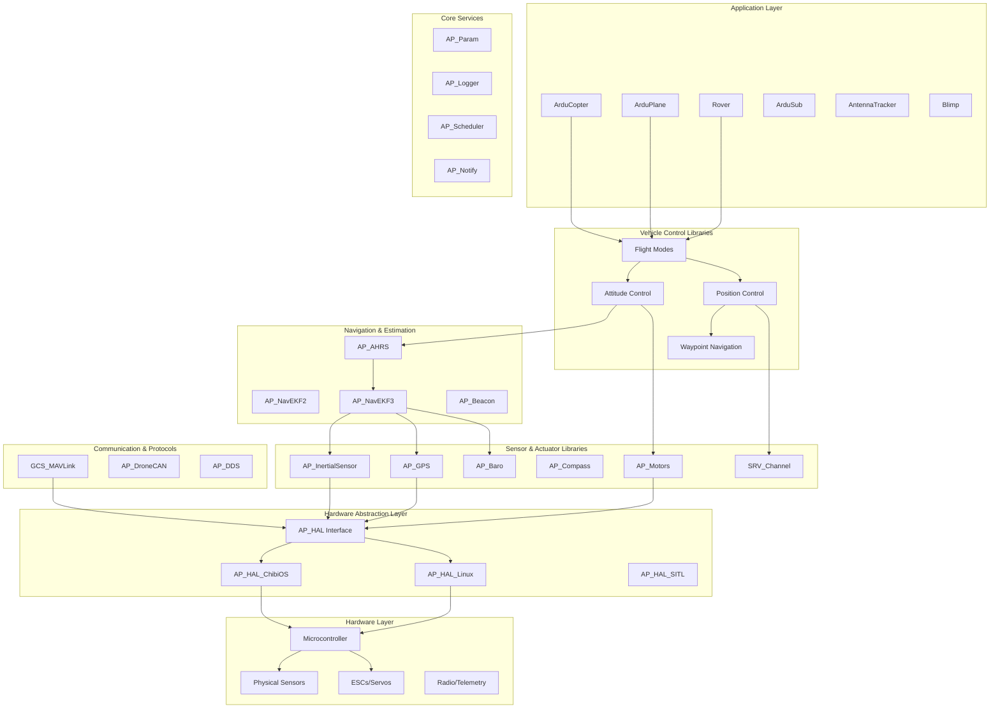
```mermaid
graph TB
    subgraph "Application Layer"
        AC[ArduCopter]
        AP[ArduPlane]
        AR[Rover]
        AS[ArduSub]
        AT[AntennaTracker]
        AB[Blimp]
    end
    
    subgraph "Vehicle Control Libraries"
        MODE[Flight Modes]
        CTL[Attitude Control]
        NAV[Position Control]
        WPNAV[Waypoint Navigation]
    end
    
    subgraph "Navigation & Estimation"
        AHRS[AP_AHRS]
        EKF2[AP_NavEKF2]
        EKF3[AP_NavEKF3]
        BCN[AP_Beacon]
    end
    
    subgraph "Sensor & Actuator Libraries"
        INS[AP_InertialSensor]
        GPS[AP_GPS]
        BARO[AP_Baro]
        COMP[AP_Compass]
        MOTOR[AP_Motors]
        SERVO[SRV_Channel]
    end
    
    subgraph "Communication & Protocols"
        MAVLINK[GCS_MAVLink]
        DCAN[AP_DroneCAN]
        DDS[AP_DDS]
    end
    
    subgraph "Core Services"
        PARAM[AP_Param]
        LOGGER[AP_Logger]
        SCHED[AP_Scheduler]
        NOTIFY[AP_Notify]
    end
    
    subgraph "Hardware Abstraction Layer"
        HAL[AP_HAL Interface]
        CHIBIOS[AP_HAL_ChibiOS]
        LINUX[AP_HAL_Linux]
        SITL[AP_HAL_SITL]
    end
    
    subgraph "Hardware Layer"
        MCU[Microcontroller]
        SENSORS[Physical Sensors]
        ACTUATORS[ESCs/Servos]
        COMM[Radio/Telemetry]
    end
    
    AC --> MODE
    AP --> MODE
    AR --> MODE
    MODE --> CTL
    MODE --> NAV
    CTL --> AHRS
    NAV --> WPNAV
    CTL --> MOTOR
    NAV --> SERVO
    AHRS --> EKF3
    EKF3 --> INS
    EKF3 --> GPS
    EKF3 --> BARO
    INS --> HAL
    GPS --> HAL
    MOTOR --> HAL
    MAVLINK --> HAL
    HAL --> CHIBIOS
    HAL --> LINUX
    CHIBIOS --> MCU
    LINUX --> MCU
    MCU --> SENSORS
    MCU --> ACTUATORS
```

### Layer Descriptions

#### Application Layer (Vehicle Code)
**Source**: `/ArduCopter/`, `/ArduPlane/`, `/Rover/`, `/ArduSub/`, `/AntennaTracker/`, `/Blimp/`

Vehicle-specific implementations containing:
- Main vehicle class and initialization (`Copter.cpp`, `Plane.cpp`, etc.)
- Flight mode implementations (`mode_*.cpp`)
- Vehicle-specific failsafe logic (`failsafe.cpp`)
- Arming/disarming checks (`AP_Arming_*.cpp`)
- Scheduler task tables defining execution frequencies
- Parameter definitions and defaults

Each vehicle type inherits from common base classes while implementing type-specific control laws and state machines.

#### Vehicle Control Libraries
**Source**: `/libraries/AC_AttitudeControl/`, `/libraries/AC_PosControl/`, `/libraries/AC_WPNav/`

Reusable control algorithms shared across vehicle types:
- **AC_AttitudeControl**: Attitude (roll/pitch/yaw) rate and angle controllers using PID loops
- **AC_PosControl**: Position and velocity controllers for 3D navigation
- **AC_WPNav**: Waypoint navigation with path planning and trajectory generation
- **AC_Fence**: Geofence implementation with cylinder and polygon support

These libraries abstract control logic from vehicle-specific implementations, enabling code reuse and consistent behavior.

#### Navigation & Estimation Layer
**Source**: `/libraries/AP_AHRS/`, `/libraries/AP_NavEKF2/`, `/libraries/AP_NavEKF3/`

State estimation and sensor fusion:
- **AP_AHRS**: Attitude Heading Reference System providing unified attitude interface
- **AP_NavEKF3**: 24-state Extended Kalman Filter for full 6DOF navigation
- **AP_NavEKF2**: Legacy EKF implementation for fallback
- **AP_Beacon**: Non-GPS positioning using beacon systems

The EKF fuses data from IMU, GPS, barometer, compass, airspeed, optical flow, and other sensors to provide optimal state estimates with uncertainty quantification.

#### Sensor & Actuator Libraries
**Source**: `/libraries/AP_InertialSensor/`, `/libraries/AP_GPS/`, `/libraries/AP_Motors/`, etc.

Hardware interface libraries with backend driver architecture:
- **Frontend**: Common API and sensor management
- **Backend**: Hardware-specific driver implementations
- **Detection**: Automatic sensor probing and configuration
- **Calibration**: Sensor calibration algorithms and storage

Example: `AP_InertialSensor` supports 15+ IMU types through unified interface.

#### Communication & Protocols Layer
**Source**: `/libraries/GCS_MAVLink/`, `/libraries/AP_DroneCAN/`, `/libraries/AP_DDS/`

External communication protocols:
- **MAVLink**: Primary ground station protocol (v1.0 and v2.0)
- **DroneCAN**: CAN bus protocol for sensors and actuators
- **DDS**: Data Distribution Service for ROS 2 integration
- **FrSky/LTM**: Telemetry protocols for RC receivers

#### Core Services Layer
**Source**: `/libraries/AP_Param/`, `/libraries/AP_Logger/`, `/libraries/AP_Scheduler/`

System-wide services:
- **AP_Param**: Parameter storage, retrieval, and synchronization
- **AP_Logger**: High-speed dataflash and SD card logging
- **AP_Scheduler**: Task scheduling with priority and timing management
- **AP_Notify**: LED, buzzer, and notification management

#### Hardware Abstraction Layer (HAL)
**Source**: `/libraries/AP_HAL/`, `/libraries/AP_HAL_ChibiOS/`, `/libraries/AP_HAL_Linux/`

Platform abstraction providing uniform interface to:
- GPIO, PWM, ADC, I2C, SPI, UART, CAN interfaces
- Threading and synchronization primitives
- Timers and scheduling
- Storage (EEPROM, flash, SD card)
- USB and network interfaces

## Component Relationships

The following diagram illustrates the key dependencies and data flows between major ArduPilot components:

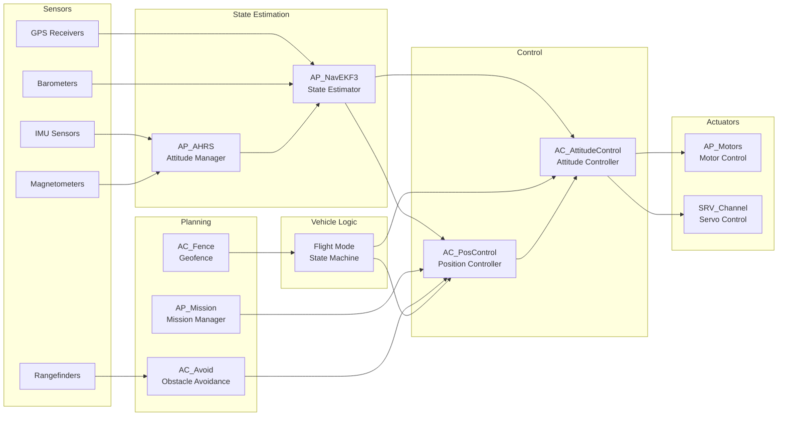
```mermaid
graph LR
    subgraph "Sensors"
        IMU[IMU Sensors]
        GPS_S[GPS Receivers]
        BARO_S[Barometers]
        MAG_S[Magnetometers]
        RANGE_S[Rangefinders]
    end
    
    subgraph "State Estimation"
        AHRS_C[AP_AHRS<br/>Attitude Manager]
        EKF_C[AP_NavEKF3<br/>State Estimator]
    end
    
    subgraph "Control"
        ATT_C[AC_AttitudeControl<br/>Attitude Controller]
        POS_C[AC_PosControl<br/>Position Controller]
    end
    
    subgraph "Planning"
        MISSION_C[AP_Mission<br/>Mission Manager]
        FENCE_C[AC_Fence<br/>Geofence]
        AVOID_C[AC_Avoid<br/>Obstacle Avoidance]
    end
    
    subgraph "Actuators"
        MOTORS_C[AP_Motors<br/>Motor Control]
        SERVOS_C[SRV_Channel<br/>Servo Control]
    end
    
    subgraph "Vehicle Logic"
        MODE_C[Flight Mode<br/>State Machine]
    end
    
    IMU --> AHRS_C
    GPS_S --> EKF_C
    BARO_S --> EKF_C
    MAG_S --> AHRS_C
    AHRS_C --> EKF_C
    EKF_C --> ATT_C
    EKF_C --> POS_C
    MISSION_C --> POS_C
    FENCE_C --> MODE_C
    AVOID_C --> POS_C
    RANGE_S --> AVOID_C
    MODE_C --> ATT_C
    MODE_C --> POS_C
    ATT_C --> MOTORS_C
    POS_C --> ATT_C
    ATT_C --> SERVOS_C
```

### Singleton Pattern and Global Access

ArduPilot uses the singleton pattern extensively for system-wide resources. The `AP` namespace provides centralized access:

```cpp
// Common singleton access patterns
AP_InertialSensor &ins = AP::ins();
AP_AHRS &ahrs = AP::ahrs();
AP_GPS &gps = AP::gps();
AP_Baro &baro = AP::baro();
```

**Source**: `/libraries/AP_HAL/AP_HAL_Namespace.h`

This design ensures single instances of hardware resources while providing convenient global access throughout the codebase.

### Inter-Library Communication Patterns

1. **Direct Method Calls**: Most common pattern for tightly coupled components
2. **Callback Registration**: Used for event notifications (e.g., sensor sample ready)
3. **Polling**: Controllers poll sensors at scheduled intervals
4. **Message Passing**: MAVLink messages route between components via GCS_MAVLink
5. **Parameter System**: Configuration changes propagate through AP_Param notifications

## Main Loop and Scheduler

ArduPilot implements a cooperative multitasking scheduler that executes tasks at specified frequencies with priority management. This design provides deterministic timing while maintaining flexibility for different vehicle types and processor capabilities.

### Scheduler Architecture

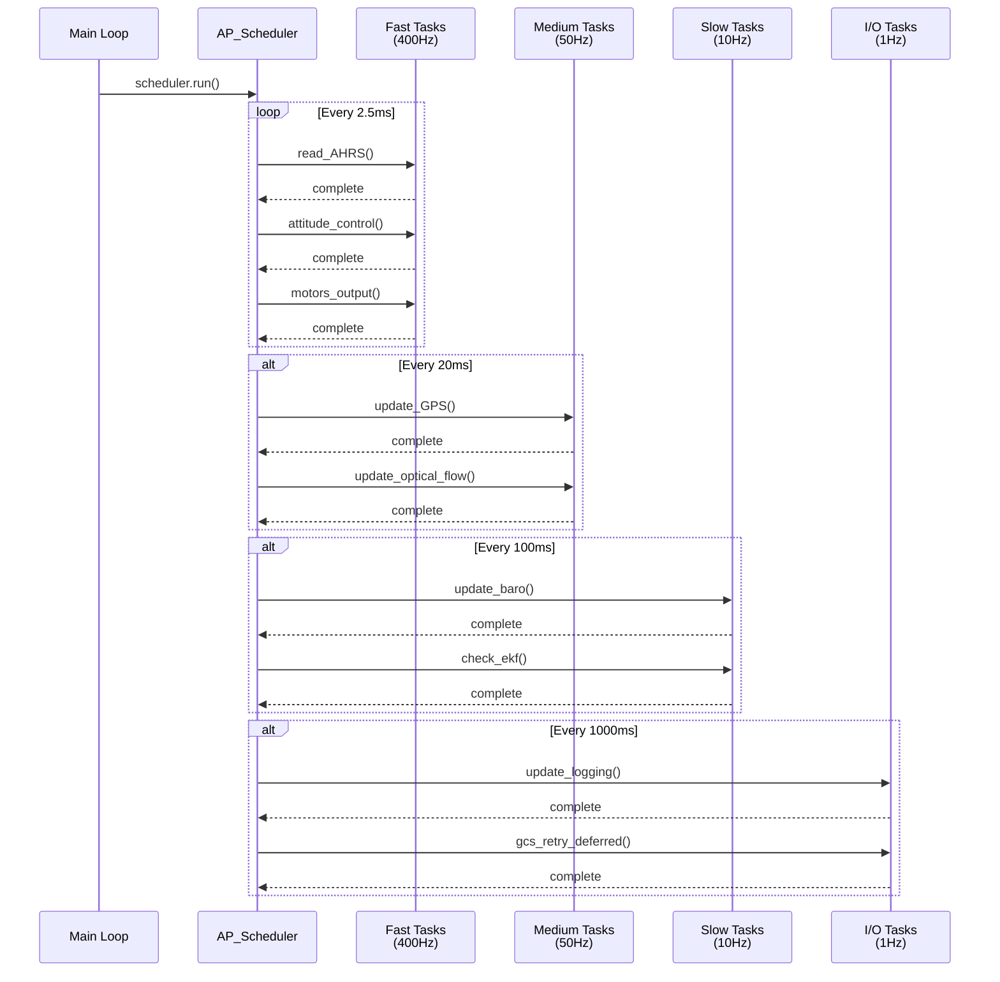
```mermaid
sequenceDiagram
    participant Main as Main Loop
    participant Sched as AP_Scheduler
    participant Fast as Fast Tasks<br/>(400Hz)
    participant Med as Medium Tasks<br/>(50Hz)
    participant Slow as Slow Tasks<br/>(10Hz)
    participant IO as I/O Tasks<br/>(1Hz)
    
    Main->>Sched: scheduler.run()
    
    loop Every 2.5ms
        Sched->>Fast: read_AHRS()
        Fast-->>Sched: complete
        Sched->>Fast: attitude_control()
        Fast-->>Sched: complete
        Sched->>Fast: motors_output()
        Fast-->>Sched: complete
    end
    
    alt Every 20ms
        Sched->>Med: update_GPS()
        Med-->>Sched: complete
        Sched->>Med: update_optical_flow()
        Med-->>Sched: complete
    end
    
    alt Every 100ms
        Sched->>Slow: update_baro()
        Slow-->>Sched: complete
        Sched->>Slow: check_ekf()
        Slow-->>Sched: complete
    end
    
    alt Every 1000ms
        Sched->>IO: update_logging()
        IO-->>Sched: complete
        Sched->>IO: gcs_retry_deferred()
        IO-->>Sched: complete
    end
```

### Task Definition

Vehicle-specific task tables define execution frequencies and priorities:

**Source**: `/ArduCopter/Copter.cpp:scheduler_tasks[]`

```cpp
const AP_Scheduler::Task Copter::scheduler_tasks[] = {
    SCHED_TASK(read_AHRS,              400,    200),  // 400Hz, 200us budget
    SCHED_TASK(update_flight_mode,     400,    400),  // 400Hz, 400us budget
    SCHED_TASK(motors_output,          400,    100),  // Critical: motor updates
    SCHED_TASK(update_GPS,              50,    200),  // 50Hz GPS processing
    SCHED_TASK(update_baro,             10,    200),  // 10Hz barometer
    SCHED_TASK(check_ekf,               10,     75),  // 10Hz EKF health
    SCHED_TASK(gcs_send_heartbeat,       1,    100),  // 1Hz heartbeat
    // ... additional tasks
};
```

### Scheduling Parameters

| Parameter | Description | Typical Range |
|-----------|-------------|---------------|
| **Frequency** | Task execution rate in Hz | 1-400 Hz |
| **Time Budget** | Maximum execution time in microseconds | 50-1000 μs |
| **Priority** | Implicit from table order (higher = earlier) | Task order |
| **Max Jitter** | Acceptable timing variance | ±1 tick |

### Real-Time Constraints

- **Main Loop Rate**: 400 Hz (2.5ms period) for multicopters, 50-400 Hz vehicle-dependent
- **IMU Sampling**: 1-8 kHz (hardware dependent, downsampled to loop rate)
- **Motor Update**: Synchronized with main loop for minimal latency
- **Budget Enforcement**: Tasks exceeding time budget trigger warnings
- **Overrun Handling**: Scheduler tracks and logs timing violations

**Source**: `/libraries/AP_Scheduler/AP_Scheduler.cpp`

### Interrupt Context vs Task Context

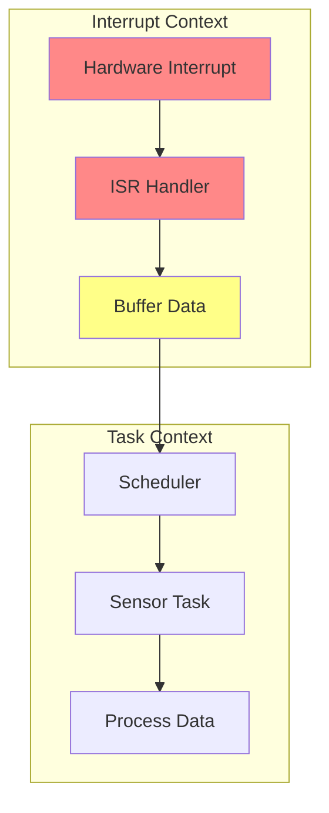
```mermaid
graph TB
    subgraph "Interrupt Context"
        INT[Hardware Interrupt]
        ISR[ISR Handler]
        BUFFER[Buffer Data]
    end
    
    subgraph "Task Context"
        SCHED[Scheduler]
        TASK[Sensor Task]
        PROCESS[Process Data]
    end
    
    INT --> ISR
    ISR --> BUFFER
    BUFFER --> SCHED
    SCHED --> TASK
    TASK --> PROCESS
    
    style INT fill:#f88
    style ISR fill:#f88
    style BUFFER fill:#ff8
```

- **Interrupt Context**: Minimal processing, data buffering only
- **Task Context**: Full processing, floating-point operations, I/O
- **Synchronization**: Semaphores protect shared resources between contexts

## Sensor Data Flow

The sensor processing pipeline implements a multi-stage architecture that transforms raw hardware measurements into calibrated, filtered, and fused state estimates suitable for control algorithms.

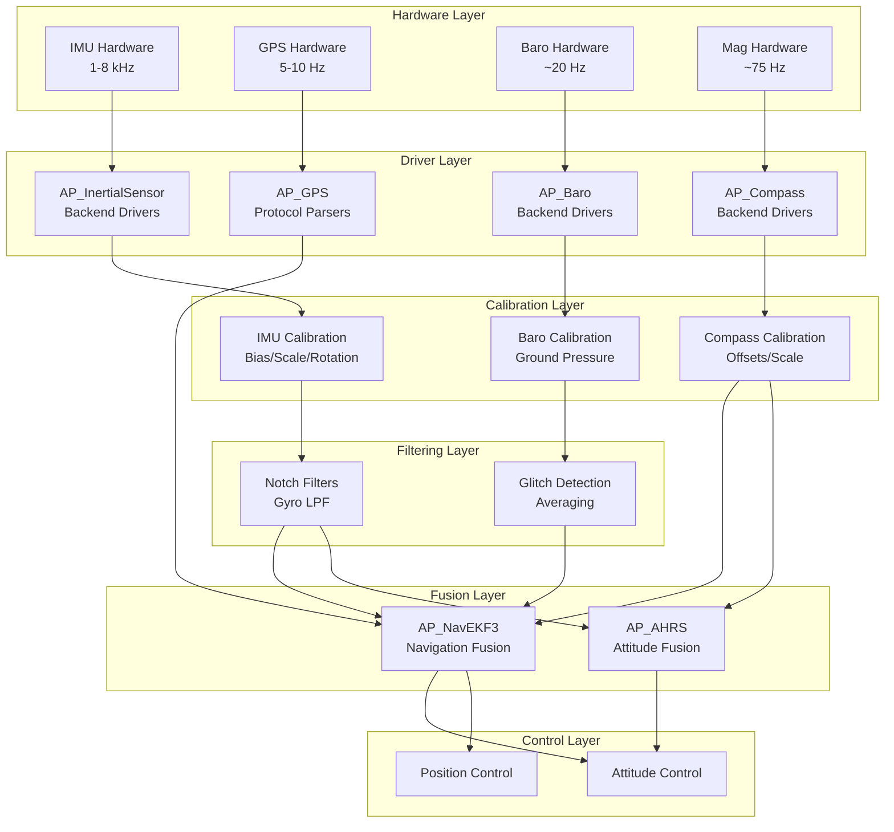
```mermaid
graph TB
    subgraph "Hardware Layer"
        IMU_HW[IMU Hardware<br/>1-8 kHz]
        GPS_HW[GPS Hardware<br/>5-10 Hz]
        BARO_HW[Baro Hardware<br/>~20 Hz]
        MAG_HW[Mag Hardware<br/>~75 Hz]
    end
    
    subgraph "Driver Layer"
        IMU_DRV[AP_InertialSensor<br/>Backend Drivers]
        GPS_DRV[AP_GPS<br/>Protocol Parsers]
        BARO_DRV[AP_Baro<br/>Backend Drivers]
        MAG_DRV[AP_Compass<br/>Backend Drivers]
    end
    
    subgraph "Calibration Layer"
        IMU_CAL[IMU Calibration<br/>Bias/Scale/Rotation]
        MAG_CAL[Compass Calibration<br/>Offsets/Scale]
        BARO_CAL[Baro Calibration<br/>Ground Pressure]
    end
    
    subgraph "Filtering Layer"
        IMU_FILT[Notch Filters<br/>Gyro LPF]
        BARO_FILT[Glitch Detection<br/>Averaging]
    end
    
    subgraph "Fusion Layer"
        AHRS_F[AP_AHRS<br/>Attitude Fusion]
        EKF_F[AP_NavEKF3<br/>Navigation Fusion]
    end
    
    subgraph "Control Layer"
        ATT_CTRL[Attitude Control]
        POS_CTRL[Position Control]
    end
    
    IMU_HW --> IMU_DRV
    GPS_HW --> GPS_DRV
    BARO_HW --> BARO_DRV
    MAG_HW --> MAG_DRV
    
    IMU_DRV --> IMU_CAL
    MAG_DRV --> MAG_CAL
    BARO_DRV --> BARO_CAL
    
    IMU_CAL --> IMU_FILT
    BARO_CAL --> BARO_FILT
    
    IMU_FILT --> AHRS_F
    IMU_FILT --> EKF_F
    GPS_DRV --> EKF_F
    BARO_FILT --> EKF_F
    MAG_CAL --> AHRS_F
    MAG_CAL --> EKF_F
    
    AHRS_F --> ATT_CTRL
    EKF_F --> POS_CTRL
    EKF_F --> ATT_CTRL
```

### IMU Data Pipeline

**Source**: `/libraries/AP_InertialSensor/AP_InertialSensor.cpp`

1. **Hardware Sampling** (1-8 kHz)
   - SPI/I2C reads from IMU registers
   - DMA transfers for high-rate sensors
   - Hardware FIFO buffering

2. **Raw Data Accumulation**
   - Downsample to loop rate (typically 400 Hz)
   - Delta-angle and delta-velocity computation
   - Sensor instance management (up to 3 IMUs)

3. **Calibration Application**
   - Accelerometer: offset and scale factor correction
   - Gyroscope: bias removal and temperature compensation
   - Rotation: board orientation correction matrix

4. **Digital Filtering**
   - Notch filters for motor resonance rejection
   - Low-pass filters for noise reduction
   - Configurable cutoff frequencies

5. **Health Monitoring**
   - Consistency checks between multiple IMUs
   - Vibration level detection
   - Clipping detection

### GPS Data Pipeline

**Source**: `/libraries/AP_GPS/AP_GPS.cpp`

1. **Protocol Parsing**
   - NMEA, UBX, SBP, RTCM3 protocol decoding
   - Message validation and checksum verification
   - Multi-constellation support (GPS, GLONASS, Galileo, BeiDou)

2. **Data Extraction**
   - Position (latitude, longitude, altitude)
   - Velocity (3D velocity vector)
   - Accuracy estimates (HDOP, VDOP, position accuracy)
   - Time synchronization (GPS time to system time)

3. **GPS Blending**
   - Multiple GPS instance management
   - Weighted averaging based on accuracy metrics
   - Automatic failover on GPS failure
   - RTK base/rover coordination

4. **Yaw Estimation** (Dual GPS)
   - Heading from baseline vector between two GPS units
   - Precision heading for autopilot initialization

### Barometer Data Pipeline

**Source**: `/libraries/AP_Baro/AP_Baro.cpp`

1. **Pressure Measurement**
   - Raw pressure and temperature acquisition
   - Multiple barometer averaging
   - Altitude calculation using international standard atmosphere

2. **Ground Pressure Calibration**
   - Reference pressure establishment at arming
   - Temperature compensation
   - Dynamic recalibration during flight

3. **Glitch Detection**
   - Innovation monitoring (comparison with EKF)
   - Spike rejection and filtering
   - Fallback to alternate sensors

### Sensor Fusion Timing

All sensor data converges in the EKF with proper time alignment:

- **IMU**: Direct feed at main loop rate (400 Hz)
- **GPS**: Buffered and delayed to match IMU timing (~5-10 Hz)
- **Barometer**: Delayed to account for sensor lag (~10 Hz)
- **Magnetometer**: Delayed and rate-limited (~10 Hz)
- **External sensors**: Time-stamped and queued

**Source**: `/libraries/AP_NavEKF3/AP_NavEKF3_core.cpp`

## Navigation and Control System

The navigation and control system implements a cascaded architecture with multiple control loops operating at different frequencies and time scales. This design separates high-bandwidth attitude control from lower-bandwidth position control, ensuring stability and performance.

### Control Architecture Hierarchy

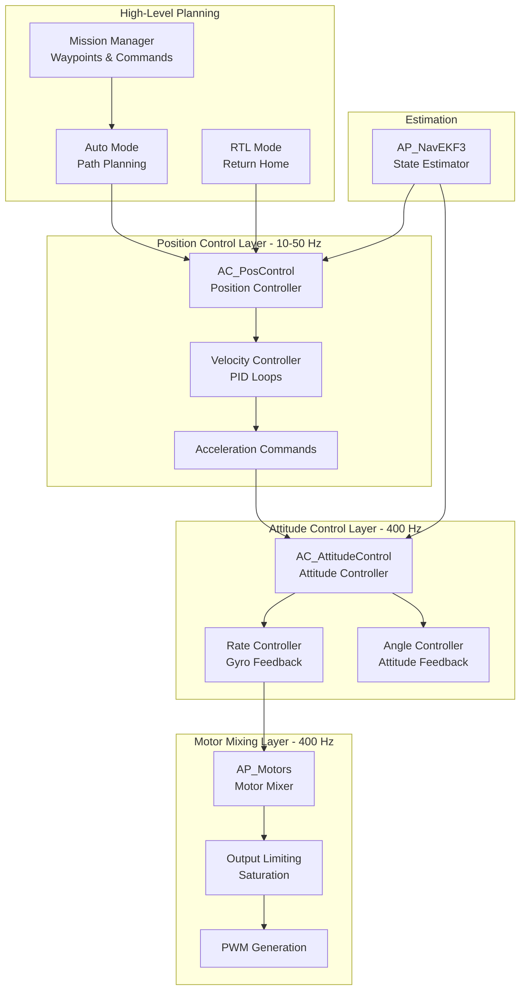
```mermaid
graph TB
    subgraph "High-Level Planning"
        MISSION[Mission Manager<br/>Waypoints & Commands]
        AUTO[Auto Mode<br/>Path Planning]
        RTL[RTL Mode<br/>Return Home]
    end
    
    subgraph "Position Control Layer - 10-50 Hz"
        POS_CTRL[AC_PosControl<br/>Position Controller]
        VEL_CTRL[Velocity Controller<br/>PID Loops]
        ACCEL_CMD[Acceleration Commands]
    end
    
    subgraph "Attitude Control Layer - 400 Hz"
        ATT_CTRL[AC_AttitudeControl<br/>Attitude Controller]
        RATE_CTRL[Rate Controller<br/>Gyro Feedback]
        ANGLE_CTRL[Angle Controller<br/>Attitude Feedback]
    end
    
    subgraph "Motor Mixing Layer - 400 Hz"
        MOTOR_MIX[AP_Motors<br/>Motor Mixer]
        OUTPUT_LIMIT[Output Limiting<br/>Saturation]
        PWM_OUT[PWM Generation]
    end
    
    subgraph "Estimation"
        EKF[AP_NavEKF3<br/>State Estimator]
    end
    
    MISSION --> AUTO
    AUTO --> POS_CTRL
    RTL --> POS_CTRL
    
    POS_CTRL --> VEL_CTRL
    VEL_CTRL --> ACCEL_CMD
    ACCEL_CMD --> ATT_CTRL
    
    ATT_CTRL --> ANGLE_CTRL
    ATT_CTRL --> RATE_CTRL
    RATE_CTRL --> MOTOR_MIX
    MOTOR_MIX --> OUTPUT_LIMIT
    OUTPUT_LIMIT --> PWM_OUT
    
    EKF --> POS_CTRL
    EKF --> ATT_CTRL
```

### Position Control Loop

**Source**: `/libraries/AC_PosControl/AC_PosControl.cpp`

The position controller converts desired positions or velocities into acceleration commands using cascaded PID loops:

1. **Position Error Calculation**
   - Desired position from mission or flight mode
   - Current position from EKF
   - Error computation in NED frame

2. **Velocity Controller**
   - Position error → desired velocity (P controller)
   - Velocity limiting based on vehicle capabilities
   - Feed-forward terms for smooth tracking

3. **Acceleration Controller**
   - Velocity error → desired acceleration (PI controller)
   - Acceleration limiting for safety
   - Integration with anti-windup

4. **Lean Angle Calculation**
   - Acceleration command → desired lean angles
   - Accounts for gravity and centripetal acceleration
   - Respects maximum lean angle limits

**Update Rate**: 50-100 Hz (vehicle dependent)

### Attitude Control Loop

**Source**: `/libraries/AC_AttitudeControl/AC_AttitudeControl.cpp`

The attitude controller provides precise orientation control through multi-loop architecture:

1. **Attitude Controller** (Outer Loop)
   - Quaternion-based attitude representation
   - Desired attitude from position controller or pilot input
   - Output: desired rotation rates

2. **Rate Controller** (Inner Loop)
   - PID control on roll, pitch, yaw rates
   - Direct gyroscope feedback
   - Derivative term from gyro (no differentiation noise)
   - Feed-forward from desired rate changes

3. **Rate-to-Throttle Coupling**
   - Throttle compensation during aggressive maneuvers
   - Maintains altitude during rolls
   - Vehicle-specific tuning parameters

**Update Rate**: 400 Hz (synchronized with IMU)

### Control Coordinate Frames

ArduPilot uses multiple coordinate frames with clear transformation chains:

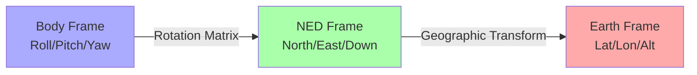
```mermaid
graph LR
    BODY[Body Frame<br/>Roll/Pitch/Yaw]
    NED[NED Frame<br/>North/East/Down]
    EF[Earth Frame<br/>Lat/Lon/Alt]
    
    BODY -->|Rotation Matrix| NED
    NED -->|Geographic Transform| EF
    
    style BODY fill:#aaf
    style NED fill:#afa
    style EF fill:#faa
```

- **Body Frame**: Vehicle-fixed frame (x-forward, y-right, z-down)
- **NED Frame**: Local tangent plane (North-East-Down)
- **Earth Frame**: Geographic coordinates (WGS84)

**Source**: `/libraries/AP_Math/rotations.h`, `/libraries/AP_Math/location.cpp`

### Feed-Forward and Filtering

Advanced control features for performance optimization:

- **Feed-Forward Terms**: Desired rate and acceleration injection reduces tracking error
- **Input Shaping**: Smooth pilot inputs prevent oscillation excitation
- **Notch Filtering**: Reject specific resonance frequencies
- **Derivative Filtering**: Low-pass filter on D term reduces noise amplification

## Communication Architecture

ArduPilot implements a multi-protocol communication architecture supporting various ground stations, companion computers, and inter-vehicle communication. The system handles simultaneous connections over multiple interfaces with message prioritization and bandwidth management.

### Communication Protocol Stack

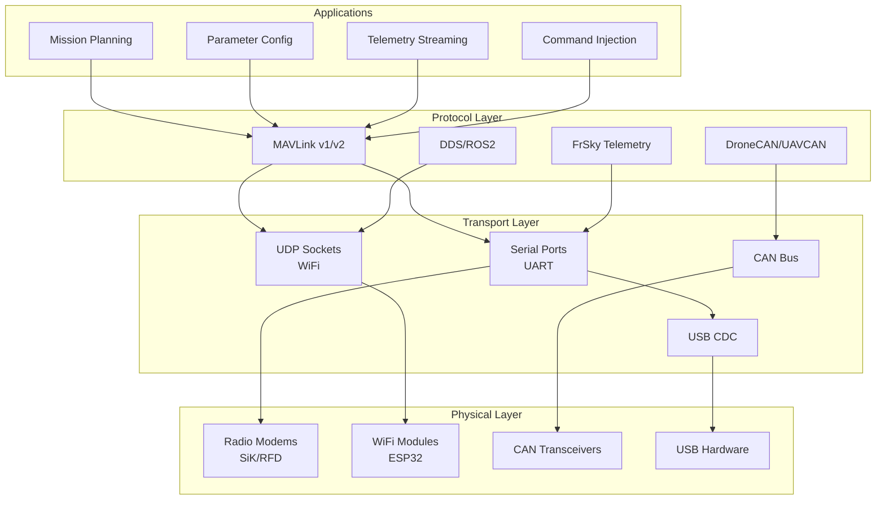
```mermaid
graph TB
    subgraph "Applications"
        MISSION_APP[Mission Planning]
        PARAM_APP[Parameter Config]
        TELEM_APP[Telemetry Streaming]
        CMD_APP[Command Injection]
    end
    
    subgraph "Protocol Layer"
        MAVLINK[MAVLink v1/v2]
        DCAN[DroneCAN/UAVCAN]
        DDS_PROTO[DDS/ROS2]
        FRSKY[FrSky Telemetry]
    end
    
    subgraph "Transport Layer"
        SERIAL[Serial Ports<br/>UART]
        UDP[UDP Sockets<br/>WiFi]
        CAN_BUS[CAN Bus]
        USB_CDC[USB CDC]
    end
    
    subgraph "Physical Layer"
        RADIO[Radio Modems<br/>SiK/RFD]
        WIFI[WiFi Modules<br/>ESP32]
        CAN_HW[CAN Transceivers]
        USB_HW[USB Hardware]
    end
    
    MISSION_APP --> MAVLINK
    PARAM_APP --> MAVLINK
    TELEM_APP --> MAVLINK
    CMD_APP --> MAVLINK
    
    MAVLINK --> SERIAL
    MAVLINK --> UDP
    DCAN --> CAN_BUS
    DDS_PROTO --> UDP
    FRSKY --> SERIAL
    
    SERIAL --> RADIO
    UDP --> WIFI
    CAN_BUS --> CAN_HW
    SERIAL --> USB_CDC
    USB_CDC --> USB_HW
```

### MAVLink Architecture

**Source**: `/libraries/GCS_MAVLink/GCS.cpp`

MAVLink is the primary protocol for ground station communication, implementing a lightweight message serialization system with support for up to 6 simultaneous ground station connections.

#### Message Routing

1. **Message Reception**
   - Serial/UDP port monitoring
   - Message parsing and CRC validation
   - Routing ID extraction (system ID, component ID)

2. **Message Handling**
   - Handler dispatch based on message ID
   - Vehicle-specific handler overrides
   - Common handlers in `GCS_Common.cpp`
   - Vehicle handlers in `GCS_Mavlink_*.cpp`

3. **Message Transmission**
   - Stream-based prioritization
   - Bandwidth-aware rate limiting
   - Retry logic for critical messages
   - Queueing for deferred transmission

#### Stream Management

Messages are organized into streams with configurable rates:

| Stream | Typical Rate | Content |
|--------|--------------|---------|
| **STREAM_RAW_SENSORS** | 1-10 Hz | Raw IMU, baro, mag data |
| **STREAM_EXTENDED_STATUS** | 1-2 Hz | System status, battery, GPS |
| **STREAM_POSITION** | 1-10 Hz | Global position, attitude |
| **STREAM_RC_CHANNELS** | 1-5 Hz | RC input values |
| **STREAM_EXTRA1** | 10 Hz | Attitude, PID tuning |
| **STREAM_EXTRA2** | 10 Hz | VFR_HUD |
| **STREAM_EXTRA3** | 2 Hz | System time, vibration |

**Configuration**: Parameters `SRx_*` control per-port stream rates

### DroneCAN Architecture

**Source**: `/libraries/AP_DroneCAN/AP_DroneCAN.cpp`

DroneCAN provides a robust CAN-based communication system for sensors and actuators:

#### Node Management

- **Dynamic Node Allocation**: Automatic node ID assignment
- **Node Health Monitoring**: Heartbeat tracking and timeout detection
- **Parameter Synchronization**: Remote node configuration
- **Firmware Update**: Over-CAN firmware upload

#### Supported Device Types

- GPS receivers with RTK capability
- Electronic Speed Controllers (ESCs) with telemetry
- Airspeed sensors
- Power modules with current/voltage sensing
- Rangefinders
- Compass sensors
- Servos with position feedback

### DDS/ROS 2 Integration

**Source**: `/libraries/AP_DDS/AP_DDS_Client.cpp`

The DDS implementation enables native ROS 2 integration:

- **Topic Publishing**: ArduPilot state published to ROS 2 topics
- **Topic Subscription**: ROS 2 commands received as setpoints
- **Service Calls**: Parameter get/set, arming, mode changes
- **Quality of Service**: Configurable reliability and durability

### Communication Security

- **MAVLink v2 Signing**: Message authentication with symmetric keys
- **Channel Encryption**: Optional encryption layer (external to MAVLink)
- **Command Authentication**: Critical commands require specific sequences
- **GCS Authorization**: Multi-level access control (view, control, configure)

## Mission Execution and State Machines

ArduPilot implements a sophisticated state machine architecture for autonomous mission execution, managing waypoint navigation, command execution, and flight mode transitions with safety interlocks and failsafe integration.

### Mission System Architecture

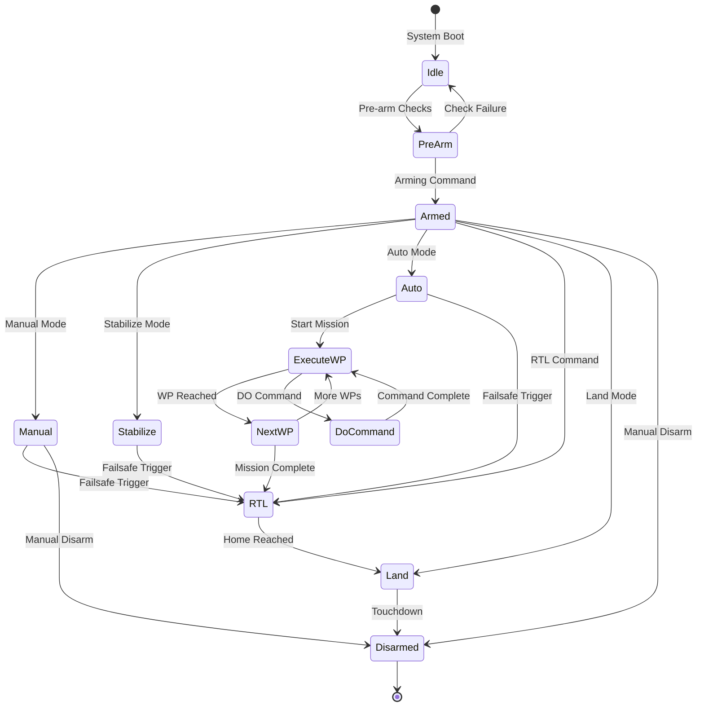
```mermaid
stateDiagram-v2
    [*] --> Idle: System Boot
    Idle --> PreArm: Pre-arm Checks
    PreArm --> Armed: Arming Command
    PreArm --> Idle: Check Failure
    
    Armed --> Manual: Manual Mode
    Armed --> Stabilize: Stabilize Mode
    Armed --> Auto: Auto Mode
    Armed --> RTL: RTL Command
    Armed --> Land: Land Mode
    
    Auto --> ExecuteWP: Start Mission
    ExecuteWP --> NextWP: WP Reached
    ExecuteWP --> DoCommand: DO Command
    DoCommand --> ExecuteWP: Command Complete
    NextWP --> ExecuteWP: More WPs
    NextWP --> RTL: Mission Complete
    
    Manual --> RTL: Failsafe Trigger
    Stabilize --> RTL: Failsafe Trigger
    Auto --> RTL: Failsafe Trigger
    RTL --> Land: Home Reached
    Land --> Disarmed: Touchdown
    
    Armed --> Disarmed: Manual Disarm
    Manual --> Disarmed: Manual Disarm
    Disarmed --> [*]
```

### Mission Manager

**Source**: `/libraries/AP_Mission/AP_Mission.cpp`

The mission manager handles waypoint storage, retrieval, and execution sequencing:

#### Mission Storage

- **Storage Medium**: EEPROM or dataflash for non-volatile persistence
- **Capacity**: Vehicle-dependent (typically 700+ waypoints)
- **Format**: MAVLink mission item format
- **Synchronization**: Bidirectional sync with ground station

#### Mission Item Types

| Type | Description | Parameters |
|------|-------------|------------|
| **NAV_WAYPOINT** | Navigate to position | Lat, Lon, Alt, Hold time |
| **NAV_LOITER_UNLIM** | Loiter indefinitely | Lat, Lon, Alt, Radius |
| **NAV_RETURN_TO_LAUNCH** | Return to home position | Alt |
| **NAV_LAND** | Land at position | Lat, Lon, Descent rate |
| **NAV_TAKEOFF** | Takeoff to altitude | Lat, Lon, Alt, Heading |
| **DO_CHANGE_SPEED** | Modify flight speed | Speed type, Speed |
| **DO_SET_SERVO** | Control servo output | Servo num, PWM |
| **DO_REPEAT_SERVO** | Pulse servo repeatedly | Servo, PWM, Count |
| **CONDITION_DELAY** | Wait for time | Seconds |
| **CONDITION_DISTANCE** | Wait for distance | Distance meters |

**Source**: `/libraries/AP_Mission/AP_Mission.h` - Full command list

#### Mission Execution Flow

1. **Mission Upload**
   - Ground station sends mission items via MAVLink
   - Mission manager validates and stores items
   - Acknowledgment sent to ground station

2. **Mission Start**
   - Auto mode selected
   - Mission manager loads first waypoint
   - Navigation controller receives target

3. **Waypoint Navigation**
   - Position controller tracks current waypoint
   - Arrival detection (radius or distance threshold)
   - Advance to next waypoint

4. **Command Execution**
   - DO commands execute immediately
   - CONDITION commands must be satisfied before continuing
   - NAV commands define navigation targets

5. **Mission Completion**
   - Final waypoint reached
   - Configurable behavior (loiter, RTL, land)
   - Mission complete notification to GCS

### Flight Mode State Machine

**Source**: Vehicle-specific `mode.cpp` files

Each vehicle implements a mode manager that controls behavior and transitions:

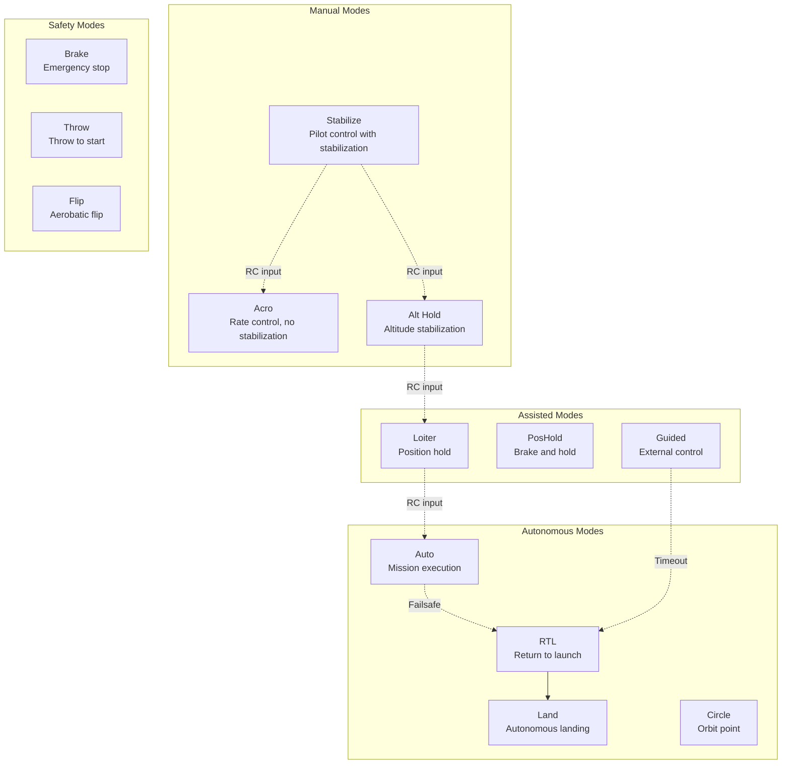
```mermaid
graph TB
    subgraph "Manual Modes"
        STAB[Stabilize<br/>Pilot control with stabilization]
        ACRO[Acro<br/>Rate control, no stabilization]
        ALTHOLD[Alt Hold<br/>Altitude stabilization]
    end
    
    subgraph "Assisted Modes"
        LOITER[Loiter<br/>Position hold]
        POSHOLD[PosHold<br/>Brake and hold]
        GUIDED[Guided<br/>External control]
    end
    
    subgraph "Autonomous Modes"
        AUTO_M[Auto<br/>Mission execution]
        RTL_M[RTL<br/>Return to launch]
        LAND_M[Land<br/>Autonomous landing]
        CIRCLE[Circle<br/>Orbit point]
    end
    
    subgraph "Safety Modes"
        BRAKE[Brake<br/>Emergency stop]
        THROW[Throw<br/>Throw to start]
        FLIP[Flip<br/>Aerobatic flip]
    end
    
    STAB -.->|RC input| ACRO
    STAB -.->|RC input| ALTHOLD
    ALTHOLD -.->|RC input| LOITER
    LOITER -.->|RC input| AUTO_M
    AUTO_M -.->|Failsafe| RTL_M
    RTL_M --> LAND_M
    GUIDED -.->|Timeout| RTL_M
```

#### Mode Transition Rules

- **Entry Conditions**: Pre-flight checks, GPS fix requirements, sensor health
- **Exit Conditions**: Mode change request, failsafe trigger, mission completion
- **Safety Interlocks**: Prevent transitions that could cause instability
- **State Preservation**: Some modes preserve previous mode for return

**Source**: Vehicle-specific `set_mode()` implementations

## Failsafe System Architecture

The failsafe system provides multiple layers of protection against various failure scenarios. Failsafes are prioritized hierarchically, with higher-priority failsafes overriding lower-priority ones.

### Failsafe Priority Hierarchy

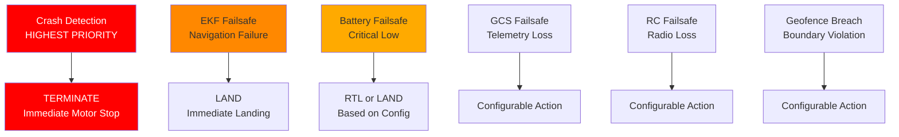
```mermaid
graph TB
    CRASH[Crash Detection<br/>HIGHEST PRIORITY]
    EKFFS[EKF Failsafe<br/>Navigation Failure]
    BATTERY[Battery Failsafe<br/>Critical Low]
    GCFS[GCS Failsafe<br/>Telemetry Loss]
    RCFS[RC Failsafe<br/>Radio Loss]
    FENCE[Geofence Breach<br/>Boundary Violation]
    
    CRASH --> TERMINATE[TERMINATE<br/>Immediate Motor Stop]
    EKFFS --> LAND_FS[LAND<br/>Immediate Landing]
    BATTERY --> RTL_FS[RTL or LAND<br/>Based on Config]
    GCFS --> ACTION_GCS[Configurable Action]
    RCFS --> ACTION_RC[Configurable Action]
    FENCE --> ACTION_FENCE[Configurable Action]
    
    style CRASH fill:#f00,color:#fff
    style EKFFS fill:#f80
    style BATTERY fill:#fa0
    style TERMINATE fill:#f00,color:#fff
```

### Failsafe Types and Detection

#### RC Failsafe

**Source**: `/ArduCopter/failsafe.cpp`, `/ArduPlane/failsafe.cpp`

**Detection Mechanisms**:
- No valid RC input for configured timeout (default: 1.5 seconds)
- Throttle value below FS_THR_VALUE threshold
- RC loss flag from receiver (if supported)

**Actions** (parameter FS_THR_ENABLE):
- Disabled (0): No action
- RTL or Land (1): Return to launch or land if RTL unavailable
- Continue with mission (2): Auto mode continues, other modes RTL
- SmartRTL or RTL (3): Use SmartRTL path if available

#### Battery Failsafe

**Source**: `/libraries/AP_BattMonitor/AP_BattMonitor.cpp`

**Detection Criteria**:
- Voltage below BATT_LOW_VOLT threshold → Low battery action
- Voltage below BATT_CRT_VOLT threshold → Critical battery action
- Remaining capacity below BATT_LOW_MAH → Low battery action
- Remaining capacity below BATT_CRT_MAH → Critical battery action

**Progressive Actions**:
1. **Low Battery Warning**: Notification to GCS, LED indication
2. **Low Battery Action**: RTL or Land (configurable)
3. **Critical Battery Action**: Immediate Land (cannot be overridden)

#### EKF Failsafe

**Source**: `/ArduCopter/ekf_check.cpp`, `/ArduPlane/ekf_check.cpp`

**Detection Metrics**:
- EKF variance exceeds threshold (EKF_CHECK_THRESH)
- GPS glitch detection and innovation monitoring
- Velocity/position divergence checks
- Continuous monitoring at 10 Hz

**Actions**:
- Immediate mode change to Land
- Log EKF status for post-flight analysis
- Visual/audio notification
- Cannot be overridden by pilot

#### GCS Failsafe

**Source**: Vehicle-specific `failsafe.cpp`

**Detection**:
- No MAVLink heartbeat received for FS_GCS_ENABLE timeout
- Applies when GCS failsafe enabled and vehicle armed

**Actions** (configurable):
- Disabled: No action
- RTL: Return to launch
- Continue: Continue with current mode
- SmartRTL: Use SmartRTL path

#### Geofence Failsafe

**Source**: `/libraries/AC_Fence/AC_Fence.cpp`

**Fence Types**:
- **Circular Fence**: Maximum distance from home
- **Altitude Fence**: Maximum and minimum altitude limits
- **Polygon Fence**: Complex inclusion/exclusion zones
- **Rally Point Fence**: Maximum distance from nearest rally point

**Actions on Breach**:
- RTL to home or nearest rally point
- Land immediately
- SmartRTL along safe path
- Configurable per fence type

### Failsafe Recovery

Failsafes can automatically clear when conditions improve:

- **RC Failsafe**: Clears immediately upon RC signal recovery
- **Battery Failsafe**: Low battery clears if voltage recovers (critical does not)
- **EKF Failsafe**: Clears when EKF variance returns to normal
- **GCS Failsafe**: Clears upon heartbeat reception

**Important**: Some failsafes (crash detection, critical battery) cannot be cleared and require landing/disarming.

### Crash Detection

**Source**: `/ArduCopter/crash_check.cpp`

Detects vehicle crashes during flight to trigger immediate motor shutdown:

**Detection Criteria**:
- Significant lean angle (>30°) for extended period
- Near-zero climb rate despite throttle application
- Landing detector triggered in non-landing mode

**Action**: Immediate disarm to prevent property damage and injury

## Parameter System

The parameter system provides persistent storage, runtime access, and ground station synchronization of configuration values throughout ArduPilot. This system enables tuning and customization without code modification.

### Parameter Architecture

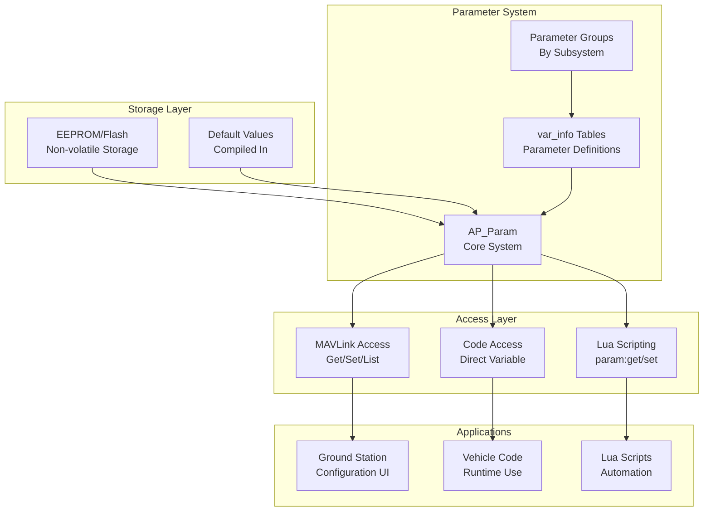
```mermaid
graph TB
    subgraph "Storage Layer"
        EEPROM[EEPROM/Flash<br/>Non-volatile Storage]
        DEFAULTS[Default Values<br/>Compiled In]
    end
    
    subgraph "Parameter System"
        PARAM_CORE[AP_Param<br/>Core System]
        VAR_INFO[var_info Tables<br/>Parameter Definitions]
        GROUPS[Parameter Groups<br/>By Subsystem]
    end
    
    subgraph "Access Layer"
        CODE_ACCESS[Code Access<br/>Direct Variable]
        MAVLINK_ACCESS[MAVLink Access<br/>Get/Set/List]
        LUA_ACCESS[Lua Scripting<br/>param:get/set]
    end
    
    subgraph "Applications"
        GCS_APP[Ground Station<br/>Configuration UI]
        VEHICLE[Vehicle Code<br/>Runtime Use]
        SCRIPTS[Lua Scripts<br/>Automation]
    end
    
    EEPROM --> PARAM_CORE
    DEFAULTS --> PARAM_CORE
    VAR_INFO --> PARAM_CORE
    GROUPS --> VAR_INFO
    
    PARAM_CORE --> CODE_ACCESS
    PARAM_CORE --> MAVLINK_ACCESS
    PARAM_CORE --> LUA_ACCESS
    
    CODE_ACCESS --> VEHICLE
    MAVLINK_ACCESS --> GCS_APP
    LUA_ACCESS --> SCRIPTS
```

### Parameter Definition

**Source**: `/libraries/AP_Param/AP_Param.h`

Parameters are defined using `AP_GROUPINFO` macros in library-specific `var_info` tables:

```cpp
const AP_Param::GroupInfo ClassName::var_info[] = {
    // @Param: PARAM_NAME
    // @DisplayName: Human Readable Name
    // @Description: Detailed description of parameter purpose
    // @Units: m/s, degrees, etc.
    // @Range: min max
    // @Increment: 0.1
    // @User: Standard
    AP_GROUPINFO("PARAM_NAME", 0, ClassName, member_var, default_value),
    
    AP_GROUPEND
};
```

### Parameter Metadata

Each parameter includes comprehensive metadata for validation and UI generation:

| Metadata | Purpose | Example |
|----------|---------|---------|
| **@Param** | Parameter name (16 char max) | WPNAV_SPEED |
| **@DisplayName** | UI display string | Waypoint Speed |
| **@Description** | Detailed explanation | Target horizontal speed during missions |
| **@Units** | Physical units | cm/s |
| **@Range** | Valid min/max values | 20 2000 |
| **@Increment** | UI step size | 50 |
| **@User** | User level (Standard/Advanced) | Standard |
| **@RebootRequired** | Requires reboot to take effect | True |

### Parameter Groups

Parameters are organized into logical groups by subsystem:

- **Vehicle Parameters**: ANGLE_MAX, PILOT_SPEED_UP, etc.
- **Sensor Parameters**: INS_*, COMPASS_*, GPS_*, BARO_*
- **Control Parameters**: ATC_RAT_*, PSC_*, WPNAV_*
- **Mission Parameters**: MIS_TOTAL, RTL_ALT, WP_YAW_BEHAVIOR
- **Failsafe Parameters**: FS_*, BATT_FS_*, EKF_CHECK_THRESH
- **Communication Parameters**: SERIAL*_PROTOCOL, TELEM_DELAY

### Parameter Storage

**Source**: `/libraries/AP_Param/AP_Param.cpp`

#### Storage Process

1. **Format Detection**: Identify parameter format version in storage
2. **Migration**: Convert old format parameters to current format
3. **Validation**: Verify checksums and parameter consistency
4. **Loading**: Read parameters into RAM variables
5. **Default Application**: Use compiled defaults for missing parameters

#### Storage Optimization

- **Differential Storage**: Only non-default values stored
- **Compression**: Efficient encoding reduces storage requirements
- **Sentinel Values**: Mark unused storage regions
- **Wear Leveling**: Distribute writes across flash sectors

### Parameter Synchronization

Ground stations synchronize parameters via MAVLink protocol:

#### Parameter List Request
```
GCS → Vehicle: PARAM_REQUEST_LIST
Vehicle → GCS: PARAM_VALUE (repeated for each parameter)
```

#### Parameter Get/Set
```
GCS → Vehicle: PARAM_REQUEST_READ (specific parameter)
Vehicle → GCS: PARAM_VALUE (current value)

GCS → Vehicle: PARAM_SET (new value)
Vehicle → GCS: PARAM_VALUE (confirmation)
```

#### Parameter Save
```
GCS → Vehicle: PARAM_SET (multiple parameters)
GCS → Vehicle: PREFLIGHT_STORAGE (action=0, write params)
Vehicle: Writes all modified parameters to storage
```

### Runtime Parameter Access

Code accesses parameters directly through member variables:

```cpp
// Parameter automatically loaded at startup
float cruise_speed = g.wpnav_speed;

// Parameter change triggers can be implemented
void ClassName::update_parameters() {
    if (param_changed) {
        // Recalculate dependent values
        recalculate_limits();
    }
}
```

## Logging and Telemetry

ArduPilot implements a high-performance logging system that captures detailed flight data for analysis, debugging, and regulatory compliance. The system balances comprehensive data capture with storage and bandwidth constraints.

### Logging Architecture

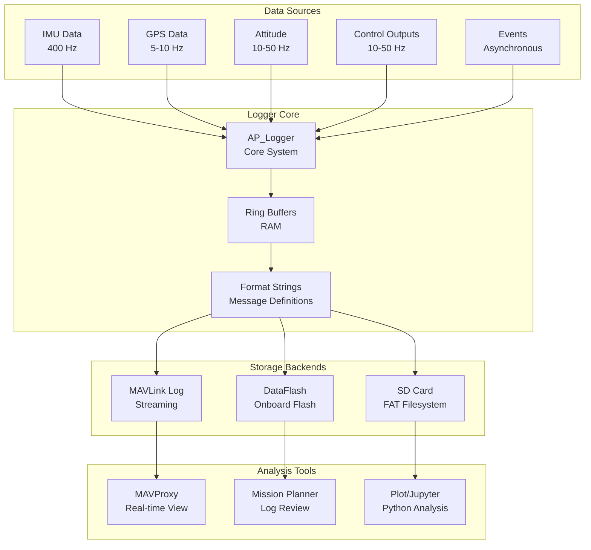
```mermaid
graph TB
    subgraph "Data Sources"
        IMU_LOG[IMU Data<br/>400 Hz]
        GPS_LOG[GPS Data<br/>5-10 Hz]
        ATT_LOG[Attitude<br/>10-50 Hz]
        CTRL_LOG[Control Outputs<br/>10-50 Hz]
        EVENTS[Events<br/>Asynchronous]
    end
    
    subgraph "Logger Core"
        LOGGER[AP_Logger<br/>Core System]
        BUFFER[Ring Buffers<br/>RAM]
        FORMATTER[Format Strings<br/>Message Definitions]
    end
    
    subgraph "Storage Backends"
        DATAFLASH[DataFlash<br/>Onboard Flash]
        SDCARD[SD Card<br/>FAT Filesystem]
        MAVLINK_LOG[MAVLink Log<br/>Streaming]
    end
    
    subgraph "Analysis Tools"
        MAVPROXY[MAVProxy<br/>Real-time View]
        MISSION_PLANNER[Mission Planner<br/>Log Review]
        PLOT_JUPYTER[Plot/Jupyter<br/>Python Analysis]
    end
    
    IMU_LOG --> LOGGER
    GPS_LOG --> LOGGER
    ATT_LOG --> LOGGER
    CTRL_LOG --> LOGGER
    EVENTS --> LOGGER
    
    LOGGER --> BUFFER
    BUFFER --> FORMATTER
    FORMATTER --> DATAFLASH
    FORMATTER --> SDCARD
    FORMATTER --> MAVLINK_LOG
    
    DATAFLASH --> MISSION_PLANNER
    SDCARD --> PLOT_JUPYTER
    MAVLINK_LOG --> MAVPROXY
```

### Log Message Types

**Source**: `/libraries/AP_Logger/AP_Logger.h`, `/libraries/AP_Logger/LogStructure.h`

#### High-Frequency Messages (>50 Hz)

| Message | Rate | Content | Use Case |
|---------|------|---------|----------|
| **IMU** | 400 Hz | Gyro, accel, delta angles/velocities | Vibration analysis, filter tuning |
| **RATE** | 400 Hz | Desired vs actual rates, PID outputs | Rate controller tuning |
| **ATT** | 50 Hz | Attitude quaternion, roll/pitch/yaw | Attitude tracking verification |

#### Medium-Frequency Messages (1-50 Hz)

| Message | Rate | Content | Use Case |
|---------|------|---------|----------|
| **GPS** | 5-10 Hz | Position, velocity, accuracy | Navigation analysis |
| **POS** | 10 Hz | NED position, target position | Position controller tuning |
| **CTUN** | 10 Hz | Climb rate, throttle, baro alt | Altitude controller tuning |
| **BAT** | 10 Hz | Voltage, current, remaining capacity | Power system analysis |
| **MAG** | 10 Hz | Magnetic field vector, health | Compass interference detection |

#### Low-Frequency Messages (<1 Hz)

| Message | Rate | Content | Use Case |
|---------|------|---------|----------|
| **MSG** | Event | Text messages, errors | Debugging, event tracking |
| **MODE** | Event | Mode changes | Flight behavior analysis |
| **EV** | Event | General events | Timeline reconstruction |
| **PARM** | Startup | Parameter values | Configuration verification |

### Logging Backends

#### DataFlash (Onboard Flash)

**Source**: `/libraries/AP_Logger/AP_Logger_DataFlash.cpp`

- **Capacity**: 4-128 MB depending on board
- **Performance**: High-speed SPI access
- **Reliability**: Survives crashes (no SD card ejection)
- **Limitations**: Limited capacity, requires download post-flight

#### SD Card

**Source**: `/libraries/AP_Logger/AP_Logger_File.cpp`

- **Capacity**: Gigabytes (card size dependent)
- **Performance**: Variable (card quality dependent)
- **Reliability**: Can disconnect during crashes
- **Advantages**: Large storage, direct file access post-flight

#### MAVLink Streaming

**Source**: `/libraries/AP_Logger/AP_Logger_MAVLink.cpp`

- **Use Case**: Real-time telemetry for ground-based analysis
- **Bandwidth**: Limited by telemetry link (typically 1-100 KB/s)
- **Selective**: Only high-priority messages streamed
- **Reliability**: Packet loss possible over weak links

### Log Format

ArduPilot uses a compact binary log format with self-describing messages:

#### Format String

Each message type begins with a format definition:
```
FMT, Type, Length, Name, Format, Columns
```

Example:
```
FMT, 129, 43, GPS, QBIHBcLLeeEefI, TimeUS,Status,GMS,GWk,NSats,HDop,Lat,Lng,Alt,Spd,GCrs,VZ,U
```

#### Data Packing

- **Compact Types**: Single-byte types for small values
- **Scaled Integers**: Fixed-point representation for floats
- **Timestamp Compression**: Microsecond precision with compact encoding

### Log Analysis Workflow

1. **Download Logs**
   - Via ground station after flight
   - Direct SD card access
   - Real-time streaming during flight

2. **Log Review**
   - Mission Planner log browser
   - MAVExplorer for Python-based analysis
   - Custom scripts using pymavlink library

3. **Issue Identification**
   - EKF health monitoring
   - Vibration levels and clipping
   - Controller performance
   - Sensor anomalies

4. **Parameter Optimization**
   - PID gain tuning based on response curves
   - Filter adjustment based on FFT analysis
   - Navigation parameter refinement

## Hardware Abstraction Layer

The Hardware Abstraction Layer (HAL) provides a platform-independent interface to hardware resources, enabling ArduPilot to run on diverse platforms from microcontrollers to full Linux systems.

### HAL Architecture

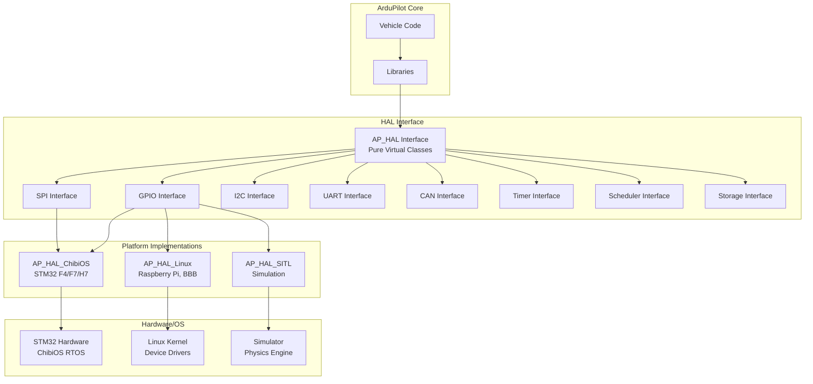
```mermaid
graph TB
    subgraph "ArduPilot Core"
        VEHICLE[Vehicle Code]
        LIBRARIES[Libraries]
    end
    
    subgraph "HAL Interface"
        HAL_INTERFACE[AP_HAL Interface<br/>Pure Virtual Classes]
        
        GPIO_IF[GPIO Interface]
        SPI_IF[SPI Interface]
        I2C_IF[I2C Interface]
        UART_IF[UART Interface]
        CAN_IF[CAN Interface]
        TIMER_IF[Timer Interface]
        SCHED_IF[Scheduler Interface]
        STORAGE_IF[Storage Interface]
    end
    
    subgraph "Platform Implementations"
        CHIBIOS_HAL[AP_HAL_ChibiOS<br/>STM32 F4/F7/H7]
        LINUX_HAL[AP_HAL_Linux<br/>Raspberry Pi, BBB]
        SITL_HAL[AP_HAL_SITL<br/>Simulation]
    end
    
    subgraph "Hardware/OS"
        STM32[STM32 Hardware<br/>ChibiOS RTOS]
        LINUX_OS[Linux Kernel<br/>Device Drivers]
        SIM[Simulator<br/>Physics Engine]
    end
    
    VEHICLE --> LIBRARIES
    LIBRARIES --> HAL_INTERFACE
    
    HAL_INTERFACE --> GPIO_IF
    HAL_INTERFACE --> SPI_IF
    HAL_INTERFACE --> I2C_IF
    HAL_INTERFACE --> UART_IF
    HAL_INTERFACE --> CAN_IF
    HAL_INTERFACE --> TIMER_IF
    HAL_INTERFACE --> SCHED_IF
    HAL_INTERFACE --> STORAGE_IF
    
    GPIO_IF --> CHIBIOS_HAL
    SPI_IF --> CHIBIOS_HAL
    GPIO_IF --> LINUX_HAL
    GPIO_IF --> SITL_HAL
    
    CHIBIOS_HAL --> STM32
    LINUX_HAL --> LINUX_OS
    SITL_HAL --> SIM
```

### HAL Interface Classes

**Source**: `/libraries/AP_HAL/AP_HAL.h`

#### Core HAL Components

| Interface | Responsibility | Key Methods |
|-----------|----------------|-------------|
| **AP_HAL::HAL** | Main HAL structure | Pointers to all subsystems |
| **GPIO** | Digital I/O control | pinMode(), read(), write() |
| **SPIDevice** | SPI bus communication | transfer(), transfer_fullduplex() |
| **I2CDevice** | I2C bus communication | read_registers(), write_register() |
| **UARTDriver** | Serial communication | read(), write(), available() |
| **CANIface** | CAN bus operations | send(), receive() |
| **Scheduler** | Task scheduling | register_timer_process(), delay() |
| **Storage** | Persistent storage | read_block(), write_block() |
| **RCInput** | RC receiver interface | read(), new_input() |
| **RCOutput** | PWM/DSHOT output | write(), cork(), push() |
| **AnalogIn** | ADC interface | voltage_average(), voltage_latest() |
| **Util** | Utility functions | get_hw_rtc(), safety_switch_state() |

### Device Driver Model

**Source**: `/libraries/AP_HAL/Device.h`

The HAL implements a modern device driver model with bus abstraction:

#### Device Interface

```cpp
class Device {
public:
    virtual bool transfer(const uint8_t *send, uint32_t send_len,
                         uint8_t *recv, uint32_t recv_len) = 0;
    virtual bool register_periodic_callback(uint32_t period_usec,
                                           AP_HAL::Device::PeriodicCb cb) = 0;
    virtual AP_HAL::Semaphore *get_semaphore() = 0;
};
```

#### SPI and I2C Devices

- **Bus Sharing**: Multiple devices share SPI/I2C buses safely
- **Chip Select Management**: Automatic CS assertion/deassertion
- **DMA Support**: High-speed transfers without CPU intervention
- **Periodic Callbacks**: Sensor sampling at precise intervals

### Threading and Synchronization

**Source**: `/libraries/AP_HAL/Scheduler.h`, `/libraries/AP_HAL/Semaphores.h`

#### Thread Types

1. **Main Thread**: Runs scheduler tasks at loop rate
2. **IO Thread**: Handles slow I/O operations (SD card, UART)
3. **Timer Threads**: Periodic callbacks (e.g., sensor sampling)
4. **Interrupt Context**: Hardware interrupt handlers

#### Synchronization Primitives

- **Semaphores**: Protect shared resources (binary and counting)
- **Mutexes**: Ownership-based locks (not used, semaphores preferred)
- **Atomics**: Lock-free operations for simple variables
- **Disable Interrupts**: Critical sections in bare-metal code

### Platform-Specific Implementations

#### ChibiOS HAL (Primary Platform)

**Source**: `/libraries/AP_HAL_ChibiOS/`

- **Target Hardware**: STM32 F4/F7/H7/G4 microcontrollers
- **RTOS**: ChibiOS real-time operating system
- **Features**: DMA, hardware timers, low-level peripheral access
- **Board Definitions**: hwdef files define pin mappings and peripherals

#### Linux HAL

**Source**: `/libraries/AP_HAL_Linux/`

- **Target Hardware**: Raspberry Pi, BeagleBone, desktop Linux
- **OS Interface**: POSIX APIs, Linux device drivers
- **Features**: WiFi, Ethernet, USB, high-level I/O
- **Use Cases**: Companion computers, development, testing

#### SITL HAL (Software-in-the-Loop)

**Source**: `/libraries/AP_HAL_SITL/`

- **Target**: Desktop development and testing
- **Simulation**: Physics engine integration (JSBSim, Gazebo)
- **Features**: Simulated sensors, actuators, and environment
- **Use Cases**: Algorithm development, automated testing, training

### Board Configuration

**Source**: `/libraries/AP_HAL_ChibiOS/hwdef/`

Each supported board has a hwdef file defining:

```python
# Hardware definition example
MCU STM32F7xx STM32F765xx
FLASH_SIZE_KB 2048

# Oscillator configuration
OSCILLATOR_HZ 24000000

# Peripheral definitions
PA0 UART4_TX UART4
PA1 UART4_RX UART4
PA4 SPI1_CS CS
PA5 SPI1_SCK SPI1
PA6 SPI1_MISO SPI1
PA7 SPI1_MOSI SPI1

# IMU definition
SPIDEV icm20689 SPI1 DEVID1 MPU_CS MODE3 4*MHZ 8*MHZ
IMU Invensense SPI:icm20689 ROTATION_YAW_270

# Storage
define HAL_STORAGE_SIZE 16384
```

## Vehicle-Specific Architectures

While ArduPilot shares extensive code across vehicle types, each implements unique architectures optimized for their dynamics and operational requirements.

### ArduCopter Architecture

**Source**: `/ArduCopter/`

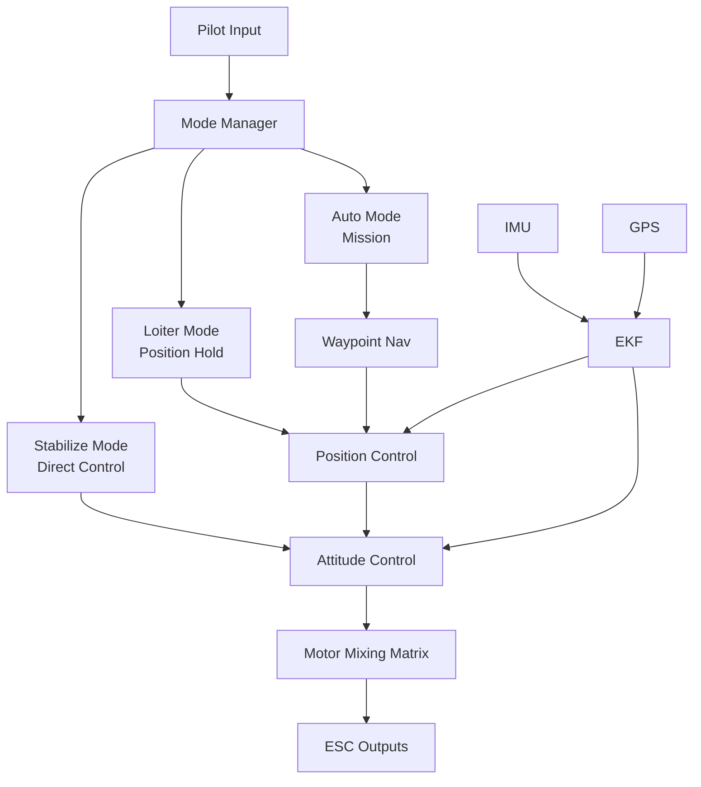
```mermaid
graph TB
    PILOT[Pilot Input] --> MODE_MGR[Mode Manager]
    MODE_MGR --> STAB_MODE[Stabilize Mode<br/>Direct Control]
    MODE_MGR --> LOITER_MODE[Loiter Mode<br/>Position Hold]
    MODE_MGR --> AUTO_MODE[Auto Mode<br/>Mission]
    
    STAB_MODE --> ATT_CTL[Attitude Control]
    LOITER_MODE --> POS_CTL[Position Control]
    AUTO_MODE --> WPNAV[Waypoint Nav]
    
    WPNAV --> POS_CTL
    POS_CTL --> ATT_CTL
    
    ATT_CTL --> MOTOR_MIX[Motor Mixing Matrix]
    MOTOR_MIX --> ESC[ESC Outputs]
    
    EKF_C[EKF] --> POS_CTL
    EKF_C --> ATT_CTL
    
    INS_C[IMU] --> EKF_C
    GPS_C[GPS] --> EKF_C
```

**Key Characteristics**:
- **Control Frequency**: 400 Hz main loop
- **Attitude Controller**: Quaternion-based with feed-forward
- **Position Controller**: Cascaded PID loops (position → velocity → acceleration)
- **Motor Mixing**: Frame-specific mixing matrices (quad, hex, octo, etc.)
- **Thrust Linearization**: Accounts for non-linear motor/prop response

**Flight Modes**: 26+ modes including Stabilize, AltHold, Loiter, RTL, Auto, Guided, Sport, Flip, AutoTune

### ArduPlane Architecture

**Source**: `/ArduPlane/`

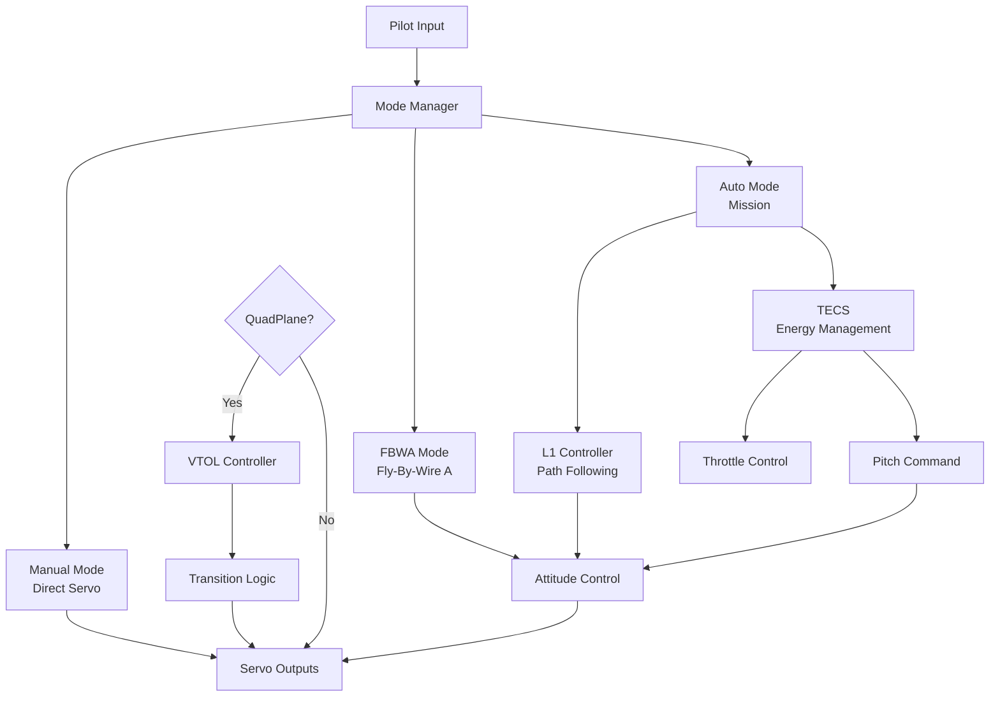
```mermaid
graph TB
    PILOT_P[Pilot Input] --> MODE_MGR_P[Mode Manager]
    MODE_MGR_P --> MANUAL_P[Manual Mode<br/>Direct Servo]
    MODE_MGR_P --> FBWA[FBWA Mode<br/>Fly-By-Wire A]
    MODE_MGR_P --> AUTO_P[Auto Mode<br/>Mission]
    
    MANUAL_P --> SERVO_OUT[Servo Outputs]
    FBWA --> ATT_CTL_P[Attitude Control]
    AUTO_P --> L1_CTRL[L1 Controller<br/>Path Following]
    
    L1_CTRL --> ATT_CTL_P
    ATT_CTL_P --> SERVO_OUT
    
    AUTO_P --> TECS[TECS<br/>Energy Management]
    TECS --> THROTTLE[Throttle Control]
    TECS --> PITCH_CMD[Pitch Command]
    
    PITCH_CMD --> ATT_CTL_P
    
    QUADPLANE{QuadPlane?}
    QUADPLANE -->|Yes| VTOL_CTL[VTOL Controller]
    QUADPLANE -->|No| SERVO_OUT
    VTOL_CTL --> TRANSITION[Transition Logic]
    TRANSITION --> SERVO_OUT
```

**Key Characteristics**:
- **Control Frequency**: 50-400 Hz (configurable)
- **Path Following**: L1 controller for smooth waypoint tracking
- **Energy Management**: TECS (Total Energy Control System) for altitude/airspeed
- **VTOL Support**: QuadPlane integration for vertical takeoff/landing
- **Stall Prevention**: Airspeed monitoring with automatic recovery

**Flight Modes**: Manual, Stabilize, FBWA, FBWB, Cruise, Auto, RTL, Loiter, Circle, Guided, QStabilize, QHover, QLoiter, QAcro (VTOL modes)

### Rover Architecture

**Source**: `/Rover/`

**Key Characteristics**:
- **Control**: Skid-steering or Ackermann steering
- **Navigation**: L1 controller adapted for ground vehicles
- **Obstacle Avoidance**: Proximity sensor integration
- **Modes**: Manual, Hold, Steering, Auto, Guided, RTL

### ArduSub Architecture

**Source**: `/ArduSub/`

**Key Characteristics**:
- **6DOF Control**: Full 6 degrees of freedom
- **Motor Configuration**: Vectored thrusters for underwater maneuverability
- **Depth Control**: Pressure sensor-based depth hold
- **Modes**: Manual, Stabilize, DepthHold, PosHold, Auto

## Integration Points

ArduPilot provides multiple integration points for external systems, companion computers, and ground stations.

### Companion Computer Integration

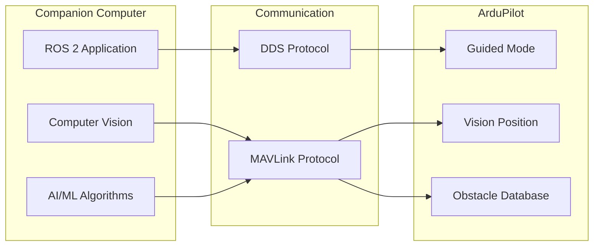
```mermaid
graph LR
    subgraph "Companion Computer"
        ROS[ROS 2 Application]
        CV[Computer Vision]
        AI[AI/ML Algorithms]
    end
    
    subgraph "Communication"
        MAVLINK_COMP[MAVLink Protocol]
        DDS_COMP[DDS Protocol]
    end
    
    subgraph "ArduPilot"
        GUIDED[Guided Mode]
        VISION_POS[Vision Position]
        OBSTACLE[Obstacle Database]
    end
    
    ROS --> DDS_COMP
    CV --> MAVLINK_COMP
    AI --> MAVLINK_COMP
    
    DDS_COMP --> GUIDED
    MAVLINK_COMP --> VISION_POS
    MAVLINK_COMP --> OBSTACLE
```

#### MAVLink Commands

**Position Control**:
- SET_POSITION_TARGET_GLOBAL_INT: Lat/lon/alt targets
- SET_POSITION_TARGET_LOCAL_NED: NED frame targets
- SET_ATTITUDE_TARGET: Direct attitude control

**Vision Integration**:
- VISION_POSITION_ESTIMATE: External position source
- OBSTACLE_DISTANCE: Proximity sensor data
- GPS_INPUT: External GPS injection

#### DDS/ROS 2 Integration

**Source**: `/libraries/AP_DDS/`

Native ROS 2 topics for bi-directional communication:
- **/ap/pose**: Vehicle pose (TF2 compatible)
- **/ap/twist**: Velocity state
- **/ap/geopose**: Geographic position
- **/ap/cmd_vel**: Velocity commands
- **/ap/cmd_gps**: Position commands

### Ground Station Integration

Supported ground control stations:
- **Mission Planner**: Windows-based, full-featured
- **QGroundControl**: Cross-platform, streamlined
- **MAVProxy**: Command-line, scriptable
- **APM Planner 2**: Legacy support

### Payload Integration

**Camera Control**:
- **DO_DIGICAM_CONTROL**: Trigger camera shutter
- **DO_SET_CAM_TRIGG_DIST**: Distance-based triggering
- **DO_MOUNT_CONTROL**: Gimbal pointing

**Servo/Relay Control**:
- **DO_SET_SERVO**: Direct PWM output control
- **DO_SET_RELAY**: Digital on/off control
- **Configurable Auxiliary Functions**: RC channel pass-through

### External Sensor Integration

**Optical Flow**:
- PX4FLOW via MAVLink
- MAVLINK_OPTICAL_FLOW messages
- Integration with EKF for non-GPS navigation

**Rangefinders**:
- Lidar (Lightware, Benewake, Garmin)
- Sonar (MaxBotix, HC-SR04)
- Integration for terrain following and landing

**Beacon Systems**:
- Marvelmind indoor GPS
- Pozyx UWB positioning
- Non-GPS absolute positioning

## Glossary

| Term | Definition |
|------|------------|
| **AHRS** | Attitude Heading Reference System - provides vehicle orientation |
| **DCM** | Direction Cosine Matrix - rotation representation method |
| **DMA** | Direct Memory Access - hardware-based memory transfers |
| **EKF** | Extended Kalman Filter - state estimation algorithm |
| **FIFO** | First-In-First-Out buffer |
| **HAL** | Hardware Abstraction Layer |
| **IMU** | Inertial Measurement Unit - accelerometer + gyroscope |
| **MAVLink** | Micro Air Vehicle Link - communication protocol |
| **NED** | North-East-Down coordinate frame |
| **PWM** | Pulse Width Modulation - servo/ESC control method |
| **RTK** | Real-Time Kinematic - centimeter-accurate GPS |
| **RTL** | Return To Launch - autonomous return home mode |
| **SITL** | Software In The Loop - simulation environment |
| **TECS** | Total Energy Control System - fixed-wing altitude/airspeed controller |

---

**Document Version**: 1.0  
**Last Updated**: 2024  
**Maintained By**: ArduPilot Development Team  
**Related Documentation**: See `/docs/` directory for additional architecture documents

For module-specific details, refer to individual README.md files in vehicle and library directories.


