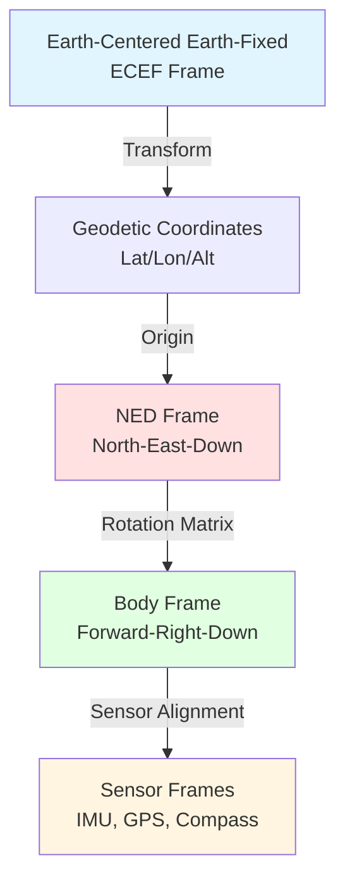
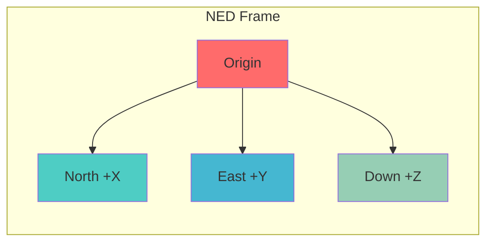
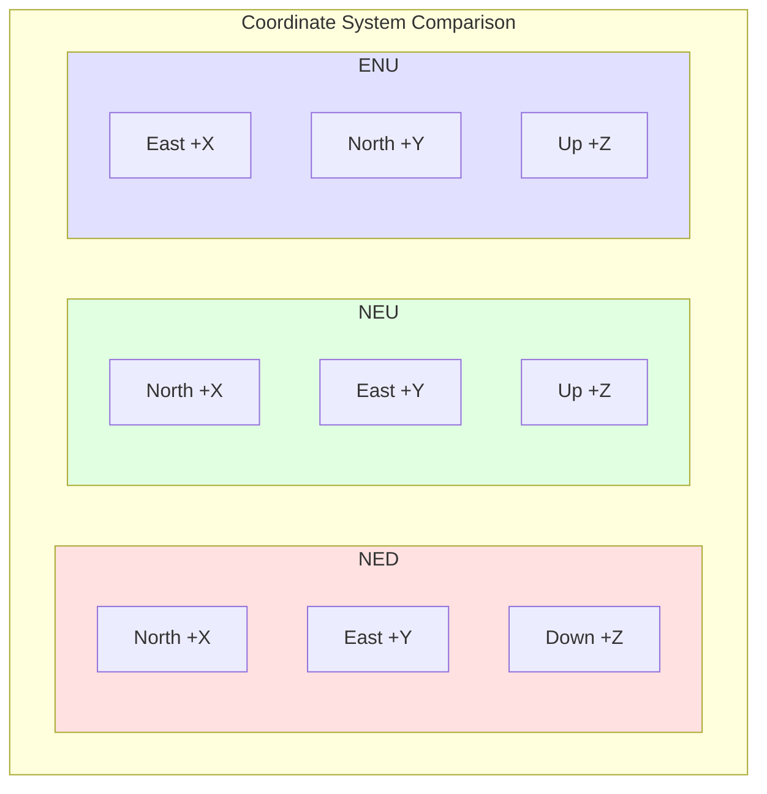
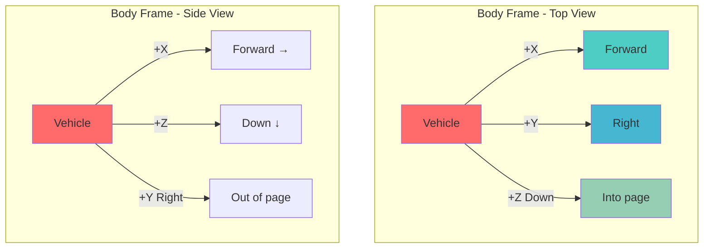
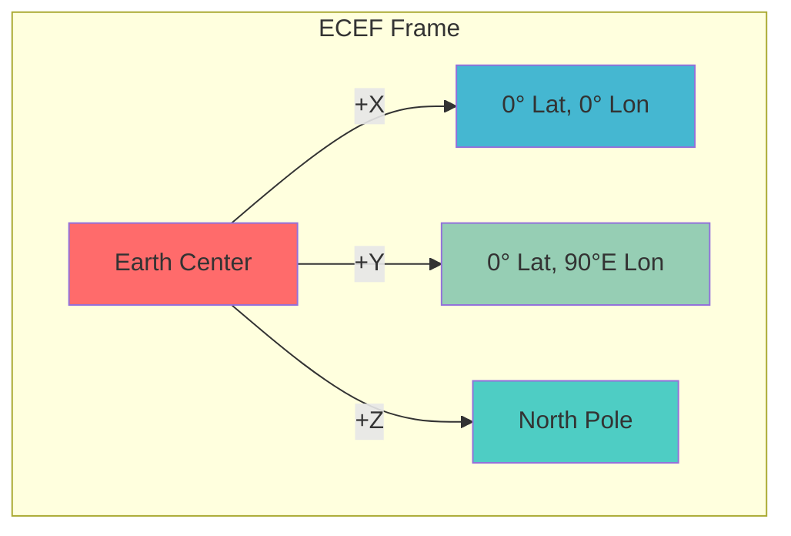
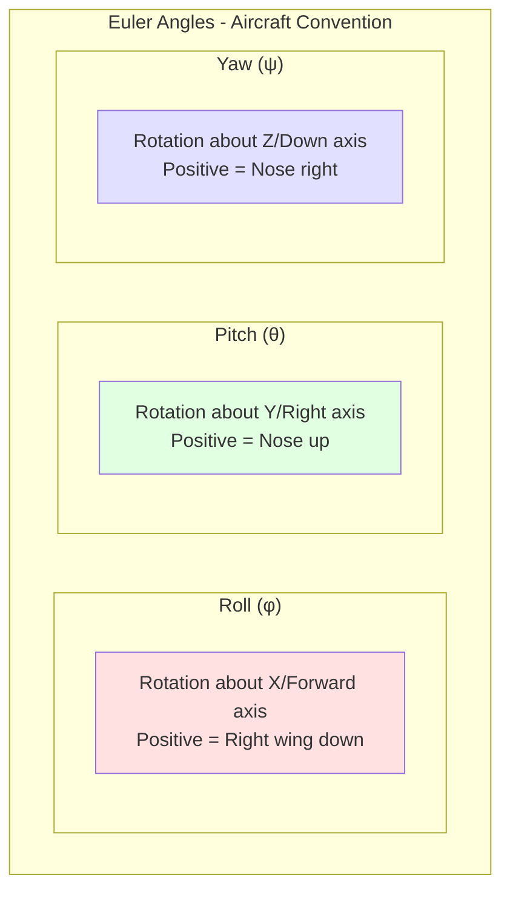

# ArduPilot Coordinate Systems Reference

## Table of Contents

- [Overview](#overview)
- [Coordinate Frame Hierarchy](#coordinate-frame-hierarchy)
- [NED (North-East-Down) Coordinate System](#ned-north-east-down-coordinate-system)
- [NEU (North-East-Up) and ENU Coordinate Systems](#neu-north-east-up-and-enu-coordinate-systems)
- [Body Frame](#body-frame)
- [Earth Frame (ECEF) and Geodetic Coordinates](#earth-frame-ecef-and-geodetic-coordinates)
- [Frame Transformations and Rotation Matrices](#frame-transformations-and-rotation-matrices)
- [Quaternion Representations](#quaternion-representations)
- [Euler Angle Conventions](#euler-angle-conventions)
- [Sensor Alignment and Calibration Frames](#sensor-alignment-and-calibration-frames)
- [MAVLink Coordinate Conventions](#mavlink-coordinate-conventions)
- [Navigation and Waypoint Coordinate Systems](#navigation-and-waypoint-coordinate-systems)
- [Code Examples for Frame Conversions](#code-examples-for-frame-conversions)
- [Common Pitfalls and Debugging Tips](#common-pitfalls-and-debugging-tips)

---

## Overview

ArduPilot uses multiple coordinate frames to represent vehicle orientation, position, velocity, and sensor measurements. Understanding these coordinate systems is essential for:

- **Navigation and Control**: Position estimation, path planning, and attitude control
- **Sensor Fusion**: Combining data from IMUs, GPS, magnetometers, and other sensors
- **External Integration**: Interfacing with ground control stations, companion computers, and simulation environments
- **Algorithm Development**: Implementing navigation algorithms, state estimators, and control laws

This document provides a comprehensive reference for all coordinate systems used throughout the ArduPilot codebase, with emphasis on:
- Mathematical definitions and conventions
- Transformation relationships between frames
- Code implementation patterns
- Common usage examples

**Key Principles:**
1. **Consistency**: ArduPilot maintains strict conventions for frame definitions across all vehicle types
2. **Right-handed systems**: All coordinate frames follow right-handed coordinate system conventions
3. **Standard units**: Positions in meters, velocities in m/s, angles in radians (unless otherwise specified)
4. **Frame clarity**: Functions and variables are explicitly named to indicate their coordinate frame

---

## Coordinate Frame Hierarchy

ArduPilot organizes coordinate frames in a hierarchical structure from global to local reference frames:



**Frame Relationships:**
- **ECEF ↔ Geodetic**: Transformation between Cartesian and curvilinear Earth coordinates
- **Geodetic → NED**: Establishes local tangent plane at a specified origin
- **NED ↔ Body**: Describes vehicle attitude (orientation) relative to Earth
- **Body ↔ Sensor**: Accounts for sensor mounting alignment on the vehicle

---

## NED (North-East-Down) Coordinate System

### Definition

The NED (North-East-Down) frame is the primary local navigation frame used in ArduPilot. It is a right-handed, Earth-fixed coordinate system defined relative to a local origin point.

**Axis Definitions:**
- **N (North)**: Points toward true North in the local tangent plane
- **E (East)**: Points toward East in the local tangent plane
- **D (Down)**: Points downward toward the Earth's center (positive down)



### Properties

1. **Local Tangent Plane**: The NED frame is tangent to the Earth's surface at the origin point
2. **Right-Handed**: Follows the right-hand rule: N × E = D
3. **Gravity Aligned**: The Down axis aligns with the local gravity vector
4. **Fixed Origin**: Typically set to the arming location or a mission origin

### Usage in ArduPilot

The NED frame is used extensively throughout ArduPilot for:

**Position Representation:**
- All EKF (Extended Kalman Filter) position estimates are in NED coordinates
- Waypoint offsets and navigation targets are expressed in NED
- Position control algorithms operate in NED frame

**Velocity Representation:**
- Velocity estimates from navigation filters are provided in NED
- Wind speed estimates are expressed in NED frame
- Velocity commands for guided mode use NED coordinates

**Code References:**
- `libraries/AP_AHRS/AP_AHRS.h`: Core interface for NED transformations
- `libraries/AP_NavEKF3/AP_NavEKF3.cpp`: EKF position and velocity in NED
- `libraries/AP_Math/location.h`: Location and NED offset conversions

### NED Origin Setup

The NED origin is typically established when:
1. **Vehicle Arming**: The arming location becomes the default origin
2. **EKF Initialization**: EKF sets its origin based on first GPS lock
3. **Manual Override**: Origin can be set explicitly via MAVLink commands

**Source Code Example:**
```cpp
// From libraries/AP_NavEKF3/AP_NavEKF3.cpp
// Set the latitude and longitude and height used to set the NED origin
// All NED positions calculated by the filter will be relative to this location
bool NavEKF3::setOriginLLH(const Location &loc)
{
    // Set origin for all cores
    for (uint8_t i=0; i<num_cores; i++) {
        core[i].setOriginLLH(loc);
    }
    return true;
}
```

### Working with NED Coordinates

**Getting Vehicle Position in NED:**
```cpp
// From libraries/AP_AHRS/AP_AHRS.h
Vector3f position_NED;
if (ahrs.get_relative_position_NED_origin(position_NED)) {
    // position_NED.x = North offset in meters
    // position_NED.y = East offset in meters
    // position_NED.z = Down offset in meters (positive = below origin)
}
```

**Getting Vehicle Velocity in NED:**
```cpp
// From libraries/AP_AHRS/AP_AHRS.h
Vector3f velocity_NED;
if (ahrs.get_velocity_NED(velocity_NED)) {
    // velocity_NED.x = North velocity in m/s
    // velocity_NED.y = East velocity in m/s
    // velocity_NED.z = Down velocity in m/s (positive = descending)
}
```

### Advantages of NED

1. **Intuitive Navigation**: North and East align with map coordinates
2. **Gravity Alignment**: Down axis naturally represents altitude (negative altitude = up)
3. **Aviation Standard**: Widely used in aerospace and aviation systems
4. **MAVLink Compatibility**: MAVLink protocol uses NED as primary frame

---

## NEU (North-East-Up) and ENU Coordinate Systems

### Definition

While ArduPilot primarily uses NED internally, some external systems and standards use alternative conventions:

**NEU (North-East-Up):**
- **N (North)**: Points toward true North
- **E (East)**: Points toward East
- **U (Up)**: Points upward away from Earth (positive up)

**ENU (East-North-Up):**
- **E (East)**: Points toward East
- **N (North)**: Points toward true North
- **U (Up)**: Points upward away from Earth



### NED ↔ NEU Conversion

Converting between NED and NEU is straightforward - simply negate the vertical component:

**Mathematical Transformation:**
```
NEU.x = NED.x  (North component unchanged)
NEU.y = NED.y  (East component unchanged)
NEU.z = -NED.z (Negate vertical: Down → Up)
```

**Code Example:**
```cpp
// Convert NED to NEU
Vector3f ned_position(100.0f, 50.0f, -20.0f);  // 100m North, 50m East, 20m Up
Vector3f neu_position;
neu_position.x = ned_position.x;   // North: 100.0
neu_position.y = ned_position.y;   // East: 50.0
neu_position.z = -ned_position.z;  // Up: 20.0 (negated from Down: -20.0)

// Convert NEU to NED
Vector3f ned_back;
ned_back.x = neu_position.x;
ned_back.y = neu_position.y;
ned_back.z = -neu_position.z;
```

### NED ↔ ENU Conversion

Converting between NED and ENU requires swapping and negating components:

**Mathematical Transformation:**
```
ENU.x = NED.y  (East from NED.y)
ENU.y = NED.x  (North from NED.x)
ENU.z = -NED.z (Up from negated NED.z)
```

**Code Example:**
```cpp
// Convert NED to ENU
Vector3f ned_vector(100.0f, 50.0f, -20.0f);
Vector3f enu_vector;
enu_vector.x = ned_vector.y;   // East: 50.0
enu_vector.y = ned_vector.x;   // North: 100.0
enu_vector.z = -ned_vector.z;  // Up: 20.0

// Convert ENU to NED
Vector3f ned_from_enu;
ned_from_enu.x = enu_vector.y;   // North from ENU.y
ned_from_enu.y = enu_vector.x;   // East from ENU.x
ned_from_enu.z = -enu_vector.z;  // Down from negated ENU.z
```

### External System Interfaces

**ROS (Robot Operating System):**
- ROS uses ENU as standard frame (REP-103)
- ArduPilot-ROS interfaces require NED↔ENU conversion
- Position and velocity data must be transformed

**Computer Vision Systems:**
- OpenCV and many vision systems use different conventions
- Careful attention needed when integrating visual odometry
- Frame transformations must be validated

---

## Body Frame

### Definition

The Body Frame is a vehicle-fixed coordinate system that moves and rotates with the vehicle. It is the natural frame for expressing sensor measurements, control inputs, and aerodynamic forces.

**Axis Definitions (ArduPilot Convention):**
- **X (Forward)**: Points forward out the nose of the vehicle
- **Y (Right)**: Points out the right side of the vehicle  
- **Z (Down)**: Points downward through the bottom of the vehicle



### Properties

1. **Vehicle-Fixed**: Rotates and translates with the vehicle
2. **Right-Handed**: Follows right-hand rule: Forward × Right = Down
3. **Sensor Reference**: IMU measurements are naturally in body frame
4. **Control Reference**: Control surfaces and motor commands reference body frame

### Body Frame Usage

**Sensor Measurements:**
- **Gyroscope**: Angular rates in body frame (rad/s)
- **Accelerometer**: Specific forces in body frame (m/s²)
- **Magnetometer**: Magnetic field in body frame (Gauss or Tesla)

**Control Commands:**
- **Angular Rate Control**: Desired roll/pitch/yaw rates in body frame
- **Thrust Vector**: Motor thrust direction in body frame
- **Control Surface Deflections**: Aileron, elevator, rudder in body axes

**Code References:**
```cpp
// From libraries/AP_InertialSensor/AP_InertialSensor.h
// Get accelerometer measurement in body frame
Vector3f accel_body = ins.get_accel();  // m/s² in body frame

// Get gyroscope measurement in body frame
Vector3f gyro_body = ins.get_gyro();    // rad/s in body frame

// From libraries/AP_Compass/AP_Compass.h
// Get magnetometer measurement in body frame
Vector3f mag_body = compass.get_field();  // Gauss in body frame
```

### Body Frame Variants

**Autopilot Body Frame:**
- Defined by the physical mounting of the autopilot board
- May differ from vehicle body frame if board is rotated

**Vehicle Body Frame:**
- The actual vehicle's body axes
- Accounts for board rotation via `AHRS_ORIENTATION` parameter

**Transformation Between Variants:**
```cpp
// From libraries/AP_AHRS/AP_AHRS.h
// Get rotation from autopilot body to vehicle body
const Matrix3f& ahrs.get_rotation_autopilot_body_to_vehicle_body();

// Get rotation from vehicle body to autopilot body
const Matrix3f& ahrs.get_rotation_vehicle_body_to_autopilot_body();
```

---

## Earth Frame (ECEF) and Geodetic Coordinates

### Earth-Centered Earth-Fixed (ECEF) Frame

The ECEF frame is a Cartesian coordinate system with origin at Earth's center of mass.

**Axis Definitions:**
- **X**: Points from Earth's center through the intersection of the Equator and Prime Meridian (0° lat, 0° lon)
- **Y**: Points from Earth's center through the intersection of the Equator and 90°E longitude
- **Z**: Points from Earth's center through the North Pole



**Properties:**
1. **Earth-Fixed**: Rotates with Earth (not inertial)
2. **Cartesian**: Uses X, Y, Z coordinates in meters
3. **Global Reference**: Suitable for long-distance navigation
4. **GPS Native**: Many GPS receivers output ECEF coordinates

### Geodetic Coordinates

Geodetic coordinates describe position on Earth's surface using:
- **Latitude (φ)**: Angle north/south of Equator (-90° to +90°)
- **Longitude (λ)**: Angle east/west of Prime Meridian (-180° to +180°)
- **Altitude (h)**: Height above reference ellipsoid (WGS84)

**WGS84 Ellipsoid:**
- Semi-major axis (a): 6,378,137.0 meters
- Flattening (f): 1/298.257223563
- Semi-minor axis (b): 6,356,752.314245 meters

### ECEF ↔ Geodetic Conversion

**Geodetic to ECEF:**
```
N = a / sqrt(1 - e² sin²φ)
X = (N + h) cos φ cos λ
Y = (N + h) cos φ sin λ
Z = (N(1 - e²) + h) sin φ

where e² = 2f - f² (eccentricity squared)
```

**ECEF to Geodetic:**
Uses iterative algorithms (Bowring's method or closed-form solutions)

### Usage in ArduPilot

**GPS Data:**
ArduPilot receives GPS data in geodetic coordinates and converts to NED for navigation:

```cpp
// From libraries/AP_GPS/AP_GPS.h
struct GPS_State {
    Location location;  // Geodetic: lat, lon, alt
    // ... other fields
};

// From libraries/AP_Common/Location.h
struct Location {
    int32_t lat;  // Latitude in 1e-7 degrees
    int32_t lng;  // Longitude in 1e-7 degrees
    int32_t alt;  // Altitude in centimeters (AMSL or relative)
    // ...
};
```

**RTK Baseline:**
RTK GPS systems can provide baseline vectors in either ECEF or NED:

```cpp
// From libraries/AP_GPS/AP_GPS.h
uint8_t rtk_baseline_coords_type;  // 0 = ECEF, 1 = NED
int32_t rtk_baseline_x_mm;         // ECEF X or NED North (mm)
int32_t rtk_baseline_y_mm;         // ECEF Y or NED East (mm)
int32_t rtk_baseline_z_mm;         // ECEF Z or NED Down (mm)
```

### Altitude References

ArduPilot handles multiple altitude references:

**AMSL (Above Mean Sea Level):**
- Referenced to EGM96 or EGM2008 geoid model
- Accounts for local variations in geoid height

**WGS84 Ellipsoid Height:**
- Geometric height above WGS84 reference ellipsoid
- Differs from AMSL by undulation value

**Conversion:**
```cpp
// From libraries/AP_GPS/AP_GPS.h
float undulation;  // Height that WGS84 is above AMSL (meters)

// WGS84 height = AMSL height + undulation
float wgs84_height = amsl_height + gps.get_undulation();
```

---

## Frame Transformations and Rotation Matrices

### Rotation Matrix Fundamentals

A rotation matrix R transforms vectors from one frame to another while preserving vector length and handedness.

**Properties:**
- **Orthogonal**: R^T R = I (transpose equals inverse)
- **Determinant**: det(R) = +1 (preserves handedness)
- **Dimension**: 3×3 matrix for 3D rotations

**ArduPilot Implementation:**
```cpp
// From libraries/AP_Math/matrix3.h
template <typename T>
class Matrix3 {
public:
    Vector3<T> a, b, c;  // Three row vectors
    
    // Matrix multiplication
    Matrix3<T> operator*(const Matrix3<T> &m) const;
    
    // Vector transformation
    Vector3<T> operator*(const Vector3<T> &v) const;
    
    // Transpose (inverse for rotation matrices)
    Matrix3<T> transposed() const;
};
```

### NED to Body Transformation

The rotation matrix from NED to Body frame represents the vehicle's attitude:

**Mathematical Definition:**
```
R_nb = R_z(ψ) R_y(θ) R_x(φ)

where:
  φ = roll angle (rotation about X/North axis)
  θ = pitch angle (rotation about Y/East axis)
  ψ = yaw angle (rotation about Z/Down axis)
```

**Code Usage:**
```cpp
// From libraries/AP_AHRS/AP_AHRS.h
// Get rotation matrix from body to NED
const Matrix3f& dcm = ahrs.get_rotation_body_to_ned();

// Transform vector from body to NED frame
Vector3f body_vector(1.0f, 0.0f, 0.0f);  // 1 m/s forward
Vector3f ned_vector = dcm * body_vector;  // Now in NED frame

// Transform vector from NED to body frame (use transpose)
Vector3f ned_wind(5.0f, 2.0f, 0.0f);     // Wind from North-East
Vector3f body_wind = dcm.transposed() * ned_wind;
```

### 2D Rotation Helpers

For horizontal plane operations, ArduPilot provides convenient 2D rotation functions:

```cpp
// From libraries/AP_AHRS/AP_AHRS.h
// Rotate 2D vector from Earth frame to Body frame
Vector2f body_to_earth2D(const Vector2f &bf) const;

// Rotate 2D vector from Body frame to Earth frame  
Vector2f earth_to_body2D(const Vector2f &ef) const;

// Example usage
Vector2f body_velocity(10.0f, 2.0f);  // 10 m/s forward, 2 m/s right
Vector2f ned_velocity = ahrs.body_to_earth2D(body_velocity);
```

### Rotation Composition

Multiple rotations can be composed by matrix multiplication:

**Right-to-Left Application:**
```cpp
// Rotation sequence: sensor → vehicle body → NED
Matrix3f R_sensor_to_body = get_sensor_rotation();
Matrix3f R_body_to_ned = ahrs.get_rotation_body_to_ned();
Matrix3f R_sensor_to_ned = R_body_to_ned * R_sensor_to_body;

// Transform sensor measurement all the way to NED
Vector3f sensor_measurement = get_sensor_data();
Vector3f ned_measurement = R_sensor_to_ned * sensor_measurement;
```

### Predefined Rotations

ArduPilot provides an extensive set of predefined rotations for sensor mounting:

```cpp
// From libraries/AP_Math/rotations.h
enum Rotation : uint8_t {
    ROTATION_NONE                = 0,
    ROTATION_YAW_45              = 1,
    ROTATION_YAW_90              = 2,
    ROTATION_YAW_180             = 4,
    ROTATION_ROLL_180            = 8,
    ROTATION_PITCH_90            = 24,
    // ... 44 predefined rotations total
};

// Apply rotation to a vector
Vector3f rotated = vector.rotate(ROTATION_YAW_90);

// Get rotation matrix
Matrix3f rotation_matrix;
rotation_matrix.from_rotation(ROTATION_YAW_90);
```

**Common Sensor Rotations:**
- `ROTATION_NONE`: No rotation (default alignment)
- `ROTATION_YAW_90`: Autopilot rotated 90° clockwise
- `ROTATION_YAW_180`: Autopilot rotated 180°
- `ROTATION_PITCH_180`: Autopilot upside down
- `ROTATION_ROLL_180_YAW_90`: Complex mounting orientation

---

## Quaternion Representations

### Quaternion Fundamentals

Quaternions provide a singularity-free, computationally efficient representation of 3D rotations.

**Mathematical Form:**
```
q = q1 + q2i + q3j + q4k = [q1, q2, q3, q4]

where:
  q1 = scalar (real) part
  q2, q3, q4 = vector (imaginary) parts
  i² = j² = k² = ijk = -1
```

**Unit Quaternion Constraint:**
```
||q|| = sqrt(q1² + q2² + q3² + q4²) = 1
```

**ArduPilot Implementation:**
```cpp
// From libraries/AP_Math/quaternion.h
template <typename T>
class QuaternionT {
public:
    T q1, q2, q3, q4;  // Scalar first, then vector components
    
    // Default constructor: identity rotation (no rotation)
    QuaternionT() : q1(1), q2(0), q3(0), q4(0) {}
    
    // Setting constructor
    QuaternionT(const T _q1, const T _q2, const T _q3, const T _q4);
};

using Quaternion = QuaternionT<float>;
using QuaternionD = QuaternionT<double>;
```

### Quaternion ↔ Rotation Matrix

**Quaternion to Rotation Matrix:**
```cpp
// From libraries/AP_Math/quaternion.h
Quaternion q;
Matrix3f rotation_matrix;
q.rotation_matrix(rotation_matrix);  // Populate matrix from quaternion
```

**Rotation Matrix to Quaternion:**
```cpp
Matrix3f dcm = ahrs.get_rotation_body_to_ned();
Quaternion q;
q.from_rotation_matrix(dcm);  // Extract quaternion from matrix
```

### Quaternion ↔ Euler Angles

**Euler Angles to Quaternion:**
ArduPilot uses 3-2-1 (yaw-pitch-roll) Euler sequence:

```cpp
// From libraries/AP_Math/quaternion.h
float roll = 0.1f;   // radians
float pitch = 0.2f;  // radians
float yaw = 1.57f;   // radians (90 degrees)

Quaternion q;
q.from_euler(roll, pitch, yaw);  // 321 Euler sequence
```

**Quaternion to Euler Angles:**
```cpp
// Get current attitude quaternion
Quaternion q;
ahrs.get_quat_body_to_ned(q);

// Convert to Euler angles
float roll, pitch, yaw;
q.to_euler(roll, pitch, yaw);  // Extract Euler angles in radians
```

### Quaternion Operations

**Quaternion Multiplication (Composition):**
```cpp
Quaternion q1, q2, q_result;
q_result = q1 * q2;  // Applies q1 rotation, then q2 rotation
```

**Quaternion Conjugate (Inverse):**
```cpp
Quaternion q, q_inv;
q_inv = q.inverse();  // For unit quaternions: conjugate
```

**Vector Rotation:**
```cpp
// Rotate vector from Earth to Body frame using quaternion
Quaternion q;
ahrs.get_quat_body_to_ned(q);

Vector3f ned_vector(10.0f, 0.0f, 0.0f);  // 10m North
Vector3f body_vector;
q.earth_to_body(ned_vector);  // Rotate to body frame
```

### Quaternion Advantages

1. **No Singularities**: Unlike Euler angles (gimbal lock at ±90° pitch)
2. **Efficient Composition**: Quaternion multiplication faster than matrix multiplication
3. **Smooth Interpolation**: SLERP (Spherical Linear Interpolation) for smooth paths
4. **Numerical Stability**: Better conditioning for iterative algorithms like EKF

### Quaternion in EKF

The Navigation EKF uses quaternions for attitude representation:

```cpp
// From libraries/AP_NavEKF3/AP_NavEKF3_core.h
// EKF state vector includes quaternion representation
struct state_elements {
    Quaternion quat;     // Quaternion defining rotation from NED to body
    Vector3f velocity;   // NED velocity (m/s)
    Vector3f position;   // NED position (m)
    Vector3f gyro_bias;  // Gyro bias estimate (rad/s)
    // ... other state elements
};
```

---

## Euler Angle Conventions

### Definition

Euler angles describe orientation as a sequence of three rotations about coordinate axes. ArduPilot uses the aerospace standard convention.

**Angle Definitions:**
- **Roll (φ)**: Rotation about the X (forward) axis
  - Positive roll = right wing down
  - Range: -180° to +180° (or -π to +π rad)
  
- **Pitch (θ)**: Rotation about the Y (right) axis
  - Positive pitch = nose up
  - Range: -90° to +90° (or -π/2 to +π/2 rad)
  
- **Yaw (ψ)**: Rotation about the Z (down) axis
  - Positive yaw = nose right
  - Range: -180° to +180° (or 0° to 360° in some contexts)



### Rotation Sequence (3-2-1)

ArduPilot applies rotations in the order: **Yaw → Pitch → Roll** (3-2-1 sequence)

**Mathematical Representation:**
```
R_nb = R_z(ψ) * R_y(θ) * R_x(φ)

where:
  R_x(φ) = [1    0         0     ]
           [0  cos(φ)  -sin(φ) ]
           [0  sin(φ)   cos(φ) ]
           
  R_y(θ) = [ cos(θ)   0   sin(θ)]
           [   0       1     0   ]
           [-sin(θ)   0   cos(θ)]
           
  R_z(ψ) = [cos(ψ)  -sin(ψ)   0]
           [sin(ψ)   cos(ψ)   0]
           [  0         0      1]
```

### Code Usage

**Getting Euler Angles:**
```cpp
// From libraries/AP_AHRS/AP_AHRS.h
float roll = ahrs.roll;    // Roll angle in radians
float pitch = ahrs.pitch;  // Pitch angle in radians
float yaw = ahrs.yaw;      // Yaw angle in radians

// Or use explicit functions
float roll_rad = ahrs.get_roll();
float pitch_rad = ahrs.get_pitch();
float yaw_rad = ahrs.get_yaw();

// Convert to degrees
float roll_deg = degrees(roll_rad);
float pitch_deg = degrees(pitch_rad);
float yaw_deg = degrees(yaw_rad);
```

**Setting Attitude from Euler Angles:**
```cpp
// Create quaternion from Euler angles
Quaternion q;
q.from_euler(roll, pitch, yaw);  // All in radians

// Create rotation matrix from Euler angles
Matrix3f dcm;
dcm.from_euler(roll, pitch, yaw);
```

### Gimbal Lock

**Problem:**
At pitch = ±90°, roll and yaw axes align, causing:
- Loss of one degree of freedom
- Numerical instability in conversions
- Discontinuities in Euler angle representation

**Solution:**
Use quaternions for internal attitude representation, convert to Euler only for:
- User display (telemetry, GCS)
- Parameter limits and checks
- Mode-specific control laws

**Code Protection:**
```cpp
// ArduPilot EKF uses quaternions internally
// Euler angles only extracted when needed
void NavEKF3::getEulerAngles(Vector3f &euler) const {
    Quaternion quat = state.quat;
    quat.to_euler(euler.x, euler.y, euler.z);  // Convert only when requested
}
```

### Euler Angle Rates

Angular velocity in body frame relates to Euler angle rates through a kinematic relationship:

**Relationship:**
```
[φ_dot]   [1   sin(φ)tan(θ)   cos(φ)tan(θ)] [p]
[θ_dot] = [0       cos(φ)         -sin(φ)  ] [q]
[ψ_dot]   [0   sin(φ)/cos(θ)   cos(φ)/cos(θ)] [r]

where p, q, r = body rates (gyro measurements)
```

**Code Implementation:**
```cpp
// From libraries/AP_AHRS/AP_AHRS.h
// Get Euler angle rates from body rates
Vector3f gyro = ahrs.get_gyro();  // Body rates: p, q, r (rad/s)

float roll_rate = gyro.x + gyro.y * sin(roll) * tan(pitch) + gyro.z * cos(roll) * tan(pitch);
float pitch_rate = gyro.y * cos(roll) - gyro.z * sin(roll);
float yaw_rate = (gyro.y * sin(roll) + gyro.z * cos(roll)) / cos(pitch);
```

**Note**: The yaw rate equation has singularity at pitch = ±90° (gimbal lock)

---

## Sensor Alignment and Calibration Frames

### Sensor Frame Definitions

Each sensor has its own local coordinate frame that may differ from the autopilot body frame.

**IMU (Inertial Measurement Unit):**
- Factory calibration defines sensor axes
- May not align with autopilot board axes
- Corrected by sensor rotation parameter

**Magnetometer (Compass):**
- External compass has independent mounting
- Internal compass follows autopilot orientation
- Rotation and offset calibration required

**GPS/GNSS:**
- Antenna position offset from vehicle CG
- Orientation matters for moving baseline RTK
- Lever arm corrections for dual-antenna systems

### Sensor Rotation Parameters

ArduPilot uses `ROTATION` enum to specify sensor alignment:

**Common Parameters:**
```
INS_ORIENT       - Primary IMU rotation
INS2_ORIENT      - Secondary IMU rotation
COMPASS_ORIENT   - Primary compass rotation
COMPASS_ORIENT2  - Secondary compass rotation
COMPASS_ORIENT3  - Tertiary compass rotation
```

**Example Configuration:**
```cpp
// Parameter file excerpt
INS_ORIENT       0    // No rotation (default alignment)
INS2_ORIENT      2    // Yaw 90° (second IMU rotated clockwise)
COMPASS_ORIENT   0    // Internal compass (no rotation)
COMPASS_EXTERN   1    // External compass enabled
COMPASS_ORIENT   4    // External compass: Yaw 180°
```

### Applying Sensor Rotations

**Code Flow:**
```cpp
// 1. Read raw sensor data in sensor frame
Vector3f accel_raw = read_accelerometer();  // Sensor frame

// 2. Apply factory calibration (scale, offset)
Vector3f accel_calibrated = apply_calibration(accel_raw);

// 3. Apply board rotation to get autopilot body frame
Vector3f accel_body = accel_calibrated.rotate(INS_ORIENT);

// 4. Apply vehicle body transformation if needed
Vector3f accel_vehicle = vehicle_rotation * accel_body;
```

**Implementation in AP_InertialSensor:**
```cpp
// From libraries/AP_InertialSensor/AP_InertialSensor.cpp
void AP_InertialSensor::_publish_delta_angle(uint8_t instance)
{
    // Get raw delta angle from backend
    Vector3f delta_angle = _delta_angle[instance];
    
    // Apply board rotation
    delta_angle.rotate(_board_orientation);
    
    // Store in corrected measurement
    _delta_angle_acc[instance] += delta_angle;
}
```

### Compass Calibration Frames

Magnetometer calibration involves two corrections:

**Offset Calibration (Hard Iron):**
- Removes constant magnetic field from vehicle metal
- Subtracted in sensor frame before rotation

```cpp
// From libraries/AP_Compass/AP_Compass_Backend.cpp
Vector3f mag_field = raw_field - offsets;  // Remove hard-iron offset
```

**Scale Calibration (Soft Iron):**
- Corrects for magnetic field distortion
- Applies matrix transformation in sensor frame

```cpp
// Apply soft-iron correction matrix
Vector3f mag_corrected = iron_matrix * (raw_field - offsets);

// Then rotate to body frame
Vector3f mag_body = mag_corrected.rotate(COMPASS_ORIENT);
```

### Multi-Sensor Fusion

When multiple sensors of the same type exist, all must be transformed to common body frame:

**Multi-IMU Example:**
```cpp
// From libraries/AP_InertialSensor/AP_InertialSensor.cpp
// Each IMU transformed to body frame then blended
for (uint8_t i=0; i<_accel_count; i++) {
    Vector3f accel = _accel_filtered[i];
    accel.rotate(get_board_orientation(i));  // Rotate to body
    blended_accel += accel * weight[i];       // Weighted blend
}
```

### Lever Arm Corrections

For sensors not located at vehicle center of gravity, position offsets matter:

**GPS Antenna Offset:**
```cpp
// From libraries/AP_GPS/AP_GPS.h
Vector3f antenna_offset;  // Offset from vehicle CG in body frame (meters)

// Correct GPS velocity for vehicle rotation
Vector3f angular_velocity = ahrs.get_gyro();  // Body rates (rad/s)
Vector3f velocity_correction = angular_velocity % antenna_offset;  // Cross product
Vector3f true_velocity = gps_velocity - velocity_correction;
```

**IMU Offset:**
```cpp
// From libraries/AP_InertialSensor/AP_InertialSensor.h
Vector3f get_imu_pos_offset(uint8_t instance);

// Correct acceleration for rotational effects
Vector3f angular_accel = get_angular_accel();  // Body angular acceleration
Vector3f correction = angular_accel % imu_offset;
Vector3f corrected_accel = measured_accel + correction;
```

---

## MAVLink Coordinate Conventions

### MAVLink Frame Standards

The MAVLink protocol (Micro Air Vehicle Link) defines standard coordinate frames for interoperability between autopilots, ground control stations, and companion computers.

**Primary MAVLink Frames:**

| MAVLink Frame | Frame ID | Description | Usage |
|--------------|----------|-------------|-------|
| `MAV_FRAME_GLOBAL` | 0 | Geodetic coordinates (WGS84), altitude is AMSL | Waypoints, home position |
| `MAV_FRAME_LOCAL_NED` | 1 | Local NED relative to origin | Position control, offsets |
| `MAV_FRAME_MISSION` | 2 | Mission frame (deprecated) | Legacy support |
| `MAV_FRAME_GLOBAL_RELATIVE_ALT` | 3 | Geodetic coordinates, altitude relative to home | Most common waypoint frame |
| `MAV_FRAME_LOCAL_ENU` | 7 | Local East-North-Up relative to origin | ROS compatibility |
| `MAV_FRAME_GLOBAL_INT` | 5 | Geodetic coordinates as integers (1e-7 degrees) | High precision waypoints |
| `MAV_FRAME_GLOBAL_RELATIVE_ALT_INT` | 6 | Integer geodetic, relative altitude | High precision, most common |
| `MAV_FRAME_LOCAL_OFFSET_NED` | 7 | NED offset from current position | Position commands |
| `MAV_FRAME_BODY_NED` | 8 | NED relative to vehicle heading | Velocity commands |
| `MAV_FRAME_BODY_OFFSET_NED` | 9 | NED offset in body frame | Obstacle avoidance |
| `MAV_FRAME_GLOBAL_TERRAIN_ALT` | 10 | Geodetic, altitude AGL (above terrain) | Terrain following |
| `MAV_FRAME_BODY_FRD` | 12 | Body frame: Forward-Right-Down | Velocity/thrust commands |

### Position and Velocity Messages

**Global Position (`GLOBAL_POSITION_INT`):**
```cpp
// MAVLink message structure
typedef struct __mavlink_global_position_int_t {
    uint32_t time_boot_ms;  // Timestamp (ms)
    int32_t lat;            // Latitude (degE7)
    int32_t lon;            // Longitude (degE7)
    int32_t alt;            // Altitude AMSL (mm)
    int32_t relative_alt;   // Altitude relative to home (mm)
    int16_t vx;             // Ground X velocity (NED North) (cm/s)
    int16_t vy;             // Ground Y velocity (NED East) (cm/s)
    int16_t vz;             // Ground Z velocity (NED Down) (cm/s)
    uint16_t hdg;           // Vehicle heading (cdeg, 0.0..359.99°)
} mavlink_global_position_int_t;
```

**Local Position (`LOCAL_POSITION_NED`):**
```cpp
// MAVLink message structure
typedef struct __mavlink_local_position_ned_t {
    uint32_t time_boot_ms;  // Timestamp (ms)
    float x;                // X Position (North) (m)
    float y;                // Y Position (East) (m)
    float z;                // Z Position (Down) (m)
    float vx;               // X velocity (North) (m/s)
    float vy;               // Y velocity (East) (m/s)
    float vz;               // Z velocity (Down) (m/s)
} mavlink_local_position_ned_t;
```

**ArduPilot Implementation:**
```cpp
// From libraries/GCS_MAVLink/GCS_Common.cpp
void GCS_MAVLINK::send_local_position() const
{
    Vector3f pos;
    if (!AP::ahrs().get_relative_position_NED_origin(pos)) {
        return;  // Position not available
    }
    
    Vector3f vel;
    if (!AP::ahrs().get_velocity_NED(vel)) {
        vel.zero();
    }
    
    mavlink_msg_local_position_ned_send(
        chan,
        AP_HAL::millis(),
        pos.x,   // North (m)
        pos.y,   // East (m)
        pos.z,   // Down (m)
        vel.x,   // North velocity (m/s)
        vel.y,   // East velocity (m/s)
        vel.z    // Down velocity (m/s)
    );
}
```

### Attitude Representation

**Attitude (`ATTITUDE`):**
```cpp
// Euler angles in radians
typedef struct __mavlink_attitude_t {
    uint32_t time_boot_ms;  // Timestamp (ms)
    float roll;             // Roll angle (rad)
    float pitch;            // Pitch angle (rad)
    float yaw;              // Yaw angle (rad)
    float rollspeed;        // Roll angular speed (rad/s)
    float pitchspeed;       // Pitch angular speed (rad/s)
    float yawspeed;         // Yaw angular speed (rad/s)
} mavlink_attitude_t;
```

**Attitude Quaternion (`ATTITUDE_QUATERNION`):**
```cpp
// Quaternion representation (more robust)
typedef struct __mavlink_attitude_quaternion_t {
    uint32_t time_boot_ms;  // Timestamp (ms)
    float q1;               // Quaternion component 1 (w)
    float q2;               // Quaternion component 2 (x)
    float q3;               // Quaternion component 3 (y)
    float q4;               // Quaternion component 4 (z)
    float rollspeed;        // Roll angular speed (rad/s)
    float pitchspeed;       // Pitch angular speed (rad/s)
    float yawspeed;         // Yaw angular speed (rad/s)
} mavlink_attitude_quaternion_t;
```

### Command Messages

**Set Position Target (`SET_POSITION_TARGET_LOCAL_NED`):**
```cpp
// Command vehicle to specific position/velocity
typedef struct __mavlink_set_position_target_local_ned_t {
    uint32_t time_boot_ms;
    uint8_t target_system;
    uint8_t target_component;
    uint8_t coordinate_frame;  // MAV_FRAME enum
    uint16_t type_mask;        // Bitmask: which fields to use
    float x;                   // X position/velocity (m or m/s)
    float y;                   // Y position/velocity (m or m/s)
    float z;                   // Z position/velocity (m or m/s)
    float vx;                  // X velocity (m/s)
    float vy;                  // Y velocity (m/s)
    float vz;                  // Z velocity (m/s)
    float afx;                 // X acceleration (m/s²)
    float afy;                 // Y acceleration (m/s²)
    float afz;                 // Z acceleration (m/s²)
    float yaw;                 // Yaw setpoint (rad)
    float yaw_rate;            // Yaw rate setpoint (rad/s)
} mavlink_set_position_target_local_ned_t;
```

**Type Mask Interpretation:**
```cpp
// From ArduCopter/GCS_Mavlink.cpp
// Bitmask to indicate which dimensions should be ignored
#define POSITION_TARGET_TYPEMASK_X_IGNORE      (1<<0)
#define POSITION_TARGET_TYPEMASK_Y_IGNORE      (1<<1)
#define POSITION_TARGET_TYPEMASK_Z_IGNORE      (1<<2)
#define POSITION_TARGET_TYPEMASK_VX_IGNORE     (1<<3)
#define POSITION_TARGET_TYPEMASK_VY_IGNORE     (1<<4)
#define POSITION_TARGET_TYPEMASK_VZ_IGNORE     (1<<5)
#define POSITION_TARGET_TYPEMASK_AX_IGNORE     (1<<6)
#define POSITION_TARGET_TYPEMASK_AY_IGNORE     (1<<7)
#define POSITION_TARGET_TYPEMASK_AZ_IGNORE     (1<<8)
#define POSITION_TARGET_TYPEMASK_YAW_IGNORE    (1<<9)
#define POSITION_TARGET_TYPEMASK_YAW_RATE_IGNORE (1<<10)
```

### Coordinate Frame Conversions in MAVLink Handling

**Example: Handling Position Target:**
```cpp
// From ArduCopter/GCS_Mavlink.cpp
void handle_set_position_target_local_ned(const mavlink_message_t &msg)
{
    mavlink_set_position_target_local_ned_t packet;
    mavlink_msg_set_position_target_local_ned_decode(&msg, &packet);
    
    // Convert based on coordinate frame
    Vector3f pos_target;
    switch (packet.coordinate_frame) {
        case MAV_FRAME_LOCAL_NED:
        case MAV_FRAME_LOCAL_OFFSET_NED:
            pos_target.x = packet.x;  // Already in NED
            pos_target.y = packet.y;
            pos_target.z = packet.z;
            break;
            
        case MAV_FRAME_BODY_NED:
        case MAV_FRAME_BODY_FRD:
            // Transform from body to NED
            pos_target = ahrs.body_to_earth(Vector3f(packet.x, packet.y, packet.z));
            break;
            
        case MAV_FRAME_BODY_OFFSET_NED:
            // Body frame offset, add to current position
            Vector3f body_offset(packet.x, packet.y, packet.z);
            Vector3f ned_offset = ahrs.body_to_earth(body_offset);
            Vector3f current_pos;
            if (ahrs.get_relative_position_NED_origin(current_pos)) {
                pos_target = current_pos + ned_offset;
            }
            break;
    }
    
    // Apply position target to guided mode
    set_guided_position_target(pos_target);
}
```

### Sensor Orientation

**Sensor Rotation (`MAV_SENSOR_ORIENTATION`):**
MAVLink defines sensor orientations that match ArduPilot's `Rotation` enum:

```cpp
// MAVLink and ArduPilot use same values
enum MAV_SENSOR_ORIENTATION {
    MAV_SENSOR_ROTATION_NONE                = 0,
    MAV_SENSOR_ROTATION_YAW_45              = 1,
    MAV_SENSOR_ROTATION_YAW_90              = 2,
    MAV_SENSOR_ROTATION_YAW_135             = 3,
    MAV_SENSOR_ROTATION_YAW_180             = 4,
    // ... matches Rotation enum from rotations.h
};
```

**Usage in Compass Calibration:**
```cpp
// GCS sends compass orientation, ArduPilot applies rotation
compass.set_orientation(instance, (Rotation)packet.orientation);
```

---

## Navigation and Waypoint Coordinate Systems

### Waypoint Representation

ArduPilot mission waypoints use geodetic coordinates with various altitude references:

**Mission Item Structure:**
```cpp
// From libraries/AP_Mission/AP_Mission.h
struct Mission_Command {
    uint16_t id;                // Waypoint ID
    uint16_t content;           // Command type (e.g., NAV_WAYPOINT)
    uint8_t frame;              // MAV_FRAME enum
    
    // Parameters depend on command type
    float p1;                   // Parameter 1
    union {
        Location location;      // For navigation commands
        struct {
            float lat;          // For other uses
            float lng;
            float alt;
        };
    };
};

// From libraries/AP_Common/Location.h
struct Location {
    int32_t lat;                // Latitude in 1e-7 degrees
    int32_t lng;                // Longitude in 1e-7 degrees
    int32_t alt;                // Altitude in cm
    uint8_t relative_alt:1;     // 1 = relative to home, 0 = AMSL
    uint8_t terrain_alt:1;      // 1 = AGL (terrain relative)
    uint8_t origin_alt:1;       // 1 = relative to EKF origin
    uint8_t loiter_ccw:1;       // Loiter direction
    uint8_t loiter_xtrack:1;    // Loiter crosstrack
};
```

### Altitude Reference Modes

**AMSL (Above Mean Sea Level):**
```cpp
Location wp;
wp.lat = 473977400;          // 47.3977400° N (degE7)
wp.lng = -1222092100;        // -122.2092100° W (degE7)
wp.alt = 12000;              // 120.00 m AMSL (cm)
wp.relative_alt = false;     // Absolute altitude
wp.terrain_alt = false;
```

**Home-Relative:**
```cpp
Location wp;
wp.lat = 473977400;
wp.lng = -1222092100;
wp.alt = 5000;               // 50.00 m above home (cm)
wp.relative_alt = true;      // Relative to home altitude
wp.terrain_alt = false;
```

**Terrain-Relative (AGL - Above Ground Level):**
```cpp
Location wp;
wp.lat = 473977400;
wp.lng = -1222092100;
wp.alt = 3000;               // 30.00 m above terrain (cm)
wp.relative_alt = false;
wp.terrain_alt = true;       // Altitude is AGL
```

### Location to NED Conversion

**Converting Waypoint to NED Offset:**
```cpp
// From libraries/AP_Math/location.cpp
// Get NED offset between two locations
Vector3f location_3d_diff_NED(const Location &loc1, const Location &loc2)
{
    // Returns NED vector from loc1 to loc2
    Vector3f ned_offset;
    
    // Horizontal offset (North, East)
    float dlat = (loc2.lat - loc1.lat) * LOCATION_SCALING_FACTOR;
    float dlng = (loc2.lng - loc1.lng) * LOCATION_SCALING_FACTOR * 
                 cosf(radians(loc1.lat * 1.0e-7f));
    
    ned_offset.x = dlat * LATLON_TO_M;  // North (m)
    ned_offset.y = dlng * LATLON_TO_M;  // East (m)
    
    // Vertical offset (Down)
    ned_offset.z = -(get_alt_cm(loc2) - get_alt_cm(loc1)) * 0.01f;  // Down (m)
    
    return ned_offset;
}
```

**Example Usage:**
```cpp
// Get NED offset from home to next waypoint
Location home = ahrs.get_home();
Location next_wp = mission.get_current_nav_cmd().content.location;

Vector3f ned_to_wp = location_3d_diff_NED(home, next_wp);
// ned_to_wp.x = North offset (m)
// ned_to_wp.y = East offset (m)  
// ned_to_wp.z = Down offset (m)

// Distance and bearing
float distance = ned_to_wp.xy().length();  // Horizontal distance
float bearing = atan2f(ned_to_wp.y, ned_to_wp.x);  // Bearing (radians)
```

### Path Planning in NED

**Waypoint Navigation:**
ArduPilot converts geodetic waypoints to NED for path planning:

```cpp
// From libraries/AC_WPNav/AC_WPNav.cpp
void AC_WPNav::set_wp_destination(const Location &destination)
{
    // Convert destination to NED relative to EKF origin
    Vector3f destination_NED;
    if (!destination.get_vector_from_origin_NEU(destination_NED)) {
        return;  // Failed to convert
    }
    
    // Negate Z for NED (NEU → NED)
    destination_NED.z = -destination_NED.z;
    
    // Set position controller target
    _destination = destination_NED;
    
    // Calculate velocity profile
    calculate_wp_velocity_profile();
}
```

**Loiter Circle:**
```cpp
// From libraries/AC_WPNav/AC_WPNav.cpp
// Loiter uses NED coordinates for circular path
void AC_WPNav::update_loiter()
{
    // Get current position in NED
    Vector3f position_NED;
    ahrs.get_relative_position_NED_origin(position_NED);
    
    // Calculate desired velocity for circle
    Vector2f center_to_vehicle(position_NED.x - _loiter_center.x,
                                position_NED.y - _loiter_center.y);
    float distance = center_to_vehicle.length();
    
    // Tangent velocity for circular motion
    Vector2f desired_velocity;
    if (_loiter_direction > 0) {  // Clockwise
        desired_velocity.x = -center_to_vehicle.y;
        desired_velocity.y = center_to_vehicle.x;
    } else {  // Counter-clockwise
        desired_velocity.x = center_to_vehicle.y;
        desired_velocity.y = -center_to_vehicle.x;
    }
    desired_velocity.normalize();
    desired_velocity *= _loiter_speed;
    
    // Command position controller
    pos_control.set_velocity_NED(Vector3f(desired_velocity.x, 
                                           desired_velocity.y, 
                                           _climb_rate));
}
```

### Terrain Following

**Terrain Database:**
ArduPilot maintains terrain elevation data for terrain-following missions:

```cpp
// From libraries/AP_Terrain/AP_Terrain.h
class AP_Terrain {
public:
    // Get terrain height at a location (AMSL)
    bool height_amsl(const Location &loc, float &height);
    
    // Get terrain height above current position
    bool height_above_terrain(float &height);
    
    // Get terrain height relative to home
    bool height_terrain_difference_home(float &terrain_difference);
};
```

**Terrain-Relative Waypoint Navigation:**
```cpp
// From ArduCopter/mode_auto.cpp
void ModeAuto::do_nav_waypoint()
{
    Location target = mission.get_current_nav_cmd().content.location;
    
    if (target.terrain_alt) {
        // Terrain-relative altitude
        float terrain_alt;
        if (terrain.height_amsl(target, terrain_alt)) {
            // Adjust target altitude to AMSL
            target.set_alt_cm(terrain_alt * 100 + target.alt, Location::AltFrame::ABSOLUTE);
            target.terrain_alt = false;
        }
    }
    
    // Navigate to adjusted target
    wp_nav->set_wp_destination(target);
}
```

---

## Code Examples for Frame Conversions

### Example 1: Body to NED Transformation

**Scenario**: Convert forward velocity (body frame) to NED velocity

```cpp
// From ArduCopter/Copter.cpp
// Vehicle moving at 10 m/s forward, 2 m/s right, 1 m/s down (body frame)
Vector3f body_velocity(10.0f, 2.0f, 1.0f);  // m/s

// Get current attitude rotation matrix
const Matrix3f& rotation_body_to_ned = ahrs.get_rotation_body_to_ned();

// Transform to NED frame
Vector3f ned_velocity = rotation_body_to_ned * body_velocity;

// ned_velocity now contains:
//   .x = North component (m/s)
//   .y = East component (m/s)
//   .z = Down component (m/s)

// Or use 2D helper for horizontal velocity
Vector2f body_vel_2d(10.0f, 2.0f);  // Forward, right
Vector2f ned_vel_2d = ahrs.body_to_earth2D(body_vel_2d);
// ned_vel_2d.x = North velocity
// ned_vel_2d.y = East velocity
```

### Example 2: NED to Body Transformation

**Scenario**: Convert wind vector from NED to body frame

```cpp
// Wind from North-East at 5 m/s North, 3 m/s East
Vector3f ned_wind(5.0f, 3.0f, 0.0f);

// Get rotation matrix and transpose (inverse) for NED → Body
const Matrix3f& rotation_body_to_ned = ahrs.get_rotation_body_to_ned();
Matrix3f rotation_ned_to_body = rotation_body_to_ned.transposed();

// Transform to body frame
Vector3f body_wind = rotation_ned_to_body * ned_wind;

// body_wind now contains:
//   .x = Wind component along forward axis (headwind positive)
//   .y = Wind component along right axis (right crosswind positive)
//   .z = Wind component along down axis (downdraft positive)

// Determine if headwind or tailwind
if (body_wind.x > 0) {
    GCS_SEND_TEXT(MAV_SEVERITY_INFO, "Headwind: %.1f m/s", body_wind.x);
} else {
    GCS_SEND_TEXT(MAV_SEVERITY_INFO, "Tailwind: %.1f m/s", -body_wind.x);
}
```

### Example 3: Geodetic to NED Conversion

**Scenario**: Calculate NED offset from home to target location

```cpp
// Home location
Location home;
home.lat = 473977400;      // 47.3977400° N
home.lng = -1222092100;    // -122.2092100° W
home.alt = 10000;          // 100 m AMSL

// Target location
Location target;
target.lat = 473987400;    // 47.3987400° N (+0.001° North)
target.lng = -1222082100;  // -122.2082100° W (+0.001° East)
target.alt = 15000;        // 150 m AMSL (+50 m up)

// Calculate NED offset
Vector3f ned_offset = location_3d_diff_NED(home, target);

// Results (approximate):
//   ned_offset.x ≈ 111 m North (0.001° latitude ≈ 111 m)
//   ned_offset.y ≈ 75 m East (0.001° longitude ≈ 75 m at this latitude)
//   ned_offset.z ≈ -50 m Down (negative because target is higher)

float horizontal_distance = ned_offset.xy().length();  // ≈ 134 m
float bearing_rad = atan2f(ned_offset.y, ned_offset.x);
float bearing_deg = degrees(bearing_rad);  // ≈ 34° (NE)
```

### Example 4: Quaternion Rotation

**Scenario**: Rotate gravity vector from NED to body frame

```cpp
// Gravity in NED frame (pointing down)
Vector3f gravity_ned(0.0f, 0.0f, 9.81f);  // m/s² down

// Get current attitude as quaternion
Quaternion attitude;
ahrs.get_quat_body_to_ned(attitude);

// Rotate gravity to body frame
Vector3f gravity_body;
attitude.earth_to_body(gravity_ned);

// gravity_body now shows gravity in body frame
// For level flight: gravity_body ≈ (0, 0, 9.81)
// For 45° nose up: gravity_body ≈ (-6.94, 0, 6.94)
// For 90° right roll: gravity_body ≈ (0, 9.81, 0)

// Calculate pitch angle from gravity
float pitch_rad = atan2f(-gravity_body.x, 
                          sqrtf(gravity_body.y*gravity_body.y + 
                                gravity_body.z*gravity_body.z));
```

### Example 5: Sensor Rotation

**Scenario**: Apply compass rotation for external sensor

```cpp
// Raw magnetometer reading from external compass
Vector3f mag_raw(250.0f, 100.0f, -300.0f);  // Gauss in sensor frame

// Compass is mounted rotated 90° yaw (facing right)
enum Rotation compass_rotation = ROTATION_YAW_90;

// Apply rotation to get body frame measurement
Vector3f mag_body = mag_raw.rotate(compass_rotation);

// Or using rotation matrix
Matrix3f rotation_matrix;
rotation_matrix.from_rotation(compass_rotation);
Vector3f mag_body_alt = rotation_matrix * mag_raw;

// Apply calibration offsets (in body frame)
Vector3f compass_offsets(50.0f, -30.0f, 20.0f);  // Hard-iron correction
Vector3f mag_calibrated = mag_body - compass_offsets;

// Now rotate to NED to get magnetic field direction
const Matrix3f& body_to_ned = ahrs.get_rotation_body_to_ned();
Vector3f mag_ned = body_to_ned * mag_calibrated;

// Calculate magnetic heading
float mag_heading_rad = atan2f(-mag_ned.y, mag_ned.x);  // Radians from North
float mag_heading_deg = degrees(mag_heading_rad);
if (mag_heading_deg < 0) mag_heading_deg += 360.0f;
```

### Example 6: Multi-Frame Path Planning

**Scenario**: Command vehicle to location 50m ahead in body frame

```cpp
// Get current position in NED
Vector3f current_pos_ned;
if (!ahrs.get_relative_position_NED_origin(current_pos_ned)) {
    return;  // Position not available
}

// Define offset in body frame (50m forward)
Vector3f body_offset(50.0f, 0.0f, 0.0f);

// Transform offset to NED frame
const Matrix3f& body_to_ned = ahrs.get_rotation_body_to_ned();
Vector3f ned_offset = body_to_ned * body_offset;

// Calculate target position in NED
Vector3f target_pos_ned = current_pos_ned + ned_offset;

// Convert NED position to geodetic Location
Location target_location;
if (ahrs.get_location_from_origin_offset_NED(target_location, target_pos_ned)) {
    // Command vehicle to target
    set_guided_destination(target_location);
}
```

### Example 7: Velocity Frame Conversion

**Scenario**: Convert desired NED velocity to body frame thrust vector

```cpp
// Desired velocity in NED frame (5 m/s North, 3 m/s East, 0 m/s vertical)
Vector3f desired_vel_ned(5.0f, 3.0f, 0.0f);

// Get current velocity in NED
Vector3f current_vel_ned;
ahrs.get_velocity_NED(current_vel_ned);

// Calculate velocity error in NED
Vector3f vel_error_ned = desired_vel_ned - current_vel_ned;

// Transform error to body frame for control
Matrix3f ned_to_body = ahrs.get_rotation_body_to_ned().transposed();
Vector3f vel_error_body = ned_to_body * vel_error_ned;

// Apply velocity controller gains (simplified)
float kP_vel = 2.0f;  // Proportional gain
Vector3f accel_cmd_body = vel_error_body * kP_vel;

// Convert acceleration to thrust (add gravity compensation)
Vector3f gravity_body;
Quaternion attitude;
ahrs.get_quat_body_to_ned(attitude);
attitude.earth_to_body(Vector3f(0, 0, 9.81f));  // Gravity in NED

Vector3f thrust_vector = accel_cmd_body + gravity_body;

// Normalize and scale for motors
float thrust_magnitude = thrust_vector.length();
float throttle_normalized = thrust_magnitude / GRAVITY_MSS;  // 0-2 range
```

---

## Common Pitfalls and Debugging Tips

### Pitfall 1: Confusing NED with NEU

**Problem**: External systems (e.g., ROS) use NEU or ENU while ArduPilot uses NED

**Symptoms:**
- Altitude has wrong sign (flying into ground when should climb)
- North/East components swapped (ENU)
- Waypoints offset in unexpected directions

**Solution:**
```cpp
// NEU ↔ NED conversion (negate vertical)
Vector3f ned_to_neu(const Vector3f& ned) {
    return Vector3f(ned.x, ned.y, -ned.z);
}

// ENU ↔ NED conversion (swap and negate)
Vector3f ned_to_enu(const Vector3f& ned) {
    return Vector3f(ned.y, ned.x, -ned.z);
}

// Always document frame in variable names
Vector3f position_NED;  // Clear: NED frame
Vector3f position_ENU;  // Clear: ENU frame
Vector3f position;      // Ambiguous: avoid!
```

**Debugging:**
- Check signs: NED down is positive, NEU/ENU up is positive
- Verify component order: NED is X-North, ENU is X-East
- Test with known attitudes (level flight, 90° roll, etc.)

### Pitfall 2: Gimbal Lock with Euler Angles

**Problem**: Euler angles become ambiguous at ±90° pitch

**Symptoms:**
- Erratic yaw readings near vertical pitch
- Control instability in steep climbs/dives
- Discontinuous angle jumps

**Solution:**
```cpp
// Use quaternions for internal representation
Quaternion attitude;
ahrs.get_quat_body_to_ned(attitude);

// Only convert to Euler for display or specific control laws
float roll, pitch, yaw;
attitude.to_euler(roll, pitch, yaw);

// Check for gimbal lock condition
if (fabsf(pitch) > radians(85.0f)) {
    GCS_SEND_TEXT(MAV_SEVERITY_WARNING, "Near gimbal lock");
    // Use quaternion-based control, not Euler
}
```

**Debugging:**
- Monitor pitch angle during maneuvers
- Compare Euler and quaternion representations
- Use quaternion-based attitude control for aerobatics

### Pitfall 3: Sensor Rotation Errors

**Problem**: Incorrect sensor orientation parameters cause wrong readings

**Symptoms:**
- Vehicle drifts in unexpected directions
- Unstable hover or flight
- Compass heading doesn't match vehicle heading

**Solution:**
```cpp
// Verify sensor rotations match physical installation
// Use ROTATION_NONE if sensor aligned with autopilot

// Test individual sensors
Vector3f accel = ins.get_accel();
// With vehicle level:
//   accel.z should be ≈ +9.81 m/s² (down is positive)
//   accel.x and accel.y should be ≈ 0

// With vehicle pitched up 45°:
//   accel.x should be ≈ -6.94 m/s² (gravity component backward)
//   accel.z should be ≈ +6.94 m/s² (gravity component down)

Vector3f gyro = ins.get_gyro();
// Roll vehicle right, gyro.x should be positive
// Pitch vehicle up, gyro.y should be positive  
// Yaw vehicle right, gyro.z should be positive
```

**Debugging:**
- Use ground station sensor display to verify axes
- Physically rotate vehicle and watch sensor response
- Compare expected vs actual rotation conventions

### Pitfall 4: Coordinate Frame Drift

**Problem**: Accumulated errors cause frames to diverge over time

**Symptoms:**
- Position estimate drifts from GPS
- Attitude estimate drifts from level
- Increasing position errors during flight

**Solution:**
```cpp
// EKF fuses sensors to correct drift
// Monitor EKF health
float position_variance = ekf.get_position_variance();
if (position_variance > 10.0f) {  // Threshold in m²
    GCS_SEND_TEXT(MAV_SEVERITY_WARNING, "High position variance");
}

// Check EKF status flags
nav_filter_status ekf_status;
ekf.get_filter_status(ekf_status);
if (!ekf_status.flags.horiz_pos_abs) {
    GCS_SEND_TEXT(MAV_SEVERITY_ERROR, "No absolute position");
}

// Ensure good GPS and compass health
if (gps.status() < AP_GPS::GPS_OK_FIX_3D) {
    // Position will drift without GPS
}
```

**Debugging:**
- Monitor EKF innovations (measurement residuals)
- Check sensor health and quality indicators
- Verify sensor calibration (compass, accel, gyro)
- Review EKF parameter tuning

### Pitfall 5: Altitude Reference Confusion

**Problem**: Mixing AMSL, relative, and terrain-relative altitudes

**Symptoms:**
- Unexpected altitude changes
- Terrain collision warnings
- Waypoint altitude errors

**Solution:**
```cpp
// Always check altitude frame
Location waypoint = mission.get_current_nav_cmd().content.location;

if (waypoint.terrain_alt) {
    // Altitude is AGL (above ground level)
    float terrain_alt_amsl;
    if (terrain.height_amsl(waypoint, terrain_alt_amsl)) {
        float target_amsl = terrain_alt_amsl + waypoint.alt * 0.01f;
        GCS_SEND_TEXT(MAV_SEVERITY_INFO, "Target AMSL: %.1f m", target_amsl);
    }
} else if (waypoint.relative_alt) {
    // Altitude is relative to home
    Location home = ahrs.get_home();
    float target_amsl = (home.alt + waypoint.alt) * 0.01f;
    GCS_SEND_TEXT(MAV_SEVERITY_INFO, "Target AMSL: %.1f m", target_amsl);
} else {
    // Altitude is absolute AMSL
    float target_amsl = waypoint.alt * 0.01f;
    GCS_SEND_TEXT(MAV_SEVERITY_INFO, "Target AMSL: %.1f m", target_amsl);
}
```

**Debugging:**
- Log all altitude values with their reference frame
- Compare barometric, GPS, and terrain altitudes
- Verify home altitude is set correctly
- Check terrain database coverage and accuracy

### Pitfall 6: Incorrect Lever Arm Compensation

**Problem**: Not accounting for sensor offset from vehicle CG

**Symptoms:**
- Position errors during aggressive maneuvers
- Velocity errors during turns
- GPS/IMU position mismatch

**Solution:**
```cpp
// Configure sensor offsets (in body frame, meters)
Vector3f gps_antenna_offset(0.1f, 0.05f, -0.15f);  // Forward, right, down

// EKF applies correction automatically if offset configured
// Manual correction for reference:
Vector3f angular_velocity = ahrs.get_gyro();  // rad/s in body frame
Vector3f velocity_correction = angular_velocity % gps_antenna_offset;  // Cross product

Vector3f gps_velocity;  // Velocity at GPS antenna
Vector3f cg_velocity = gps_velocity - velocity_correction;  // Velocity at CG
```

**Debugging:**
- Measure sensor offsets accurately
- Monitor position agreement between sensors
- Check for velocity errors correlated with turn rate
- Verify offset signs (body frame: forward positive, right positive, down positive)

### Pitfall 7: Timestamp and Latency Issues

**Problem**: Not accounting for sensor delays and processing latency

**Symptoms:**
- Position lags behind actual vehicle position
- Phase lag in control response
- Poor sensor fusion performance

**Solution:**
```cpp
// Sensors have inherent delays
// GPS: typically 100-200ms
// Magnetometer: 10-50ms
// Barometer: 20-50ms

// EKF buffers measurements and applies time delays
// Ensure correct timestamp tagging
uint32_t measurement_time_ms = AP_HAL::millis();

// Check for delayed measurements
uint32_t current_time_ms = AP_HAL::millis();
uint32_t measurement_age_ms = current_time_ms - measurement_time_ms;
if (measurement_age_ms > 500) {
    GCS_SEND_TEXT(MAV_SEVERITY_WARNING, "Stale measurement: %u ms", 
                  (unsigned)measurement_age_ms);
}
```

**Debugging:**
- Monitor measurement timestamps
- Check for timing outliers
- Verify sensor update rates
- Review EKF timing logs

### Pitfall 8: Magnetic Declination

**Problem**: Not accounting for difference between magnetic North and true North

**Symptoms:**
- Heading offset relative to GPS ground track
- Waypoint navigation errors
- Compass appears miscalibrated but passes tests

**Solution:**
```cpp
// From libraries/AP_Compass/AP_Compass.h
// Magnetic declination automatically set from world model
float declination_rad = compass.get_declination();
float declination_deg = degrees(declination_rad);

// Magnetic heading to true heading
float mag_heading = compass.calculate_heading();  // Magnetic North
float true_heading = wrap_2PI(mag_heading + declination_rad);  // True North

// EKF fuses GPS and compass to estimate declination
// Monitor fusion:
Vector3f mag_field_ned;
if (ahrs.get_mag_field_NED(mag_field_ned)) {
    float estimated_declination = atan2f(-mag_field_ned.y, mag_field_ned.x);
    GCS_SEND_TEXT(MAV_SEVERITY_INFO, "Declination: %.1f°", 
                  degrees(estimated_declination));
}
```

**Debugging:**
- Check declination value for your location (varies by location and time)
- Compare magnetic heading to GPS ground track
- Verify compass calibration quality
- Review EKF compass fusion status

### General Debugging Workflow

1. **Instrument Your Code:**
   ```cpp
   // Add frame identifiers to debug messages
   GCS_SEND_TEXT(MAV_SEVERITY_INFO, "Pos NED: %.2f,%.2f,%.2f", 
                 pos_ned.x, pos_ned.y, pos_ned.z);
   
   // Log transformations
   Vector3f before_rotation = body_vector;
   Vector3f after_rotation = rotation_matrix * body_vector;
   logger.Write("FRAME", "TimeUS,Bx,By,Bz,Nx,Ny,Nz",
                "Qffffff",
                AP_HAL::micros64(),
                before_rotation.x, before_rotation.y, before_rotation.z,
                after_rotation.x, after_rotation.y, after_rotation.z);
   ```

2. **Visualize Coordinate Frames:**
   - Use Mission Planner or QGroundControl 3D view
   - Plot position/velocity components separately
   - Compare sensor data in different frames

3. **Unit Testing:**
   ```cpp
   // Test known transformations
   Vector3f north_ned(1, 0, 0);
   Vector3f result = test_rotation_matrix * north_ned;
   EXPECT_NEAR(result.x, expected.x, 0.001f);
   ```

4. **Hardware-in-Loop Testing:**
   - Use SITL (Software-In-The-Loop) to test without risk
   - Verify transformations with known vehicle attitudes
   - Compare with mathematical predictions

5. **Parameter Review:**
   - Check `AHRS_ORIENTATION`
   - Verify `COMPASS_ORIENT`, `COMPASS_ORIENT2`, `COMPASS_ORIENT3`
   - Review `GPS_POS` offset parameters
   - Confirm `INS_POS` offset parameters

---

## Conclusion

Understanding ArduPilot's coordinate systems is fundamental to working with the codebase effectively. Key takeaways:

1. **NED is Primary**: ArduPilot uses NED (North-East-Down) as the standard local navigation frame
2. **Body Frame for Sensors**: All sensor measurements are naturally in vehicle body frame
3. **Geodetic for Waypoints**: Mission waypoints use lat/lon/alt but are converted to NED for navigation
4. **Quaternions for Attitude**: Internal attitude representation avoids gimbal lock
5. **Explicit Frame Naming**: Always indicate coordinate frame in variable names
6. **Careful Conversions**: Double-check transformations, especially signs and axis ordering
7. **MAVLink Compatibility**: Ensure external interfaces use correct MAVLink frame IDs

**Additional Resources:**
- `libraries/AP_Math/`: Vector, matrix, and quaternion implementations
- `libraries/AP_AHRS/`: Attitude and heading reference system
- `libraries/AP_NavEKF3/`: Navigation filter coordinate handling
- `libraries/GCS_MAVLink/`: MAVLink coordinate conventions
- MAVLink Documentation: https://mavlink.io/en/

**Code Review Checklist:**
- [ ] All vectors have frame indicated (e.g., `velocity_NED`)
- [ ] Transformations use correct rotation direction
- [ ] Altitude references are explicit (AMSL/relative/terrain)
- [ ] Sensor orientations match physical installation
- [ ] Gimbal lock handled (use quaternions)
- [ ] Units are consistent (meters, radians)
- [ ] Signs follow conventions (NED down is positive)

By maintaining awareness of coordinate frames throughout development, you ensure robust, predictable vehicle behavior and seamless integration with external systems.

---

*This document is maintained as part of the ArduPilot documentation system. For questions or corrections, please see CONTRIBUTING.md.*
