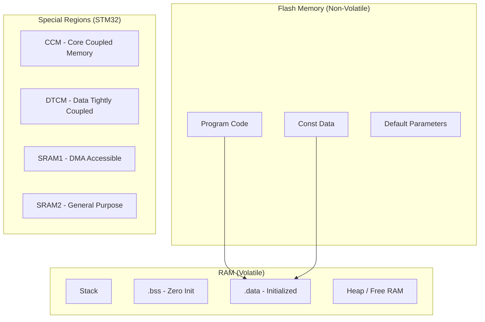
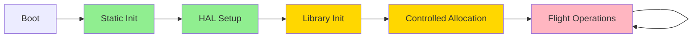
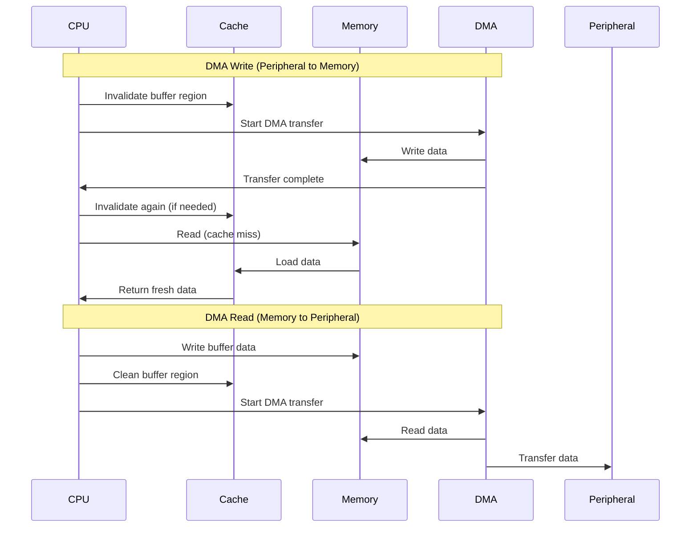

# ArduPilot Memory Management


## Table of Contents
- [Overview](#overview)
- [Memory Architecture](#memory-architecture)
- [Static vs Dynamic Allocation](#static-vs-dynamic-allocation)
- [Memory Regions](#memory-regions)
- [Stack Configuration](#stack-configuration)
- [Heap Management](#heap-management)
- [DMA Buffer Management](#dma-buffer-management)
- [Memory Safety Patterns](#memory-safety-patterns)
- [Debugging and Profiling](#debugging-and-profiling)
- [Platform-Specific Constraints](#platform-specific-constraints)
- [Optimization Strategies](#optimization-strategies)
- [Common Issues and Solutions](#common-issues-and-solutions)
- [Cache Coherency](#cache-coherency)
- [RTOS Integration](#rtos-integration)

## Overview

Memory management in ArduPilot is a critical safety concern for flight control systems. As a real-time embedded autopilot running on resource-constrained hardware, ArduPilot employs strict memory allocation strategies to ensure deterministic behavior, prevent fragmentation, and maintain flight safety.

**Key Principles**:
- **Determinism**: Memory allocation patterns must be predictable
- **Safety**: Out-of-memory conditions must be detectable and recoverable
- **Efficiency**: Minimal overhead for real-time performance
- **Portability**: Support diverse platforms (STM32, ESP32, Linux SITL)

**Design Philosophy**:
ArduPilot predominantly uses static allocation at initialization time, avoiding dynamic memory allocation during flight operations. This approach eliminates heap fragmentation risks and provides predictable memory behavior critical for safety-critical flight control.

## Memory Architecture

### Embedded System Memory Model

ArduPilot targets embedded systems with distinct memory regions, each optimized for specific purposes:



### Memory Layout by Platform

#### STM32F4/F7/H7 (Typical Flight Controller)

```
Flash Memory (1-2 MB):
  0x08000000 - 0x08010000   Bootloader (64KB)
  0x08010000 - 0x081FFFFF   Application Code
  
RAM Layout (256-512 KB):
  0x20000000 - 0x2001FFFF   SRAM1 (128KB) - DMA-safe, main heap
  0x20020000 - 0x2002FFFF   SRAM2 (48KB) - General purpose
  0x10000000 - 0x1000FFFF   CCM (64KB) - Fast, no DMA access
  
Stack: 8-16KB per thread (RTOS)
Heap: Remaining free SRAM after static allocation
```

**Critical Memory Regions**:
- **CCM (Core Coupled Memory)**: Zero-wait-state access, ideal for frequently accessed data structures (attitude controllers, EKF matrices), but cannot be accessed by DMA peripherals
- **SRAM1**: DMA-accessible, used for sensor buffers, communication buffers, and peripheral data
- **DTCM**: Data Tightly Coupled Memory on H7 series, similar to CCM but with even lower latency

#### ESP32 (Entry-Level Boards)

```
Flash Memory (4-16 MB external):
  Code and constants in external SPI flash
  
RAM Layout (520 KB internal):
  0x3FF80000 - 0x3FFFFFFF   DRAM0 (128KB) - Data + heap
  0x3FFE0000 - 0x3FFFFFFF   DRAM1 (128KB) - Data + heap  
  0x40070000 - 0x4009FFFF   DRAM2 (192KB) - DMA capable
  0x3FF00000 - 0x3FF2FFFF   IRAM (192KB) - Instructions
  
External SPIRAM: 0-8MB additional (optional)
```

**ESP32 Constraints**:
- DMA requires specific memory regions (DRAM2)
- WiFi/BLE stack consumes 50-100KB of RAM
- External SPIRAM has higher latency (~20x slower than internal)

#### Linux SITL (Development Platform)

```
Virtual Memory:
  Code: Typically 0x400000 base (position-independent)
  Stack: 8MB per thread (ulimit -s)
  Heap: Limited by system RAM (typically GB-scale)
```

**SITL Differences**:
- Virtual memory with demand paging
- No CCM or DMA constraints
- Debugging tools available (valgrind, AddressSanitizer)
- Used for development, not for flight

### Memory Region Selection Strategy

**Decision Matrix**:

| Data Type | CCM/DTCM | DMA-Safe SRAM | General SRAM | Rationale |
|-----------|----------|---------------|--------------|-----------|
| PID Controller State | ✓ | - | - | High-frequency access, no DMA needed |
| EKF Covariance Matrices | ✓ | - | - | Compute-intensive, fast access critical |
| Sensor Raw Buffers | - | ✓ | - | DMA from SPI/I2C peripherals |
| UART TX/RX Buffers | - | ✓ | - | DMA for serial communication |
| Parameter Storage | - | - | ✓ | Infrequent access, non-critical path |
| Logging Buffers | - | ✓ | - | DMA to SD card via SDIO |
| Attitude Quaternions | ✓ | ✓ | - | Frequently accessed by control loops |
| Mission Waypoints | - | - | ✓ | Large arrays, accessed infrequently |

## Static vs Dynamic Allocation

### Allocation Strategy Overview

ArduPilot follows a **staged allocation model**:



**Phase Characteristics**:
- **Static Init** (Green): Global objects, compile-time allocation
- **HAL Setup** (Green): Platform-specific hardware initialization
- **Library Init** (Yellow): AP_* library initialization, controlled new/malloc allowed
- **Controlled Allocation** (Yellow): Vehicle setup, backend registration
- **Flight Operations** (Red): NO dynamic allocation, only pre-allocated buffers

### Static Allocation Patterns

#### Pattern 1: Global Singleton Objects

**Source**: Throughout `/libraries/AP_*/`

```cpp
// Preferred: Static global singleton (zero runtime overhead)
static AP_InertialSensor ins;

// Access via namespace function
namespace AP {
    AP_InertialSensor &ins() {
        return ::ins;
    }
}

// Usage in flight code - no allocation
Vector3f accel = AP::ins().get_accel();
```

**Advantages**:
- Zero allocation overhead
- Guaranteed initialization order (C++ static init)
- No memory fragmentation
- No allocation failure handling needed

**Thread Safety Note**: Static initialization is single-threaded, but access requires synchronization primitives.

#### Pattern 2: Fixed-Size Arrays

**Source**: `/libraries/AP_Motors/`, `/libraries/AP_ServoRelayEvents/`

```cpp
// Motor output array - compile-time sized
static constexpr uint8_t MAX_NUM_MOTORS = 12;
float _motor_out[MAX_NUM_MOTORS];

// Waypoint storage - known maximum
#define MAX_MISSION_COMMANDS 600
AP_Mission::Mission_Command _cmd_array[MAX_MISSION_COMMANDS];
```

**Rationale**:
- Maximum vehicle configurations known at compile time
- Predictable memory footprint
- Cache-friendly contiguous storage
- Bounds checking at compile time

#### Pattern 3: Backend Registration with Static Pools

**Source**: `/libraries/AP_InertialSensor/`, `/libraries/AP_Compass/`

```cpp
// Pre-allocated backend slots
#define INS_MAX_INSTANCES 3
AP_InertialSensor_Backend *_backends[INS_MAX_INSTANCES];
uint8_t _backend_count;

// Registration during init (one-time allocation)
void AP_InertialSensor::_add_backend(AP_InertialSensor_Backend *backend) {
    if (_backend_count < INS_MAX_INSTANCES) {
        _backends[_backend_count++] = backend;
    } else {
        AP_HAL::panic("Too many INS backends");
    }
}
```

**Safety Features**:
- Fixed maximum prevents unbounded allocation
- Panic on overflow (fail-safe behavior)
- All backends allocated during initialization phase

### Dynamic Allocation Patterns

#### Controlled Dynamic Allocation (Init Phase Only)

**Source**: `/libraries/AP_HAL/`, sensor backend detection

```cpp
// Acceptable during initialization
void AP_InertialSensor::detect_backends() {
    // Try to detect IMU on SPI bus
    AP_InertialSensor_Invensense *imu = 
        new AP_InertialSensor_Invensense(*this, hal.spi->get_device("mpu9250"));
    
    if (imu != nullptr && imu->probe()) {
        _add_backend(imu);
    } else {
        delete imu;  // Cleanup on probe failure
    }
}
```

**Rules for Init-Phase Allocation**:
1. Only during `init()` or `setup()` functions
2. Must check for nullptr allocation failures
3. Must have deterministic upper bound
4. Should log allocation failures via `AP_Logger`
5. Never allocate in loop rate functions (update(), run())

#### Memory Pool Pattern (Constrained Dynamic)

**Source**: `/libraries/AP_Logger/`, `/libraries/AP_Networking/`

```cpp
// Pre-allocated pool for log messages
#define LOG_MESSAGE_POOL_SIZE 100
struct LogMessage {
    uint64_t timestamp;
    char message[50];
    LogMessage *next;
};

// Pool allocated at startup
static LogMessage log_pool[LOG_MESSAGE_POOL_SIZE];
static LogMessage *free_list;

// Allocation from pool (not system heap)
LogMessage* alloc_log_message() {
    if (free_list == nullptr) {
        return nullptr;  // Pool exhausted, drop message
    }
    LogMessage *msg = free_list;
    free_list = msg->next;
    return msg;
}

void free_log_message(LogMessage *msg) {
    msg->next = free_list;
    free_list = msg;
}
```

**Pool Allocator Benefits**:
- Bounded memory usage (no heap growth)
- Constant-time allocation/deallocation
- No heap fragmentation
- Suitable for high-frequency allocation/deallocation

### Prohibited Allocation Patterns

**❌ NEVER Do in Flight Code**:

```cpp
// WRONG: Heap allocation in main loop
void Copter::fast_loop() {
    float *temp_buffer = new float[100];  // ❌ FORBIDDEN
    process_data(temp_buffer);
    delete[] temp_buffer;
}

// WRONG: STL containers (hidden dynamic allocation)
void process_waypoints() {
    std::vector<Vector3f> waypoints;  // ❌ FORBIDDEN (uses heap)
    waypoints.push_back(wp);
}

// WRONG: String operations (dynamic allocation)
void log_error() {
    std::string error_msg = "Sensor failure";  // ❌ FORBIDDEN
    send_message(error_msg);
}
```

**Correct Alternatives**:

```cpp
// CORRECT: Pre-allocated buffer
static float temp_buffer[100];
void Copter::fast_loop() {
    process_data(temp_buffer, ARRAY_SIZE(temp_buffer));
}

// CORRECT: Fixed-size array
void process_waypoints() {
    Vector3f waypoints[MAX_WAYPOINTS];
    uint8_t wp_count = get_waypoints(waypoints, MAX_WAYPOINTS);
}

// CORRECT: String literals or fixed buffers
void log_error() {
    static const char error_msg[] = "Sensor failure";
    send_message(error_msg, sizeof(error_msg));
}
```

## Memory Regions

### Flash Memory Organization

**Code Placement**:

```cpp
// Stored in flash, not RAM (saves precious RAM)
static const float GRAVITY_MSS = 9.80665f;
static const Vector3f EXPECTED_MAG_EARTH{0.33f, 0.0f, -0.93f};  // NED frame

// Lookup tables in flash
static const uint16_t sine_table[256] PROGMEM = {0, 402, 804, ...};

// Access flash data (platform-specific)
uint16_t read_sine(uint8_t index) {
    return pgm_read_word(&sine_table[index]);  // AVR-style
    // On ARM: const data automatically in flash, no special access
}
```

**Parameter Defaults**:
- Source: `/libraries/AP_Param/`
- Default parameter values stored in flash
- Copied to RAM on first boot
- Persisted to EEPROM/flash storage after modification

### RAM Regions and Usage

#### .bss Section (Zero-Initialized Data)

**Characteristics**:
- Initialized to zero at boot
- No flash storage cost (just size info)
- Used for global/static variables without explicit initialization

```cpp
// Placed in .bss (zero-initialized)
static float attitude_history[1000];  // 4KB, starts as zeros
static uint32_t loop_counter;         // Starts at 0
```

#### .data Section (Initialized Data)

**Characteristics**:
- Has non-zero initial value
- Stored in flash and copied to RAM at boot
- More expensive than .bss (uses flash space)

```cpp
// Placed in .data (copied from flash at boot)
static const float DEFAULT_ANGLE_MAX = 45.0f;  // Uses flash + RAM
static Vector3f last_position{0.0f, 0.0f, -10.0f};  // Flash + RAM
```

**Optimization Tip**: Prefer .bss when possible by using runtime initialization instead of compile-time initialization.

#### Stack vs Heap

**Stack Characteristics**:
- Automatic allocation/deallocation
- Very fast (pointer increment/decrement)
- Limited size per thread (8-16KB typical)
- Overflow causes system crash

**Heap Characteristics**:
- Manual allocation/deallocation
- Slower (search for free block)
- Larger available size
- Fragmentation risk over time

**ArduPilot Stack Usage**:
```cpp
// Automatic stack allocation (OK for small, short-lived data)
void calculate_attitude() {
    Matrix3f rotation;  // 36 bytes on stack
    Vector3f euler;     // 12 bytes on stack
    
    rotation = get_rotation_matrix();
    rotation.to_euler(&euler.x, &euler.y, &euler.z);
}

// Large stack allocation - RISKY on embedded
void process_large_dataset() {
    float data[10000];  // 40KB! May overflow stack
    // BETTER: Use pre-allocated static buffer
}
```

### CCM (Core Coupled Memory) Usage

**STM32-Specific Feature**: CCM provides zero-wait-state access for CPU but is invisible to DMA controllers.

**Source**: `/libraries/AP_HAL_ChibiOS/`

```cpp
// Compiler attribute to place variable in CCM
#define CCM_SECTION __attribute__((section(".ccm")))

// High-frequency control data in CCM
CCM_SECTION static struct {
    Vector3f rate_error;
    Vector3f pid_sum;
    float yaw_target;
} control_state;

// EKF matrices in CCM for fast access
CCM_SECTION static float covariance[24][24];
```

**CCM Allocation Strategy**:

| Priority | Data Type | Rationale |
|----------|-----------|-----------|
| Highest | PID controller state | Accessed every loop (400-1000Hz) |
| High | EKF covariance matrices | Heavy computation, frequent access |
| Medium | Attitude quaternions | Read/written by multiple subsystems |
| Low | Temporary computation buffers | Only if not DMA |

**Anti-Pattern (DMA + CCM)**:
```cpp
// WRONG: DMA cannot access CCM
CCM_SECTION static uint8_t spi_rx_buffer[256];  // ❌ DMA will fail

// CORRECT: DMA buffers must be in regular SRAM
static uint8_t spi_rx_buffer[256];  // ✓ DMA accessible
```

### DMA-Safe Memory Regions

**DMA Requirements**:
1. Must be in SRAM1/SRAM2 (not CCM, not DTCM on some chips)
2. Must be cache-coherent (aligned, properly invalidated)
3. Should be aligned to cache line (32 bytes on H7)
4. Must not be accessed by CPU during DMA operation

**Source**: `/libraries/AP_HAL_ChibiOS/`

```cpp
// DMA-safe buffer allocation
#define DMA_SAFE __attribute__((section(".dma_safe"), aligned(32)))

DMA_SAFE static uint8_t spi_dma_buffer[512];
DMA_SAFE static uint8_t uart_rx_buffer[256];
```

**Linker Script Configuration** (STM32):
```ld
/* Memory regions */
MEMORY {
    FLASH (rx)  : ORIGIN = 0x08000000, LENGTH = 1024K
    RAM (rwx)   : ORIGIN = 0x20000000, LENGTH = 128K
    CCM (rwx)   : ORIGIN = 0x10000000, LENGTH = 64K
}

/* Section placement */
SECTIONS {
    .ccm (NOLOAD) : {
        *(.ccm)
    } > CCM
    
    .dma_safe (NOLOAD) : ALIGN(32) {
        *(.dma_safe)
    } > RAM
}
```

## Stack Configuration

### RTOS Thread Stacks

**Source**: `/libraries/AP_HAL_ChibiOS/Scheduler.cpp`

ArduPilot uses ChibiOS RTOS on STM32 platforms, with separate stacks for each thread:

```cpp
// Main thread configuration
#define MAIN_THREAD_STACK_SIZE 8192  // 8KB

// I/O thread (handles MAVLink, logging)
#define IO_THREAD_STACK_SIZE 4096    // 4KB

// Storage thread (SD card writes)
#define STORAGE_THREAD_STACK_SIZE 2048  // 2KB

// Timer thread (high-priority tasks)
#define TIMER_THREAD_STACK_SIZE 2048  // 2KB
```

**Stack Sizing Guidelines**:

| Thread Type | Typical Size | Considerations |
|-------------|--------------|----------------|
| Main loop | 8-16 KB | Deep call stacks, complex control logic |
| I/O threads | 4-8 KB | MAVLink parsing, string formatting |
| Fast timers | 2-4 KB | Minimal call depth, time-critical |
| Storage/logging | 2-4 KB | FatFS library stack usage |

### Stack Overflow Detection

**Hardware Stack Protection** (ARMv7-M MPU):

```cpp
// Configure MPU to detect stack overflow
void setup_stack_guard() {
    // Create guard region below stack
    MPU->RBAR = stack_bottom_address;
    MPU->RASR = MPU_RASR_ENABLE | MPU_RASR_SIZE_32B | MPU_RASR_XN;
    // Any access to guard triggers MemManage fault
}
```

**Software Stack Checking**:

```cpp
// ChibiOS stack painting for runtime checking
#define CH_DBG_FILL_THREADS TRUE  // Fill stack with 0x55 pattern

// Check stack usage
size_t get_stack_free(thread_t *tp) {
    uint8_t *p = (uint8_t *)tp->wabase;
    while (*p == 0x55) p++;  // Find first non-marker byte
    return p - (uint8_t *)tp->wabase;
}
```

**Stack Usage Monitoring**:

```cpp
// Periodic stack usage logging
void Scheduler::check_stack_free() {
    for (auto &thread : _threads) {
        size_t free_bytes = get_stack_free(thread.handle);
        
        if (free_bytes < 512) {  // Less than 512 bytes free
            AP::logger().Write_Error(ERR_SUBSYSTEM_CPU, 
                                   ERR_CODE_OUT_OF_MEMORY);
        }
        
        // Log to telemetry
        mavlink_msg_meminfo_send(chan, free_bytes, 
                                thread.stack_size);
    }
}
```

### Stack Usage Optimization

**Reducing Stack Depth**:

```cpp
// BEFORE: Deep recursion (high stack usage)
void process_tree_recursive(Node *node, int depth) {
    float local_buffer[100];  // 400 bytes per recursion
    if (node->left) process_tree_recursive(node->left, depth + 1);
    if (node->right) process_tree_recursive(node->right, depth + 1);
}

// AFTER: Iterative with fixed buffer (constant stack)
void process_tree_iterative(Node *root) {
    static Node *stack[MAX_TREE_DEPTH];  // Fixed size
    int sp = 0;
    stack[sp++] = root;
    
    while (sp > 0) {
        Node *node = stack[--sp];
        if (node->left) stack[sp++] = node->left;
        if (node->right) stack[sp++] = node->right;
    }
}
```

**Compiler Optimizations**:

```makefile
# Optimize for size (reduces stack frames)
CFLAGS += -Os

# Enable link-time optimization (function inlining)
CFLAGS += -flto

# Warn about large stack frames
CFLAGS += -Wstack-usage=2048
```

## Heap Management

### Heap Allocator Configuration

**Source**: `/libraries/AP_HAL_ChibiOS/system.cpp`

ArduPilot uses the ChibiOS heap allocator on embedded platforms:

```cpp
// Heap configuration in HAL
#define HEAP_CCM_SIZE 0           // No heap in CCM (avoid DMA issues)
#define HEAP_DEFAULT_SIZE 32768   // 32KB heap in main SRAM

// Heap regions (STM32H7 with multiple SRAM banks)
static const heap_region_t heap_regions[] = {
    { (uint8_t *)SRAM1_BASE, SRAM1_SIZE },
    { (uint8_t *)SRAM2_BASE, SRAM2_SIZE },
    { NULL, 0 }  // Terminator
};
```

### Heap Usage Monitoring

**Runtime Heap Tracking**:

```cpp
// Get current heap statistics
void AP_HAL::get_memory_stats(uint32_t &free_bytes, 
                               uint32_t &largest_block) {
    size_t total_free = 0;
    size_t largest = 0;
    
    // Iterate heap chunks
    memory_heap_t *heapp = &default_heap;
    chSysLock();
    
    heap_header_t *hp = heapp->header.next;
    while (hp != &heapp->header) {
        size_t size = hp->size;
        if (size > largest) largest = size;
        total_free += size;
        hp = hp->next;
    }
    
    chSysUnlock();
    
    free_bytes = total_free;
    largest_block = largest;
}

// Periodic monitoring
void check_heap_health() {
    uint32_t free, largest;
    AP::hal().get_memory_stats(free, largest);
    
    // Warn if fragmentation detected
    if (free > 10240 && largest < 4096) {
        GCS_SEND_TEXT(MAV_SEVERITY_WARNING, 
                     "Heap fragmented: %u free, %u largest", 
                     free, largest);
    }
    
    // Critical low memory
    if (free < 4096) {
        AP::logger().Write_Error(ERR_SUBSYSTEM_CPU,
                                ERR_CODE_OUT_OF_MEMORY);
    }
}
```

### Pool Allocators

**Fixed-Size Object Pools**:

```cpp
// Object pool template for type-safe allocation
template<typename T, uint16_t POOL_SIZE>
class ObjectPool {
private:
    struct PoolSlot {
        union {
            T object;
            PoolSlot *next;
        };
    };
    
    PoolSlot _pool[POOL_SIZE];
    PoolSlot *_free_list;
    Semaphore _sem;
    
public:
    ObjectPool() {
        // Initialize free list at construction (static init)
        _free_list = &_pool[0];
        for (uint16_t i = 0; i < POOL_SIZE - 1; i++) {
            _pool[i].next = &_pool[i + 1];
        }
        _pool[POOL_SIZE - 1].next = nullptr;
    }
    
    T* allocate() {
        WITH_SEMAPHORE(_sem);
        
        if (_free_list == nullptr) {
            return nullptr;  // Pool exhausted
        }
        
        PoolSlot *slot = _free_list;
        _free_list = slot->next;
        
        // Construct object in-place
        return new(&slot->object) T();
    }
    
    void free(T *obj) {
        WITH_SEMAPHORE(_sem);
        
        // Destruct object
        obj->~T();
        
        // Return slot to free list
        PoolSlot *slot = reinterpret_cast<PoolSlot*>(obj);
        slot->next = _free_list;
        _free_list = slot;
    }
};

// Usage example
ObjectPool<MAVLink_message, 50> mavlink_msg_pool;

void send_message() {
    MAVLink_message *msg = mavlink_msg_pool.allocate();
    if (msg == nullptr) {
        // Pool exhausted, drop message
        return;
    }
    
    // Use message...
    
    mavlink_msg_pool.free(msg);
}
```

### Heap Failure Handling

**Allocation Failure Strategies**:

```cpp
// Strategy 1: Graceful degradation
void init_optional_feature() {
    OptionalModule *module = new OptionalModule();
    if (module == nullptr) {
        GCS_SEND_TEXT(MAV_SEVERITY_WARNING, 
                     "Optional feature disabled: low memory");
        return;  // Feature unavailable but system continues
    }
    module->init();
}

// Strategy 2: Panic on critical allocation failure
void init_critical_subsystem() {
    CriticalModule *module = new CriticalModule();
    if (module == nullptr) {
        AP_HAL::panic("Failed to allocate critical subsystem");
        // System halts, watchdog reboot imminent
    }
    module->init();
}

// Strategy 3: Retry with smaller allocation
Buffer* allocate_buffer(size_t preferred_size) {
    const size_t min_size = 1024;
    
    for (size_t size = preferred_size; size >= min_size; size /= 2) {
        Buffer *buf = new Buffer(size);
        if (buf != nullptr) {
            GCS_SEND_TEXT(MAV_SEVERITY_INFO, 
                         "Allocated %u byte buffer", size);
            return buf;
        }
    }
    
    return nullptr;  // Cannot allocate even minimum
}
```

## DMA Buffer Management

### DMA Requirements and Constraints

**Hardware Requirements**:

1. **Memory Region**: Must be in DMA-accessible SRAM
2. **Alignment**: Cache line alignment (32 bytes on STM32H7)
3. **Cache Coherency**: Must invalidate/clean cache before/after DMA
4. **Concurrent Access**: CPU must not access buffer during DMA

### DMA Buffer Allocation

**Source**: `/libraries/AP_HAL_ChibiOS/`

```cpp
// DMA-safe buffer allocation macro
#ifdef HAL_WITH_CACHE
  #define DMA_BUFFER_ALIGNMENT 32  // Cache line size
#else
  #define DMA_BUFFER_ALIGNMENT 4   // Word alignment sufficient
#endif

#define DMA_BUFFER(size) \
    __attribute__((section(".dma_safe"), \
                   aligned(DMA_BUFFER_ALIGNMENT))) \
    static uint8_t buffer[size]

// Example: SPI DMA buffer
class SPIDevice {
private:
    DMA_BUFFER(512) _tx_buffer;
    DMA_BUFFER(512) _rx_buffer;
    
public:
    bool transfer(const uint8_t *send, uint8_t *recv, uint16_t len) {
        // Copy to DMA buffer
        memcpy(_tx_buffer, send, len);
        
        // Cache coherency
        cache_clean_invalidate(_tx_buffer, len);
        
        // Start DMA transfer
        dma_start_transfer(_tx_buffer, _rx_buffer, len);
        
        // Wait for completion
        dma_wait_completion();
        
        // Invalidate cache to read DMA results
        cache_invalidate(_rx_buffer, len);
        
        // Copy from DMA buffer
        memcpy(recv, _rx_buffer, len);
        
        return true;
    }
};
```

### Cache Coherency Operations

**STM32H7 Cache Management**:

```cpp
// Cache operations for DMA buffers
void cache_clean(void *addr, size_t size) {
    // Write cached data to memory (before DMA read from memory)
    SCB_CleanDCache_by_Addr((uint32_t*)addr, size);
}

void cache_invalidate(void *addr, size_t size) {
    // Discard cached data (after DMA write to memory)
    SCB_InvalidateDCache_by_Addr((uint32_t*)addr, size);
}

void cache_clean_invalidate(void *addr, size_t size) {
    // Clean then invalidate (before DMA write to memory)
    SCB_CleanInvalidateDCache_by_Addr((uint32_t*)addr, size);
}

// Usage pattern for DMA
void spi_dma_transaction(uint8_t *tx_data, uint8_t *rx_data, size_t len) {
    // 1. Ensure TX buffer written to memory
    cache_clean(tx_data, len);
    
    // 2. Invalidate RX buffer (discard stale cached data)
    cache_invalidate(rx_data, len);
    
    // 3. Start DMA
    start_dma_transfer(tx_data, rx_data, len);
    
    // 4. Wait for completion
    wait_dma_complete();
    
    // 5. Invalidate RX cache again to read DMA results
    cache_invalidate(rx_data, len);
    
    // 6. Now safe to read rx_data
}
```

### DMA Buffer Pools

**Pre-allocated DMA Buffer Pool**:

```cpp
// Pool of DMA-safe buffers for sensor reads
#define DMA_BUFFER_COUNT 8
#define DMA_BUFFER_SIZE 512

class DMABufferPool {
private:
    struct DMABuffer {
        uint8_t data[DMA_BUFFER_SIZE] 
            __attribute__((aligned(32)));
        bool in_use;
    };
    
    DMABuffer _buffers[DMA_BUFFER_COUNT] 
        __attribute__((section(".dma_safe")));
    
    Semaphore _sem;
    
public:
    uint8_t* acquire() {
        WITH_SEMAPHORE(_sem);
        
        for (uint8_t i = 0; i < DMA_BUFFER_COUNT; i++) {
            if (!_buffers[i].in_use) {
                _buffers[i].in_use = true;
                return _buffers[i].data;
            }
        }
        
        // All buffers in use
        return nullptr;
    }
    
    void release(uint8_t *buffer) {
        WITH_SEMAPHORE(_sem);
        
        for (uint8_t i = 0; i < DMA_BUFFER_COUNT; i++) {
            if (_buffers[i].data == buffer) {
                _buffers[i].in_use = false;
                return;
            }
        }
    }
};

// Global DMA buffer pool
static DMABufferPool dma_pool;

// Usage in sensor driver
void read_sensor() {
    uint8_t *dma_buf = dma_pool.acquire();
    if (dma_buf == nullptr) {
        // All DMA buffers busy, skip this read
        return;
    }
    
    // Perform DMA transfer
    spi_dma_read(dma_buf, SENSOR_DATA_SIZE);
    
    // Process data
    process_sensor_data(dma_buf);
    
    // Release buffer
    dma_pool.release(dma_buf);
}
```

### DMA Descriptor Management

**Scatter-Gather DMA**:

```cpp
// DMA descriptor for scatter-gather transfers
struct DMADescriptor {
    uint32_t src_addr;
    uint32_t dst_addr;
    uint32_t transfer_size;
    uint32_t next_descriptor;
} __attribute__((aligned(16)));

// Descriptor pool (must be DMA-accessible)
#define MAX_DMA_DESCRIPTORS 16
DMA_BUFFER_ATTR DMADescriptor dma_descriptors[MAX_DMA_DESCRIPTORS];

// Build descriptor chain for complex transfer
void setup_multi_sensor_dma() {
    // Chain descriptors for multiple sensor reads
    for (uint8_t i = 0; i < num_sensors; i++) {
        dma_descriptors[i].src_addr = sensor_spi_data_register[i];
        dma_descriptors[i].dst_addr = (uint32_t)sensor_buffers[i];
        dma_descriptors[i].transfer_size = sensor_data_size[i];
        dma_descriptors[i].next_descriptor = 
            (uint32_t)&dma_descriptors[i + 1];
    }
    
    // Last descriptor terminates chain
    dma_descriptors[num_sensors - 1].next_descriptor = 0;
    
    // Start chained DMA
    start_scatter_gather_dma(&dma_descriptors[0]);
}
```

## Memory Safety Patterns

### Bounds Checking

**Array Access Validation**:

```cpp
// Compile-time bounds checking with templates
template<typename T, size_t N>
class SafeArray {
private:
    T _data[N];
    
public:
    // Bounds-checked access
    T& operator[](size_t index) {
        if (index >= N) {
            AP_HAL::panic("Array index out of bounds: %u >= %u", 
                         (unsigned)index, (unsigned)N);
        }
        return _data[index];
    }
    
    // Unchecked access for performance-critical code
    T& at_unchecked(size_t index) {
        return _data[index];
    }
    
    constexpr size_t size() const { return N; }
};

// Usage
SafeArray<float, 16> motor_output;
motor_output[5] = 0.75f;  // Checked
motor_output[20] = 0.5f;  // Panics at runtime
```

**Dynamic Bounds Checking**:

```cpp
// Runtime bounds validation
class DynamicBuffer {
private:
    uint8_t *_data;
    size_t _size;
    
public:
    bool write(size_t offset, const uint8_t *src, size_t len) {
        // Overflow check
        if (offset > _size || len > _size - offset) {
            GCS_SEND_TEXT(MAV_SEVERITY_ERROR, 
                         "Buffer overflow prevented: %u + %u > %u",
                         (unsigned)offset, (unsigned)len, 
                         (unsigned)_size);
            return false;
        }
        
        memcpy(_data + offset, src, len);
        return true;
    }
};
```

### Buffer Overflow Prevention

**String Handling**:

```cpp
// Safe string copying
void safe_string_copy(char *dst, const char *src, size_t dst_size) {
    if (dst_size == 0) return;
    
    // Copy at most dst_size - 1 characters
    size_t i;
    for (i = 0; i < dst_size - 1 && src[i] != '\0'; i++) {
        dst[i] = src[i];
    }
    dst[i] = '\0';  // Always null-terminate
}

// Safe string formatting
void format_message(char *buffer, size_t size, 
                   const char *fmt, ...) {
    va_list args;
    va_start(args, fmt);
    
    int written = vsnprintf(buffer, size, fmt, args);
    
    va_end(args);
    
    // Check for truncation
    if (written < 0 || (size_t)written >= size) {
        GCS_SEND_TEXT(MAV_SEVERITY_WARNING, 
                     "String truncated in format_message");
    }
}
```

**Circular Buffer Pattern**:

```cpp
// Thread-safe circular buffer for sensor data
template<typename T, uint16_t SIZE>
class CircularBuffer {
private:
    T _buffer[SIZE];
    volatile uint16_t _head;
    volatile uint16_t _tail;
    Semaphore _sem;
    
public:
    bool push(const T &item) {
        WITH_SEMAPHORE(_sem);
        
        uint16_t next_head = (_head + 1) % SIZE;
        
        if (next_head == _tail) {
            // Buffer full, oldest data overwritten
            _tail = (_tail + 1) % SIZE;
        }
        
        _buffer[_head] = item;
        _head = next_head;
        
        return true;
    }
    
    bool pop(T &item) {
        WITH_SEMAPHORE(_sem);
        
        if (_head == _tail) {
            return false;  // Buffer empty
        }
        
        item = _buffer[_tail];
        _tail = (_tail + 1) % SIZE;
        
        return true;
    }
};
```

### Memory Leak Prevention

**RAII (Resource Acquisition Is Initialization)**:

```cpp
// Semaphore lock guard (auto-unlock on scope exit)
class SemaphoreGuard {
private:
    Semaphore &_sem;
    bool _locked;
    
public:
    explicit SemaphoreGuard(Semaphore &sem) : _sem(sem), _locked(false) {
        _locked = _sem.take(HAL_SEMAPHORE_BLOCK_FOREVER);
    }
    
    ~SemaphoreGuard() {
        if (_locked) {
            _sem.give();
        }
    }
    
    // Prevent copying
    SemaphoreGuard(const SemaphoreGuard&) = delete;
    SemaphoreGuard& operator=(const SemaphoreGuard&) = delete;
};

// Usage - automatic unlock even on early return
void thread_safe_update() {
    SemaphoreGuard lock(_data_sem);
    
    if (!validate_data()) {
        return;  // Semaphore automatically released
    }
    
    process_data();
    // Semaphore automatically released on scope exit
}
```

**Smart Pointer Alternative for Embedded**:

```cpp
// Unique ownership pointer (no reference counting overhead)
template<typename T>
class UniquePtr {
private:
    T *_ptr;
    
public:
    explicit UniquePtr(T *ptr = nullptr) : _ptr(ptr) {}
    
    ~UniquePtr() {
        delete _ptr;
    }
    
    // Move semantics (transfer ownership)
    UniquePtr(UniquePtr &&other) : _ptr(other._ptr) {
        other._ptr = nullptr;
    }
    
    UniquePtr& operator=(UniquePtr &&other) {
        if (this != &other) {
            delete _ptr;
            _ptr = other._ptr;
            other._ptr = nullptr;
        }
        return *this;
    }
    
    // Prevent copying
    UniquePtr(const UniquePtr&) = delete;
    UniquePtr& operator=(const UniquePtr&) = delete;
    
    T* operator->() { return _ptr; }
    T& operator*() { return *_ptr; }
    T* get() { return _ptr; }
    
    T* release() {
        T *ptr = _ptr;
        _ptr = nullptr;
        return ptr;
    }
};

// Usage
UniquePtr<SensorBackend> create_sensor() {
    UniquePtr<SensorBackend> sensor(new BMI088());
    
    if (!sensor->probe()) {
        return UniquePtr<SensorBackend>(nullptr);  // Auto-deleted
    }
    
    return sensor;  // Transfer ownership to caller
}
```

### Null Pointer Checks

**Defensive Programming**:

```cpp
// Always check pointers before dereferencing
void process_sensor(AP_InertialSensor_Backend *backend) {
    if (backend == nullptr) {
        AP::logger().Write_Error(ERR_SUBSYSTEM_FLIGHT_MODE,
                                ERR_CODE_ERROR_RESOLVED);
        return;
    }
    
    backend->update();
}

// Nullptr check in backend access
Vector3f get_accel() {
    AP_InertialSensor &ins = AP::ins();
    
    if (!ins.healthy()) {
        // Return safe default
        return Vector3f(0, 0, -GRAVITY_MSS);
    }
    
    return ins.get_accel();
}
```

### Memory Corruption Detection

**Guard Patterns**:

```cpp
// Buffer with canary values to detect overflow
template<typename T, size_t SIZE>
class GuardedBuffer {
private:
    static constexpr uint32_t GUARD_VALUE = 0xDEADBEEF;
    
    uint32_t _guard_before;
    T _data[SIZE];
    uint32_t _guard_after;
    
public:
    GuardedBuffer() : 
        _guard_before(GUARD_VALUE),
        _guard_after(GUARD_VALUE) {}
    
    bool check_integrity() {
        if (_guard_before != GUARD_VALUE) {
            AP_HAL::panic("Buffer underflow detected");
            return false;
        }
        if (_guard_after != GUARD_VALUE) {
            AP_HAL::panic("Buffer overflow detected");
            return false;
        }
        return true;
    }
    
    T* data() { 
        check_integrity();
        return _data; 
    }
};
```

## Debugging and Profiling

### Memory Usage Reporting

**Runtime Statistics Collection**:

```cpp
// Memory statistics structure
struct MemoryStats {
    uint32_t total_ram;
    uint32_t free_ram;
    uint32_t largest_block;
    uint32_t heap_fragmentation;
    uint32_t stack_free[NUM_THREADS];
};

// Collect comprehensive memory stats
void collect_memory_stats(MemoryStats &stats) {
    // Heap statistics
    AP::hal().get_memory_stats(stats.free_ram, stats.largest_block);
    
    // Calculate fragmentation percentage
    if (stats.free_ram > 0) {
        stats.heap_fragmentation = 
            100 * (stats.free_ram - stats.largest_block) / stats.free_ram;
    }
    
    // Stack usage for each thread
    Scheduler &sched = AP::scheduler();
    for (uint8_t i = 0; i < NUM_THREADS; i++) {
        stats.stack_free[i] = sched.get_stack_free(i);
    }
    
    // Total RAM (platform-specific)
    #if defined(STM32F4)
        stats.total_ram = 192 * 1024;  // 192KB
    #elif defined(STM32H7)
        stats.total_ram = 512 * 1024;  // 512KB
    #endif
}

// Log to MAVLink telemetry
void send_memory_telemetry() {
    MemoryStats stats;
    collect_memory_stats(stats);
    
    mavlink_msg_meminfo_send(
        MAVLINK_COMM_0,
        stats.free_ram / 1024,  // KB
        stats.largest_block / 1024,
        stats.heap_fragmentation
    );
}
```

### Memory Leak Detection

**Allocation Tracking**:

```cpp
#ifdef DEBUG_MEMORY

// Override global new/delete for tracking
void* operator new(size_t size) {
    void *ptr = malloc(size);
    
    if (ptr != nullptr) {
        log_allocation(ptr, size);
    }
    
    return ptr;
}

void operator delete(void *ptr) {
    if (ptr != nullptr) {
        log_deallocation(ptr);
    }
    
    free(ptr);
}

// Allocation log entry
struct AllocRecord {
    void *address;
    size_t size;
    uint32_t timestamp;
    const char *file;
    int line;
};

#define MAX_ALLOC_RECORDS 1000
static AllocRecord alloc_log[MAX_ALLOC_RECORDS];
static uint16_t alloc_count = 0;

// Track allocations
void log_allocation(void *ptr, size_t size) {
    if (alloc_count < MAX_ALLOC_RECORDS) {
        alloc_log[alloc_count++] = {
            ptr, size, AP_HAL::millis(),
            __FILE__, __LINE__
        };
    }
}

// Find leaks (allocations never freed)
void detect_memory_leaks() {
    for (uint16_t i = 0; i < alloc_count; i++) {
        if (alloc_log[i].address != nullptr) {
            GCS_SEND_TEXT(MAV_SEVERITY_WARNING,
                         "Potential leak: %u bytes at %s:%d",
                         alloc_log[i].size,
                         alloc_log[i].file,
                         alloc_log[i].line);
        }
    }
}

#endif  // DEBUG_MEMORY
```

### Stack Profiling

**Maximum Stack Depth Measurement**:

```cpp
// Stack watermark tracking
void init_stack_watermark() {
    extern uint32_t __stack_start__;
    extern uint32_t __stack_end__;
    
    // Fill stack with pattern
    for (uint32_t *p = &__stack_start__; p < &__stack_end__; p++) {
        *p = 0x55555555;
    }
}

uint32_t get_max_stack_usage() {
    extern uint32_t __stack_start__;
    extern uint32_t __stack_end__;
    
    uint32_t *p = &__stack_start__;
    
    // Find first non-pattern value
    while (p < &__stack_end__ && *p == 0x55555555) {
        p++;
    }
    
    return ((uint32_t)&__stack_end__ - (uint32_t)p);
}
```

### Memory Corruption Detection

**Heap Integrity Checking**:

```cpp
// Periodic heap validation
bool validate_heap_integrity() {
    memory_heap_t *heapp = &default_heap;
    
    chSysLock();
    
    heap_header_t *hp = heapp->header.next;
    uint32_t total_size = 0;
    
    while (hp != &heapp->header) {
        // Check for corruption indicators
        if (hp->size == 0) {
            chSysUnlock();
            AP_HAL::panic("Heap corruption: zero size block");
            return false;
        }
        
        // Check for unreasonable size
        if (hp->size > TOTAL_HEAP_SIZE) {
            chSysUnlock();
            AP_HAL::panic("Heap corruption: oversized block");
            return false;
        }
        
        total_size += hp->size;
        hp = hp->next;
        
        // Detect circular reference
        if (total_size > TOTAL_HEAP_SIZE * 2) {
            chSysUnlock();
            AP_HAL::panic("Heap corruption: circular reference");
            return false;
        }
    }
    
    chSysUnlock();
    return true;
}
```

### Profiling Tools Integration

**GDB Memory Commands**:

```gdb
# View memory map
info proc mappings

# Display heap statistics
heap info

# Find memory leaks (requires ASAN)
heap leaks

# Watch memory location for corruption
watch *(uint32_t*)0x20000100
```

**Valgrind Integration (SITL Only)**:

```bash
# Run SITL with Valgrind for leak detection
valgrind --leak-check=full \
         --show-leak-kinds=all \
         --track-origins=yes \
         --log-file=valgrind.log \
         ./build/sitl/bin/arducopter

# Memory profiler with detailed allocation tracking
valgrind --tool=massif \
         --massif-out-file=massif.out \
         ./build/sitl/bin/arducopter

# Visualize memory usage over time
ms_print massif.out
```

## Platform-Specific Constraints

### STM32 Platform Constraints

#### STM32F4 (Common Entry-Level Flight Controllers)

**Memory Configuration**:
```
Flash: 1024KB
RAM: 192KB (128KB SRAM1 + 64KB CCM)
Maximum Speed: 168MHz
```

**Constraints**:
- Limited RAM requires aggressive optimization
- CCM cannot be used for DMA buffers
- Single-precision FPU only (double precision emulated)
- USB and Ethernet share SRAM (careful with large transfers)

**Code Patterns**:
```cpp
// Optimize for F4 memory constraints
#if defined(STM32F4)
  #define MAX_WAYPOINTS 300      // Reduced for F4
  #define LOG_BUFFER_SIZE 2048   // Smaller log buffer
  #define DISABLE_SCRIPTING      // Lua requires too much RAM
#else
  #define MAX_WAYPOINTS 600      // Full capacity on F7/H7
  #define LOG_BUFFER_SIZE 8192
  // Scripting enabled
#endif
```

#### STM32F7 (Mid-Range Flight Controllers)

**Memory Configuration**:
```
Flash: 1024-2048KB
RAM: 512KB (320KB SRAM1 + 128KB SRAM2 + 64KB DTCM)
Maximum Speed: 216MHz
```

**Features**:
- Instruction and data caches (4KB each)
- Double-precision FPU
- More RAM allows advanced features
- DTCM for zero-wait-state data access

**Cache Considerations**:
```cpp
// Cache-aware code for F7
void fast_memory_copy(void *dst, const void *src, size_t len) {
    // Use DTCM for temporary buffer (no cache)
    #if defined(STM32F7)
        __attribute__((section(".dtcm")))
        static uint8_t temp_buffer[1024];
        
        // Fast copy through DTCM
        memcpy(temp_buffer, src, len);
        memcpy(dst, temp_buffer, len);
    #else
        memcpy(dst, src, len);
    #endif
}
```

#### STM32H7 (High-End Flight Controllers)

**Memory Configuration**:
```
Flash: 2048KB
RAM: 1024KB (512KB SRAM1 + 512KB SRAM2/3/4)
Maximum Speed: 480MHz
```

**Advanced Features**:
- 16KB instruction cache, 16KB data cache
- MPU (Memory Protection Unit) for safety
- Multiple SRAM banks with different characteristics
- BDMA for low-power peripherals

**Critical H7 Considerations**:
```cpp
// H7 requires cache maintenance for DMA
void h7_dma_transfer(void *buffer, size_t size) {
    // Must be in cacheable SRAM, not DTCM
    if (is_in_dtcm(buffer)) {
        AP_HAL::panic("Cannot DMA from DTCM on H7");
    }
    
    // Clean and invalidate cache
    SCB_CleanInvalidateDCache_by_Addr(
        (uint32_t*)buffer, size);
    
    start_dma(buffer, size);
}
```

### ESP32 Platform Constraints

**Memory Configuration**:
```
Flash: 4-16MB (external SPI)
Internal RAM: 520KB
External SPIRAM: 0-8MB (optional)
Speed: 160-240MHz (dual-core)
```

**ESP32-Specific Issues**:

**1. WiFi/BLE Memory Consumption**:
```cpp
// WiFi stack reserves significant RAM
void init_wifi() {
    // WiFi requires ~50KB heap
    // BLE adds another ~50KB
    
    uint32_t free_before = ESP.getFreeHeap();
    WiFi.begin(ssid, password);
    uint32_t free_after = ESP.getFreeHeap();
    
    GCS_SEND_TEXT(MAV_SEVERITY_INFO,
                 "WiFi consumed %u KB",
                 (free_before - free_after) / 1024);
}
```

**2. External SPIRAM Limitations**:
```cpp
// SPIRAM is slower than internal RAM
#ifdef BOARD_HAS_PSRAM
  #define USE_EXTERNAL_RAM __attribute__((section(".ext_ram")))
  
  // Put large, infrequently accessed data in SPIRAM
  USE_EXTERNAL_RAM static uint8_t log_buffer[256*1024];
  USE_EXTERNAL_RAM static float waypoint_data[10000];
  
  // Keep critical control data in fast internal RAM
  static Vector3f rate_pid_state;  // Internal RAM
#endif
```

**3. DMA Restrictions**:
```cpp
// ESP32 DMA requires specific memory regions
bool is_dma_capable(void *ptr) {
    uint32_t addr = (uint32_t)ptr;
    
    // DMA works with internal SRAM only
    if (addr >= 0x3FF00000 && addr < 0x40000000) {
        return true;  // DRAM region
    }
    
    // SPIRAM cannot be used for DMA
    return false;
}
```

### Linux SITL Constraints

**Virtual Memory Benefits**:
- Gigabytes of available memory
- Memory protection catches wild pointers
- Debugging tools available (valgrind, gdb, ASAN)

**SITL-Specific Patterns**:
```cpp
// Use dynamic allocation freely in SITL
#ifdef CONFIG_HAL_BOARD_SITL
  // Allocate large visualization buffers
  std::vector<Vector3f> trajectory_history;
  trajectory_history.reserve(100000);  // OK in SITL
  
  // Large maps for terrain data
  std::map<uint64_t, TerrainTile> terrain_cache;
#else
  // Embedded targets use fixed arrays
  static Vector3f trajectory_history[1000];
  static uint16_t trajectory_count;
#endif
```

### Memory Budgeting by Platform

**Recommended Memory Allocation**:

| Subsystem | F4 (192KB) | F7 (512KB) | H7 (1MB) | ESP32 (520KB) |
|-----------|-----------|-----------|----------|---------------|
| Stack (all threads) | 24KB | 40KB | 64KB | 32KB |
| Core Libraries | 40KB | 60KB | 80KB | 50KB |
| Sensor Buffers | 16KB | 32KB | 64KB | 24KB |
| Control State | 12KB | 20KB | 32KB | 16KB |
| MAVLink Buffers | 8KB | 16KB | 32KB | 12KB |
| Logging | 16KB | 64KB | 128KB | 32KB |
| Mission Data | 24KB | 60KB | 120KB | 40KB |
| Scripting | - | 80KB | 200KB | - |
| Free/Heap | 52KB | 140KB | 280KB | 314KB |

## Optimization Strategies

### Compile-Time Optimization

**Compiler Flags**:
```makefile
# Optimize for size (reduces memory footprint)
CFLAGS += -Os

# Link-time optimization (aggressive inlining)
CFLAGS += -flto

# Remove unused sections
LDFLAGS += --gc-sections

# Eliminate dead code
CFLAGS += -ffunction-sections -fdata-sections
```

**Results**:
- Binary size reduction: 15-25%
- RAM savings: 5-10% (smaller stack frames)
- Performance: Slightly slower (prefer size over speed)

### Data Structure Packing

**Eliminate Padding**:
```cpp
// BEFORE: 16 bytes due to alignment padding
struct SensorData {
    uint8_t sensor_id;    // 1 byte
    // 3 bytes padding
    float value;          // 4 bytes
    uint64_t timestamp;   // 8 bytes
};  // Total: 16 bytes

// AFTER: 13 bytes (packed)
struct __attribute__((packed)) SensorDataPacked {
    uint64_t timestamp;   // 8 bytes
    float value;          // 4 bytes
    uint8_t sensor_id;    // 1 byte
};  // Total: 13 bytes

// Array savings: 3 bytes × 100 = 300 bytes saved
SensorDataPacked sensor_array[100];
```

**Trade-offs**:
- Pro: Significant memory savings (up to 30% for some structures)
- Con: Slower access on ARM (unaligned reads)
- Recommendation: Use for large arrays, storage structures

### Bit Fields

**Compact Boolean Flags**:
```cpp
// BEFORE: 12 bytes
struct FlightFlags {
    bool armed;
    bool gps_ok;
    bool ekf_ok;
    bool failsafe_active;
    bool battery_low;
    bool home_set;
    // ... more flags
};

// AFTER: 4 bytes (up to 32 flags)
struct FlightFlagsBitfield {
    uint32_t armed:1;
    uint32_t gps_ok:1;
    uint32_t ekf_ok:1;
    uint32_t failsafe_active:1;
    uint32_t battery_low:1;
    uint32_t home_set:1;
    uint32_t :26;  // Reserved for future flags
};
```

### Const and Constexpr

**Move Data to Flash**:
```cpp
// RAM (bad): 1KB in RAM
static float lookup_table[256] = {0.0f, 0.1f, 0.2f, ...};

// Flash (good): 1KB in flash, zero RAM
static const float lookup_table[256] = {0.0f, 0.1f, 0.2f, ...};

// Compile-time computation
constexpr float compute_coefficient(int n) {
    return 1.0f / (n * n + 1);
}

// Generated at compile time, stored in flash
static constexpr float coefficients[] = {
    compute_coefficient(0),
    compute_coefficient(1),
    compute_coefficient(2),
    // ...
};
```

### String Optimization

**Avoid String Copies**:
```cpp
// WRONG: String copy (heap allocation)
void send_message(std::string msg) {  // Copy!
    mavlink_send_text(msg.c_str());
}

// BETTER: Reference (no copy)
void send_message(const char *msg) {
    mavlink_send_text(msg);
}

// BEST: String view (C++17)
void send_message(std::string_view msg) {
    mavlink_send_text(msg.data());
}
```

**Format Strings**:
```cpp
// Efficient: Fixed buffer, no allocation
void log_position(float lat, float lon) {
    char buffer[64];
    snprintf(buffer, sizeof(buffer), 
             "Position: %.6f, %.6f", lat, lon);
    AP::logger().Write_Message(buffer);
}
```

### Cache-Friendly Data Layout

**Structure of Arrays vs Array of Structures**:
```cpp
// Array of Structures (cache-unfriendly)
struct Particle {
    Vector3f position;
    Vector3f velocity;
    float mass;
};
Particle particles[1000];

// Process positions (loads unnecessary velocity/mass data)
for (int i = 0; i < 1000; i++) {
    update_position(particles[i].position);  // Cache miss
}

// Structure of Arrays (cache-friendly)
struct ParticleSystem {
    Vector3f positions[1000];
    Vector3f velocities[1000];
    float masses[1000];
};

// Process positions (contiguous memory, better caching)
for (int i = 0; i < 1000; i++) {
    update_position(system.positions[i]);  // Cache hit
}
```

### Loop Unrolling

**Manual Optimization for Critical Paths**:
```cpp
// Standard loop
for (int i = 0; i < 8; i++) {
    motor_output[i] = motor_mix[i] * throttle;
}

// Unrolled (better pipelining, no loop overhead)
motor_output[0] = motor_mix[0] * throttle;
motor_output[1] = motor_mix[1] * throttle;
motor_output[2] = motor_mix[2] * throttle;
motor_output[3] = motor_mix[3] * throttle;
motor_output[4] = motor_mix[4] * throttle;
motor_output[5] = motor_mix[5] * throttle;
motor_output[6] = motor_mix[6] * throttle;
motor_output[7] = motor_mix[7] * throttle;
```

## Common Issues and Solutions

### Issue 1: Heap Fragmentation

**Symptoms**:
- Allocation failures despite free memory
- `largest_block` much smaller than `total_free`
- System instability over time

**Root Cause**:
```
Heap state after mixed allocations/deallocations:
[Used 100B][Free 50B][Used 200B][Free 30B][Used 150B][Free 100B]
         ^          Can't allocate 150B despite 180B total free
```

**Solution**:
```cpp
// Use memory pools instead of heap
ObjectPool<MAVLink_message, 100> message_pool;

// Allocate large blocks early, never free
void init() {
    // Pre-allocate all large buffers during init
    static uint8_t log_buffer[LOG_SIZE];
    static uint8_t mavlink_buffer[MAVLINK_SIZE];
    
    // Register with subsystems
    logger.set_buffer(log_buffer, LOG_SIZE);
    mavlink.set_buffer(mavlink_buffer, MAVLINK_SIZE);
}
```

### Issue 2: Stack Overflow

**Symptoms**:
- Random crashes or reboots
- Corruption of nearby variables
- Hard faults at unpredictable times

**Detection**:
```cpp
// Enable stack overflow detection
#define CH_DBG_FILL_THREADS TRUE
#define CH_DBG_ENABLE_STACK_CHECK TRUE

// Monitor stack usage
void check_stacks() {
    for (auto &thread : threads) {
        size_t free = get_stack_free(thread);
        if (free < 512) {
            AP_HAL::panic("Stack overflow imminent: %s", 
                         thread.name);
        }
    }
}
```

**Prevention**:
```cpp
// Move large arrays to static storage
void process_data() {
    // BEFORE: Stack allocation (dangerous)
    // float temp[1000];  // 4KB on stack!
    
    // AFTER: Static allocation (safe)
    static float temp[1000];  // In .bss, not stack
    
    process(temp, 1000);
}
```

### Issue 3: DMA Buffer Corruption

**Symptoms**:
- Sensor data occasionally corrupted
- SPI/I2C reads return garbage
- Intermittent failures

**Root Cause**:
```cpp
// WRONG: Buffer in CCM (DMA inaccessible)
__attribute__((section(".ccm")))
static uint8_t spi_buffer[256];

// DMA writes to wrong memory location or fails silently
```

**Solution**:
```cpp
// Place DMA buffers in correct region
__attribute__((section(".dma_safe"), aligned(32)))
static uint8_t spi_buffer[256];

// Verify buffer location at init
void verify_dma_buffers() {
    uint32_t addr = (uint32_t)spi_buffer;
    
    #if defined(STM32H7)
        // Must be in SRAM1/SRAM2, not DTCM
        if (addr < 0x20000000 || addr >= 0x20080000) {
            AP_HAL::panic("SPI buffer not DMA-safe");
        }
    #endif
}
```

### Issue 4: Memory Leaks

**Symptoms**:
- Free memory gradually decreases
- System runs out of memory after hours/days
- Memory usage grows without bounds

**Detection**:
```cpp
// Track heap high-water mark
static uint32_t min_free_heap = UINT32_MAX;

void monitor_heap() {
    uint32_t free, largest;
    hal.get_memory_stats(free, largest);
    
    if (free < min_free_heap) {
        min_free_heap = free;
        GCS_SEND_TEXT(MAV_SEVERITY_INFO,
                     "Heap low water mark: %u bytes", free);
    }
}
```

**Common Leak Patterns**:
```cpp
// LEAK: Backend created but never added to array
void detect_backend() {
    Backend *b = new Backend();
    if (!b->probe()) {
        // WRONG: Forgot to delete
        return;
    }
    add_backend(b);
}

// FIXED: Proper cleanup
void detect_backend() {
    Backend *b = new Backend();
    if (!b->probe()) {
        delete b;  // Cleanup on failure
        return;
    }
    add_backend(b);
}
```

### Issue 5: Cache Coherency Problems

**Symptoms** (STM32F7/H7 with cache):
- DMA data appears stale
- CPU reads old values after DMA write
- Intermittent data corruption

**Root Cause**:
```cpp
// DMA writes to memory, but CPU reads from cache
uint8_t rx_buffer[256];

// DMA completes, data in memory
dma_transfer_complete();

// CPU reads from cache (stale data!)
uint8_t value = rx_buffer[0];  // Wrong value
```

**Solution**:
```cpp
// Invalidate cache after DMA read
dma_transfer_complete();
SCB_InvalidateDCache_by_Addr((uint32_t*)rx_buffer, 256);
uint8_t value = rx_buffer[0];  // Correct value from memory
```

## Cache Coherency

### Cache Architecture

**STM32F7/H7 Cache Organization**:
```
L1 Instruction Cache: 4KB (F7) / 16KB (H7)
L1 Data Cache: 4KB (F7) / 16KB (H7)
Cache Line Size: 32 bytes
Write Policy: Write-back with write-allocate
```

### Cache Coherency Operations

**Required Operations for DMA**:



**Cache Management Functions**:

```cpp
// Clean: Write cached data to memory (before DMA read from memory)
void cache_clean(void *addr, size_t size) {
    #if defined(HAL_WITH_DCACHE)
        SCB_CleanDCache_by_Addr((uint32_t*)ALIGN_DOWN(addr, 32), 
                                ALIGN_UP(size, 32));
    #endif
}

// Invalidate: Discard cached data (after DMA write to memory)
void cache_invalidate(void *addr, size_t size) {
    #if defined(HAL_WITH_DCACHE)
        SCB_InvalidateDCache_by_Addr((uint32_t*)ALIGN_DOWN(addr, 32),
                                     ALIGN_UP(size, 32));
    #endif
}

// Clean + Invalidate: Both operations (bidirectional DMA)
void cache_clean_invalidate(void *addr, size_t size) {
    #if defined(HAL_WITH_DCACHE)
        SCB_CleanInvalidateDCache_by_Addr(
            (uint32_t*)ALIGN_DOWN(addr, 32),
            ALIGN_UP(size, 32));
    #endif
}
```

### DMA Transfer Patterns

**Pattern 1: Peripheral to Memory (RX)**:
```cpp
void spi_dma_receive(uint8_t *buffer, size_t len) {
    // Step 1: Invalidate buffer (discard stale cache)
    cache_invalidate(buffer, len);
    
    // Step 2: Start DMA
    spi_dma_start_rx(buffer, len);
    
    // Step 3: Wait for completion
    spi_dma_wait();
    
    // Step 4: Invalidate again (ensure cache doesn't have stale data)
    cache_invalidate(buffer, len);
    
    // Step 5: Now safe to read buffer
    process_rx_data(buffer, len);
}
```

**Pattern 2: Memory to Peripheral (TX)**:
```cpp
void spi_dma_transmit(const uint8_t *buffer, size_t len) {
    // Step 1: Clean cache (flush to memory)
    cache_clean((void*)buffer, len);
    
    // Step 2: Start DMA
    spi_dma_start_tx(buffer, len);
    
    // Step 3: Wait for completion
    spi_dma_wait();
    
    // No cache invalidate needed (data not modified)
}
```

### Cache Line Alignment

**Importance of Alignment**:
```cpp
// PROBLEM: Unaligned buffer shares cache line with other data
struct SensorData {
    uint8_t other_data[16];
    uint8_t dma_buffer[32];  // Unaligned!
    uint8_t more_data[16];
};

// Cache line layout (32 bytes):
// [other_data (16B)][dma_buffer (16B)] <- Line 1
// [dma_buffer (16B)][more_data (16B)]  <- Line 2

// Cache invalidate on dma_buffer corrupts other_data and more_data!
```

**Solution**:
```cpp
// CORRECT: Aligned buffers don't share cache lines
struct SensorDataAligned {
    uint8_t other_data[16];
    
    // Force alignment to cache line boundary
    __attribute__((aligned(32)))
    uint8_t dma_buffer[64];  // Size also multiple of 32
    
    uint8_t more_data[16];
};

// Now each section has independent cache lines
```

### Memory Barriers

**Ensure Memory Operation Ordering**:
```cpp
// Memory barrier instructions
#define DSB()  __asm__ volatile ("dsb" ::: "memory")  // Data Sync Barrier
#define DMB()  __asm__ volatile ("dmb" ::: "memory")  // Data Memory Barrier
#define ISB()  __asm__ volatile ("isb" ::: "memory")  // Instruction Sync Barrier

// Usage in DMA operations
void critical_dma_operation() {
    // Ensure all previous writes complete
    DMB();
    
    // Clean cache
    cache_clean(buffer, size);
    
    // Ensure cache clean completes
    DSB();
    
    // Start DMA
    start_dma(buffer, size);
}
```

## RTOS Integration

### ChibiOS Memory Management

**RTOS Memory Regions**:
```cpp
// ChibiOS memory layout
extern uint8_t __main_stack_base__;
extern uint8_t __main_stack_end__;
extern uint8_t __process_stack_base__;
extern uint8_t __process_stack_end__;

// Heap configuration
static const heap_region_t heap_regions[] = {
    {(uint8_t *)HEAP_START, HEAP_SIZE},
    {NULL, 0}
};

void init_heap() {
    chHeapObjectInit(&default_heap, 
                     heap_regions[0].start,
                     heap_regions[0].size);
}
```

### Thread Stack Allocation

**Static Thread Creation**:
```cpp
// Thread with static stack allocation
static THD_WORKING_AREA(io_thread_wa, 4096);  // 4KB stack

static THD_FUNCTION(io_thread_main, arg) {
    while (true) {
        process_io();
        chThdSleepMilliseconds(10);
    }
}

void start_io_thread() {
    thread_t *io_thread = chThdCreateStatic(
        io_thread_wa,
        sizeof(io_thread_wa),
        NORMALPRIO + 1,
        io_thread_main,
        NULL);
}
```

**Dynamic Thread Creation** (Init Phase Only):
```cpp
// Dynamic thread allocation (initialization only)
void start_storage_thread() {
    thread_t *storage_thread = chThdCreateFromHeap(
        NULL,                    // Default heap
        2048,                    // 2KB stack
        "storage",               // Name
        NORMALPRIO,              // Priority
        storage_thread_main,     // Function
        NULL);                   // Argument
    
    if (storage_thread == NULL) {
        AP_HAL::panic("Failed to create storage thread");
    }
}
```

### RTOS Heap vs System Heap

**Separate Heap Regions**:
```cpp
// System heap for C++ new/delete
void* operator new(size_t size) {
    return malloc(size);  // Uses system heap
}

// RTOS heap for thread stacks
void* chHeapAlloc(size_t size) {
    return chHeapAllocAligned(NULL, size, sizeof(stkalign_t));
}

// Memory pools for objects
void* pool_alloc(memory_pool_t *pool) {
    return chPoolAlloc(pool);
}
```

### Thread-Safe Memory Operations

**Mutex Protection**:
```cpp
// Shared memory pool with mutex
static memory_pool_t mavlink_pool;
static mutex_t pool_mutex;

void init_mavlink_pool() {
    chMtxObjectInit(&pool_mutex);
    chPoolObjectInit(&mavlink_pool, sizeof(mavlink_message_t), NULL);
    
    // Pre-load pool with objects
    static mavlink_message_t pool_buffer[50];
    chPoolLoadArray(&mavlink_pool, pool_buffer, 50);
}

mavlink_message_t* alloc_mavlink_msg() {
    chMtxLock(&pool_mutex);
    mavlink_message_t *msg = (mavlink_message_t*)chPoolAlloc(&mavlink_pool);
    chMtxUnlock(&pool_mutex);
    return msg;
}
```

### Memory in Interrupt Context

**ISR-Safe Allocation**:
```cpp
// Memory operations safe for ISRs
void timer_interrupt_handler() {
    // Cannot use malloc/new (not ISR-safe)
    
    // Can use pre-allocated buffers
    static uint8_t isr_buffer[256];
    process_interrupt_data(isr_buffer);
    
    // Can use lockless ring buffers
    if (ring_buffer_space() > 0) {
        ring_buffer_push(data);
    }
    
    // Signal thread to process data
    chSysLockFromISR();
    chEvtSignalI(worker_thread, EVENT_DATA_READY);
    chSysUnlockFromISR();
}
```

## Best Practices Summary

### DO:
✓ Use static allocation for all flight-critical data
✓ Allocate large buffers during initialization
✓ Use memory pools for frequently allocated objects
✓ Place DMA buffers in DMA-accessible memory
✓ Align DMA buffers to cache line boundaries
✓ Use const for data that should be in flash
✓ Monitor heap and stack usage periodically
✓ Use RAII for automatic resource cleanup
✓ Validate buffer bounds before access
✓ Use memory barriers for DMA operations

### DON'T:
✗ Allocate memory in main loop or fast paths
✗ Use STL containers in flight code (hidden allocation)
✗ Place DMA buffers in CCM or DTCM
✗ Ignore cache coherency on F7/H7 platforms
✗ Use recursive functions (unbounded stack)
✗ Allocate large arrays on the stack
✗ Use floating-point extensively on F4 (no double FPU)
✗ Forget to delete on allocation failure paths
✗ Access memory from ISR without synchronization
✗ Assume malloc always succeeds

## References

**Source Code References**:
- HAL Memory Management: `/libraries/AP_HAL_ChibiOS/system.cpp`
- Scheduler: `/libraries/AP_HAL_ChibiOS/Scheduler.cpp`
- DMA Operations: `/libraries/AP_HAL_ChibiOS/SPIDevice.cpp`
- Memory Pools: `/libraries/AP_HAL_ChibiOS/MemoryPool.cpp`

**External Documentation**:
- STM32 Reference Manuals: Memory and bus architecture chapters
- ChibiOS Documentation: Memory management and heap allocators
- ARM Cortex-M Programming Guide: Cache and memory systems
- GCC Manual: Attributes and optimization options

**Related ArduPilot Documentation**:
- [ARCHITECTURE.md](ARCHITECTURE.md) - System architecture overview
- [THREADING_MODEL.md](THREADING_MODEL.md) - Concurrency and scheduling
- [SAFETY_CRITICAL.md](SAFETY_CRITICAL.md) - Safety-critical code paths
- [BUILD_SYSTEM.md](../BUILD_SYSTEM.md) - Compilation flags and features

